# 方正证券研究所证券研究报告

金融工程研究

[分析师：TABLE_ SISINFO 曹春晓]

登记编号：S1220522030005

## 相关研究

[《成交量激增时刻蕴含的TABLE_REPORTINFO] alpha 信息——多因子选股系列研究之一》

《个股成交量的潮汐变化及“潮汐”因子构建——多因子选股系列研究之二》

2022.05.30

## 投资要点

在股票市场中，波动率是最受关注的市场变量之一，波动率不仅自身对股票收益率有较大影响，而且对于市场其他驱动因子也存在较强的影响。个股波动率的增大，既有可能预示着风险的加剧，也可能是股价飙升的前兆，而分辨波动率提升是喜是忧的关键在于，波动率加剧的同时收益率有没有随之提高。

本文中我们将参考学术界的做法，使用收益波动比这一指标，来对收益率随波动率的变化程度加以衡量。通过考察波动加剧时，收益波动比的变化，以及对波动程度拆分，构造了两个方向和逻辑不同，但计算方式相近的因子——“灾后重建”因子与“勇攀高峰”因子。

对投资者而言，当股票波动非常大时，其风险厌恶会快速增加。因此，对于波动异常高的时段，那些能给异常高波动及时提供风险补偿的股票，展现出了非凡的能力，以至于投资者有理由相信，这种向好的势头将会长期持续。

基于上述逻辑，我们认为，那些波动异常高的同时也伴随着超高的收益率的股票，虽然看起来风险加剧、股价位于高位，像是一座险峻巍峨的高山，让人望而却步。但事实上，在此情此景下只有敢于勇攀高峰的人，才能抓住这些真正利好的股票，分享其未来持续发展所带来的丰厚回报。因此，我们将依据这一逻辑构建的因子，称为“勇攀高峰”因子。

我们对“勇攀高峰”因子在月度频率上的选股效果进行回测，结果显示： “勇攀高峰”因子表现非常出色，Rank IC为 5.62%，Rank ICIR 为 4.47，多空组合年化收益率达 19.76%，信息比3.45，因子月度胜率 83.02%。此外，在剔除了常用的风格因子影响后，“勇攀高峰”因子仍然具有一定的选股能力，Rank IC均值为 1.95%，Rank ICIR 为 1.61，多空组合年化收益率 9.04%，信息比率1.52。

主流宽基指数中，中证1000成分股内“勇攀高峰”因子表现更为出色，其 Rank IC 为 3.46%，Rank ICIR 为 3.35，多头组合年化超额收益为 8.67%。

## 风险提示

本报告基于历史数据分析，历史规律未来可能存在失效的风险；市场可能发生超预期变化；各驱动因子受环境影响可能存在阶段性失效的风险。

感谢实习生陈宗伟在资料整理方面对本报告的贡献。

## 1 引言

在股票市场中，波动率是最受关注的市场变量之一，波动率不仅自身对股票收益率有较大影响，而且对于市场其他驱动因子也存在较强的影响。个股波动率的增大，既有可能预示着风险的加剧，也可能是股价飙升的前兆，而分辨波动率提升是喜是忧的关键在于，波动率加剧的同时收益率有没有随之提高。

本文中我们将参考学术界的做法，使用收益波动比这一指标，来对收益率随波动率的变化程度加以衡量。通过考察波动加剧时，收益波动比的变化，以及对波动程度拆分，构造了两个方向和逻辑不同，但计算方式相近的因子——“灾后重建”因子与“勇攀高峰”因子。

## 2 “灾后重建”因子构建及其选股效应测试

## 2.1 投资者对波动率的反应不足

投资者在做投资决策时，容易被异常的成交量或者极端的收益率所吸引，从而引发对换手率或收益率的反应过度，现实中常常表现为“追热”、“追涨”等行为。然而相比之下，投资者对波动率的感知则相对较弱，波动率变化时，人们往往不能及时做出反应，因此在波动率变化的初期，通常会出现反应不足的现象。

Moreira 和 Muir（2017）阐述了当某只股票的波动加剧时，如果其收益波动比下降，那么该股票将在未来取得正的 alpha。

上述现象的逻辑可以解释如下：Lochstoer 和 Muir（2022）指出，当波动加剧时，人们会出现先反应不足，随后反应过度的表现。在反应不足的阶段，人们未能对波动率的加剧给予充足的风险补偿，即收益率没有随之提高，这导致了收益波动比的下降。而根据 CAPM 模型，投资者依据收益波动比的高低来制定投资决策，即人们更偏爱收益波动比高的股票。所以由于初期的反应不足而导致收益波动比的降低，使得以收益波动比为投资依据的投资者纷纷抛售股票，造成股价过度下跌，未来大概率将发生补涨。

依据上述逻辑，Moreira 和 Muir（2017）使用收益波动比与波动率的协方差，来作为二者变动关系与方向的代理变量，并证实了上述逻辑。

## 2.2 “灾后重建”因子的定义

由于收益波动比降低而带来的抛售，对于股票的股价来说是一种“灾难”，而那些在“灾难”后买入建仓，参与重建的人，将享受到后续补涨带来的丰厚回报。因此我们将依据上述逻辑构建的因子，称为“灾后重建”因子。

秉持“深入高频，以获得更多信息”的原则，我们用分钟数据，计算了收益波动比与波动率之间的协方差，进而构建了“灾后重建”因子。依据前述逻辑，“灾后重建”因子应当为负向因子，因子值越小越好。具体过程如下：

1）仅考虑日内，剔除开盘与收盘部分的信息。我们首先计算每分钟的“更优波动率”，“更优波动率”是为了尽量减少分钟内的信息丢失，防止上一分钟收盘到本次收盘内的波动被忽略，而重新设计的波动率计算方法（后续将与传统的仅用分钟收盘价来计算波动率的方法作对比，以证明该优化的优越性）。

2）“更优波动率”的改进之处在于，将原始由分钟收盘价来计算标准差，改为同时使用分钟开盘价、分钟最高价、分钟最低价和分钟收盘价来记录这一分钟的价格信息。具体方法为，第 t 分钟的“更优波动率”为，第t-4、t-3、t-2、t-1、t分钟的分钟开盘价、分钟最高价、分钟最低价和分钟收盘价，共 20 个价格数据求标准差，然后除以这20个价格数据的均值，最后将该比值取平方，作为t分钟的“更优波动率”。

3）我们计算每分钟的收益波动比，即使用t分钟的收益率与 t分钟的“更优波动率”的比值，作为 t分钟的收益波动比。

4）求每天的收益波动比序列与“更优波动率”序列之间的协方差，作为衡量投资者对波动变化反应不足程度的代理变量。

5）每月末求最近20天的协方差的均值和标准差，得到“月均重建”因子和“月稳重建”因子，并将二者等权合成为“灾后重建”因子。

图表1： 股票A日内收益波动比随波动增加而下降示意图
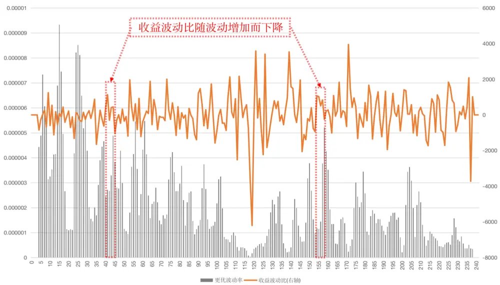
资料来源：Wind，方正证券研究所

上图红色方框中，当波动率提高时，收益波动比随之下降，表明了投资者对这些波动的感知不敏锐，没有及时给予足够的风险补偿，故而收益率没有随之上升。

我们将对上述构建的“月均重建”因子、“月稳重建”因子以及“灾后重建”因子进行单因子测试，在全 A 样本中按照月度频率进行测试，测试中对因子进行市值和行业正交化处理，测试区间为 2013年 4月至2022年 2月（下同），各因子表现如下所示。

图表2： “灾后重建”因子测试

| 因子名称 | Rank IC | Rank ICIR | t值 | 年化收益率 | 年化波动率 | 信息比率 | 月度胜率 | 最大回撤 |
| --- | --- | --- | --- | --- | --- | --- | --- | --- |
| 月均重建因子 | -4.96% | -2.53 | -7.49 | 13.41% | 7.91% | 1.70 | 70.75% | -7.90% |
| 月稳重建因子 | -5.49% | -2.21 | -6.53 | 17.75% | 10.32% | 1.72 | 67.92% | -8.33% |
| 灾后重建因子 | -6.02% | -2.56 | -7.58 | 18.34% | 10.61% | 1.73 | 73.58% | -8.57% |

资料来源：Wind，方正证券研究所

从测试结果来看，“月均重建”因子、“月稳重建”因子以及“灾后重建”因子 Rank IC 虽然较高，分别为-4.96%、-5.49%、-6.02%。但Rank ICIR 则普遍较低，只有-2.5 左右，表明该因子表现不够稳定，其分组表现如下图所示。

图表3： “月均重建”因子十分组及多空对冲净值走势
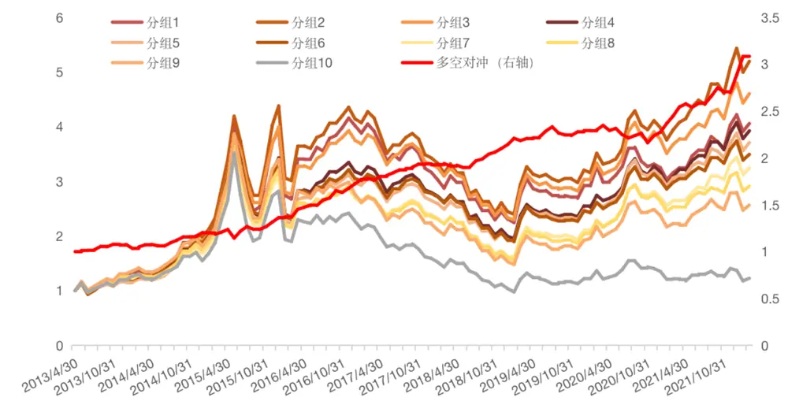
资料来源：Wind，方正证券研究所

图表4： “月稳重建”因子十分组及多空对冲净值走势
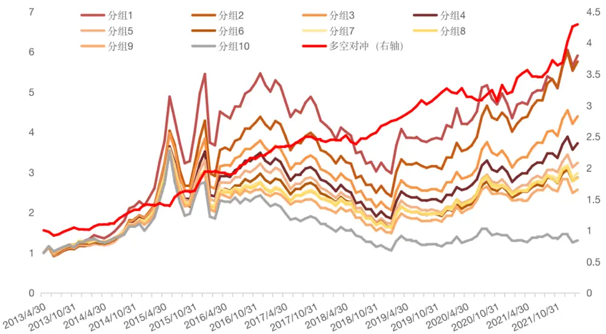
资料来源：Wind，方正证券研究所

图表5： “灾后重建”因子十分组及多空对冲净值走势
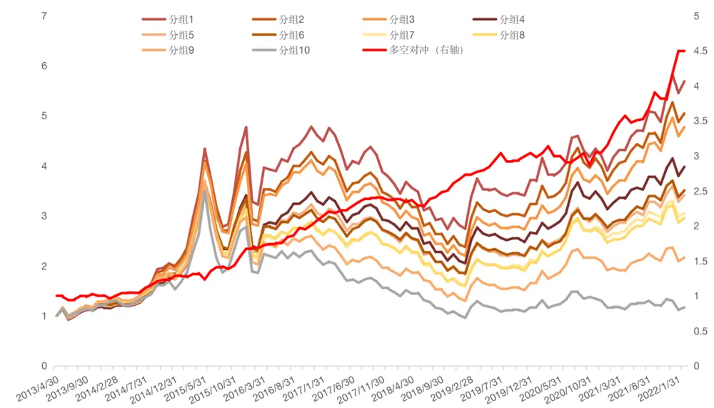
资料来源：Wind，方正证券研究所

## 3 “勇攀高峰”因子构建及其选股效应测试

## 3.1 异常高波动下的充足风险补偿

Moreira 和 Muir（2017）在论文中也提到了另一条逻辑，即当波动非常大时，人们的风险厌恶快速变大。因此，当对于波动异常高的时段，那些能给异常高波动及时提供风险补偿的股票，展现出了非凡的能力，以至于投资者有理由相信，这种向好的势头将会长期持续。

基于上述逻辑，我们认为，那些波动异常高的同时，也伴随着超高的收益的股票，虽然看起来风险加剧、股价位于高位，像是一座险峻巍峨的高山，让人望而却步。但事实上，在此情此景下，只有敢于勇攀高峰的人，才能抓住这些真正利好的股票，分享其未来持续发展所带来的丰厚回报。因此，我们将依据这一逻辑构建的因子，称为“勇攀高峰”因子。

## 3.2 “勇攀高峰”因子的定义

“勇攀高峰”因子的构造方式与“灾后重建”因子几乎一致，不同之处仅在于：“灾后重建”因子计算的是全天233分钟的协方差，而“勇攀高峰”因子仅计算了每天波动异常高的那些分钟的协方差。依据前述逻辑，“勇攀高峰”因子应当为正向因子，因子值越大越好，具体构建过程如下：

1）仅考虑日内，剔除开盘和收盘部分的信息。计算每分钟的“更优波动率”和收益波动比，计算当日“更优波动率”的均值 mean 和标准差 std。

2）找到当日所有“更优波动率”大于等于mean+std的部分，作为当日波动率异常高的时段。

3）计算异常高波动时段的收益波动比与“更优波动率”的协方差，作为股票对异常高波动提供的风险补偿多少的代理变量。

4）每月末分别计算最近 20天的协方差的均值和标准差，得到“月均攀登”因子和“月稳攀登”因子，并最终将二者等权合成“勇攀高峰”因子。

图表6： 股票A日内收益波动比随波动增加而上升示意图
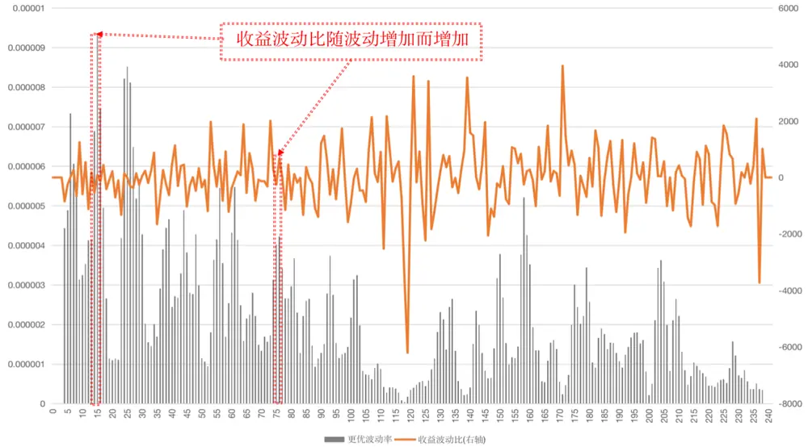
资料来源：Wind，方正证券研究所

上图红色方框中，在波动率异常高的部分，当波动率提高时，收益波动比随之上升，表明了异常的波动，得到了充足的风险补偿。

我们将对上述构建的“月均攀登”因子、“月稳攀登”因子以及“勇攀高峰”因子进行单因子测试。

图表7： “勇攀高峰”因子测试

| 因子名称 | Rank IC | Rank ICIR | t值 | 年化收益率 | 年化波动率 | 信息比率 | 月度胜率 | 最大回撤 |
| --- | --- | --- | --- | --- | --- | --- | --- | --- |
| 月均攀登因子 | 3.94% | 4.21 | 12.45 | 13.76% | 5.08% | 2.71 | 79.25% | -3.56% |
| 月稳攀登因子 | -6.06% | -4.02 | -11.9 | 18.75% | 6.24% | 3.01 | 82.08% | -4.94% |
| 勇攀高峰因子 | 5.62% | 4.47 | 13.22 | 19.76% | 5.72% | 3.45 | 83.02% | -3.60% |

资料来源：Wind，方正证券研究所

图表8： “勇攀高峰”因子十分组绩效

| 因子名称 | 累积收益率 | 年化收益率 | 年化波动率 | 信息比率 | 月度胜率 | 最大回撤 |
| --- | --- | --- | --- | --- | --- | --- |
| 分组1 | 20.47% | 2.13% | 30.34% | 0.07 | 49.06% | -70.62% |
| 分组2 | 77.56% | 16.71% | 29.58% | 0.23 | 50.94% | -63.49% |
| 分组3 | 189.57% | 12.78% | 28.95% | 0.44 | 54.72% | -55.98% |
| 分组4 | 238.22% | 14.78% | 28.77% | 0.51 | 52.83% | -51.23% |
| 分组5 | 268.94% | 15.92% | 28.08% | 0.57 | 55.66% | -48.31% |
| 分组6 | 275.47% | 16.15% | 28.05% | 0.58 | 53.77% | -45.76% |
| 分组7 | 243.12% | 14.97% | 28.42% | 0.53 | 55.66% | -50.80% |
| 分组8 | 382.68% | 19.50% | 28.46% | 0.69 | 57.55% | -42.53% |
| 分组9 | 412.46% | 20.31% | 29.01% | 0.70 | 55.66% | -46.34% |
| 分组10 | 522.24% | 22.98% | 29.72% | 0.77 | 57.55% | -43.45% |

资料来源：Wind，方正证券研究所

从测试结果来看，“月均攀登”因子、“月稳攀登”因子以及“勇攀高峰”因子均表现出强势的选股能力，Rank IC 分别为 3.94%、-6.06%、5.62%。与“灾后重建”因子形成鲜明对比的是，“勇攀高峰”因子的 Rank ICIR 都较高，分别达到 4.21、-4.02、4.47。表明该因子表现足够稳定，其分组表现如下图所示。

图表9： “月均攀登”因子十分组及多空对冲净值走势
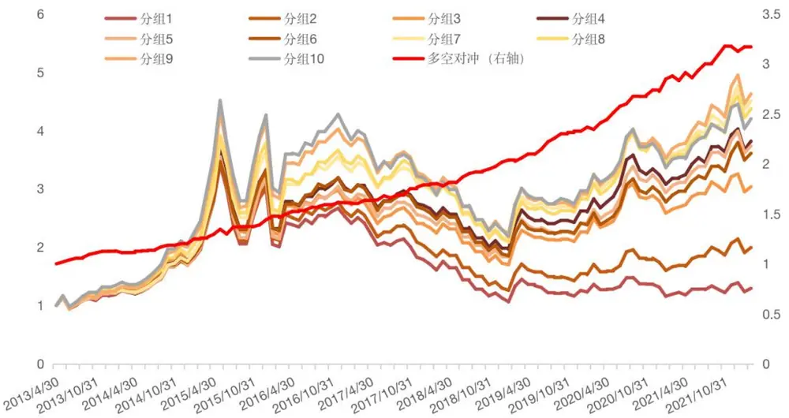
资料来源：Wind，方正证券研究所

图表10：“月稳攀登”因子十分组及多空对冲净值走势
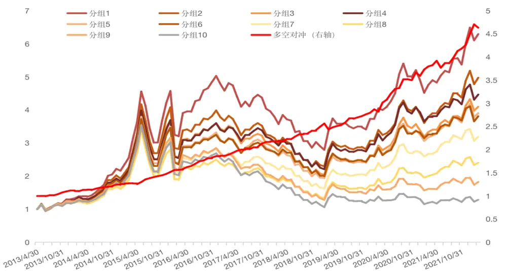
资料来源：Wind，方正证券研究所

图表11：“勇攀高峰”因子十分组及多空对冲净值走势
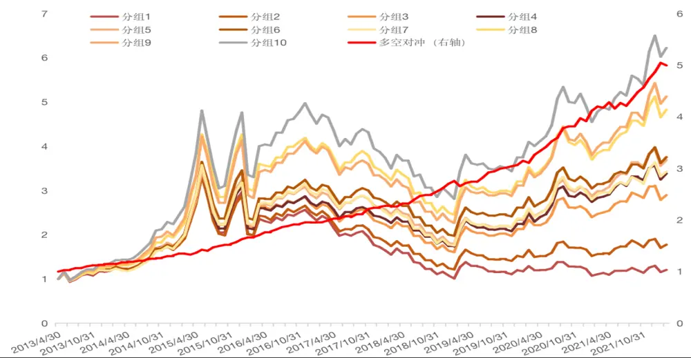
资料来源：Wind，方正证券研究所

分年度来看，“勇攀高峰”因子各年份表现均较为显著，各年份各分组表现整体单调性较为明显。

图表12：“勇攀高峰”分年度表现

|  | 年份 | 分组1 | 分组2 | 分组3 分组4 分组5 |  |  | 分组6 | 分组7 | 分组8 | 分组9 | 分组10 | 多空组合 |
| --- | --- | --- | --- | --- | --- | --- | --- | --- | --- | --- | --- | --- |
|  | 2013年 | 15.91% | 19.09% | 23.76% | 24.49% | 23.37% | 22.36% | 19.08% | 26.35% | 29.01% | 32.37% | 14.67% |
|  | 2014年 | 48.10% | 39.12% | 41.42% | 37.18% | 37.95% | 40.41% | 41.03% | 53.27% | 53.69% | 69.15% | 14.57% |
|  | 2015年 | 72.25% | 73.73% | 84.12% | 81.13% | 90.26% | 100.92% | 89.00% | 120.34% | 108.66% | 112.65% | 23.95% |
|  | 2016年 | -17.59% | -12.58% | -16.49% | -12.24% | -10.30% | -11.19% | -6.64% | -6.40% | -4.92% | -0.81% | 19.79% |
|  | 2017年 | -29.34% | -23.73% | -15.29% | -11.31% | -10.12% | -8.44% | -12.25% | -13.19% | -15.38% | -17.98% | 15.54% |
|  | 2018年 | -37.35% | -35.22% | -28.15% | -27.49% | -30.43% | -28.74% | -31.58% | -28.02% | -29.92% | -24.06% | 19.83% |
|  | 2019年 | 11.09% | 22.38% | 29.94% | 28.52% | 28.75% | 30.62% | 32.84% | 28.37% | 33.39% | 27.39% | 13.44% |
|  | 2020年 | 2.10% | 9.50% | 20.55% | 28.45% | 29.13% | 23.17% | 25.34% | 24.08% | 31.69% | 30.79% | 27.77% |
|  | 2021年 | 6.09% | 14.24% | 21.16% | 23.86% | 30.25% | 23.52% | 22.84% | 28.90% | 32.46% | 32.62% | 24.27% |
| 2022年 |  | -7.18% | -6.71% | -6.86% | -5.25% | -6.19% | -5.55% | -5.71% | -5.79% | -5.58% | -4.26% | 2.66% |

资料来源：Wind，方正证券研究所

## 3.3 “更优波动率”的优越性

接下来，我们从逻辑和结果两方面来验证使用“更优波动率”替代普通波动率指标的优越性。

从逻辑上来说，“更优波动率”同时考虑了开盘价、最高价、最低价、收盘价这四个价格信息，如果股价在一分钟内，发生了先大幅上涨、后大幅下跌、最终回归至上一分钟收盘价的情况，此处的最高价和最低价将捕捉到这一信息。而仅以分钟收盘价来计算的波动率（记为“收盘波动率”，下同）将遗漏这一信息。因此“更优波动率”包含了更多信息，更适合用来刻画股价波动。

图表13：股票A更优波动率与收盘波动率对比图
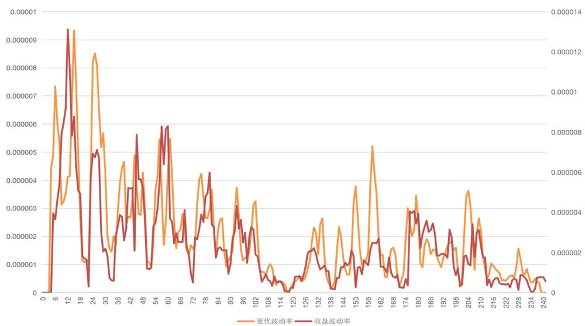
资料来源：Wind，方正证券研究所

上图中展示了股票A 某日“更优波动率”与“收盘波动率”，可以看到，“更优波动率”与“收盘波动率”总体走势相近，这表明“更优波动率”具有刻画波动的能力；而“更优波动率”在某些时刻的差别，则表现出了“更优波动率”在捕捉分钟内价格变动时的优越性。从结果来看，我们将“勇攀高峰”因子中的“更优波动率”替换为“收盘波动率”，其余步骤不变，构造出“月均攀登”因子 2、“月稳攀登”因子2、“勇攀高峰”因子 2，并分别进行单因子测试。

图表14：“勇攀高峰”因子 2测试

| 因子名称 | Rank IC | Rank ICIR | t值 | 年化收益率 | 年化波动率 | 信息比率 | 月度胜率 | 最大回撤 |
| --- | --- | --- | --- | --- | --- | --- | --- | --- |
| 月均攀登因子2 | 3.03% | 3.91 | 11.56 | 8.86% | 4.33% | 2.05 | 72.64% | -3.31% |
| 月稳攀登因子2 | -5.41% | -3.62 | -10.72 | 18.12% | 6.87% | 2.64 | 80.19% | -4.01% |
| 勇攀高峰因子2 | 5.10% | 4.18 | 12.37 | 16.59% | 5.30% | 3.13 | 84.91% | -2.84% |

资料来源：Wind，方正证券研究所

从测试结果来看，“月均攀登”因子2、“月稳攀登”因子2 以及“勇攀高峰”因子 2虽然均表现出较为不俗的选股能力，Rank IC 分别为3.03%、-5.41%、5.1%。但与使用“更优波动率”计算的“月均攀登”因子、“月稳攀登”因子、“勇攀高峰”因子相比，其 Rank IC、RankICIR、年化收益率、信息比率等指标都有所下降，其分组表现如下图所示。

图表15：“月均攀登”因子 2十分组及多空对冲净值走势
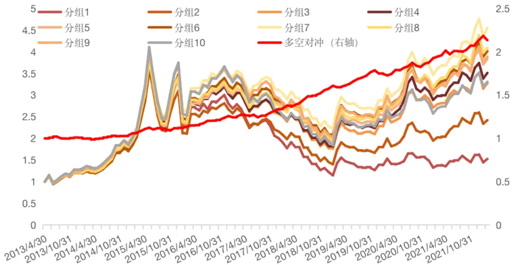
资料来源：Wind，方正证券研究所

图表16：“月稳攀登”因子 2十分组及多空对冲净值走势
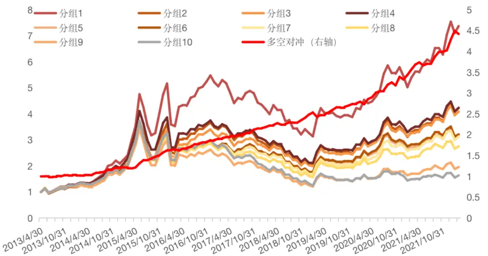
资料来源：Wind，方正证券研究所

图表17：“勇攀高峰”因子 2十分组及多空对冲净值走势
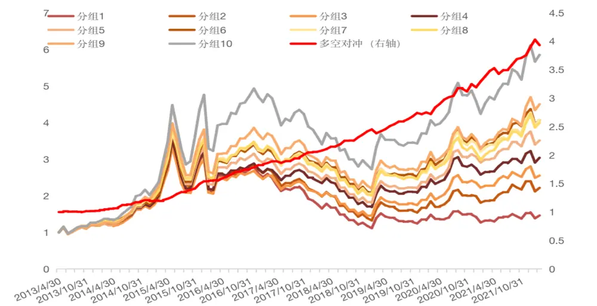
资料来源：Wind，方正证券研究所

## 3.4 剥离其他风格因子影响后“勇攀高峰”因子仍然表现较好

从上述测试结果来看，“勇攀高峰”因子选股能力出色，进一步，我们测试其与其他常见风格因子的相关性，如下图所示，“勇攀高峰”因子与各个风格因子的相关系数绝对值均在 20%以下。为进一步验证因子的增量信息，我们使用常用风格因子及行业因子对“勇攀高峰”因子进行正交化处理，得到“纯净勇攀高峰”因子，再检验其选股能力。

图表18：与常见风格因子相关性测试
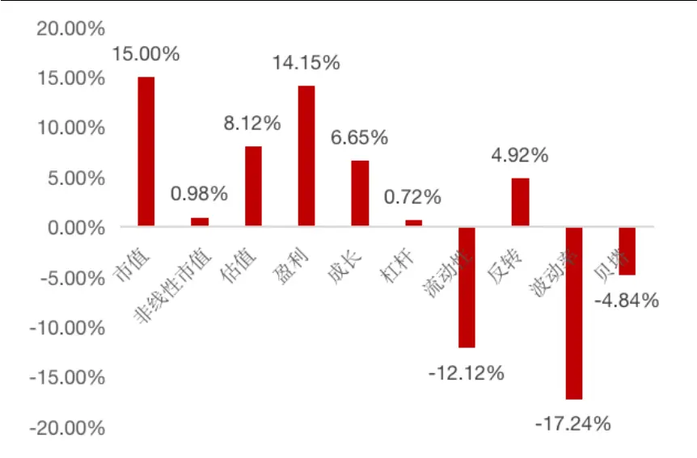
资料来源：Wind，方正证券研究所

图表19：剥离常见风格因子影响后“勇攀高峰”因子绩效

| 因子名称 | Rank IC | Rank ICIR | t值 | 年化收益率 | 年化波动率 | 信息比率 | 月度胜率 | 最大回撤 |
| --- | --- | --- | --- | --- | --- | --- | --- | --- |
| 纯凈勇攀高峰因子 | 1.95% | 1.61 | 4.77 | 9.04% | 5.96% | 1.52 | 66.98% | -4.58% |

资料来源：Wind，方正证券研究所

可以看到，在剔除了常用的风格因子影响后，“勇攀高峰”因子仍然具有一定的选股能力，Rank IC 均值为 1.95%，Rank ICIR 为 1.61，多空组合年化收益率9.04%，信息比率1.52。

图表20：“纯净勇攀高峰”因子十分组及多空对冲净值走势
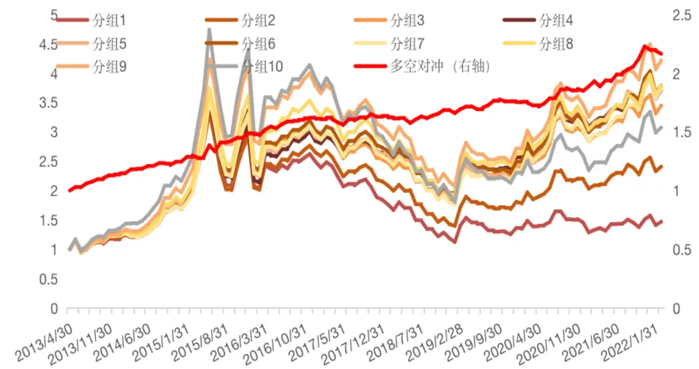
资料来源：Wind，方正证券研究所

## 3.5 “勇攀高峰”因子在不同样本空间下的表现

为了检验“勇攀高峰”因子在其他样本空间下的选股表现，我们分别选取了沪深 300 成分股、中证 500 成分股、中证 1000 成分股作为股票池，测试其选股能力，相较而言，中证 1000 指数成分股内表现更为出色，其 Rank IC 为 3.46%，Rank ICIR 为 3.35，多头组合年化超额收益达 8.67%。

图表21：不同样本空间下“勇攀高峰”因子表现

| 样本空间 | Rank IC | Rank ICIR | t值 | 年化收益率 | 年化波动率 | 信息比率 | 月度胜率 | 最大回撤 |
| --- | --- | --- | --- | --- | --- | --- | --- | --- |
| 沪深300成分股 | 2.37% | 1.24 | 3.68 | 10.25% | 10.42% | 0.98 | 59.43% | -15.28% |
| 中证500成分股 | 3.15% | 1.82 | 5.38 | 9.85% | 8.47% | 1.16 | 63.21% | -8.72% |
| 中证1000成分股 | 3.46% | 3.35 | 9.91 | 11.87% | 5.89% | 2.01 | 78.30% | -5.02% |

资料来源：Wind，方正证券研究所

图表22：不同样本空间下“勇攀高峰”因子多头超额表现

| 样本空间 | 累积收益率 | 年化收益率 | 年化波动率 | 信息比率 | 月度胜率 | 最大回撤 |
| --- | --- | --- | --- | --- | --- | --- |
| 沪深300多头超额 | 1.64% | 0.19% | 12.05% | 0.02 | 48.11% | -32.59% |
| 中证500多头超额 | 72.02% | 6.39% | 7.98% | 0.80 | 56.60% | -13.10% |
| 中证1000多头超额 | 107.00% | 8.67% | 6.63% | 1.31 | 67.92% | -9.56% |

资料来源：Wind，方正证券研究所

图表23：沪深 300/中证 500/中证 1000指数成分股内多空表现
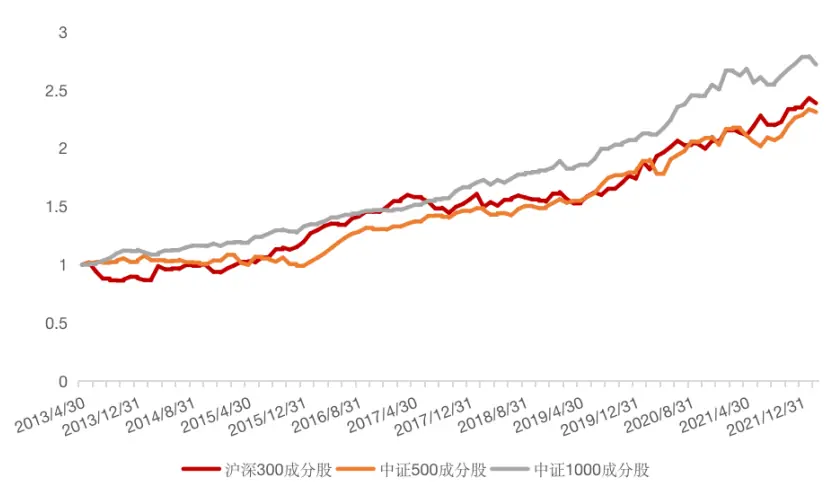
资料来源：Wind，方正证券研究所

图表24： 沪深 300/中证 500/中证 1000指数多头组合超额表现
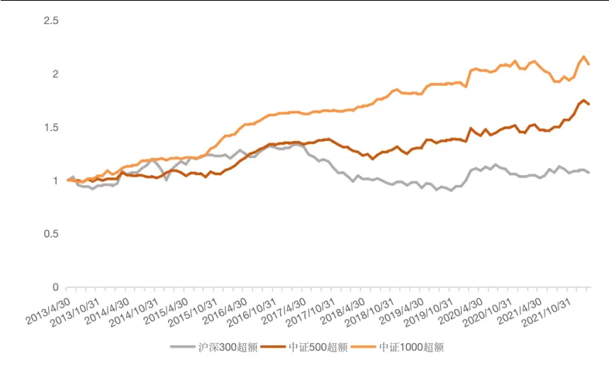
资料来源：Wind，方正证券研究所

## 4 风险提示

本报告基于历史数据分析，历史规律未来可能存在失效的风险；市场可能发生超预期变化；各驱动因子受环境影响可能存在阶段性失效的风险。

## 参考文献

[1] Moreira A, Muir T. Volatility‐managed portfolios[J]. The Journal of Finance, 2017, 72(4): 1611-1644.

[2] Lochstoer L A, Muir T. Volatility expectations and returns[J]. The Journal of Finance, 2022, 77(2): 1055-1096.

## 分析师声明

作者具有中国证券业协会授予的证券投资咨询执业资格，保证报告所采用的数据和信息均来自公开合规渠道，分析逻辑基于作者的职业理解，本报告清晰准确地反映了作者的研究观点，力求独立、客观和公正，结论不受任何第三方的授意或影响。研究报告对所涉及的证券或发行人的评价是分析师本人通过财务分析预测、数量化方法、或行业比较分析所得出的结论，但使用以上信息和分析方法存在局限性。特此声明。

## 免责声明

本研究报告由方正证券制作及在中国（香港和澳门特别行政区、台湾省除外）发布。根据《证券期货投资者适当性管理办法》，本报告内容仅供我公司适当性评级为C3及以上等级的投资者使用，本公司不会因接收人收到本报告而视其为本公司的当然客户。若您并非前述等级的投资者，为保证服务质量、控制风险，请勿订阅本报告中的信息，本资料难以设置访问权限，若给您造成不便，敬请谅解。

在任何情况下，本报告的内容不构成对任何人的投资建议，也没有考虑到个别客户特殊的投资目标、财务状况或需求，方正证券不对任何人因使用本报告所载任何内容所引致的任何损失负任何责任，投资者需自行承担风险。

本报告版权仅为方正证券所有，本公司对本报告保留一切法律权利。未经本公司事先书面授权，任何机构或个人不得以任何形式复制、转发或公开传播本报告的全部或部分内容，不得将报告内容作为诉讼、仲裁、传媒所引用之证明或依据，不得用于营利或用于未经允许的其它用途。如需引用、刊发或转载本报告，需注明出处且不得进行任何有悖原意的引用、删节和修改。

## 公司投资评级的说明：

强烈推荐：分析师预测未来半年公司股价有20%以上的涨幅；

推荐：分析师预测未来半年公司股价有10%以上的涨幅；

中性：分析师预测未来半年公司股价在-10%和10%之间波动；

减持：分析师预测未来半年公司股价有10%以上的跌幅。

## 行业投资评级的说明：

推荐：分析师预测未来半年行业表现强于沪深300指数；

中性：分析师预测未来半年行业表现与沪深300指数持平；

减持：分析师预测未来半年行业表现弱于沪深300指数。

| 地址 | 网址：https://www.foundersc.com | E-mail:yjzx@foundersc.com |
| --- | --- | --- |
| 北京 | 西城区展览馆路48号新联写字楼6层 |  |
| 上海 | 静安区延平路71号延平大厦2楼 |  |
| 上海 | 浦东新区世纪大道1168号东方金融广场 A 栋 1001 室 |  |
| 深圳 | 福田区竹子林紫竹七道光大银行大厦31层 |  |
| 广州 | 天河区兴盛路12号楼隽峰苑 2期3层方正证券 |  |
| 长沙 | 天心区湘江中路二段36号华远国际中心37层 |  |