# 方正证券研究所证券研究报告

[分析师：TABLE SISINFO 曹春晓]

金融工程研究

登记编号：S1220522030005

## 相关研究

[《成交量激增时刻蕴含的TABLE_REPORTINFO] alpha 信息—— 多 因 子 选 股 系 列 研 究 之 一 》2022.04.12

《个股成交量的潮汐变化及“潮汐”因子构建——多因子选股系列研究之二》2022.05.08

《个股波动率的变动及“勇攀高峰”因子构建——多因子选股系列研究之三》2022.05.30

2022.06.11

## 投资要点

在股票市场中，动量效应和反转效应是一对普遍存在的现象，大量学术文献对主要国家和地区的股票市场实证研究中均证实了其有效性。在 A 股市场中，总体上反转效应更为明显。然而遗憾的是，传统反转因子的表现却差强人意，甚至一度失效。从个股角度来看，由于部分股票在月度频率上呈现的是动量效应，正是这些动量效应的存在，削弱了传统反转因子的效果。因此，如何有效识别个股的动量效应，并将其因子值加以翻转，使其成为名副其实的反转因子，是改进传统反转因子表现的重要途径之一。

Moskowitz（2021）论述了当人们抛一枚硬币时，如果上次抛出了正面，人们倾向于猜测下次会是反面，这是因为人们对抛硬币这件活动本身比较了解，因此会以“反转”的眼光来看待“抛硬币”；而当一个新赛季开始时，如果猜测哪只球队会夺冠，由于人们对新赛季的球队成员和磨合等不是很了解，因此只能以这些球队的历史成绩来考察它们，此时人们会猜测上赛季的冠军，依旧将在本赛季夺冠，即人们会以“动量”的眼光来判断“谁会夺冠”。

然而上述理论应用于股票时，却总是事与愿违。由于投资者对动量和反转的预期，会导致其在提前采取行动时反应过度，从而使预期发生“动量”的股票实际可能发生反转，预期发生“反转”的股票实际可能发生动量。我们据此逻辑构造了“球队硬币”因子。

我们对“球队硬币”因子在月度频率上的选股效果进行测试，结果显示 “球队硬币”因子表现非常出色，Rank IC达-9.67%，Rank ICIR 为-4.73，多空组合年化收益率达 39.69%，信息比3.95，因子月度胜率 85.14%。此外，在剔除了常用的风格因子影响后，“球队硬币”因子仍然具有较强的选股能力，Rank IC均值为-4.35%，Rank ICIR 为-2.98，多空组合年化收益率22.27%，信息比率 2.75。

主流宽基指数中，“球队硬币”因子在沪深300、中证500、中证 1000指数成分股内均表现不俗，多头组合年化超额收益分别为 5.86%、12.12%、16.55%。

## 风险提示

本报告基于历史数据分析，历史规律未来可能存在失效的风险；市场可能发生超预期变化；各驱动因子受环境影响可能存在阶段性失效的风险。

感谢实习生陈宗伟在资料整理方面对本报告的贡献。

## 1 引言

在股票市场中，动量效应和反转效应是一对普遍存在的现象，大量学术文献对主要国家和地区的股票市场实证研究中均证实了其有效性。在A 股市场中，总体上反转效应更为明显。然而遗憾的是，传统反转因子的表现却差强人意，甚至一度失效。

下图展示了传统反转因子在沪深 300和中证500指数成分股中，多头组合的超额表现，可以看到自 2017年以来，反转因子表现相对较差。

图表1： 传统动量因子在沪深300/中证500指数多头组合超额表现
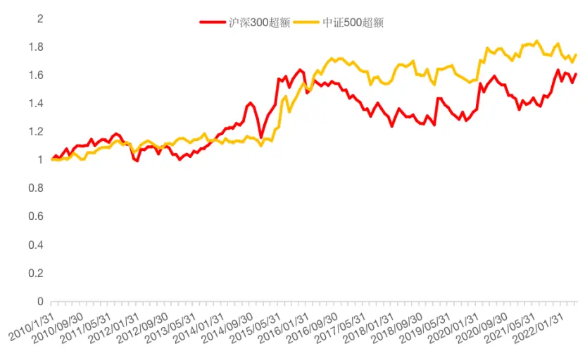
资料来源：Wind，方正证券研究所

从个股角度来看，由于部分股票在月度频率上呈现的是动量效应，正是这些动量效应的存在，削弱了传统反转因子的效果。因此，如何有效识别个股的动量效应，并将其因子值加以翻转，使其成为名副其实的反转因子，是改进传统反转因子表现的重要途径之一。

本文中我们将使用日度开盘价、收盘价和换手率等数据，分别从日间涨跌幅、日内涨跌幅和隔夜涨跌幅的角度考察，通过简单的变换，在三种维度上都实现了对传统反转因子的明显改进，并最终构建了“球队硬币”因子。“球队硬币”因子的选股能力和稳定性远超常规的日频量价因子，甚至超过了大部分分钟数据构造的选股因子。

## 2 “球队硬币”因子构建及其选股效应测试

## 2.1 个股的动量效应统计

在日常的因子研究中，我们常常在每月月底计算过去 20 个交易日收益率的均值，将其作为反转因子，在对传统反转因子做分组回测时，Rank IC 均值为负，表明当月传统反转因子值与下月股票收益率整体为负相关关系，即总体上呈现“反转效应”。但该因子近年来表现走弱，说明在反转中可能夹杂了大量的“动量效应”。

为了考察个股动量效应出现的频次和比例，我们首先对个股发生的是动量效应还是反转效应做出判断，具体方式为：

1）我们先计算每一期所有个股的传统反转因子值和下一期的收益率。

2）计算所有个股传统反转因子值的截面均值，以及下一期所有个股

的收益率的截面均值。

3）我们将每一期个股的传统反转因子的因子值和下一期的收益率值，都分别减去各自的截面均值，得到每只股票每一期的超额因子值，以及下一期的超额收益率。

4）我们比较超额因子值与超额收益率的符号，如果二者正负号一致，则认为个股出现了“动量效应”，如果二者正负号相反，则认为个股出现了“反转效应”。

接下来，为了进一步量化，我们设计“净动量比例”这一指标。我们每月月底依据上述定义，对个股出现动量效应和反转效应的频次加以统计，我们将出现动量效应的股票数量减去出现反转效应的股票数量，再除以横截面的总股票数量，得到原始日间“净动量比例”。

我们通过构建类似于Rank IC 和Rank ICIR 的评价指标，来衡量动量效应或反转效应每一期在个股中分布的相对强度，以及该效应的稳定程度。我们首先将“净动量比例”取时序均值，得到“均净动量比例”。再将“均净动量比例”除以“净动量比例”的时序标准差，得到“稳净动量比例”。

基于以上定义，我们给出如下判断：

1）当“均净动量比例”大于0时，表明动量效应在个股中更加普遍，且其值越大，表示动量效应分布越普遍；反之，当“均净动量比例”小于0时，表明反转效应在个股中更加普遍，且其绝对值越大，表示反转效应分布越普遍。

2）当“均净动量比例”大于0时，“稳净动量比例”的绝对值越大，表明动量效应在个股中更加普遍且更稳定；当“均净动量比例”小于0 时，“稳净动量比例”的绝对值越大，表明反转效应在个股中更加普遍且更稳定。

3）因此，我们希望经过改进可以将“均净动量比例”变为负数，并尽可能降低“均净动量比例”的大小，提高“稳净动量比例”的绝对值，以此来增强反转效应的表现。

图表2： 原始日间“净动量比例”时序变化图
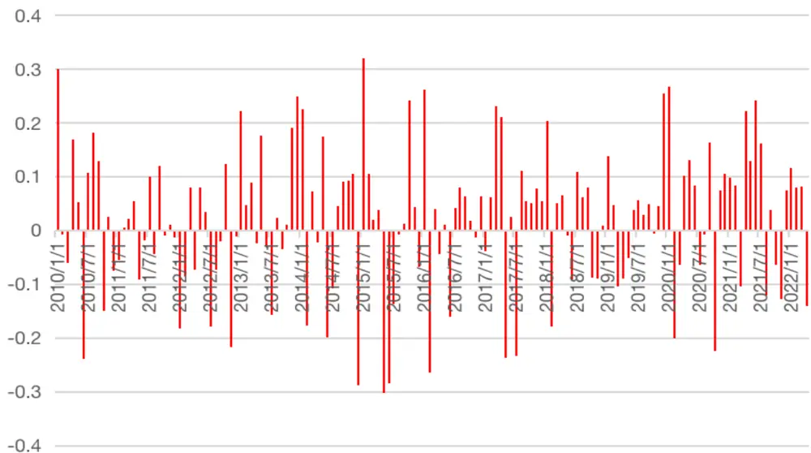

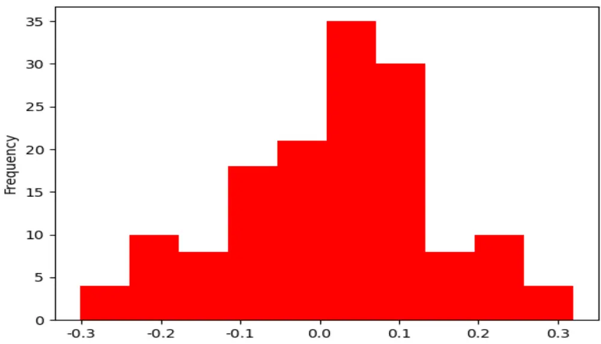
资料来源：Wind，方正证券研究所

上图展示了原始日间“净动量比例”随时间变化和在各区间分布频率的情况，可以看到，原始日间“净动量比例”在约 55.7%的时间里是大于0的，表明动量效应在个股中分布相对较为普遍。此时“均净动量比例”为0.38%，“稳净动量比例”为 3.42%。

## 2.2 “可知性”

Moskowitz（2021）论述了当人们抛一枚硬币时，如果上次抛出了正面，人们倾向于猜测下次是反面，这是因为人们对抛硬币这件活动本身比较了解，对于其发生的概率比较确定，即“抛硬币”这件事的“可知性”较高，因此人们会以“反转”的眼光来看待“抛硬币”；而当一个新赛季开始时，如果让人们猜测哪只球队会夺冠，由于人们对新赛季的球队、球队的成员和团队磨合等不是很了解，即“冠军是谁”这件事的“可知性”较低，因此只能以这些球队的历史成绩来考察它们，此时人们更倾向于猜测上赛季的冠军，依旧会在本赛季夺冠，总结来说，人们会以“动量”的眼光来看待“球队夺冠”。

## 2.3 “可知性”与过度买卖

然而当上述逻辑应用于股票时，却常常事与愿违，具体而言：

1）当投资者将某只股票视为“球队”时，认为其将来会发生动量效应，因此，如果该股票最近上涨，投资者认为它未来会继续上涨，就会超买它，进而导致其未来股价出现回落；反之，如果该股票最近下跌，投资者认为它未来会继续下跌，就会纷纷抛售超卖，导致其未来补涨。因此那些被视为“球队”的股票，最终可能实际发生的是反转效应。

2）当投资者将某只股票视为“硬币”时，认为其将来会发生反转效应，因此，如果该股票最近上涨，投资者认为它未来会转为下跌，就会超卖，进而导致其未来补涨；反之，如果该股票最近下跌，人们认为它未来会转为上涨，就会超买，进而导致其股价未来回落。因此那些被视为“硬币”的股票，最终可能实际发生的是动量效应。

因此判断一只股票将发生动量效应还是反转效应的核心，就变成了判断一支股票是“硬币”还是“球队”，即判断一支股票走势的“可知性”。

对于这一判断标准，在 Moskowitz（2021）的论文中，给出的指标是依据公司是否发布了业绩预告，即认为发布了业绩预告的公司，其“可知性”就会提高，投资者对于其未来走势就有了清晰的判断。本文我们选择用交易类指标作为划分的标准，对日间涨跌幅、日内涨跌幅和隔夜涨跌幅进行改进，以期得到更为理想的选股效果。

具体而言，我们认为波动率和换手率的变化量可以代表一支股票表现的“可知性”，即更像硬币还是更像球队。波动率低，表明股价走势相对稳定，投资者对其未来趋势做出判断也更加容易，而换手率降低，则表示投资者对股票的意见分歧逐渐减少，也是“可知性”提高的表现。

总结来说，波动率低的股票和换手率下降的股票，“可知性”更高，属于硬币类型的股票，未来发生动量效应的概率更大；波动率高的股票和换手率增长的股票，“可知性”更低，属于球队类型的股票，未来发生反转效应的概率更大。

## 2.4 “日间反转-波动翻转”因子的定义

在对传统反转因子改进之前，我们先对传统反转因子的计算方式和绩效表现加以简单说明：

1）此处我们使用日间收益率计算反转因子，即使用t日收盘价除以t-1日的收盘价再减 1。

2）每月月底，计算过去 20 个交易日的日间收益率的平均值，记为本月的传统反转因子。

在全A样本中按照月度频率对反转因子进行测试，测试中对因子进行市值和行业正交化处理，测试区间为2010 年1 月至2022 年5 月（下同）。

图表4： 传统反转因子测试

| 因子名称 | Rank IC | Rank ICIR | t值 | 年化收益率 | 年化波动率 | 信息比率 | 月度胜率 | 最大回撤 |
| --- | --- | --- | --- | --- | --- | --- | --- | --- |
| 传统反转因子 | -6.53% | -2.30 | -8.06 | 24.36% | 14.48% | 1.68 | 68.92% | -14.43% |

资料来源：Wind，方正证券研究所

接下来，我们构建“日间反转-波动翻转”因子，基于上节内容，我们使用月波动率指标，在月频维度上寻找可能发生动量效应的股票，并将其传统反转因子的因子值翻转过来。具体做法如下：

1）每天计算所有股票的日间收益率。

2）每月月底计算最近20天的日间收益率的均值和标准差，作为当月的日间收益率和日间波动率。

3）比较每只股票的日间波动率与市场截面均值的大小关系，将日间波动率小于市场均值的股票，视为“硬币”型股票，由于未来其发生动量效应的概率更大，因此我们将其当月日间收益率乘以-1；而日间波动率大于市场均值的股票，视为“球队”型股票，其未来将发生反转效应的概率更大，其因子值保持不变。我们将变换后的因子作为修正后的新反转因子，记为“日间反转-波动翻转”因子。

在检验改进因子有效性之前，我们先考察当月“日间反转-波动翻转”因子的截面超额值与下月超额收益率正负号的一致性，用于衡量此方法对动量效应的识别能力。仿照上述定义，如果“日间反转-波动翻转”因子的截面超额值与下月超额收益率的正负号相同，则表明股票发生了“动量效应”，如果“日间反转-波动翻转”因子的截面超额值与下月超额收益率的正负号不同，则表明股票发生了“反转效应”。我们使用相同的计算方法，计算其“净动量比例”、“均净动量比例”与“稳净动量比例”。

图表5： 波动翻转日间“净动量比例”时序变化图
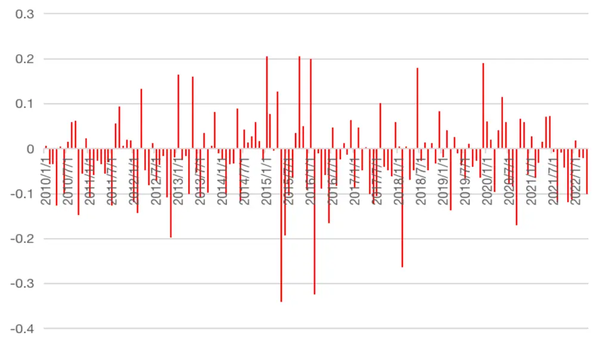
资料来源：Wind，方正证券研究所

图表6： 波动翻转日间“净动量比例”频次分布图
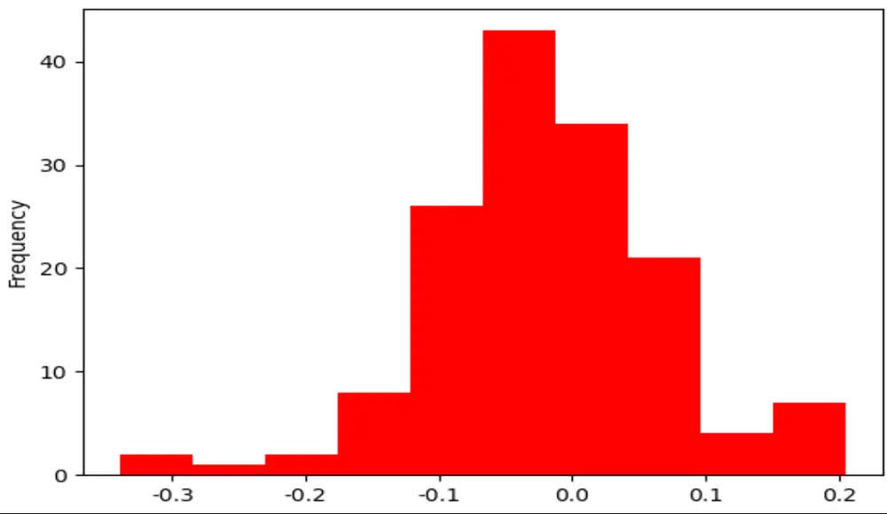
资料来源：Wind，方正证券研究所

上图展示了波动翻转日间“净动量比例”随时间变化和在各区间分布频率的情况，可以看到，波动翻转日间“净动量比例”在约 31.54%的时间里，是大于0的，表明经过修正后，反转效应在个股中分布相对更普遍，即我们成功地识别出一些发生动量效应的个股。

此时“均净动量比例”为-2.69%，“稳净动量比例”为-32.85%，表明我们修正后的新反转因子，表现更为稳健。我们对“日间反转-波动翻转”因子进行月频上的选股效果测试，该因子表现如下所示。

图表7： “日间反转-波动翻转”因子测试

| 因子名称 | Rank IC Rank ICIR |  | t值 | 年化收益率 | 年化波动率 | 信息比率 | 月度胜率 | 最大回撤 |
| --- | --- | --- | --- | --- | --- | --- | --- | --- |
| 日间反转-波动翻转因子 | -5.53% | -2.94 | -10.3 | 20.12% | 9.53% | 2.11 | 77.03% | -8.23% |

资料来源：Wind，方正证券研究所

从测试结果来看，“日间反转-波动翻转”因子 Rank IC 为-5.53%，Rank ICIR 为-2.94，相比于传统反转因子，改进效果明显，其分组表现如下图所示。

图表8： “日间反转-波动翻转”因子十分组及多空对冲净值走势
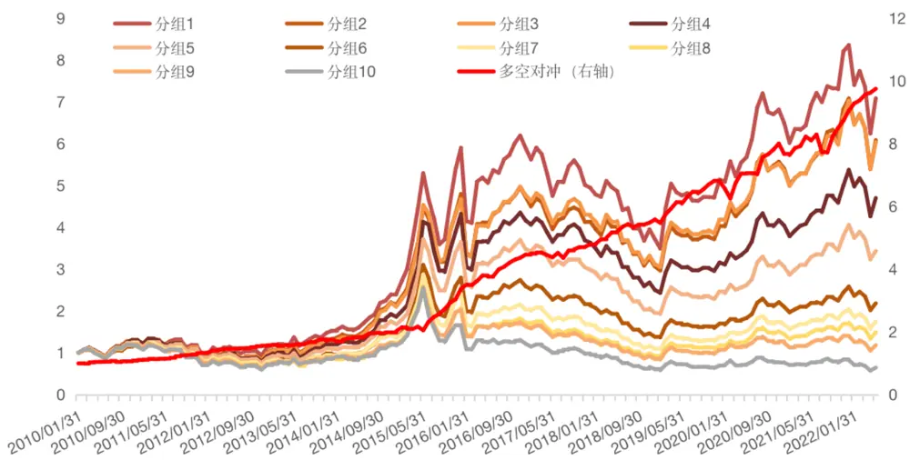
资料来源：Wind，方正证券研究所

## 2.5 “日间反转-换手翻转”因子的定义

接下来我们使用换手率的变化量这一指标，在日频维度上，寻找可能发生动量效应的股票，并将其这一天的日间涨跌幅翻转过来。

1）计算每支股票 t 日换手率与 t-1 日换手率的差值，作为 t 日换手率的变化量。

2）将每只股票的换手率变化量与当日全市场的换手率变化量的均值做比较，我们认为换手率变化量高于市场均值的股票为“球队”型股票，其未来将大概率发生反转效应；换手率变化量低于市场均值的，为“硬币”股票，未来将大概率发生动量效应。

3）我们计算每只股票t日的日间收益率，将“硬币”型股票的日间收益率乘以-1，而“球队”型股票的日间收益率保持不变。记变化后的日间收益率为“翻转收益率”。

4）每月月底，计算最近20天的“翻转收益率”的均值，我们将变换后的因子作为经修正后的新反转因子，记为本月的“日间反转-换手翻转”因子。

我们首先考察当月“日间反转-换手翻转”因子的截面超额值与下月超额收益率正负号的一致性，用于衡量此方法对动量效应的识别能力。仿照上述定义，如果“日间反转-换手翻转”因子的截面超额值与下月超额收益率的正负号相同，则表明股票发生了“动量效应”，如果“日间反转-换手翻转”因子的截面超额值与下月超额收益率的正负号不同，则表明股票发生了“反转效应”。我们使用相同的计算方法，计算其“净动量比例”、“均净动量比例”与“稳净动量比例”。

图表9： 换手翻转日间“净动量比例”时序变化图
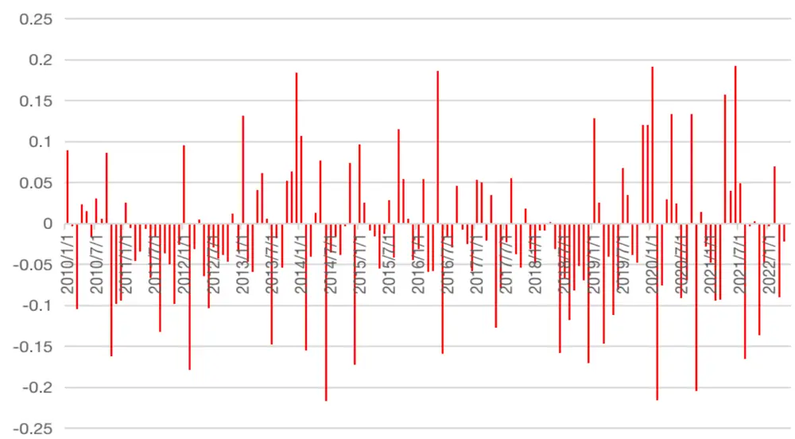
资料来源：Wind，方正证券研究所

图表10：换手翻转日间“净动量比例”频次分布图
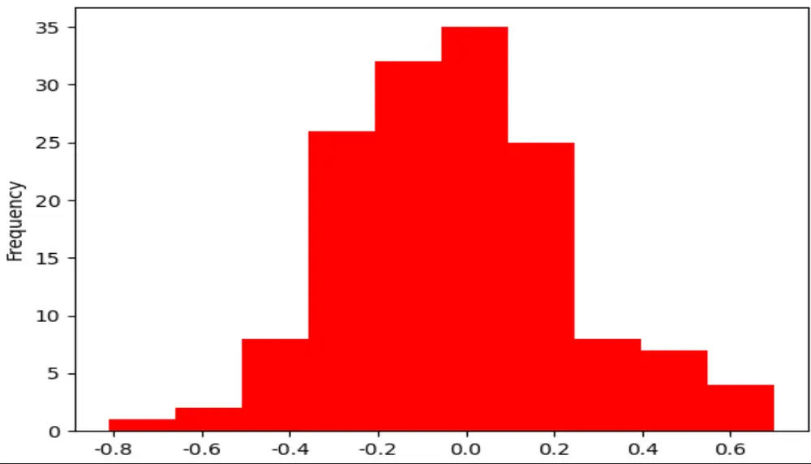
资料来源：Wind，方正证券研究所

上图展示了换手翻转日间“净动量比例”随时间变化和在各区间分布频率的情况，可以看到，考察当月“日间反转-换手翻转“因子的截面超额值与下月超额收益率之间的正负号一致性的“净动量比例”，在约41.61%的时间里，是大于0 的，表明经过修正后，反转效应在个股中分布相对更普遍，即我们成功地识别出一些发生动量效应的个股。

此时“均净动量比例”为-1.56%，“稳净动量比例”为-19.18%，表明我们修正后的新反转因子表现更加稳健。我们将对上述构建的“日间反转-换手翻转”因子在月度频率进行选股效果测试，结果如下所示。

图表11：“日间反转-换手翻转”因子测试

| 因子名称 | Rank IC | Rank ICIR | t值 | 年化收益率年化波动率 | 信息比率 |  | 月度胜率 | 最大回撤 |
| --- | --- | --- | --- | --- | --- | --- | --- | --- |
| 日间反转-波动翻转因子 | -8.10% | -4.25 | -14.88 | 29.91% | 8.61% | 3.47 | 81.08% | -8.68% |

资料来源：Wind，方正证券研究所

从测试结果来看，“日间反转-换手翻转”因子 Rank IC 达-8.10%，Rank ICIR 为-4.25，相比于传统反转因子，改进效果明显，其分组表现如下图所示。

图表12：“日间反转-换手翻转”因子十分组及多空对冲净值走势
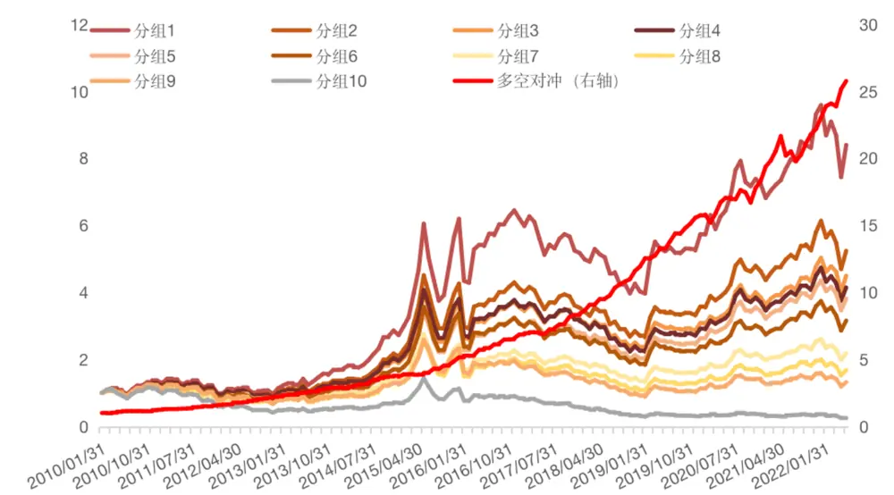
资料来源：Wind，方正证券研究所

## 2.6 “修正日间反转”因子的定义

我们将上述构造的“日间反转-波动翻转”因子和“日间反转-换手翻转”因子等权合成，构造“修正日间反转”因子。同时从波动率和换手率的两个维度，识别可能发生动量效应的个股并进行修正，我们对“修正日间反转”因子在月度频率上进行选股效果测试。从测试结果来看，“修正日间反转”因子 Rank IC 达-8.77%，Rank ICIR 为-4.64，相比于传统反转因子，改进效果非常明显。

图表13：“修正日间反转”因子测试

| 因子名称 | Rank IC | Rank ICIR | t值 |  | 年化收益率年化波动率 | 信息比率 | 月度胜率 | 最大回撤 |
| --- | --- | --- | --- | --- | --- | --- | --- | --- |
| 修正日间反转因子 | -8.77% | -4.64 | -16.25 | 34.19% | 9.60% | 3.56 | 83.11% | -9.38% |

资料来源：Wind，方正证券研究所

图表14：“修正日间反转”因子十分组及多空对冲净值走势
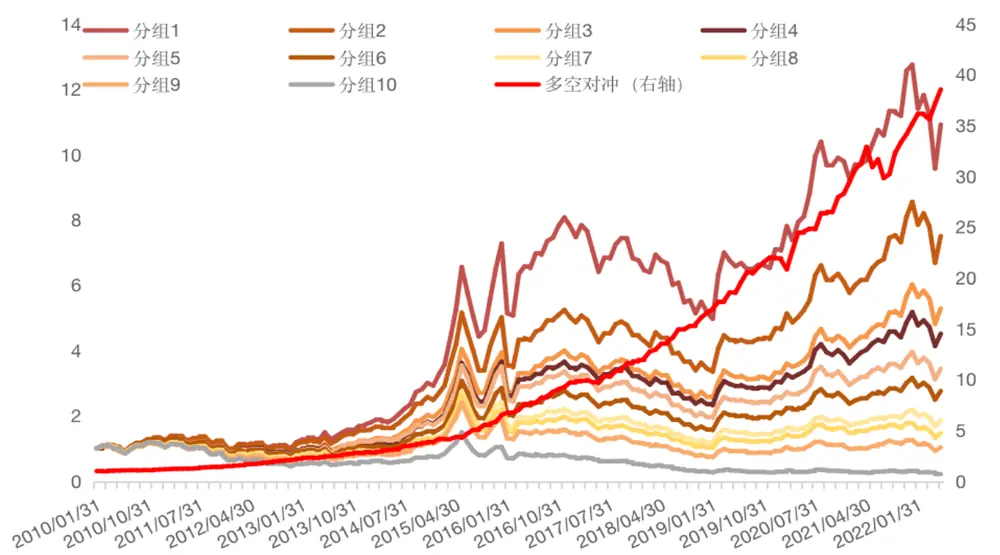
资料来源：Wind，方正证券研究所

## 2.7 “日内反转-波动翻转”因子的定义

接下来，我们按照日内收益率来计算和修正反转因子，为了明确比较基准，我们先对传统日内反转因子的计算方式和绩效表现加以简单说明，计算方式为：

1）计算每只股票 t 日的日内收益率，即使用 t日收盘价除以 t日的开盘价后减1。

2）每月月底，计算过去20个交易日的日内收益率的平均值，记为本月的传统日内反转因子。

我们对传统日内反转因子，在全A 样本中按照月度频率进行测试，测试中对因子进行市值和行业正交化处理，测试区间为 2010 年 1 月至2022 年 5 月。

图表15：传统日内反转因子测试

| 因子名称 | Rank IC | Rank ICIR | t值 | 年化收益率 | 年化波动率 | 信息比率 | 月度胜率 | 最大回撤 |
| --- | --- | --- | --- | --- | --- | --- | --- | --- |
| 传统日内反转因子 | -6.93% | -2.69 | -9.42 | 26.52% | 11.91% | 2.23 | 75.00% | -13.75% |

资料来源：Wind，方正证券研究所

接下来，我们仿照对日间涨跌幅的考察方式，以及“日间反转-波动翻转”因子、“日间反转-换手翻转”因子和“修正日间反转”因子的构造方式，构建相似的“日内反转-波动翻转”因子、“日内反转-换手翻转”因子和“修正日内反转”因子。由于前文已经列举了大量“净动量比例”的定义、原始分布与改进后的分布等内容，后文对此不再赘述，仅展示必要的因子构造步骤和回测效果。

我们首先构造“日内反转-波动翻转”因子，具体过程如下。

1）每天计算每只股票的日内收益率。

2）每月月底计算最近20 天的日内收益率的均值和标准差，作为当月

的日内收益率和日内收益率的波动率。

3）比较每只股票的日内收益率的波动率与市场截面均值的大小关系，将日内收益率的波动率小于市场均值的股票，视为“硬币”型股票，其未来发生动量效应的概率更大，因此我们将其当月日内收益率乘以-1；而日内收益率的波动率大于市场均值的股票，视为“球队”型股票，其未来将发生反转效应的概率更大，其当月日内收益率保持不变。我们将变换后的因子作为修正后的新日内反转因子，记为“日内反转-波动翻转”因子，其在月度频率上的表现如下：

图表16：“日内反转-波动翻转”因子测试

| 因子名称 | Rank IC | Rank ICIR | t值 | 年化收益率 | 年化波动率 | 信息比率 | 月度胜率 | 最大回撤 |
| --- | --- | --- | --- | --- | --- | --- | --- | --- |
| 日内反转-波动翻转因子 | -5.50% | -3.23 | -11.32 | 20.82% | 7.18% | 2.90 | 80.41% | -6.59% |

资料来源：Wind，方正证券研究所

从测试结果来看，“日内反转-波动翻转”因子 Rank IC 为-5.50%，Rank ICIR 为-3.23，相比于传统日内反转因子，改进效果明显，其分组表现如下图所示。

图表17：“日内反转-波动翻转”因子十分组及多空对冲净值走势
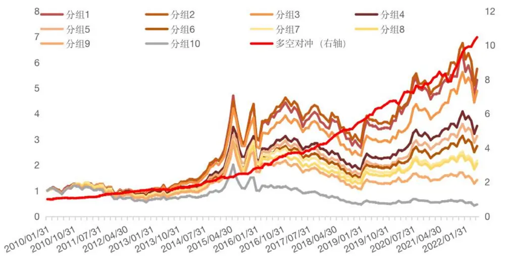
资料来源：Wind，方正证券研究所

## 2.8 “日内反转-换手翻转”因子的定义

我们继续构造“日内反转-换手翻转”因子，具体过程如下。

1）计算每支股票 t 日换手率与 t-1 日换手率的差值，作为 t 日换手率的变化量。

2）将每只股票的换手率变化量与当日所有股票的换手率变化量的均值做比较，我们认为换手率变化量高于市场均值的，为“球队”股票，未来将发生反转；换手率变化量低于市场均值的，为“硬币”股票，未来将发生动量。

3）我们计算每只股票t日的日内收益率，将“硬币”型股票的日内收益率乘以-1，而“球队”型股票的日内收益率不变。记变化后的日内收益率为“翻转日内收益率”。

4）每月月底，计算最近20天的“翻转日内收益率”的均值，我们将变换后的因子作为修正后的新日内反转因子，记为本月的“日内反转-换手翻转”因子，其在月度频率上的表现如下：

图表18：“日内反转-换手翻转”因子测试

| 因子名称 | Rank IC | Rank ICIR | t值 | 年化收益率 | 年化波动率 | 信息比率 | 月度胜率 | 最大回撤 |
| --- | --- | --- | --- | --- | --- | --- | --- | --- |
| 日内反转-换手翻转因子 | -6.77% | -3.93 | -13.77 | 23.48% | 7.60% | 3.09 | 84.46% | -8.29% |

资料来源：Wind，方正证券研究所

从测试结果来看，“日内反转-换手翻转”因子 Rank IC 达-6.77%，RankICIR 为-3.93，相比于传统日内反转因子，改进效果明显。

图表19：“日内反转-换手翻转”因子十分组及多空对冲净值走势
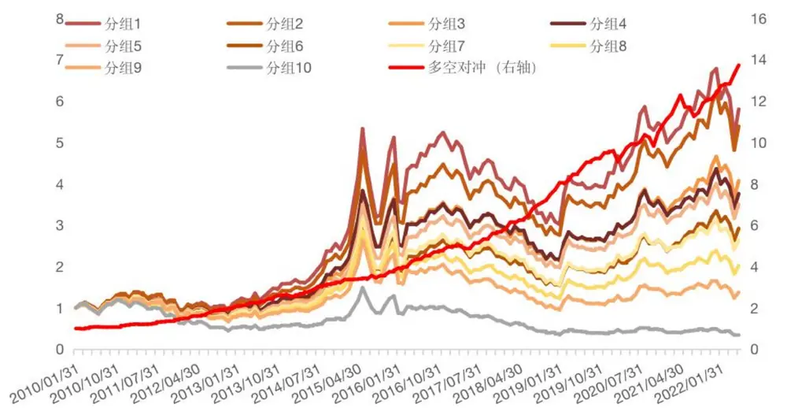
资料来源：Wind，方正证券研究所

## 2.9 “修正日内反转”因子的定义

我们将上述构造的“日内反转-波动翻转”因子和“日内反转-换手翻转”因子等权合成，构造“修正日内反转”因子。同时从波动率和换手率两个维度，识别可能发生动量效应的个股并进行修正。我们对“修正日内反转”因子在月度频率上进行选股效果测试，从测试结果来看，“修正日内反转”因子 Rank IC 达-7.50%，Rank ICIR 为-4.18，相比于传统日内反转因子，改进效果较为明显。

图表20：“修正日内反转”因子测试

| 因子名称 | Rank IC | Rank ICIR | t值 | 年化收益率 | 年化波动率 | 信息比率 | 月度胜率 | 最大回撤 |
| --- | --- | --- | --- | --- | --- | --- | --- | --- |
| 修正日内反转因子 | -7.50% | -4.18 | -14.64 | 30.25% | 7.91% | 3.82 | 84.46% | -7.39% |

资料来源：Wind，方正证券研究所

图表21：“修正日内反转”因子十分组及多空对冲净值走势
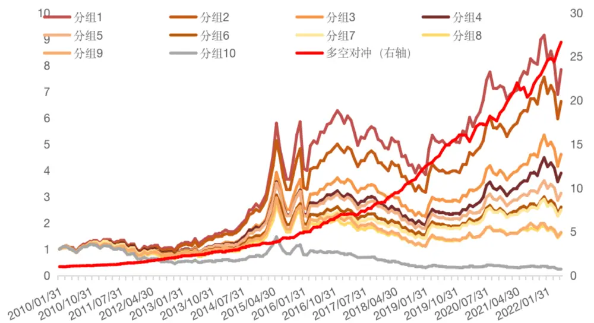
资料来源：Wind，方正证券研究所

## 2.10“隔夜距离”因子的定义

除日间收益率、日内收益率外，隔夜收益率也受到投资者较高的关注，我们参考传统日间反转因子构建方式，构建传统隔夜涨跌因子：

1）计算每只股票 t 日的隔夜收益率，即使用 t 日开盘价除以 t-1 日的收盘价再减 1。

2）每月月底，计算过去20个交易日的隔夜收益率的平均值，记为本月的传统隔夜涨跌因子，并对其在全 A 样本中按照月度频率进行测试，其绩效表现为：

图表22：传统隔夜涨跌因子测试

| 因子名称 | Rank IC | Rank ICIR | t值 | 年化收益率 | 年化波动率 | 信息比率 | 月度胜率 | 最大回撤 |
| --- | --- | --- | --- | --- | --- | --- | --- | --- |
| 传统隔夜涨跌因子 | 2.36% | 1.80 | 6.32 | 7.56% | 7.21% | 1.05 | 64.86% | -19.15% |

资料来源：Wind，方正证券研究所

接下来，我们仿照对日间涨跌幅和日内涨跌幅的考察方式，以及上述六个因子的构造方式，并结合隔夜涨跌幅的特性，构建相似的“隔夜反转-波动翻转”因子、“隔夜反转-换手翻转”因子和“修正隔夜反转”因子。

在构造因子之前，我们先就隔夜涨跌幅的特性略加讨论。隔夜涨跌幅是一个“两边差，中间好”的因子，其逻辑通常可以解释为，开盘集合竞价里，不论方向，所有报价过于激进的交易者，都存在发生反应过度的风险。因此开盘时平静开盘是最好的。

基于上述逻辑，我们对隔夜涨跌幅进行第一步改进——均值距离化。即我们认为，隔夜涨跌幅的市场平均水平是最平静的，因此我们计算每只个股的隔夜涨跌幅与市场平均水平的差值，然后取绝对值，表示这只个股与“最平静”之间的距离，并将其记为“隔夜距离”因子。

以下为“隔夜距离”因子在月度频率上选股效果的测试结果：

图表23：“隔夜距离”因子测试

| 因子名称 | Rank IC | Rank ICIR | t值 | 年化收益率 | 年化波动率 | 信息比率 | 月度胜率 | 最大回撤 |
| --- | --- | --- | --- | --- | --- | --- | --- | --- |
| 隔夜距离因子 | -6.48% | -2.86 | -10 | 18.95% | 10.50% | 1.8 | 72.30% | -10.08% |

资料来源：Wind，方正证券研究所

从测试结果来看，“隔夜距离”因子 Rank IC 达-6.48%，Rank ICIR为-2.86，相比于传统隔夜涨跌因子，改进效果明显，但其仍有较大改进空间，其分组表现如下图所示。

图表24：“隔夜距离”因子十分组及多空对冲净值走势
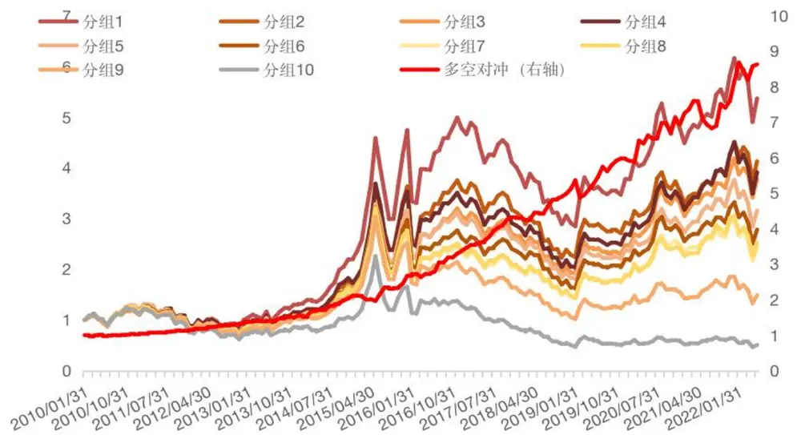
资料来源：Wind，方正证券研究所

## 2.11“隔夜反转-波动翻转”因子的定义

我们首先构造“隔夜反转-波动翻转”因子，具体过程如下。

1）每天计算每只股票的“隔夜距离”。

2）每月月底计算最近20天的隔夜距离的均值和标准差，作为当月的“隔夜距离”和“隔夜距离波动率”。

3）比较每只股票的“隔夜距离波动率”与市场截面均值的大小关系，将“隔夜距离波动率”小于市场均值的股票，视为“硬币”型股票，其未来发生动量效应的概率更大，因此我们将其当月“隔夜距离”取相反数；而“隔夜距离波动率”大于市场均值的股票，视为“球队”型股票，其未来将发生反转效应的概率更大，因此其当月“隔夜距离”保持不变。我们将变换后的因子作为经修正后的新隔夜反转因子，记为“隔夜反转-波动翻转”因子。

图表25：“隔夜反转-波动翻转”因子测试

| 因子名称 | Rank IC | Rank ICIR | 值 | 年化收益率 | 年化波动率 | 信息比率 | 月度胜率 | 最大回撤 |
| --- | --- | --- | --- | --- | --- | --- | --- | --- |
| 隔夜反转-波动翻转因子 | -4.33% | -3.02 | -10.56 | 17.42% | 7.09% | 2.46 | 73.65% | -6.64% |

资料来源：Wind，方正证券研究所

从测试结果来看，“隔夜反转-波动翻转”因子 Rank IC 为-4.33%，RankICIR 为-3.02，相比于“隔夜距离”因子，有一定的改进效果。

图表26：“隔夜反转-波动翻转”因子十分组及多空对冲净值走势
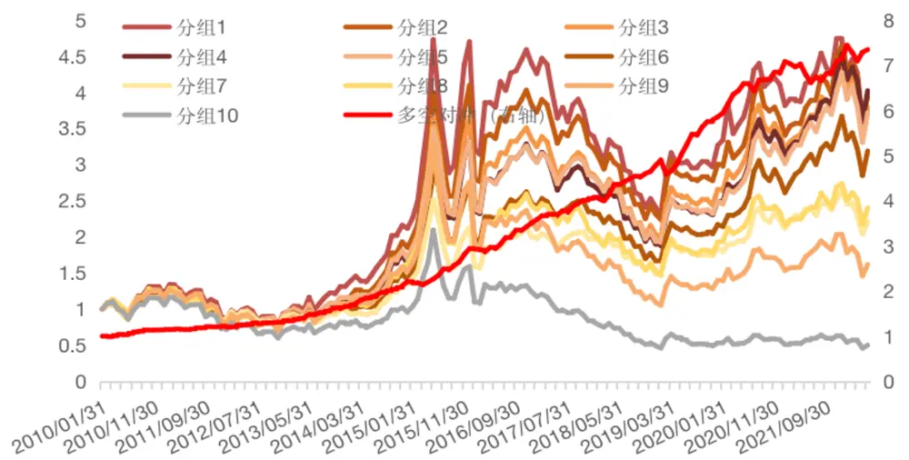
资料来源：Wind，方正证券研究所

## 2.12“隔夜反转-换手翻转”因子的定义

我们继续构造“隔夜反转-换手翻转”因子，具体过程如下。

1）计算每支股票 t-1日换手率与 t-2日换手率的差值，作为 t-1 日换手率的变化量，然后将该变化量均值距离化，即减去市场均值后再取绝对值，记为“换手距离”。这一步处理，与隔夜涨跌幅的逻辑类似，我们认为，t日开盘越平静越好，而从换手率维度来讲我们希望t-1日的换手率变化量越平静越好，这样的股票 t 日开盘受额外因素影响相对较小，其开盘将会趋于平静。

2）将每只股票的“换手距离”与当日所有股票的“换手距离”的均值做比较，我们认为“换手距离”高于市场均值的，为“球队”股票，未来将发生反转；“换手距离”低于市场均值的，为“硬币”股票，未来将发生动量。

3）我们计算每只股票t日的“隔夜距离”，将“硬币”型股票的“隔夜距离”乘以-1，而“球队”型股票的“隔夜距离”保持不变。记变化后的“隔夜距离”为“翻转隔夜距离”。

4）每月月底，计算最近20天的“翻转隔夜距离”的均值，我们将变换后的因子作为经修正后的新隔夜反转因子，记为本月的“隔夜反转-换手翻转”因子。

图表27：“隔夜反转-换手翻转”因子测试

| 因子名称 | Rank IC | Rank ICIR | t值 | 年化收益率 | 年化波动率 | 信息比率 | 月度胜率 | 最大回撤 |
| --- | --- | --- | --- | --- | --- | --- | --- | --- |
| 隔夜反转-换手翻转因子 | -7.40% | -3.78 | -13.25 | 28.44% | 9.47% | 3 | 79.05% | -5.76% |

资料来源：Wind，方正证券研究所

“隔夜反转-换手翻转”因子 Rank IC 达-7.40%，Rank ICIR 为-3.78，相比于“隔夜距离”因子，改进效果明显。

图表28：“隔夜反转-换手翻转”因子十分组及多空对冲净值走势
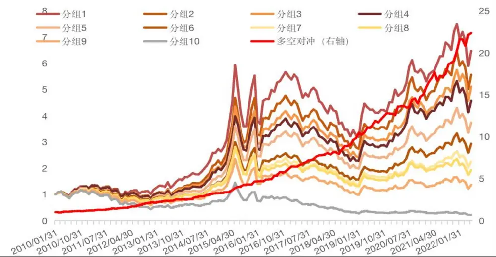
资料来源：Wind，方正证券研究所

## 2.13“修正隔夜反转”因子的定义

我们将上述构造的“隔夜反转-波动翻转”因子和“隔夜反转-换手翻转”因子等权合成，构造“修正隔夜反转”因子并进行因子测试，从测试结果来看，“修正隔夜反转”因子 Rank IC 达-7.55%，Rank ICIR为-4.04。

图表29：“修正隔夜反转”因子测试

| 因子名称 | Rank IC | Rank ICIR | t值 | 年化收益率 | 年化波动率 | 信息比率 | 月度胜率 | 最大回撤 |
| --- | --- | --- | --- | --- | --- | --- | --- | --- |
| 修正隔夜反转因子 | -7.55% | -4.04 | -14.16 | 28.54% | 9.75% | 2.93 | 78.38% | -6.71% |

资料来源：Wind，方正证券研究所

图表30：“修正隔夜反转”因子十分组及多空对冲净值走势
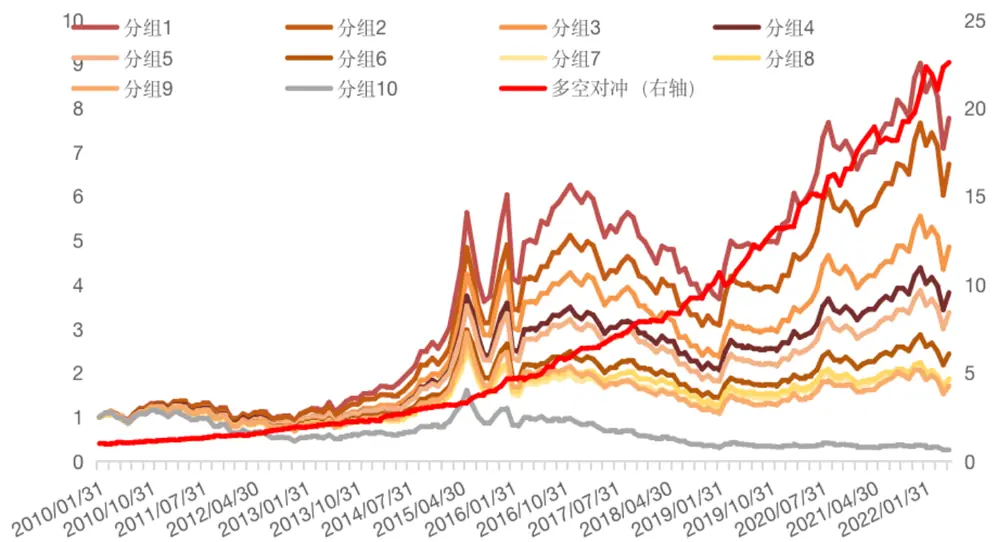
资料来源：Wind，方正证券研究所

## 2.14“球队硬币”因子的定义

我们将上述构造的“修正日间反转”因子、“修正日内反转”因子和“修正隔夜反转”因子等权合成，得到“球队硬币”因子。我们对“球队硬币”因子在月度频率上进行选股效果测试。

图表31：“球队硬币”因子测试

| 因子名称 | Rank IC | Rank ICIR | t值 | 年化收益率 | 年化波动率 | 信息比率 | 月度胜率 | 最大回撤 |
| --- | --- | --- | --- | --- | --- | --- | --- | --- |
| 球队硬币因子 | -9.67% | -4.73 | -16.58 | 39.69% | 10.06% | 3.95 | 85.14% | -7.58% |

资料来源：Wind，方正证券研究所

图表32：“球队硬币”因子十分组绩效

| 因子名称 | 累积收益率 | 年化收益率 | 年化波动率 | 信息比率 | 月度胜率 | 最大回撤 |
| --- | --- | --- | --- | --- | --- | --- |
| 分组1 | 1148.35% | 22.71% | 29.97% | 0.76 | 56.76% | -35.83% |
| 分组2 | 694.54% | 18.29% | 28.19% | 0.65 | 58.11% | -35.37% |
| 分组3 | 482.55% | 15.35% | 27.96% | 0.55 | 58.78% | -41.71% |
| 分组4 | 316.02% | 12.25% | 26.74% | 0.46 | 54.73% | -41.32% |
| 分组5 | 215.12% | 9.75% | 27.51% | 0.35 | 51.35% | -49.23% |
| 分组6 | 166.63% | 8.27% | 27.58% | 0.30 | 54.05% | -47.53% |
| 分组7 | 102.05% | 5.87% | 27.84% | 0.21 | 52.03% | -51.08% |
| 分组8 | 79.03% | 4.83% | 29.24% | 0.17 | 47.97% | -57.33% |
| 分组9 | 9.02% | 070% | 29.99% | 0.02 | 49.32% | -69.55% |
| 分组10 | -83.97% | -13.79% | 32.07% | -0.43 | 45.27% | -88.57% |

资料来源：Wind，方正证券研究所

从测试结果来看，“球队硬币”因子 Rank IC 达-9.67%，Rank ICIR为-4.73，年化收益率达 39.69%，信息比率高达 3.95，月度胜率为85.14%，选股效果优异，其分组表现如下图所示：

图表33：“球队硬币”因子十分组及多空对冲净值走势
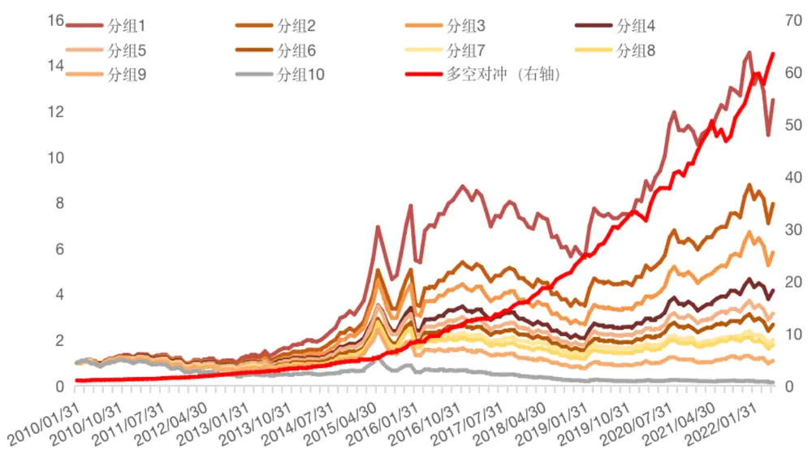
资料来源：Wind，方正证券研究所

分年度来看，“球队硬币”因子各年份表现均较为显著，各年份各分组表现整体单调性较为明显。

图表34：“球队硬币”分年度表现

| 年份 | 分组1 分组2 分组3 分组4 |  |  |  | 分组5 | 分组6 | 分组7 | 分组8 | 分组9 | 分组10 | 多空组合 |
| --- | --- | --- | --- | --- | --- | --- | --- | --- | --- | --- | --- |
| 2010年 | 33.43% | 28.68% | 26.78% | 25.91% | 22.02% | 16.60% | 21.80% | 17.14% | 18.72% | 6.23% | 24.13% |
| 2011年 | -26.76% | -24.59% | -25.80% | -27.22% | -28.99% | -32.88% | -33.72% | -35.55% | -36.59% | -44.10% | 29.00% |
| 2012年 | 23.00% | 11.79% | 5.73% | 5.50% | 7.33% | 4.09% | 0.90% | 0.18% | -1.90% | -21.45% | 54.08% |
| 2013年 | 51.94% | 36.68% | 29.61% | 24.41% | 21.30% | 24.86% | 14.60% | 22.67% | 18.85% | 9.79% | 38.60% |
| 2014年 | 70.36% | 60.86% | 66.99% | 47.02% | 48.02% | 40.15% | 40.43% | 35.93% | 35.85% | 24.17% | 37.67% |
| 2015年 | 152.65% | 112.35% | 105.08% | 92.36% | 87.46% | 93.31% | 90.29% | 94.68% | 64.81% | 39.82% | 74.38% |
| 2016年 | 7.77% | 2.85% | -4.11% | -4.15% | -8.86% | -7.24% | -12.03% | -18.11% | -22.07% | -30.05% | 50.53% |
| 2017年 | -14.28% | -10.82% | -11.52% | -11.44% | -12.63% | -13.00% | -12.06% | -17.09% | -21.28% | -34.14% | 29.30% |
| 2018年 | -20.44% | -23.34% | -27.55% | -27.67% | -28.37% | -29.89% | -28.73% | -28.83% | -35.58% | -48.04% | 49.95% |
| 2019年 | 40.29% | 33.64% | 32.26% | 30.61% | 31.63% | 29.89% | 26.43% | 28.19% | 23.01% | -0.12% | 37.81% |
| 2020年 | 37.12% | 31.51% | 32.93% | 29.59% | 25.09% | 23.39% | 16.32% | 21.21% | 15.14% | 3.38% | 29.43% |
| 2021年 | 30.89% | 40.11% | 40.64% | 31.74% | 26.32% | 25.12% | 18.82% | 15.96% | 18.76% | -3.56% | 32.99% |
| 2022年 | -14.18% | -9.39% | -13.17% | -10.65% | -15.15% | -14.72% | -15.92% | -16.25% | -16.54% | -24.39% | 11.64% |

资料来源：Wind，方正证券研究所

## 2.15 剥离其他风格因子影响后“球队硬币”因子仍然表现很好

从上述测试结果来看，“球队硬币”因子选股能力出色，进一步，我们测试其与其他常见风格因子的相关性，如下图所示，“球队硬币”因子与流动性和波动率因子相关性较高，与其余因子相关性均较低。为进一步验证因子的增量信息，我们使用常用风格因子及行业因子对“球队硬币”因子进行正交化处理，得到“纯净球队硬币”因子，再检验其选股能力。

图表35：与常见风格因子相关性测试
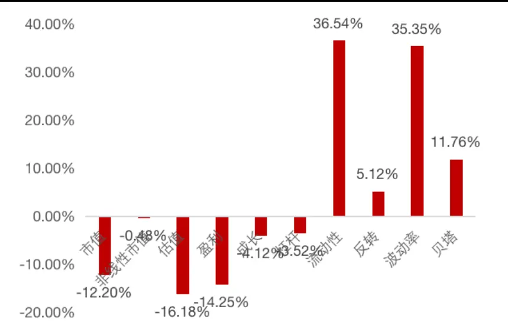
资料来源：Wind，方正证券研究所

图表36：剥离常见风格因子影响后“球队硬币”因子绩效

| 因子名称 | Rank IC | Rank ICIR | t值 | 年化收益率 |  | 年化波动率 | 信息比率 | 月度胜率 | 最大回撤 |
| --- | --- | --- | --- | --- | --- | --- | --- | --- | --- |
| 纯净球队硬币因子 |  | -4.35% | -2.98 | -10.40 | 22.27% | 8.08% | 2.75 | 72.79% | -9.92% |

资料来源：Wind，方正证券研究所

可以看到，在剔除了常用的风格因子影响后，“球队硬币”因子仍然具有很好的选股能力，Rank IC 均值为-4.35%，Rank ICIR 为-2.98，多空组合年化收益率22.27%，信息比率2.75。

图表37：“纯净球队硬币”因子十分组及多空对冲净值走势
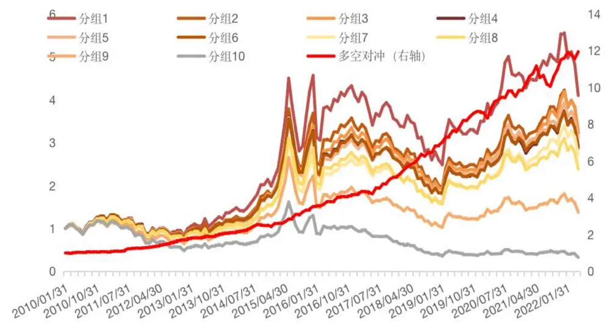
资料来源：Wind，方正证券研究所

## 2.16“球队硬币”因子在不同样本空间下的表现

为了检验“球队硬币”因子在其他样本空间下的选股表现，我们分别选取了沪深 300 成分股、中证 500 成分股、中证 1000 成分股作为股票池，测试其选股能力。可以看到，“球队硬币”因子在沪深 300、中证500、中证 1000指数成分股内均表现不俗，多头组合年化超额收益分别为 5.86%、12.12%、16.55%。

图表38：不同样本空间下“球队硬币”因子表现

| 样本空间 | Rank IC | Rank ICIR | t值 | 年化收益率 | 年化波动率 | 信息比率 | 月度胜率 | 最大回撤 |
| --- | --- | --- | --- | --- | --- | --- | --- | --- |
| 沪深300成分股 | -4.87% | -2.10 | -7.35 | 16.27% | 10.64% | 1.53 | 65.54% | -10.21% |
| 中证500成分股 | -7.14% | -3.40 | -11.90 | 22.19% | 11.22% | 1.98 | 75.68% | -17.02% |
| 中证1000成分股 | -9.41% | -4.22 | -11.55 | 35.84% | 11.28% | 3.18 | 82.42% | -11.20% |

资料来源：Wind，方正证券研究所

图表39：不同样本空间下“球队硬币”因子多头超额表现

| 样本空间 | 累积收益率 | 年化收益率 | 年化波动率 | 信息比率 | 月度胜率 | 最大回撤 |
| --- | --- | --- | --- | --- | --- | --- |
| 沪深300多头超额 | 101.11% | 5.86% | 11.66% | 0.50 | 58.78% | -17.27% |
| 中证500多头超额 | 306.64% | 12.12% | 7.00% | 1.73 | 72.97% | -4.65% |
| 中证1000多头超额 | 215.65% | 16.55% | 8.83% | 1.88 | 67.03% | -8.38% |

资料来源：Wind，方正证券研究所

图表40：沪深 300/中证 500/中证 1000指数成分股内多空表现
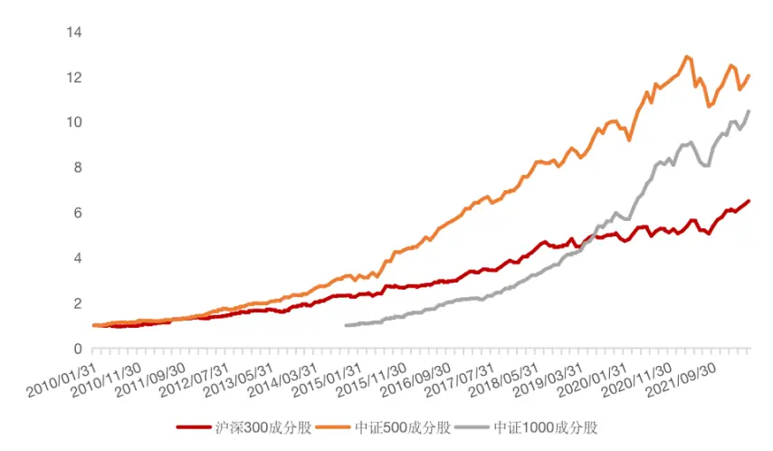
资料来源：Wind，方正证券研究所

图表41： 沪深 300/中证 500/中证 1000指数多头组合超额表现
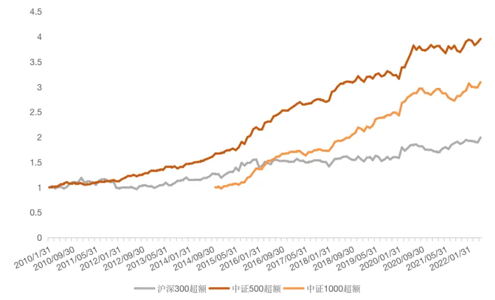
资料来源：Wind，方正证券研究所

## 3 风险提示

本报告基于历史数据分析，历史规律未来可能存在失效的风险；市场可能发生超预期变化；各驱动因子受环境影响可能存在阶段性失效的风险。

## 参考文献

[1] Moskowitz T J. Asset pricing and sports betting[J]. Journal of Finance, Forthcoming, 2021.

## 分析师声明

作者具有中国证券业协会授予的证券投资咨询执业资格，保证报告所采用的数据和信息均来自公开合规渠道，分析逻辑基于作者的职业理解，本报告清晰准确地反映了作者的研究观点，力求独立、客观和公正，结论不受任何第三方的授意或影响。研究报告对所涉及的证券或发行人的评价是分析师本人通过财务分析预测、数量化方法、或行业比较分析所得出的结论，但使用以上信息和分析方法存在局限性。特此声明。

## 免责声明

本研究报告由方正证券制作及在中国（香港和澳门特别行政区、台湾省除外）发布。根据《证券期货投资者适当性管理办法》，本报告内容仅供我公司适当性评级为C3及以上等级的投资者使用，本公司不会因接收人收到本报告而视其为本公司的当然客户。若您并非前述等级的投资者，为保证服务质量、控制风险，请勿订阅本报告中的信息，本资料难以设置访问权限，若给您造成不便，敬请谅解。

在任何情况下，本报告的内容不构成对任何人的投资建议，也没有考虑到个别客户特殊的投资目标、财务状况或需求，方正证券不对任何人因使用本报告所载任何内容所引致的任何损失负任何责任，投资者需自行承担风险。

本报告版权仅为方正证券所有，本公司对本报告保留一切法律权利。未经本公司事先书面授权，任何机构或个人不得以任何形式复制、转发或公开传播本报告的全部或部分内容，不得将报告内容作为诉讼、仲裁、传媒所引用之证明或依据，不得用于营利或用于未经允许的其它用途。如需引用、刊发或转载本报告，需注明出处且不得进行任何有悖原意的引用、删节和修改。

## 公司投资评级的说明：

强烈推荐：分析师预测未来半年公司股价有20%以上的涨幅；

推荐：分析师预测未来半年公司股价有10%以上的涨幅；

中性：分析师预测未来半年公司股价在-10%和10%之间波动；

减持：分析师预测未来半年公司股价有10%以上的跌幅。

## 行业投资评级的说明：

推荐：分析师预测未来半年行业表现强于沪深300指数；

中性：分析师预测未来半年行业表现与沪深300指数持平；

减持：分析师预测未来半年行业表现弱于沪深300指数。

| 地址 | 网址：https://www.foundersc.com | E-mail:yjzx@foundersc.com |
| --- | --- | --- |
| 北京 | 西城区展览馆路48号新联写字楼6层 |  |
| 上海 | 静安区延平路71号延平大厦2楼 |  |
| 上海 | 浦东新区世纪大道1168号东方金融广场 A 栋 1001 室 |  |
| 深圳 | 福田区竹子林紫竹七道光大银行大厦31层 |  |
| 广州 | 天河区兴盛路12号楼隽峰苑 2期3层方正证券 |  |
| 长沙 | 天心区湘江中路二段36号华远国际中心37层 |  |