# 方正证券研究所证券研究报告

[分析师：TABLE_ SISINFO 曹春晓]

登记编号：S1220522030005

## 相关研究

[《成交量激增时刻蕴含的TABLE_REPORTINFO] alpha 信息—— 多 因 子 选 股 系 列 研 究 之 一 》2022.04.12

《个股成交量的潮汐变化及“潮汐”因子构建——多因子选股系列研究之二》2022.05.08

《个股波动率的变动及“勇攀高峰”因子构建——多因子选股系列研究之三》2022.05.30

金融工程研究

《个股动量效应的识别及“球队硬币”因子构建——多因子选股系列之四》2022.06.11

《波动率的波动率与投资者模糊性厌恶——多因子选股系列研究之五》2022.08.04

2022.09.22

## 投资要点

博彩偏好，即投资者偏好具有博彩性质的股票，高估那些有较低概率获得高收益的股票的价值。在交易过程中，那些股价突然发生跳跃上涨的个股，会更容易吸引博彩偏好型投资者前来购买，犹如耀眼的火光更容易吸引飞蛾，然而这些突然跳跃上涨的个股，往往由于被过分关注而被超买，从而导致未来股价下跌，博彩偏好型投资者的结局也常常如扑火的飞蛾一般。相反，那些真正基本面向好、股价能够持续上涨的股票，其上涨的过程往往是均匀平缓非跳跃的，因此我们希望通过对股价变化过程的跳跃程度加以衡量，从而找出真正向好的股票。Jiang(2008)提出了一种衡量股价跳跃的方法，我们对其进行简化。本文的方法可以概括为，分别采用“单利”和“连续复利”两种方式计算单位时间内股票的收益率，然后比较这两种方法的差值，差值越大，表示股价在该时间内的跳跃程度越大。我们据此构造了“月跳跃度”因子。

更进一步，我们深入分析振幅因子吸引投资者的逻辑，并依据其日内是否包含了明显跳跃将个股的振幅分类为非跳跃的“太阳”型振幅和跳跃的“火把”型振幅，通过截面翻转对传统振幅因子进行修正。并仿制“跳跃度”因子的逻辑，使用日频最高价和最低价数据，同样翻转修复传统振幅因子，将二者合成得到“修正振幅”因子。最终我们将“月跳跃度”因子与“修正振幅”因子合成为“飞蛾扑火”因子。

我们对“飞蛾扑火”因子在月度频率上的选股效果进行测试，结果显示 “飞蛾扑火”因子表现非常出色，Rank IC达-8.90%，Rank ICIR 为-4.52，多空组合年化收益率达 37.30%，信息比3.51，因子月度胜率 87.83%。此外，在剔除了常用的风格因子影响后，“飞蛾扑火”因子仍然具有较强的选股能力，Rank IC均值为-5.03%，Rank ICIR 为-2.68，多空组合年化收益率23.35%，信息比率 2.46。

主流宽基指数中，“飞蛾扑火”因子在沪深300、中证500、中证1000指数成分股内均表现不俗，多头组合年化超额收益分别为 6.05%、8.48%、13.87%。

## 风险提示

本报告基于历史数据分析，历史规律未来可能存在失效的风险；市场可能发生超预期变化；各驱动因子受环境影响可能存在阶段性失效的风险。

感谢实习生陈宗伟在资料整理方面对本报告的贡献。

## 1 引言

股票市场中，由于利好或利空消息的不断到达，叠加投资者情绪的影响，股票价格经常会表现出突然的大幅波动。股价跳跃常常被用来描述和衡量这种价格的突然变动，这种突然的变动，因其大多数情况下由投资者的过度反应导致，而往往被认为是股价走势可能发生转折的征兆之一。

博彩偏好，即投资者偏好具有博彩性质的股票，高估那些有较低概率获得高收益的股票的价值。在交易过程中，那些股价突然发生跳跃上涨的个股，会更容易吸引博彩偏好型投资者前来购买，犹如耀眼的火光更容易吸引飞蛾，然而这些突然跳跃上涨的个股，往往由于被过分关注而被超买，从而导致未来股价下跌，博彩偏好型投资者的结局也常常如扑火的飞蛾一般。相反，那些真正基本面向好、股价能够持续上涨的股票，其上涨的过程往往是均匀平缓非跳跃的，因此我们希望通过对股价变化过程的跳跃程度加以衡量，从而找出真正向好的股票。

与股价跳跃相关的一个常用的量价类指标是传统振幅因子，其衡量了一天之内股价变化最大的幅度。但振幅仅仅刻画了价格变动的幅度，却对变化的过程未加区分，这也导致了传统振幅因子的效果不甚理想。

本文中我们将使用Jiang(2008)提出的方法，通过分钟数据，对个股每天的跳跃程度加以衡量，构造“月跳跃度”因子。随后我们使用“月跳跃度”因子，对不同类型的传统振幅因子加以区分，进而翻转修正传统振幅因子，并仿制“跳跃度”因子的逻辑，使用日频最高价和最低价数据，同样翻转修复传统振幅因子，将二者合成得到“修正振幅”因子。最终我们将“月跳跃度”因子与“修正振幅”因子合成为“飞蛾扑火”因子。

## 2 “飞蛾扑火”因子构建及其选股效应测试

## 2.1 个股跳跃程度的衡量

Jiang(2008)提出了一种衡量股价跳跃的方法，我们对其进行简化。本文的方法可以概括为，分别采用“单利”和“连续复利”两种方式计算单位时间内股票的收益率，然后比较这两种方法的差值，差值越大，表示股价在该时间内的跳跃程度越大。

具体来看，我们在分钟频交易数据上应用这一思想，构造“日跳跃度”因子和“月跳跃度”因子。

1）剔除开盘和收盘，仅考虑日内数据。

2）先采用“单利”的方式，使用分钟收盘价，计算每分钟的“单利收益率”。t分钟“单利收益率”为：t分钟收盘价/t-1 分钟收盘价-1。3）再采用“连续复利”的方式，计算每分钟的“连续复利收益率”。t分钟“连续复利收益率”为：ln(t分钟收盘价/t-1 分钟收盘价)。可以看到，“连续复利收益率”即为“单利收益率”的泰勒展开式的第一项，而泰勒展开式的第二项为“连续复利收益率”的平方除以 2。下图中，x即为“连续复利收益率”，而 exp(x)-1 即为“单利收益率”。

图表1： 泰勒展开式

$$
e^{x}=1+\frac{1}{1!}x+\frac{1}{2!}x^{2}+\frac{1}{3!}x^{3}+o\left(x^{3}\right)
$$

资料来源：方正证券研究所

4）随后我们计算t分钟的“单利收益率”与t分钟的“连续复利收益率”的差值，记为 t 分钟的“单复利差”。图表 1 中等式左边，与右边前两项相减，exp(x)-1-x 即为“单复利差”。

5）我们将 t 分钟的“单复利差”乘以 2，再减去 t 分钟的“连续复利收益率”的平方，将差记为 t分钟的“泰勒残项”。

6）我们将日内所有的“泰勒残项”求均值，作为这一天个股股价跳跃程度的代理变量，记为“日跳跃度”因子。

7）每月月底，计算过去 20个交易日的“日跳跃度”因子的均值和标准差，分别记为“月均跳跃度”因子和“月稳跳跃度”因子，并将二者等权合成为“月跳跃度”因子。

下图展示了沪深 300 指数、中证 500 指数、中证 1000 指数和中证全指在2022年 8月 19日的单复利差时序变化图。图中可见，四个主要指数同日内的单复利差走势基本一致，且中证 1000 指数的单复利差相对更大一些，也表明了在小市值股票上，更容易发生股价跳跃。

图表2： 主要指数日内单复利差时序变化图
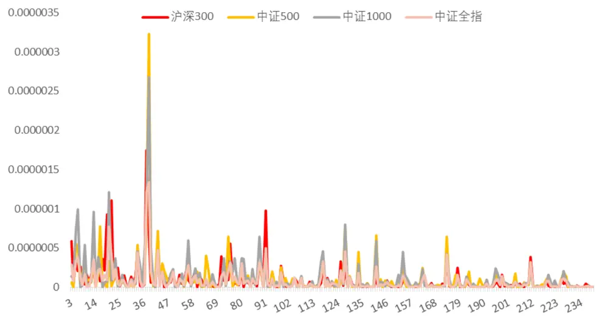
资料来源：米筐，方正证券研究所

下图展示了贵州茅台和宁德时代在2022年8月19日的单复利差时序变化图。可以看到，二者走势完全不同，且宁德时代当天的单复利差明显大于的贵州茅台的单复利差。另外二者的走势也与四个主要指数的单复利差走势不相同，表明了虽然主要指数的日内跳跃发生时刻和程度大体相同，但对于每只个股而言，其每日的跳跃发生的时间和程度存在较大差异。

图表3： 贵州茅台与宁德时代2022-08-19单复利差时序变化图
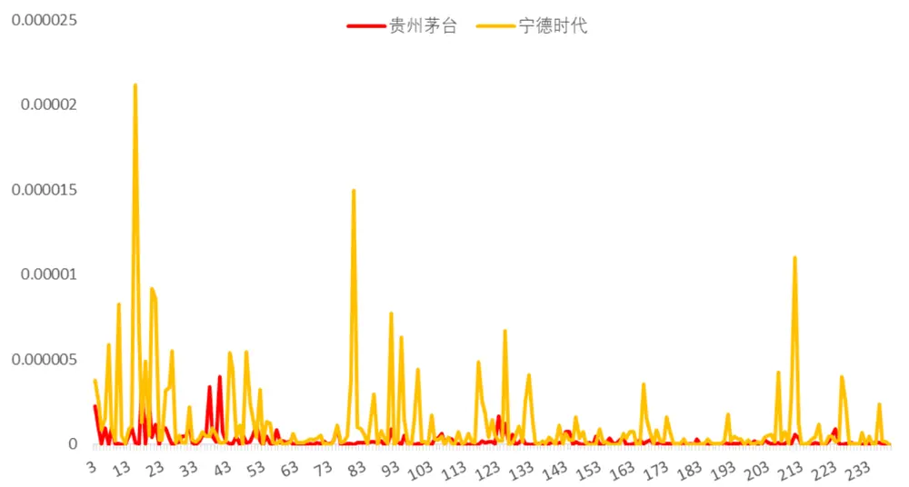
资料来源：米筐，方正证券研究所

在全A样本中按照月度频率对上述构建的“月均跳跃度”因子、“月稳跳跃度”因子和“月跳跃度”因子进行测试，测试中对因子进行市值和行业正交化处理，测试区间为2013年1月至2022年8月（下同）。

图表4： “月跳跃度”因子测试

| 因子名称 |  | Rank IC Rank ICIR | t值 | 年化收益率 | 年化波动率 | 信息比率 | 月度胜率 | 最大回撤 |
| --- | --- | --- | --- | --- | --- | --- | --- | --- |
| 月均跳跃度因子 | -6.90% | -3.86 | -11.9 | 28.71% | 9.52% | 3.02 | 80.87% | 4.99% |
| 月稳跳跃度因子 | -6.60% | -3.15 | -9.7 | 28.45% | 12.32% | 2.31 | 75.65% | 5.96% |
| 月跳跃度因子 | -7.63% | -3.68 | -11.4 | 34.71% | 12.50% | 2.78 | 81.74% | 4.61% |

资料来源：米筐，Wind，方正证券研究所

从测试结果来看，上述三个因子 Rank IC 分别为-6.90%、-6.60%和-7.63%，Rank ICIR 达到-3.86、-3.15 和-3.68，多空组合年化收益率分别为 28.71%、28.45%和 34.71%，选股效果较为出色。

图表5： “月跳跃度”因子十分组及多空对冲净值走势
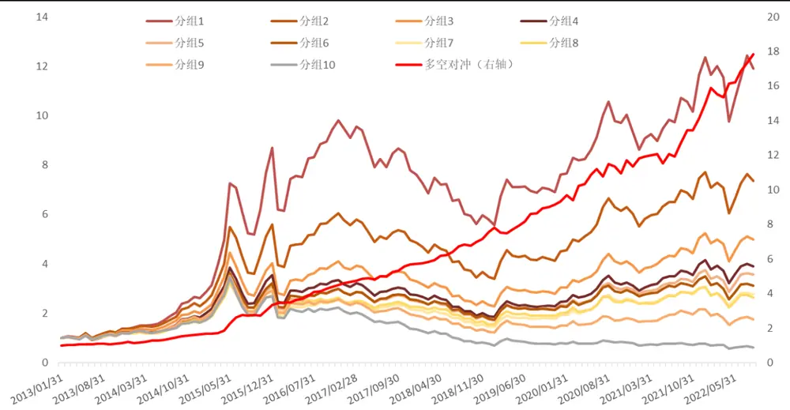
资料来源：米筐，Wind，方正证券研究所

## 2.2 传统振幅因子及其分类

在使用股价跳跃程度对传统振幅因子进行修正改进之前，本文先给出传统振幅因子的构造方式及其在全部A 股中的测试效果，以做对比。构造方式如下：

1）取个股 t 日的最高价与 t 日的最低价做差，将差值除以 t-1 日的收盘价，即得到t日的振幅。

2）每月月底，计算过去 20 个交易日的振幅的均值，得到传统振幅因子。

图表6： 传统振幅因子测试

| 因子名称 | Rank IC | Rank ICIR | t值 | 年化收益率 | 年化波动率 | 信息比率 | 月度胜率 | 最大回撤 |
| --- | --- | --- | --- | --- | --- | --- | --- | --- |
| 传统振幅因子 | -7.41% | -2.05 | -6.3 | 21.75% | 18.59% | 1.17 | 61.74% | 16.08% |

资料来源：米筐，Wind，方正证券研究所

从测试结果来看，传统振幅因子的Rank IC虽然高达-7.41%，但其RankICIR 仅有-2.05，信息比率也低至 1.17，表明传统振幅因子的效果不够稳定，常常出现失效的情况。我们将对股票振幅进行一定的分类，通过识别出其中符合预期逻辑的有效类型，修复不符合预期逻辑的无效类型，来达到增强传统振幅因子的效果的目的。

在改进传统振幅因子之前，我们先来考察低波异象的成因。一种流行的解释认为，高波动的股票，吸引了大量的博彩偏好型投资者，使其过分买入，从而导致股价偏高未来大概率发生回撤。然而如上所述，振幅因子也是股票单日波动率的一种衡量指标，表现却差强人意。

基于前文对股价跳跃的论述，我们认为实际上吸引博彩偏好型投资者的，并不是“波动”而是“跳跃”，例如常用的波动率因子，是因为波动大的个股，包含“跳跃”的可能性更大一些，因此表现出了一定的有效性。所以要增强改进波动类的因子，一个行之有效的途径就是，识别出波动中的跳跃。为了解决这一问题，我们依据振幅能否吸引到博彩偏好型投资者（飞蛾），将振幅分为两类：“火把”型振幅和“太阳”型振幅。具体而言，如果 t 日股价发生了明显跳跃，则认为这一天可以吸引到博彩偏好型投资者，然而投资者追逐这种类型股票犹如飞蛾扑向“火把”，大概率将蒙受损失。反之，如果 t 日股价没有发生明显跳跃，则认为这一天不能吸引到博彩偏好型投资者，我们将其比作“太阳”型振幅，对于博彩偏好型投资者来说，虽然明亮，却不会去追逐它。

## 2.3 “修正振幅”因子 1 的定义

基于上述论述，我们参考报告《个股动量效应的识别及“球队硬币”因子构建——多因子选股系列之四》中提出的横截面翻转的方法，依据每日的“日跳跃度”因子，逐日对振幅进行分类识别，以判断当日的振幅属于“火把”型振幅还是“太阳型”振幅，进而对截面上的振幅加以翻转和修正，并构建“修正振幅”因子1。具体步骤如下：1）计算每天的“日跳跃度”因子及振幅。振幅为(t日最高价 - t日最低价)/(t-1 日收盘价)。

2）每天计算“日跳跃度”因子的截面均值，我们认为“日跳跃度”小于截面均值的股票，属于未发生跳跃或跳跃程度较小的股票，这一天的振幅为“太阳”型振幅，将其振幅值乘以-1；反之如果“日跳跃度”大于截面均值，则认为这种股票属于发生跳跃或跳跃程度较大的股票，这一天的振幅为“火把”型振幅，将其振幅乘以 1。记变化后的振幅为“翻转振幅”因子。

3）每月月底，计算过去 20 天的“翻转振幅”的均值，得到“修正振幅”因子 1。

图表7： “修正振幅”因子1测试

| 因子名称 | Rank IC | Rank ICIR | t值 | 年化收益率年化波动率 |  | 信息比率 | 月度胜率 | 最大回撤 |
| --- | --- | --- | --- | --- | --- | --- | --- | --- |
| 修正振幅因子1 | -7.28% | -4.41 | -13.6 | 30.28% | 9.59% | 3.16 | 83.48% | 8.18% |

资料来源：米筐，Wind，方正证券研究所

从测试结果来看，“修正振幅”因子1的Rank IC虽然没有明显提升，但 Rank ICIR 提升至-4.41，年化收益率和信息比率也分别提升至30.28%和 3.16，可见这一改进效果非常明显。

图表8： “修正振幅”因子1十分组及多空对冲净值走势
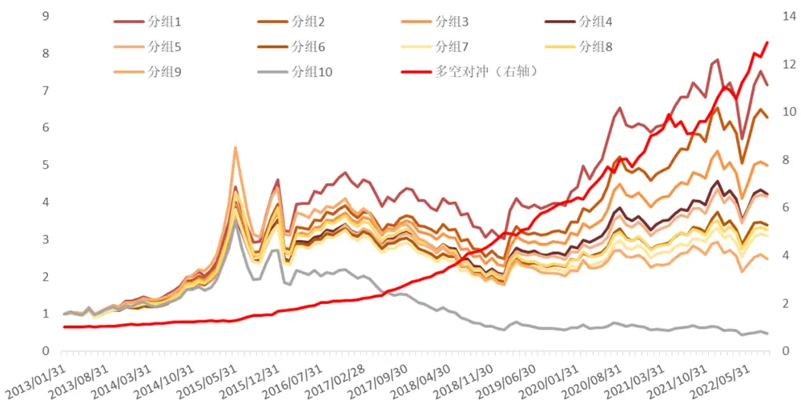
资料来源：米筐，Wind，方正证券研究所

## 2.4 “修正振幅”因子 2的定义

进一步，我们将上述逻辑应用于日频数据上，使用日度最高价和最低价来识别“跳跃”，再翻转修正振幅因子。这是因为，从低价到高价的跳跃式上涨，更能吸引博彩偏好型投资者，而从高价到低价的下降则不会。具体步骤如下：

1）我们分别使用“单利”和“连续复利”的方式，计算从 t-1 日的最低价到 t 日的最高价的“单利收益率”和“连续复利收益率”，分别记为t日的“单利收益率”和“连续复利收益率”。

2）随后我们将t日的“单利收益率”与t日的“连续复利收益率”做差，得到t日的“单复利差”。

3）将 t 日的“单复利差”乘以 2，减去 t 日的“连续复利收益率”的平方，得到 t 日的“泰勒残项”。

4）计算每日的振幅。

5）每天计算“泰勒残项”的截面均值，我们认为“泰勒残项”小于截面均值的股票，属于未发生跳跃或跳跃程度较小的股票，这一天的振幅为“太阳”型振幅，将其振幅值乘以-1；反之如果“泰勒残项”大于截面均值，则认为这种股票属于发生跳跃或跳跃程度较大的股票，这一天的振幅为“火把”型振幅，将其振幅乘以 1。记变化后的振幅为“翻转振幅2”。

6）每月月底，计算过去 20 天的“翻转振幅 2”的均值，得到“修正振幅”因子2。

图表9： “修正振幅”因子2测试

| 因子名称 | Rank IC | Rank ICIR | t值 | 年化收益率 | 年化波动率 | 信息比率 | 月度胜率 | 最大回撤 |
| --- | --- | --- | --- | --- | --- | --- | --- | --- |
| 修正振幅因子2 | -8.47% | -3.89 | -12 | 33.83% | 11.98% | 2.82 | 83.48% | 9.09% |

资料来源：米筐，Wind，方正证券研究所

从测试结果来看，“修正振幅”因子 2，Rank IC 提高至-8.47%的水平，Rank ICIR 提升至-3.89，年化收益率和信息比率也分别提升至33.83%和 2.82，选股效果同样较为出色。

图表10：“修正振幅”因子 2十分组及多空对冲净值走势
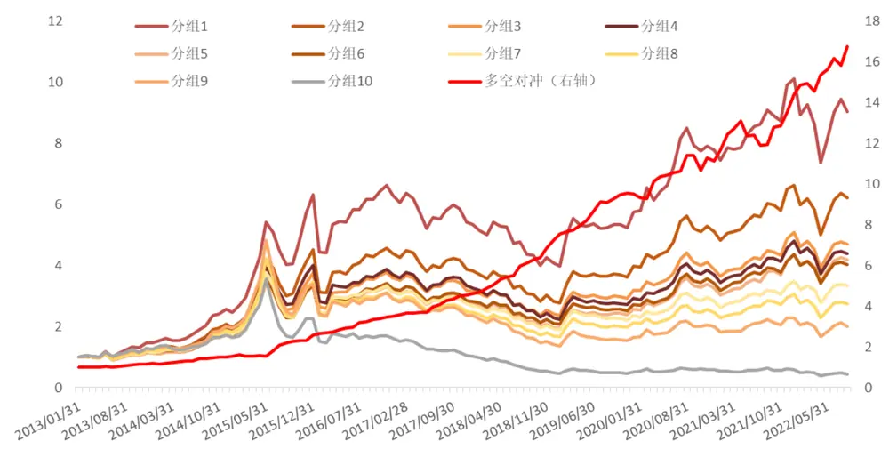
资料来源：米筐，Wind，方正证券研究所

## 2.5 “修正振幅”因子的定义

我们将上述构造的“修正振幅”因子1和“修正振幅”因子2等权合成，构造“修正振幅”因子。

图表11：“修正振幅”因子测试

| 因子名称 | Rank IC Rank ICIR |  | t值 | 年化收益率 | 年化波动率 | 信息比率 | 月度胜率 | 最大回撤 |
| --- | --- | --- | --- | --- | --- | --- | --- | --- |
| 修正振幅因子 | -8.70% | -4.38 | -13.5 | 36.68% | 11.18% | 3.28 | 86.96% | 11.60% |

资料来源：米筐，Wind，方正证券研究所

从测试结果来看，“修正振幅”因子，Rank IC 提高至-8.70%的水平，Rank ICIR 提升至-4.38，年化收益率和信息比率也分别提升至 36.68%和3.28，选股效果非常出色。

图表12：“修正振幅”因子十分组及多空对冲净值走势
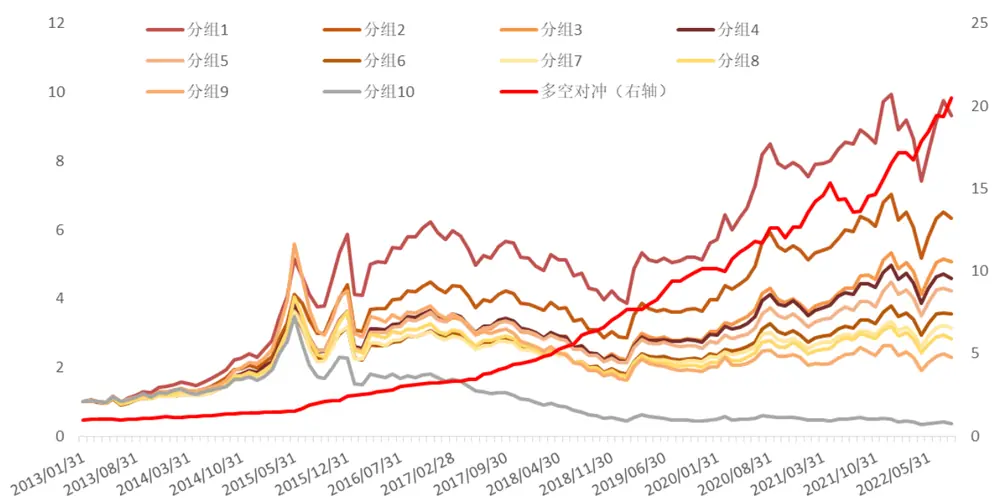
资料来源：米筐，Wind，方正证券研究所

## 2.6 “飞蛾扑火”因子的定义

我们将上述构造的“月跳跃度”因子和“修正振幅”因子等权合成，得到“飞蛾扑火”因子。我们对“飞蛾扑火”因子在月度频率上进行选股效果测试。

图表13： “飞蛾扑火”因子测试

| 因子名称 | Rank IC | Rank ICIR | t值 | 年化收益率 | 年化波动率 | 信息比率 | 月度胜率 | 最大回撤 |
| --- | --- | --- | --- | --- | --- | --- | --- | --- |
| 飞蛾扑火因子 | -8.90% | -4.52 | -13.9 | 37.30% | 10.62% | 3.51 | 87.83% | 7.42% |

资料来源：米筐，Wind，方正证券研究所

图表14：“飞蛾扑火”因子十分组绩效

| 因子名称 | 累积收益率 | 年化收益率 | 年化波动率 | 信息比率 | 月度胜率 | 最大回撤 |
| --- | --- | --- | --- | --- | --- | --- |
| 分组1 | 854.80% | 26.54% | 30.10% | 0.88 | 56.52% | 38.16% |
| 分组2 | 487.01% | 20.28% | 28.29% | 0.72 | 57.39% | 38.97% |
| 分组3 | 440.19% | 19.24% | 28.06% | 0.69 | 53.04% | 39.50% |
| 分组4 | 361.27% | 17.29% | 27.53% | 0.63 | 55.65% | 40.90% |
| 分组5 | 331.19% | 16.47% | 27.56% | 0.60 | 56.52% | 42.25% |
| 分组6 | 290.53% | 15.27% | 27.38% | 0.56 | 54.78% | 42.45% |
| 分组7 | 270.81% | 14.65% | 28.89% | 0.51 | 53.91% | 52.53% |
| 分组8 | 205.19% | 12.34% | 30.52% | 0.40 | 51.30% | 61.63% |
| 分组9 | 59.15% | 497% | 31.77% | 0.16 | 50.43% | 74.21% |
| 分组10 | -62.76% | -9.79% | 33.01% | -0.30 | 43.48% | 89.53% |

资料来源：米筐，Wind，方正证券研究所

从测试结果来看，“飞蛾扑火”因子 Rank IC 达-8.90%，Rank ICIR为-4.52，年化收益率达 37.30%，信息比率 3.51，月度胜率为 87.83%，选股效果优异，其分组表现如下图所示：

图表15：“飞蛾扑火”因子十分组及多空对冲净值走势
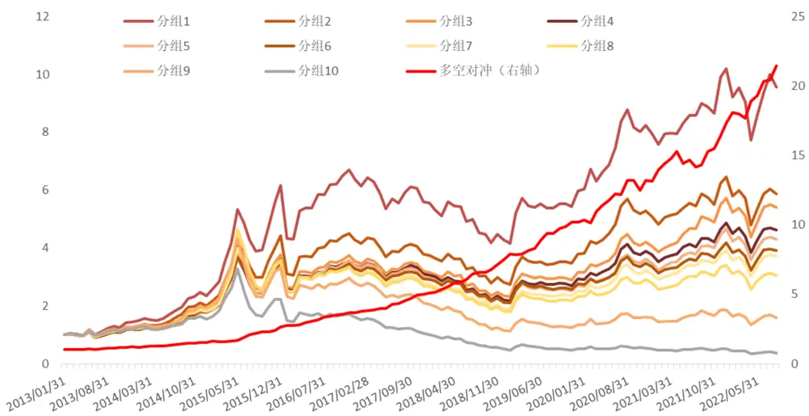
资料来源：米筐，Wind，方正证券研究所

图表16：“飞蛾扑火”分年度表现

|  | 年份 | 分组1 分组2 分组3 |  |  | 分组4 | 分组5 | 分组6 | 分组7 | 分组8 | 分组9 | 分组10 | 多空组合 |
| --- | --- | --- | --- | --- | --- | --- | --- | --- | --- | --- | --- | --- |
|  | 2013年 | 44.45% | 28.01% | 22.42% | 16.92% | 18.67% | 18.10% | 20.85% | 22.36% | 26.61% | 17.13% | 24.89% |
|  | 2014年 | 63.44% | 56.72% | 50.12% | 52.09% | 47.54% | 50.49% | 49.17% | 54.33% | 53.17% | 32.31% | 23.40% |
|  | 2015年 | 161.39% | 120.97% | 105.11% | 6101.92% | 103.95% | 97.67% | 97.84% | 89.71% | 71.57% | 43.53% | 71.89% |
|  | 2016年 | 3.24% | -3.19% | -5.91% | -5.48% | -5.05% | -6.72% | -11.91% | -12.83% | -16.03% | -26.96% | 38.73% |
|  | 2017年 | -12.87% | -12.67% | -10.79% | -9.53% | -12.95% | -11.34% | -13.10% | -14.41% | -26.29% | -37.66% | 38.35% |
|  | 2018年 | -22.71% | -24.76% | -26.03% | -28.44% | -28.42% | -26.38% | -29.62%- | 31.85% | -43.88% | -48.54% | 46.90% |
|  | 2019年 | 39.08% | 34.13% | 35.08% | 33.71% | 28.14% | 29.11% | 31.63% | 27.56% | 16.18% | 0.06% | 36.46% |
|  | 2020年 | 33.24% | 34.50% | 28.61% | 28.59% | 28.55% | 21.36% | 22.02% | 19.88% | 18.01% | 1.28% | 28.87% |
|  | 2021年 | 28.17% | 26.79% | 40.50% | 28.85% | 33.98% | 25.09% | 26.94% | 22.28% | 16.77% | -4.46% | 31.70% |
| 2022年 |  | -6.31% | -8.98% | -5.44% | -5.23% | -7.51% | -6.85% | -5.35% | -10.39% | -13.98% | -26.20% | 23.84% |

资料来源：米筐，Wind，方正证券研究所

## 2.7 剥离其他风格因子影响后“飞蛾扑火”因子仍然表现很好

从上述测试结果来看，“飞蛾扑火”因子选股能力出色，进一步，我们测试其与其他常见风格因子的相关性，如下图所示，“飞蛾扑火”因子与流动性、波动率因子相关性较高，与其余因子相关性均较低。为进一步验证因子的增量信息，我们使用常用风格因子及行业因子对“飞蛾扑火”因子进行正交化处理，得到“纯净飞蛾扑火”因子，再检验其选股能力。

图表17：与常见风格因子相关性测试
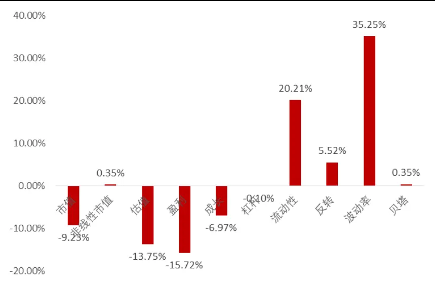
资料来源：米筐，Wind，方正证券研究所

图表18：剥离常见风格因子影响后“飞蛾扑火”因子绩效

| 因子名称 | Rank IC | Rank ICIR | t值 | 年化收益率 | 年化波动率 | 信息比率 | 月度胜率 | 最大回撤 |
| --- | --- | --- | --- | --- | --- | --- | --- | --- |
| 纯净飞蛾扑火因子 | -5.03% | -2.68 | -8.30 | 23.35% | 9.48% | 2.46 | 78.26% | 7.05% |

资料来源：米筐，Wind，方正证券研究所

可以看到，在剔除了常用的风格因子影响后，“飞蛾扑火”因子仍然具有很好的选股能力，Rank IC 均值为-5.03%，Rank ICIR 为-2.68，多空组合年化收益率23.35%，信息比率2.46。

图表19：“纯净飞蛾扑火”因子十分组及多空对冲净值走势
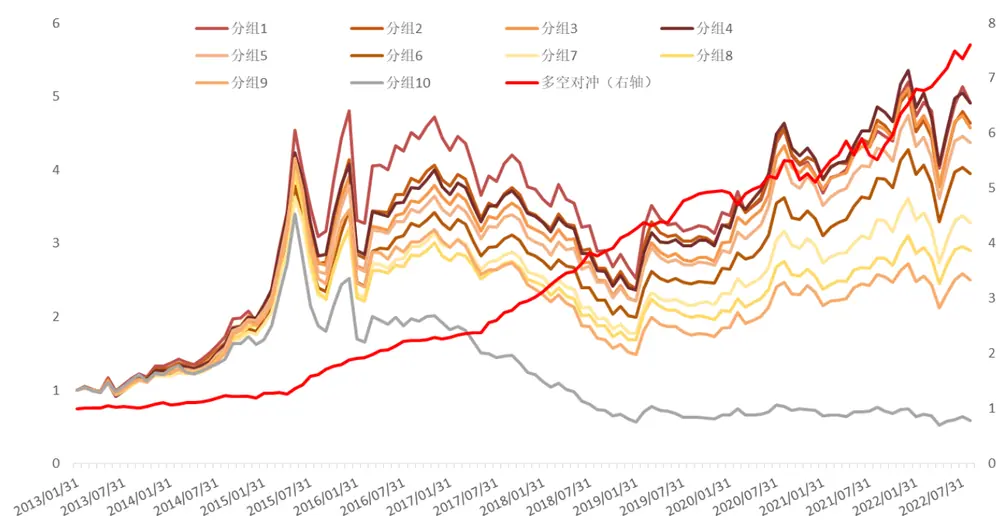
资料来源：米筐，Wind，方正证券研究所

## 2.8 “飞蛾扑火”因子在不同样本空间下的表现

为了检验“飞蛾扑火”因子在其他样本空间下的选股表现，我们分别选取了沪深 300 成分股、中证 500 成分股、中证 1000 成分股作为股票池，测试其选股能力。可以看到，“飞蛾扑火”因子在沪深 300、中证500、中证 1000指数成分股内均表现不俗，多头组合年化超额收益分别为 6.05%、8.48%和 13.87%。

图表20：不同样本空间下“飞蛾扑火”因子表现

| 样本空间 | Rank IC | Rank ICIR | t值 | 年化收益率 | 年化波动率 | 信息比率 | 月度胜率 | 最大回撤 |
| --- | --- | --- | --- | --- | --- | --- | --- | --- |
| 沪深300成分股 | -4.84% | -2.20 | -6.8 | 18.48% | 11.86% | 1.56 | 67.83% | 12.62% |
| 中证500成分股 | -6.11% | -2.72 | -8.4 | 18.46% | 12.12% | 1.52 | 72.17% | 16.08% |
| 中证1000成分股 | -8.82% | -4.06 | -11.3 | 36.06% | 10.70% | 3.37 | 81.91% | 7.45% |

资料来源：米筐，Wind，方正证券研究所

图表21：不同样本空间下“飞蛾扑火”因子多头超额表现

| 样本空间 | 累积收益率 | 年化收益率 | 年化波动率 | 信息比率 | 月度胜率 | 最大回撤 |
| --- | --- | --- | --- | --- | --- | --- |
| 沪深300多头超额 | 75.61% | 6.05% | 11.51% | 0.53 | 57.76% | 29.63% |
| 中证500多头超额 | 118.14% | 8.48% | 8.22% | 1.03 | 59.48% | 9.38% |
| 中证1000多头超额 | 176.84% | 13.87% | 7.71% | 1.80 | 68.42% | 8.80% |

资料来源：米筐，Wind，方正证券研究所

图表22：沪深 300/中证 500/中证 1000指数成分股内多空表现
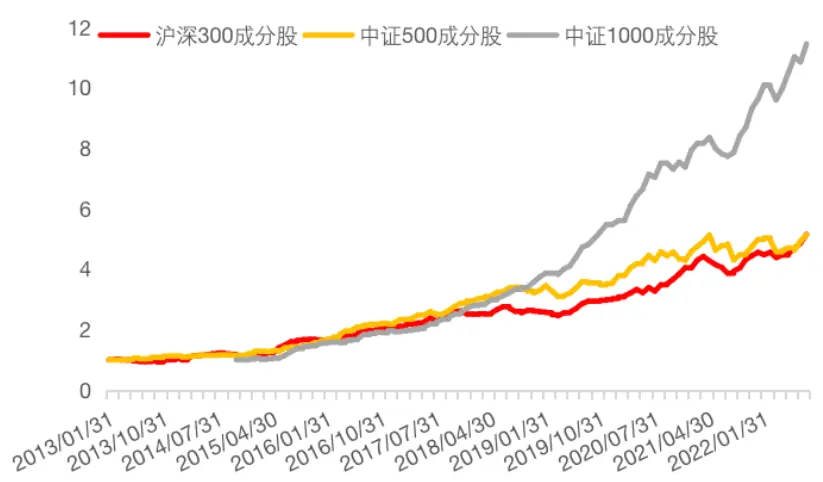
资料来源：米筐，Wind，方正证券研究所

图表23： 沪深 300/中证 500/中证 1000指数多头组合超额表现
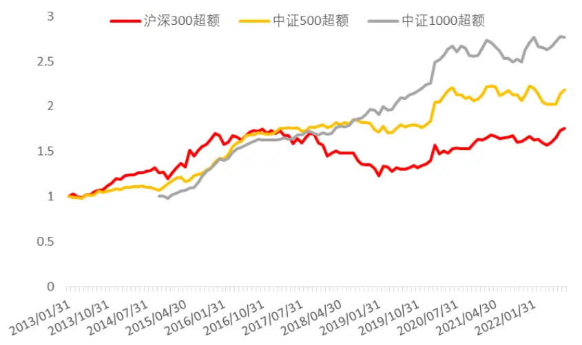
资料来源：米筐，Wind，方正证券研究所

## 3 风险提示

本报告基于历史数据分析，历史规律未来可能存在失效的风险；市场可能发生超预期变化；各驱动因子受环境影响可能存在阶段性失效的风险。

## 参考文献

[1] Jiang G J, Oomen R C A. Testing for jumps when asset prices are observed with noise – a “swap variance” approach[J]. Journal of Econometrics, 2008, 144(2): 352-370.

## 分析师声明

作者具有中国证券业协会授予的证券投资咨询执业资格，保证报告所采用的数据和信息均来自公开合规渠道，分析逻辑基于作者的职业理解，本报告清晰准确地反映了作者的研究观点，力求独立、客观和公正，结论不受任何第三方的授意或影响。研究报告对所涉及的证券或发行人的评价是分析师本人通过财务分析预测、数量化方法、或行业比较分析所得出的结论，但使用以上信息和分析方法存在局限性。特此声明。

## 免责声明

本研究报告由方正证券制作及在中国（香港和澳门特别行政区、台湾省除外）发布。根据《证券期货投资者适当性管理办法》，本报告内容仅供我公司适当性评级为C3及以上等级的投资者使用，本公司不会因接收人收到本报告而视其为本公司的当然客户。若您并非前述等级的投资者，为保证服务质量、控制风险，请勿订阅本报告中的信息，本资料难以设置访问权限，若给您造成不便，敬请谅解。

在任何情况下，本报告的内容不构成对任何人的投资建议，也没有考虑到个别客户特殊的投资目标、财务状况或需求，方正证券不对任何人因使用本报告所载任何内容所引致的任何损失负任何责任，投资者需自行承担风险。

本报告版权仅为方正证券所有，本公司对本报告保留一切法律权利。未经本公司事先书面授权，任何机构或个人不得以任何形式复制、转发或公开传播本报告的全部或部分内容，不得将报告内容作为诉讼、仲裁、传媒所引用之证明或依据，不得用于营利或用于未经允许的其它用途。如需引用、刊发或转载本报告，需注明出处且不得进行任何有悖原意的引用、删节和修改。

## 公司投资评级的说明：

强烈推荐：分析师预测未来半年公司股价有20%以上的涨幅；

推荐：分析师预测未来半年公司股价有10%以上的涨幅；

中性：分析师预测未来半年公司股价在-10%和10%之间波动；

减持：分析师预测未来半年公司股价有10%以上的跌幅。

## 行业投资评级的说明：

推荐：分析师预测未来半年行业表现强于沪深300指数；

中性：分析师预测未来半年行业表现与沪深300指数持平；

减持：分析师预测未来半年行业表现弱于沪深300指数。

| 地址 | 网址：https://www.foundersc.com | E-mail:yjzx@foundersc.com |
| --- | --- | --- |
| 北京 | 西城区展览馆路48号新联写字楼6层 |  |
| 上海 | 静安区延平路71号延平大厦2楼 |  |
| 上海 | 浦东新区世纪大道1168号东方金融广场 A 栋 1001 室 |  |
| 深圳 | 福田区竹子林紫竹七道光大银行大厦31层 |  |
| 广州 | 天河区兴盛路12号楼隽峰苑 2期3层方正证券 |  |
| 长沙 | 天心区湘江中路二段36号华远国际中心37层 |  |