金融工程研究

# 方正证券研究所证券研究报告

[分析师：TABLE_ SISINFO 曹春晓]

登记编号：S1220522030005

## 相关研究

[《成交量激增时刻蕴含的TABLE_REPORTINFO] alpha 信息—— 多 因 子 选 股 系 列 研 究 之 一 》2022.04.12

《个股成交量的潮汐变化及“潮汐”因子构建——多因子选股系列研究之二》2022.05.08

《个股波动率的变动及“勇攀高峰”因子构建——多因子选股系列研究之三》2022.05.30

《个股动量效应的识别及“球队硬币”因子构建——多因子选股系列之四》2022.06.11

《波动率的波动率与投资者模糊性厌恶——多因子选股系列研究之五》2022.08.04

《个股股价跳跃及其对振幅因子的改进——多因子选股系列研究之六》2022.09.22

《基于Wind偏股混合型基金指数的增强选股策略——多因子选股系列研究之七》2022.10.24

2022.12.13

## 投资要点

显著理论认为那些收益率过分高于市场收益率的股票，会吸引投资者的注意力并引起投资者的过度买入，进而股价会在未来发生回落。我们将这种心理称为“守株待兔”心理，投资者认为这种极端偏离市场的高收益会再次出现，因此纷纷买入这些股票开始等待。

相反，那些收益率过分低于市场收益率的股票，会导致投资者产生恐慌心理并引起投资者的过度卖出，进而股价会在未来发生补涨。我们将这种心理称为“草木皆兵”心理，投资者认为这种极端偏离市场的低收益（或称为严重亏损）会再次出现，因此纷纷卖出这些股票并远离它们。

本文借鉴了已有文献中对显著因子的构造并加以简化和改进，提出了将显著理论与反转因子相结合的新构造方法。即将股票每日的收益率，视作投资者做出决策权重的依据，将每天收益率偏离市场的程度作为极端收益对投资者决策权重的扭曲程度，使用该偏离程度直接加权每日收益率，来模拟投资者决策过程，构造了“原始惊恐”因子。

然而，关于显著理论的有效性，学术界也存在一些质疑，后续文献研究表明：（1）显著因子很大一部分可以归因于短期的反转效应；（2）显著效应在小市值股票上更为强烈；（3）显著效应在波动率加剧时更加强烈。基于上述结论，本文对“原始惊恐”因子从波动率加剧、个人投资者交易比和注意力衰减的角度来进行改进，最终得到了“草木皆兵”因子。

我们对“草木皆兵”因子在月度频率上的选股效果进行测试，结果显示 “草木皆兵”因子表现非常出色，Rank IC达-8.90%，Rank ICIR 为-4.54，多空组合年化收益率达 32.50%，信息比3.92，因子月度胜率 85.71%。此外，在剔除了常用的风格因子影响后，“草木皆兵”因子仍然具有较强的选股能力，Rank IC均值为-3.59%，Rank ICIR 为-1.86，多空组合年化收益率16.40%，信息比率 2.03。

主流宽基指数中，“草木皆兵”因子在沪深300、中证500、中证1000指数成分股内均表现不俗，多头组合年化超额收益分别为 7.42、9.74%、10.15%。

## 风险提示

本报告基于历史数据分析，历史规律未来可能存在失效的风险；市场可能发生超预期变化；各驱动因子受环境影响可能存在阶段性失效的风险。

感谢实习生陈宗伟在资料整理方面对本报告的贡献。

## 1 引言

明知彩票中奖的概率很低，很多人却依然乐此不疲地购买；明知发生灾难或意外的概率很低，很多人却依然愿意购买保险。前景理论认为，是极端的收益或损失扭曲了人们的决策权重，人们在决策时，会赋予发生概率极低，但收益或损失极大的事件以过高的决策权重。而前景理论应用在选股实践中的缺陷是，前景理论中的事件发生概率与相对收益或损失，都是仅仅局限在单一事件范围内的，这使得将5000多只股票放在一起比较，变得较为困难。

显著理论（salience theory）的出现解决了截面上做比较的问题。Cosemans 和 Frehen(2021)使用显著理论构造了因子，他们认为那些收益率过分高于市场收益的股票，会吸引投资者的注意力，并引起投资者的过度买入，进而股价在未来会发生回落。我们将这种心理称为“守株待兔”心理，投资者认为这种极端偏离市场的高收益会再次出现，因此纷纷买入这些股票开始等待。

相反，那些收益率过分低于市场收益率的股票，会对投资者产生恐慌心理，并引起投资者的过度卖出，进而股价在未来发生补涨。我们将这种心理称为“草木皆兵”心理，投资者认为这种极端偏离市场的低收益（或称为严重亏损）会再次出现，因此纷纷卖出这些股票，小心远离它们。

本文借鉴了 Cosemans 和 Frehen(2021)的部分构造方法，并加以简化和改进，提出了将显著理论与反转因子相结合的新构造方法。即将股票每日的收益率，视作投资者做出决策权重的依据，将每天收益率偏离市场的程度（我们取多头端的逻辑，将其简称为“惊恐度”）作为极端收益对投资者决策权重的扭曲程度，使用“惊恐度”直接加权每日收益率，来模拟投资者决策过程，构造了“原始惊恐”因子。

然而，关于显著理论的有效性，Cakici和 Zaremba(2021)提出了质疑，他们在全球49个市场上进行了检验，并指出：（1）显著因子很大一部分可以归因于短期的反转效应；（2）显著效应在小市值股票上更为强烈；（3）显著效应在波动率加剧时更加强烈。

基于上述结论，本文对“原始惊恐”因子从波动率加剧、个人投资者交易占比和注意力衰减的角度来进行改进，最终得到了“草木皆兵”因子。

## 2 “惊恐度”与“原始惊恐”因子

## 2.1 “惊恐度”

根据上述逻辑，那些收益率过分偏离市场水平的股票，会吸引人们的关注（导致过度买入，未来可能表现相对较差）或引起人们的恐慌（导致过度卖出，未来可能表现相对较好），我们以多头端的逻辑为代表，将这种偏离市场的程度称为“惊恐度”。

关于“惊恐度”，我们认为投资者在面对如下两种情形时的反应是不一致的：1）情形A，市场收益率为 0，而个股S 的收益率为-5%；2）情形 B，市场收益率为-5%，而个股 S 的收益率为-10%。我们认为情形A 下人们的“惊恐度”要大于情形B下人们的“惊恐度”，这是因为当市场收益率较低（高）时，人们更倾向于认为个股的大跌（大涨）可能是市场带动的；而当市场平静时，人们更倾向于个股的大跌（大涨）是由自身的某种因素或特点导致的。

Cosemans 和 Frehen(2021)给出了衡量“惊恐度”的计算方法，本文借鉴了该构造方式，具体如下：

1）取中证全指（000985.SH）指数收益作为市场水平的代表，将中证全指的每日收益率（今日收盘指数/昨日收盘指数-1）作为今日市场收益率水平。

2）计算个股收益率与市场收益率的差值，再取绝对值，作为个股相对市场收益率的偏离水平，记为“偏离项”；计算个股收益率的绝对值，加市场收益率的绝对值，再加 0.1，作为市场总体的收益水平，记为“基准项”。

3）使用“偏离项”除以“基准项”，得到该股票在该日的“惊恐度”。

4）“基准项”中的 0.1 为 Cosemans 和 Frehen(2021)给出的参数，这里不对其进行优化或调整，仅对上面“基准项”中加 0.1 的必要性做出解释：首先，如果这一项不存在，那么当个股收益率与市场收益率都是0时，将出现0 除以0 的情况。其次，如果这一项不存在，将使得当个股收益率为 0 时，“惊恐度”恒等于 1，这将是横截面上的最大值，这显然不是本文想要的结果。例如当个股A收益率为-2%，个股B收益率为0，市场收益率为 2%，如果不存在这一项加 0.1，那么股票A和股票B的“惊恐度”都是1，这个不符合前面的逻辑；而如果加上0.1，那么股票A的“惊恐度”是 0.04/0.14，而股票B 的“惊恐度”是 0.02/0.12，显然股票A 的“惊恐度”更大，这符合前述逻辑。因此在“基准项”中加上0.1 是必要的。

图表1： 惊恐度计算过程示例
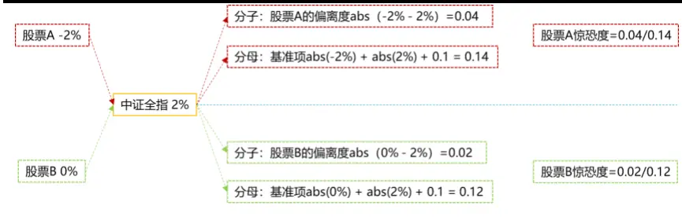
资料来源：方正证券研究所

## 2.2 决策与权重——从数据信息到交易行为

在给出了“惊恐度”的构造后，我们来考察一个因子如何帮助投资者完成从数据信息到交易行为的转化。

我们首先考虑一个常见的月度反转策略，即常用的20 日收益率因子。该传统反转因子的逻辑认为，过去20天里，收益率相对较高的股票，其未来表现会相对较弱，而收益率相对较低的股票，其未来表现相对较好。因此如果采用 20 日收益率的传统反转因子来进行选股，投资者会买入过去一个月收益较低的股票。

我们将上述逻辑中用到的“20 日收益率”进一步分解为 20 个交易日每天的收益率，我们认为，从“20 日收益率较低”的数据信息到“决定买入这些最近跌得较多的股票”的交易结果，投资者的内心中是通过“决策与权重”来完成从数据信息到交易结果的转化的。

（注：此处的投资者的决策权重，与引言中的极端收益扭曲了投资者的决策权重并非同一含义。从投资者的类别来看：引言中提到的极端收益扭曲了投资者的决策权重中的“投资者”指的是一些情绪化的、不理智的投资者，面对极端低收益时产生了恐慌情绪。而此处提到的投资者，是指那些相对理智的“因子投资者”，是基于一定规则和规律来投资的投资者，此处的决策与权重是指这些因子投资者们，在回顾历史信息时，如何找到更有信息量的交易日。）

我们可以简单粗略地通过打分法来模拟使用“20 日收益率传统反转因子”来交易的投资者的决策过程：如果 t日A 股票的收益率很低，投资者会认为这一天价格低于了合理范围，未来价格会因为这一天的存在而补涨，那么投资者会对这一天打一个较高的决策分；反之如果t+1 日 A 股票的收益率又很高，投资者会认为这一天价格高于了合理范围，未来价格会因为这一天的存在而回落，那投资者会对这一天打一个较低的决策分，最后投资者加总最近 20 天每天的决策分，选出权重分总和最高的一些股票，进行买入。

在上述做决策过程中，包含了两个步骤——每天打分和每月加总。然而使用“20 日收益率传统反转因子”投资隐含了一个默认条件，即按照每天等权加总。然而根据显著理论，即使是同一只个股，相邻前后两个交易日的收益率相同，但由于这两个交易日的市场收益率不同，导致这两天的“惊恐度”是不同的，即这两天的收益率对投资者的吸引或惊恐程度是不同的。

例如某股票 A，在 k 和 k+1 日的收益率均为-5%，而 k 日市场收益率为 0，k+1 日收益率为-3%，那么此时 k 日的“惊恐度”为 0.05/0.15，而k+1 日的“惊恐度”为0.02/0.18，即k日里股票A的下跌会给投资者带来更多的恐慌情绪，导致这一天的投资者反应过度的程度更加强烈，即更加容易过度卖出。

因此使用“20 日收益率传统反转因子”的投资者在每天打分和每月加总时，会对 k日和k+1日打出相同的决策分，并等权加总。然而这种行为并不符合他们最初的逻辑，更加符合逻辑的表述应该为：如果t 日 A 股票的被严重过度卖出，投资者会认为这一天价格低于了合理范围，未来价格会因为这一天的存在而补涨，那么投资者会对这一天打一个较高的决策分。

依照这一逻辑重新进行决策，显然上例中，股票A在 k日被过度卖出的程度更加严重，因此应该在每月加总决策分时，相对提高 k日的决策分的权重，而相对降低k+1日的决策分的权重。

## 2.3 “原始惊恐”因子

依据上述逻辑，我们可以看出，对传统反转“20 日收益率因子”的一个改进方法即考虑每日投资者过度反应的程度，而“惊恐度”即为一个衡量过度反应的指标。

接下来我们使用股票日度交易数据构造“原始惊恐”因子，具体步骤如下：

1）将每日股票收益率（今收/昨收-1）直接作为当日股票的决策分。

2）将每日的“惊恐度”与每日的收益率相乘，得到加权调整后的决策分，简称“加权决策分”。

3）每月月底，分别计算过去 20 个交易日的“加权决策分”的均值和标准差，分别作为对“20 日收益率因子”和“20 日波动率因子”的改进，分别记为“惊恐收益”因子和“惊恐波动”因子，并将二者等权合成为“原始惊恐”因子。

4）为了便于比较改进的效果，我们首先给出“20 日收益率因子”和

“20日波动率因子”，以及二者等权合成的因子的绩效。

在全A样本中按照月度频率对上述构建的“惊恐收益”因子、“惊恐波动”因子和“原始惊恐”因子进行测试，测试中对因子进行市值和行业正交化处理，测试区间为 2013年 1月至2022年 11月（下同）。

图表2： “原始惊恐”因子测试

| 因子名称 |  | Rank IC Rank ICIR | t值 | 年化收益率 | 年化波动率 | 信息比率 | 月度胜率 | 最大回撤 |
| --- | --- | --- | --- | --- | --- | --- | --- | --- |
| 传统反转因子 | -6.69% | -2.33 | -7.29 | 27.74% | 16.35% | 1.70 | 66.10% | 14.26% |
| 传统波动因子 | -7.30% | -2.05 | -6.41 | 21.85% | 19.34% | 1.13 | 63.56% | 32.02% |
| 反转+波动 | -8.27% | -2.89 | -9.02 | 30.70% | 17.66% | 1.74 | 71.19% | 14.69% |
| 惊恐收益因子 | -7.49% | -3.31 | -10.1 | 23.45% | 11.70% | 2.00 | 72.27% | 10.27% |
| 惊恐波动因子 | -8.66% | -2.98 | -8.2 | 23.09% | 13.40% | 1.72 | 70.59% | 12.14% |
| 原始惊恐因子 | -9.32% | -3.87 | -10.9 | 26.49% | 12.12% | 2.19 | 78.15% | 10.98% |

资料来源：米筐，Wind，方正证券研究所

从测试结果来看，上述三个因子 Rank IC 分别为-7.49%、-8.66%和-9.32%，Rank ICIR 位-3.31、-2.98 和-3.87，多空组合年化收益率为23.45%、23.09%和 26.49%，选股效果较为优秀。并且相较于传统反转因子和波动因子，IC及 IR 指标均有大幅提高，改进效果较为明显。

图表3： “原始惊恐”因子十分组及多空对冲净值走势
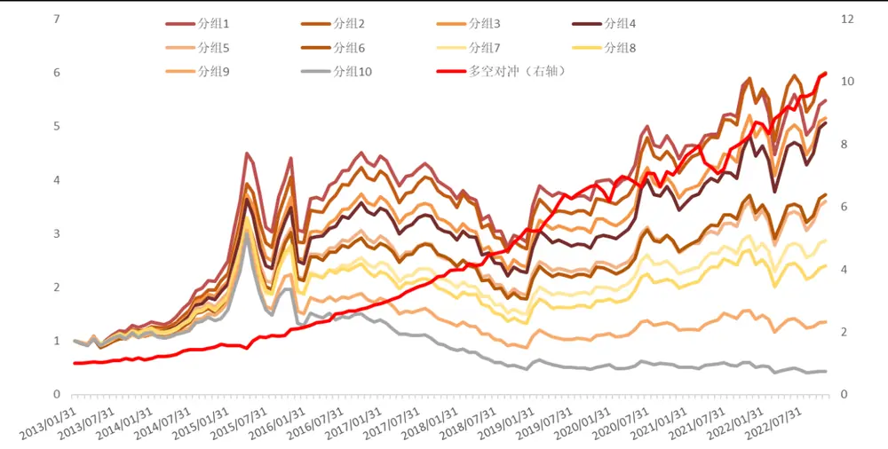
资料来源：米筐，Wind，方正证券研究所

## 3 “草木皆兵”因子

在得到“原始惊恐”因子之后，我们分别从“波动率加剧”、“个人投资者交易占比”、“注意力衰减”三个方向对“原始惊恐”因子进行改进和优化。

## 3.1 波动率加剧

根据前述显著效应在波动率加剧时更加强烈，我们计算每日个股的波动率，并将其加入权重的部分，构造“波动率加剧-惊恐”因子。具体步骤如下：

1）取股票 1 分钟频率的行情数据，计算每分钟收盘价相对上一分钟收盘价的涨跌幅，将全天每分钟收益率求标准差，得到这一天该个股的波动率。

2）计算每天每只股票的收益率和“惊恐度”。

3）将每天的波动率、“惊恐度”和收益率相乘，作为当日的加权决策分。

4）每月月底，分别计算过去20 日的加权决策分的均值和标准差，记为“波动率加剧-惊恐收益”因子和“波动率加剧-惊恐波动”因子，并将二者等权合成为“波动率加剧-惊恐”因子。

图表4： “波动率加剧-惊恐”因子测试

| 因子名称 | Rank IC | Rank ICIR | t值 | 年化收益率 | 年化波动率 | 信息比率 | 月度胜率 | 最大回撤 |
| --- | --- | --- | --- | --- | --- | --- | --- | --- |
| 惊恐收益因子 | -7.49% | -3.31 | -10.06 | 23.45% | 11.70% | 2.00 | 72.27% | 10.27% |
| 惊恐波动因子 | -8.66% | -2.98 | -8.2 | 23.09% | 13.40% | 1.72 | 70.59% | 12.14% |
| 原始惊恐因子 | -9.32% | -3.87 | -10.89 | 26.49% | 12.12% | 2.19 | 78.15% | 10.98% |
| 波动率加剧-惊恐收益因子 | -8.04% | -4.00 | -12.14 | 33.62% | 11.27% | 2.98 | 83.19% | 10.24% |
| 波动率加剧-惊恐波动因子 | -8.48% | -3.12 | -8.37 | 33.27% | 18.04% | 1.84 | 78.99% | 9.62% |
| 波动率加剧-惊恐因子 | -9.34% | -4.27 | -11.71 | 39.48% | 11.58% | 3.41 | 84.87% | 7.18% |

资料来源：米筐，Wind，方正证券研究所

从测试结果来看，上述三个因子 Rank IC 分别为-8.04%、-8.48%和-9.34%，Rank ICIR 达到-4.00、-3.12 和-4.27，多空组合年化收益率为33.62%、33.27%和 39.48%，选股效果较为优秀。并且相较于“原始惊恐”因子，稳定性和收益率都有大幅提高，改进效果明显。

图表5： “波动率加剧-惊恐”因子十分组及多空对冲净值走势
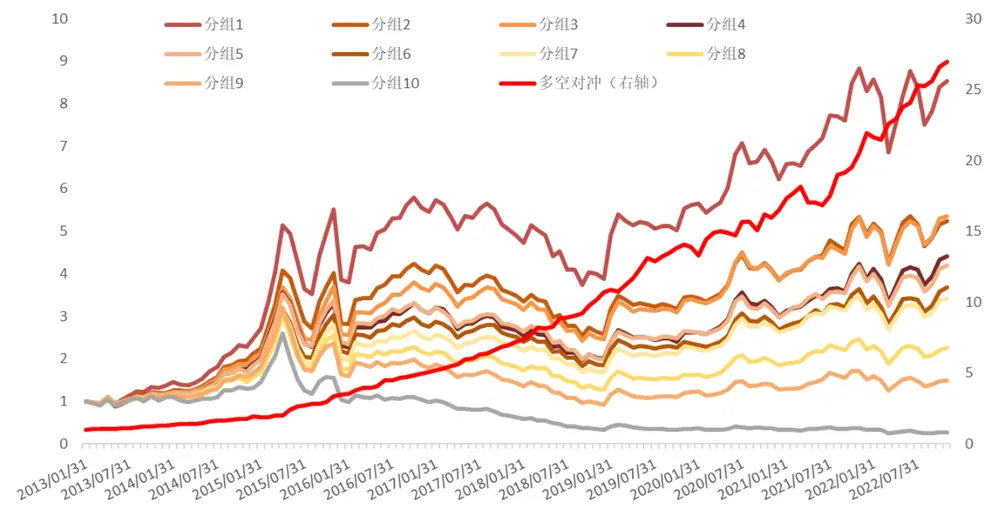
资料来源：米筐，Wind，方正证券研究所

## 3.2 个人投资者交易占比

此外，从投资者交易占比来看，小市值股票的个人投资交易者占比相对更高，更容易受到情绪影响而出现反应过度的现象。因此我们计算每日个股的个人投资者交易占比，并将其加入权重的部分，构造“个人投资者交易比-惊恐”因子。具体步骤如下：

1）参考 wind资金流指标定义，我们将单笔成交金额小于 4 万元的交易，视为个人投资者交易。我们计算每天个股个人投资者卖出和买入的金额均值，再除以个股的当日总体成交金额，得到当日个股的个人投资者交易比。

2）如上述计算每天的收益率和“惊恐度”。

3）将每天的个人投资者交易比、“惊恐度”和收益率相乘，作为当日的加权决策分。

4）每月月底，分别计算过去20 日的加权决策分的均值和标准差，记为“个人投资者交易比-惊恐收益”因子和“个人投资者交易比-惊恐波动”因子，并将二者等权合成为“个人投资者交易比-惊恐”因子。

图表6： “个人投资者交易比-惊恐”因子测试

| 因子名称 | Rank IC | Rank ICIR | t值 | 年化收益率 | 年化波动率 | 信息比率 | 月度胜率 | 最大回撤 |
| --- | --- | --- | --- | --- | --- | --- | --- | --- |
| 惊恐收益因子 | -7.49% | -3.31 | -10.06 | 23.45% | 11.70% | 2.00 | 72.27% | 10.27% |
| 惊恐波动因子 | -8.66% | -2.98 | -8.2 | 23.09% | 13.40% | 1.72 | 70.59% | 12.14% |
| 原始惊恐因子 | -9.32% | -3.87 | -10.89 | 26.49% | 12.12% | 2.19 | 78.15% | 10.98% |
| 个人投资者交易比-惊恐收益因子 | -6.99% | -3.07 | -9.14 | 25.77% | 11.90% | 2.16 | 74.79% | 11.96% |
| 个人投资者交易比-惊恐波动因子 | -8.47% | -3.05 | -9.1 | 24.59% | 11.80% | 2.08 | 74.79% | 10.86% |
| 个人投资者交易比-惊恐因子 | -9.35% | -3.92 | -11.79 | 30.62% | 10.75% | 2.85 | 79.83% | 7.53% |

资料来源：米筐，Wind，方正证券研究所

从测试结果来看，上述三个因子 Rank IC 分别为-6.99%、-8.47%和-9.35%，Rank ICIR 达到-3.07、-3.05 和-3.92，年化收益率达 25.77%、24.59%和 30.62%，选股效果较为优秀。相较于“原始惊恐”因子，同样具有一定的改进效果。

图表7： “个人投资者交易比-惊恐”因子十分组及多空对冲净值走势
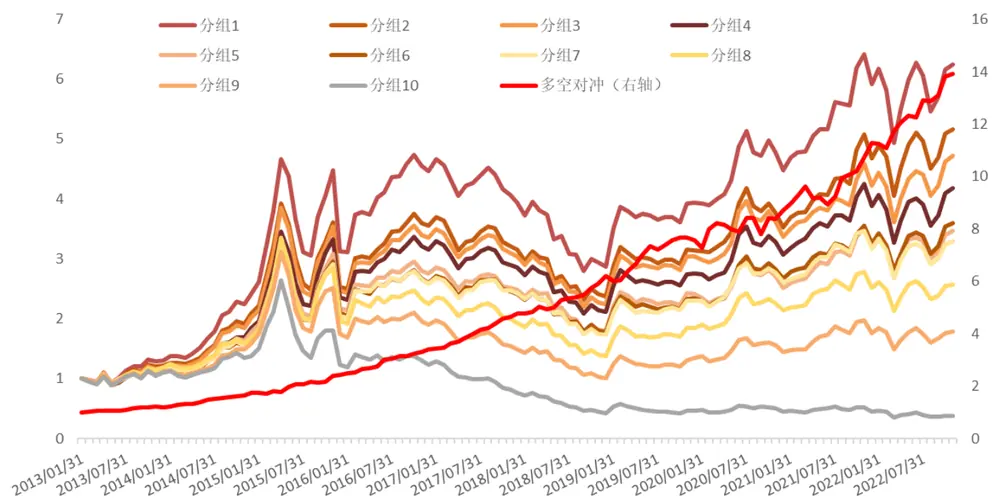
资料来源：米筐，Wind，方正证券研究所

## 3.3 注意力衰减

除了上述两个在文献中提及的改进方向外，本文考虑到短暂的连续异于市场的收益率，会引起投资者注意力的衰减，或恐慌情绪得到了适应和缓解，因此我们考虑将“惊恐度”减去过去两天的均值，构造衰减后的“惊恐度”，并将其加入权重的部分，构造“注意力衰减-惊恐”因子。具体步骤如下：

1）计算每天的“惊恐度”，将 t 日的惊恐度，减去 t-1 日和 t-2 日的“惊恐度”的均值，得到一个差值，由于该差值需要作为权重信息来使用，因此要保证指标为正数，这里将该差值为负的交易日的数据都替换为空值，仅保留将t日的惊恐度大于t-1日和 t-2 日的“惊恐度”

均值的交易日，将其记为衰减后的“惊恐度”。

2）计算每天的收益率。

3）将每天的衰减后的“惊恐度”和收益率相乘，作为当日的加权决策分。

4）每月月底，分别计算过去20 日的加权决策分的均值和标准差（由于上述差值为负的日子都替换为了空值，导致衰减后的“惊恐度”覆盖度较低，因此本处为了提高最终因子覆盖率，只要每月加权决策分数据足够5条，就可以计算，下同），记为“注意力衰减-惊恐收益”因子和“注意力衰减-惊恐波动”因子，并将二者等权合成为“注意力衰减-惊恐”因子。

图表8： “注意力衰减-惊恐”因子测试

| 因子名称 | Rank IC | Rank ICIR | t值 | 年化收益率 | 年化波动率 | 信息比率 | 月度胜率 | 最大回撤 |
| --- | --- | --- | --- | --- | --- | --- | --- | --- |
| 惊恐收益因子 | -7.49% | -3.31 | -10.06 | 23.45% | 11.70% | 2.00 | 72.27% | 10.27% |
| 惊恐波动因子 | -8.66% | -2.98 | -8.2 | 23.09% | 13.40% | 1.72 | 70.59% | 12.14% |
| 原始惊恐因子 | -9.32% | -3.87 | -10.89 | 26.49% | 12.12% | 2.19 | 78.15% | 10.98% |
| 注意力衰减-惊恐收益因子 | -7.60% | -3.76 | -11.46 | 22.28% | 9.93% | 2.24 | 74.79% | 7.68% |
| 注意力衰减-惊恐波动因子 | -7.90% | -3.28 | -9 | 17.40% | 9.97% | 1.74 | 69.75% | 8.60% |
| 注意力衰减-惊恐因子 | -8.73% | -4.20 | -11.9 | 25.39% | 9.45% | 2.69 | 79.83% | 8.90% |

资料来源：米筐，Wind，方正证券研究所

从测试结果来看，上述三个因子 Rank IC 分别为-7.60%、-7.90%和-8.73%，Rank ICIR 达到-3.76、-3.28 和-4.20，年化收益率为 22.28%、17.40%和 25.39%，选股效果较为优秀。相较于“原始惊恐”因子，Rank IC 和多空收益有所降低，但稳定性有所提高，有一定的改进效果。

图表9： “注意力衰减-惊恐”因子十分组及多空对冲净值走势
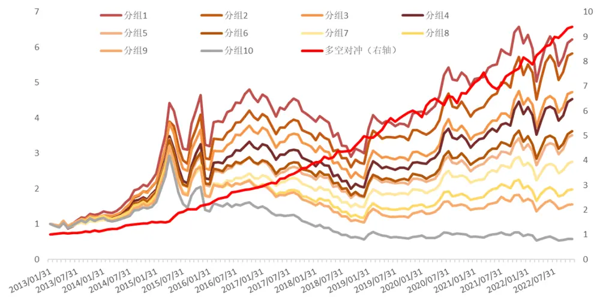
资料来源：米筐，Wind，方正证券研究所

## 3.4 “草木皆兵”因子

基于上述构造的“原始惊恐”因子和三个改进方向，我们将它们结合在一起，构造“草木皆兵”因子。具体步骤如下：

1）如上述，分别计算每天个股的波动率、个人投资者交易比、衰减后的“惊恐度”、收益率。

2）将每天的衰减后的“惊恐度”、波动率、个人投资者者交易比、收益率相乘，作为当日的加权决策分。

每月月底，分别计算过去 20 日的加权决策分的均值和标准差，记为“草木皆兵-收益”因子和“草木皆兵-波动”因子，并将二者等权合成为“草木皆兵”因子。

我们对“草木皆兵”因子在月度频率上进行选股效果测试。

图表10： “草木皆兵”因子测试

| 因子名称 | Rank IC | Rank ICIR | t值 | 年化收益率 | 年化波动率 | 信息比率 | 月度胜率 | 最大回撤 |
| --- | --- | --- | --- | --- | --- | --- | --- | --- |
| 草木皆兵-收益因子 | -7.69% | -4.21 | -12.67 | 28.92% | 9.06% | 3.19 | 81.51% | 6.96% |
| 草木皆兵-波动因子 | -7.88% | -3.47 | -9.9 | 24.26% | 9.72% | 2.50 | 77.31% | 10.09% |
| 草木皆兵因子 | -8.90% | -4.54 | -13.12 | 32.50% | 8.29% | 3.92 | 85.71% | 4.05% |

资料来源：米筐，Wind，方正证券研究所

从测试结果来看，上述三个因子 Rank IC 分别为-7.69%、-7.88%和-8.90%，Rank ICIR 达到-4.21、-3.47 和-4.54，年化收益率达 28.92%、24.26%和 32.50%，选股效果非常优秀。并且相较于“20 日收益率因子”、“20 日波动率因子”、“原始惊恐”因子，效果均提升非常明显。

从十分组表现来看，各组保持严格的单调性，多头组合年化收益率 22.64%，空头组合年化收益率-8.43%，整体区分能力较佳。

图表11：“草木皆兵”因子十分组绩效

| 因子名称 | 累积收益率 | 年化收益率 | 年化波动率 | 信息比率 | 月度胜率 | 最大回撤 |
| --- | --- | --- | --- | --- | --- | --- |
| 分组1 | 643.91% | 22.64% | 29.41% | 76.97% | 55.08% | 39.57% |
| 分组2 | 438.68% | 18.68% | 28.74% | 64.99% | 55.08% | 39.94% |
| 分组3 | 418.65% | 18.22% | 28.31% | 64.36% | 54.24% | 39.17% |
| 分组4 | 332.68% | 16.06% | 27.94% | 57.50% | 55.93% | 41.64% |
| 分组5 | 243.97% | 13.39% | 28.18% | 47.51% | 54.24% | 47.31% |
| 分组6 | 222.47% | 12.65% | 27.48% | 46.02% | 54.24% | 46.24% |
| 分组7 | 187.72% | 11.35% | 28.05% | 40.45% | 54.24% | 50.43% |
| 分组8 | 144.43% | 9.52% | 28.45% | 33.45% | 55.08% | 57.80% |
| 分组9 | 57.27% | 4.71% | 29.85% | 15.79% | 53.39% | 68.85% |
| 分组10 | -57.92% | -8.43% | 30.63% | -27.51% | 46.61% | 85.39% |

资料来源：米筐，Wind，方正证券研究所

图表12：“草木皆兵”因子十分组及多空对冲净值走势
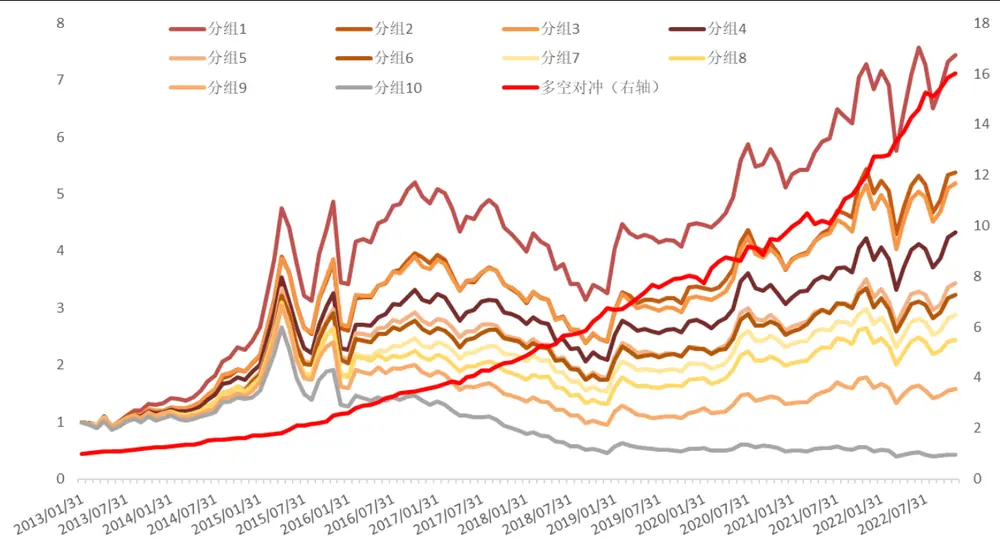
资料来源：米筐，Wind，方正证券研究所

分年度来看，“草木皆兵”因子各年份表现均较为显著，大多数年份各分组表现整体单调性较为明显。

图表13：“草木皆兵”分年度表现

|  | 年份 | 分组1 | 分组2 | 分组3 | 分组4 | 分组5 | 分组6 | 分组7 | 分组8 | 分组9 | 分组10 | 多空组合 |
| --- | --- | --- | --- | --- | --- | --- | --- | --- | --- | --- | --- | --- |
|  | 2013年 | 33.75% | 18.92% | 20.45% | 16.73% | 10.14% | 12.59% | 9.25% | 15.36% | 14.94% | 7.01% | 24.55% |
|  | 2014年 | 81.72% | 70.29% | 70.27% | 61.97% | 58.05% | 51.89% | 45.72% | 43.53% | 34.71% | 33.21% | 37.13% |
|  | 2015年 | 41.82% | 30.42% | 32.66% | 21.14% | 23.13% | 22.39% | 15.79% | 10.30% | 4.93% | -8.37% | 49.45% |
|  | 2016年 | 40.33% | 43.60% | 35.32% | 35.05% | 26.27% | 22.05% | 24.78% | 14.19% | 11.59% | 0.06% | 40.63% |
|  | 2017年 | -14.15% | -14.36% | -11.47% | -8.09% | -9.18% | -5.84% | -6.25% | -13.27% | -21.69% | -35.58% | 31.99% |
|  | 2018年 | -21.38% | -25.57% | -25.63% | -26.22% | -28.07% | -27.79% | -29.12% | -27.64% | -33.37% | -45.69% | 42.53% |
|  | 2019年 | 37.49% | 39.79% | 31.89% | 32.86% | 30.89% | 31.28% | 32.36% | 33.70% | 25.19% | 15.85% | 17.74% |
|  | 2020年 | 13.89% | 8.38% | 15.07% | 10.42% | 12.25% | 10.80% | 14.11% | 13.30% | 10.95% | -7.91% | 21.86% |
|  | 2021年 | 33.68% | 36.93% | 28.89% | 24.89% | 22.61% | 19.47% | 17.93% | 20.05% | 21.55% | 0.42% | 31.38% |
| 2022年 |  | 8.85% | 7.40% | 9.38% | 12.58% | 7.98% | 6.83% | 5.67% | 2.71% | -1.53% | -14.10% | 25.85% |

资料来源：米筐，Wind，方正证券研究所

分行业来看，“草木皆兵”因子在全部一级行业内都表现较为出色，大多数行业内IC 均值超过-8%，其中综合、公用事业、商贸零售等行业表现相对更好。

图表14：“草木皆兵”因子在全部一级行业中均表现较为出色（IC 均值）
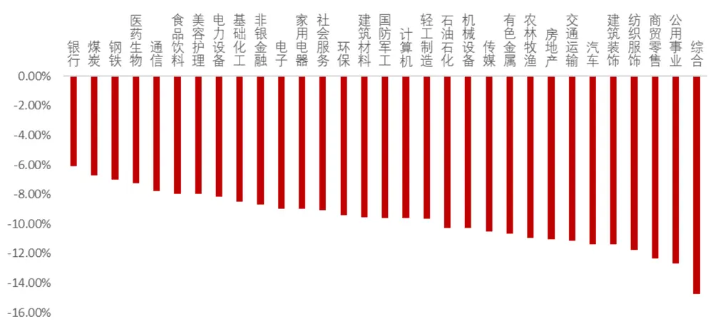
资料来源：米筐，Wind，方正证券研究所

## 3.5 剥离其他风格因子影响后“草木皆兵”因子仍然表现较好

从上述测试结果来看，“草木皆兵”因子选股能力出色，进一步，我们测试其与其他常见风格因子的相关性，如下图所示，“草木皆兵”因子与流动性、波动率因子相关性较高，与其余因子相关性均较低。为进一步验证因子的增量信息，我们使用常用风格因子及行业因子对“草木皆兵”因子进行正交化处理，得到“纯净草木皆兵”因子，再检验其选股能力。

图表15：与常见风格因子相关性测试
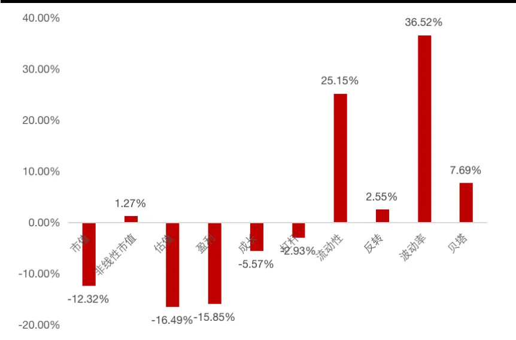
资料来源：米筐，Wind，方正证券研究所

图表16：剥离常见风格因子影响后“草木皆兵”因子绩效

| 因子名称 | Rank IC | Rank ICIR | t值 | 年化收益率 | 年化波动率 | 信息比率 | 月度胜率 | 最大回撤 |
| --- | --- | --- | --- | --- | --- | --- | --- | --- |
| 纯净草木皆兵因子 | -3.59% | -1.86 | -5.81 | 16.40% | 8.07% | 2.03 | 71.19% | 7.08% |

资料来源：米筐，Wind，方正证券研究所

可以看到，在剔除了常用的风格因子影响后，“草木皆兵”因子仍然具有很好的选股能力，Rank IC 均值为-3.59%，Rank ICIR 为-1.86，多空组合年化收益率 16.40%，信息比率 2.03。

图表17：“纯净草木皆兵”因子十分组及多空对冲净值走势
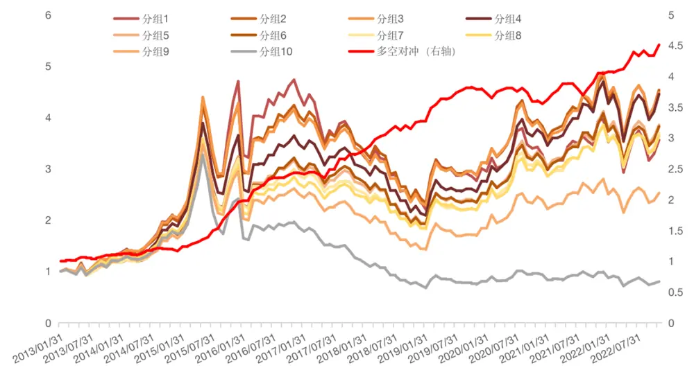
资料来源：米筐，Wind，方正证券研究所

## 3.6 “草木皆兵”因子在不同样本空间下的表现

为了检验“草木皆兵”因子在其他样本空间下的选股表现，我们分别选取了沪深 300 成分股、中证 500 成分股、中证 1000 成分股作为股票池，测试其选股能力。可以看到，“草木皆兵”因子在沪深 300、中证500、中证 1000指数成分股内均表现不俗，多头组合年化超额收益分别为 7.42%、9.74%和 10.15%。

图表18：不同样本空间下“草木皆兵”因子表现

| 样本空间 | Rank IC | Rank ICIR | t值 | 年化收益率 | 年化波动率 | 信息比率 | 月度胜率 | 最大回撤 |
| --- | --- | --- | --- | --- | --- | --- | --- | --- |
| 沪深300成分股 | -3.86% | -1.63 | -5.1 | 15.34% | 11.02% | 1.39 | 68.64% | 12.51% |
| 中证500成分股 | -5.67% | -2.55 | -8.0 | 16.65% | 10.37% | 1.61 | 68.64% | 13.05% |
| 中证1000成分股 | -7.75% | -3.92 | -11.1 | 26.50% | 9.35% | 2.83 | 75.26% | 5.86% |

资料来源：米筐，Wind，方正证券研究所

图表19：不同样本空间下“草木皆兵”因子多头超额表现

| 样本空间 | 累积收益率 | 年化收益率 | 年化波动率 | 信息比率 | 月度胜率 | 最大回撤 |
| --- | --- | --- | --- | --- | --- | --- |
| 沪深300多头超额 | 102.15% | 7.42% | 11.27% | 0.66 | 60.50% | 20.80% |
| 中证500多头超额 | 149.44% | 9.74% | 8.08% | 1.20 | 62.18% | 9.27% |
| 中证1000多头超额 | 118.50% | 10.15% | 8.22% | 1.23 | 63.27% | 10.38% |

资料来源：米筐，Wind，方正证券研究所

图表20：沪深 300/中证 500/中证 1000指数成分股内多空表现
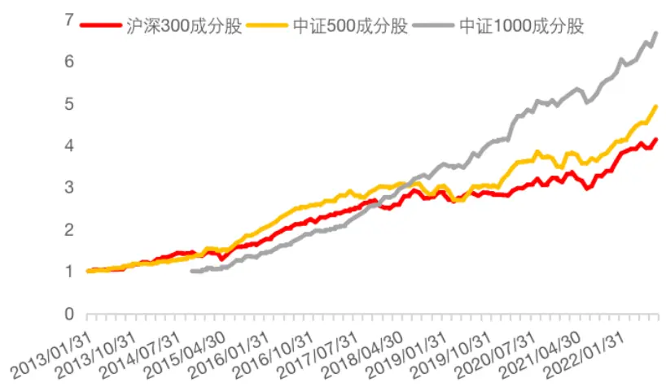
资料来源：米筐，Wind，方正证券研究所

图表21： 沪深 300/中证 500/中证 1000指数多头组合超额表现
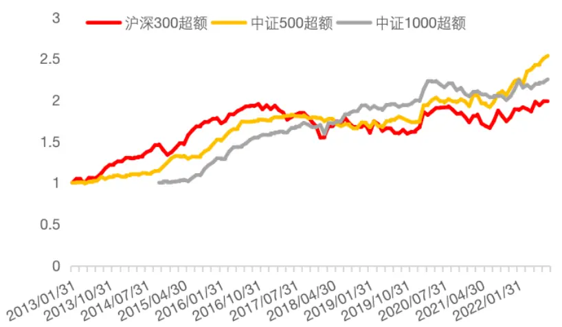
资料来源：米筐，Wind，方正证券研究所

## 3.7 周频调仓情形下因子表现更佳

本文中“草木皆兵”因子的构建过程中我们综合使用了分钟频与日频交易数据，但在最终测试及使用中将其低频化至月度频率使用，如我们能够在周度频率上应用，因子的表现相对更佳，多头组合年化收益率约为39.81%，多空组合年化收益率为 58.79%。

图表22：“草木皆兵”因子周频调仓十分组及多空对冲净值走势
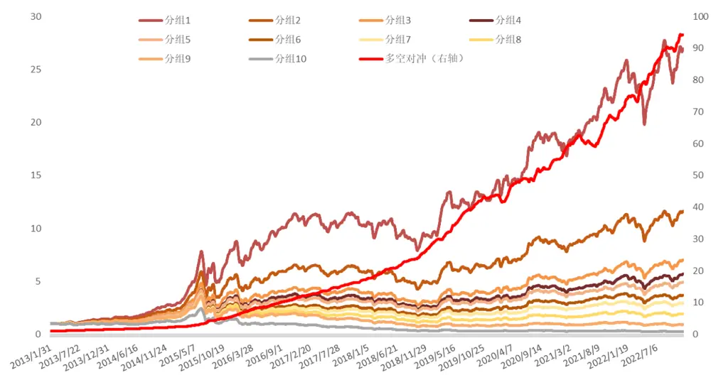
资料来源：米筐，Wind，方正证券研究所

图表23：“草木皆兵”因子周频调仓十分组分年度表现

|  | 年份 | 分组1 | 分组2 | 分组3 | 分组4 | 分组5 | 分组6 | 分组7 | 分组8 | 分组9 | 分组10 | 多空组合 |
| --- | --- | --- | --- | --- | --- | --- | --- | --- | --- | --- | --- | --- |
|  | 2013年 | 45.12% | 33.39% | 21.78% | 17.99% | 19.60% | 11.14% | 14.71% | 13.54% | 12.52% | -4.06% | 51.09% |
|  | 2014年 | 88.57% | 69.07% | 58.09% | 48.72% | 48.48% | 44.33% | 41.06% | 36.79% | 45.17% | 25.88% | 49.60% |
|  | 2015年 | 200.43% | 134.42% | 104.11% | 93.87% | 79.61% | 70.50% | 58.53% | 59.13% | 34.52% | 9.19% | 173.94% |
|  | 2016年 | 34.21% | 19.61% | 7.72% | 6.79% | 4.16% | -2.09% | -4.71% | -14.60% | -15.88% | -31.63% | 94.85% |
|  | 2017年 | -5.58% | -6.32% | -7.03% | -6.99% | -6.56% | -7.66% | -11.21% | -18.30% | -30.45% | -34.91% | 44.63% |
|  | 2018年 | -11.96% | -19.59% | -24.02% | -24.75% | -24.79% | -27.29% | -27.55% | -32.49% | -41.08% | -45.72% | 61.33% |
|  | 2019年 | 53.23% | 44.63% | 40.85% | 38.13% | 38.86% | 38.35% | 29.54% | 23.71% | 13.12% | -2.50% | 55.85% |
|  | 2020年 | 28.62% | 21.22% | 21.47% | 22.69% | 19.12% | 21.24% | 21.62% | 18.36% | 13.72% | 1.07% | 26.12% |
|  | 2021年 | 40.65% | 34.47% | 33.02% | 29.23% | 24.22% | 27.50% | 25.60% | 28.02% | 15.71% | 7.61% | 30.14% |
| 2022年 |  | 6.03% | 3.53% | 3.37% | 2.43% | 2.96% | -3.60% | -4.88% | -11.23% | -18.66% | -19.32% | 30.83% |

资料来源：米筐，Wind，方正证券研究所

## 4 风险提示

本报告基于历史数据分析，历史规律未来可能存在失效的风险；市场可能发生超预期变化；各驱动因子受环境影响可能存在阶段性失效的风险。

## 参考文献

[1] Cosemans M, Frehen R. Salience theory and stock prices: Empirical evidence[J]. Journal of Financial Economics, 2021, 140(2): 460-483.

[2] Cakici N, Zaremba A. Salience theory and the cross-section of stock returns: International and further evidence[J]. Journal of Financial Economics, 2021.

## 分析师声明

作者具有中国证券业协会授予的证券投资咨询执业资格，保证报告所采用的数据和信息均来自公开合规渠道，分析逻辑基于作者的职业理解，本报告清晰准确地反映了作者的研究观点，力求独立、客观和公正，结论不受任何第三方的授意或影响。研究报告对所涉及的证券或发行人的评价是分析师本人通过财务分析预测、数量化方法、或行业比较分析所得出的结论，但使用以上信息和分析方法存在局限性。特此声明。

## 免责声明

本研究报告由方正证券制作及在中国（香港和澳门特别行政区、台湾省除外）发布。根据《证券期货投资者适当性管理办法》，本报告内容仅供我公司适当性评级为C3及以上等级的投资者使用，本公司不会因接收人收到本报告而视其为本公司的当然客户。若您并非前述等级的投资者，为保证服务质量、控制风险，请勿订阅本报告中的信息，本资料难以设置访问权限，若给您造成不便，敬请谅解。

在任何情况下，本报告的内容不构成对任何人的投资建议，也没有考虑到个别客户特殊的投资目标、财务状况或需求，方正证券不对任何人因使用本报告所载任何内容所引致的任何损失负任何责任，投资者需自行承担风险。

本报告版权仅为方正证券所有，本公司对本报告保留一切法律权利。未经本公司事先书面授权，任何机构或个人不得以任何形式复制、转发或公开传播本报告的全部或部分内容，不得将报告内容作为诉讼、仲裁、传媒所引用之证明或依据，不得用于营利或用于未经允许的其它用途。如需引用、刊发或转载本报告，需注明出处且不得进行任何有悖原意的引用、删节和修改。

## 公司投资评级的说明：

强烈推荐：分析师预测未来半年公司股价有20%以上的涨幅；

推荐：分析师预测未来半年公司股价有10%以上的涨幅；

中性：分析师预测未来半年公司股价在-10%和10%之间波动；

减持：分析师预测未来半年公司股价有10%以上的跌幅。

## 行业投资评级的说明：

推荐：分析师预测未来半年行业表现强于沪深300指数；

中性：分析师预测未来半年行业表现与沪深300指数持平；

减持：分析师预测未来半年行业表现弱于沪深300指数。

| 地址 | 网址：https://www.foundersc.com | E-mail:yjzx@foundersc.com |
| --- | --- | --- |
| 北京 | 西城区展览馆路48号新联写字楼6层 |  |
| 上海 | 静安区延平路71号延平大厦2楼 |  |
| 上海 | 浦东新区世纪大道1168号东方金融广场 A 栋 1001 室 |  |
| 深圳 | 福田区竹子林紫竹七道光大银行大厦31层 |  |
| 广州 | 天河区兴盛路12号楼隽峰苑2期3层方正证券 |  |
| 长沙 | 天心区湘江中路二段36号华远国际中心37层 |  |