# 因子——多因子选股系列研究之九

## 方正证券研究所证券研究报告

金融工程研究

[分析师：TABLE_ SISINFO 曹春晓]

登记编号：S1220522030005

[Table_Author] 联系 陈宗伟

## 相关研究

[《成交量激增时刻蕴含的TABLE_REPORTINFO] alpha 信息—— 多 因 子 选 股 系 列 研 究 之 一 》2022.04.12

《个股成交量的潮汐变化及“潮汐”因子构建——多因子选股系列研究之二》2022.05.08

《个股波动率的变动及“勇攀高峰”因子构建——多因子选股系列研究之三》2022.05.30

《个股动量效应的识别及“球队硬币”因子构建——多因子选股系列之四》2022.06.11

《波动率的波动率与投资者模糊性厌恶——多因子选股系列研究之五》2022.08.04

《个股股价跳跃及其对振幅因子的改进——多因子选股系列研究之六》2022.09.22

《基于Wind偏股混合型基金指数的增强选股策略——多因子选股系列研究之七》2022.10.24

《显著效应、极端收益扭曲决策权重和“草木皆兵”因子——多因子选股系列研究之八》2022.12.13

2023.2.15

## 投资要点

个股的成交额跟随市场的趋势，是否预示着个股未来的收益率会相对较高呢？本文中我们分两种情况进行了讨论。

其一，当个股股价处于相对高位时，其成交额与其他股票成交额之间的关联性越高越好。当个股股价处于相对高位时，如果其成交额更多是由市场趋势带动的，而非个股独立交易影响，则表明此时投资者对该股票价格的看法仍然较为一致，没有出现较大分歧，因此其上涨趋势可能还没有结束；相反，如果个股在其价格高位时有很多与市场趋势无关的独立交易，则表明投资者存在较大分歧，上涨趋势或将结束。基于这一逻辑，我们构造了“随波逐流”因子，帮助我们选出那些价格处于相对高位，但成交额仍然没有异动（即跟随市场趋势）的股票。

其二，当市场分化不明显时，其成交额与其他股票成交额之间的关联性越低越好。当市场分化不明显时，市场上个股的收益率趋于一致，没有热点主题，那么此时存在更多独立于市场交易的股票，更有可能在酝酿新的热点。基于这一逻辑，我们构造了“孤雁出群”因子，帮助我们选出那些市场分化不明显时，成交额出现异动（即不跟随市场趋势）的股票。

我们将“随波逐流”因子与“孤雁出群”因子等权合成，构造了“水中行舟”因子。我们对“水中行舟”因子在月度频率上的选股效果进行测试，结果显示 “水中行舟”因子表现非常出色，Rank IC 达-9.36%，Rank ICIR 为-4.95，多空组合年化收益率达 36.24%，信息比 4.40，因子月度胜率 86.67%。此外，在剔除了常用的风格因子影响后，“水中行舟”因子仍然具有非常强的选股能力，Rank IC 均值为-4.71%，Rank ICIR 为-4.36，多空组合年化收益率 17.59%，信息比率3.34。

主流宽基指数中，“水中行舟”因子在沪深300、中证500、中证1000指数成分股内均表现不俗，多头组合年化超额收益分别为 9.48%、9.71%、18.51%。

## 风险提示

本报告基于历史数据分析，历史规律未来可能存在失效的风险；市场可能发生超预期变化；各驱动因子受环境影响可能存在阶段性失效的风险。

## 1 引言

个股的成交额跟随市场的趋势，是否预示着个股未来的收益率会相对较高呢？对于这个问题我们认为并没有唯一的结论，当市场情景发生变化时，结论也会随之变化。

本文中我们分别考察了两种不同情形下的个股成交额与其他股票成交额趋势之间的关联性。并构造了两个逻辑不同、方向相反、相关性几乎为0的因子——“随波逐流”因子和“孤雁出群”因子，并将二者等权合成为“水中行舟”因子。

其一，当个股股价处于相对高位时，其成交额与其他股票成交额之间的关联性越高越好。当个股股价处于相对高位时，如果成交额更多是由市场趋势带动，而非个股独立交易影响，则表明此时投资者对该股票价格的看法仍然较为一致，没有出现较大分歧，因此其上涨趋势可能还没有结束；相反，如果个股在其价格高位时有很多与市场趋势无关的独立交易，则表明投资者存在较大分歧，上涨趋势或将结束。基于这一逻辑，我们构造了“随波逐流”因子，帮助我们选出那些价格处于相对高位，但成交额仍然没有异动（即跟随市场趋势）的股票。

其二，当市场分化不明显时，其成交额与其他股票成交额之间的关联性越低越好。当市场分化不明显时，市场上个股的收益率趋于一致，没有热点主题，那么此时那些存在更多独立于市场交易的股票，更有可能在酝酿新的热点。基于这一逻辑，我们构造了“孤雁出群”因子，帮助我们选出那些市场分化不明显时，成交额出现异动（即不跟随市场趋势）的股票。

最终，我们将“随波逐流”因子与“孤雁出群”因子等权合成，构造了“水中行舟”因子。

## 2 “水中行舟”因子构建及测试

## 2.1 “随波逐流”因子

根据上述逻辑，我们首先考察在个股股价处于相对高位时，其成交额与其他股票成交额之间的关联性，并构造“随波逐流”因子，具体步骤如下：

1）对于股票A，每天计算 t日及过去19个交易日（t-1、t-2、t-3……t-19 日）的日内收益率（收盘价/开盘价-1）的均值。我们将这一收益率，视为最近一段时间里个股A的合理日内收益率，将其称为t日“合理收益率”。

2）对于股票 A，取其 1 分钟频率的数据，剔除集合竞价数据，计算每分钟的收盘价相对于这一天的开盘价的收益率（分钟 i收盘价/当日开盘-1），得到每分钟的“相对开盘收益率”。

3）在全天 240 个交易分钟里，将那些“相对开盘收益率”大于当日“合理收益率” 的分钟，视为价格处于相对高位的时刻；而那些“相对开盘收益率”小于当日“合理收益率”的分钟，为价格处于相对低位的时刻。

4）分别计算t日里，价格处于相对高位的分钟成交额之和，记为“高位成交额”；以及价格处于相对低位的分钟成交额之和，记为“低位成交额”。

5）使用 t日的“高位成交额”减去t日的“低位成交额”，再除以当日收盘时的流通市值，得到股票A 在 t日在价格处于相对高位时的相对成交额，记为“高低额差”。

6）每月月底，取所有股票过去 20个交易日的“高低额差”序列。分别计算每只股票与其余所有股票的“高低额差”序列之间的spearman 相关系数（此处使用 spearman 相关系数，是为了剔除“高低额差”指标本身大小的影响，使其可以更好地刻画个股的“高低额差”在绝大多数时间里都与市场走势相关联，而非某几天值较大导致的）。

7）将上述的相关系数取绝对值，相关系数的绝对值越大，表明个股成交额与市场趋势之间的关联性越强；而相关系数的绝对值越小，表示个股成交额变化独立于市场趋势。最后，计算股票A 与其余股票的相关系数绝对值的均值，记为股票A的“随波逐流”因子。

根据前述的逻辑，价格处于相对高位时，相关系数越大的股票，投资者对其价格的分歧度越小，未来大概率表现较好。

下面我们在全 A 样本中按照月度频率对上述构建的“随波逐流”因子进行测试，测试中对因子进行市值和行业正交化处理，测试区间为2013 年 1 月至 2023 年 1 月（下同）。

图表1： “随波逐流”因子测试

| 因子名称 | Rank IC | Rank ICIR | t值 | 年化收益率 | 年化波动率 | 信息比率 | 月度胜率 | 最大回撤 |
| --- | --- | --- | --- | --- | --- | --- | --- | --- |
| 随波逐流因子 | 5.89% | 3.29 | 10.37 | 16.26% | 7.74% | 2.10 | 77.50% | 9.19% |

资料来源：米筐，Wind，方正证券研究所

从测试结果来看，上述“随波逐流”因子Rank IC分别为 5.89%，RankICIR 为3.29，多空组合年化收益率为 16.26%，具有较好的选股能力。

图表2： “随波逐流”因子十分组及多空对冲净值走势
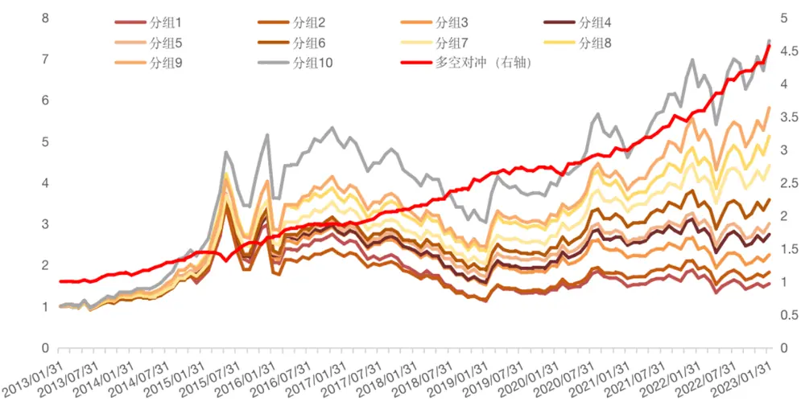
资料来源：米筐，Wind，方正证券研究所

## 2.2 “孤雁出群”因子

我们继续考察在市场分化不明显时，个股成交量与其他股票成交量之间的关联性，并构造“孤雁出群”因子。

1）对于交易日t，计算每只股票的分钟收益率（t分钟收盘价/t-1分钟收盘价-1）。

2）计算每一分钟所有股票的分钟收益率的标准差，作为这一分钟个股收益分化程度的指标，记为“分钟市场分化度”。

3）计算这一天所有“分钟市场分化度”的均值，找到那些“分钟市场分化度”小于均值的时刻，记为t日的“不分化时刻”。

4）取市场上所有股票在当日“不分化时刻”的成交额序列，然后分别计算每只股票的分钟成交额序列与其余股票分钟成交额序列的pearson 相关系数（此处使用 pearson 相关系数，是因为大部分股票在一天的交易时间里，大部分的时间交易并不活跃，特别是当市场相对清淡时，因此大部分的信息可能隐藏在少数的分钟里，因此这里我们不再使用spearman相关系数，而改为使用pearson相关系数，希望提高那些交易活跃的分钟在因子计算中的重要性及其所占的比重）。

5）将上述的相关系数取绝对值，然后分别计算每只股票与其余股票的相关系数绝对值的均值，记为“日孤雁出群”因子，作为这只股票在市场分化不明显时，其交易额与市场趋势的关联性的代理变量。根据前述逻辑，“日孤雁出群”因子越小，表示在市场清淡缺乏热点的情况下，该个股的成交额走出了独立趋势，很可能预示着新的热点正在孕育。

6）每月月底，分别计算过去 20 个交易日“日孤雁出群”因子的均值和标准差，得到“月均孤雁出群”因子和“月稳孤雁出群”因子，并将二者等权合成，得到“孤雁出群”因子。

图表3： “孤雁出群”因子测试

| 因子名称 | Rank IC | Rank ICIR | t值 | 年化收益率 | 年化波动率 | 信息比率 | 月度胜率 | 最大回撤 |
| --- | --- | --- | --- | --- | --- | --- | --- | --- |
| 月均孤雁出群因子 | -8.23% | -3.17 | -9.98 | 29.25% | 10.04% | 2.91 | 76.67% | 11.24% |
| 月稳孤雁出群因子 | -7.03% | -3.9 | -12.28 | 27.49% | 7.63% | 3.6 | 82.50% | 6.33% |
| 孤雁出群因子 | -8.20% | -3.55 | -11.18 | 31.26% | 9.27% | 3.37 | 78.33% | 6.44% |

资料来源：米筐，Wind，方正证券研究所

从测试结果来看，上述三个因子 Rank IC 分别为-8.23%、-7.03%和-8.20%，Rank ICIR 为-3.17、-3.9 和-3.55，多空组合年化收益率为29.25%、27.49%和 31.26%，选股效果较为优秀。

图表4： “孤雁出群”因子十分组及多空对冲净值走势
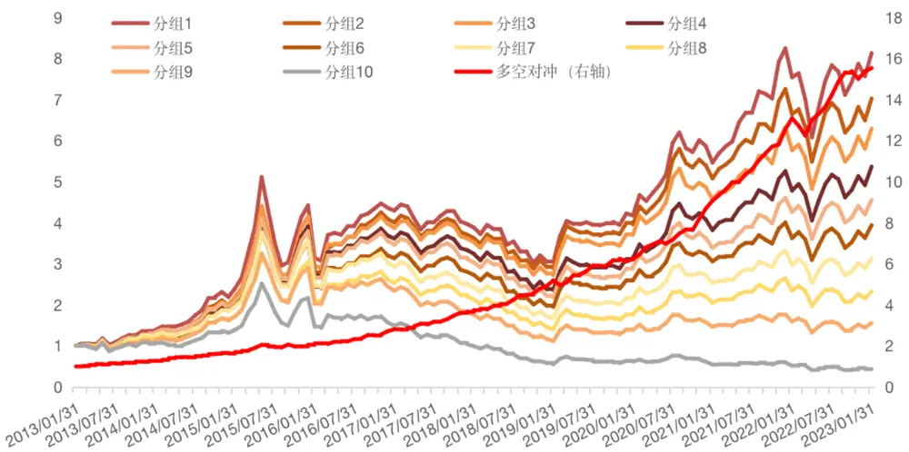
资料来源：米筐，Wind，方正证券研究所

## 2.3 “水中行舟”因子

上文中我们讨论了不同情形下，个股成交额与市场趋势的关联性，并构造了“随波逐流”因子和“孤雁出群”因子。这两个因子构建过程有部分类似，但因子逻辑和因子方向完全相反，同时二者相关性接近于 0。我们将二者等权合成，得到“水中行舟”因子，我们对“水中行舟”因子在月度频率上进行选股效果测试。

图表5： “水中行舟”因子测试

| 因子名称 | Rank IC | Rank ICIR | t值 | 年化收益率 | 年化波动率 | 信息比率 | 月度胜率 | 最大回撤 |
| --- | --- | --- | --- | --- | --- | --- | --- | --- |
| 水中行舟因子 | -9.36% | -4.95 | -15.61 | 36.24% | 8.24% | 4.40 | 86.67% | 3.23% |

资料来源：米筐，Wind，方正证券研究所

从测试结果来看，上述“水中行舟”因子Rank IC分别为-9.36%，RankICIR 为-4.95，多空组合年化收益率为 36.24%，信息比率高达 4.40，选股效果非常优秀。

从十分组表现来看，各组保持严格的单调性，多头组合年化收益率 26.36%，空头组合年化收益率-8.35%，整体区分能力较佳。

图表6： “水中行舟”因子十分组绩效

| 因子名称 | 累积收益率 | 年化收益率 | 年化波动率 | 信息比率 | 月度胜率 | 最大回撤 |
| --- | --- | --- | --- | --- | --- | --- |
| 分组1 | 939.14% | 26.36% | 28.95% | 91.06% | 59.17% | 35.87% |
| 分组2 | 675.30% | 22.72% | 28.40% | 79.99% | 58.33% | 35.13% |
| 分组3 | 497.29% | 19.56% | 28.25% | 69.22% | 55.83% | 38.81% |
| 分组4 | 416.73% | 17.84% | 28.36% | 62.90% | 56.67% | 43.29% |
| 分组5 | 358.13% | 16.43% | 27.86% | 58.96% | 55.83% | 44.91% |
| 分组6 | 249.83% | 13.33% | 27.98% | 47.65% | 55.00% | 48.74% |
| 分组7 | 210.71% | 12.00% | 28.52% | 42.07% | 53.33% | 53.45% |
| 分组8 | 115.29% | 7.97% | 28.36% | 28.09% | 50.83% | 60.27% |
| 分组9 | 63.87% | 5.06% | 29.08% | 17.40% | 52.50% | 65.08% |
| 分组10 | -58.20% | -8.35% | 29.96% | -27.87% | 46.67% | 84.90% |

资料来源：米筐，Wind，方正证券研究所

图表7： “水中行舟”因子十分组及多空对冲净值走势分年度来看，“水中行舟”因子各年份表现均较为显著，大多数年份各分组表现整体单调性较为明显。

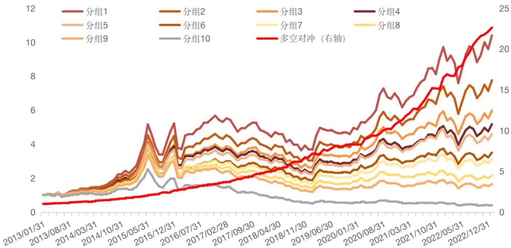
资料来源：米筐，Wind，方正证券研究所

图表8： “水中行舟”因子分年度表现

| 年份 | 分组1 | 分组2 | 分组3 | 分组4 | 分组5 | 分组6 | 分组7 | 分组8 | 分组9 | 分组10 | 多空组合 |
| --- | --- | --- | --- | --- | --- | --- | --- | --- | --- | --- | --- |
| 2013年 | 37.12% | 34.68% | 28.51% | 24.93% | 23.55% | 21.70% | 17.24% | 17.76% | 15.71% | 5.99% | 28.91% |
| 2014年 | 66.81% | 54.96% | 49.40% | 53.07% | 50.62% | 49.98% | 48.68% | 46.70% | 38.79% | 24.01% | 35.03% |
| 2015年 | 127.56% | 114.60% | 105.99% | 102.86% | 97.47% | 79.10% | 85.68% | 80.35% | 84.11% | 51.24% | 51.64% |
| 2016年 | 4.20% | -1.63% | -4.06% | -4.89% | -6.46% | -10.33% | -11.67% | -15.45% | -18.51% | -24.40% | 35.59% |
| 2017年 | -12.63% | -11.01% | -9.85% | -12.69% | -10.81% | -9.85% | -12.63% | -18.30% | -21.37% | -36.17% | 34.62% |
| 2018年 | -22.21% | -22.55% | -23.14% | -27.72% | -26.74% | -28.55% | -32.52% | -33.00% | -36.12% | -45.54% | 40.28% |
| 2019年 | 34.37% | 34.90% | 32.34% | 32.27% | 29.95% | 31.43% | 27.98% | 25.50% | 18.52% | 7.98% | 22.35% |
| 2020年 | 35.05% | 32.87% | 32.53% | 28.37% | 29.42% | 22.81% | 28.53% | 21.67% | 13.90% | 0.24% | 33.47% |
| 2021年 | 45.07% | 36.02% | 28.59% | 28.03% | 29.40% | 22.44% | 22.98% | 11.18% | 16.18% | -3.50% | 49.20% |
| 2022年 | -1.15% | -3.67% | -7.03% | -6.18% | -13.15% | -13.82% | -15.67% | -18.44% | -19.73% | -27.83% | 34.36% |
| 2023年 | 8.33% | 8.72% | 8.36% | 8.82% | 7.91% | 8.79% | 8.08% | 7.83% | 7.56% | 6.13% | 2.20% |

分行业来看，“水中行舟”因子在全部一级行业内都表现较为出色，大多数行业内IC 均值超过-6%。

图表9： “水中行舟”因子在全部一级行业中均表现较为出色（RankIC均值）

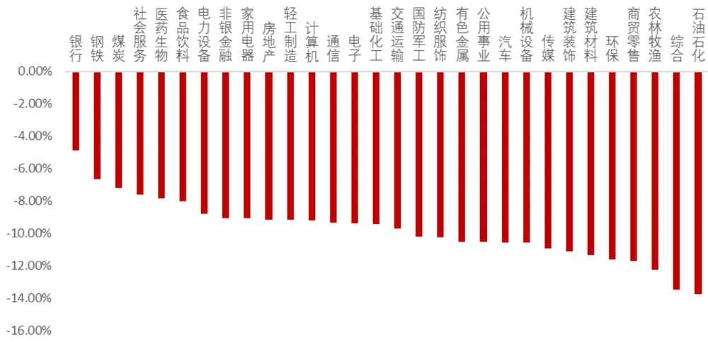
资料来源：米筐，Wind，方正证券研究所

## 2.4 剥离其他风格因子影响后“水中行舟”因子仍然表现较好

从上述测试结果来看，“水中行舟”因子选股能力出色，进一步，我们测试其与其他常见风格因子的相关性，如下图所示，“水中行舟”因子与流动性、波动率因子、估值因子相关性较高，与其余因子相关性均较低。为进一步验证因子的增量信息，我们使用常用风格因子及行业因子对“水中行舟”因子进行正交化处理，得到“纯净水中行舟”因子，再检验其选股能力。

图表10：与常见风格因子相关性测试
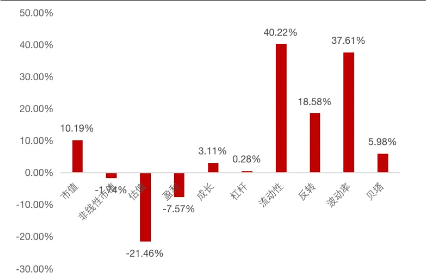
资料来源：米筐，Wind，方正证券研究所

图表11：剥离常见风格因子影响后“水中行舟”因子绩效

| 因子名称 |  | Rank IC Rank ICIR | t值 | 年化收益率 | 年化波动率 | 信息比率 | 月度胜率 | 最大回撤 |
| --- | --- | --- | --- | --- | --- | --- | --- | --- |
| 纯净水中行舟因子 | -4.71% | -4.36 | -13.75 | 17.59% | 5.26% | 3.34 | 85.83% | 3.88% |

资料来源：米筐，Wind，方正证券研究所

可以看到，在剔除了常用的风格因子影响后，“水中行舟”因子仍然具有很好的选股能力，Rank IC 均值为-4.71%，Rank ICIR 为-4.36，多空组合年化收益率为 17.59%，信息比率3.34。

图表12：“纯净水中行舟”因子十分组及多空对冲净值走势
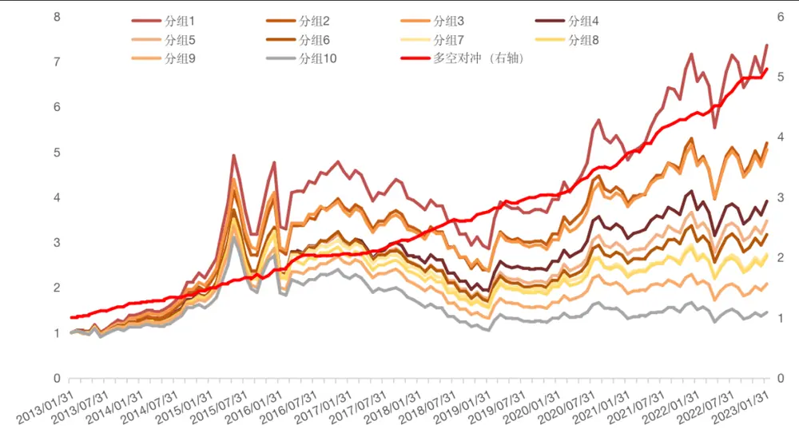
资料来源：米筐，Wind，方正证券研究所

## 2.5 “水中行舟”因子在不同样本空间下的表现

为了检验“水中行舟”因子在其他样本空间下的选股表现，我们分别选取了沪深 300 成分股、中证 500 成分股、中证 1000 成分股作为股票池，测试其选股能力。可以看到，“水中行舟”因子在沪深 300、中证500、中证 1000指数成分股内均表现不俗，多头组合年化超额收益分别为 9.48%、9.71%和 18.51%。

图表13：不同样本空间下“水中行舟”因子表现

| 样本空间 | Rank IC | Rank ICIR | t值 | 年化收益率 | 年化波动率 | 信息比率 | 月度胜率 | 最大回撤 |
| --- | --- | --- | --- | --- | --- | --- | --- | --- |
| 沪深300成分股 | -5.49% | -2.48 | -7.8 | 18.71% | 10.20% | 1.83 | 75.83% | 15.42% |
| 中证500成分股 | -6.60% | -2.95 | -9.3 | 18.58% | 9.54% | 1.95 | 70.83% | 7.71% |
| 中证1000成分股 | -9.05% | -4.62 | -13.2 | 39.11% | 8.77% | 4.46 | 85.86% | 5.06% |

资料来源：米筐，Wind，方正证券研究所

图表14：不同样本空间下“水中行舟”因子多头超额表现

| 样本空间 | 累积收益率 | 年化收益率 | 年化波动率 | 信息比率 | 月度胜率 | 最大回撤 |
| --- | --- | --- | --- | --- | --- | --- |
| 沪深300多头超额 | 147.46% | 9.48% | 12.78% | 0.74 | 61.16% | 21.71% |
| 中证500多头超额 | 152.71% | 9.71% | 8.00% | 1.21 | 59.50% | 11.38% |
| 中证1000多头超额 | 306.45% | 18.51% | 8.18% | 2.26 | 77.00% | 6.19% |

资料来源：米筐，Wind，方正证券研究所

图表15： 沪深 300/中证 500/中证 1000指数成分股内多空表现
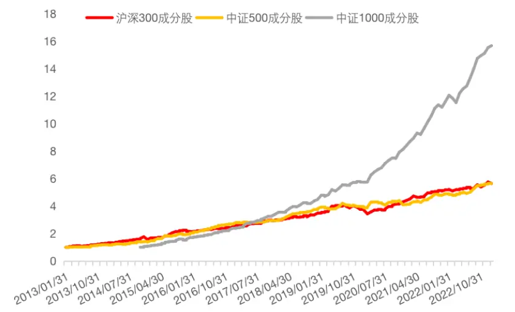
资料来源：米筐，Wind，方正证券研究所

图表16： 沪深 300/中证 500/中证 1000指数多头组合超额表现
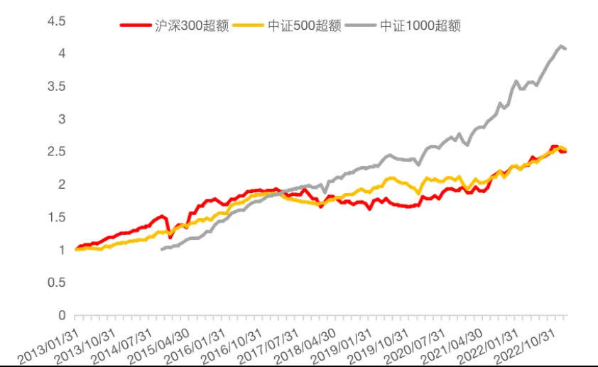
资料来源：米筐，Wind，方正证券研究所

## 2.6 指数增强模型下“水中行舟”因子有效性检验

我们进一步通过指增模型来验证“水中行舟”因子在沪深300/中证500/中证 1000 指数增强中的效果。这里我们仅通过“水中行舟”因子对股票收益进行打分预测，严格控制市值中性、行业中性、个股权重偏离在1%以内，同时约束指数成分股权重之和大于80%。

从组合历史表现来看，“水中行舟”因子在沪深300/中证 500/中证 1000指数增强中均表现较好，年化超额收益分别为7.71%、12.49%、17.80%，信息比分别为 2.18、2.52、2.95。

图表17：“水中行舟”300指增历史表现

图表18：“水中行舟”300 指增分年度表现

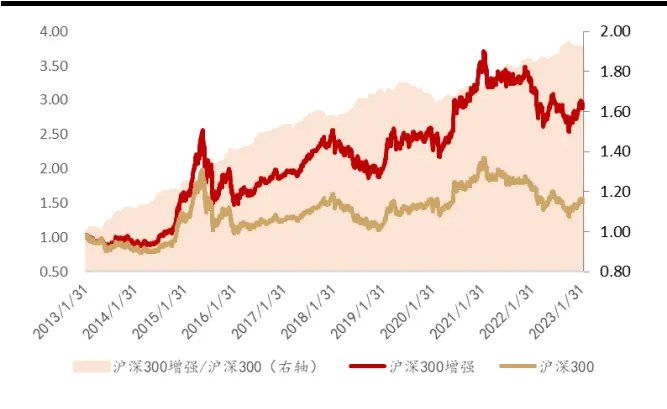
资料来源：Wind，方正证券研究所

|  | 沪深300增强 | 沪深300 | 超额收益 |
| --- | --- | --- | --- |
| 2013年 | -3.71% | -13.28% | 9.57% |
| 2014年 | 61.44% | 51.66% | 9.79% |
| 2015年 | 25.27% | 5.58% | 19.68% |
| 2016年 | -4.28% | -11.28% | 700% |
| 2017年 | 26.10% | 21.78% | 14.33% |
| 2018年 | -19.31% | -25.31% | 6.00% |
| 2019年 | 34.72% | 36.07% | -1.35% |
| 2020年 | 26.96% | 23.10% | 3.86% |
| 2021年 | 4.97% | -2.03% | 00% |
| 2022年 | -18.53% | -21.63% | 3.10% |
| 年化收益率 | 11.77% | 4.07% | 7.71% |

资料来源：Wind，方正证券研究所

图表19：“水中行舟”500指增历史表现
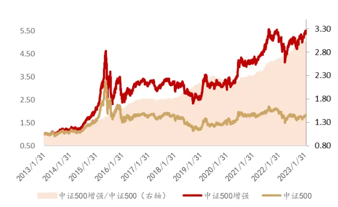
资料来源：Wind，方正证券研究所

图表20：“水中行舟”500指增分年度表现

|  | 中证500增强 | 中证500 | 超额收益 |
| --- | --- | --- | --- |
| 2013年 | 21.19% | 10.04% | 11.15% |
| 2014年 | 55.52% | 39.01% | 16. .51% |
| 2015年 | 82.41% | 43.12% | 39.30% |
| 2016年 | -7.37% | -17.78% | 10.41% |
| 2017年 | 0.11% | -0.20% | 0.31% |
| 2018年 | -21.39% | -33.32% | 11.93% |
| 2019年 | 29.55% | 26.38% | 3.17% |
| 2020年 | 25.17% | 17.70% | 7.47% |
| 2021年 | 36.57% | 18.70% | 17.86% |
| 2022年 | -7.81% | -20.31% | 12.50% |
| 年化收益率 | 17.89% | 5.40% | 12.49% |

资料来源：Wind，方正证券研究所

图表21：“水中行舟”1000指增历史表现
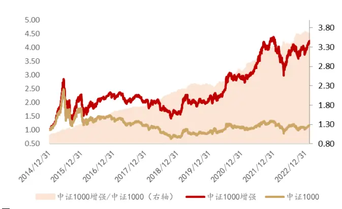
资料来源：Wind，方正证券研究所

图表22：“水中行舟”1000指增分年度表现

|  | 中证1000增强 | 中证1000 | 超额收益 |
| --- | --- | --- | --- |
| 2015年 | 125.13% | 76.10% | 49.04% |
| 2016年 | -0.33% | -20.01% | 19.68% |
| 2017年 | -9.57% | -17.35% | 7.78% |
| 2018年 | -22.71% | -36.87% | 14.16% |
| 2019年 | 35.43% | 25.67% | 9.76% |
| 2020年 | 34.93% | 16.35% | 18.58% |
| 2021年 | 52.93% | 23.67% | 29.26% |
| 2022年 | -12.39% | -21.58% | 9.19% |
| 年化收益率 | 18.31% | 0.52% | 17.80% |

资料来源：Wind，方正证券研究所

## 2.7 周频调仓情形下因子表现更佳

本文中“水中行舟”因子的构建过程中我们综合使用了分钟频与日频交易数据，但在最终测试及使用中将其低频化至月度频率使用，如我们能够在周度频率上应用，因子的表现相对更佳，多头组合年化收益率约为33.72%，多空组合年化收益率为 60.22%。

图表23：“水中行舟”因子周频调仓十分组及多空对冲净值走势

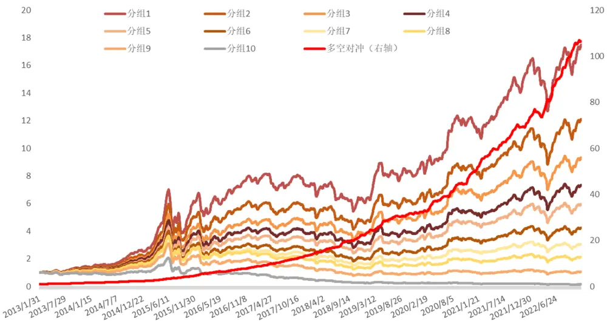
资料来源：米筐，Wind，方正证券研究所

图表24：“水中行舟”因子周频调仓十分组分年度表现

|  | 年份 | 分组1 | 分组2 分组3 |  | 分组4 分组5 |  | 分组6 | 分组7 | 分组8 | 分组9 | 分组10 | 多空组合 |
| --- | --- | --- | --- | --- | --- | --- | --- | --- | --- | --- | --- | --- |
|  | 2013年 | 43.00% | 35.09% | 27.40% | 23.82% | 19.83% | 18.25% | 13.88% | 12.45% | 3.17% | -9.15% | 56.35% |
|  | 2014年 | 77.44% | 63.03% | 60.30% | 59.65% | 52.40% | 49.03% | 44.16% | 43.62% | 38.52% | 16.27% | 51.82% |
|  | 2015年 | 151.35% | 129.09% | 107.04% | 90.35% | 85.23% | 64.53% | 62.09% | 60.49% | 44.50% | 13.08% | 118.78% |
|  | 2016年 | 22.39% | 16.36% | 10.56% | 7.71% | 5.21% | 1.06% | -2.92% | -8.33% | -12.67% | -26.78% | 64.24% |
|  | 2017年 | -5.72% | -4.85% | -2.53% | -4.64% | -6.07% | -9.77% | -12.08% | -18.45% | -26.08% | -41.92% | 60.29% |
|  | 2018年 | -17.56% | -18.17% | -18.24% | -21.39% | -23.29% | -26.05% | -29.57% | -32.63% | -39.14% | -51.08% | 66.20% |
|  | 2019年 | 44.40% | 43.35% | 40.61% | 36.84% | 38.88% | 36.66% | 31.17% | 25.28% | 18.13% | 0.30% | 42.26% |
|  | 2020年 | 32.14% | 27.74% | 28.18% | 27.75% | 28.92% | 25.95% | 21.34% | 15.20% | 6.26% | -16.30% | 55.85% |
|  | 2021年 | 41.29% | 36.67% | 34.31% | 34.22% | 29.45% | 29.20% | 26.86% | 23.85% | 18.01% | -4.13% | 46.52% |
|  | 2022年 | 3.82% | 3.07% | 0.06% | -0.07% | -2.99% | -5.16% | -8.10% | -12.17% | -14.49% | -29.82% | 46.43% |
| 2023年 |  | 7.63% | 8.23% | 8.49% | 7.98% | 8.04% | 7.79% | 7.78% | 7.13% | 6.20% | 4.35% | 3.13% |

资料来源：米筐，Wind，方正证券研究所，截至2023年1月31日

## 3 风险提示

本报告基于历史数据分析，历史规律未来可能存在失效的风险；市场可能发生超预期变化；各驱动因子受环境影响可能存在阶段性失效的风险。

## 分析师声明

作者具有中国证券业协会授予的证券投资咨询执业资格，保证报告所采用的数据和信息均来自公开合规渠道，分析逻辑基于作者的职业理解，本报告清晰准确地反映了作者的研究观点，力求独立、客观和公正，结论不受任何第三方的授意或影响。研究报告对所涉及的证券或发行人的评价是分析师本人通过财务分析预测、数量化方法、或行业比较分析所得出的结论，但使用以上信息和分析方法存在局限性。特此声明。

## 免责声明

本研究报告由方正证券制作及在中国（香港和澳门特别行政区、台湾省除外）发布。根据《证券期货投资者适当性管理办法》，本报告内容仅供我公司适当性评级为C3及以上等级的投资者使用，本公司不会因接收人收到本报告而视其为本公司的当然客户。若您并非前述等级的投资者，为保证服务质量、控制风险，请勿订阅本报告中的信息，本资料难以设置访问权限，若给您造成不便，敬请谅解。

在任何情况下，本报告的内容不构成对任何人的投资建议，也没有考虑到个别客户特殊的投资目标、财务状况或需求，方正证券不对任何人因使用本报告所载任何内容所引致的任何损失负任何责任，投资者需自行承担风险。

本报告版权仅为方正证券所有，本公司对本报告保留一切法律权利。未经本公司事先书面授权，任何机构或个人不得以任何形式复制、转发或公开传播本报告的全部或部分内容，不得将报告内容作为诉讼、仲裁、传媒所引用之证明或依据，不得用于营利或用于未经允许的其它用途。如需引用、刊发或转载本报告，需注明出处且不得进行任何有悖原意的引用、删节和修改。

## 公司投资评级的说明：

强烈推荐：分析师预测未来半年公司股价有20%以上的涨幅；

推荐：分析师预测未来半年公司股价有10%以上的涨幅；

中性：分析师预测未来半年公司股价在-10%和10%之间波动；

减持：分析师预测未来半年公司股价有10%以上的跌幅。

## 行业投资评级的说明：

推荐：分析师预测未来半年行业表现强于沪深300指数；

中性：分析师预测未来半年行业表现与沪深300指数持平；

减持：分析师预测未来半年行业表现弱于沪深300指数。

| 地址 | 网址：https://www.foundersc.com | E-mail:yjzx@foundersc.com |
| --- | --- | --- |
| 北京 | 西城区展览馆路48号新联写字楼6层 |  |
| 上海 | 静安区延平路71号延平大厦2楼 |  |
| 深圳 | 福田区竹子林紫竹七道光大银行大厦31层 |  |
| 广州 | 天河区兴盛路12号楼隽峰苑2期3层方正证券 |  |
| 长沙 | 天心区湘江中路二段36号华远国际中心37层 |  |