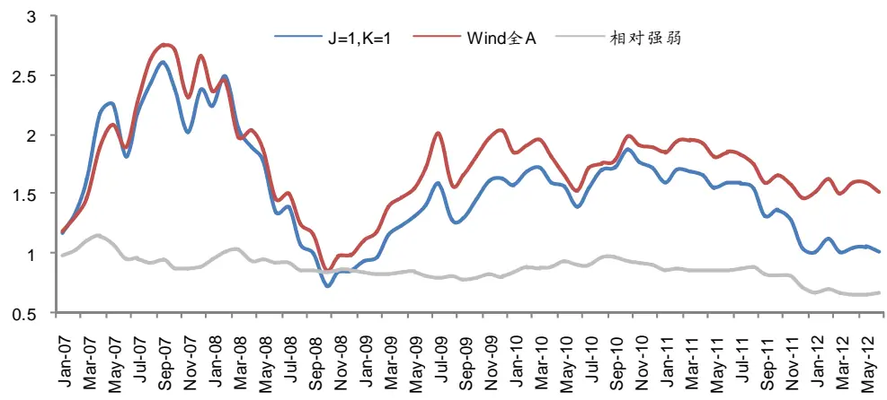
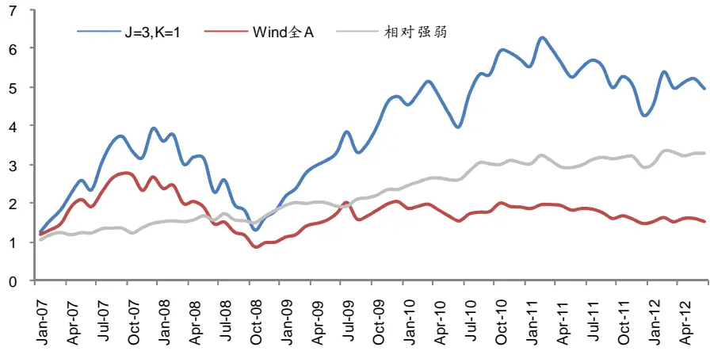
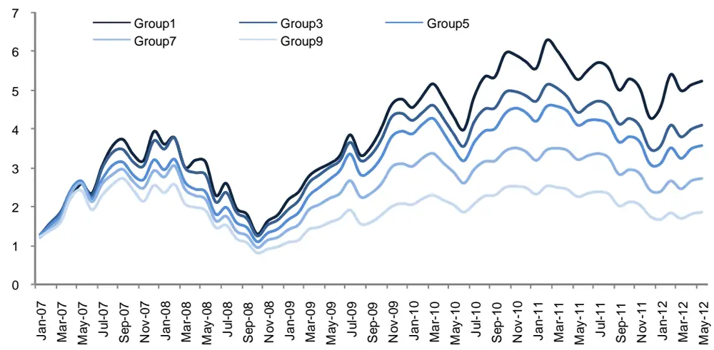
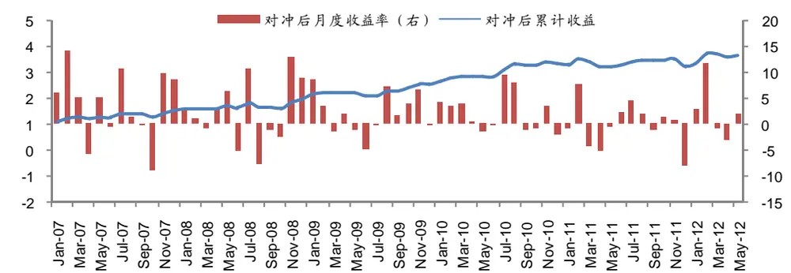
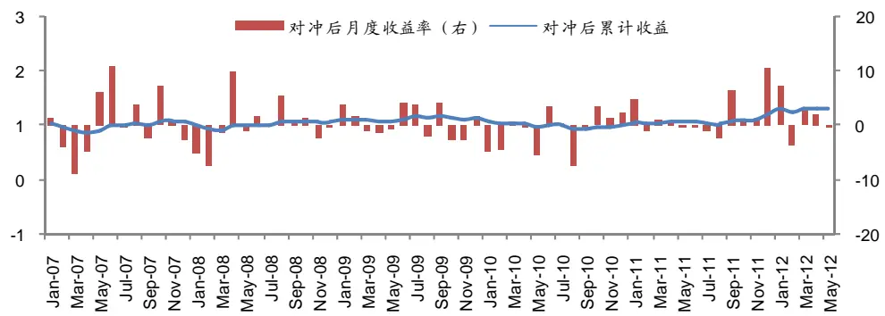
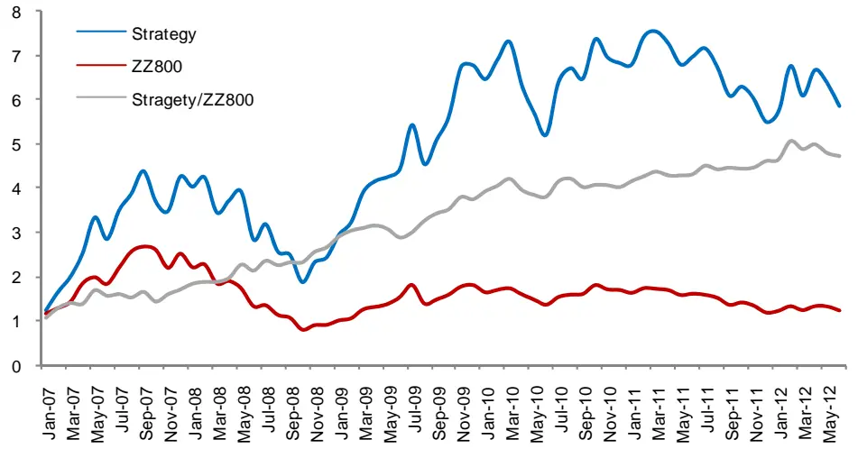
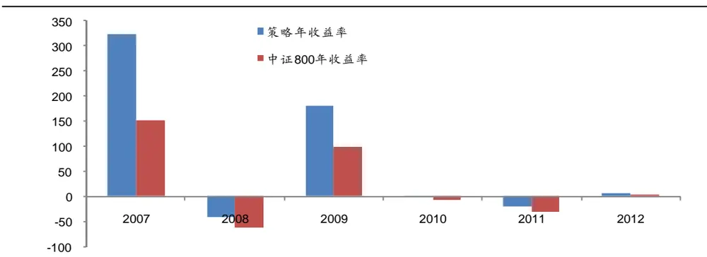
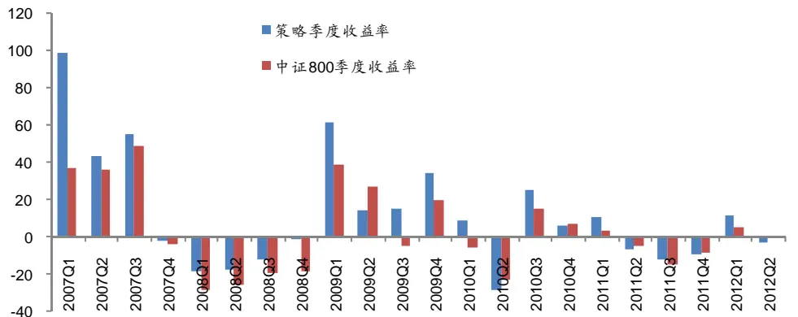
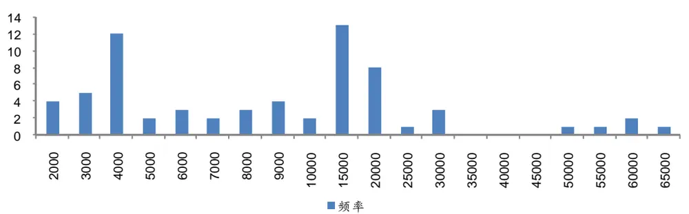

## 选股因子研究系列（一）

2012 年 7 月 23 日

## 相关研究

## 金融工程 分析师 高级

## 弱者终有逆袭日，强势几无持续时——A 股市场的动量反转效应研究

吴先兴

SAC 执业证书编号：S0850511010032

电话：021-23219449

Email：wuxx@htsec.com

联系人

朱剑涛

电话：021-23219745

股价对信息的过度反应或是反应不足为那些以历史收益率为基础的选股策略提供了操作空间，动量/反转因子逐渐成为众多投资者在实战中的重要参考，而对于这一效应的研究也不绝于各类文献。其中最著名的当属 Jegadeesh 和 Titman 于 1993 年在Journal of Finance 上发表的”Returns to Buying Winners and Selling Losers:股市上，通过买入过去Implications for Stock Market Efficiency”。他们发现，在美国的够获取 12%的收益，若干个月的高收益股票，同时卖空低收益股票的方式平均每年能股市场为研究对象，着体现出显著的“强者恒强，弱者恒弱”的动量效应。本文以 A重探讨了动量/反转效应的表现。

Email: zhujt@htsec.com

联系人

冯佳睿

电话：021-23219732

Email：fengjr@htsec.com

- 以剔除 ST股票后的所有 A股为对象，在每个月月末对过去 J个月的收益率从小到入持有 K个月，组合收大排序并均分成 q组，分别选择收益率最低和最高的一组买场存在“强者恒强”的益采用所选样本股等权重加权的方式计算得到。如果 A股市净值表现。反之，如果动量效应，那么每期买入收益率最高一组的策略会有较好的低收益组合的累计收益更高，则表明前期表现较差的股票确实能有较大概率在未来反弹。

的持续性，任何一种动• 不论在哪一种 J与 K的组合下，强势股票并没有显示出一定量策略相比指数都没有超额收 当持有期 K小于 6时，每一个策略的信息益。尤其是有情况中最差，说明在比都小于 0。其中，当 J=K=1时，策略超额收益的表现为所无法延续好的行情。A股市场上，前一个月表现好的公司往往在接下来的一个月内

明 A股市场上的反转效• 买入低收益组股票的策略能获得远优于高收益组的表现，表应要显著地强于动量效应。在所有 J与K的组合中，J=3,K=1在所有反转策略中能来表现优异的股票时十达到最优的信息比，表明过去 3 个月的收益率排名在筛选未分有效，可以作为投资者在选股过程中的重要补充。

- 利用反转效应筛选股票时，低收益组合确实有较大概率能在未来大幅提升其表现，但原先强势的股票却不一定会在将来大幅弱于指数。截止 6 月末，买入 Losers 组合并对冲指数的策略能够获得稳定而显著的绝对收益，而卖空 Winners组合并对冲的方式除了今年外，都无法持续累积收益。这进一步表明利用反转因子构建的多头组合是可以战胜基准指数的，但倘若用于建立空头组合，就很难获得超额收益。

- 在各种市场状态下，“低估值+反转”的因子组合能够筛选出明显强于市场的股票，策略相比中证 800指数有着极其显著的优势。粗略估算该策略可以容纳 1亿的资金规模，是一个简单有效且具有实战价值的优良策略。

础的选股策略提供了股价对信息的过度反应或是反应不足为那些以历史收益率为基，而对于这一效应的操作空间，动量/反转因子逐渐成为众多投资者在实战中的重要参考n 于 1993 年在 Journal研究也不绝于各类文献。其中最著名的当属 Jegadeesh 和 Titmaeturns to Buying Winners and Selling Losers: Implications forof Finance 上发表的”RStock Market Efficiency”。他们发现，在美国的股市上，通过买入过去若干个月的高收益，体现出显著的“强益股票，同时卖空低收益股票的方式平均每年能够获取 12%的收者恒强，弱者恒弱”的动量效应。

国市场，我国的 A股市场只能算是处于蹒跚学步的孩提时期，相比于悠久成熟的美但“强者恒强”的现象 也同样存在？动量或反转策略能否带来超额收益？这便是下是否文想要回答的问题。

## 1. 动量/反转效应的检验

去 J个月的收益率从策略以剔除 ST股票后的所有 A股为对象，在每个月月末对过有 K个月，组合收小到大排序并均分成 q组，分别选择收益率最低和最高的一组买入持每个月选出组合的持益采用所选样本股等权重加权的方式计算得到。当持有期 K>1时，有期会互相覆盖。为方便计算策略的收益和净值，把初始资金均分成 K份，在检验期开K个月分别投资上月末形成的组合，并各自持有 K个月后换仓。这样便形成始后的连续K条互相独立的资金链，在任意一个月月末，以这 K条资金链的平均值作为策略的净值。率最高一组的策略会有如果 A股市场存在“强者恒强”的动量效应，那么每期买入收益明前期表现较差的股票较好的净值表现。反之，如果低收益组合的累计收益更高，则表概率在未来反弹。确实能有较大

## 1.1 动量效应？

分别 1,3,6, K=1,2,3,6,12，q=10 考查 2007 年 1 月至 2012 年 6 月滚动取 J= 9,12， ，投资第 1 净值表 表 1 列 不同的 K 的组合下策略最终的累计收益。0 组的 现。 示了 J 和

表 1 动 累计净量策略 值

| K J | 1 | 2 | 3 | 6 | 12 |
| --- | --- | --- | --- | --- | --- |
| 1 | 2.11 | 19.73 |  |  |  |
| 3 | 10.93 | 26.08 | 32.26 |  |  |
| 6 | 12.88 | 14.05 | 22.92 | 48.55 |  |
| 9 | 7.70 | 22.78 | 25.68 | 41.46 | 45.06 |
| 12 | 20.94 | 20.11 | 23.97 | 32.13 | 41.16 |

资料来源：海通证券研究所

不论在哪一种 J与 K的组合下，策略截止 6月底的最终净值都不是很高，而同期Wind全 A指数的累计收益率为 51.60%。与之相比，只有当持有期 K等于 6或 12时，策略的表现才勉强与市场指数接近。可见，强势股票并没有显示出一定的持续性。

除了强者未必恒强的现象，表 1还显示出另外一个特点。当观察期 J固定时，随着持有期 K的增大，策略的最终净值也逐渐变大。这表明动量效应需要较长的持有期才能有所体现，但即使持有长达一年，策略的表现依然无法优于指数。因此，从最终的净值角度看，“强者恒强”这一理论在 A股市场并不适用。

表 1仅仅比较了策略的最终净值和指数的差异，结论稍嫌武断。信息比作为刻画策期上的表现有一个较为略相对于指数超额收益分布情况的统计量，能对策略在整个样本全面的认识，是判断策略优劣的一个常用指标。因此，为进一步分析动量效应，以Wind比较基准，计算每一种 J和 K的组合下策略的信息比，如表 2所示。全 A指数为

表 2 动量 息比策略信

| K | 1 | 2 | 3 | 6 | 12 |  |
| --- | --- | --- | --- | --- | --- | --- |
| J |  |  |  |  |  |  |
| 1 |  |  |  |  |  | -0.1975 |
| 3 | -0.3874 -0.2654 | -0.1022 | -0.0510 |  |  |  |
| 6 | -0.2136 | -0.2123 | -0.1392 | 0.0897 |  |  |
| 9 | -0.2913 | -0.1434 | -0.1102 | 0.0405 | 0.0646 |  |
| 12 | -0.1440 | -0.1592 | -0.1235 | -0.0495 | 0.0262 |  |

资料来源：海通证券研究所

从超额收益的角度来看，每期买入高收益组的策略同样没有好的表现。尤其是当持6时，每一个信息比取值都小于 0。其中，当 J=K=1时，策略超额收益的表有期 K小于现为所有情况中最差，说明在 A股市场上，前一个月表现好的公司往往在接下来的一个月内无法延续好的行情。图 1具体展现了这种情况下的策略净值走势，并与 Wind全 A指数进行了对比。

图 1 最差组合净值走势

资料来源：海通证券研究所

从图中的相对强弱曲线来看，只有 07年的 1,4季度和整个 10年，策略的表现明显强于指数，其余观测期上策略都毫无优势可言，再一次证明强者未必再强的规律。

## 1.2 反转效应！

既然高收益率组的表现无法持续，那么买入前期收益最低的一组股票又会在未来有怎样的表现。表 3给出了这一策略截止 6月底的最终净值。

表 3 反转 略累计收益策

| K | 1 | 2 | 3 | 6 | 12 |  |
| --- | --- | --- | --- | --- | --- | --- |
| J |  |  |  |  |  |  |
| 1 |  |  |  |  |  | 193.51 |
| 3 | 204.86 396.15 | 265.54 | 230.57 |  |  |  |
| 6 | 332.64 | 249.71 | 216.62 | 180.84 |  |  |
| 9 | 354.66 | 267.23 | 234.50 | 212.08 | 214.66 |  |
| 12 | 362.75 | 281.88 | 248.58 | 230.28 | 230.42 |  |

资料来源：海通证券研究所

和表 1中高收益组的结果相比，买入低收益组股票的策略能获得远高于前者的净值，对前期的弱势股票可以期待其未来的反弹。此外，与表 1的另一个明显区别是，随着持有期 K的增大，最终净值在不断变小。这表明，和动量效应需要较长的持有期来体现不性质只能维持较短的时间，尤以 1个月为最佳。同，反转的

同样地，计算买入低收益组这一策略相对于 Wind全 A指数超额收益的信息比，如表 4中所示。

表 4 反 信息比转策略

| K | 1 | 2 | 3 | 6 | 12 |  |
| --- | --- | --- | --- | --- | --- | --- |
| J |  |  |  |  |  |  |
| 1 |  |  |  |  |  | 0.9187 |
| 3 | 0.8748 1.4180 | 1.1450 | 1.0544 |  |  |  |
| 6 | 1.2169 | 1.0333 | 0.9573 | 0.8840 |  |  |
| 9 | 1.3830 | 1.1612 | 1.0494 | 0.9906 | 1.0457 |  |
| 12 | 1.2927 | 1.1380 | 1.0616 | 1.0411 | 1.0895 |  |

资料来源：海通证券研究所

对比表 2可以发现，低收益组超额收益的表现远远优于高收益组，这表明 A股市场上的反转效应要显著地强于动量效应。在所有 J与 K的组合中，J=3,K=1能达到最优的信息比，图 2展示了这一组合的净值走势。

图 2 最优组合净值走势

资料来源：海通证券研究所

结合表 5中的收益风险统计可以发现，过去 3 收益率排名确实在筛选未来表个月的十分有效，可以作为投资者在选股过程中的重要补充。现优异的股票时

表 5 最 益风优组合收 险统计

|  | 累计收益 | 最大回撤 | 年化收益 | 波动率 | 月度胜率 |
| --- | --- | --- | --- | --- | --- |
| 策略 | 396.15% | -67.17% | 33.81% | 13.19% | 60.61% |
| Wind 全 A 指数 | 51.60% | -68.61% | 7.86% | 10.75% |  |

资料来源：海通证券研究所

## 1.3 单调性研究

通过上面的实证分析证明了收益率最低的那组会发生反转，但这种效应是否在整个要进一步的研究。最直接的判断方法是比较不同收益率组别的净值表市场上依然有效需现，如果随着组别的提高，即收益率的增大，其未来的表现越来越差，则说明反转效应确实是 A股市场的普遍规律。图 3展示了在参数组合 J=3，K=1，q=10下，第 1,3,5,7,9个收益率组别的净值走势。

图 3 不同收益率组别的净值走势

资料来源： 研究所海通证券

图 3 展现了各 间的单调 随着收益 低，净值曲线依次抬高，完美地 组别之 性。 率的降明过去一 间收益率 确实能够 股票未来 。但如果这种超额收益的证 段时 的高低 区分 的表现低是由不 波动性所 ，那反转 在区别股 的作用就不那么诱人了。高 同的 引起的 效应 票的时不同组别策略相对于 Wind全 A指数的 Alpha与 Beta值，在表 6中列示。为此，计算

表 6 不同收益率组别的 Alpha 与 Beta

|  | Alpha | p-value | Beta | p-value |
| --- | --- | --- | --- | --- |
| Group1 | 1.9379 | 0.0025 | 1.1381 | 0.0000 |
| Group3 | 1.5199 | 0.0103 | 1.1043 | 0.0000 |
| Group5 | 1.3053 | 0.0171 | 1.1041 | 0.0000 |
| Group7 | 0.8704 | 0.1146 | 1.0912 | 0.0000 |
| Group9 | 0.2759 | 0.5868 | 1.0757 | 0.0000 |

资料来源：海通证券研究所

转效应选股并非是一个不同组别的 Beta值相差无几，且都接近于 1，这表明利用反较高的 Group7和高 Beta的策略。而 Alpha值在不同组别之间却差异较大，在收益率那些低收益组中，存在着显著的 Alpha，并Group9中，策略几乎没有 Alpha收益。但在析结果说明反转效应在 A股市场存在且有且随着组别的降低，Alpha越来越大。以上分的 Alpha收益。效，过去收益率低的股票能够在未来提供额外

## 2. Buying Losers and Selling Winners

下，利用这一性质可以既然 A股市场存在显著的反转效应，那么在允许卖空的假设收益组和高收益组各构建各种绝对收益策略。因为 J=3，K=1以及 J=1，K=1分别是低佳参数组合，所以在构建绝对收益策略时选择这两个参数组合。有了已经得到上自的最效果更加明显，取过去 3个月收益率最低的 5%作文验证的单调性作保证，为使策略的高的 5%作为 Winners组合。根据反转效应，Losers为 Losers组合，过去 1个月收益率最Winners组合无法战胜基准指数，于是可构建如组合有望在未来获取正的超额收益，而下两个策略。

空 Wind 全 A 指数；1. 买入 Losers 组合，卖

2. 卖空 Winners 组合，买入 Wind 全 A 指数；

图 4所示的是策略 1和 2的月度收益和净值走势。

图 4 多头、空头策略与指数对冲后的净值走势
买入 Losers 组合，卖空 Wind 全 A指数

卖空 Winners 组合，买入 Wind 全 A指数

资料来源：海通证券研究所

对比来看，买入 Losers组合并对冲指数的策略能够获得稳定而显著的绝对收益，利用反转效应构建的这一策略是成功的。然而，卖空 Winners组合并对冲的方式除了今年外，都无法持续累积收益。由此可见，利用反转效应筛选股票时，低收益组合确实有较提升其表现，但原先强势的股票却不一定会在将来大幅弱于指数。大概率能在未来大幅这进一步表明利用反转因子构建的多头组合是可以战胜基准指数的，但倘若用于建立空头组合，就很难获得超额收益。

两点规律。一，从月度经过以上较为全面的分析，A股市场的动量/反转效应存在着往往很难持续。不过反频率度量，“强者恒强”的动量效应几乎不存在，过去强势的股票的一方极有可能在短期内出现反弹。二，强者虽转效应却十分显著，之前表现相对较弱股票的表现也不一定会就此逆转，从此一泻千里。由此可见，A然无法持续，但是这类对过去表现不济的股票起作用，可以作为建立多头组合的参考。如股市场的反转效应仅果想要建立空头组合，反转因子就显得不那么有效了。

## 3. 低估值股票的逆袭

前文的研究证实前期收益较低的股票有望在未来发生反转，但如果仅依靠这一个技得最终策略的适用术面的因子设计选股策略很可能会使所选样本集中偏向某一风格，使度进行一次筛选，既保范围变窄。为此，在利用有效的反转效应之前，先从基本面的角现象，即使是对那些基证策略的实战性得到增强，也可证明反转确实是一个普遍存在的本面良好的公司。

本股作为选股对象，于每个月最后一个交易日收盘后遍历 800家选择中证 800的样公司，首先剔除 PB小于 0的样本，再保留剩余股票中 PB最小的前 25%，最后选择其中收益率最低的 5%作为本期样本股组合，并在下个月第一个交易日以开盘价买入，持有一个月至最后一个交易日以收盘价卖出。组合的收益率由所有样本股等权重加权计算而得，手续费设定为双边 0.3%。策略的表现如下所示。

图 5 “低估值+反转”策略的净值走势

资料来源：海通证券研究所

表 7 “低估值+反转”策略的收益风险统计

|  | 累计收益 | 最大回撤 | 年化收益 | 波动率 | 月度胜率 |
| --- | --- | --- | --- | --- | --- |
| 策略 | 484.21% | -57.46% | 37.84% | 13.91% | 66.67% |
| 中证 800 指数 | 23.78% | -69.84% | 3.84% | 10.91% |  |

资料来源：海通证券研究所

整体来看，策略相比中证 800指数有着极其显著的优势。但在不同的市场状态下，图 7展示了年度以及季度的收益情况。策略是否依然有着良好的表现呢？

图 6 “低估值+反转”策略的年度与季度收益
年度收益对比（策略 v.s. 指数）

季度收益对比（策略 v.s. 指数）

资料来源：海通证券研究所

从年度收益的对比看，不论市场处于上涨（07，09年）、下跌（08，11年）还是震取得显著的超额收益。而在回测期所经历的 22个季度中，荡（10,，12年），策略都能策略收益高于指数的比例为 72.72%，同样表明在各种市场状态下，“低估值+反转”的因子组合能够筛选出明显强于市场的股票。

上述的分析证明了这是一个有效的策略，但倘若将其开发成一个产品，其能够容纳的资金量需要进一步测算。以每个股票买入日日成交金额的 10%作为个股的可容纳资金，每一期组合的可容纳资金为个股可容纳资金之和。图 8是每期可容纳资金量的频数分布直方图。

值+反转”策略的资金容纳量测算图 7 “低估

资料来源：海通证券研究所

主要 市场 跃程度有关，但整从图上可以看出资金容纳量的波动较大，这 和 交投的活体来看，数据基本在 1亿左右均匀分布，均值和中位数分别是 8800万和 1亿 3000万，低估值+反转”的策略可以容纳 1亿的资金规模。因此粗略估算“

## 4. 总结和讨论

研究是多因子模型的深对某个具体因子在区别股票未来收益情况好坏时所起作用的的讨论，通过各种策略收入和细化，本文对最常用的一个因子——动量/反转进行了详尽大概率翻身，因而能够益的计算与比较发现在 A股市场上，强者未必恒强，弱者却有很表现出色的股票。在此基础上，本文在加入一个度量基利用反转因子筛选出未来有可能本面的指标 PB后，构建了一个简单有效的投资策略，适合中等规模资金的操作。

本文是因子研究系列的开篇，在后续的报告中将陆续呈现其他选股因子的效应，并且对因子失效的原因做一些探讨。敬请关注！

## 信息披露

明分析师声

吴先兴：金融工程

本人具有中国证券业协会授予的证券投资咨询执业资格，以勤勉的职业态度，独立、客观地出具本报告。本报告所采用的数据和信息公开信息，本人不保证该等信息的准确性或完整性。分析逻辑基于作者的职业理解，清晰准确地反映了作者的研究观点，均来自市场结论不受任何第三方的授意或影响，特此声明。

## 法律声明

。本公司不会因接收人收到本报告而视其为客户。在任何情况下，本报告仅供海通证券股份有限公司（以下简称“本公司”）的客户使用报告中的任何内容所引致本报告中的信息或所表述的意见并不构成对任何人的投资建议。在任何情况下，本公司不对任何人因使用本的任何损失负任何责任。

资收入可能本报告所载的资料、意见及推测仅反映本公司于发布本报告当日的判断，本报告所指的证券或投资标的的价格、价值及投会波动。在不同时期，本公司可发出与本报告所载资料、意见及推测不一致的报告。

客户特殊的市场有风险，投资需谨慎。本报告所载的信息、材料及结论只提供特定客户作参考，不构成投资建议，也没有考虑到个别投资目标、财务状况或需要。客户应考虑本报告中的任何意见或建议是否符合其特定状况。在法律许可的情况下，海通证券及其所属关联机构可能会持有报告中提到的公司所发行的证券并进行交易，还可能为这些公司提供投资银行服务或其他服务。

本报告仅向特定客户传送，未经海通证券研究所书面授权，本研究报告的任何部分均不得以任何方式制作任何形式的拷贝、复印件或复制品，或再次分发给任何其他人，或以任何侵犯本公司版权的其他方式使用。所有本报告中使用的商标、服务标记及标记均为本公司的商标、服务标记及标记。如欲引用或转载本文内容，务必联络海通证券研究所并获得许可，并需注明出处为海通证券研究所，且不得对本文进行有悖原意的引用和删改。

根据中国证监会核发的经营证券业务许可，海通证券股份有限公司的经营范围包括证券投资咨询业务。

海 证券通 股份有限 所公司研究

| 汪异明 所长 (021)63411619 wangym@htsec.com | 高道德 副所长 (021)63411586 gaodd@htsec.com |  | 路颖 副所长 (021)23219403 luying@htsec.com | 江孔亮 (021)23219422 kljiang @htsec.com | 所长助理 |
| --- | --- | --- | --- | --- | --- |
|  |  | 策略研究团队 荀玉根（021）23219658 陈瑞明（021）23219197 | 基金研究团队 xyg6052@htsec.com chenrm@htsec.com | 娄静（021）23219450 单开佳（021）23219448 倪韵婷（021）23219419 罗 震（021）23219326 | loujing@htsec.com shankj@htsec.com niyt@htsec.com luozh@htsec.com tangyy@htsec.com |
| 高 远（021）23219669 联系人 李宁（021）23219431 周 霞（021）23219807 | gaoy@htsec.com lin@htsec.com zx6701 @htsec.com | 联系人 王旭（021）23219396 汤 慧（021）23219733 李 珂（021）23219821 | wx5937@htsec.com tangh@htsec.com lk6604@htsec.com | wuyiping@htsec.com 唐洋运（021）23219004 王广国（021）23219819 孙志远（021）23219443 陈 亮（021）23219914 联系人 陈 瑶（021）23219645 伍彦妮(021)23219774 桑柳玉（021）23219686 | wgg6669@htsec.com szy7856@htsec.com cl7884@htsec.com chenyao@htsec.com wyn6254@htsec.com sly6635@htsec.com |
| 金融工程研究团队 吴先兴（021）23219449 丁鲁明（021）23219068 郑雅斌(021)23219395 | wuxx@htsec.com dinglm@htsec.com zhengyb@htsec.com | 固定收益研究团队 姜金香（021)23219445 徐莹莹(021)23219885 | jiangjx@htsec.com xyy7285@htsec.com | 曾逸名(021)23219773 陈韵骋（021）23219444 政策研究团队 李明亮（021）23219434 陈久红(021)23219393 chenjiuhong@htsec.com 陈峥嵘（021）23219433 | zym6586@htsec.com cyc6613@htsec.com Iml@htsec.com zrchen@htsec.com |
| 联系人 冯佳睿（021）23219732 朱剑涛（021）23219745 张欣慰(021)23219370 周雨卉（021)23219760 杨 勇(021)23219945 | fengjr@htsec.com zhujt@htsec.com zxw6607@ htsec.com zyh6106@htsec.com yy8314@htsec.com | 联系人 武亮（021）23219883 黄 轩（021）23219886 | wl7222@htsec.com hx7252@htsec.com | 联系人 倪玉娟（021）23219820 朱 蕾（021)23219946 周洪荣（021）23219953 | nyj6638@htsec.com zi8316@htsec.com zhr8381@htsec.com |
| 纪锡靓（021）23219948 计算机行业 陈美风（021）23219409 联系人 蒋 科（021）23219474 jiangk@htsec.com | jxl9404@htsec.com chenmf@htsec.com | 煤炭行业 朱洪波（021）23219438 刘惠莹（021）23219441 | zhb6065@htsec.com liuhy@htsec.com | 批发和零售贸易行业 路 颖（021）23219403 潘 鹤（021）23219423 汪立亭（021）23219399 联系人 | luying@htsec.com panh@htsec.com wanglt@htsec.com |
| 建筑工程行业 江孔亮（021）23219422 | kljiang@htsec.com | 石油化工行业 邓 勇(021)23219404 | dengyong@htsec.com | 李宏科（021）23219671 机械行业 | Ihk6064@htsec.com |
| 联系人 赵健（021）23219472 张显宁（021）23219813 | zhaoj@htsec.com zxn6700@htsec.com | 联系人 王晓林（021)23219812 | wxl6666@htsec.com | 龙华（021）23219411 何继红（021）23219674 联系人 | longh@htsec.com hejh@htsec.com |
| 农林牧渔行业 丁 频（021）23219405 |  |  |  | 熊哲颖（021）23219407 胡宇飞（021）23219810 | xzy5559@htsec.com |
|  |  | 纺织服装行业 |  |  | hyf6699@htsec.com |
|  |  |  |  | 非银行金融行业 |  |
|  | dingpin@htsec.com |  |  |  |  |
|  |  |  |  | 丁文韬（021）23219944 |  |
| 联系人 |  |  |  |  | dwt8223@htsec.com |
|  |  |  |  | 董 乐（021）23219374 |  |
| 夏 木（021） 23219748 | xiam@htsec.com | 联系人 |  | 联系人 | dl5573@htsec.com |
|  |  | 杨艺娟（021）23219811 | yyj7006@htsec.com |  |  |
|  |  |  |  | 黄 嵋（021）23219638 | hm6139@htsec.com |
|  |  |  |  | 吴绪越（021）23219947 | wxy8318@htsec.com |
| 电子元器件行业 |  | 互联网及传媒行业 |  | 交通运输行业 |  |
| 邱春城（021）23219413 | qiucc@htsec.com |  |  | 钮宇鸣（021）23219420 |  |
| 联系人 |  | 联系人 |  |  | ymniu@htsec.com |
|  |  | 白 洋(021)23219646 |  | 钱列飞（021）23219104 |  |
| 张孝达（021)23219697 | zhangxd@htsec.com |  | baiyang@htsec.com |  | qianlf@htsec.com |
|  |  | 薛婷婷（021）23219775 |  | 联系人 |  |
|  |  |  | xtt6218@htsec.com |  |  |
| 郑震湘（021）23219816 | zzx6787@htsec.com |  |  |  |  |
|  |  |  |  | 虞 楠(021)23219382 |  |
|  |  |  |  |  | yun@htsec.com |
|  |  |  |  | 李 晨（021)23219817 |  |
|  |  |  |  |  | Ic6668@htsec.com |
| 汽车行业 |  |  |  |  |  |
|  |  | 食品饮料行业 |  |  |  |
| 赵晨曦（021）23219473 冯梓钦（021）23219402 | zhaocx@htsec.com | 赵 勇(0755)82775282 | zhaoyong@htsec.com | 钢铁行业 刘彦奇（021）23219391 | liuyq@htsec.com |
| 医药行业 刘 宇(021)23219608 联系人 刘 杰(021)23219269 冯皓琪（021）23219709 fhq5945@htsec.com | liuy4986@htsec.com liuj5068@htsec.com | 有色金属行业 联系人 刘 博(021)23219401 | liub5226@htsec.com | 基础化工行业 曹小飞（021）23219267 |  |
|  |  |  |  | 联系人 张 瑞(021)23219634 朱 睿（021）232193737 | caoxf@htsec.com zr6056@htsec.com zr8353@htsec.com |
| 郑 琴(021)23219808 家电行业 陈子仪（021）23219244 | zq6670@htsec.com | 建筑建材行业 |  | 电力设备及新能源行业 张 浩（021）23219383 | zhangh@htsec.com |
| 联系人 孔维娜（021）23219223 | chenzy@htsec.com kongwn@htsec.com | 联系人 张光鑫（021）23219818 | zgx7065@htsec.com | 牛 品（021)23219390 联系人 房 青（021）23219692 | np6307@htsec.com fangq@htsec.com |
|  |  | 银行业 |  | 徐柏乔（021）23219171 | xbq6583@htsec.com |
| 公用事业 陆凤鸣（021）23219415 |  | 戴志锋 | dzf8134@htsec.com | 社会服务业 | lzy6050@htsec.com |
| 联系人 | lufm@htsec.com | 联系人 刘瑞（021）23219635 | Ir6185@htsec.com | 林周勇（021）23219389 联系人 |  |
| 汤砚卿（021）23219768 | tyq6066@htsec.com |  |  | 汤婧（021）23219809 | tj6639@htsec.com |
| 房地产业 |  |  |  |  |  |
| 涂力磊（021）23219747 | tll5535@htsec.com | 造纸轻工行业 徐 琳（021）23219767 | xl6048@htsec.com | 通信行业 |  |
| 谢 盐（021）23219436 | xiey@htsec.com |  |  |  |  |
| 联系人 |  |  |  | 联系人 侯云哲（021）23219815 | hyz6671@htsec.com |
|  | jiayt@htsec.com |  |  |  |  |
| 贾亚童（021）23219421 |  |  |  | 宋 伟（021）23219949 | sw8317@htsec.com |

## 海通证券股份有限公司机构业务部

| 陈苏勤 总经理 贺振华 总经理助理 (021)63609993 (021)23219381 chensq@htsec.com hzh@htsec.com |  |  |  |  |  |  |  |  |
| --- | --- | --- | --- | --- | --- | --- | --- | --- |
| 上海地区销售团队 |  |  |  |  |  |  |  |  |
| 深广地区销售团队 |  |  |  |  |  |  |  |  |
| 蔡铁清 | (0755)82775962 | ctq5979@htsec.com liujj4900@htsec.com | 高溱 姜洋 | (021)23219386 (021)23219442 | gaoqin@htsec.com jy7911@htsec.com | 孙俊 郭文君 | (010)58067988 | sunj@htsec.com |
| 刘晶晶 | (0755)83255933 |  |  | (021)23219384 | jiwj@htsec.com |  | (010)58067996 | gwj8014@htsec.com |
| 辜丽娟 | (0755)83253022 | gulj@htsec.com | 季唯佳 |  |  | 隋巍 | (010)58067944 | sw7437@htsec.com |
| 高艳娟 | (0755)83254133 | gyj6435@htsec.com | 胡雪梅 | (021)23219385 | huxm@htsec.com | 张广宇 | (010)58067931 | zgy5863@htsec.com |
| 伏财勇 | (0755)23607963 | fcy7498@htsec.com | 黄毓 | (021)23219410 | huangyu@htsec.com | 王秦豫 | (010)58067930 | wqy6308@htsec.com |
| 邓欣 | (0755)23607962 | dx7453@htsec.com | 张亮 | (021)23219397 | zl7842@htsec.com | 张楠 | (010)58067935 | zn7461@htsce.com |
|  |  |  | 朱健 | (021)23219592 | zhuj@htsec.com |  |  |  |
|  |  |  | 王丛丛 卢倩 | (021)23219454 (021)23219373 | wcc6132@htsec.com lq7843@htsec.com |  |  |  |

海通证券股份有限公司研究所

地址：上海市黄浦区广东路 689 号海通证券大厦 13 楼

电话：（021）23219000

传真：（021）23219392

网址：www.htsec.com