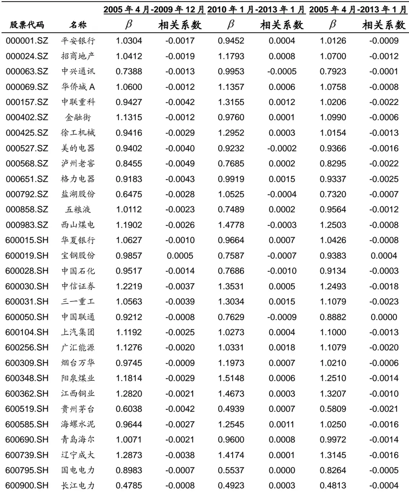
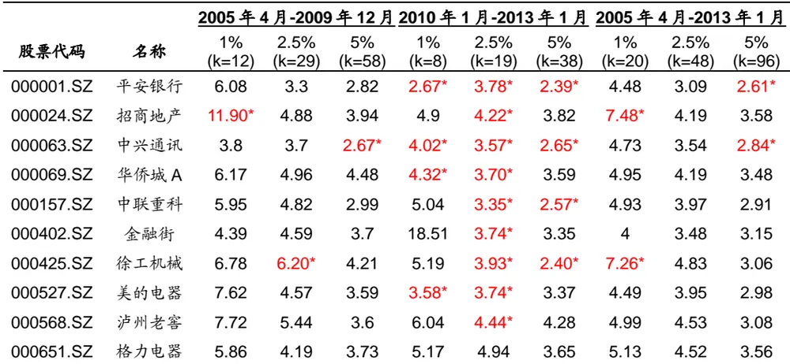
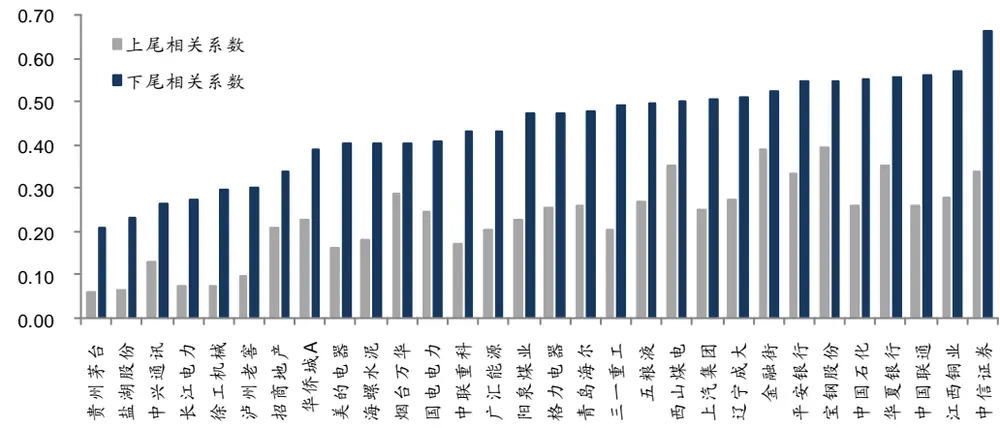
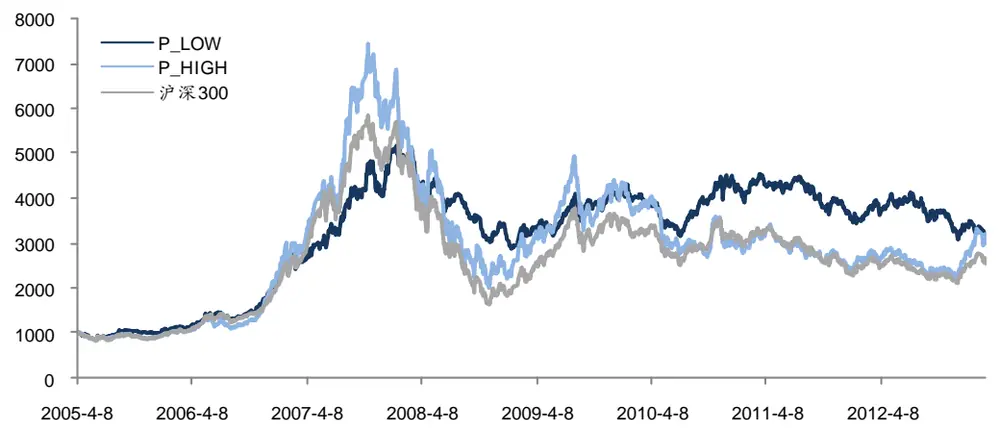
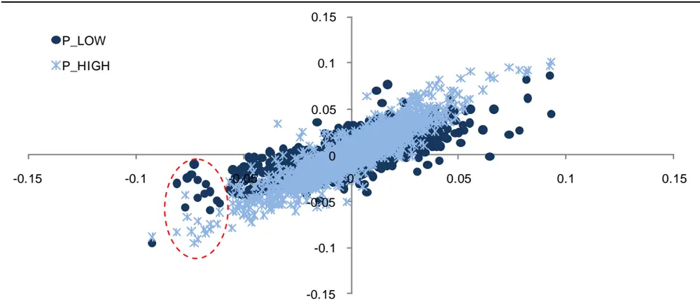
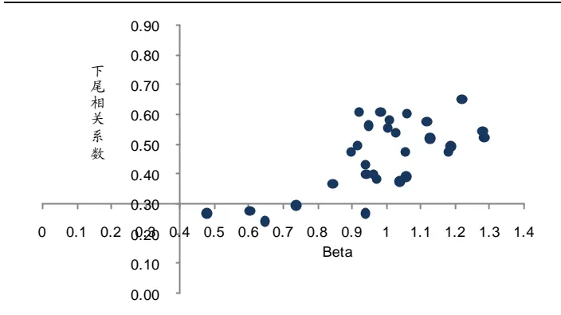
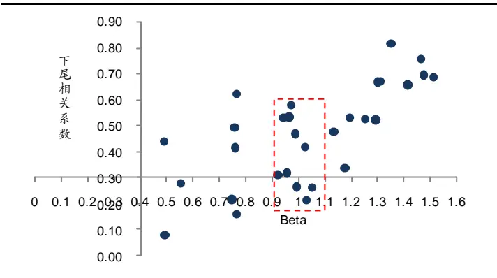
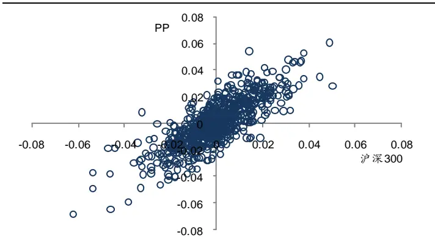
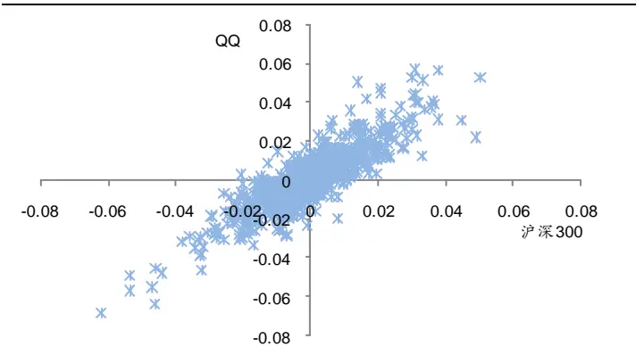
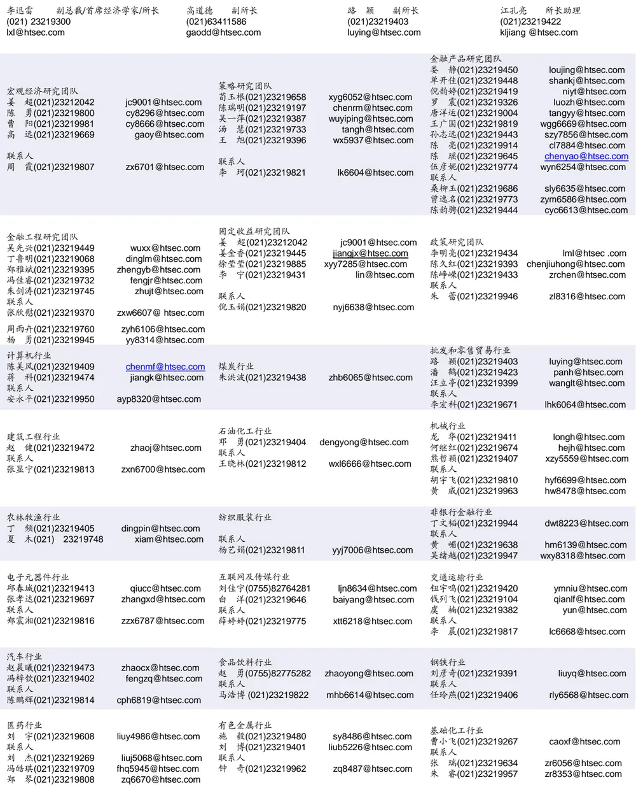

## 选股因子研究系列（二）

2013 年 3 月 25 日

## 相关研究

选股因子研究系列（一）——弱者终有逆袭日，强势几无持续时 20120723

海通证券研究所

金融工程分析师

冯佳睿

SAC 执业证书编号：

S0850512080006

电 话：021-23219732

Email：fengjr@htsec.com

## 因子模型的尾部相关性研究

很多大型系统中都存在着一个所谓的“80-20”法则，即一部分在数量上占很小比例的特殊元素，总是产生了系统的大部分效应。股票市场也不例外，那些在整个投资过程中极少发生的事件常常对应着大部分的收益或损失。研究这些极端事件发生的关联性对那些利用分散化投资对冲风险的基金经理来说是至关重要的。借助名为“尾部相关系数”的工具，本文引入了一个全新的技术，用以度量和估计若干资产在发生极端价格变化时的趋同性。

尾部相关描述的是，当一个变量以很小的概率取到极端值时，另一个可能与之相关的变量的取值情况。这类相关性，尤其是两个资产之间或者资产与某个外生变量之间的尾部相关性不仅对学术研究有着重要的意义，而且在实际投资中也是极具价值。准确地度量这类相关性一方面可以避免或者最小化一个投资组合中不同资产同时遭受巨大损失的可能性，另一方面也能发掘极端情况出现时的潜在投资机会。

- 本文研究的是个股收益率 X 和市场收益率 Y 在各自分布上下尾部的行为有何关联性。因子模型因其简洁直观地形式成为天然的出发点。假定X=β·Y+ε，可以证明，如果因子 Y 的分布是快速变化的，比如正态、指数和那些趋向于 0 的速度与指数函数同阶的分布，那么 X 和 Y的尾部相关系数为 0。而一旦 X 和 Y的分布都展现出厚尾的特性，通过上述因子模型可以得到尾部相关系数的显式解。

- 样本内、外的检验表明，尾部相关系数的定义和估计是合理且可靠的。在因子模型框架下，利用著名的 Hill估计可获得尾部相关系数的一个简洁的表达式。大量的数据模拟分析表明该估计具备稳健、有效的优良性质。进一步，通过与现实中极端情况发生次数的比较和检验，证明绝大部分情况下，估计的尾部相关系数不存在和事实相悖的现象。

- 当市场处于罕见的极端下跌状态中，低下尾相关性组合的风险几乎是一致地小于另一个组合。根据下尾相关系数的估计值，选择最大和最小的 6个股票形成两个投资组合。经过计算发现，两者累计收益相差不大，高下尾相关性组合体现出高风险、高收益的特点。但如果投资者关注单位风险的报酬，即夏普比率，以及最大回撤，那么低下尾相关性组合无疑是更好的选择。

- 那些从 Beta系数的角度被认为系统性风险类似的个股，在尾部的行为也是风格迥异。选择 Beta 系数接近的两个组合，第一个具有较高的下尾相关性，第二个在下尾与市场的关联度较弱。两个组合的收益率散点图都类似于一个椭圆，但是前者的分布更接近一条直线，表明市场的变化对其影响更强。而在市场跌幅较大的那些样本点上，后者遭遇重大损失的概率更低，风险更小。

〃在 100 多年前，威尔弗雷德〃帕累托(Vilfred Pareto)发现了一个著名的统计规律，中并在后来的大型系统中被一次又一次地证明。这里对系统的定义是宽泛的，它可以是自泰然界的生态系统，制造业的流水生产线，证券的交易市场，等等。这个现在被称为“80-20”化法则的发现阐述了这样一个现象，一部分在数量上占很小比例的特殊元素，总是产生了系统的大部分效应。

股票市场也不例外，那些在整个投资过程中极少发生的事件常常对应着大部分的收益或损失。近年来的几次金融危机表明，标准的分散化投资方法在一般情况下都十分有效，但往往在极端市场中表现惨淡。而恰恰是这些时候，分散投资才是最重要的。这就形成了一个颇具讽刺意味的悖论，分散化在并不那么需要的时候有效，却在最需要的时候严重失效。

从技术层面上说，上述问题可以归结为大的价格波动是一种独立的行为，还是以联动的方式表现出来。厘清这一机制对那些利用分散化投资对冲风险的基金经理来说是至关重要的。借助名为“尾部相关系数”的工具，本文引入了一个全新的技术，用以度量和估计若干资产在发生极端价格变化时的趋同性。在单因素模型的框架下，运用极值理论可以方便地给出任意两个资产之间尾部相关系数的非参数估计，从而对极端状态下两者的投资损益关系略窥一二。

## 1. 尾部相关性的度量

尾部相关描述的是，当一个变量以很小的概率取到极端值时，另一个可能与之相关的变量的取值情况。这类相关性，尤其是两个资产之间或者资产与某个外生变量之间的尾部相关性不仅对学术研究有着重要的意义，而且在实际投资中也是极具价值。准确地度量这类相关性一方面可以避免或者最小化一个投资组合中不同资产同时遭受巨大损失的可能性，另一方面也能发掘极端情况出现时的潜在投资机会。本节将从相关系数开始，引出对尾部相关系数的定义和解释。

## 1.1 两个随机变量的相关性

线性相关系数或者 Spearman 秩相关系数是度量资产相关性的常用方法，具有简单直观的优点。但是，其缺陷也是显而易见的。首先，这两类相关系数本质上都只是描述了随机变量之间线性相关的程度，并没有考虑可能存在的非线性相关结构；其次，对于普通的线性变换，经典的相关系数具有不变性。但对于更一般的单调变化，比如常用的指数函数，这种不变性就丧失了。

更重要的是，收益率序列之间的相关系数主要受均值附近的大量样本控制，而这部分样本都代表了微小的价格变化，无法准确表现数据尾部的行为。为了解决这一难题，有学者提出在资产价格处于极端波动的条件下，研究资产收益率之间的联系，即使用条件相关系数。但不幸的是，这一方法同样会遭受严重的系统性偏差，出现似是而非的现象。一个典型的悖论就是，即使真实的无条件相关系数始终为常数，条件相关系数也可能随着时间而变化。

Sklar 在 1959 年提出的名为“Copula”的函数，有效克服了传统相关性度量的种种局限，良好的性质使其在金融领域得到了广泛地应用。不失一般性，下文将集中讨论两个变量的 Copula 函数，所有的定义和结论都能方便地推广到 N个变量的情形。

假设两个随机变量X和Y的联合分布函数为 $\mathsf{F}(\cdot,\cdot)$ ，其各自的分布函数分别为 $\mathsf{F}_{\mathsf{X}}(\cdot)$ 和 $\mathsf{F}_{\mathsf{Y}}(\cdot)$ ，存在一个定义在 $[0,1]\times[0,1].$ 上的函数 $\mathbf{C}(\cdot,\cdot)$ ，使得

$$
\mathsf{F}(\mathsf{x},\mathsf{y}){=}\mathsf{C}(\mathsf{F}_{\mathsf{X}}(\mathsf{x}),\mathsf{F}_{\mathsf{Y}}(\mathsf{y}))\enspace,\tag{1}
$$

对任意的(x,y)都成立，那么函数 C(•,•)称为随机变量 X和 Y的 Copula。可以证明，(1)式定义的相关性具有严格单调增变换下的不变性。即，如果 $g_{1}(\cdot)和g_{2}(\cdot)$ 分别是 X，Y定义域上的严格单调增函数，那么 $\tilde{\mathsf{X}}=\mathsf{g}_{1}(\mathsf{X}),\;\tilde{\mathsf{Y}}=\mathsf{g}_{2}(\mathsf{Y}))$ )和 X，Y 有着完全相同的 Copula函数 C。这一优良的性质保证 Copula 是随机变量内在相关性的一个合理度量。下文将具体介绍如何从 Copula 出发，定义和计算随机变量间的尾部相关系数。

## 1.2 COPULA 到尾部相关系数

从 Copula 的定义和性质可以看出，函数 $\mathbf{C}(\cdot,\cdot)$ 包含了随机变量之间相关关系的所有信息。因此，如果定义的尾部相关系数是有意义的，那它必定和 Copula 函数有关。

在投资实践中，常常会考虑这样一个问题。假定有两项资产 X和 Y，当 Y经历较大的收益时，另一项资产 X也有相同经历的概率是多少。用数学的语言来表达，即研究当x 和 y趋于无穷大时，条件概率 $\bar{F}(x\mid y)=\Pr\{X>x\mid Y>y\}$ 的大小。进一步，如果选择$x=F_{X}^{-1}(u)$ 以及 $y=F_{Y}^{-1}(u)$ ，并以 $\mathbf{u}\rightarrow1$ 代替 $x,y\to\infty$ ，便可给出上尾相关系数的准确定义：

$$
\lambda_{_{+}}=\operatorname*{lim}_{\mathsf{u}\to\mathsf{T}}\mathsf{Pr}\{\mathsf{X}\mathsf{>}\mathsf{F}_{\mathsf{X}}^{-1}(\mathsf{u})|\mathsf{Y}\mathsf{>}\mathsf{F}_{\mathsf{Y}}^{-1}(\mathsf{u})\}\;.\tag{2}
$$

经过简单的计算可知，这一尾部相关性的度量完全可以用 X和 Y的 Copula 函数表示：

$$
\lambda_{+}=\lim_{u\rightarrow\Gamma}\frac{1-2u+C(u,u)}{1-u}\tag{3}
$$

从(3)式的右端可见， $\lambda_{+}$ 只不过是 Copula 函数在自变量取极限时的行为，而且关于 X和Y是对称的。由上文的讨论知，(3)式定义的尾部相关系数是合适且有意义的。类似地，也可定义下尾相关系数，即当 Y遭遇较大损失时，X也遭遇较大损失的概率：

$$
\cal{X}_{\Gamma}=\operatorname*{lim}_{\mathsf{u}\to0^{\circ}}\mathsf{Pr}\{\mathsf{X}{<}\mathsf{F}_{\mathsf{X}}^{\Gamma^{1}}(\mathsf{u})|\mathsf{Y}{<}\mathsf{F}_{\mathsf{Y}}^{\Gamma^{1}}(\mathsf{u})\}=\operatorname*{lim}_{\mathsf{u}\to0^{\circ}}\frac{\mathsf{C}(\mathsf{u},\mathsf{u})}{\mathsf{u}}\;_{\circ}\tag{4}
$$

根据上述定义，可以计算各种常用 Copula 函数的尾部相关系数。例如，正态 Copula 的尾部相关系数为 0。相反，由下式定义的 Gumbel’s Copula

$$
\mathbb{C}_{\theta}(\mathsf{U},\mathsf{v})=\exp\left(-\left[(-\mathsf{In}\mathsf{U})^{\theta}+(-\mathsf{In}\mathsf{v})^{\theta}\right]^{\frac{1}{\theta}}\right),\quad\theta\in[0,1],\tag{5}
$$

其上尾相关系数 $\lambda_{_+}=2-2^{\theta}$ 。当 $\theta=1$ 时，则称 Gumbel’s Copula 是渐近独立的。

由(3)、(4)两式定义的尾部相关系数本质上是一个概率，因此取值范围在 0 到 1 之间，这一性质也与对相关系数的传统认识相一致。较大的 意味着在概率意义上，投资这两项资产遭遇的重大损失几乎确定是同时发生的，风险并没有因为分散化投资而消除。囿于市场的流动性，投资者或是基金经理的这一噩梦甚至有可能在实际操作中被进一步放大。所以，在投资前了解资产之间的尾部相关性对控制风险和增强收益都至关重要。

但是，由于维数过高以及尾部样本的数量不足这一双重灾祸，在实际计算时，完全依赖非参数方法显得不那么可靠。因此，很难直接通过(3)、(4)两式估计出尾部相关系数。一个可能的解决方案是引入因子模型。作为计量经济学中应用最为广泛的形式，因子模型具有直观灵活的优点，据此计算的尾部相关系数也有良好的性质。

## 2. 因子模型的尾部相关性

市场收益率作为一个风险因子来解释个股收益率的变化由来已久，不仅有 CAPM 和

APT 等模型的理论支持，更有大量的实证结果予以佐证。不仅如此，更有学者证明，在某些极端的情形中，市场的大幅波动是唯一可以用来解释个股走势的因素。所以，因子模型是研究资本市场尾部相关性时很自然的一个出发点。因子模型的引入，不仅有效规避了因变量维数过高而使用复杂的多元极值理论的繁琐，而且在不假定任何极值相关结构的前提下，仅通过估计回归系数就能刻画个股与市场之间的尾部相关性。

## 2.1 一般结论

考虑两个随机变量 X和 Y，其累积分布函数分别为 $\mathsf{F}_{\mathsf{X}}(\mathsf{X})$ 和 $\mathsf{F}_{\mathsf{Y}}(\mathsf{y})$ ，其中 X 表示某一个股票的收益率，Y表示市场收益率。引入一个和 Y无关的噪 $,声\varepsilon$ ，那么因子模型可以简单地表示成如下形式：

$$
X=\beta\cdot Y+\varepsilon\tag{6}
$$

上式中的 $\beta$ 和 CAPM 中的定义相同，而 可能包含了其他一些和 Y独立的因子。在一定的条件与假定下，通过一系列计算可以得到(2)式中定义的 X和 Y之间的上尾相关系数：

$$
\lambda_{_{+}}=\int_{\max\left\{1,\frac{l}{\beta}\right\}}^{\infty}f(x)dx,\tag{7}
$$

其中 l为 u→1 时， $F_{X}^{-1}(u)/F_{Y}^{-1}(u)$ 的极限，f(x)是 t→•时， $\mathsf{t}\cdot\mathsf{P}_{\mathsf{Y}}(\mathsf{tx})/\bar{\mathsf{F}}_{\mathsf{Y}}(\mathsf{t})$ 的极限。 $\mathsf{P}_{\mathsf{Y}}$ 是Y的密度函数； $\overline{{F}}_{Y}=1-F_{Y}$ ，为 Y的补充累积分布函数。

## 2.2 快速变化因子的尾部相关系数

如果因子 Y和噪声 服从正态分布，那么很自然，(X,Y)的联合分布为二元正态分布。由前文的结论可得(X,Y)的 Copula 函数为正态 Copula，从而它们的尾部相关系数为 0。事实上，很容易证明，不论 的分布是什么，X和 Y的尾部相关系数始终是 0。

更一般地，如果假定因子 Y的分布是快速变化的，比如正态、指数和那些趋向于 0的速度与指数函数同阶的分布，那么 X和 Y的尾部相关系数都为 0。这个结论对任意 的分布都成立。这个事实表明，如果要得到一个非零的尾部相关系数，Y的分布必须具有厚尾的特性，而这一点并不是快速变化分布所能实现的。

## 2.3 t分布的尾部相关系数

由于资产收益率的分布常常体现出幂函数的厚尾特征，那么很合理的一个假定就是认为因子 和噪声 $\varepsilon$ 同时服从那些衰减速度和幂函数同阶的分布。比如假定 和 分别服从自由度为 的 分布，记 所服从 分布的尺度参数为 $\sigma$ ， 所服从 分布的尺度参数为 1，那么由上文的结论可以计算得到 $\mathsf{f}(\mathsf{x})=\nu/\mathsf{x}^{\nu+1}$ $l=\left[1+\left(\sigma/\beta\right)^{\nu}\right]^{1/\nu}$ ，从而 X和 Y尾部相关系数为

$$
\lambda_{\pm}=\frac{1}{1+\left(\frac{\sigma}{\beta}\right)^{\nu}},其中\beta>0\text{ 。 }\tag{8}
$$

上式表明，尾部相关系数随着 $\beta$ 的增大而增大。如果 $\sigma>\beta$ ，当 时，尾部相关系数趋向于 0，这是因为如果 t分布的自由度为无穷大时，t 分布会渐近等于正态分布。而如前文所述，正态分布的尾部相关系数为 0。

## 2.4 常规变化因子的一般结论

上一部分中的 t分布只是一个特例，对更一般的常规变化因子，有如下的结论。

假定 Y 服从尾部指数为 的常规变化分布，即 Y的补充分布函数为$\bar{\mathsf{F}}_{\mathsf{Y}}(\mathsf{y})=\mathsf{L}(\mathsf{y})\cdot\mathsf{y}^{-\alpha}$ ，其中 L(y)为慢速变化函数，即

$$
\lim_{t\to\infty}\frac{\mathsf{L}(ty)}{\mathsf{L}(t)}=1,\quad\forall y>0.\tag{9}
$$

其趋于 0的速度小于幂函数。由此可以证明，X和 Y的上尾相关系数为

$$
\lambda_{_+}=\frac{1}{\left[\max\{1,\frac{l}{\beta}\}\right]^{\alpha}},\tag{10}
$$

其中，l表示 u→1 时，比值 $F_{X}^{-1}(u)/F_{Y}^{-1}(u)$ 的极限。在某些特殊的情况下，比如噪声 的分布同样是常规变化的，且尾部指数为 ，如果进一步假定 $\bar{F}_{y}(y)=C_{y}\cdot y^{-\alpha}$ 和$\bar{\mathsf{F}}_{\varepsilon}(\varepsilon)=\mathsf{C}_{\varepsilon}\cdot\varepsilon^{-\alpha}$ ，那么 X和 Y的上尾相关系数就能写为 $\mathbf{C}_{\varepsilon}/\mathbf{C}_{y}$ 的简单函数：

$$
\lambda_{_+}=\frac{1}{1+\beta^{-\alpha}\cdot\frac{C_{_\varepsilon}}{C_{_y}}},\tag{11}
$$

至此，本文已对因子模型的尾部相关系数作了全面的介绍，下文将把这些结论用于实证分析，估计个股收益率和市场收益率的尾部相关性，并将所获的估计结果与历史数据进行交叉验证。

## 3. 实证分析

在这一节中，本文选取了一组在沪深交易所上市的股票进行实证分析，研究个股收益率和市场的尾部相关性。具体的分析步骤为，首先选择一个具有代表性的指数作为市场因子，估计(6)式中的回归系数。之后，检验市场因子和残差的独立性及其分布是否与幂函数同阶。第三步，估计尾部指数 和分布的正则参数，从而计算每个股票的收益率与市场收益率之间的尾部相关系数。最后，通过历史数据的分析来检验估计结果是否和事实相符。

下文分析中涉及到的收益率都是股票或指数的原始收益率，而非减去无风险利率后的超额收益，这与经典的 模型略有不同。当然，对于日收益率，原始收益率和超额收益率之间的差别几乎可以忽略。事实上，如果分别对两种收益率数据进行相同的计算（限于篇幅，此处不列示），尾部相关系数估计的相对误差不超过 0.1%。

## 3.1 数据描述

沪深 指数几乎囊括了两市大部分的蓝筹股，总市值也占到全市场的 ，是一个天然且合适的市场因子。研究的时间范围从 年 月 日沪深 指数发布日起，至 年 月 日止，共包含 条数据观测。选择尽可能长的时间段可以保证收益率有足够大的波动范围使得极端事件得以出现，从而能够更准确地度量相关性。

由于沪深 300 指数的样本股每半年调整一次，为了保证样本量的充足以及时间上的一致性，选取自指数公布日起从未被调出的股票作为研究对象，共计 90 个。受限于篇幅，本文又从这 个股票中选取 个市值较大，但权重又不大于 的，展示分析的结果。这种筛选方式在很大程度上保证了基于这些样本所做的尾部相关性的研究，并没有受到市场因子（沪深 300 指数）较大的干扰。

众所周知， 年开启的股权分臵改革发动了中国股市历史上最大的一次行情，之后的 08、09两年又是单边的一落一起。从后文的分析也可知，市场的极端状态绝大部分发生在这一时间段内。因此，为了检验本文所提供方法的稳定性，把整个研究区间分割成两段，第一段从 年 月到 年，市场在此期间经历多次的大幅波动。第二段从 2010 年到 2013 年 1 月，沪深 300 指数基本以弱势震荡为主，波动并不那么剧烈。

表 1 展示了 30 个股票以及沪深 300 指数在三个时间段内的主要统计性质。几乎所有股票的收益率在三个时间段都存在显著区别于 0的峰度，说明分布呈现厚尾的形态，这和正态分布的性质是不一致的。因此，有理由相信收益率的分布衰减速度与幂函数同阶，故存在不为零的尾部相关系数。

表 1个股的统计性质

| 2005年4月-2009年12月 |  |  |  |  |  |  |  | 2010年1月-2013年1月 |  |  |  | 2005年4月-2013年1月 |  |  |  |
| --- | --- | --- | --- | --- | --- | --- | --- | --- | --- | --- | --- | --- | --- | --- | --- |
| 股票代码 | 名称 | 权重 | 均值(%) | 标准误 | 偏度 | 峰度 | 均值(%) | 标准误 | 偏度 | 峰度 | 均值(%) | 标准误 | 偏度 |  | 峰度 |
| 000001.SZ | 平安银行 | 0.98 | 0.2031 | 0.0326 | 0.3486 | 2.2109 | -0.0014 | 0.0184 | 0.5999 | 4.5420 | 0.1226 | 0.0279 |  | 0.4534 | 3.4738 |
| 000024.SZ | 招商地产 | 0.36 | 0.2326 | 0.0371 | 0.0350 | 0.6029 | 0.0448 | 0.0255 | -0.1177 | 1.3703 | 0.1587 | 0.0330 |  | 0.0361 | 1.0979 |
| 000063.SZ | 中兴通讯 | 0.39 | 0.1511 | 0.0299 | 0.7366 | 6.6977 | -0.0764 | 0.0241 | -0.1990 | 1.7295 | 0.0616 | 0.0278 |  | 0.5308 | 6.0459 |
| 000069.SZ | 华侨城A | 0.44 | 0.1992 | 0.0367 | 0.0615 | 0.7005 | 0.0178 | 0.0234 | -0.0830 | 1.6179 | 0.1278 |  | 0.0322 | 0.0740 | 1.3344 |
| 000157.SZ | 中联重科 | 0.74 | 0.3152 | 0.0344 | 0.1545 | 1.2420 | 0.0580 | 0.0247 | 0.3922 | 1.8499 | 0.2140 | 0.0310 |  | 0.2422 | 1.6938 |
| 000402.SZ | 金融街 | 0.30 | 0.2041 | 0.0360 | 0.7971 | 7.5618 | -0.0222 | 0.0185 | -0.0597 | 1.3350 | 0.1150 |  | 0.0304 | 0.8568 | 10.0155 |
| 000425.SZ | 徐工机械 | 0.29 | 0.2898 | 0.0402 | 0.7003 | 4.5944 | -0.0052 | 0.0258 | 0.4649 | 1.9294 |  | 0.1737 | 0.0353 | 0.7456 | 5.3941 |
| 000527.SZ | 美的电器 | 0.34 | 0.2932 | 0.0329 | 0.3042 | 1.2133 | -0.0419 | 0.0207 | 0.1195 | 3.1579 |  | 0.1614 | 0.0288 | 0.3596 | 2.0829 |
| 000568.SZ | 泸州老窖 | 0.39 | 0.3236 | 0.0323 | 0.3173 | 1.2395 | 0.0002 | 0.0211 | 0.0171 | 1.3574 |  | 0.1963 | 0.0285 | 0.3444 | 1.8481 |
| 000651.SZ | 格力电器 | 1.28 | 0.2766 | 0.0298 | 0.2837 | 1.3179 | 0.0858 | 0.0210 | 0.3347 | 1.2458 |  | 0.2015 | 0.0267 | 0.3355 | 1.7259 |
| 000792.SZ | 盐湖股份 | 0.32 | 0.2061 | 0.0299 | 0.1757 | 2.3522 | -0.0643 | 0.0247 | -0.0367 | 2.0062 |  | 0.0997 | 0.0280 | 0.1445 | 2.4453 |
| 000858.SZ | 五粮液 | 0.88 | 0.2206 | 0.0314 | 0.2150 | 1.5063 | -0.0069 | 0.0190 | -0.0745 | 1.3158 |  | 0.1310 | 0.0272 | 0.2410 | 2.2803 |
| 000983.SZ | 西山煤电 | 0.41 | 0.2762 | 0.0378 | 0.0731 | 0.5525 | -0.0646 | 0.0255 | 0.3178 | 1.7349 |  | 0.1421 | 0.0335 | 0.1687 | 1.1046 |
| 600015.SH | 华夏银行 | 0.72 | 0.1789 | 0.0318 | 0.1550 | 1.7033 | 0.0167 | 0.0191 | 0.1280 | 2.4952 |  | 0.1151 | 0.0276 | 0.1977 | 2.5972 |
| 600019.SH | 宝钢股份 | 0.47 | 0.1180 | 0.0290 | 0.1083 | 1.8439 | -0.0603 | 0.0151 | 0.2817 | 4.7543 |  | 0.0479 | 0.0245 | 0.1881 | 3.2144 |
| 600028.SH | 中国石化 | 0.54 | 0.1783 | 0.0300 | 0.1777 | 1.8330 | -0.0689 | 0.0141 | -0.1016 | 1.6985 |  | 0.0810 | 0.0250 | 0.2579 | 3.2917 |
| 600030.SH | 中信证券 | 1.90 | 0.3150 | 0.0365 | 0.1554 | 0.8073 | -0.0041 | 0.0233 | 0.3149 | 3.1434 |  | 0.1894 | 0.0320 | 0.2428 | 1.6114 |
| 600031.SH | 三一重工 | 0.63 | 0.3147 | 0.0357 | 0.2492 | 0.8238 | 0.0881 | 0.0251 | 0.6960 | 2.1038 |  | 0.2255 | 0.0320 | 0.3751 | 1.3743 |
| 600050.SH | 中国联通 | 0.55 | 0.1509 | 0.0284 | 0.2344 | 2.6575 | -0.0777 | 0.0164 | 0.4568 | 2.7685 |  | 0.0610 | 0.0244 | 0.3385 | 3.7667 |
| 600104.SH | 上汽集团 | 1.01 | 0.2528 | 0.0346 | 0.0962 | 1.0594 | 0.0065 | 0.0224 | 0.4664 | 2.4313 |  | 0.1558 | 0.0304 | 0.2027 | 1.7604 |
| 600256.SH | 广汇能源 | 0.67 | 0.2418 | 0.0366 | -0.1047 | 1.2395 | 0.1690 | 0.0268 | 0.1034 | 1.3066 |  | 0.2131 | 0.0331 | -0.0553 | 1.5718 |
| 600309.SH | 烟台万华 | 0.33 | 0.1678 | 0.0329 | 0.0182 | 0.7281 | 0.0237 | 0.0237 | 0.0479 | 0.6041 |  | 0.1111 | 0.0296 | 0.0454 | 1.0214 |
| 600348.SH | 阳泉煤业 | 0.34 | 0.2973 | 0.0394 | 0.3158 | 1.5847 | 0.0176 | 0.0292 | 0.5985 | 2.0241 |  | 0.1872 | 0.0358 | 0.4150 | 1.9911 |
| 600362.SH | 江西铜业 | 0.40 | 0.2908 | 0.0438 | 1.9827 | 24.7393 | -0.0167 | 0.0257 | 0.4994 | 2.0785 |  | 0.1697 | 0.0378 | 1.9896 | 28.1123 |
| 600519.SH | 贵州茅台 | 1.35 | 0.2281 | 0.0255 | 0.7692 | 2.4728 | 0.0412 | 0.0183 | -0.0336 | 1.6235 |  | 0.1545 | 0.0229 | 0.6664 | 2.8743 |
| 600585.SH | 海螺水泥 | 0.73 | 0.2436 | 0.0337 | 0.2114 | 1.1108 | 0.0611 | 0.0249 | 0.2098 | 1.2051 |  | 0.1718 | 0.0306 | 0.2405 | 1.4361 |

| 600900.SH 长江电力 |  | 0.68 | 0.0876 | 0.0213 | 0.4950 | 5.8825 | -0.0022 | 0.0111 | 0.0688 | 3.0351 | 0.0523 | 0.0180 | 0.5412 | 7.9696 |
| --- | --- | --- | --- | --- | --- | --- | --- | --- | --- | --- | --- | --- | --- | --- |
|  | 沪深 300 |  | 0.1357 | 0.0218 | -0.3060 | 2.0122 | -0.0284 | 0.0140 | -0.0578 | 1.5042 | 0.0711 | 0.0191 | -0.2370 | 2.6219 |

资料来源：WIND，海通证券研究所

## 3.2 因子模型的估计与检验

尽管上文的结论并不支持收益率序列服从正态分布这一假设，但是在估计因子模型(6)中的参数 时，依然可以采用传统的最小二乘回归，因为只要残差是零均值、方差有限的白噪声过程，并且分布关于其均值对称，这一估计始终是相合的。另外，模型(6)还假设残差应当与市场因子独立，对此，本文也做了相应的检验。

表 2因子模型的参数估计

资料来源：WIND，海通证券研究所

表 2 展示的是三个区间的估计结果。在每一个时间段上，本文都给出了系数 的估计，市场收益率和残差的相关系数。Fisher 精确检验表明，在 5%的臵信水平下，所有的相关系数都不显著地区别于 。这一结果虽然不能必定保证残差和市场因子之间的独立性，但至少是对(6)式这一分解方式的有力证明，增添了下文对尾部相关系数计算的可靠性。

## 3.3 尾部指数的估计

通过 3.1和 3.2 节的讨论，不仅说明个股和市场收益率都服从常规变化分布，而且因子模型(6)的假定也是合理的，那么想要根据(11)式估计出尾部相关系数，必须先知晓尾部指数 的取值。 在 年提出了一种估计方法，因其计算简便、性质优良而获得广泛应用。对于上尾相关系数，Hill估计具有如下的形式：

$$
\hat{\alpha}=\left[\frac{1}{\mathsf{k}}\sum_{\mathsf{j}=1}^{\mathsf{k}}\mathsf{log}\mathsf{x}_{\mathsf{j},\mathsf{N}}-\mathsf{log}\mathsf{x}_{\mathsf{k},\mathsf{N}}\right]^{\mathsf{T}},\tag{12}
$$

其中 $x_{1,N}{\geq}x_{2,N}{\geq}\ldots{\geq}x_{N,N},$ 表示的是随机变量 的 个独立同分布样本的顺序统计量。倘若要估计下尾相关系数对应的尾部指数，只需令 $\tilde{\mathbf{x}}_{\mathrm{i}}=-\mathbf{x}_{\mathrm{i}},\mathrm{i}=1,\ldots,\mathrm{N}$ ，便可用相同的方式求得。因此，为节省篇幅，此处暂时只讨论上尾的情形。

在一定的正则条件下，可以证明 估计的渐近分布是均值为 ，方差为 $\alpha^{2}$ /k的正态分布。但是在样本有限的情况下，Hill估计的表现完全依赖于 k 的选择。从理论上讲，确实存在一个最优的 ，但在实际操作中常常会面临两难的境地。一方面，随着的增大，估计量的方差将逐渐变小。另一方面， 是对分布尾部行为的刻画，过大的就偏离了尾部的定义，使得估计的偏差增大。因此，k的选择实质上是在方差与偏差之间的权衡。经验的做法是，以一条正整数序列作为 k 的可能取值，代入(12)式计算得到尾部指数的估计量序列，选择第一段较为稳定的 ˆ 序列的均值作为最终的 Hill估计。按照这一准则，下文的实证发现，不论是上尾还是下尾，用来估计个股和指数 的数据大致都落在样本的上下 的分位点之间。因此，分别在 、 和 这三个分位点上计算沪深 指数以及残差的尾部指数作为确定最终取值的基础。

形如(11)式的尾部相关系数虽然简单，却隐含着一个基本的假定，市场因子和残差的尾部指数相等。所以，在使用(11)式计算尾部相关系数之前，需要确认这一假设的真实性。表 3 计算了 3 个不同时间段的沪深 300 和残差的尾部指数估计以及假设检验在0.05 水平下的结果。如果原假设被拒绝，则以星号标识。

表 3残差和沪深 300的尾部指数

资料来源：WIND，海通证券研究所

上表的估计和检验结果对更好地估计尾部相关系数有很强的指导意义。首先，由于感兴趣的数据本就占比较低，一旦样本总数不多，尾部指数的估计精度将会受到极大的影响。比如第二个时间段(2010 年 1 月-2013 年 1 月)，总共只有 749 个交易日，通过这部分样本估计的个股尾部指数与市场有较大的差别。因此，在研究样本尾部性质时，需保证一定数量的样本总体。其次，在样本量较大的条件下，如前文的理论分析，k的选择至关重要。在表中的第一和第三个时间段上，当用来估计尾部指数的数据上升为样本的前 5%时，估计效果都会出现不同程度的下降。尤其是在 2005 年 4月至 2013 年 1 月间，样本的前 5%有接近 100 个数据，这就很可能包含那些并非属于极端状态的样本点，导致尾部指数的估计出现偏差。尽管样本量和 的取值都会给估计带来困难，但表中还是有鼓舞人心的结果。注意到，当沪深 300 的尾部指数（最后一行）在 3.5 至 4之间时，拒绝原假设的现象就会较少地发生。这表明，在大多数场合，残差和沪深 300 的尾部指数可以认为是一致的，这也就为使用 式估计尾部相关系数奠定了基础。

## 3.4 上尾相关系数的计算

既然上文的检验无法拒绝市场与残差拥有相同的尾部指数这一假设，那足以说明个股和市场间确实存在非零的尾部相关系数。然而，由(11)式可知，要确定最终的系数，还需估计不同股票的正则参数。

根据上文的定义，假定 X渐近服从一个与幂函数同阶的分布，即 $\operatorname*{Pr}\{X>x\}=C\cdot x^{-\alpha}$ 给定顺序统计量 $\mathsf{x}_{1,\mathsf{N}}{\geq}\mathsf{x}_{2,\mathsf{N}}{\geq}\ldots{\geq}\mathsf{x}_{\mathsf{N},\mathsf{N}},$ ，，那么正则参数 C可由最大的第 k 个实现估计得到。即，

$$
\hat{\mathbf{C}}=\frac{\mathbf{k}}{\mathsf{N}}\cdot(\mathbf{x}_{\mathbf{k},\mathsf{N}})^{\alpha}\mathrm{~,~}\tag{13}
$$

由此，记 $\hat{\mathbf{C}}_{\gamma}$ 和 $\hat{\mathbf{C}}_{\varepsilon}$ 分别为因子 Y和噪声 的正则参数，那么尾部相关系数的估计为

$$
\hat{\lambda}_{+}=\frac{1}{1+\hat{\beta}^{-\alpha}\cdot\frac{\hat{C}}{\hat{C}_{\mathrm{Y}}}}=\frac{1}{1+\left(\frac{\varepsilon_{\mathrm{k},\mathrm{N}}}{\hat{\beta}\cdot y_{\mathrm{k},\mathrm{N}}}\right)^{\alpha}}\tag{14}
$$

上文的实证分析表明，想要精确地决定每个股票的尾部指数是不现实的，比较合理的估计是在 和 之间。那在估计尾部相关系数时应该选用哪个值呢？本文通过经验的方法予以确定。在 $\alpha=3.5$ ， ， 这三种取值下，分别估计尾部相关系数，以检验不同尾部指数的敏感性。

表 4 给出了 2005 年 4 月到 2013 年 1 月整个时间段上，每一个确定的尾部指数下，不同的 k 所对应的个股和市场的上尾相关系数估计的均值，标准误，和最值。其中，k取 20（1%上分位点）到 96（5%上分位点）的所有正整数。

表 4估计方法的敏感性检验

| α=3.5 |  |  |  |  | α=3.75 |  |  |  | α=4 |  |  |  |  |
| --- | --- | --- | --- | --- | --- | --- | --- | --- | --- | --- | --- | --- | --- |
| 股票代码 | 名称 | 均值 | 标准误 | 最小值 | 最大值 | 均值 | 标准误 | 最小值 | 最大值 | 均值 | 标准误 | 最小值 | 最大值 |
| 000001.SZ | 平安银行 | 0.3529 | 0.0425 | 0.2708 | 0.4169 | 0.3433 | 0.0449 | 0.2570 | 0.4111 | 0.3338 | 0.0472 | 0.2437 | 0.4053 |
| 000024.SZ | 招商地产 | 0.2186 | 0.0088 | 0.1884 | 0.2403 | 0.2035 | 0.0090 | 0.1730 | 0.2257 | 0.1892 | 0.0091 | 0.1585 | 0.2116 |
| 000063.SZ | 中兴通讯 | 0.1605 | 0.0190 | 0.1237 | 0.1855 | 0.1453 | 0.0188 | 0.1093 | 0.1700 | 0.1313 | 0.0184 | 0.0964 | 0.1556 |
| 000069.SZ | 华侨城A | 0.2374 | 0.0101 | 0.2201 | 0.2610 | 0.2227 | 0.0103 | 0.2050 | 0.2469 | 0.2086 | 0.0105 | 0.1907 | 0.2334 |
| 000157.SZ | 中联重科 | 0.1959 | 0.0171 | 0.1688 | 0.2293 | 0.1806 | 0.0172 | 0.1535 | 0.2143 | 0.1662 | 0.0172 | 0.1392 | 0.2001 |
| 000402.SZ | 金融街 | 0.3828 | 0.0156 | 0.3405 | 0.4109 | 0.3748 | 0.0166 | 0.3300 | 0.4046 | 0.3669 | 0.0175 | 0.3196 | 0.3985 |
| 000425.SZ | 徐工机械 | 0.0909 | 0.0082 | 0.0791 | 0.1117 | 0.0782 | 0.0077 | 0.0672 | 0.0978 | 0.0672 | 0.0072 | 0.0570 | 0.0855 |
| 000527.SZ | 美的电器 | 0.1859 | 0.0124 | 0.1679 | 0.2168 | 0.1705 | 0.0124 | 0.1525 | 0.2017 | 0.1561 | 0.0124 | 0.1383 | 0.1873 |
| 000568.SZ | 泸州老窖 | 0.1217 | 0.0119 | 0.1030 | 0.1426 | 0.1075 | 0.0115 | 0.0896 | 0.1276 | 0.0947 | 0.0109 | 0.0777 | 0.1140 |
| 000651.SZ | 格力电器 | 0.2858 | 0.0088 | 0.2670 | 0.3123 | 0.2727 | 0.0092 | 0.2531 | 0.3003 | 0.2599 | 0.0095 | 0.2397 | 0.2886 |
| 000792.SZ | 盐湖股份 | 0.0815 | 0.0099 | 0.0672 | 0.1102 | 0.0695 | 0.0093 | 0.0564 | 0.0964 | 0.0591 | 0.0085 | 0.0472 | 0.0842 |
| 000858.SZ | 五粮液 | 0.2932 | 0.0451 | 0.2038 | 0.3554 | 0.2806 | 0.0469 | 0.1884 | 0.3457 | 0.2684 | 0.0485 | 0.1740 | 0.3361 |
| 000983.SZ | 西山煤电 | 0.3682 | 0.0157 | 0.3459 | 0.4215 | 0.3593 | 0.0167 | 0.3356 | 0.4159 | 0.3505 | 0.0177 | 0.3256 | 0.4105 |
| 600015.SH | 华夏银行 | 0.3723 | 0.0390 | 0.2969 | 0.4487 | 0.3637 | 0.0413 | 0.2842 | 0.4450 | 0.3553 | 0.0436 | 0.2718 | 0.4414 |
| 600019.SH | 宝钢股份 | 0.4296 | 0.0517 | 0.3379 | 0.5058 | 0.4248 | 0.0551 | 0.3272 | 0.5063 | 0.4200 | 0.0586 | 0.3167 | 0.5067 |
| 600028.SH | 中国石化 | 0.3081 | 0.0573 | 0.2256 | 0.3952 | 0.2963 | 0.0602 | 0.2106 | 0.3880 | 0.2849 | 0.0627 | 0.1964 | 0.3808 |
| 600030.SH | 中信证券 | 0.3816 | 0.0342 | 0.3317 | 0.4621 | 0.3736 | 0.0364 | 0.3207 | 0.4594 | 0.3657 | 0.0385 | 0.3099 | 0.4568 |
| 600031.SH | 三一重工 | 0.2220 | 0.0173 | 0.1793 | 0.2490 | 0.2069 | 0.0176 | 0.1638 | 0.2345 | 0.1927 | 0.0178 | 0.1495 | 0.2206 |
| 600050.SH | 中国联通 | 0.3085 | 0.0588 | 0.2123 | 0.4121 | 0.2968 | 0.0615 | 0.1970 | 0.4060 | 0.2854 | 0.0640 | 0.1826 | 0.3999 |
| 600104.SH | 上汽集团 | 0.2994 | 0.0509 | 0.2233 | 0.3681 | 0.2872 | 0.0531 | 0.2083 | 0.3592 | 0.2753 | 0.0552 | 0.1940 | 0.3504 |
| 600256.SH | 广汇能源 | 0.2168 | 0.0139 | 0.1799 | 0.2505 | 0.2017 | 0.0141 | 0.1644 | 0.2361 | 0.1873 | 0.0142 | 0.1501 | 0.2223 |
| 600309.SH | 烟台万华 | 0.2961 | 0.0079 | 0.2838 | 0.3162 | 0.2833 | 0.0083 | 0.2706 | 0.3044 | 0.2710 | 0.0086 | 0.2577 | 0.2929 |
| 600348.SH | 阳泉煤业 | 0.2424 | 0.0091 | 0.2275 | 0.2636 | 0.2277 | 0.0093 | 0.2125 | 0.2496 | 0.2138 | 0.0095 | 0.1982 | 0.2362 |
| 600362.SH | 江西铜业 | 0.2984 | 0.0098 | 0.2634 | 0.3210 | 0.2858 | 0.0103 | 0.2494 | 0.3095 | 0.2735 | 0.0107 | 0.2359 | 0.2982 |
| 600519.SH | 贵州茅台 | 0.0685 | 0.0114 | 0.0369 | 0.0860 | 0.0576 | 0.0102 | 0.0294 | 0.0736 | 0.0484 | 0.0092 | 0.0235 | 0.0629 |
| 600585.SH | 海螺水泥 | 0.2124 | 0.0321 | 0.1580 | 0.2699 | 0.1974 | 0.0326 | 0.1427 | 0.2562 | 0.1833 | 0.0328 | 0.1287 | 0.2429 |
| 600690.SH | 青岛海尔 | 0.2838 | 0.0173 | 0.2473 | 0.3383 | 0.2706 | 0.0181 | 0.2328 | 0.3277 | 0.2578 | 0.0187 | 0.2189 | 0.3172 |
| 600739.SH | 辽宁成大 | 0.2897 | 0.0117 | 0.2497 | 0.3114 | 0.2767 | 0.0122 | 0.2353 | 0.2994 | 0.2641 | 0.0126 | 0.2214 | 0.2877 |
| 600795.SH | 国电电力 | 0.2384 | 0.0300 | 0.1604 | 0.2666 | 0.2239 | 0.0305 | 0.1451 | 0.2527 | 0.2100 | 0.0308 | 0.1311 | 0.2393 |
| 600900.SH | 长江电力 | 0.1025 | 0.0244 | 0.0598 | 0.1387 | 0.0893 | 0.0231 | 0.0497 | 0.1239 | 0.0778 | 0.0217 | 0.0412 | 0.1104 |

资料来源： ，海通证券研究所

首先值得关注的是，相比其均值，尾部相关系数估计的标准误的取值始终较小，而且其最大最小值也与均值十分接近。这说明，在 和 分位点之间，上尾相关系数的估计相当稳定。其次可以发现，在 个 的取值上，尾部相关系数估计的均值虽然呈现单调递减的形态，但相差极小。这一现象表明，十分精确地给出尾部指数的取值也是不必要的。由以上两个结果可知，本文的模型设计和估计方法足以对个股与沪深 300 之间的尾部相关性做出精确的刻画。

既然尾部指数的取值以及 的差异对最终的尾部相关系数估计影响甚小，那不妨在估计中使用固定的 和 以简化计算。表 的倒数第二列是所有情况中发生拒绝原假设次数最少的，将其选作确定 和 k 的基础也是合理的。根据表中的结果，k=48； =3.76。下面，本文将结合(14)式计算三个时间段的上尾相关系数 ˆ （见表 5）。

表 5上尾相关系数的最终估计

| 股票代码 | 名称 | 权重 | 2005年4月- 2009年12月 | 2010年1月- 2013年1月 | 2005年4月- 2013年1月 |
| --- | --- | --- | --- | --- | --- |
| 000001.SZ | 平安银行 | 0.98 | 0.33 | 0.43 | 0.34 |
| 000024.SZ | 招商地产 | 0.36 | 0.19 | 0.42 | 0.21 |
| 000063.SZ | 中兴通讯 | 0.39 | 0.12 | 0.29 | 0.13 |
| 000069.SZ | 华侨城A | 0.44 | 0.22 | 0.49 | 0.23 |
| 000157.SZ | 中联重科 | 0.74 | 0.13 | 0.47 | 0.17 |
| 000402.SZ | 金融街 | 0.3 | 0.36 | 0.57 | 0.39 |
| 000425.SZ | 徐工机械 | 0.29 | 0.06 | 0.33 | 0.07 |
| 000527.SZ | 美的电器 | 0.34 | 0.16 | 0.37 | 0.16 |
| 000568.SZ | 泸州老窖 | 0.39 | 0.10 | 0.15 | 0.10 |
| 000651.SZ | 格力电器 | 1.28 | 0.29 | 0.33 | 0.26 |
| 000792.SZ | 盐湖股份 | 0.32 | 0.04 | 0.20 | 0.06 |
| 000858.SZ | 五粮液 | 0.88 | 0.27 | 0.21 | 0.27 |
| 000983.SZ | 西山煤电 | 0.41 | 0.34 | 0.75 | 0.35 |
| 600015.SH | 华夏银行 | 0.72 | 0.30 | 0.43 | 0.35 |
| 600019.SH | 宝钢股份 | 0.47 | 0.41 | 0.56 | 0.39 |
| 600028.SH | 中国石化 | 0.54 | 0.26 | 0.68 | 0.26 |
| 600030.SH | 中信证券 | 1.9 | 0.34 | 0.82 | 0.34 |
| 600031.SH | 三一重工 | 0.63 | 0.19 | 0.37 | 0.20 |
| 600050.SH | 中国联通 | 0.55 | 0.24 | 0.30 | 0.26 |
| 600104.SH | 上汽集团 | 1.01 | 0.27 | 0.37 | 0.25 |
| 600256.SH | 广汇能源 | 0.67 | 0.21 | 0.11 | 0.20 |
| 600309.SH | 烟台万华 | 0.33 | 0.28 | 0.39 | 0.29 |
| 600348.SH | 阳泉煤业 | 0.34 | 0.21 | 0.36 | 0.23 |
| 600362.SH | 江西铜业 | 0.4 | 0.27 | 0.66 | 0.28 |
| 600519.SH | 贵州茅台 | 1.35 | 0.06 | 0.03 | 0.06 |
| 600585.SH | 海螺水泥 | 0.73 | 0.14 | 0.44 | 0.18 |
| 600690.SH | 青岛海尔 | 0.41 | 0.30 | 0.21 | 0.26 |
| 600739.SH | 辽宁成大 | 0.39 | 0.26 | 0.60 | 0.27 |
| 600795.SH | 国电电力 | 0.44 | 0.23 | 0.11 | 0.25 |
| 600900.SH | 长江电力 | 0.68 | 0.06 | 0.24 | 0.07 |

资料来源：WIND，海通证券研究所

比较上表的最后三列可以发现，第一和第三个时段内的上尾相关系数估计比较接近，大抵都落在 到 这个区间之内。这是因为在整个研究时间内，个股和市场大部分的大幅上涨都发生在 2005 年至 2009 年之间，因此用来估计尾部相关系数的样本重合度较高。而在第二个时间段内，市场处于弱势震荡的格局中，但上尾相关系数却几乎都落在 0.30 和 0.70 之间，系统性地大于第一个时间段。这就产生了一个有趣的现象，市场波动更大的第一个时段反而有着较低的上尾相关系数。不仅我国的 A股市场如此，美国的标普 指数同样有着类似的结论。

## 3.5 与实际数据中极端现象发生次数的比较

上尾相关系数为市场大幅上涨时，个股因势而动的概率提供了一个估计，反映的是市场极端状况下的个股表现。但本文的模型与计算方法是否合理，将其用于指导实际操作又是否可靠，就需要利用历史数据中发生的极端现象加以检验。

为此，考虑沪深 300 指数在三个时间段内各发生的 10 次最大涨幅。根据定义， $\hat{\lambda}_{+}$ 为沪深 指数 次最大涨幅中的某一次发生时，个股 次最大涨幅中的一次也同时出现的条件概率。很显然，这一事件服从 Bernoulli分布，因而在 10次中出现 n次的概率应为：

$$
P_{\lambda_{+}}(n)=\binom{10}{n}\lambda_{+}^{n}(1-\lambda_{+})^{10-n},\tag{15}
$$

需要强调的是，只考虑 次而不是更多的最大涨幅保证了估计和检验独立性。因为进一步计算表明，剔除这 10 个样本点对上尾相关系数的估计影响极小。所以，从这个意义上来说，检验可以看作是样本外的。

表 展示的是三个时间段内，当沪深 指数发生 次最大涨幅中的某一次时，每个股票也同时发生其 次最大涨幅中一次这一事件的出现次数，同时还给出根据式计算得到的发生这一次数的概率作为检验的 值。如果 值小于某个给定的较小水平，则拒绝 $\hat{\lambda}_{+}$ 和真实的上尾相关系数相等的假设，认为 $\hat{\lambda}_{+}$ 和事实不符。不出意料的是，第一和第三时段的检验结果十分相近，都只有长江电力这一个股票在 的水平下拒绝原假设。而在 年至 年之间，这一数量则上升为 ，表明这一时段内的上尾相关系数估计并不那么精确。这一结果和 节中对尾部指数估计的讨论类似，其原因还是在于估计方法对样本数量有一定的要求。但即便如此，检验结果表明，仍有 个股的上尾相关系数估计是比较可靠的。倘若将显著性水平设定为 ，那么第二时段内将只有5 个股票拒绝原假设，而其余两个时段内则不存在上尾相关系数的估计和事实不符的情形。所以，总体来说，本文介绍的模型和方法能够十分准确地刻画个股在市场大幅上涨的情形下的联动行为。

表 6上尾相关系数估计的假设检验

|  |  |  |  | 2005年4月- 2009年12月 |  | 2010年1月- 2013年1月 |  | 2005年4月- 2013年1月 |
| --- | --- | --- | --- | --- | --- | --- | --- | --- |
| 股票代码 | 名称 | 权重 | 发生次数 | p值 | 发生次数 | p值 | 发生次数 | p值 |
| 000001.SZ | 平安银行 | 0.98 | 1 | 0.0869 | 4 | 0.2453 | 1 | 0.0849 |
| 000024.SZ | 招商地产 | 0.36 | 2 | 0.3007 | 1 | 0.0308* | 2 | 0.3016 |
| 000063.SZ | 中兴通讯 | 0.39 | 3 | 0.0787 | 1 | 0.1390 | 3 | 0.1018 |
| 000069.SZ | 华侨城A | 0.44 | 2 | 0.2989 | 0 | 0.0012** | 2 | 0.2947 |
| 000157.SZ | 中联重科 | 0.74 | 2 | 0.2515 | 2 | 0.0603 | 2 | 0.2928 |
| 000402.SZ | 金融街 | 0.3 | 3 | 0.2430 | 0 | 0.0002** | 3 | 0.2236 |
| 000425.SZ | 徐工机械 | 0.29 | 0 | 0.5473 | 2 | 0.2041 | 0 | 0.4685 |
| 000527.SZ | 美的电器 | 0.34 | 0 | 0.1682 | 3 | 0.2387 | 0 | 0.1686 |
| 000568.SZ | 泸州老窖 | 0.39 | 1 | 0.3874 | 1 | 0.3429 | 1 | 0.3870 |
| 000651.SZ | 格力电器 | 1.28 | 4 | 0.1878 | 0 | 0.0182* | 4 | 0.1531 |
| 000792.SZ | 盐湖股份 | 0.32 | 1 | 0.2869 | 1 | 0.2724 | 1 | 0.3508 |
| 000858.SZ | 五粮液 | 0.88 | 2 | 0.2629 | 0 | 0.0921 | 2 | 0.2668 |
| 000983.SZ | 西山煤电 | 0.41 | 5 | 0.1402 | 5 | 0.0607 | 5 | 0.1574 |
| 600015.SH | 华夏银行 | 0.72 | 2 | 0.2284 | 4 | 0.2458 | 2 | 0.1723 |
| 600019.SH | 宝钢股份 | 0.47 | 5 | 0.2096 | 0 | 0.0003** | 5 | 0.1960 |
| 600028.SH | 中国石化 | 0.54 | 3 | 0.2577 | 3 | 0.0135* | 3 | 0.2554 |
| 600030.SH | 中信证券 | 1.9 | 3 | 0.2594 | 4 | 0.0029** | 3 | 0.2573 |
| 600031.SH | 三一重工 | 0.63 | 1 | 0.2927 | 2 | 0.1509 | 1 | 0.2650 |
| 600050.SH | 中国联通 | 0.55 | 3 | 0.2403 | 2 | 0.2282 | 3 | 0.2563 |
| 600104.SH | 上汽集团 | 1.01 | 2 | 0.2668 | 1 | 0.0593 | 1 | 0.1874 |
| 600256.SH | 广汇能源 | 0.67 | 2 | 0.3012 | 3 | 0.0775 | 2 | 0.3020 |
| 600309.SH | 烟台万华 | 0.33 | 2 | 0.2582 | 1 | 0.0441* | 2 | 0.2461 |
| 600348.SH | 阳泉煤业 | 0.34 | 3 | 0.2156 | 3 | 0.2454 | 2 | 0.2957 |
| 600362.SH | 江西铜业 | 0.4 | 2 | 0.2637 | 2 | 0.0033** | 2 | 0.2561 |
| 600519.SH | 贵州茅台 | 1.35 | 1 | 0.3340 | 0 | 0.7025 | 1 | 0.3408 |
| 600585.SH | 海螺水泥 | 0.73 | 3 | 0.1107 | 2 | 0.0878 | 3 | 0.1727 |
| 600690.SH | 青岛海尔 | 0.41 | 2 | 0.2339 | 2 | 0.3015 | 2 | 0.2739 |
| 600739.SH | 辽宁成大 | 0.39 | 1 | 0.1751 | 2 | 0.0101* | 1 | 0.1522 |
| 600795.SH | 国电电力 | 0.44 | 2 | 0.2954 | 0 | 0.3217 | 2 | 0.2852 |
| 600900.SH | 长江电力 | 0.68 | 3 | 0.0171* | 0 | 0.0638 | 3 | 0.0279* |

资料来源：WIND，海通证券研究所
注：*表明在 0.05的水平下显著；**表明在 0.01的水平下显著

## 4. 下尾相关系数与组合的系统性风险

、 两部分详细讨论了市场大涨时，个股的跟随程度，提出使用上尾相关系数来刻画这类尾部行为。但在实际操作中，除了收益，投资者也关心下跌时个股或组合的系统性风险。容易想象，下尾相关系数会是这类风险的一个合理度量。本节将具体介绍估计的结果以及应用于组合管理中的意义与效果。

## 4.1 下尾相关系数的估计

根据 3.3 节中的提示，在估计下尾相关系数时，只需取原始收益率的相反数作为新的样本，重复 ˆ 的计算步骤即可。同样地，依然分成三个时间段来研究个股与市场的下尾相关性。由于估计过程和上文介绍的完全相同，因此本节只展示最终结果，略去计算的细节。表 7给出的是三个时间段内，回归系数 和下尾相关系数 ˆ 的估计、个股与市场同时发生大幅下跌的次数以及假设检验的 p 值。

表 7 beta和下尾相关系数的估计以及假设检验

|  |  |  | 2005年4月-2009年12月 |  |  |  | 2010年1月-2013年1月 |  |  |  | 2005年4月-2013年1月 |  |  |  |
| --- | --- | --- | --- | --- | --- | --- | --- | --- | --- | --- | --- | --- | --- | --- |
| 股票代码 | 名称 | 权重 | beta | λ | 极值次数p值 |  | beta | λ | 极值次数p值 |  | beta | λ_ | 极值次数p值 |  |
| 000001.SZ | 平安银行 | 0.98 | 1.0304 | 0.54 | 2 | 0.0276* | 0.9452 | 0.53 | 5 | 0.2395 | 1.0126 | 0.55 | 2 | 0.0240* |
| 000024.SZ | 招商地产 | 0.36 | 1.0412 | 0.37 | 5 | 0.1765 | 1.1793 | 0.34 | 5 | 0.1161 | 1.0700 | 0.34 | 5 | 0.1441 |
| 000063.SZ | 中兴通讯 | 0.39 | 0.7388 | 0.29 | 3 | 0.2664 | 0.9953 | 0.26 | 1 | 0.2152 | 0.7923 | 0.26 | 2 | 0.2713 |
| 000069.SZ | 华侨城A | 0.44 | 1.0600 | 0.39 | 3 | 0.2239 | 1.1357 | 0.48 | 5 | 0.2422 | 1.0758 | 0.39 | 2 | 0.1322 |
| 000157.SZ | 中联重科 | 0.74 | 0.9427 | 0.40 | 2 | 0.1229 | 1.3155 | 0.67 | 6 | 0.2017 | 1.0206 | 0.43 | 2 | 0.0912 |
| 000402.SZ | 金融街 | 0.30 | 1.1315 | 0.52 | 4 | 0.1898 | 0.9760 | 0.58 | 6 | 0.2503 | 1.0990 | 0.53 | 4 | 0.1828 |
| 000425.SZ | 徐工机械 | 0.29 | 0.9416 | 0.27 | 2 | 0.2679 | 1.2952 | 0.52 | 6 | 0.2251 | 1.0154 | 0.29 | 2 | 0.2394 |
| 000527.SZ | 美的电器 | 0.34 | 0.9402 | 0.43 | 5 | 0.2221 | 0.9232 | 0.31 | 4 | 0.1814 | 0.9366 | 0.40 | 4 | 0.2508 |
| 000568.SZ | 泸州老窖 | 0.39 | 0.8455 | 0.37 | 3 | 0.2427 | 0.7685 | 0.16 | 0 | 0.2678 | 0.8295 | 0.30 | 2 | 0.2308 |
| 000651.SZ | 格力电器 | 1.28 | 0.9183 | 0.49 | 4 | 0.2110 | 0.9919 | 0.47 | 5 | 0.2395 | 0.9337 | 0.47 | 4 | 0.2245 |
| 000792.SZ | 盐湖股份 | 0.32 | 0.6475 | 0.24 | 1 | 0.2046 | 1.0525 | 0.26 | 3 | 0.2337 | 0.7320 | 0.23 | 1 | 0.2146 |
| 000858.SZ | 五粮液 | 0.88 | 1.0112 | 0.58 | 4 | 0.1302 | 0.7489 | 0.21 | 1 | 0.3008 | 0.9564 | 0.50 | 4 | 0.2088 |
| 000983.SZ | 西山煤电 | 0.41 | 1.1902 | 0.49 | 5 | 0.2456 | 1.4778 | 0.69 | 7 | 0.2635 | 1.2503 | 0.50 | 5 | 0.2461 |
| 600015.SH | 华夏银行 | 0.72 | 1.0627 | 0.60 | 5 | 0.1995 | 0.9664 | 0.53 | 3 | 0.0831 | 1.0426 | 0.56 | 4 | 0.1526 |
| 600019.SH | 宝钢股份 | 0.47 | 0.9857 | 0.61 | 5 | 0.1962 | 0.7587 | 0.49 | 5 | 0.2459 | 0.9383 | 0.55 | 5 | 0.2351 |
| 600028.SH | 中国石化 | 0.54 | 0.9517 | 0.56 | 5 | 0.2286 | 0.7686 | 0.62 | 5 | 0.1628 | 0.9134 | 0.55 | 5 | 0.2335 |
| 600030.SH | 中信证券 | 1.90 | 1.2219 | 0.65 | 4 | 0.0696 | 1.3531 | 0.82 | 4 | 0.0012** | 1.2493 | 0.66 | 3 | 0.0174* |
| 600031.SH | 三一重工 | 0.63 | 1.0563 | 0.47 | 4 | 0.2264 | 1.3034 | 0.67 | 5 | 0.1087 | 1.1079 | 0.49 | 4 | 0.2126 |
| 600050.SH | 中国联通 | 0.55 | 0.9212 | 0.61 | 5 | 0.1945 | 0.7629 | 0.41 | 4 | 0.2508 | 0.8882 | 0.56 | 5 | 0.2286 |
| 600104.SH | 上汽集团 | 1.01 | 1.1192 | 0.57 | 7 | 0.1901 | 1.0273 | 0.42 | 4 | 0.2508 | 1.1000 | 0.51 | 7 | 0.1227 |
| 600256.SH | 广汇能源 | 0.67 | 1.1276 | 0.52 | 4 | 0.1898 | 1.0331 | 0.21 | 2 | 0.2979 | 1.1079 | 0.43 | 3 | 0.1841 |
| 600309.SH | 烟台万华 | 0.33 | 0.9745 | 0.38 | 4 | 0.2492 | 1.1973 | 0.53 | 5 | 0.2400 | 1.0210 | 0.40 | 4 | 0.2508 |
| 600348.SH | 阳泉煤业 | 0.34 | 1.1814 | 0.47 | 4 | 0.2257 | 1.5148 | 0.69 | 3 | 0.0070** | 1.2510 | 0.47 | 4 | 0.2249 |
| 600362.SH | 江西铜业 | 0.40 | 1.2820 | 0.54 | 4 | 0.1659 | 1.4673 | 0.76 | 4 | 0.0067** | 1.3207 | 0.57 | 4 | 0.1388 |
| 600519.SH | 贵州茅台 | 1.35 | 0.6038 | 0.27 | 4 | 0.1722 | 0.4939 | 0.08 | 0 | 0.5796 | 0.5809 | 0.21 | 3 | 0.2135 |
| 600585.SH | 海螺水泥 | 0.73 | 0.9644 | 0.40 | 3 | 0.2179 | 1.2545 | 0.52 | 5 | 0.2421 | 1.0250 | 0.40 | 3 | 0.2131 |
| 600690.SH | 青岛海尔 | 0.41 | 1.0071 | 0.55 | 6 | 0.2395 | 0.9600 | 0.32 | 3 | 0.2663 | 0.9972 | 0.48 | 6 | 0.1871 |
| 600739.SH | 辽宁成大 | 0.39 | 1.2873 | 0.52 | 3 | 0.0988 | 1.4174 | 0.66 | 6 | 0.2173 | 1.3145 | 0.51 | 3 | 0.1085 |
| 600795.SH | 国电电力 | 0.44 | 0.8983 | 0.47 | 4 | 0.2253 | 0.5537 | 0.28 | 4 | 0.1428 | 0.8264 | 0.41 | 4 | 0.2505 |
| 600900.SH | 长江电力 | 0.68 | 0.4785 | 0.27 | 3 | 0.2594 | 0.4923 | 0.44 | 4 | 0.2462 | 0.4813 | 0.27 | 3 | 0.2622 |

资料来源：WIND，海通证券研究所
注：*表明在 0.05的水平下显著；**表明在 0.01的水平下显著

从检验的结果来看，三个时段内拒绝原假设的情况总共只发生了 次，说明表 中下尾相关系数的估计同样有着不俗的精度。如果比较表 和表 中极端现象同时发生的次数，显然，当市场大幅下挫时，个股也更倾向于出现较大的跌幅。另一方面，绝大部分个股的下尾相关系数估计要比表 中的对应值来得更大一些，这意味着在下跌的环境下，个股和市场尾部行为的关联度更强。以上两个发现恰好能够互相印证，可见本文的模型和方法确实能够较好地度量个股和市场的尾部相关性。

不仅如此，如果把每个股票按下尾相关系数从小到大排序后，考察上尾相关系数的排列（图 1），本文提出的方法也与常识并无相悖之处。个股的上、下尾相关性呈现较为对称的特征，那些潜在收益较高（上尾相关系数大）的个股所面临的风险也更大（下尾相关系数大），而在市场上涨时表现较弱的股票在弱市中则显得较为抗跌。在列示的个股票中并不存在下尾风险小，上尾收益大的现象。

图 1 上、下尾相关系数的排序

资料来源：WIND，海通证券研究所

## 4.2 尾部相关性和组合表现

尾部相关性的研究对认识极端市场状态下个股的表现具有很强的参考价值。可以想象，相关性较弱的个股应该表现出较温和的走势，而选择那些激进的股票或许是一条高风险、高收益的投资途径。为此，本文结合表 5和表 7中的估计，选择下尾相关性最低以及最高的 个股票构建两个组合，分别记为 和 。虽然从表面看，这是一个样本内的结果，但详细的样本外计算表明，尾部相关系数随时间的变化非常小，组合所包含的样本股十分稳定。从这个意义上来说，以下分析都可看作是样本外的结论。下图给出了 2005 年 4 月 8 日至 2013 年 3 月 4 日间这两个组合的走势。为便于和沪深300 比较，组合均以 1000 点位基点，并通过自由流通股本加权的方式计算。

图 2 组合与沪深 300指数的走势

资料来源：WIND，海通证券研究所

在 06、07、09 年的市场上涨过程中，组合 P_HIGH 的表现最优，沪深 300 指数次之，而低尾部相关性组合的涨幅最小。而在下跌或震荡的过程中，组合 P_LOW 的优势凸显。举最近的一个例子来说，2013 年 3 月 4 日，沪深 300 指数重挫 4.61%，而组合P_LOW 仅下跌 1.16%。相反，组合 P_HIGH 的跌幅则达到 5.75%，市场风险被放大。

表 8 详细比较了组合与指数的风险收益特征，以便进一步认识不同组合的性质。

表 8组合与沪深 300指数的风险收益特征

|  | 日收益率(%) | 日波动率(%) | 累计收益(%) | 年化收益(%) | 夏普比率 | 最大回撤(%) |
| --- | --- | --- | --- | --- | --- | --- |
| P_LOW | 0.0719 | 1.579 | 212.956 | 16.155 | 0.600 | -44.576 |
| P_HIGH | 0.0848 | 2.333 | 201.845 | 15.471 | 0.493 | -73.140 |
| 沪深 300 | 0.0668 | 1.913 | 153.484 | 12.875 | 0.453 | -72.304 |

资料来源：WIND，海通证券研究所

两个组合的累计收益相差不大，但组合 P_HIGH 体现出高风险、高收益的特点。但如果投资者关注单位风险的报酬，即夏普比率，以及最大回撤，那么组合 P_LOW 无疑是更好的选择。

既然这两个组合是根据尾部相关性的强弱构建的，那么一个很自然的想法就是考察市场处于极端状态时，组合的风险收益情况。下图以沪深 300 指数的日收益率为自变量，两个组合的日收益率为因变量做二维散点图。

图 3 收益率散点图

资料来源：WIND，海通证券研究所

在 0 的周围，即市场涨跌幅较小的状态下，两个组合的收益差别并不大。但随着市场收益率向横轴两边移动，尤其是当市场的涨跌幅度大于 5%时，P_LOW 和 P_HIGH的差异变得越来越显著。进一步，如果考察上图中红色圈出部分，市场正处于罕见的极端下跌状态中，此时低下尾相关性组合的风险几乎是一致地小于另一个组合。这一结果表明，尾部相关性的研究对于组合管理是相当有必要的，而本文的方法能够提供一个较为可靠的结论。

## 4.3 系统性风险再思考

对于个股的系统性风险，Beta 系数是一个经典且被广泛应用的度量。在研究或实际投资中，常常用普通或广义的最小二乘方法来获得 的估计。但是如同上一节所述，大部分收益率数据都像图 3那样聚集在 0的周围，因此由回归方法得到的系数估计必然主要反映的是这部分数据的统计性质，忽略那些数量较少的尾部数据的行为。而投资者感兴趣的恰恰是在市场处于极端状态时，个股的风险和收益情况。从这个角度来说，再用 Beta 来评价风险就显得并不那么合适了。另一方面，如果市场较为平静，尽管此时Beta 能够较为准确地刻画个股的系统性风险，但意义却不大。这就形成了一个十分有趣的悖论，Beta 的估计在并不十分需要的时候有效，却在急需系统性风险的评价和控制时失效。面对这一困境，一个很自然的想法是，既然下尾相关系数研究的是个股的尾部风险，那么它能否弥补 的不足，为极端市场中的风险管理提供一条有效的途径呢？下文将对此予以具体的分析。

首先，考察下尾相关系数和 Beta 之间的关系。倘若两者呈现强烈的正相关性，那么想要通过下尾相关系数达到控制风险的目的也是徒劳的。以下两图分别是 05 年 4 月-09 年 12 月以及 10 年 1月-13 年 1 月的下尾相关系数与 Beta 的散点图。

图 4 下尾相关系数与 Beta（05年 4月-09年 12月）

资料来源：WIND，海通证券研究所

图 5 下尾相关系数与 Beta（10年 1月-13年 1月）

资料来源： ，海通证券研究所

在趋势性较强的前一时段，低 Beta 确实对应着较小的下尾相关性。但在震荡下行的后一时段，情况就没那么乐观了。从图上看，即使 Beta 小于 0.8，也未必能保证小的下尾相关系数。相反，在 Beta=1 附近，部分个股与市场的下尾相关性却显得较弱。除此以外，从上图还能发现，高 Beta 和高上尾相关性也并无很强的对应关系。

图 5 中另一个值得注意的现象是，那些 Beta 系数在 0.9 与 1.1 之间的个股，其下尾相关系数的却差异很大。如果从 的角度看待这些股票的系统性风险，很难对它们加以区分，但下尾相关系数似乎预示着另外一番景象。为此构建如下两个组合，选择其中相关系数较低的 5个构成组合 PP，剩余的作为组合 QQ，考察各自的风险收益特征。由于这 2 个组合的 Beta 系数差异不大，比较它们在市场大跌状态下的表现就可以看到研究尾部相关性对风险控制的意义。

图 6 组合 PP的收益率散点图（05年 4月-09年 12月）

资料来源：WIND，海通证券研究所

图 7 组合 QQ的收益率散点图（05年 4月-09年 12月）

资料来源：WIND，海通证券研究所

对比图 6 和图 7，两个组合的收益率散点图都类似于一个椭圆。但是组合 QQ 的分布显得更狭窄，表明市场的变化对其影响更强。在市场跌幅较大的那些样本点上，显然组合 PP的收益率较组合 QQ 更靠近横轴，即风险更小。而这两个组合的 Beta 系数则分别为 0.9759 和 0.9776。两者相差无几。这就揭示了一个很有意义的现象，即使是那些从 Beta 系数的角度被认为系统性风险类似的个股，在尾部的行为也是风格迥异。因此并不能作为一个理想的尾部风险的评价指标，需要借助一些特殊的工具。本文介绍的尾部相关系数有效地解决了这一问题，可以为那些关注风险并希望管理风险的投资者提供参考。

## 5. 总结与讨论

学市场的变幻莫测，使得组合管理中的风险控制越来越受到学术研究者和实际投资者的重视。首当其冲的便是如何度量并降低系统性风险，经典的 理论用 系数代表个股与市场之间的关联效应。在很多场合下，它都是一个合理且可靠的标准。然而，当市场处于那些不经常出现的极端状态时，有很多实例表明 出现了不同程度的失效。而恰恰是这些时刻才是决定投资成功与否的关键。为了弥补 Beta 在刻画收益率尾部行为的低下效率，本文从相关性的概率意义出发，定义了个股与市场收益之间的尾部相关性。通过引入 C 函数，本文在因子模型的框架下推导出尾部相关系数的显式解，并利用著名的 估计进一步化简了估计量。沪深 中的部分样本股被拿来进行实证分析，详细的模拟和检验不仅证明了本文方法的优良性质，而且对实际投资也有着极强的指导意义。当然，市场风险只是最简单的一个因子，个股收益率还有着众多影响因素。鉴于因子模型的普适性，本文的方法很容易推广到对各类因子的研究中去。

极值理论与金融实践的结合是近年来统计研究中的一个热点，希望本文的啼声初试能够激起广大研究者和投资者对收益率尾部行为的兴趣，更好地在投资过程中管理风险和设计策略。

## 信息披露

分析师声明

冯佳睿：金融工程

本人具有中国证券业协会授予的证券投资咨询执业资格，以勤勉的职业态度，独立、客观地出具本报告。本报告所采用的数据和信息均来自市场公开信息，本人不保证该等信息的准确性或完整性。分析逻辑基于作者的职业理解，清晰准确地反映了作者的研究观点，结论不受任何第三方的授意或影响，特此声明。

## 法律声明

本报告仅供海通证券股份有限公司（以下简称 本公司 ）的客户使用。本公司不会因接收人收到本报告而视其为客户。在任何情况下，本报告中的信息或所表述的意见并不构成对任何人的投资建议。在任何情况下，本公司不对任何人因使用本报告中的任何内容所引致的任何损失负任何责任。

本报告所载的资料、意见及推测仅反映本公司于发布本报告当日的判断，本报告所指的证券或投资标的的价格、价值及投资收入可能会波动。在不同时期，本公司可发出与本报告所载资料、意见及推测不一致的报告。

市场有风险，投资需谨慎，本报告所载的信息、材料及结论只提供特定客户作参考，不构成投资建议，也没有考虑到个别客户特殊的投资目标、财务状况或需要。客户应考虑本报告中的任何意见或建议是否符合其特定状况。在法律许可的情况下，海通证券及其所属关联机构可能会持有报告中提到的公司所发行的证券并进行交易，还可能为这些公司提供投资银行服务或其他服务。

本报告仅向特定客户传送，未经海通证券研究所书面授权，本研究报告的任何部分均不得以任何方式制作任何形式的拷贝、复印件或复制品，或再次分发给任何其他人，或以任何侵犯本公司版权的其他方式使用。所有本报告中使用的商标、服务标记及标记均为本公司的商标、服务标记及标记。如欲引用或转载本文内容，务必联络海通证券研究所并获得许可，并需注明出处为海通证券研究所，且不得对本文进行有悖原意的引用和删改。

根据中国证监会核发的经营证券业务许可，海通证券股份有限公司的经营范围包括证券投资咨询业务。

海通证券股份有限公司研究所

| 家电行业 |  | 建筑建材行业 联系人 张光鑫(021)23219818 | zgx7065@htsec.com | 电力设备及新能源行业 张浩(021)23219383 牛 品(021)23219390 房 青(021)23219692 联系人 | zhangh@htsec.com np6307@htsec.com fangq@htsec.com |
| --- | --- | --- | --- | --- | --- |
| 陈子仪(021)23219244 孔维娜(021)23219223 | chenzy@htsec.com kongwn@htsec.com |  |  |  |  |
| 公用事业 陆凤鸣(021)23219415 |  |  |  | 徐柏乔(021)23219171 | xbq6583@htsec.com |
|  | lufm@htsec.com | 银行业 戴志锋(0755)23617160 | dzf8134@htsec.com | 社会服务业 |  |
|  |  | 刘 瑞(021)23219635 | Ir6185@htsec.com | 林周勇(021)23219389 | lzy6050@htsec.com |
|  | tyq6066@htsec.com |  |  |  |  |
| 房地产业 |  | 造纸轻工行业 |  | 通信行业 |  |
| 涂力磊(021)23219747 | tll5535@htsec.com | 徐 琳(021)23219767 | xl6048@htsec.com | 联系人 |  |
| 谢 盐(021)23219436 | xiey@htsec.com |  |  | 侯云哲(021)23219815 | hyz6671@htsec.com |
| 联系人 |  |  |  | 宋 伟(021)23219949 | s w8317@htsec.com |
| 贾亚童(021)23219421 | jiayt@htsec.com |  |  |  |  |

海通证券股份有限公司机构业务部

| 陈苏勤 总经理 贺振华 总经理助理 (021)63609993 (021)23219381 chensq@htsec.com hzh@htsec.com |  |  |  |  |  |  |  |
| --- | --- | --- | --- | --- | --- | --- | --- |
| 上海地区销售团队 北京地区销售团队 高溱 (021)23219386 gaoqin@htsec.com 赵春 孙俊 (021)23219902 sunj@htsec.com 郭文君 |  |  |  |  |  |  |  |
| 深广地区销售团队 |  |  |  |  |  |  |  |
| 蔡铁清 刘晶晶 辜丽娟 | (0755)82775962 ctq5979@htsec.com |  |  |  |  |  |  |
|  | (0755)83255933 liujj4900@htsec.com |  |  |  |  |  |  |
|  | (0755)83253022 gulj@htsec.com |  |  |  |  |  |  |
|  | (0755)83254133 |  | 姜 洋 (021)23219442 季唯佳 (021)23219384 | jy7911@htsec.com jiwj@htsec.com |  | 隋巍 (010)58067944 张广宇 (010)58067931 |  |
|  | gyj6435@htsec.com fcy7498@htsec.com |  | 胡雪梅 (021)23219385 | huxm@htsec.com |  | zgy5863@htsec.com (010)58067930 |  |
|  | (0755)23607963 |  | 毓 (021)23219410 |  | 王秦豫 |  | wqy6308@htsec.com |
|  | (0755)23607962 dx7453@htsec.com |  | huangyu@htsec.com |  | 江 虹 (010)58067988 |  | jh8662@htsec.com ys8979@htsec.com |
|  | 邓欣 |  | 健 (021)23219592 |  | zhuj@htsec.com 杨帅 (010)58067929 张楠 (010)58067935 |  |  |
|  |  |  | 黄 慧 (021)23212071 王丛丛 |  | hh9071@htsec.com |  |  |
|  |  | (021)23219454 |  | wcc6132@htsec.com |  |  |  |
|  |  | 卢 倩 (021)23219373 |  | lq7843@htsec.com |  |  |  |
|  |  | 孙 明 (021)23219990 sm8476@htsec.com |  |  |  |  |  |
| 孟德伟 |  |  |  |  |  |  |  |

海通证券股份有限公司研究所

地址：上海市黄浦区广东路 689号海通证券大厦 13楼

电话：(021)23219000

传真：(021)23219392

网址：www.htsec.com