## 选股因子研究系列（三）

2013 年 10 月 11 日

## 相关研究

基于动量因子和财务指标的组合优化方法研究2009.09.28

弱者终有逆袭日，强势几无持续时2012.07.23

因子模型的尾部相关性研究

2013.03.25

## 从Spearman相关系数出发研究因子有效性——Kalman Filter模型在因子选择中的应用

## 金融工程高级分析师

郑雅斌

SAC 执业证书编号：S0850511040004

电 话：021-23219395

Email:zhengyb@htsec.com

联系人

祗飞跃

电话：021-23219984

Email:dfy8739@htsec.com

多因子选股模型中最重要的环节之一是选择因子。由于市场风格是不断变化的，曾经有效的因子在未来的时期未必有效，因此如何能及时的把握当前市场的运行状况和人们的投资风格，并从中提炼出对应的因子是因子选择的本质。

通常来说，人们可以从两个角度出发来研究当前的市场风格。一个是基本面的角度，投资者根据目前市场所处的内外政策和经济环境对整个市场进行分析，以推断当前的有效因子；另一个是依据量化模型，从市场数据出发，分析因子数据和股票收益率之间的关系，以此来预测因子未来的有效性。

量化方法的优势在于其处理数据的能力，通过量化模型人们可以准确的刻画股票因子与股票表现之间的关系、因子之间的关系以及这些关系随时间变动的情况。但这也会面临很多问题，本报告中我们主要关心如下两个：

- 数据中的噪音。市场数据中往往包含大量噪音，这些噪音的来源多种多样，有些是在数据采集和保存过程中所带来的噪音，例如：错误的数据信息、极端的数据值以及数据的丢失等等；有些是数据处理过程中所导致的噪音，例如：数据量有限，使得统计量无法对目标值进行有效的估计。这些噪音使人们无法正确的认识和理解市场特征，破坏了用于刻画市场特征和行为的统计量的有效性和稳定性。

- 数据的时效性。市场风格是不断变化的，人们需要构建动态的量化模型，实时的跟踪市场风格和预测市场的变化。然而，人们仅仅能够依靠历史数据，这些数据是否能够预测未来甚至描述当前的市场状况只能在事后进行准确的考量。若选取的市场数据时期较长，那么模型无法及时的对市场变化做出反应；而若选取的市场数据时期较短，则数据量较小使得无法有效的拟合模型。

在以上的讨论中，我们会发现一个悖论：用较短的历史数据进行市场分析，容易引入大量的噪音，而用较长的历史数据进行分析，则容易导致分析结果有一定的滞后性。因此，在模型设计过程中，我们需要对以上悖论进行一定的平衡。

在本报告中，我们以历史上沪深 300成分股为因子池，用截面 Spearman相关系数作为描述因子与股票收益的相关关系的统计量，研究了因子 Spearman 相关系数时间序列的历史表现及性质。在该选择因子的研究框架下，我们抛砖引玉的使用马尔科夫链 Kalman Filter 模型对因子 Spearman 相关系数时间序列进行建模，分析其对因子跟踪的有效性。同时，我们把该模型与以往传统的因子筛选方法——p 值选取法进行了比较。分析表明，马尔科夫链 Kalman Filter模型确实能够更好的跟踪因子有效性，同时基于该模型所构建的股票组合的历史表现要优于 p值选取法。

在具体研究之前，我们首先对研究中所使用的因子打分的基本框架进行介绍。

## 1. 因子打分选股基本框架

我们下面介绍因子打分选股模型的基本框架。

## 1.1 基本概念与定义

为了方便之后的讨论，我们下面对一些将要用到的概念和设定进行必要的解释。

- 股票池：股票池由因子选股中的所有备选股票构成。本报告中所有研究所用到的股票池均为相应投资周期的沪深 300指数成分股所组成的股票池。

- 因子池：因子池为因子挑选时的所有备选因子。本报告中所用到的因子均为常见因子，包括成长性因子，如 ROE、DROE等，也包括估值因子，如 PE，同时包括一些其他常见因子。请参见我们在 2009 年 9 月发布的报告《基于动量因子和财务指标的组合优化方法研究》。

- 有效因子：因子池中的某个因子在给定的时期内被称之为有效因子，如果该因子被认为在给定时期内与股票池内的股票收益有一定的相关关系。注意到，这是一个较为含糊的定义，特别是在讨论未来某一段时间的有效因子的时候。我们将在之后的部分对这一概念进行进一步的讨论。常用到的用于描述相关关系的统计量有 Pearson相关系数和 Spearman相关系数，在报告中，我们主要研究 Spearman相关系数。

- 投资周期：在每个投资周期的初始，投资者重新挑选该投资周期的有效因子，根据所挑选的有效因子制定股票池中股票投资的先后性，并根据给定的股票组合策略构建组合。在组合构建之后，投资者将持有该组合直到投资周期的结束。

注：投资周期的选取方式是多种多样的，在一些报告中我们看到，投资周期的选取可以是不规则的。在本报告中，我们选取投资周期的起始日为每个自然月的最后一个交易日，终止日为下个自然月的最后一个交易日。一方面原因是我们认为月度是比较合适的换仓周期，另一方面固定时期的投资周期方便我们构建时间序列及相关模型。

## 1.2因子打分选股法

因子打分选股法是常见的因子选股方法。在每个投资周期的初期，投资者根据当时股票因子的表现及因子对应的打分规则，给予股票一定的分数。其中，分数较高的股票被认为是在下一个投资周期中具有较高投资价值的股票，而分数较低的股票则相反。在我们的研究中，因子打分遵循如下步骤：

步骤 1. 确定可以用于打分的因子和因子打分的方向。通常而言，若我们认为因子与收益率的相关性为正，则正向打分；否则反向打分。

步骤 2. 根据股票每个因子的表现，给予股票相应的因子分数。

步骤 3. 对不同因子给股票所打分数进行等权重相加，将所得结果作为股票分数。

一般来说，研究者大多认同步骤 1 和步骤 2，但对于步骤 3，人们会质疑是否应该使用等权重相加。对于这一问题，我们将在之后的报告中进行讨论。

## 2.2 例：p 值因子选取法

下面我们回顾 p值因子选取法，这是以往研究报告中所用到的因子选取方法。在本报告后面的部分，我们把该方法作为对照组与新方法进行比较。

p值法的因子选取步骤：

步骤 1. 选取过去 24个月的历史数据，并计算因子与次月收益率的 Spearman相关系数以及 p 值。

步骤 2. 设定阈值，当 p值小于该阈值，则因子入选。

以上方法看起来与 Spearman相关系数无关，但是众所周知，在做假设检验的过程中，p 值和 Spearman 相关系数之间有确定的关系，当然该关系依赖于数据量的个数。因此，步骤 2看似是根据 p值来选取因子，但本质上是根据 Spearman相关系数来选取因子。在过去的报告中，我们要求 p 值小于 0.001，这在数据池由 24 个月的 300 支股票的相关数据构成的前提下，对应的条件约为 Spearman 相关系数的绝对值需大于0.039。

## 2. 股票因子与收益率的 Spearman 相关系数

Spearman 相关系数是常见的用于描述因子和收益率之间关系的统计参数，它在一定程度上描述了市场的因子风格。在实际应用中，由于 Spearman相关系数具有较好的稳定性和解释含义，因此它常常被当做挑选因子的标准。本节中，我们将从不同角度去研究 Spearman 相关系数的性质与历史表现。

## 2.1 基本概念与定义

为了方便之后的讨论，我们下面对一些将要用到的概念和设定进行必要的解释。

- Spearman 相关系数计算日期：本报告中，Spearman 相关系数的计算日期为每个投资周期的起始日。

- Spearman相关系数定义：本报告中的 Spearman相关系数均指截面相关系数，具体为，对于给定因子，假设在计算日期 t，我们读取当日的每支股票的因子值，同时读取 t日之后一个月的每支股票的收益率，然后我们把出现数据丢失、异常的股票剔除。对留下的数据，我们计算因子值和次月收益率之间的 Spearman相关系数。

注：在实际应用中，我们对 Spearman相关系数的计算方法进行了修改。我们首先把排序值归一化到[0,1]区间，然后利用标准正态分布累积函数求逆，将数值映射到整个实轴。这样做的好处在于，新数值的状态空间为整个实轴，且其分布被拉伸后更利于我们做进一步的模型设计。

- 因子的 Spearman相关系数序列：对于给定因子，根据以上方式，我们可以在每个计算日期 t 计算一个因子和次月收益率之间的 Spearman 相关系数。那么这些相关系数自然构成了一条时间序列，我们将其简称为因子的 Spearman相关系数序列。

## 2.2 研究截面 Spearman 相关系数的意义

截面 Spearman 相关系数描述了每个投资周期初期因子与当期股票表现之间的关系。如果对因子的截面 Spearman相关系数有一个清晰的认识，那么我们可以很好的把握当前的市场风格，甚至对未来投资周期的市场风格进行预测。

## 2.3因子 Spearman 相关系数序列——仿真结果与历史表现

尽管因子的Spearman相关系数序列的历史表现较其Pearson相关系数序列更加稳定（我们不在此对该结论进行详细讨论），但事实上可以看出，因子的 Spearman 相关系数序列的波动仍旧是十分大的。图2展示了从2008年1月到2013年7月之间，ROE、DROE 和 PE 的 Spearman 相关系数序列以及其 24 个月移动均值。

从图中我们观察到如下现象：

现象 1. 每个因子的 Spearman 相关系数值是不断变化的，并且变化还很大。导致这种变化的主要原因有两个。第一，市场风格的变化；第二，股票池中股票数目较少，使得在统计上 Spearman相关系数不足以作为好的统计参量。

为了验证第二点，我们做了如下测试。首先，我们仿真两组线性无关的、满足标准正态分布的数据，每组由 300个数据构成，并计算这两组数据之间的 Spearman相关系数。然后我们重复如上操作 50次，将所得结果构成一个时间序列，结果见图 1。由图中可以看出，该时间序列的波动很大。进一步，我们增加仿真次数到 50000次，并计算了这些 Spearman相关系数的均值和标准差。毫不意外，均值几乎为0，而标准差则为 0.06（注：该结论可以从理论方法推得）。这印证了我们前面的结论。

图 1 两个线性无关标准正态分布的 Spearman 相关系数仿真结果及 24个点移动平均
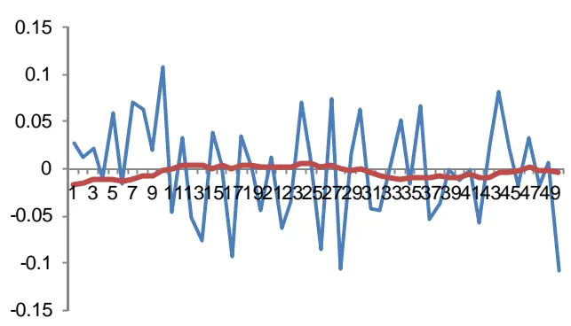
资料来源：海通证券研究所

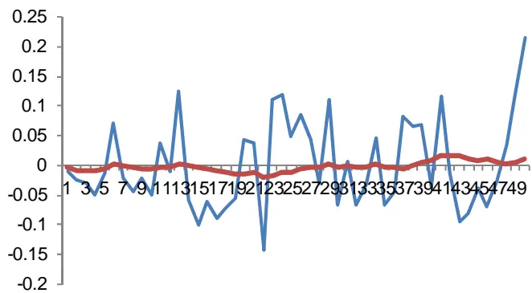

现象 2. 因子 Spearman 相关系数的移动平均会在较长时期向正向或负向的某侧偏移。对比图 2中的实际 24月移动平均和图 1中的仿真 24个点移动平均，我们发现实际的 24月移动平均的偏移程度要远远大于仿真结果。这说明这些偏移并不是随机的事件，换句话说，在一段时期内，因子和收益率之间的相关关系确实存在一定的稳定性。

图 2 因子的 Spearman 相关系数序列的历史表现及其 24个月移动均值
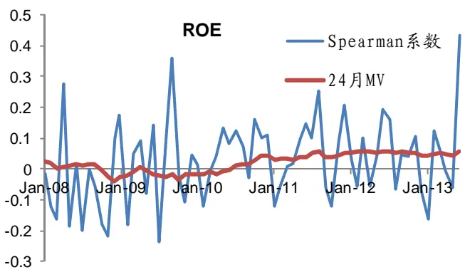

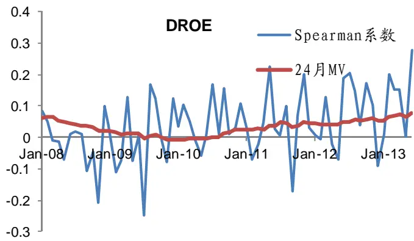

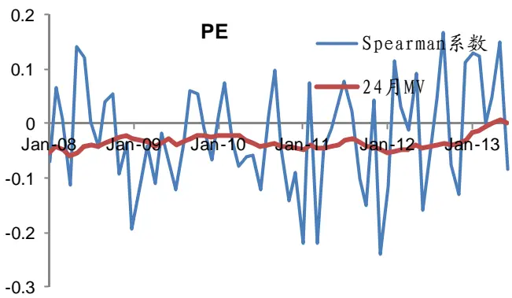
资料来源：海通证券研究所

## 2.4因子 Spearman 相关系数序列——究竟什么是有效因子？

根据 2.3中所陈述的现象，我们发现 Spearman 相关系数序列满足如下两个性质：

1. 截面 Spearman相关系数序列是一个波动很大的时间序列。换句话说，从实际数据来看，因子的“有效性”在不同时期的变化非常剧烈；

2. 截面 Spearman相关系数序列在一段时期内倾向于正负的某一侧。

这告诉我们，对于任意给定时期，本质上：

Spearman相关系数 = “真实”相关性 + “噪音”相关性。

由此，以上两个性质可以解释为：

1. “噪音”相关性这一项是每期“随机”变化的，是无法预测的，它不代表任何市场的因子风格。

2. “真实”相关性这一项更加具有稳定性，是可以预测的，它描述了市场的因子风格。

同时我们发现：

3. 观测到的Spearman相关系数中，“噪音”相关性所占份额要远远大于“真实”相关性。

因此，这给予我们对因子有效性新的理解，具体而言，我们应该更加关心“真实”相关性（隐参量），而非观测到的 Spearman 相关系数（观测值）。

注：

1. 在业绩归因过程中，我们经常发现因子的“有效性”变动很大，在某个投资周期是成长性因子有效，下一期可能就变成了估值因子有效，这给与我们因子有效性及其不稳定的印象。以上讨论说明为何业绩归因总是令我们感到困惑，其原因在于 “噪音”项主导了市场数据的相关性，导致我们在做业绩归因时所看到的结果更多的是“噪音”给出的结果。

2. 这同样解释了人们为何要使用多因子策略而非单因子策略，在多因子策略中，理想情况下根据大数定律，各个因子的 Spearman相关系数的“噪音”项会相互抵消，而只保留相应的“真实”项。我们将在今后的报告中对这一内容进行研究。

## 2.5 一个简单的结论与 p 值因子选取法

经过测试我们发现：

## 24 个月数据的 Spearman 相关系数约等于截面 Spearman 相关系数的 24 个月移动平均。

根据以上结论，我们可知：

p 值因子选取法本质上是建立了截面 Spearman 相关系数时间序列的模型，该模型正是 24个月移动平均模型。即，p值法把过去 24个月均值作为下一期 Spearman相关系数的预测，同时为了保证预测的稳定性，p值法对相关系数的数值进行了一定的限定。这样我们将过去的方法与当前的截面 Spearman 相关系数序列研究联系了起来。在后面的部分，我们将对比过往的因子选股方法和新方法的差别。

p值因子选取法的缺点是非常明显的，包括：

1. 24个月移动平均的预测结果会远远滞后于当前市场风格，这是一个非常重要的风险。

2. 若 24个月移动平均值在阈值附近震荡，则容易出现因子选取的不稳定性。

## 3. 马尔科夫链 Kalman Filter 模型

本节我们将给出马尔科夫链 Kalman Filter模型，在之后的研究中，我们将使用该模型来对因子的截面 Spearman系数序列进行建模。这是我们在新的研究框架下，研究因子有效性的一个尝试。

## 3.1 模型选择前的思考

根据之前的讨论，为截面 Spearman系数序列进行建模中所面临的问题如下：

1. 过滤截面Spearman系数序列中的噪音，以获得“真实”相关性；

2. 利用尽量少的历史数据，以抓住“当前”市场风格。

换句话说，由实际数据计算的 Spearman相关系数仅仅是一个观测值，同时存在一

个不可见的“真实”相关系数需要我们来估计。这让我们想到了经典的 Kalman Filter模型：

$$
Y_{t}=X_{t}+V_{t},\quad V_{t}\sim N(0,\sigma)
$$

$$
X_{t}=X_{t-1}+W_{t},\quad W_{t}\sim N(0,\eta)
$$

其中 $Y_{t}$ 为观测值，而 $X_{t}$ 为对应的真实值。那么，根据 Bayesian 公式和条件概率公式，我们可以根据观测值对真实值进行估计和预测。

但是，经典的 Kalman Filter 模型中的 $X_{t}$ 并不适合用于对“真实”截面 Spearman系数序列的描述，其原因在于：

1. $X_{t}$ 是一个随机游动，这与我们对“真实”截面 Spearman系数序列的理解有悖。实际上，我们通常认为市场的风格有一定的延续性，即因子的有效性是有动量性的。

2. $X_{t}$ 的状态空间是整个实轴，但相关系数的选取只能是在[-1, 1]之内。另外，连续的状态空间并不适合我们对因子选取法则的设定（参考 p值选取法中的阈值设定）。

## 3.2 马尔科夫链 Kalman Filter 模型

根据 3.1中的讨论，我们对 $X_{t}$ 的假设进行了修改。假设， $X_{t}$ 是一个 $乌$ 尔科夫链，满足：

1. $X_{t}$ 的状态空间为[-1,1]中的离散值，如：-0.20:0.01:0.20。

2. $X_{i}$ 的转移概率为， $X_{t}$ 保持 $X_{{}_{t-1}}$ 数值的概率为 p，而向 $X_{{}_{t-1}}$ 数值的上下两档转移的概率为 $(1-p)/2;$ ；若 $X_{{}_{t-1}}$ 触及状态空间的边界，则 $X_{t}$ 保持 $X_{{}_{t-1}}$ 的概率为 p。实证研究中，我们选取 p为 0.5。

根据 Bayesian公式和条件概率公式，我们可以轻易的给出 $X_{t}$ 的更新公式和预测公式，在这里不加赘述。

注：注意到 $V_{t}$ 的取值范围为整个实轴，而 $Y_{t}$ 是 Spearman相关系数，其取值范围为[-1, 1]区间。但在实际应用中该假设并不会带来问题，原因在于 $V_{t}$ 的标准差 $\sigma$ 取值不会太大，在之后的实证中，我们取 $\sigma$ 为 0.1。

## 3.3 模型的跟踪和预测效果

我们将该模型应用于 ROE、DROE和 PE。图 3中展示了 2008年 1月到 2013年 7月，马尔科夫链 Kalman Filter 模型(KFD)对各自“真实”截面 Spearman 相关系数的跟踪效果，作为对比，我们同样展示了 24 月移动平均模型(MV)及 24 月指数移动平均模型(EMV:半衰期为 12 个月)的跟踪效果。

图 3 模型跟踪效果
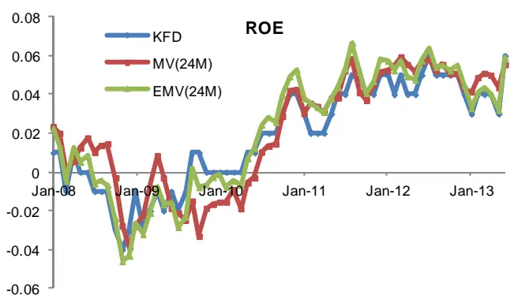

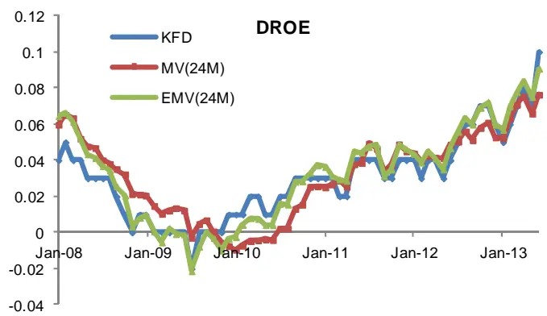

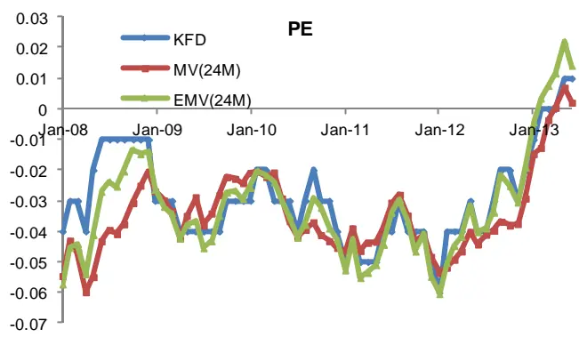
资料来源：海通证券研究所

从图中可以看出，马尔科夫链 Kalman Filter模型的跟踪效果整体上要好于另外两种模型。

1. 24个月移动平均模型的跟踪效果要滞后于另外两种模型。

2. 马尔科夫链 Kalman Filter模型的稳定性要好于 24个月指数移动平均模型。

## 4. 股票组合构建中的实证

下面我们把马尔科夫链 Kalman Filter模型因子选取法应用于组合构建。我们根据股票的分值，在给定的规则下构建股票组合，通过计算组合的历史表现来分析该模型。同时作为对比，我们以同样的方式来计算 p值法的组合表现。为了表达方便，我们把两种方法分别称之为 KF法和 p值法

注：值得注意的是，由于股票组合的历史表现不仅依赖于因子的选择，同样也依赖于股票组合的构建策略。因此，通过组合的历史表现并不是最好的分析因子选择方法好坏的标准，在今后的研究中，我们将探寻更合适的评判标准。

## 4.1 以沪深 300指数为基准的股票组合构建方法

由于沪深 300指数股指期货是市场上唯一的权益类风险对冲工具，因此若要赚取阿尔法收益，投资者通常以沪深 300指数作为基准，结合其投资策略来构建股票组合。

注意到，如何利用给定的股票分数来构建股票组合并不是该报告的主要内容，所以

在下面的讨论中，我们固定股票组合的构建方法如下：

1. 在任意投资期限起始，根据选股策略对股票池中的股票进行打分；

2. 根据沪深 300指数行业中性的原则，在股票池中选取 50支股票，并对这 50支股票进行等权重分配。

## 4.2 KF 法与 p值法在构建股票组合的历史效果比较

基于以上组合构建方法，我们依据 KF 法和 p 值法以月度为周期构建组合，并假定可以利用沪深 300 指数进行对冲，并对对冲策略的结果进行分析。我们发现，KF 法所构建的组合，要好于 p值法所构建的组合，这与我们的预期一致。图 4是两种对冲策略的净值曲线。可以看出，KF法的组合表现在 2010年以后要好于 p值法的组合表现，其主要原因在于，前者更早的发现了成长因子的有效性。

图 4 KF法对冲策略和 p值法对冲策略净值表现
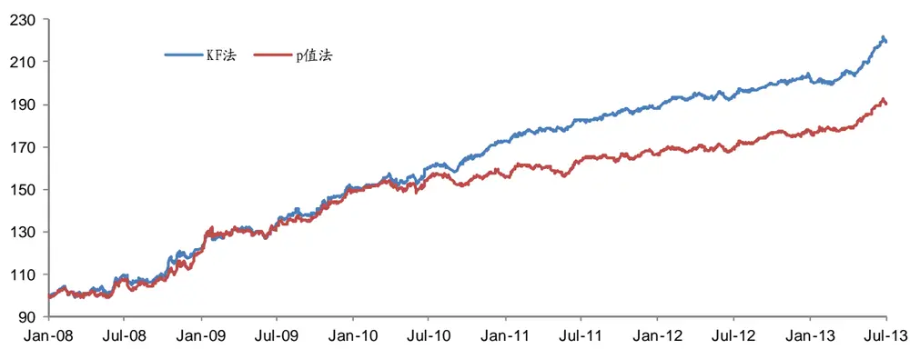
资料来源：海通证券研究所

表 1比较了两种策略在不同年份的表现。我们增加了“全因子法”作为对照策略。其中全因子法的策略为：不对因子进行筛选，仅仅依靠相关性的正负作为股票打分的依据。

表 1 三种策略的历史表现

|  | KF策略 | p值法 | 全因子法 |
| --- | --- | --- | --- |
| 年化超额收益 | 0.150 | 0.124 | 0.112 |
| 年化波动率 | 0.062 | 0.065 | 0.053 |
| 信息比 | 2.410 | 1.904 | 2.101 |
| 最大回撤 | 0.049 | 0.051 | 0.053 |

资料来源：海通证券研究所

从表 1 中可以看出，KF 法收益率、信息比均好于其它两种方法，同时它们的跟踪误差和最大回撤基本相同。

图 5 中展示了 KF 法和 p 值法在不同年度的表现，可以看出 KF 法在年度收益方面整体好于 p 值法，而最大回撤方面，两种策略没有太大的差异。

图 5 KF法和 p值法分年度比较
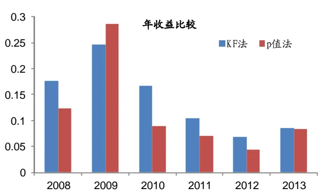
资料来源：海通证券研究所

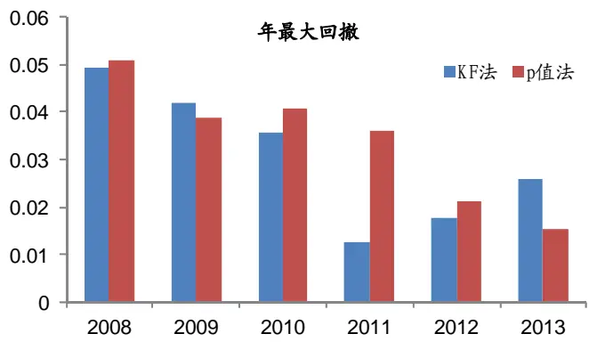

根据以上的分析我们可见，从历史回溯的角度出发，KF法选因子所构建出来的股票组合确实优于 p值法所构建出来的组合。

## 5. 总结

本报告从因子的截面 Spearman相关系数时间序列出发，提出了一种新的研究因子的有效性的框架。并利用马尔科夫链 Kalman Filter模型对因子的 Spearman相关系数时间序列建模，得到了一种比以往更好的因子选取方法。但同时我们也注意到，通过截面Spearman 相关系数序列研究因子“有效性”的这一框架还需要完善和深入的研究。我们不在此对存留的问题一一罗列，在今后的报告中，我们将对这些问题进行进一步的研究。

## 信息披露

## 分析师声明

郑雅斌：金融工程

本人具有中国证券业协会授予的证券投资咨询执业资格，以勤勉的职业态度，独立、客观地出具本报告。本报告所采用的数据和信息均来自市场公开信息，本人不保证该等信息的准确性或完整性。分析逻辑基于作者的职业理解，清晰准确地反映了作者的研究观点，结论不受任何第三方的授意或影响，特此声明。

## 法律声明

本报告仅供海通证券股份有限公司（以下简称“本公司”）的客户使用。本公司不会因接收人收到本报告而视其为客户。在任何情况下，本报告中的信息或所表述的意见并不构成对任何人的投资建议。在任何情况下，本公司不对任何人因使用本报告中的任何内容所引致的任何损失负任何责任。

本报告所载的资料、意见及推测仅反映本公司于发布本报告当日的判断，本报告所指的证券或投资标的的价格、价值及投资收入可能会波动。在不同时期，本公司可发出与本报告所载资料、意见及推测不一致的报告。

市场有风险，投资需谨慎。本报告所载的信息、材料及结论只提供特定客户作参考，不构成投资建议，也没有考虑到个别客户特殊的投资目标、财务状况或需要。客户应考虑本报告中的任何意见或建议是否符合其特定状况。在法律许可的情况下，海通证券及其所属关联机构可能会持有报告中提到的公司所发行的证券并进行交易，还可能为这些公司提供投资银行服务或其他服务。

本报告仅向特定客户传送，未经海通证券研究所书面授权，本研究报告的任何部分均不得以任何方式制作任何形式的拷贝、复印件或复制品，或再次分发给任何其他人，或以任何侵犯本公司版权的其他方式使用。所有本报告中使用的商标、服务标记及标记均为本公司的商标、服务标记及标记。如欲引用或转载本文内容，务必联络海通证券研究所并获得许可，并需注明出处为海通证券研究所，且不得对本文进行有悖原意的引用和删改。

根据中国证监会核发的经营证券业务许可，海通证券股份有限公司的经营范围包括证券投资咨询业务。

海通证券股份有限公司研究所

| 李迅雷 海通证券副总裁 海通证券首席经济学家 研究所所长 (021) 23219300 Ixl@htsec.com | 高道德 副所长 (021)63411586 gaodd@htsec.com 姜超 所长助理 (021)23212042 | Jc9001@htsec.com zxg9061@htsec.com | 路颖 副所长 (021)23219403 luying@htsec.com 赵晓光 所长助理 (021)23212041 | 江孔亮 所长助理 (021)23219422 kljiang @htsec.com |
| --- | --- | --- | --- | --- |
| 宏观经济研究团队 姜 超(021)23212042 jc9001@htsec.com 策略研究团队 |  |  |  |  |
| 陈 勇(021)23219800 曹高 阳(021)23219981 远(021)23219669 周 霞(021)23219807 联系人 顾潇啸(021)23219394 | cy8296@htsec.com cy8666@htsec.com gaoy@htsec.com zx6701 @htsec.com 汤 王 李 gxx8737@htsec.com | 荀玉根(021)23219658 陈瑞明(021)23219197 吴一萍(021)23219387 慧(021)23219733 旭(021)23219396 珂(021)23219821 | xyg6052@htsec.com chenrm@htsec.com wuyiping@htsec.com tangh@htsec.com wx5937@htsec.com lk6604@htsec.com | shankj@htsec.com 倪韵婷(021)23219419 niyt@htsec.com 罗 震(021)23219326 luozh@htsec.com 唐洋运(021)23219004 tangyy@htsec.com 王广国(021)23219819 wgg6669@htsec.com 孙志远(021)23219443 szy7856@htsec.com 陈 亮(021)23219914 ci7884@htsec.com 陈 瑶(021)23219645 chenyao@htsec.com 伍彦妮(021)23219774 wyn6254@htsec.com 曾逸名(021)23219773 zym6586@htsec.com 桑柳玉(021)23219686 sly6635@htsec.com 陈韵骋(021)23219444 cyc6613@htsec.com 田本俊(021)23212001 tbj8936@htsec.com |
| 金融工程研究团队 吴先兴(021)23219449 丁鲁明(021)23219068 郑雅斌(021)23219395 冯佳睿(021)23219732 朱剑涛(021)23219745 杨 勇(021)23219945 张欣慰(021)23219370 联系人 | wuxx@htsec.com dinglm@htsec.com zhengyb@htsec.com fengjr@htsec.com zhujt@htsec.com yy8314@htsec.com zxw6607@ htsec.com | 固定收益研究团队 姜超(021)23212042 姜金香(021)23219445 徐莹莹(021)23219885 李宁(021)23219431 倪玉娟(021)23219820 | jc9001@htsec.com jiangjx@htsec.com xyy7285@htsec.com 联系人 lin@htsec.com nyj6638@htsec.com | 政策研究团队 李明亮(021)23219434 Iml@htsec.com 陈久红(021)23219393 chenjiuhong@htsec.com 朱 蕾(021)23219946 zl8316@htsec.com |
| 计算机行业 陈美风(021)23219409 蒋 科(021)23219474 联系人 安永平(021)23219950 | chenmf@htsec.com 煤炭行业 jiangk@htsec.com ayp8320@htsec.com | 朱洪波(021)23219438 石油化工行业 | zhb6065@htsec.com 机械行业 dengyong@htsec.com | 批发和零售贸易行业 路 颖(021)23219403 luying@htsec.com 潘 鹤(021)23219423 panh@htsec.com 汪立亭(021)23219399 wanglt@htsec.com 李宏科(021)23219671 Ihk6064@htsec.com 龙华(021)23219411 longh@htsec.com |
| 建筑工程行业 赵健(021)23219472 张显宁(021)23219813 农林牧渔行业 | zhaoj@htsec.com zxn6700@htsec.com | 邓勇(021)23219404 王晓林(021)23219812 纺织服装行业 | wxi6666@htsec.com 联系人 | 熊哲颖(021)23219407 xzy5559@htsec.com 胡宇飞(021)23219810 hyf6699@htsec.com 黄 威(021)23219963 hw8478@htsec.com 非银行金融行业 丁文韬(021)23219944 dwt8223@htsec.com 李 欣(010)58067936 lx8867@htsec.com |
| 丁 频(021)23219405 dingpin@htsec.com 夏 木(021) 23219748 xiam@htsec.com 电子元器件行业 赵晓光(021)23212041 | zxg9061 @htsec.com | 杨艺娟(021)23219811 互联网及传媒行业 刘佳宁(0755)82764281 白 洋(021)23219646 | yyj7006@htsec.com ljn8634@htsec.com | 联系人 吴绪越(021)23219947 wxy8318@htsec.com 交通运输行业 黄金香(021)23212081 hjx9114@htsec.com |
|  | zhaocx@htsec.com | 赵 勇(0755)82775282 | xtt6218@htsec.com 联系人 钢铁行业 |  |
| 汽车行业 赵晨曦(021)23219473 冯梓钦(021)23219402 陈鹏辉(021)23219814 | fengzq@htsec.com cph6819@htsec.com | 马浩博(021)23219822 | zhaoyong@htsec.com mhb6614@htsec.com | 刘彦奇(021)23219391 liuyq@htsec.com |
|  |  |  |  | qianlf@htsec.com yun@htsec.com jm9176@htsec.com |
| 郑震湘(021)23219816 | zzx6787@htsec.com | 薛婷婷(021)23219775 食品饮料行业 | baiyang@htsec.com | 钱列飞(021)23219104 虞 楠(021)23219382 姜明(021)23212111 |

| 陈苏勤 总经理 贺振华 总经理助理 (021)63609993 (021)23219381 chensq@htsec.com hzh@htsec.com |  |  |  |  |  |  |  |
| --- | --- | --- | --- | --- | --- | --- | --- |
| 深广地区销售团队 上海地区销售团队 |  |  |  |  |  |  |  |
|  |  | ctq5979@htsec.com | 高溱 (021)23219386 | gaoqin@htsec.com | 赵春 | 北京地区销售团队 (010)58067977 | zhc@htsec.com |
| 蔡铁清 | (0755)82775962 (0755)83255933 | liujj4900@htsec.com | 姜洋 | (021)23219442 | jy7911@htsec.com | 郭文君 (010)58067996 | gwj8014@htsec.com |
| 刘晶晶 |  |  | 季唯佳 | (021)23219384 | jiwj@htsec.com | 隋巍 (010)58067944 |  |
| 辜丽娟 | (0755)83253022 | gulj@htsec.com | 胡雪梅 | (021)23219385 |  |  | sw7437@htsec.com |
| 高艳娟 | (0755)83254133 | gyj6435@htsec.com | 黃 毓 | (021)23219410 | huxm@htsec.com | 张广宇 (010)58067931 | zgy5863@htsec.com |
| 伏财勇 | (0755)23607963 | fcy7498@htsec.com | 朱 健 | (021)23219592 | huangyu@htsec.com | 江虹 (010)58067988 | jh8662@htsec.com |
| 邓欣 | (0755)23607962 | dx7453@htsec.com | 慧 | (021)23212071 | zhuj@htsec.com 杨 | 帅 (010)58067929 | ys8979@htsec.com |
|  |  |  | 黄卢 倩 | hh9071@htsec.com | 张楠 | (010)58067935 | zn7461@htsec.com |
|  |  |  | (021)23219373 | lq7843@htsec.com |  |  |  |
|  |  |  | 孙 明 (021)23219990 | sm8476@htsec.com |  |  |  |
|  |  |  | 孟德伟 (021)23219989 | mdw8578@htsec.com |  |  |  |

| 医药行业 |  | 有色金属行业 施 毅(021)23219480 |  | 基础化工行业 sy8486@htsec.com |  |  |  |
| --- | --- | --- | --- | --- | --- | --- | --- |
| 刘宇(021)23219608 郑 |  | liuy4986@htsec.com | 刘 博(021)23219401 |  | liub5226@htsec.com | 曹小飞(021)23219267 | caoxf@htsec.com |
| 琴(021)23219808 |  | zq6670@htsec.com | 联系人 |  |  | 张 瑞(021)23219634 联系人 | zr6056@htsec.com |
| 刘 杰(021)23219269 冯皓琪(021)23219709 |  | liuj5068@htsec.com fhq5945@htsec.com |  | 钟 奇(021)23219962 | zq8487@htsec.com | 朱 睿(021)23219957 | zr8353@htsec.com |
| 家电行业 陈子仪(021)23219244 |  | chenzy@htsec.com | 建筑建材行业 |  |  | 电力设备及新能源行业 张 浩(021)23219383 牛 品(021)23219390 | zhangh@htsec.com |
| 联系人 宋 伟(021)23219949 |  | sw8317@htsec.com | 张显宁(021)23219813 |  | zxn6700@htsec.com | 房 青(021)23219692 联系人 徐柏乔(021)23219171 | np6307@htsec.com fangq@htsec.com |
| 公用事业 陆凤鸣(021)23219415 |  | lufm@htsec.com | 银行业 |  |  | 社会服务业 |  |
| 汤砚卿(021)23219768 |  | tyq6066@htsec.com | 刘瑞 | 戴志锋(0755)23617160 (021)23219635 | dzf8134@htsec.com Ir6185@htsec.com | 林周勇(021)23219389 | lzy6050@htsec.com |
| 联系人 李心宇(021)23212163 |  | Ixy9298@htsec.com |  | 林媛媛 (0755)23962186 | lyy9184@htsec.com |  |  |
| 房地产业 涂力磊(021)23219747 |  | tll5535@htsec.com | 造纸轻工行业 |  |  | 通信行业 徐力(010)58067940 |  |
| 谢 盐(021)23219436 |  | xiey@htsec.com |  | 徐 琳(021)23219767 | xl6048@htsec.com | 侯云哲(021)23219815 | xl9312@htsec.com hyz6671@htsec.com |
|  | 贾亚童(021)23219421 | jiayt@htsec.com |  |  |  |  |  |
| 中小市值 |  |  |  |  |  |  |  |
|  | 邱春城(021)23219413 | qiucc@htsec.com |  |  |  |  |  |
| 何继红(021)23219674 | 钮宇鸣(021)23219420 | ymniu@htsec.com |  |  |  |  |  |
| 孔维娜(021)23219223 |  | hejh@htsec.com kongwn@htsec.com |  |  |  |  |  |

## 海通证券股份有限公司机构业务部

海通证券股份有限公司研究所

地址：上海市黄浦区广东路 689号海通证券大厦13楼

电话：(021)23219000

传真：(021)23219392

网址：www.htsec.com