证券研究报告专题报告

## 选股因子研究系列（四）

2013年10月28日

## 相关研究

选股因子研究系列（一）——弱者终有逆袭日，强势几无持续时 20120723选股因子研究系列（二）——因子模型的尾部相关性研究20130325选股因子研究系列（三）——从Spearman相关系数出发研究因子有效性——Kalman Filter模型在因子选择中的应用20131011

海通证券研究所

金融工程分析师

冯佳睿

SAC 执业证书编号：

S0850512080006

电话：021-23219732

## 多因子选股模型的有效与失效

Email: fengjr@htsec.com

选择对收益率有较高区分度的因子是多因子选股模型成功的关键，然而，对于怎样筛选因子才最有效，不论是研究还是投资人员都莫衷一是。传统的线性统计方法因其直观便利的特点而成为常规工具，但困惑与质疑也随之而来。本文将以此为切入点，探索因子对收益率的预测能力与表现形态，试图拨开多因子选股成败的迷雾。

- 传统的线性相关系数很难有效筛选出对收益率有较强鉴别能力的因子。选择28个常用的选股因子，包括ROA、EPS、PE、换手率等，分别计算因子值与次月收益率的相关系数。除少数几个因子对应的相关系数值大于0.1外，绝大部分线性相关系数的绝对值都没有超过0.04，其中包括所有反映企业基本面信息的因子。

假设检验的结果反而表明因子与收益率的线性关系是存在的。一部分因子的相关系数估计值小于0.1，但检验的结果却显著地区别于零。这是因为即使模型的拟合效果不佳，也可能由于样本数量众多导致拒绝因子与收益率之间无相关性的原假设。

- 把因子按大小分成若干组之后，考察各组之间的收益差别或许是一个更合理的判断因子有效性的方式。根据个股月末的因子值大小分成10组，得到每个组别中所有股票下月收益率的平均值。记录每个月收益最高的组别序号，并统计各序号的出现频数，计算这十个频数与序列(1,2,..，10)之间的相关系数。当相关系数在-1到1之间变化时，就能够对因子有效性的强弱有一个客观量化的描述。

- 实证发现，平均收益率最高的组合更易出现在因子取值的两端。从而可以把因子的有效性重新定义为，高（低）收益出现在因子取值大小两端的可能性更高。这也符合实际应用中的组合构建方法，我们习惯于选择因子取值两端的组合作为买入或卖出标的。当样本股按照因子大小分成10组时，最大平均收益出现在组别1和10的概率都显著高于其他组。

因子和收益率的尾部相关系数具有不同于其他相关性度量指标的独特性和不随时间推移发生巨大变化的稳定性。首先，对比相应的线性相关系数，两者在描述因子对收益率的预测能力时，确实提供了完全不同的信息。其次，如果将时间段一分为二，前后两个区间内的尾部相关系数在坐标系的45°直线周围均匀分布，足以表明尾部相关是一个稳定的性质。

- 本文对因子与收益率在尾部区域相关关系的探索是成功的。根据极值理论的相关概念，用极大似然估计可得各因子与收益率的尾部相关系数。在和真实情况对比后，可以认为各因子对应的尾部相关系数较为如实地反映出，倘若选择因子取值最大的那部分个股形成组合时，能获得较高的平均收益的概率。在筛选因子时，完全可以依赖上述结果进行决策。

有理由相信，上市公司的经营与盈利情况如ROA、EPS，股票的量价变化，如价格均线走势、换手率高低，都会对未来的股价造成影响。所以，多因子选股历来都是量化投资的一个重要方向，吸引着众多研究者和实践者投身其中。作为模型根本的因子，自然也成为关注的焦点，受到广泛的讨论与检验。

选择对收益率有较高区分度的因子是模型成功的关键，然而，对于怎样筛选因子才最有效，不论是研究还是投资人员都莫衷一是。传统的线性统计方法因其直观便利的特点而成为常规工具，但困惑与质疑也随之而来。本文将以此为切入点，探索因子对收益率的预测能力与表现形态，试图拨开多因子选股成败的迷雾。

## 1. 传统线性统计方法的挣扎

在研究因子对收益率的预测能力时，往往会假定两者之间存在线性关系，通过相关或回归分析选择若干因子作为构建股票组合的基础。常用的判断标准包括相关系数或回归斜率的比较，拟合程度（R²）的高低，各种变量选择技巧等。但在这一过程中，很多研究者都或多或少遭遇过这样的问题：很难找到令人满意或我们想象中的因子-收益关系。图1就是一个简单却很能说明问题的案例。我们以2005年1月至2013年9月间，沪深300指数历史上每一期的样本股为研究对象，选择了28个常用的选股因子，包括ROA、EPS、PE、换手率等，在每个月末的取值，分别计算其与次月收益率的相关系数。

图 1 沪深 300 样本股收益率与因子的 Pearson 相关系数
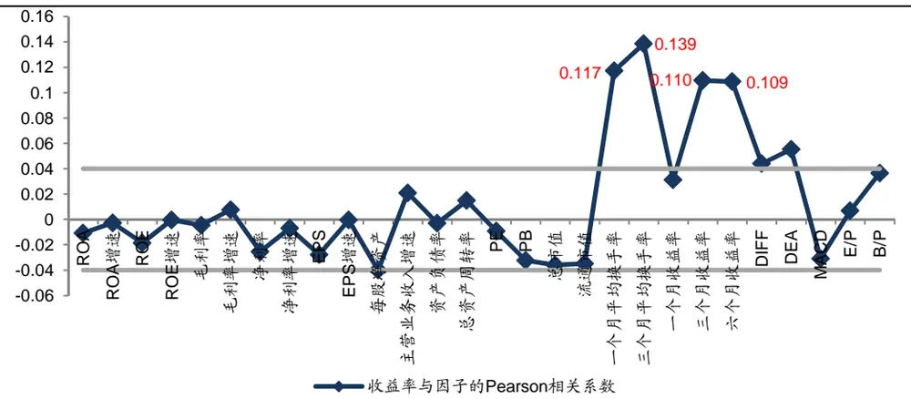
资料来源：WIND，海通证券研究所

除少数几个因子对应的相关系数值大于0.1外，绝大部分相关系数的绝对值都没有超过0.04，其中包括所有反映企业基本面信息的因子。仅凭这一结果，显然很难有效筛选出对收益率有较强鉴别能力的因子。于是，很多研究者会在估计的基础上进一步使用假设检验作为手段，判断因子对收益率预测能力的强弱。但令人困惑的现象也随之而来，一部分相关系数估计值小于0.1的因子，其检验的结果却是显著地区别于零，即有很强的证据表明因子与未来收益率的线性关系是存在的。然而，不论是散点图还是相关系数本身，似乎都无法令我们完全认可上述结论。所以，在研究多因子选股模型的有效性时，有必要讨论这一似是而非的现象。

假设检验的理论表明，除了检验统计量之外，样本容量的大小对检验的功效有着重要影响。以数据标准化后的一元回归分析为例，此时两个变量之间的相关系数恰好等于回归斜率，平方以后也等于回归方程的R²，而R²通常被认为是度量回归模型对数据拟合程度高低的重要指标。简单的推导可以证明，斜率的检验统计量T与R²有如下关系：

$$
T=\sqrt{\frac{(\mathsf{n}-2)\mathsf{R}^{2}}{1-\mathsf{R}^{2}}}\ ,
$$

显然，T是样本量n的严格单调增函数。这就表明，即使模型的拟合效果不佳 $({\sf R}^{2}\acute{\sf R}^{2}\cdot{\sf J}\cdot\rbrack$ 也可能由于样本数量众多导致拒绝因子与收益率之间无相关性的原假设。而金融市场的一大特征便是存在海量数据，所以在利用传统的线性模型选择因子时，容易出现相关系数的绝对值或R²较小，但检验结果显著区别于零的矛盾。

看来，简单的线性分析对因子选股的有效性既无法证实也无法证伪，但大量的实证结果却暗示着模型的成功并非完全是运气使然。这就需要我们从其他角度来对多因子模型的机制进行研究。

## 2. 因子有效性的强弱指数

从上文的分析看，因子和收益率之间存在优良的线性性质也许并不是一个合适的假设。即使真实如此，极小的相关系数也表明因子取值之间的一定差异对收益率的影响也没有想象中的那么大。比如，8-10倍的市盈率可能就是某一类股票估值的合理波动区间，用严格的单调或线性关系加以区分反而显得过分拘泥。站在这个角度上，对因子按大小分成若干组之后，考察各组之间的收益差别或许是一个更合理的方式。

仍然以沪深300的各期样本股为研究对象，根据个股月末的因子值大小分成10组，最小的为组别1，最大的为组别10。分别计算每个组别中所有股票下月收益率的平均值，记录每个月收益最高的组别序号，并统计各序号的出现频数，记为 $(\mathsf{N}_{1},\mathsf{N}_{2},\ldots,\mathsf{N}_{10})$ 进一步，可得这十个频数的大小序号，对应地记为 $(\mathsf{R}_{1},\mathsf{R}_{2},\ldots,\mathsf{R}_{10})$ 。考虑到市场的随机因素，理想的情况是，如果某个因子对个股的未来收益有较好的预测和区分能力，那么频数的大小应当呈现严格的单调形态，即， $\mathsf{N}_{1}{<}\mathsf{N}_{2}{<}\ldots{<}\mathsf{N}_{10}$ 或 $\mathsf{N}_{1}{>}\mathsf{N}_{2}{>}\ldots{>}\mathsf{N}_{10}$ 。从而，对应的有 $(\mathsf{R}_{1},\mathsf{R}_{2},\ldots,\mathsf{R}_{10}){=}(1,2,\ldots,10)$ 或 $(10,9,\ldots,1)$ 。根据这一推导过程，我们可以设计一个简单的强弱指数，用来判断因子在识别收益时的有效性。

在获得序列 $(\mathsf{R}_{1},\mathsf{R}_{2},\ldots,\mathsf{R}_{10})$ 后，计算它与(1,2,..，10)之间的相关系数。显然，如果频数大小是严格单调的，那么相关系数的绝对值应当为1。而当相关系数在-1到1之间变化时，就能够对因子有效性的强弱有一个客观量化的描述。由此，我们计算了前文28个因子的强弱指数，并与图1中的Pearson相关系数进行对比，具体结果在图2中予以展示。

图 2 因子有效性的强弱指数
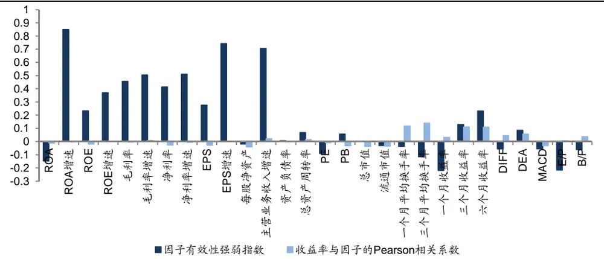
资料来源：WIND，海通证券研究所

和因子-收益率之间极小的线性相关系数相比，强弱指数对基本面因子的检验增强了我们使用多因子选股模型的信心。其中，ROA增速、EPS增速和主营业务收入增速这三个因子的有效性强弱指数都超过0.7。图3-图5具体展示了它们的月度最大平均收益率出现在每一个组别的百分比。显然，随着代表企业盈利能力和经营水平提升幅度的组别序号增大时，未来的股价也会有对应一致的表现。这一结果也表明，即使是在代表大盘蓝筹的沪深300市场，公司的成长性依然是决定投资报酬的重要因素。

图 3 最大收益率所处组别占比（ROA 增速）
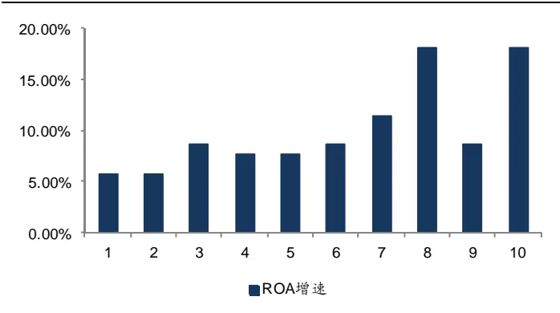
资料来源：WIND，海通证券研究所

图 4最大收益率所处组别占比(EPS 增速）
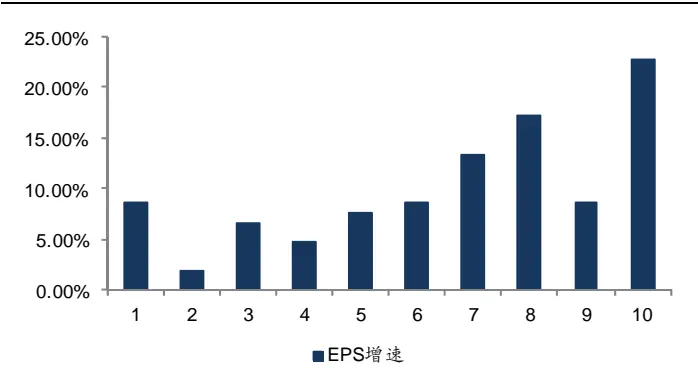
资料来源：WIND，海通证券研究所

图 5 最大收益率所处组别占比（主营业务收入增速）
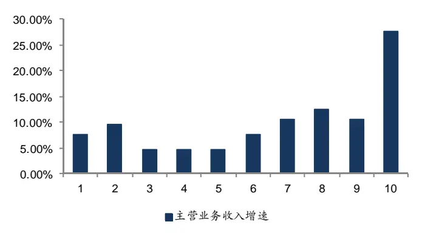
资料来源：WIND，海通证券研究所

图6最大收益率所处组别占比（流通市值）
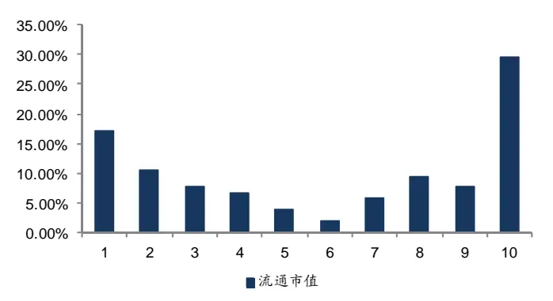
资料来源：WIND，海通证券研究所

图7最大收益率所处组别占比（一个月平均换手率）
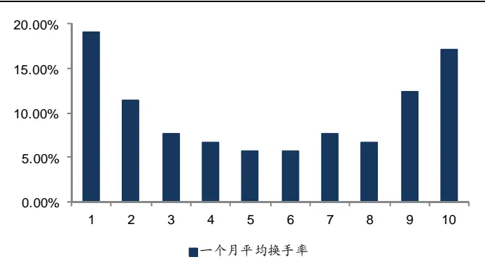
资料来源：WIND，海通证券研究所

图 8最大收益率所处组别占比（ROA）
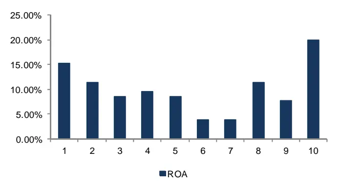
资料来源：WIND，海通证券研究所

然而，一些在实务中被证明十分有效的非基本面因子，比如市值、换手率，它们的有效性强弱指数却很低。此外，ROA的负强弱指数似乎也有悖于正常的认知。这使得我们对产生这些现象的原因非常感兴趣。图6-图8依次给出了三个因子——流通市值、一个月平均换手率、ROA，每个月最大收益率所在组别序号的占比。显而易见的是，这三张图中所展现的百分比分布形态完全不同于图3-图5，也与所谓的单调性相去其远。但倘若仔细观察，其中的特征也并非无迹可寻。两端高、中间低的∪型形态同样是一目了然。此即，平均收益率最高的组合更易出现在因子取值的两端。这就促使我们去思考，追求较高的因子有效性强弱指数，即单调性，反而可能忽视了因子与收益率之间的一部分重要规律。

联系实际应用中的多因子选股步骤，我们习惯于选择因子取值两端的组合作为买入或卖出标的。这一做法暗含的假定只是，两端的组合有突出的收益特征。如果从这个角度考量，那单调性就是一个过于严苛的要求，甚至是一个不怎么必要的条件。再回到图6-图8，尽管这三个因子都不具备很高的有效性强弱指数，但却和我们希望的情形不谋而合，最大平均收益出现在组别1和10的概率都显著高于其他组。这时，我们显然无法否认它们在多因子选股模型中的作用。当然，单调性只是一个更强的假定，具备这一特性的因子在其最大或最小的组别中同样更有可能获取最高的平均收益。图9和图10分别给出的是每个因子按大小分成10组和5组后，在最大和最小组别中出现最高平均收益的百分比。可以看到，在分成10组的情况下，大部分因子在这两个组别中的占比之和都超过30%，有的甚至超过40%。而如果分成5组，这两个比例的和更是在60%左右。

图9最大收益率出现在最大、最小组别的占比（10组）
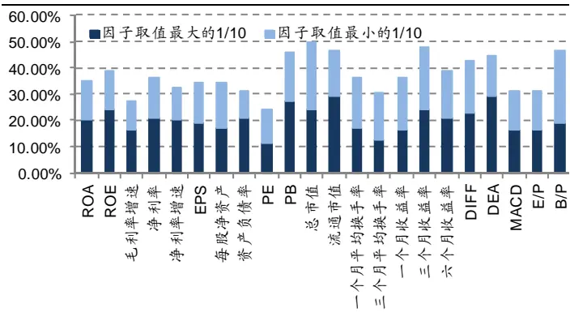
资料来源：WIND，海通证券研究所

图10最大收益率出现在最大、最小组别的占比（5组）
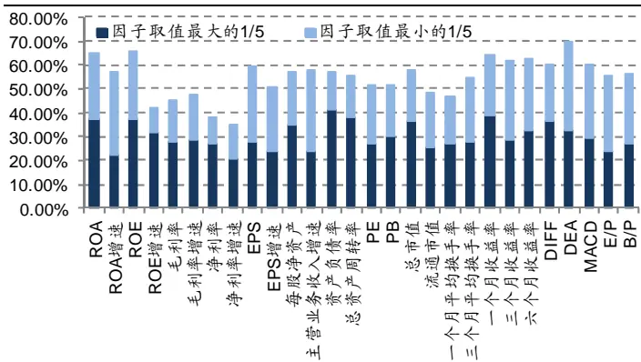
资料来源：WIND，海通证券研究所

显然，考察因子两端个股的收益特征更具实践意义。根据这一逻辑，可以把因子的有效性重新定义为，高（低）收益出现在因子取值大小两端的可能性更高。下面，我们将对这一描述给出数学形式上的表达，并论证它作为因子有效性的一种度量是可行且合理的。

## 3. 因子与收益率的尾部相关性

在本系列的第二篇专题报告一一《因子模型的尾部相关性研究》中，我们定义了个股与市场收益率之间的尾部相关性，用以刻画在市场收益率较为极端的区域内，个股所受影响的强弱。同样地，倘若将市场收益率换成感兴趣的因子，就可以定义收益率和因子间的尾部行为。以F表示因子，X表示收益率，那么两者之间的尾部相关性可写为：Pr(X>t*|F>s*)。其中，s*和t*为两个较大的阈值。这一表达形式不仅完全符合上一部分中我们对因子有效性的论断，而且从统计意义上来看也有诸多优点。首先，以条件概率的形式度量相关性符合原始对独立和相关的定义。其次，传统的线性相关系数本质上都是以矩为基础的技术，将其应用于证券数据建模所面临的一个潜在问题是，考察的矩极有可能不存在或为无穷大。这就可能导致常用估计方法的失效，而使用概率定义则不会存在这个问题。第三，常用的相关性对两端数据度量往往是对称的，但在实际中，投资者通常都会不对称地看待收益和损失。此时，线性相关系数有可能会产生严重的误导，而用上述定义的尾部形式就能使我们独立地考察两端的情况。

虽然，尾部相关性有着种种优势，但如果想将其作为一种因子筛选的工具，进而为股票组合的构建提供参考，必须满足两点最基本的要求。第一，它能够捕捉到与传统线性相关系数不同的信息。第二，它在随时间的推移过程中能保持相对稳定。为了确认这两点，我们做以下的验证。

选择2005年1月至2013年9月之间的沪深300历史样本股为研究对象，估计次月的收益率和因子的尾部相关系数，并和图1中的线性相关系数进行对比，在图11中展示。

图11 尾部相关系数和线性相关系数的对比
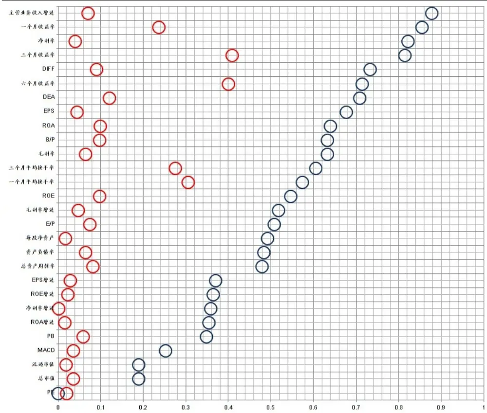
资料来源：WIND，海通证券研究所

将计算所得的因子与收益率的尾部相关系数从小到大排列，如果它反映的是和线性相关系数类似的性质，那么两者在排序的形态上应当比较接近，但在图11中我们并未看到这一点。这表明，尾部相关系数对于因子和收益率尾部行为的描述确实能提供不同于其他指标的信息。

图12确定的问题是尾部相关系数是否随时间的推移相对稳定。我们把整个时间段一分为二，分别计算前52个月和后53个月的尾部相关系数，并以散点图的形式加以展示。总体来看，指标的稳定程度较高。进一步，如果我们把最小二乘拟合直线与45°直线对比，同样可以看出不同时段的尾部相关系数是相当稳定的。

图 12 尾部相关系数的稳定性
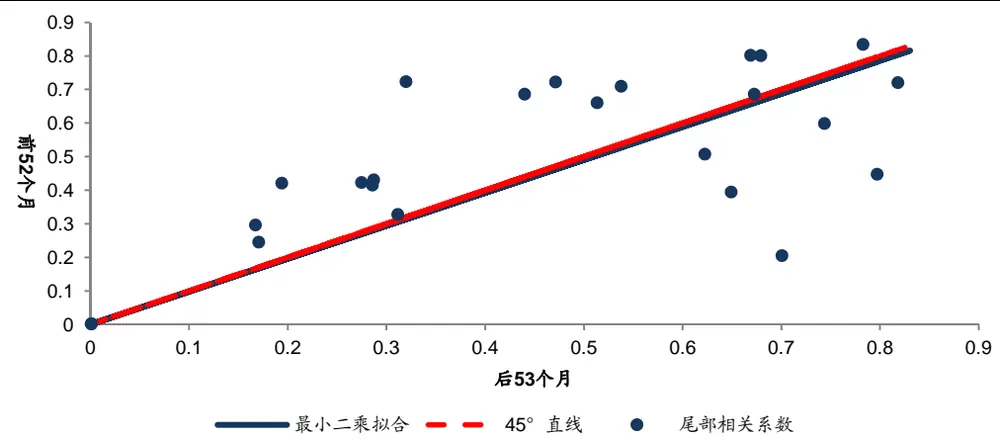
资料来源：WIND，海通证券研究所

在证明因子和收益率的尾部相关系数具有不同于其他相关性度量指标的独特性和不随时间推移发生巨大变化的稳定性后，我们关注的便是其估计结果以及对实践的指导作用。图13中的折线是用极大似然方法估计得到的各因子与收益率的尾部相关系数，柱状图是因子取值最大的那一组同时也有最高平均收益的百分比。为避免负值带来的影响，我们去掉了常用的两个估值指标一—PE和PB，并以它们的倒数代替。因为理论上来说，估值过高或小于零的个股都不是理想的投资标的，代之以倒数可使这两种情况出现在数轴的一端。

图13 因子与收益率的尾部相关系数
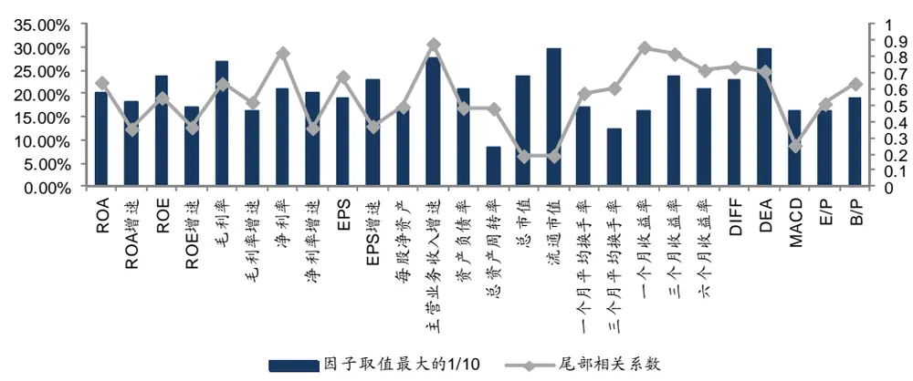
资料来源：WIND，海通证券研究所

从上图来看，各因子对应的尾部相关系数可以较为如实地反映出，倘若选择因子取值最大的那部分个股形成组合时，能获得较高的平均收益的概率。这表明我们对因子与收益率在尾部区域相关关系的探索是成功的，在筛选因子时，完全可以依赖上述结果进行决策。

## 4. 总结与讨论

本文从经典的线性相关系数出发，解释了估计值小但检验结果显著这一矛盾，从而说明传统的度量技术无法有效判别因子对收益的预测能力。考虑到实际研究和投资中，因子取值位于某个区间的重要程度远高于具体数字，本文尝试以新的思路，将因子按大小分组后，定义了有效性强弱指数，为部分基本面因子在选股过程中所起的作用提供了证据。在进一步深入后，我们发现几乎所有因子都具备一条同样的性质，即两端的组合获取最高平均收益的概率较大。结合实际应用中多因子模型的关注焦点，本文认为考察因子和收益率在尾部区域的行为更合理也更有意义。在此基础上，我们借用极值理论中的相关概念，提出了单个因子和收益率的尾部相关系数。实证分析表明，这一指标不仅拥有良好的性质，而且能够为因子的筛选提供极具参考价值的信息。

本文只是对因子选股原理的初步探索，对于单个因子，有些结论易于获得。倘若想要推广到多因子模型，进而保证投资收益的稳定性，以下三个问题亟需解决。在今后的研究中，我们将沿这些方向继续深入，以期能更加清晰地了解多因子选股模型的机制与得失，为实践做出更好的指导，敬请期待！

- 能否找到一族因子，使得线性组合之后与收益率的尾部相关性最高？

- 在寻找最优因子组合的过程中，是否能同时确定最佳因子权重？

- 因子取值大小两端的组合在平均意义上更易出现高收益的原因是什么？

## 信息披露

分析师声明

冯佳睿：金融工程

本人具有中国证券业协会授予的证券投资咨询执业资格，以勤勉的职业态度，独立、客观地出具本报告。本报告所采用的数据和信息均来自市场公开信息，本人不保证该等信息的准确性或完整性。分析逻辑基于作者的职业理解，清晰准确地反映了作者的研究观点，结论不受任何第三方的授意或影响，特此声明。

## 法律声明

本报告仅供海通证券股份有限公司（以下简称“本公司”）的客户使用。本公司不会因接收人收到本报告而视其为客户。在任何情况下，本报告中的信息或所表述的意见并不构成对任何人的投资建议。在任何情况下，本公司不对任何人因使用本报告中的任何内容所引致的任何损失负任何责任。

本报告所载的资料、意见及推测仅反映本公司于发布本报告当日的判断，本报告所指的证券或投资标的的价格、价值及投资收入可能会波动。在不同时期，本公司可发出与本报告所载资料、意见及推测不一致的报告。

市场有风险，投资需谨慎。本报告所载的信息、材料及结论只提供特定客户作参考，不构成投资建议，也没有考虑到个别客户特殊的投资目标、财务状况或需要。客户应考虑本报告中的任何意见或建议是否符合其特定状况。在法律许可的情况下，海通证券及其所属关联机构可能会持有报告中提到的公司所发行的证券并进行交易，还可能为这些公司提供投资银行服务或其他服务。

本报告仅向特定客户传送，未经海通证券研究所书面授权，本研究报告的任何部分均不得以任何方式制作任何形式的拷贝、复印件或复制品，或再次分发给任何其他人，或以任何侵犯本公司版权的其他方式使用。所有本报告中使用的商标、服务标记及标记均为本公司的商标、服务标记及标记。如欲引用或转载本文内容，务必联络海通证券研究所并获得许可，并需注明出处为海通证券研究所，且不得对本文进行有悖原意的引用和删改。

根据中国证监会核发的经营证券业务许可，海通证券股份有限公司的经营范围包括证券投资咨询业务。

海通证券股份有限公司研究所

| 李迅雷 海通证券副总裁 海通证券首席经济学家 研究所所长 (021) 23219300 Ixl@htsec.com | 高道德 副所长 (021)63411586 gaodd@htsec.com 姜超 (021)23212042 Jc9001@htsec.com | 所长助理 | 路颖 副所长 (021)23219403 luying@htsec.com 赵晓光 所长助理 (021)23212041 zxg9061@htsec.com | 江孔亮 所长助理 (021)23219422 kljiang @htsec.com |
| --- | --- | --- | --- | --- |
| 宏观经济研究团队 姜 超(021)23212042 陈 勇(021)23219800 曹 阳(021)23219981 高 远(021)23219669 周 霞(021)23219807 王 联系人 | jc9001@htsec.com 策略研究团队 cy8296@htsec.com 荀玉根(021)23219658 cy8666@htsec.com 陈瑞明(021)23219197 gaoy@htsec.com 吴一萍(021)23219387 zx6701@htsec.com 汤 | xyg6052@htsec.com 慧(021)23219733 旭(021)23219396 珂(021)23219821 | 金融产品研究团队 罗 震(021)23219326 chenrm@htsec.com wuyiping@htsec.com tangh@htsec.com wx5937@htsec.com lk6604@htsec.com | 娄 静(021)23219450 loujing@htsec.com 单开佳(021)23219448 shankj@htsec.com 倪韵婷(021)23219419 niyt@htsec.com luozh@htsec.com 唐洋运(021)23219004 tangyy@htsec.com 王广国(021)23219819 wgg6669@htsec.com 孙志远(021)23219443 szy7856@htsec.com 陈 亮(021)23219914 ci7884@htsec.com 陈 瑶(021)23219645 chenyao@htsec.com |
| 金融工程研究团队 吴先兴(021)23219449 丁鲁明(021)23219068 郑雅斌(021)23219395 zhengyb@htsec.com 徐莹莹(021)23219885 冯佳睿(021)23219732 fengjr@htsec.com | wuxx@htsec.com dinglm@htsec.com | 固定收益研究团队 姜超(021)23212042 姜金香(021)23219445 | 政策研究团队 jc9001@htsec.com jiangjx@htsec.com xyy7285@htsec.com | 伍彦妮(021)23219774 wyn6254@htsec.com 曾逸名(021)23219773 zym6586@htsec.com 桑柳玉(021)23219686 sly6635@htsec.com 陈韵骋(021)23219444 cyc6613@htsec.com 田本俊(021)23212001 tbj8936@htsec.com 李明亮(021)23219434 Iml@htsec .com 陈久红(021)23219393 chenjiuhong@htsec.com |
| 朱剑涛(021)23219745 杨 勇(021)23219945 张欣慰(021)23219370 联系人 祗飞跃(021)23219984 计算机行业 陈美风(021)23219409 蒋 科(021)23219474 | zhujt@htsec.com yy8314@htsec.com zxw6607@ htsec.com dfy8739@htsec.com chenmf@htsec.com jiangk@htsec.com | 李宁(021)23219431 倪玉娟(021)23219820 煤炭行业 朱洪波(021)23219438 | lin@htsec.com nyj6638@htsec.com zhb6065@htsec.com | 联系人 朱蕾(021)23219946 zl8316@htsec.com 批发和零售贸易行业 路 颖(021)23219403 luying@htsec.com 潘 鹤(021)23219423 panh@htsec.com |
| 联系人 安永平(021)23219950 建筑工程行业 赵 健(021)23219472 | ayp8320@htsec.com zhaoj@htsec.com | 石油化工行业 邓 勇(021)23219404 王晓林(021)23219812 | dengyong@htsec.com wxl6666@htsec.com | 汪立亭(021)23219399 wanglt@htsec.com 李宏科(021)23219671 Ihk6064@htsec.com 机械行业 龙华(021)23219411 longh@htsec.com 熊哲颖(021)23219407 xzy5559@htsec.com 胡宇飞(021)23219810 hyf6699@htsec.com |
| 农林牧渔行业 丁 频(021)23219405 | dingpin@htsec.com | 纺织服装行业 |  | 联系人 黄威(021)23219963 hw8478@htsec.com 非银行金融行业 丁文韬(021)23219944 dwt8223@htsec.com 李 欣(010)58067936 lx8867@htsec.com |
| 夏 木(021) 23219748 电子元器件行业 赵晓光(021)23212041 郑震湘(021)23219816 | xiam@htsec.com zxg9061@htsec.com 白 洋(021)23219646 | 杨艺娟(021)23219811 互联网及传媒行业 刘佳宁(0755)82764281 | yyj7006@htsec.com 联系人 ljn8634@htsec.com baiyang@htsec.com | 吴绪越(021)23219947 wxy8318@htsec.com 交通运输行业 黄金香(021)23212081 hjx9114@htsec.com 钱列飞(021)23219104 qianlf@htsec.com |
| 汽车行业 | zzx6787@htsec.com | 薛婷婷(021)23219775 | xtt6218@htsec.com 联系人 | 虞楠(021)23219382 yun@htsec.com 姜明(021)23212111 jm9176@htsec.com |
| 赵晨曦(021)23219473 | zhaocx@htsec.com | 食品饮料行业 | 钢铁行业 zhaoyong@htsec.com |  |
|  |  |  | mhb6614@htsec.com |  |
| 刘宇(021)23219608 | liuy4986@htsec.com 刘 博(021)23219401 | 施 毅(021)23219480 | sy8486@htsec.com | 曹小飞(021)23219267 |
|  |  | 赵 勇(0755)82775282 |  |  |
|  |  |  |  | liuyq@htsec.com |
|  | fengzq@htsec.com |  |  |  |
| 冯梓钦(021)23219402 |  |  |  | 刘彦奇(021)23219391 |
|  |  | 马浩博(021)23219822 |  |  |
|  | cph6819@htsec.com |  |  |  |
| 陈鹏辉(021)23219814 |  |  |  |  |
|  |  | 有色金属行业 |  | 基础化工行业 |

| 家电行业 陈子仪(021)23219244 联系人 宋 伟(021)23219949 | chenzy@htsec.com sw8317@htsec.com | 建筑建材行业 张显宁(021)23219813 | zxn6700@htsec.com | 电力设备及新能源行业 张 浩(021)23219383 牛 品(021)23219390 房 青(021)23219692 联系人 | zhangh@htsec.com np6307@htsec.com fangq@htsec.com |
| --- | --- | --- | --- | --- | --- |
| 公用事业 陆凤鸣(021)23219415 | lufm@htsec.com | 银行业 戴志锋(0755)23617160 | dzf8134@htsec.com | 徐柏乔(021)23219171 社会服务业 | xbq6583@htsec.com |
| 汤砚卿(021)23219768 联系人 李心宇(021)23212163 | tyq6066@htsec.com lxy9298@htsec.com | 刘瑞 (021)23219635 林媛媛(0755)23962186 | Ir6185@htsec.com lyy9184@htsec.com | 林周勇(021)23219389 | lzy6050@htsec.com |
| 房地产业 涂力磊(021)23219747 | tll5535@htsec.com | 造纸轻工行业 |  | 通信行业 徐 力(010)58067940 | xl9312@htsec.com |
| 谢 盐(021)23219436 贾亚童(021)23219421 | xiey@htsec.com jiayt@htsec.com | 徐 琳(021)23219767 | xl6048@htsec.com | 侯云哲(021)23219815 | hyz6671 @htsec.com |
| 中小市值 |  |  |  |  |  |
| 邱春城(021)23219413 | qiucc@htsec.com |  |  |  |  |
| 钮宇鸣(021)23219420 | ymniu@htsec.com |  |  |  |  |
| 何继红(021)23219674 | hejh@htsec.com |  |  |  |  |
|  | kongwn@htsec.com |  |  |  |  |
| 孔维娜(021)23219223 |  |  |  |  |  |

## 海通证券股份有限公司机构业务部

| 陈苏勤 总经理 贺振华 总经理助理 (021)63609993 (021)23219381 chensq@htsec.com hzh@htsec.com |  |  |  |  |  |  |  |  |
| --- | --- | --- | --- | --- | --- | --- | --- | --- |
| 上海地区销售团队 |  |  |  |  |  |  |  |  |
| 深广地区销售团队 |  |  |  |  |  |  |  |  |
| 蔡铁清 | (0755)82775962 | ctq5979@htsec.com liujj4900@htsec.com | 高溱 姜 洋 | (021)23219386 (021)23219442 | gaoqin@htsec.com jy7911@htsec.com | 赵春 郭文君 | (010)58067977 | zhc@htsec.com |
| 刘晶晶 | (0755)83255933 |  |  | (021)23219384 | jiwj@htsec.com |  | (010)58067996 | gwj8014@htsec.com |
| 辜丽娟 | (0755)83253022 | gulj@htsec.com | 季唯佳 |  | huxm@htsec.com | 隋巍 | (010)58067944 | sw7437@htsec.com |
| 高艳娟 | (0755)83254133 | gyj6435@htsec.com | 胡雪梅 | (021)23219385 (021)23219410 | huangyu@htsec.com | 张广宇 | (010)58067931 | zgy5863@htsec.com |
| 伏财勇 | (0755)23607963 | fcy7498@htsec.com | 黃 毓 | (021)23219592 | zhuj@htsec.com | 江 虹 | (010)58067988 | jh8662@htsec.com |
| 邓欣 | (0755)23607962 | dx7453@htsec.com | 朱 健 | (021)23212071 |  | 杨 帅 | (010)58067929 | ys8979@htsec.com |
|  |  |  | 黃卢 慧 | (021)23219373 | hh9071@htsec.com lq7843@htsec.com | 张楠 | (010)58067935 | zn7461@htsec.com |
|  |  |  | 倩 孙 | (021)23219990 | sm8476@htsec.com |  |  |  |
|  |  |  | 明 孟德伟 | (021)23219989 |  |  |  |  |
|  |  |  |  |  | mdw8578@htsec.com |  |  |  |

海通证券股份有限公司研究所
地址：上海市黄浦区广东路689号海通证券大厦13楼
电话：(021)23219000
传真：(021)23219392
网址：www.htsec.com