## 选股因子研究系列（五）

2013 年 10 月 31 日

## 寻找股价驱动新因子之净换手率

- 主动买卖单的判别方法。从市场微观角度看，股价的变化由投资者的主动买卖单造成，常用的主动买卖单判别方法有报价法、逐笔法、Lee-Ready法和内外盘方法。

成交量与换手率指标常被投资者用来识别跟踪市场上的热点股票，但这两个指标都是绝对值，不带方向性，不便从中直接看出市场的多空力量对比，而且较难识别那些分批逐步建仓的隐藏性买单。本报告将尝试从上交所提供的 level-2 逐笔成交数据出发，结合量价信息反推投资者的买卖偏好，得到新的“净换手率”指标来跟踪市场动向。

## 相关研究

选股因子研究系列（二）——因子模型的尾部相关性研究20130325选股因子研究系列（一）——弱者终有逆袭日，强势几无持续时 20120723

- 净换手率的定义。定义净换手率 = （个股全天主动买入量 – 全天主动卖出量）/流通股本，净换手率为正时，绝对值大说明投资者积极买入；净换手率为负时，则绝对值大说明投资者恐慌出仓；

选股因子研究系列（三）——从Spearman相关系数出发研究因子有效性——Kalman Filter 模型在因子选择中的应用20131011

选股因子研究系列（四）——多因子选股模型的有效与失效20131028

- 四种判别方法的优劣。海外市场有做市商的交易数据来确定某笔交易的真实买卖方向，以此为基准，Lee-Ready方法的划分准确率最高，达到 81.1%；国内市场上，我们通过净换手率和股票价格日内涨跌幅的相关系数来间接衡量四种方法的优劣，综合算法原理和实证结果，最终推荐 Lee-Ready 算法。

- 净换手率指标的选股效力。经过实证研究发现，净换手率指标是一个有效的短线动量指标，持有期在一个月内，市场主动买入组合能长期稳定的战胜市场基准，观察期为 3 周，持有期为 3 周的市场主动买入组合在 2011.01.01 – 2013.09.30 期间相对沪深 300 沪市指数的年化超额收益可达到 10.1%。净换手率指标可以考虑作为多因子选股模型的一个输入因子，也可以用来单独选股，不过最终构建组合时需要注意行业权重的控制，避免与基准指数有较大行业偏离，提升超额收益稳定性。

## 海通证券研究所

金融工程高级分析师

朱剑涛

SAC 执业证书编号：

S0850512100002

电 话：021-23219745

Email：zhujt@htsec.com

成交量与换手率指标常被投资者用来识别跟踪市场上的热点股票，但这两个指标都是绝对值，不带方向性，不便从中直接看出市场的多空力量对比，而且较难识别那些分批逐步建仓的隐藏性买单。本报告将尝试从上交所提供的 level-2逐笔成交数据出发，结合量价信息反推投资者的买卖偏好，得到新的“净换手率”指标来跟踪市场动向。

## 1. 股价变动的微观分析

在市场微观层面上，股价变动的直接原因是投资者的买卖委托单。委托单可以分成两类：被动性买卖单和主动性买卖单。前者是指委托价低于卖一的限价买单和委托价高于买一的限价卖单，特点是被动等待成交，不直接改变市场价格；后者是指市价买卖单、委托价高于卖一的限价买单和委托价低于买一的限价卖单，其特点是主动的寻找交易对手，直接改变市场成交价格。前者为市场提供流动性，而后者则消耗流动性。

下主动性买卖单的投资者在获得成交速度的同时，付出的成本是成交价格的不利变动，而投资者之所以愿意承担这个成本，我们认为在绝大多数情况下是其对股价后期变化的预期，股价变动收益可以覆盖交易成本。因而若能准确区分每笔交易的主动买卖方向，投资者便有可能总体把握市场对个股的多空情绪。

图 1 主动买卖单对股价的影响
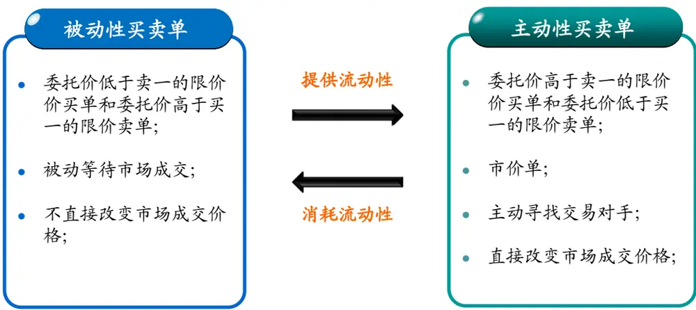
资料来源：海通证券研究所

## 2. 主动买卖单的划分方法

常用的主动买卖单划分方法有以下四种：

## 2.1 报价法

报价法（Quote Rule）最早由Hasbrouck（1988）*提出，设某天第 n 笔交易在 $t_{n}$ 时刻成交， $p_{t_{n}}$ 为成交价格， $a_{t_{n}},b_{t_{n}}$ 为对应的卖一和买一报价,记 $m_{t_{n}}=(a_{t_{n}}+b_{t_{n}})/2$ ，则按照报价法，该笔交易的买卖方向为 $BS_{t_{n}}$

$$
BS_{t_{n}}=\left\{\begin{array}{cc}{{1~if~p_{t_{n}}>m_{t_{n}}}}\\{{-1~if~p_{t_{n}}<m_{t_{n}}}}\\{{null~if~p_{t_{n}}=m_{t_{n}}}}\end{array}\right.
$$

其中 $BS_{t_{n}}$ 等于 1 表示主动买，-1 表示主动卖，报价法对发生在买一和卖一价正中间的交易不做划分。

## 2.2 逐笔法

n 1逐笔法（Tick Rule）†只用到逐笔成交价格，不涉及挂单数据。设当天第 • 笔交易的成交时间为 $t_{n-1}$ $p_{t_{n-1}}$ 为成交价格，则按照逐笔法：

$$
BS_{_{t_{n}}}=\left\{\begin{array}{cc}{{1}}&{{if\ p_{_{t_{n}}}>p_{_{t_{n-1}}}}}\\{{-1}}&{{if\ p_{_{t_{n}}}<p_{_{t_{n-1}}}}}\\{{BS_{_{t_{n-1}}}}}&{{if\ p_{_{t_{n}}}=p_{_{t_{n-1}}}}}\end{array}\right.
$$

## 2.3 LR方法

LR方法（Lee-Ready Rule）‡是报价法和逐笔法的结合，也是目前市场微观研究中应用最广的方法。它先按照报价法划分主动买卖方向，如果成交价正好发生在买一和卖一的中间价位置，则再按逐笔法和上一笔交易的成交价进行比较。

## 2.4 内外盘

内外盘方法和 Quote Rule 比较相似，不过是拿成交价格和买一、卖一价相比，这种方法在国内一些看盘软件中经常使用。

$$
BS_{t_{n}}=\left\{\begin{array}{ll}{1\quad\quad if\ p_{t_{n}}\geq a_{t_{n}}}\\{-1\quad\quad if\ p_{t_{n}}\leq b_{t_{n}}}\\{null\quad\quad if\ b_{t_{n}}<p_{t_{n}}<a_{t_{n}}}\end{array}\right.
$$

## 3. 四种划分方法的优劣比较

要比较各种方法的优劣，首先需要一个基准，即市场的真实买卖方向是什么。这个在有做市商的海外股票市场比较好确定，比如O’Hara（2000）§考察发生在做市商与客户、做市商与经纪人之间发生的交易，以客户或经纪人的下单指令方向为真实买卖方向，比较前三种方法的划分准确率。研究对象为 313 只Nasdaq 上市股票，时间段为1996.09.26 至 1997.09.29。结果显示报价法的划分准确率为 76.4%，逐笔法为 77.7%，LR方法最高 81.1%。国内暂无做市商制度，我们只能通过其它途径来间接评判。

## 3.1 划分方法的涨跌停板调整

按照报价法、LR法和内外盘方法，股票封涨停时，所有成交将被划分为主动卖；跌停时，所有成交将被划分为主动买；造成这种现象的主要是涨跌停板的存在限制了上涨和下跌的动力。虽然涨跌停板可能在股价触及后又被打开，但是总体上我们认为涨（跌）停反映的是投资者主动买（卖）的意愿，因而要对这三个方法进行调整，规定：涨停板价上的成交全部划分为主动买，跌停板价上的成交全部划分为主动卖；

## 3.2 净换手率定义

按照四种不同的方法都可以计算得到某只个股全天的主动买入量和主动卖出量，类似换手率的定义，我们定义净换手率指标如下：

净换手率 = （个股全天主动买入量 – 全天主动卖出量）/流通股本

上式中的减号换成加号即是换手率指标。净换手率为正时，绝对值大说明投资者积极买入；净换手率为负时，则绝对值大说明投资者恐慌出仓；净换手率与股价收益率的正相关关系可以从图 2 和图 3 的示例中明显看出，图中净换手率指标用 LR 方法计算得到。下面将以净换手率和股票日内涨跌幅的相关系数作为评价主动买卖单判别方法的间接标准，其中股票日内涨跌幅 = 收盘价/开盘价 – 1。

图 2 净换手率与股价走势（2013.01.01 – 2013.09.30）
贵州茅台
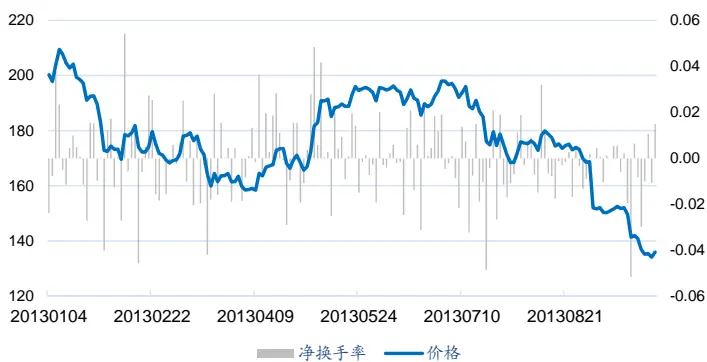

鹏博士
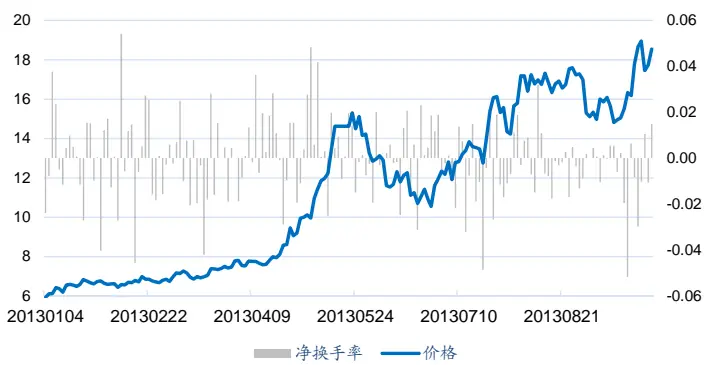

民生银行
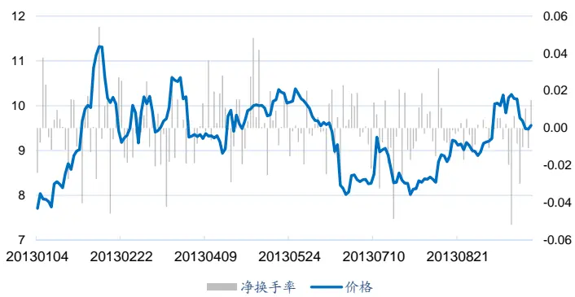
资料来源：海通证券研究所

中国南车
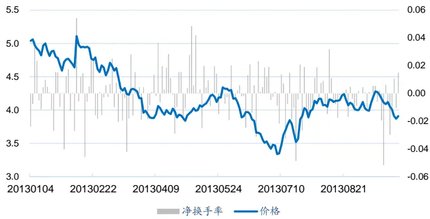

图 3 净换手率与股票日内涨跌幅的相关性（2013.01.01 – 2013.09.30）
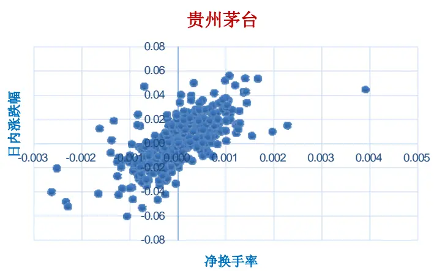

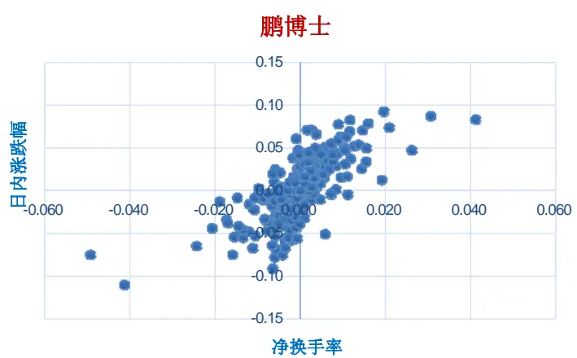

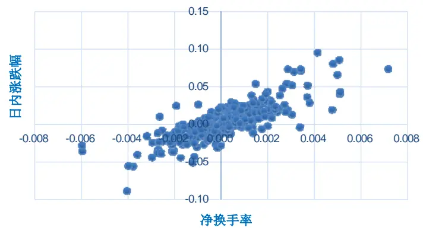
资料来源：海通证券研究所

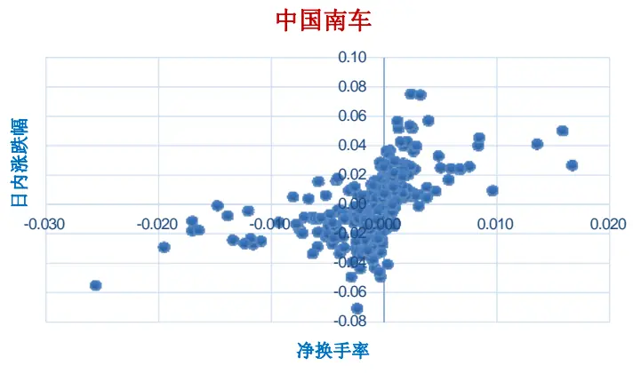

## 3.3 四种方法的效果比较

实证用到的数据如下

数据时间段：2011.01.01 – 2013.09.30

样本股：沪市的沪深 300成分股（包括历史成分股），共 302只股票

数据字段：股票代码、逐笔成交时间、成交价格、成交量，买一和卖一价

数据来源：宏汇 TDB- level2，wind 资讯，天软科技

数据说明：TDB尚无深交所的 level2逐笔成交数据；由于数据搜集问题，2011.08.19到 2011.10.25间的逐笔成交数据缺失。

考虑到计算机运算能力的限制，我们从股价高低、市值大小和成交活跃度三个角度选出了表 1所列的 20只股票来检验各判别方法的实际效果，结果列于表 2。

表 1 考察个股基本情况（2013.09.30）

| 代码 | 股票名称 | 收盘价 | 流通股本（亿） | 流通市值(亿) | 日均换手率（年初至今%) | 年初至今涨幅(%) |
| --- | --- | --- | --- | --- | --- | --- |
| 600519 | 贵州茅台 | 135.94 | 10.4 | 1411.3 | 0.4 | -32.8 |
| 600637 | 百视通 | 52.35 | 8.4 | 437.4 | 1.7 | 229.9 |
| 600600 | 青岛啤酒 | 42.85 | 7.0 | 298.2 | 0.3 | 30.9 |
| 601318 | 中国平安 | 35.70 | 47.9 | 1708.7 | 0.7 | -20.2 |
| 600111 | 包钢稀土 | 28.20 | 14.8 | 417.2 | 2.7 | -24.2 |
| 600547 | 山东黄金 | 22.17 | 14.2 | 315.5 | 1.2 | -41.6 |
| 600804 | 鹏博士 | 18.54 | 13.4 | 248.2 | 5.3 | 212.3 |
| 601088 | 中国神华 | 16.67 | 163.1 | 2719.1 | 0.1 | -30.4 |
| 600585 | 海螺水泥 | 14.94 | 40.0 | 597.6 | 0.7 | -17.6 |
| 601933 | 永辉超市 | 14.08 | 9.9 | 139.1 | 0.9 | 12.9 |
| 600718 | 东软集团 | 12.88 | 12.3 | 158.1 | 1.0 | 70.3 |
| 600089 | 特变电工 | 12.07 | 26.4 | 318.1 | 1.8 | 89.3 |
| 600048 | 保利地产 | 9.88 | 71.4 | 705.2 | 0.9 | -26.0 |
| 600016 | 民生银行 | 9.56 | 225.9 | 2159.4 | 0.9 | 25.8 |
| 601857 | 中国石油 | 7.84 | 1615.2 | 12663.3 | 0.0 | -10.2 |
| 600031 | 三一重工 | 7.52 | 75.9 | 571.0 | 0.5 | -26.5 |
| 601901 | 方正证券 | 5.91 | 35.0 | 206.7 | 4.4 | 34.9 |
| 601766 | 中国南车 | 3.91 | 101.2 | 395.6 | 0.4 | -19.1 |
| 601288 | 农业银行 | 2.50 | 2841.6 | 7104.1 | 0.4 | -4.8 |
| 600221 | 海南航空 | 2.04 | 118.1 | 241.0 | 0.5 | -1.5 |

资料来源：海通证券研究所

从表 2可以看到，逐笔法的相关系数最高，这与其涨记为买、跌记为卖的算法有一定关系；Lee-Ready与报价法的效果相差不大，前者略优；内外盘法的效果最差，主要原因是其未考虑买一和卖一价之间成交的交易，而这部分交易量在某些个股上最高可占到全天交易量的 30%。数据频率会影响最终效果。采用 5秒一笔 level-1 数据，并根据Lee-Ready算法得到净换手率指标与股票日内涨跌幅的相关性显著低于用逐笔数据计算得到的结果。虽然逐笔法的相关系数最高，但是他很有可能会误判一些缓慢分批买入的中长期投资者，特别是对一些买卖报价长时间维持不变的低价股；而报价法和内外盘法又会忽略掉部分市场成交数据。因此总体综合判断，我们仍然推荐采用 Lee-Ready 方法。

表 2 净换手率与股票日内涨跌幅的相关系数

| 股票名称 | LR法 | 报价法 | 逐笔法 | 内外盘法 | LR 法 - level 1 |
| --- | --- | --- | --- | --- | --- |
| 贵州茅台 | 0.691 | 0.690 | 0.743 | 0.641 | 0.633 |
| 百视通 | 0.684 | 0.681 | 0.692 | 0.647 | 0.647 |
| 青岛啤酒 | 0.498 | 0.498 | 0.424 | 0.493 | 0.409 |
| 中国平安 | 0.785 | 0.784 | 0.810 | 0.750 | 0.801 |
| 包钢稀土 | 0.761 | 0.760 | 0.777 | 0.731 | 0.785 |
| 山东黄金 | 0.680 | 0.681 | 0.696 | 0.661 | 0.680 |
| 鹏博士 | 0.701 | 0.702 | 0.693 | 0.692 | 0.693 |
| 中国神华 | 0.692 | 0.689 | 0.750 | 0.662 | 0.679 |
| 海螺水泥 | 0.750 | 0.748 | 0.841 | 0.724 | 0.834 |
| 永辉超市 | 0.525 | 0.524 | 0.483 | 0.512 | 0.511 |
| 东软集团 | 0.683 | 0.683 | 0.655 | 0.670 | 0.661 |
| 特变电工 | 0.729 | 0.729 | 0.773 | 0.712 | 0.760 |
| 保利地产 | 0.770 | 0.769 | 0.762 | 0.746 | 0.763 |
| 民生银行 | 0.807 | 0.807 | 0.817 | 0.793 | 0.805 |
| 中国石油 | 0.655 | 0.655 | 0.679 | 0.630 | 0.651 |
| 三一重工 | 0.705 | 0.706 | 0.749 | 0.686 | 0.734 |
| 方正证券 | 0.578 | 0.577 | 0.622 | 0.566 | 0.593 |
| 中国南车 | 0.488 | 0.488 | 0.485 | 0.471 | 0.540 |
| 农业银行 | 0.597 | 0.597 | 0.610 | 0.591 | 0.585 |
| 海南航空 | 0.779 | 0.778 | 0.785 | 0.767 | 0.623 |
| 平均值 | 0.678 | 0.677 | 0.692 | 0.657 | 0.669 |

资料来源：海通证券研究所

## 4. 净换手率指标的选股效力

我们按照过去一段时间个股的平均日净换手率对股票进行排名，选取前 20%的股票（约 40 只）作为市场主动买入组合，后 20%作为市场主动卖出组合，按照流动市值加权持有一段时间，考察期相对基准沪深 300沪市指数（000972.SH）的超额收益。这里有两个参数：计算平均日净换手率用到的历史数据长度 G和股票组合持有时间 H。相应结果列于表 3和表 4，其中G、H的单位为周。

表 3 市场主动买入组合的年化超额收益率

|  | H = 1 | H=2 | H=3 | H=4 | H=6 | H=8 | H= 12 |
| --- | --- | --- | --- | --- | --- | --- | --- |
| G = 1 | 0.101 | 0.054 | 0.101 | 0.057 | 0.036 | 0.097 | -0.014 |
| G = 2 | 0.089 | 0.092 | 0.033 | 0.061 | 0.028 | 0.021 | -0.001 |
| G = 3 | 0.124 | 0.112 | 0.101 | 0.049 | 0.054 | -0.006 | 0.001 |
| G = 4 | 0.132 | 0.118 | 0.110 | 0.062 | 0.046 | -0.011 | -0.008 |
| G = 6 | 0.132 | 0.126 | 0.072 | 0.093 | 0.051 | 0.063 | 0.061 |
| G = 8 | 0.114 | 0.126 | 0.074 | 0.078 | 0.031 | 0.036 | 0.052 |
| G = 12 | 0.093 | 0.037 | 0.004 | 0.017 | -0.006 | -0.011 | 0.013 |

资料来源：海通证券研究所

表 3中的数据暂未考虑交易费用，并假设投资者能以每周的开盘价买入个股，收盘价卖出平仓。可以看到在持有期不超过一个月时，市场主动买入组合都能取得明显的超额收益（表 3中黄色背景部分），最低年化 6.2%，最高年化 13.2%，由于我们只是在沪深 300内选股，这样的超额收益还是非常可观的。综合考虑交易费用的影响，我们推荐使用 G=3，H=3的参数配置，从图 4的净值相对强弱曲线可以看到，主动买入组合在考察期内长期稳定战胜大盘，净换手率指标可以考虑作为多因子选股模型的一个输入因子。

图 4 主动买入组合的净值走势
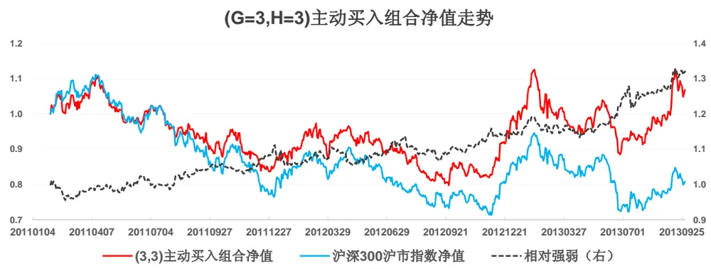
资料来源：海通证券研究所

需要注意的是，主动买入组合构建过程是采用的流通市值加权方法，这可能会让选出的股票权重在行业上与基准有较大的偏离。如图 5所示，图中展示的是组合各期股票行业权重的平均值，和基准指数相比，几个大的行业里面，银行股的权重和指数基本相当；采掘行业高配，医药低配，不过行业权重的波动非常大，银行股的权重在 2012 年12 月的时候甚至超过 70%。如果投资者要用该指标单独进行选股的话，我们建议对选出的股票加上行业的限制，避免对基准指数的较大偏离。

图 5 主动买入组合的各期行业权重平均值
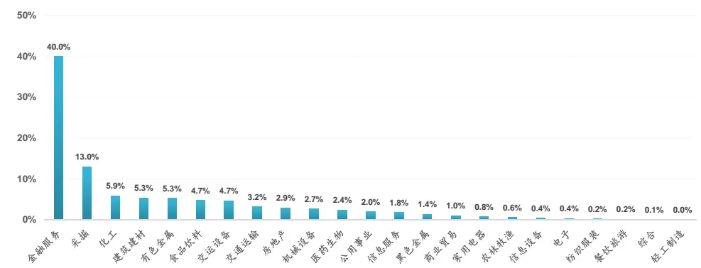
资料来源：海通证券研究所

如果记 p 为个股在当期基准指数成分股收益率从小到大排序里的分位数，则G=3,H=3的市场主动买入组合所有个股排序分位数的频率分布如图 6所示。可以看到，样本分布图接近对称，微右偏，也就说主动买入组合里的股票收益排序平均来看处在基准指数成分股的中游，超额收益更多来自于选到的牛股，这和策略本身追逐市场热点的特性相符。

图 6 市场主动买入组合 ln( /(1 ))p • p 的频率分布图
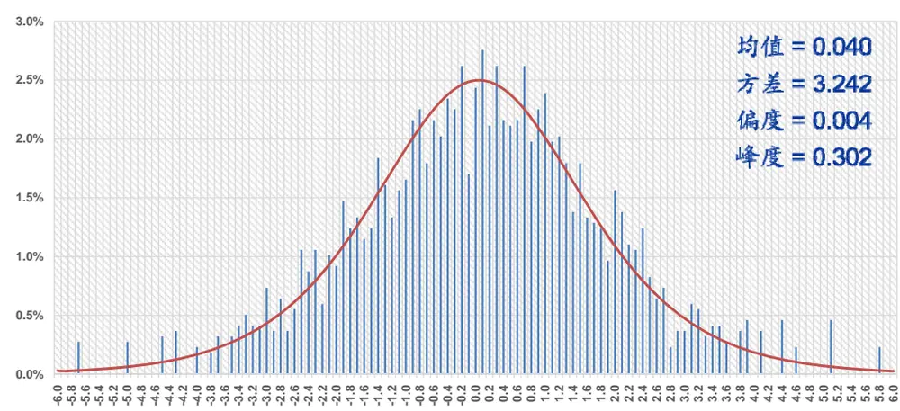
资料来源：海通证券研究所

对于市场主动卖出组合（表 4），在三个月的持有期内，不论观察期多少，其业绩表现都显著弱于基准，投资者在构建组合时应主动避免这类市场主动卖出股票。

表 4 市场主动卖出组合的年化超额收益率

|  | H = 1 | H=2 | H=3 | H = 4 | H=6 | H=8 | H=12 |
| --- | --- | --- | --- | --- | --- | --- | --- |
| G = 1 | 0.061 | -0.007 | 0.095 | -0.017 | 0.032 | -0.027 | 0.056 |
| G = 2 | -0.006 | -0.036 | -0.032 | -0.023 | -0.016 | -0.023 | -0.031 |
| G = 3 | 0.025 | -0.035 | -0.039 | -0.008 | -0.006 | 0.006 | -0.055 |
| G = 4 | 0.011 | -0.028 | -0.034 | -0.046 | -0.019 | -0.047 | -0.068 |
| G = 6 | -0.014 | -0.002 | -0.038 | -0.021 | -0.022 | -0.020 | -0.035 |
| G = 8 | -0.036 | -0.038 | -0.049 | -0.038 | -0.054 | -0.025 | -0.059 |
| G = 12 | -0.009 | -0.039 | -0.054 | -0.044 | -0.064 | -0.055 | -0.062 |

资料来源：海通证券研究所

## 5. 总结

净换手率指标相对传统换手率而言，能利用微观数据让投资者直观的看到市场的主动买卖方向，及时追踪市场热点。该指标结合了量和价的双重数据，和收益率相比是一个更有效的短线动量指标，可以考虑作为多因子模型的一个输入因子，也可以用来单独选股，不过选股的范围应扩展到全市场，还需要对组合的行业权重进行控制来增强超额收益稳定性。净换手率指标可以进一步细化，例如按照成交量的大小，把逐笔成交划分为大额成交和小额成交，看机构和散户的投资意向是否有异同。此外，净换手率指标也可考虑用在事件研究中，用来衡量时间发生前的信息泄露，这些内容将会后续跟进。

## 信息披露

分析师声明

朱剑涛：金融工程

本人具有中国证券业协会授予的证券投资咨询执业资格，以勤勉的职业态度，独立、客观地出具本报告。本报告所采用的数据和信息均来自市场公开信息，本人不保证该等信息的准确性或完整性。分析逻辑基于作者的职业理解，清晰准确地反映了作者的研究观点，结论不受任何第三方的授意或影响，特此声明。

## 法律声明

本报告仅供海通证券股份有限公司（以下简称“本公司”）的客户使用。本公司不会因接收人收到本报告而视其为客户。在任何情况下，本报告中的信息或所表述的意见并不构成对任何人的投资建议。在任何情况下，本公司不对任何人因使用本报告中的任何内容所引致的任何损失负任何责任。

本报告所载的资料、意见及推测仅反映本公司于发布本报告当日的判断，本报告所指的证券或投资标的的价格、价值及投资收入可能会波动。在不同时期，本公司可发出与本报告所载资料、意见及推测不一致的报告。

市场有风险，投资需谨慎。本报告所载的信息、材料及结论只提供特定客户作参考，不构成投资建议，也没有考虑到个别客户特殊的投资目标、财务状况或需要。客户应考虑本报告中的任何意见或建议是否符合其特定状况。在法律许可的情况下，海通证券及其所属关联机构可能会持有报告中提到的公司所发行的证券并进行交易，还可能为这些公司提供投资银行服务或其他服务。

本报告仅向特定客户传送，未经海通证券研究所书面授权，本研究报告的任何部分均不得以任何方式制作任何形式的拷贝、复印件或复制品，或再次分发给任何其他人，或以任何侵犯本公司版权的其他方式使用。所有本报告中使用的商标、服务标记及标记均为本公司的商标、服务标记及标记。如欲引用或转载本文内容，务必联络海通证券研究所并获得许可，并需注明出处为海通证券研究所，且不得对本文进行有悖原意的引用和删改。

根据中国证监会核发的经营证券业务许可，海通证券股份有限公司的经营范围包括证券投资咨询业务。

海通证券股份有限公司研究所

| 李迅雷 海通证券副总裁 海通证券首席经济学家 研究所所长 (021) 23219300 ixl@htsec.com | 高道德 (021)63411586 gaodd@htsec.com 姜超 (021)23212042 Jc9001@htsec.com | 副所长 所长助理 | 路颖 副所长 (021)23219403 luying@htsec.com 赵晓光 所长助理 (021)23212041 zxg9061@htsec.com | 江孔亮 所长助理 (021)23219422 kljiang @htsec.com |
| --- | --- | --- | --- | --- |
| 宏观经济研究团队 姜 超(021)23212042 陈 勇(021)23219800 曹 阳(021)23219981 | jc9001@htsec.com 策略研究团队 cy8296@htsec.com 荀玉根(021)23219658 cy8666@htsec.com | xyg6052@htsec.com 陈瑞明(021)23219197 chenrm@htsec.com 吴一萍(021)23219387 wuyiping@htsec.com 慧(021)23219733 tangh@htsec.com 旭(021)23219396 | 金融产品研究团队 娄 静(021)23219450 单开佳(021)23219448 倪韵婷(021)23219419 罗震(021)23219326 唐洋运(021)23219004 王广国(021)23219819 | loujing@htsec.com shankj@htsec.com niyt@htsec.com luozh@htsec.com tangyy@htsec.com wgg6669@htsec.com szy7856@htsec.com cl7884@htsec.com |
| 联系人 顾潇啸(021)23219394 金融工程研究团队 | gxx8737@htsec.com | 李 珂(021)23219821 | wx5937@htsec.com Ik6604@htsec.com | 孙志远(021)23219443 陈 亮(021)23219914 陈 瑶(021)23219645 chenyao@htsec.com 伍彦妮(021)23219774 wyn6254@htsec.com 曾逸名(021)23219773 zym6586@htsec.com 桑柳玉(021)23219686 sly6635@htsec.com 陈韵骋(021)23219444 cyc6613@htsec.com 田本俊(021)23212001 tbj8936@htsec.com |
| 吴先兴(021)23219449 丁鲁明(021)23219068 郑雅斌(021)23219395 冯佳睿(021)23219732 朱剑涛(021)23219745 杨 勇(021)23219945 张欣慰(021)23219370 联系人 | wuxx@htsec.com dinglm@htsec.com zhengyb@htsec.com fengjr@htsec.com zhujt@htsec.com yy8314@htsec.com zxw6607@ htsec.com | 固定收益研究团队 姜 超(021)23212042 姜金香(021)23219445 徐莹莹(021)23219885 李 宁(021)23219431 倪玉娟(021)23219820 | jc9001@htsec.com jiangjx@htsec.com xyy7285@htsec.com 联系人 lin@htsec.com nyj6638@htsec.com | 政策研究团队 李明亮(021)23219434 Iml@htsec .com 陈久红(021)23219393 chenjiuhong@htsec.com 朱蕾(021)23219946 zl8316@htsec.com |
| 祗飞跃(021)23219984 计算机行业 陈美风(021)23219409 蒋 科(021)23219474 联系人 安永平(021)23219950 | dfy8739@htsec.com chenmf@htsec.com jiangk@htsec.com ayp8320@htsec.com | 煤炭行业 朱洪波(021)23219438 | zhb6065@htsec.com | 批发和零售贸易行业 路 颖(021)23219403 luying@htsec.com 潘 鹤(021)23219423 panh@htsec.com 汪立亭(021)23219399 wanglt@htsec.com 李宏科(021)23219671 Ihk6064@htsec.com |
| 建筑工程行业 赵健(021)23219472 张显宁(021)23219813 | zhaoj@htsec.com zxn6700@htsec.com | 石油化工行业 邓 勇(021)23219404 王晓林(021)23219812 | dengyong@htsec.com wxl6666@htsec.com | 机械行业 龙华(021)23219411 longh@htsec.com 熊哲颖(021)23219407 xzy5559@htsec.com 胡宇飞(021)23219810 hyf6699@htsec.com 联系人 黄威(021)23219963 hw8478@htsec.com |
| 农林牧渔行业 频(021)23219405 夏 木(021) 23219748 | dingpin@htsec.com xiam@htsec.com | 纺织服装行业 杨艺娟(021)23219811 | yyj7006@htsec.com 联系人 | 非银行金融行业 丁文韬(021)23219944 dwt8223@htsec.com 李 欣(010)58067936 Ix8867@htsec.com 吴绪越(021)23219947 wxy8318@htsec.com 交通运输行业 |
| 电子元器件行业 赵晓光(021)23212041 郑震湘(021)23219816 | zxg9061@htsec.com zzx6787@htsec.com | 互联网及传媒行业 刘佳宁(0755)82764281 白洋(021)23219646 薛婷婷(021)23219775 | ljn8634@htsec.com baiyang@htsec.com xtt6218@htsec.com 联系人 | 黄金香(021)23212081 hjx9114@htsec.com 钱列飞(021)23219104 qianlf@htsec.com 虞 楠(021)23219382 yun@htsec.com 姜明(021)23212111 jm9176@htsec.com |
| 汽车行业 赵晨曦(021)23219473 | zhaocx@htsec.com | 食品饮料行业 | 钢铁行业 zhaoyong@htsec.com |  |
|  |  |  | mhb6614@htsec.com |  |
|  |  | 赵 勇(0755)82775282 |  |  |
|  |  |  |  | liuyq@htsec.com |
|  | fengzq@htsec.com |  |  | 刘彦奇(021)23219391 |
| 冯梓钦(021)23219402 |  |  |  |  |
|  |  | 马浩博(021)23219822 |  |  |
|  | cph6819@htsec.com |  |  |  |
| 陈鹏辉(021)23219814 |  |  |  |  |
|  |  | 有色金属行业 |  |  |
|  |  | 施 毅(021)23219480 | sy8486@htsec.com | 基础化工行业 曹小飞(021)23219267 caoxf@htsec.com |

| 家电行业 陈子仪(021)23219244 联系人 宋 伟(021)23219949 | chenzy@htsec.com sw8317@htsec.com | 建筑建材行业 张显宁(021)23219813 | zxn6700@htsec.com | 电力设备及新能源行业 张 浩(021)23219383 牛 品(021)23219390 房 青(021)23219692 联系人 | zhangh@htsec.com np6307@htsec.com fangq@htsec.com |
| --- | --- | --- | --- | --- | --- |
| 公用事业 陆凤鸣(021)23219415 | lufm@htsec.com | 银行业 戴志锋(0755)23617160 | dzf8134@htsec.com | 徐柏乔(021)23219171 社会服务业 | xbq6583@htsec.com |
| 汤砚卿(021)23219768 联系人 李心宇(021)23212163 | tyq6066@htsec.com lxy9298@htsec.com | 刘瑞 (021)23219635 林媛媛(0755)23962186 | Ir6185@htsec.com lyy9184@htsec.com | 林周勇(021)23219389 | lzy6050@htsec.com |
| 房地产业 涂力磊(021)23219747 | tll5535@htsec.com | 造纸轻工行业 |  | 通信行业 徐 力(010)58067940 | xl9312@htsec.com |
| 谢 盐(021)23219436 贾亚童(021)23219421 | xiey@htsec.com jiayt@htsec.com | 徐 琳(021)23219767 | xl6048@htsec.com | 侯云哲(021)23219815 | hyz6671 @htsec.com |
| 中小市值 |  |  |  |  |  |
| 邱春城(021)23219413 | qiucc@htsec.com |  |  |  |  |
| 钮宇鸣(021)23219420 | ymniu@htsec.com |  |  |  |  |
| 何继红(021)23219674 | hejh@htsec.com |  |  |  |  |
|  | kongwn@htsec.com |  |  |  |  |
| 孔维娜(021)23219223 |  |  |  |  |  |

海通证券股份有限公司机构业务部

| 陈苏勤 总经理 贺振华 总经理助理 (021)63609993 (021)23219381 chensq@htsec.com hzh@htsec.com |  |  |  |  |  |
| --- | --- | --- | --- | --- | --- |
| 深广地区销售团队 上海地区销售团队 北京地区销售团队 |  |  |  |  |  |
| 蔡铁清 (0755)82775962 | ctq5979@htsec.com 高 溱 liujj4900@htsec.com 姜 | (021)23219386 洋 (021)23219442 | gaoqin@htsec.com jy7911 @htsec.com | 赵春 (010)58067977 (010)58067996 | zhc@htsec.com |
| 刘晶晶 (0755)83255933 |  | 季唯佳 (021)23219384 | jiwj@htsec.com | 郭文君 (010)58067944 | gwj8014@htsec.com |
| 辜丽娟 (0755)83253022 | gulj@htsec.com gyj6435@htsec.com | 胡雪梅 (021)23219385 | huxm@htsec.com | 隋巍 | sw7437@htsec.com |
| 高艳娟 (0755)83254133 |  | 毓 (021)23219410 | huangyu@htsec.com | 张广宇 (010)58067931 | zgy5863@htsec.com |
| 伏财勇 (0755)23607963 | fcy7498@htsec.com 黄 | 健 (021)23219592 | zhuj@htsec.com | 江 虹 (010)58067988 | jh8662@htsec.com |
| 邓欣 (0755)23607962 | dx7453@htsec.com 朱 |  |  | 杨 帅 (010)58067929 | ys8979@htsec.com |
|  | 黃 | 慧 (021)23212071 | hh9071@htsec.com | 张楠 (010)58067935 | zn7461 @htsec.com |
|  | 卢 | 倩 (021)23219373 | lq7843@htsec.com |  |  |
|  | 孙 | 明 (021)23219990 | sm8476@htsec.com |  |  |
|  | 孟德伟 | (021)23219989 | mdw8578@htsec.com |  |  |

海通证券股份有限公司研究所

地址：上海市黄浦区广东路 689号海通证券大厦13楼

电话：(021)23219000

传真：(021)23219392

网址：www.htsec.com