## 多因子选股系列

2014 年 05 月 20 日

## 极值视角下的多因子选股策略

我们于 2010 年 6 月份推出了相关性选股策略，通过构建因子库、因子筛选、因子打分等步骤来构建股票组合，经过近四年的样本外跟踪，无论是在全市场还是行业层面，策略组合都取得了超越业绩基准的优异表现，具备显著的 alpha收益。

多因子选股的核心在于如何筛选有效因子，相关性选股通过检验单个因子和下期收益之间的相关性是否显著来决定因子是否有效。在实际投资中，投资者通常关注因子处于极端部分的股票（如高成长、低估值的股票），而对因子值处于中间部分的股票不会给予太多关注，也就是说如果因子极值组的股票正好对应到收益率的极值组，这样的因子或许也会受到投资者的关注。本文试图从极值角度来筛选有效因子，并在中证 500和沪深 300样本空间中给出实证，供读者参考。

## 相关研究

A股全市场选股策略研究 2010.06.22

沪深 300 指数 Alpha 策略2011.09.20

中证500指数增强策略2012.01.09

从极值角度进行选股因子有效性的确认-----在换手率上的实证

2012.07.26

现金流量市值比因子的极值效应2012.10.22

- 从极值角度筛选有效因子。实际投资中，投资者通常关注因子处于极端部分的股票（如高成长、低估值的股票），而对因子值处于中间部分的股票不会给予太多关注，也就是说如果因子极值组的股票正好对应到收益率的极值组，这样的因子或许也会受到投资者的关注。极值角度筛选因子的优势在于忽略了因子中间值的波动，这样可能会抓住一些相关性、单调性角度容易遗漏的有效因子。

- 多空超额收益稳定、显著 。我们分别在中证 500和沪深 300指数样本空间中做了回测，每期多空头各选 50个股票。中证 500样本空间中，多空策略的年化收益37.42%，月胜率 81.25%，信息比率 2.66；沪深 300样本空间中，多空策略的年化收益 19.2%，月胜率 59.38%，信息比率 1.30。

选股效果的微观评价。中证 500、沪深 300样本空间多头、空头精选组合的分位点较之随机抽样生成的基准分布均呈现明显的右偏、左偏。在中证 500样本空间中，多头精选组合中有 57.3%的股票表现好于中位数，空头精选组合中有 57.3%的股票表现弱于中位数。在沪深 300样本空间中，多头精选组合中有 54.6%的股票表现好于中位数，空头精选组合中有 53.8%的股票表现弱于中位数。这说明在微观层面，该方法选出的股票具有统计意义上的稳定性。

金融工程分析师

张欣慰

SAC 执业证书编号 S0850513070005

电 话：021-23219370

Email：zxw6607@htsec.com

我们于 2010 年 6 月份推出了相关性选股策略，通过构建因子库、因子筛选、因子打分等步骤来构建股票组合，经过近四年的样本外跟踪，无论是在全市场还是行业层面，策略组合都取得了超越业绩基准的优异表现，具备显著的 alpha 收益。

多因子选股的核心在于如何筛选有效因子，相关性选股通过检验单个因子和下期收益之间的相关性是否显著来决定因子是否有效。在实际投资中，投资者通常关注因子处于极端部分的股票（如高成长、低估值的股票），而对因子值处于中间部分的股票不会给予太多关注，也就是说如果因子极值组的股票正好对应到收益率的极值组，这样的因子或许也会受到投资者的关注。本文试图从极值角度来筛选有效因子，并在中证 500 和沪深 300样本空间中给出实证，供读者参考。

## 1、研究方法

Fama和French 在 1993 年构建了Fama-French三因子模型，模型认为，一个投资组合的超额收益可由它对三个因子的暴露来解释，这三个因子是：市场资产组合(Rm−Rf)、市值因子(SMB)、账面市值比因子(HML)。这个多因子定价模型可以表示如下：

$$
R_{it}-R_{tt}=\pmb{\alpha}_{i}+\pmb{\beta}_{i}\mathbb{Z}(R_{mt}-R_{tt})+s_{i}\mathbb{Z}\pmb{M}\pmb{B}_{t}+h_{i}\mathbb{Z}(\pmb{M}_{it}+\pmb{\varepsilon}_{it}
$$

其中 $R_{mt}$ 表示 时刻的市场收益率，t $R_{\mathrm{\it ft}}$ 表示 时刻的无风险利率，t $R_{mt}-R_{ft}$ 代表市场风险溢价， 代表市值因子，SMB $HM_{it}$ 代表账面市值比因子。

需要指出的是，在实践中，诸如估值、动量反转、一致预期等因素也被认为是影响股价的重要因素，而 FF3因素模型中并未包含这些因素，现在广泛应用的多因子模型通常会包含几十甚至上百个可能影响股价的因子。

海通多因子模型因子库搭建于 2010年，经过不断的补充完善，目前包含了 29个投资者常用的选股因子，基本实现了股票历史信息与未来信息的全方位覆盖，具体因子参见表 1。

| 表1因子库 |  |  |  |
| --- | --- | --- | --- |
|  | ROA | 偿债能力 | 资产负债率 |
| 盈利能力 | ROE | 估值 | PE |
|  | EPS |  | PB |
|  | 毛利率 |  | 一个月收益率 |
|  | 净利润率 |  | 三个月收益率 |
|  | Delta(ROA) | 技术面 | 六个月收益率 |
|  | Delta(ROE) |  | 一个月平均换手率 |
|  | Delta(毛利率) |  | 三个月平均换手率 |
| 资产运营状况 | Delta(EPS) |  | MACD |
|  | Delta(净利润率) |  | 明年一致预期 EPS 增长率 |
|  | 主营业务收入增长率 |  | 后年一致预期EPS增长率 |
|  | 总资产周转率 | 一致预期 | 明年一致预期PE |
|  | 每股净资产 |  | 后年一致预期 PE |
| 市值 | 流通市值 |  | 明年一致预期净利润增长率 |
|  | 总市值 |  |  |

资料来源：海通证券研究所

多因子模型的核心有三点：1、因子库的搭建；2、有效因子的甄别；3、因子权重。

因子库的搭建在前面已经介绍，对于因子的赋权，我们通常采用等权的方式处理，本文的重点放在有效因子的甄别上。我们于 2010 年构建了海通多因子选股模型，该模型主要依据因子表现与下期收益间的相关性来甄别有效因子。

假定 $F_{1},F_{2},\cdots,F_{n}$ 为因子库中的因子，给定考察时点，样本空间内的股票在因子上会有排名 $S_{i,1},S_{i,2},\cdots,S_{i,m}$ ，同样这些股票在下个考察期内的收益率会有相应的排名 $R_{1},R_{2},\cdots,R_{m}$ ，我们用过去 24期的因子排名和收益率排名数据做相关性分析，在

给定的置信水平下，能通过检验的因子我们视为当期的有效因子，对于有效因子，我们同时会关注其与下期收益之间的相关系数，如相关系数为正数，则视该因子对收益有正向的贡献，因子打分时给予正权重，如果相关系数为负数，则视该因子对收益有负向的贡献，因子打分时给予负权重，具体流程参见图 1。

图 1 相关性选股流程
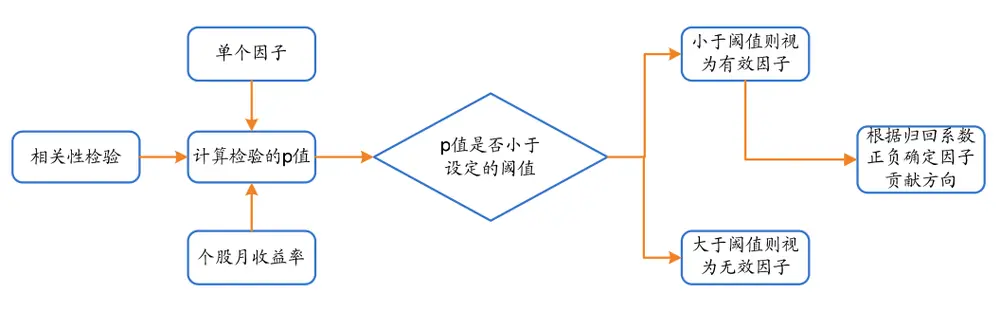
资料来源：海通证券研究所

通过相关性来筛选有效因子，构建的多因子模型效果稳定，我们用此方法构建过行业内增强、指数增强、多空单等策略，长期跟踪下来均取得了较为稳定的超额收益。

在投资研究中，人们通常会提到高分红、低估值、高成长等字眼，这说明在某种程度上，投资者常常关注的是因子的极端值部分，相关性的方法筛选因子是一个有效的方法，可在一些情况下，该方法也可能会漏选有效因子。

表 2 相关性选股 VS极值选股

| 指标均值 | 下期收益均值 | 指标排名 | 下期收益排名 |
| --- | --- | --- | --- |
| -8% | 10% | 1 | 10 |
| -5% | 30% | 2 | 2 |
| -2% | 25% | 3 | 4 |
| 1% | 27% | 4 | 3 |
| 4% | 20% | 5 | 5 |
| 8% | 15% | 6 | 8 |
| 12% | 18% | 7 | 6 |
| 17% | 13% | 8 | 9 |
| 20% | 16% | 9 | 7 |
| 28% | 35% | 10 | 1 |

资料来源：海通证券研究所

假定某一个因子 F，按照因子值排序后等分为 10组后，计算各组股票的因子均值和下期收益均值，数据如表 2 展示，为了更直观地展示各组因子的平均收益，我们各组股票的平均收益列于图 2。观察图 2，最直观的感受是各组收益率与因子值之间不存在显著的单调性和相关性，但最大和最小因子组的股票的收益表现却是正好对应到收益的最大和最小组，投资者通常关注因子极端值，所以从这个角度来看，该因子是能够满足投资者区分好坏股票需求的。

图 2 相关性选股 VS极值选股
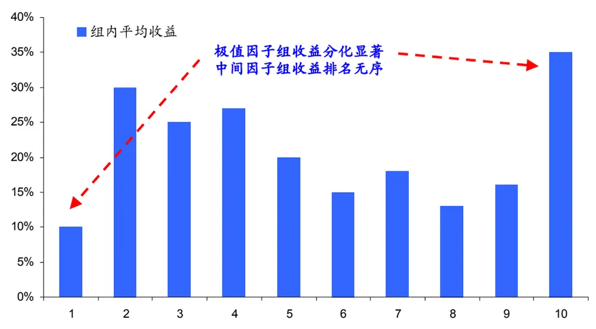
资料来源：海通证券研究所

事实上，利用 matlab 中的 corrcoef函数计算表 2中因子与下期收益之间是否相关，p 值 0.8810，远不能通过相关性检验，如果用相关性的方法来筛选因子，该因子就会被剔除。此外，因子值最大和最小组内股票的平均收益率分别为 35%、10%，不仅分化明显，且在所有 10个收益率中分别是最高和最低的。

从上面的例子来看，从极值因子组股票收益的分化度来选择因子或许也是一种有效的因子筛选方法。我们采用过去 24个月的滚动窗口数据来进行极值因子筛选，假定因子为候选因子，当前时点为 ，以月度为考察期，将股票按因子从小到大等分为 5组，分别计算组内股票因子和下月收益率的平均值，分别记录为：

$$
F_{T,1},F_{T,2},\cdots\cdots,F_{T,5}\not\approx R_{T,1},R_{T,2},\cdots\cdots,R_{T,5}
$$

从该角度来进行因子的筛选，我们认为至少有以下三点是应该纳入考察范畴的：

1）分化性：我们希望极值因子组的收益差越明显越好，当然某几个月的收益差显著不能说明问题，我们用过去24个月的平均收益差来度量极值因子组的收益分化度，比如说我们给定阈值 ，当下式成立时，我们认为 因子具备分化性：

$$
abs\Big(\underset{i=1:24}{mean}\big(R_{r-i,5}-R_{r-i,1}\big)\Big)>R
$$

2）极值性：前面我们提到投资者通常关注因子的极端值，所以我们可以忽略因子中间值组的相对表现，但必须保证因子极端值组的收益极端性，即满足下式：

$$
\overline{{R}}_{T,1}=\underset{i=1.5}{Min}\left(\overline{{R}}_{T,i}\right)\ ,\ \overline{{R}}_{T,5}=\underset{i=1.5}{Max}\left(\overline{{R}}_{T,i}\right)\ \overset{*}{\underset{i\times}{\vec{\operatorname*{m}}}}\ \overline{{R}}_{T,1}=\underset{i=1.5}{Max}\left(\overline{{R}}_{T,i}\right)\ ,\ \overline{{R}}_{T,5}=\underset{i=1.5}{Min}\left(\overline{{R}}_{T,i}\right)
$$

其中： $\overline{{R}}_{T,i}=\underset{j=1:24}{mean}\Big(R_{T-j,i}\Big)$

3）稳定性：在分化性中我们要求过去 24个月极值因子的月平均收益差显著，但可能主要的收益差贡献是集中在几个月中的，利用这样的因子选出股票的胜率不高，组合的稳定性也差，所以我们要求极值因子的胜率达到一定阈值之上，即：

$$
\underset{i=1;24}{sutm}\Big(R_{T-i,5}-R_{T-i,1}\Big)_{+}\Big/24>w_{u}\quad\mathring{\mathfrak{L}}_{\lambda}\quad\underset{i=1;24}{sum}\Big(R_{T-i,5}-R_{T-i,1}\Big)_{+}\Big/24<w_{d}
$$

其中 $R_{+}=1~if~R>0,R_{+}=0~if~R\leq0~\mathrm{w}_{u},{\bf w}_{d}$ 分别为月胜率阈值上下限

我们将上述三点做成流程图（见图 3），以便更清晰地展示极值因子的选股流程。

图 3 极值因子选股流程
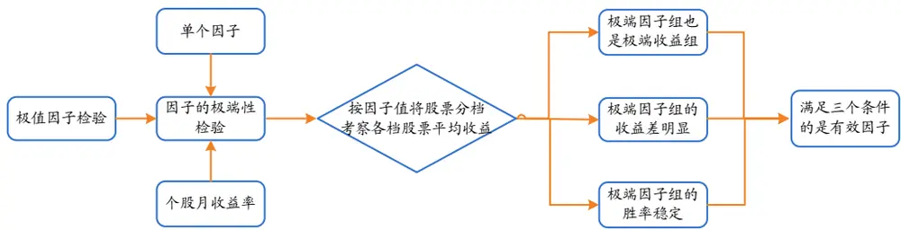
资料来源：海通证券研究所

## 2、实证分析

我们的历史回测区间段为 2009.01-2014.04，在每个月末，我们收集过去 24个月因子库中各因子的值与对应股票下个月的收益率情况，按照上节中的极值方法来筛选有效因子，对于入选的因子等权重看待，给样本空间中的股票进行打分排序。

需要注意的是，我们在极值因子的筛选过程中涉及到了极值组股票月均收益差 、极值组股票过去两年的月度胜率 这两个参数，很显然 、 的值越高，因子的筛选要求越严格，能入选的因子数量也越少，给定阈值R和w，便能确定策略S(R,w)。

## 2.1 中证 500指数样本空间的实证

我们以中证 500指数样本股为样本空间，用极值因子对股票进行打分，分别选取得分最高和最低的 50个股票作为多头、空头组合。为了保证策略的稳定性，我们选取不同的阈值来考察选股效果。

图 4 S(0.7%,14)策略表现
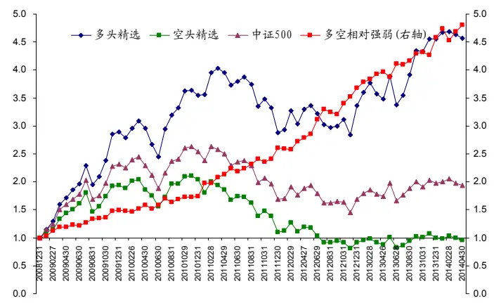

图 5 S(0.8%,16)策略表现
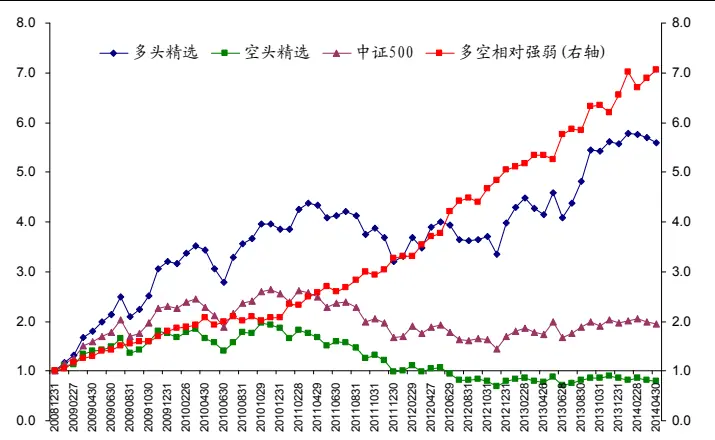
请务必阅读正文之后的信息披露和法律声明

图 6 S(1%,16)策略表现
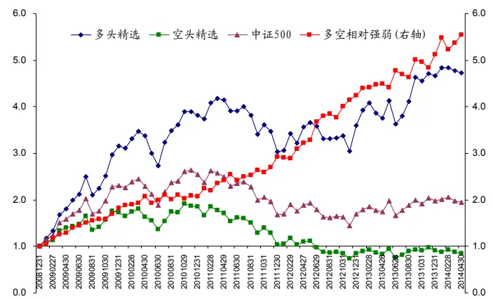
资料来源： 海通证券研究所

图 7 S(1.2%,17)策略表现
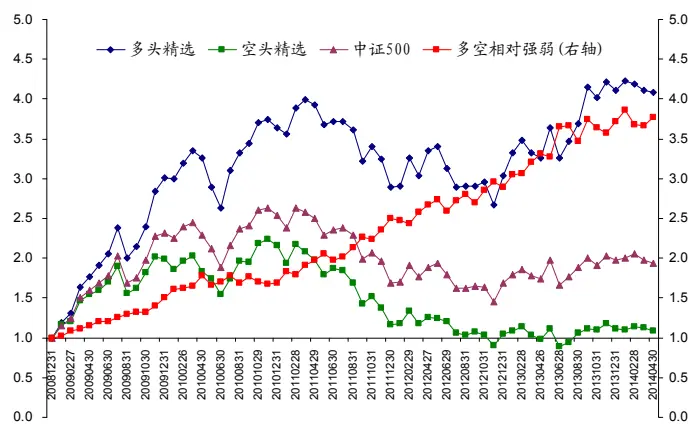

图 4—图 7 展示了策略在不同参数阈值设置下的表现，总体看来，在不同的参数阈值设置、不同的市场环境下，策略的多空相对强弱曲线都有稳定向上的趋势，说明极值角度筛选出的因子能较好的区分股票间的相对强弱。在不同的参数下，多空组合的超额收益和波动率有所差异，但胜率和信息比例稳定在比较高的水平，建议投资者根据自己的风险偏好和投资目标来确定参数。

我们以 2009 年 1 月—2014 年 4 月为样本期，每个月末更新我们的组合，共计 64个月，对不同参数，多空头组合相对中证 500的表现进行敏感性分析，结果如表 3。

表 3 策略在不同参数下的表现

| 多头组合 |  |  |  |  |  |
| --- | --- | --- | --- | --- | --- |
| (R,W) | 多头-500 | 跟踪误差 | 信息比率 | 月度胜率 | 因子数量 |
| (0.6%,14) | 1.36% | 7.07% | 2.31 | 71.88% | 10.14 |
| (0.7%,15) | 1.24% | 7.83% | 1.91 | 75.00% | 7.28 |
| (0.8%,16) | 1.70% | 8.29% | 2.46 | 78.13% | 7.05 |
| (1.0%,16) | 1.42% | 7.96% | 2.15 | 75.00% | 6.42 |
| (1.2%,17) | 1.17% | 7.45% | 1.89 | 68.75% | 3.98 |

空头组合

| (R,W) | 空头-500 | 跟踪误差 | 信息比率 | 月度胜率 | 因子数量 |
| --- | --- | --- | --- | --- | --- |
| (0.6%,14) | -1.07% | 7.46% | -0.14 | 31.25% | 10.14 |
| (0.7%,15) | -1.08% | 7.30% | -0.15 | 26.56% | 7.28 |
| (0.8%,16) | -1.33% | 7.96% | -0.17 | 25.00% | 7.05 |
| (1.0%,16) | -1.23% | 8.03% | -0.15 | 26.56% | 6.42 |
| (1.2%,17) | -0.83% | 8.52% | -0.10 | 34.38% | 3.98 |

资料来源：海通证券研究所

表 3 中的参数(R,W)，R 表示过去 24 个月极值组合的平均收益差，W 表示过去 24个月中，极值组合中的强势组战胜弱势组合的次数，显然，R和 W约大，因子的入选门槛越高，这也是为什么表 3 中随着两个参数的变大，平均入选的因子数量逐步减少的原因。尽管在不同的参数下筛选出的因子对股票均有较好的区分度，但我们发现当参数由小变大时，组合的信息比率经历了先增后减的过程，我们发现当月度多空超额收益率大于 0.8%、强势组合相对于弱势组合的月胜率在 66.7%（24个月中有 16个月以上战胜）以上时候，多头、空头相对于基准的信息比率均达到最高。

图 8 S(0.8%,16)在中证 500 指数样本空间内选股效果
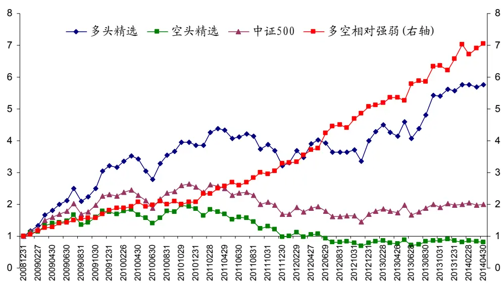
资料来源：海通证券研究所

从 2009 年 1 月至 2014 年 4 月，共计 64 个交易月，多头精选组合有 50 个月跑赢中证 500指数，胜率为 78.13%；空头精选组合有 16个月跑赢中证 500指数，胜率仅为25%，多空策略有 52个月实现盈利，胜率高达 81.25%。多头精选组合相对于中证 500的年化超额收益为 21.94%，空头精选组合相对于中证 500 指数的年化超额收益为-15.48%。

从历史回测分析，多头组合出现过一次连续两个月跑输中证 500，一次连续三个月跑输中证 500；空头组合仅出现过一次连续两个月战胜中证 500；多空组合甚至没有出现过连续两个月不盈利的情况。

一个稳定的投资策略需要在不同的市场环境下都能有战胜基准的表现，即有稳定的正 Alpha，我们统计了策略在不同年份的表现。

表 4 策略在不同年份的表现

|  | 2009 | 2010 | 2011 | 2012 | 2013 | 2014.01-04 |
| --- | --- | --- | --- | --- | --- | --- |
| 多头精选 | 220.27% | 20.64% | -16.94% | 24.23% | 39.63% | 0.50% |
| 空头精选 | 76.84% | 5.44% | -47.43% | -19.33% | 7.40% | -6.73% |
| 中证 500 | 131.27% | 10.07% | -33.83% | 0.28% | 16.89% | -1.64% |
| 多头胜率 | 91.67% | 66.67% | 83.33% | 83.33% | 66.67% | 75.00% |
| 空头胜率 | 8.33% | 41.67% | 25.00% | 25.00% | 25.00% | 25.00% |
| 多空胜率 | 91.67% | 75.00% | 75.00% | 91.67% | 75.00% | 75.00% |
| 多头超额 | 89.00% | 10.57% | 16.88% | 23.95% | 22.74% | 2.14% |
| 空头超额 | -54.43% | -4.63% | -13.60% | -19.61% | -9.48% | -5.09% |
| 多空超额 | 143.43% | 15.20% | 30.48% | 43.56% | 32.22% | 7.23% |

资料来源：海通证券研究所

表 4显示，无论是 2009、2010、2013年的牛市，抑或是 2010、2011年震荡下行的市场，多头精选组合均能有效战胜中证 500指数，空头精选组合均能有效跑输中证 500指数。分年度来看，多头精选组合最低年份的月度胜率为 66.67%，空头精选组合最高年份的月度胜率为 41.67%，多空组合最低年份的月度胜率为 75.00%。这说明极值方法下的多因子选股的收益贡献是稳定的，不存在收益贡献大小年分化的情况。

## 2.2 沪深 300指数样本空间的实证

较之中证 500指数，沪深300指数的成分股市值更大、同质性更强，在沪深 300样本内选股票做增强难度会相对大一些，下面我们用同样的方法对沪深 300指数进行多空的精选，历史回撤结果如图 9。

图 9 沪深 300指数样本空间内选股效果
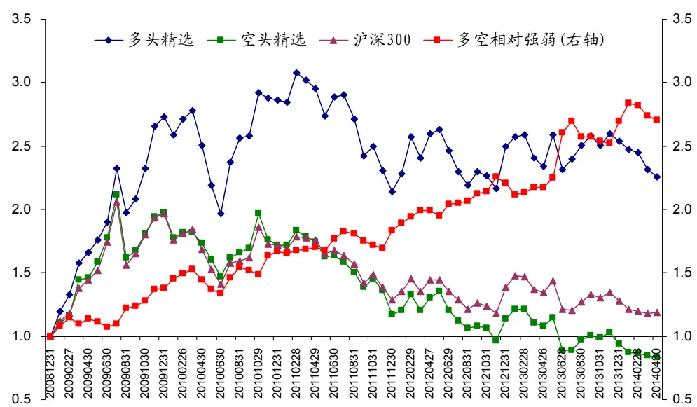
资料来源：海通证券研究所

从 2009 年 1 月至 2014 年 4 月，共计 64 个交易月，多头精选组合有 37 个月跑赢沪深 300指数，胜率为 57.81%；空头精选组合有 27个月跑赢沪深 300指数，胜率仅为42.19%，多空策略有 38个月实现盈利，胜率为 59.38%。多头精选组合相对于沪深 300的年化超额收益为 12.77%，空头精选组合相对于沪深 300 指数的年化超额收益为-6.43%。

一个稳定的投资策略需要在不同的市场环境下都能有战胜基准的表现，即有稳定的正 Alpha，我们统计了策略在不同年份的表现。

表 5 策略在不同年份的表现

|  | 2009 | 2010 | 2011 | 2012 | 2013 | 2014.01-04 |
| --- | --- | --- | --- | --- | --- | --- |
| 多头精选 | 172.52% | 5.05% | -25.19% | 16.78% | 1.61% | -11.35% |
| 空头精选 | 97.64% | -13.09% | -31.92% | -3.02% | -16.94% | -11.56% |
| 中证 500 | 96.71% | -12.51% | -25.01% | 7.55% | -7.65% | -7.35% |
| 多头胜率 | 83.33% | 50.00% | 33.33% | 83.33% | 50.00% | 25.00% |
| 空头胜率 | 41.67% | 58.33% | 33.33% | 33.33% | 50.00% | 25.00% |
| 多空胜率 | 75.00% | 58.33% | 50.00% | 75.00% | 50.00% | 25.00% |
| 多头超额 | 75.80% | 17.56% | -0.17% | 9.22% | 9.26% | -4.00% |
| 空头超额 | 0.93% | -0.58% | -6.90% | -10.57% | -9.29% | -4.20% |
| 多空超额 | 74.88% | 18.14% | 6.73% | 19.80% | 18.55% | 0.21% |

资料来源：海通证券研究所

表5显示，以沪深300为样本空间的选股效果不如中证500指数中的选股效果出色，但多头除了 2011年、空头除了 2010年之外，其他年份的表现也算稳定，多空组合亦是每年都能实现正收益。

## 3、选股效果的微观评价

前面我们从年化超额收益、月度胜率、信息比率等指标来评价选股效果的好坏，但这些指标似乎都相对偏“宏观”，我们可以知道策略的选股效果是不错的。量化选股是希望通过大数定律来实现稳定的超额收益，超额收益、信息比率这些指标不能反映我们选出的一篮子股票是大多数股票战胜了基准，还是少数几个牛股贡献了超额收益，为此我们对选股效果进行如下微观评价。

1）计算每期精选股票、样本空间股票在下期的收益，计算每只精选股票下期收益在样本空间中分位点；

2）将每一期精选股票的分位点合并到一块成为 $P=\left\{p_{1},p_{2},\cdots,p_{n}\right\}$ ，做Logistic 变换得到 $p_{i}^{*}=\ln\left(p_{i}/(1-p_{i})\right)$ ；

3）构建比较基准：[0,1]均匀分布的 Logistic 变换；

4）比较 2）中 $p_{i}^{*}$ 的分布与 3）中基准分布评价选股效果。

图 10 中证 500多头精选组合表现
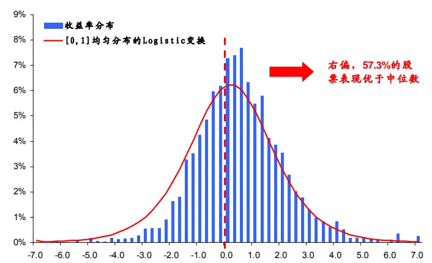

图 11 中证 500空头精选组合表现
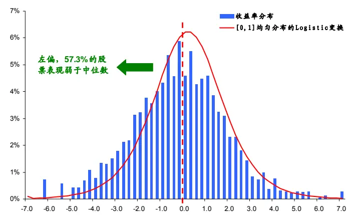

图 12 沪深 300多头精选组合表现
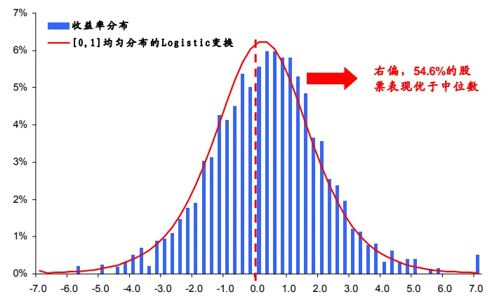
资料来源： 海通证券研究所

图 13 沪深 300空头精选组合表现
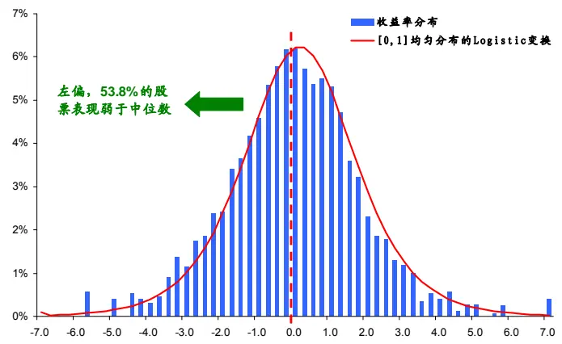

图 10、图 11 分别展示中证 500 样本空间中多头、空头精选组合的分位点的分布情况（蓝色柱状图），较之随机抽样生成的基准分布（红色曲线），多头精选的分位数分布呈现明显的右偏，有 57.3%的股票表现好于中位数，空头精选的分位数分布呈现明显的左偏，有 57.3%的股票表现弱于中位数。在沪深 300指数中这一现象同样存在（见图 12、图 13），这说明在微观层面，该方法选出的股票具有统计意义上的稳定性。

## 信息披露

## 分析师声明

张欣慰：金融工程

本人具有中国证券业协会授予的证券投资咨询执业资格，以勤勉的职业态度，独立、客观地出具本报告。本报告所采用的数据和信息均来自市场公开信息，本人不保证该等信息的准确性或完整性。分析逻辑基于作者的职业理解，清晰准确地反映了作者的研究观点，结论不受任何第三方的授意或影响，特此声明。

## 法律声明

本报告仅供海通证券股份有限公司（以下简称“本公司”）的客户使用。本公司不会因接收人收到本报告而视其为客户。在任何情况下，本报告中的信息或所表述的意见并不构成对任何人的投资建议。在任何情况下，本公司不对任何人因使用本报告中的任何内容所引致的任何损失负任何责任。

本报告所载的资料、意见及推测仅反映本公司于发布本报告当日的判断，本报告所指的证券或投资标的的价格、价值及投资收入可能会波动。在不同时期，本公司可发出与本报告所载资料、意见及推测不一致的报告。

市场有风险，投资需谨慎。本报告所载的信息、材料及结论只提供特定客户作参考，不构成投资建议，也没有考虑到个别客户特殊的投资目标、财务状况或需要。客户应考虑本报告中的任何意见或建议是否符合其特定状况。在法律许可的情况下，海通证券及其所属关联机构可能会持有报告中提到的公司所发行的证券并进行交易，还可能为这些公司提供投资银行服务或其他服务。

本报告仅向特定客户传送，未经海通证券研究所书面授权，本研究报告的任何部分均不得以任何方式制作任何形式的拷贝、复印件或复制品，或再次分发给任何其他人，或以任何侵犯本公司版权的其他方式使用。所有本报告中使用的商标、服务标记及标记均为本公司的商标、服务标记及标记。如欲引用或转载本文内容，务必联络海通证券研究所并获得许可，并需注明出处为海通证券研究所，且不得对本文进行有悖原意的引用和删改。

根据中国证监会核发的经营证券业务许可，海通证券股份有限公司的经营范围包括证券投资咨询业务。

海通证券股份有限公司研究所

| 路颖所长 |  | 高道德 副所长 |  | 姜超 副所长 |  |
| --- | --- | --- | --- | --- | --- |
| (021)23219403 | luying@htsec.com | (021)63411586 | gaodd@htsec.com | (021)23212042 | Jc9001@htsec.com |
| 江孔亮 所长助理 (021)23219422 | kljiang@htsec.com |  |  |  |  |
| 宏观经济研究团队 姜 超(021)23212042 勇(021)23219800 | jc9001@htsec.com cy8296@htsec.com | 金融工程研究团队 吴先兴(021)23219449 丁鲁明(021)23219068 | wuxx@htsec.com dinglm@htsec.com | 金融产品研究团队 单开佳(021)23219448 倪韵婷(021)23219419 | shankj@htsec.com |
| 陈高 远(021)23219669 周 霞(021)23219807 联系人 顾潇啸(021)23219394 | gaoy@htsec.com zx6701@htsec.com gxx8737@htsec.com | 郑雅斌(021)23219395 冯佳睿(021)23219732 朱剑涛(021)23219745 杨 勇(021)23219945 | zhengyb@htsec.com fengjr@htsec.com zhujt@htsec.com yy8314@htsec.com zxw6607@ htsec.com | 罗 震(021)23219326 唐洋运(021)23219004 孙志远(021)23219443 陈 亮(021)23219914 | niyt@htsec.com luozh@htsec.com tangyy@htsec.com szy7856@htsec.com ci7884@htsec.com |
| 固定收益研究团队 |  | 张欣慰(021)23219370 曾逸名(021)23219773 联系人 杜 炅(021)23219760 | zym6586@htsec.com dg9378@htsec.com jxl8404@htsec.com | 陈 瑶(021)23219645 伍彦妮(021)23219774 桑柳玉(021)23219686 陈韵骋(021)23219444 | chenyao@htsec.com wyn6254@htsec.com sly6635@htsec.com cyc6613@htsec.com |
| 姜 超(021)23212042 李 宁(021)23219431 | jc9001@htsec.com lin@htsec.com | 纪锡靓(021)23219948 |  | 田本俊(021)23212001 联系人 冯力(021)23219819 | tbj8936@htsec.com fl9584@htsec.com |
| 策略研究团队 荀玉根(021)23219658 | xyg6052@htsec.com | 中小市值团队 邱春城(021)23219413 | qiucc@htsec.com | 政策研究团队 李明亮(021)23219434 |  |
| 陈瑞明(021)23219197 汤 慧(021)23219733 王 旭(021)23219396 李 珂(021)23219821 | chenrm@htsec.com tangh@htsec.com wx5937@htsec.com lk6604@htsec.com | 钮宇鸣(021)23219420 何继红(021)23219674 孔维娜(021)23219223 | ymniu@htsec.com hejh@htsec.com kongwn@htsec.com | 陈久红(021)23219393 吴一萍(021)23219387 联系人 朱蕾(021)23219946 周洪荣(021)23219953 | Iml@htsec .com chenjiuhong@htsec.com wuyiping@htsec.com zl8316@htsec.com |
| 批发和零售贸易行业 路 颖(021)23219403 | luying@htsec.com | 互联网及传媒行业 |  | 石油化工行业 | zhr8381@htsec.com |
| 汪立亭(021)23219399 潘 鹤(021)23219423 李宏科(021)23219671 | wanglt@htsec.com panh@htsec.com Ihk6064@htsec.com | 白 洋(021)23219646 薛婷婷(021)23219775 | baiyang@htsec.com xtt6218@htsec.com | 邓 勇(021)23219404 王晓林(021)23219812 | dengyong@htsec.com wxl6666@htsec.com |
| 机械行业 龙华(021)23219411 熊哲颖(021)23219407 | longh@htsec.com xzy5559@htsec.com | 公用事业 | lufm@htsec.com | 非银行金融行业 丁文韬(021)23219944 |  |
| 联系人 黄 威(021)23219963 | hw8478@htsec.com | 陆凤鸣(021)23219415 汤砚卿(021)23219768 | tyq6066@htsec.com | 李 欣(010)58067936 | dwt8223@htsec.com lx8867@htsec.com |
|  |  |  |  | 联系人 吴绪越(021)23219947 |  |
|  |  |  |  |  | wxy8318@htsec.com |
|  |  |  |  | 医药行业 |  |
| 钢铁行业 |  | 建筑工程行业 |  | 周 锐(0755)82780398 余文心(0755)82780398 | zr9459@htsec.com |
| 刘彦奇(021)23219391 |  | 赵 健(021)23219472 | zhaoj@htsec.com | 刘 宇(021)23219608 | ywx9460@htsec.com |
|  | liuyq@htsec.com | 张显宁(021)23219813 | zxn6700@htsec.com | 江 琦(021)23219685 | liuy4986@htsec.com |
|  |  |  |  |  | jq9458@htsec.com |
|  |  |  |  | 王 威(0755)82780398 | ww9461@htsec.com |
|  |  |  |  | 郑 琴(021)23219808 |  |
|  |  |  |  |  | zq6670@htsec.com |
|  | dingpin@htsec.com |  |  | 涂力磊(021)23219747 | tll5535@htsec.com |
| 农林牧渔行业 |  |  | 银行业 | 房地产业 |  |
| 丁 频(021)23219405 |  |  |  |  |  |

| 基础化工行业 曹小飞(021)23219267 |  | 有色金属行业 |  |  | 计算机行业 陈美风(021)23219409 chenmf@htsec.com |  |
| --- | --- | --- | --- | --- | --- | --- |
| 张 瑞(021)23219634 联系人 朱 睿(021)23219957 | caoxf@htsec.com zr6056@htsec.com zr8353@htsec.com | 钟 施 刘 | 奇(021)23219962 毅(021)23219480 博(021)23219401 | zq8487@htsec.com sy8486@htsec.com liub5226@htsec.com | 蒋 科(021)23219474 联系人 王秀钢(010)58067934 安永平(021)23219950 | jiangk@htsec.com wxg8866@htsec.com ayp8320@htsec.com |
| 社会服务业 林周勇(021)23219389 | lzy6050@htsec.com | 交通运输行业 黄金香(021)23212081 虞 姜 | 楠(021)23219382 明(021)23212111 | hjx9114@htsec.com yun@htsec.com jm9176@htsec.com | 家电行业 陈子仪(021)23219244 联系人 宋伟(021)23219949 | chenzy@htsec.com sw8317@htsec.com |
| 通信行业 徐 力(010)58067940 侯云哲(021)23219815 | xl9312@htsec.com hyz6671@htsec.com | 汽车行业 陈鹏辉(021)23219814 |  | cph6819@htsec.com | 电力设备及新能源行业 张 浩(021)23219383 牛 品(021)23219390 陈日华(021)23219716 房 青(021)23219692 徐柏乔(021)23219171 | zhangh@htsec.com np6307@htsec.com crh9585@htsec.com fangq@htsec.com xbq6583@htsec.com |
| 食品饮料行业 闻宏伟(010)58067941 马浩博(021)23219822 | whw9587@htsec.com mhb6614@htsec.com | 造纸轻工行业 徐 琳(021)23219767 |  | xl6048@htsec.com | 纺织服装行业 焦 娟(021)23219356 | jj9604@htsec.com |
| 煤炭行业 朱洪波(021)23219438 | zhb6065@htsec.com | 建筑建材行业 周 煜(021)23219972 |  | zy9445@htsec.com |  |  |

## 海通证券股份有限公司机构业务部

| 深广地区销售团队 |  |  | 上海地区销售团队 |  | 北京地区销售团队 |  |  |
| --- | --- | --- | --- | --- | --- | --- | --- |
| 蔡铁清 刘晶晶 | (0755)82775962 (0755)83255933 | ctq5979@htsec.com | 贺振华(021)23219381 (021)23219442 | hzh@htsec.com | 赵春 郭文君 | (010)58067977 | zhc@htsec.com |
|  |  | liujj4900@htsec.com | 姜洋 |  | jy7911@htsec.com | (010)58067996 | gwj8014@htsec.com |
| 辜丽娟 | (0755)83253022 | gulj@htsec.com | 高溱 | (021)23219386 | gaoqin@htsec.com | 隋巍 (010)58067944 | sw7437@htsec.com |
| 高艳娟 | (0755)83254133 | gyj6435@htsec.com | 季唯佳 | (021)23219384 | jiwj@htsec.com | 江虹 (010)58067988 | jh8662@htsec.com |
| 伏财勇 | (0755)23607963 | fcy7498@htsec.com | 胡雪梅 | (021)23219385 | huxm@htsec.com | 杨帅 (010)58067929 | ys8979@htsec.com |
| 邓欣 | (0755)23607962 | dx7453@htsec.com | 黃 | 毓(021)23219410 | huangyu@htsec.com | 张楠 (010)58067935 | zn7461@htsec.com |
|  |  |  | 朱 健 | (021)23219592 | zhuj@htsec.com | 许诺 (010)58067931 | xn9554@htsec.com |
|  |  |  | 慧 (021)23212071 | hh9071@htsec.com |  |  |  |
|  |  |  | 倩 (021)23219373 | lq7843@htsec.com |  |  |  |
|  |  |  | 孙明 (021)23219990 | sm8476@htsec.com |  |  |  |
|  |  |  | 孟德伟 (021)23219989 | mdw8578@htsec.com |  |  |  |

海通证券股份有限公司研究所

地址：上海市黄浦区广东路 689号海通证券大厦 13楼

电话：(021)23219000

传真：(021)23219392

网址：www.htsec.com