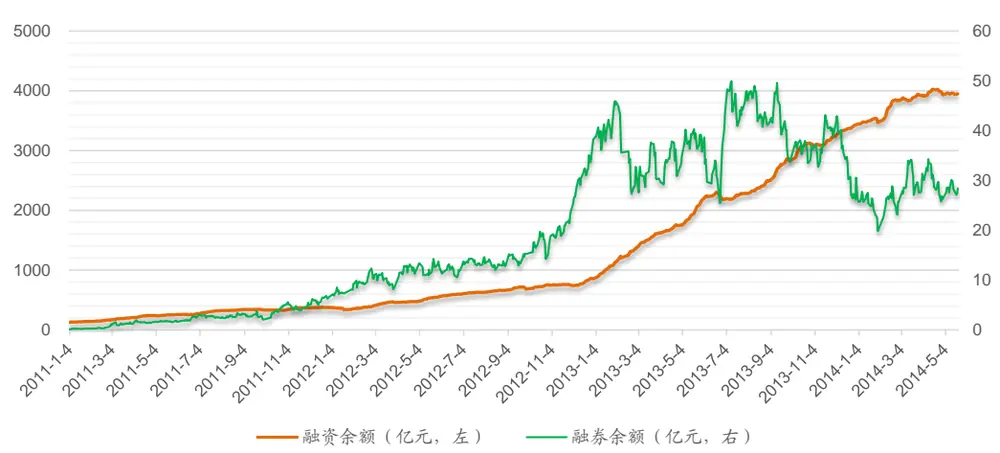
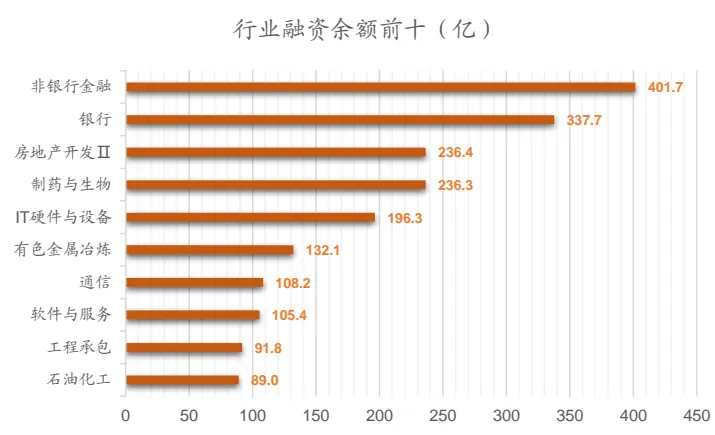
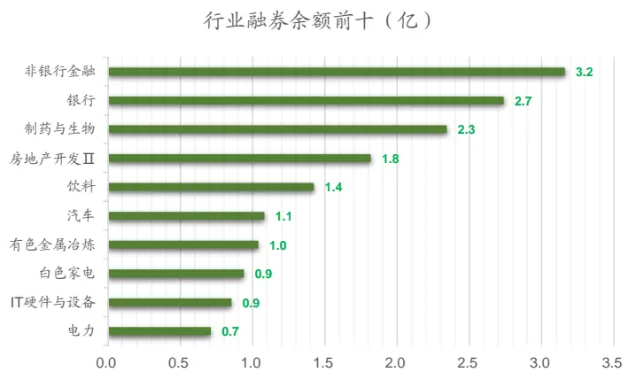
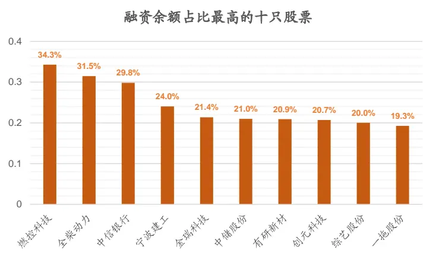
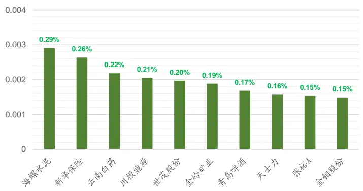
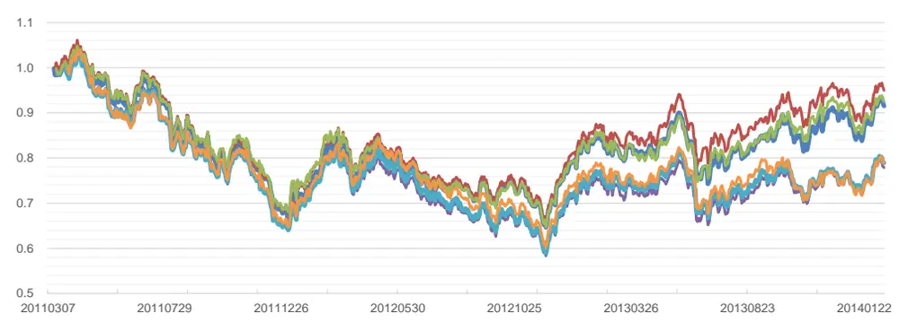
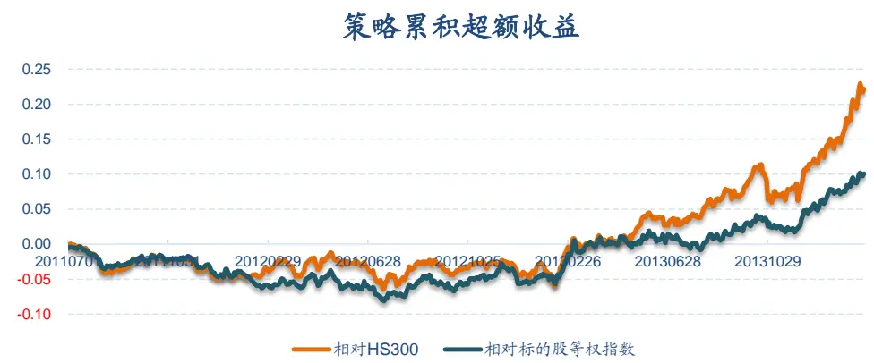
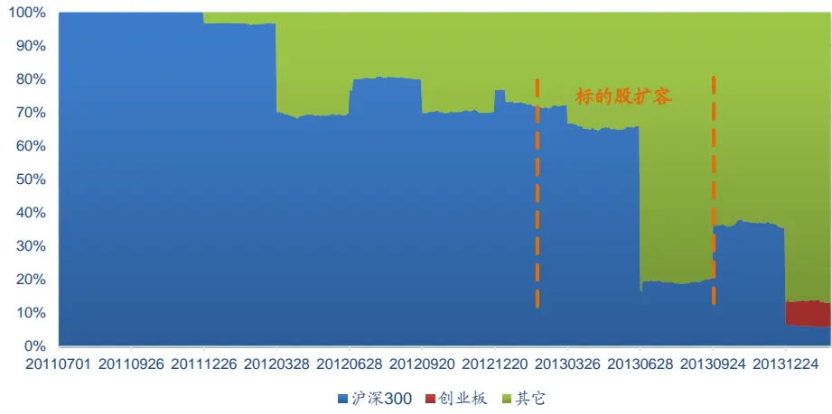
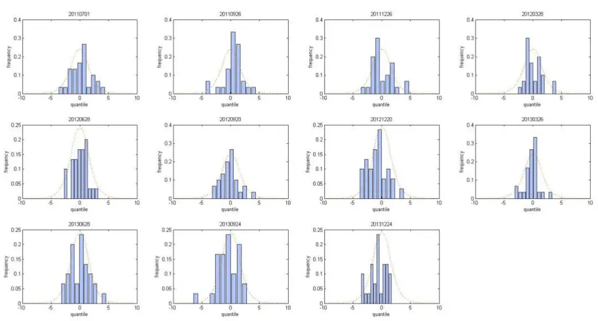

## 量化选股研究

2014 年 05 月 26 日

## 相关研究

选股因子研究系列（一）——弱者终有逆袭日，强势几无持续时 20120723

选股因子研究系列（二）——因子模型的尾部相关性研究20130325

选股因子研究系列（三）——从Spearman相关系数出发研究因子有效性——Kalman Filter 模型在因子选择中的应用20131011

选股因子研究系列（四）——多因子选股模型的有效与失效20131028

选股因子研究系列（五）——寻找股价驱动新因子之净换手率 2013.10.31

## 融资推动股价明显，融券作用有限

## -- 融资融券对个股收益的影响研究

- 融资融券市场概况。自 2010 年 3 月开始以来，融资融券标的股票数目经过几次调整，从约 90 只增至 280 只、500 只，到现在的 700 只。现在的 700 只标的股票中，主板数量占 ，中小板占 ，创业板占 。由于交易制度的限制，全市场融资余额与融券余额极不对称，前者目前规模是后者的 100 多倍。融资余额最高的五个行业依次是非银金融、银行、房地产、生物制药和 IT 硬件设备

- 融资对个股的影响。报告中分别定义了融资增速与融资余额占比指标，回归分析发现融资增速对个股收益率的影响比融资余额更大，而且在统计上更显著。投资者可以用融资增速快的股票作为选股组合，在观察期和持有期较长时（两个月以上），该组合可以获得较高的超额收益。融资增速组合的超额收益主要来自于 2012 四季度之后，时点正好和标的股扩容、融资余额增速加快的时点契合，迅速增加的入市资金明显推动股价上涨。

- 融券对个股的影响。由于目前转融通的标的券只有 只，市场参与者较少，因而融券券源主要还是券商的自购券，券源数量有限，难以对市场形成有效冲击，融券对个股的影响更多是情绪层面的。定量分析发现，融资的相关指标对个股的影响不显著，不建议作为选股因子。

- 融资融券净额对个股的影响。计算融资融券净额的初衷是让融资和融券的影响部分抵消，但是由于融券指标受限于券商的持券数量和持券偏好，净额指标的效果反而可能会受到干扰，虽然用该指标构建的组合和融资增速组合收益比较类似，但为避免融券数据的影响，我们建议投资者把更多注意力放在融资增速指标上。

海通证券研究所

金融工程高级分析师

朱剑涛

SAC 执业证书编号：

S0850512100002

电 话：021-23219745

Email：zhujt@htsec.com

A股融资融券制度推出四年有余，全市场融资融券余额从最早的不到 100 亿增长到中现在的近 亿，实实在在的为 股输血不少，但融资融券本身对个股股价的推动力度有多大，市场上还缺乏定量的分析，本报告将力争弥补这一空缺。

## 1. 融资融券市场概述

自 2010 年 3 月开始以来，融资融券标的股票数目经过几次调整，从约 90 只增至280 只、500 只，到现在的 700 只。现在的 700 只标的股票中，主板数量占 77.57%，中小板占 17.57%，创业板占 4.86%。标的中 HS300 成分股有 286 只，占 40.86%。，

表 1 融资融券标的股变化

| 变动时间 | 融资标的 |  |  | 融券标的 |  |  |
| --- | --- | --- | --- | --- | --- | --- |
|  | 股票数量 | 调入 | 调出 | 股票数量 | 调入 | 调出 |
| 2014-2-26 | 699 |  | 1 | 700 |  |  |
| 2013-12-31 | 700 | 1 |  | 700 |  |  |
| 2013-9-16 | 699 | 206 |  | 700 | 206 |  |
| 2013-5-3 | 493 |  | 1 | 494 |  | 1 |
| 2013-5-2 | 494 |  | 1 | 495 |  | 1 |
| 2013-3-29 | 495 |  | 2 | 496 |  | 2 |
| 2013-3-7 | 497 |  | 1 | 498 |  | 1 |
| 2013-3-6 | 498 |  | 1 | 499 |  | 1 |
| 2013-1-31 | 499 | 275 | 54 | 500 | 276 | 54 |
| 2011-12-5 | 278 | 189 |  | 278 | 189 |  |
| 2010-7-29 | 89 | 1 | 1 | 89 | 1 | 1 |
| 2010-6-21 | 89 | 5 | 4 | 89 | 5 | 4 |
| 2010-3-31 | 88 | 88 |  | 88 | 88 |  |

资料来源：海通证券研究所

全市场融资余额和融券余额从 2012 四季度开始增速迅猛；但融券余额从 2013 年二季度开始增速下降，余额总量震荡向下，而融资余额则一直保持稳健增长的趋势，直到今年四月中旬开始才有轻微下降。造成这种现象原因可能是融资融券标的股的扩容，投资者可以融资买入的标的增多，但券商出于对冲风险控制的考虑，不愿过多持有沪深 300成分股之外的个股，使得融券券源数量并没有随之增多，继而造成两者增速的差别；目前全市场融资余额远大于融券余额，前者是后者总量的 100 倍以上；

图 1 全市场融资余额与融券余额变动（2011.01.04 – 2014.05.21）

资料来源：海通证券研究所

按照 2014.05.21 日数据，融资余额最高的五个行业依次是非银金融、银行、房地产、生物制药和 IT 硬件设备（图 2）。这些行业的融券余额也非常靠前，但是和融资余额规模相差悬殊。

图 2融资融券余额前十的行业（2014.05.21）

资料来源：海通证券研究所

如果拿融资/融券余额去除以个股的自由流通市值，目前全市场融资/融券占比最高的十只股票如图 3 所示。直观的看，这个占比数据体现的意义不是很明显，例如融资占比排名第一的燃控科技今年以来跌了 18%左右，而第二名的全柴动力今年则上涨了13%。融资融券的数据需要更全面细致的定量分析。

图 3融资融券余额占比前十的个股（2014.05.21）

资料来源：海通证券研究所

融券余额占比最高的十只股票

## 2. 融资对个股的影响

## 2.1 融资对个股收益的影响途径

融资影响个股收益的途径主要有三条：

1. 首先体现在资金的增量上，特别是 2012 年四季度后，融资增速将直接影响到股票近期的涨跌；

融资余额一方面表示了市场看多情绪的大小，另一方面也预示着个股面临的信用交易者卖券还款的压力，该指标的影响是双面的；

3. 个股融资数据已成为国内投资者的重要参考指标，融资数据会影响到投资者心理及对个股未来收益的预期；

## 2.2 融资对个股收益影响的回归分析

定义如下两个融资相关指标：

融资增速 = 最近 k 天的融资增量均值/最近 k 天的日均成交额

$$
15\div\frac{5}{3}\cdots\frac{5}{3}x=5k=5k\div\frac{5}{6}x=5k\div\frac{5}{3}x=5\times\frac{5}{3}x=5k\times\frac{5}{6}x=5k\div3=5k\div3
$$

由于融资直接作用在股票二级市场，因此我们用股票的日均成交额，而没有用流通市值做分母，这样可以更好的衡量融资的市场冲击。另外，投资者每天都可以计算个股当天融资余额相对 k 天前余额的增量，但该指标波动较大，很不稳定，因而上面定义中使用最近该增量的 k 日移动平均来增加稳定性。

以下回归分析用到的数据时间段为 2011.01.01 – 2014.02.11，以个股 k 天的收益率为因变量，以对应时间段的上证指数收益率、融资增速、融资余额占比数据为自变量做线性回归，考察各变量对个股收益的影响，收益率、融资增速、融资余额数据都采用标准化处理，回归结果如下表 2 所示。

表 2 融资线性回归分析结果

| 个股收益率 | 上证指数收益率 | 融资增速 | 融资余额 |
| --- | --- | --- | --- |
| 5天 | 0.476 *** | 0.001 | -0.019 ** |
| 10天 | 0.546 *** | 0.005 | -0.018 *大 |
| 20天 | 0.648 *** | 0.033 *** | 0.001 |
| 40天 | 0.553 *** | 0.062 *** | -0.002 |
| 60天 | 0.516 *** | 0.070 *** | -0.004 |

资料来源：海通证券研究所
注：***、**、*分别表示回归系数在 1%,5%,10%显著性水平下 t检验显著

可以看到，融资增速对个股收益率的影响比融资余额更大，而且在统计上更显著，这种显著性在个股一个月以上持有期时更明显。因而下面我们将融资增速指标作为选股因子，回溯测试其选股效用。

## 利用融资增速构建选股组合

回溯数据时间段和之前回归分析一样。组合构建方法上，我们把股票按过去 k 天融资增速的大小从高到低排序，买入前 n只股票，资金平均分配，持有 c天。买卖佣金设置为 0.08%，买卖单边冲击成本 0.1%，卖股票印花税 0.1%。

这种组合构建方法可能会受到组合构建时间起点的影响。例如参数 k 为 20天，c为20 天，n 为 30 只时，由于每隔 20 天换一次仓，初始开仓的时间不同会导致 20条不同的资产收益曲线，最终会有 20 个不同的资产总值，我们分别选取最高和最低的 3 只作图（图 4）。不同时点的组合累计收益可能会有较大差别，因而后续分析中我们采用不同时间起点组合的平均收益来衡量该组参数的选股效果。

图 4 全市场融资余额与融券余额变动（2011.01.04 – 2014.05.21）

资料来源：海通证券研究所

固定组合股票数量 n=30，表 3 是不同考察期和持有期下，融资增速组合的累计超额收益；由于融资融券标的股一直在变，因而组合的业绩比较基准是我们用融资融券标的股构建的一个虚拟等权指数，指数每三个月调整一次。和之前回归分析的结果相似，观察期和持有期较长时，组合有稳定的超额收益。

表 3 不同参数下融资增速组合相对标的等权指数的累计超额收益

| 考察期k 持有期C | 5天 | 10天 | 20天 | 40天 | 60天 |
| --- | --- | --- | --- | --- | --- |
| 5天 | -11.4% | -5.3% | -2.1% | 1.8% | 3.8% |
| 10天 | -12.8% | -6.2% | -1.2% | 3.2% | 5.1% |
| 20天 | -9.9% | -2.2% | 1.5% | 5.4% | 5.8% |
| 40天 | -11.1% | -3.5% | 1.6% | 4.7% | 6.8% |
| 60天 | -10.4% | -2.5% | 3.4% | 7.2% | 8.4% |

资料来源：海通证券研究所

组合个股数量对组合超额收益的影响不大，例如 $\mathtt{k}=60,\mathtt{c}=60$ 时，n 取不同值时组合超额收益如表 4所示。

表 4 个股数量对融券增速组合收益的影响

| 组合股票数量 | 10 | 20 | 30 | 40 | 50 |
| --- | --- | --- | --- | --- | --- |
| 累计超额收益 | 9.6% | 7.8% | 8.4% | 8.0% | 7.4% |

资料来源：海通证券研究所

## 2.4 融资增速组合分析

固定参数 $\mathtt{k}{=}60,\mathtt{c}{=}60,\mathtt{n}{=}30$ ，从图 5可以而看到融资增速组合的超额收益主要来自于2012 四季度之后，时点正好和标的股扩容、融资余额增速加快的时点契合，迅速增加的入市资金明显推动股价。

图 5 k=60,c=60,n=30 融资增速组合累计超额收益走势

资料来源：海通证券研究所

2013.01.31 融资标的股由 278 只扩容到 500 只，2013.09.16 标的股继续扩容至 700只；从图 6 可以看到，扩容时点后三个月，融资增速组合中沪深 300 的权重都明显下降，反应了投资者风格偏好的变化。

2014 年 3 月底开始，市场发生明显风格切换，融资增速组合在 2014.04.01 至2014.05.21 间收益-0.6%，同期沪深 300 收益-0.5%，两者基本持平，建议关注三个月更长期的表现。

图 6 k=60,c=60,n=30融资增速组合中各板块股票数量占比变化

资料来源：海通证券研究所

如果记融资增速组合中某只个股的收益率在当期所有融资融券标的股的收益率从高到低排序的分位数为 p，则 ln (p/(1-p)) 的分布如下图 7所示。从 2012 四季度开始，增速组合选出的个股在整个标的股池里面收益率排名相对靠前，和之前累积超额收益分析的结果相符。

图 7 k=60,c=60,n=30 组合个股每期收益在所有标的股中的分位数分布

|  | 20110701 | 20110926 | 20111226 | 20120328 | 20120628 | 20120920 | 20121220 | 20130326 | 20130628 | 20130924 |
| --- | --- | --- | --- | --- | --- | --- | --- | --- | --- | --- |
| mean | 0.308 | 0.414 | 0.046 | 0.109 | 0.074 | -0.227 | -0.750 | -0.161 | 0.023 | -0.394 |
| median | 0.364 | 0.460 | -0.547 | -0.354 | 0.193 | -0.202 | -0.846 | -0.059 | 0.162 | -0.429 |
| skewness | 0.106 | -0.613 | 0.606 | 0.783 | 0.017 | 0.543 | 0.342 | 0.041 | 0.339 | -0.792 |
| kurtosis | -0.314 | 1.102 | -0.018 | 0.316 | -0.279 | 0.250 | -0.298 | 1.176 | -0.386 | 1.264 |

资料来源：海通证券研究所

继续固定参数 $\mathtt{k}{=}60,\mathtt{c}{=}60,\mathtt{n}{=}30$ ，每次选股时根据融资增速从高到低将所有融资标的股票平均分为 5 档，其中第一档股票融资增速最高，测算不同档股票组合的绝对收益大小，考察融资增速指标对标的股的区分能力（表 5）。融资增速指标在 2013 年以后，即融资融券标的扩大到 500 只后，各档之间差异变得较为明显；

表 5 融资增速对标的股的区分程度

| 时间 | 第一档 | 第二档 | 第三档 | 第四档 | 第五档 |
| --- | --- | --- | --- | --- | --- |
| 20110701-20111202 | -46.9% | -35.0% | -44.7% | -36.3% | -34.1% |
| 20111205-20130130 | 5.2% | 3.7% | 4.3% | 3.8% | 9.7% |
| 20130131-20130913 | 7.4% | -3.6% | -6.0% | -9.9% | -0.9% |
| 20130916-20140221 | 15.1% | 14.3% | 4.2% | -7.4% | -18.7% |

资料来源：海通证券研究所

以上的分析显示 2013 年初融资融券标的股扩容、融资增速加快、融资增速组合优异表现凸显的发生时点十分接近，而这次标的扩容主要是加入一些中小盘的股票，融资增速表现突出的原因，是否是因为融资对中小盘的个股影响更显著呢？我们采用类似表2 的回归方法，加入流通市值因子作为第四个自变量。回归结果显示流通市值因子的系数始终为负，在 10 天和 40天周期上系数 t检验显著（5%显著水平）。一定程度上说明，盘子小的股票受融资的影响更大。

## 3. 融券对个股的影响

由于目前转融通的标的券只有 90 只（上证 50+深成指成份股），市场参与者较少，因而融券券源主要还是券商的自购券，券源数量有限，难以对市场形成有效冲击。融券对个股的影响更多是情绪层面的。

和融资类似，我们定义：

融券增速 = 最近 k 天的融券增量均值/最近 k 天的日均成交额

融券余额占比 = 当前的融券余额/最近 k 天的日均成交额

融券增速越快，说明市场情绪越悲观，对股票收益产生负向影响。

融券余额大一方面说明市场悲观，另一方面也说明买券还券的压力较大。但是融券余额小的原因，可能是投资者对个股前景乐观，也可能是券商出于对冲风险的考量没有购入该券作为融券券源，因而市场投资者无券可融所致。

采用之前表 2的类似回归方法（表 6），我们发现和融资不同，融券余额对个股收益的影响为负面，而且比融券增速的影响更为显著，这可能和融券总体规模不大以及券商持券偏好有一定关系。

表 6 融券线性回归分析结果

| 个股收益率 | 上证指数收益率 | 融券增速 | 融券余额 |
| --- | --- | --- | --- |
| 5天 | 0.475*** | 0.018* | -0.033*** |
| 10天 | 0.546*** | 0.005 | -0.034*** |
| 20天 | 0.647*** | 0.016* | -0.02** |
| 40天 | 0.550*** | 0.037*** | -0.04*** |
| 60 天 | 0.517*** | 0.051*** | -0.059*** |

资料来源：海通证券研究所
注：***、**、*分别表示回归系数在 1%,5%,10%显著性水平下 t检验显著

融券余额指标和个股收益是负相关，但个股融券余额低可能是因为无券可融。因而我们不能主动去选取那些融券余额低的股票，只能选取融券余额高的股票，看其是否会明显跑输大盘，这样在构建组合时可以避免选入此类股票。

表 7 不同参数下高融资余额组合相对标的等权指数的累计超额收益

| 考察期k 持有期C | 5天 | 10天 | 20天 | 40天 | 60天 |
| --- | --- | --- | --- | --- | --- |
| 5天 | -16.3% | -10.6% | -5.4% | -3.4% | -2.8% |
| 10天 | -15.7% | -9.9% | -5.1% | -2.7% | -1.6% |
| 20天 | -14.6% | -9.4% | -5.0% | -1.8% | -1.4% |
| 40天 | -15.4% | -9.0% | -4.5% | -3.0% | -1.2% |
| 60 天 | -15.6% | -8.8% | -3.6% | -0.8% | 1.3% |

资料来源：海通证券研究所

结果并不像我们预期那样，融券余额高的股票的负收益不是很明显，在长持有期情况下甚至会跑赢基准；持仓期为 5天、10 天超额收益为负的主要原因是换仓频率太高，交易成本的影响较大。

另外，融券余额与未来股价收益的相关性在绝大多数时候不显著，且正负无规律可循，因而我们认为融券余额指标不适合用来做为选股因子。

## 4. 融资融券净额对个股的影响

计算融资融券净额的初衷是让融资和融券的影响部分抵消，但是由于融券指标受限于券商的持券数量和持券偏好，净额指标的效果反而可能会受到干扰。

我们可以和之前类似的定义融资融券净额增速和融资融券净余额指标，并进行回归分析和选股，结果如表 8 和表 9 所示。

表 8 融资融券净额线性回归分析结果

| 个股收益率 | 上证指数收益率 | 融券增速 | 融券余额 |
| --- | --- | --- | --- |
| 5天 | 0.476 *** | 0.001 | -0.019 ** |
| 10天 | 0.546 *** | 0.005 | -0.017 ** |
| 20天 | 0.648 *** | 0.032 *** | 0.001 |
| 40天 | 0.553 *** | 0.06 *** | -0.003 |
| 60天 | 0.516 *** | 0.068 *** | -0.005 |

资料来源：海通证券研究所
注：***、**、*分别表示回归系数在 1%,5%,10%显著性水平下 t检验显著

表 9 不同参数下融资融券净额增速组合相对标的等权指数的累计超额收益

| 考察期k 持有期C | 5天 | 10天 | 20天 | 40天 | 60天 |
| --- | --- | --- | --- | --- | --- |
| 5天 | -11.1% | -5.4% | -2.1% | 1.8% | 3.7% |
| 10天 | -12.5% | -5.9% | -1.0% | 3.2% | 4.7% |
| 20天 | -9.8% | -2.1% | 1.4% | 5.3% | 5.5% |
| 40天 | -11.0% | -3.2% | 1.8% | 4.7% | 6.7% |
| 60天 | -10.7% | -2.6% | 3.3% | 7.3% | 8.5% |

资料来源：海通证券研究所

由于融资余额与融券余额数量上的差距，净额增速指标里起作用的主要还是融资增速指标，按照净额增速选出的股票和融资增速指标非常类似，有效性分析结果也比较雷同，这里不再赘述。不过融券指标受限于券商的持券数量和持券偏好，对个股的影响不确定，从而一定程度会干扰净额指标的效用，我们建议投资者把更多注意力放在融资增速指标上。

## 5. 总结

由于当前交易制度的限制，融资在股票信用交易中占据了绝对主导作用，对个股能够提供实实在在的资金支持，正向推动股价；而融券总体规模偏小，其对个股的影响更多是情绪层面的。

融资余额增速对股价的影响比融资余额本身更显著，在较长的考察期和持有期下（例如： 个月），融资增速快的组合有望获得明显超额收益。融资余额增速指标更适合中小盘股票，在沪深 300 里的使用效果一般。

个股融券的多寡受到券商持股数量和持股偏好的限制，因而根据融券数据计算出来的融券余额、融券增速等指标对个股的影响都不显著。我们推荐投资者采用融资余额增速作为选股的一个有效参考指标。

## 信息披露

分析师声明

朱剑涛：金融工程

本人具有中国证券业协会授予的证券投资咨询执业资格，以勤勉的职业态度，独立、客观地出具本报告。本报告所采用的数据和信息均来自市场公开信息，本人不保证该等信息的准确性或完整性。分析逻辑基于作者的职业理解，清晰准确地反映了作者的研究观点，结论不受任何第三方的授意或影响，特此声明。

## 法律声明

本报告仅供海通证券股份有限公司（以下简称 本公司 ）的客户使用。本公司不会因接收人收到本报告而视其为客户。在任何情况下，本报告中的信息或所表述的意见并不构成对任何人的投资建议。在任何情况下，本公司不对任何人因使用本报告中的任何内容所引致的任何损失负任何责任。

本报告所载的资料、意见及推测仅反映本公司于发布本报告当日的判断，本报告所指的证券或投资标的的价格、价值及投资收入可能会波动。在不同时期，本公司可发出与本报告所载资料、意见及推测不一致的报告。

市场有风险，投资需谨慎，本报告所载的信息、材料及结论只提供特定客户作参考，不构成投资建议，也没有考虑到个别客户特殊的投资目标、财务状况或需要。客户应考虑本报告中的任何意见或建议是否符合其特定状况。在法律许可的情况下，海通证券及其所属关联机构可能会持有报告中提到的公司所发行的证券并进行交易，还可能为这些公司提供投资银行服务或其他服务。

本报告仅向特定客户传送，未经海通证券研究所书面授权，本研究报告的任何部分均不得以任何方式制作任何形式的拷贝、复印件或复制品，或再次分发给任何其他人，或以任何侵犯本公司版权的其他方式使用。所有本报告中使用的商标、服务标记及标记均为本公司的商标、服务标记及标记。如欲引用或转载本文内容，务必联络海通证券研究所并获得许可，并需注明出处为海通证券研究所，且不得对本文进行有悖原意的引用和删改。

根据中国证监会核发的经营证券业务许可，海通证券股份有限公司的经营范围包括证券投资咨询业务。

海通证券股份有限公司研究所

| 路颖所长 (021)23219403 |  | 高道德 luying@htsec.com | 副所长 | 姜超 副所长 |  |  |
| --- | --- | --- | --- | --- | --- | --- |
|  |  |  |  | gaodd@htsec.com | (021)23212042 | Jc9001@htsec.com |
| 江孔亮 所长助理 |  |  | (021)63411586 |  |  |  |
| (021)23219422 |  | kljiang@htsec.com |  |  |  |  |
| 宏观经济研究团队 姜超(021)23212042 |  | jc9001@htsec.com | 金融工程研究团队 吴先兴(021)23219449 | wuxx@htsec.com | 金融产品研究团队 |  |
| 陈 | 勇(021)23219800 | cy8296@htsec.com | 丁鲁明(021)23219068 | dinglm@htsec.com | 单开佳(021)23219448 倪韵婷(021)23219419 | shankj@htsec.com niyt@htsec.com |
| 高 周 | 远(021)23219669 霞(021)23219807 | gaoy@htsec.com zx6701@htsec.com | 郑雅斌(021)23219395 冯佳睿(021)23219732 | zhengyb@htsec.com fengjr@htsec.com | 罗 震(021)23219326 | luozh@htsec.com |
| 联系人 |  |  | 朱剑涛(021)23219745 杨 勇(021)23219945 | zhujt@htsec.com yy8314@htsec.com | 唐洋运(021)23219004 孙志远(021)23219443 | tangyy@htsec.com szy7856@htsec.com |
|  | 顾潇啸(021)23219394 | gxx8737@htsec.com | 张欣慰(021)23219370 曾逸名(021)23219773 | zxw6607@ htsec.com zym6586@htsec.com | 陈 亮(021)23219914 陈 瑶(021)23219645 | ci7884@htsec.com chenyao@htsec.com |
|  | 固定收益研究团队 |  | 联系人 杜 炅(021)23219760 | dg9378@htsec.com | 伍彦妮(021)23219774 桑柳玉(021)23219686 陈韵骋(021)23219444 | wyn6254@htsec.com sly6635@htsec.com |
|  | 姜 超(021)23212042 李 宁(021)23219431 | jc9001@htsec.com lin@htsec.com | 纪锡靓(021)23219948 | jxl8404@htsec.com | 田本俊(021)23212001 联系人 | cyc6613@htsec.com tbj8936@htsec.com |
|  |  |  |  |  | 冯力(021)23219819 | fl9584@htsec.com |
| 策略研究团队 |  |  |  |  |  |  |
| 荀玉根(021)23219658 |  |  | 中小市值团队 邱春城(021)23219413 | qiucc@htsec.com | 政策研究团队 |  |
| 陈瑞明(021)23219197 |  | xyg6052@htsec.com chenrm@htsec.com | 钮宇鸣(021)23219420 | ymniu@htsec.com | 李明亮(021)23219434 陈久红(021)23219393 | Iml@htsec.com |
| 汤 | 慧(021)23219733 | tangh@htsec.com | 何继红(021)23219674 | hejh@htsec.com | 吴一萍(021)23219387 | chenjiuhong@htsec.com wuyiping@htsec.com |
| 王 | 旭(021)23219396 | wx5937@htsec.com | 孔维娜(021)23219223 | kongwn@htsec.com | 联系人 |  |
| 李 | 珂(021)23219821 | lk6604@htsec.com |  |  | 朱 蕾(021)23219946 周洪荣(021)23219953 | zl8316@htsec.com |
|  |  |  |  |  |  | zhr8381 @htsec.com |
| 批发和零售贸易行业 |  |  | 互联网及传媒行业 |  | 石油化工行业 |  |
|  | 路 颖(021)23219403 | luying@htsec.com | 白 洋(021)23219646 | baiyang@htsec.com |  |  |
| 潘 鹤(021)23219423 | 汪立亭(021)23219399 | wanglt@htsec.com | 薛婷婷(021)23219775 | xtt6218@htsec.com | 邓 勇(021)23219404 | dengyong@htsec.com wxl6666@htsec.com |
| 李宏科(021)23219671 |  | panh@htsec.com |  |  | 王晓林(021)23219812 |  |
|  |  | Ihk6064@htsec.com |  |  |  |  |
| 机械行业 |  |  |  |  |  |  |
| 龙 华(021)23219411 |  | longh@htsec.com | 公用事业 |  | 非银行金融行业 丁文韬(021)23219944 |  |
| 熊哲颖(021)23219407 联系人 |  | xzy5559@htsec.com | 陆凤鸣(021)23219415 汤砚卿(021)23219768 | lufm@htsec.com tyq6066@htsec.com | 李 欣(010)58067936 | dwt8223@htsec.com |
| 黄 威(021)23219963 |  | hw8478@htsec.com |  |  | 联系人 吴绪越(021)23219947 | lx8867@htsec.com |
|  |  |  |  |  |  | wxy8318@htsec.com |
|  |  |  |  |  | 医药行业 周 锐(0755)82780398 | zr9459@htsec.com |
| 钢铁行业 |  |  | 建筑工程行业 赵 健(021)23219472 |  | 余文心(0755)82780398 | ywx9460@htsec.com |
| 刘彦奇(021)23219391 |  | liuyq@htsec.com | 张显宁(021)23219813 | zhaoj@htsec.com zxn6700@htsec.com | 刘 宇(021)23219608 江 琦(021)23219685 威(0755)82780398 | liuy4986@htsec.com jq9458@htsec.com |
|  |  |  |  |  | 王 郑 琴(021)23219808 | ww9461@htsec.com zq6670@htsec.com |
| 农林牧渔行业 |  |  | 银行业 |  |  |  |
|  |  |  |  |  | 房地产业 |  |
|  |  |  |  |  | 涂力磊(021)23219747 |  |
|  |  |  |  |  |  | tll5535@htsec.com |
|  |  |  |  | Ir6185@htsec.com | 谢 盐(021)23219436 | xiey@htsec.com |
| 丁 频(021)23219405 |  | dingpin@htsec.com | 刘 瑞(021)23219635 |  |  |  |
| 基础化工行业 |  | 有色金属行业 |  |  | 计算机行业 陈美风(021)23219409 chenmf@htsec.com |  |
| 曹小飞(021)23219267 张 瑞(021)23219634 联系人 朱睿(021)23219957 | caoxf@htsec.com zr6056@htsec.com zr8353@htsec.com | 钟奇(021)23219962 施 毅(021)23219480 刘 博(021)23219401 |  | zq8487@htsec.com sy8486@htsec.com liub5226@htsec.com | 蒋 科(021)23219474 联系人 王秀钢(010)58067934 安永平(021)23219950 | jiangk@htsec.com wxg8866@htsec.com ayp8320@htsec.com |
| 社会服务业 林周勇(021)23219389 | lzy6050@htsec.com | 交通运输行业 黄金香(021)23212081 虞 楠(021)23219382 从姜 明(021)23212111 |  | hjx9114@htsec.com yun@htsec.com jm9176@htsec.com | 家电行业 陈子仪(021)23219244 联系人 宋 伟(021)23219949 | chenzy@htsec.com sw8317@htsec.com |
| 通信行业 徐 力(010)58067940 侯云哲(021)23219815 | xl9312@htsec.com hyz6671 @htsec.com | 汽车行业 陈鹏辉(021)23219814 |  | cph6819@htsec.com | 电力设备及新能源行业 张 浩(021)23219383 牛 品(021)23219390 陈日华(021)23219716 房 青(021)23219692 徐柏乔(021)23219171 | zhangh@htsec.com np6307@htsec.com crh9585@htsec.com fangq@htsec.com xbq6583@htsec.com |
| 食品饮料行业 闻宏伟(010)58067941 马浩博(021)23219822 | whw9587@htsec.com mhb6614@htsec.com | 造纸轻工行业 徐 琳(021)23219767 |  | xl6048@htsec.com | 纺织服装行业 焦娟(021)23219356 | jj9604@htsec.com |
| 煤炭行业 朱洪波(021)23219438 | zhb6065@htsec.com | 建筑建材行业 周 煜(021)23219972 |  | zy9445@htsec.com |  |  |

## 海通证券股份有限公司机构业务部

| 陈苏勤 总经理 贺振华董事副总经理 |
| --- |
| (021)63609993 (021)23219381 |
| chensq@htsec.com hzh@htsec.com |

| 深广地区销售团队 |  |  |  |  |  |  |
| --- | --- | --- | --- | --- | --- | --- |
| 蔡铁清 | (0755)82775962 | ctq5979@htsec.com | 上海地区销售团队 贺振华(021)23219381 | hzh@htsec.com | 北京地区销售团队 赵春 (010)58067977 | zhc@htsec.com |
| 刘晶晶 | (0755)83255933 | liujj4900@htsec.com | 姜洋 (021)23219442 | jy7911@htsec.com | 郭文君 (010)58067996 | gwj8014@htsec.com |
| 辜丽娟 | (0755)83253022 gulj@htsec.com | 高溱 | (021)23219386 | gaoqin@htsec.com | 隋巍 (010)58067944 | sw7437@htsec.com |
| 高艳娟 | (0755)83254133 | gyj6435@htsec.com | 季唯佳 (021)23219384 | jiwj@htsec.com | 江 虹 (010)58067988 | jh8662@htsec.com |
| 伏财勇 | (0755)23607963 | fcy7498@htsec.com | 胡雪梅 (021)23219385 | huxm@htsec.com | 杨 帅 (010)58067929 | ys8979@htsec.com |
| 邓欣 | (0755)23607962 | dx7453@htsec.com 黄 | 毓(021)23219410 | huangyu@htsec.com | 张楠 (010)58067935 | zn7461@htsec.com |
|  |  | 朱 | 健 (021)23219592 | zhuj@htsec.com | 许诺 (010)58067931 | xn9554@htsec.com |
|  |  | 黃 | 慧 (021)23212071 | hh9071@htsec.com |  |  |
|  |  | 卢 | 倩 (021)23219373 | lq7843@htsec.com |  |  |
|  |  |  | 孙明 (021)23219990 | sm8476@htsec.com |  |  |
|  |  |  | 孟德伟 (021)23219989 | mdw8578@htsec.com |  |  |

海通证券股份有限公司研究所

地址：上海市黄浦区广东路 689号海通证券大厦 13楼

电话：(021)23219000

传真：(021)23219392

网址：www.htsec.com