## 多因子选股系列

2014 年 10 月 08 日

# 从串联到并联—单因子多策略组合

## 相关研究

选股因子研究系列（一）——弱者终有逆袭日，强势几无持续时20120723

选股因子研究系列（二）——因子模型的尾部相关性研究20130325

选股因子研究系列（三）——

从 Spearman相关系数出发研究因子有效性——Kalman Filter 模型在因子选择中的应用20131011

选股因子研究系列（四）——多因子选股模型的有效与失效20131028

选股因子研究系列（五）——寻找股价驱动新因子之净换手率20131031

选股因子研究系列（六）——极值视角下的多因子选股策略20140520

选股因子研究系列（七）——融资推动股价明显，融券作用有限——融资融券对个股收益的影响研究20140526

选股因子研究系列（八）——基于市场非理性的流动性选股因子20140825

金融工程分析师

张欣慰

SAC 执业证书编号 S0850513070005

电 话：021-23219370

Email：zxw6607@htsec.com

金融工程核心分析师

吴先兴

SAC 执业证书编号 S0850511010032

电 话：021-23219449

Email：wuxx@htsec.com

多因子策略希望能选取在各个因子上综合得分较高的股票，通过这种方式选出来的股票通常不会在某个因子上有特别的短板。然而，在筛选有效因子的时，我们做的单因子检验认为该有效因子的极端组合会有最出色的表现，综合得分最高的股票未必在单个因子上有出色表现，更可能是在各个因子上表现都还可以的股票。本文选取历史入选率最高的 5 个因子，选取每个因子值最极端的那部分股票，然后对各因子选出的股票进行组合构建，取得了不错的效果，供投资者参考。

- 总市值。TOP100组合 2008年至今相对沪深 300指数的年化超额收益为 46.40%，月度胜率为 71.60%。行业中性组合 2008年至今相对沪深 300指数的年化超额收益为 26.93%，月度胜率为 74.07%。

- 日均成交额。TOP100组合 2008年至今相对沪深 300指数的年化超额收益为41.54%，月度胜率为 71.60%。行业中性组合 2008年至今相对沪深 300指数的年化超额收益为 28.75%，月度胜率为 75.31%。

- 过去一个月收益率。TOP100组合 2008年至今相对沪深 300指数的年化超额收益为 21.64%，月度胜率为 64.20%。行业中性组合 2008年至今相对沪深 300指数的年化超额收益为 17.00%，月度胜率为 65.43%。

- 换手率。TOP100组合 2008年至今相对沪深 300指数的年化超额收益为 14.25%，月度胜率为 69.14%。行业中性组合 2008年至今相对沪深 300指数的年化超额收益为 11.89%，月度胜率为 76.54%。

- 估值。TOP100组合 2008年至今相对沪深 300指数的年化超额收益为 11.85%，月度胜率为 55.56%。行业中性组合 2008年至今相对沪深 300指数的年化超额收益为11.53%，月度胜率为 76.54%。

- 进取组合。该组合 2008年至今相对沪深 300指数的年化超额收益为 26.91%，月度胜率为 70.37%。

- 稳健组合。该组合 2008年至今相对沪深 300指数的年化超额收益为 19.16%，月度胜率为 74.07%。

- 选股效果的微观评价。较之随机抽样生成的基准分布，策略的分位点分布呈现明显的右偏，有 54.6%的股票表现好于中位数，这说明在微观层面，该方法选出的股票具有统计意义上的稳定性。

我们于 2010 年 6 月份推出了相关性选股策略，通过构建因子库、因子筛选、因子打分等步骤来构建股票组合，经过近四年的样本外跟踪，无论是在全市场还是指数增强层面，策略组合都取得了超越业绩基准的优异表现，具备显著的 alpha收益。

多因子策略希望能选取在各个因子上综合得分较高的股票，通过这种方式选出来的股票通常不会在某个因子上有特别的短板。然而，在筛选有效因子的时，我们做的单因子检验认为该有效因子的极端组合会有最出色的表现，综合得分最高的股票未必在单个因子上有出色表现，更可能是在各个因子上表现都还可以的股票。本文选取历史入选率最高的 5 个因子，选取每个因子值最极端的那部分股票，然后对各因子选出的股票进行组合构建，取得了不错的效果，供投资者参考。

## 1、多因子选股系统

多因子模型是目前国内外量化研究中应用最广泛的一个模型。多因子模型最早可以追溯到 1976年 Stephen Ross 创立的套利定价理论(APT理论)。套利定价理论认为，套利行为是现代有效率市场（即市场均衡价格）形成的一个决定因素。如果市场未达到均衡状态的话，市场上就会存在无风险套利机会。该理论用多个因素来解释风险资产收益，并根据无套利原则，得到风险资产均衡收益与多个因素之间存在（近似的）线性关系。

Fama和French 在 1993 年构建了Fama-French三因子模型，模型认为，一个投资组合的超额收益可由它对三个因子的暴露来解释，这三个因子是：市场资产组合(Rm−Rf)、市值因子(SMB)、账面市值比因子(HML)。这个多因子定价模型可以表示如下：

$$
R_{it}-R_{\hat{m}}=\alpha_{i}+\beta_{i}(R_{mt}-R_{\hat{m}})+s_{i}\times SMB_{t}+h_{i}\times HM_{it}+\varepsilon_{it}
$$

其中 $R_{mt}$ 表示 时刻的市场收益率，t $R_{\bar{t}\bar{t}}$ 表示 时刻的无风险利率，t $R_{mt}-R_{\bar{tt}}$ 代表市场风险溢价， 代表市值因子，SMB $HM_{it}$ 代表账面市值比因子。

需要指出的是，在实践中，诸如估值、动量反转、一致预期等因素也被认为是影响股价的重要因素，而 FF3因素模型中并未包含这些因素，现在广泛应用的多因子模型通常会包含几十甚至上百个可能影响股价的因子。

海通多因子模型因子库搭建于 2010年，经过不断的补充完善，目前包含了 30个投资者常用的选股因子，基本实现了股票历史信息与未来信息的全方位覆盖，具体因子参见表 2。海通多因子选股模型的包括因子库构建、因子筛选、因子打分和组合构建 4 个步骤，具体流程见图 1。

图 1 相关性选股搭建步骤
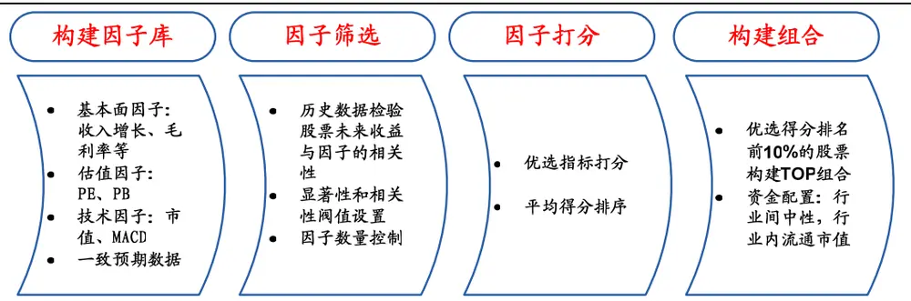
资料来源：海通证券研究所

## 2、单因子选股与多因子选股

日常生活中常提到木桶理论，该理论认为木桶的盛水量取决于桶壁上最短木板。多因子选股策略的原理恰好契合了这一原理，多因子策略希望能选取在各个因子上综合得分较高的股票，并预期这些综合能力强的股票能战胜大盘。

图 2 木桶理论
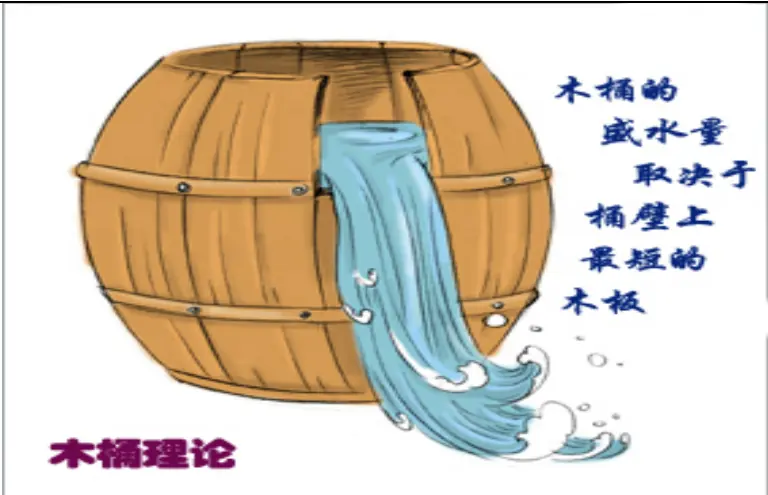
资料来源：海通证券研究所

为了更好的展示多因子策略与单因子策略的区别，我们用下面的例子来说明。表 1展示了 8个股票在 4个因子上的排名及综合排名，我们发现，综合得分最高的 4只股票鲜有在单个因子上表现特别突出的，平均来看综合排名最靠前的股票在各个因子上的排名都处于中上，很少在单个因子上排名特别靠后，按照多因子打分方法，得分最高的 4只股票为 A、B、C、D。

然而按照单因子策略，有效因子是我们通过筛选甄别出来的可指导下期选股的指标，有效因子排名越靠前的股票统计意义上收益越高。因此，单因子策略要求选取各个因子上排名最靠前的股票，选出的股票为 D、E、G、H。

表 1 多因子打分系统

| Factor1 |  | Factor2 Factor3 Factor4 |  |  | Total |
| --- | --- | --- | --- | --- | --- |
| Stock_A | 2 | 3 | 4 | 3 | 12 |
| Stock_B | 4 | 2 | 3 | 5 | 14 |
| Stock_C | 3 | 4 | 2 | 6 | 15 |
| Stock_D | 7 | 6 | 5 | 1 | 19 |
| Stock_E | 8 | 1 | 7 | 4 | 20 |
| Stock_F | 5 | 5 | 8 | 2 | 20 |
| Stock_G | 1 | 7 | 6 | 7 | 21 |
| Stock_H | 6 | 8 | 1 | 7 | 22 |

资料来源：海通证券研究所

在上面的例子中，多因子策略与单因子策略选出股票的重合度仅为 25%，这说明两种方法构建出来的股票组合可能会存在较大的差异。

A 股市场是一个复杂的系统，影响股价的因子之间不存在线性的累加关系，很多时候，单因子上出彩的股票往表现更让人期待，例如：扭亏的股票常有出彩表现，而从财务上看，前期亏损的股票并不是一个好的选择。近几年流行的“斜木桶理论”或许可以解释这一现象，“斜木桶理论”认为木桶放置在一个斜面上的时候，木桶装水的多少就取决于最长的一块板子的长度。

图 3 斜木桶理论—梁山一百单八将
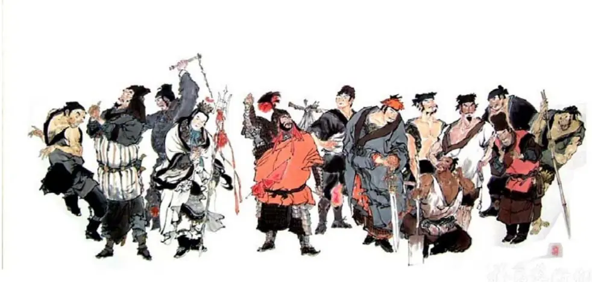
资料来源：海通证券研究所

梁山一百单八将也是斜木桶理论的一个案例，一百零八将大多落草，却都有一技之长，整合在一起亦可和大宋王朝对峙。就单个因子而言，稳定性比不上多因子策略，但只要单因子策略都是长期战胜市场的，将多个单因子策略叠加在一块，即可以起到平滑净值曲线的效果(图 4)。

图 4 单因子多策略原理
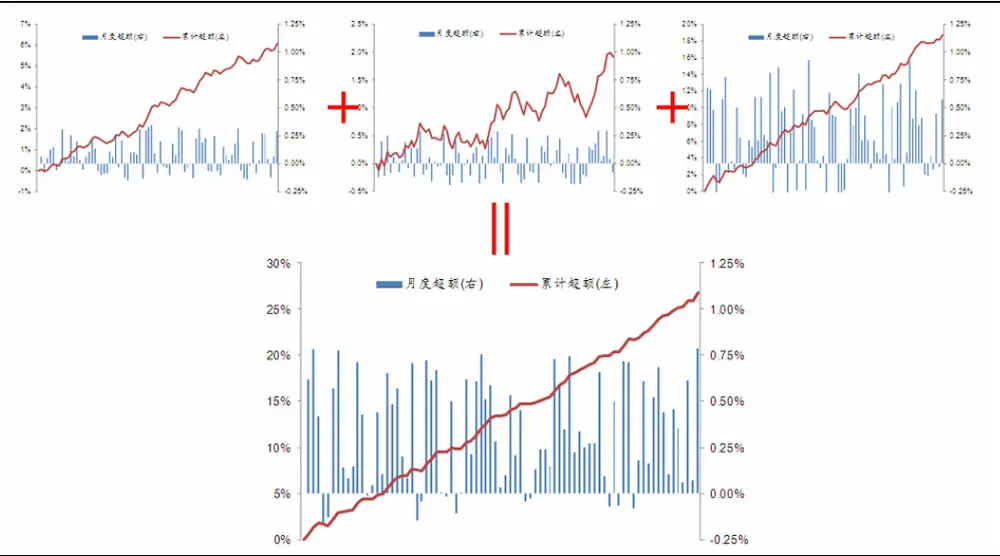
资料来源：海通证券研究所

单因子多策略较之多因子策略，具有以下三点优势：

1）单因子多策略是多个单因子的叠加，挑选有效因子上表现突出的股票，股票数量更多，资金容量更大；

2）多因子策略是选股各因子上综合得分最高的股票，各因子上表现均处于中上的股票容易被选出，而单个因子上表现突出的股票不一定能入选，这个业绩归因造成了一定的困难。单因子多策略在绩效归因上比多因子策略更加简单，子策略的贡献即为单个因子贡献

3）多因子选股策略本质上是一种选股模式。单因子多策略中每个因子代表了一种风格的策略，难以同时持续的失效，这种并行模式可以更好的分散风险，平滑收益曲线。

## 3、单因子的选取与测试

海通多因子模型因子库搭建于 2010年，经过不断的补充完善，目前包含了 30个投资者常用的选股因子，基本实现了股票历史信息与未来信息的全方位覆盖（表 2）。前面提到，单因子策略的稳定性不如多因子，但我们要求单因子策略选中的因子能持续的被筛选为有效因子，即有较高的历史入选率，这样才能保证单因子策略长期能战胜大盘。

表 2 因子库与核心因子

| 盈利能力 | ROA | 偿债能力 | 资产负债率 |
| --- | --- | --- | --- |
|  | ROE | 估值 | PE |
|  | EPS |  | PB |
|  | 毛利率 |  | 一个月收益率 |
|  | 净利润率 |  | 三个月收益率 |
|  | Delta(ROA) |  | 六个月收益率 |
|  | Delta(ROE) | 技术面 | 一个月平均换手率 |
|  | Delta(毛利率) |  | 三个月平均换手率 |
|  | Delta(EPS) |  | 一个月日均成交额 |
|  | Delta(净利润率) |  | MACD |
|  | 主营业务收入增长率 |  | 明年一致预期 EPS 增长率 |
|  | 总资产周转率 |  | 后年一致预期EPS 增长率 |
|  | 每股净资产 | 一致预期 | 明年一致预期 PE |
| 市值 | 流通市值 |  | 后年一致预期PE |
|  | 总市值 |  | 明年一致预期净利润增长率 |

资料来源：海通证券研究所

表 2中用红色标出的 5个因子是相关性角度下入选频率最高的指标，我们称之为核心因子，下面我们对着 5个核心因子进行单因子的测试。

后面进行单因子的检验时，我们会从两个角度进行：

1） TOP100组合：该组合由可交易的（剔除停牌、涨停及上市不满一个月）、处于该因子最极端部分的 100只股票等权重构成，每个月末定期换仓。

2）行业中性组合：该组合由可交易的（剔除停牌、涨停及上市不满一个月）、处于中信行业分类中每个行业该因子最极端部分的 10%的股票构成，行业配置按照当期沪深 300指数的行业分布配置，每个月末定期换仓。

## 3.1 总市值

我们进行两个角度的检验：TOP100 组合由可交易的该因子最极端的 100 只股票等权构成；行业中性组合按照中信行业分类，每个行业选取该因子最极端的 10%数量的股票，并按照沪深 300行业权重配置。策略表现及月度超额收益见图 5-图 8。

图 5 TOP100组合表现（市值）
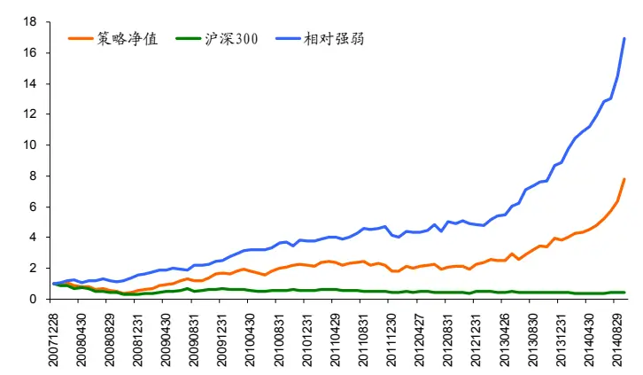

图 6 TOP100组合月超额收益（市值）
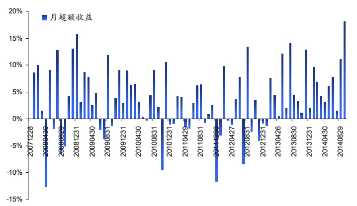

图 7 行业中性组合表现（市值）
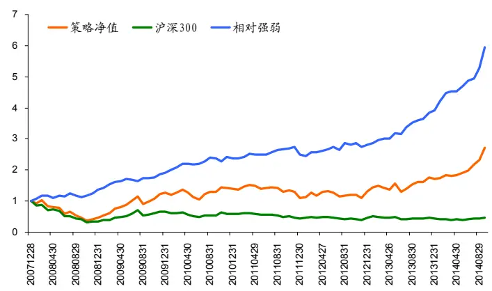
资料来源： 海通证券研究所

图 8 行业中性组合月超额收益（市值）
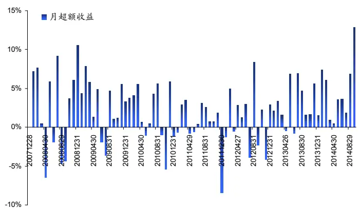

表 3 展示了总市值因子选股策略的表现统计，TOP100 组合每年都能战胜沪深 300指数，年化超额收益为 46.40%，月胜率为 71.60%；行业中性组合每年都能战胜沪深 300指数，年化超额收益为 26.93%，月胜率为 74.07%。

表 3 总市值因子表现统计

| TOP100 组合 |  |  | 行业中性组合 |  |
| --- | --- | --- | --- | --- |
|  | 超额收益 | 胜率 | 超额收益 | 胜率 |
| 2008 | 19.50% | 66.67% | 12.78% | 66.67% |
| 2009 | 117.57% | 75.00% | 77.52% | 83.33% |
| 2010 | 44.18% | 75.00% | 21.32% | 66.67% |
| 2011 | 6.84% | 58.33% | 3.28% | 66.67% |
| 2012 | 19.09% | 41.67% | 13.82% | 58.33% |
| 2013 | 75.87% | 91.67% | 36.25% | 83.33% |
| 201409 | 96.11% | 100.00% | 54.66% | 100.00% |
| 年化 | 46.40% | 71.60% | 26.93% | 74.07% |

资料来源：海通证券研究所

## 3.2 日均成交额

我们进行两个角度的检验：TOP100 组合由可交易的该因子最极端的 100 只股票等权构成；行业中性组合按照中信行业分类，每个行业选取该因子最极端的 10%数量的股票，并按照沪深 300行业权重配置。策略表现及月度超额收益见图 9-图 12。

图 9 TOP100组合表现（日均成交额）
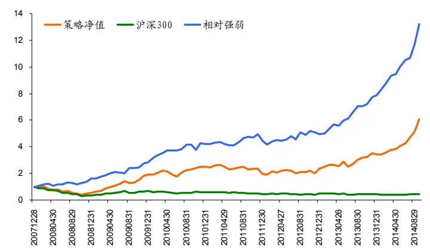

图 10 TOP100组合月超额收益（日均成交额）
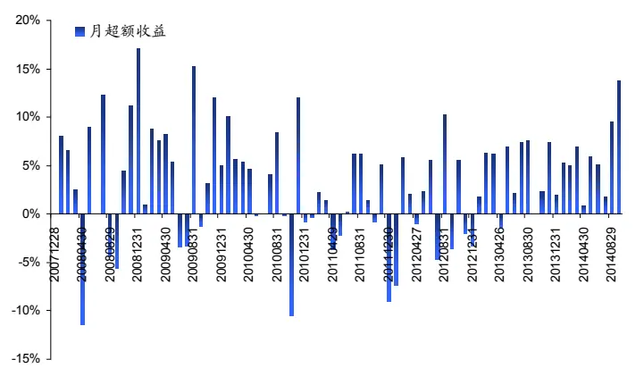

图 11 行业中性组合表现（日均成交额）
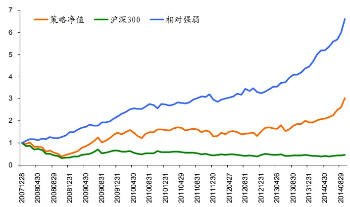
资料来源： 海通证券研究所

图 12 行业中性组合月超额收益（日均成交额）
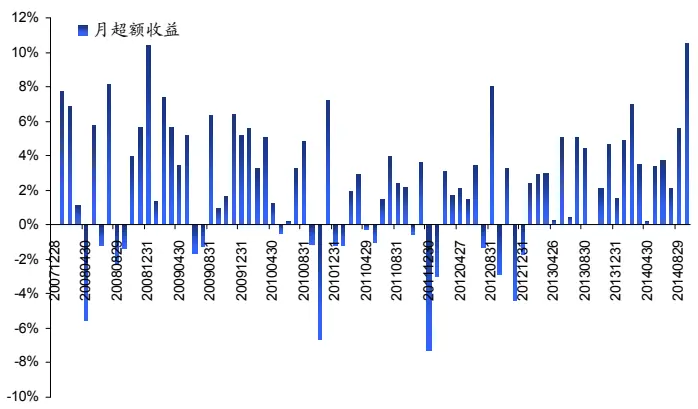

表 4 展示了日均成交额因子选股策略的表现统计，TOP100 组合每年都能战胜沪深300指数，年化超额收益为 41.54%，月胜率为 71.60%；行业中性组合每年都能战胜沪深 300指数，年化超额收益为 28.75%，月胜率为 75.31%。

表 4 日均成交额因子表现统计

| TOP100 组合 |  |  | 行业中性组合 |  |
| --- | --- | --- | --- | --- |
|  | 超额收益 | 胜率 | 超额收益 | 胜率 |
| 2008 | 20.86% | 66.67% | 16.45% | 66.67% |
| 2009 | 151.68% | 75.00% | 95.04% | 83.33% |
| 2010 | 42.01% | 66.67% | 21.29% | 66.67% |
| 2011 | 4.32% | 58.33% | 5.97% | 58.33% |
| 2012 | 10.99% | 50.00% | 11.20% | 58.33% |
| 2013 | 55.58% | 91.67% | 33.60% | 100.00% |
| 201409 | 71.18% | 100.00% | 51.01% | 100.00% |
| 年化 | 41.54% | 71.60% | 28.75% | 75.31% |

资料来源：海通证券研究所

## 3.3 反转

我们进行两个角度的检验：TOP100 组合由可交易的该因子最极端的 100 只股票等权构成；行业中性组合按照中信行业分类，每个行业选取该因子最极端的 10%数量的股票，并按照沪深 300行业权重配置。策略表现及月度超额收益见图 13-图 16。

图 13 TOP100 组合表现（反转）
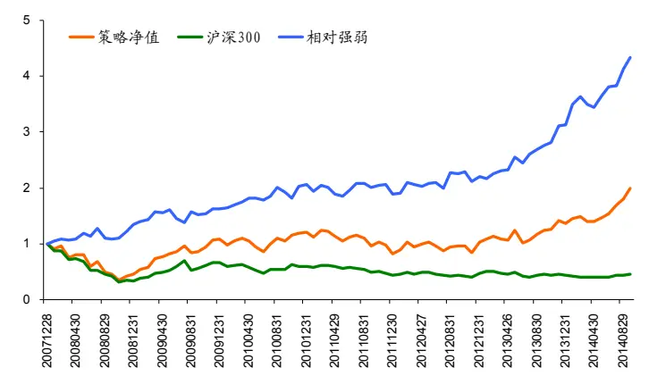

图 14 TOP100组合月超额收益（反转）
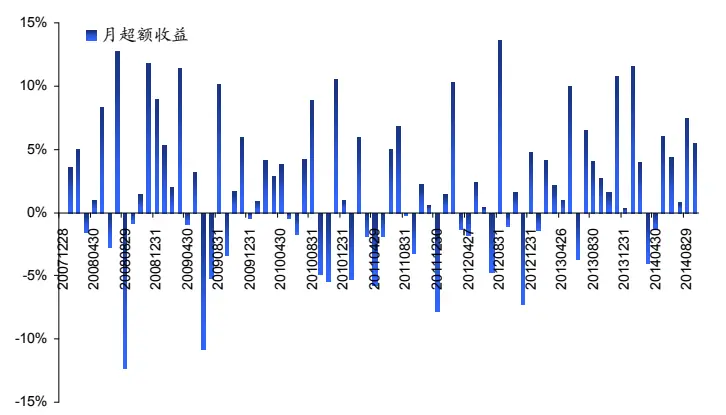

图 15 行业中性组合表现（反转）
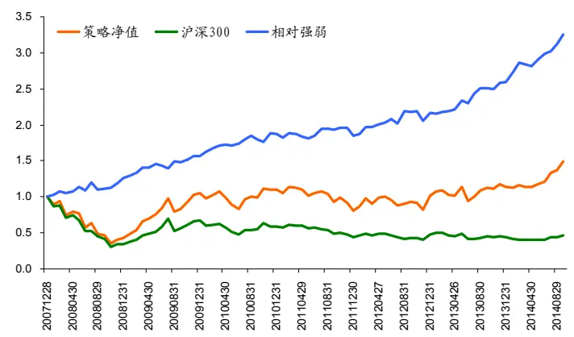
资料来源： 海通证券研究所

图 16 行业中性组合月超额收益（反转）
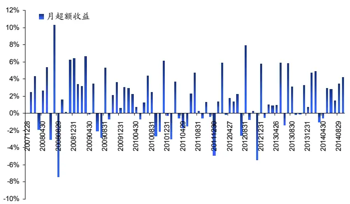

表 5 展示了反转因子选股策略的表现统计，TOP100 组合除 2011 年外每年都能战胜沪深 300 指数，年化超额收益为 21.64%，月胜率为 64.20%；行业中性组合除 2011年外每年都能战胜沪深 300指数，年化超额收益为 17.00%，月胜率为 65.43%。

表 5 反转因子表现统计

| TOP100 组合 |  |  | 行业中性组合 |  |
| --- | --- | --- | --- | --- |
|  | 超额收益 | 胜率 | 超额收益 | 胜率 |
| 2008 | 11.50% | 66.67% | 8.87% | 75.00% |
| 2009 | 41.66% | 58.33% | 48.63% | 66.67% |
| 2010 | 23.40% | 66.67% | 16.89% | 66.67% |
| 2011 | -6.09% | 41.67% | -1.11% | 41.67% |
| 2012 | 17.68% | 58.33% | 18.18% | 66.67% |
| 2013 | 38.74% | 83.33% | 18.80% | 66.67% |
| 201409 | 41.04% | 77.78% | 26.33% | 77.78% |
| 年化 | 21.64% | 64.20% | 17.00% | 65.43% |

资料来源：海通证券研究所

## 3.4 换手率

我们进行两个角度的检验：TOP100 组合由可交易的该因子最极端的 100 只股票等权构成；行业中性组合按照中信行业分类，每个行业选取该因子最极端的 10%数量的股票，并按照沪深 300行业权重配置。策略表现及月度超额收益见图 17-图 20。

图 17 TOP100组合表现（换手率）
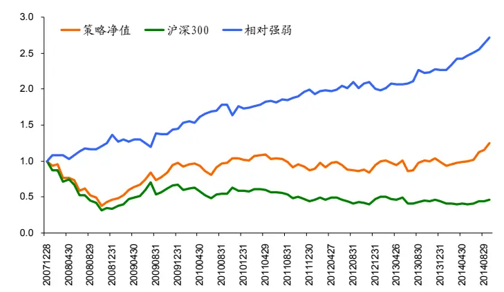

图 18 TOP100组合月超额收益（换手率）
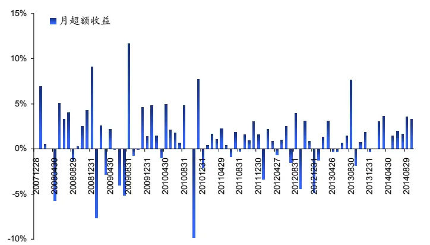

图 19 行业中性组合表现（换手率）
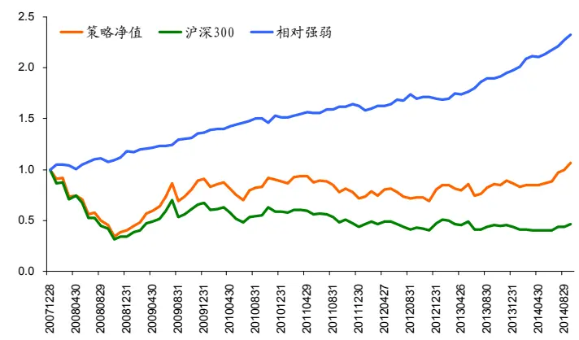
资料来源： 海通证券研究所

图 20 行业中性组合月超额收益（换手率）
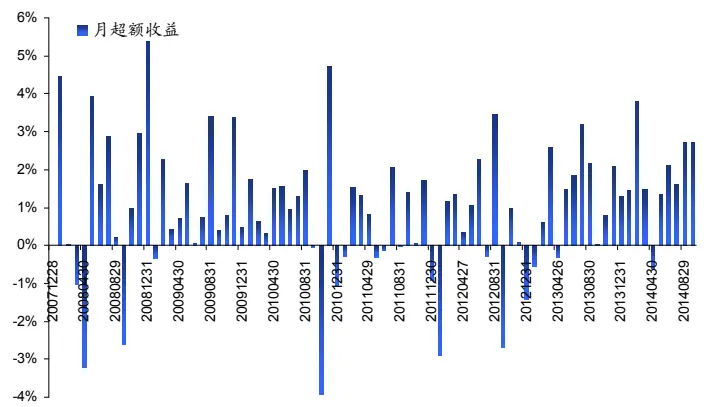

表 6 展示了换手率因子选股策略的表现统计，TOP100 组合每年都能战胜沪深 300指数，年化超额收益为 14.25%，月胜率为 69.14%；行业中性组合每年都能战胜沪深 300指数，年化超额收益为 11.89%，月胜率为 76.54%。

表 6 换手率因子表现统计

| TOP100 组合 |  |  | 行业中性组合 |  |
| --- | --- | --- | --- | --- |
|  | 超额收益 | 胜率 | 超额收益 | 胜率 |
| 2008 | 12.39% | 83.33% | 6.10% | 75.00% |
| 2009 | 12.64% | 41.67% | 30.07% | 91.67% |
| 2010 | 16.87% | 75.00% | 9.89% | 75.00% |
| 2011 | 11.31% | 83.33% | 5.65% | 58.33% |
| 2012 | 0.81% | 58.33% | 4.51% | 66.67% |
| 2013 | 12.10% | 58.33% | 15.45% | 83.33% |
| 201409 | 20.93% | 88.89% | 18.63% | 88.89% |
| 年化 | 14.25% | 69.14% | 11.89% | 76.54% |

资料来源：海通证券研究所

## 3.5 PE

我们进行两个角度的检验：TOP100 组合由可交易的该因子最极端的 100 只股票等权构成；行业中性组合按照中信行业分类，每个行业选取该因子最极端的 10%数量的股票，并按照沪深 300行业权重配置。策略表现及月度超额收益见图 21-图 24。

图 21 TOP100 组合表现（PE）
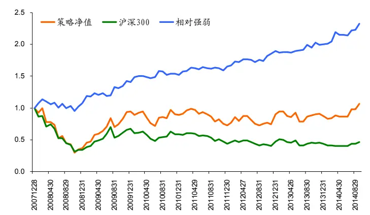

图 22 TOP100 组合月超额收益（PE）
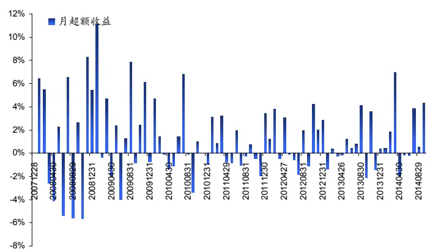

图 23 行业中性组合表现（PE）
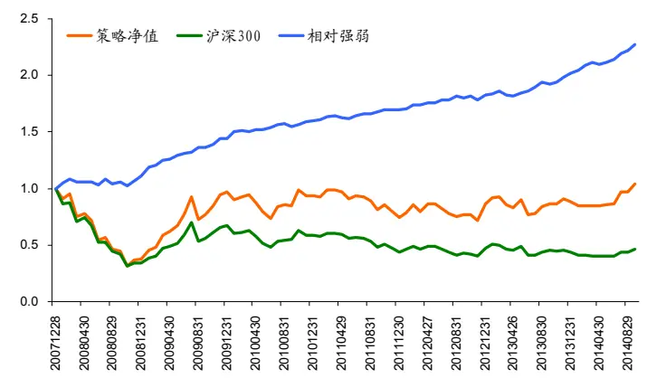
资料来源： 海通证券研究所

图 24 行业中性组合月超额收益（PE）
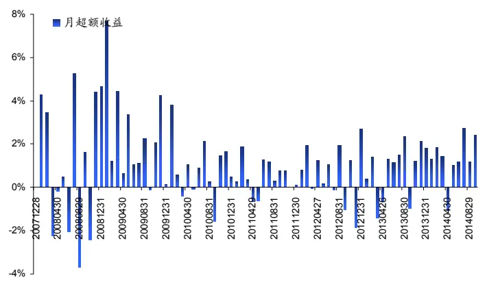

表 7展示了估值因子选股策略的表现统计，TOP100组合每年都能战胜沪深 300指数，年化超额收益为 11.85%，月胜率为55.56%；行业中性组合每年都能战胜沪深 300指数，年化超额收益为 11.53%，月胜率为 76.54%。

表 7 估值因子表现统计

| TOP100 组合 |  |  | 行业中性组合 |  |
| --- | --- | --- | --- | --- |
|  | 超额收益 | 胜率 | 超额收益 | 胜率 |
| 2008 | 2.69% | 58.33% | 3.89% | 58.33% |
| 2009 | 60.62% | 58.33% | 58.02% | 91.67% |
| 2010 | 6.93% | 41.67% | 9.62% | 75.00% |
| 2011 | 6.26% | 50.00% | 4.36% | 83.33% |
| 2012 | 16.19% | 58.33% | 8.32% | 66.67% |
| 2013 | 5.07% | 58.33% | 9.82% | 75.00% |
| 201409 | 16.77% | 66.67% | 13.17% | 88.89% |
| 年化 | 11.85% | 55.56% | 11.53% | 76.54% |

资料来源：海通证券研究所

## 4、单因子多策略组合

我们将 3.1-3.5 中的 5 个单因子 TOP100 组合叠加在一起，构建进取模型。该模型的股票数量在 400-450 只，资金容量大。我们将 3.1-3.5 中的 5 个单因子行业中性组合叠加在一起，构建稳健模型，稳健模型的股票数量比进取模型更多，资金容量更大，由于考虑了行业因素，相对强弱线较之进取模型也更稳定。两个组合的表现见图 25-图 28。

图 25 进取组合表现
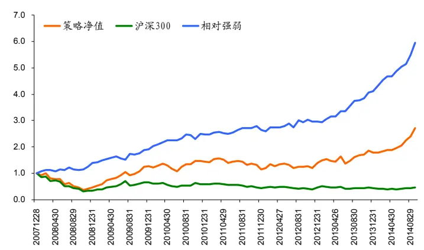

图 26 进取组合月超额收益
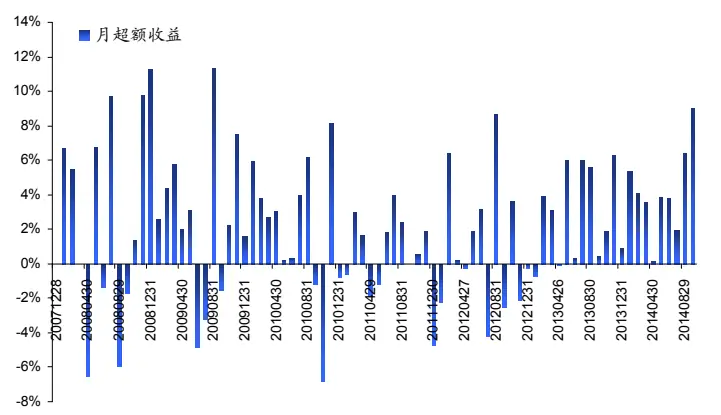

图 27 稳健组合表现
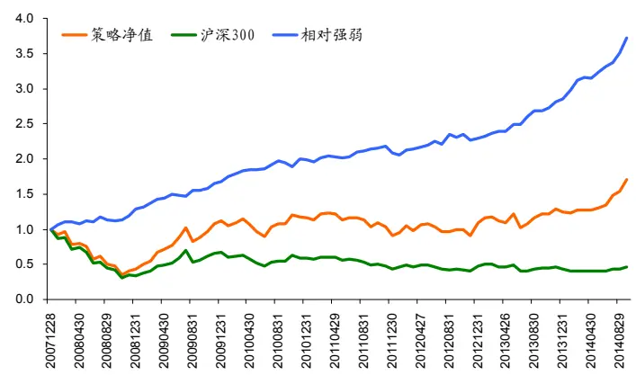
资料来源： 海通证券研究所

图 28 稳健组合月超额收益
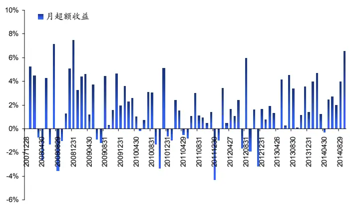

表 8展示了单因子多策略选股组合的表现统计，进取组合每年都能战胜沪深 300指数，年化超额收益为 26.91%，月胜率为70.37%；行业中性组合每年都能战胜沪深 300指数，年化超额收益为 19.16%，月胜率为 74.07%。

表 8 单因子多策略选股组合表现统计

| 进取组合 |  |  | 稳健组合 |  |
| --- | --- | --- | --- | --- |
|  | 超额收益 | 胜率 | 超额收益 | 胜率 |
| 2008 | 13.29% | 58.33% | 9.54% | 58.33% |
| 2009 | 73.57% | 75.00% | 61.26% | 83.33% |
| 2010 | 26.27% | 75.00% | 15.80% | 66.67% |
| 2011 | 4.72% | 58.33% | 3.69% | 66.67% |
| 2012 | 13.31% | 50.00% | 11.29% | 66.67% |
| 2013 | 35.36% | 83.33% | 22.43% | 91.67% |
| 201409 | 47.07% | 100.00% | 31.95% | 88.89% |
| 年化 | 26.91% | 70.37% | 19.16% | 74.07% |

资料来源：海通证券研究所

## 5、选股效果的微观评价

前面我们从年化超额收益、月度胜率等指标来评价选股效果的好坏，但这些指标都相对偏“宏观”，我们可以知道策略的选股效果是不错的。量化选股是希望通过大数定律来实现稳定的超额收益，超额收益、信息比率这些指标不能反映我们选出的一篮子股票是大多数股票战胜了基准，还是少数几个牛股贡献了超额收益，为此我们对选股效果进行如下微观评价。

1）计算每期精选股票、样本空间股票在下期的收益，计算每只精选股票下期收益在样本空间中分位点；

2）将每一期精选股票的分位点合并到一块成为 $P=\left\{p_{1},p_{2},\cdots,p_{n}\right\}$ ，做Logistic 变换得到 $p_{i}^{*}=\ln\left(p_{i}/(1-p_{i})\right)$ ；

3） 构建比较基准：[0,1]均匀分布的 Logistic 变换；

4）比较 2）中 $\boldsymbol{\rho}_{i}^{*}$ 的分布与 3）中基准分布评价选股效果。

图 29 单因子多策略选股效果的微观分解
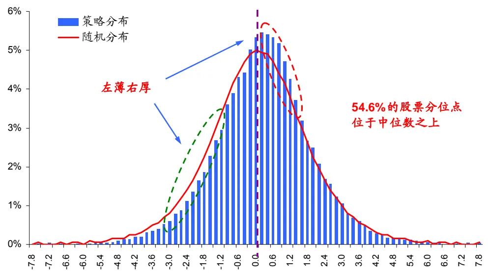
资料来源：海通证券研究所

图 29 展示单因子多策略组合的收益率分位点的分布情况（蓝色柱状图），较之随机抽样生成的基准分布（红色曲线），策略的分位点分布呈现明显的右偏，有 54.6%的股票表现好于中位数，这说明在微观层面，该方法选出的股票具有统计意义上的稳定性。

## 信息披露

分析师声明

吴先兴、张欣慰：金融工程

本人具有中国证券业协会授予的证券投资咨询执业资格，以勤勉的职业态度，独立、客观地出具本报告。本报告所采用的数据和信息均来自市场公开信息，本人不保证该等信息的准确性或完整性。分析逻辑基于作者的职业理解，清晰准确地反映了作者的研究观点，结论不受任何第三方的授意或影响，特此声明。

## 法律声明

本报告仅供海通证券股份有限公司（以下简称“本公司”）的客户使用。本公司不会因接收人收到本报告而视其为客户。在任何情况下，本报告中的信息或所表述的意见并不构成对任何人的投资建议。在任何情况下，本公司不对任何人因使用本报告中的任何内容所引致的任何损失负任何责任。

本报告所载的资料、意见及推测仅反映本公司于发布本报告当日的判断，本报告所指的证券或投资标的的价格、价值及投资收入可能会波动。在不同时期，本公司可发出与本报告所载资料、意见及推测不一致的报告。

市场有风险，投资需谨慎。本报告所载的信息、材料及结论只提供特定客户作参考，不构成投资建议，也没有考虑到个别客户特殊的投资目标、财务状况或需要。客户应考虑本报告中的任何意见或建议是否符合其特定状况。在法律许可的情况下，海通证券及其所属关联机构可能会持有报告中提到的公司所发行的证券并进行交易，还可能为这些公司提供投资银行服务或其他服务。

本报告仅向特定客户传送，未经海通证券研究所书面授权，本研究报告的任何部分均不得以任何方式制作任何形式的拷贝、复印件或复制品，或再次分发给任何其他人，或以任何侵犯本公司版权的其他方式使用。所有本报告中使用的商标、服务标记及标记均为本公司的商标、服务标记及标记。如欲引用或转载本文内容，务必联络海通证券研究所并获得许可，并需注明出处为海通证券研究所，且不得对本文进行有悖原意的引用和删改。

根据中国证监会核发的经营证券业务许可，海通证券股份有限公司的经营范围包括证券投资咨询业务。

海通证券股份有限公司研究所

| 副所长 |  |  |  |  |  |
| --- | --- | --- | --- | --- | --- |
| 路颖所长 (021)23219403 | luying@htsec.com | 高道德 (021)63411586 | gaodd@htsec.com | 姜超 副所长 (021)23212042 | jc9001@htsec.com |
| 江孔亮 所长助理 (021)23219422 | kljiang@htsec.com |  |  |  |  |
| 宏观经济研究团队 |  |  |  |  |  |
| 姜 超(021)23212042 | jc9001@htsec.com | 金融工程研究团队 吴先兴(021)23219449 | wuxx@htsec.com | 金融产品研究团队 单开佳(021)23219448 倪韵婷(021)23219419 | shankj@htsec.com niyt@htsec.com |
| 高 远(021)23219669 | gaoy@htsec.com | 丁鲁明(021)23219068 | dinglm@htsec.com | 罗 震(021)23219326 | luozh@htsec.com |
| 联系人 |  | 郑雅斌(021)23219395 冯佳睿(021)23219732 | zhengyb@htsec.com fengjr@htsec.com | 唐洋运(021)23219004 | tangyy@htsec.com |
| 顾潇啸(021)23219394 王 丹(021) 23219885 | gxx8737@htsec.com wd9624@htsec.com | 朱剑涛(021)23219745 | zhujt@htsec.com | 孙志远(021)23219443 | szy7856@htsec.com |
| 于 博(021) 23219820 | yb9744@htsec.com | 张欣慰(021)23219370 | zxw6607@ htsec.com | 陈 亮(021)23219914 | ci7884@htsec.com |
|  |  | 曾逸名(021)23219773 | zym6586@htsec.com | 陈 瑶(021)23219645 | chenyao@htsec.com wyn6254@htsec.com |
| 固定收益研究团队 |  | 纪锡靓(021)23219948 联系人 | jxj8404@htsec.com | 伍彦妮(021)23219774 桑柳玉(021)23219686 | sly6635@htsec.com |
| 姜 超(021)23212042 |  | jc9001@htsec.com lin@htsec.com 杜 炅(021)23219760 | dg9378@htsec.com | 陈韵骋(021)23219444 | cyc6613@htsec.com |
| 李 宁(021)23219431 周 霞(021)23219807 |  | zx6701@htsec.com 余浩淼(021) 23219883 | yhm9591@htsec.com | 田本俊(021)23212001 | tbj8936@htsec.com |
| 联系人 |  | 沈泽承(021) 23212067 | szc9633@htsec.com | 联系人 |  |
| 张卿云(021)23219445 |  | zqy9731@htsec.com 袁林青(021)23212230 | ylq9619@htsec.com | 冯力(021)23219819 | fl9584@htsec.com |
| 朱征星(021)23219981 |  | zzx9770@htsec.com |  | 宋家骥(021)23212231 | sjj9710@htsec.com |
| 荀玉根(021)23219658 汤 慧(021)23219733 王 旭(021)23219396 瑞(021)23219635 刘 李 珂(021)23219821 | 策略研究团队 | 中小市值团队 xyg6052@htsec.com tangh@htsec.com wx5937@htsec.com Ir6185@htsec.com | 钮宇鸣(021)23219420 ymniu@htsec.com 何继红(021)23219674 孔维娜(021)23219223 kongwn@htsec.com | 政策研究团队 李明亮(021)23219434 hejh@htsec.com 陈久红(021)23219393 吴一萍(021)23219387 | Iml@htsec .com chenjiuhong@htsec.com wuyiping@htsec.com 朱 蕾(021)23219946 zl8316@htsec.com |
| 批发和零售贸易行业 汪立亭(021)23219399 李宏科(021)23219671 路 颖(021)23219403 潘 鹤(021)23219423 | luying@htsec.com | 石油化工行业 wanglt@htsec.com Ihk6064@htsec.com | 邓 勇(021)23219404 王晓林(021)23219812 | 机械行业 龙 华(021)23219411 dengyong@htsec.com 徐志国(010)58067934 wxl6666@htsec.com 熊哲颖(021)23219407 | longh@htsec.com xzg9608@htsec.com xzy5559@htsec.com |
| 非银行金融行业 丁文韬(021)23219944 吴绪越(021)23219947 联系人 王维逸(021)23212209 wwy9630@htsec.com |  | 公用事业 dwt8223@htsec.com 联系人 wxy8318@htsec.com | 张 浩(021)23219383 张一弛(021)23219402 韩佳蕊(021)23212259 | 医药行业 zhangh@htsec.com 周 锐(0755)82780398 余文心(0755)82780398 zyc9637@htsec.com 刘 宇(021)23219608 hjr9753@htsec.com 江 | zr9459@htsec.com ywx9460@htsec.com liuy4986@htsec.com 琦(021)23219685 jq9458@htsec.com 威(0755)82780398 ww9461@htsec.com |
| 钢铁行业 刘彦奇(021)23219391 | liuyq@htsec.com | 赵 健(021)23219472 张显宁(021)23219813 联系人 金 川(021)23219957 | zhaoj@htsec.com zxn6700@htsec.com jc9771@htsec.com | 涂力磊(021)23219747 谢 盐(021)23219436 贾亚童(021)23219421 | tl5535@htsec.com xiey@htsec.com jiayt@htsec.com |
| 陈雪丽(021)23219164 cxl9730@htsec.com |  |  |  |  |  |
| 农林牧渔行业 |  |  |  |  |  |
|  |  |  |  | 基础化工行业 |  |
|  |  | 银行业 |  |  |  |
| 丁 频(021)23219405 | dingpin@htsec.com |  |  |  |  |
|  | xiam@htsec.com |  |  |  |  |
|  |  |  |  | 曹小飞(021)23219267 |  |
|  |  |  |  |  | caoxf@htsec.com |
| 夏 木(021)23219748 |  | 林媛媛(0755)23962186 |  |  |  |
|  |  |  | lyy9184@htsec.com |  |  |
|  |  |  |  | 张 瑞(021)23219634 |  |
|  |  |  |  |  | zr6056@htsec.com |
|  |  |  |  | 朱 睿(021)23219957 | zr8353@htsec.com |
| 联系人 |  |  |  |  |  |
| 计算机行业 有色金属行业 |  |  |  |  |  |
| 陈美风(021)23219409 蒋 科(021)23219474 联系人 王秀钢(010)58067934 安永平(010)58067934 家电行业 | chenmf@htsec.com jiangk@htsec.com wxg8866@htsec.com ayp8320@htsec.com | 钟 奇(021)23219962 施 毅(021)23219480 刘 博(021)23219401 | zq8487@htsec.com sy8486@htsec.com liub5226@htsec.com | 周旭辉(021)23219406 牛 品(021)23219390 陈日华(021)23219716 房 青(021)23219692 徐柏乔(021)23219171 | zxh9573@htsec.com np6307@htsec.com crh9585@htsec.com fangq@htsec.com xbq6583@htsec.com |
| 陈子仪(021)23219244 宋 伟(021)23219949 通信行业 | chenzy@htsec.com sw8317@htsec.com | 社会服务业 林周勇(021)23219389 食品饮料行业 闻宏伟(010)58067941 | lzy6050@htsec.com whw9587@htsec.com | 交通运输行业 虞 楠(021)23219382 树 明(021)23212111 汽车行业 | yun@htsec.com jm9176@htsec.com |
| 徐 力(010)58067940 | xl9312@htsec.com | 马浩博(021)23219822 联系人 成珊(021)23212207 | mhb6614@htsec.com cs9703@htsec.com | 邓学(0755)23963569 廖瀚博(0755)82900477 | dx9618@htsec.com Ihb9781@htsec.com |
| 纺织服装行业 焦娟(021)23219356 唐 苓(021)23212208 | jj9604@htsec.com tl9709@htsec.com | 电子行业 董瑞斌(021)23219816 陈平(021)23219646 | drb9628@htsec.com cp9808@htsec.com | 造纸轻工行业 曾 知(021)23219473 | zz9612@htsec.com |
| 煤炭行业 朱洪波(021)23219438 | zhb6065@htsec.com | 建筑建材行业 周 煜(021)23219972 | zy9445@htsec.com |  |  |

## 海通证券股份有限公司机构业务部

| 陈苏勤 董事总经理 贺振华 董事副总经理 (021)63609993 (021)23219381 chensq@htsec.com hzh@htsec.com |  |  |  |  |
| --- | --- | --- | --- | --- |
| 深广地区销售团队 ctq5979@htsec.com | 上海地区销售团队 | hzh@htsec.com | 北京地区销售团队 |  |
| 蔡铁清 (0755)82775962 | 贺振华(021)23219381 (021)23219384 | jiwj@htsec.com | 赵春 (010)58067977 隋 (010)58067944 | zhc@htsec.com |
| 刘晶晶 (0755)83255933 | liujj4900@htsec.com 季唯佳 (021)23219385 | huxm@htsec.com | 巍 江 虹 (010)58067988 | sw7437@htsec.com |
| 辜丽娟 (0755)83253022 | gulj@htsec.com 胡雪梅 |  | (010)58067929 | jh8662@htsec.com |
| 高艳娟 (0755)83254133 | gyj6435@htsec.com 黃 | 毓(021)23219410 huangyu@htsec.com | 杨 帅 | ys8979@htsec.com |
| 伏财勇 (0755)23607963 | fcy7498@htsec.com 朱 健 (021)23219592 dx7453@htsec.com | zhuj@htsec.com | 张 楠 (010)58067935 | zn7461@htsec.com |
| 邓欣 (0755)23607962 | 黄 慧 (021)23212071 | hh9071@htsec.com | 许 诺 (010)58067931 | xn9554@htsec.com |
|  | 孙 明 (021)23219990 | sm8476@htsec.com |  |  |
|  | 孟德伟 (021)23219989 | mdw8578@htsec.com |  |  |
|  | 黄胜蓝(021)23219386 | hsl9754@htsec.com |  |  |

海通证券股份有限公司研究所

地址：上海市黄浦区广东路 689号海通证券大厦 13楼

电话：(021)23219000

传真：(021)23219392

网址：www.htsec.com