## 选股因子系列研究（九）

## 上市公司薪酬那点事

## 相关研究

| 选股因子系列研究（一）——弱者终有逆 袭日，强势几无持续时 选股因子系列研究（二）—因子模型的 尾部相关性研究 选股因子系列研究（三)——从 Spearman 相关系数出发研究因子有效性——Kalman Filtter模型在因子选择中的应用 选股因子系列研究（四）—多因子选股 模型的失效与有效 选股因子系列研究（五）—寻找股价驱 动新因子之净换手率 选股因子系列研究（六）—极值视角下 的多因子选股策略 2014-05-20 选股因子系列研究（七）—融资推动股 价明显，融券作用有限——融资融券对个 | 2012-07-23 2013-03-25 2013-10-11 2013-10-28 2013-10-31 |
| --- | --- |

## 金融工程首席分析师

高道德

SAC 执业证书编号：S0850511010035

电话：021-23219569

Email：gaodd@htsec.com

## 金融工程高级分析师

郑雅斌

SAC 执业证书编号：S0850511040004

电话：021-23219395

Email：zhengyb@htsec.com

联系人

沈泽承

电话：021-23212067

Email：szc9633@htsec.com

公司薪酬水平一直是众人津津乐道的话题。然而，作为茶余饭后谈资之外，公司薪酬支出反映其经营规模与员工激励。本篇报告，通过公司薪酬水平信息，挖掘其背后的投资机会。

上市公司薪酬水平反映其经营规模与员工激励。在财务水平与人力成本一定的条件下，薪酬水平的增加伴随着公司经营规模的扩张与员工激励的提升。这些因素，可以视为公司经营的积极信号。本文使用薪酬增速与连续增长期数指标，构建投资组合，通过组合收益判断薪酬指标的选股效果。

结果显示，无论是全市场还是剔除小市值股票后的样本空间，应付薪酬增速具有显著的多空股票区分能力；而已付薪酬增速的选股能力并不显著。这是由于应付薪酬指标是公司未来所需支付的薪酬情况，其所包含的奖金、激励等能够更好的刺激员工的预期。

薪酬指标在行业内的选股效果显著。观察应付薪酬增速组合，发现多空组合的超额收益并不是源于行业、市值或者经营现金流的偏离。行业控制下，应付薪酬增速的多空组合收益仍然显著。此外，应付薪酬增速指标在人力开支比重较大的 TMT 行业中，具有最为优秀的选股能力。这一方面是由于薪酬指标相对而言更适用于具有成长性的非周期行业，周期行业的薪酬可能被行业景气度影响；另一方面，TMT 行业的人力成本在其运营成本中占据非常高的比例，故而能够很好的反映公司运营状况。薪酬持续增长的公司，其增长时间和股票收益呈现一定的单调性，但是由于连续增长的公司标的过少，组合收益波动较大，不适合作为单策略运行。

TMT 行业中，薪酬增速的选股组合大幅战胜指数但是，由于组合持股数较少，换仓频率较低，策略的收益回撤比并不高。通过分位点分析的方法对策略的选股结果进行微观考察，发现多空组合的超额收益很大一部分源于薪酬指标能够多次命中行业内收益排名数一数二的牛股。

应付薪酬指标在 TMT 行业中的选股结果显示：其选股逻辑与量化选股积少成多，累计超额收益的思想并不一致，因此单纯使用薪酬指标构建选股模型无法获得满意的收益（多空年化约 5%），但为基于基本面因素挖掘牛股的投资者提供了有益的参考。

每值财报披露，“哪家薪酬高？增幅最大？”便会迅速占领媒体网站头版，成为众人津津乐道的话题。上市公司的薪酬信息，不仅是茶余饭后的谈资，也蕴含了包括经营规模，员工激励等丰富信息。本篇报告中，我们主要研究薪酬不断增长的公司，是否也具有潜在成长性从而带动股价获取超额收益。由于薪酬增长一般而言具有行业特色，我们也将在不同行业中进行区别分析。

## 1. 职工薪酬信息

财务报表中，与职工薪酬相关的项目包括：1）资产负债表中的“应付职工薪酬”，反映当前时点，公司需要支付给职工的薪酬存量；2）现金流量表中的“支付给职工以及为职工支付的现金”，反映本年度公司已经为职工支付的现金流量，为便于描述，简称为“已付职工薪酬”。

上市公司一般于每年 4 月 30 日/8 月 31 日/10 月 31 日前披露其上年年报与一季报/半年报 三季报。截止上述日期，根据财报中的职工薪酬数据，测算薪酬增速与连续增长期数，构建投资组合。通过组合表现，判断职工薪酬指标的选股能力。

## 1.1 模型逻辑

上市公司的薪酬水平反映其经营规模与员工激励。

假设财务状况与单位人力成本不变（可以通过行业划分，横截面比较等方法加以控制），公司提高薪酬支付水平，体现了公司扩大生产规模，提高员工激励的意愿，可以以更高的概率预期该类公司的经营状态在未来将得到提升。因此，薪酬水平的增加可以被视为“积极信号”。

## 1.2 样本数据

本文选取了中国沪深两市 2636 只个股（含退市）财报中披露的“应付职工薪酬”,“已付职工薪酬”以及“员工人数”数据，报告期为 2006 年年报（2006 年 12 月 31 日）至 2014年三季报（2014 年 9 月 30 日）；以及报告期对应交易日（2006 年 4 月 30 日至 2014年 11 月 3日）各股的日复权收盘价与交易状态。

在处理职工薪酬数据时，有三点细节需要注意。

其一，“支付给职工以及为职工支付的现金”项目，反映了公司本年度已经为职工支付的现金流量。因此，当季“已付职工薪酬”等于本期财报的数据与上季度之差。

其二，公司经营具有季节效应。各季度的薪酬数据不能直接比较。本文通过加总过往四期数据，构建滚动财务年度的方法，消除季节效应。

其三，由于借壳等原因，上市公司主体可能发生变化。对于该类公司，其连续两期的数据不能比较。

## 1.3 薪酬指标

定义薪酬增速为消除季节效应后，连续两期薪酬的变化率；连续增长期数为过去薪酬增速为正的最大连续期数，若本期增速小于/等于零，记为零。

具体的计算方法，如下所示：

1. 记上市公司第t季度财报中的“支付给职工以及为职工支付的现金”项目数值为paid ；

“应付职工薪酬”项目数值为 $topay_{t}$ 。第一期为 2006 年年报，t = 1，依此类推。

2. 将“支付给职工以及为职工支付的现金”年内累计数据转换为单季度数据：

$$
ifmod(t,4)=1,\ topay_{t}=topay_{t}
$$

$$
if\quad mod(t,4)\neq1,\quad topay_{t}=topay_{t}-\quad topay_{t-1}
$$

3. 构建滚动财务年度，消除季节效应：

$$
Paid_{i,t}={\sum}_{j=0}^{3}paid_{t-j}.
$$

$$
Topay_{i,t}={\sum}_{j=0}^{3}topay_{t-j}
$$

4. 计算已付/应付职工薪酬增速GR：

$$
GR_{t}^{P}=\frac{Paid_{i,t}}{Paid_{i,t-1}}-1
$$

$$
GR_{t}^{T}=\frac{Topay_{i,t}}{Topay_{i,t-1}}-1.
$$

5. 计算已付/应付薪酬连续增长期数N：

$$
ifGR_{t}^{P}>0\quad N_{t}^{P}=max滙n|GR_{t+1-j}^{P}>0,\forall1\leq j\leq n)
$$

$$
if\;GR_{t}^{T}>0\quad N_{t}^{P}=max连n|GR_{t+1-j}^{T}>0,\forall\;1\leq j\leq n)
$$

$$
else\quad N_{t}^{P}=0;\quad N_{t}^{T}=0
$$

此外，在计算薪酬规模指标的同时，将第一步的薪酬规模替换为人均薪酬，就能得到对应的人均薪酬指标。

## 1.4 投资组合

计算薪酬增速与连续增长期数之后，从选股指标，样本空间以及换仓时点三个维度构建投资组合。

## 薪酬指标

按已付/应付薪酬，规模/人均，增速/连续增长期数的分类，共计构建了 8 项薪酬指标。通过逐一测试，判断各项指标的有效性。

## 样本空间

由于公司所处行业对其薪酬体系有着重大影响，按一级行业分类，分别对全市场以及各行业两类样本空间进行考察。

## 选股标准

对于薪酬增速，定义样本空间内当期薪酬增速前/后 10%的个股组合为多头/空头组合。为保证结论的稳健性，要求所选组合内个股数下限为 5 只。。

对于薪酬连续增长期数，根据当期薪酬连续增长期数 N，将个股组合分为若干组，为保证组合内的个股数量，本文中取 N=0；N=1；N=2；N=3；N>3。

## 换仓时点

每年 4 月 30 日，8 月 31 日以及 10 月 31 日为上市公司披露季（年）报的截止日。因此，我们于这三个时间节点的后一个交易日调整组合，并以当日收盘价作为交易价格。

## 2. 薪酬增速的选股能力

按照上述标准，建立滚动投资组合。为消除季节效应，样本损失了四期财报数据，因此组合建仓时点为 2008 年 5 月 5 日；截至样本期间最后一日，2014 年 11 月 3 日，共计 20期，1580 个观测值。

回测显示，应付职工薪酬增速在添加行业控制前后均有显著的选股能力；而已付薪酬指标，在各样本空间下的选股效果并不显著。

## 2.1 全市场选股

根据应付/已付职工薪酬规模/人均薪酬增速，于各换仓日，在全市场可交易个股中，选取增速前/后 10%的个股，等权加总，构建多头/空头组合。

表 1 为全市场下，应付/已付职工薪酬规模/人均薪酬增速多头/空头/多空组合的月均收益率以及多空收益的 T 检验统计量。

表 1全市场薪酬增速指标多头/空头/多空组合月均收益

|  | 应付/规模 | 应付/人均 | 已付/规模 | 已付/人均 |
| --- | --- | --- | --- | --- |
| 多头组合月均 | 1.66% | 1.69% | 1.53% | 1.44% |
| 空头组合月均 | 1.22% | 1.20% | 1.41% | 1.38% |
| 多头-空头 | 0.44% | 0.48% | 0.12% | 0.06% |
| T-统计量 | 2.4828* | 3.2634* | 0.5028 | 0.3403 |

资料来源：海通证券研究所

图 1 为全市场应付/已付薪酬规模/人均增速多空组合净值的相对强弱。
图 1全市场薪酬增速指标多空组合相对强弱
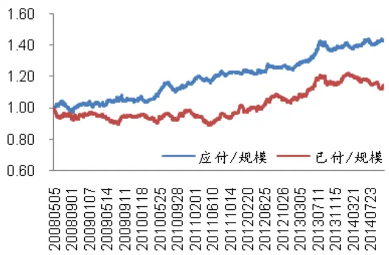
资料来源：海通证券研究所

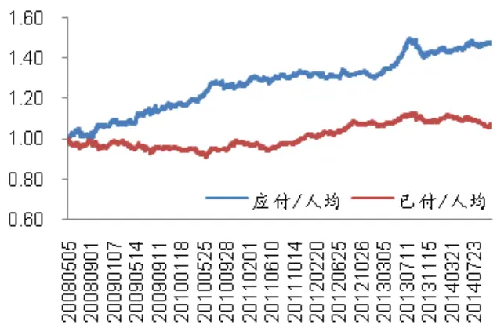

图 1 中的结论与表 1 一致：在全市场中，应付薪酬增速组合多空差异显著且稳定；已付薪酬增速组合多空差异不显著。

Fama/French 在《甄别市场异象》一文（Fama, E. and French, K. (2008) Dissectinganomalies. Journal of Finance 63, 1653—1678）中指出；小市值/低流动性个股（即microcap，市值小于 NYSE上市公司 20%分位点的个股组合）存在异于其余个股的异象；在业绩归因时，应区别对待。

考虑到 microcap 样本的干扰，定义市值小于沪深主板市场 20%分位点的个股为 A股市场的 microcap 样本，并在剔除 microcap样本后考察薪酬增速指标的选股能力。在剔除 microc样本后，平均每期可供选择的个股数量缩减至 1601 只，约占总体的 75%。

表 2 为剔除 microcap 样本后，应付/已付职工薪酬规模/人均薪酬增速多头/空头/多空组合的月均收益率以及多空收益的 T 检验统计量。

表 2剔除 microcap后薪酬增速指标多头/空头/多空组合月均收益

|  | 应付/规模 | 应付/人均 | 已付/规模 | 已付/人均 |
| --- | --- | --- | --- | --- |
| 多头组合月均 | 1.34% | 1.40% | 1.20% | 1.09% |
| 空头组合月均 | 0.87% | 0.90% | 1.05% | 1.16% |
| 多头-空头 | 0.48% | 0.51% | 0.15% | -0.07% |
| T-统计量 | 2.8824* | 3.5107* | 0.6372 | -0.4280 |

资料来源：海通证券研究所

图 2 为剔除 microcap 后，应付/已付薪酬规模/人均增速多空组合净值的相对强弱。

图 2剔除 microcap后薪酬增速指标多空组合相对强弱
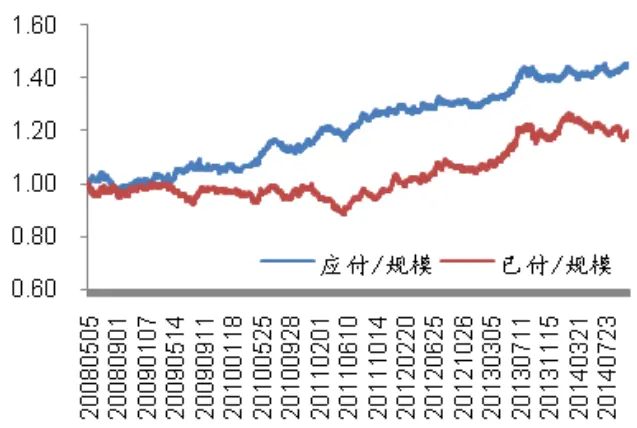
资料来源：海通证券研究所

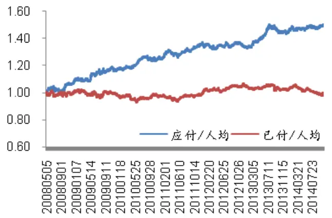

图 2 结论与表 2一致：剔除 microcap 后，应付薪酬增速的选股效果仍然显著，且显著性水平小幅上升；已付薪酬增速组合的多空差异仍不显著。

综上所述，就选股能力而言，“应付职工薪酬指标”优于“已付职工薪酬指标”。这是由于，应付职工薪酬反映公司未来将要支付的薪酬水平，其所包含的奖金、激励等能够更好的刺激员工的预期。；而已付职工薪酬反映了公司过去的薪酬支付信息。

同时，薪酬规模增速与人均薪酬增速指标的选股效果并无显著差距。这是由于，一般上市公司的员工人数仅在年报中披露；分母的固定，使得一个滚动财务年度中，有 3期薪酬规模增速与人均薪酬增速相同。因此，两类指标无本质差别。

## 2.2 组合微观考察

薪酬变化与公司所处行业/行业发展阶段息息相关。直觉上，处于高景气度/快速发展行业的公司，其薪酬增速可能快于处于行业萧条/发展缓慢行业的公司。那么，全市场多空组合的超额收益是否源于应付薪酬增速指标的行业偏离呢？

按一级行业分类（下同），考察应付薪酬规模/人均薪酬增速多头/空头组合内个股的行业分布。样本期间，应付薪酬增速指标多头 空头组合累计平均选入个股 只，平均每期各组合内个股数为 153 只。统计各行业中个股入选多头/空头组合的个数，两者相减得到多头/空头组合内个股的行业偏离情况。图 3 统计了应付薪酬指标多头/空头组合内偏离最大的 6 个行业，其中左图对应应付薪酬规模；右图对应应付人均薪酬。

图 3应付薪酬指标多头/空头组合行业偏离
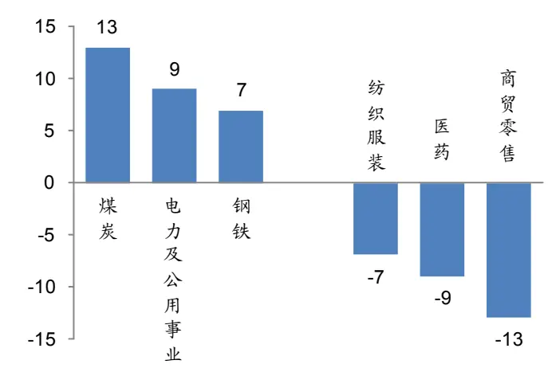
资料来源：海通证券研究所

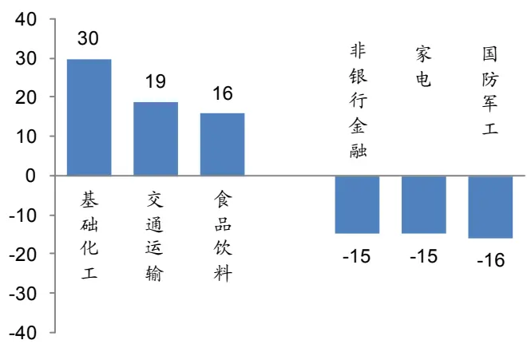

以应付人均薪酬组合中偏离最大的基础化工行业为例：样本期间，入选多头组合的基础化工行业公司比入选空头的多 30 家，平均每期多空偏差为 1.5 家，而每期入选多头/空头组合的个股数约为 150 家。因此，多空组合的超额收益与行业偏离无关。

同样，实证研究发现，相对大市值股票，小市值股票有显著的溢价。因此，多空组合的超额收益也可能源于市值效应。

图 4 应付薪酬指标多头/空头组合市值分位点分布
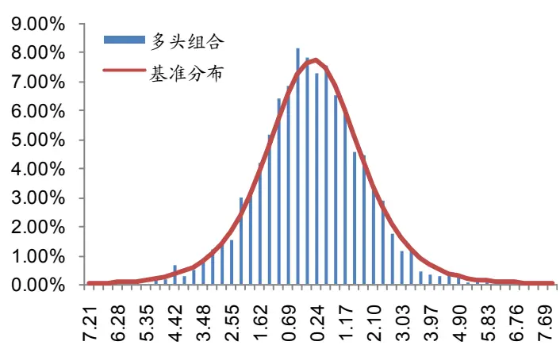
资料来源：海通证券研究所

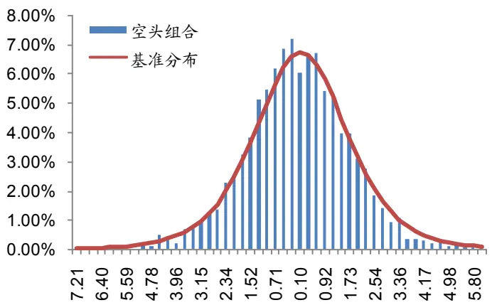

图 4 为应付薪酬指标多头/空头组合市值分位点分布情况。如图所示，多头/空头组合的市值分布与基准分布一致。因此，多空组合超额收益与市值效应无关。

此外，应付职工薪酬作为负债项目，可能会选到经营状况不佳，负债高企的个股。为此，我们考察组合内经营性现金流净额的分位点分布。

图 5 应付薪酬指标多头/空头组合经营性现金流净额分位点分布
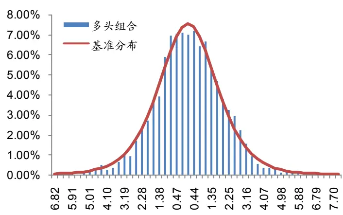
资料来源：海通证券研究所

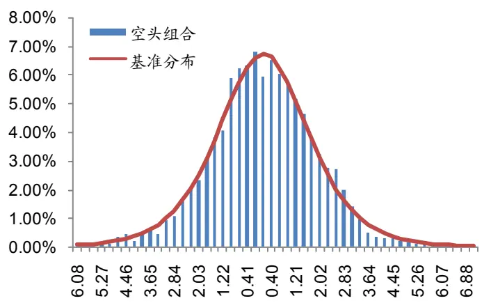

图 5 为应付薪酬指标多头/空头组合经营性现金流净额的分位点分布情况。如图所示，多头/空头组合的市值分布与基准分布一致。因此，应付职工薪酬指标并不会偏向经营性现金流净额较好/较差的个股。

## 2.3 行业控制

应付薪酬增速指标在全市场中具有显著的选股能力。但是，多空组合的超额收益并非来自于行业偏离。因此，继续深入挖掘，通过行业控制，考察薪酬增速指标行业内的选股效果。定义各行业内薪酬增速指标前/后 10%的组合为多头/空头组合；为保证结果的稳定性，若组合内个股不足 5 只，补足至 5只。

根据行业内多空选股的结果，构建行业控制下的多头/空头/多空组合：每次换仓，各行业等权加总，行业内等权加总。表 3 为行业控制下应付/已付职工薪酬规模/人均薪酬增速多头/空头/多空组合的月均收益率以及多空收益的 T 检验统计量。

表 3行业控制下薪酬增速指标多头/空头/多空组合月均收益

|  | 应付/规模 | 应付/人均 | 已付/规模 | 已付/人均 |
| --- | --- | --- | --- | --- |
| 多头组合月均 | 1.26% | 1.25% | 1.18% | 1.13% |
| 空头组合月均 | 0.86% | 0.95% | 1.05% | 1.16% |
| 多头-空头 | 0.41% | 0.30% | 0.13% | -0.03% |
| T-统计量 | 2.8335* | 2.2235* | 0.7370 | -0.2180 |

资料来源：海通证券研究所

图 4 为添加行业控制后，应付/已付薪酬规模/人均增速多空组合净值的相对强弱。与表 3结论类似：添加行业控制后，应付薪酬增速在行业内仍有出色的选股效果；而已付薪酬增速行业内的选股效果仍不显著。

图 6剔除 microcap后薪酬增速指标多空组合相对强弱
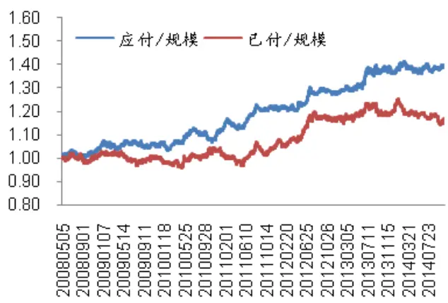
资料来源：海通证券研究所

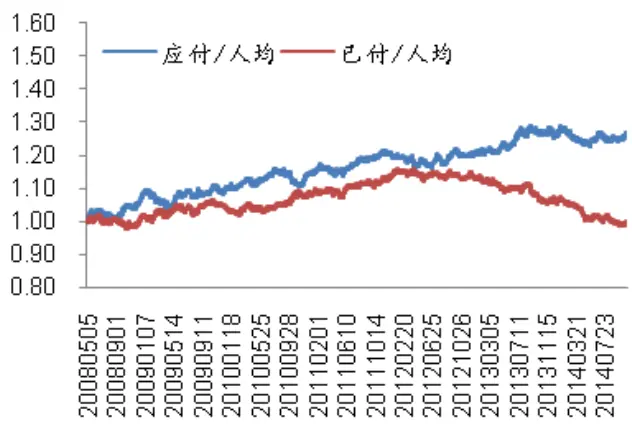

此外，考察应付薪酬增速指标在不同行业分类中的选股效果。同样为了避免因行业内样本过少，导致结果波动，将行业分为 TMT，周期，制造，能源，消费与金融六类。考察各类内部，应付薪酬规模增速指标的选股效果。

表 4行业控制下薪酬增速指标多空组合月均收益（续）

| 行业分类 | 多空月均 | T-统计量 | 所属行业 |
| --- | --- | --- | --- |
| TMT | 1.00% | 2.6646* | 传媒/电子/计算机/通信 |
| 周期 | 0.06% | 0.1680 | 交运/农林/建筑/建材/综合 |
| 制造 | 0.40% | 1.7023 | 军工/化工/机械/汽车/轻工/电力设备 |
| 能源 | 0.37% | 1.2538 | 有色/煤炭/电力/石油石化/钢铁 |
| 消费 | 0.43% | 1.7778 | 商贸/医药/家电/纺服/食品/旅游 |
| 金融 | -0.30% | -0.9992 | 房地产/银行/非银金融 |

资料来源：海通证券研究所

如表 4 所示，应付薪酬增速指标在 TMT 行业中的选股效果最为显著。这极可能是由于：TMT 行业的人力开支占经营支出的比例是所有行业大类中最高的。薪酬指标能够更好的反映公司的运营状况，从而找到处于成长周期的标的。行业内的具体选股效果分析见后文。

## 2.4 行业中性组合

添加行业控制后，应付职工薪酬指标选股效果仍然显著。考虑到目前A股市场对冲工具稀缺，个股融券受限，我们按照沪深 300 指数的行业权重，调整多头组合的行业分布，并对冲指数，构建行业中性的多空组合。

图 5 为行业中性组合相对沪深 300 指数净值与月超额收益。如图所示，行业中性组合明显优于沪深 300 指数。组合月胜率为 66.7%，换仓期胜率为 65%，年化超额收益为 14.55%。但长持仓，低换手导致组合波动较大，最大回撤 13.48%，收益回撤比 1.08。

图 7行业中性组合相对沪深 300指数净值与月超额收益
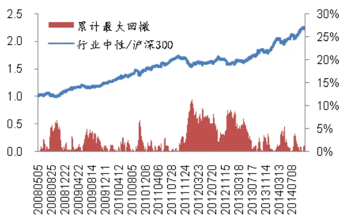
资料来源：海通证券研究所

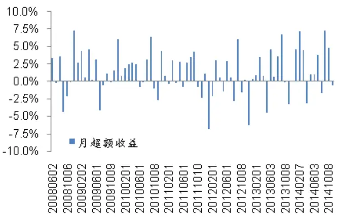

从行业中性/指数的相对强弱可以看出，组合在 2011 年 11 月至 2012 年 5 月这一期中出现了巨大的回撤。分析原因，沪深 300 指数中金融行业占比较高，而薪酬指标在金融行业中的选股效果最差，使得组合具有较大的波动性.

图 6 为行业中性组合相对中证 500 指数净值与月超额收益。如图所示，行业中性组合明显优于中证 500 指数。组合月胜率为 64.1%，换仓期胜率为 85%，但年化超额收益仅为 7.40%，最大回撤 5.38%，收益回撤比 1.36。

图 8行业中性组合相对中证 500指数净值与月超额收益
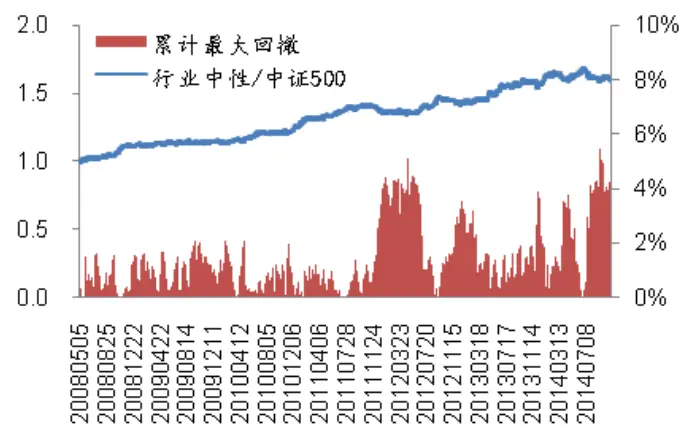
资料来源：海通证券研究所

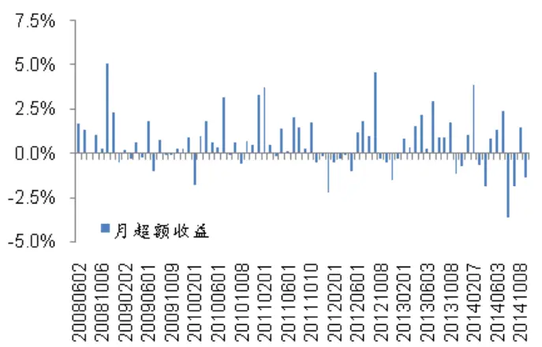

中证 500 指数的金融行业占比显著下降，行业中性组合的稳健性显著上升，但多空超额收益有限。因此，薪酬因子不具备单独构建投资组合的能力。

## 2.5 本章小结

应付薪酬/人均薪酬增速有稳健显著的选股能力；应付薪酬指标多空组合的超额收益与行业偏离，市值效应等因素无关，对经营性现金流指标也无显著偏向；行业控制下，应付薪酬增速指标选股能力仍然稳健，且在 TMT 行业中的选股效果最为突出；按照行业权重构建行业中性组合。组合显著优于沪深 300 指数/中证 500 指数。

## 3. 薪酬连续上涨的鉴股能力

上一章中，我们从横截面角度分析了薪酬增速的选股效果。本章中，我们从时间序列角度，考察薪酬水平连续增长的上市公司是否会有超额收益。

定义薪酬连续增长期数 N，并将个股分为 N=0；N=1；N=2；N=3:；N>3 五组。由于计算连续增长期数需要 4 期的财务数据，将样本期缩减至 2009 年 5 月 4 日至 2014年 11 月 3日，共计 1336 个观测值。

回测显示，各薪酬指标下，组合收益随连续增长期数增加而上升。但从显著性与稳定性角度看，连续增长期数指标的选股效果并不显著、稳健，这与标的数量的锐减有较大关系。

## 3.1 全市场选股

表 5 为应付/已付职工薪酬/人均薪酬各连续增长期数组合的月均收益率。如表 6 所示，在各指标下，组合月均收益随连续增长期数的增加而上升。但从显著性看，仅有应付人均薪酬指标的多空差异显著。

表 5连续增长期数多头/空头/多空组合月均收益

|  | 应付/规模 | 应付/人均 | 已付/规模 | 已付/人均 | 个股数量 |
| --- | --- | --- | --- | --- | --- |
| N=0 | 1.10% | 1.16% | 1.17% | 1.21% | 731 |
| N=1 | 1.29% | 1.24% | 1.28% | 1.27% | 392 |
| N=2 | 1.42% | 1.34% | 1.18% | 1.22% | 199 |
| N=3 | 1.39% | 1.46% | 1.22% | 1.23% | 118 |
| N>3 | 1.43% | 1.59% | 1.31% | 1.38% | 60 |
| (N>3)-(N=0) | 0.23% | 0.43% | 0.14% | 0.17% | - |
| T-统计量 | 1.8608 | 2.3944* | 0.7996 | 1.4426 | - |

资料来源：海通证券研究所

图 7 为应付/已付职工薪酬/人均薪酬各连续增长期数多空组合的相对强弱。如图所示，在表 5 中多空区别最为显著的人均应付薪酬增长期数指标，其多空收益主要源于2009 年 5 月至 11 年 4月，此后多空收益并不明显。

图 9连续薪酬增长期数 N>3/N=0组合相对强弱
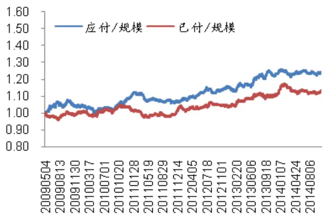
资料来源：海通证券研究所

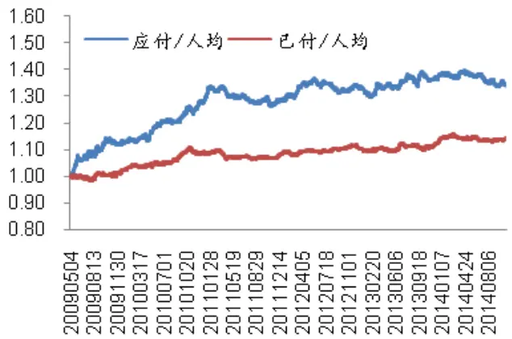

综上所述：组合月均收益随薪酬连续增长期数增加而上升。但是，薪酬连续增长期数指标下多空组合收益或不显著或不稳定。这主要是由于能够连续多期保持薪酬上涨的公司数量过少，对于构建投资组合而言投资不够分散会导致风险增大。

## 3.2 行业控制

和前文一样，通过行业控制的方法，可以判断薪酬连续增长期数指标在行业内的选股效果。但是，由于连续增长期数的划分标准过于苛刻，导致在部分行业中，难以选到甚至无法选出股票。因此，行业控制下的回测结果并不具有参考意义。

## 3.3 本章小结

全市场下，组合收益随连续增长期数增加而上升；但指标的选股效果并不显著 稳定。同时，由于连续增长期数的划分标准过于苛刻，在部分行业中可能无法选到足够数量的个股，其行业内的选股效果有待进一步挖掘。

## 4. TMT 行业

前面的研究中我们发现应付薪酬增速指标在全市场/行业内都有显著稳定的选股能力，其中在人力开支占经营开支比例最高的 TMT 行业中尤为显著；而全市场下，连续增长期数与组合收益呈正相关，但这种相关性不及薪酬增速指标显著/稳定。

本章就应付职工薪酬指标，构建 TMT 行业组合，考察组合内个股特征。由于规模/人均薪酬增速指标并不显著差异，后文的分析以应付薪酬规模增速为例。

## 4.1 组合收益

TMT 行业组合的构建与行业控制组合类似。于各换仓日，选取电子/通信/计算机/传媒各行业可交易的个股中选取应付职工薪酬增速前 10%的个股（若不足 5只，补足至 5只）等权加总，构建行业组合；各行业组合等权加总，构建 TMT 组合。样本期间组合平均持有个股约 22 只。同时，采用同样的方法，根据中信电子/通信/计算机/传媒行业指数，构建 TMT 指数，业绩基准。

图 8 为 TMT 组合相对行业指数的净值走势。相对行业指数，组合月胜率为 70.6%，换仓期胜率为 70%，年化超额收益为 12.76%，最大回撤 9.38%，收益回撤比为 1.36。

图 10TMT组合相对行业指数净值与月超额收益
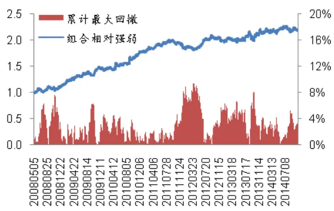
资料来源：海通证券研究所

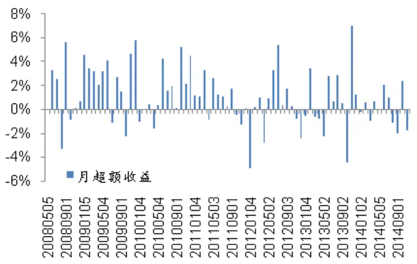

如图 8所示，应付薪酬指标组合优于 TMT 行业指数。但是，由于组合具有持股少，

换手率低等特征，策略波动较大，最大回撤接近 10%，收益回撤比仅为 1.36。

## 4.2 个股特征

考察 组合的微观结构，我们发现更加有意思的现象。图 为组合内个股收益率相对各自行业的分位点分布。收益率分位点分布的均值为 0.24，中位数为 0.10，偏度为 0.44。并没有显著的右偏现象。

图 11TMT组合内股各期收益率分位点分布
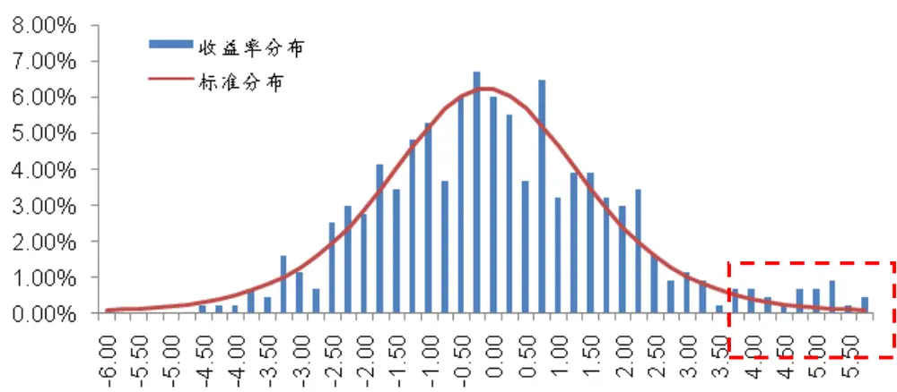
资料来源：海通证券研究所

但是，如图中右侧红框所示，分布右侧（>4）出现明显的厚尾现象，对应原分布的分位点为 0.978。可以计算，收益率分布的 95%分位点为 3.81。考虑到 TMT 中各行业内可供选择的个股约为 50 至 120 只，也就是说，组合中 5%的个股是在行业内收益率排名数一数二的个股。据统计，几乎每期组合都能命中一只行业涨幅最大的“牛股”。

从职工薪酬增速指标的选股逻辑来看，所选公司具有经营规模快速扩张 员工激励大幅提升的特点。而 行业中的“牛股”往往也具备这类特征。通过深入挖掘薪酬指标组合的收益来源，我们发现其指向的是新兴行业中，可以预期高速成长的上市公司。通过此类公司超高的收益率，获得超额收益。

这虽与传统量化选股中的“积少成多”原则相违背，因此单纯使用薪酬指标量化选股并不能获得满意的收益（多空年化超额约 5%）。但是，对于试图通过基本面分析挖掘牛股的投资者提供了重要的参考。

表 6 为最新一期应付职工薪酬增速 TMT 组合股票名单，供参考。

表 6最新一期应付薪酬增速 TMT组合股票名单

| 证券代码 | 证券简称 | 证券代码 | 证券简称 | 证券代码 | 证券简称 |
| --- | --- | --- | --- | --- | --- |
| 000049 | 德赛电池 | 002439 | 启明星辰 | 300339 | 润和软件 |
| 000050 | 深天马 A | 002445 | 中南重工 | 600171 | 上海贝岭 |
| 000681 | 视觉中国 | 002527 | 新时达 | 600206 | 有研新材 |
| 000997 | 新大陆 | 300032 | 金龙机电 | 600386 | 北巴传媒 |
| 002161 | 远望谷 | 300050 | 世纪鼎利 | 600536 | 中国软件 |
| 002174 | 游族网络 | 300088 | 长信科技 | 600661 | 新南洋 |
| 002195 | 海隆软件 | 300131 | 英唐智控 | 600764 | 中电广通 |
| 002281 | 光迅科技 | 300168 | 万达信息 |  |  |
| 002389 | 南洋科技 | 300251 | 光线传媒 |  |  |

资料来源：海通证券研究所

## 4.3 本章小结

根据应付薪酬规模指标构建的 TMT 组合明显优于行业指数，但少股票低换手的组合特征具有较大风险。

通过微观考察，TMT 组合的超额收益很大一部分来自于能够成功挖掘新兴行业中的“牛股”。这与传统量化选股的“积少成多”思想略有出路。单纯使用薪酬指标构建量化组合可能并不能获得满意的收益，但为试图通过基本面分析挖掘牛股的投资者提供了重要的参考。

## 信息披露

分析师声明

高道德、郑雅斌：金融工程

本人具有中国证券业协会授予的证券投资咨询执业资格，以勤勉的职业态度，独立、客观地出具本报告。本报告所采用的数据和信息均来自市场公开信息，本人不保证该等信息的准确性或完整性。分析逻辑基于作者的职业理解，清晰准确地反映了作者的研究观点，结论不受任何第三方的授意或影响，特此声明。

## 法律声明

本报告仅供海通证券股份有限公司（以下简称 本公司 ）的客户使用。本公司不会因接收人收到本报告而视其为客户。在任何情况下，本报告中的信息或所表述的意见并不构成对任何人的投资建议。在任何情况下，本公司不对任何人因使用本报告中的任何内容所引致的任何损失负任何责任。

本报告所载的资料、意见及推测仅反映本公司于发布本报告当日的判断，本报告所指的证券或投资标的的价格、价值及投资收入可能会波动。在不同时期，本公司可发出与本报告所载资料、意见及推测不一致的报告。

市场有风险，投资需谨慎。本报告所载的信息、材料及结论只提供特定客户作参考，不构成投资建议，也没有考虑到个别客户特殊的投资目标、财务状况或需要。客户应考虑本报告中的任何意见或建议是否符合其特定状况。在法律许可的情况下，海通证券及其所属关联机构可能会持有报告中提到的公司所发行的证券并进行交易，还可能为这些公司提供投资银行服务或其他服务。

本报告仅向特定客户传送，未经海通证券研究所书面授权，本研究报告的任何部分均不得以任何方式制作任何形式的拷贝、复印件或复制品，或再次分发给任何其他人，或以任何侵犯本公司版权的其他方式使用。所有本报告中使用的商标、服务标记及标记均为本公司的商标、服务标记及标记。如欲引用或转载本文内容，务必联络海通证券研究所并获得许可，并需注明出处为海通证券研究所，且不得对本文进行有悖原意的引用和删改。

根据中国证监会核发的经营证券业务许可，海通证券股份有限公司的经营范围包括证券投资咨询业务。

海通证券股份有限公司研究所

| 路颖所长 (021)23219403 | 高道德 副所长 |  |  | 姜超 副所长 (021)23212042 | jc9001@htsec.com |
| --- | --- | --- | --- | --- | --- |
|  | luying@htsec.com | (021)63411586 | gaodd@htsec.com |  |  |
| 江孔亮 所长助理 (021)23219422 | kljiang@htsec.com |  |  |  |  |
| 宏观经济研究团队 姜 超(021)23212042 顾潇啸(021)23219394 联系人 王 丹(021) 23219885 于 博(021) 23219820 固定收益研究团队 姜 超(021)23212042 | jc9001@htsec.com gxx8737@htsec.com wd9624@htsec.com yb9744@htsec.com | 金融工程研究团队 吴先兴(021)23219449 丁鲁明(021)23219068 郑雅斌~(021)23219395 冯佳睿(021)23219732 朱剑涛(021)23219745 张欣慰(021)23219370 曾逸名(021)23219773 纪锡靓(021)23219948 | wuxx@htsec.com dinglm@htsec.com zhengyb@htsec.com fengjr@htsec.com zhujt@htsec.com zxw6607@ htsec.com zym6586@htsec.com jxj8404@htsec.com | 金融产品研究团队 单开佳(021)23219448 倪韵婷(021)23219419 罗 震(021)23219326 唐洋运(021)23219004 孙志远(021)23219443 陈 亮(021)23219914 陈 瑶(021)23219645 伍彦妮(021)23219774 桑柳玉(021)23219686 | shankj@htsec.com niyt@htsec.com luozh@htsec.com tangyy@htsec.com szy7856@htsec.com ci7884@htsec.com chenyao@htsec.com wyn6254@htsec.com sly6635@htsec.com cyc6613@htsec.com tbj8936@htsec.com |
| 联系人 张卿云(021)23219445 朱征星(021)23219981 策略研究团队 荀玉根(021)23219658 汤 慧(021)23219733 | zqy9731@htsec.com zzx9770@htsec.com xyg6052@htsec.com tangh@htsec.com | 沈泽承(021) 23212067 袁林青(021)23212230 中小市值团队 钮宇鸣(021)23219420 何继红(021)23219674 | szc9633@htsec.com ylq9619@htsec.com ymniu@htsec.com hejh@htsec.com | 联系人 冯 力(021)23219819 宋家骥(021)23212231 政策研究团队 李明亮(021)23219434 陈久红(021)23219393 | fl9584@htsec.com sjj9710@htsec.com Iml@htsec.com chenjiuhong@htsec.com |
| 王 旭(021)23219396 刘 瑞(021)23219635 李 珂(021)23219821 张华恩(021)23212212 批发和零售贸易行业 | wx5937@htsec.com Ir6185@htsec.com lk6604@htsec.com zhe9642@htsec.com | 孔维娜(021)23219223 | kongwn@htsec.com | 吴一萍(021)23219387 朱 蕾(021)23219946 周洪荣(021)23219953 机械行业 龙 华(021)23219411 | wuyiping@htsec.com zl8316@htsec.com zhr8381@htsec.com longh@htsec.com |
| 李宏科(021)23219671 路 颖(021)23219403 潘 鹤(021)23219423 | Ihk6064@htsec.com luying@htsec.com panh@htsec.com | 王晓林(021)23219812 | wxl6666@htsec.com | 熊哲颖(021)23219407 联系人 韩鹏程(021)23219963 赵晨(010)58067988 医药行业 | xzy5559@htsec.com hpc9804@htsec.com zc9848@htsec.com |
| 联系人 王维逸(021)23212209 | wwy9630@htsec.com | 张显宁(021)23219813 联系人 金川(021)23219957 | zxn6700@htsec.com jc9771@htsec.com | 刘 宇(021)23219608 江 琦(021)23219685 王 威(0755)82780398 琴(021)23219808 | liuy4986@htsec.com jq9458@htsec.com ww9461@htsec.com zq6670@htsec.com |
|  |  |  |  | 刘 |  |
|  |  |  |  | 钟 |  |
|  |  |  |  | 联系人 |  |
|  |  |  |  | 郑 |  |
|  |  | 房地产业 |  |  |  |
| 钢铁行业 |  |  |  |  |  |
| 刘彦奇(021)23219391 |  | 涂力磊(021)23219747 | tll5535@htsec.com | 农林牧渔行业 |  |
|  | liuyq@htsec.com | 谢 盐(021)23219436 |  | 丁 频(021)23219405 | dingpin@htsec.com |
|  |  | 贾亚童(021)23219421 | xiey@htsec.com | 夏 木(021)23219748 |  |
|  |  |  | jiayt@htsec.com |  | xiam@htsec.com |
|  |  |  |  | 陈雪丽(021)23219164 | cxl9730@htsec.com |
| 银行业 |  | 基础化工行业 |  | 有色金属行业 |  |
|  |  |  |  | 奇(021)23219962 |  |
| 林媛媛(0755)23962186 | lyy9184@htsec.com | 曹小飞(021)23219267 | caoxf@htsec.com |  | zq8487@htsec.com |
|  |  | 张 瑞(021)23219634 | zr6056@htsec.com | 施 毅(021)23219480 | sy8486@htsec.com |
|  |  |  |  | 博(021)23219401 | liub5226@htsec.com |
|  |  |  |  | 电力设备及新能源行业 |  |
| 计算机行业 |  |  |  |  |  |
|  |  | 建筑建材行业 |  |  |  |
|  |  | 邱友锋(021)23219415 | qyf9878@htsec.com | 周旭辉(021)23219406 牛 品(021)23219390 | zxh9573@htsec.com np6307@htsec.com |
| 陈美风(021)23219409 蒋科(021)23219474 |  |  |  |  |  |
| 家电行业 陈子仪(021)23219244 宋 伟(021)23219949 | chenzy@htsec.com sw8317@htsec.com | 社会服务业 林周勇(021)23219389 | lzy6050@htsec.com | 交通运输行业 虞 楠(021)23219382 姜 明(021)23212111 | yun@htsec.com jm9176@htsec.com |
| 通信行业 徐 力(010)58067940 | xl9312@htsec.com | 食品饮料行业 闻宏伟(010)58067941 马浩博(021)23219822 联系人 成珊(021)23212207 | whw9587@htsec.com mhb6614@htsec.com cs9703@htsec.com | 汽车行业 邓 学(0755)23963569 廖瀚博(0755)82900477 | dx9618@htsec.com Ihb9781@htsec.com |
| 纺织服装行业 焦娟(021)23219356 唐 苓(021)23212208 | jj9604@htsec.com tl9709@htsec.com | 电子行业 董瑞斌(021)23219816 陈 平(021)23219646 | drb9628@htsec.com cp9808@htsec.com | 造纸轻工行业 曾 知(021)23219473 | zz9612@htsec.com |
| 煤炭行业 朱洪波(021)23219438 | zhb6065@htsec.com | 公用事业 联系人 张一弛(021)23219402 韩佳蕊(021)23212259 | zyc9637@htsec.com hjr9753@htsec.com |  |  |

## 海通证券股份有限公司机构业务部

| 陈苏勤 董事总经理 贺振华 董事副总经理(021)63609993 (021)23219381chensq@htsec.com hzh@htsec.com |  |  |
| --- | --- | --- |
| 深广地区销售团队 上海地区销售团队 北京地区销售团队 |  |  |
| 蔡铁清 (0755) | 82775962 ctq5979@htsec.com 贺振华(021)23219381 hzh@htsec.com 赵春 (010)58067977 zhc@htsec.com |  |
| 刘晶晶 (0755) | 83255933 liujj4900@htsec.com 季唯佳 (021)23219384 jiwj@htsec.com | 隋 巍 (010)58067944 sw7437@htsec.com |
| 辜丽娟 (0755) | 83253022 gulj@htsec.com 胡雪梅(021)23219385 huxm@htsec.com | 江 虹 (010)58067988 jh8662@htsec.com |
| 高艳娟 (0755) | 83254133 gyj6435@htsec.com 黃 毓(021)23219410 huangyu@htsec.com | 杨 帅 (010)58067929 ys8979@htsec.com张楠 (010)58067935 zn7461@htsec.com许诺 (010)58067931 xn9554@htsec.com杨博 (010)58067996 yb9906@htsec.com |
| 伏财勇 (0755)邓欣 (0755) | 23607963 fcy7498@htsec.com 朱 健(021)23219592 zhuj@htsec.com |  |
|  | 23607962 dx7453@htsec.com 黄 慧(021)23212071 hh9071@htsec.com |  |
|  | 孙明(021)23219990 sm8476@htsec.com |  |
|  | 孟德伟(021)23219989 mdw8578@htsec.com黄胜蓝(021)23219386 hsl9754@htsec.com张杨(021)23219442 zy9937@htsec.com杨 洋(021)23219281 yy9938@htsec.com |  |

海通证券股份有限公司研究所

电话：(021)23219000

地址：上海市黄浦区广东路 689号海通证券大厦 13楼

传真：(021)23219392

网址：www.htsec.com