## 相关研究

Table_ReportInfo]《他山之石系列之三十八》《A股市场特征研究（五）——市值异象的岁末效应》2015.12.01

《他山之石系列之三十七》2015.11.19

分析师:高道德

Tel:(021)63411586

Email:gaodd@htsec.com

证书:S0850511010035

联系人:袁林青

Tel:(021)23212230

Email:ylq9619@htsec.com

## 选股因子研究系列（十）——基于波段划分的动态反转因子

- 传统反转因子存在提升空间。虽然传统的反转因子表现优异，但当我们对于反转因子的实质进行进一步分析时会发现传统的反转因子依然存在着很大的提升空间。反转因子的逻辑实际上是：投资者会卖出前期涨幅较大的股票，或买入前期跌幅较大的股票并期望该股票会出现反弹。这样一种操作逻辑比较符合 股市场长期存量资金博弈的市场环境，所以其历史表现较好。但是，当我们思考投资者是如何去筛选前期涨跌幅较大的股票时会发现大部分投资者并不会简单地选取 1个月或者 个月作为计算涨跌幅的时间窗口，投资者在实际投资中往往会从市场的前期低点或者高点去计算涨跌幅。

- 基于对于市场指数的波段划分可得到动态反转因子。基于上述讨论，我们可以得到一个对于反转因子进行进一步提升的逻辑，即：根据市场的走势动态地确定计算反转因子的时间窗口。在确定了因子提升方向后，我们接下来需要解决的问题有两个： ）使用什么指数代表整体市场走势？ ）使用什么方法对于市场走势进行波段划分？本篇报告使用万得全 A 指数代表整体市场走势，使用 Osler &Chang1995 年文章中提出的方法进行市场走势的波段划分。

- 控制市值、月度反转效应后，动态反转因子组别收益优于月度反转因子。动态反转因子在剔除了月度反转效应以及市值效应后依旧存在明显选股能力。

- 动态反转前后 10%多空组合与月度反转前后 10%多空组合表现差异不大。动态反转因子与月度反转因子多空组合在大部分时间段上表现较为相似，仅在个别时间段上有所不同。月度反转因子多空组合年化收益为 27%，最大回撤为 17%；万得全 A动态反转因子多空组合年化收益为 27%，最大回撤为 17%。

- 动态反转行业中性组合相对于月度反转行业中性组合有明显且稳定的提升。单从两组合净值走势就可以发现动态反转因子相对于月度反转因子有着十分稳定的提升。在整个回测区间上，月度反转组合年化收益为 19%，最大回撤为 22%，而动态反转组合年化收益为 22%，最大回撤为 15%。从收益回撤角度来看，动态反转因子的表现都优于月度反转因子。

波段划分指数对于市场走势的代表性影响动态反转因子表现。基于沪深 指数的动态反转因子明显跑输月度反转并未起到明显的增强效果。基于中证 指数的动态反转因子与月度反转因子表现相近，而基于万得全 A指数的动态反转因子相比于月度反转因子有稳定的增强。

动态反转因子在标准差倍数较小时表现较为不稳定。过低的标准差倍数会使得动态反转因子表现明显劣于月度反转因子，这是因为标准差倍数过小会导致输入波段划分算法的涨跌幅阈值偏小从而引起波段划分算法对于市场涨跌较为敏感，最终导致动态反转因子使用的时间窗口偏短。而在偏短的时间窗口上，股票收益表现出的是收益动量效应而非收益反转效应。但当我们大幅增大标准差倍数（ 倍标准差）时，动态反转并未明显跑输月度反转。

股市场中强势的选股因子屈指可数，市值、流动性以及反转因子是少数几个能在较长的回测时间段上表现优异的选股因子。经过这几年的研究积累，我们已经很难发现完全区分于现有因子并且表现优异的选股因子了。在这样一种大背景下，我们希望通过对于现有因子进行改进来得到表现更加稳定的选股因子。本篇报告主要对于反转因子的提升进行了研究。

## 1. 动态反转因子

经典的 1个月反转、3个月反转以及 6 个月反转都是给定了一个固定的时间窗口来计算相关标的在此时间窗口中的涨跌幅。通过回测可以发现，固定时间窗口的涨跌幅确实有着较强的选股能力。下图展示了月度反转行业中性组合在过去几年的表现。

图1 月度反转沪深 300行业中性组合历史表现情况
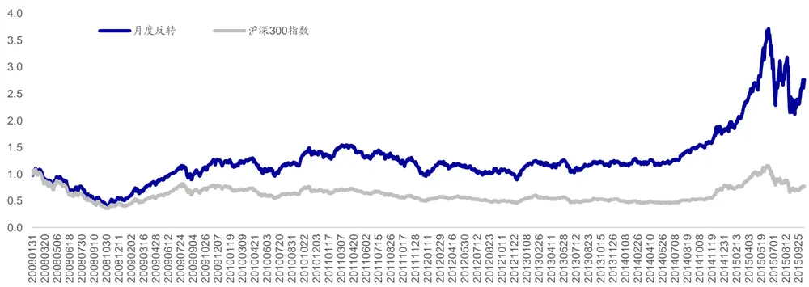
资料来源：海通证券研究所，WIND资讯

虽然传统的反转因子表现优异，但当我们对于反转因子的实质进行进一步分析时会发现传统的反转因子依然存在着很大的提升空间。反转因子的逻辑实际上是：投资者会卖出前期涨幅较大的股票，或买入前期跌幅较大的股票并期望该股票会出现反弹。这样一种操作逻辑比较符合A股市场长期存量资金博弈的市场环境，所以说其历史表现较好。但是，当我们思考投资者是如何去筛选前期涨跌幅较大的股票时会发现大部分投资者并不会简单地选取 个月或者 个月作为计算的时间窗口，投资者在实际投资中往往会从市场的前期低点或者高点去计算涨跌幅。例如，在 7 月初，若某投资者想要调入前期跌幅较大的股票赚取反弹收益，那么他在计算所有股票的涨跌幅时会从 6月中旬开始计算而不是 6月初。

基于上述讨论，我们可以得到一个对于反转因子进行进一步提升的逻辑，即：根据市场的走势动态地确定计算反转因子的时间窗口。在确定了因子提升方向后，我们接下来需要解决的问题有两个：

1） 使用什么指数代表整体市场走势？

## 2） 使用什么方法对于市场走势进行波段划分？

对于市场指数的选择，我们在考虑了市场上各大宽基指数后认为万得全 A指数是一个相对更好的选择，更能够代表市场整体表现。当然，在策略敏感性分析中我们也对于基于沪深 300 指数以及中证 500 指数的动态反转因子表现进行了回测。

对于波段划分方法，我们使用了 Osler 与 Chang（1995）在《Head and Shoulders:Not Just a Flaky Pattern》一文中使用的波段划分方法。该方法仅需要投资者确定涨跌幅就可以对于价格序列进行波段划分，这极大简化了波段划分的复杂程度。接下来，本篇报告将对于波段划分的方法进行详细介绍。

总的来说，波段划分的实质在于：一段趋势的建立就意味着投资者需要选择性地忽略这一趋势中标的的反向波段。对于一段上涨趋势，投资者需要忽略某些交易日的下跌；对于一段下跌趋势，投资者需要忽略某些交易日的上涨。那么“忽略”的标准在此处就显得至关重要，我们可以从时间维度来进行判断，也可以从空间维度（即涨跌）来进行判断。本报告使用的波段划分方法是基于涨跌幅来进行选择性忽略的。

基于上述思路，在设定跌幅阈值为 Y%的前提下，波段低点 i需要满足以下条件：

1）点 i是局部低点，即满足： $\mathbf{S}_{\mid}\mathbf{>}\mathbf{S}_{\mid+1}$ 且 $\mathbf{S}_{\mathrm{i}}\mathbf{<}\mathbf{S}_{\mathrm{i}}.$ 1；

2）存在点 j<i，且有 Si≤Sj*(1-Y%);

3）存在点 m>i，且有 S≤S *(1-Y%);

4）S 是j 至 m 间的最低点。

对于波段高点，同样可以给出类似定义。

通过上述方法，可编写程序得到对于任意一段价格序列的波段划分。下图为使用上述波段划分算法得到的波段划分结果。

图2 万得全 A指数波段划分实例
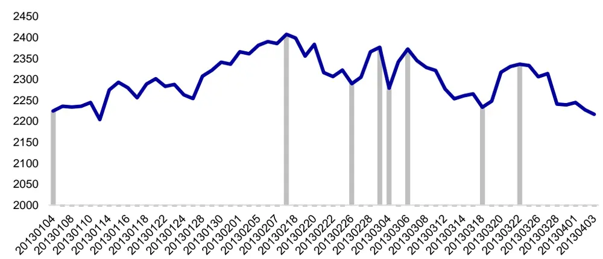
资料来源：海通证券研究所，WIND资讯

在了解了波段划分算法后，不难发现算法的划分效果取决于输入的涨跌幅阈值。由于设定一个固定的阈值缺乏合理性，本篇报告在每次计算动态反转因子时使用过去一年日收益率计算标准差并月度化。需要注意的是，动态反转因子在具体使用时不一定需要将标准差月度化。由于本报告主要将动态反转因子与月度反转因子进行对比，所以在设定涨跌幅阈值时才会使用月度波动幅度，若对于 个月反转进行提升或增强，则可将标准差半年化。

基于本节所讨论的内容，动态反转因子的计算流程可归纳为以下几步：

） 对于近一年万得全 指数的走势进行波段划分并找到离当前时点最近的波段划分点；

2） 计算选股范围内所有股票自波段划分点至当前时点的涨跌幅；

3） 基于 2）中得到的涨跌幅得到因子排序。

## 2. 因子分组收益分析

本节主要从组别收益的角度对比了动态反转因子以及经典的月度反转因子。本篇报告在进行相关回测时遵从以下规则：

1） 使用 2008 年 1月 4 日至 2015 年 10 月 30 日的数据进行回测；

2） 调仓间隔为 20交易日，停牌、涨停的股票不调入，停牌、跌停的股票不调出；

3） 基于万得全 A指数计算动态反转因子，使用万得全 A指数过去 1年的数据计算标准差并月度化；

4） 当计算得到的近期波段划分点离调仓时点小于 5个交易日时，再往前寻找波段划分点作为最近波段划分点。

下图展示了回测期动态反转因子在计算涨跌幅时所使用的时间窗口分布情况。可以看到，时间窗口长度分布基本在 10~60 交易日之间但是也会有一定的波动，最长的时间窗口可达 100 交易日以上。

图3 动态反转因子时间窗口分布
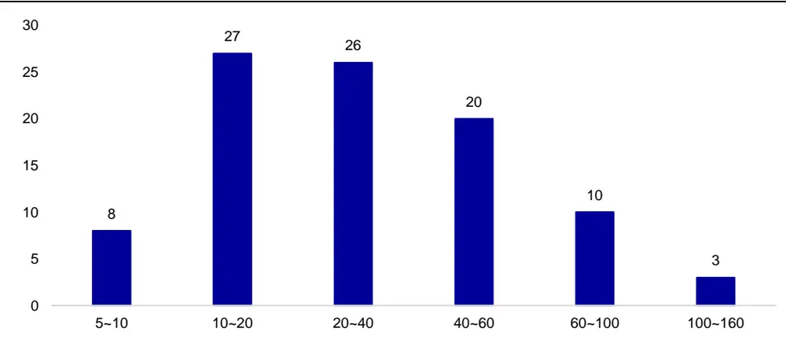
资料来源：海通证券研究所，WIND资讯

在每期调仓时，根据因子排序将所有可选股票分成 10 组，并计算每次股票往后一个持仓期的收益，可得下表。（组别排序越低，前期涨幅越低）

表 1 因子分组收益

| 因子分组 | 1 | 2 | 3 | 4 | 5 | 6 | 7 | 8 | 9 | 10 |
| --- | --- | --- | --- | --- | --- | --- | --- | --- | --- | --- |
| 20日反转 | 2.58% | 2.55% | 2.37% | 2.31% | 2.18% | 2.18% | 1.93% | 1.60% | 1.24% | 0.59% |
| 动态反转 | 2.54% | 2.51% | 2.37% | 2.31% | 2.15% | 2.24% | 1.93% | 1.68% | 1.31% | 0.46% |

资料来源：海通证券研究所， 资讯

通过上表可以发现，月度反转（本文中使用 20 交易日涨跌幅计算月度反转因子排序）与动态反转因子分组表现都有着较强的单调性，即前期跌幅最大的股票分组在后一期收益最高。单从简单分组上来看，我们并未观测到动态反转因子有明显区别于月度反转因子，但是在控制了市值效应以及月度反转效应后可以发现动态反转因子在一定程度上优于月度反转因子。

本篇报告主要通过以下方式来控制反转效应/市值效应。以控制月度反转效应为例，首先对于选股范围内股票按照 20 交易日涨跌幅进行排序并分成 5 组，然后组内再按照动态反转因子分成 5组。若对于同一大分组内的股票，动态反转因子的股票分组依旧有明显收益差，那么就说明该因子除了月度反转效应外还对于股票有一定的区分效果。

之所以选择控制反转效应与市值效应，是因为 A股市场中反转效应与市值效应十分强势，很多因子有明显选股能力是因为该因子与反转因子或者市值因子有很强相关性。所以通过对于这两个效应的剔除，我们可以更深入的了解动态反转因子的属性。

下表给出了动态反转因子与月度反转因子控制了 20 日反转效应后的结果。

表 2 控制月度反转后的因子分组收益情况

| 动态反转 |  | 1 | 2 | 3 | 4 | 5 | 组内收益差 |
| --- | --- | --- | --- | --- | --- | --- | --- |
|  | 1 | 3.26% | 2.86% | 2.30% | 2.34% | 2.13% | 1.13% |
|  | 2 | 3.07% | 1.92% | 2.13% | 2.02% | 1.69% | 1.38% |
|  | 3 | 2.05% | 1.80% | 1.82% | 1.68% | 1.41% | 0.64% |
|  | 4 | 1.55% | 1.34% | 1.25% | 1.56% | 1.12% | 0.43% |
| 月度反转 因子 | 5 | 1.47% | 0.93% | 0.54% | 0.18% | -0.38% | 1.85% |
|  | 1 | 2.60% | 2.94% | 2.71% | 2.26% | 2.37% | 0.23% |
|  | 2 | 2.42% | 2.42% | 1.97% | 2.17% | 1.90% | 0.52% |
|  | 3 | 1.71% | 1.77% | 1.95% | 1.75% | 1.63% | 0.08% |
|  | 4 5 | 1.39% 1.24% | 1.56% 0.82% | 1.39% 0.72% | 1.27% 0.24% | 1.25% -0.22% | 0.14% 1.46% |

资料来源：2012年，海通证券研究所

下表给出了动态反转因子与 20 日反转因子控制了市值效应后的结果。

表 3 控制市值效应后的因子分组收益情况

| 动态反转 因子 |  | 1 | 2 | 3 | 4 | 5 | 组内收益差 |
| --- | --- | --- | --- | --- | --- | --- | --- |
|  | 1 | 4.37% | 3.08% | 2.76% | 2.90% | 1.44% | 2.94% |
|  | 2 | 3.27% | 2.29% | 2.04% | 1.62% | 0.61% | 2.67% |
|  | 3 | 2.75% | 2.04% | 1.61% | 1.15% | 0.40% | 2.35% |
|  | 4 | 2.21% | 1.46% | 1.16% | 0.91% | 0.42% | 1.80% |
|  | 5 | 1.35% | 1.06% | 0.82% | 0.39% | -0.06% | 1.41% |
|  | 1 | 4.07% | 3.44% | 2.76% | 2.66% | 1.59% | 2.49% |
| 月度反转 因子 | 2 | 3.00% | 2.57% | 1.91% | 1.56% | 0.89% | 2.11% |
|  | 3 | 2.40% | 1.98% | 1.75% | 1.41% | 0.46% | 1.94% |
|  | 4 | 2.23% | 1.53% | 1.19% | 0.89% | 0.33% | 1.91% |
|  | 5 | 1.31% | 1.18% | 0.82% | 0.46% | -0.08% | 1.39% |

资料来源： 年，海通证券研究所

上述两表结果表明：动态反转因子在剔除了月度反转效应以及市值效应后依旧存在明显选股能力。

## 3. 动态反转组合收益分析

本节将从时间序列的角度对于动态反转因子与经典的月度反转因子进行对比。本节中的组合使用08年至15年10月的数据在全市场选股以20交易日为调仓间隔构建得到。

## 3.1 前后 10%多空组合

在全市场内按照月度反转因子以及动态反转因子可以选取因子排序前 10%为多头组合，后 10%为空头组合。（因子排序越低，前期涨幅越小）。下图给出了月度反转因子与动态反转因子多空组合在回测区间上的表现。

图4 前后 10%多空组合收益表现
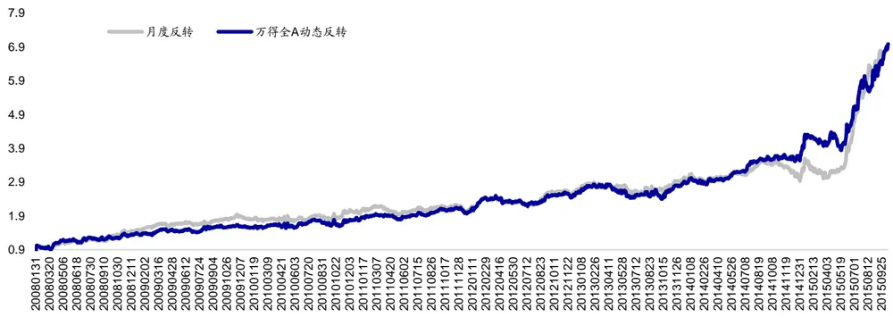
资料来源：海通证券研究所，WIND资讯

可以看到，动态反转因子与月度反转因子多空组合在大部分时间段上表现较为相似，仅在个别区域有所不同。月度反转因子多空组合年化收益为 27%，最大回撤为 17%；万得全 A动态反转因子多空组合年化收益为 27%，最大回撤为 17%。下表给出了两多空组合分年度的表现情况。从分年度收益情况上来看，动态反转因子波动相对较小一些。

表 4 前后 10%多空组合分年度表现情况

| 动态反转 |  |  |  | 月度反转 |  |  |
| --- | --- | --- | --- | --- | --- | --- |
| 年度 | 年度收益 | 最大回撤 | 夏普比率 | 年度收益 | 最大回撤 | 夏普比率 |
| 2008 | 37% | 14% | 1.65 | 46% | 12% | 2.24 |
| 2009 | 12% | 8% | 0.55 | 21% | 7% | 1.34 |
| 2010 | 11% | 12% | 0.34 | 7% | 9% | 0.13 |
| 2011 | 13% | 9% | 0.77 | 5% | 12% | 0.03 |
| 2012 | 28% | 13% | 1.77 | 29% | 11% | 1.94 |
| 2013 | 10% | 17% | 0.29 | 10% | 13% | 0.33 |
| 2014 | 23% | 7% | 1.58 | -2% | 16% | -0.53 |
| 2015 | 94% | 13% | 5.13 | 128% | 17% | 7.33 |

资料来源：海通证券研究所，WIND资讯

## 3.2 行业中性组合

从行业内选取前 10%的股票，按照沪深 300 指数行业权重可构建行业中性组合。下图给出了月度反转因子以及万得全A动态反转因子行业中性组合对冲沪深300指数后的走势。

图5 行业中性组合历史表现
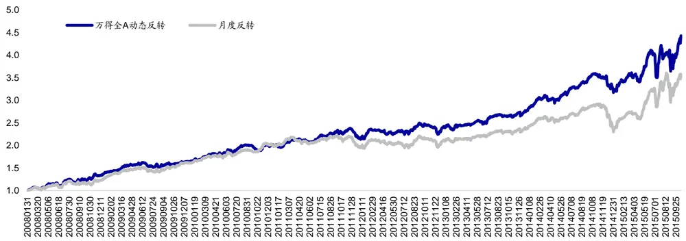
资料来源：海通证券研究所，WIND资讯

单从两组合净值走势就可以发现动态反转因子相对于月度反转因子有着十分稳定的提升。在整个回测区间上，月度反转组合年化收益为 ，最大回撤为 ，而动态反转组合年化收益为 22%，最大回撤为 15%。从收益回撤角度来看，动态反转因子的表现都优于月度反转因子。下表分年度从多个指标对于两个组合的表现进行了统计。

表 5 行业中性组合分年度表现

| 动态反转 |  |  |  |  |  |  | 月度反转 |  |  |  |
| --- | --- | --- | --- | --- | --- | --- | --- | --- | --- | --- |
| 年度 | 年度收益 | 最大回撤 | 夏普比 | Calmar 比 | 月胜率 | 年度收益 | 最大回撤 | 夏普比 | Calmar 比 | 月胜率 |
| 2008 | 43% | 7% | 3.07 | 5.98 | 75% | 30% | 7% | 2.03 | 4.08 | 67% |
| 2009 | 17% | 7% | 1.39 | 2.39 | 67% | 24% | 8% | 2.14 | 3.08 | 75% |
| 2010 | 21% | 7% | 1.97 | 2.88 | 67% | 24% | 5% | 2.39 | 5.26 | 58% |
| 2011 | 9% | 9% | 0.53 | 0.98 | 58% | 0% | 11% | -0.61 | -0.01 | 42% |
| 2012 | 11% | 10% | 0.69 | 1.14 | 58% | 7% | 11% | 0.23 | 0.63 | 50% |
| 2013 | 16% | 5% | 1.42 | 3.23 | 83% | 13% | 4% | 1.06 | 3.12 | 83% |
| 2014 | 16% | 10% | 1.19 | 1.54 | 69% | -2% | 20% | -0.61 | -0.09 | 62% |
| 2015 | 40% | 15% | 2.15 | 2.68 | 75% | 57% | 18% | 3.37 | 3.24 | 75% |

资料来源：海通证券研究所，WIND资讯

从收益情况来看，动态反转因子表现更加稳定，且仅在 2009 年、2010 年以及 2015年跑输月度反转因子。从回撤角度来看，动态反转组合回撤更小，仅在 2010 与 2013年高于月度反转组合。从夏普比率以及收益回撤比角度来看，动态反转组合表现更加稳定仅在 2009，2010 以及 2015 跑输月度反转组合。从月度胜率来看，动态反转组合表现也明显优于反转组合表现。

为了能够进一步对比两组合在回测时间段上表现的差异，现计算两组合净值相对强弱指数。（RSI=动态反转组合净值/反转组合净值）若相对强弱指数上升则代表动态反转因子表现更好，若相对强弱指数下降则代表月度反转因子表现更好。（详见下图）

图6 动态反转月度反转相对强弱指数
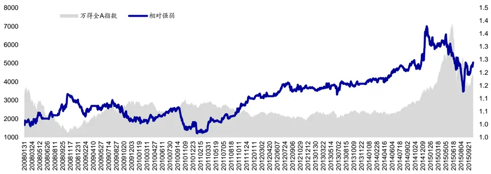
资料来源：海通证券研究所，WIND资讯

观察相对强弱指数在整个回测区间上的表现，可以发现：在大部分时间段上，相对强弱指数都表现出了稳定上升的态势，但是在极个别时间段上，相对强弱指数会出现明显回落。在整个回测区间上共发生了 次相对强弱指数的大幅回落。下表统计了这 次相对强弱指数的明显回落时动态反转组合的跑输幅度、动态反转因子选择的时间窗口以及相关时间跨度。

表 6 动态反转因子明显跑输详细情况

| 次数 | 起始时点 | 结束时点 | 动态反转因子时间窗口 | 跑输幅度 |
| --- | --- | --- | --- | --- |
| 1 | 20081127 | 20090302 | 17,37,16 | 3% |
| 2 | 20090821 | 20091123 | 13,14,13 | 5% |
| 3 | 20100914 | 20110119 | 51,71 | 8% |
| 4 | 20150505 | 20150826 | 55,18,12,15 | 11% |

资料来源：海通证券研究所，WIND资讯

在整个回测时间段上，动态反转相对于月度反转跑输幅度最大的一次发生在年 月初至 年 月底，累计跑输幅度达 ，整个时间段共经历四个持仓期，其中动态反转因子所选择的时间窗口依次为 55 交易日，18 交易日，12交易日，15 交易日。此时动态反转因子所选时间窗口大多较短（除 55 交易日外），之所以会出现这种情况是因为6月以后市场波动极大，这使得波段划分算法识别出的划分点较多从而导致波段划分点距调仓时间较近从而使得动态时间窗口变短。由于在较短的周期上，反转效应并不是特别明显，基于过短的时间窗口计算反转因子极易使得所得股票表现不稳定。回顾另外几次动态反转因子明显跑输的情况，我们也可观测到动态反转因子所选时间窗口偏短，基本都小于 交易日。所以可以推测：动态反转因子会在选取时间窗口较短时跑输月度反转因子。为了能够验证此推测，下表与下图对于同持仓时间段上，动态反转因子月度持仓相对于月度反转因子持仓的超额收益进行了统计。

表 7 动态反转因子超额收益

| 窗口长度 | 动态超额收益 数量 |
| --- | --- |
| 5~10 | -0.61% 8 |
| 11~19 | -0.50% 22 |
| 21~30 | 0.01% 10 |
| 31~40 | 0.99% 15 |
| 41~60 | 0.40% 20 |
| 61~80 | -0.60% 7 |
| ≥81 | 2.52% 6 |

资料来源：海通证券研究所，WIND资讯

图7 动态反转因子超额收益分布情况
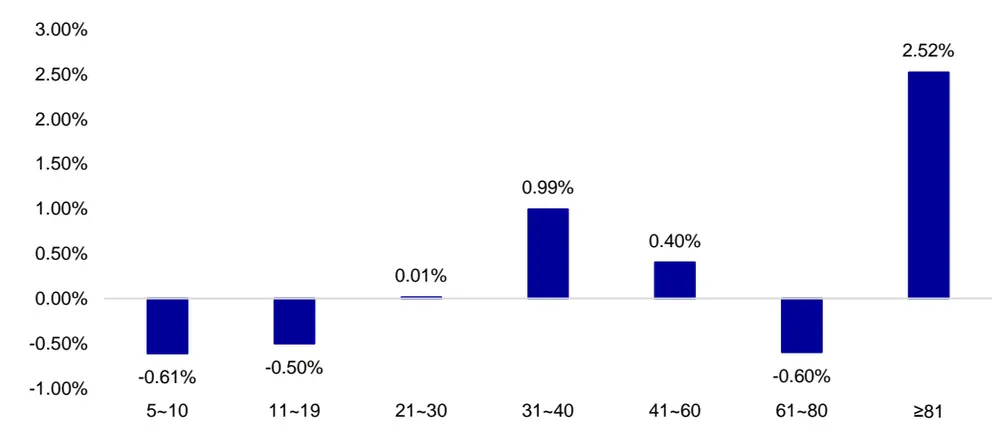
资料来源：海通证券研究所，WIND资讯

上述统计结果表明：当动态反转因子所选时间窗口偏短时，会明显跑输月度反转因子。当动态反转因子所选时间窗口偏长时，相对于月度反转因子可产生明显超额收益。从数量上来看，动态反转因子所选时间窗口较短的样本在整个回测区间相对较少，故而在相对强弱指数上会出现大部分时间段动态反转稳定跑赢月度反转，但是在个别较短时间段内明显跑输月度反转的现象。

## 4. 策略敏感性分析

动态反转因子，其实质是对于市场进行波段划分来动态的选取计算涨跌幅的时间窗口。所以动态反转因子表现也取决于波段划分算法，波段划分的效果一方面取决于波段划分的指数本身，另一方面也取决于输入的涨跌幅阈值。所以在本节中，我们将从波段划分指数以及输入的标准差倍数两个方面来检验因子对于相关参数的敏感性。

## 4.1 波段划分指数

市场上的宽基指数较多，可分别选取沪深 300 指数、中证 500 指数以及万得全 A指数作为波段划分基准指数并对于行业中性组合表现情况进行统计。下图对比统计了基于各行业指数的动态反转因子行业中性组合表现情况（对冲沪深 300 指数后）。

图8 不同波段划分指数下动态反转因子的表现
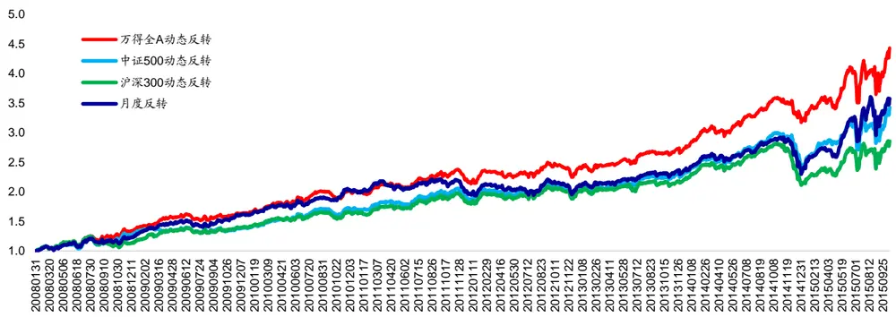
资料来源：海通证券研究所，WIND资讯

总的来看，基于沪深 指数的动态反转因子明显跑输月度反转并未起到明显的增强效果。基于中证 指数的动态反转因子与月度反转因子表现相近，而基于万得全指数的动态反转因子相比于月度反转因子有稳定的增强。之所以会出现这种情况是由于各指数对于市场整体走势的代表性不同，万得全 指数在这个三个宽基指数中最能代表整体市场表现，中证 500 指数次之，而沪深 300 指数仅能代表大盘股的走势。下表给出了不同组合在各年份的表现情况。

表 8 不同动态反转组合分年度表现

| 年度 | 20 日反转 | 万得全A动态反转 | 中证 500 动态反转 | 沪深 300 动态反转 |
| --- | --- | --- | --- | --- |
| 2008 | 30% | 43% | 36% | 22% |
| 2009 | 24% | 17% | 4% | 18% |
| 2010 | 24% | 21% | 22% | 17% |
| 2011 | 0% | 9% | 12% | 12% |
| 2012 | 7% | 11% | 9% | 11% |
| 2013 | 13% | 16% | 15% | 12% |
| 2014 | -2% | 16% | 4% | -6% |
| 2015 | 57% | 40% | 44% | 36% |

资料来源： 年，海通证券研究所

## 4.2 标准差倍数

对于波段划分算法而言，输入的涨跌幅阈值越高，划分出的波段越大，动态反转因子得到的动态时间窗口越宽；输入的涨跌幅阈值越低，划分出的波段越小，动态反转因子得到的动态时间窗口越窄。下图统计了 0.5、0.8、1.2、2倍时万得全 A动态反转因子的表现。

图9 不同标准差倍数下动态反转因子表现情况
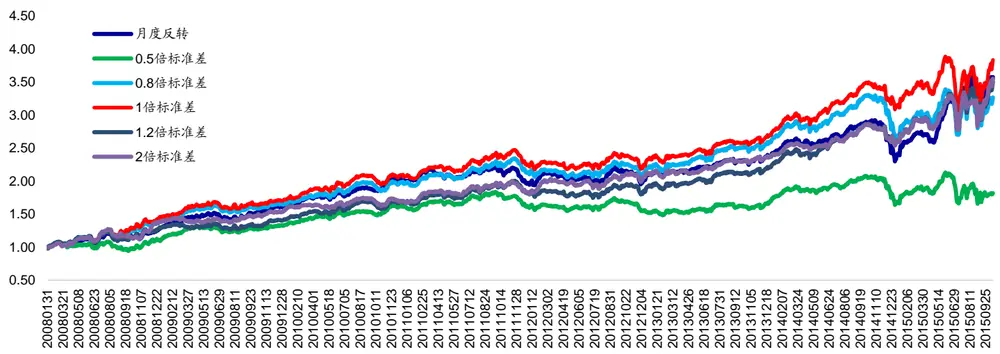
资料来源：海通证券研究所，WIND资讯

通过上图可知，过低的标准差倍数会使得动态反转因子表现明显劣于月度反转因子。之所以会出现这种情况是因为标准差倍数过小会导致输入波段划分算法的涨跌幅阈值偏小从而引起波段划分算法对于市场涨跌较为敏感，最终导致动态反转因子使用的时间窗口偏短。而在偏短的时间窗口上，股票收益表现出的是收益动量效应而非收益反转效应。但当我们大幅增大标准差倍数（2倍标准差）时，并未观测到明显跑输月度反转组合的现象。由此可知，在较长的时间维度上反转效应依旧较为明显。综上所述，动态反转因子在标准差倍数偏小时较不稳定，易明显跑输月度反转，但动态反转因子在标准差倍数偏大时较为稳定，其表现与月度反转相当。下表为不同标准差倍数下动态反转因子的分年度表现。

表 9 不同动态反转组合分年度表现

| 年份 | 20 日反转 | 0.5 倍标准差 | 0.8 倍标准差 | 1 倍标准差 | 1.2 倍标准差 | 2倍标准差 |
| --- | --- | --- | --- | --- | --- | --- |
| 2008 | 30% | 8% | 39% | 43% | 21% | 42% |
| 2009 | 24% | 19% | 16% | 17% | 8% | 10% |
| 2010 | 24% | 20% | 21% | 21% | 19% | 8% |
| 2011 | 0% | 4% | 9% | 9% | 9% | 11% |
| 2012 | 7% | 10% | 11% | 11% | 13% | 16% |
| 2013 | 13% | 13% | 18% | 16% | 15% | 13% |
| 2014 | -2% | 0% | 3% | 16% | 16% | 8% |
| 2015 | 57% | 12% | 20% | 40% | 38% | 40% |

资料来源：海通证券研究所，WIND资讯

## 5. 相关扩展

本节从不同的角度对于动态反转因子的应用进行了进一步的讨论。虽然初步的应用结果并不令人满意，但是希望能够为各位投资者开拓思路提供更多的灵感。

## 5.1 基于行业指数的动态反转

考虑到在构建行业中性组合时实际上是在行业内选股，那么在选股时仅需要相关股票在行业内的因子排序值。由此可得到以下扩展思路，即，基于每个行业指数使用波段划分算法，在行业内选股时通过行业波段划分确定行业时间窗口从而对于每个行业内的股票计算因子排序。下图给出了基于行业指数的动态反转以及月度反转组合表现（行业中性组合对冲沪深 300 指数）。不过我们并未观测到基于行业指数的动态反转组合相对于月度反转组合有明显增强。

图10 基于行业指数的动态反转
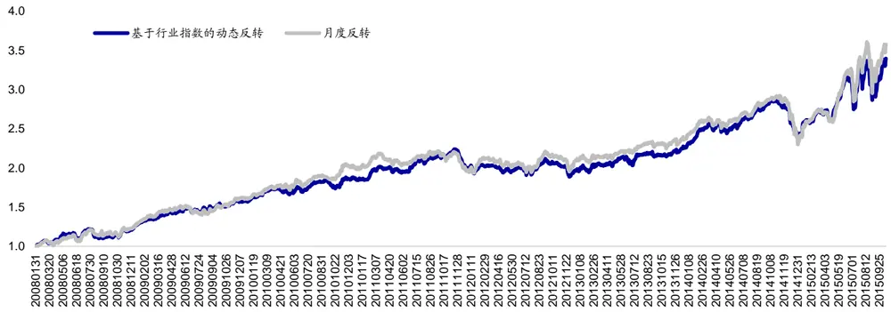
资料来源：海通证券研究所，WIND资讯

## 5.2 基于个股价格的动态反转

在前文讨论的基础上不妨在把动态反转的思路细化至个股，即，对于每只股票的走势进行波段划分、得到独特的时间窗口并计算反转因子。但此种思路最大的问题在于对于每只股票会得到不同的时间窗口，但在计算因子排序时会基于此时间窗口统计涨跌幅。那么使用不同时间维度的涨跌幅进行比较就十分缺乏逻辑基础。当然，该组合在实际中的表现也明显劣于月度反转组合。（详见下图）

图11 基于个股价格的动态反转
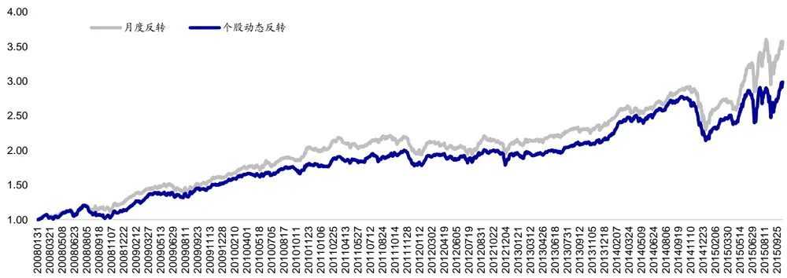
资料来源：海通证券研究所， 资讯

## 6. 总结

反转因子是 股市场中为数不多的表现优异的选股因子。本报告尝试从计算涨跌幅时间窗口的角度对于反转因子进行了进一步的提升，通过市场涨跌幅动态的选择时间窗口从而得到一个更加符合投资者操作习惯的反转因子。

当使用万得全 A指数作为波段划分指数时，动态反转因子相对于原有的月度反转因子有明显且稳定的提升。动态反转因子的行业中性组合在收益、回撤、夏普比、收益回撤比等方面在多年战胜月度反转因子。

在使用动态反转因子时也需要注意到该因子对于波段划分指数以及标准差倍数有一定的要求。波段划分指数需要尽可能地代表选股范围总体的表现，标准差倍数(波段划分算法涨跌幅阈值)不可设定过低，否则容易导致动态反转因子表现不稳定。

最后，本文也从其他角度给投资者提供了一些使用动态反转因子的扩展。

# 信息披露

分析师声明

[Table高道德

本人具有中国证券业协会授予的证券投资咨询执业资格，以勤勉的职业态度，独立、客观地出具本报告。本报告所采用的数据和信息均来自市场公开信息，本人不保证该等信息的准确性或完整性。分析逻辑基于作者的职业理解，清晰准确地反映了作者的研究观点，结论不受任何第三方的授意或影响，特此声明。

## 法律声明

本报告仅供海通证券股份有限公司（以下简称 本公司 ）的客户使用。本公司不会因接收人收到本报告而视其为客户。在任何情况下，本报告中的信息或所表述的意见并不构成对任何人的投资建议。在任何情况下，本公司不对任何人因使用本报告中的任何内容所引致的任何损失负任何责任。

本报告所载的资料、意见及推测仅反映本公司于发布本报告当日的判断，本报告所指的证券或投资标的的价格、价值及投资收入可能会波动。在不同时期，本公司可发出与本报告所载资料、意见及推测不一致的报告。

市场有风险，投资需谨慎。本报告所载的信息、材料及结论只提供特定客户作参考，不构成投资建议，也没有考虑到个别客户特殊的投资目标、财务状况或需要。客户应考虑本报告中的任何意见或建议是否符合其特定状况。在法律许可的情况下，海通证券及其所属关联机构可能会持有报告中提到的公司所发行的证券并进行交易，还可能为这些公司提供投资银行服务或其他服务。

本报告仅向特定客户传送，未经海通证券研究所书面授权，本研究报告的任何部分均不得以任何方式制作任何形式的拷贝、复印件或复制品，或再次分发给任何其他人，或以任何侵犯本公司版权的其他方式使用，所有本报告中使用的商标、服务标记及标记均为本公司的商标、服务标记及标记。如欲引用或转载本文内容，务必联络海通证券研究所并获得许可，并需注明出处为海通证券研究所，且不得对本文进行有悖原意的引用和删改。

根据中国证监会核发的经营证券业务许可，海通证券股份有限公司的经营范围包括证券投资咨询业务。

## 海通证券股份有限公司研究所[Table_PeopleInfo]

路 颖所长

(021)23219403 luying@htsec.com

高道德 副所长(021)63411586 gaodd@htsec.com

姜 超 副所长(021)23212042 jc9001@htsec.com

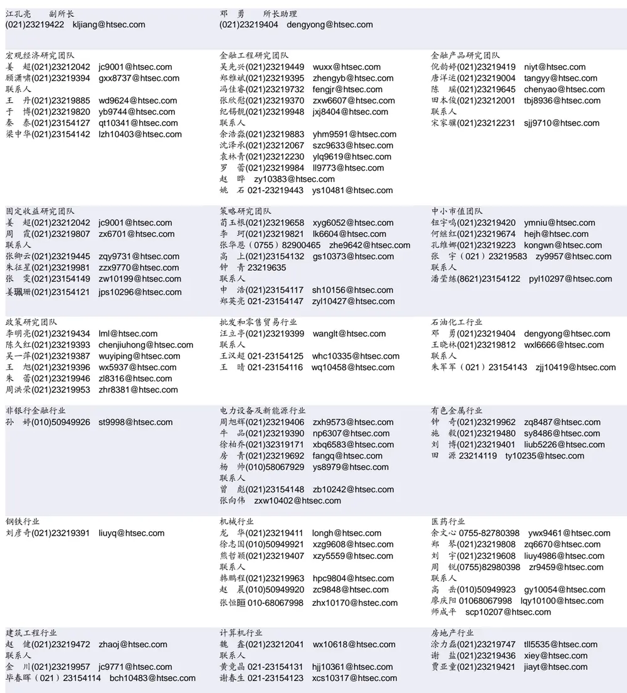

| 食品饮料行业 闻宏伟(010)58067941 whw9587@htsec.com |  | 汽车行业 邓 学(0755)23963569 |  | 农林牧渔行业 丁 频(021)23219405 |  |
| --- | --- | --- | --- | --- | --- |
| 联系人 成珊(021)23212207 | cs9703@htsec.com | 联系人 谢亚彤(021)23154145 xyt10421@htsec.com | dx9618@htsec.com | 联系人 陈雪丽(021)23219164 cxl9730@htsec.com | dingpin@htsec.com |
| 孔梦遥(010)58067998 社会服务行业 | kmy10519@htsec.com | 建筑建材行业 |  | 银行行业 |  |
| 林周勇(021)23219389 Izy6050@htsec.com 交通运输行业 |  | 邱友锋(021)23219415 联系人 钱佳佳(021)23212081 基础化工行业 | qyf9878@htsec.com qjj10044@htsec.com | 林媛媛(0755)23962186 lyy9184@htsec.com 家电行业 |  |
| 虞 楠(021)23219382 yun@htsec.com 联系人 张 杨 zy9937@htsec.com 电子行业 |  | 刘 威(0755)82764281 Iw10053@htsec.com 李明刚18610049678 Img10352@htsec.com 联系人 刘海荣 23154130 纺织服装行业 | Ihr10342@htsec.com | 陈子仪(021)23219244 chenzy@htsec.com 通信行业 |  |
| 董瑞斌(021)23219816 drb9628@htsec.com 陈 平(021)23219646 cp9808@htsec.com 联系人 陈基明(021)23212214 cjm9742@htsec.com |  | 焦 娟(021)23219356 jj9604@htsec.com 唐 苓(021)23212208 tl9709@htsec.com |  | 朱劲松 010-50949926 zjs10213@htsec.com |  |

## 海通证券股份有限公司机构业务部

| 宋立民总经理 (021) 23212267 songlm@htsec.com |  | 金芸副总经理 (021) 23219278 jinyun@htsec.com |  |  |  |
| --- | --- | --- | --- | --- | --- |
|  |  | 上海地区销售团队 |  | 北京地区销售团队 |  |
| 深广地区销售团队 蔡铁清 (0755)82775962 | ctq5979@htsec.com | 季唯佳 (021)23219384 | jiwj@htsec.com | 殷怡琦(010) 58067988 | yyq@htsec.com |
| 刘晶晶 (0755)83255933 | liujj4900@htsec.com | 胡雪梅(021)23219385 | huxm@htsec.com | 隋巍 (010)58067944 | sw7437@htsec.com |
| 辜丽娟 (0755)83253022 | gulj@htsec.com | 黄毓 (021)23219410 | huangyu@htsec.com | 江虹 (010)58067988 | jh8662@htsec.com |
| 高艳娟 (0755)83254133 | gyj6435@htsec.com | 朱健 (021)23219592 | zhuj@htsec.com | 许诺 (010)58067931 | xn9554@htsec.com |
| 伏财勇 (0755)23607963 | fcy7498@htsec.com | 黄慧 (021)23212071 | hh9071@htsec.com | 杨博 (010)58067996 | yb9906@htsec.com |
|  |  | 孙 明(021)23219990 | sm8476@htsec.com | 张景才 (010)58067977 | jc10211@htsec.com |
|  |  | 孟德伟(021)23219989 | mdw8578@htsec.com | 李铁生 (010)58067934 | Its10224@htsec.com |
|  |  | 黄胜蓝(021)23219386 | hsl9754@htsec.com | 张 妍 (010)58067903 | zy9289@htsec.com |
|  |  | 张 杨(021)23219442 | zy9937@htsec.com |  |  |
|  |  | 杨 洋(021)23219281 | yy9938@htsec.com |  |  |

海通证券股份有限公司研究所

地址：上海市黄浦区广东路 689号海通证券大厦 13楼

电话：（021）23219000

传真：（021）23219392

网址：www.htsec.com