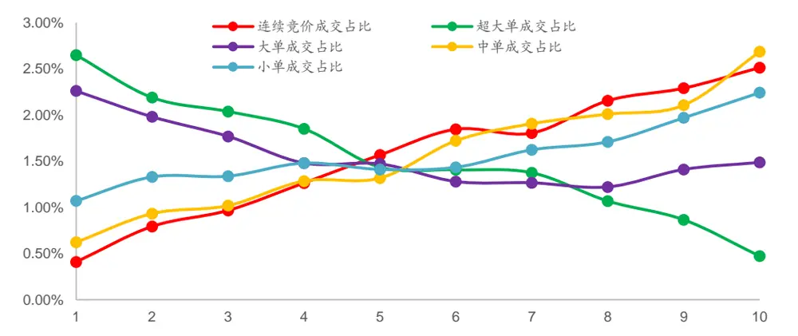
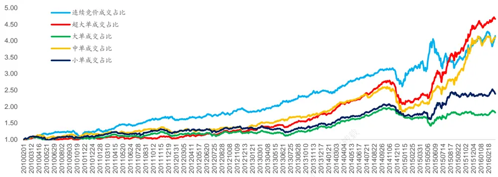
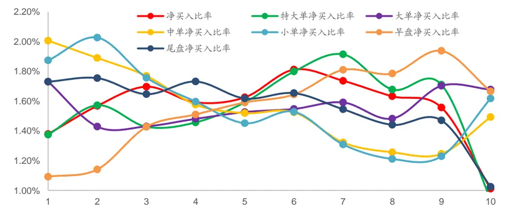
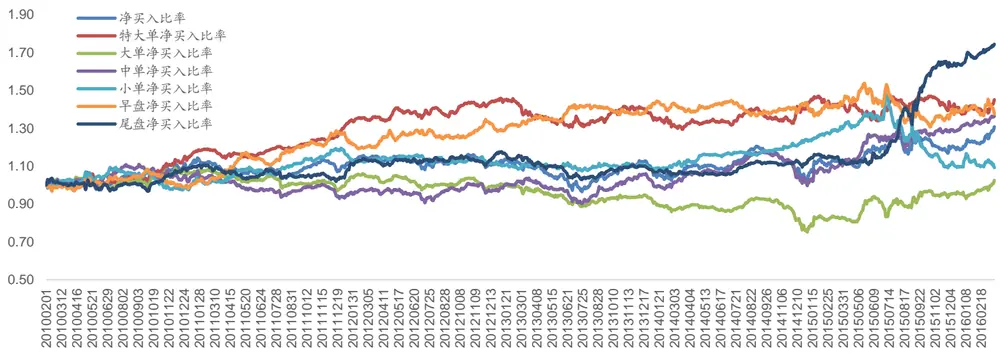
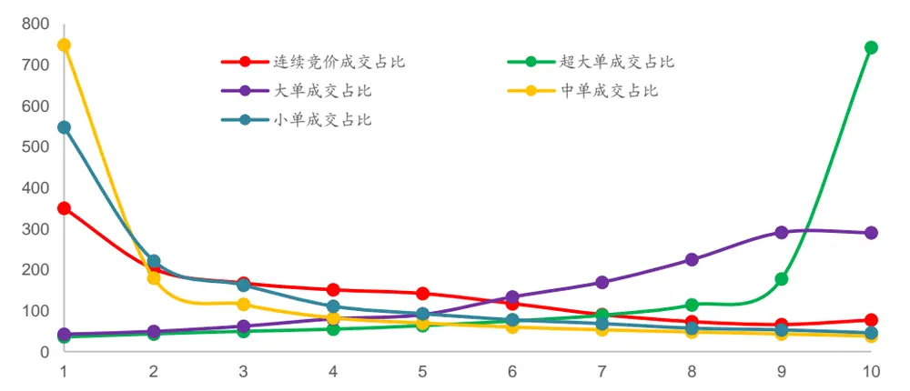
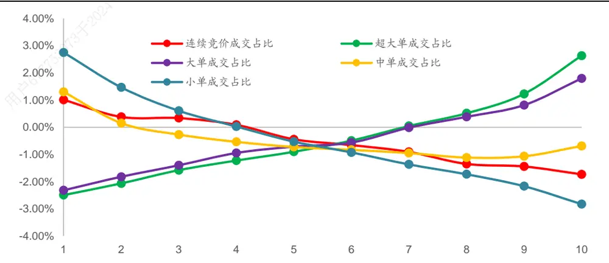
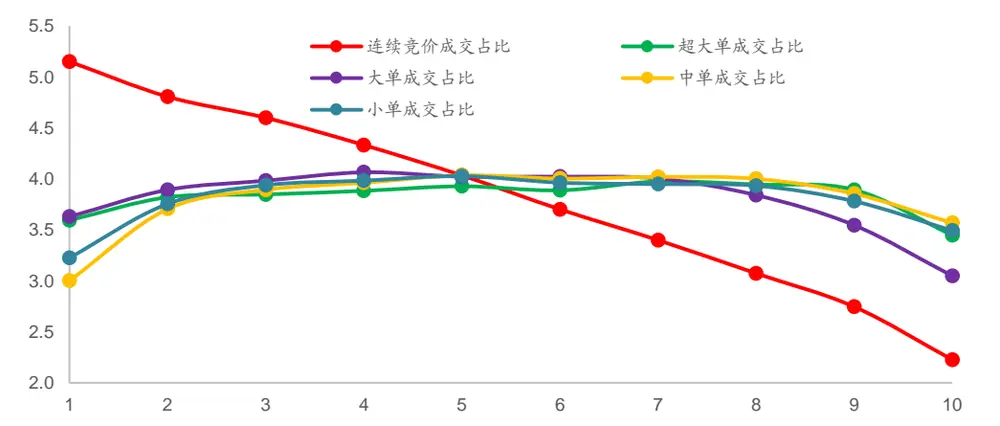
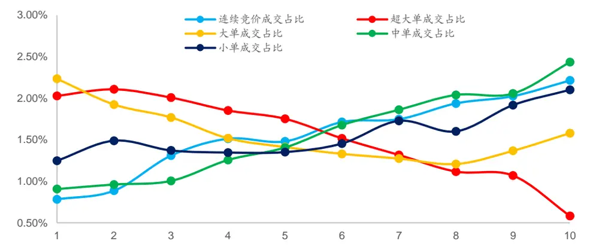

## 相关研究

Table_ReportInfo]《他山之石系列之四十三》2016.05.26《他山之石系列之四十二》2016.04.27《事件驱动策略之十六——ST扭亏》2016.04.26

分析师:高道德

Tel:(021)63411586

Email:gaodd@htsec.com

证书:S0850511010035

分析师:袁林青

Tel:(021)23212230

Email:ylq9619@htsec.com

证书:S0850516050003

# 选股因子系列研究(十一)——Level2 行情选股因子初探

类选股因子存在进一步挖掘空间。随着业界对于选股因子研究的深入，许多类别的选股因子都得到了较好的挖掘。但在众多研究中对于基于 Level 2 行情数据的选股因子的相关研究却少之又少，很多前期研究都将注意力集中到了Level 2 类指标的短期选股效果上而并未对于该类指标在中长期上的选股效果进行研究。本报告旨在对于 行情构建的选股因子的选股效果进行初步的回测，为各位投资者进一步细化构建相关选股因子提供方向与灵感。

围绕逐笔数据可构建相关选股指标。逐笔成交数据从单笔成交金额以及单笔成交方向两个维度上为投资者提供了更多关于成交的信息。基于逐笔成交信息，我们可以掌握股票日内各种类型买卖单（特大单、大单、中单以及小单）的成交情况，也可以掌握每笔交易的成交方向（主动买入、主动卖出）。在接下来讨论中，本文将从买卖单大小以及成交方向构建相关指标。

成交占比类因子选股效果较好。对于连续竞价成交占比、中单成交占比、小单成与交占比，因子值越高，股票在后一个月的收益越高。对于特大单成交占比、大单传成交占比，因子值越低，股票在后一个月的收益越高。成交占比类因子对于股票不收益的区分效果极好。成交占比类因子多空组合年化收益基本高于 （除大单用，成交占比以外），其中连续竞价成交占比、超大单成交占比多空组合年化收益超27%，夏普比率高于 1.7，信息比率高于 2，月度胜率在 70%以上。

- 净买入比率类因子选股效果较差。净买入比率类因子年化收益基本低于 6%，除仅了尾盘净买入比率因子年化收益达 10%。从夏普比率以及信息比率来看，净买入载，比率因子表现同样较差，夏普比率基本在 0.5 以下，信息比率基本在 1以下。日

- 成交占比类因子与市值、反转以及换手率显著相关，剔除相关风险因子后依旧存4-在选股效果。成交占比类因子具有 小市值、前期低涨幅、低换手 的特征。使用2截面回归取残差的方式可对于上述风险因子进行剔除，剔除后成交占比类因子依97旧具有较好的选股效果。

- 风险提示：政策变动风险、流动性缺失风险、市场系统性风险

随着业界对于选股因子研究的深入，许多类别的选股因子都得到了较好的挖掘。但在众多研究中对于基于 Level 2 行情数据的选股因子的相关研究却少之又少，很多前期研究都将注意力集中到了 Level 2 类指标的短期选股效果上而并未对于该类指标在中长期上的选股效果进行研究。

本报告旨在对于 行情构建的选股因子的选股效果进行初步的回测，为各位投资者进一步细化构建相关选股因子提供方向与灵感。本报告基于WIND 提供的 Level 2类成交统计指标构建了成交占比类以及净买入比率类选股因子并在传统的多因子框架中对于因子表现进行了回测分析。此外，本文还对于选股效果较好的因子的风险特征进行了描述并对比分析了剔除 A股市场常见风险因子后因子的选股表现情况。

## 1. Level 2 类行情数据介绍

传统的 Level-1 行情具体内容包括：

1) 证券在集合竞价期间的代码、简称、前收盘价、虚拟开盘参考价、虚拟匹配量和虚拟未匹配量。

2) 证券在连续竞价期间的代码、简称、前收盘价、最新成交价、当日最高成交价、当日最低成交价、当日累计成交量、当日累计成交额、实时最高五个买入申报价格和数量、实时最低五个卖出申报价格和数量。

而 Level-2 行情在基于 Level-1 行情的基础上在买/卖方价位相关数据、成交数据、统计数据等方面增加了更多信息。（详见下表）

表 1 Level-2 行情新增内容

| 大类 | 内容 |
| --- | --- |
| 01-26日 买/卖方价位相关数据 53973于202 | 汇总的委托笔数、委托数量及加权平均价格 价位深度数量 前10档的价格、委托数量及委托笔数 第1档价位前 50笔订单的委托数量（不足时取实际笔数） |
| 成交数据 | 逐笔成交（每一笔成交明细） 买/卖方订单成交的最长等待时间 |
| 统计数据 | 买/卖方的累计撤单笔数、数量和金额 |
| 其他数据 | ETF申购/赎回的累计笔数、数量和金额 ETF 的 IOPV 值 |

资料来源：上证所信息网络有限公司，海通证券研究所

本报告中的 选股因子主要就是围绕着逐笔成交数据展开的。逐笔成交数据从单笔成交金额以及单笔成交方向两个维度上为投资者提供了更多关于成交的信息。基于逐笔成交信息，我们可以掌握股票日内各种类型买卖单（特大单、大单、中单以及小单）的成交情况，也可以掌握每笔交易的成交方向（主动买入、主动卖出）。在接下来讨论中，本文将从买卖单大小以及成交方向构建相关指标。

## 2. Level 2 类选股因子构建

由于 Level-2 类数据处理起来较为复杂且不同算法得到的结果存在一定差异，为了保证结果的可复制性本报告统一使用 中提供的 类指标构建相关选股因子。（若对于数据表具体位臵感兴趣可咨询报告作者。）若投资者对于某一特定因子较为感兴趣可基于本报告根据自身需求使用特定算法计算相关指标。现对于WIND中相关指标的处理细节进行说明。

根据买卖单绝对成交金额可将每日买单与卖单分为：特大单（＞100 万），大单（20万~100 万），中单（4 万~20万），小单（≤4万）。

本文使用买卖单委托时间以及成交价格识别每笔的成交方向。买卖双方委托单在委托时间上必然有先后顺序，先来的委托单子作为被动方，后到的委托单子作为主动方促使成交，根据成交和最优报价判断主动与被动 。若委托卖单在前且最新成交价≥卖价，则此比为主动买入；若委托买单在前且最新成交价≤买价，则为主动卖出。此外，涨停板上成交将被识别为主动卖出，而跌停板上成交将被识别为主动买入。

基于WIND中的 Level-2 相关统计数据可计算得到以下指标：

表 2 Level-2 类统计指标

| 类别 | 统计指标 | 计算方法 |
| --- | --- | --- |
| 成交占比 | 连续竞价成交占比 | 连续竞价成交金额/当日成交金额 |
|  | 特大单成交占比 | 特大单成交金额/(2*当日成交金额) |
|  | 大单成交占比 | 大单成交金额/(2*当日成交金额) |
|  | 中单成交占比 | 中单成交金额/(2*当日成交金额） |
|  | 小单成交占比 | 小单成交金额/（2*当日成交金额） |
| 净买入比率 | 净买入比率 | (主动买入金额-主动卖出金额)/当日成交金额 |
|  | 特大单净买入比率 | (特大单主买金额-特大单主卖金额)/当日成交金额 |
|  | 大单净买入比率 | (大单主买金额-大单主卖金额)/当日成交金额 |
|  | 中单净买入比率 | (中单主买金额-中单主卖金额)/当日成交金额 |
|  | 小单净买入比率 | (小单主买金额-小单主卖金额)/当日成交金额 |
|  | 早盘净买入比率 | (10点前主买金额-主卖金额)/当日成交金额 |
|  | 尾盘净买入比率 | (14点30后主买金额-主卖金额)/当日成交金额 |

资料来源： 资讯，海通证券研究所

根据上表可知，围绕 Level-2 成交统计指标可构建成交占比以及净买入比率两类指标。成交占比类指标统计了各类买单与卖单占股票每日成交的比率，净买入比率统计了各类买卖单主买主卖成交差额占成交金额的比率。本报告将在下一节将上述指标应用于传统的因子选股框架中并对于各因子表现进行回测分析。

## 3. 选股因子回测

本节按照以下规则进行回测，

1） 回测时间段为 2010 年 1 月至 2016 年 3 月，选股范围为全 A；

2） 组合每月月初调仓，交易费率为双边千分之三；

3） 使用前一节中的指标的月度均值作为排序依据，每次将股票分为 10 组；

4） 调仓时，涨停、停牌不调入，跌停、停牌不调出。

本节将从因子分组收益以及多空组合表现两个角度对于 Level-2 类选股因子的表现进行分析。

## 3.1 成交占比类因子

根据前文所述规则，成交占比类因子分组收益情况如下所示。下图横坐标为股票分组组别，组别越高，该组股票因子值越高；纵坐标为各股票分组的平均收益。根据下图可知，成交占比类因子存在明显的组间收益单调性。对于连续竞价成交占比、中单成交占比、小单成交占比，因子值越高，股票在后一个月的收益越高。对于特大单成交占比、大单成交占比，因子值越低，股票在后一个月的收益越高。

图1 成交占比类选股因子分组收益情况

资料来源： 资讯，海通证券研究所

除了各因子分组的收益单调性外，还可以发现大部分成交占比类因子有着较强的多头效应。在 股市场中，多数选股因子虽然有着较高多空收益但是多空收益大部分来源于空头收益。以反转因子为例，多空收益中 75%来自于空头收益。而成交占比类因子多空收益比例基本为 ，所以这样一种收益特征也十分值得关注。本报告也会在风险特征分析中进一步分析这种收益的来源。下表统计了成交占比类因子分组收益情况。

表 3 成交占比类选股因子分组收益情况（月度超额收益）

| 分组 | 连续竞价成交占比 | 超大单成交占比 | 大单成交占比 | 中单成交占比 | 小单成交占比 |
| --- | --- | --- | --- | --- | --- |
| 1 | -1.36%(***) | 0.88%(***) | 0.49%(***) | -1.14%(***) | -0.70%(***) |
| 2 | -0.97%(***) | 0.42%(***) | 0.22%(**) | -0.83%(***) | -0.44%(***) |
| 3 | -0.80%(***) | 0.27%(**) | 0.00% | -0.75%(***) | -0.43%(***) |
| 4 | -0.50%(**) | 0.09%(*) | -0.29%(**) | -0.48%(***) | -0.29%(**) |
| 5 | -0.20%(*) | -0.33%(**) | -0.29%(**) | -0.45%(***) | -0.35%(**) |
| 6 | 0.08%(*) | -0.36%(**) | -0.49%(***) | -0.04%(*) | -0.33%(**) |
| 7 7753 | 0.04%(**) | -0.39%(**) | -0.50%(***) | 0.14%(*) | -0.14%(*) |
| 8 | 0.39%(**) | -0.70%(***) | -0.54%(***) | 0.24%(**) | -0.06%(*) |
| 9 | 0.52%(***) | -0.90%(***) | -0.35%(*** | 0.34%(**) | 0.20%(**) |
| 10 | 0.75%(***) | -1.29%(***) | -0.28%(**) | 0.92%(***) | 0.48%(***) |
| 多空 | 2.10%(***) | 2.18%(***) | 0.77%(***) | 2.06%(***) | 1.17%(***) |
| 多头 | 0.95%(***) | 1.21%(***) | 0.79%(***) | 1.37%(***) | 0.83%(***) |
| 空头 | 1.16%(***) | 0.96%(***) | -0.02% | 0.70%(***) | 0.34%(**) |

资料来源：WIND资讯，海通证券研究所 (***为 99%臵信度，**为 95%臵信度，*为 90%臵信度)

下表对于成交占比类因子的 IC 情况进行了统计。可以发现，成交占比类因子超过50%的时间 Rank_IC 显著。

表 4 成交占比类选股因子 Rank_IC

| 连续竞价成交占比 |  |  | 超大单成交占比 |  | 大单成交占比 |  | 中单成交占比 |  | 小单成交占比 |  |
| --- | --- | --- | --- | --- | --- | --- | --- | --- | --- | --- |
| 分位数 | R_IC | T统计 | R_IC | T统计 | R_IC | T统计 | R_IC | T统计 | R_IC | T统计 |
| 25% | 0.02 | 0.90 | -0.15 | -7.28 | -0.12 | -5.94 | -0.01 | -0.60 | -0.03 | -1.12 |
| 50% | 0.09 | 4.06 | -0.08 | -3.81 | -0.05 | -2.34 | 0.07 | 3.37 | 0.06 | 2.88 |
| 75% | 0.14 | 6.93 | 0.00 | -0.01 | 0.03 | 1.32 | 0.14 | 6.75 | 0.11 | 5.71 |

资料来源：WIND资讯，海通证券研究所

每月月初可使用因子排序第 1 组以及第 10 组的股票等权构建多空组合，下图展示了各成交占比类因子多空组合的净值表现。从时间序列上看，连续竞价成交占比、超大单成交占比以及中单成交占比在大部分时间段上都有着较好的表现，年化收益超过 20%且信息比率高于 1。与此同时，需要注意各成交占比类因子在 2014 年年底均出现了不同程度的回撤。这一现象表明各多空组合存在一定的小市值特征。这种特征我们将在后文中的风险特征分析中进行讨论。

图2 成交占比类因子多空组合净值表现（单位：元）

资料来源：WIND资讯，海通证券研究所

下表给出了各成交占比类因子多空组合在 2010 年 1 月至 2016 年 3 月间的表现情况。成交占比类因子年化收益基本高于 （除大单成交占比以外），其中连续竞价成交占比、超大单成交占比年化收益超 27%，夏普比率高于 1.7，信息比率高于 2，月度胜率在 以上。从这几个指标上看，成交占比类因子有着相对较好的表现。

表 5 成交占比类因子表现（2010.01~2016.03）

|  | 年化收益 | 最大回撤 | 夏普比率 | 信息比率 | 月度胜率 |
| --- | --- | --- | --- | --- | --- |
| 连续竞价成交占比 | 27% | 22% | 1.71 | 2.01 | 74% |
| 超大单成交占比 | 30% | 26% | 2.02 | 2.33 | 71% |
| 大单成交占比 | 11% | 28% | 0.58 | 0.93 | 63% |
| 中单成交占比 | 27% | 53% | 0.70 | 1.27 | 63% |
| 小单成交占比 | 22% | 49% | 0.55 | 1.15 | 63% |

资料来源：WIND资讯，海通证券研究所

## 3.2 净买入比率类因子

净买入比率类选股因子的分组收益情况如下图所示。净买入比率类因子组间收益单调性极差，组间收益区分度较低。部分净买入比率类因子在极端组别间存在一定收益单调性，如中单净买入比率（1 组~3 组）、净买入比率（9 组~10 组）、大单净买入比率（9组~10组）、尾盘净买入比率（9组~10组）。

图3 净买入比率类选股因子分组收益情况

资料来源：WIND资讯，海通证券研究所

下表给出了净买入比率类因子的分组收益情况。净买入比率类因子在月度上对于股票收益区分效果较差，多空收益差偏低。

表 6 净买入比率类因子分组表现情况

| 分组 | 净买入比率 | 特大单净买入比率 | 大单净买入比率 | 中单净买入比率 | 小单净买入比率 | 早盘净买入比率 | 尾盘净买入比率 |
| --- | --- | --- | --- | --- | --- | --- | --- |
| 1 | 1.38%(***) | 1.37%(***) | 1.73%(***) | 2.01%(***) | 1.87%(***) | 1.09%(***) | 1.73%(***) |
| 2 | 1.57%(***) | 1.57%(***) | 1.43%(***) | 1.89%(***) | 2.03%(***) | 1.14%(***) | 1.75%(***) |
| 3 | 1.70%(***) | 1.43%(***) | 1.43%(***) | 1.77%(***) | 1.76%(***) | 1.43%(***) | 1.65%(***) |
| 4 | 1.59%(***) | 1.46%(***) | 1.48%(***) | 1.58%(***) | 1.60%(***) | 1.51%(***) | 1.73%(***) |
| 5 | 1.63%(***) | 1.59%(***) | 1.53%(***) | 1.52%(***) | 1.45%(***) | 1.59%(***) | 1.62%(***) |
| 6 | 1.81%(***) | 1.80%(***) | 1.55%(***) | 1.53%(***) | 1.53%(***) | 1.65%(***) | 1.65%(***) |
| 7 | 1.74%(***) | 1.91%(***) | 1.59%(***) | 1.32%(***) | 1.31%(***) | 1.81%(***) | 1.55%(***) |
| 8 | 1.63%(***) | 1.68%(***) | 1.48%(***) | 1.26%(***) | 1.21%(***) | 1.79%(***) | 1.44%(***) |
| 9 | 1.56%(***) | 1.71%(***) | 1.70%(***) | 1.25%(***) | 1.23%(***) | 1.94%(***) | 1.47%(***) |
| 10 | 1.01%(***) | 0.94%(***) | 1.68%(***) | 1.49%(***) | 1.62%(***) | 1.67%(***) | 1.02%(***) |
| 多空 | 0.37% | 0.43% | 0.05% | 0.51% | 0.26% | 0.57%(*) | 0.71%(*) |
| 多头 | -0.25% | -0.22% | 0.20% | 0.49%(*) | 0.42% | 0.07% | 0.11% |
| 空头 | 0.61%(*) | 0.65%(*) | -0.15% | 0.03% | -0.17% | 0.50% | 0.59% |

资料来源：WIND资讯，海通证券研究所 为 臵信度， 为 臵信度， 为 臵信度

下表给出净买入比率类因子的 IC 情况。与成交占比类因子相比，净买入比率类因子Rank_IC 显著性明显较差。

表 7 净买入比率类因子 Rank_IC情况

| 净买入比率 |  | 特大单净买入比率 |  | 大单净买入比率 |  | 中单净买入比率 |  | 小单净买入比率 |  | 早盘净买入比率 |  | 尾盘净买入比率 |  |
| --- | --- | --- | --- | --- | --- | --- | --- | --- | --- | --- | --- | --- | --- |
| 分位数 | R_IC | T统计 | R_IC | T统计 | R_IC | T统计 | R_IC | T统计 | R_IC T统计 | R_IC | T统计 | R_IC | T统计 |
| 25% | -0.08 | -3.91 | -0.08 | -3.42 | -0.04 | -1.92 | -0.04 | -1.74 | -0.07 | -3.39 | -0.01 | -0.55 -0.06 | -3.01 |
| 50% | -0.02 | -0.85 | -0.02 | -1.08 | 0.01 | 0.64 | 0.00 | 0.12 0.02 | 0.73 | 0.04 | 1.63 | 0.00 | -0.18 |
| 75% | 0.05 | 2.07 | 0.03 | 1.72 | 0.08 | 3.73 | 0.04 | 1.68 | 0.08 4.06 | 0.08 | 3.52 | 0.03 | 1.47 |

资料来源：WIND资讯，海通证券研究所

下图展示了各净买入比率类因子多空组合在 2010 年 1 月至 2016 年 3月间的净值走势。各净买入比率类因子在 2010 年至 2016 年表现较差，尾盘净买入比率因子仅在2015 年下半年有较好的表现。

图4 净买入比率类因子多空组合净值表现（单位：元）

资料来源：WIND资讯，海通证券研究所

下表展示了各净买入比率类因子的各项统计指标。净买入比率类因子年化收益基本低于 6%，除了尾盘净买入比率因子年化收益达 10%。从夏普比率以及信息比率来看，净买入比率因子表现同样较差，夏普比率基本在 0.5 以下，信息比率基本在 1以下。

表 8 成交占比类因子表现（2010.01~2016.03）

|  | 年化收益 | 最大回撤 | 夏普比率 | 信息比率 | 月度胜率 |
| --- | --- | --- | --- | --- | --- |
| 净买入比率 | 5% | 17% | 0.06 | 0.49 | 56% |
| 特大单净买入比率 | 6% | 11% | 0.32 | 0.83 | 56% |
| 大单净买入比率 | 0% | 31% | -0.40 | 0.04 | 47% |
| 中单净买入比率 | 5% | 19% | 0.16 | 0.63 | 55% |
| 小单净买入比率 | 1% | 26% | -0.32 | 0.19 | 62% |
| 早盘净买入比率 | 6% | 15% | 0.19 | 0.69 | 67% |
| 尾盘净买入比率 | 10% | 13% | 0.76 | 1.28 | 56% |

资料来源：WIND资讯，海通证券研究所

## 3.3 本章小结

本章对于成交占比类因子以及净买入比率类因子进行了初步的回测。根据因子组分收益、IC 以及多空组合表现，我们发现成交占比类因子对于股票收益在月度上有着较好的预测区分效果，年化收益、夏普比率以及信息比率等统计指标显示多空组合表现较好。对于净买入比率类因子，其因子分组收益单调性较差同时多空组合表现也差强人意。本报告在接下来的部分中将着重对于成交占比类因子进行分析与讨论。

## 4. 选股因子风险特征分析

根据前文回测结果，成交占比类因子在因子分组收益单调性以及多空组合历史表现上都有着较好的表现。考虑到 A 股市场中许多表现较好的因子与市值、反转以及换手等因子有较强的相关性，本章将分析成交占比类因子在上述因子上的分布特征。

## 4.1 市值特征分析

对于成交占比类因子不同因子分组的股票可统计其市值均值并观察不同因子组间市值的分布特征。下表展示了成交占比类因子在市值上的分布特征。

图5 成交占比类因子市值分布特征（单位：亿）

资料来源：WIND资讯，海通证券研究所

观察上图可知，成交占比类因子在因子分组间存在十分明显的市值单调性。对于超大单成交占比以及大单成交占比，因子组别越高，组内股票平均市值越高；对于连续竞价成交占比、中单成交占比以及小单成交占比，因子组别越低，组内股票平均市值越高。结合前文对于成交比类因子分组收益的讨论可知，该类因子多头组合股票市值偏低而空头组合股票市值偏高。所以，市值效应（小市值股票在大部分时间上跑赢大市值股票）对于成交占比类因子多空收益有一定正向贡献。

## 4.2 反转特征分析

除了市值以外，反转在 A股市场中也有着较好的选股效果。对于成交占比类因子不同因子分组的股票可统计其前 1 个月的涨幅并观察不同因子组间前期涨幅的分布特征。下表展示了成交占比类因子反转的分布特征。

图6 成交占比类因子前 1个月涨跌幅分布特征

资料来源：WIND资讯，海通证券研究所

观察上图可知，成交占比类因子在因子分组间存在十分明显的前期涨幅单调性。对于超大单成交占比以及大单成交占比，因子组别越高，组内股票前期涨幅越高；对于连续竞价成交占比、中单成交占比以及小单成交占比，因子组别越低，组内股票前期涨幅越高。结合前文对于成交比类因子分组收益的讨论可知，该类因子多头组合股票前期涨幅偏低而空头组合股票前期涨幅偏高。所以，反转效应（前期涨幅较低的股票在大部分时间上跑赢前期涨幅偏高的股票）对于成交占比类因子多空收益有一定贡献。

## 4.3 换手特征分析

除了市值以及反转外，本节还统计了成交占比类因子在换手上的特征。对于成交占比类因子不同因子分组的股票可统计其前 1个月的日均换手率均值并观察不同因子组间换手的分布特征。下图展示了成交占比类因子换手的分布特征。

图7 成交占比类因子换手率分布特征（单位：%）

资料来源：WIND资讯，海通证券研究所

除了连续竞价占比以外，成交占比类因子组间换手率并不存在明显调性，仅呈现出“两边低，中间高”的特征。对于连续竞价成交占比，随着因子组别的升高，因子分组内股票换手逐渐降低。结合前文讨论可知，连续竞价成交占比因子多头组合股票换手较低，而空头组合股票换手较高。

值得注意的是，在 中我们发现连续竞价成交占比随着因子分组的升高组内股票市值逐渐降低。而经验结论表明，股票市值越低换手越高。连续竞价成交占比因子选出的股票是低换手和小市值的结合。在此，我们猜测连续竞价成交占比因子的选股逻辑与投资者关注度有关。连续竞价成交占比较高或者集合竞价成交占比较低的股票，往往是那些投资者关注度较低的股票。相比于受到高度关注的股票，这种股票通常在未来会有较好的表现。

## 4.4 风险因子剔除

4.1~4.3的讨论说明成交占比类因子与市值、反转相关性较强，部分因子与换手有强相关。本节将对于市值、反转以及换手率进行剔除，并观察剔除后成交占比类因子的表现情况。

本报告主要使用截面回归取残差的方式进行风险因子的剔除，回归因变量选取对应股票的标准化后的成交占比因子值，自变量选取对应股票标准化后的市值、前 1 个月涨幅、前 1个月换手率均值。回归表达式如下：

$$
factor=\alpha+\beta*MktVal+\beta*Ret1M+\beta*Turnover1M
$$

factor：股票剔除前因子值

MktVal: 股票总市值；

Ret1M: 股票前 1 个月涨幅；

Turnover1M: 股票前 1 个月换手率均值。

下图展示了剔除了市值、反转以及换手率后成交占比类因子的分组收益表现。组间收益单调性虽然受到了影响，但是依旧存在。对于连续竞价成交占比、中单成交占比以及小单成交占比，随着因子分组的升高，组内股票在后 个月收益逐渐上升。对于超大单成交占比、大单成交占比，随着因子分组的升高，组内股票在后 1个月的收益逐渐回落。

图8 成交占比类选股因子分组收益情况

资料来源： 资讯，海通证券研究所

在剔除了市值、反转以及换手后，成交占比类因子的组间收益单调性虽然受到了一定影响但是大体上依旧呈现出了很强的选股效果。下表对比了各成交占比类因子剔除风险因子前后多空收益、多头收益以及空头收益。

表 9 成交占比类因子剔除风险因子前后多空收益对比

|  | 连续竞价成交占比 |  | 超大单成交占比 |  | 大单成交占比 |  | 中单成交占比 |  | 小单成交占比 |  |
| --- | --- | --- | --- | --- | --- | --- | --- | --- | --- | --- |
|  | 剔除前 | 剔除后 | 剔除前 | 剔除后 | 剔除前 | 剔除后 | 剔除前 | 剔除后 | 剔除前 | 剔除后 |
| 多空收益 | 2.10% | 1.43% | 2.18% | 1.45% | 0.77% | 0.65% | 2.06% | 1.53% | 1.17% | 0.85% |
| 多头收益 | 0.95% | 0.73% | 1.21% | 0.28% | 0.79% | 0.82% | 1.37% | 1.03% | 0.83% | 0.75% |
| 空头收益 | 1.16% | 0.70% | 0.96% | 1.17% | -0.02% | -0.17% | 0.70% | 0.50% | 0.34% | 0.10% |

资料来源：WIND资讯，海通证券研究所

除了剔除前就表现较差的大单成交占比，其余成交占比类因子多空收益在剔除了市值、反转以及换手率后多空收益降低幅度在 0.4%~0.6%。

下表对比展示了各成交占比因子多空组合在剔除相关因子前后的表现。

表 10 成交占比类因子剔除风险因子前后多空组合表现

|  | 连续竞价成交占比 |  | 超大单成交占比 |  | 大单成交占比 |  | 中单成交占比 |  | 小单成交占比 |  |
| --- | --- | --- | --- | --- | --- | --- | --- | --- | --- | --- |
|  | 剔除前 | 剔除后 | 剔除前 | 剔除后 | 剔除前 | 剔除后 | 剔除前 | 剔除后 | 剔除前 | 剔除后 |
| 年化收益 | 27% | 17% | 30% | 18% | 11% | 9% | 27% | 19% | 22% | 11% |
| 最大回撤 | 22% | 21% | 26% | 26% | 28% | 26% | 53% | 29% | 49% | 21% |
| 夏普比率 | 1.71 | 1.02 | 2.02 | 1.33 | 0.58 | 0.46 | 0.70 | 1.41 | 0.55 | 0.63 |
| 信息比率 | 2.01 | 1.34 | 2.33 | 1.71 | 0.93 | 0.84 | 1.27 | 1.80 | 1.15 | 0.99 |
| 月度胜率 | 74% | 67% | 71% | 68% | 63% | 58% | 63% | 70% | 63% | 58% |

资料来源：WIND资讯，海通证券研究所

成交占比因子在剔除市值、反转以及换手后多空组合年化收益下降幅度在 10%左右。对于剔除前表现较好的连续竞价成交占比、超大单成交占比以及中单成交占比，剔除后多空组合依旧存在一定的年化收益。

## 4.5 相关性检验

考虑到回归剔除法对于某些因子剔除效果较差，本节对于剔除市值、反转以及换手率后的成交占比类因子计算其与市值、反转以及换手之间的相关性。下表给出了各成交占比因子与市值、反转以及换手率之间的相关性以及 T检验值。

表 11成交占比类因子剔除风险因子后相关性检验

|  | 连续竞价成交占比 |  | 超大单成交占比 |  | 大单成交占比 |  | 中单成交占比 |  | 小单成交占比 |  |
| --- | --- | --- | --- | --- | --- | --- | --- | --- | --- | --- |
|  | 相关系数 | T统计量 | 相关系数 | T统计量 | 相关系数 | T统计量 | 相关系数 | T统计量 | 相关系数 | T统计量 |
| 市值 | 0.74 | 9.24 | 0.60 | 6.26 | 0.02 | 0.13 | 0.82 | 12.03 | 0.05 | 0.42 |
| 1个月反转 | -0.03 | -0.25 | 0.28 | 2.47 | 0.27 | 2.37 | 0.16 | 1.36 | 0.35 | 3.18 |
| 1 个月换手率 | -0.10 | -0.84 | -0.15 | -1.25 | 0.16 | 1.36 | -0.33 | -2.91 | 0.17 | 1.48 |

资料来源：WIND资讯，海通证券研究所

成交占比类因子在剔除市值效应后与市值之间依旧存在较强的相关性，连续竞价成交占比、超大单成交占比以及中单成交占比与市值的相关性超过 0.6 且显著。需要注意的是，本报告使用各因子多空组合月度收益之间的相关性代表因子间的相关性。相比于使用截面因子值相关性，该指标更加严格，更呈现出显著的相关性。（等权组合本身就具有市值爆率）

反转以及换手率的剔除效果较好，除了小单成交占比与反转依旧存在显著相关外，其余因子与反转和换手率之间的相关性较弱且不显著。

## 5. 结论

本报告旨在对于 Level-2 类选股因子进行初步探讨。报告对于基于 Level-2 类成交播
数据的选股因子（成交占比类以及净买入比率类）进行了回测并发现成交占比类因子有可
着明显较好的选股效果。，

通过对于成交占比类因子的市值、反转以及换手特征进行分析，我们发现该类因子部多空收益与市值、反转有着较强的相关性，部分因子与换手率有着较强的相关性。在通人过截面回归取残差的方式对于市值、反转以及换手进行剔除后，成交占比类因子依旧存供在一定的选股效果。月度多空收益降幅在 0.4%~0.5%之间，多空组合年化收益下降幅度在 10%左右。

## 6. 风险提示4-01

政策变动风险、流动性缺失风险、市场系统性风险会对于策略最终表现产生较大影73响。 753

# 信息披露

分析师声明

[Table高道德

袁林青金融工程研究团队

本人具有中国证券业协会授予的证券投资咨询执业资格，以勤勉的职业态度，独立、客观地出具本报告。本报告所采用的数据和信息均来自市场公开信息，本人不保证该等信息的准确性或完整性。分析逻辑基于作者的职业理解，清晰准确地反映了作者的研究观点，结论不受任何第三方的授意或影响，特此声明。

## 法律声明

本报告仅供海通证券股份有限公司（以下简称 本公司 ）的客户使用。本公司不会因接收人收到本报告而视其为客户。在任何情况下，本报告中的信息或所表述的意见并不构成对任何人的投资建议。在任何情况下，本公司不对任何人因使用本报告中的任何内容所引致载的任何损失负任何责任。

本报告所载的资料、意见及推测仅反映本公司于发布本报告当日的判断，本报告所指的证券或投资标的的价格、价值及投资收入可能传会波动。在不同时期，本公司可发出与本报告所载资料、意见及推测不一致的报告。不

市场有风险，投资需谨慎。本报告所载的信息、材料及结论只提供特定客户作参考，不构成投资建议，也没有考虑到个别客户特殊的投资目标、财务状况或需要。客户应考虑本报告中的任何意见或建议是否符合其特定状况。在法律许可的情况下，海通证券及其所属关联机构可能会持有报告中提到的公司所发行的证券并进行交易，还可能为这些公司提供投资银行服务或其他服务。

本报告仅向特定客户传送，未经海通证券研究所书面授权，本研究报告的任何部分均不得以任何方式制作任何形式的拷贝、复印件或仅复制品，或再次分发给任何其他人，或以任何侵犯本公司版权的其他方式使用。所有本报告中使用的商标、服务标记及标记均为本公载，司的商标、服务标记及标记。如欲引用或转载本文内容，务必联络海通证券研究所并获得许可，并需注明出处为海通证券研究所，且日不得对本文进行有悖原意的引用和删改。-2

根据中国证监会核发的经营证券业务许可，海通证券股份有限公司的经营范围包括证券投资咨询业务。02

## 海通证券股份有限公司研究所[Table_PeopleInfo]

路 颖所长

(021)23219403 luying@htsec.com

高道德 副所长(021)63411586 gaodd@htsec.com

江孔亮 副所长

(021)23219422 kljiang@htsec.com

邓 勇 所长助理(021)23219404 dengyong@htsec.com

姜 超 副所长(021)23212042 jc9001@htsec.com

荀玉根 所长助理(021)23219658 xyg6052@htsec.com

钟 奇所长助理

(021)23219962 zq8487@htsec.com

| 宏观经济研究团队 |  | 金融工程研究团队 |  | 金融产品研究团队 |  |
| --- | --- | --- | --- | --- | --- |
|  | 姜 超(021)23212042 jc9001@htsec.com | 高道德(021)63411586 | gaodd@htsec.com | 高道德(021)63411586 | gaodd@htsec.com |
| 顾潇啸(021)23219394 | gxx8737@htsec.com | 吴先兴(021)23219449 | wuxx@htsec.com | 倪韵婷(021)23219419 | niyt@htsec.com |
| 联系人 |  | 冯佳睿(021)23219732 | fengjr@htsec.com | 陈 瑶(021)23219645 | chenyao@htsec.com |
|  | 于 博(021)23219820 yb9744@htsec.com | 张欣慰(021)23219370 | zxw6607@htsec.com | 唐洋运(021)23219004 | tangyy@htsec.com |
|  | 秦 泰(021)23154127 qt10341@htsec.com | 郑雅斌(021)23219395 | zhengyb@htsec.com | 田本俊(021)23212001 | tbj8936@htsec.com |
| 梁中华(021)23154142 Izh10403@htsec.com |  | 沈泽承(021)23212067 | szc9633@htsec.com | 纪锡靓(021)23219948 | jxj8404@htsec.com |
| 王 丹(021)23219885 wd9624@htsec.com |  | 余浩淼(021)23219883 袁林青(021)23212230 ylq9619@htsec.com | yhm9591@htsec.com | 联系人 宋家骥(021)23212231 | sjj9710@htsec.com |

| 固定收益研究团队 |  | 策略研究团队 |  | 中小市值团队 |
| --- | --- | --- | --- | --- |
|  | 姜 超(021)23212042 jc9001@htsec.com | 荀玉根(021)23219658 xyg6052@htsec.com |  | 钮宇鸣(021)23219420 ymniu@htsec.com |
| 周 霞(021)23219807 | zx6701@htsec.com | 钟 青(010)56760096 |  | 张宇（021）23219583 zy9957@htsec.com |
| 联系人 |  | 高 上(021)23154132 | gs10373@htsec.com | 刘 宇(021)23219608 liuy4986@htsec.com |
| 张卿云(021)23219445 | 5zqy9731@htsec.com | 李 珂(021)23219821 | lk6604@htsec.com | 孔维娜(021)23219223 kongwn@htsec.com |
| 朱征星(021)23219981 zzx9770@htsec.com |  | 联系人 |  | 联系人 |
| 张雯(021)23154149 | zw10199@htsec.com | 申 浩(021)23154117sh10156@htsec.com |  | 潘莹练(8621)23154122 pyl10297@htsec.com |
| 姜珮珊(021)23154121 | jps10296@htsec.com | 郑英亮 021-23154147 | zyl10427@htsec.com |  |

| 政策研究团队 |  | 批发和零售贸易行业 | 石油化工行业 |
| --- | --- | --- | --- |
| 李明亮(021)23219434 Iml@htsec.com |  | 汪立亭(021)23219399 wanglt@htsec.com | 邓 勇(021)23219404 dengyong@htsec.com |
|  | 陈久红(021)23219393 chenjiuhong@htsec.com | 联系人 | 联系人 |
| 吴一萍(021)23219387 wuyiping@htsec.com |  | 王晴 021-23154116 wq10458@htsec.com | 朱军军（021）23154143 zjj10419@htsec.com |
| 朱 蕾(021)23219946 zl8316@htsec.com |  |  |  |
| 周洪荣(021)23219953 zhr8381@htsec.com |  |  |  |
| 王 旭(021)23219396 wx5937@htsec.com |  |  |  |

| 电力设备及新能源行业 |  | 有色金属行业 |  | 医药行业 |  |  |
| --- | --- | --- | --- | --- | --- | --- |
| 周旭辉(021)23219406 | zxh9573@htsec.com | 施 | 毅(021)23219480 sy8486@htsec.com |  | 余文心 0755-82780398 | ywx9461@htsec.com |
| 牛 品(021)23219390 | np6307@htsec.com | 刘 | 博(021)23219401 liub5226@htsec.com |  | 郑 琴(021)23219808 | zq6670@htsec.com |
| 房 青(021)23219692 | fangq@htsec.com | 田 | 源 23214119 ty10235@htsec.com |  | 联系人 |  |
| 徐柏乔(021)32319171 | xbq6583@htsec.com | 联系人 |  |  | 高 岳(010)50949923 | gy10054@htsec.com |
| 杨 帅(010)58067929 | 9ys8979@htsec.com |  | 强超廷(021)23154129 qct10912@htsec.com |  | 师成平010-50949927 | scp10207@htsec.com |
| 联系人 曾 彪(021)23154148 zb10242@htsec.com |  |  |  |  | 廖庆阳 01068067998 | lqy10100@htsec.com |
| 张向伟 zxw10402@htsec.com |  |  |  |  |  |  |

| 汽车行业 | 非银行金融行业 | 交通运输行业 |
| --- | --- | --- |
| 邓 学(0755)23963569 dx9618@htsec.com | 孙 婷(010)50949926 st9998@htsec.com | 虞 楠(021)23219382 yun@htsec.com |
| 联系人 谢亚彤(021)23154145 xyt10421@htsec.com | 联系人 何 婷 021-23219634 ht10515@htsec.com |  |

| 纺织服装行业 | 房地产行业 |  |  | 机械行业 |  |
| --- | --- | --- | --- | --- | --- |
| 于旭辉 |  | 涂力磊(021)23219747 tll5535@htsec.com |  | 熊哲颖(021)23219407 xzy5559@htsec.com |  |
| 唐 苓(021)23212208 tI9709@htsec.com |  | 谢 盐(021)23219436 | xiey@htsec.com | 联系人 |  |
|  |  | 贾亚童(021)23219421 jiayt@htsec.com |  | 韩鹏程(021)23219963 hpc9804@htsec.com |  |
| 电子行业 陈 平(021)23219646 cp9808@htsec.com |  | 基础化工行业 |  | 钢铁行业 |  |
|  |  | 刘 威(0755)82764281 李明刚 18610049678 刘 强 021-23219733 联系人 | Iw10053@htsec.com Img10352@htsec.com lq10643@htsec.com | 刘彦奇(021)23219391 liuyq@htsec.com |  |
| 建筑工程行业 |  |  |  |  |  |
| 赵 健(021)23219472 | zhaoj@htsec.com | 建筑建材行业 邱友锋(021)23219415 | qyf9878@htsec.com | 农林牧渔行业 丁 频(021)23219405 | dingpin@htsec.com |
| 联系人 |  | 钱佳佳(021)23212081 | qjj10044@htsec.com | 联系人 |  |
| 毕春晖（021）23154114 bch10483@htsec.com | 金 川(021)23219957 jc9771@htsec.com | 联系人 |  | 陈雪丽(021)23219164 | cxl9730@htsec.com |
|  |  | 冯晨阳(021)23154019 | fcy10886@htsec.com | 陈 阳(010)50949923 |  |
| 公用事业 联系人 |  |  |  |  |  |
| 赵树理 | 张一弛(021)23219402 zyc9637@htsec.com | 闻宏伟(010)58067941 孔梦遥(010)58067998 | whw9587@htsec.com kmy10519@htsec.com | 军工行业 徐志国(010)50949921 xzg9608@htsec.com 联系人 |  |
|  |  | 联系人 成珊(021)23212207 | cs9703@htsec.com | 赵晨 zc9848@htsec.com 张恒晅 |  |
| 通信行业 |  |  |  | zhx10170@hstec.com |  |
| 朱劲松 010-50949926 zjs10213@htsec.com |  |  |  |  |  |
|  |  | 煤炭行业 吴 杰(021)23154113 wj10521@htsec.com |  | 银行行业 |  |
| 联系人 彭 虎 010-50949926 |  | 李淼（010）58067998 | Im10779@htsec.com | 林媛媛(0755)23962186 lyy9184@htsec.com |  |
| 夏庐生 010-50949926 | ph10267@htsec.com xls10214@htsec.com | 联系人 戴元灿 23154146 dyc10422@htsec.com |  |  |  |
| 社会服务行业 林周勇(021)23219389 lzy6050@htsec.com |  | 家电行业 陈子仪(021)23219244 chenzy@htsec.com |  |  |  |
| 造纸轻工行业 曾 |  | 计算机行业 |  |  |  |
|  |  | 郑宏达 021-23219392 |  |  |  |
| 知(021)23219810 zz9612@htsec.com | 魏 鑫(021)23212041 | zhd10834@htsec.com wx10618@htsec.com |  |  |  |
|  | 联系人 谢春生（021）23154123xcs10317@htsec.com |  |  |  |  |

## 研究所销售团队

深广地区销售团队

蔡铁清 (0755)82775962 ctq5979@htsec.com

刘晶晶 (0755)83255933 liujj4900@htsec.com

辜丽娟 (0755)83253022 gulj@htsec.com

伏财勇 (0755)23607963 fcy7498@htsec.com

饶伟 (0755)82775282 rw10588@htsec.com

王雅清 (0755)83254133 wyq10541@htsec.com

海通证券股份有限公司研究所

地址：上海市黄浦区广东路 689号海通证券大厦 9楼

电话：（021）23219000

传真：（021）23219392

网址：www.htsec.com

上海地区销售团队

季唯佳 (021)23219384 jiwj@htsec.com

北京地区销售团队
殷怡琦 (010)58067988 yyq9989@htsec.com
李铁生 (010)58067934 lts10224@htsec.com
陈琳 (010)58067929 cl10250@htsec.com
江虹 (010)58067988 jh8662@htsec.com
李靓一 (010)58067894 ljy10426@htsec.com
杨羽莎yys10962@htsec.com