## 相关研究

[Table_ReportInfo]《常见选股因子在板块间的有效性分析》2016.06.23

《常见选股因子在行业间的有效性分析》2016.06.23

《风险平价（Risk Parity）策略在 FOF 中的应用1》2016.06.22

分析师:高道德

Tel:(021)63411586

Email:gaodd@htsec.com

证书:S0850511010035

分析师:袁林青

Tel:(021)23212230

Email:ylq9619@htsec.com

证书:S0850516050003

## 选股因子系列研究(十二)——“量”与“价”的结合

- “量价结合”的选股因子的构建。本文将股票在短期内的量价走势分类为量价背离与量价同向，并通过量价相关性来衡量量价走势的背离 同向程度。通过回测，我们发现量价相关性在半个月的换仓周期下具有十分好的选股效果并具有显著的 Alpha。在控制了常见风险因子后，该因子依旧对于股票收益具有较好的区分效果。

- 因子多空收益明显。半个月的维度上看，该因子多空收益达 。多空收益中，多头收益约占 30%而空头收益约占 70%，所以可以说因子具有较强的空头效应。进一步观察多头端组合（第 组、第 组）可以发现组合收益表现区分度较低，而空头端组合（第 9组、第 10 组）从收益上看依旧具有较强的区分效果。从 RankIC 以及 IC来看，该因子对于股票收益的预测区分效果较好。

- 因子略微大市值暴露。多头组合股票（第 1 组）的平均市值偏高，而空头组合股票（第 10 组）平均市值偏低。此外，不同股票分组市值分位数相差并不大，多头组为 86，而空头组合为 75。

多空组合表现稳定。多空组合在整个回测区间上年化收益达 ，区间最大回撤为 ， 值达 ，持仓期胜率为 （多头组合年化收益 ，空头组合年化收益 1%）。分年度来看，多空组合收益表现较为稳定。在常见因子表现较差的 、 年中，因子多空组合都能有 的年化收益，信息比率分别为2.55 以及 3.47。当然需要注意的是多空组合在 2009 年以及 2014 年中表现较差。该因子极具特点的分年度表现可以被概括为“熊市强，牛市弱”。

- 因子具有显著 Alpha，剔除常见风险因子后组合表现依旧较好。基于Famma-French 模型可对于因子多空组合收益进行归因分析。回归结果表明量价相关性因子在剔除了市值效应、反转效应、流动性效应以及行业效应后具有显著为正的 Alpha，在半个月的维度上，Alpha 约为 1.05%。

- 放量上涨形态标的贡献空头收益，放量下跌形态标的贡献多头收益。结合股票前期涨幅可将量价背离型股票进一步细分为放量下跌以及缩量上涨，将量价同向型股票进一步细分为缩量下跌以及放量上涨。分析结果表明放量上涨股票对于因子多头收益贡献较大，而放量下跌股票对于因子空头收益贡献较大。

- 该因子与反转因子具有较好的叠加效果。通过等权打分的形式可将量价相关性因子与反转因子进行结合，回测结果表明因子叠加效果较好。与半个月反转因子叠加后，多空组合年化收益达 28%。与 1 个月反转因子叠加后，多空组合年化收益达 37%。

- 风险提示：模型风险，系统性风险，流动性风险。

股票成交的“量”与“价”中包含着许多有价值的信息，许多经典的技术指标选股因子都围绕着股票的“量”或者“价”构建得来，如，反转、换手率等。虽然前期研究对于“量”指标与“价”指标都进行了深入研究，但是很少有研究涉及“量价结合”的选股因子。本报告旨在构建简单并易于理解的量价选股因子，为广大投资者提供更多构建量价结合的选股因子的灵感。

本文将股票在短期内的量价走势分类为量价背离与量价同向，并通过量价相关性来衡量量价走势的背离/同向程度。通过回测，我们发现量价相关性在半个月的换仓周期下具有十分好的选股效果并具有显著的 Alpha。在控制了常见风险因子后，该因子依旧对于股票收益具有较好的区分效果。

## 1. 选股因子构建与因子截面特征

从一个较长的时间窗口上看，量与价的关系十分复杂，并有着多种多样的形态。这种复杂性使得我们很难使用量化指标把量与价结合起来进行分析。但从一个较短的时间窗口上去观察两者的走势时，量或者价的趋势性更强，这极大降低了分析的复杂性，也使得量价结合的指标构建变为可能。

中短期上，量价走势可以被简单分类为：“放量上涨”、“放量下跌”、“缩量上涨”、“缩量下跌”。而对于上述形态，可将其进一步简化为：“量价背离”与“量价同向”。而对于量价的背离程度或者同向程度，可使用量价相关性进行衡量。量价相关性的具体定义为：过去半个月中，股票复权收盘价与股票日换手率之间的 Pearson 相关系数。

之所以选择半个月为计算时间窗口是因为在一个相对较短的时间窗口中，股票价格或者交易量的趋势性更强，复杂性更低，故而更加易于进行量价结合的分析。而在一个相对较长的时间窗口上，如 1 个月，价格以及成交量走势的趋势性会大大减弱，从而为量价结合的分析带来更大的障碍。

下图给出了 2006 年至 2016 年间，在不同时点，将市场上所有股票按量价相关性分10 组后，第 1组、第 5组以及第 10 组股票量价相关性的均值情况。

图1 量价相关性历史表现
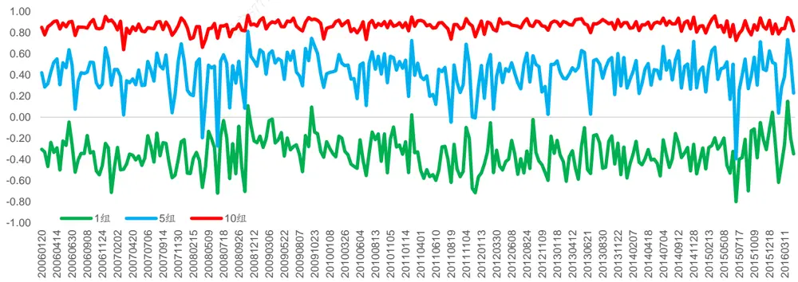
资料来源：WIND资讯，海通证券研究所

观察上图可知，量价相关性的截面特征较为稳定。在不同的时点上，市场上总有 10%的股票其量价在中短期内高度正相关，其平均相关性高于 0.8（可参考第 10组表现）。与此同时，市场上也存在股票其量价有着一定的负相关性。在整个时间段上，市场上有10%的股票其量价相关性在-0.6 与-0.4 之间。当然这种截面特征在部分极端市场环境下会受到较大的影响，例如 2008 年年底、2015 年 6 月、2016 年 1 月初。换句话说，量价同向与量价背离的股票是持续存在的。

## 2. 选股因子历史表现回测

本节使用 2006 年以来的数据对于量价相关性因子历史表现进行回测。考虑到量价相关性因子覆盖时间范围较短，本文使用半个月作为调仓周期，考虑双边 0.3%的交易费用。在选股调仓时按照新股不买、涨停不买、跌停不卖、停牌不调的原则从全 A范围内选股。

## 2.1 因子分组收益情况

在整个回测时间段中，以半个月为持仓周期在不同调仓时点按照量价相关性将市场上所有可交易股票分成 10 组并统计各组别的股票在下一个持仓期内相对于市场平均收益的超额收益。下表给出了不同分组股票的绝对收益以及超额收益。

表 1 量价相关性选股因子分组表现情况

| 分组 | 绝对收益 | T统计量 | 超额收益 | T统计量 |
| --- | --- | --- | --- | --- |
| 1 | 1.65% | 3.48 专载 | 0.23% | 2.53 |
| 2 | 1.64% | 3.34 | 0.23% | 2.86 |
| 3 | 1.48% | 3.04 传播与转 | 0.07% | 1.03 |
| 4 | 1.51% | 3.04 | 0.09% | 1.42 |
| 5 | 1.39% | 2.81 | -0.02% | -0.33 |
| 6 | 1.35% | 2.75 | -0.06% | -1.08 |
| 7 | 1.29% | 2.60 | -0.12% | -2.02 |
| 8 | 1.22% | 2.43 | -0.20% | -2.93 |
| 9 | 1.02% | 2.04 | -0.40% | -5.89 |
| 10 | 0.58% | 1.15 | -0.83% | -8.96 |
| 多空 | 1.07% | 6.94 | 1.07% |  |
| 多头 | 0.33% | 3.85 | 0.33% | 6.94 |
| 空头 | 0.73% | 8.53 | 0.73% | 3.85 8.53 |

资料来源：WIND资讯，海通证券研究所

从半个月的维度上看，该因子具有较为显著的多空收益。若将多空收益进行分拆可以发现，多空收益中，多头收益约占 30%而空头收益约占 70%，所以可以说因子具有较强的空头效应。进一步观察多头端组合（第 1组、第 2组）可以发现组合收益表现区分度较低，而空头端组合（第 9 组、第 10 组）从收益上看依旧具有较强的区分效果。（下图给出了不同因子分组股票的平均收益表现）所以从因子分组上看，该因子多空收益明显，且因子空头收益更强。

图2 量价相关性选股因子超额收益
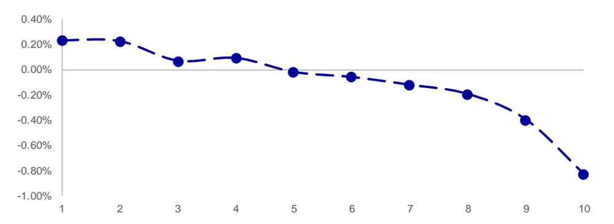
资料来源：WIND资讯，海通证券研究所

为了能够更加具体的体现因子对于股票的区分效果，可观察因子 IC 以及 Rank IC的分布情况。下表统计了整个回测时段上 IC、Rank IC的分位数以及 T 统计量。

表 2 IC 以及 Rank IC 分布情况

| 分位数 | 10% | 20% | 30% | 40% | 50% | 60% | 70% | 80% | 90% |
| --- | --- | --- | --- | --- | --- | --- | --- | --- | --- |
| IC | -0.12 | -0.09 | -0.07 | -0.04 | -0.02 | -0.01 | 0.01 | 0.03 | 0.07 |
| T统计量 | -5.10 | -3.99 | -2.92 | -1.88 | -1.01 | -0.35 | 0.47 | 1.24 | 3.13 |
| ranklC | -0.14 | -0.11 | -0.09 | -0.06 | -0.05 | -0.03 | 0.00 | 0.03 | 0.07 |
| T统计量 | -6.58 | -4.76 | -3.85 | -2.55 | -1.98 | -1.15 | -0.20 | 1.02 | 2.97 |

资料来源：WIND资讯，海通证券研究所

观察因子 IC 以及 Rank IC 可知，IC 因子在超过 40%的时段上显著为负，Rank IC在超过 60%的时段上为负。从 IC以及 Rank IC 来看，量价相关性对于股票收益有着较好的预测区分效果。

## 2.2 因子分组风险特征

在对于因子分组收益进行讨论时，不可避免的需要讨论到该因子对于常见风险因子的暴露。A股市场中许多选股因子之所以能够有着惊人的表现是由于这些因子具有十分明显的小市值、前期低涨幅或者低换手的特征。所以本节将重点考察量价相关性因子股票分组对于上述风险因子的暴露。（市值、反转、流动性）

首先可统计不同因子股票分组的市值分位数分布特征。之所以使用市值分位数是因为股票的市值分布并不稳定，同样市值大小的股票在不同时点会有不同的分类。下图给出了不同因子分组股票的市值分位数均值。

图3 量价相关性选股因子市值分布特征
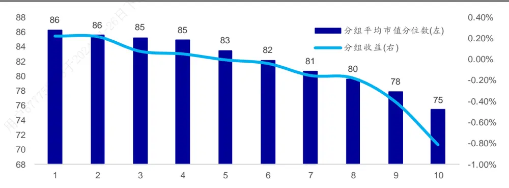
资料来源：WIND资讯，海通证券研究所

根据上图可知，因子多头组合具有一定的大市值暴露，多头组合股票（第 1 组）的平均市值偏高，而空头组合股票（第 10 组）平均市值偏低。此外，不同股票分组市值分位数相差较小，多头组为 86，而空头组合为 75。所以，量价相关性选股因子具有一定的大市值暴露，与市值因子略微负相关。

以下两图分别展示了不同股票分组的前 个月平均涨幅以及前 个月平均涨幅。之所以统计这两个指标是因为A股市场中1个月反转以及3个月反转对于股票收益有着十分明显的预测区分效果。

根据下图可知，因子对于 1 个月反转有着十分明显的暴露。多头组合前 1 个月平均涨幅偏低，而空头组合前 1个月平均涨幅偏高。

图4 量价相关性选股因子前 1个月涨幅分布特征
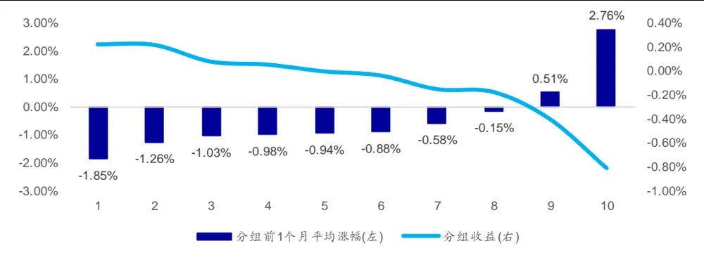
资料来源：WIND资讯，海通证券研究所

股票分组在 3个月涨幅上的分布并未呈现出明显的单调性，仅呈现出“两头高，中间低”的特点。多空组合股票前 3个月平均涨幅并没有明显区别。

图5 量价相关性选股因子前 3个月涨幅分布特征
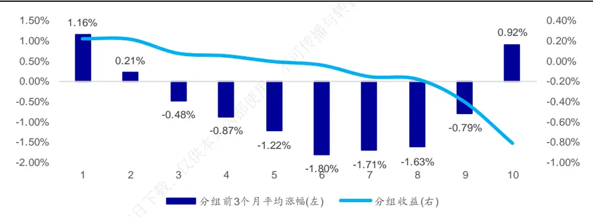
资料来源： 资讯，海通证券研究所

下图对于各股票分组前 1 个月的日均换手率。通过下图可知，该因子对于低换手率有一定风险暴露。多头组合股票前期换手率偏低且随着组别的上升而逐渐升高，空头组合换手率偏高。

图6 量价相关性选股因子换手率分布特征(单位：%)
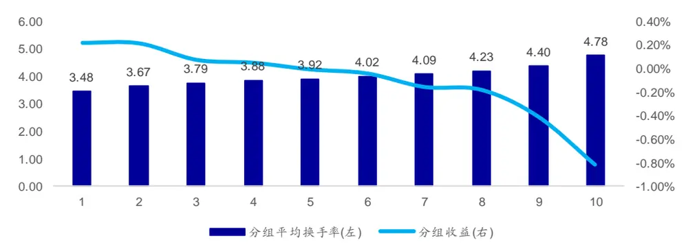
资料来源：WIND资讯，海通证券研究所

结合上述分析可知：量价相关性因子与市值负相关，与 1 个月反转正相关，与 3个月反转相关性偏低，与换手率正相关。多头组合股票呈现“大市值、前 1个月低涨幅、前期低换手”的特征。

## 2.3 多空组合表现情况

前两节从截面的角度对于因子各方面的特征进行了总结，本节将从多空组合的角度对于因子在时间序列上的表现进行讨论。本报告使用 2006 年以来的数据，以半个月为换仓周期，每次换仓选取因子值最低的 10%的股票等权重构建多头组合、选取因子值最高的 10%的股票等权重构建空头组合，并做多多头组合、做空空头组合形成多空组合。下图给出了多空组合 2006 年以来的表现情况。

图7 多空组合历史表现
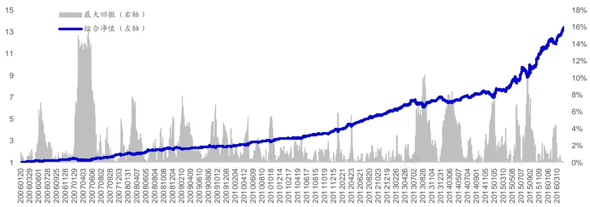
资料来源：WIND资讯，海通证券研究所

多空组合在整个回测区间上年化收益达 29%，区间最大回撤为 16%，IR值达 2.55，持仓期胜率为 72%（多头组合年化收益 29%，空头组合年化收益 1%）。因子在市值上的特征使得多空组合在 2014 年 12 月仅出现了 8%左右的回撤。多空组合最大回撤发生在 2007 年 4 月。下表对于多空组合历年来的表现进行了统计。

表 3 多空组合分年度表现情况

| 年度 | 年度收益 | 最大回撤 | 收益回撤比 信息比率 | 持仓期胜率 |
| --- | --- | --- | --- | --- |
| 2006 | 33% 7% | 4.68 | 3.99 | 78% |
| 2007 | 29% 16% | 1.81 | 2.18 | 72% |
| 2008 | 38% 8% | 4.83 | 2.95 | 63% |
| 用 2009 | 6% 7% | 0.88 | 0.79 | 70% |
| 2010 | 27% 5% | 5.03 | 2.71 | 72% |
| 2011 | 27% 3% | 8.46 | 3.37 | 76% |
| 2012 | 41% 6% | 7.03 | 4.60 | 83% |
| 2013 | 25% 10% | 2.39 | 2.46 | 71% |
| 2014 | 1% 8% | 0.14 | 0.20 | 60% |
| 2015 | 67% 10% | 6.69 | 4.25 | 70% |
| 2016 | 14% 4% | 3.24 | 6.38 | 86% |

资料来源：WIND资讯，海通证券研究所

## （注：表中 2016 年收益为年化收益）

分年度来看，多空组合收益表现较为稳定。在常见因子表现较差的 、 年中，因子多空组合都能有 的年化收益，信息比率分别为 以及 。当然需要注意的是多空组合在 2009 年以及 2014 年中表现较差。该因子极具特点的分年度表现可以被概括为“熊市强，牛市弱”。本报告将在有效性分析一章中对于因子有效以及失效的原因进行详细分析。

## 2.4 Famma-French 模型 Alpha 检验

为了能够更深入地对于因子的 Alpha 进行分析，本节借助 Famma-French 模型对于因子多空组合的表现进行归因并检验因子是否具有显著的 Alpha。模型使用因子多空组合持仓期收益序列为因变量，使用 Famma-French 三因素（MKT、SMB、HML）加上UMD 为自变量。回归模型如下：

$$
r^{ls}=\alpha+\beta_{MKT}MKT+\beta_{SMB}SMB+\beta_{HML}HML+\beta_{UMD}UMD
$$

其中，MKT 为市值加权的市场平均收益率，SMB为市值最小的 30%的股票的平均收益减去市值最大的 的股票的平均收益， 为 最高的 的股票的平均收益减去 PB最低的 30%的股票的平均收益，UMD 为前 1 个月涨幅最高的 30%的股票的平均收益减去前 1 个月涨幅最低的 30%的股票的平均收益。

下表给出了回归结果。回归结果表明量价相关性因子在剔除了市值效应、反转效应、流动性效应以及行业效应后具有显著为正的 Alpha，在半个月的维度上，Alpha 约为1.05%。该结果也表明，将量价相关性因子纳入到多因子选股模型中能给组合带来额外的 Alpha 增长。

表 4 回归结果

| 回归系数 | T统计量 P值 |
| --- | --- |
| Alpha 1.05% 传播 | 6.82 0.00% |
| MKT -0.06 不可 | -2.75 0.63% |
| SMB -0.21 | -4.68 0.00% |
| HML 0.33 | 4.62 0.00% |
| UMD -0.16 | -3.30 0.11% |

资料来源：WIND资讯，海通证券研究所

## 2.5 风险因子剔除

前文统计结果表明量价相关性因子与反转以及换手正相关，与市值负相关。考虑到市值、反转以及换手率在 A股市场中具有十分显著的选股效果，可通过截面回归取残差的方式对于上述常见因子进行剔除。考虑到行业因素同样对于股票收益有较高的影响，在回归时也进行行业的剔除。回归模型详见下式：

$$
corr_{i}=\beta_{MktVal}MktVal+\beta_{Rev1m}Rev1m+\beta_{Rev3m}Rev3m+\beta_{Turn}Turn+\beta_{Ind}Ind
$$

其中，corr 为股票对应的量价相关性，MktVal为股票市值，Rev1m 为股票前 1个月涨幅，Rev3m 为股票前 3 个月涨幅，Turn 为股票前期平均日换手率，Ind 为行业虚拟变量。

使用剔除风险因子后的因子值可按照前文规则构建选股组合。股票分组的风险特征如下图所示。下图结果表明，截面回归取残差的剔除效果较好，各股票分组在市值、流动性以及反转上的特征较为接近。

图8 市值分位数分布特征
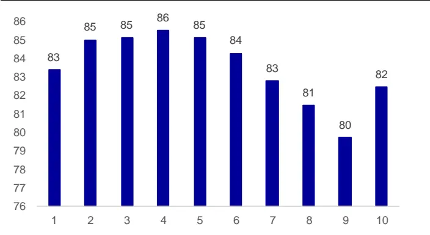
资料来源：WIND资讯，海通证券研究所

图9 月度日均换手率分布特征
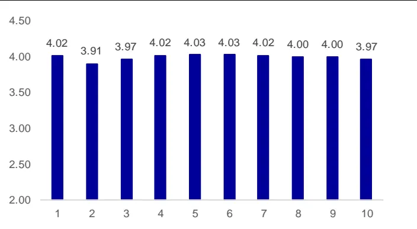
资料来源：WIND资讯，海通证券研究所

图10 前 1个月涨幅分布特征
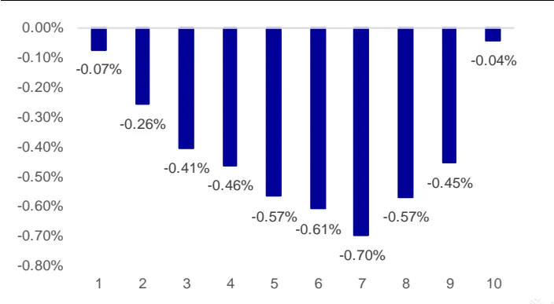
资料来源：WIND资讯，海通证券研究所

图11 前 3个月涨幅分布特征
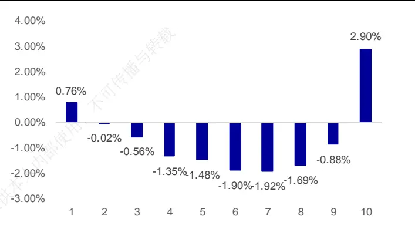
资料来源：WIND资讯，海通证券研究所

按照 2.1 中的规则可使用残差因子值构建股票分组并统计其收益情况。下表给出了不同股票分组的绝对收益以及相对收益情况。

| 分组 | 绝对收益 | T统计量 | 超额收益 | T统计量 |
| --- | --- | --- | --- | --- |
| 16 | 1.58% | 3.31 | 0.17% | 2.26 |
| 2 | 1.59% | 3.26 | 0.18% | 2.58 |
| 3 | 1.56% | 3.14 | 0.15% | 2.12 |
| 4 | 1.41% | 2.88 | 0.00% | -0.06 |
| 5 | 1.38% | 2.82 | -0.03% | -0.53 |
| 6 | 1.34% | 2.75 | -0.07% | -1.40 |
| 7 | 1.25% | 2.50 | -0.17% | -2.77 |
| 8 | 1.20% | 2.42 | -0.21% | -3.29 |
| 9 | 1.04% | 2.10 | -0.37% | -5.91 |
| 10 | 0.84% | 1.67 | -0.57% | -7.91 |
| 多空 | 0.74% | 7.74 | 0.74% | 7.74 |
| 多头 | 0.26% | 3.96 | 0.26% | 3.96 |
| 空头 | -0.48% | 8.38 | -0.48% | 8.38 |

资料来源：WIND资讯，海通证券研究所

从半个月的维度上看，剔除各风险因子后的因子依旧具有显著的多空收益但是多空收益从之前的 1%下降至 0.7%。多头收益占多空收益的 30%，而空头收益占 70%。因子空头效应依旧较强。下图给出了各股票分组的超额收益分布情况。

图12 量价相关性选股因子超额收益
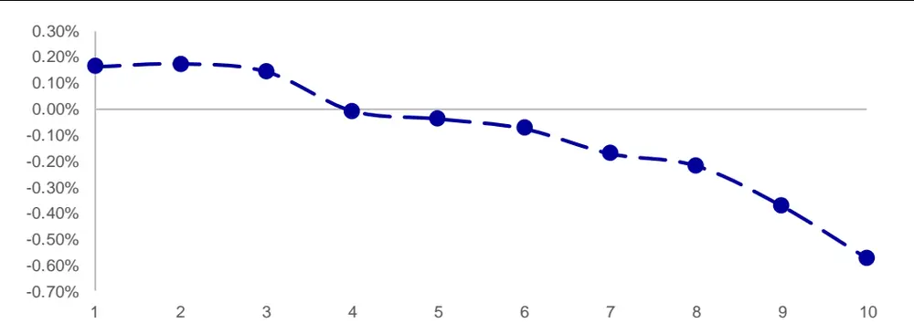
资料来源：WIND资讯，海通证券研究所

使用 2.3 中的规则同样可构建多空组合。下表给出了残差因子的多空组合净值走势。多空组合年化收益为 20%，区间最大回撤为 7%，IR 值达 2.78，持仓期胜率为 74%。虽然多空收益相对于剔除风险因子前有所降低，但是组合 IR 值出现了明显上升。

图13 多空组合历史表现
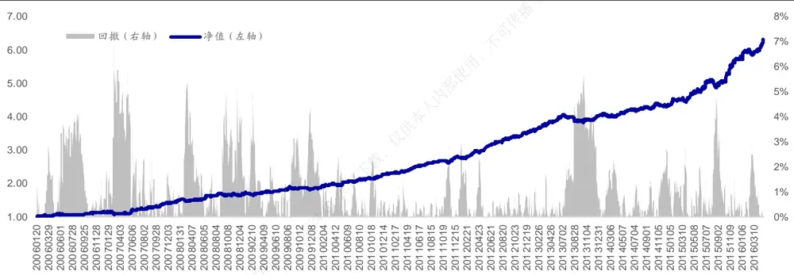
资料来源：WIND资讯，海通证券研究所

下表给出了多空组合分年度的表现情况。（2016 年为年化收益）

表 5 多空组合分年度表现情况

| 年度 | 年度收益 | 最大回撤 | 收益回撤比 | 信息比率 | 持仓期胜率 |
| --- | --- | --- | --- | --- | --- |
| 2006 | 14% | 4.19% | 3.37 | 2.04 | 70% |
| 2007 | 25% | 6.77% | 3.65 | 2.47 | 72% |
| 2008 | 20% | 5.49% | 3.65 | 2.16 | 63% |
| 2009 | 9% | 4.66% | 1.92 | 1.34 | 70% |
| 2010 | 23% | 2.69% | 8.68 | 3.75 | 84% |
| 2011 | 23% | 2.85% | 8.03 | 5.26 | 88% |
| 2012 | 27% | 2.31% | 11.83 | 5.46 | 83% |
| 2013 | 15% | 5.70% | 2.57 | 2.84 | 63% |
| 2014 | 8% | 2.69% | 2.90 | 1.86 | 68% |
| 2015 | 33% | 4.86% | 6.88 | 4.07 | 78% |
| 2016 | 9% | 3.02% | 2.92 | 5.12 | 71% |

资料来源： 资讯，海通证券研究所

在剔除风险因子后，多空组合在大部分年度依旧有着稳定的表现，在 2009 年以及2014 年收益略逊于其他年份。此外，多空组合在 2010 年以及 2011 年依旧有着较好的收益表现。可以说，量价相关性因子的“熊市好，牛市差”的特征得到了很好的保存。在接下来一章中，本报告将对于因子有效性的来源进行分析。

## 3. 因子有效性分析

通过前文回测结果可知，量价相关性因子在大部分因子都失效的 2010、2011 年能够有着较好表现但是在大牛市中如 2009、2014 年以及 2015 年上半年中表现较差。所以我们初步认为该因子的有效与失效和市场所处的环境有很大联系。此处的市场环境具体是指存量资金博弈的市场环境以及增量资金入市的市场环境。

为了能够更加细致的分析量价相关性选股因子有效性的来源，我们需要对于量价背离以及量价同向所代表的量价形态进行进一步细分。通过结合股票前期涨幅以及量价相关性可将股票量价形态简单分为 类。对于量价背离且前期上涨的可以认为是缩量上涨，对于量价背离且前期下跌的可以认为是放量下跌，对于量价同向且前期上涨的可认为是放量上涨，而对于量价同向且前期下跌的可认为是缩量下跌。

从上述分类不难发现，量价同向的股票组合中实际上包含了放量上涨以及缩量下跌的股票，而量价背离的股票组合中实际上包含了放量下跌以及缩量上涨的股票。为了能够分析哪种量价形态实际贡献正向收益，哪种量价形态实际贡献负向收益，本报告从前期涨幅以及量价相关性两个维度在不同的调仓时点上对于市场上所有股票进行了分组并统计各股票组合在随后一个持仓期的收益表现。下表给出了各组合的收益表现情况。

表 6 各类量价形态组合收益表现情况

| 量价背离←-. --→量价同向 |  |  |  |  |
| --- | --- | --- | --- | --- |
| 1.54% | 1.44% | 1.40% | 1.24% 0.85% | 收益差 0.70% |
| 低涨幅高涨幅 | 1.52% 1.37% | 1.40% | 1.28% | 0.55% |
|  | 1.43% 1.51% |  | 0.97% 0.79% | 0.64% |
|  | 1.43% | 1.32% 1.15% | 1.25% 1.12% |  |
|  | 1.29% |  | 0.72% 0.23% | 0.71% |
| 收益差 0.34% | 1.20% 0.96% 0.47% | 0.88% 0.52% | 0.68% 0.56% | 0.97% 0.61% |

资料来源： 资讯，海通证券研究所

结合前期涨幅对于股票进行分组可知，放量下跌的股票（量价背离 低涨幅）在往后半个月的时间有着相对较好的表现，其平均收益为 1.54%，而放量上涨的股票（量价同向+高涨幅）在随后半个月的表现相对较差，其平均收益仅有 0.23%。但是缩量下跌以及缩量上涨的股票表现较为平庸，其平均收益分别为 以及 。所以可以认为量价相关性选股因子多头收益来源于放量下跌的标的，而空头收益来源于放量上涨的标的。此外放量上涨带来的空头收益更加明显。

基于上述分析结果可进一步探讨为什么放量下跌 放量上涨的量价形态在熊市对于股票收益具有较好的收益预测区分效果而在牛市中预测区分效果较差。在熊市中，市场往往处于存量资金博弈的环境。对于那些放量上涨的股票，股票前期上涨过程中经历了大量的资金流入。而在存量资金博弈的市场中，资金追捧对象会随着市场热点切换而变动很少长时间维持在同一股票上。由于资金推动的不可持续性，此种量价形态的股票的上涨势头很难持续。故而会导致股票在随后一段时间内的相对表现较差。对于放量下跌的股票，此种价格形态代表股票在下跌过程中经历了大幅换手，下行压力得到了充分释放。故而在未来中的表现并不会太差。这也解释了为什么因子的多头收益偏小而空头收益偏大。当然，上述分析逻辑都是基于市场处于存量资金博弈的假设之下的。增量资金入市的市场环境会使得上述分析逻辑失效，故而会导致因子的失效。

## 4. 因子叠加效果展示

有效性分析结果表明，量价相关性因子结合反转因子能够进一步提升选股效果。本节将简单展示选股效果的提升情况。

可按照第 2章中的规则构建多空组合并以等权的方式使用量价相关性以及半个月反转对于市场上所有股票进行打分。多空组合净值表现如下图所示。

图14 多空组合历史表现
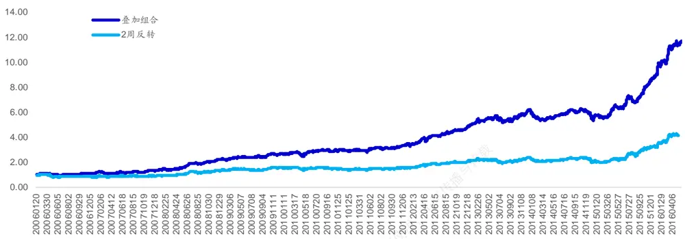
资料来源：WIND资讯，海通证券研究所

两周反转组合年化收益为 ，而叠加组合（两周反转 量价相关性）年化收益达。两周反转组合多头组合收益为 ，而叠加组合多头收益为 。对于 个月反转因子，量价相关性在半个月的持仓期上同样也有较好的叠加效果。下表展示了多空组合的净值走势。

图15 多空组合历史表现
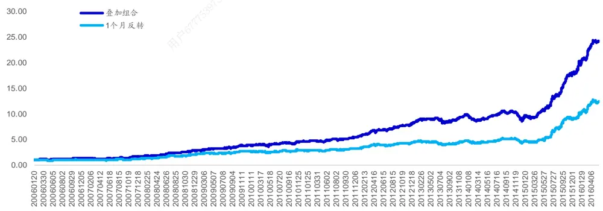
资料来源： 资讯，海通证券研究所

1 个月反转组合在整个回测区间年化收益为 29%，而叠加组合年化收益达 37%。1个月反转组合多头年化收益为 28%，而叠加组合多头年化收益达 33%。

通过简单的组合构建可以发现，量价相关性选股因子与经典的反转因子具有极好的叠加效果。

## 5. 结论

本报告将股票在短期内的量价走势分类为量价背离与量价同向，并通过量价相关性来衡量量价走势的背离/同向程度。通过回测，我们发现量价相关性在半个月的换仓周期下具有十分好的选股效果并具有显著的 Alpha。此外，多空组合在常见因子表现较差的2010 年以及 2011 年都有着十分稳定的表现。在控制了常见风险因子后，该因子依旧对于股票收益具有较好的区分效果。通过对于股票量价走势的进一步细分，我们发现放量上涨的股票在随后持仓期的表现较差，而放量下跌的股票在随后的表现会更好。因子的选股逻辑主要在存量资金博弈的市场环境下更为适用，并且和反转因子有着很好的叠加下过。

本报告从量价相关性的角度对于量价结合的选股因子的构建进行了尝试并得到了较好的效果。我们也将在后续报告中对于量价结合的选股因子进行更加深入的挖掘。

# 信息披露

分析师声明

[Table高道德

袁林青金融工程研究团队

本人具有中国证券业协会授予的证券投资咨询执业资格，以勤勉的职业态度，独立、客观地出具本报告。本报告所采用的数据和信息均来自市场公开信息，本人不保证该等信息的准确性或完整性。分析逻辑基于作者的职业理解，清晰准确地反映了作者的研究观点，结论不受任何第三方的授意或影响，特此声明。

## 法律声明

本报告仅供海通证券股份有限公司（以下简称“本公司”）的客户使用。本公司不会因接收人收到本报告而视其为客户。在任何情况下，本报告中的信息或所表述的意见并不构成对任何人的投资建议。在任何情况下，本公司不对任何人因使用本报告中的任何内容所引致的任何损失负任何责任。

本报告所载的资料、意见及推测仅反映本公司于发布本报告当日的判断，本报告所指的证券或投资标的的价格、价值及投资收入可能播会波动。在不同时期，本公司可发出与本报告所载资料、意见及推测不一致的报告。可

市场有风险，投资需谨慎。本报告所载的信息、材料及结论只提供特定客户作参考，不构成投资建议，也没有考虑到个别客户特殊的用，投资目标、财务状况或需要。客户应考虑本报告中的任何意见或建议是否符合其特定状况。在法律许可的情况下，海通证券及其所属部关联机构可能会持有报告中提到的公司所发行的证券并进行交易，还可能为这些公司提供投资银行服务或其他服务。

本报告仅向特定客户传送，未经海通证券研究所书面授权，本研究报告的任何部分均不得以任何方式制作任何形式的拷贝、复印件或供复制品，或再次分发给任何其他人，或以任何侵犯本公司版权的其他方式使用。所有本报告中使用的商标、服务标记及标记均为本公司的商标、服务标记及标记。如欲引用或转载本文内容，务必联络海通证券研究所并获得许可，并需注明出处为海通证券研究所，且下不得对本文进行有悖原意的引用和删改。

根据中国证监会核发的经营证券业务许可，海通证券股份有限公司的经营范围包括证券投资咨询业务。24

## 海通证券股份有限公司研究所[Table_PeopleInfo]

| 路颖 所长 (021)23219403 luying@htsec.com | 高道德 副所长 (021)63411586 | gaodd@htsec.com | 姜超 (021)23212042 jc9001@htsec.com | 副所长 |  |
| --- | --- | --- | --- | --- | --- |
| 江孔亮 副所长 (021)23219422 kljiang@htsec.com | 邓勇 所长助理 (021)23219404 dengyong@htsec.com |  |  | 荀玉根 所长助理 (021)23219658 xyg6052@htsec.com |  |
| 钟奇 所长助理 (021)23219962 zq8487@htsec.com |  |  |  |  |  |
| 宏观经济研究团队 金融工程研究团队 金融产品研究团队 姜 超(021)23212042 jc9001@htsec.com 高道德(021)63411586 |  |  |  |  |  |
| 顾潇啸(021)23219394 联系人 于 博(021)23219820 秦 泰(021)23154127 梁中华(021)23154142 王 丹(021)23219885 许晟洁(021)23154137 | gxx8737@htsec.com yb9744@htsec.com qt10341@htsec.com Izh10403@htsec.com wd9624@htsec.com xsj10379@htsec.com | 吴先兴(021)23219449 冯佳睿(021)23219732 张欣慰(021)23219370 郑雅斌(021)23219395 沈泽承(021)23212067 余浩淼(021)23219883 袁林青(021)23212230 联系人 罗 蕾(021)23219984 | gaodd@htsec.com wuxx@htsec.com fengjr@htsec.com zxw6607@htsec.com zhengyb@htsec.com szc9633@htsec.com yhm9591@htsec.com ylq9619@htsec.com II9773@htsec.com 姚 石021-23219443 ys10481@htsec.com | 高道德(021)63411586 倪韵婷(021)23219419 陈 瑶(021)23219645 唐洋运(021)23219004 田本俊(021)23212001 纪锡靓(021)23219948 联系人 王毅（021）23219819 谈 鑫(021)23219686 | gaodd@htsec.com niyt@htsec.com chenyao@htsec.com tangyy@htsec.com tbj8936@htsec.com jxj8404@htsec.com 宋家骥(021)23212231 sjj9710@htsec.com |
| 固定收益研究团队 |  | 吕丽颖 021-23219745 颜 伟(021)23219914 周一洋(021)23219774 策略研究团队 | yw10384@htsec.com zyy10866@htsec.com | 皮 灵021-23154168 徐燕红 中小市值团队 | pl10382@htsec.com |
| 姜 超(021)23212042 |  |  |  |  |  |
| 周 霞(021)23219807 | jc9001@htsec.com zx6701@htsec.com | 荀玉根(021)23219658 钟 青(010)56760096 | xyg6052@htsec.com | 钮宇鸣(021)23219420 张宇（021）23219583 zy9957@htsec.com | ymniu@htsec.com |
| 联系人 |  | 李 珂(021)23219821 | lk6604@htsec.com | 刘 宇(021)23219608 | liuy4986@htsec.com |
| 张卿云(021)23219445 | zqy9731@htsec.com | 高 上(021)23154132 | gs10373@htsec.com | 孔维娜(021)23219223 | kongwn@htsec.com |
| 朱征星(021)23219981 | zzx9770@htsec.com | 联系人 |  | 联系人 |  |
| 张 雯(021)23154149 | zw10199@htsec.com | 申浩(021)23154117 | sh10156@htsec.com | 潘莹练(8621)23154122 pyl10297@htsec.com |  |
| 姜珮珊(021)23154121 | jps10296@htsec.com | 郑英亮 021-23154147 | zyl10427@htsec.com |  |  |
| 李雨嘉(021)23154136 | lyj10378@htsec.ocm |  |  |  |  |
| 政策研究团队 李明亮(021)23219434 |  | 批发和零售贸易行业 汪立亭(021)23219399 | wanglt@htsec.com | 石油化工行业 邓 勇(021)23219404 | dengyong@htsec.com |
| 陈久红(021)23219393 吴一萍(021)23219387 朱 蕾(021)23219946 zl8316@htsec.com | Iml@htsec.com chenjiuhong@htsec.com wuyiping@htsec.com | 联系人 王晴 021-23154116 王汉超 021-23154125 | wq10458@htsec.com whc10335@htsec.com | 联系人 朱军军（021）23154143 毛建平(021)23154134 | zjj10419@htsec.com mjp10376@htsec.com |
| 周洪荣(021)23219953 王 旭(021)23219396 电力设备及新能源行业 | zhr8381@htsec.com wx5937@htsec.com |  |  | 殷奇伟(021)23154139 | yqw10381@htsec.com |
| 周旭辉(021)23219406 牛 品(021)23219390 | zxh9573@htsec.com np6307@htsec.com | 有色金属行业 施 毅(021)23219480 刘 博(021)23219401 | sy8486@htsec.com liub5226@htsec.com | 医药行业 余文心(0755)82780398 郑 琴(021)23219808 | ywx9461 @htsec.com zq6670@htsec.com |
| 房 青(021)23219692 徐柏乔(021)32319171 杨 帅(010)58067929 | fangq@htsec.com xbq6583@htsec.com | 田 源 23214119 ty10235@htsec.com 联系人 |  | 孙 建(021)23154170 联系人 | sj10968@htsec.com |
| 联系人 | ys8979@htsec.com |  | 杨娜(021)23154135 yn10377@htsec.com | 高 岳(010)50949923 师成平010-50949927 | gy10054@htsec.com |
|  | 曾彪(021)23154148 zb10242@htsec.com |  |  | 廖庆阳 01068067998 | scp10207@htsec.com |
| 张向伟 zxw10402@htsec.com |  |  |  |  | lqy10100@htsec.com |
| 汽车行业 |  | 非银行金融行业 |  | 交通运输行业 |  |
| 邓 学(0755)23963569 联系人 | dx9618@htsec.com | 孙 婷(010)50949926 | st9998@htsec.com | 虞 楠(021)23219382 | yun@htsec.com |
|  |  | 联系人 |  | 联系人 |  |
|  | 谢亚彤(021)23154145 xyt10421@htsec.com |  | 何 婷 021-23219634 ht10515@htsec.com |  |  |
|  |  |  |  | 童 宇(021)23154181 ty10949@htsec.com |  |
| 王猛 |  |  |  |  |  |
| 纺织服装行业 |  |  |  |  |  |
|  |  | 房地产行业 |  | 机械行业 |  |
| 于旭辉 |  |  |  |  |  |
|  |  |  |  | 联系人 |  |
|  |  |  | 涂力磊(021)23219747 tll5535@htsec.com |  |  |
| 唐 苓(021)23212208 tI9709@htsec.com |  |  | 谢 盐(021)23219436 xiey@htsec.com | 韩鹏程(021)23219963 | hpc9804@htsec.com |
| 电子行业 |  | 基础化工行业 |  | 钢铁行业 |  |
| 陈 平(021)23219646 cp9808@htsec.com |  | 刘 威(0755)82764281 李明刚 18610049678 刘 强 021-23219733 联系人 | Iw10053@htsec.com Img10352@htsec.com lq10643@htsec.com | 刘彦奇(021)23219391 liuyq@htsec.com |  |
|  |  | 刘海荣 23154130 Ihr10342@htsec.com |  |  |  |
| 建筑工程行业 联系人 金 川(021)23219957 | jc9771@htsec.com bch10483@htsec.com | 建筑建材行业 |  | 农林牧渔行业 |  |
|  |  | 邱友锋(021)23219415 钱佳佳(021)23212081 | qyf9878@htsec.com qjj10044@htsec.com | 丁 频(021)23219405 联系人 | dingpin@htsec.com |
|  |  | 联系人 |  | 陈雪丽(021)23219164 | cxl9730@htsec.com |
|  |  | 冯晨阳(021)23154019 | fcy10886@htsec.com | 陈 阳(010)50949923 关 慧(021)23219448 叶云开(021)23154138 | gh10375@htsec.com yyk10380@htsec.com |
| 公用事业 |  | 食品饮料行业 |  | 军工行业 |  |
| 联系人 张一弛(021)23219402 zyc9637@htsec.com |  | 闻宏伟(010)58067941 whw9587@htsec.com |  | 徐志国(010)50949921 xzg9608@htsec.com |  |
| 赵树理(021)23219748 zsl10869@htsec.com |  | 孔梦遥(010)58067998 kmy10519@htsec.com |  | 联系人 |  |
|  |  | 联系人 成珊(021)23212207 cs9703@htsec.com |  | 赵晨 zc9848@htsec.com |  |
| 通信行业 |  |  |  | 张恒晅 zhx10170@hstec.com |  |
| 朱劲松 010-50949926 zjs10213@htsec.com |  | 煤炭行业 吴 杰(021)23154113 wj10521@htsec.com |  | 银行行业 林媛媛(0755)23962186 lyy9184@htsec.com |  |
| 联系人 彭 虎 010-50949926 |  | 李 淼（010）58067998Im10779@htsec.com 联系人 |  |  |  |
| ph10267@htsec.com 夏庐生 010-50949926 xls10214@htsec.com |  | 戴元灿 23154146 dyc10422@htsec.com |  |  |  |
| 社会服务行业 |  | 家电行业 可传播与转载 |  | 互联网及传媒 |  |
| 联系人 陈扬扬(021)23219671 cyy10636@htsec.com |  | 陈子仪(021)23219244 chenzy@htsec.com |  | 钟 奇(021)23219962 zq8487@htsec.com 联系人 |  |
|  |  | 内部使用， |  | 孙小雯(021)23154120 sxw10268@htsec.com 强超廷(021)23154129 qct10912@htsec.com |  |
| 造纸轻工行业 曾 知(021)23219810 zz9612@htsec.com |  | 计算机行业 |  |  |  |
|  |  | 郑宏达 021-23219392 zhd10834@htsec.com |  |  |  |
| 联系人 黄竞晶 021-23154131 hjj10361@htsec.com |  | 谢春生（021）23154123 xcs10317@htsec.com |  |  |  |

## 研究所销售团队

| 深广地区销售团队 |  |  | 上海地区销售团队 |  |  | 北京地区销售团队 |  |  |  |
| --- | --- | --- | --- | --- | --- | --- | --- | --- | --- |
| 蔡铁清 | (0755)82775962 | ctq5979@htsec.com |  | 朱健 (021)23219592 zhuj@htsec.com |  | 殷怡琦 李铁生 | (010)58067988 |  | yyq9989@htsec.com |
| 刘晶晶 | (0755)83255933 | liujj4900@htsec.com | 胡雪梅 |  | (021)23219385 huxm@htsec.com |  |  | (010)58067934 Its10224@htsec.com |  |
| 辜丽娟 | (0755)83253022 | gulj@htsec.com | 季唯佳 |  | (021)23219384 jiwj@htsec.com | 陈琳 | (010)58067929 |  | cl10250@htsec.com |
| 伏财勇 |  | (0755)23607963 fcy7498@htsec.com |  |  | 黄毓 (021)23219410 huangyu@htsec.com | 江虹 |  | (010)58067988 jh8662@htsec.com |  |
| 饶伟 |  | (0755)82775282 rw10588@htsec.com | 孟德伟 |  | (021)23219989 mdw8578@htsec.com |  | 李靓一 | (010)58067894 ljy10426@htsec.com |  |
|  |  | 王雅清 (0755)83254133 wyq10541@htsec.com | 漆冠男 |  | (021)23219281 qgn10768@htsec.com |  | 杨羽莎 | yys10962@htsec.com |  |
|  |  |  | 蒋炯 | jj10873@htsec.com |  |  |  |  |  |
|  |  |  | 毛文英 | (021)23219373 | mwy10474@htsec.com |  |  |  |  |
|  |  |  |  | 黄诚 (021)23219397 hc10482@htsec.com |  |  |  |  |  |
|  |  |  | 胡宇欣 | (021)23154192 | hyx10493@htsec.com |  |  |  |  |
|  |  |  | 方烨晨 | (021)23154220 | fyc10312@htsec.com |  |  |  |  |
|  |  |  | 杨祎昕 | (021)23212268 | yyx10310@htsec.com |  |  |  |  |

海通证券股份有限公司研究所

地址：上海市黄浦区广东路 689号海通证券大厦 9楼

电话：（021）23219000

传真：（021）23219392

网址：www.htsec.com