## 相关研究

[Table_ReportInfo]《选股因子系列研究（十二）——“量”

与“价”的结合》2016.06.27

分析师:郑雅斌

Tel:(021)23219395

Email:zhengyb@htsec.com

证书: S0850511040004

## 选股因子系列研究十三——因子大讲坛

## 投资要点：

本文收集了海内外常用的 种技术因子、 种财务因子进行选股效果的具体分析，并根据市场环境、风格等因素进行详细划分，考察因子有效性的稳定程度。

技术类因子对比财务类因子，能起到有效选股作用的数量占绝对优势。使用量价行情数据按月构建出的因子中，有 10 种因子的平均年化多空组合收益率超过8%，收益最高的两种因子（Size、Idiosyncratic Risk）分别达到 23.90%与 21.93%，有 种因子月收益显著异于 。这些因子与下月收益的秩相关系同向数显著的概率几乎都在 以上，连续两月相关性维持有效的概率也在 以上，说明因子的选股能力和持续性都较强。使用财务数据按季度构建出的因子中，仅 个因子有效，总体表现不如行情数据构建的因子。

- 在本期大盘上涨的情况下，因子构建的多空组合在下月的表现普遍优于总体情况；在本期大盘下跌的情况下，表现相反。上涨市更容易体现 和选股能力。绝大多数因子在上期市场上涨情况下的表现，要优于上期下跌的情况。我们选取的时间段，上证指数从 点上涨至 点，这表示因子对未来收益的预测能力会略有高估，但是全样本情况下因子对于未来超额收益的预测能力依然存在且显著。有部分因子在上月大盘上涨与下跌的情况下表现相反，这是该类因子在总体情况下表现不佳的原因之一。

- 在剔除市值因子的影响后，因子构建的多空组合的表现虽然略有降低，但是仍然具有对未来超额收益的预测能力。在剔除了市值因子的影响之后，使用行情数据的 种因子中有 种因子的年化多空收益率依然能够超过 ，收益最高的两种因子(Idiosyncratic Risk、Short-Term Reversal)分别达到 17.67%与 17.52%，表现总体上比剔除市值因子影响前略有不如，但是市值中性处理后因子稳定性有所提升。大部分因子选股能力保留，少部分因子的预测能力不复存在。财务因子情况类似。

剔除反转因子的影响后，因子构建的多空组合的表现略有降低，但仍具有对未来超额收益的预测能力。剔除了反转因子的影响之后，月度技术类 种因子中有种因子的平均年化多空组合收益率超过 10%，收益最高的两种因子（IdiosyncraticRisk、Volume Variance）分别达到 16.41%与 15.69%，因子的收益贡献能力降低，但是稳定性有所提升。

- 风险提示：市场系统性风险、资产的流动性风险、政策变动风险会对策略的最终表现产生较大影响。

本篇报告主要针对海内外常用的选股因子，进行批量的整理和分析，探讨多因子选股模型中，哪些因子能够更为有效的贡献收益，并进一步在不同风格和不同市场环境下，考察因子选股的有效性。

## 1. 多因子选股概述

多因子选股模型，主要是通过使用可以合理解释股票未来收益的因子构建收益稳定超过大盘指数的投资组合的方法。

表 1 构建多因子选股模型的流程

| 模型构建步骤 | 解释 |
| --- | --- |
| （一）构建因子池 | 根据经验总结、历史研究，寻找可能对股票未来收益具有解释力的因子。 |
| （二）对因子池中的因子进行有效性检验 | 通过根据因子的大小，构建单因子投资组合等方法，检验因子对于与未来收益预测的效力。 |
| （三）根据有效性检验的结果，构建多因子不可模型 | 根据单因子的有效性，选取合适的因子构建投资组合 |

资料来源：海通证券研究所

## 2. 因子分类

股票的数据主要可以分为两类：二级市场数据和基本面数据。其中，前者的更新频率是实时更新的；后者的更新频率则是季度更新（随财务报表同时更新）。所以，本篇报下告将因子分为两大类：月度因子（行情因子），季度因子（财务因子）。其中，两大类因6子又分别按自身的逻辑分成多个小类。01

表 2 月度因子分类

| 因子类型 | 因子名称 | 计算方法 |
| --- | --- | --- |
| 趋势类因子 | Lagged Momentum Long-Term Reversal | t-12:t-7 的持有收益 |
|  |  | t-60:t-13 的持有收益 |
|  | Momentum | t-6:t-1 的持有收益 |
|  | Momentum-Reversal | t-18:t-13 的持有收益 |
|  | Momentum-Volume | t-6:t-1 的持有收益，(仅成交额最大的 1/5) |
|  | Short-Term Reversal | 上月的持有收益 |
| 流动性因子 | Seasonality | 历史以来该月份的平均收益 |
|  | Equity | Volume/Market Value of 月成交额/当月流通股数一年均值 |
|  | Volume Variance Share Volume | 过去3年成交额的标准差 |
| 技术类因子 | 52-Week High | 日成交量/流通股数三个月均值 收盘价/过去一年中的最高价 |
|  | Max | 上月最大日收益 |
|  | Amihud's Measure | abs(日收益)/日成交量一年均值 |
|  | Coskewness | CAPM残差*（指数收益平方-指数收益平方均值） |
|  | Idiosyncratic Risk | /(均方根误差*指数日均收益)5年数据 |
| 风格类因子 | Size | 上月三因子模型残差的标准差 In(月底市值) |
|  | Beta |  |
|  | Price | cov(股票日收益，指数日收益)/var(指数日收益) In(月底收盘价) |

资料来源：公开资料，海通证券研究所

表 3 季度因子分类

| 因子类型 | 因子名称 | 计算方法 |
| --- | --- | --- |
| 估值类因子 田户677753973子 | Market Value Book Equity/Market Sales/Price Cash Flow/Market Value (净利润+摊销+折旧)/期末市值 of Equity Earnings/Price | 期末市值 本期所有者权益/期末市值 营业收入/期末收盘价 净利润/期末市值 |
| 盈利类因子 | Gross Profitability Profitability Percent Total Accrual Return-on-Equity G-Score | (t 期营业收入 - t 期营业成本) / t-1 期总资产 t 期净利润 / t-1 期总资产 (净利润-经营活动产生的现金流)/abs(净利润) 净利润/股东权益 满足后面8个条件的个数；1.净利润>0;2.经营现 金流>0;3.roe增长;4.经营现金流>净利润;5.长期 借款/总资产增长;6.流动资产/流动负债增 长;7.ebit/销售收入增长;8.销售收入/总资产增 长 |
| 成长类因子 | Asset Growth Change in Profit Margin Earnings Consistency Earnings Surprise Growth in Inventory Growth in LTNOA | 本期总资产/上期总资产-1 本期净利率-上期净利率 [(t 期 eps-t-1 期 eps)/(abs(t-1 期 eps)+abs(t-2 期 eps)/2)] 5 期 x_t / std(x) 9 期。 x_t = (eps_t - eps_t-4 - drift),drift = (eps_t-1 - eps_t-9)/2 存货增长/平均资产 [GRNOA-ACC]，GRNOA=NOA 变化，NOA=(应 收账款+存货+流动资产+固定资产+无形资产+其 他资产-应付账款-流动负债-其他负债)/总资产， |
|  | Revenue Surprises Sales Growth Sustainable Growth | ACC = (应收账款增加 + 存货增加 - 应付账款 增加 - 流动负债增加 - 其他负债增加 - 累计折 旧 - 累计摊销)/平均资产 同 Earnings Surprise，将 eps 改为营业收入即可 加权平均营业收入增长率序数 股东权益增长率 |
| 风险类因子 | Leverage Net Operating Assets Net Working Capital Changes Noncurrent Operating Assets Changes | 非流动负债/市值 (运营资产-运营负债)/总资产 ((流动资产-现金)-(流动负债-长期借款))/总资产 变化 ((总资产-流动资产)-(总负债-流动负债-长期借 款))/总资产变化 |
| 经营效率类因 子 | Asset Turnover Change in Turnover Profit Margin Enterprise Component of Book/Price Enterprise Multiple Leverage Component of网 Book/Price Tax Accruals -01-26日下载， | 营业收入/(NOA平均)；NOA=(应收账款+存货+ 流动资产+固定资产+无形资产+其他资产-应付 账款-流动负债-其他负债) Asset Asset Turnover 变化 ebit/营业收入 (股东权益+ND)/(ND+市值),ND=现金-长期借款- 短期借款-优先股 (市值-ND)/经营活动的现金流 (股东权益+优先股)/市值-Enterprise Component of Book/Price (销售费用+财务费用+管理费用+主营业务成本)/ 上期总资产 所得税/净利润 ((流动资产变化-现金变化)-（流动负债变化-短期 |

资料来源：公开资料，海通证券研究所

## 3. 单因子绩效检验

本部分使用如下方法来构建单因子投资组合：

对于月度因子来说，截止每月月底，使用该月及该月之前的数据，计算因子；根据计算因子的大小，将市场上所有可以进行交易的股票分为 10 组；我们通过检验多空组合（做多因子最小组合+做空因子最大组合）的收益来检验因子的绩效。

对于季度因子来说，截止每季末，使用截止至该时公布的最新财报数据进行因子计算，其余同上。

本部分主要分析多空组合的年化收益率、收益率的 t 值、多空组合的胜率（多空组合收益大于 0）、因子与下期收益秩相关系数的正向显著概率、负向显著概率、不显著概率、方向延续概率（连续两月秩相关系数符号相同）。

本篇报告选取的数据为 2000-2015 年底的数据；因子中涉及到指数的部分均选取上证指数；剔除了在期末涨停无法买入的股票；财务数据缺失部分均以上一期的数值计算。

## 3.1月度因子检验

本研究按月回测了 2000-2015 年的表 2 中的 18 种因子。其中，平均多空组合（做多因子最小组合+做空因子最大组合）年化收益绝对值在 8%以上的共计 10 种因子，多空组合收益显著异于0的共计10种因子，下面给出收益绝对值前10的因子组合统计表：

表 4 月度因子总体表现

| 因子 | 年化收 益率 | t值 | 胜率 | 偏度 | 正显著概 率 | 负显著概 率 | 不显著概 率 | 延续概 率 |
| --- | --- | --- | --- | --- | --- | --- | --- | --- |
| Size | 23.90% | 3.45 | 63.87% | -0.18 | 28.27% | 54.45% | 17.28% | 56.84% |
| Idiosyncratic Risk | 21.93% | 5.94 | 68.68% | 0.31 | 18.13% | 65.93% | 15.93% | 58.01% |
| Volume Variance | 19.94% | 3.22 | 62.18% | 0.75 | 26.92% | 51.92% | 21.15% | 58.06% |
| Short-Term Reversal | 18.09% | 3.71 | 62.83% | 0.20 | 21.99% | 58.12% | 19.90% | 54.74% |
| Price | 13.98% | 1.93 | 55.50% | -0.01 | 37.70% | 48.69% | 13.61% | 53.68% |
| Amihud's Measure | -13.31% | -2.23 | 37.87% | -0.43 | 52.78% | 30.56% | 16.67% | 56.98% |
| Max | 12.31% | 3.82 | 61.78% | 0.02 | 19.90% | 56.54% | 23.56% | 52.63% |
| Momentum | 10.12% | 1.75 | 57.53% | 0.06 | 29.57% | 50.54% | 19.89% | 49.19% |
| Share Volume | 8.27% | 1.63 | 59.14% | -0.60 | 28.49% | 52.69% | 18.82% | 47.57% |
| Seasonality | -8.04% | -3.19 | 41.11% | -0.48 | 41.67% | 18.89% | 39.44% | 56.42% |

资料来源： ，海通证券研究所

从上表中可见，在 2000 年到 2015 年期间，收益绝对值在 8%以上的 10 种因子中绝大多数对于选股都有效：

## 收益率有 9 种收益显著

- 年化收益率为正（负）的，其胜率均大于（小于）50%，其因子与下月收益的秩相关系数正（负）显著概率均为三种概率中最大的。这与我们对有效因子的认知相符。

- 此外，上述 10种因子中，除了最不显著的两种因子以外，其他因子连续两月秩相关系数符号相同的概率均超过 50%（即表格中的延续概率），这也从另一方面证明了这些因子对于收益预测的延续性。

图1 Size因子多空组合月收益分布
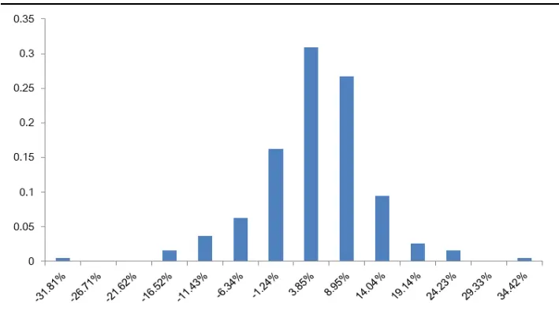
资料来源：Wind，海通证券研究所

图2 Idiosyncratic Risk 因子多空组合月收益分布
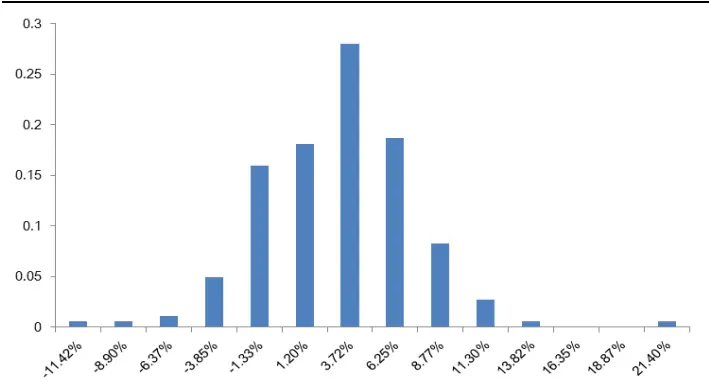
资料来源：Wind，海通证券研究所

从上面两张图可以看出，基于这两种因子分别构建的多空组合绝大多数的月收益均大于 0，产生较低负收益的概率均极低。这说明这两种因子可以在大概率上对未来的投资收益进行预测。

此外，若具体观察两个因子多空组合收益的分布情况，我们可以发现，Idiosyncratic

Risk 因子构建的组合收益要比 Size 因子构建的组合收益要稳定得多，即 Size 因子所构建的多空组合会发生更多高收益或低收益，其波动会比 Idiosyncratic Risk 因子构建的组合高得多。而这一点也应是投资者们在构建多因子模型时需要考虑到的问题。

图3 Size因子多空组合净值曲线
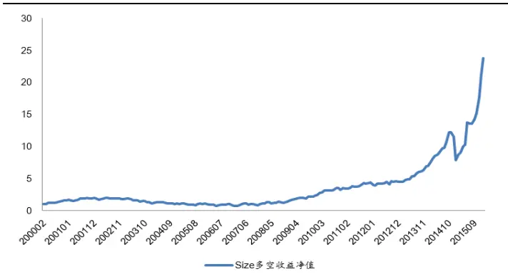
资料来源：Wind，海通证券研究所

图4 Idiosyncratic Risk 因子多空组合净值曲线
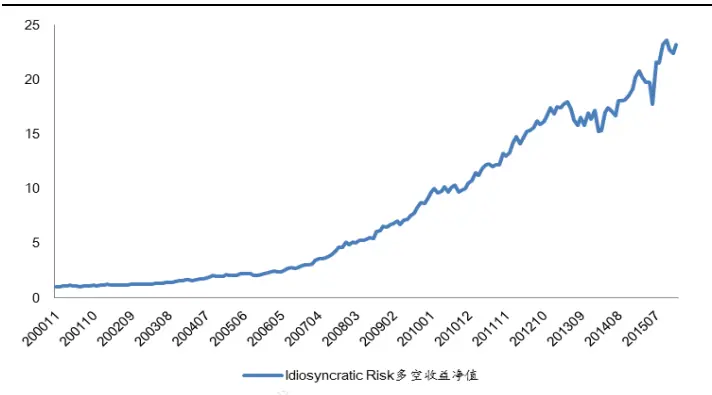
资料来源： ，海通证券研究所

从上面两张图来看，与我们之前的分析一致，Idiosyncratic Risk 因子构建的组合产生的收益比稳定得多。其中，Size 因子是 07 年以后才相对比较有预测的效力，而Idiosyncratic Risk 因子的表现则相对比较稳定。

综上所述，使用行情数据按月构建出的因子，对于未来的收益是具备相当的预测能力的。18种因子中有 10种因子的平均年化多空组合收益率超过 8%，收益最高的两种因子分别达到 23.90%与 21.93%，有 10种因子月收益显著异于 0。这些因子与下月收益的秩相关系同向数显著的概率几乎都在 50%以上，连续两月秩相关系数大于 0的概率也在 50%以上。这些都表明了按月构建出的因子可以在大概率上预测股票收益的未来表现。

## 3.2季度因子检验

本研究按季度回测了 2000-2015 年的表 3 中的 33 种因子。其中，平均多空组合年化收益绝对值在 8%以上的仅有 2种因子，多空组合收益显著异于 0的共计 5种因子，下面给出收益绝对值前 10 的因子组合统计表。

表 5 季度因子总体表现

| 因子 | 年化收 益率 | t值 | 胜率 | 偏度 | 正显著 概率 | 负显著 概率 | 不显著 概率 | 延续概 率 |
| --- | --- | --- | --- | --- | --- | --- | --- | --- |
| Change in Asset Turnover | -24.15% | -3.24 | 28.33% | 0.80 | 61.67% | 18.33% | 20.00% | 61.02% |
| Market Value | 14.83% | 1.83 | 54.84% | 0.17 | 33.87% | 51.61% | 14.52% | 54.10% |
| Revenue Surprises | -6.45% | -2.11 | 42.22% | -0.68 | 33.33% | 22.22% | 44.44% | 54.55% |
| Earnings Surprise | -5.35% | -1.10 | 46.67% | -2.41 | 35.56% | 35.56% | 28.89% | 38.64% |
| Operating Leverage | -5.04% | -1.67 | 41.67% | 1.33 | 44.26% | 18.03% | 37.70% | 38.33% |
| Debt Issuance | 4.98% | 0.79 | 66.67% | 0.46 | 19.67% | 26.23% | 54.10% | 57.89% |
| G-Score | -4.03% | -1.41 | 44.83% | -0.25 | 43.10% | 22.41% | 34.48% | 59.65% |
| Asset Growth | -3.98% | -1.30 | 41.38% | 2.67 | 37.70% | 18.03% | 44.26% | 40.00% |
| R&D_Market Value of Equity | 3.44% | 0.43 | 47.22% | 4.33 | 26.23% | 16.39% | 57.38% | 65.71% |
| Net Working Capital Changes | 3.34% | 2.78 | 63.79% | -0.13 | 9.84% | 11.48% | 78.69% | 55.00% |

资料来源：Wind，海通证券研究所

从上表中可见，在 2000 年到 2015 年期间，多空组合季度收益显著的 5 个因子均为平均年化收益排行前 10 的因子。然而根据这些因子构建的多空组合的表现情况来看，除了 Change in Asset Turnover 与 Market Value 这两个因子以外，其余因子在胜率、显著度或延续概率上的表现则有些不尽人意。

图5 Change in Asset Turnover 因子多空组合季收益分布
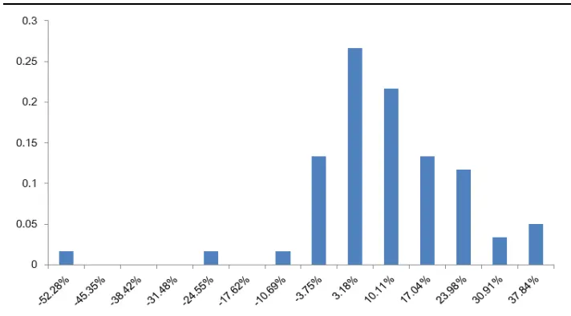
资料来源： ，海通证券研究所

图6 Market Value 因子多空组合季收益分布
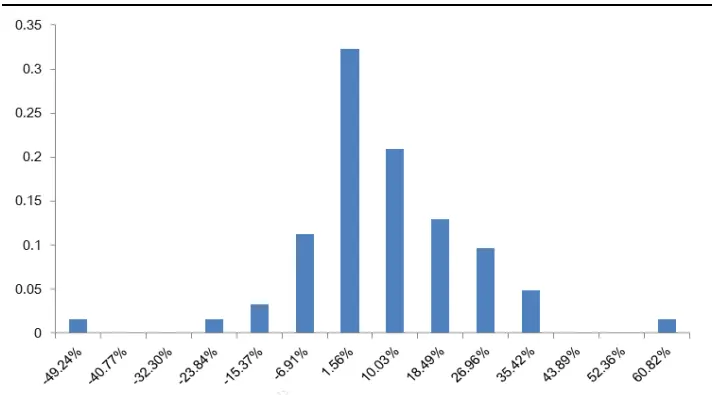
资料来源：Wind，海通证券研究所

从上面两张图可以看出，基于这两种因子分别构建的多空组合绝大多数的季收益均大于 0，产生较低负收益的概率均极低。这说明这两种因子可以在大概率上对未来的投资收益进行预测。

此外，若具体观察两个因子多空组合收益的分布情况，我们可以发现，Change inAsset Turnover 因子构建的组合收益要比 Market Value 因子构建的组合收益要稳定一些。但是两种因子均会产生一些少数的极低或极高的收益，这表明了使用两种因子构建投资组合的风险性。

图7 Change in Asset Turnover 因子多空组合净值曲线
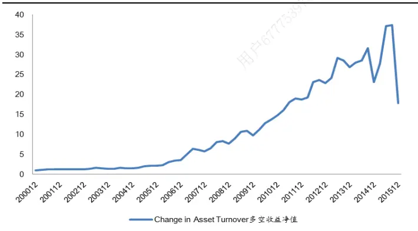
资料来源：Wind，海通证券研究所

图8 Market Value 因子多空组合净值曲线
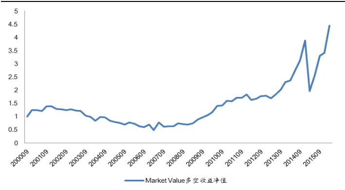
资料来源：Wind，海通证券研究所

从上面两张图来看，与我们之前的分析一致，Change in Asset Turnover 因子构建的组合产生的收益比 Market Value 因子构建的组合收益稳定得多。但是，两者在 14 年底至 15年底这一波牛熊市中的表现均极不稳定。其中，Market Value 因子是 07 年以后才相对比较有预测的效力，而 Change in Asset Turnover 因子的表现则相对比较稳定。其中 Market Value 与之前的 Size 在计算方法上除了时间段不同以外，其余全部一样，该因子在两个时间维度上的表现也比较相似，但是按月计算的 Size因子比按季计算的因子要有效的多。

综上所述，使用按季财务数据构成的因子，在对未来收益预测的效力上相对不如按月行情数据的因子。原因可能是多方面的；第一，国内市场的投机氛围比较严重，导致财务因子相对不够有效；第二，国内市场投资者的投资期限相对较短，按季度计算因子调仓并不太适合国内市场；第三，财务报表数据公布的滞后性，财报数据对股价的影响可能在公布前便已反映在股价上了。

## 4. 考虑市场涨跌影响后的因子绩效检验

在第 3节中，我们使用历史数据，对一些因子进行了绩效检验，发现还是存在很多因子对股票的未来收益存在一定的预测能力，投资者可以根据这些因子的表现构建出合适的投资组合获取超额收益。但是，在该节中，我们仅考虑了单个因子对于未来收益的影响，而未考虑其他因素对于因子预测能力的影响。在这一节中，我们试图研究在上月市场总体上涨或下跌的情况下，因子的预测能力是否依然稳健。

## 4.1月度因子检验

在本节中，我们先按照第 节中的方法，计算出使用因子构建的多空组合的收益，并将这些收益按照上月大盘上涨或下跌的情况进行分类。通过上月上证指数的涨跌来判断上月大盘属于上涨还是下跌，下面我们给出上月大盘上涨以及上月下跌情况下的因子组合统计表（年化收益绝对值排前 10 的）：

表 6 上月大盘上涨月度因子表现

| 因子 | 年化收益 率 | t值 | 胜率 | 正显著概 率 | 负显著概 率 | 不显著概 率 |
| --- | --- | --- | --- | --- | --- | --- |
| Size | 33.90% | 3.32 | 71.03% | 22.43% | 59.81% | 17.76% |
| Idiosyncratic Risk | 31.60% | 6.06 | 77.00% | 11.00% | 75.00% | 14.00% |
| Volume Variance | 30.13% | 3.19 | 66.67% | 24.14% | 59.77% | 16.09% |
| Max | 23.29% | 5.31 | 71.03% | 14.02% | 66.36% | 19.63% |
| Price | 22.39% | 2.05 | 63.55% | 32.71% | 54.21% | 13.08% |
| Amihud's Measure | -20.73% | -2.16 | 29.89% | 60.20% | 24.49% | 15.31% |
| Share Volume 24-01-26日 | 18.75% | 2.49 | 65.69% | 22.55% | 60.78% | 16.67% |
| Short-Term Reversal | 16.58% | 2.46 | 57.94% | 24.30% | 57.94% | 17.76% |
| Long-Term Reversal | 16.01% | 1.66 | 59.21% | 27.63% | 44.74% | 27.63% |
| Momentum | 14.90% | 1.89 | 57.84% | 25.49% | 52.94% | 21.57% |

资料来源：Wind，海通证券研究所

表 7 上月大盘下跌月度因子表现

| 因子 | 年化收益 率 | t值 | 胜率 | 正显著概 率 | 负显著概 率 | 不显著概 率 |
| --- | --- | --- | --- | --- | --- | --- |
| Short-Term Reversal | 20.01% | 2.84 | 69.05% | 19.05% | 58.33% | 22.62% |
| 52-Week High | 14.05% | 1.75 | 58.54% | 31.71% | 52.44% | 15.85% |
| Lagged Momentum | -12.14% | -2.14 | 50.00% | 40.24% | 30.49% | 29.27% |
| Size | 11.16% | 1.28 | 54.76% | 35.71% | 47.62% | 16.67% |
| Idiosyncratic Risk | 10.14% | 2.07 | 58.54% | 26.83% | 54.88% | 18.29% |
| Seasonality | -9.14% | -2.74 | 40.24% | 42.68% | 13.41% | 43.90% |
| Volume Variance | 7.09% | 1.00 | 56.52% | 30.43% | 42.03% | 27.54% |
| Beta | -6.07% | -1.21 | 48.21% | 35.71% | 28.57% | 35.71% |
| Volume_Market Value of Equity | -5.89% | -0.84 | 53.75% | 33.75% | 42.50% | 23.75% |
| Amihud's Measure | -5.44% | -0.80 | 46.34% | 43.90% | 37.80% | 18.29% |

资料来源：Wind，海通证券研究所

先看表 6，首先，表 4 中包含的 10个因子，9 个都出现在表 6中。这说明在上个月大盘上涨的情况下，因子的表现与总体情况类似。再具体观察表 6 中的数据，表 6中因子的多空组合无论在年化收益率、t值、胜率还是显著概率方面，表现均优于表 4中的因子。这说明在上月大盘大涨的情况下，我们所选的因子大多表现优于总体情况。再看表 7，表 4 中包含的 10 个因子，有 6 个出现在表 7中。这说明在上个月大盘下跌的情况下，因子的表现还是与总体情况比较相像的。再具体观察表 7中的数据，表 7中因子的多空组合无论在年化收益率、t值、胜率还是显著概率方面，表现多数劣于表 4中的因子。这说明在上月大盘下跌的情况下，因子的区分度和稳定性会有所下降，但也不乏存在一些更适用于下跌市的因子，如 Short-Term Reversal,52-Week High，LaggedMomentum。

下面我们单独将在上月大盘上涨或下跌时，因子多空组合收益绝对值最高的两个因子收益分布（仅考虑上月大盘上涨或下跌时）给出，进一步分析其因子收益情况。

图9 Size因子多空组合月收益分布(上涨)
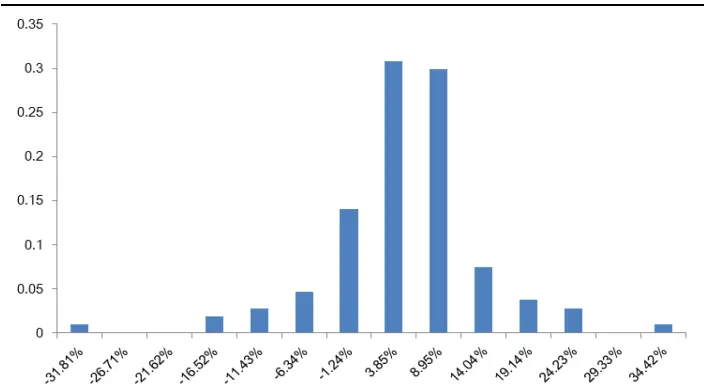
资料来源：Wind，海通证券研究所

图10 Idiosyncratic Risk 因子多空组合月收益分布(上涨)
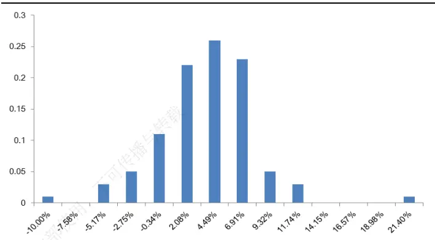
资料来源：Wind，海通证券研究所

图11 Short-Term Reversal 因子多空组合月收益分布(下跌)
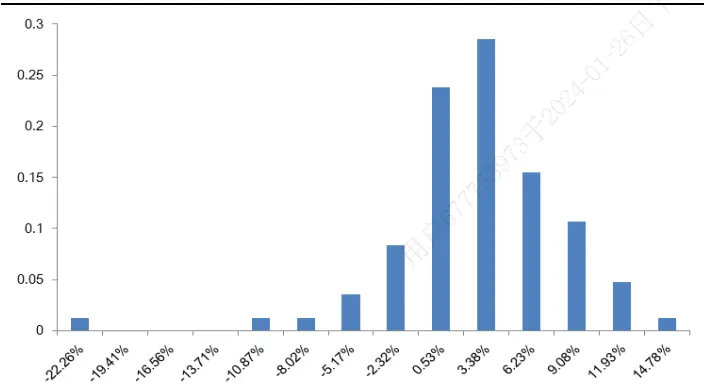
资料来源：Wind，海通证券研究所

图12 52-Week High 因子多空组合月收益分布(下跌)
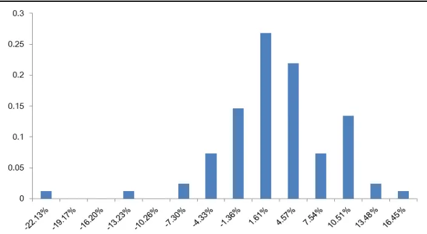
资料来源：Wind，海通证券研究所

首先，可以对比图 9、10 与图 1、2，我们可以发现，在大盘上涨的情况下，Size因子与 Idiosyncratic Risk 因子多空收益的分布与总体情况下的收益分布类似，这与表 6和与表 4的情况基本一致。再看图 11、12，这两种因子分别构建的多空组合绝大多数的月收益均大于 0，产生较低负收益的概率均较低。这说明这四种因子可以在一定程度上上对未来的超额收益进行预测。

下面，我们加入时间轴的考量，给出四种因子构建的多空组合净值曲线。

图13 Size因子多空组合净值(上涨)
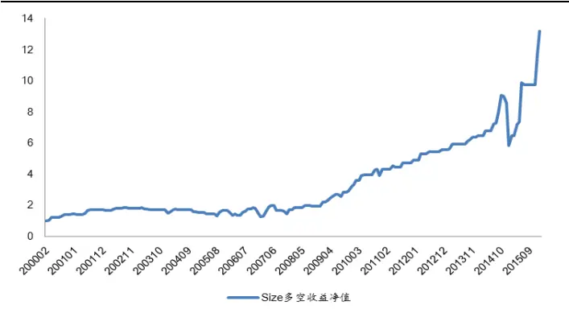
资料来源：Wind，海通证券研究所

图14 Idiosyncratic Risk 因子多空组合净值(上涨)
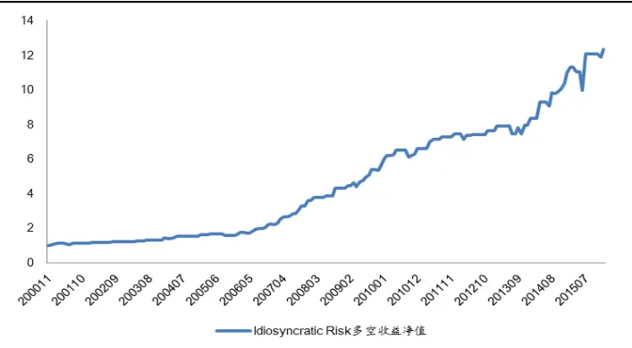
资料来源：Wind，海通证券研究所

图15 Short-Term Reversal 因子多空组合净值(下跌)
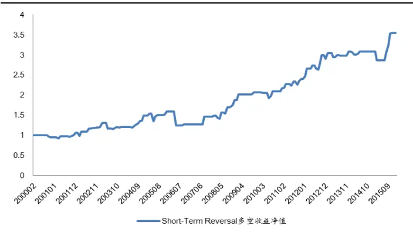
资料来源：Wind，海通证券研究所

图16 52-Week High 因子多空组合净值下跌)
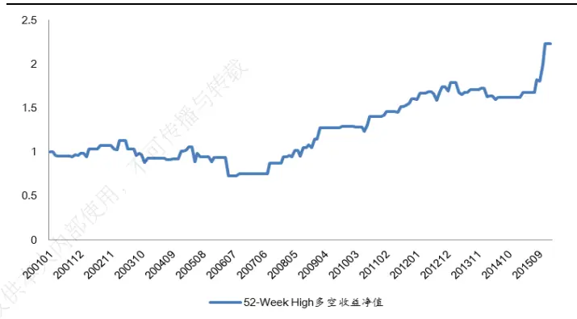
资料来源：Wind，海通证券研究所

在上面 4张图中，我们将上月大盘上涨（下跌）时表现优异的因子，在上月大盘下跌（上涨）情况下的月收益记为 0。

从上面四张图中，我们可以看出，总体上来说，4 种因子在总体上来说，都具备一定对未来超额收益的预测能力。但是总体来看，在上月大盘上涨的情况下，因子的预测能力要较上月大盘下跌情况下的因子优异得多。

综上所述，我们可以认为，本篇研究使用行情数据按月计算的因子，在大盘上涨或下跌的情况下，相对表现基本一致，但是在绝大多数的因子在上月上涨的情况下的表现要优于上月下跌的情况。而我们选取的时间段，上证指数从 1366.58 点上涨至 3539.18点，这可能表明第三节中对因子对未来收益的解释的阐述有一点偏高，但是在总体上并不会影响使用行情数据按月计算的因子对未来收益具备解释力的结论。

## 4.2季度因子检验

在本节中，我们先按照第 节中的方法，计算出使用因子构建的多空组合的收益，并将这些收益按照上季大盘上涨或下跌的情况进行分类。本研究通过上个季度上证指数的涨跌来判断大盘属于上涨还是下跌，下面我们给出上个季度大盘上涨以及上个季度下跌情况下的因子组合统计表（年化收益绝对值排前 10 的）：

表 8 上季大盘上涨季度因子表现

| 因子 | 年化收益 率 | t值 | 胜率 | 正显著概 率 | 负显著概 率 | 不显著概 率 |
| --- | --- | --- | --- | --- | --- | --- |
| Change in Asset Turnover | -40.58% | -4.04 | 20.00% | 70.00% | 10.00% | 20.00% |
| Market Value | 18.76% | 1.31 | 61.29% | 29.03% | 58.06% | 12.90% |
| Book Equity_Market | -13.34% | -1.57 | 40.00% | 46.67% | 33.33% | 20.00% |
| CF_MV | -11.62% | -1.31 | 53.33% | 43.33% | 33.33% | 23.33% |
| Revenue Surprises | -9.50% | -1.96 | 43.48% | 34.78% | 21.74% | 43.48% |
| R&D_Market Value of Equity | 9.16% | 0.59 | 50.00% | 23.33% | 23.33% | 53.33% |
| Earnings Surprise | -8.34% | -1.08 | 39.13% | 39.13% | 34.78% | 26.09% |
| Leverage Component of Book | -8.16% | -1.88 | 50.00% | 33.33% | 46.67% | 20.00% |
| Sales | -7.98% | -0.78 | 53.33% | 43.33% | 43.33% | 13.33% |
| Profitability | 7.76% | 0.72 | 43.33% | 43.33% | 36.67% | 20.00% |

资料来源：Wind，海通证券研究所

表 9 上季大盘下跌季度因子表现

| 因子 | 年化收益 率 | t值 | 胜率 | 正显著概 率 | 负显著概 率 | 不显著概 率 |
| --- | --- | --- | --- | --- | --- | --- |
| Market Value | 10.90% | 1.39 | 48.39% | 38.71% | 45.16% | 16.13% |
| Leverage | 9.52% | 1.45 | 48.39% | 32.26% | 48.39% | 19.35% |
| Gross Profitability | -9.04% | -1.46 | 46.67% | 48.39% | 22.58% | 29.03% |
| Sales_Price | 8.29% | 0.83 | 45.16% | 41.94% | 38.71% | 19.35% |
| Book Equity_Market | 8.24% | 1.00 | 61.29% | 38.71% 转载 | 45.16% | 16.13% |
| Change in Asset Turnover | -7.73% | -0.75 | 36.67% | 53.33% | 26.67% | 20.00% |
| Asset Growth | -7.38% | -3.25 | 36.67% | 45.16% | 12.90% | 41.94% |
| Operating Leverage | -7.24% | -1.96 | 46.67% | 41.94% | 12.90% | 45.16% |
| CF_MV | 7.13% | 0.82 | 48.39% | 41.94% | 38.71% | 19.35% |
| Profitability | -7.04% | -1.14 | 43.33% | 48.39% | 29.03% | 22.58% |

资料来源：Wind，海通证券研究所

先看表 ，首先，表 中最为有效的两个因子构成的组合，在年化收益、胜率、显著概率方面的表现都优于表 ；其次，表 中其他因子的表现也优于表 中其他的因子表现。再观察表 9，表 5 中最为有效的两个因子表现在各方面均不如表 5 中的表现，这一点与前一小节中的按月计算的因子表现类似。但是表 中其他因子的表现也优于表中的表现。再结合两张表一起观察，我们可以发现，其中，Book Equity_Market、CF_MV、这几个因子，在表 中均未出现，但是它们在表 、表 中的年化收益率、t 值、胜率、显著概率等方面表现相反，这说明了这几个因子在上月上涨与下跌的情况下，预测的方向相反，所以在总体情况中呈现了没有预测能力的表现。

下面我们单独将在上季大盘上涨或下跌时，因子多空组合收益绝对值最高的两个因子收益分布（仅考虑上季大盘上涨或下跌时）给出，进一步分析其因子收益情况。

图17 Change in Asset Turnover 因子组合季收益分布(上涨)
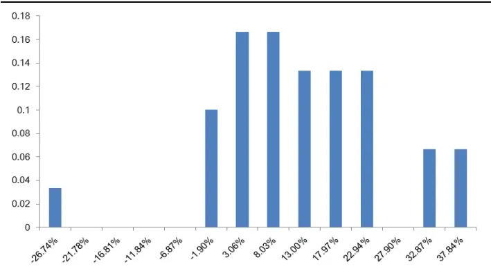
资料来源：Wind，海通证券研究所

图18 Market Value 因子多空组合季收益分布(上涨)
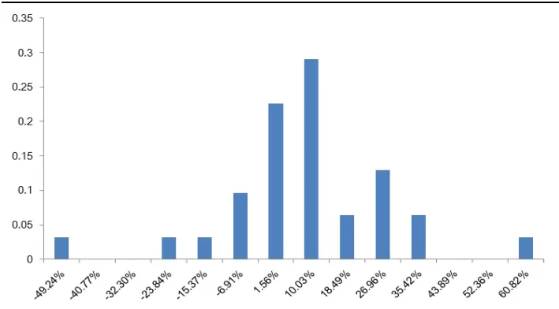
资料来源：Wind，海通证券研究所

图19 Market Value 因子多空组合季收益分布(下跌)
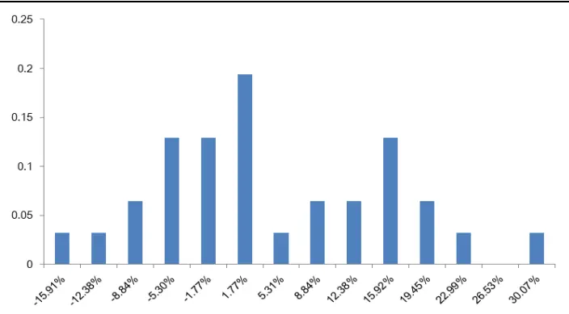
资料来源：Wind，海通证券研究所

图20 Leverage因子多空组合季收益分布(下跌)
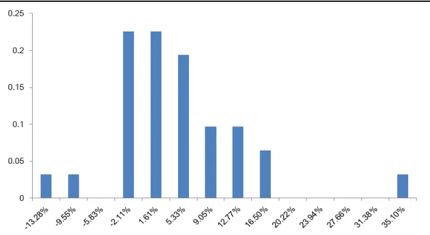
资料来源：Wind，海通证券研究所

首先，可以对比图 17、18 与图 5、6，我们可以发现，在大盘上涨的情况下，Changein Asset Turnover 因子在上季度大盘上涨的情况下，表现比总体情况要好不少，而Idiosyncratic Risk 因子多空收益的分布与总体情况下的收益分布类似，这与表 8 和表 6的情况基本一致。再看图 19、20，这两种因子分别构建的多空组合季度收益大于 0的较多，但是与上季度大盘下上涨时是无法相比。

下面，我们加入时间轴的考量，给出四种因子构建的多空组合净值曲线。

图21 Change in Asset Turnover 因子组合季收益分布(上涨)
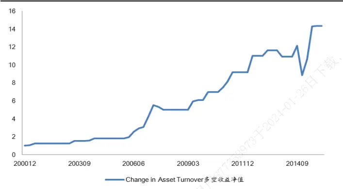
资料来源：Wind，海通证券研究所

图22 Market Value 因子多空组合季收益分布(上涨)
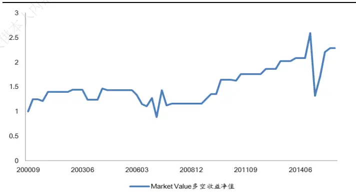
资料来源：Wind，海通证券研究所

图23 Market Value 因子多空组合季收益分布(下跌)
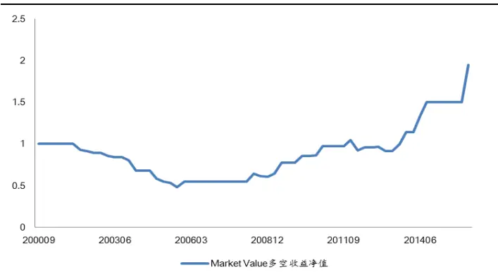
资料来源：Wind，海通证券研究所

图24 Leverage因子多空组合季收益分布(下跌)
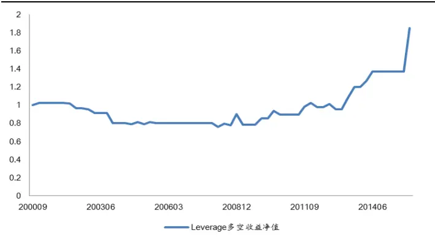
资料来源：Wind，海通证券研究所

在上面 4张图中，我们将上季大盘上涨（下跌）时表现优异的因子，在上季大盘下跌（上涨）情况下的月收益记为 0。

从上面四张图中，我们可以看出，总体上来说，Change in Asset Turnover 因子在上季大盘上涨的情况下具备一定对未来超额收益的预测能力，而其余三种在各自情况下的对未来超额收益的预测能力则值得存疑。

综上所述，本篇研究使用财务数据按季计算的因子，在上季度大盘上涨或下跌的情况下，存在部分表现相反。在之前对于财务因子的整体分析中，我们认为财务对收益的解释和预测能力都较差，这可能很大程度受限于财务因子与市场走势的关系。

## 5. 考虑市值因子影响后的因子绩效检验

在之前的 2 节中，我们考虑了单个因子在总体情况下以及在上月大盘上涨或下跌的情况下，因子对于未来收益的影响。但是，我们并未考虑因子之间相互影响的关系，即，某个因子对未来收益的解释力可能是源于其他因子的解释能力，而在当我们剔除其他因子的影响之后，该因子本身对于股票的未来收益不再具有预测能力，亦或是在剔除其他因子的影响后，因子反而对未来的收益具备更加优秀的预测能力的情况。而在众多因子影响中，市值因子是最受关注的因子之一，再加上按月计算的 Size 以及按季计算的因子是不同期限的市值因子，且它们在两类因子中都是预测能力最优秀的几个因子之一。所以，在本节中，我们研究考虑市值因子影响后的因子绩效检验。

在本节中，我们在每期按照之前的方法计算因子，然后我们先按照市值因子，将整个市场的股票分为 10组。之后，我们再将每组中，选取检验因子值最小的 20%与因子值最大的 20%构成多空组合。之后我们同样选用之前使用的指标来进行绩效检验。其中，年化收益为按市值分组后，10 个多空组合的平均收益；与秩相关系数相关的统计变量，我们统计了市值最小组以及市值最大组的正负显著概率以及延续概率。

本节选取的数据以及涨停剔除方法同第三节。

## 5.1月度因子检验

本节按月回测了 2000-2015 年的表 2 中的除 Size 因子以外的 17 种因子。在按测试因子分组之前，先使用 Size 因子对股票分组，再将每组中按因子大小分组，下面给出收益绝对值前 10 的因子组合统计表。

表 10 考虑市值因子影响的月度因子表现

| 用户 因子 | 年化收 益率 | t值 | 胜率 | 最小 正显 | 最大 正显 | 最小 负显 | 最大 负显 | 最小 不显 | 最大 不显 | 最小 延续 | 最大 延续 |
| --- | --- | --- | --- | --- | --- | --- | --- | --- | --- | --- | --- |
| Idiosyncratic Risk | 17.67% | 6.52 | 68% | 著 5% | 著 19% | 著 46% | 著 34% | 著 49% | 著 48% | 64% | 56% |
| Short-Term Reversal | 17.52% | 5.25 | 66% | 8% | 19% | 38% | 29% | 54% | 52% | 61% | 46% |
| Share Volume | 12.38% | 3.85 | 64% | 15% | 21% | 35% | 31% | 50% | 48% | 56% | 46% |
| Max | 11.49% | 4.88 | 65% | 6% | 18% | 33% | 34% | 61% | 48% | 55% | 47% |
| Price | 7.75% | 1.46 | 52% | 25% | 29% | 38% | 34% | 37% | 37% | 54% | 51% |
| Momentum | 7.46% | 1.94 | 53% | 16% | 29% | 31% | 26% | 53% | 45% | 60% | 50% |
| Seasonality | -5.45% | -2.79 | 37% | 22% | 17% | 11% | 12% | 67% | 71% | 55% | 55% |
| Volume_Market Value of Equity | 5.19% | 1.11 | 56% | 18% | 25% | 27% | 26% | 55% | 49% | 49% | 55% |
| 52-Week High | 4.92% | 1.37 | 51% | 17% | 30% | 30% | 27% | 53% | 43% | 54% | 47% |
| Amihud's Measure | -4.88% | -1.86 | 42% | 18% | 22% | 11% | 21% | 71% | 57% | 50% | 50% |

资料来源： ，海通证券研究所

表 11市值因子影响表

| 因子 |  | 区分前 |  |  | 区分后 |  |  |
| --- | --- | --- | --- | --- | --- | --- | --- |
|  |  | 年化收益 率 | t值 | 胜率 | 年化收益 率 | t值 | 胜率 |
| 区分前后均有 效 | Idiosyncratic Risk | 21.9% | 5.94 | 68.68% | 17.7% | 6.52 | 68.13% |
|  | Short-Term Reversal | 18.1% | 3.71 | 62.83% | 17.5% | 5.25 | 66.49% |
|  | Share Volume | 8.3% | 1.63 | 59.14% | 12.4% | 3.85 | 63.98% |
|  | Max | 12.3% | 3.82 | 61.78% | 11.5% | 4.88 | 65.45% |
|  | Momentum | 10.1% | 1.75 | 57.53% | 7.5% | 1.94 | 52.69% |
| 区分后显著下 降 | Volume Variance | 19.9% | 3.22 | 62.18% | 4.5% | 1.48 | 59.62% |
|  | Amihud's Measure | -13.3% | -2.23 | 37.87% | -4.9% | -1.86 | 41.67% |
|  | Price | 14.0% | 1.93 | 55.50% | 7.8% | 1.46 | 52.36% |

资料来源： ，海通证券研究所

从上表中可见，在 2000 年到 2015 年期间，收益绝对值排在前 10 的因子收益，不再如表 4之中那么高。之前最高的 Idiosyncratic Risk 因子多空组合收益虽然下降了，但是其 t值有所上升，从秩相关系数显著方向基本上总体保持不变，从总体来说，该因子对于未来的预测能力依然存在。其他大多数因子的表现也基本上与 Idiosyncratic Risk 因子一致。但是，也有在加入市值因子影响后，基本上可以被认为不存在预测能力的因子，如 Amihud's Measure 因子。

图25 Idiosyncratic Risk 因子多空组合月收益分布
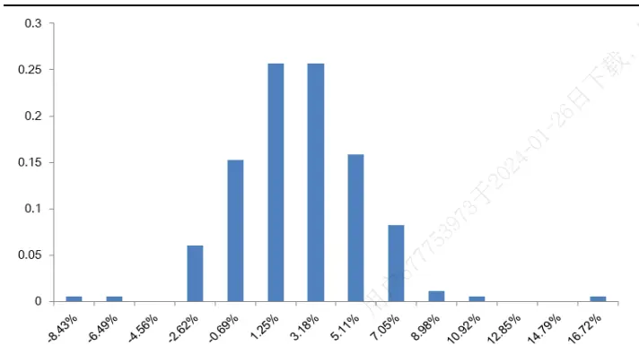
资料来源：Wind，海通证券研究所

图26 Short-Term Reversal 因子多空组合月收益分布
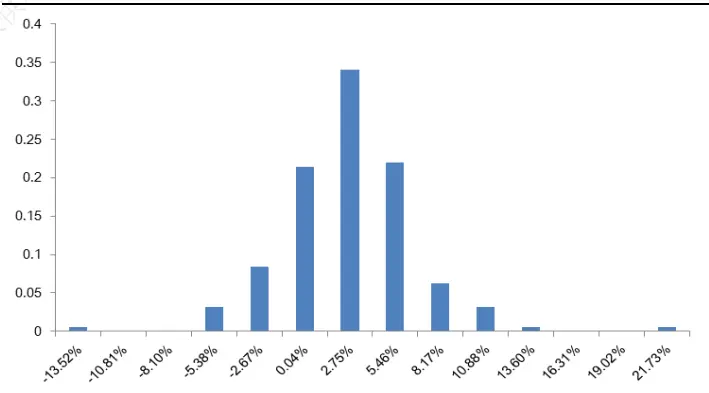
资料来源：Wind，海通证券研究所

上图给出了按市值分组后，十组多空组合的平均月收益分布图。根据因子的直方图来看，我们可以对比图 25以及图 2，整个因子表现的分布基本不变，所有表现均略有下降。从因子大小与未来收益的秩相关系数的显著性来看，所有因子的表现均有所下降，但是产生这一现象的原因主要在于样本容量的降低，带来的统计检验结果的变化。但总体来说，这两种因子分别构建的多空组合绝大多数的月收益均大于 0，产生较低负收益的概率均极低。这说明这两种因子可以在大概率上对未来的投资收益进行预测。

此外，若具体观察两个因子多空组合收益的分布情况，我们可以发现，图 25与图26 的因子构建的组合收益要比图 1与图 2的收益稳定得多。

图27 Idiosyncratic Risk 因子多空组合净值线
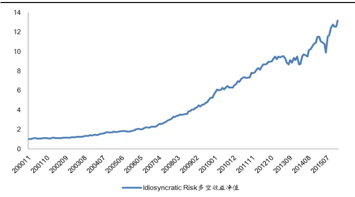
资料来源： ，海通证券研究所

图28 Short-Term Reversal 因子多空组合净值线
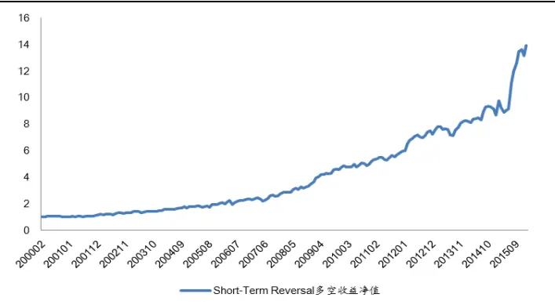
资料来源：Wind，海通证券研究所

上图给出了按市值分组后，十组多空组合的平均月收益净值曲线。从上面两张图来看，与我们之前的分析一致，这两个因子的表现要比第 3 节中按月的两个因子稳定得多，但是其总体收益也相对不如第三节的因子。但是这并不妨碍这两个因子对于超额收益的预测能力。

综上所述，我们可见，在剔除了市值因子的影响之后，使用行情数据按月构建出的因子，18种因子中有 4种因子的平均年化多空组合收益率超过 10%，有不少因子与市值的相关性较低，依然保持收益的预测能力，但也有部分因子的预测能力不复存在。收益最高的两种因子 Idiosyncratic Risk 和 Short-Term Reversal，其对于股票收益的区分能力依然很强，虽然累计收益相对不进行风格区分时有所降低，但是进行了市值风格划分股票范围后，选股的稳定性增强很多。

## 5.2季度因子检验

本节按季回测了 2000-2015 年的表 3 中的除 Market Value 因子以外的 32 种因子。在按测试因子分组之前，先使用 Market Value 因子对股票分组，再将每组中按因子大小分组，下面给出收益绝对值前 10的因子组合统计表。

表 12 考虑市值因子影响的季度因子表现

| 因子 用户67 | 年化收 益率 | t值 | 胜率 | 最小 正显 | 最大 正显 | 最小 负显 | 最大 负显 | 最小 不显 | 最大 不显 | 最小 延续 | 最大 延续 |
| --- | --- | --- | --- | --- | --- | --- | --- | --- | --- | --- | --- |
| Change in Asset Turnover | -16.3% | -2.87 | 27% | 著 42% | 著 45% | 著 10% | 著 10% | 著 48% | 著 45% | 49% | 54% |
| Asset Growth | -5.4% | -3.42 | 26% | 11% | 17% | 8% | 5% | 80% | 78% | 51% | 44% |
| Revenue Surprises | -5.1% | -2.37 | 42% | 13% | 20% | 11% | 16% | 76% | 64% | 57% | 55% |
| Gross Profitability | -5.0% | -1.47 | 34% | 26% | 27% | 20% | 17% | 54% | 57% | 56% | 56% |
| Sustainable Growth | -4.9% | -2.24 | 32% | 11% | 25% | 13% | 13% | 75% | 62% | 54% | 61% |
| Sales_Price | -4.7% | -0.94 | 48% | 30% | 33% | 10% | 21% | 61% | 46% | 40% | 40% |
| Earnings_Price | -4.4% | -1.27 | 43% | 23% | 39% | 21% | 13% | 56% | 48% | 48% | 53% |
| Book Equity_Market | -4.2% | -0.87 | 49% | 20% | 34% | 21% | 21% | 59% | 44% | 33% | 43% |
| Profitability | -4.1% | -1.17 | 37% | 25% | 30% | 20% | 15% | 56% | 55% | 53% | 51% |
| Return-on-Equity | -3.8% | -1.29 | 38% | 11% | 36% | 16% | 16% | 72% | 48% | 47% | 62% |

资料来源：Wind，海通证券研究所

从上表中可见，其表现总体与表 5的表现相似，但是总体来说，略微有所下降。然而根据这些因子构建的多空组合的表现情况来看，除了 Change in Asset Turnover 因子以外，其余因子在胜率、显著度或延续概率上的表现则有些不尽人意。这点都是与表 5的结果相一致的。而 Change in Asset Turnover 因子则在收益率上不如表 5 中的表现，这点与上一小节的按月因子一致。

图29 Change in Asset Turnover 因子多空组合季收益分布
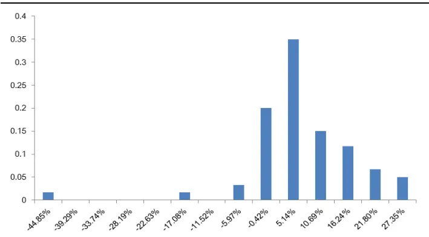
资料来源：Wind，海通证券研究所

图30 Asset Growth 因子多空组合季收益分布
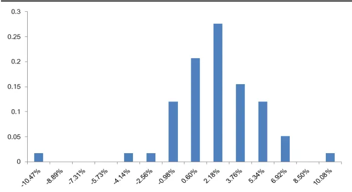
资料来源：Wind，海通证券研究所

上图给出了按市值分组后，十组多空组合的平均季度收益分布图。根据因子的直方图来看，我们可以对比图 29 以及图 5，整个因子表现的分布基本不变，所有表现均略有下降。但总体来说，这两种因子分别构建的多空组合绝大多数的月收益均大于 0，产生较低负收益的概率均极低。这说明这两种因子可以在大概率上对未来的投资收益进行预测。

此外，若具体观察两个因子多空组合收益的分布情况，我们可以发现，图 29与图30 的因子构建的组合收益要比图 5与图 6的收益稳定得多，但是收益却相对有所不如。

图31 Change in Asset Turnover 因子多空组合净值线
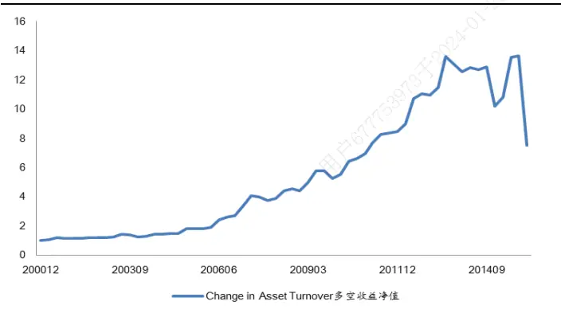
资料来源：Wind，海通证券研究所

图32 Asset Growth 因子多空组合净值线
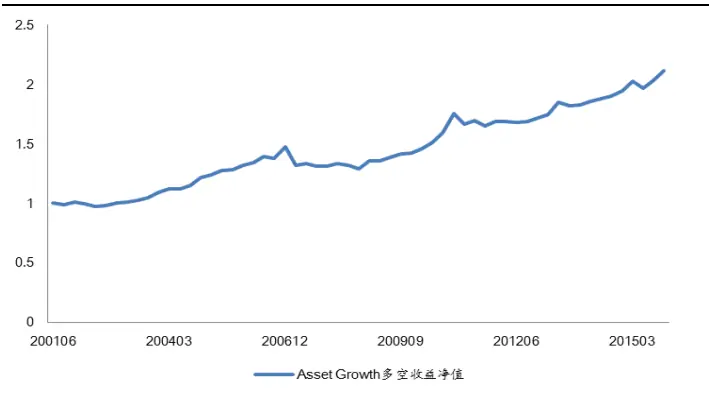
资料来源：Wind，海通证券研究所

上图给出了按市值分组后，十组多空组合的平均季收益净值曲线。从上面两张图来看，与我们之前的分析一致，这两个因子的表现要比第 3 节中按季的两个因子稳定一些，但是其总体收益也相对不如第三节的因子。但是这并不妨碍这两个因子对于超额收益的预测能力。

综上所述，我们可见， 、即使在剔除市值因子的影响后，使用按季财务数据构成的因子，在对未来收益预测的效力依然相对不如按月行情数据的因子。2、两类因子对剔除市值因子影响是一致的，它们均会使因子构建的组合的收益降低，但却会使得组合的收益相对平稳。这表明了，第三节中，不进行风格区分时，关于因子对未来收益的预测能力的检验结果可能有所高估，收益的贡献有一部分来自市值风格的贡献，但是总体结论并未改变。 、总体来看，财务因子的收益解释能力并不能通过剔除市值效应有所提升，依然建议大家更多的使用价格面和情绪面因子。

## 6. 考虑反转因子影响后的因子绩效检验

在上一节中，我们考虑了剔除市值因子影响后的因子绩效检验。而在众多因子中，除了市值因子以外，短期反转因子也是多因子模型中最常用的因子之一。在前文中，我们按月使用行情数据计算的因子 Short-Term Reversal就是用来刻画这一特点的，且该因子在第三、四、五节中的表现都显著有效。在本节中，我们考虑将反转因子的影响剔除后，进行因子的绩效分析。

我们剔除反转因子的方法同第五节中剔除市值因子的方法。对于按月使用行情数据计算的因子，我们剔除 Short-Term Reversal因子的影响；对于按季使用财务数据计算的因子，我们使用上季度的收益率作为剔除因子。其他如选取的数据以及涨停剔除方法同第三节。

## 6.1月度因子检验

本节按月回测了 2000-2015 年的表 2 中的除 Short-Term Reversal 因子以外的 17种因子。在按测试因子分组之前，先使用 Short-Term Reversal 因子对股票分组，再将每组中按测试因子大小分组，下面给出多空组合(做多测试因子最小组合，做空因子最大组合)收益绝对值前 10 的因子组合统计表。

表 13考虑反转因子影响的月度因子表现

| 因子 | 年化收 益率 | t值 | 胜率 | 最小 正显 著 | 最大 正显 著 | 最小 负显 著 | 最大 负显 著 | 最小 不显 | 最大 不显 | 最小 延续 | 最大 延续 |
| --- | --- | --- | --- | --- | --- | --- | --- | --- | --- | --- | --- |
| Idiosyncratic Risk | 16.4% | 6.31 | 67% | 11% | 10% | 31% | 43% | 著 58% | 著 46% | 54% | 51% |
| Volume Variance | 15.7% | 3.40 | 63% | 17% | 15% | 32% | 28% | 51% | 56% | 55% | 49% |
| Size | 14.9% | 3.02 | 60% | 21% | 26% | 37% | 27% | 42% | 48% | 57% | 61% |
| Amihud's Measure | -13.2% | -2.99 | 37% | 29% | 23% | 19% | 25% | 52% | 52% | 53% | 53% |
| Max | 8.5% | 3.57 | 62% | 14% | 13% | 21% | 38% | 65% | 49% | 46% | 53% |
| Price | 7.9% | 1.53 | 54% | 27% | 30% | 35% | 27% | 38% | 43% | 51% | 46% |
| Seasonality | -7.2% | -3.50 | 36% | 22% | 17% | 15% | 7% | 63% | 77% | 54% | 56% |
| Share Volume | 6.9% | 1.87 | 61% | 22% | 14% | 29% | 33% | 49% | 53% | 49% | 51% |
|  | 6.3% | 1.40 | 55% | 20% | 20% | 32% | 19% | 48% | 61% | 56% | 50% |
| Lagged Momentum | -5.0% | -1.65 | 42% | 24% | 28% | 15% | 15% | 61% | 57% | 51% | 52% |

资料来源：Wind，海通证券研究所

表 14 反转因子影响表

| 因子 |  | 区分前 |  |  | 区分后 |  |  |
| --- | --- | --- | --- | --- | --- | --- | --- |
|  |  | 年化收 益率 | t值 | 胜率 | 年化收 益率 | t值 | 胜率 |
| 区分前后均有效 | Size | 23.9% | 3.45 | 63.87% | 14.9% | 3.02 | 60.21% |
|  | Idiosyncratic Risk | 21.9% | 5.94 | 68.68% | 16.4% | 6.31 | 67.03% |
|  | Volume Variance | 19.9% | 3.22 | 62.18% | 15.7% | 3.40 | 63.46% |
|  | Amihud's Measure | -13.3% | -2.23 | 37.87% | -13.2% | -2.99 | 36.67% |
|  | Max | 12.3% | 3.82 | 61.78% | 8.5% | 3.57 | 61.78% |
|  | Share Volume | 8.3% | 1.63 | 59.14% | 6.9% | 1.87 | 60.75% |
|  | Seasonality | -8.0% | -3.19 | 41.11% | -7.2% | -3.50 | 35.56% |
| 区分后显著下降 | Momentum | 10.1% | 1.75 | 57.53% | 3.6% | 1.03 | 53.76% |
|  | Price | 14.0% | 1.93 | 55.50% | 7.9% | 1.53 | 53.93% |

从上表中可见，在 2000 年到 2015 年期间，收益绝对值排在前 10 的因子收益，不再如表 4之中那么高。之前最高的 Idiosyncratic Risk 因子多空组合收益虽然下降了，但是其 t值上升，从秩相关系数显著方向基本上总体保持不变，从总体来说，该因子对于未来的预测能力依然存在。其他大多数因子的表现也基本上与 Idiosyncratic Risk 因子一致，在第三节中收益排前 10 的因子中，仅 Momentum 因子与 Price 因子的收益显著下降，其收益的 t值、胜率也变得不再显著。总体而言，大多数在全样本中有效的因子，与反转因子的相关性都较低，在进行了反转因子中性处理后，依然能够有效区分股票表现。

图33 Idiosyncratic Risk 因子多空组合月收益分布
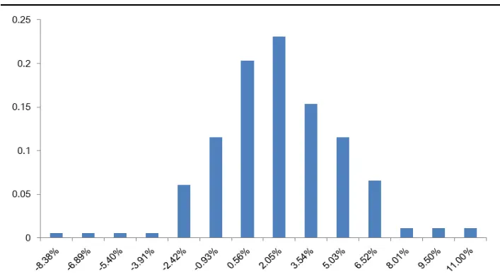
资料来源：Wind，海通证券研究所

图34 Volume Variance 因子多空组合月收益分布
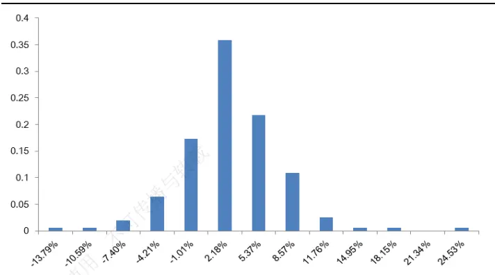
资料来源：Wind，海通证券研究所

上图给出了按市值分组后，十组多空组合的平均月收益分布图。根据因子的直方图来看，我们可以对比图 33以及图 2，整个因子表现的分布基本不变，所有表现均略有下降。从因子大小与未来收益的秩相关系数的显著性来看，所有因子的表现均有所下降，但是产生这一现象的原因主要在于样本容量的降低，带来的统计检验结果的变化。但总体来说，这两种因子可以在大概率上对未来的投资收益进行预测，且不受反转因子影响。

此外，若具体观察两个因子多空组合收益的分布情况，我们可以发现，图 33与图34 的因子构建的组合收益要比图 1与图 2的收益稳定得多。

图35 Idiosyncratic Risk 因子多空组合净值线
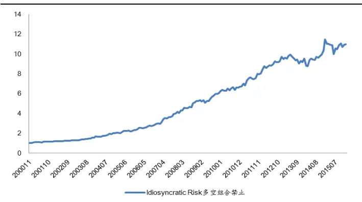
资料来源：Wind，海通证券研究所

图36 Volume Variance 因子多空组合净值线
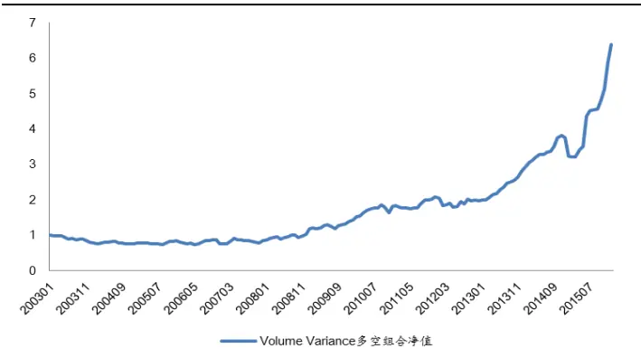
资料来源：Wind，海通证券研究所

上图给出了按反转因子分组后，十组多空组合的平均月收益净值曲线。从上面两张图来看，与我们之前的分析一致，这两个因子的表现要比第 3节中按月的两个因子稳定得多。其中，值得注意的是 Volume Variance 因子也如 Size 因子一样，大约 07 年以后才相对比较有预测的效力。

综上所述，在剔除了反转因子的影响之后，使用行情数据按月构建出的因子，种因子中有 4种因子的平均年化多空组合收益率超过 10%，收益最高的两种因子分别达到 16.4%与 15.7%，表现总体上比剔除反转因子影响前略有不如。但是，大部分对于未来的收益是具备相当的预测能力的，少部分因子的预测能力不复存在。

## 6.2季度因子检验

本节按季回测了 2000-2015 年的表 3 中的 33 种因子。在按测试因子分组之前，先使用上季度收益对股票分组，再将每组中按因子大小分组，下面给出多空组合(做多测试因子最小组合，做空因子最大组合)收益绝对值前 10 的因子组合统计表。

表 15 考虑反转因子影响的月度因子表现

| 因子 | 年化收 益率 | t值 | 胜率 | 最小 正显 著 | 最大 正显 著 | 最小 负显 | 最大 负显 | 最小 不显 | 最大 不显 | 最小 延续 | 最大 延续 |
| --- | --- | --- | --- | --- | --- | --- | --- | --- | --- | --- | --- |
| Change in Asset | -21.7% | -4.47 | 27% | 45% | 52% | 著 20% | 著 10% | 著 35% | 著 38% | 58% | 68% |
| Turnover Market Value | 9.1% | 1.70 | 55% | 21% | 29% | 39% | 24% | 40% | 47% | 54% | 59% |
| Book Equity_Market | -5.3% | -1.40 | 43% | 20% | 20% | 18% | 11% | 62% | 69% | 53% | 55% |
| Enterprise Component of Book | -4.4% | -1.71 | 44% | 15% | 25% | 16% | 5% | 69% | 70% | 55% | 58% |
| Revenue Surprises | -4.4% | -2.10 | 38% | 33% | 9% | 11% | 7% | 56% | 84% | 59% | 52% |
| CF_MV | -4.2% | -1.11 | 44% | 31% | 26% | 21% | 20% | 48% | 54% | 70% | 47% |
| Earnings_Price | -4.1% | -1.01 | 46% | 23% | 39% | 26% | 10% | 51% | 51% | 43% | 60% |
| G-Score | -3.8% | -2.04 | 36% | 16% | 21% | 7% | 10% | 78% | 69% | 53% | 60% |
| Sales_Price | -3.7% | -0.80 | 44% | 21% | 28% | 26% | 15% | 52% | 57% | 47% | 57% |
| Asset Growth | -3.3% | -1.70 | 33% | 15% | 17% | 8% | 12% | 77% | 72% | 49% | 39% |

资料来源：Wind，海通证券研究所

从上表中可见，其表现总体与表 5的表现相似，但是总体来说，略微有所下降。然而根据这些因子构建的多空组合的表现情况来看，除了 Change in Asset Turnover 因子以外，其余因子在胜率、显著度或延续概率上的表现则有些不尽人意。且 Change in AssetTurnover 因子则在收益率上也不如表 5 中的表现。

图37 Change in Asset Turnover 因子多空组合季收益分布
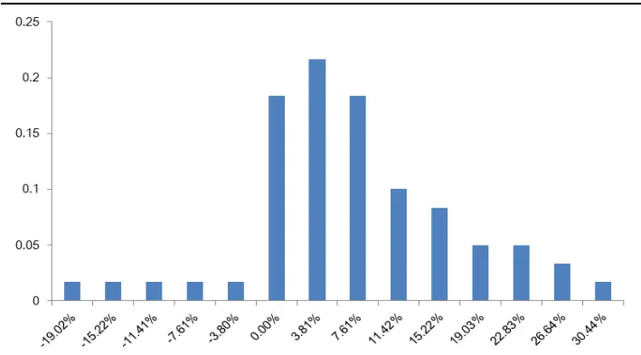
资料来源： ，海通证券研究所

图38 Market Value 因子多空组合季收益分布
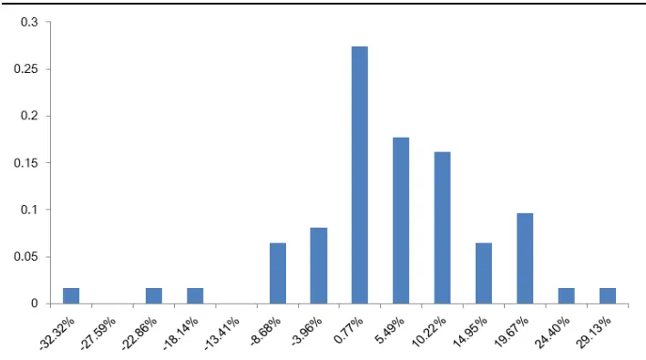
资料来源： ，海通证券研究所

上图给出了按反转因子分组后，十组多空组合的平均季度收益分布图。根据因子的直方图来看，我们可以对比图 37、图 38 与图 5、图 6，整个因子表现的分布基本不变。与之前进行市值和市场环境的划分后效果类似，反转因子中性后，财务因子的收益率分布相对更为稳定，但牺牲的是收益率会有所下降。

图39 Change in Asset Turnover 因子多空组合净值线
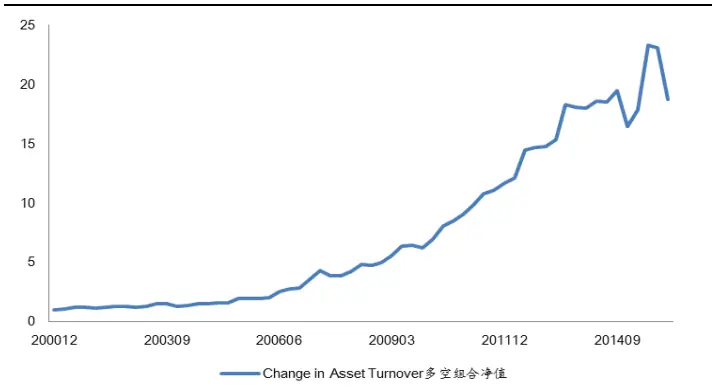
资料来源：Wind，海通证券研究所

图40 Market Value 因子多空组合净值线
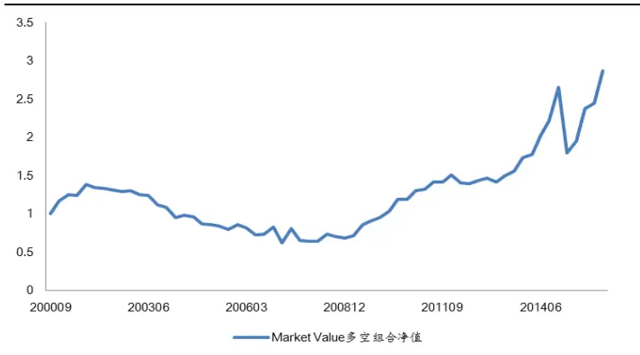
资料来源：Wind，海通证券研究所

上图给出了按反转因子分组后，十组多空组合的平均季收益净值曲线。从上面两张图来看，与我们之前的分析一致，这两个因子的表现要比第 3节中按季的两个因子稳定与一些，但是其总体收益也相对不如第三节的因子。但是这并不妨碍这两个因子对于超额传收益的预测能力。不

综上所述，即使在剔除反转因子因子的影响后，使用按季财务数据构成的因子，在对未来收益预测的效力依然上相对不如按月行情数据的因子。但是两类因子对剔除市值内因子影响是一致的，它们均会使因子构建的组合收益降低，但却会使得组合的收益相对本平稳。这表明了，第三节中关于因子对未来收益的预测能力的检验结果可能有所高估，仅但是总体结论并未改变。载

特别声明:本篇报告的结果均由数量化模型自动计算得到，研究员未进行主观判断调整；数据源均来自于市场公开信息。-2

# 信息披露

分析师声明

[Table郑雅斌yst金融工程研究团队s]

本人具有中国证券业协会授予的证券投资咨询执业资格，以勤勉的职业态度，独立、客观地出具本报告。本报告所采用的数据和信息均来自市场公开信息，本人不保证该等信息的准确性或完整性。分析逻辑基于作者的职业理解，清晰准确地反映了作者的研究观点，结论不受任何第三方的授意或影响，特此声明。

## 法律声明

本报告仅供海通证券股份有限公司（以下简称 本公司 ）的客户使用。本公司不会因接收人收到本报告而视其为客户。在任何情况下，本报告中的信息或所表述的意见并不构成对任何人的投资建议。在任何情况下，本公司不对任何人因使用本报告中的任何内容所引致的任何损失负任何责任。

本报告所载的资料、意见及推测仅反映本公司于发布本报告当日的判断，本报告所指的证券或投资标的的价格、价值及投资收入可能播会波动。在不同时期，本公司可发出与本报告所载资料、意见及推测不一致的报告。可

市场有风险，投资需谨慎。本报告所载的信息、材料及结论只提供特定客户作参考，不构成投资建议，也没有考虑到个别客户特殊的用，投资目标、财务状况或需要。客户应考虑本报告中的任何意见或建议是否符合其特定状况。在法律许可的情况下，海通证券及其所属关联机构可能会持有报告中提到的公司所发行的证券并进行交易，还可能为这些公司提供投资银行服务或其他服务。

本报告仅向特定客户传送，未经海通证券研究所书面授权，本研究报告的任何部分均不得以任何方式制作任何形式的拷贝、复印件或供复制品，或再次分发给任何其他人，或以任何侵犯本公司版权的其他方式使用。所有本报告中使用的商标、服务标记及标记均为本公司的商标、服务标记及标记。如欲引用或转载本文内容，务必联络海通证券研究所并获得许可，并需注明出处为海通证券研究所，且下不得对本文进行有悖原意的引用和删改。

根据中国证监会核发的经营证券业务许可，海通证券股份有限公司的经营范围包括证券投资咨询业务。4-

海通证券股份有限公司研究所[Table_PeopleInfo]
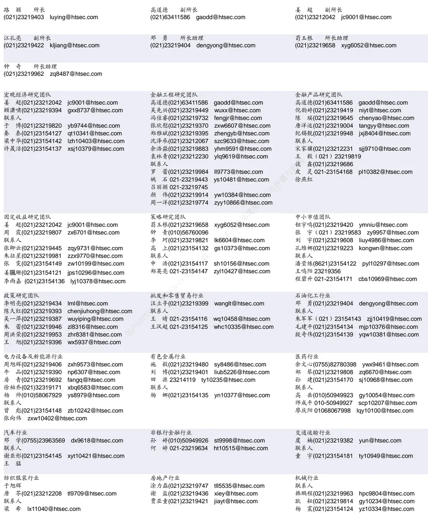

| 电子行业 |  | 基础化工行业 |  | 钢铁行业 |  |
| --- | --- | --- | --- | --- | --- |
| 陈 平(021)23219646 cp9808@htsec.com |  | 刘 威(0755)82764281 李明刚 18610049678 刘 强 021-23219733 联系人 | Iw10053@htsec.com Img10352@htsec.com lq10643@htsec.com | 刘彦奇(021)23219391 liuyq@htsec.com |  |
| 建筑工程行业 联系人 |  | 建筑建材行业 邱友锋(021)23219415 | qyf9878@htsec.com | 农林牧渔行业 丁 频(021)23219405 dingpin@htsec.com |  |
| 金 川(021)23219957 | jc9771@htsec.com | 钱佳佳(021)23212081 | qjj10044@htsec.com | 联系人 |  |
| 毕春晖(021)23154114 | bch10483@htsec.com | 冯晨阳(021)23154019 | fcy10886@htsec.com | 陈雪丽(021)23219164 陈 阳(010)50949923 | cxl9730@htsec.com |
|  |  |  |  | 关 慧(021)23219448 gh10375@htsec.com 叶云开(021)23154138 yyk10380@htsec.com |  |
| 公用事业 张一弛(021)23219402 zyc9637@htsec.com |  | 食品饮料行业 | 军工行业 |  |  |
| 联系人 |  | 闻宏伟(010)58067941 whw9587@htsec.com 孔梦遥(010)58067998 kmy10519@htsec.com | 联系人 | 徐志国(010)50949921 xzg9608@htsec.com |  |
| 赵树理(021)23219748 zsl10869@htsec.com |  | 联系人 | 赵晨 | zc9848@htsec.com |  |
|  |  | 成 珊(021)23212207 cs9703@htsec.com | 张恒晅 | zhx10170@hstec.com |  |
| 通信行业 朱劲松 010-50949926 zjs10213@htsec.com |  | 煤炭行业 | 银行行业 |  |  |
| 联系人 |  | 吴 杰(021)23154113 wj10521@htsec.com 李 淼（010）58067998Im10779@htsec.com |  | 林媛媛(0755)23962186 lyy9184@htsec.com |  |
| 彭 虎 010-50949926 夏庐生 010-50949926 | ph10267@htsec.com xls10214@htsec.com | 联系人 戴元灿 23154146 dyc10422@htsec.com 播与转载 |  |  |  |
| 社会服务行业 |  | 家电行业 |  | 互联网及传媒 |  |
| 联系人 陈扬扬(021)23219671 cyy10636@htsec.com |  | 陈子仪(021)23219244 chenzy@htsec.com |  | 钟 奇(021)23219962 zq8487@htsec.com |  |
|  |  | 人内部使用， | 联系人 孙小雯(021)23154120 强超廷(021)23154129 | sxw10268@htsec.com qct10912@htsec.com |  |
|  |  |  |  | 刘 欣 lx11011@htsec.com |  |
| 造纸轻工行业 曾 知(021)23219810 zz9612@htsec.com |  | 计算机行业 郑宏达 021-23219392 zhd10834@htsec.com 谢春生（021）23154123 xcs10317@htsec.com |  |  |  |

## 研究所销售团队

| 深广地区销售团队 |  |  | 上海地区销售团队 |  |  | 北京地区销售团队 |  |  |
| --- | --- | --- | --- | --- | --- | --- | --- | --- |
| 蔡铁清 | (0755)82775962 | ctq5979@htsec.com |  | 朱健 (021)23219592 zhuj@htsec.com |  |  | 殷怡琦 (010)58067988 | yyq9989@htsec.com |
| 刘晶晶 | (0755)83255933 | liujj4900@htsec.com | 胡雪梅 | (021)23219385 huxm@htsec.com |  | 李铁生 | (010)58067934 | Its10224@htsec.com |
| 辜丽娟 | (0755)83253022 | gulj@htsec.com | 季唯佳 | (021)23219384 jiwj@htsec.com |  |  | 陈琳 (010)58067929 cl10250@htsec.com |  |
| 伏财勇 |  | (0755)23607963 fcy7498@htsec.com |  | 黄毓 (021)23219410 huangyu@htsec.com |  | 杨羽莎 | yys10962@htsec.com |  |
|  |  | 饶伟 (0755)82775282 rw10588@htsec.com | 孟德伟 |  | (021)23219989 mdw8578@htsec.com |  |  |  |
|  |  | 王雅清 (0755)83254133 wyq10541@htsec.com | 漆冠男 |  | (021)23219281 qgn10768@htsec.com |  |  |  |
|  |  |  | 蒋炯 | jj10873@htsec.com |  |  |  |  |
|  |  |  | 毛文英 |  | (021)23219373 mwy10474@htsec.com |  |  |  |
|  |  |  |  |  | 黄诚 (021)23219397 hc10482@htsec.com |  |  |  |
|  |  |  | 胡宇欣 |  | hyx10493@htsec.com |  |  |  |
|  |  |  |  | (021)23154192 |  |  |  |  |
|  |  |  | 方烨晨 杨祎昕 | (021)23154220 | fyc10312@htsec.com (021)23212268 yyx10310@htsec.com |  |  |  |

海通证券股份有限公司研究所

地址：上海市黄浦区广东路 689号海通证券大厦 9楼

电话：（021）23219000

传真：（021）23219392

网址：www.htsec.com