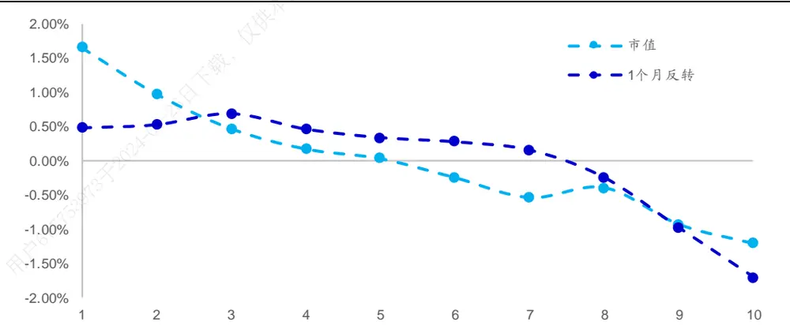
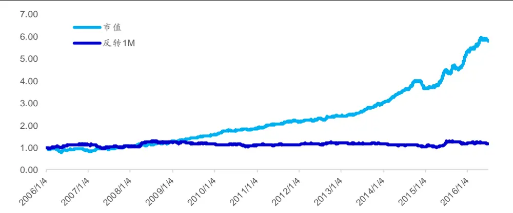
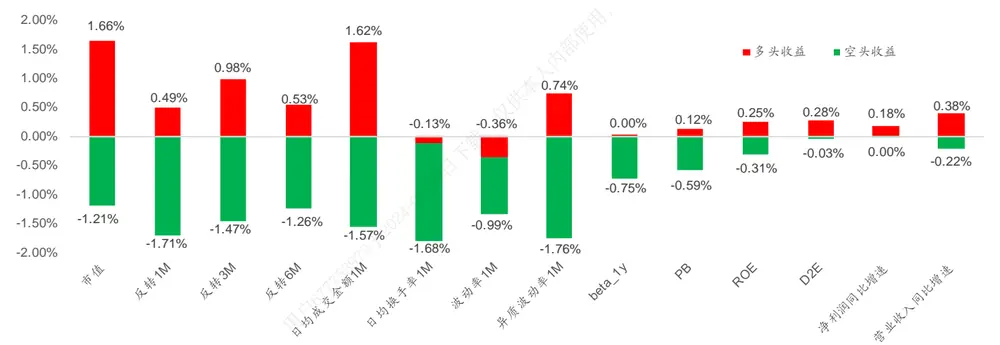
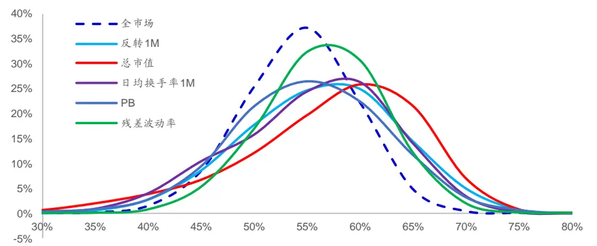
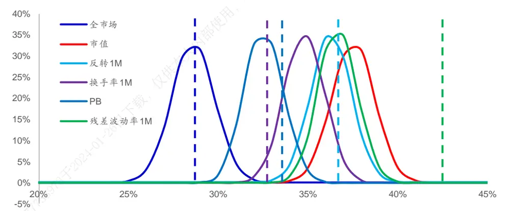
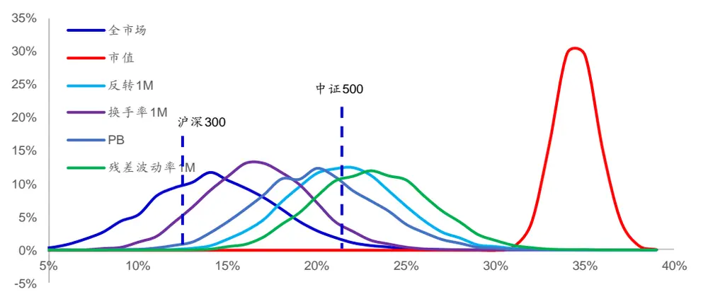
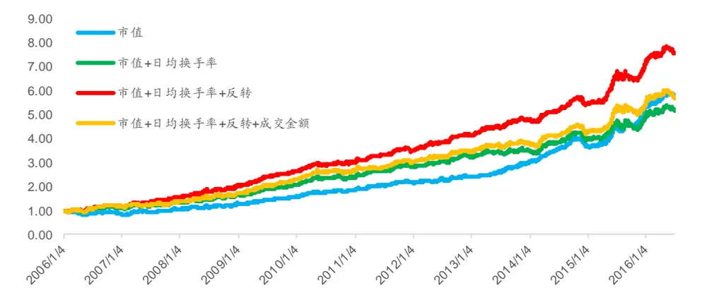
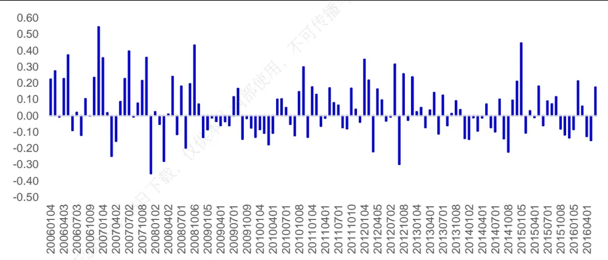
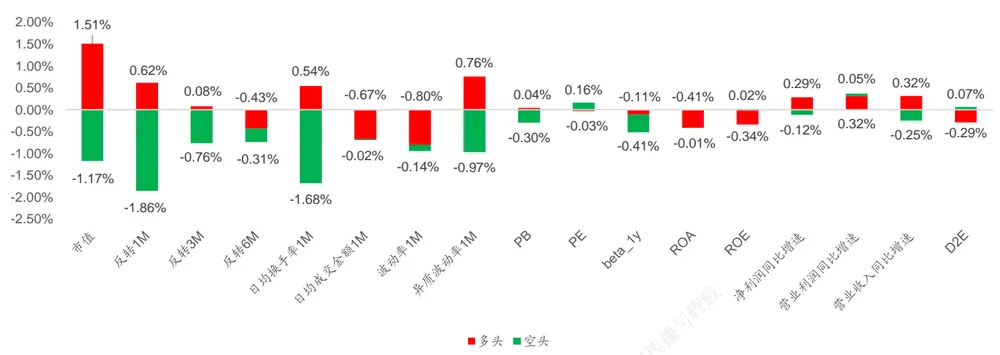
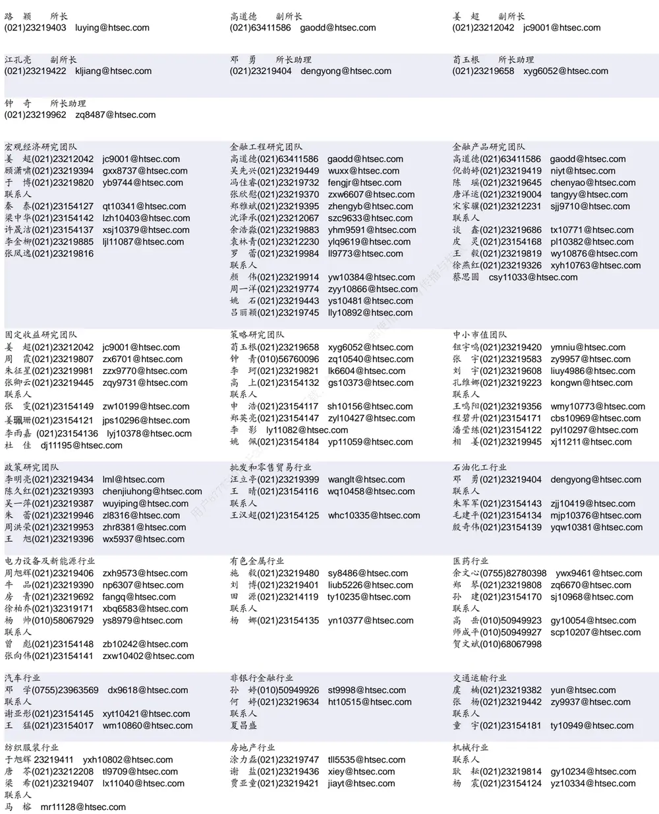

## [Tab相关研究

Table_ReportInfo]《从行业中性角度看组合中的行业配臵》2016.08.17

《风险平价（Risk Parity）策略在 FOF 中的应用 4》2016.08.12

《选股因子系列研究（十四）——交易行为的波动和股票预期收益》2016.08.09

分析师:高道德

Tel:(021)63411586

Email:gaodd@htsec.com

证书:S0850511010035

分析师:袁林青

Tel:(021)23212230

Email:ylq9619@htsec.com

证书:S0850516050003

## 选股因子系列研究(十六)——选股因子空头收益的转化

近年来，随着投资者对于因子选股体系研究的深入，越来越多的选股因子出现在大家的视线中。在对于选股因子进行总结以及探究的过程中，我们发现很多选股因子具有极强的空头效应。考虑到 A股市场做空的限制，选股因子空头收益的获取成为了值得研究的问题。

- A股多数选股因子具有较强的空头效应。除了极少数强势选股因子外（如，市值、成交金额），多数选股因子空头收益更加明显。在 IC 超过 0.07 的选股因子中，多数选股因子空头收益占比极高。如 个月反转、 个月反转、日均成交金额、异质波动率等因子其空头收益占比皆高于 70%。

单因子的情况下，逆向剔除的方法能够较好的转化因子的空头收益。考虑到空头收益较强的因子其多头组合并无法明显跑赢市场平均水平但可通过它规避明显跑输市场平均水平的标的，所以可通过逆向剔除的方式利用空头因子的空头收益。根据模拟抽样的结果，因子逆向剔除随机组合收益分位数分布相对于全市场随机组合收益分位数分布更为右偏。换句话说，在因子逆向剔除后的选股范围内选股将更加有可能得到较好的收益表现（较高的收益分位数）。

- 多因子模型中，复合因子 ICIR 的分析框架有助于分析因子收益的转化。可将多因子打分的选股系统看作是复合因子选股系统，而复合因子单期 IC 可表述为：

$$
IC_{突合因子}=\frac{w^{\prime}IC}{w^{\prime}\Sigma w}
$$

当因子截面值协方差恒定时，复合因子的 IR则可表述为：

$$
IR_{宽合因子}=\frac{w'\overline{IC}}{\sqrt{w'\Sigma_{IC}w}}
$$

从上述公式可知，因子在多因子模型中的收益转化不仅仅取决于因子本身的选股能力还取决于因子间的 IC协方差以及各因子的权重。

正交因子能够极好地满足模型假设，同时也能有效剔除合成型选股因子。因子间的截面协方差会随着时间的变动而有所波动。若想基于 的分析框架去理解以及构建多因子模型，需要对于因子进行正交处理，使其满足截面协方差恒定这一模型前提要求。本文推荐使用逐步回归的方式进行处理。此外，正交因子将有效剔除合成型选股因子。

- 风险提示。市场系统性风险、资产流动性风险以及政策变动风险会对策略表现产生较大影响。

近年来，随着投资者对于因子选股体系研究的深入，越来越多的选股因子出现在大家的视线中。在对于选股因子进行总结以及探究的过程中，我们发现很多选股因子具有极强的空头效应。考虑到 A股市场做空的限制，选股因子空头收益的获取成为了值得研究的问题。

本文分别对于单因子空头收益的转化以及多因子选股中因子空头收益的转化进行了讨论。对于单因子而言，空头收益主要通过逆向剔除的方式进行转化。而在多因子模型中，因子空头收益主要通过影响股票综合打分的方式来实现。多因子下的因子收益的转化可通过复合因子 ICIR的分析框架来理解。

## 1. 选股因子的空头效应

简单的说，选股因子的多头效应是指选股因子选出表现优于市场平均水平的股票的能力，而空头效应是指因子选出表现劣于市场平均水平的股票的能力。选股因子的多头效应以及空头效应合在一起形成了因子的多空效应。在对于经典的选股因子进行回测时常常能发现很多因子多空收益明显，但是多空收益更多是来自于空头收益。也就是说，这些因子能够选出未来表现明显低于市场平均收益的股票，但无法选出明显跑赢市场平均水平的股票。不妨以市值和 1 个月反转为例对于因子的多头收益以及空头收益进行说明。

从 2006 年以来，可在每月月初对于市场上所有可交易股票以其总市值（前 1个月涨幅）进行排序并从小到大分成 10组并统计随后一个月各组股票相对于市场所有股票平均收益的超额收益。各分组收益情况详见下图。

图1 市值、反转因子分组收益情况（2006年至 2016年）

资料来源：WIND资讯，海通证券研究所

不难发现，两因子都具有较强的多空收益，市值因子月度的多空收益达 ，而反转因子的月度多空收益达 。虽然两因子多空收益较强，但因子的多头效应和空头效应却各有不同。对于多头端，市值最小的一组股票在月度上跑赢市场平均收益，而前期涨幅最小的一组股票仅能跑赢 ，相比而言市值因子多头效应更强，更能够选出表现优于市场平均水平的股票。对于空头端，市值最大的一组股票月度上跑输市场平均 ，而涨幅最大的一组股票月度上跑输市场平均 ，相比而言反转因子空头效应更强。对于上述两个因子，反转因子空头收益占多空收益的 ，而市值因子空头收益仅占多空收益的 42%。

由于 股存在做空方面的限制，投资者可做多因子多头组合股票获取因子多头收益，但选股因子的空头收益很难通过组合构建直接获得。此外，对于多空收益中空头收益占比较高的因子（例如反转因子），其多头组合很难获得明显的超额收益。下图给出了从年以来，月度换仓的市值多头组合以及 个月反转多头组合相对于市场等权组合的相对强弱指数。

图2 因子多头组合相对于市场等权组合表现（2006年至 2016年）

资料来源：WIND资讯，海通证券研究所

通过简单对比可以看到，反转因子虽然具有较明显的多空收益，但是由于多头效应较弱以及组合换手较高的因素导致组合很难明显跑赢市场等权组合。从单因子的角度来看，这种现象并不少见。在众多常见的选股因子中，多数选股因子空头效应偏强。下文图表就对于月度换仓下部分选股因子的多头收益以及空头收益情况进行了总结。

图3 选股因子的多头收益与空头收益

资料来源：WIND资讯，海通证券研究所

观察上图不难发现，除了极少数强势选股因子外（如，市值、成交金额），多数选股因子空头收益更加明显。下表对于上述选股因子的多头收益、空头收益、 、 进行了更加详细的统计。观察下表也可以发现，在 C 超过 的选股因子中，多数选股因子空头收益占比极高。如 1 个月反转、3 个月反转、日均成交金额、异质波动率等因子其空头收益占比皆高于 70%。总体上来看，A股市场中多数选股因子具有较强的空头效应。

表 1 量价相关性选股因子分组表现情况

| 因子名称 | 多头收益 | 空头收益 | 多空收益 | T统计量 | 空头收益占比 | IC | IR |
| --- | --- | --- | --- | --- | --- | --- | --- |
| 市值 | 1.66% | -1.21% | 2.87% | 3.70 | 42% | 0.07 | 1.50 |
| 反转1M | 0.49% | -1.71% | 2.19% | 3.81 | 78% | 0.06 | 1.62 |
| 反转3M | 0.98% | -1.47% | 2.45% | 3.87 | 60% | 0.07 | 1.49 |
| 反转 6M | 0.53% | -1.26% | 1.79% | 2.88 | 70% | 0.06 | 1.31 |
| 日均成交金额1M | 1.62% | -1.57% | 3.19% | 4.71 | 49% | 0.07 | 1.79 |
| 日均换手率1M | -0.13% | -1.68% | 1.55% | 2.83 | 108% | 0.07 | 1.54 |
| 波动率1M | -0.36% | -0.99% | 0.63% | 1.16 | 157% | 0.04 | 0.81 |
| 异质波动率 1M | 0.74% | -1.76% | 2.50% | 6.23 | 70% | 0.07 | 2.19 |
| beta_1Y | 0.00% | -0.75% | 0.75% | 1.36 | 99% | 0.01 | 0.39 |
| PB | 0.12% | -0.59% | 0.71% | 1.21 | 84% | 0.02 | 0.58 |
| ROE | 0.25% | -0.31% | 0.56% | 1.04 | 55% | 0.01 | 0.52 |
| D2E | 0.28% | -0.03% | 0.32% | 0.65 | 11% | 0.01 | -0.24 |
| 净利润同比增速 | 0.18% | 0.00% | 0.18% | 0.60 | 1% | 0.01 | -0.10 |
| 营业收入同比增速 | 0.38% | -0.22% | 0.60% | 2.06 | 36% | 0.01 | 0.21 |

资料来源： 资讯，海通证券研究所

## 2. 单因子空头收益的转化

在上一节中，我们发现 A股市场中多数选股因子空头收益较强，而简单做多空头因子的多头组合并无法得到较好的选股效果所以空头收益的转化尤为重要。本节将重点讨论单因子空头收益的转化。考虑到空头收益较强的因子其多头组合并无法明显跑赢市场平均水平但可通过它规避明显跑输市场平均的标的，所以可通过逆向剔除的方式利用空头因子的空头收益。

接下来，我们将通过模拟抽样的方式对于逆向剔除法的效果进行展示。在月度换仓的框架下，对于某因子，在每个调仓日：

1） 从全市场所有可交易的股票中随机选出10%的股票构建等权组合并计算该组合少的股票），重复上述抽样 1 万次；

2） 使用因子对于市场上所有可交易的股票排序并剔除空头端的股票（以反转为例，剔除涨幅排序 6~10组的股票）；

3） 在上述选股范围内随机选出10%的股票构建等权组合并计算该组合在后一个月的收益分位数，重复上述抽样 1 万次。

通过上述模拟抽样可得全市场随机组合的收益分位数分布以及因子逆向剔除后随机选股组合的收益分位数分布。下图展示了全市场随机等权组合收益分位数分布情况以及市值、反转、换手率、PB、残差波动率因子逆向剔除随机等权组合收益分位数分布情况。感兴趣的投资者可使用相同方法对于其余选股因子进行类似模拟抽样。

图4 组合收益分位数分布（2006年至 2016年）

资料来源：WIND资讯，海通证券研究所

观察上图可知，因子逆向剔除随机组合收益分位数分布相对于全市场随机组合收益分位数分布更为右偏。换句话说，在因子逆向剔除后的选股范围内选股将更加有可能得到较好的收益表现（较高的收益分位数）。当然，也可以对于随机组合的年化收益进行统计。下图展示了上述随机选股组合的年化收益分布。

图5 等权组合收益分布情况（2006年至 2016年）

资料来源：WIND资讯，海通证券研究所

上图中的虚线给出了各因子多头等权组合的收益，对于全市场组合而言，其虚线给出的是全市场等权组合的年化收益。通过观察上述分布可知，各因子逆向剔除随机等权组合能够大概率战胜全市场随机等权组合。此外，对于个别因子（如换手率因子），其多头等权组合仅能小概率战胜逆向剔除随机等权组合。

对于市值加权组合，我们可以得到类似的结论。下图展示了市值加权随机组合的收益分位数分布情况。虽然市值加权随机组合整体收益较等权随机等权组合有明显下降，但是依旧可以看到在各因子逆向剔除后的选股范围内选股能够得到更好的组合表现。

图6 市值加权组合收益分布情况（2006年至 2016年）

资料来源：WIND资讯，海通证券研究所

总而言之，从单因子的角度来看，可通过逆向剔除的方式对于因子的空头收益进行利用。通过模拟抽样可以发现，在逆向剔除后的选股范围中选股能够获得更好的组合收益表现。

## 3. 多因子模型中因子空头收益的转化

对于单因子而言，因子的空头收益可通过逆向剔除的方式来进行转化。在多因子选股模型中，因子空头收益，甚至多空收益，都是通过综合打分的形式来进行转化的。对于某一因子空头组的股票，该股票在这一因子上的得分会较低，从而影响其整体得分。通过选取得分较高的股票，模型实现了因子收益的转化。

然而多因子模型中因子空头收益转化取决于多方面的因素，并不是所有具有空头收益的选股因子在加入到模型中就能对于组合最终表现产生提升的。现以市值、反转、换手率、成交金额为例进行简单展示。

在月度选股框架下，可使用市值因子、 个月反转因子、 个月日均换手率因子以及 1 个月日均成交金额因子构建以下四个选股组合：1）市值单因子组合；2）市值、换手率等权因子组合；3）市值、换手率、反转等权因子组合；4）市值、换手率、反转、成交金额等权因子组合。下表展示了上述四个组合与市场等权组合的相对强弱情况。

图7 因子组合相对于市场等权组合表现（2006年至 2016年）

资料来源：WIND资讯，海通证券研究所

下表对于不同组合的年化超额收益、最大回撤、收益回撤比、信息比率以及月度胜率进行了统计。

表 2 量价相关性选股因子分组表现情况

| 组合 | 年化超额收益 | 最大回撤 | 收益回撤比 | 信息比率 | 月度胜率 |
| --- | --- | --- | --- | --- | --- |
| 市值 | 19% | 21% | 0.92 | 2.25 | 77% |
| 市值+换手 | 18% | 10% | 1.86 | 1.98 | 68% |
| 市值+换手+反转 | 22% | 9% | 2.54 | 3.03 | 78% |
| 市值+换手+反转 +成交额 | 19% | 10% | 1.86 | 2.21 | 70% |

资料来源：WIND资讯，海通证券研究所

不难发现，虽然上述因子从单因子来看都有着十分显著的多空收益，但是随着因子的增多，组合的收益或者信息比并未出现持续上升。市值因子在加上换手率因子后，组合年化收益略有降低，但是回撤出现了极大的改善，信息比稍有降低。在加上反转因子后，收益、回撤以及信息比率皆出现了十分明显的改善。然而，在加入成交额因子后，组合各方面指标反而出现了下降。

通过上述例子，可以看到简单的因子叠加并不能有效地转化因子的空头收益。即使从单因子来看具有显著空头收益的因子，放入到多因子模型中时也可能对于组合的提升毫无帮助。在此我们引入《Quantitative Equity Portfolio Management》中选股因子的 ICIR分析框架，希望通过这一框架对于多因子模型下因子空头收益甚至多空收益 $\left[的\right.$ 转化进行系统的分析。

假设多因子模型中共有 k 个选股因子，对于任意股票 i，因子j的因子值为 $f_{i}^{j}$ ,所以股票 i的综合打分为：

$$
f_{i}=\sum_{j}^{k}f_{i}^{j}*w_{j},
$$

其中， $w_{j}$ 为因子j 的权重，且 $w_{1}+w_{2}+\cdots+w_{k}=1$ 。需要注意的是，此处使用的因子值全都是经过去极值以及标准化处理过的。

在分析时，我们实际上可将这 k 个因子看做是一个复合因子，复合因子对于每个股票的打分为 。那么复合因子单期的 IC可被表述为：

$$
\begin{aligned}&IC_{宴合因子}=\frac{Cov\left(r,f_{宴合因子}\right)}{\sigma_{r}\sigma_{f_{宴合因子}}}=\frac{\sum_{j}^{k}w_{j}*cov\left(r,f^{j}\right)}{\sigma_{r}\sigma_{f_{宴合因子}}}=\frac{\sum_{j}^{k}w_{j}*\frac{cov\left(r,f^{j}\right)}{\sigma_{r}*\sigma_{f_{j}}}}{\sigma_{f_{宴合因子}}}\\&\\&IC_{宴合因子}=\frac{\sum_{j}^{k}w_{j}*\frac{cov\left(r,f^{j}\right)}{\sigma_{r}*\sigma_{f_{j}}}}{\sum_{i,j}w_{i}*w_{j}*\sigma_{ij}}=\frac{\sum_{j}^{k}w_{j}*IC_{i}}{\sum_{i,j}w_{i}*w_{j}*\sigma_{ij}}=\frac{w^{\prime}IC}{w^{\prime}\Sigma w}\\\end{aligned}
$$

其中，w为因子权重向量，IC 为因子 IC向量，Σ为因子值截面协方差矩阵。基于上式，复合因子的单期 IC实际取决于各成分因子 IC、因子截面值的协方差以及各因子的权重。当然，在多因子模型中，投资者最终关注的不仅仅是复合因子的单期 IC还有复合因子在多期上的 IR，

$$
IR_{复合因子}=\frac{mean(IC_{复合因子})}{std(IC_{复合因子})}
$$

若因子截面值的协方差在不同时点保持不变，则可将复合因子的 IC 的表达式进行进一步的简化，（其中，τ为常数）

$$
IC_{复合因子}=\frac{w'IC}{w'\Sigma w}=\tau w'IC
$$

对于复合因子的 IR 则有：

$$
IR_{复合因子}=\frac{mean(IC_{复合因子})}{std(IC_{复合因子})}=\frac{\tau*w'mean(IC)}{\tau*std(w'IC)}=\frac{w'IC}{\sqrt{w'\Sigma_{IC}w}}
$$

其中， $\overline{{IC}}$ 为各选股因子 IC的均值，而 $\Sigma_{IC}$ 为选股因子的 IC协方差矩阵。在假定因子界面值协方差矩阵恒定的情况下，复合因子的 IR最终取决于各因子的 IC、因子 IC 的协方差以及因子的权重共同决定。所以，在多因子框架下，任意因子收益的转化取决于其因子本身的 IC、与其他因子的协方差以及因子的权重。通过寻找最大化复合因子 IR 的因子权重 w，我们可最大化地利用因子的选股能力。

当然，上述分析框架成立的最重要的前提是因子值截面协方差恒定。然而，实际应用中，各选股因子的因子值截面协方差远非恒定。下图展示了 2006 年到 2016 年间不同时点上市值因子与 1个月反转因子之间的截面相关性。

图8 市值因子与 1个月反转因子截面协方差（2006年至 2016年）

资料来源：WIND资讯，海通证券研究所

通过上述例子可以看到，因子间的截面协方差会随着时间的变动而有所波动。那么，若想基于 ICIR 的分析框架去理解以及构建多因子模型，首先需要对于因子进行正交处理，使其满足截面协方差恒定这一模型前提要求。本文推荐使用逐步回归的方式进行处理。具体方法如下：

1） 选择某一因子 i为初始因子，其正交因子值等于原始因子值；

2） 对于某一因子j，其正交因子值可通过截面回归取残差的方式获得，即，以其原始因子值为自变量，现有的正交因子值为因变量进行多元回归，取回归残差为该因子的正交因子值。具体回归方程如下：

$$
f_{i}=of_{1}+of_{2}+\cdots+of_{k}
$$

其中， $of_{\mathtt{i}}\dots of_{k}$ 为现有的正交因子；

3） 将该因子加入现有的正交因子集合中去。

通过上述方法遍历所有因子则可得到相互正交的选股因子，从而满足因子截面协方差恒定的先决条件。通过正交的处理，我们还能够极好的规避“合成型”选股因子。所谓合成型选股因子是指在单因子回测时因子呈现出极强的选股效果，但是由于该因子是现有因子的组合，将它引入多因子模型中时并不能带来额外的提升。成交额因子就是一个典型的“合成型”选股因子，它是市值因子与换手率因子的结合。下图展示了前文第1 章中所回测的选股因子在正交后的多头收益以及空头收益情况。下图是以行业因子为原始因子，并从左往右的进行逐个正交回归。本篇报告在对于因子进行正交前并未进行降维，在后续研究报告中会对于相关内容进行讨论。

图9 正交选股因子的多头收益与空头收益

资料来源：WIND资讯，海通证券研究所

观察上图可以看到，部分选股因子的多空收益在正交后出现了较为明显的变化，3个月反转、6个月反转、成交额等因子的多空收益出现了极大的变化，而其余选股因子的多空收益也受到了不同程度的影响。下表使用 2006 年至 2016 年 6 月间各正交因子的月度 IC序列计算了各正交因子间的 IC 相关性。

表 3 正交因子 IC相关性

|  | Size | Ret1 | Ret3 | Ret6 | Vol1 | Amt1 | Std1 | Istd | PB | PE | Beta | ROA | ROE | NPYOY | OPYOY | ORYOY | D2E |
| --- | --- | --- | --- | --- | --- | --- | --- | --- | --- | --- | --- | --- | --- | --- | --- | --- | --- |
| Size | 1.00 | 0.25 | 0.35 | 0.18 | -0.26 | -0.07 | 0.20 | -0.26 | -0.31 | -0.46 | 0.06 | 0.19 | 0.29 | 0.20 | -0.09 | 0.00 | 0.00 |
| Ret1 |  | 1.00 | 0.38 | 0.24 | -0.20 | -0.25 | 0.02 | -0.22 | 0.03 | -0.07 | -0.32 | 0.07 | -0.17 | -0.22 | 0.11 | 0.14 | -0.02 |
| Ret3 |  |  | 1.00 | 0.30 | -0.13 | -0.22 | 0.05 | -0.03 | -0.01 | -0.22 | -0.12 | 0.15 | -0.06 | -0.09 | -0.03 | 0.14 | -0.08 |
| Ret6 |  |  |  | 1.00 | 0.02 | -0.06 | 0.01 | -0.02 | 0.13 | -0.17 | -0.10 | 0.16 | -0.14 | -0.30 | 0.06 | 0.15 | -0.07 |
| Vol1 |  |  |  |  | 1.00 | 0.47 | -0.26 | 0.55 | 0.17 | 0.15 | 0.32 | -0.07 | 0.02 | -0.16 | -0.11 | -0.01 | -0.07 |
| Amt1 |  |  |  |  |  | 1.00 | -0.14 | 0.39 | 0.09 | 0.24 | 0.44 | -0.14 | 0.13 | 0.05 | -0.09 | -0.04 | 0.01 |
| Std1 |  |  |  |  |  |  | 1.00 | -0.01 | 0.06 | -0.03 | -0.09 | -0.10 | 0.09 | 0.08 | 0.10 | -0.04 | -0.04 |
| Istd |  |  |  |  |  |  |  | 1.00 | 0.34 | 0.13 | 0.15 | -0.05 | -0.07 | -0.23 | -0.10 | 0.00 | -0.16 |
| PB |  |  |  |  |  |  |  |  | 1.00 | 0.03 | -0.34 | 0.28 | -0.11 | -0.43 | -0.12 | -0.13 | -0.31 |
| PE |  |  |  |  |  |  |  |  |  | 1.00 | 0.23 | -0.53 | -0.09 | 0.13 | 0.23 | -0.01 | 0.23 |
| Beta |  |  |  |  |  |  |  |  |  |  | 1.00 | -0.34 | 0.20 | 0.23 | -0.07 | -0.05 | 0.19 |
| ROA |  |  |  |  |  |  |  |  |  |  |  | 1.00 | 0.26 | -0.25 | -0.27 | -0.12 | -0.41 |
| ROE |  |  |  |  |  |  |  |  |  |  |  |  | 1.00 | 0.22 | -0.30 | -0.22 | -0.26 |
| NPYOY |  |  |  |  |  |  |  |  |  |  |  |  |  | 1.00 | -0.01 | -0.02 | 0.29 |
| OPYOY |  |  |  |  |  |  |  |  |  |  |  |  |  |  | 1.00 | 0.26 | 0.31 |
| ORYOY |  |  |  |  |  |  |  |  |  |  |  |  |  |  |  | 1.00 | 0.26 |
| D2E |  |  |  |  |  |  |  |  |  |  |  |  |  |  |  |  | 1.00 |

资料来源： 资讯，海通证券研究所

上表中标红的部分为 IC相关性为负的因子，根据前文 IR 的公式，IC为正且与其他因子 IC低相关或者负相关的选股因子的加入将有助于多因子组合整体选股能力的提升。

## 4. 总结

在对于选股因子进行研究时，空头型选股因子常常出现在大家的视线中。由于国内市场做空的限制，该类因子的实际应用存在着一定的障碍。在单因子的情况下，考虑到空头因子多头组合超额收益偏低，逆向剔除的方法能够较好地转化因子的空头收益。

而在多因的情况下，因子收益的转化相对较为复杂，因此本文引入了 ICIR 的分析框架。在使用正交因子时，可将综合打分的多因子模型看做是一个复合因子的选股系统，而复合因子的 IR可表述为：

$$
IR_{复合因子}=\frac{w'\overline{IC}}{\sqrt{w'\Sigma_{IC}w}}
$$

基于上述公式，可以发现在多因子选股模型中，因子收益的转化取决于其本身的选股能力（IC）、与其他选股因子的协方差以及因子的权重。另外，通过正交的处理也可以极好地过滤合成型的选股因子。

此外，基于复合因子 IR的公式，可通过优化复合因子 IR 来得到最优的因子权重从而对于等权的多因子模型进行进一步的提升。对于这一部分的内容，我们将在接下来的转报告中进行详细分析。

## 5. 风险提示

市场系统性风险、资产流动性风险以及政策变动风险会对策略表现产生较大影响。部

# 信息披露

分析师声明

[Table高道德

袁林青金融工程研究团队

本人具有中国证券业协会授予的证券投资咨询执业资格，以勤勉的职业态度，独立、客观地出具本报告。本报告所采用的数据和信息均来自市场公开信息，本人不保证该等信息的准确性或完整性。分析逻辑基于作者的职业理解，清晰准确地反映了作者的研究观点，结论不受任何第三方的授意或影响，特此声明。

## 法律声明

本报告仅供海通证券股份有限公司（以下简称“本公司”）的客户使用。本公司不会因接收人收到本报告而视其为客户。在任何情况下，本报告中的信息或所表述的意见并不构成对任何人的投资建议。在任何情况下，本公司不对任何人因使用本报告中的任何内容所引致的任何损失负任何责任。

本报告所载的资料、意见及推测仅反映本公司于发布本报告当日的判断，本报告所指的证券或投资标的的价格、价值及投资收入可能播会波动。在不同时期，本公司可发出与本报告所载资料、意见及推测不一致的报告。可

市场有风险，投资需谨慎。本报告所载的信息、材料及结论只提供特定客户作参考，不构成投资建议，也没有考虑到个别客户特殊的用，投资目标、财务状况或需要。客户应考虑本报告中的任何意见或建议是否符合其特定状况。在法律许可的情况下，海通证券及其所属部关联机构可能会持有报告中提到的公司所发行的证券并进行交易，还可能为这些公司提供投资银行服务或其他服务。

本报告仅向特定客户传送，未经海通证券研究所书面授权，本研究报告的任何部分均不得以任何方式制作任何形式的拷贝、复印件或供复制品，或再次分发给任何其他人，或以任何侵犯本公司版权的其他方式使用。所有本报告中使用的商标、服务标记及标记均为本公司的商标、服务标记及标记。如欲引用或转载本文内容，务必联络海通证券研究所并获得许可，并需注明出处为海通证券研究所，且下不得对本文进行有悖原意的引用和删改。

根据中国证监会核发的经营证券业务许可，海通证券股份有限公司的经营范围包括证券投资咨询业务。24

海通证[Table_PeopleInfo] 券股份有限公司研究所

| 电子行业 |  | 基础化工行业 |  | 钢铁行业 |  |
| --- | --- | --- | --- | --- | --- |
| 陈 平(021)23219646 cp9808@htsec.com | 联系人 | 刘 威(0755)82764281 李明刚(0755)23617160 刘 强(021)23219733 | Iw10053@htsec.com Img10352@htsec.com lq10643@htsec.com | 刘彦奇(021)23219391 联系人 刘 璇 02123219197 | liuyq@htsec.com lx11212@htsec.com |
|  |  | 刘海荣(021)23154130 | Ihr10342@htsec.com |  |  |
| 建筑工程行业 金 川(021)23219957 jc9771@htsec.com 联系人 |  | 建筑建材行业 邱友锋(021)23219415 钱佳佳(021)23212081 | qyf9878@htsec.com qjj10044@htsec.com | 农林牧渔行业 丁 频(021)23219405 陈雪丽(021)23219164 | dingpin@htsec.com cxl9730@htsec.com |
|  | 毕春晖(021)23154114 bch10483@htsec.com | 冯晨阳(021)23154019 | fcy10886@htsec.com | 联系人 陈 阳(010)50949923 关 慧(021)23219448 叶云开(021)23154138 军工行业 | cy10867@htsec.com gh10375@htsec.com yyk10380@htsec.com |
| 联系人 赵树理(021)23219748 张 磊(021)23212001 通信行业 | zsl10869@htsec.com zl10996@htsec.com | 闻宏伟(010)58067941 whw9587@htsec.com 孔梦遥(010)58067998 成 珊(021)23212207 | kmy10519@htsec.com cs9703@htsec.com | 徐志国(010)50949921 联系人 蒋 俊 jj11200@htsec.com 张恒晅(010)68067998 | xzg9608@htsec.com zhx10170@hstec.com |
| 朱劲松(010)50949926 联系人 彭 虎(010)50949926 夏庐生(010)50949926 庄 宇010-50949926 | zjs10213@htsec.com ph10267@htsec.com xls10214@htsec.com zy11202@htsec.com | 煤炭行业 吴 杰(021)23154113 李 淼(010)58067998 联系人 戴元灿(021)23154146 | wj10521@htsec.com Im10779@htsec.com dyc10422@htsec.com | 银行行业 联系人 林瑾璐 ljl11126@htsec.com 谭敏沂 | 林媛媛(0755)23962186 lyy9184@htsec.com |
| 社会服务行业 联系人 陈扬扬(021)23219671 cyy10636@htsec.com |  | 家电行业 陈子仪(021)23219244 chenzy@htsec.com 联系人 李 阳 ly11194@htsec.com |  | 互联网及传媒 钟 奇(021)23219962 郝艳辉(010)58067906 联系人 | zq8487@htsec.com hyh11052@htsec.com |
| 造纸轻工行业 曾 知(021)23219810 |  |  | 又供本人内部使 | 孙小雯(021)23154120 强超廷(021)23154129 唐 宇 ty11049@htsec.com | sxw10268@htsec.com qct10912@htsec.com 毛云聪（010）58067907 myc11153@htsec.com 刘 欣(010)58067933 lx11011@htsec.com |
|  | zz9612@htsec.com | 计算机行业 |  |  |  |
|  |  | 联系人 |  |  |  |
|  |  | 谢春生(021)23154123 | xcs10317@htsec.com |  |  |
|  |  |  | zhd10834@htsec.com |  |  |
|  |  | 郑宏达(021)23219392 |  |  |  |
|  |  | 黄竞晶(021)23154131 | hjj10361@htsec.com |  |  |
|  |  | 杨 林(021)23154174 | yl11036@htsec.com |  |  |
|  | 用户677753 |  |  |  |  |
| 研究所销售团队 |  |  |  |  |  |
| 深广地区销售团队 |  |  |  |  |  |
| 蔡铁清 (0755)82775962 |  | 上海地区销售团队 |  | 北京地区销售团队 |  |
| 刘晶晶 (0755)83255933 | ctq5979@htsec.com | 季唯佳 (021)23219384 | jiwj@htsec.com | 殷怡琦 (010) 58067988 | yyq@htsec.com |
| 辜丽娟 (0755)83253022 | liujj4900@htsec.com | 胡雪梅 (021)23219385 | huxm@htsec.com | 隋巍 (010)58067944 | sw7437@htsec.com |
|  |  | 黃 毓(021)23219410 | huangyu@htsec.com | 江虹 (010)58067988 | jh8662@htsec.com |
| 高艳娟 (0755)83254133 | gulj@htsec.com | 朱 健 (021)23219592 | zhuj@htsec.com | 许诺 (010)58067931 |  |
| 伏财勇 (0755)23607963 | gyj6435@htsec.com |  |  |  | xn9554@htsec.com |
|  | fcy7498@htsec.com | 黄 慧 (021)23212071 | hh9071@htsec.com | 杨博 (010)58067996 | yb9906@htsec.com |
|  |  | 孙 明 (021)23219990 | sm8476@htsec.com | 张景才 (010)58067977 | jc10211@htsec.com |
|  |  |  | mdw8578@htsec.com | 李铁生 (010)58067934 | Its10224@htsec.com |
|  |  | 孟德伟(021)23219989 |  |  |  |
|  |  |  |  | 张妍 (010)58067903 |  |
|  |  | 黄胜蓝(021)23219386 |  |  | zy9289@htsec.com |
|  |  |  | hsl9754@htsec.com |  |  |
|  |  |  | zy9937@htsec.com |  |  |

海通证券股份有限公司研究所

地址：上海市黄浦区广东路 689号海通证券大厦 9楼

电话：（021）23219000

传真：（021）23219392

网址：www.htsec.com