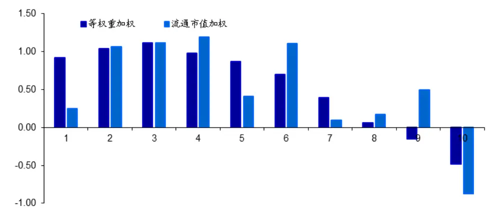
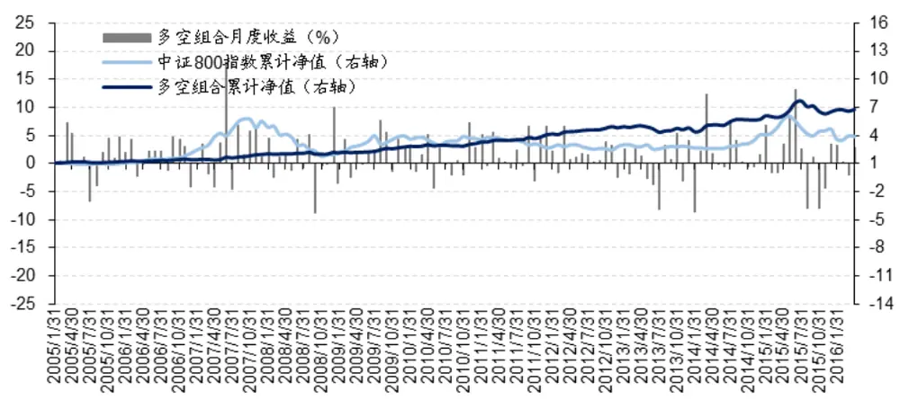
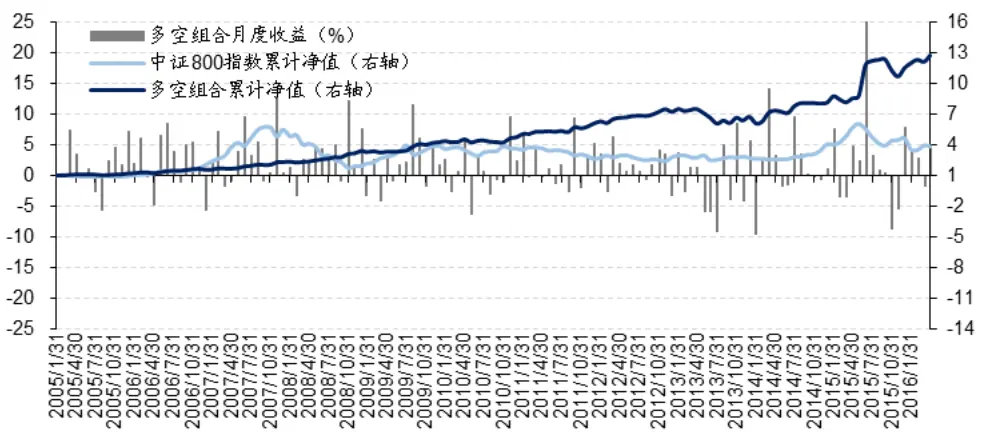
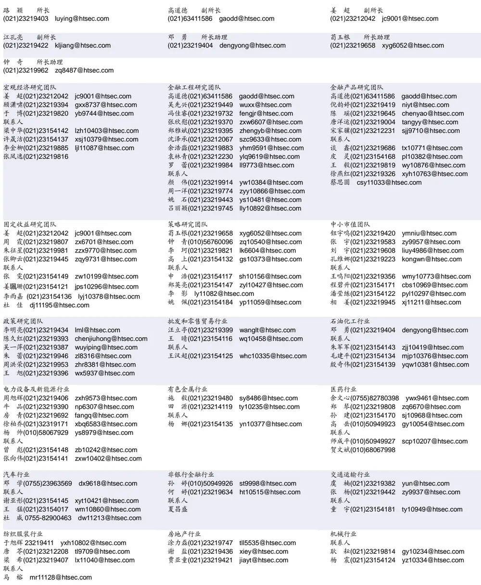
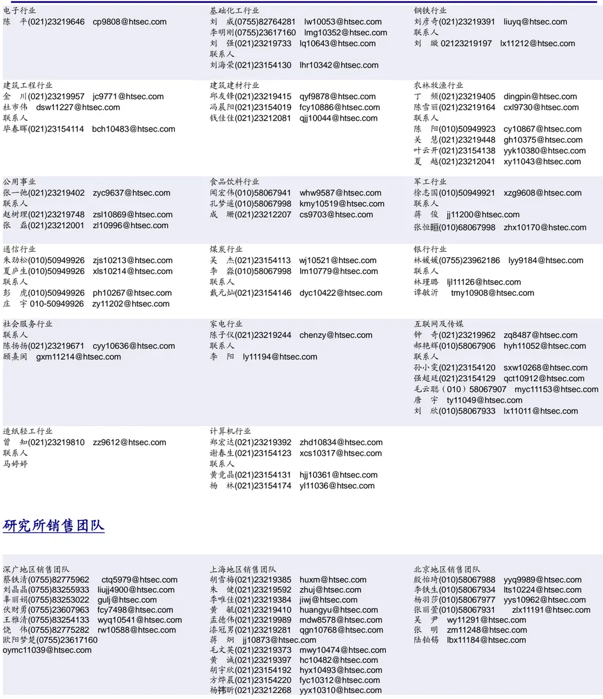

## 相关研究

[Table_ReportInfo]《基于因子剥离的 FOF 择基逻辑系列二——Alpha稳定性的两个维度》2016.09.13

《选股因子系列研究(十六)——选股因子空头收益的转化》

《从行业中性角度看组合中的行业配臵》2016.08.17

分析师:冯佳睿

Tel:(021)23219732

Email:fengjr@htsec.com

证书:S0850512080006

## 选股因子系列研究（十五）——“博彩型”股票的预期收益

大量的投资者，尤其是中小散户，很喜欢去猜测哪些股票会出现极端的高回报，并在这些成功概率极小的事件上押上重注。这一行为和欧美流行的博彩行业颇为相似，因而可以将这类股票形象地比喻为“博彩型”股票。通常来说，中了彩票的幸运者都倾向于马上兑现。那么一个合理的推断是，出现过极端高收益的“博彩型”股票也极有可能遭遇大量投资者的获利了结，因此这些股票在后期的表现大概率不及市场平均水平。本文通过详细的数据分析不仅证实了这一猜测，而且还发现常见的选股因子，如反转，都不能解释此种现象。

- 按照股票过去一个月的最大单日涨幅从小到大排序，并均分成十组，将最后一组定义为“博彩型”股票。无论是等权重还是流通市值加权，“博彩型”股票在次月的平均收益都是最低的。

- 如果将最大单日涨幅作为选股因子，它同样具备良好的效果。在等权重加权的情况下，股票在次月的预期收益和它们当月出现过的最大单日涨幅呈负相关，且首尾组合的收益差超过 1%，并在 5%的水平下显著。

- 根据最大单日涨幅因子得到多空组合，年化收益达到 18.49%。月胜率为 65.19%，夏普比率为 1.11，且三因素和四因素模型的 alpha 在统计意义上也都十分显著。

- 为剔除常见因子的影响，进一步采用双变量排序的方法分析选股时的交叉效应。与单变量的结果相比，控制其他因子后，最大单日涨幅因子选股的单调性不仅得到了很大改善，多空组合的收益差也更为显著。

反转效应并不能完全解释最大单日涨幅的选股效果。虽然最大单日涨幅因子本身及其选股结果很容易让人联想到反转效应，但是双变量排序的检验结果表明，在控制反转效应后，最大单日涨幅的选股效果仍得以维持，可以认为两者提供了有关投资者行为的不同信息。

- 风险提示。市场系统性风险、资产的流动性风险、政策变动风险会对策略的最终表现产生较大影响。

尽管分散化的思想被奉为投资领域的圭臬，但在实际操作中，大量的投资者，尤其是中小散户，并不理会这一理论。他们更喜欢去猜测哪些股票会出现极端的高回报，并在这些成功概率极小的事件上押上重注。这一行为和欧美流行的博彩行业颇为相似，因而可以将这类股票形象地比喻为“博彩型”股票。

通常来说，中了彩票的幸运者都倾向于马上兑现。那么一个合理的推断是，出现过极端高收益的“博彩型”股票也极有可能遭遇大量投资者的获利了结，因此这些股票在后期的表现大概率不及市场平均水平。本文通过详细的数据分析不仅证实了这一猜测，而且还发现常见的选股因子，如反转，都不能解释此种现象。

## 1. “博彩型”股票的预期收益

本文选取的时间区间为 2005 年 1 月-2016 年 5 月。在每个月的最后一个交易日，剔除当日停牌、ST、涨停及上市不足三个月的股票，形成最终的分析样本。

## 1.1 分组截面分析

首先，按照股票过去一个月的最大单日涨幅从小到大排序，并均分成十组，最后一组即为前文定义的“博彩型”股票。分别以等权重和流通市值加权两种方式计算每一组股票在次月的收益率，结果如以下图表所示。

图1 按最大单日涨幅分组后的预期收益（%）

资料来源：Wind，海通证券研究所

表 1 按最大单日涨幅分组后的预期收益

| 等权重加权 | 流通市值加权 |
| --- | --- |
| 1 | 1.34% 0.89% |
| 2 | 1.61% 1.27% |
| 3 | 1.64% 0.44% |
| 4 | 1.47% 0.77% |
| 5 | 1.31% 0.44% |
| 6 | 1.15% 0.83% |
| 7 | 0.80% -0.49% |
| 8 | 0.44% -0.04% |
| 9 | 0.25% -0.21% |
| 10 | -0.06% -0.65% |
| 1-10 | 1.40% 1.54% |
| t统计量 | 4.17 1.66 |

资料来源：Wind，海通证券研究所

无论是等权重还是流通市值加权，“博彩型”股票（第 10 组）在次月的平均收益都是最低的，完全符合对投资者在获取极端高收益后急于卖出兑现这一行为的推测。此外，如果把最大单日涨幅作为一个选股因子，它同样具备良好的效果。尤其是在等权重加权这种情形中，股票在次月的预期收益和它们当月出现过的最大单日涨幅呈负相关，且首尾组合的收益差超过 1%，并在 5%的水平下显著。

考虑到 A股市场对个股有涨跌停的限制，以最大单日涨幅排序可能并不合理。因此，进一步按照一个月中单日涨幅最大的前 N个交易日的平均涨幅排序分组，等权重加权计算组合收益，具体结果见下表。其中，N从 1至 5 依次取值。

表 2 按 N日平均最大涨幅分组后的预期收益

|  | N=1 | N=2 | N=3 | N=4 | N=5 |
| --- | --- | --- | --- | --- | --- |
| 1 | 0.92 % | 0.89 % | 0.90% | 0.94 % | 0.93% |
| 2 | 1.04 % | 1.19 % | 1.15 % | 1.07 % | 1.09 % |
| 3 | 1.12 % | 1.17 % | 1.22 % | 1.24 % | 1.15 % |
| 4 | 0.98 % | 1.02 % | 1.06 % | 1.09 % | 1.15 % |
| 5 | 0.87 % | 0.93 % | 0.83 % | 0.85 % | 0.89 % |
| 6 | 0.70 % | 0.72 % | 0.72 % | 0.72 % | 0.69 % |
| 7 | 0.39 % | 0.44 % | 0.52 % | 0.51 % | 0.53 % |
| 8 | 0.06 % | 0.21 % | 0.16 % | 0.21 % | 0.23 % |
| 9 | -0.15 % | -0.18 % | -0.09 % | -0.10 % | -0.15 % |
| 10 | -0.48 % | -0.72 % | -0.78 % | -0.85 % | -0.84 % |
| 1-10 | 1.40 % | 1.61% | 1.68 % | 1.79% | 1.76 % |
| t统计量 | 3.34 | 2.99 | 3.33 | 3.01 | 2.78 |

资料来源：Wind，海通证券研究所

在任何一个 N的取值下，最大涨幅平均值和预期收益的负相关性依然显著存在，首尾组合的收益差和统计显著性均十分稳定。而且，N 越大，收益差似乎也越高。

## 1.2 分组时间序列分析

上一节从截面的角度对“博彩型”股票和最大单日涨幅因子进行了分析，但想要了解因子选股的稳定性，同样需要从时间序列的层面加以研究。因此，在分组的基础上，将第1组与第10组每月的收益差作为多空组合的回报，考察其2005年以来的净值表现。

分别选取 N=1 和 N=5 两种情况，多空组合的收益-风险特征如以下两表所示。

表 3 多空组合业绩表现（N = 1）

| 累计收益 | 年化收益 | 年化波动率 | 夏普比率 | 最大回撤 | Calmar 比率 | 月均收益 | 月胜率 | FF3-alpha | C4-alpha |
| --- | --- | --- | --- | --- | --- | --- | --- | --- | --- |
| 574.64% | 18.49% | 14.35% | 1.11 | 18.02% | 1.03 | 1.51% | 65.19% | 1.53(4.12) | 1.08(2.03) |

资料来源： ，海通证券研究所

表 4 多空组合业绩表现（N = 5）

| 累计收益 | 年化收益 | 年化波动率 | 夏普比率 | 最大回撤 | Calmar 比率 | 月均收益 | 月胜率 | FF3-alpha | C4-alpha |
| --- | --- | --- | --- | --- | --- | --- | --- | --- | --- |
| 1178.88% | 25.43% | 18.11% | 1.27 | 19.16% | 1.33 | 2.03% | 65.93% | 1.68(4.14) | 1.12(2.29) |

资料来源：Wind，海通证券研究所

当N=1时，即，使用最大单日涨幅排序得到的多空组合，其年化收益达到了18.49％，月胜率达到 65.19%，三因素和四因素模型的 alpha 在统计意义上也都十分显著。

当 N=5 时，即，使用单日涨幅最大的前 5个交易日的平均涨幅排序得到的多空组合，

依然保持接近 2/3 的胜率。月均收益、夏普比率和 Calmar 比率也比 N=1 时有所提高。

为了更直观地展示多空组合在时间序列上的净值表现，本文绘制了上述两个多空组合的月度收益和累计净值图，并以中证 800 指数为基准进行对比，具体结果如下。

图2 多空组合累计净值（N = 1）

资料来源：Wind，海通证券研究所

图3 多空组合累计净值（N = 5）

资料来源：Wind，海通证券研究所

两个多空组合的累计净值都稳稳地超越中证 800 指数，更值得关注的是，在众多选股因子失效的 2014 年 12 月，组合却没有出现明显的负收益。

下表列示了 N=1 时，多空组合分年度的收益-风险指标。除 13 年外，多空组合均有超过 1%的月均收益，胜率也未低于过 50%。这些证据都表明，最大单日涨幅，这个看似十分简单的因子在选股时却有着优异且稳定的表现。

表 5 多空组合分年度表现

|  | 年度收益 | 年化波动率 | 夏普比率 | 最大回撤 | Calmar 比率 | 月均收益 | 月胜率 |
| --- | --- | --- | --- | --- | --- | --- | --- |
| 2005 | 16.26% | 13.49% | 1.02 | 10.34% | 1.57 | 1.46% | 81.82% |
| 2006 | 17.86% | 9.33% | 1.65 | 4.24% | 4.21 | 1.42% | 66.67% |
| 2007 | 40.36% | 20.05% | 1.89 | 5.88% | 6.86 | 3.02% | 66.67% |
| 2008 | 12.33% | 15.53% | 0.63 | 9.24% | 1.33 | 1.07% | 50.00% |
| 2009 | 26.31% | 11.17% | 2.13 | 3.61% | 7.28 | 2.02% | 66.67% |
| 2010 | 13.54% | 11.04% | 1.00 | 5.23% | 2.59 | 1.11% | 58.33% |
| 2011 | 30.31% | 10.92% | 2.55 | 3.06% | 9.92 | 2.28% | 66.67% |
| 2012 | 18.39% | 8.05% | 1.97 | 2.50% | 7.35 | 1.44% | 83.33% |
| 2013 | -0.29% | 13.16% | -0.21 | 13.98% | -0.02 | 0.05% | 58.33% |
| 2014 | 19.18% | 16.65% | 1.00 | 8.50% | 2.26 | 1.59% | 58.33% |
| 2015 | 14.19% | 21.25% | 0.55 | 18.02% | 0.79 | 1.30% | 58.33% |
| 2016 | 4.00% | 7.52% | 0.20 | 2.10% | 1.90 | 1.01% | 75.00% |

资料来源：Wind，海通证券研究所

## 2. 双变量检验

最大单日涨幅因子本身及其选股结果很容易让人联想到反转效应，而且当检验从三因素模型变化为四因素模型后，alpha 虽然保持了显著，但数值却有了一定的降低。这不禁让人怀疑，常见因子是否会对最大单日涨幅和预期收益负相关这一结论产生影响。下文将对此展开详细的讨论。

## 2.1 因子特征分析

首先，考察按月度最大单日涨幅从小到大排序分组后，各组股票的因子特征。因子包括，当月的最大单日涨幅、月初的总市值和账面市值比(BM)、Beta、流动性缺乏度、异质波动率、1 个月反转。下表的统计数据是对每个月各组股票的特征取中位数后，再计算其月度均值而得。

表 6 按最大单日涨幅分组后股票的特征分析

| 最大单日涨幅 | 市值（亿元） | Beta | BM | 流动性缺乏度 | 异质波动率 | 1个月反转 |
| --- | --- | --- | --- | --- | --- | --- |
| 1 2.97 % | 168.59 | 0.98 | 0.4234 | 0.0248 | 1.79 | -4.81% |
| 2 3.68 % | 131.48 | 1.06 | 0.4051 | 0.0236 | 1.95 | -2.98% |
| 3 4.25 % | 123.46 | 1.12 | 0.3945 | 0.0227 | 2.01 | -2.87% |
| 4 4.78 % | 126.28 | 1.14 | 0.3760 | 0.0211 | 2.07 | -2.00% |
| 5 5.34 % | 125.72 | 1.15 | 0.3543 | 0.0201 | 2.15 | -0.90% |
| 6 5.95% | 129.68 | 1.15 | 0.3401 | 0.0198 | 2.21 | -0.07% |
| 7 6.65 % | 129.52 | 1.14 | 0.3185 | 0.0199 | 2.28 | 1.23 % |
| 8 7.51% | 132.99 | 1.18 | 0.3150 | 0.0186 | 2.37 | 3.05 % |
| 9 8.70% | 133.81 | 1.20 | 0.3073 | 0.0139 | 2.44 | 5.09 % |
| 10 10.02% | 120.53 | 1.23 | 0.3131 | 0.0157 | 2.56 | 7.97 % |

资料来源： ，海通证券研究所

从上表中可以清晰地看到，“博彩型”股票（月度最大单日涨幅最高的第 10组）呈现小市值、高 Beta、高估值、高异质波动率和反转的特性。

## 2.2 双变量检验

在发现了最大单日涨幅与部分因子的关系后，本文进一步采用双变量排序的方法分析选股时两者的交叉效应。具体来说，先按照市值、1 个月反转、流动性缺乏度、和账面市值比(BM)排序，将所有可交易的股票分成 10 组。其次，在各组别内进一步根据最大单日涨幅分成 10 组，等权重加权求得每个组合的次月收益率。最后，计算这 10 个组合的平均收益。具体结果见下表。

表 7 双变量分组检验

| 市值 | 1个月反转 | 流动性缺乏度 | BM |
| --- | --- | --- | --- |
| 1 1.04 % | 0.68 % | 0.99 % | 1.13 % |
| 2 | 1.02 % 0.78 % | 0.64 % | 0.96 % |
| 3 1.04% | 0.60 % | 0.80% | 0.95 % |
| 4 | 0.83% 0.52% | 0.60% | 0.50 % |
| 5 | 0.43 % | 0.42 % 0.45 % | 0.60 % |
| 6 | 0.36 % | 0.31 % 0.32 % | 0.32 % |
| 7 | -0.02 % | 0.07 % 0.26 % | 0.13 % |
| 8 | -0.06% | -0.12% 0.10% | -0.06 % |
| 9 | -0.46 % | -0.23 % -0.40 % | -0.42 % |
| 10 | -0.84% | -0.37% -0.62% | -0.82 % |
| 1-10 | 1.88% | 1.05 % 1.62 % | 1.94 % |
| t统计量 | 4.48 | 2.52 3.94 | 4.86 |

资料来源：Wind，海通证券研究所

在剔除了这几个因子的影响后，最大单日涨幅和预期收益之间的负相关性依然存在。而且，和单变量的结果相比，不仅单调性得到了很大改善，多空组合的收益差也更为显著。此外，双变量交叉分组的检验结果表明，反转效应并不能完全解释最大单日涨幅的选股效果，可以认为两者提供了有关投资者行为的不同信息。

## 3. 总结与讨论

本文从投资者的赌徒心理和急于获利了结的行为出发，定义了新的选股因子——股票当月的最大单日涨幅。按此因子排序分组后发现，它与未来一个月的预期收益呈显著负相关，其首尾组合平均每月能产生 的多空收益。而且，在双变量交叉分组的检验中，市值、反转、流动性等因子都不影响最大单日涨幅的选股效果。进一步，可将最大单日涨幅最高的第 10 组定义为“博彩型”股票，研究证明其平均收益远低于其他组别和市场平均，投资者在选股过程中应当予以警惕和规避。

## 4. 风险提示

市场系统性风险、资产的流动性风险、政策变动风险会对策略的最终表现产生较大影响。

(实习生张振岗、闫丽对本文亦有贡献)

特别声明 本篇报告的结果均由数量化模型自动计算得到，研究员未进行主观判断调整；数据源均来自于市场公开信息。

# 信息披露

分析师声明

[Table冯佳睿ysts]金融工程研究团队

本人具有中国证券业协会授予的证券投资咨询执业资格，以勤勉的职业态度，独立、客观地出具本报告。本报告所采用的数据和信息均来自市场公开信息，本人不保证该等信息的准确性或完整性。分析逻辑基于作者的职业理解，清晰准确地反映了作者的研究观点，结论不受任何第三方的授意或影响，特此声明。

## 法律声明

本报告仅供海通证券股份有限公司（以下简称“本公司”）的客户使用。本公司不会因接收人收到本报告而视其为客户。在任何情况下，本报告中的信息或所表述的意见并不构成对任何人的投资建议。在任何情况下，本公司不对任何人因使用本报告中的任何内容所引致的任何损失负任何责任。

本报告所载的资料、意见及推测仅反映本公司于发布本报告当日的判断，本报告所指的证券或投资标的的价格、价值及投资收入可能会波动。在不同时期，本公司可发出与本报告所载资料、意见及推测不一致的报告。

市场有风险，投资需谨慎。本报告所载的信息、材料及结论只提供特定客户作参考，不构成投资建议，也没有考虑到个别客户特殊的投资目标、财务状况或需要。客户应考虑本报告中的任何意见或建议是否符合其特定状况。在法律许可的情况下，海通证券及其所属关联机构可能会持有报告中提到的公司所发行的证券并进行交易，还可能为这些公司提供投资银行服务或其他服务。

本报告仅向特定客户传送，未经海通证券研究所书面授权，本研究报告的任何部分均不得以任何方式制作任何形式的拷见、复印件或复制品，或再次分发给任何其他人，或以任何侵犯本公司版权的其他方式使用。所有本报告中使用的商标、服务标记及标记均为本公司的商标、服务标记及标记。如欲引用或转载本文内容，务必联络海通证券研究所并获得许可，并需注明出处为海通证券研究所，且不得对本文进行有悖原意的引用和删改。

根据中国证监会核发的经营证券业务许可，海通证券股份有限公司的经营范围包括证券投资咨询业务。

海通证券股份有限公司研究所[Table_PeopleInfo]

海通证券股份有限公司研究所

地址：上海市黄浦区广东路 689号海通证券大厦 9楼

电话：（021）23219000

传真：（021）23219392

网址：www.htsec.com