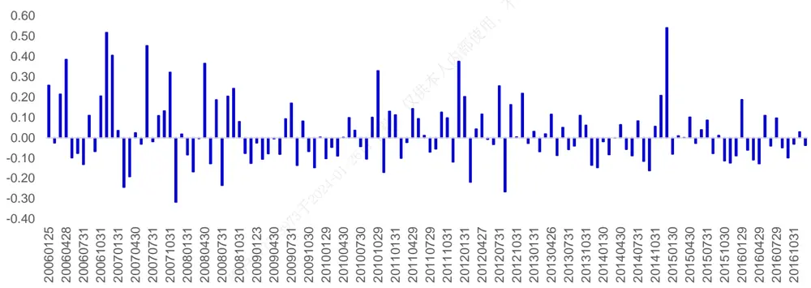
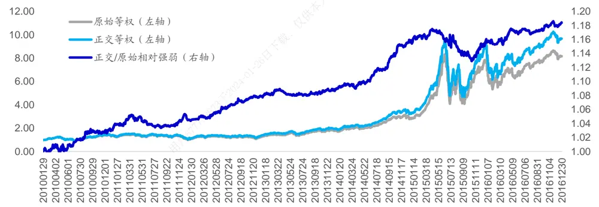
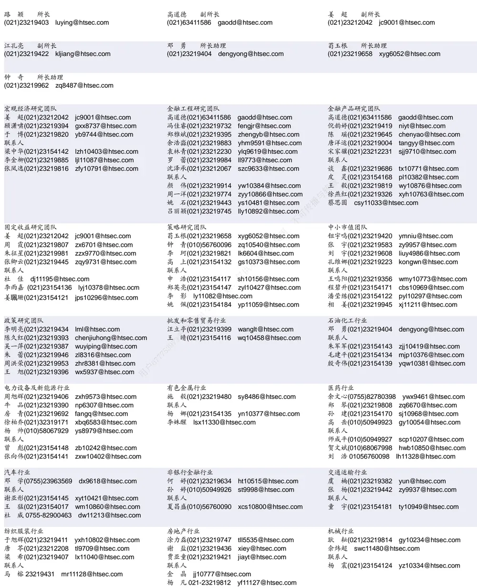

## 相关研究

Table_ReportInfo]《“革故鼎新”之海通量化年终总结 ：股市场——年年岁岁花相似》《海通量化多因子组合 》《次新股运行规律及投资策略》

2016.11.15

分析师:冯佳睿

Tel:(021)23219732

Email:fengjr@htsec.com

证书:S0850512080006

分析师:袁林青

Tel:(021)23212230

Email:ylq9619@htsec.com

证书:S0850516050003

## 选股因子系列研究(十七)——选股因子的正交

近年来，随着投资者对于因子选股体系研究的深入，选股因子值的处理也在逐渐细化。本文主要对于选股因子的正交进行了讨论。之所以讨论因子的正交是因为在传统的多因子模型中，选取的因子之间往往存在着相关性，而这种相关性并不稳定。因此相关性的存在会复杂因子权重的分配。对于等权分配因子权重的多因子模型，由于因子之间相关性的存在，模型可能实际上对于某一因子有更高的暴露（例如，市值因子）。对于权重优化的模型，相关性的影响可能会更大。因此，本文考虑在构建因子的时候就对于相关性进行剔除从而达到更为可控的因子暴露。

选股因子截面相关性波动较大。以市值因子与反转因子为例，虽然两因子截面相关性长期来看均值较低，仅为 ， 统计量为 ，但是在不同时间段上因子截面相关性差别极大，若使用这两个因子构建等权多因子选股组合，即使模型对于两因子分配权重相同，组合对于市值因子的暴露也会因为两因子之间相关性的变动而难以控制。对于因子权重优化的多因子模型，因子相关性带来的问题就会变得更加复杂。基于上述原因，我们认为选股因子的正交还是有必要的。

可通过线性回归对于因子间的线性相关性进行剔除。本报告主要通过线性回归对于因子之间的线性相关性进行剔除。例如，在某一时点 t，投资者需要将选股因子 m 相对于现有的 k 个选股因子做正交。选股因子 m 的正交因子值可通过以下回归方程得到。

$$
f_{m}=\beta_{1}f_{1}+\beta_{2}f_{2}+\cdots+\beta_{k-1}f_{k-1}+\beta_{k}f_{k}+\varepsilon_{m}
$$

为各个股票在 t时刻因子 m 的因子值，ε 为各个股票在 t时刻正交因子 m 的因子值。对于多个选股因子的集合，可通过“逐步添加变量，逐步正交”的方式进行处理并得到两两之间相互正交的因子集合。

- 逐步正交多因子模型在不同因子集合下相比于原始多因子模型皆能产生提升。正交组合相比于原始组合在复合因子 、复合因子 、多头组合超额收益、组合信息比率以及相对月度胜率上皆有提升。在等权多因子模型下，正交处理对于原始组合的提升会随着因子数量的增多而逐渐减弱，在最大化收益预期模型中，该现象得到了较好的缓解。

- 借鉴逐步回归法，可使用收益预测模型 R方为标准确定因子正交顺序。整体上来看，该方法有一定提升效果，但有待改进。使用上述方法确认正交顺序后所得到的动态正交组合相比于原始组合确实有一定的提升但是提升效果弱于前文中给出的固定正交顺序下的组合表现。此外，动态正交组合相比于原始组合的提升在强势选股因子集合下更为明显，在“弱有效”的选股因子加入后动态正交的提升效果明显减弱。

- 风险提示。市场系统性风险、资产流动性风险以及政策变动风险会对策略表现产生较大影响。

近年来，随着投资者对于因子选股体系研究的深入，选股因子值的处理也在逐渐细化。本文主要对于选股因子的正交进行了讨论。之所以讨论因子的正交是因为在传统的多因子模型中，选取的因子之间往往存在着一定程度的相关性，而这种相关性会复杂因子权重的分配。对于等权分配因子权重的多因子模型，由于因子之间相关性的存在，模型可能实际上对于某一因子有更高的暴露（例如，市值因子）。对于权重优化的模型，相关性的影响可能会更大。因此，本文考虑在构建因子的时候就对于相关性进行剔除从而达到更为可控的因子暴露。

本文主要分为三部分。第一部分对于因子正交的必要性以及正交过程中的相关处理方式进行了说明。第二部分回测对比了正交多因子模型与原始多因子模型的历史表现。第三部分对于正交顺序的确定进行了讨论。

## 1. 选股因子的正交

在讨论选股因子的正交之前，有一个问题更值得各位投资者思考：选股因子需要正交吗？我们认为是有必要的，核心原因在于选股因子间的截面相关性较不稳定。选股因子截面相关性在本文中具体指在某一时点上，某两个选股因子截面因子值之间的线性相关性。下图统计了市值因子与反转因子在 年至 年间在不同时点上的因子截面相关性。

图1 市值因子与反转因子截面相关性（2006-2016）

资料来源：WIND资讯，海通证券研究所

虽然两因子截面相关性长期来看其均值较低，仅为 0.02，且不显著（T 统计量为），但是在不同时间段上因子截面相关性差别极大，有的时候能够达到 的正相关，有的时候也能够达到-0.40 的负相关。若使用这两个因子构建等权多因子选股组合，即使对于两因子分配相同权重，组合对于市值因子（反转因子）的暴露也会因为两因子之间相关性的变动而难以控制。对于因子权重优化的多因子模型，因子相关性带来的问题就会变得更加复杂。基于上述原因，我们认为选股因子的正交还是十分必要的。

本报告主要通过线性回归的方式对于因子之间的线性相关性进行剔除。例如，在某一时点 t，投资者需要将选股因子 m 相对于现有的 k个选股因子做正交。选股因子 m 的正交因子值可通过以下回归方程得到。

$$
f_{m}=\beta_{1}f_{1}+\beta_{2}f_{2}+\cdots+\beta_{k-1}f_{k-1}+\beta_{k}f_{k}+\varepsilon_{m}
$$

$f_{m}$ 为各个股票在 t时刻因子 m 的因子值， $\varepsilon_{m}$ 为各个股票在 t时刻正交因子 m 的因子值。

当然，在实际应用的过程中，对于 K个因子的多因子模型，投资者最终希望得到的

是一个两两之间相互正交的多因子集合。本报告主要通过“逐步添加变量，逐步正交”的方式来对于多因子集合进行处理。该方法与 Gram-Schmit 方法较为类似，投资者在实际使用过程中也可根据自身需求对于正交的处理流程进行调整。

对于前文提到的逐步正交的处理方法，投资者需要预先给定一个选股因子正交的顺序。在此处我们不妨先假定已经有了一个因子正交的顺序，因子正交顺序的确定会在报告第三部分进行讨论。对于某一给定的正交顺序，可按以下步骤进行逐步正交处理：

1） 对于正交顺序第一的因子，其正交因子值就等于其原始因子值；

2） 对于正交顺序第 k（k>1）的因子，将其原始因子值作为回归的因变量，现有的已经正交过的因子作为回归的自变量，取回归残差为正交因子 k 的因子值；

3） 将正交因子 k 放入已经正交过的因子集合并对于正交顺序为 k+1的因子进行步骤（2）、（3）的处理。

## 2. 正交因子历史表现回顾

本节主要通过历史回测的方式对比正交多因子模型与原始多因子模型的不同。我们一共选取了8个不同类别的因子并在这8个因子中选择了不同的因子子集合构建多因子模型并对比正交模型与原始模型表现的不同。下表给出了这 8个因子的详细信息。

表 1 选股因子定义

| 因子名称 | 类型 | 计算方式 |
| --- | --- | --- |
| 市值 | 规模 | log(总市值) |
| 一个月反转 | 反转 | 前一个月股票涨幅 |
| 一个月换手率 | 流动性 | log(前一个月股票日均流通盘换手率) |
| 特异度 | 波动率 | 前期一个月股票日收益序列 FF3因素回归 R方 |
| 市净率 | 估值 | log(PB) |
| Beta | Beta | 前一个月股票日收益收益序列与市场收益序列回归的 Beta |
| 营收增速 | 增速 | 营业收入同比增速 |
| 负债权益比 | 财务杠杆 | 总负债/总权益 |

资料来源：WIND资讯，海通证券研究所

此外，在进行回测时本报告按照以下方式进行处理：

1） 使用 2010 年至 2016 年之间的数据进行回测；

2） 每月月末调整组合，按照双边千三的费率计算交易成本；

3） 所有的因子值都按照去极值以及标准化的方式进行处理。

另外，本节在构建正交因子时按照固定的顺序进行构建，下表给出了具体顺序。

表 2 选股因子正交顺序

| 正交顺序 | 1 | 2 | 3 | 4 | 5 | 6 | 7 | 8 | 9 |
| --- | --- | --- | --- | --- | --- | --- | --- | --- | --- |
| 因子名称 | 行业 | 市值 | 反转 | 换手 | 波动率 | PB | Beta | 增速 | 杠杆 |

资料来源：WIND资讯，海通证券研究所

接下来，本报告将分别在等权多因子模型以及最大化收益预期模型下对于正交多因子组合以及原始多因子组合的表现进行对比。

## 2.1 等权多因子模型

等权多因子模型对于不同的因子赋予相同的权重，权重前面的正负号取决于因子历史 IC 均值的正负。该模型的打分公式可表达为下式：

$$
R_{i}={\sum_{j=1}^{K}}{\frac{1}{K}}sign{\left(mean(IC_{i})\right)}f_{j}^{i}
$$

其中，R 为股票 i最终的因子打分值，fi 为股票 i在因子 j上的暴露值，K为选股因子的数量。

以较为经典的三因子模型（市值因子+反转因子+换手率因子）为例，可对原始等权多因子模型选股效果以及正交等权多因子模型选股效果进行对比。

若将多因子模型看作是一个复合因子的话，可计算复合因子的 IC以及 ICIR。对于原始三因子模型，IC为 0.09，ICIR 为 2.29，而对于正交三因子模型，IC 为 0.10，ICIR为 3.30。从 IC 上来看，两复合因子之间并未有十分明显的区别，但从 ICIR 上可以看到正交模型明显优于原始模型。由于 ICIR 实际上是 IC 的均值除以 IC 的标准差。在两复合因子 IC相差无几的情况下，更高的 ICIR 实际上意味着更低的 IC标准差，也即更高的 IC稳定性。当然，也可以构建中证 500 行业中性多头组合对比两模型的选股效果。下图对比了两多因子模型的多头组合净值走势。

图2 正交多因子模型与等权多因子模型多头组合净值走势（2006-2016）

资料来源：WIND资讯，海通证券研究所

观察两组合的相对强弱指数走势可知，正交组合在大部分时间上跑赢原始组合。但值得注意的是，正交组合在 2015 年 7 月至 10 月之间相对于原始组合出现了约 3%的相对回撤。在对于该段时间进行回溯后，我们发现反转因子在此段时间上的表现尤为强势，原始模型中的换手率因子与反转因子相关性较强，而正交模型中的换手率因子已经剔除了反转因子故而使得原始模型在该段时间上对于反转的暴露更高从而有着更高的收益。当然这种情况在整个回测区间段上出现的次数并不多。下表对于两个组合在整个回测时间段上的表现进行了统计。

表 3 多头组合表现对比（2010至 2016）

| 绝对收益 | 超额收益 | 相对最大回撤 | 收益回撤比 | 信息比率 | 相对胜率 |
| --- | --- | --- | --- | --- | --- |
| 原始组合 37% | 31% | 15% | 2.08 | 3.12 | 83% |
| 正交组合 41% | 34% | 14% | 2.37 | 3.46 | 86% |

资料来源：WIND资讯，海通证券研究所

在组合的绝对收益、超额收益、相对最大回撤、收益回撤比、信息比率以及月度胜率上，正交组合相比于原始组合皆有一定提升。为了进一步对比两个组合的不同，下表对比了两个组合分年度的表现情况。

表 4 组合分年度对比情况（2010至 2016）

|  | 原始三因子组合 |  |  |  |  | 正交三因子组合 |  |  |  |  |
| --- | --- | --- | --- | --- | --- | --- | --- | --- | --- | --- |
| 年度 | 年度超额 | 最大回撤 | Calmar | IR | 相对胜率 | 年度超额 | 最大回撤 | Calmar | IR | 相对胜率 |
| 2010 | 21.38% | 5.12% | 3.66 | 2.82 | 83.33% | 25.58% | 4.64% | 4.81 | 3.48 | 75.00% |
| 2011 | 20.83% | 2.49% | 8.09 | 3.56 | 83.33% | 22.63% | 2.47% | 8.84 | 3.92 | 83.33% |
| 2012 | 21.52% | 2.46% | 8.41 | 3.53 | 91.67% | 25.51% | 2.55% | 9.61 | 4.04 | 100.00% |
| 2013 | 20.30% | 3.28% | 5.81 | 3.18 | 75.00% | 21.65% | 3.24% | 6.27 | 3.34 | 91.67% |
| 2014 | 12.08% | 12.53% | 0.94 | 1.80 | 83.33% | 19.25% | 12.00% | 1.56 | 2.76 | 83.33% |
| 2015 | 108.37% | 14.78% | 7.01 | 4.57 | 83.33% | 108.14% | 14.39% | 7.18 | 4.65 | 83.33% |
| 2016 | 28.51% | 4.11% | 6.83 | 4.08 | 91.67% | 34.17% | 3.74% | 8.99 | 4.41 | 83.33% |

资料来源：WIND资讯，海通证券研究所

重点对比两组合分年度的超额收益以及信息比率后可发现，正交组合的信息比率在不同年份相比于原始组合都有所提升。于此同时，正交组合的收益相比于原始组合在绝大多数年份中也略有提升。这种提升在我们看来较为有效。因为在对于组合稳定性进行提升时，一种较为简单的做法就是控制组合风险，通过牺牲收益来对于组合表现稳定性进行提升，然而此处组合稳定性的提升并不是以组合收益的降低为代价的，所以我们认为正交处理在此处的提升是较为有效的。

下表分别统计对比了不同因子数量下原始组合与正交组合的表现情况。

表 5 不同因子组合下多头组合表现对比（2010至 2016）（等权模型）

|  | IC |  | ICIR | 绝对收益 | 超额收益 | 最大回撤 | 收益回撤比 | 信息比率 | 相对胜率 |
| --- | --- | --- | --- | --- | --- | --- | --- | --- | --- |
| 3因子 | 原始组合 | 0.09 | 2.29 | 37% | 31% | 15% | 2.08 | 3.12 | 83% |
|  | 正交组合 | 0.10 | 3.30 | 41% | 34% | 14% | 2.37 | 3.46 | 86% |
| 4因子 | 原始组合 | 0.10 | 2.78 | 40% | 33% | 14% | 2.42 | 3.43 | 82% |
|  | 正交组合 | 0.11 | 4.06 | 42% | 35% | 13% | 2.75 | 3.76 | 86% |
| 5因子 | 原始组合 | 0.08 | 2.36 | 31% | 25% | 14% | 1.73 | 2.89 | 81% |
|  | 正交组合 | 0.09 | 4.06 | 35% | 29% | 15% | 1.96 | 3.36 | 83% |
| 6因子 | 原始组合 | 0.08 | 2.47 | 33% | 27% | 15% | 1.78 | 3.04 | 78% |
|  | 正交组合 | 0.09 | 4.12 | 36% | 29% | 13% | 2.28 | 3.33 | 79% |
| 7因子 | 原始组合 | 0.07 | 2.48 | 32% | 26% | 15% | 1.74 | 2.99 | 82% |
|  | 正交组合 | 0.09 | 4.14 | 34% | 28% | 13% | 2.11 | 3.23 | 81% |
| 8因子 | 原始组合 | 0.07 | 2.41 | 32% | 26% | 16% | 1.70 | 2.91 | 79% |
|  | 正交组合 | 0.08 | 3.93 | 31% | 25% | 14% | 1.77 | 2.98 | 83% |

资料来源： 资讯，海通证券研究所

通过对比可以发现，不同因子组合下正交组合相比于原始组合都有所提升。此外，正交处理对于组合的提升会随着因子数量的增多而逐渐减弱。对于这一现象，我们认为这是后加入的因子以及等权模型本身的特性所共同造成的。通过前文介绍可知，后加入的因子都是一些“弱有效”的选股因子（即，具有一定选股效果但不稳定）。而这些因子的选股能力往往来源于它们和传统强势选股因子之间的相关性，在通过正交处理以后这些因子本身的选股能力就会更弱从而会在等权模型中对于最终打分产生干扰。为了能够避免等权因子权重分配带来的影响，我们在下一节中对于正交因子在因子权重优化模型中的表现也进行了统计与对比。

## 2.2 最大化收益预期多因子模型

在最大化收益预期模型中，我们首先使用给定因子使用历史数据构建收益预期模型，然后基于收益预期模型回归系数以及选股时点上股票对于各因子的暴露可计算得到各股票下一期的收益预期。基于股票收益预期，可得到最终选股组合。

下表给出了原始组合与正交组合在不同因子集合下的表现。

表 6 不同因子组合下多头组合表现对比（2010至 2016）（最大化收益预期模型）

|  |  | IC | ICIR | 绝对收益 | 超额收益 | 最大回撤 | 收益回撤比 | 信息比率 | 月度胜率 |
| --- | --- | --- | --- | --- | --- | --- | --- | --- | --- |
| 3因子 | 原始组合 | 0.09 | 2.09 | 39% | 33% | 19% | 1.75 | 3.18 | 79% |
|  | 正交组合 | 0.10 | 3.05 | 39% | 33% | 17% | 1.98 | 3.29 | 82% |
| 4因子 | 原始组合 | 0.09 | 2.48 | 40% | 34% | 17% | 2.02 | 3.43 | 82% |
|  | 正交组合 | 0.10 | 3.47 | 43% | 37% | 15% | 2.53 | 3.69 | 83% |
| 5因子 | 原始组合 | 0.09 | 2.42 | 38% | 32% | 17% | 1.88 | 3.33 | 81% |
|  | 正交组合 | 0.10 | 3.45 | 42% | 36% | 16% | 2.28 | 3.70 | 82% |
| 6因子 | 原始组合 | 0.09 | 2.45 | 39% | 33% | 17% | 1.94 | 3.39 | 82% |
|  | 正交组合 | 0.10 | 3.48 | 42% | 36% | 15% | 2.37 | 3.67 | 85% |
| 7因子 | 原始组合 | 0.09 | 2.44 | 39% | 33% | 17% | 1.93 | 3.38 | 81% |
|  | 正交组合 | 0.10 | 3.49 | 42% | 36% | 15% | 2.37 | 3.66 | 86% |
| 8因子 | 原始组合 | 0.09 | 2.27 | 37% | 31% | 18% | 1.78 | 3.20 | 81% |
|  | 正交组合 | 0.10 | 3.48 | 41% | 35% | 15% | 2.27 | 3.56 | 87% |

资料来源：WIND资讯，海通证券研究所

可以看到，正交处理在最大化收益预期模型中的效果更加稳定。随着因子数量的增多，正交组合相比于原始组合的提升也并未出现明显减弱。对于“弱有效”的选股因子，在正交后若选股效果较弱，那么在收益预测模型中的回归系数也就会相应地较低，从而使得模型最终分配到该因子上的权重变低。所以可以看到，正交处理带来的提升并未随着因子数量的增多而出现明显减弱。

## 3. 正交顺序的确定

前文所提到的“逐步添加变量，逐步正交”的方法需要在正交前确定正交的顺序。本节将对于正交顺序的确定进行初步讨论。由于海外文献对于正交顺序的确定并未有一致的结论，我们在本篇报告中借鉴逐步回归法构建了正交顺序的确定方法，详细步骤如下：（假设现有 个选股因子需要进行逐步正交）

若需确认第一个正交的选股因子，

1） 对于每一个备选因子 f，使用历史 24 个月的数据构建收益预测模型，并计算收益预测模型的 R方；

2） 选择具有最大 R方的收益预测模型所对应的备选因子作为第一个正交的因子；若存在正交因子 of …of ，

1） 将每一个备选因子 f 相对于已有的正交因子正交，并得到正交后的备选因子 of；

2） 使用已存在的正交因子以及正交后的备选因子构建收益预测模型并计算收益预测模型的 R 方；

3） 选择具有最大 R方的收益预测模型所对应的备选因子作为下一个正交的因子。

基于上述框架投资者可根据自身需要对于正交顺序的确认方法进行构建。例如，可将历史数据时间窗口进行变化，或者使用R方以外的指标为标准对于备选因子进行选取。

下表展示了等权模型中不同因子集合下原始组合与正交组合的表现情况。观察下表可知，使用上述方法确认正交顺序后所得到的动态正交组合相比于原始组合确实有一定的提升但是提升效果弱于前文中给出的固定正交顺序下的组合表现。此外，动态正交组合相比于原始组合的提升在强势选股因子集合下更为明显，在弱有效的选股因子加入后动态正交的提升效果明显减弱。

表 7 不同因子组合下多头组合表现对比（2010至 2016）（动态正交）（等权模型）

|  |  | IC ICIR |  | 绝对收益 | 超额收益 最大回撤 | 收益回撤比 | 信息比率 |  | 月度胜率 |
| --- | --- | --- | --- | --- | --- | --- | --- | --- | --- |
| 3因子 | 原始等权 | 0.09 | 2.29 | 37% | 31% | 15% | 2.08 | 3.12 | 83% |
|  | 逐步正交 | 0.10 | 3.30 | 41% | 34% | 14% | 2.37 | 3.46 | 86% |
|  | 动态正交 | 0.10 | 3.25 | 37% | 31% | 14% | 2.25 | 3.23 | 81% |
| 4因子 | 原始等权 | 0.10 | 2.78 | 40% | 33% | 14% | 2.42 | 3.43 | 82% |
|  | 逐步正交 | 0.11 | 4.06 | 42% | 35% | 13% | 2.75 | 3.76 | 86% |
|  | 动态正交 | 0.10 | 4.17 | 39% | 33% | 13% | 2.61 | 3.64 | 86% |
| 5因子 | 原始等权 | 0.08 | 2.36 | 31% | 25% | 14% | 1.73 | 2.89 | 81% |
|  | 逐步正交 | 0.09 | 4.06 | 35% | 29% | 15% | 1.96 | 3.36 | 83% |
|  | 动态正交 | 0.09 | 4.14 | 32% | 27% | 14% | 1.90 | 3.17 | 85% |
| 6因子 | 原始等权 | 0.08 | 2.47 | 33% | 27% | 15% | 1.78 | 3.04 | 78% |
|  | 逐步正交 | 0.09 | 4.12 | 36% | 29% | 13% | 2.28 | 3.33 | 79% |
|  | 动态正交 | 0.09 | 3.82 | 32% | 27% | 13% | 2.05 | 3.04 | 79% |
| 7因子 | 原始等权 | 0.07 | 2.48 | 32% | 26% | 15% | 1.74 | 2.99 | 82% |
|  | 逐步正交 | 0.09 | 4.14 | 34% | 28% | 13% | 2.11 | 3.23 | 81% |
|  | 动态正交 | 0.08 | 3.84 | 32% | 26% | 13% | 2.02 | 3.04 | 79% |
| 8因子 | 原始等权 | 0.07 | 2.41 | 32% | 26% | 16% | 1.70 | 2.91 | 79% |
|  | 逐步正交 | 0.08 | 3.93 | 31% | 25% | 14% | 1.77 | 2.98 | 83% |
|  | 动态正交 | 0.08 | 3.72 | 31% | 26% | 15% | 1.73 | 2.97 | 83% |

资料来源：WIND资讯，海通证券研究所

下表展示了最大化收益预期模型中不同因子集合下原始组合与正交组合的表现情况。对于最大化收益预期模型，我们同样可以得到类似的结论。即，动态正交组合相比于原始组合在收益以及信息比方面的确有一定的提升，但是提升效果弱于固定正交顺组组合。此外，动态正交处理带来的提升更多集中在强势选股因子集合中。

表 8 不同因子组合下多头组合表现对比（2010至 2016）（动态正交）（最大化收益预期模型）

|  |  | IC | ICIR | 绝对收益 | 超额收益 | 最大回撤 | 收益回撤比 | 信息比率 | 月度胜率 |
| --- | --- | --- | --- | --- | --- | --- | --- | --- | --- |
| 3因子 | 原始等权 | 0.09 | 2.09 | 39% | 33% | 19% | 1.75 | 3.18 | 79% |
|  | 逐步正交 | 0.10 | 3.05 | 39% | 33% | 17% | 1.98 | 3.29 | 82% |
|  | 动态正交 | 0.10 | 3.39 | 38% | 32% | 17% | 1.89 | 3.20 | 87% |
| 4因子 | 原始等权 | 0.09 | 2.48 | 40% | 34% | 17% | 2.02 | 3.43 | 82% |
|  | 逐步正交 | 0.10 | 3.47 | 43% | 37% | 15% | 2.53 | 3.69 | 83% |
|  | 动态正交 | 0.10 | 3.64 | 40% | 34% | 16% | 2.15 | 3.51 | 86% |
| 5因子 | 原始等权 | 0.09 | 2.42 | 38% | 32% | 17% | 1.88 | 3.33 | 81% |
|  | 逐步正交 | 0.10 | 3.45 | 42% | 36% | 16% | 2.28 | 3.70 | 82% |
|  | 动态正交 | 0.10 | 3.81 | 40% | 34% | 15% | 2.20 | 3.59 | 83% |
| 6因子 | 原始等权 | 0.09 | 2.45 | 39% | 33% | 17% | 1.94 | 3.39 | 82% |
|  | 逐步正交 | 0.10 | 3.48 | 42% | 36% | 15% | 2.37 | 3.67 | 85% |
|  | 动态正交 | 0.10 | 3.65 | 38% | 32% | 14% | 2.20 | 3.37 | 82% |
| 7因子 | 原始等权 | 0.09 | 2.44 | 39% | 33% | 17% | 1.93 | 3.38 | 81% |
|  | 逐步正交 | 0.10 | 3.49 | 42% | 36% | 15% | 2.37 | 3.66 | 86% |
|  | 动态正交 | 0.10 | 3.65 | 38% | 32% | 14% | 2.20 | 3.35 | 82% |
| 8因子 | 原始等权 | 0.09 | 2.27 | 37% | 31% | 18% | 1.78 | 3.20 | 81% |
|  | 逐步正交 | 0.10 | 3.48 | 41% | 35% | 15% | 2.27 | 3.56 | 87% |
|  | 动态正交 | 0.09 | 3.49 | 37% | 32% | 15% | 2.09 | 3.20 | 85% |

资料来源： 资讯，海通证券研究所

对于动态正交组合提升效果的不稳定这一问题，我们认为正交顺序在这里有着较大的影响。动态正交组合的因子正交顺序取决于因子对于股票收益波动的解释度。然而对于某些因子组合，它们虽然对于股票收益波动的解释度较高，但是对于股票收益预测的稳定性较低（即，风险因子）。这种因子的出现会在以 方为判定标准的动态正交模型下对于因子的正交顺序产生影响，从而对于正交因子的计算带来影响。考虑到这一问题，我们认为正交顺序的确认方法在实际应用中还有待提升，可以保留整体的框架但是在挑选正交因子时使用其他条件进行筛选。

## 4. 总结

本文对于选股因子的正交进行了讨论，希望通过使用正交选股因子来得到更加可控的因子暴露。通过实际组合的构建以及初步回测，我们发现正交因子组合相比于原始组合在稳定性上的确有着明显改善，此外这种稳定性的提升并未牺牲组合收益。在等权多因子模型下，正交处理对于组合的提升会随着因子数量的增多而减弱，而在最大化收益预期多因子模型下，正交处理对于组合的提升效果更为稳定。

此外，本文还对于选股因子正交顺序的确定进行了探讨，我们使用收益预测模型 R方作为正交顺序的判定标准。总的来说，该方法还有待进一步提升。通过实际回测可知，该方法计算得到的动态正交多因子组合确实能够在强势选股因子集合内相对于原始组合产生提升。但是随着因子集合的扩大以及“弱有效”选股因子的加入，动态正交处理带来的提升基本消失。

## 5. 风险提示

市场系统性风险、资产流动性风险以及政策变动风险会对策略表现产生较大影响。

# 信息披露

分析师声明

[Table冯佳睿yst 金融s]工程研究团队

袁林青金融工程研究团队

本人具有中国证券业协会授予的证券投资咨询执业资格，以勤勉的职业态度，独立、客观地出具本报告。本报告所采用的数据和信息均来自市场公开信息，本人不保证该等信息的准确性或完整性。分析逻辑基于作者的职业理解，清晰准确地反映了作者的研究观点，结论不受任何第三方的授意或影响，特此声明。

## 法律声明

本报告仅供海通证券股份有限公司（以下简称“本公司”）的客户使用。本公司不会因接收人收到本报告而视其为客户。在任何情况下，本报告中的信息或所表述的意见并不构成对任何人的投资建议。在任何情况下，本公司不对任何人因使用本报告中的任何内容所引致的任何损失负任何责任。

本报告所载的资料、意见及推测仅反映本公司于发布本报告当日的判断，本报告所指的证券或投资标的的价格、价值及投资收入可能播会波动。在不同时期，本公司可发出与本报告所载资料、意见及推测不一致的报告。可

市场有风险，投资需谨慎。本报告所载的信息、材料及结论只提供特定客户作参考，不构成投资建议，也没有考虑到个别客户特殊的用，投资目标、财务状况或需要。客户应考虑本报告中的任何意见或建议是否符合其特定状况。在法律许可的情况下，海通证券及其所属部关联机构可能会持有报告中提到的公司所发行的证券并进行交易，还可能为这些公司提供投资银行服务或其他服务。

本报告仅向特定客户传送，未经海通证券研究所书面授权，本研究报告的任何部分均不得以任何方式制作任何形式的拷贝、复印件或供复制品，或再次分发给任何其他人，或以任何侵犯本公司版权的其他方式使用。所有本报告中使用的商标、服务标记及标记均为本公司的商标、服务标记及标记。如欲引用或转载本文内容，务必联络海通证券研究所并获得许可，并需注明出处为海通证券研究所，且下不得对本文进行有悖原意的引用和删改。

根据中国证监会核发的经营证券业务许可，海通证券股份有限公司的经营范围包括证券投资咨询业务。24

海通证券股份有限公司研究所[Table_PeopleInfo]

| 电子行业 陈 平(021)23219646 cp9808@htsec.com | 基础化工行业 刘 威(0755)82764281 |  | 钢铁行业 刘彦奇(021)23219391 |  |
| --- | --- | --- | --- | --- |
| 联系人 谢 磊(021)23212214 | 李明刚(0755)23617160 刘 强(021)23219733 联系人 刘海荣(021)23154130 | Iw10053@htsec.com Img10352@htsec.com lq10643@htsec.com | 联系人 | liuyq@htsec.com 刘 璇(021)23219197 lx11212@htsec.com |
| 建筑工程行业 杜市伟 dsw11227@htsec.com 联系人 | 建筑建材行业 邱友锋(021)23219415 冯晨阳(021)23154019 fcy10886@htsec.com | Ihr10342@htsec.com qyf9878@htsec.com | 农林牧渔行业 丁 频(021)23219405 陈雪丽(021)23219164 cxl9730@htsec.com | dingpin@htsec.com |
| 公用事业 张一弛(021)23219402 zyc9637@htsec.com 联系人 | 食品饮料行业 闻宏伟(010)58067941 | whw9587@htsec.com | 联系人 陈 阳(010)50949923 关 慧(021)23219448 越(021)23212041 军工行业 徐志国(010)50949921 xzg9608@htsec.com | cy10867@htsec.com gh10375@htsec.com xy11043@htsec.com |
| 张 磊(021)23212001 zl10996@htsec.com 通信行业 朱劲松(010)50949926 夏庐生(010)50949926 联系人 彭 虎(010)50949926 | 煤炭行业 zjs10213@htsec.com 吴 杰(021)23154113 xls10214@htsec.com 李 淼(010)58067998 联系人 | wj10521@htsec.com Im10779@htsec.com | 蒋 俊(021)23154170 张恒晅(010)68067998 银行行业 林媛媛(0755)23962186 联系人 | jj11200@htsec.com zhx10170@hstec.com lyy9184@htsec.com |
| 庄 宇(010)50949926 zy11202@htsec.com 社会服务行业 联系人 陈扬扬(021)23219671 cyy10636@htsec.com 顾熹闽 gxm11214@htsec.com | ph10267@htsec.com 戴元灿(021)23154146 家电行业 联系人 李阳 朱默辰 | dyc10422@htsec.com 陈子仪(021)23219244 chenzy@htsec.com ly11194@htsec.com | 谭敏沂 互联网及传媒 钟 奇(021)23219962 郝艳辉(010)58067906 联系人 | ljl11126@htsec.com tmy10908@htsec.com zq8487@htsec.com hyh11052@htsec.com |
|  |  | zmc11316@htsec.com | 孙小雯(021)23154120 | sxw10268@htsec.com |
|  |  |  | 强超廷(021)23154129 |  |
|  |  |  |  | qct10912@htsec.com |
|  |  |  | 毛云聪(010)58067907 |  |
|  |  |  |  | myc11153@htsec.com |
|  |  |  | 唐 宇 ty11049@htsec.com |  |
|  |  |  |  | 刘 欣(010)58067933 lx11011@htsec.com |
| 造纸轻工行业 | 计算机行业 |  |  |  |
| 曾 知(021)23219810 zz9612@htsec.com |  |  |  |  |
| 联系人 | 郑宏达(021)23219392 |  |  |  |
|  | 谢春生(021)23154123 | zhd10834@htsec.com |  |  |
| 马婷婷 mtt11022@htsec.com |  | xcs10317@htsec.com |  |  |
|  | 联系人 |  |  |  |
|  | 黄竞晶(021)23154131 |  |  |  |
|  |  | hjj10361@htsec.com |  |  |
|  | 杨 林(021)23154174 yl11036@htsec.com |  |  |  |
|  | 鲁 立II11383@htsec.com |  |  |  |
| 研究所销售团队 |  |  |  |  |
| 深广地区销售团队 |  |  |  |  |
| 蔡铁清 (0755)82775962 ctq5979@htsec.com | 上海地区销售团队 |  | 北京地区销售团队 |  |
| 刘晶晶 | 季唯佳 (021)23219384 | jiwj@htsec.com | 殷怡琦 (010) 58067988 | yyq@htsec.com |
| (0755)83255933 liujj4900@htsec.com |  | huxm@htsec.com | 隋巍 (010)58067944 |  |
| 辜丽娟 (0755)83253022 gulj@htsec.com | 胡雪梅 (021)23219385 |  |  | sw7437@htsec.com |
|  | 黃 毓(021)23219410 | huangyu@htsec.com | 江虹 (010)58067988 | jh8662@htsec.com |
| 高艳娟 (0755)83254133 gyj6435@htsec.com |  | zhuj@htsec.com |  |  |
|  | 朱 健 (021)23219592 |  | 许诺 (010)58067931 | xn9554@htsec.com |
| 伏财勇 (0755)23607963 fcy7498@htsec.com |  | hh9071@htsec.com | 杨博 (010)58067996 |  |
|  | 黃 慧 (021)23212071 |  |  | yb9906@htsec.com |
|  | 孙 (021)23219990 | sm8476@htsec.com | 张景才 (010)58067977 | jc10211@htsec.com |
|  | 明 |  |  |  |
|  |  |  | 李铁生 |  |
|  |  | mdw8578@htsec.com | (010)58067934 |  |
|  |  |  |  | Its10224@htsec.com |
|  |  |  | 张妍 (010)58067903 | zy9289@htsec.com |

海通证券股份有限公司研究所

电话：（021）23219000

地址：上海市黄浦区广东路 689号海通证券大厦 9楼

传真：（021）23219392

网址：www.htsec.com