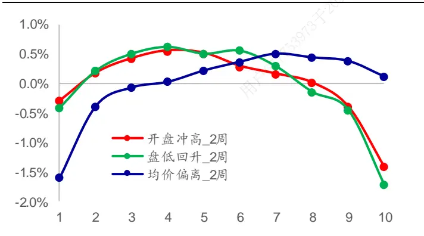
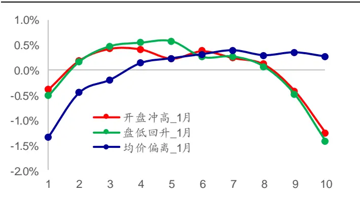
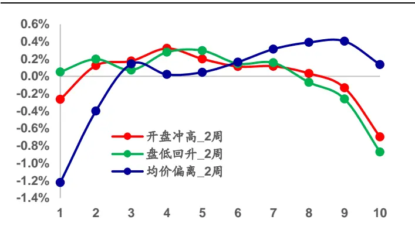
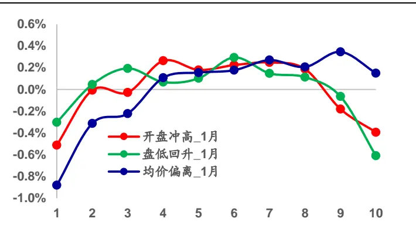
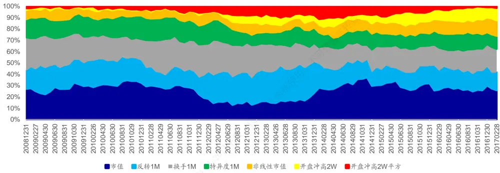
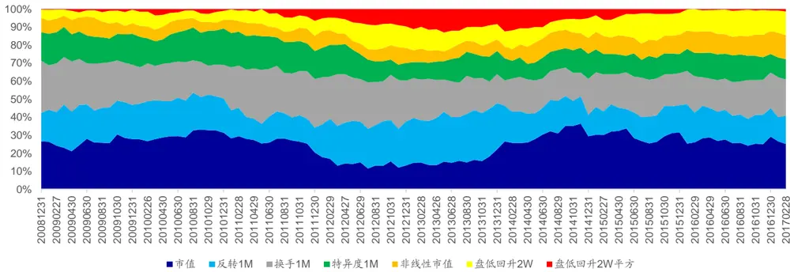
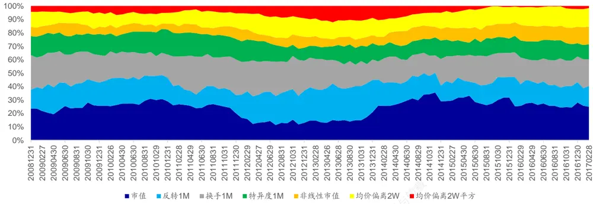
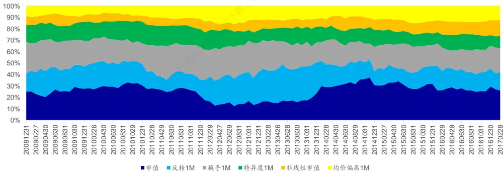
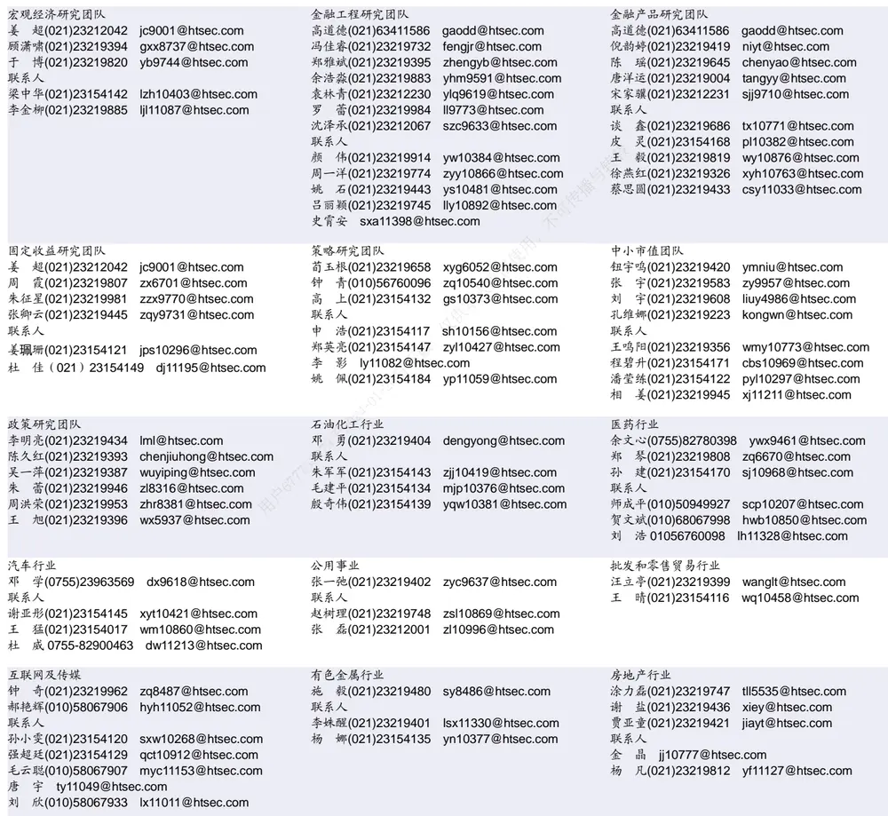

## 相关研究

Table_ReportInfo]《选股因子系列研究（十七）——选股因

子的正交》2017.01.16

《价量新因子测试》2017.03.02

《“双面”波动率——波动率因子的分解

与截面收益》2017.02.27

分析师:冯佳睿

Tel:(021)23219732

Email:fengjr@htsec.com

证书:S0850512080006

分析师:袁林青

Tel:(021)23212230

Email:ylq9619@htsec.com

证书:S0850516050003

## 选股因子系列研究(十八)——价格形态选股因子

本文主要讨论了价格形态因子的构建与选股效果。之所以考虑构建价格形态因子是因为传统的技术因子大多使用收盘价作为计算输入值（如反转、等），然而股票走势所包含的信息却远非收盘价能描述。因此我们在本报告中引入股票每日的最高价、最低价、开盘价以及成交均价对于价格形态因子进行构建，希望能够为多因子模型带来额外的选股能力。

- 价格形态因子具有一定的选股能力。开盘冲高、盘低回升以及均价偏离三个因子皆具有一定的选股能力，并且这三个因子在计算时间窗口为半个月的情况下具有更强的选股能力。从单因子的角度来看，各个因子空头效应较强，且在分组收益上呈现出了非线性的特征。

- 正交后，部分价格形态选股因子依旧具有选股能力。从正交因子的 IC 以及 ICIR来看，半个月窗口计算的开盘冲高因子，其选股效果受到了明显影响，而盘低回升以及均价偏离因子依旧具有一定的选股能力。对于一个月窗口计算的价格形态因子，开盘冲高因子以及盘低回升因子选股效果基本消失，而均价偏离因子依旧保留了较为明显的选股效果。

- 从回归法来看，价格形态因子具有额外选股能力。半个月计算周期下的开盘冲高、盘低回升、均价偏离以及一个月计算周期下的均价偏离均能够为模型提供额外的选股能力，其回归系数时间序列 T 统计量绝对值皆在 3以上。除了一个月计算得到的均价偏离因子外，半个月计算得到的价格形态因子的二阶项皆具有显著的额外选股能力。也即，可考虑将其二阶项引入到多因子模型中去。

从全市场 组合来看，改进组合能在年化收益、收益回撤比以及信息比率上有所提升。对于半个月计算的价格形态因子，在加入了价格形态因子一阶项后，组合表现在年化收益、最大回撤、收益回撤比以及信息比率上皆有提升。在引入个月计算的均价偏离因子，在加入一阶项后模型有所改善，但是在加入二阶项后模型表现未出现提升。该结果也和前文回归法的结论相符。整体上来看，价格形态因子在引入到强势因子构成的多因子模型后对于模型年化收益的提升基本在2%~3%左右。

- 在正交因子最大化单期 IC 的因子权重分配模型中，价格形态因子依旧能够获得10%以上的权重分配。由于“逐步正交+最大化单期 IC”模型在分配权重时对于因子收益有着更高的要求，若因子无法提供额外的选股效果则无法获得明显的权重分配，所以这也从侧面说明了价格形态类因子的选股能力。

- 风险提示。市场系统性风险、资产流动性风险以及政策变动风险会对策略表现产生较大影响。

本文主要讨论了价格形态因子的构建与选股效果。之所以考虑构建价格形态因子是因为传统的技术因子大多使用收盘价作为计算输入值（如反转、MACD 等），然而股票走势所包含的信息却远非收盘价能描述。因此我们在本报告中引入股票每日的最高价、最低价、开盘价以及成交均价对于价格形态因子进行构建，希望能够为多因子模型带来额外的选股能力。

本文主要分为三部分。第一部分介绍了因子的构建与计算。第二部分从单因子的角度对于因子表现进行了总结。第三部分将前文构建的价格形态因子放入到了多因子模型中并观察此类因子对于模型的提升效果。

## 1. 不仅仅是收盘价

在计算传统的技术因子时我们常常使用收盘价作为输入变量，虽然使用收盘价计算得到的指标的确能够较好地刻画股票日间收益的特征并为模型贡献选股能力，但是在使用这些指标时我们也忽略了其他价格所包含的信息。若把股票的价格走势以 K线的形式表达出来，不难发现股票走势中所包含的信息很难仅使用收盘价进行刻画，如 K线的上影线、或者下影线等。

因此本报告考虑引入开盘、盘高、盘低以及均价构建相关指标刻画股票日内的形态特征。本报告共引入三个指标：开盘冲高、盘低回升以及均价偏离。具体指标计算方式如下：

1） 开盘冲高：log(盘高/开盘价)。该指标越大，股票盘中冲高幅度越大。

2） 盘低回升：log(收盘价/盘低)。该指标越大，股票从盘低回升的幅度也就越大。

3） 均价偏离：log(均价/收盘价)。该指标体现了股票成交均价相对于收盘价的偏离。

在计算因子值时，我们使用各股票在过去一段时间的指标均值。本报告将分别考察时间窗口为一个月和半个月下各因子的表现。因子计算公式见下式：（若遇到股票停牌，则剔除该交易日数据。若股票在计算时间窗口内超过一半的时间处于停牌状态，则取股票因子值为 NaN）

$$
highOp_{t}=\frac{1}{K}\sum_{i=t-k}^{t-1}\log\frac{high_{i}}{open_{i}}
$$

$$
closeLow_{t}=\frac{1}{K}\sum_{i=t-k}^{t-1}\log\frac{close_{i}}{low_{i}}
$$

$$
vwapClose_{t}=\frac{1}{K}\sum_{i=t-k}^{t-1}\log\frac{vwap_{i}}{close_{i}}
$$

## 2. 单因子回测

现对于前文构建的开盘冲高、盘低回升以及均价偏离的单因子选股能力进行检验。在进行因子检验时按照以下规则进行：

1） 使用 2009 年 1月至 2017 年 2 月 28日间的数据进行回测；

2） 每月月末计算因子值，并对因子统一进行截面标准化的处理；

3） 在调仓时，组合按照涨停不买、跌停不卖的规则进行；

4） 调仓考虑双边千五的交易费用；

5） 选股范围剔除 ST 股、上市不满 6个月的股票。

下表统计给出了各因子的 IC、ICIR 以及 RankIC、RankICIR。

表 1 因子 IC/ICIR 统计

| 时间窗口 | 因子 | IC | ICIR | rankIC | rankICIR |
| --- | --- | --- | --- | --- | --- |
| 半个月 | 开盘冲高 | -0.06 | -1.58 | -0.07 | -1.72 |
|  | 盘低回升 | -0.07 | -1.78 | -0.07 | -1.80 |
|  | 均价偏离 | 0.04 | 1.96 | 0.05 | 1.80 |
| 一个月 | 开盘冲高 | -0.05 | -1.39 | -0.07 | -1.59 |
|  | 盘低回升 | -0.06 | -1.55 | -0.07 | -1.62 |
|  | 均价偏离 | 0.04 | 2.14 | 0.05 | 1.80 |

资料来源：Wind，海通证券研究所

从上表可知，各因子皆具有一定的选股能力。在使用半个月的数据计算因子时，开盘冲高以及盘低回升因子 IC 以及 rank IC绝对值能够达到 0.07 且 ICIR 绝对值在 1.5 以上。均价偏离因子 以及 虽然只有 和 ，但是 以及 较高。

在使用一个月的数据计算因子时，开盘冲高以及盘低回升的选股能力有所下降，并且两因子的 ICIR和 rank ICIR 也出现了下降。均价偏离因子 IC以及 rank IC 并未出现明显变化，且 ICIR 以及 rank ICIR 有所上升。

除了统计各因子的 以及 外，我们还可以在每月月末按照股票因子值大小对于股票进行分组并统计各组股票在接下来一个月中相对于选股范围平均收益的超额收益。各因子分组收益情况详见下图。

图1 半个月计算时间窗口下因子分组表现

资料来源：Wind，海通证券研究所

图2 一个月计算时间窗口下因子分组表现

资料来源：Wind，海通证券研究所

从分组收益可知，随着股票前期开盘冲高幅度以及盘低回升幅度的上升，股票未来收益也在逐渐降低。而日内均价高于收盘价的比例越高，股票未来的收益表现就越好。此外，开盘冲高以及盘低回升两因子虽然对于股票未来收益有一定区分能力，但是组间收益也呈现出了较为明显的非线性特征（即，两边组别收益低，中间组别收益高）。可在构建因子时考虑引入非线性因子。下表统计了各因子的分组平均超额收益以及多空收益。

表 2 单因子分组收益情况一览

| 分组 | 开盘冲高_2周 |  | 盘低回升_2周 T值 | 均价偏离_2周 收益 |  | 开盘冲高_1月 收益 |  | 盘低回升_1月 |  |  | 均价偏离_1月 T值 |
| --- | --- | --- | --- | --- | --- | --- | --- | --- | --- | --- | --- |
|  | 收益 T值 | 收益 |  |  |  | T值 | T值 |  | 收益 T值 | 收益 |  |
| 1 | -0.30% | -1.04 | -0.41% | -1.44 -1.60% | -7.16 | -0.38% | -1.30 | -0.51% | -1.64 | -1.33% | -6.12 |
| 2 | 0.17% | 0.93 | 0.22% | 1.14 -0.39% | -2.58 | 0.20% | 1.00 | 0.17% | 0.87 | -0.45% | -3.37 |
| 3 | 0.42% | 3.14 | 0.51% | 3.54 -0.07% | -0.67 | 0.44% | 2.93 | 0.48% | 3.26 | -0.20% | -1.83 |
| 4 | 0.55% | 5.21 | 0.62% | 6.12 0.03% | 0.33 | 0.42% | 3.51 | 0.55% | 4.98 | 0.14% | 1.30 |
| 5 | 0.51% | 5.07 | 0.51% | 5.65 0.22% | 2.73 | 0.24% | 2.41 | 0.58% | 5.79 | 0.23% | 3.11 |
| 6 | 0.29% | 3.39 | 0.56% | 6.19 0.37% | 3.86 | 0.39% | 4.27 | 0.27% | 2.72 | 0.31% | 3.85 |
| 7 | 0.16% | 1.45 | 0.29% | 2.50 0.51% | 4.73 | 0.25% | 2.21 | 0.27% | 2.41 | 0.39% | 4.34 |
| 8 | 0.01% | 0.06 | -0.14% | -0.97 0.44% | 3.39 | 0.12% | 0.77 | 0.07% | 0.49 | 0.29% | 2.60 |
| 9 | -0.40% | -2.05 | -0.45% -2.49 | 0.38% | 2.54 | -0.41% | -2.06 | -0.48% | -2.22 | 0.35% | 2.47 |
| 10 | -1.42% | -4.62 | -1.72% -5.53 | 0.12% | 0.56 | -1.25% | -3.75 | -1.42% | -4.64 | 0.27% | 1.31 |
| 多空 | 1.12% | 5.78 | 1.31% 6.23 | 1.72% | 7.34 | 0.87% | 5.56 | 0.90% | 6.64 | 1.60% | 7.34 |
| 多头 | -0.30% | -4.62 | -0.41% -1.44 | 0.12% | 0.56 | -0.38% | -1.30 | -0.51% | -1.64 | 0.27% | 1.31 |
| 空头 | 1.42% | -1.04 | 1.72% -5.53 | 1.60% | -7.16 | 1.25% | -3.75 | 1.42% | -4.64 | 1.33% | -6.12 |

资料来源： ，海通证券研究所

综合前文统计结果来看， 开盘冲高、盘低回升以及均价偏离三个因子皆具有一定的选股能力，并且这三个因子在计算时间窗口为半个月的情况下具有更强的选股能力。从单因子的角度来看，各因子空头效应较强，且在分组收益上呈现出了非线性的特征。在分析了各因子截面的选股能力后，我们可通过多空组合观察各因子选股能力在时间序列上的特征。下表给出了各因子全市场 Top-Bottom10%组合分年度收益以及胜率情况。

表 3 单因子分年度多空收益（2009~2017.02）

|  | 开盘冲高_2周 胜率 |  | 盘低回升_2周 胜率 | 均价偏离_2周 总收益 胜率 |  | 开盘冲高_1月 总收益 | 胜率 总收益 |  | 盘低回升_1月 胜率 | 均价偏离_1月 总收益 胜率 |
| --- | --- | --- | --- | --- | --- | --- | --- | --- | --- | --- |
|  | 总收益 | 总收益 |  |  |  |  |  |  |  |  |
| 2009 | 25.5% | 75% | 27.0% | 75% 40.3% | 83% | 9.1% | 58% | 11.3% | 67% | 33.1% 67% |
| 2010 | -5.4% | 42% | -5.5% 50% | -5.8% | 42% | 3.0% | 50% | 0.9% 67% | 5.9% | 42% |
| 2011 | 18.1% | 58% | 23.1% 67% | 18.7% | 67% | 19.8% | 58% | 21.3% 58% | 16.9% | 67% |
| 2012 | 25.3% | 75% | 30.7% 83% | 32.2% | 75% | 19.5% | 75% | 25.3% 75% | 37.4% | 67% |
| 2013 | -10.4% | 33% | -9.7% 33% | 10.6% | 75% | -14.1% | 33% | -15.4% 33% | 3.2% | 58% |
| 2014 | 7.0% | 58% | 13.0% 58% | 9.1% | 75% | 4.3% | 58% | 5.8% 58% | 6.7% | 75% |
| 2015 | 17.4% | 58% | 26.0% 67% | 57.0% | 75% | 13.5% | 50% | 13.4% 58% | 59.8% | 75% |
| 2016 | 26.9% | 75% | 27.5% 83% | 24.1% | 83% | 22.6% | 67% | 25.9% 67% | 14.4% | 83% |
| 2017.02 | 5.7% | 50% | 5.1% 50% | 2.1% | 100% | 4.6% | 50% | 4.7% | 100% -0.8% | 50% |

资料来源： ，海通证券研究所

由于对于新因子的研发最终是要服务于多因子模型的，所以本节还构建了正交因子，从而考察各价格形态因子在剔除了常见选股因子的影响后的选股能力。本部分将上述三个因子相对于行业、市值、反转、换手、特异度以及非线性市值 6个因子进行正交处理并构建正交因子。在进行正交时，我们主要通过截面回归取残差的方式进行。回归方程见下式。（详细处理细节可参考专题报告《选股因子系列研究（十七）——选股因子的正交》。）

$$
f_{i}=\alpha+\beta_{1}f_{1}^{o}+\cdots+\beta_{k}f_{k}^{o}+f_{i}^{o}
$$

下表展示了正交后各因子的 IC 以及 ICIR 情况。

表 4 正交因子 IC/ICIR 统计

| 时间窗口 | 因子 | IC | ICIR | ranklC | rankICIR |
| --- | --- | --- | --- | --- | --- |
| 半个月 | 开盘冲高 | -0.02 | -1.07 | -0.02 | -1.24 |
|  | 盘低回升 | -0.03 | -1.76 | -0.03 | -1.80 |
|  | 均价偏离 | 0.04 | 2.95 | 0.03 | 2.70 |
| 一个月 | 开盘冲高 | 0.00 | -0.27 | -0.01 | -0.49 |
|  | 盘低回升 | -0.02 | -0.82 | -0.02 | -0.83 |
|  | 均价偏离 | 0.03 | 2.88 | 0.03 | 2.09 |

资料来源：Wind，海通证券研究所

从正交因子的 IC以及 ICIR来看，半个月窗口计算的开盘冲高因子，其选股效果受到了明显影响，而盘低回升以及均价偏离因子依旧具有一定的选股能力。对于一个月窗口计算的价格形态因子，开盘冲高因子以及盘低回升因子选股效果基本消失，而均价偏离因子依旧保留较为明显的选股效果。下图展示了各因子的分组收益情况。

图3 半个月计算时间窗口下正交因子分组表现

资料来源：Wind，海通证券研究所

图4 一个月计算时间窗口下正交因子分组表现

资料来源：Wind，海通证券研究所

观察分组收益特征，各因子分组收益依旧呈现出了较为明显的非线性特征。所以本报告会在第三部分中讨论加入价格形态因子平方项的可能。

简单来说，各价格形态因子皆具有一定选股能力，但是在进行了正交以后，半个月窗口计算的价格形态因子以及一个月窗口计算的均价偏离因子均保留有一定的选股能力。所以本文的第三部分将重点对半个月窗口计算的开盘冲高、盘低回升、均价偏离以及一个月窗口计算的均价偏离在多因子模型中的表现进行讨论。

## 3. 多因子模型回测

由于新因子的研究最终还是要服务于多因子模型，所以本部主要讨论价格形态因子在加入到多因子模型后对于模型的影响。首先，我们会从回归法的角度讨论价格形态类因子在加入到模型后的额外选股能力。其次，我们会从纯多头组合的角度对比原始多因子组合与改进后的多因子组合。最后，我们会从权重分配的角度讨论价格形态类因子在多因子打分时所占的权重。

在进行模型对比时，原始模型为使用市值、反转、换手、特异度以及非线性市值因子构建的最大化单期 IC加权的月度选股组合。（相关权重分配方式可参考专题报告《从最大化复合因子单期 IC角度看因子权重》）其中，因子集合进行正交化处理。改进模型在原始模型的基础之上分别加入了前文讨论的价格形态因子中的任意一个（开盘冲高2W、盘低回升 2W、均价偏离 2W 以及均价偏离 1M）。

## 3.1 回归法

使用 年 月至 年 月底之间的数据可分别对于原始模型以及改进模型进行 Fama-MacBeth回归检验。由于模型组成因子为正交因子，所以任意新因子的引入并不会影响原有因子回归系数以及系数的显著性。故而，我们可将注意力集中在新加入因子的回归系数及其 T 统计量上。下表给出了加入价格形态因子一阶项后的回归结果。

表 5 Fama-MacBeth回归检验（价格形态因子一阶项）

|  | 市值 | 反转1M | 换手1M | 特异度1M | 非线性市值 | 新增变量 |
| --- | --- | --- | --- | --- | --- | --- |
| 原始模型 | -0.0082 (-4.96) | -0.0056 (-5.04) | -0.0062 (-5.16) | 0.0041 (6.73) | 0.0029 (5.07) | 无 |
| 原始模型+ 开盘冲高 2W | -0.0081 (-4.89) | -0.0056 (-5.07) | -0.0062 (-5.09) | 0.0042 (6.77) | 0.0028 (5.06) | -0.0022 (-3.22) |
| 原始模型+ 盘低回升 2W | -0.0081 (-4.89) | -0.0056 (-5.07) | -0.0062 (-5.09) | 0.0042 (6.76) | 0.0028 (5.06) | -0.0035 (-4.81) |
| 原始模型+ 均价偏离 2W | -0.0081 (-4.89) | -0.0056 (-5.07) | -0.0062 (-5.09) | 0.0042 (6.77) | 0.0028 (5.06) | 0.004 (6.59) |
| 原始模型+ 均价偏离 1M | -0.0082 (-4.96) | -0.0056 (-5.05) | -0.0062 (-5.15) | 0.0041 (6.73) | 0.0029 (5.07) | 0.0036 (7.4) |

资料来源：Wind，海通证券研究所

观察上表结果可知，半个月计算周期下的开盘冲高、盘低回升、均价偏离以及一个月计算周期下的均价偏离均能够为模型提供额外的选股能力，其回归系数时间序列 T 统计量绝对值皆在 3 以上。

考虑到因子分组收益上所具有的非线性特征，我们也可尝试引入各价格形态因子的二阶项。下表展示了引入各因子二阶项后的回归检验结果。

表 6 Fama-MacBeth回归检验（价格形态因子二阶项）

| 添加变量 | 市值 | 反转1M | 换手1M | 特异度1M | 非线性市值 | 一阶项 | 二阶项 |
| --- | --- | --- | --- | --- | --- | --- | --- |
| 无 | -0.0082 (-4.96) | -0.0056 (-5.04) | -0.0062 (-5.16) | 0.0041 (6.73) | 0.0029 (5.07) | 无 | 无 |
| 开盘冲高 2W +平方 | -0.0081 (-4.89) | -0.0056 (-5.07) | -0.0062 (-5.09) | 0.0042 (6.77) | 0.0028 (5.06) | -0.0022 (-3.22) | -0.0013 (-2.60) |
| 盘低回升 2W +平方 | -0.0081 (-4.89) | -0.0056 (-5.07) | -0.0062 (-5.09) | 0.0042 (6.76) | 0.0028 (5.06) | -0.0035 (-4.81) | -0.001 (-2.10) |
| 均价偏离 2W +平方 | -0.0081 (-4.89) | -0.0056 (-5.07) | -0.0062 (-5.09) | 0.0042 (6.77) | 0.0028 (5.06) | 0.004 (6.59) | -0.0011 (-2.94) |
| 均价偏离 1M +平方 | -0.0082 (-4.96) | -0.0056 (-5.05) | -0.0062 (-5.15) | 0.0041 (6.73) | 0.0029 (5.07) | 0.0036 (7.4) | -0.0005 (-1.26) |

资料来源：Wind，海通证券研究所

观察上表可知，除了一个月计算得到的均价偏离因子外，半个月计算得到的价格形态因子的二阶项皆具有显著的额外选股能力。也即，可考虑将其二阶项引入到多因子模型中去。

## 3.2 纯多头组合

基于前文提到的模型构成，可分别使用原始模型以及改进模型在 2009 年 1 月至2017 年 2 月底间构建全市场 TOP100 选股组合。在进行选股时剔除上市不满 6 个月的股票、ST 股以及无法交易的股票。下表对比了原始模型 TOP100 组合以及改进模型TOP100 组合的历史表现。

表 7 TOP100 组合历史表现

| TOP100 | 总收益 | 年化收益 | 最大回撤 | Calmar | 信息比率 | 月胜率 | 次均换手率 |
| --- | --- | --- | --- | --- | --- | --- | --- |
| 原始模型 | 42.06 | 58.30% | 54% | 1.07 | 3.55 | 68% | 66% |
| +上冲 2W | 46.32 | 60.20% | 54% | 1.12 | 3.73 | 69% | 66% |
| +上冲 2W +平方 | 49.11 | 61.30% | 54% | 1.14 | 3.76 | 69% | 65% |
| +回升 2W | 44.85 | 59.60% | 53% | 1.13 | 3.73 | 69% | 66% |
| +回升 2W +平方 | 47.85 | 60.80% | 53% | 1.15 | 3.75 | 69% | 64% |
| +均价偏离 2W | 42.09 | 58.40% | 53% | 1.10 | 3.61 | 69% | 68% |
| +均价偏离 2W+平方 | 44.49 | 59.40% | 53% | 1.12 | 3.67 | 69% | 67% |
| +均价偏离 1M | 44.09 | 59.20% | 53% | 1.12 | 3.65 | 69% | 68% |
| +均价偏离 1M+平方 | 42.06 | 58.30% | 54% | 1.07 | 3.55 | 68% | 66% |

资料来源： ，海通证券研究所

对于半个月计算的价格形态因子，在加入了价格形态因子一阶项后，组合表现在年化收益、最大回撤、收益回撤比以及信息比率上皆有一定提升。在引入了二阶项后，TOP100 组合表现在上述几个维度中得到了进一步的提升。对于一个月计算的均价偏离因子，在加入一阶项后模型有所改善，但是在加入二阶项后模型未有改善。该结果也和前文回归法的结论相符。整体上来看，价格形态因子在引入到多因子模型后对于模型年化收益的提升基本在 2%~3%左右。

## 3.3 因子权重分配情况

因子对于多因子模型的影响很大程度上取决于因子在模型中所占有的权重，所以本节将展示价格形态因子在改进模型中所占的权重。

下图为加入了半个月计算的开盘冲高因子的改进模型因子权重分布情况。从因子权重上看，半个月计算的开盘冲高因子以及开盘冲高因子二阶项的权重在 2012 年 4 月以后才出现了较为明显的上升。两个因子在模型中的权重基本在 10%左右波动。

图5 改进模型因子权重分配（开盘冲高-半个月）

资料来源：Wind，海通证券研究所

下图为加入了半个月计算的盘低回升因子的改进模型因子权重分布情况。从因子权重上看，半个月计算的盘低回升因子以及盘低回升因子二阶项的权重之和基本在10%~15%之间波动。近期盘低回升因子二阶项权重较低。

图6 改进模型因子权重分配（盘低回升-半个月）

资料来源：Wind，海通证券研究所

下图为加入了半个月计算的均价偏离因子的改进模型因子权重分布情况。均价偏离因子及其二阶项在模型中同样占有较高的权重，两因子权重之和基本在 15%至 20%之间波动。近期二阶项权重较低，均价偏离因子权重约为 15%。

图7 改进模型因子权重分配（均价偏离-半个月）

资料来源：Wind，海通证券研究所

下图为加入了一个月计算的均价偏离因子的改进模型因子权重分布情况。一个月计算的均价偏离因子在模型中占有约 10%的权重。

图8 改进模型因子权重分配（均价偏离-一个月）

资料来源： ，海通证券研究所

总的来说，各价格形态因子在这种“逐步正交 最大化单期 ”的权重分配模型下都能够获得一定的权重。由于“逐步正交 最大化单期 ”模型在分配权重时对于因子收益有着更高的要求，若因子无法提供额外的选股效果则无法获得明显的权重分配，所以这也从侧面说明了价格形态类因子的选股效果。

## 4. 总结

考虑到传统技术指标基本上都使用日收盘价作为输入变量，而收盘价很难完全反映日级别股票走势信息。所以本文通过引入其他价格数据（开盘、盘高、盘低以及均价）构建价格形态类因子，简要刻画股票日内价格形态。

从单因子的角度来看，价格形态因子皆具有一定的选股效果，但是和传统强势选股因子相比依旧存在一定差距。价格形态因子的特征可总结为“空头收益强，分组收益非线性明显”。在将价格形态因子相对于传统强势因子进行正交后，半个月计算的价格形态类因子以及一个月计算的均价偏离因子依旧具有一定的选股能力。

从多因子的角度来看，价格形态因子能够为多因子模型提供额外的选股能力。在回归检验中，各价格形态因子的回归系数均值都极为显著。在尝试加入二阶项后，仅一个月的均价偏离因子二阶项回归系数均值不显著。通过构建 TOP100 多头组合，我们发现在加入价格形态因子后，组合在年化收益、收益回撤比以及信息比率上都有所提升。在加入二阶项后，除一个月的均价偏离因子外其余各改进组合皆有进一步的提升。从模型权重分配来看，价格形态因子在“逐步正交+最大化单期 IC”的权重分配框架下普遍能够得到 10%以上的权重分配。

## 5. 风险提示

市场系统性风险、资产流动性风险以及政策变动风险会对策略表现产生较大影响。

# 信息披露

分析师声明

[Table冯佳睿yst 金融工程研究团队s]

袁林青金融工程研究团队

本人具有中国证券业协会授予的证券投资咨询执业资格，以勤勉的职业态度，独立、客观地出具本报告。本报告所采用的数据和信息均来自市场公开信息，本人不保证该等信息的准确性或完整性。分析逻辑基于作者的职业理解，清晰准确地反映了作者的研究观点，结论不受任何第三方的授意或影响，特此声明。

## 法律声明

本报告仅供海通证券股份有限公司（以下简称 本公司 ）的客户使用。本公司不会因接收人收到本报告而视其为客户。在任何情况下，本报告中的信息或所表述的意见并不构成对任何人的投资建议。在任何情况下，本公司不对任何人因使用本报告中的任何内容所引致的任何损失负任何责任。

本报告所载的资料、意见及推测仅反映本公司于发布本报告当日的判断，本报告所指的证券或投资标的的价格、价值及投资收入可能播会波动。在不同时期，本公司可发出与本报告所载资料、意见及推测不一致的报告。可

市场有风险，投资需谨慎。本报告所载的信息、材料及结论只提供特定客户作参考，不构成投资建议，也没有考虑到个别客户特殊的用，投资目标、财务状况或需要。客户应考虑本报告中的任何意见或建议是否符合其特定状况。在法律许可的情况下，海通证券及其所属部关联机构可能会持有报告中提到的公司所发行的证券并进行交易，还可能为这些公司提供投资银行服务或其他服务。

本报告仅向特定客户传送，未经海通证券研究所书面授权，本研究报告的任何部分均不得以任何方式制作任何形式的拷贝、复印件或供复制品，或再次分发给任何其他人，或以任何侵犯本公司版权的其他方式使用。所有本报告中使用的商标、服务标记及标记均为本公司的商标、服务标记及标记。如欲引用或转载本文内容，务必联络海通证券研究所并获得许可，并需注明出处为海通证券研究所，且下不得对本文进行有悖原意的引用和删改。

根据中国证监会核发的经营证券业务许可，海通证券股份有限公司的经营范围包括证券投资咨询业务。24

## 海通证券股份有限公司研究所[Table_PeopleInfo]

路 颖所长

(021)23219403 luying@htsec.com

高道德 副所长(021)63411586 gaodd@htsec.com

江孔亮 副所长

(021)23219422 kljiang@htsec.com

邓 勇 所长助理(021)23219404 dengyong@htsec.com

姜 超 副所长(021)23212042 jc9001@htsec.com

荀玉根 所长助理(021)23219658 xyg6052@htsec.com

钟 奇所长助理

(021)23219962 zq8487@htsec.com

| 建筑工程行业 杜市伟 dsw11227@htsec.com | 农林牧渔行业 |  |  | 食品饮料行业 |  |
| --- | --- | --- | --- | --- | --- |
|  |  | 丁 频(021)23219405 dingpin@htsec.com |  |  | 闻宏伟(010)58067941 whw9587@htsec.com |
| 联系人 毕春晖(021)23154114 bch10483@htsec.com |  | 陈雪丽(021)23219164 cxl9730@htsec.com |  |  | 孔梦遥(010)58067998 kmy10519@htsec.com |
|  | 联系人 |  |  | 成 珊(021)23212207 cs9703@htsec.com |  |
|  | 关 | 陈 阳(010)50949923 慧(021)23219448 | cy10867@htsec.com gh10375@htsec.com |  |  |
|  | 夏 | 越(021)23212041 xy11043@htsec.com |  |  |  |

| 家电行业 |  | 造纸轻工行业 |  |
| --- | --- | --- | --- |
|  | 陈子仪(021)23219244 chenzy@htsec.com 用户67 | 曾 知(021)23219810 zz9612@htsec.com |  |
| 联系人 |  | 联系人 |  |
| 李阳 | ly11194@htsec.com |  | 朱 悦(021)23154173 zy11048@htsec.com |
| 朱默辰 | zmc11316@htsec.com | 赵 洋 zy10340@htsec.com |  |

| 电子行业 陈 平(021)23219646 cp9808@htsec.com | 煤炭行业 |  | 电力设备及新能源行业 |  |
| --- | --- | --- | --- | --- |
|  |  | 吴 杰(021)23154113 wj10521@htsec.com | 房 青(021)23219692 fangq@htsec.com |  |
| 联系人 谢 磊(021)23212214 xl10881@htsec.com | 联系人 | 李 淼(010)58067998 Im10779@htsec.com | 徐柏乔(021)32319171 xbq6583@htsec.com 杨 帅(010)58067929 ys8979@htsec.com |  |
| 张天闻 ztw11086@htsec.com |  | 戴元灿(021)23154146 dyc10422@htsec.com | 联系人 | 曾 彪(021)23154148 zb10242@htsec.com |

| 基础化工行业 | 计算机行业 | 通信行业 |  |
| --- | --- | --- | --- |
| 刘 威(0755)82764281 Iw10053@htsec.com | 郑宏达(021)23219392 zhd10834@htsec.com | 朱劲松(010)50949926 zjs10213@htsec.com |  |
| 李明刚(0755)23617160 Img10352@htsec.com 刘 强(021)23219733 lq10643@htsec.com | 谢春生(021)23154123 xcs10317@htsec.com 联系人 | 联系人 | 庄 宇(010)50949926 zy11202@htsec.com |
| 联系人 | 黄竞晶(021)23154131 hjj10361@htsec.com |  |  |
| 刘海荣(021)23154130 Ihr10342@htsec.com | 杨 林(021)23154174 yl11036@htsec.com |  |  |

| 非银行金融行业 |  | 交通运输行业 |  |  |  | 纺织服装行业 |  |
| --- | --- | --- | --- | --- | --- | --- | --- |
|  | 孙 婷(010)50949926 | st9998@htsec.com |  | 虞 楠(021)23219382 | yun@htsec.com | 于旭辉(021)23219411 | yxh10802@htsec.com |
|  | 何 婷(021)23219634 ht10515@htsec.com |  |  | 张 杨(021)23219442 zy9937@htsec.com |  | 唐 苓(021)23212208 | tl9709@htsec.com |
| 联系人 |  |  | 联系人 |  |  | 梁 希(021)23219407 lx11040@htsec.com |  |
|  |  | 夏昌盛(010)56760090 xcs10800@htsec.com |  | 童 宇(021)23154181 ty10949@htsec.com |  | 联系人 马 榕 23219431 mr11128@htsec com |  |

| 建筑建材行业 | 机械行业 |  | 钢铁行业 |
| --- | --- | --- | --- |
| 邱友锋(021)23219415 qyf9878@htsec.com | 余炜超(021)23219816 swc11480@htsec.com |  | 刘彦奇(021)23219391 liuyq@htsec.com |
| 钱佳佳(021)23212081 qjj10044@htsec.com | 耿 耘(021)23219814 gy10234@htsec.com | 可传播与 | 联系人 |
| 冯晨阳(021)23154019 fcy10886@htsec.com | 沈伟杰(021)23219963 swj11496@htsec.com |  | 刘 璇(021)23219197 lx11212@htsec.com |
| 联系人 周 俊 0755-23963686 zj11521@htsec.com | 联系人 杨 震(021)23154124 yz10334@htsec.com |  |  |

| 军工行业 |  | 银行行业 | 社会服务行业 |  |
| --- | --- | --- | --- | --- |
| 徐志国(010)50949921 xzg9608@htsec.com 刘 磊(010)50949922 II11322@htsec.com |  | 林媛媛(0755)23962186 lyy9184@htsec.com 联系人 | 联系人 | 李铁生(010)58067934 Its10224@htsec.com |
| 蒋 俊(021)23154170 jj11200@htsec.com |  | 林瑾璐Ijl11126@htsec.com | 陈扬扬(021)23219671 cyy10636@htsec.com |  |
| 联系人 |  | 谭敏沂 tmy10908@htsec.com | 顾熹闽 gxm11214@htsec.com |  |
|  | 张恒晅(010)68067998 zhx10170@hstec.com |  |  |  |

## 研究所销售团队

| 深广地区销售团队 上海地区销售团队 |  |  |  | 北京地区销售团队 |  |  |
| --- | --- | --- | --- | --- | --- | --- |
| 蔡铁清 | (0755)82775962 | ctq5979@htsec.com | 季唯佳 (021)23219384 | jiwj@htsec.com | 殷怡琦(010) 58067988 | yyq@htsec.com |
| 刘晶晶 | (0755)83255933 | liujj4900@htsec.com | 胡雪梅(021)23219385 | huxm@htsec.com | 隋巍 (010)58067944 | sw7437@htsec.com |
| 辜丽娟 | (0755)83253022 | gulj@htsec.com | 黄 毓~(021)23219410 | huangyu@htsec.com | 江虹 (010)58067988 | jh8662@htsec.com |
| 高艳娟 | (0755)83254133 | gyj6435@htsec.com | 朱 健 (021)23219592 | zhuj@htsec.com | 许诺 (010)58067931 | xn9554@htsec.com |
| 伏财勇 | (0755)23607963 | fcy7498@htsec.com 黄慧 | (021)23212071 | hh9071@htsec.com | 杨博 (010)58067996 | yb9906@htsec.com |
|  |  | 孙明 | (021)23219990 | sm8476@htsec.com | 张景才 (010)58067977 | jc10211@htsec.com |
|  |  | 孟德伟(021)23219989 | mdw8578@htsec.com | 李铁生 | (010)58067934 | Its10224@htsec.com |
|  |  | 黄胜蓝(021)23219386 |  | hsl9754@htsec.com | 张 妍 (010)58067903 | zy9289@htsec.com |
|  |  | 张 杨(021)23219442 | zy9937@htsec.com |  |  |  |
|  |  | 杨 洋(021)23219281 | yy9938@htsec.com |  |  |  |

海通证券股份有限公司研究所

地址：上海市黄浦区广东路 689号海通证券大厦 9楼

电话：（021）23219000

传真：（021）23219392

网址：www.htsec.com