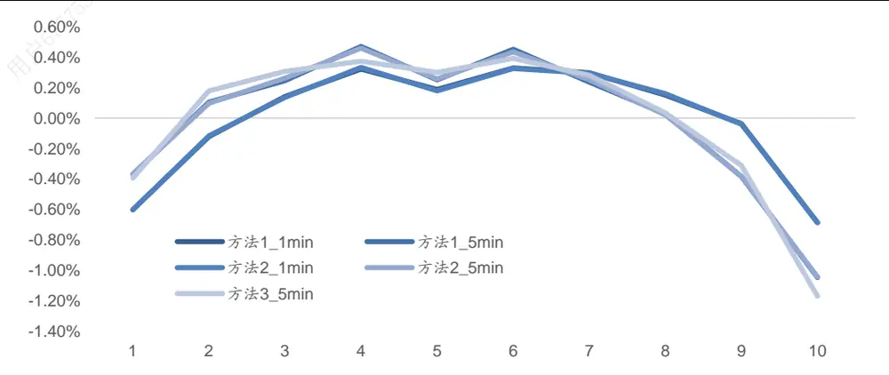
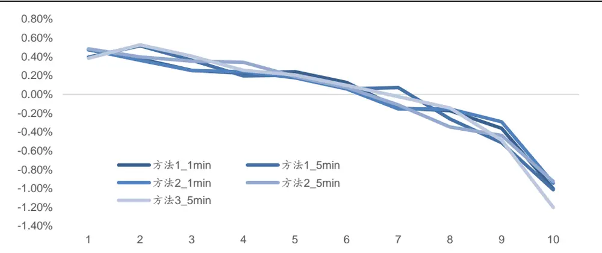
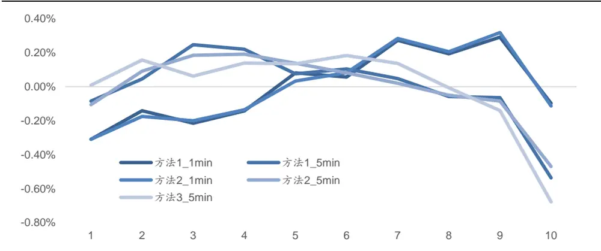
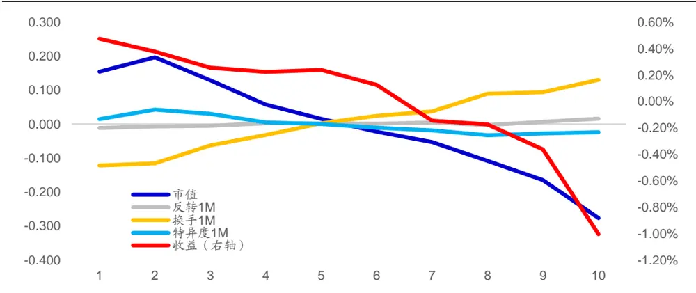
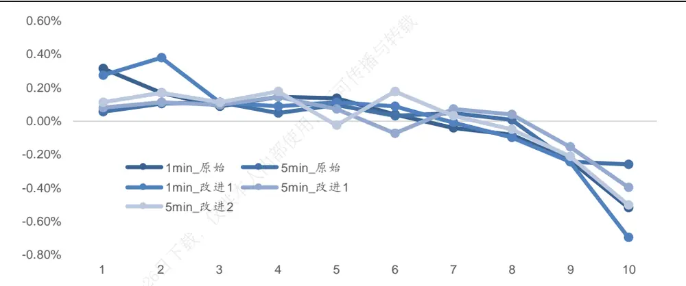
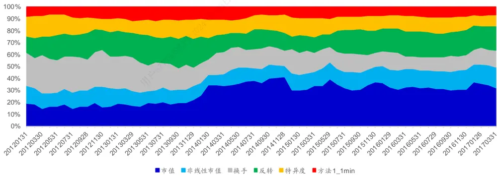
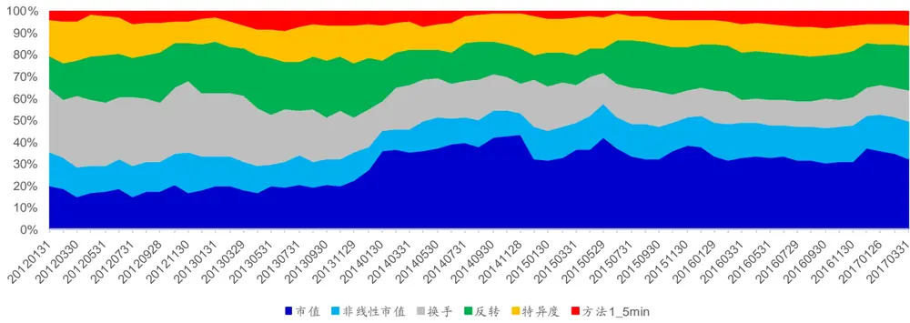
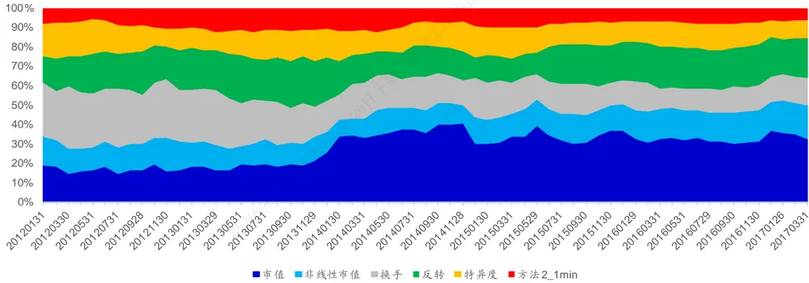
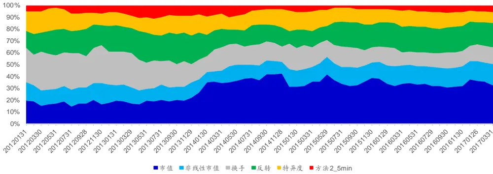
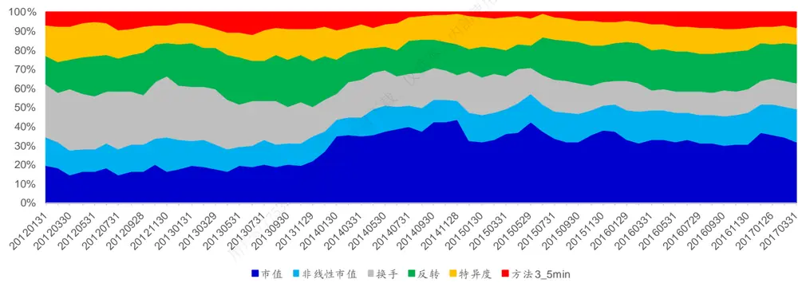

## 相关研究

Table_ReportInfo]《因子视角下的事件驱动策略收益》2017.04.13

《因子视角的资产配臵系列三 风险资产与 Smart Beta》2017.04.24

《动量策略及收益率高阶矩在行业轮动中的应用》2017.04.07

分析师:冯佳睿

Tel:(021)23219732

Email:fengjr@htsec.com

证书:S0850512080006

分析师:袁林青

Tel:(021)23212230

Email:ylq9619@htsec.com

证书:S0850516050003

## 选股因子系列研究(十九)——高频因子之股票收益分布特征

随着传统因子研究的深入，通过使用日级别数据已经很难发现能够在传统技术选股因子之外提供额外选股能力的因子了。考虑到传统因子多使用日级别数据刻画股票日间的形态特征，通过引入日内高频数据刻画股票日内的特征也许能够为模型带来新的信息以及 Alpha。这一观点也在本系列前一篇研究（《选股因子系列研究十八——价格形态因子》）中有所印证。

本报告主要使用了股票 1 分钟价格数据构建了相关因子，对于股票高频收益分布特征（方差、偏度以及峰度）进行了刻画。报告主要分为三部分，第一部分讨论了因子的构建以及计算方式。第二部分从单因子的角度对于因子的选股能力进行了分析。第三部分对比分析了加入高频因子的改进模型以及未加入高频因子的原始模型的表现差距。

高频偏度因子在不同计算方法、不同数据频率下皆具有选股能力。不同频率、不同计算方式下因子的 rankIC 的绝对值基本维持在 0.05~0.06 左右，ICIR 的绝对值普遍高于 ，因子 月度胜率接近 。结合因子分组收益情况，我们认为高频偏度因子具有进一步研究分析的空间。

- 正交高频偏度因子同样具有选股能力。考虑到因子与换手率之间的相关性，本文对于高频偏度因子进行了正交化处理并剔除了行业、市值、非线性市值、换手、特异度以及反转因子的影响。正交后的高频偏度因子选股效果虽然有所减弱，但是因子依旧具有选股能力。1 分钟的高频偏度因子 IC 绝对值下降至 0.03 附近，但 ICIR 绝对值依旧在 2 以上。5 分钟高频偏度因子受到的影响较大，IC 绝对值下降至 0.02 附近，ICIR 绝对值在 1.5~1.7 之间。

- 从 回归检验来看，高频偏度因子具有额外选股能力。使用年 1 月至 2017 年 3 月底之间的数据可分别对于原始模型以及改进模型进行回归检验。观察新增因子回归系数均值以及 统计量可知，各计算频率以及计算方法下的高频偏度因子在回测时间段中具有显著选股能力。此外，1 分钟偏度因子选股效果强于 5 分钟偏度因子选股效果，这一点在回归系数绝对值以及回归系数 T 统计量绝对值大小上皆有所体现。

- 改进模型 TOP100 组合相比于原始模型 TOP100 组合改进幅度有限。在加入 1分钟偏度因子后，TOP100 纯多头组合在年化收益、收益回撤比以及信息比率上皆有所提升。在加入 5 分钟偏度因子后，部分改进模型在年化收益上并未出现改进，仅在收益回撤比以及信息比率上有所提升。

- 1 分钟高频偏度因子打分权重略高于 5 分钟高频偏度因子。改进多因子模型中 1分钟高频偏度因子权重占比约为 10%，5分钟偏度因子权重占比约为 5%。

- 风险提示。市场系统性风险、资产流动性风险以及政策变动风险会对策略表现产生较大影响。

随着传统因子研究的深入，通过使用日级别数据已经很难发现能够在传统技术选股因子之外提供额外选股能力的因子了。考虑到传统因子多使用日级别数据刻画股票日间的形态特征，通过引入日内高频数据刻画股票日内的特征也许能够为模型带来新的信息以及 Alpha。这一观点也在本系列前一篇研究（《选股因子系列研究十八——价格形态因子》）中有所印证。

本报告主要使用了股票 1 分钟价格数据构建了相关因子，对于股票高频收益分布特征（方差、偏度以及峰度）进行了刻画。报告主要分为三部分，第一部分讨论了因子的构建以及计算方式。第二部分从单因子的角度对于因子的选股能力进行了分析。第三部分对比分析了加入高频因子的改进模型以及未加入高频因子的原始模型的表现差距。

## 1. 从“低频”到“高频”

系列前期研究（《选股因子系列研究十八——价格形态因子》）发现，通过引入因子刻画股票日内形态可在现有因子外带来额外选股能力。相关海外研究也表明股票日内价格形态分布特征也对于股票未来收益具有一定预测作用。所以本报告使用了日内分钟级数据构建了相关因子刻画股票日内收益分布的方差、偏度以及峰度。考虑到数据频率对于因子的影响，本文在计算因子时分别使用了股票 分钟对数收益以及股票 分钟对数收益序列。

在任意交易日，基于股票 i的高频收益序列 $\{r_{\mathrm{ij}}\}$ 对于市场上交易的股票可计算高频收益方差、高频收益偏度以及高频收益峰度三个指标。常见计算方法如下：

计算方法 1：

高频收益方差 $\begin{array}{r}{\mathbf{\mathcal{R}}Var_{i}=\sum_{j=1}^{N}r_{ij}^{2}}\end{array}$

高频收益偏度 $\begin{array}{r}{{\mathbf{\cdot}}RSkew_{i}=\frac{\sqrt{N}\sum_{j=1}^{N}r_{ij}^{2}}{RVar_{i}^{3/2}}}\end{array}$

高频收益峰度:RK $\begin{array}{r}{\tau rt_{i}=\frac{N\sum_{j=1}^{N}r_{ij}^{4}}{RVar_{i}^{2}}}\end{array}$

在任意选股时刻，股票的因子值为前 日指标的均值。考虑到在实际进行选股时往往都是月度选股，本报告在计算因子值时使用的是股票过去一个月的均值。考虑到计算方式对于因子的影响，本报告也尝试了使用另外两种不同的方式对于因子进行计算。

计算方法 2：

高频收益方差 $\begin{array}{r}{{\bf\nabla}\cdot{\cal R}{\cal V}ar_{i}=\sum_{j=1}^{N}\bigl(r_{ij}-\bar{r}_{i}\bigr)^{2}}\end{array}$

高频收益偏度 $\begin{array}{r}{{\mathbf{\cdot}}RSkew_{i}=\frac{\sqrt{N}\sum_{j=1}^{N}\left(r_{ij}-\bar{r}_{i}\right)^{3}}{RVar_{i}^{3/2}}}\end{array}$

高频收益峰度:R $\begin{array}{r}{\mathrm{\ curt}_{i}=\frac{N\sum_{j=1}^{N}\left(r_{ij}-\bar{r_{i}}\right)^{4}}{RVar_{i}^{2}}}\end{array}$

计算方法 3：

由于不同的日内时间段划分会对于收益序列产生一定影响，所以计算方法 3的核心

思路在于遍历所有时间段的划分，在不同划分下分别计算因子值并进行平均。

$$
\begin{array}{r}{\frac{1}{\vert\overrightarrow{\mathbf{e}}\vert}\iiint\ d^{3}\overrightarrow{\mathbfit{l}}\ast\frac{\partial^{2}}{\partial\overrightarrow{\mathbfit{m}}}\ x\overleftarrow{\mathbfit{j}}\succeq\mathbf{R}Var_{i}=\frac{1}{M}\sum_{k=1}^{M}RVar_{i}^{k}}\end{array}
$$

$$
\begin{array}{r}{\frac{3}{10}\Rightarrow\frac{1}{30}\Rightarrow\frac{3}{40}\Rightarrow\frac{3}{160}\Rightarrow\frac{3}{30}\cdot\frac{3}{40}\Rightarrow\frac{3}{160}\Rightarrow\frac{3}{160}\Rightarrow\frac{3}{160}\Rightarrow\frac{3}{160}\Rightarrow\frac{3}{160}\Rightarrow\frac{3}{160}\Rightarrow\frac{3}{160}\Rightarrow\frac{3}{160}\Rightarrow\frac{3}{160}\Rightarrow\frac{3}{160}\Rightarrow\frac{3}{160}\Rightarrow\frac{3}{160}\Rightarrow\frac{3}{160}\Rightarrow\frac{3}{160}\Rightarrow\frac{3}{160}\Rightarrow\frac{3}{160}\Rightarrow\frac{3}{160}\Rightarrow\frac{3}{160}\Rightarrow\frac{3}{160}\Rightarrow\frac{3}{160}\Rightarrow\frac{3}{160}\Rightarrow\frac{3}{160}\Rightarrow\frac{3}{160}\Rightarrow\frac{3}{160}\Rightarrow\frac{3}{160}\Rightarrow\frac{3}{160}\Rightarrow\frac{3}{160}\Rightarrow\frac{3}{160}\Rightarrow\frac{3}{160}\Rightarrow\frac{3}{160}\Rightarrow\frac{3}{160}\Rightarrow\frac{3}{160}\Rightarrow\frac{3}{160}\Rightarrow\frac{3}{160}\Rightarrow\frac{3}{160}\Rightarrow\frac{3}{160}\Rightarrow\frac{3}{160}\Rightarrow\frac{3}{160}\Rightarrow\frac{3}{160}\Rightarrow\frac{3}{160}\Rightarrow\frac{3}{160}\Rightarrow\left(\frac{3}{160}\right)}\end{array}
$$

$$
\begin{array}{r}{\frac{1}{\vert\overrightarrow{\overrightarrow{\mathbf{e}}}\rangle}+\frac{1}{\vert\overrightarrow{\mathbf{J}}\vert}\downarrow\downarrow\downarrow\downarrow\downarrow\downarrow\frac{\sqrt{3}}{\sqrt{3}}\downarrow\downarrow\downarrow\downarrow\downarrow\downarrow\downarrow\downarrow=\frac{1}{M}\sum_{k=1}^{M}RKurt_{i}^{k}}\end{array}
$$

本节讨论了高频因子的构建，后文会在不同的数据频率以及不同的计算方式下对于高频方差、高频偏度以及高频峰度进行回测检验。最终我们希望能够在这三个高频因子中得到在不同频率和计算方法下都表现稳定的选股因子。

## 2. 单因子回测

本节分析讨论了第一部分构建的高频因子的选股效果。2.1~2.3 从单因子的角度分别讨论了高频方差、高频偏度以及高频峰度因子的选股能力。 简单分析了偏度因子与其他因子的相关性。2.5 对于偏度因子进行了正交化处理并分析讨论了正交后因子的选股能力。本节在对于因子选股效果进行回测时使用了 2010 年 1 月至 2017 年 3 月间的数据，并以月度为周期讨论因子的选股能力。

## 2.1 高频收益方差

使用因子值可将市场上所有可交易股票分成 组，并统计不同分组股票在下一个月相对于市场平均收益的超额收益。下图给出了高频方差因子的分组收益特征。本报告中的股票分组按照因子值大小由小到大依次排列。第 1组为因子值最小的一组，第 10组为因子值最大的一组。

图1 高频方差因子分组收益特征

资料来源：Wind，海通证券研究所

表 1 高频方差因子分组收益统计

| 组别 | 方法1_1min 分组收益 |  | 方法1_5min 分组收益 |  | 方法2_1min |  | 方法 2_5min |  | 方法3_5min |  |
| --- | --- | --- | --- | --- | --- | --- | --- | --- | --- | --- |
|  | (%) | T统计量 | (%) | T统计量 | 分组收益 (%) | T统计量 | 分组收益 (%) | T统计量 | 分组收益 (%) | T统计量 |
| 1 | -0.60 | -1.93 | -0.37 | -1.08 | -0.60 | -1.94 | -0.37 | -1.07 | -0.40 | -1.15 |
| 2 | -0.12 | -0.67 | 0.10 | 0.52 | -0.12 | -0.65 | 0.10 | 0.49 | 0.18 | 0.89 |
| 3 | 0.14 | 1.15 | 0.25 | 1.79 | 0.14 | 1.09 | 0.26 | 1.90 | 0.31 | 2.26 |
| 4 | 0.32 | 2.88 | 0.47 | 3.97 | 0.33 | 2.96 | 0.46 | 3.91 | 0.37 | 3.15 |
| 5 | 0.19 | 2.15 | 0.25 | 2.54 | 0.18 | 2.07 | 0.26 | 2.59 | 0.30 | 2.96 |
| 6 | 0.33 | 3.48 | 0.45 | 4.53 | 0.33 | 3.41 | 0.43 | 4.21 | 0.39 | 4.26 |
| 7 | 0.30 | 2.68 | 0.24 | 1.88 | 0.29 | 2.70 | 0.25 | 1.95 | 0.28 | 2.30 |
| 8 | 0.15 | 1.17 | 0.03 | 0.18 | 0.16 | 1.23 | 0.02 | 0.13 | 0.03 | 0.21 |
| 9 | -0.04 | -0.19 | -0.38 | -1.91 | -0.04 | -0.21 | -0.38 | -1.91 | -0.31 | -1.57 |
| 10 | -0.69 | -2.21 | -1.05 | -2.99 | -0.69 | -2.22 | -1.04 | -2.98 | -1.17 | -3.31 |
| 多空 | 0.09 | 0.15 | 0.68 | 1.10 | 0.08 | 0.15 | 0.68 | 1.09 | 0.77 | 1.24 |

资料来源：Wind，海通证券研究所

观察上述图表不难发现高频方差因子组间收益单调性较差，因子存在较强的非线性特征。下表统计了不同计算周期以及计算方法下高频方差因子的 rankIC、rankICIR、IC胜率。

表 2 高频方差因子 rankIC情况

| 数据频率 | 指标 | 方法1 方法2 | 方法3 |
| --- | --- | --- | --- |
| 1分钟 | rankIC | -0.032 -0.032 |  |
|  | ICIR | -0.876 -0.874 |  |
|  | 胜率 | 59.3% 58.1% |  |
|  | 多空收益率 | 0.09% 0.08% |  |
| 5分钟 | rankIC | -0.060 -0.060 | -0.062 |
|  | ICIR | -1.362 -1.364 | -1.403 |
|  | 胜率 | 67.4% 67.4% | 68.6% |
|  | 多空收益率 | 0.68% 0.68% | 0.77% |

资料来源：Wind，海通证券研究所

从 IC 以及 ICIR 的角度来看，1 分钟频率下的高频方差因子并不具有选股能力，5分钟频率下的高频方差因子具有弱选股能力。但是考虑到 5 分钟高频方差因子组间收益单调性欠佳，本文并不会对于该因子进行进一步分析。

## 2.2 高频收益偏度

下图展示了不同收益频率以及不同计算方式下高频偏度因子的分组收益特征。

图2 高频偏度因子分组收益特征

资料来源：Wind，海通证券研究所

表 3 高频偏度因子分组收益统计

| 组别 | 方法1_1min 分组收益 |  | 方法1_5min |  | 方法2_1min |  | 方法 2_5min |  | 方法3_5min |  |
| --- | --- | --- | --- | --- | --- | --- | --- | --- | --- | --- |
|  | (%) | T统计量 | 分组收益 (%) | T统计量 | 分组收益 (%) | T统计量 | 分组收益 (%) | T统计量 | 分组收益 (%) | T统计量 |
| 1 | 0.47 | 3.41 | 0.39 | 2.20 | 0.48 | 3.96 | 0.48 | 3.32 | 0.38 | 1.83 |
| 2 | 0.38 | 2.93 | 0.52 | 3.58 | 0.36 | 2.86 | 0.40 | 3.15 | 0.53 | 3.71 |
| 3 | 0.25 | 2.66 | 0.36 | 3.56 | 0.25 | 2.63 | 0.35 | 3.66 | 0.41 | 3.81 |
| 4 | 0.22 | 2.55 | 0.19 | 2.46 | 0.24 | 2.79 | 0.34 | 3.80 | 0.25 | 2.85 |
| 5 | 0.24 | 3.16 | 0.20 | 2.94 | 0.18 | 1.97 | 0.19 | 2.57 | 0.21 | 2.47 |
| 6 | 0.13 | 1.33 | 0.06 | 0.77 | 0.06 | 0.67 | 0.07 | 0.72 | 0.09 | 1.19 |
| 7 | -0.15 | -1.57 | 0.07 | 0.70 | -0.16 | -1.79 | -0.11 | -1.19 | -0.03 | -0.28 |
| 8 | -0.17 | -1.88 | -0.26 | -2.20 | -0.16 | -1.65 | -0.35 | -3.55 | -0.15 | -1.15 |
| 9 | -0.36 | -3.31 | -0.52 | -3.77 | -0.29 | -3.06 | -0.44 | -4.00 | -0.49 | -3.55 |
| 10 | -1.01 | -8.27 | -1.02 | -5.59 | -0.95 | -8.10 | -0.93 | -5.77 | -1.20 | -6.12 |
| 多空 | 1.48 | 6.69 | 1.41 | 4.27 | 1.42 | 7.31 | 1.41 | 5.21 | 1.59 | 4.47 |

资料来源：Wind，海通证券研究所

从分组收益可知，高频偏度因子对于股票收益具有较好的区分效果，前期偏度越小的股票未来表现越好。因子月度多空收益约为 ，但因子空头收益占比较高。因子多头端平均超额收益约为 ，而空头端平均超额收益约为 。下表统计了不同计算周期以及计算方法下高频偏度因子的 rankIC、rankICIR、IC 胜率。

表 4 高频偏度因子 rankIC情况

| 数据频率 | 指标 | 方法1 方法2 | 方法3 |
| --- | --- | --- | --- |
| 1分钟 | rankIC | -0.053 可 | -0.049 |
|  | ICIR | -2.789 -2.871 |  |
|  | 胜率 | 79.1% 82.6% |  |
|  | 多空收益率 | 1.48% 1.42% |  |
| 5分钟 | rankIC | -0.062 -0.061 -3.28 | -0.067 |
|  | ICIR | -2.655 | -2.687 |
|  | 胜率 | 79.1% | 77.9% |
|  | 多空收益率 | 83.7% 1.41% 1.41% | 1.59% |

资料来源：Wind，海通证券研究所

从 rankIC 以及 rankICIR 的角度来看，偏度因子同样具有较好的选股能力。不同频率、不同计算方式下因子的 rankIC 的绝对值基本维持在 0.05~0.06左右，ICIR 的绝对值普遍高于 2.5，因子 IC 月度胜率接近 80%。结合因子分组收益情况，我们认为高频偏度因子具有进一步研究分析的空间。

## 2.3 高频收益峰度

下图展示了不同收益频率以及不同计算方式下高频峰度因子的分组收益特征。

图3 高频峰度因子分组收益特征

资料来源： ，海通证券研究所

表 5 高频峰度因子分组收益统计

| 分组收益 组别 | 方法1_1min |  | 方法1_5min |  | 方法2_1min |  | 方法 2_5min |  | 方法3_5min |  |
| --- | --- | --- | --- | --- | --- | --- | --- | --- | --- | --- |
|  | (%) | T统计量 | 分组收益 (%) | T统计量 | 分组收益 (%) | T统计量 | 分组收益 (%) | T统计量 | 分组收益 (%) | T统计量 |
| 1 | -0.10 | -0.47 | -0.54 | -3.11 | -0.11 | -0.55 | -0.47 | -2.71 | -0.68 | -4.10 |
| 2 | 0.29 | 1.84 | -0.06 | -0.56 | 0.32 | 2.04 | -0.08 | -0.69 | -0.14 | -1.30 |
| 3 | 0.19 | 1.50 | -0.06 | -0.64 | 0.21 | 1.53 | -0.05 | -0.55 | -0.01 | -0.06 |
| 4 | 0.27 | 2.04 | 0.05 | 0.49 | 0.28 | 2.13 | 0.02 | 0.22 | 0.14 | 1.45 |
| 5 | 0.06 | 0.54 | 0.10 | 1.25 | 0.08 | 0.79 | 0.08 | 1.04 | 0.18 | 2.18 |
| 6 | 0.08 | 0.86 | 0.08 | 0.88 | 0.03 | 0.38 | 0.14 | 1.53 | 0.13 | 1.65 |
| 7 | -0.14 | -1.56 | 0.22 | 2.73 | -0.14 | -1.54 | 0.19 | 2.22 | 0.14 | 1.64 |
| 8 | -0.21 | -1.83 | 0.25 | 3.15 | -0.20 | -1.68 | 0.19 | 2.20 | 0.06 | 0.75 |
| 9 | -0.14 | -0.68 | 0.05 | 0.44 | -0.18 | -0.85 | 0.09 | 0.79 | 0.16 | 1.61 |
| 10 | -0.31 | -0.77 | -0.08 | -0.35 | -0.31 | -0.77 | -0.11 | -0.45 | 0.01 | 0.03 |
| 多空 | 0.21 | 0.38 | 0.45 | 1.29 | 0.20 | 0.35 | 0.36 | 1.05 | 0.69 | 1.91 |

资料来源：Wind，海通证券研究所

观察上述图表不难发现，不同数据频率下的峰度因子表现存在明显不同。1分钟峰度因子分组收益自第 3组开始，随着因子值的上升，分组收益逐渐下降。而 5分钟峰度因子，分组收益随着因子值的升高而略有上升。下表统计了不同计算周期以及计算方法下高频峰度因子的 rankIC、rankICIR、IC 胜率。

表 6 高频峰度因子 rankIC情况

| 数据频率 | 指标 | 方法1 | 方法2 | 方法3 |
| --- | --- | --- | --- | --- |
| 1分钟 | rankIC | -0.009 | -0.01 |  |
|  | ICIR | -0.258 | -0.278 |  |
|  | 胜率 | 46.5% | 46.5% |  |
|  | 多空收益率 | 0.21% | 0.20% |  |
| 5分钟 | rankIC | -0.025 | -0.023 | -0.031 |
|  | ICIR | -1.186 | -1.101 | -1.439 |
|  | 胜率 | 64.0% | 64.0% | 67.4% |
|  | 多空收益率 | 0.45% | 0.36% | 0.69% |

资料来源：Wind，海通证券研究所

从 rankIC 以及 rankICIR 的角度来看，峰度因子选股效果在不同数据频率下同样存在明显差异。简单来说，1分钟峰度因子基本不具有选能力，5 分钟峰度因子选股能力较弱。考虑到这种不稳定性，本文暂不对于该因子进行进一步挖掘。

## 2.4 高频偏度因子分组特征

通过上述简单回测可知高频收益偏度因子在不同的收益频率以及不同的计算方法下皆有稳定的选股效果。下图展示了使用高频偏度因子对于股票进行分组后各股票组合的分组特征情况。

图4 高频偏度因子分组特征

资料来源：Wind，海通证券研究所

观察上表可知，高频偏度因子多头组合具有大市值、低换手的特征。随着因子值的升高，组别收益逐渐降低。与此同时，组合股票市值逐渐降低，股票前期换手率逐渐升高。因此，高频偏度因子与市值因子负相关，而与换手率因子正相关。此外，不同分组股票对于反转以及特异度的暴露并无明显区分，也即高频偏度因子与反转以及特异度相关性不高。

## 2.5 正交偏度因子

通过高频方差、高频偏度以及高频峰度因子的初步回测可知，高频偏度因子在不同数据频率以及不同计算方式下皆具有选股能力。考虑到因子与市值以及换手率之间的相关性，本节对于高频偏度因子进行了正交化处理，对于剔除了行业、市值、非线性市值、换手、特异度以及反转影响后的偏度因子进行了回测。（详细处理细节可参考专题报告《选股因子系列研究（十七）——选股因子的正交》。）

下图展示了正交后的高频偏度因子分组收益情况。

图5 正交高频偏度因子分组收益特征

资料来源：Wind，海通证券研究所

下表统计了不同计算周期以及计算方法下正交高频偏度因子的 rankIC、rankICIR、IC 胜率。正交后的高频偏度因子选股效果虽受到一定程度的影响，但是因子依旧具有选股能力。1分钟的高频偏度因子 IC绝对值下降至 0.03 附近，但 ICIR 绝对值依旧在 2 以上。5分钟高频偏度因子受到的影响较大，IC 绝对值下降至 0.02 附近，ICIR绝对值在1.5~1.7 之间。

表 7 正交高频偏度因子 rankIC情况

| 数据频率 | 指标 | 方法1 | 方法2 | 方法3 |
| --- | --- | --- | --- | --- |
| 1分钟 | rankIC | -0.024 | -0.035 |  |
|  | ICIR | -2.819 | -2.11 |  |
|  | 胜率 | 81.4% | 74.4% |  |
|  | 多空收益率 | 0.84% | 0.97% |  |
| 5分钟 | rankIC | -0.018 | -0.021 | -0.024 |
|  | ICIR | -1.55 | -1.718 | -1.881 |
|  | 胜率 | 66.3% | 70.9% | 74.4% |
|  | 多空收益率 | 0.32% | 0.48% | 0.62% |

资料来源： ，海通证券研究所

## 2.6 本章小结

本部分对于不同数据频率、不同计算方法下的高频方差、高频偏度以及高频峰度三个因子进行了回测。从回测结果来看，高频偏度因子具有较为稳健的选股能力。将因子相对于行业、市值、非线性市值、换手、特异度以及反转进行正交后，正交偏度因子依旧具有一定的选股能力。相比而言，正交后的 1分钟偏度因子选股能力更强。

## 3. 多因子模型回测

由于新因子的研究最终还是要服务于多因子模型，所以本章主要讨论高频偏度因子在加入到多因子模型后对于模型的影响。首先，我们会从回归法的角度讨论因子在加入到模型后是否具有显著的选股效果。其次，我们会从 TOP100 纯多头组合的角度观察因子在加入到多因子模型后对于模型极端组别表现的影响。

在进行模型对比时，原始模型为使用市值、非线性市值、换手、反转以及特异度因子构建的最大化预期收益月度选股组合。其中，因子集合进行正交化处理。改进模型在原始模型的基础之上考虑加入各数据频率、各计算方法下的高频偏度因子。

本章在进行最大化预期收益多因子组合构建时按照以下规则进行：

1） 使用 2010 年 1月至 2017 年 3 月间的数据进行回测；

2） 每月月末计算因子值，并对因子统一进行截面标准化的处理；

3） 分配因子权重时使用历史滚动 24 月因子表现；

4） 在调仓时，组合按照涨停不买、跌停不卖的规则进行；

5） 调仓考虑双边千五的交易费用；

6） 选股范围剔除 ST 股、上市不满 6个月的股票。

## 3.1 Fama-MacBeth 回归检验

使用 2010 年 1月至 2017 年 2 月底之间的数据可分别对于原始模型以及改进模型进行 Fama-MacBeth回归检验。由于模型由正交因子组成，所以任意新因子的引入并不会影响原有因子回归系数以及系数的显著性。故而，我们可将注意力集中在新加入因子的回归系数及其 T 统计量上。

表 8 Fama-MacBeth 回归检验（高频偏度因子）

|  | 指标 | 市值 | 非线性市值 | 换手 | 反转 | 特异度 | 新增因子 |
| --- | --- | --- | --- | --- | --- | --- | --- |
| 原始模型 | 系数均值 T统计量 | -0.0095 -3.98 | 0.0044 4.52 | -0.0055 -3.42 | -0.0047 -3.30 | 0.0032 3.96 |  |
| 方法1_1min | 系数均值 T统计量 | -0.0093 -3.92 | 0.0043 4.50 | -0.0049 -2.99 | -0.0053 -3.63 | 0.0033 4.08 | -0.0024 -6.53 |
| 方法 1_5min | 系数均值 T统计量 | -0.0093 -3.92 | 0.0043 4.50 | -0.0049 -2.99 | -0.0053 -3.64 | 0.0033 4.08 | -0.0014 -2.71 |
| 方法2_1min | 系数均值 T统计量 | -0.0093 -3.92 | 0.0043 4.50 | -0.0049 -2.99 | -0.0053 -3.63 | 0.0033 4.08 | -0.0024 -6.68 |
| 方法 2_5min | 系数均值 T统计量 | -0.0093 -3.92 | 0.0043 4.50 | -0.0049 -2.99 | -0.0053 -3.64 | 0.0033 4.08 | -0.0015 -3.19 |
| 方法 3_5min | 系数均值 T统计量 | -0.0093 -3.92 | 0.0043 4.51 | -0.0049 -2.97 | -0.0053 -3.68 | 0.0033 4.09 | -0.0018 -2.93 |

资料来源：Wind，海通证券研究所

观察新增因子回归系数均值以及 T 统计量可知，各计算频率以及计算方法下的高频偏度因子在回测时间段中具有显著选股能力。此外，1分钟偏度因子选股效果强于 5 分钟偏度因子选股效果，这一点在回归系数以及回归系数 T 统计量绝对值大小上皆有所体现。

## 3.2 TOP 100 纯多头组合构建

基于前文提到的模型构成，可分别使用原始模型以及改进模型在 2012 年 1 月至2017 年 3 月底间构建全市场 TOP100 月度选股组合。在进行选股时剔除上市不满 6 个月的股票、ST 股以及无法交易的股票。下表对比了原始模型 TOP100 组合以及改进模型 TOP100 组合的历史表现。

表 9 TOP100 组合历史表现

| 组合 | 总收益 | 年化收益 | 最大回撤 | 收益回撤比 | 信息比率 | 月胜率 | 次均换手 |
| --- | --- | --- | --- | --- | --- | --- | --- |
| 原始模型 | 10.2 | 59.0% | 55.0% | 1.072 | 3.202 | 71.0% | 63.3% |
| 方法1_1min | 11.0 | 61.2% | 54.1% | 1.131 | 3.361 | 71.0% | 69.0% |
| 方法 1_5min | 10.7 | 60.5% | 54.1% | 1.119 | 3.283 | 69.4% | 66.8% |
| 方法2_1min | 10.8 | 60.8% | 54.1% | 1.125 | 3.344 | 71.0% | 68.9% |
| 方法 2_5min | 10.5 | 59.9% | 54.0% | 1.109 | 3.269 | 71.0% | 66.6% |
| 方法3_5min | 10.5 | 59.9% | 54.1% | 1.108 | 3.255 | 71.0% | 66.9% |

资料来源： ，海通证券研究所

从纯多头组合表现上看，高频因子的引入对于模型极端组合表现的改进较为有限。相比而言，1分钟偏度因子对于组合的提升更为明显。在加入 1分钟偏度因子后，TOP100纯多头组合在年化收益、收益回撤比以及信息比率上皆有所提升。在加入 5分钟偏度因子 后，部分改进模型在年化收益上并未出现改进，仅在收益回撤比以及信息比率上有所提升。这种现象也和前一节中 Fama-Macbeth 回归的结果相符。

## 3.3 因子权重分配情况

因子对于多因子模型的影响很大程度上取决于因子在模型中所占有的权重，所以本节将展示高频偏度因子在改进模型中所占的权重。

下图展示了加入计算方法 1下 1 分钟偏度因子的多因子模型的因子权重分配情况。从因子权重上看，计算方法 1 下的 1分钟偏度因子在整个多因子模型的权重占比约为10%。

图6 1分钟偏度因子权重占比情况（计算方法 1）

资料来源： ，海通证券研究所

下图展示了加入计算方法 1下 5 分钟偏度因子的多因子模型的因子权重分配情况。从因子权重上看，5分钟偏度因子在整个多因子模型的权重占比低于 1分钟偏度因子，权重比例在 5%~10%之间波动。

图7 5分钟偏度因子权重占比情况（计算方法 1）

资料来源： ，海通证券研究所

在不同的计算方法下，高频偏度因子的权重占比也并无明显区别。下图展示了方法2 下 1 分钟偏度因子的权重占比。在回测区间中，1分钟偏度因子权重占比也基本在 10%左右波动。

图8 1分钟偏度因子权重占比情况（计算方法 2）

资料来源：Wind，海通证券研究所

下图展示了计算方法 2下 5分钟偏度因子的权重占比。5 分钟偏度因子的权重比率基本在 5%至 10%之间波动。

图9 5分钟偏度因子权重占比情况（计算方法 2）

资料来源：Wind，海通证券研究所

在方法 3下，5 分钟偏度因子的权重占比依旧没有明显变化，依旧处于 5%~10%的范围内。

图10 5分钟偏度因子权重占比情况（计算方法 3）

资料来源：Wind，海通证券研究所

## 3.4 本章小结

本部分将高频偏度因子放入到了多因子模型的框架中，从 回归、纯多头组合以及因子权重占比三个方面进行了分析。综合来看，高频偏度因子在纳入到多因子模型后能够为模型贡献显著的额外选股能力。但是对于极端组别来说，高频偏度因子能够带来的改进较为有限。从因子权重的角度来看，1分钟偏度权重占比约为 10%，5分钟偏度权重占比在 5%~10%之间。

## 4. 总结

本文基于股票高频价格数据，从收益方差、收益偏度以及收益峰度三个角度对于股票高频收益的分布特征进行了刻画。通过回测，我们发现高频偏度因子在不同的数据频率以及不同的计算方法下都有着较为稳健的选股能力。在对于高频偏度因子进行正交处理后，因子依旧保留有一定的选股能力，所以我们认为该因子可以被纳入到多因子模型中进行进一步的分析讨论。

从 Fama-MacBeth回归的结果来看，高频偏度因子能够为模型提供显著的额外选股能力。但是对于模型的极端组合来说，因子的引入对于组合的年化收益以及信息比率的提升较为有限。相比而言，1 分钟偏度因子对于模型的提升效果更好。此外，从因子权重来看，1分钟偏度因子权重占比约为 10%，5 分钟偏度因子权重占比在 5%~10%之间。

## 5. 风险提示

市场系统性风险、资产流动性风险以及政策变动风险会对策略表现产生较大影响。

# 信息披露

分析师声明

[Table冯佳睿yst 金融工程研究团队s]

袁林青金融工程研究团队

本人具有中国证券业协会授予的证券投资咨询执业资格，以勤勉的职业态度，独立、客观地出具本报告。本报告所采用的数据和信息均来自市场公开信息，本人不保证该等信息的准确性或完整性。分析逻辑基于作者的职业理解，清晰准确地反映了作者的研究观点，结论不受任何第三方的授意或影响，特此声明。

## 法律声明

本报告仅供海通证券股份有限公司（以下简称“本公司”）的客户使用。本公司不会因接收人收到本报告而视其为客户。在任何情况下，本报告中的信息或所表述的意见并不构成对任何人的投资建议。在任何情况下，本公司不对任何人因使用本报告中的任何内容所引致的任何损失负任何责任。

本报告所载的资料、意见及推测仅反映本公司于发布本报告当日的判断，本报告所指的证券或投资标的的价格、价值及投资收入可能播会波动。在不同时期，本公司可发出与本报告所载资料、意见及推测不一致的报告。可

市场有风险，投资需谨慎。本报告所载的信息、材料及结论只提供特定客户作参考，不构成投资建议，也没有考虑到个别客户特殊的用，投资目标、财务状况或需要。客户应考虑本报告中的任何意见或建议是否符合其特定状况。在法律许可的情况下，海通证券及其所属部关联机构可能会持有报告中提到的公司所发行的证券并进行交易，还可能为这些公司提供投资银行服务或其他服务。

本报告仅向特定客户传送，未经海通证券研究所书面授权，本研究报告的任何部分均不得以任何方式制作任何形式的拷贝、复印件或供复制品，或再次分发给任何其他人，或以任何侵犯本公司版权的其他方式使用。所有本报告中使用的商标、服务标记及标记均为本公司的商标、服务标记及标记。如欲引用或转载本文内容，务必联络海通证券研究所并获得许可，并需注明出处为海通证券研究所，且下不得对本文进行有悖原意的引用和删改。

根据中国证监会核发的经营证券业务许可，海通证券股份有限公司的经营范围包括证券投资咨询业务。24

## 海通证券股份有限公司研究所[Table_PeopleInfo]

路 颖所长

| (021)23219403 | luying@htsec.com | 高道德 (021)63411586 | gaodd@htsec.com | (021)23212042 jc9001@htsec.com 安 |  |
| --- | --- | --- | --- | --- | --- |
| 江孔亮 副所长 (021)23219422 kljiang@htsec.com | 邓勇 | 所长助理 |  | 荀玉根 所长助理 (021)23219658 xyg6052@htsec.com |  |
|  |  | (021)23219404 dengyong@htsec.com |  |  |  |
| 钟奇 所长助理 (021)23219962 zq8487@htsec.com |  |  |  |  |  |
| 宏观经济研究团队 姜超(021)23212042 顾潇啸(021)23219394 于 博(021)23219820 联系人 梁中华(021)23154142 李金柳(021)23219885 | jc9001@htsec.com gxx8737@htsec.com yb9744@htsec.com Izh10403@htsec.com ljl11087@htsec.com | 金融工程研究团队 高道德(021)63411586 冯佳睿(021)23219732 郑雅斌(021)23219395 余浩淼(021)23219883 袁林青(021)23212230 罗 蕾(021)23219984 沈泽承(021)23212067 联系人 颜 伟(021)23219914 周一洋(021)23219774 姚 石(021)23219443 吕丽颖(021)23219745 史霄安 sxa11398@htsec.com | gaodd@htsec.com fengjr@htsec.com zhengyb@htsec.com yhm9591@htsec.com ylq9619@htsec.com iI9773@htsec.com szc9633@htsec.com yw10384@htsec.com zyy10866@htsec.com ys10481@htsec.com lly10892@htsec.com | 金融产品研究团队 高道德(021)63411586 倪韵婷(021)23219419 陈 瑶(021)23219645 唐洋运(021)23219004 宋家骥(021)23212231 薛 涵 xh11528@htsec.com 联系人 谈 鑫(021)23219686 皮灵(021)23154168 王 毅(021)23219819 徐燕红(021)23219326 蔡思圆(021)23219433 csy11033@htsec.com 庄梓恺 zzk11560@htsec.com | gaodd@htsec.com niyt@htsec.com chenyao@htsec.com tangyy@htsec.com sjj9710@htsec.com tx10771@htsec.com pl10382@htsec.com wy10876@htsec.com xyh10763@htsec.com |
| 固定收益研究团队 姜 超(021)23212042 周 霞(021)23219807 朱征星(021)23219981 张卿云(021)23219445 联系人 姜珮珊(021)23154121 杜 佳(021)23154149 dj11195@htsec.com | jc9001@htsec.com zx6701@htsec.com zzx9770@htsec.com zqy9731@htsec.com jps10296@htsec.com | 策略研究团队 荀玉根(021)23219658 钟 青(010)56760096 高 上(021)23154132 联系人 申 浩(021)23154117 郑英亮(021)23154147 李 影 ly11082@htsec.com 姚 佩(021)23154184 | xyg6052@htsec.com zq10540@htsec.com gs10373@htsec.com sh10156@htsec.com zyl10427@htsec.com yp11059@htsec.com | 中小市值团队 钮宇鸣(021)23219420 张 宇(021)23219583 刘 宇(021)23219608 孔维娜(021)23219223 联系人 王鸣阳(021)23219356 程碧升(021)23154171 潘莹练(021)23154122 pyl10297@htsec.com | ymniu@htsec.com zy9957@htsec.com liuy4986@htsec.com kongwn@htsec.com wmy10773@htsec.com cbs10969@htsec.com |
| 政策研究团队 李明亮(021)23219434 陈久红(021)23219393 吴一萍(021)23219387 朱 蕾(021)23219946 周洪荣(021)23219953 王 旭(021)23219396 | Iml@htsec.com chenjiuhong@htsec.com wuyiping@htsec.com zl8316@htsec.com zhr8381@htsec.com wx5937@htsec.com | 唐一杰021-23219406 tyj11545@htsec.com 石油化工行业 邓勇(021)23219404 联系人 朱军军(021)23154143 毛建平(021)23154134 殷奇伟(021)23154139 | dengyong@htsec.com zjj10419@htsec.com mjp10376@htsec.com yqw10381@htsec.com | 相 姜(021)23219945 医药行业 余文心(0755)82780398 郑 琴(021)23219808 孙 建(021)23154170 联系人 师成平(010)50949927 贺文斌(010)68067998 | xj11211@htsec.com ywx9461@htsec.com zq6670@htsec.com sj10968@htsec.com scp10207@htsec.com hwb10850@htsec.com |
| 汽车行业 |  |  |  | 刘 浩 01056760098 |  |
| 邓 学(0755)23963569 |  | 公用事业 |  |  | Ih11328@htsec.com |
| 联系人 | dx9618@htsec.com | 张一弛(021)23219402 |  | 批发和零售贸易行业 |  |
|  |  | 联系人 赵树理(021)23219748 | zyc9637@htsec.com |  |  |
| 谢亚彤(021)23154145 | xyt10421@htsec.com |  |  | 汪立亭(021)23219399 | wanglt@htsec.com |
|  |  |  |  | 王 晴(021)23154116 | wq10458@htsec.com |
| 王 猛(021)23154017 |  |  | zsl10869@htsec.com |  |  |
|  | wm10860@htsec.com |  |  | 李宏科（021）23154125 | Ihk11523@htsec.com |
| 杜 威 0755-82900463 |  | 张 磊(021)23212001 | zl10996@htsec.com | 联系人 |  |
|  | dw11213@htsec.com |  |  |  |  |
|  |  |  |  | 史 岳（021)23154135 | sy11542@htsec.com |
| 互联网及传媒 |  |  |  |  |  |
| 钟 奇(021)23219962 |  | 有色金属行业 |  | 房地产行业 |  |
|  | zq8487@htsec.com | 施 毅(021)23219480 | sy8486@htsec.com |  |  |
|  |  |  |  | 涂力磊(021)23219747 | tll5535@htsec.com |
| 郝艳辉(010)58067906 | hyh11052@htsec.com | 联系人 |  | 谢 盐(021)23219436 |  |
|  |  |  |  |  | xiey@htsec.com |
| 联系人 |  | 李姝醒(021)23219401 | Isx11330@htsec.com | 贾亚童(021)23219421 |  |
|  |  |  |  |  | jiayt@htsec.com |
| 孙小雯(021)23154120 | sxw10268@htsec.com | 杨 娜(021)23154135 |  | 联系人 |  |
|  |  |  | yn10377@htsec.com |  |  |
| 强超廷(021)23154129 |  |  |  |  |  |
|  | qct10912@htsec.com |  |  | 金 晶 jj10777@htsec.com |  |
| 毛云聪(010)58067907 myc11153@htsec.com |  |  |  |  |  |
|  |  |  |  |  | 杨 凡(021)23219812 yf11127@htsec.com |
| 唐 宇ty11049@htsec.com |  |  |  |  |  |
| 电子行业 |  | 煤炭行业 |  | 电力设备及新能源行业 |  |
| 陈 平(021)23219646 cp9808@htsec.com 联系人 |  | 吴 杰(021)23154113 wj10521@htsec.com 李 淼(010)58067998 Im10779@htsec.com |  | 房 青(021)23219692 fangq@htsec.com 徐柏乔(021)32319171 xbq6583@htsec.com |  |
| 谢 磊(021)23212214 xl10881@htsec.com |  | 联系人 |  | 杨 帅(010)58067929 ys8979@htsec.com |  |
| 张天闻 ztw11086@htsec.com |  | 戴元灿(021)23154146 dyc10422@htsec.com |  | 联系人 |  |
| 尹 苓(021)23154119 yl11569@htsec.com |  |  |  | 曾 彪(021)23154148 zb10242@htsec.com |  |
|  |  |  |  |  | 张向伟(021)23154141 zxw10402@htsec.com |

| 基础化工行业 |  | 计算机行业 |  | 通信行业 |  |
| --- | --- | --- | --- | --- | --- |
|  | 刘 威(0755)82764281 Iw10053@htsec.com |  | 郑宏达(021)23219392 zhd10834@htsec.com 谢春生(021)23154123 xcs10317@htsec.com |  | 朱劲松(010)50949926 zjs10213@htsec.com 联系人 |
| 联系人 | 刘 强(021)23219733 lq10643@htsec.com |  | 联系人 |  | 庄 宇(010)50949926 zy11202@htsec.com |
|  | 刘海荣(021)23154130 Ihr10342@htsec.com |  | 黄竞晶(021)23154131 hjj10361@htsec.com 杨 林(021)23154174 yl11036@htsec.com |  |  |
|  |  | 鲁 立 II11383@htsec.com 洪 琳 hl11570@htsec.com |  |  |  |

| 非银行金融行业 |  | 交通运输行业 |  | 纺织服装行业 |
| --- | --- | --- | --- | --- |
|  | 孙 婷(010)50949926 st9998@htsec.com |  | 虞 楠(021)23219382 yun@htsec.com | 于旭辉(021)23219411 yxh10802@htsec.com |
| 何 婷(021)23219634 ht10515@htsec.com |  |  | 张 杨(021)23219442 zy9937@htsec.com | 唐 苓(021)23212208 tl9709@htsec.com |
| 联系人 |  | 联系人 |  | 梁 希(021)23219407 lx11040@htsec.com |
| 夏昌盛(010)56760090 李芳洲(021)23154127 | xcs10800@htsec.com Ifz11585@htsec.com |  | 童 宇(021)23154181 ty10949@htsec.com | 联系人 马 榕 23219431 mr11128@htsec.com |

| 建筑建材行业 | 机械行业 |  | 钢铁行业 |
| --- | --- | --- | --- |
| 邱友锋(021)23219415 qyf9878@htsec.com | 余炜超(021)23219816 swc11480@htsec.com | 可传播与 | 刘彦奇(021)23219391 liuyq@htsec.com |
| 钱佳佳(021)23212081 qjj10044@htsec.com | 耿 耘(021)23219814 gy10234@htsec.com |  | 联系人 |
| 冯晨阳(021)23154019 fcy10886@htsec.com 联系人 | 沈伟杰(021)23219963 swj11496@htsec.com 联系人 |  | 刘 璇(021)23219197 lx11212@htsec.com |
| 周 俊 0755-23963686 zj11521@htsec.com | 杨 震(021)23154124 yz10334@htsec.com |  |  |

| 建筑工程行业 农林牧渔行业 |  |  | 食品饮料行业 |  |  |
| --- | --- | --- | --- | --- | --- |
| 杜市伟 dsw11227@htsec.com |  | 丁 频(021)23219405 | dingpin@htsec.com | 闻宏伟(010)58067941 whw9587@htsec.com |  |
| 联系人 毕春晖(021)23154114 bch10483@htsec.com | 陈雪丽(021)23219164 | cxl9730@htsec.com |  | 孔梦遥(010)58067998 | kmy10519@htsec.com |
|  | 陈 阳(010)50949923 联系人 | cy10867@htsec.com |  | 成 珊(021)23212207 cs9703@htsec.com |  |
|  | 关 慧(021)23219448 | gh10375@htsec.com |  |  |  |
|  | 夏 越(021)23212041 | xy11043@htsec.com |  |  |  |

| 军工行业 | 银行行业 |  | 社会服务行业 |
| --- | --- | --- | --- |
| 徐志国(010)50949921 xzg9608@htsec.com |  | 林媛媛(0755)23962186 lyy9184@htsec.com | 李铁生(010)58067934 Its10224@htsec.com |
| 刘 磊(010)50949922 II11322@htsec.com | 联系人 |  | 联系人 |
| 蒋 俊(021)23154170 jj11200@htsec.com 联系人 | 林瑾璐 谭敏沂 | ljl11126@htsec.com | 陈扬扬(021)23219671 cyy10636@htsec.com |
| 张恒晅(010)68067998 zhx10170@hstec.com |  | tmy10908@htsec.com | 顾熹闽 gxm11214@htsec.com |

| 家电行业 陈子仪(021)23219244 chenzy@htsec.com 用户 | 造纸轻工行业 曾 知(021)23219810 zz9612@htsec.com |
| --- | --- |
| 联系人 | 联系人 |
| 李阳 ly11194@htsec.com | 朱 悦(021)23154173 zy11048@htsec.com |
| 朱默辰 zmc11316@htsec.com | 赵 洋 zy10340@htsec.com |

## 研究所销售团队

北京地区销售团队
殷怡琦(010)58067988 yyq9989@htsec.com
杨羽莎(010)58067977 yys10962@htsec.com
张丽萱(010)58067931 zlx11191@htsec.com
陆铂锡 lbx11184@htsec.com
吴 尹 wy11291@htsec.com
陈铮茹 czr11538@htsec.com
张 明 zm11248@htsec.com

海通证券股份有限公司研究所

地址：上海市黄浦区广东路 689号海通证券大厦 9楼

电话：（021）23219000

传真：（021）23219392

网址：www.htsec.com