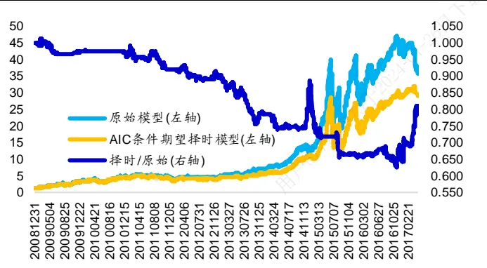
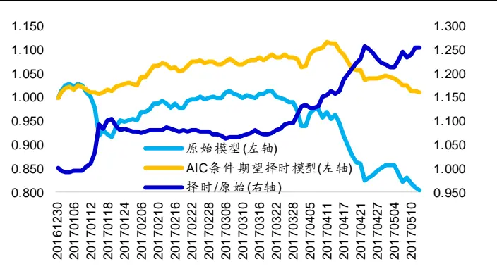
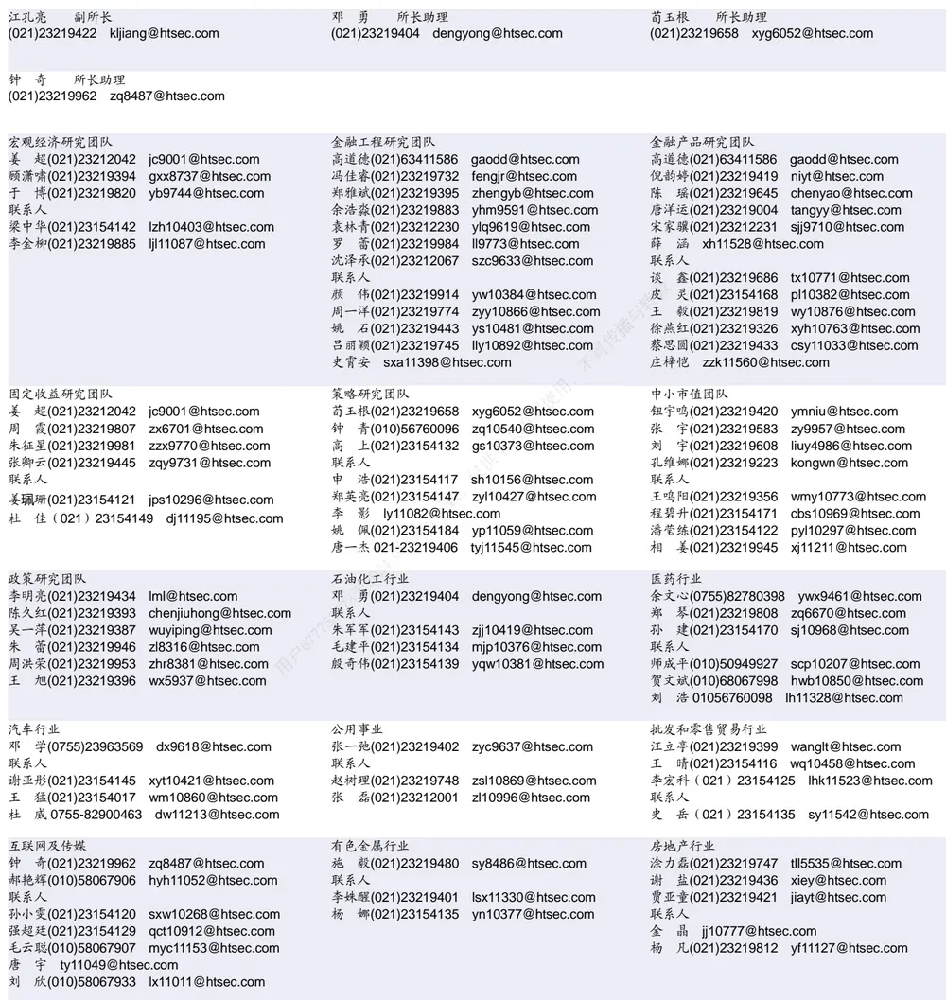

## 相关研究

Table_ReportInfo]《选股因子系列研究(十七)——选股因子的正交》2017.01.19

《从最大化复合因子单期 IC角度看因子权重》2017.02.14

分析师:冯佳睿

Tel:(021)23219732

Email:fengjr@htsec.com

证书:S0850512080006

分析师:袁林青

Tel:(021)23212230

Email:ylq9619@htsec.com

证书:S0850516050003

## 选股因子系列研究(二十)——基于条件期望的因子择时框架

年以来，传统的多因子组合皆出现了不同程度的回撤。通过分析可以发现传统模型之所以出现大幅回撤是因为模型中权重配臵较高的市值、反转以及特异度等因子皆出现了不同程度的失效。在这样一种大背景下，投资者对于因子择时研究的需求也在逐渐上升。本文基于条件期望这一思路，在传统多因子模型权重分配框架下对于因子择时进行了应用，为投资者提供了一个量化的因子择时框架。

本报告主要分为三部分。第一部分介绍了基于条件期望的因子择时模型；第二部分展示了不同因子集合、不同历史数据时间窗口下不同条件变量因子择时模型的表现；第三部分引入了 AIC 筛选法并提出了 AIC 筛选下的多条件变量因子择时模型。

- 因子择时实际上就是对于因子收益以及收益协方差矩阵进行预测。什么是因子择时？在笔者看来，因子择时就是对于因子权重进行更加动态地调整。那么怎样才能更好地做到因子权重的动态调整呢？在大多数因子权重分配框架下，更好的因子权重分配需要投资者对于因子收益以及因子收益协方差有更加精准的预测。

- 使用条件期望模型可对于因子收益以及协方差预期进行调整。在条件期望框架下，传统模型中的因子收益预测以及因子收益协方差预测实际上可以被看作是因子收益以及收益协方差的无条件期望，而改进后的预测实际上可以被看作是上述两个指标的条件期望。通过引入外生变量，择时模型能够根据市场环境的变化对于因子收益以及收益协方差的预测进行更加及时的调整。

- 大部分波动率类指标、部分涨跌幅指标、个别指数估值、换手率指标具有一定的因子择时效果。从整个区间回测效果上看，对于未加入市值类因子的多因子模型，因子择时模型对于 TOP100 组合具有一定的提升效果。而在加入了市值因子后，上看，大部分因子择时模型能够在 2016 年战胜原始模型，部分因子择时模型能在 2014 年、2017 年等年份跑赢原始模型，但是仅有极少数因子择时模型能在2015 年跑赢原始模型。

- 基于 AIC 信息准则可构建多条件变量因子择时模型。AIC 筛选下的多条件变量因子择时模型 TOP100 组合在区间年化收益上略低于原始模型 TOP100 组合，但是从分年度收益上看，因子择时模型的组合分年度收益分布更加均衡并且组合在风格剧烈切换的市场环境中也能够获得不错的收益表现。 年以来，因子择时TOP100 组合获得了约 1%的收益，而原始模型同期收益为-19.6%。

- 风险提示。市场系统性风险、资产流动性风险以及政策变动风险会对策略表现产生较大影响。本文回测结果皆由量化模型给出，未经过人为调整。

2017 年以来，传统的多因子组合皆出现了不同程度的回撤。通过分析可以发现传统模型之所以出现大幅回撤是因为模型中权重配臵较高的市值、反转以及特异度等因子皆出现了不同程度的失效。在这样一种大背景下，投资者对于因子择时研究的需求也在逐渐上升。本文基于条件期望这一思路，在传统多因子模型权重分配框架下对于因子择时进行了应用，为投资者提供了一个量化的因子择时框架。

本报告主要分为三部分。第一部分介绍了基于条件期望的因子择时模型；第二部分展示了不同因子集合、不同历史数据时间窗口下不同条件变量因子择时模型的表现；第三部分引入了 AIC 筛选法并提出了 AIC 筛选下的多条件变量因子择时模型。

## 1. 因子择时模型

2017 年以来，随着传统强势因子（市值、1个月反转以及 1个月特异度）稳定性的降低，传统多因子组合皆出现了不同程度的回撤。在这种大环境下，投资者对于因子择时模型的需求也越来越大。然而，因子择时模型的实际应用存在着诸多困难：

1) 难以平衡稳健的传统模型以及灵活的因子择时模型。由于传统的多因子模型极度适用于过去这种风格稳定的市场环境，基于传统模型构建的组合在历史上往往能够获得惊人的收益表现。从回测区间收益性上看，因子择时模型很难战胜传统模型。虽然传统模型在长期来看具有表现稳健的特点，但是因子择时模型在 2014 年 12 月以及 2017 年初等风格明显切换的市场环境能为组合带来较好的收益表现。因此，传统模型以及择时模型间的平衡一直是一个重要问题。

2) 无法量化地将因子择时观点转化为因子权重。基于前期研究，投资者的确可以分析得到部分因子的适用环境，但是在具体因子权重分配时依旧需要进行主观调整，并没有一个量化的模型指导因子择时后因子权重的分配。

3) 无法基于多个指标对于因子权重进行及时调整。在前期研究中，我们也有通过对于市场状态进行划分来构建因子择时模型，但是在面对多个择时指标时，上述模型的应用存在着较大的困难。

4) 无法有效筛选因子择时指标。虽然我们可以通过构建相关指标描述当前市场状态，但是因子择时指标并不是多多益善。随着择时指标的增多，因子择时模型确实能够在样本内获得较好的收益表现，但是其样本外的稳定性也会受到较大的影响。因子择时指标的筛选也为因子择时模型的应用产生了较大的阻碍。

为了构建一个能够有效解决上述问题的因子择时框架，我们不妨先回到一个最为基础的问题：什么是因子择时？在笔者看来，因子择时就是对于因子权重进行更加动态的调整。那么怎样才能更好地做到因子权重的动态调整呢？在大多数因子权重分配框架下，更好的权重分配结果需要投资者对于因子收益以及因子收益协方差有着更加精准的预测。我们不妨列出常见的几种因子权重分配框架中最优因子权重的表达式：

IC 加权：w ∝ IC

最大化 IC 加权：w ∝ ICΣ−1

回归法加权：w ∝ β

最大化 ICIR 加权：w ∝ IC Σ−1

观察上述表达式可以发现，在上述权重分配框架中因子模型的权重实际上取决于投资者对于因子收益（IC 或者回归 Beta 项）或者协方差矩阵的预测。所以，因子择时这一问题实际上就是如何对于因子的收益以及协方差矩阵进行预测。

在对于因子收益进行预测时，投资者常使用各因子过去 2 年或者更长一段时间内的收益均值作为下一期因子收益的预测。这种做法在风格稳定的市场中具有极为稳健的表现，而且会随着因子长期有效性的变化而变化，但是这种方法在风格剧烈切换的市场中

过于迟钝。考虑到这一问题，我们可考虑引入外生变量对于因子收益的预测进行调整。
对于因子收益协方差的预测也存在类似的思路。

基于这一想法，条件期望模型无疑是一个不错的选择。在这一框架下，传统模型中的因子收益预测以及因子收益协方差预测实际上可以被看作是因子收益以及收益协方差的无条件期望，而改进后的预测实际上可以被看作是上述两个指标的条件期望。通过引入外生变量，模型因子权重能够对于市场环境的变化有更好的应对。

假设每个月的因子收益以及当月选股时的条件变量值服从联合正态分布，则基于选股时观测到的条件变量值 $\mathsf{v}^{\star}$ ，可对因子收益预测值以及收益协方差预测值进行以下修正：（其中，f 为因子收益，v为条件变量。）

$$
[\boldsymbol{\int_{v}}]{\sim}N([\boldsymbol{\bar{f}}_{]}],\left[\boldsymbol{\Sigma_{ff}}\right.\quad\boldsymbol{\Sigma_{fv}}\\\boldsymbol{v}^{\left[\bar{f}_{]}\right]\sim}N([\boldsymbol{\bar{f}}_{\bar{v}}],\left[\boldsymbol{\Sigma_{vf}}\right.\quad\left.\boldsymbol{\Sigma_{vv}}\right])
$$

$$
\begin{array}{rl}&{f_{|v*}=\bar{f}+\Delta f\mathrm{~\nabla~},\Sigma_{|v*}=\Sigma_{ff}-\Sigma_{\Delta\Delta}}\\&{\Delta f=\Sigma_{fv}\Sigma_{vv}^{-1}(v^{*}-\bar{v}),\Sigma_{\Delta\Delta}=\Sigma_{fv}\Sigma_{vv}^{-1}\Sigma_{vf}}\end{array}
$$

基于上式我们就得到了调整后的因子收益预测 $f_{|v*}$ 以及因子收益协方差预测 $\Sigma_{|v*}$ 基于调整后的预测值，投资者可在不同的权重分配框架下得到因子择时后各因子的最优权重。不难发现，基于条件期望构建得到的因子择时模型极好地解决了因子择时在实际应用中的前三个问题。第四个问题我们会在第三部分中进行讨论。

## 2. 单条件因子择时模型

为了验证前文提出的条件期望因子择时模型的实际应用效果，本部分在 2009 年至年 月 日之间对比分析了原始模型与因子择时模型。由于条件期望因子择时模型的效果依赖于条件指标的有效性，所以本节对于不同的条件变量分别构建了单条件变量模型，从而对于各条件变量的因子择时有效性进行探究。

## 2.1 条件变量选择与模型回测设定

本章分别选取了五类指标（市场前期涨跌、市场前期波动、市场当前估值水平以及市场利率水平）构建条件变量，投资者也可根据自身需要扩充条件变量范围。

a) 涨跌幅类：沪深 300 指数、中证 500 指数、全 A指数前 1个月/3个月涨跌幅、市场前 1个月/3个月分化度；

b) 波动率类：沪深 300 指数、中证 500 指数、全 A指数前 1个月/3 个月日收益波动率、全 A指数与沪深 300 指数 1个月/3个月波动之差、中证 500 指数与沪深 300指数 1 个月/3 个月波动之差；

c) 估值类：沪深 300 指数 PB、全 A指数 PB；

d) 换手率类：沪深 300 指数前 1个月/3 个月日均换手、全 A前 1 个月/3 个月日均换手；

## e) 利率类：SHIBOR1M

在后文进行模型构建时，本文统一使用 2008 年 12 月 31 日至 2017 年 5月 12 日之间的数据进行月末因子选股组合的构建。本章一方面会考察模型复合因子的表现情况，另一方面还会考察模型极端组（ 组合）的表现情况。考虑到择时模型往往具有更高的换手，本文在进行 组合回测时考虑双边千分之五的交易成本。

在构建多因子模型时，本章选取了两组因子集合。第一组因子集合由 个月换手、个月反转、 个月特异度、 、营业利润增速以及 构成。第二组因子集合由市值、非线性市值、1 个月换手、1个月反转、1 个月特异度、PB、营业利润增速以及 ROE构成。此外，所有的因子都进行了截面正交化的处理。需要说明的是，第一组因子不仅对于行业、市值以及非线性市值都进行了正交化处理还在集合内进行了依次正交化的处理。第二组因子不仅对于行业进行了正交化处理还在集合内进行了依次正交化的处理。

在分配因子权重时，本章使用最大化复合因子 IC法。由于该方法需要确定使用因子历史数据的时间窗口，本节分别在 24 月（2 年）以及 60 月（5年）的窗口下进行了回测。由于同样因子集合下 60 月回测结果与 24 月回测结果相差较小，本部分仅展示 24月因子择时模型的表现，感兴趣的投资者可联系报告作者获取更多细节内容。

关于因子正交化处理以及最大化复合因子 IC法的相关细节，可参考海通量化团队前期发布的专题报告《选股因子系列研究(十七)——选股因子的正交》以及《从最大化复合因子单期 IC角度看因子权重》。

## 2.2 最大化复合因子 IC +6因子模型+24 月

下表展示了原始模型以及不同单条件变量因子择时模型下复合因子、多空收益以及TOP100 组合的表现情况。（表中标红部分表示择时模型在该指标上有提升效果。）

表 1 最大化复合因子 IC+6因子+24月择时模型对比

|  |  | PearsonIC ICIR 胜率 显著 |  |  |  | 多头 空头 多空 |  |  | Bottom10%月多空 |  | Top100胜率 换手 |  |  |
| --- | --- | --- | --- | --- | --- | --- | --- | --- | --- | --- | --- | --- | --- |
|  |  |  |  |  |  |  |  |  | 年化收益回撤IR |  |  |  |  |
| 原始模型 |  | 0.078 3.454 84.2% 71.3% |  |  |  | 1.028 -1.714 2.741 |  |  | 33.7% 46.6% 2.632 |  |  | 63.4% 74.9% |  |
| 涨跌幅 | 全A_1m | 0.078 3.334 |  | 83.2% | 72.3% | 1.009 | -1.633 2.642 |  | 33.5% 52.0% 2.424 |  |  | 64.4% 76.0% |  |
|  | 全A_3m | 0.0763.310 |  | 86.1% | 68.3% | 0.969 | -1.596 2.565 |  | 32.4% | 50.9% 2.432 |  | 63.4% | 74.0% |
|  | 沪深300_1m | 0.0763.302 |  | 84.2% | 72.3% | 1.017 | -1.620 | 2.637 | 34.3% | 50.0% 2.608 |  | 66.3% | 75.7% |
|  | 沪深 300_3m | 0.0733.204 |  | 86.1% | 70.3% | 0.885 | -1.625 | 2.510 | 31.2% | 48.6% 2.383 |  | 63.4% | 75.0% |
|  | 中证500_1m | 0.079 | 3.437 | 83.2% | 76.2% | 1.063 | -1.658 | 2.721 | 33.7% | 49.3% 2.466 |  | 62.4% | 77.0% |
|  | 中证500_3m | 0.079 | 3.501 | 86.1% | 72.3% | 1.032 | -1.654 | 2.685 | 33.6% | 50.0% 2.452 |  | 63.4% | 73.8% |
|  | 区分度1m | 0.069 | 3.069 | 81.2% | 69.3% | 0.945 | -1.478 | 2.423 | 31.9% | 48.3% 2.363 |  | 62.4% | 76.2% |
|  | 区分度3m | 0.069 | 3.022 | 80.2% | 65.3% | 0.846 | -1.482 | 2.328 | 32.7% | 46.9% 2.478 |  | 63.4% | 74.3% |
| 波动率 | 沪深 300_1m | 0.076 | 3.067 | 81.2% | 65.3% | 0.928 | -1.785 | 2.713 | 31.9% | 52.6% 2.121 |  | 62.4% | 71.4% |
|  | 沪深 300_3m | 0.078 | 3.225 | 80.2% | 66.3% | 1.108 | -1.697 | 2.805 | 34.5% | 54.2% 2.371 |  | 62.4% | 68.5% |
|  | 中证500_1m | 0.082 | 3.330 | 82.2% | 69.3% | 1.187 | -1.754 | 2.941 | 36.4% | 51.3% 2.534 |  | 63.4% | 71.7% |
|  | 中证500_3m | 0.077 | 3.291 | 82.2% | 68.3% | 1.076 | -1.649 | 2.725 | 36.1% | 51.8% 2.595 |  | 63.4% | 69.7% |
|  | 全A_1m | 0.079 | 3.225 | 84.2% | 66.3% | 1.061 | -1.809 | 2.870 | 34.6% | 52.1% | 2.388 | 63.4% | 72.1% |
|  | 全A_3m | 0.076 | 3.193 | 81.2% | 67.3% | 1.069 | -1.642 | 2.711 | 34.5% | 53.4% | 2.369 | 62.4% | 69.9% |
|  | 全A-300_1m | 0.086 | 3.853 | 87.1% | 78.2% | 1.277 | -1.811 | 3.088 | 39.4% | 46.2% | 2.880 | 61.4% | 78.4% |
|  | 全 A- 300_3m | 0.075 | 3.317 | 86.1% | 69.3% | 0.991 | -1.665 | 2.657 | 33.4% | 45.9% | 2.472 | 63.4% | 76.9% |
|  | 500-300_1m | 0.078 | 3.228 | 82.2% | 71.3% | 1.047 | -1.680 | 2.727 | 34.2% | 48.4% | 2.408 | 60.4% | 77.9% |
|  | 500-300_3m | 0.072 | 3.046 | 82.2% | 68.3% | 1.038 | -1.602 | 2.640 | 35.4% | 46.3% | 2.598 | 61.4% | 76.8% |
| 估值 | 沪深 300_PE | 0.067 | 2.900 | 80.2% | 68.3% | 0.828 | -1.540 | 2.368 | 30.7% | 50.5% | 2.047 | 62.4% | 79.3% |
|  | 全A_PE | 0.066 | 2.808 | 82.2% | 69.3% | 0.800 | -1.456 | 2.256 | 31.2% | 49.7% | 2.201 | 61.4% | 80.0% |
| 换手率 | 沪深 300_1m | 0.071 | 2.938 | 81.2% | 67.3% | 0.904 | -1.518 | 2.422 | 32.5% | 48.8% | 2.395 | 64.4% | 74.3% |
|  | 沪深 300_3m | 0.068 | 2.668 | 81.2% | 66.3% | 0.852 | -1.473 | 2.325 | 30.2% | 52.8% | 2.025 | 62.4% | 73.6% |
|  | 全A_1m | 0.071 | 2.911 | 82.2% | 71.3% | 0.919 | -1.500 | 2.418 | 34.6% | 48.1% | 2.679 | 64.4% | 74.0% |
|  | 全A_3m | 0.068 | 2.626 | 81.2% | 63.4% | 0.913 | -1.451 | 2.365 | 30.7% | 52.9% | 2.170 | 61.4% | 74.0% |
| 利率 | SHIBOR1M | 0.069 3.107 |  | 85.1% | 67.3% | 0.865 | -1.598 2.464 |  | 30.1% | 48.9% 2.167 |  | 62.4% | 77.1% |

资料来源：Wind，海通证券研究所

观察上表不难发现，个别换手率指标、部分涨跌幅类指标以及大部分波动率类指标对于原始模型有着一定的提升效果。具体体现在 IC以及 IC 胜率的提升、多空收益的扩大、TOP100 组合年化收益的提升。不过值得注意的是，单条件变量相对于原始模型的提升幅度较为有限。

下表展示了原始模型以及不同因子择时模型的分年度收益情况。

表 2 最大化复合因子 IC+6因子+24月择时模型 TOP100组合分年度收益

|  |  | 2009 2010 2011 2012 |  |  |  | 2013 | 2014 2015 2016 2017 |  |  |  |
| --- | --- | --- | --- | --- | --- | --- | --- | --- | --- | --- |
| 原始模型 |  | 197.5% 19.6% |  | -19.0% | 13.5% | 37.2% | 55.1% | 105.0% | -9.0% -11.9% |  |
| 涨跌幅 | 全A_1m全A_3m | 202.7% 21.2% |  | -21.1% | 23.7% | 36.0% | 61.7% | 77.1% | -7.4% | -12.5% |
|  |  | 197.0% | 15.3% | -21.0% | 19.0% | 43.2% | 64.1% | 70.9% | -6.2% | -13.0% |
|  | 沪深300_1m | 204.8% | 19.5% | -20.7% | 23.0% | 37.2% | 58.3% | 85.6% | -5.4% | -12.3% |
|  | 沪深 300_3m | 194.5% | 14.2% | -19.8% | 15.9% | 40.4% | 52.0% | 79.9% | -8.3% | -11.3% |
|  | 中证500_1m | 202.6% | 20.7% | -20.3% | 19.6% | 40.5% | 53.3% | 93.5% | -9.9% | -12.4% |
|  | 中证500_3m区分度1m区分度3m | 198.5% | 18.1% | -23.9% | 17.4% | 43.1% | 66.9% | 86.9% | -6.9% | -12.9% |
|  |  | 189.7% | 13.0% | -25.2% | 16.3% | 34.0% | 54.1% | 104.6% | -5.5% | -10.4% |
|  |  | 188.2% | 21.4% | -23.9% | 14.7% | 26.2% | 72.0% | 95.6% | -6.0% | -11.7% |
| 波动率 | 沪深 300_1m | 210.4% | 6.4% | -22.6% | 18.0% | 36.4% | 48.3% | 89.8% | -3.4% | -8.9% |
|  | 沪深300_3m | 195.3% | 13.7% | -20.7% | 12.9% | 39.2% | 55.6% | 101.2% | -0.8% | -7.5% |
|  | 中证500_1m | 217.5% | 6.2% | -21.9% | 20.5% | 40.5% | 54.9% | 118.9% | -2.9% | -7.9% |
|  | 中证500_3m全A_1m全A_3m全A-沪深300_1m | 195.7% | 16.2% | -21.2% | 12.6% | 43.1% | 55.9% | 111.7% | 0.2% | -8.0% |
|  |  | 209.6% | 6.3% | -22.2% | 18.8% | 38.2% | 54.8% | 109.5% | -3.3% | -7.9% |
|  |  | 198.9% | 16.3% | -22.0% | 12.6% | 37.2% | 57.6% | 99.4% | -0.9% | -7.8% |
|  |  | 213.1% | 16.0% | -17.2% | 31.3% | 43.2% | 59.2% | 120.3% | -7.8% | -11.1% |
|  | 全 A-沪深 300_3m | 186.3% | 21.0% | -21.8% | 13.0% | 32.4% | 56.0% | 119.6% | -8.9% | -11.2% |
|  | 500-300_1m500-300_3m | 206.9% | 23.9% | -26.2% | 22.1% | 43.0% | 36.5% | 109.5% | -6.2% | -10.3% |
|  |  | 190.3% | 29.7% | -24.6% | 17.3% | 43.9% | 43.5% | 122.4% | -7.8% | -9.7% |
| 估值 | 沪深 300_PE全A_PE | 192.4% | 24.8% | -23.5% | 16.0% | 31.6% | 39.4% | 95.8% | -7.4% | -12.1% |
|  |  | 192.6% | 23.8% | -23.4% | 16.1% | 42.9% | 42.6% | 84.8% | -7.4% | -12.9% |
| 换手率 | 沪深300_1m | 188.0% | 20.4% | -25.0% | 20.2% | 35.6% | 52.9% | 86.3% | -1.0% | -11.2% |
|  | 沪深 300_3m | 189.8% | 22.1% | -24.5% | 14.5% | 35.6% | 51.4% | 65.2% | -3.3% | -9.0% |
|  | 全A_1m | 190.8% | 20.1% | -27.1% | 21.0% | 34.6% | 69.1% | 96.7% | -3.0% | -9.7% |
|  | 全A_3m | 196.5% | 21.7% | -24.2% | 16.2% | 34.6% | 54.8% | 63.5% | -4.2% | -8.9% |
| 利率 | SHIBOR1M | 180.5% 17.7% -26.1% |  |  | 14.6% 37.5% |  | 52.1% | 92.6% | -8.2% | -12.1% |

资料来源：Wind，海通证券研究所

从分年度收益上看，大部分因子择时模型在 2012 年、2013 年、2016 年以及 2017年相比于原始模型皆有一定收益增强，但仅有少数择时模型组合能够在 2015 年超越原始模型。

下表以 年 月为例对比了原始模型与因子择时模型在风格切换的市场环境下的因子配臵情况以及当月收益表现。下表仅选取了波动率类指标中的沪深 300 前 1个月波动、中证 500 前 1个月波动以及全 A前 1个月波动作为因子择时条件变量。

表 3 最大化复合因子 IC+6因子+24月择时模型 2017年 1月权重分配及表现情况

| 模型 | 换手率 | 反转 | 特异度 | PB | 利润增速 | ROE | IC | rankIC | 月度收益 |
| --- | --- | --- | --- | --- | --- | --- | --- | --- | --- |
| 原始模型 | 34.2% | 31.1% | 11.6% | 3.2% | 12.2% | 7.8% | 0.11 | 0.11 | -1.96% |
| 波动率_沪深 300_1m | 53.5% | 12.9% | 4.6% | 6.1% | 16.9% | 6.1% | 0.22 | 0.24 | -0.53% |
| 波动率_中证 500_1m | 58.7% | 13.6% | 0.5% | 6.8% | 15.5% | 4.9% | 0.22 | 0.25 | -0.39% |
| 波动率_全A_1m | 56.6% | 15.2% | 0.1% | 5.6% | 16.7% | 6.0% | 0.22 | 0.24 | -0.42% |

资料来源：Wind，海通证券研究所

与原始模型相比，各因子择时模型在换手率因子上分配了更高的权重，而降低了反转因子以及特异度因子的权重配臵。从结果上看，因子择时模型获得了更高的 IC以及相对更好的月度收益表现。

## 2.3 最大化复合因子 IC +8因子模型+24 月

下表展示了原始模型以及不同单条件变量因子择时模型下复合因子、多空收益以及组合表现情况。在引入市值类因子这种强势因子后，因子择时模型超越原始模型的难度明显提升。只有个别波动率类指标在整个回测区间对于原始模型有一定的提升效果。具体提升效果体现为 以及 胜率的提升、多空收益的扩大、 组合年化收益的提升。不过值得注意的是，单条件变量相对于原始模型的提升幅度较为有限。

表 4 最大化复合因子 IC+8因子+24月择时模型对比

|  |  | Pearson |  |  |  | TopBottom10%月多空 |  | Top100 |  |  |  |  |
| --- | --- | --- | --- | --- | --- | --- | --- | --- | --- | --- | --- | --- |
|  |  | IC | ICIR | 胜率 | 显著 | 多头 | 空头 多空 | 年化收益 | 回撤 | IR | 胜率 | 换手率 |
| 原始模型 |  | 0.106 | 3.777 | 87.1% | 73.3% | 2.078 | -1.864 3.942 | 53.1% | 53.8% | 3.277 | 69.3% | 59.8% |
| 涨跌幅 | 全A_1m | 0.101 | 3.659 | 87.1% | 72.3% | 1.831 | -1.687 | 3.518 46.9% | 54.7% | 2.896 | 68.3% | 65.1% |
|  | 全A_3m | 0.099 | 3.461 | 84.2% | 71.3% | 1.753 | -1.710 3.463 | 46.9% | 55.0% | 2.850 | 70.3% | 62.3% |
|  | 沪深300_1m | 0.100 | 3.618 | 87.1% | 72.3% | 1.837 | -1.692 3.529 | 47.5% | 53.9% | 2.947 | 67.3% | 64.2% |
|  | 沪深 300_3m | 0.099 | 3.407 | 85.1% | 72.3% | 1.974 | -1.665 3.639 | 51.3% | 53.8% | 3.119 | 68.3% | 62.7% |
|  | 中证500_1m | 0.103 | 3.641 | 86.1% | 73.3% | 1.894 | -1.703 3.598 | 47.9% | 54.5% | 2.929 | 67.3% | 65.8% |
|  | 中证500_3m | 0.103 | 3.584 | 86.1% | 72.3% | 1.810 | -1.824 3.634 | 48.3% | 54.8% | 2.891 | 68.3% | 61.7% |
|  | 区分度1m | 0.093 | 3.474 | 85.1% | 74.3% | 1.858 | -1.496 3.354 | 46.6% | 53.2% | 2.933 | 69.3% | 64.5% |
|  | 区分度3m | 0.093 | 3.351 | 84.2% | 75.2% | 1.712 | -1.574 3.286 | 45.8% | 52.6% | 2.817 | 69.3% | 61.8% |
| 波动率 | 沪深300_1m | 0.100 | 3.399 | 86.1% | 72.3% | 1.931 | -1.848 3.779 | 51.2% | 53.3% | 3.294 | 67.3% | 61.8% |
|  | 沪深 300_3m | 0.100 | 3.599 | 88.1% | 73.3% | 1.936 | -1.868 3.805 | 51.8% | 54.7% | 3.335 | 68.3% | 60.7% |
|  | 中证500_1m | 0.105 | 3.763 | 86.1% | 79.2% | 2.140 | -1.994 4.133 | 53.3% | 52.4% | 3.379 | 68.3% | 62.6% |
|  | 中证500_3m | 0.103 | 3.793 | 88.1% | 73.3% | 1.950 | -1.927 3.877 | 53.4% | 52.9% | 3.559 | 67.3% | 60.6% |
|  | 全A_1m | 0.104 | 3.605 | 87.1% | 75.2% | 2.073 | -1.931 4.003 | 51.8% | 53.6% | 3.348 | 68.3% | 62.6% |
|  | 全A_3m | 0.101 | 3.669 | 88.1% | 74.3% | 1.968 | -1.860 3.829 | 52.1% | 53.4% | 3.471 | 67.3% | 62.0% |
|  | 全 A-300_1m | 0.110 | 3.992 | 89.1% | 79.2% | 2.187 | -1.872 4.058 | 53.4% | 53.8% | 3.193 | 68.3% | 67.0% |
|  | 全 A-300_3m | 0.100 | 3.498 | 86.1% | 72.3% | 1.932 | -1.694 | 3.626 50.5% | 53.6% | 3.049 | 66.3% | 64.4% |
|  | 500-300_1m | 0.103 | 3.765 | 88.1% | 74.3% | 2.011 | -1.797 | 3.808 49.9% | 53.8% | 3.038 | 65.3% | 66.3% |
|  | 500-300_3m | 0.102 | 3.855 | 89.1% | 74.3% | 2.017 | -1.777 | 3.794 53.0% | 53.7% | 3.266 | 66.3% | 63.5% |
|  | 沪深 300_PE | 0.091 | 3.065 | 82.2% | 71.3% | 1.733 | -1.545 3.278 | 45.6% | 54.2% | 2.696 | 66.3% | 66.9% |
| 估值 | 全 A_PE 0.092 | 3.160 | 83.2% | 71.3% | 1.617 | -1.605 | 3.222 | 41.9% | 54.3% | 2.477 | 65.3% | 69.0% |
|  | 沪深 300_1m | 0.097 | 3.513 | 87.1% | 74.3% | 1.874 | -1.706 3.580 | 51.4% | 53.8% | 3.191 | 67.3% | 62.6% |
| 换手率 利率 | 沪深 300_3m | 0.097 | 3.334 | 84.2% | 68.3% | 1.861 | -1.814 | 3.675 49.8% | 54.1% | 3.123 | 70.3% | 61.5% |
|  | 全A换手_1m | 0.095 | 3.408 | 86.1% | 72.3% | 1.757 | -1.653 3.410 | 48.2% | 53.2% | 2.965 | 68.3% | 62.5% |
|  | 全 A换手_3m | 0.094 | 3.217 | 85.1% | 68.3% | 1.689 | -1.737 | 3.426 | 47.4% | 53.4% | 3.000 69.3% | 61.8% |
|  | SHIBOR1M | 0.098 | 3.607 | 90.1% | 74.3% | 1.890 | -1.834 3.724 | 49.7% | 53.8% | 3.129 | 65.3% | 65.2% |

资料来源：Wind，海通证券研究所

下表展示了原始模型以及不同因子择时模型的分年度收益情况。

表 5 最大化复合因子 IC+8因子+24月择时模型 TOP100组合分年度收益

|  |  | 2009 2010 2011 2012 2013 |  |  |  |  | 2014 | 2015 2016 2017 |  |  |
| --- | --- | --- | --- | --- | --- | --- | --- | --- | --- | --- |
| 原始模型 |  | 230.2% 40.9% -17.2% 21.9% |  |  |  | 51.8% | 76.3% | 220.5% | 10.4% | -19.6% |
|  | 全A_1m | 229.0% | 42.5% | -17.4% 19.6% |  | 53.1% | 72.9% | 135.3% | 8.8% | -19% |
| 涨跌幅 | 全A_3m | 226.3% | 42.4% | -15.8% 23.6% |  | 46.4% | 80.0% | 119.0% | 14.4% | -21% |
|  | 沪深 300_1m | 228.7% | 42.1% | -17.4% 21.4% |  | 46.1% | 81.4% | 137.0% | 10.7% | -20% |
|  | 沪深 300_3m中证500_1m | 230.6% | 43.1% | -16.3% 23.3% |  | 47.3% | 74.9% | 184.6% | 13.0% | -20% |
|  |  | 227.1% | 42.3% | -17.8% 20.8% |  | 55.1% | 67.3% | 154.0% | 9.4% | -20% |
|  | 中证 500_3m | 223.2% | 41.7% | -17.2% 22.7% |  | 47.5% | 82.5% | 138.1% | 15.3% | -21% |
|  | 区分度1m | 224.7% | 34.5% | -18.0% 19.0% |  | 45.3% | 73.4% | 146.5% | 17.8% | -20% |
|  | 区分度 3m | 238.4% | 42.7% | -20.6% 19.7% |  | 40.9% | 83.7% | 110.9% | 19.2% | -21% |
| 波动率 | 沪深300_1m | 230.2% | 33.3% | -17.0% 22.3% |  | 49.0% | 74.6% | 192.6% | 17.3% | -20% |
|  | 沪深 300_3m | 219.5% | 35.9% | -19.4% 20.1% |  | 50.4% | 78.4% | 197.1% | 14.4% | -13% |
|  | 中证500_1m | 233.9% | 33.9% | -16.4% 27.4% |  | 52.1% | 65.0% | 217.9% | 15.6% | -18% |
|  | 中证500_3m | 227.9% | 32.4% | -18.8% 20.8% |  | 55.0% | 75.2% | 207.6% | 15.0% | -11% |
|  | 全A_1m | 230.0% | 34.2% | -16.4% 23.8% |  | 47.9% | 72.9% | 199.7% | 16.0% | -19% |
|  | 全A_3m | 222.1% | 34.3% | -19.4% | 19.4% | 53.7% | 76.2% | 196.8% | 15.4% | -13% |
|  | 全A-300_1m | 237.8% | 36.6% | -17.2% | 30.4% | 44.3% | 69.8% | 221.1% | 13.9% | -19% |
|  | 全 A-300_3m500-300_1m500-300_3m | 218.4% | 43.9% | -16.6% | 24.1% | 41.5% | 74.9% | 194.8% | 11.1% | -19% |
|  |  | 236.2% | 37.8% | -21.8% | 17.8% | 48.8% | 60.9% | 209.9% | 15.0% | -18% |
|  |  | 223.0% | 41.4% | -18.5% | 23.2% | 66.1% | 75.3% | 182.6% | 13.3% | -17% |
| 估值 | 沪深 300_PE全A_PE | 222.4% | 41.5% | -19.3% | 14.7% | 47.2% | 69.4% | 150.9% | 10.7% | -20% |
|  |  | 226.7% | 39.2% | -19.8% | 15.3% | 55.5% | 81.5% | 77.6% | 12.0% | -20% |
| 换手率 | 沪深 300_1m | 234.5% | 39.2% | -16.8% | 25.0% | 44.4% | 106.5% | 142.2% | 16.8% | -20% |
|  | 沪深 300_3m全A换手_1m全 A换手_3m | 230.7% | 39.9% | -18.8% | 20.0% | 46.7% | 107.9% | 128.7% | 18.0% | -20% |
|  |  | 236.8% | 42.3% | -18.1% | 26.3% | 40.6% | 93.6% | 113.0% | 18.0% | -20% |
|  |  | 233.7% | 43.8% | -19.5% | 19.6% | 47.8% | 111.6% | 88.3% | 19.0% | -20% |
| 利率 | SHIBOR1M | 197.3% 40.2% |  | -23.3% 20.2% |  | 47.4% | 73.1% | 209.5% | 11.9% | -13% |

资料来源：Wind，海通证券研究所

从分年度收益上看，大部分因子择时模型在 2016 年以及 2017 年相比于原始模型皆有一定收益增强，部分因子择时模型在 2009、2010、2011 年、2012 年、2013 年以及2014 年跑赢原始模型，但是大部分因子择时模型无法在 2015 年超越原始模型。

下表以 2017 年 1 月为例对比了原始模型与因子择时模型在风格切换的市场环境下的因子配臵情况以及收益表现。下表仅选取了波动率类指标中的沪深300前3个月波动、中证 500 前 3个月波动以及全 A 前 3个月波动作为因子择时变量。

表 6 最大化复合因子 IC+8因子+24月择时模型 2017年 1月权重分配及表现情况

| 模型 | 市值 | 市值平方 | 换手 | 反转 | 特异度 | PB | 增速 | ROE | IC | ranklC | 月收益 |
| --- | --- | --- | --- | --- | --- | --- | --- | --- | --- | --- | --- |
| 原始模型 | 30.9% | 15.1% | 18.4% | 16.8% | 6.2% | 1.7% | 6.6% | 4.2% | -0.03 | -0.07 | -4.47% |
| 波动率_沪深 300_3m | 18.8% | 17.2% | 30.3% | 9.1% | 5.8% | 9.3% | 6.0% | 3.4% | 0.15 | 0.14 | -2.71% |
| 波动率_中证 500_3m | 19.7% | 16.7% | 31.7% | 8.2% | 7.6% | 8.7% | 5.8% | 1.7% | 0.15 | 0.13 | -2.62% |
| 波动率_全A_3m | 19.4% | 16.4% | 30.9% | 9.2% | 6.8% | 8.5% | 6.2% | 2.7% | 0.14 | 0.13 | -2.79% |

资料来源：Wind，海通证券研究所

与原始模型相比，各因子择时模型大幅降低了市值因子、反转因子的权重分配，而提高了换手率因子以及 PB因子的权重。从结果上看，因子择时模型获得了更高的 IC 以及相对更好的月度收益表现。

## 2.4 本章小结

本节对于不同历史数据时间窗口、不同因子集合下最大化复合因子 IC原始模型以及单条件变量因子择时模型的表现进行了对比分析。总体上看，大部分波动率类指标、部分涨跌幅指标、个别指数估值、换手率指标具有一定择时效果。

从整个区间回测效果上看，对于未加入市值类因子的多因子模型，单条件变量因子择时模型对于 TOP100 组合的提升难度较低。在加入了市值因子后，仅有个别波动率类指标能够在区间年化收益上产生进一步提升。

从分年度收益上看，大部分因子择时模型能够在 2016 年战胜原始模型，部分因子模型能在 2014 年、2017 年等年份跑赢原始模型，但是仅有极少数因子择时模型能在2015 年跑赢原始模型。

## 3. AIC筛选下的多条件指标因子择时模型

前一章的回测结果表明部分条件指标具有较好的择时效果，但是在实际进行因子择时的过程中，投资者并不可能把所有的条件变量皆放入因子择时模型中来。虽然更多的条件变量能够在样本内带来较好的回测结果，但是会降低模型在样本外的稳定性。虽然投资者可在实际应用过程中根据自己对于因子的理解进行条件变量的筛选，但是为了进行量化回测，本节基于 AIC 信息准则（Akaike’s Information Criterion）构建了条件变量筛选流程，并对于使用 AIC 筛选法的多条件变量因子择时模型进行了回测。

## 3.1 条件变量的筛选——AIC 信息准则

AIC 信息准则即 Akaike information criterion，是衡量统计模型拟合优良性的一种标准。它建立在熵的概念基础上，因此可以用于权衡所估计模型的复杂度和模型的拟合度。基于条件期望模型可构建 AIC 指标，指标计算方法详见下式：

$$
AIC=T*\log\bigl[\big|\Sigma_{|v*}\bigr|\bigr]+2NK
$$

其中，T 为历史时间窗口长度，N为选股因子数量，K为条件变量数量。

在实际进行筛选时，可按照以下步骤进行条件变量的筛选：

1）设定已选变量集合为空集，计算无条件变量下模型 AIC 值作为 AIC 初始值；

2）遍历备选集合，使用备选集合中的每一个条件变量与已选变量集合一起计算添加各备选条件指标后的模型 AIC；

3）若所有备选条件指标模型 AIC 皆高于现有模型 AIC 则停止筛选，现有的已选变量即为本期使用的条件变量，否则将最低的备选条件指标模型 AIC 所对应的条件变量添加至已选集合中、从备选集合中删除该变变量并返回步骤 2）。

使用上述筛选流程可在每月选股时对于条件变量集合进行筛选。

## 3.2 AIC多条件变量因子择时模型回测设臵

本章在对于 AIC 多条件变量因子择时模型进行回测时按照以下设定进行：

1）模型回测时间为：2008 年 12 月 31 日至 2017 年 5 月 12 日；

2）因子构成：市值、非线性市值、换手率、反转、特异度、PB、营业利润增速以及 ROE；

3）因子处理：所有因子皆进行截面标准化以及正交化的处理；

4）因子加权方式：使用历史 2 年数据最大化复合因子 IC；

5）因子择时模型：使用 AIC 法则筛选条件变量并进行因子收益的预测；

6）条件变量选取：

a) 涨跌幅类：沪深 300、中证 500、全 A前 1个月/3个月涨跌幅、市场前 1个月/3个月分化度；

b) 波动率类：沪深 300、中证 500、全 A前 1个月/3个月日收益波动率

c) 估值类：沪深 300 指数 PB、全 A指数 PB；

d) 换手率类：沪深 300 指数前 1个月日均换手、全 A前 1 个月日均换手；

e) 利率类：SHIBOR1M

7）组合构建：月末选取全市场打分前 100 的股票构建等权组合，选股范围剔除 ST以及新股。组合换仓时考虑双边千分之五的交易费用。

## 3.3 模型回测结果

下图分别展示了因子择时模型TOP100组合以及原始模型TOP100组合在整个回测区间以及在 2017 年以来的净值走势。

图1 组合净值走势（2009.01~2017.05）

资料来源：Wind，海通证券研究所

图2 组合净值走势（2017.01~2017.05.12）

资料来源：Wind，海通证券研究所

根据组合净值走势可知，择时模型在大部分时间段内会跑输原始模型，但是在风格明显切换的市场环境下（如，2014 年 12 月以及 2017 年以来）相对于原始模型会有大幅的超额收益。下表给出了原始模型和因子择时模型的分年度统计情况。

表 7 因子择时模型与原始模型分年度表现情况对比

| 原始模型 |  |  |  |  |  |  | 因子择时模型 |  |  |  |  |  |
| --- | --- | --- | --- | --- | --- | --- | --- | --- | --- | --- | --- | --- |
| 年度 | 收益 | 回撤 | Calmar | IR | 胜率 | 换手 | 收益 | 回撤 | Calmar | IR | 胜率 | 换手 |
| 2009 | 230.2% | 20.7% | 10.89 | 5.059 | 91.7% | 63.2% | 221.7% | 20.7% | 10.49 | 4.813 | 91.7% | 67.2% |
| 2010 | 40.9% | 26.8% | 1.52 | 3.784 | 66.7% | 60.8% | 39.2% | 26.8% | 1.45 | 3.669 | 58.3% | 63.5% |
| 2011 | -17.2% | 29.3% | -0.58 | 4.049 | 41.7% | 55.7% | -20.6% | 31.9% | -0.64 | 2.950 | 41.7% | 73.3% |
| 2012 | 21.9% | 18.0% | 1.21 | 3.459 | 66.7% | 61.6% | 18.8% | 17.7% | 1.06 | 3.145 | 66.7% | 70.0% |
| 2013 | 51.8% | 16.4% | 3.20 | 4.593 | 66.7% | 68.8% | 32.8% | 14.5% | 2.29 | 1.775 | 58.3% | 77.4% |
| 2014 | 76.3% | 12.8% | 5.84 | 2.983 | 91.7% | 56.1% | 93.8% | 9.6% | 9.51 | 4.684 | 91.7% | 69.8% |
| 2015 | 220.5% | 53.8% | 4.02 | 4.754 | 75.0% | 58.8% | 144.0% | 54.5% | 2.59 | 3.219 | 66.7% | 74.8% |
| 2016 截止 | 10.4% | 33.9% | 0.30 | 3.433 | 75.0% | 55.8% | 8.2% | 33.8% | 0.24 | 3.134 | 75.0% | 63.2% |
| 2017年 5月12 | -19.6% | 21.9% | -2.08 | -3.677 | 20.0% | 45.2% | 1.0% | 9.7% | 0.28 | 2.903 | 40.0% | 81.0% |
| 日 总体 | 53.1% | 53.8% | 0.988 | 3.277 | 69.3% | 59.8% | 49.4% | 54.5% | 0.906 | 3.044 | 67.3% | 70.7% |

资料来源：Wind，海通证券研究所

从分年度收益上看，择时模型仅在 2014 年以及 2017 年大幅跑赢原始模型。那么到底是什么导致了择时模型在上述时段明显跑赢原始模型呢？下表对比列出了原始模型以及因子择时模型在 2014 年 12 月以及 2017 年以来各月的权重分配、复合因子 IC以及TOP100 组合月度收益情况。

表 8 择时模型与原始模型特定时段对比分析

| 模型 | 调仓日 | 市值 | 市值平方 | 换手率 | 反转 | 特异度 | 估值 | 增速 | ROE | IC | ranklC | 月收益 |
| --- | --- | --- | --- | --- | --- | --- | --- | --- | --- | --- | --- | --- |
| 原始模型 | 20141128 | 37.1% | 10.6% | 14.0% | 11.4% | 13.5% | 0.4% | 9.6% | 3.4% | -0.269 | -0.269 | -10.75% |
|  | 20161230 | 30.9% | 15.1% | 18.4% | 16.8% | 6.2% | 1.7% | 6.6% | 4.2% | -0.026 | -0.067 | -4.47% |
|  | 20170126 | 28.6% | 16.6% | 20.7% | 14.2% | 6.4% | 1.9% | 7.4% | 4.2% | 0.087 | 0.119 | 4.46% |
|  | 20170228 | 26.9% | 16.2% | 19.4% | 16.1% | 6.8% | 3.2% | 7.3% | 4.2% | -0.067 | -0.067 | -5.80% |
|  | 20170331 | 23.7% | 16.6% | 20.6% | 16.5% | 6.8% | 3.2% | 7.1% | 5.5% | -0.075 | -0.129 | -9.26% |
|  | 20170428 | 21.1% | 15.4% | 21.3% | 16.1% | 7.2% | 3.5% | 7.7% | 7.7% | -0.037 | -0.048 | -5.71% |
| 因子择时模型 | 20141128 | 2.1% | 10.4% | 40.6% | 22.4% | 1.3% | 11.4% | 1.9% | 10.0% | 0.155 | 0.156 | 3.84% |
|  | 20161230 | 10.1% | 16.9% | 27.5% | 23.1% | 3.3% | 13.2% | 1.4% | 4.7% | 0.231 | 0.247 | 2.97% |
|  | 20170126 | 54.6% | 2.5% | 3.8% | 5.3% | 3.1% | 9.3% | 14.0% | 7.4% | 0.052 | 0.070 | 4.43% |
|  | 20170228 | 3.2% | 17.7% | 42.6% | 2.4% | 8.7% | 11.3% | 10.9% | 3.3% | 0.051 | 0.076 | -0.85% |
|  | 20170331 | 4.7% | 17.9% | 34.3% | 6.5% | 2.7% | 22.6% | 5.7% | 5.7% | 0.142 | 0.164 | -2.06% |
|  | 20170428 | 2.5% | 11.3% | 29.0% | 14.4% | 3.2% | 17.3% | 8.9% | 13.3% | 0.001 | 0.025 | -3.30% |

资料来源：Wind，海通证券研究所

观察上表可知，因子择时模型在上述风格切换的时间段内在因子权重的分配上更加灵活。例如，在 2014 年 12 月以及 2017 年以来，择时模型在大部分月份中大幅降低了市值因子、特异度因子的权重，转而提升了换手率因子、估值因子以及 ROE因子的权重。从当月的因子模型复合因子 IC以及 TOP100 组合收益上来看，择时模型的权重调整效果较好。

## 3.4 本章小结

本章展示了 AIC 法则筛选下的多条件变量因子择时模型的回测效果。总体上来看，因子择时模型 TOP100 组合在区间收益上略低于原始模型 TOP100 组合。但是从分年度收益上看，因子择时模型组合收益分布更加均衡并且组合在风格剧烈切换的市场环境中也能够获得不错的收益表现。

## 4. 总结

本文从条件期望这一角度出发，提出了一整套量化的因子择时框架。该框架在对于因子权重进行分配时一方面参考了因子长期的选股效果，另一方面也参考了外生变量对于因子选股效果的影响。通过引入外生变量，因子择时模型能够更加动态地分配因子权重从而应对市场风格的切换。

基于因子收益以及因子协方差的条件期望，投资者可通过量化的手段将因子择时观点转化为因子权重。此外，投资者也可根据自身对于所使用的因子集合的理解进行条件变量的自主选择，由此获得更好的因子择时效果。

最后，本文也提出了一套筛选条件变量的方法，基于 AIC 准则投资者可通过量化的手段对于条件变量进行筛选，由此权衡择时模型的稳定性与拟合度。

总的来说，基于条件期望的因子择时模型具有较好的扩展性。在无条件变量时，该模型就等同于传统的多因子选股模型，但是在添加了条件变量后，模型就能够通过外生变量增强模型在权重分配时的灵活程度。投资者在实际应用此套方法时也可根据自身需求对于模型进行一步的调整，例如，对于条件变量进行扩充（如，考虑宏观指标等）、对于条件变量进行细化处理等。

## 5. 风险提示

市场系统性风险、资产流动性风险以及政策变动风险会对策略表现产生较大影响。用，本文回测结果皆由量化模型给出，未经过人为调整。部

# 信息披露

分析师声明

[Table冯佳睿yst 金融工程研究团队s]

袁林青金融工程研究团队

本人具有中国证券业协会授予的证券投资咨询执业资格，以勤勉的职业态度，独立、客观地出具本报告。本报告所采用的数据和信息均来自市场公开信息，本人不保证该等信息的准确性或完整性。分析逻辑基于作者的职业理解，清晰准确地反映了作者的研究观点，结论不受任何第三方的授意或影响，特此声明。

## 法律声明

本报告仅供海通证券股份有限公司（以下简称“本公司”）的客户使用。本公司不会因接收人收到本报告而视其为客户。在任何情况下，本报告中的信息或所表述的意见并不构成对任何人的投资建议。在任何情况下，本公司不对任何人因使用本报告中的任何内容所引致的任何损失负任何责任。

本报告所载的资料、意见及推测仅反映本公司于发布本报告当日的判断，本报告所指的证券或投资标的的价格、价值及投资收入可能播会波动。在不同时期，本公司可发出与本报告所载资料、意见及推测不一致的报告。可

市场有风险，投资需谨慎。本报告所载的信息、材料及结论只提供特定客户作参考，不构成投资建议，也没有考虑到个别客户特殊的用，投资目标、财务状况或需要。客户应考虑本报告中的任何意见或建议是否符合其特定状况。在法律许可的情况下，海通证券及其所属部关联机构可能会持有报告中提到的公司所发行的证券并进行交易，还可能为这些公司提供投资银行服务或其他服务。

本报告仅向特定客户传送，未经海通证券研究所书面授权，本研究报告的任何部分均不得以任何方式制作任何形式的拷贝、复印件或供复制品，或再次分发给任何其他人，或以任何侵犯本公司版权的其他方式使用。所有本报告中使用的商标、服务标记及标记均为本公司的商标、服务标记及标记。如欲引用或转载本文内容，务必联络海通证券研究所并获得许可，并需注明出处为海通证券研究所，且下不得对本文进行有悖原意的引用和删改。

根据中国证监会核发的经营证券业务许可，海通证券股份有限公司的经营范围包括证券投资咨询业务。24

## 海通证券股份有限公司研究所[Table_PeopleInfo]

路 颖所长

(021)23219403 luying@htsec.com

高道德 副所长(021)63411586 gaodd@htsec.com

姜 超 副所长(021)23212042 jc9001@htsec.com

| 家电行业 陈子仪(021)23219244 chenzy@htsec.com | 造纸轻工行业 曾 |  |
| --- | --- | --- |
| 联系人 | 联系人 | 知(021)23219810 zz9612@htsec.com |
| 李阳 ly11194@htsec.com |  |  |
| 朱默辰 zmc11316@htsec.com | 赵 洋 zy10340@htsec.com | 朱 悦(021)23154173 zy11048@htsec.com |

| 电子行业 | 煤炭行业 | 电力设备及新能源行业 |  |
| --- | --- | --- | --- |
| 陈 平(021)23219646 cp9808@htsec.com 联系人 | 吴 杰(021)23154113 wj10521@htsec.com 李 淼(010)58067998 Im10779@htsec.com | 房 青(021)23219692 fangq@htsec.com 徐柏乔(021)32319171 xbq6583@htsec.com |  |
| 谢 磊(021)23212214 xl10881@htsec.com | 联系人 | 杨 帅(010)58067929 ys8979@htsec.com |  |
| 张天闻 ztw11086@htsec.com | 戴元灿(021)23154146 dyc10422@htsec.com | 联系人 |  |
| 尹 苓(021)23154119 yl11569@htsec.com |  | 曾 彪(021)23154148 zb10242@htsec.com |  |
|  |  |  | 张向伟(021)23154141 zxw10402@htsec.com |

| 基础化工行业 |  | 计算机行业 |  | 通信行业 |
| --- | --- | --- | --- | --- |
|  | 刘 威(0755)82764281 Iw10053@htsec.com 刘 强(021)23219733 lq10643@htsec.com | 谢春生(021)23154123 xcs10317@htsec.com | 郑宏达(021)23219392 zhd10834@htsec.com | 朱劲松(010)50949926 zjs10213@htsec.com 联系人 |
| 联系人 | 刘海荣(021)23154130 Ihr10342@htsec.com | 联系人 黄竞晶(021)23154131 hjj10361@htsec.com |  | 庄 宇(010)50949926 zy11202@htsec.com |
|  |  | 杨 林(021)23154174 yl11036@htsec.com 鲁 立 II1383@htsec.com 洪 琳 hl11570@htsec.com |  | 余伟民(010)50949926 ywm11574@htsec.com |

| 非银行金融行业 |  | 交通运输行业 |  | 纺织服装行业 |
| --- | --- | --- | --- | --- |
|  | 孙 婷(010)50949926 st9998@htsec.com |  | 虞 楠(021)23219382 yun@htsec.com | 于旭辉(021)23219411 yxh10802@htsec.com |
| 何 婷(021)23219634 ht10515@htsec.com |  |  | 张 杨(021)23219442 zy9937@htsec.com | 唐 苓(021)23212208 tl9709@htsec.com |
| 联系人 |  | 联系人 |  | 梁 希(021)23219407 lx11040@htsec.com |
| 夏昌盛(010)56760090 李芳洲(021)23154127 | xcs10800@htsec.com Ifz11585@htsec.com |  | 童 宇(021)23154181 ty10949@htsec.com | 联系人 马 榕 23219431 mr11128@htsec.com |

| 建筑建材行业 | 机械行业 |  | 钢铁行业 |  |
| --- | --- | --- | --- | --- |
| 邱友锋(021)23219415 qyf9878@htsec.com | 余炜超(021)23219816 swc11480@htsec.com |  | 刘彦奇(021)23219391 liuyq@htsec.com |  |
| 钱佳佳(021)23212081 qjj10044@htsec.com | 耿 耘(021)23219814 | gy10234@htsec.com | 联系人 |  |
| 冯晨阳(021)23154019 fcy10886@htsec.com | 沈伟杰(021)23219963 | swj11496@htsec.com |  | 刘 璇(021)23219197 lx11212@htsec.com |
| 联系人 周 俊 0755-23963686 zj11521@htsec.com | 联系人 | 杨 震(021)23154124 yz10334@htsec.com |  |  |

| 建筑工程行业 杜市伟 dsw11227@htsec.com | 农林牧渔行业 |  | 食品饮料行业 |
| --- | --- | --- | --- |
|  | 丁 频(021)23219405 dingpin@htsec.com |  | 闻宏伟(010)58067941 whw9587@htsec.com |
| 联系人 毕春晖(021)23154114 bch10483@htsec.com | 陈雪丽(021)23219164 cxl9730@htsec.com 陈 阳(010)50949923 cy10867@htsec.com |  | 孔梦遥(010)58067998 kmy10519@htsec.com |
|  | 联系人 |  | 成 珊(021)23212207 cs9703@htsec.com |
|  | 关 慧(021)23219448 gh10375@htsec.com |  |  |
|  | 夏 越(021)23212041 | xy11043@htsec.com |  |

| 军工行业 | 银行行业 | 社会服务行业 |
| --- | --- | --- |
| 徐志国(010)50949921 xzg9608@htsec.com | 林媛媛(0755)23962186 lyy9184@htsec.com | 李铁生(010)58067934 Its10224@htsec.com |
| 刘 磊(010)50949922 II11322@htsec.com 蒋 俊(021)23154170 jj11200@htsec.com | 联系人V 林瑾璐 ljl11126@htsec.com | 联系人 |
| 联系人 | 谭敏沂 tmy10908@htsec.com | 陈扬扬(021)23219671 cyy10636@htsec.com |
| 张恒晅(010)68067998 zhx10170@hstec.com 张宇轩 zyx11631@htsec.com 677753 |  | 顾熹闽 gxm11214@htsec.com |

## 研究所销售团队

| 深广地区销售团队 |  | 上海地区销售团队 |  | 北京地区销售团队 yyq9989@htsec.com |
| --- | --- | --- | --- | --- |
| 蔡铁清(0755)82775962 欧阳梦楚(0755)23617160 | ctq5979@htsec.com | 胡雪梅(021)23219385 | huxm@htsec.com | 殷怡琦(010)58067988 |
|  |  | 朱 健(021)23219592 zhuj@htsec.com |  | 杨羽莎(010)58067977 yys10962@htsec.com |
| oymc11039@htsec.com |  | 马晓男mxn11376@htsec.com |  | 张丽萱(010)58067931 zlx11191@htsec.com |
| 巩柏含 gbh11537@htsec.com |  | 蒋 炯 jj10873@htsec.com | 毛文英(021)23219373 mwy10474@htsec.com | 陆铂锡Ibx11184@htsec.com |
| 饶 伟(0755)82775282 | rw10588@htsec.com |  |  | 吴尹 wy11291@htsec.com |
| 辜丽娟(0755)83253022 | gulj@htsec.com | 方烨晨(021)23154220 | fyc10312@htsec.com | 陈铮茹 czr11538@htsec.com |
| 刘晶晶(0755)83255933 | liujj4900@htsec.com | 季唯佳(021)23219384 | jiwj@htsec.com | 张明 zm11248@htsec.com |
| 伏财勇(0755)23607963 王雅清(0755)83254133 | fcy7498@htsec.com | 黄 诚(021)23219397 | hc10482@htsec.com |  |
|  | wyq10541@htsec.com | 黄 毓(021)23219410 | huangyu@htsec.com |  |
|  |  | 杨祎昕(021)23212268 | yyx10310@htsec.com |  |
|  |  | 漆冠男(021)23219281 | qgn10768@htsec.com |  |
|  |  | 胡宇欣(021)23154192 | hyx10493@htsec.com |  |
|  |  | 慈晓聪021-23219989 | cxc11643@htsec.com |  |

海通证券股份有限公司研究所

地址：上海市黄浦区广东路 689号海通证券大厦 9楼

电话：（021）23219000

传真：（021）23219392

网址：www.htsec.com