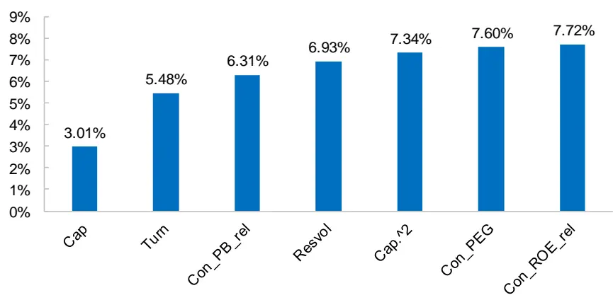
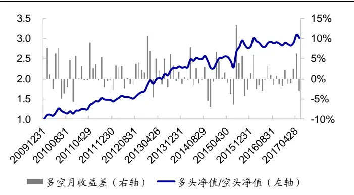
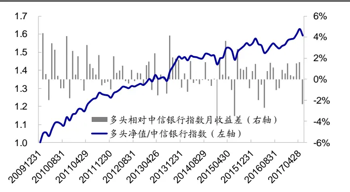
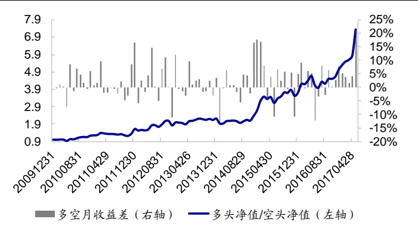
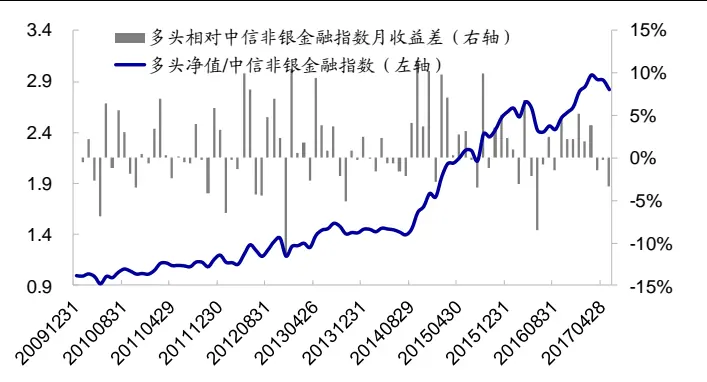
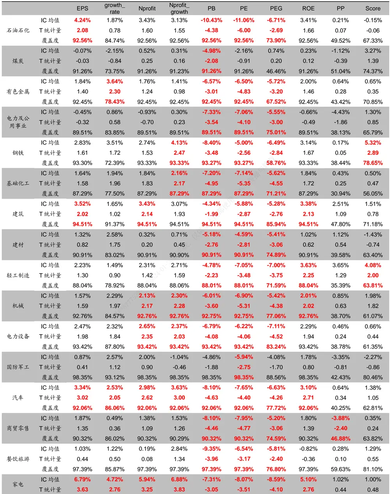
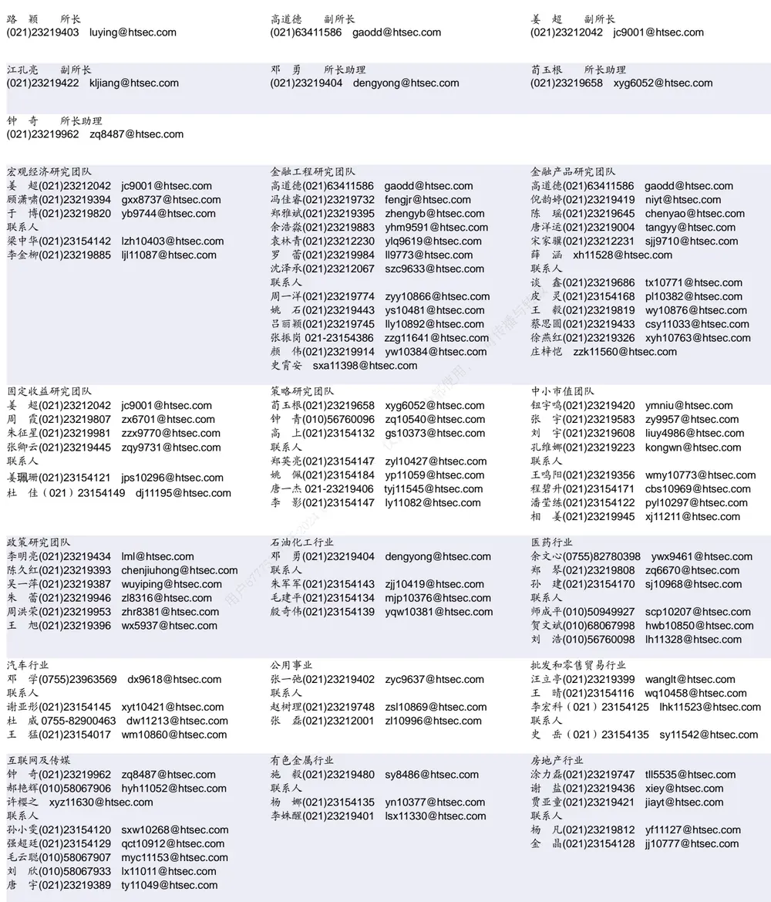

## 相关研究

Table_ReportInfo]《指数分红预测及对期指的影响》

2017.06.18

《FICC系列研究之四——基于协整和

O-U 过程的黄金套利策略》2017.06.18《选股因子系列研究(二十)——基于条件期望的因子择时框架》2017.06.12

分析师:冯佳睿

Tel:(021)23219732

Email:fengjr@htsec.com

证书:S0850512080006

分析师:罗蕾

Tel:(021)23219984

Email:ll9773@htsec.com

证书:S0850516080002

# 选股因子系列研究（二十一）——分析师一致预期相关因子

## 投资要点：

一致预期因子全市场选股效果。一致预期及其环比增长率指标在全市场具有较好的单因子表现，绝大部分因子的 IC均显著异于 0。从覆盖率来看，不同因子的覆盖率有所差异，与一致预期目标价相关的因子覆盖率最低，不足 ；与盈利预测相关的因子覆盖率最高，基本都超过 90%。若采用逐步筛选法精选因子，则在个常见因子和 个一致预期因子中，可筛选出 个常见因子和 个一致预期因子。其中 2个一致预期因子分别是一致预期 PB（统计日收盘价/一致预期净资产）环比增长率和一致预期 PE（统计日收盘价/一致预期每股收益），它们与股票收益都呈现显著的负相关关系。

- 行业覆盖率。从行业覆盖率来看，一致预期因子覆盖率最高的是银行、国防军工、非银金融等偏大盘的行业，这些行业绝大部分一致预期因子的覆盖率均超过90%；覆盖率最低的是综合行业，平均覆盖率为 70%左右。

各行业有效的一致预期因子数。在股票数量比较多的行业，例如机械、医药、电子元器件等，有效的一致预期因子数目明显多于其他行业；而股票数目比较少的行业，例如煤炭、综合、国防军工等，有效的一致预期因子数目相对较少。

一致预期因子在行业间的有效性。从因子有效性来看，一致预期 、 、及其环比增长率因子在绝大部分行业均具有显著的选股效果；除此之外，一致预期 Nprofit_growth 平均 IC 也显著异于 0。值得注意的是，目标收益因子 IC 均值及显著性都很高，但该因子覆盖率很低。

- 部分一致预期因子在银行和非银金融行业具有突出表现。常见的选股因子，如市值、反转等，在银行和非银金融行业中没有显著的选股效果，而部分一致预期因子在这两个行业中则表现突出。其中，银行行业 C 因子月均 C超过（绝对值），而非银金融行业有效的因子则为 Con_PE_rel 和 Con_PEG。利用这几个有效因子对银行和非银金融行业进行选股，可获得稳定的超额收益。

- 风险提示。市场环境变动、投资者行为偏好改变、朝阳永续数据结构变化等会对因子表现产生较大影响。

本文尝试对朝阳永续数据库中一致预期相关因子进行系统全面的分析，主要考察了一致预期及其环比增长率指标在全市场的表现情况，并采用逐步筛选法获得每个行业有效的 alpha 因子。统计结果表明，A 股常见的因子在银行和非银金融行业中并没有显著的区分效果，而部分一致预期因子则效果显著，因此报告最后一部分对这两个行业的选股效果进行了具体展示。

## 1. 一致预期相关因子及其计算方式

分析师报告主要包括 3类指标：盈利预测、目标价以及评级；其中，盈利预测数据包括预测净利润、EPS及其衍生指标。具体来看，本文考察的一致预期基本指标主要如下表所示：

表 1 一致预期相关因子定义

| 因子简称 | 因子定义 |
| --- | --- |
| Con_EPS | 一致预期每股收益 |
| Con_Nprofit | 一致预期净利润 |
| Con_DesP | 一致预期目标价 |
| Con_score | 一致预期评级 |
| Con_Nprofit_growth | 一致预期净利润同比增长率 |
| Con_growth_rate | 2年复合增长率：SQRT(t2¹期一致预期净利润/t0 期实际净利润)-1 |
| Con_PB | 一致预期PB：统计日收盘价/一致预期净资产 |
| Con_PE | 一致预期 PE：统计日收盘价/一致预期 EPS |
| Con_PEG | 一致预期 PE/G:一致预期 PE/(2年复合增长率) |
| Con_ROE | 一致预期净利润/一致预期净资产 |

资料来源：朝阳永续，海通证券研究所
注：1.t0期代表截止统计日已公布年报的年度；t2代表 t0年的后两年

下文中，我们主要考察两类指标对股票收益率的预测能力：因子绝对大小、以及因子环比增长率。后文的表述中，简称后缀为”_rel”的因子即为环比增长率指标。例如，Con_EPS_rel 表示 Con_EPS环比增长率，即本月一致预期 EPS/前一个月一致预期EPS-1

## 2. 全市场选股效果

## 2.1 一致预期原始因子选股效果

表 2、表 3 列举了一致预期及其环比增长率因子的分组收益统计结果，样本空间为2010 年 1 月至 2017 年 5 月。其中，低（高）因子组合是指全市场股票按照因子值从低到高排序，因子值最低（高）的 1/10 股票构成的等权组合。

表 2 一致预期因子全市场分组收益统计

| 因子 | 低因子组合 |  | 高因子组合 |  | IC值 |  | 低、高因子组合收益差 |  |  | 换手率 | 覆盖率 |
| --- | --- | --- | --- | --- | --- | --- | --- | --- | --- | --- | --- |
|  | 月均超 额1 | 月胜率 | 月均超 额 | 胜率 | T统计 IC 均值 | 量 | 月均收 益差 | 月胜率 | T统计 量 |  |  |
| Con_EPS | -0.17% | 50.56% | -0.13% | 43.82% | 0.93% | 0.74 | -0.04% | 53.93% | -0.10 | 77.87% | 92.38% |
| Con_growth_rate | -0.60% | 37.08% | 0.26% | 58.43% | 1.96% | 1.82 | -0.86% | 35.96% | -2.73 | 74.88% | 85.53% |
| Con_Nprofit | 0.25% | 55.06% | -0.68% | 40.45% | -2.50% | -1.32 | 0.93% | 61.80% | 1.30 | 77.77% | 92.38% |
| Con_Nprofit_growth | -0.63% | 33.71% | 0.28% | 55.06% | 2.33% | 2.73 | -0.91% | 29.21% | -3.27 | 73.18% | 92.38% |
| Con_PB | 0.03% | 49.44% | -0.41% | 44.94% | -3.59% | -1.88 | 0.44% | 51.69% | 0.58 | 84.58% | 92.38% |
| Con_PE | 0.19% | 51.69% | -0.53% | 41.57% | -3.13% | -1.97 | 0.72% | 57.30% | 1.36 | 77.44% | 92.38% |
| Con_PEG | 0.54% | 64.04% | -0.62% | 34.83% | -4.28% | -5.31 | 1.17% | 67.42% | 5.46 | 75.09% | 78.22% |
| Con_ROE | -0.06% | 50.56% | -0.01% | 53.93% | 0.73% | 0.78 | -0.04% | 50.56% | -0.14 | 78.10% | 92.38% |
| Con_RR² | -0.96% | 34.83% | 0.66% | 58.43% | 5.71% | 4.50 | -1.61% | 33.71% | -3.21 | 40.40% | 46.11% |
| Con_score | -0.45% | 44.94% | 0.48% | 62.92% | 2.40% | 2.49 | -0.93% | 40.45% | -2.28 | 62.19% | 69.02% |

资料来源：朝阳永续， ，海通证券研究所
注： 月均超额为组合收益相对于全市场等权组合的月均超额收益率；
2. Con_RR为目标收益，即目标价/当前股价-1。

如表 2所示，从 IC表现来看，全市场选股效果显著的一致预期因子主要有Con_Nprofit_growth、Con_PE、Con_PEG、Con_RR 和 Con_score。其中，目标收益Con_RR 因子的效果最优，IC 均值为 5.71%，多空收益差为 1.61%；但需要注意的是，该因子覆盖率很低，仅为 46.1%。

从表 和表 的对比结果可看出，环比增长率具有比原始因子更好的选股效果：从IC 序列的统计结果来看，除 Con_DesP_rel因子不显著外，其余因子在 1%的臵信水平下均显著不为 0。这可能是由于环比增长率因子反映了卖方分析师对公司未来价值看法的变化，是当月新增的信息，比公司原始的基本面预测指标更能吸引投资者注意力。

一致预期估值因子环比增长率指标的选股效果最强， Con_PB_rel 和 Con_PE_rel的 IC 均值分别为-6.09%和-6.59%，多空收益差分别为 1.55%和 1.73%。我们以为例，可通过其构建方法来分析估值环比增长率的含义。按照定义，Con_PE_rel 计算公式如下所示：

$$
Con\_PE\_rel_{t}=\frac{Con\_PE_{t}}{Con\_PE_{t-1}}-1=\frac{P_{t}/Con\_EPS_{t}}{P_{t-1}/Con\_EPS_{t-1}}-1=\frac{P_{t}/P_{t-1}}{Con\_EPS_{t}/Con\_EPS_{t-1}}-1
$$

其中，Con_EPS反应分析师对股票的估价，Con_EPS增加表明分析师对公司的估价上升。若是估价下降而同时期的股价上升（或下降幅度不如估价），表明市场价格相对于分析师预期存在偏差，后期可能会出现价格修复，导致股价下降。因此 Con_PE_rel 越高，市场价格上涨幅度超过分析师估价上涨幅度越大（或市场价格下跌幅度不如分析师估价下跌幅度），后期股价下跌的可能性越大。

表 3 一致预期环比增长率因子全市场分组收益统计

| 因子 | 低因子组合 |  | 高因子组合 |  | IC值 |  | 低、高因子组合收益差 |  |  | 换手率 | 覆盖率 |
| --- | --- | --- | --- | --- | --- | --- | --- | --- | --- | --- | --- |
|  | 月均超 额 | 月胜率 | 月均超 额 | 胜率 | IC 均值 | T统计 量 | 月均收 益差 | 月胜率 | T统计 量 |  |  |
| Con_EPS_rel | -0.29% | 43.82% | 0.39% | 62.92% | 2.23% | 4.33 | -0.69% | 38.20% | -3.03 | 12.05% | 91.58% |
| Con_growth_rate_rel | -0.64% | 26.97% | 0.20% | 56.18% | 1.57% | 3.76 | -0.84% | 28.09% | -4.64 | 14.26% | 84.38% |
| Con_Nprofit_rel | -0.51% | 34.83% | 0.42% | 64.04% | 2.30% | 4.49 | -0.93% | 30.34% | -4.01 | 14.14% | 91.58% |
| Con_Nprofit_growth_rel | -0.66% | 31.46% | 0.27% | 58.43% | 2.42% | 4.98 | -0.93% | 30.34% | -4.95 | 15.88% | 91.58% |
| Con_PB_rel | 0.25% | 44.94% | -1.30% | 30.34% | -6.09% | -4.35 | 1.55% | 60.67% | 3.04 | 8.74% | 91.58% |
| Con_PE_rel | 0.55% | 61.80% | -1.17% | 21.35% | -6.59% | -5.85 | 1.73% | 71.91% | 4.70 | 10.22% | 91.58% |
| Con_PEG_rel | 0.49% | 61.80% | -0.97% | 20.22% | -5.47% | -6.03 | 1.46% | 79.78% | 4.87 | 8.84% | 76.33% |
| Con_ROE_rel | -0.51% | 37.08% | 0.40% | 64.04% | 2.34% | 4.55 | -0.91% | 39.33% | -4.29 | 13.72% | 91.58% |
| Con_DesP_rel | -0.05% | 44.94% | 0.24% | 58.43% | 0.82% | 1.25 | -0.30% | 43.82% | -1.16 | 7.28% | 41.44% |
| Con_score_rel | -0.28% | 34.83% | 0.30% | 60.67% | 1.26% | 3.51 | -0.58% | 30.34% | -3.84 | 6.58% | 65.29% |

资料来源：朝阳永续，Wind，海通证券研究所

## 2.2 一致预期正交因子选股效果

需要注意的一点是，上述结果是原始因子的分组效果，而这些原始因子可能与已存因子具有较强的相关性，从而导致风格偏离，出现与经验不一致的结果。例如，从表 2的统计结果可发现，Con_Nprofit 越小，其后期收益表现越强，即投资者偏向于买入一致预期净利润小的公司，这显然与投资经验不符。通过分析可发现，Con_Nprofit 与市值存在明显的相关性，两者相关系数高达 42.8%，即市值越小的公司，一致预期净利润越小，而在过去小盘股表现明显强于大盘股，从而导致一致预期净利润越小的公司其收益越高。因此，为更直接地考察一致预期因子的选股效果，我们需剥离其他因子。

下面我们对一致预期及其环比增长率进行正交化处理（详细处理细节可参考专题报告《选股因子系列研究（十七）——选股因子的正交》），对剔除了市值、反转、换手、波动率、PB影响后的因子进行了回测，结果分别列于表 4 和表 5。

统计结果显示，正交后的一致预期因子选股效果比原始因子有很大提升，绝大部分因子 IC均值均超过 2%，统计显著。特别地，正交后的 Con_Nprofit 月均多空收益差达2.29%，相应的 IC均值为 7.06%，月胜率 71%，具有非常稳定的选股效果。

相较而言，一致预期环比增长率因子正交之后的效果大幅下降。例如，效果显著的Con_PE_rel因子在正交之后 IC 下降为 1.96%。这主要是由于该因子与反转因子相关性较强，因此在剔除反转因子后，选股效果大幅减弱。正交后选股效果仍然显著的有Con_EPS_rel、Con_Nprofit_rel、Con_Nprofit_growth_rel、Con_PEG_rel、Con_DesPrice_rel 以及 Con_score_rel。

表 4 一致预期正交因子全市场分组收益统计

| 因子 | 低因子组合 |  | 高因子组合 |  | IC 值 |  | 低、高因子组合收益差 |  |  | 换手率 |
| --- | --- | --- | --- | --- | --- | --- | --- | --- | --- | --- |
|  | 月均超额 | 月胜率 | 月均超额 | 胜率 | IC 均值 | T统计量 | 月均收益 差 | 月胜率 | T统计量 |  |
| Con_EPS | -0.81% | 34.83% | 0.17% | 56.18% | 4.36% | 4.22 | -0.97% | 39.33% | -2.67 | 72.48% |
| Con_growth_rate | -0.48% | 44.94% | 0.18% | 59.55% | 2.38% | 3.67 | -0.66% | 40.45% | -3.77 | 53.04% |
| Con_Nprofit | -1.04% | 35.96% | 1.25% | 80.90% | 7.06% | 4.56 | -2.29% | 29.21% | -3.92 | 78.54% |
| Con_Nprofit_growth | -0.43% | 41.57% | 0.23% | 58.43% | 2.50% | 2.22 | -0.67% | 40.45% | -2.02 | 39.80% |
| Con_PB | -0.63% | 46.07% | -0.40% | 43.82% | 1.17% | 0.89 | -0.23% | 49.44% | -0.49 | 37.36% |
| Con_PE | 0.15% | 53.93% | -0.42% | 42.70% | -3.35% | -3.66 | 0.58% | 64.04% | 2.65 | 41.36% |
| Con_PEG | 0.46% | 59.55% | -0.74% | 30.34% | -4.05% | -3.78 | 1.20% | 65.17% | 3.04 | 29.75% |
| Con_ROE | -0.66% | 29.21% | 0.16% | 56.18% | 3.41% | 4.06 | -0.82% | 37.08% | -2.89 | 61.54% |
| Con_RR | -0.45% | 38.20% | 0.45% | 57.30% | 3.10% | 4.00 | -0.89% | 34.83% | -3.12 | 42.98% |
| Con_score | -0.52% | 35.96% | 0.67% | 67.42% | 3.60% | 4.32 | -1.19% | 30.34% | -3.59 | 52.73% |

资料来源：朝阳永续， ，海通证券研究所

表 5 一致预期环比增长率正交因子全市场分组收益统计

| 因子 | 低因子组合 |  | 高因子组合 |  | IC 值 |  | 低、高因子组合收益差 |  |  | 换手率 |
| --- | --- | --- | --- | --- | --- | --- | --- | --- | --- | --- |
|  | 月均超额 | 月胜率 | 月均超额 | 胜率 | IC 均值 | T统计量 | 月均收益 差 | 月胜率 | T统计量 |  |
| Con_EPS_rel | -0.54% | 39.33% | 0.10% | 51.69% | 2.71% | 2.67 | -0.65% | 40.45% | -2.41 | 11.36% |
| Con_growth_rate_rel | -0.44% | 38.20% | -0.13% | 43.82% | 0.68% | 0.61 | -0.31% | 37.08% | -0.88 | 11.69% |
| Con_Nprofit_rel | -0.74% | 29.21% | 0.25% | 55.06% | 3.72% | 3.50 | -0.99% | 37.08% | -3.70 | 12.71% |
| Con_Nprofit_growth_rel | -0.41% | 30.34% | -0.03% | 50.56% | 2.27% | 2.19 | -0.38% | 39.33% | -1.28 | 13.96% |
| Con_PB_rel | -0.08% | 55.06% | -0.44% | 32.58% | -0.44% | -0.53 | 0.36% | 57.30% | 1.58 | 12.22% |
| Con_PE_rel | -0.06% | 55.06% | -0.57% | 28.09% | -1.96% | -1.85 | 0.51% | 62.92% | 1.97 | 13.66% |
| Con_PEG_rel | 0.03% | 49.44% | -0.57% | 35.96% | -1.86% | -2.03 | 0.60% | 59.55% | 2.04 | 9.23% |
| Con_ROE_rel | -0.77% | 30.34% | 0.30% | 57.30% | 3.61% | 3.31 | -1.08% | 32.58% | -3.90 | 12.20% |
| Con_DesP_rel | -0.32% | 43.82% | 0.21% | 56.18% | 2.74% | 5.00 | -0.53% | 43.82% | -2.45 | 6.39% |
| Con_score_rel | -0.31% | 38.20% | 0.24% | 58.43% | 1.89% | 4.96 | -0.55% | 30.34% | -4.14 | 6.59% |

资料来源：朝阳永续，Wind，海通证券研究所

## 2.3 逐步筛选法

为考察在一致预期相关因子在全市场选股的新增信息，我们采用逐步筛选法来筛选全市场有效的 alpha 因子。我们的备选因子库包含市值（Cap）、反转（Pret）、换手率

（Turn）、波动率（Resvol）、估值（PB）、市值平方（ $(Cap\land2)$ ）6 个常见的选股因子，以及前文提到的 20 个一致预期及其环比增长率因子。

在逐步筛选之前，我们先剔除备选因子库中 IC 不足 2%，或 IC 不显著的因子。假设剩余 K个备选因子 $\mathbf{F}_{\mathbf{k}}(\mathbf{k}=1,\ldots\ldots,\mathbf{K})$ ，我们已从中筛选出 m 个因子（初始时 m=0），称为“已选因子”，记之为 $\mathsf{Fs_{1},}\mathsf{Fs_{2},\dots,\quad Fs_{m}}.$ 。则第 m+1 步筛选过程为：

（1）将每一个备选因子 $\mathbf{F}_{\mathsf{k}}(\mathsf{k}=1,\ldots,\mathsf{K})$ 和已选因子 $(\mathrm{~Fs_{1},Fs_{2},~\dots,~Fs_{m}~})$ 作为自变量，以下期股票收益率为因变量，进行 Fama-MacBeth回归：

$$
R_{i,t+1}=c_{t}+\sum_{j=1}^{m}\pmb{f}_{t}\cdot\pmb{F}_{s_{j},t}+\theta_{k,t}\cdot\pmb{F}_{k}+\varepsilon_{i,t},
$$

其中，R 为横截面上各股票的收益率，F为股票在各因子上的暴露，f和 θ为需要回归的因子溢价。

（2）求得每个备选因子溢价 $\cdot\theta_{s_{j}}$ 的显著性，以及每个月横截面回归拟合优度平均值；

（3）选取因子溢价显著且平均拟合优度最大的因子，假设为 $F_{s_{n}}$ ，将该因子添加至已选因子列表中，并将该因子从备选因子中剔除；

（4）重复步骤（1）-（3），直至所有因子的溢价均不显著。

需要注意的是，上述筛选过程中，我们对因子进行 Fama-MachBeth 回归之前，都进行了逐步正交处理。

下图展示了在因子筛选过程中逐步添加新因子后，模型平均拟合优度的变动过程。在 6 个常见因子以及 20 个一致预期因子中，一共筛选出 7 个因子，包括 4 个常见因子和 3 个一致预期因子。它们分别是 Cap、Turn、Con_PB_rel、Resvol、Cap^2、Con_PEG以及 Con_ROE_rel。包含上述 7 个因子的模型拟合优度均值为 7.72%，这主要是由于我们的回归模型中不包含行业和估值因素。若是控制行业因素并在模型中加入 PB因子，模型拟合优度将会得到提升。

图1 逐步筛选过程中拟合优度均值的变化

资料来源：朝阳永续，Wind，海通证券研究所

表 6 全市场七因子模型横截面回归结果

|  | Cap | Turn | Con_PB_rel | Resvol | Cap.^2 | Con_PEG | Con_ROE_rel |
| --- | --- | --- | --- | --- | --- | --- | --- |
| 系数 | -0.64% | -0.64% | -0.40% | -0.35% | 0.39% | -0.14% | 0.14% |
| T统计量 | -2.81 | -3.69 | -3.12 | -3.15 | 4.79 | -5.27 | 3.22 |
| p值 | 0.61% | 0.04% | 0.24% | 0.22% | 0.00% | 0.00% | 0.18% |

资料来源：朝阳永续，Wind，海通证券研究所

需要注意的是，由于 Con_PEG 覆盖率较低，因此上述 7 因子模型在全市场的覆盖率仅为 80%左右。出于覆盖率考虑，我们剔除覆盖率较低的 Con_PEG、Con_PEG_rel、C 、C 因子，重新进行逐步筛选。最终得到的模型包含 个因子，分别是 Cap、Turn、Con_PB_rel、Resvol、Cap^2 以及 Con_PE，拟合优度平均值为，略低于前述 因子模型。具体回归结果列于下表。

表 7 全市场六因子模型横截面回归结果

|  | Cap | Turn | Con_PB_rel | Resvol | Cap.^2 | Con_PE | R^2 |
| --- | --- | --- | --- | --- | --- | --- | --- |
| 系数 | -0.66% | -0.65% | -0.37% | -0.34% | 0.40% | -0.11% | 7.49% |
| T统计量 | -2.92 | -3.77 | -3.13 | -3.11 | 5.06 | -3.08 |  |
| p值 | 0.44% | 0.03% | 0.24% | 0.25% | 0.00% | 0.28% |  |

资料来源：朝阳永续， ，海通证券研究所

从回归结果来看，Con_PB_rel与股票收益呈现负相关关系，即 Con_PB_rel越高，后期股票收益表现越差。该因子所代表的含义前文已有所阐述，本节不再赘述。Con_PE与股票收益也呈现显著的负相关关系，即 Con_PE越低，后期股票收益表现越优。从指标构建公式来看，Con_PE 是当前股价除以一致预期 EPS，因此该指标越低，反映相比于当前股价，一致预期 EPS越高，分析师对公司越看好，股价上升的可能性也越大。

总结来看，一致预期及其环比增长率指标在全市场具有较好的单因子表现，绝大部分因子的 IC 均显著异于 0。从覆盖率来看，不同因子的覆盖率有所差异，与一致预期目标价相关的因子覆盖率最低，不足 ；与盈利预测相关的因子覆盖率最高，基本都超过 90%。若采用逐步筛选法精选因子，则在 6 个常见因子和 20 个一致预期因子中，可筛选出 4 个常见因子和 2 个一致预期因子。其中 2 个一致预期因子分别是 Con_PB_rel和 Con_PE，它们与股票收益都呈现显著的负相关关系。

## 3. 因子在行业间的有效性分析

不同行业对分析师报告的依赖程度有所不同，例如公司数量多、收益分化度大的行业，投资者在进行投资时会更加依赖于分析师的调研、分析信息，因此一致预期因子在这些行业或许更为有效。本节主要对一致预期及其环比增长率因子在行业间的有效性进行分析。

我们在各行业筛选 IC显著不为 0，且 IC绝对值大于 2%的一致预期及其环比增长率因子，结果分别列于图 2 和图 3（具体的 IC值及覆盖率数据列于附录表 12和表 13）。统计结果显示：

（1） 一致预期目标价行业覆盖率最低，各行业月度平均覆盖率低于 50%。覆盖率较低的指标其次为一致预期评级和 PEG 相关因子，它们的平均覆盖率均不足 80%。其余一致预期相关因子的覆盖率较高，绝大部分均超过 90%。

（2） 分行业来看，一致预期因子覆盖率最高的是银行、国防军工、非银金融等偏大盘的行业，这些行业绝大部分一致预期因子的覆盖率均超过 90%；覆盖率最低的是综合行业，平均覆盖率为 70%左右。

（3） 在股票数目比较多的行业，例如机械、医药、电子元器件等，有效的一致预期因子数目明显多于其他行业；而股票数目比较少的行业，例如煤炭、综合、国防军工等，有效的一致预期因子数目相对较少。

（4） 从因子有效性来看，一致预期 PB、PE、PEG 及其环比增长率因子在绝大部分行业均具有显著的选股效果；除此之外，一致预期 Nprofit_growth 平均 IC 也显著不为 0。值得注意的是，目标收益（Con_RR）因子 IC均值及显著性都很高，但该因子覆盖率很低。

图2 各行业有效的一致预期因子

| 行业 | EPS | growth_rate | Nprofit | Nprofit_growth | PB | PE | PEG | ROE | RR | Score |
| --- | --- | --- | --- | --- | --- | --- | --- | --- | --- | --- |
| 石油石化 |  |  |  |  |  |  |  |  | 1 |  |
| 煤炭 |  |  |  | 2 |  |  |  |  | 2 |  |
| 有色金属 |  |  |  |  | 3 |  | 3 |  | 3 |  |
| 电力及公用事业 |  |  |  |  |  |  | 4 |  | 4 |  |
| 钢铁 | 5 |  |  | 5 |  | 5 |  | 5 | 5 |  |
| 基础化工 |  | 6 |  |  | 6 |  | 6 |  | 6 |  |
| 建筑 |  |  |  |  |  |  |  |  |  |  |
| 建材 |  |  |  |  |  |  |  |  |  |  |
| 轻工制造 |  |  |  |  |  | 9 9 |  |  | 9 |  |
| 机械 |  | 10 |  | 10 | 10 | 10 | 10 |  | 10 | 10 |
| 电力设备 |  |  |  |  | 11 | 11 | 11 |  | 11 |  |
| 国防军工 |  |  |  |  | 12 |  |  |  | 12 |  |
| 汽车 |  |  |  |  | 13 |  | 13 |  |  |  |
| 商贸零售 |  |  |  |  | 14 |  |  |  |  |  |
| 餐饮旅游 |  |  |  |  | 15 |  | 15 |  | 15 |  |
| 家电 |  |  |  |  |  | 16 | 16 |  | 16 |  |
| 纺织服装 |  |  |  |  | 17 |  |  |  | 17 |  |
| 医药 |  |  |  |  |  |  | 18 |  | 18 |  |
| 食品饮料 |  |  |  |  | 19 |  | 19 |  | 19 |  |
| 农林牧渔 |  |  |  |  | 20 | 20 | 20 |  | 20 |  |
| 银行 |  |  |  |  |  | 21 |  |  |  |  |
| 非银行金融 |  |  |  |  | 22 | 22 | 22 |  | 22 |  |
| 房地产 |  |  |  |  | 23 |  | 23 |  | 23 |  |
| 交通运输 |  |  |  |  | 24 | 24 | 24 |  | 24 |  |
| 电子元器件 |  |  |  | 25 | 25 | 25 | 25 | 25 | 25 |  |
| 通信 |  |  |  |  | 26 |  | 26 |  | 26 |  |
| 计算机 |  |  |  | 27 | 27 | 27 | 27 |  | 27 | 27 |
| 传媒 |  |  |  |  |  |  | 28 |  | 28 |  |
| 综合 |  |  |  |  |  |  |  |  |  |  |

注：1.上述因子均为一致预期因子，为了便于表述，省略了前缀“Con_”；例如，EPS即为一致预期 EPS（Con_EPS）；表中标记数字代表图形列所对应的因子在行所对应的行业中显著有效，其中数字为该行业所处的行。
资料来源：朝阳永续，Wind，海通证券研究所

图3 各行业有效的一致预期环比增长率因子

| 行业 | EPS_rel | growth_rate_rel | Nprofit_rel | Nprofit_growth_rel | PB_rel | PE_rel PEG_rel |  | ROE_rel | DesP_rel | Score_rel |
| --- | --- | --- | --- | --- | --- | --- | --- | --- | --- | --- |
| 石油石化 | 1 |  |  |  | 1 | 1 | 1 |  |  |  |
| 煤炭 |  |  |  |  | 2 |  |  |  |  |  |
| 有色金属 |  | 3 |  |  | 3 | 3 | 3 |  |  |  |
| 电力及公用事业 |  |  |  |  | 4 | 4 | 4 |  |  |  |
| 钢铁 |  |  |  | 5 | 5 | 5 | 5 |  |  | 5 |
| 基础化工 |  |  |  | 6 | 6 | 6 | 6 |  |  |  |
| 建筑 | 7 |  | 7 |  | 7 | 7 | 7 | 7 |  |  |
| 建材 |  |  |  |  | 8 | 8 | 8 |  |  |  |
| 轻工制造 |  |  |  |  | 9 | 9 | 9 | 9 |  | 9 |
| 机械 |  |  | 10 | 10 | 10 | 10 | 10 | 10 |  |  |
| 电力设备 |  |  | 11 | 11 | 11 | 11 | 11 |  |  |  |
| 国防军工 |  |  |  |  |  | 12 |  |  |  |  |
| 汽车 | 13 | 13 | 13 | 13 | 13 | 13 | 13 | 13 |  |  |
| 商贸零售 |  |  |  |  | 14 | 14 | 14 |  | 14 |  |
| 餐饮旅游 |  |  |  |  | 15 | 15 | 15 |  |  |  |
| 家电 | 16 | 16 | 16 | 16 | 16 | 16 | 16 | 16 |  |  |
| 纺织服装 |  |  |  |  | 17 | 17 |  |  |  |  |
| 医药 | 18 |  | 18 | 18 | 18 | 18 | 18 | 18 |  | 18 |
| 食品饮料 | 19 |  | 19 | 19 |  | 19 |  | 19 |  |  |
| 农林牧渔 |  |  |  | 20 | 20 | 20 | 20 |  |  |  |
| 银行 |  |  | 21 | 21 |  |  |  | 21 |  |  |
| 非银行金融 |  |  |  |  |  | 22 |  |  |  |  |
| 房地产 |  |  | 23 | 23 | 23 | 23 | 23 | 23 |  |  |
| 交通运输 |  |  |  |  | 24 | 24 | 24 |  |  |  |
| 电子元器件 | 25 |  | 25 | 25 | 25 | 25 | 25 | 25 | 25 |  |
| 通信 |  |  | 26 | 26 | 26 | 26 | 26 |  |  |  |
| 计算机 | 27 |  | 27 |  | 27 | 27 | 27 | 27 |  | 27 |
| 传媒 |  |  |  |  | 28 | 28 |  |  |  |  |
| 综合 |  |  |  |  | 29 | 29 |  |  |  |  |

资料来源：朝阳永续，Wind，海通证券研究所
注：1.上述因子均为一致预期环比增长率因子，为了便于表述，省略了前缀“Con_”；例如，EPS_rel即为一致预期 EPS环比增长率（Con_EPS_rel）；表中标记数字代表图形列所对应的因子在行所对应的行业中显著有效，其中数字为该行业所处的行。

为剔除与已存因子的相关性，精选包含新增信息的一致预期因子，我们采用第 部分提到的逐步筛选法来筛选各行业有效的 因子。具体而言，我们的备选因子库包含市值（Cap）、反转（Pret）、换手率（Turn）、波动率（Resvol）、估值（PB）、市值平方（Cap^2）6 个常见的选股因子，以及前文提到的 20 个一致预期相关因子。剔除无效因子后，我们将结果列于图 4。

结果显示，常见的选股因子如 Cap、Turn、Resvol、Cap^2，在绝大部分行业均具有显著的效果； 有效性相对较低，仅在食品饮料行业效果显著。一致预期因子中，以 PEG、PEG_rel、PB_rel、PE_rel 效果最强，入选比例最大。

此外值得一提的是，上述图表结果表明，银行和非银金融行业的有效因子很少，诸如 Cap、Pret 等常见的选股因子在银行和非银金融行业中并没有显著的效果。银行行业筛选出的有效因子只有一致预期PE，该因子在银行行业覆盖率为100%，IC均值逾10%。非银金融行业筛选出的有效因子是一致预期 和一致预期 ，两因子的 均值分别为 和 。在下一节中，我们将对一致预期因子在这两个行业中的投资价值进行具体分析。

图4 逐步筛选后各行业有效的因子列表

|  | 基本因子 |  |  |  |  |  | 一致预期因子 |  |  |  |  |  |  |  |  |  |
| --- | --- | --- | --- | --- | --- | --- | --- | --- | --- | --- | --- | --- | --- | --- | --- | --- |
|  | Cap | Pret | Turn | Resvol | PB | Cap^2 | PEG | PEG_rel | PB_rel | PE_rel | PE g | rowth_rate | ROE | EPS_rel | Nprofit_rel | Nprofit_growth_rel |
| 石油石化 | 1 |  |  |  |  |  |  |  | 1 |  |  |  |  |  |  |  |
| 煤炭 | 2 |  |  | 2 |  | 2 |  |  |  |  |  |  |  |  |  |  |
| 有色金属 | 3 |  |  | 3 |  |  |  | 3 |  |  |  |  |  |  |  |  |
| 电力及公用事业 | 4 |  |  | 4 |  |  | 4 |  |  | 4 |  |  |  |  |  |  |
| 钢铁 | 5 | 5 |  | 5 |  |  |  | 5 |  |  |  |  |  |  |  |  |
| 基础化工 | 6 |  | 6 |  |  | 6 | 6 |  | 6 |  |  | 6 |  |  |  |  |
| 建筑 |  |  |  | 7 |  |  |  |  |  |  |  |  |  |  |  |  |
| 建材 | 8 |  | 8 | 8 |  | 8 |  |  |  |  |  |  |  |  |  |  |
| 轻工制造 | 9 |  |  | 9 |  |  | 9 |  |  |  |  |  |  |  |  |  |
| 机械 | 10 |  | 10 | 10 |  | 10 | 10 |  |  | 10 |  | 10 |  |  |  |  |
| 电力设备 | 11 |  | 11 |  |  |  | 11 |  | 11 |  |  |  |  |  |  |  |
| 国防军工 |  |  |  | 12 |  |  |  |  |  |  |  |  |  |  |  |  |
| 汽车 | 13 |  | 13 | 13 |  | 13 |  | 13 | 13 |  |  |  |  |  |  |  |
| 商贸零售 | 14 | 14 | 14 |  |  | 14 |  |  |  |  |  |  |  |  |  |  |
| 餐饮旅游 | 15 | 15 | 15 |  |  | 15 | 15 |  |  |  |  |  |  |  |  |  |
| 家电 | 16 |  | 16 | 16 |  | 16 |  | 16 |  |  |  |  |  |  |  |  |
| 纺织服装 | 17 | 17 | 17 |  |  | 17 |  |  |  |  |  |  |  |  |  |  |
| 医药 | 18 | 18 | 18 |  |  | 18 |  |  |  |  |  |  |  | 18 |  |  |
| 食品饮料 |  |  | 19 | 19 | 19 |  |  |  |  |  |  |  |  |  |  |  |
| 农林牧渔 | 20 |  | 20 | 20 |  | 20 |  | 20 |  |  | 20 |  |  |  |  |  |
| 银行 |  |  |  |  |  |  |  |  |  |  | 21 |  |  |  |  | 21 |
| 非银行金融 |  |  |  |  |  |  | 22 |  |  | 22 |  |  |  |  |  |  |
| 房地产 | 23 | 23 | 23 |  |  | 23 | 23 |  |  |  |  |  |  |  |  |  |
| 交通运输 |  | 24 |  | 24 |  |  | 24 |  |  |  |  |  |  |  |  |  |
| 电子元器件 | 25 |  | 25 |  |  | 25 |  |  | 25 |  | 25 |  | 25 |  |  |  |
| 通信 | 26 |  | 26 |  |  |  | 26 | 26 |  |  |  |  |  |  |  |  |
| 计算机 | 27 | 27 | 27 | 27 |  |  |  |  |  |  |  |  |  |  | 27 |  |
| 传媒 | 28 |  |  |  |  |  | 28 |  |  |  |  |  |  |  |  |  |
| 综合 | 29 |  |  | 29 |  |  |  |  |  | 29 |  |  |  |  |  |  |

资料来源：朝阳永续， ，海通证券研究所
注：1.一致预期因子部分，所有因子均为一致预期因子，为了便于表述，本图省略了前缀“Con_”；例如，PEG即为一致预期 PEG（Con_PEG）；2.表中标记数字代表图形列所对应的因子在行所对应的行业中显著有效，其中数字为该行业所处的行。

## 4. 一致预期因子在银行和非银金融行业的选股效果

如前所述，一致预期因子在银行和非银金融行业中的选股效果优于其他常见因子，本部分将对有效因子在这两个行业的收益表现进行具体分析。其中，银行行业考察Con_PE 因子，非银金融行业考察 Con_PE_rel 和 Con_PEG 两个因子。基本模型为最大化预期收益模型，即选择预期收益率最高的股票构建多头组合，选择预期收益率最低的股票构建空头组合。

## 4.1 银行业选股效果

扣除交易费用千分之三后的具体选股效果列于下述图表中，从中可看出，Con_PE因子在银行行业的选股效果十分突出，多头相对于空头组合月均超额 1.14%，年化超额15.49%，平均月换手率为 21.65%；多头相对于中信银行指数月均超额 0.50%，年化超额 6.84%。

图5 银行业多头组合相对空头组合收益表现

资料来源：朝阳永续，Wind，海通证券研究所

图6 银行业多头组合相对中信银行指数收益表现

资料来源：朝阳永续，Wind，海通证券研究所

表 8 银行行业整体收益表现

| 指标 | 年化收益 | 月收益差 | 月胜率 | 月最大回撤 | 月最大收益 | 多头换手率 |
| --- | --- | --- | --- | --- | --- | --- |
| 多头-空头 | 15.49% | 1.14% | 52.81% | -7.04% | 13.28% | 21.65% |
| 多头-中信银行指数 | 6.84% | 0.50% | 60.67% | -4.42% | 4.36% |  |

资料来源：朝阳永续，Wind，海通证券研究所

上述统计结果中，多头组合和空头组合均包含 4只股票。为考察选股数目对选股效果的影响，下表展示了选股数目分别为 4、5 以及 N*30%（N 为样本股票数目）时，多空收益差的统计结果。从中可看出在不同的选股数目下，月均多空收益差均显著大于 0。

表 9 选股数目对银行行业收益表现的影响

| 选股数目 | 年化收益 | 月均收益差 | 月胜率 | 月最大回撤 | 月最大收益 | T统计量 |
| --- | --- | --- | --- | --- | --- | --- |
| 4 | 15.49% | 1.14% | 52.81% | -7.04% | 13.28% | 2.73 |
| 5 | 13.19% | 0.97% | 55.06% | -7.14% | 12.44% | 2.50 |
| N1*30% | 16.00% | 1.19% | 52.81% | -7.04% | 13.28% | 2.87 |

资料来源：朝阳永续，Wind，海通证券研究所注：1N代表样本股票数量

## 4.2 非银金融行业选股效果

非银金融行业的具体选股效果列于下述图表中。从中可看出，包含 Con_PE_rel 和Con_PEG 两因子的收益率预测模型在非银金融行业的选股效果十分突出，包含 4 只股票的多头相对于空头组合月均超额 2.26%，年化超额 27.39%，月换手率为 13.56%，月胜率逾 60%。

图7 非银金融行业多头组合相对空头组合收益表现

资料来源：朝阳永续，Wind，海通证券研究所

图8 非银金融行业多头组合相对中信非银金融指数收益表现

资料来源：朝阳永续，Wind，海通证券研究所

表 10非银金融行业整体收益表现

| 指标 | 年化收益 | 月收益差 | 月胜率 | 月最大回撤 | 月最大收益 | 多头换手率 |
| --- | --- | --- | --- | --- | --- | --- |
| 多头-空头 | 27.39% | 2.26% | 61.80% | -13.37% | 20.72% | 13.56% |
| 多头-中信银行指数 | 15.20% | 1.31% | 55.06% | -11.64% | 11.52% |  |

资料来源：朝阳永续， ，海通证券研究所

表 11选股数目对非银金融行业收益表现的影响

| 选股数目 | 年化收益 | 月均收益差 | 月胜率 | 月最大回撤 | 月最大收益 | T统计量 |
| --- | --- | --- | --- | --- | --- | --- |
| 4 | 27.39% | 2.26% | 61.80% | -13.37% | 20.72% | 3.24 |
| 5 | 21.97% | 1.80% | 58.43% | -10.67% | 16.33% | 3.15 |
| N1*30% | 20.31% | 1.74% | 58.43% | -12.26% | 19.54% | 2.91 |

资料来源：朝阳永续， ，海通证券研究所注：1.N代表样本股票数量。

## 5. 总结

均显著异于 0。从覆盖率来看，不同因子的覆盖率有所差异，与一致预期目标价相关的因子覆盖率最低，不足 50%；与盈利预测相关的因子覆盖率最高，基本都超过 90%。若采用逐步筛选法精选因子，则在 6 个常见因子和 20 个一致预期因子中，可筛选出 4 个常见因子和 2个一致预期因子。其中 2 个一致预期因子分别是 Con_PB_rel和 Con_PE，它们与股票收益都呈现显著的负相关关系。

从行业覆盖率来看，一致预期因子覆盖率最高的是银行、国防军工、非银金融等偏大盘的行业，这些行业绝大部分一致预期因子的覆盖率均超过 90%；覆盖率最低的是综合行业，平均覆盖率为 70%左右。

从有效的一致预期因子数目来看，在股票数量比较多的行业，例如机械、医药、电子元器件等，有效的一致预期因子数目明显多于其他行业；而股票数目比较少的行业，例如煤炭、综合、国防军工等，有效的一致预期因子数目相对较少。

从因子有效性来看，一致预期 PB、PE、PEG 及其环比增长率因子在绝大部分行业均具有显著的选股效果；除此之外，一致预期 Nprofit_growth 平均 IC 也显著不为 0。值得注意的是，目标收益因子 IC 均值及显著性都很高，但该因子覆盖率很低。

常见的选股因子，如市值、反转等，在银行和非银金融行业中没有显著的选股效果，而部分一致预期因子在这两个行业中则表现突出。其中，银行行业 Con_PE因子月均 IC超过 10%（绝对值），而非银金融行业有效的因子则为 Con_PE_rel 和 Con_PEG。利用这几个有效因子对银行和非银金融行业进行选股，可获得稳定的超额收益。

## 6. 附录——一致预期因子在行业间的选股效果

表 12一致预期因子在行业间的选股效果

|  | EPS |  | growth rate | Nprofit | Nprofit growth | PB | PE | PEG | ROE | RR | Score |  |
| --- | --- | --- | --- | --- | --- | --- | --- | --- | --- | --- | --- | --- |
| 石油石化 | IC 均值 | -0.58% | 3.02% | -2.51% | 2.59% | -4.16% | -0.76% | -2.45% | -1.50% | 10.83% | 3.08% |  |
|  | T统计量 | -0.25 | 1.53 | -0.84 | 1.10 | -1.54 | -0.28 | -1.16 | -0.65 | 3.75 | 1.13 |  |
|  | 覆盖度 | 93.41% | 86.15% | 93.41% | 93.41% | 93.41% | 89.67% | 76.56% | 93.41% | 53.61% | 70.77% |  |
| 煤炭 | IC 均值 | 1.12% | 0.52% | -2.87% | 4.30% | -4.47% | -4.93% | -4.61% | 1.49% | 5.78% | -1.60% |  |
|  | T统计量 | 0.39 | 0.21 | -0.90 | 2.06 | -1.77 | -1.83 | -1.35 | 0.55 | 2.53 | -0.55 |  |
|  | 覆盖度 | 91.90% | 75.10% | 91.90% | 91.90% | 91.90% | 80.34% | 49.63% | 91.90% | 56.77% | 77.16% |  |
| 有色金属 | IC 均值 | 0.74% | 3.18% | -3.47% | 1.84% | -5.30% | -3.12% | -4.95% | -0.20% | 4.99% | 1.68% |  |
|  | T统计量 | 0.43 | 1.93 | -1.54 | 1.17 | -2.60 | -1.71 | -2.53 | -0.12 | 2.10 | 0.87 |  |
|  | 覆盖度 | 93.16% | 80.01% | 93.16% | 93.16% | 93.16% | 87.43% | 70.44% | 93.16% | 49.35% | 74.89% |  |
| 电力及公 用事业 | IC 均值 T统计量 | 1.71% | 1.60% | -3.49% | 1.63% | -1.92% | -2.04% | -3.96% | 0.07% | 6.75% | 2.15% |  |
|  | 覆盖度 | 0.97 | 0.90 | -1.32 | 0.98 | -0.74 | -0.76 | -2.20 | 0.04 | 3.06 | 1.31 |  |
|  | IC 均值 | 90.46% 5.43% | 85.08% | 90.46% | 90.46% | 90.46% | 87.95% | 76.84% | 90.46% | 42.70% | 68.99% |  |
| 钢铁 | T统计量 |  | 1.84% | -0.82% -0.35 | 4.65% 2.34 | 0.99% | -5.88% | -3.68% | 6.17% | 8.69% | 4.91% |  |
|  | 覆盖度 | 2.30 94.03% | 0.89 |  | 94.03% | 0.29 | -2.77 | -1.45 | 2.42 | 2.94 | 1.96 |  |
|  | IC 均值 | -0.79% | 74.20% | 94.03% -3.38% |  | 94.00% | 82.41% | 62.47% | 94.03% | 44.22% | 80.98% |  |
| 基础化工 | T统计量 |  | 3.31% |  | 1.82% | -3.78% | -2.36% | -3.96% | -0.37% | 4.08% | 1.92% |  |
|  | 覆盖度 | -0.51 88.45% | 3.07 | -1.94 | 1.79 | -2.30 | -1.59 | -3.28 | -0.29 | 2.58 | 1.75 |  |
|  | IC 均值 | 1.52% | 79.10% | 88.45% -2.27% | 88.45% 1.99% | 88.45% | 84.63% | 73.18% | 88.45% | 35.75% | 60.02% |  |
| 建筑 | T统计量 |  | 1.12% |  |  | -2.86% | -2.69% | -2.45% | 0.71% | 2.39% | 2.54% |  |
|  | 覆盖度 | 0.69 95.10% | 0.51 92.08% | -0.82 | 1.01 95.10% | -1.02 | -1.03 | -1.26 | 0.36 | 0.95 | 1.23 |  |
|  | IC 均值 | -0.01% | 0.29% | 95.10% -2.91% | 0.60% | 95.10% | 94.30% | 87.17% | 95.10% | 52.47% | 74.68% |  |
| 建材 | T统计量 | -0.01 |  | -1.11 | 0.32 | -3.44% | -3.42% | -3.39% | -0.08% | 3.61% | 1.68% |  |
|  | 覆盖度 | 91.77% | 0.15 84.20% | 91.77% | 91.77% | -1.47 91.77% | -1.48 88.98% | -1.67 | -0.04 | 1.51 | 0.90 |  |
|  | IC 均值 | 2.08% | 3.07% | -0.14% | 1.04% |  |  | 77.04% | 91.77% | 44.36% | 67.11% |  |
| 轻工制造 | T统计量 |  |  | -0.07 | 0.59 | -3.41% | -5.56% | -6.44% | 2.38% | 9.10% | 1.28% 0.62 |  |
|  | 覆盖度 | 0.99 89.00% | 1.73 |  |  | -1.51 | -2.91 | -3.43 | 1.22 | 3.27 |  |  |
|  | IC 均值 |  | 79.98% | 89.00% | 89.00% | 88.98% | 83.78% | 73.31% | 89.00% | 39.44% | 66.99% |  |
| 机械 | T统计量 | 0.32% | 3.77% | -3.26% | 2.53% | -5.01% | -3.89% | -5.37% | 0.04% | 6.97% | 4.64% |  |
|  | 覆盖度 | 0.21 | 3.46 | -1.92 | 2.53 | -3.06 | -2.98 | -5.01 | 0.03 | 4.19 | 3.68 |  |
|  | IC 均值 | 93.51% | 85.55% | 93.51% | 93.51% | 93.51% | 90.48% | 78.91% | 93.51% | 43.63% | 65.02% |  |
| 电力设备 | T统计量 | 1.78% | 1.60% | -3.46% | 1.67% | -3.72% | -3.79% | -3.51% | 0.94% | 4.83% | 2.49% |  |
|  | 覆盖度 | 1.12 | 1.18 | -1.74 | 1.23 | -2.33 | -2.42 | -2.67 | 0.69 | 2.46 | 1.36 |  |
|  | IC 均值 | 94.07% 1.00% | 88.75% | 94.07% -0.81% | 94.07% | 94.07% | 92.47% -4.43% | 84.54% -4.37% | 94.07% -0.81% | 43.42% 10.79% | 65.57% 0.76% |  |
| 国防军工 | T统计量 | 0.39 | -0.61% -0.24 | -0.31 | -1.93% -0.93 | -6.14% -2.56 |  |  |  |  |  |  |
|  |  | T统计量 覆盖度 | -0.36 97.60% | 0.52 86.83% | -0.86 97.60% | 1.31 97.60% | -2.45 97.60% | -1.20 93.86% | -2.25 78.80% | -0.85 97.60% | 2.16 64.21% | -0.68 84.37% |
|  | 家电 | IC 均值 | 2.37% | -0.51% | -0.56% | 2.65% | -2.93% | -5.86% | -6.74% | 2.99% | 7.68% | 0.28% |
| T统计量 |  | 0.94 | -0.29 | -0.18 | 1.57 | -1.23 | -2.12 | -3.83 | 1.15 | 2.74 | 0.13 |  |
| 覆盖度 |  | 95.78% | 92.16% | 95.78% | 95.78% | 95.78% | 93.51% | 87.58% | 95.78% | 52.77% | 75.52% |  |
| 纺织服装 | IC 均值 | -1.85% | 0.17% | -3.52% | 0.48% | -4.54% | -0.67% | -1.98% | -1.00% | 5.49% | 0.29% |  |
|  | T统计量 | -0.79 | 0.09 | -1.52 | 0.30 | -2.47 | -0.33 | -1.17 | -0.47 | 2.15 | 0.12 |  |
|  | 覆盖度 | 89.82% | 83.54% | 89.82% | 89.82% | 89.80% | 86.97% | 72.56% | 89.80% | 41.27% | 59.79% |  |
| 医药 | IC 均值 | 1.02% | 1.12% | -1.49% | 1.23% | -2.59% | -2.88% | -3.78% | 0.83% | 4.75% | 2.43% |  |
|  | T统计量 | 0.46 | 0.87 | -0.60 | 1.01 | -1.49 | -1.53 | -3.01 | 0.46 | 2.92 | 1.53 |  |
|  | 覆盖度 | 93.72% | 90.03% | 93.72% | 93.72% | 93.72% | 92.63% | 86.18% | 93.72% | 47.37% | 72.15% |  |
| 食品饮料 | IC 均值 | 1.22% | 2.94% | -0.37% | 2.88% | -5.49% | -3.48% | -5.27% | 0.64% | 5.30% | 4.15% |  |
|  | T统计量 | 0.41 | 1.50 | -0.12 | 1.84 | -2.69 | -1.37 | -2.67 | 0.24 | 2.30 | 1.82 |  |
|  | 覆盖度 | 95.35% | 87.47% | 95.35% | 95.35% | 95.35% | 92.69% | 79.92% | 95.35% | 56.86% | 74.21% |  |
| 农林牧渔 | IC 均值 | 0.33% | 2.38% | -2.40% | 1.66% | -6.54% | -3.85% | -5.87% | 0.03% | 9.82% | 1.87% |  |
|  | T统计量 | 0.15 | 1.46 | -1.08 | 1.06 | -4.54 | -2.05 | -3.18 | 0.01 | 4.30 | 0.86 |  |
|  | 覆盖度 | 90.98% | 80.07% | 90.98% | 90.98% | 90.98% | 87.09% | 73.43% | 90.98% | 45.66% | 69.29% |  |
| 银行 | IC 均值 | 1.04% | 4.45% | -2.24% | 4.79% | -6.78% | -10.46% | -7.48% | 4.60% | 3.01% | 0.43% |  |
|  | T统计量 | 0.24 | 1.03 | -0.47 | 1.16 | -1.87 | -2.74 | -1.98 | 1.45 | 0.83 | 0.13 |  |
|  | 覆盖度 | 100.00% | 100.00% | 100.00% | 100.00% | 100.00% | 100.00% | 96.81% | 100.00% | 98.71% | 100.00% |  |
| 非银行金 融 | IC 均值 | 2.46% | 2.95% | 1.42% | 3.62% | -9.47% | -6.47% | -8.15% | -2.18% | 6.14% | 0.53% |  |
|  | T统计量 | 0.72 | 0.97 | 0.38 | 1.28 | -3.34 | -2.01 | -2.37 | -0.83 | 2.06 | 0.16 |  |
|  | 覆盖度 | 97.89% | 95.85% | 97.89% | 97.89% | 97.89% | 97.79% | 75.21% | 97.89% | 80.99% | 95.42% |  |
| 房地产 | IC 均值 | 0.85% | 0.25% | -1.27% | 0.41% | -5.81% | -4.15% | -3.51% | -0.48% | 9.17% | 3.00% |  |
|  | T统计量 | 0.36 | 0.21 | -0.44 | 0.30 | -2.86 | -1.67 | -2.20 | -0.27 | 4.75 | 1.60 |  |
|  | 覆盖度 | 86.33% | 80.55% | 86.33% | 86.33% | 86.33% | 84.33% | 72.78% | 86.33% | 35.00% | 61.15% |  |
| 交通运输 | IC 均值 | 2.93% | 1.26% | 0.25% | 1.55% | -5.91% | -6.20% | -5.11% | 2.49% | 6.67% | 2.96% |  |
|  | T统计量 | 1.57 | 0.70 | 0.08 | 0.96 | -2.26 | -2.48 | -3.21 | 1.47 | 3.41 | 1.57 |  |
|  | 覆盖度 | 96.80% | 92.65% | 96.80% | 96.80% | 96.80% | 94.03% | 80.12% | 96.80% | 49.83% | 74.03% |  |
| 电子元器 件 | IC 均值 | 3.54% | -0.30% | 1.17% | 2.06% | -4.83% | -7.20% | -4.58% | 3.67% | 4.42% | 2.42% |  |
|  | T统计量 | 1.82 | -0.26 | 0.58 | 2.06 | -3.02 | -4.64 | -3.41 | 2.23 | 2.46 | 1.53 |  |
|  | 覆盖度 | 94.23% | 87.07% | 94.23% | 94.23% | 94.22% | 90.82% | 81.84% | 94.23% | 42.21% | 64.37% |  |
| 通信 | IC 均值 | 0.99% | 0.93% | -3.29% | 2.00% | -5.36% | -4.02% | -4.88% | -0.58% | 5.92% | -1.46% |  |
|  | T统计量 | 0.43 | 0.55 | -1.56 | 1.36 | -3.03 | -1.96 | -2.60 | -0.34 | 2.87 | -0.82 |  |
|  | 覆盖度 | 90.24% | 83.08% | 90.24% | 90.24% | 90.24% | 87.12% | 78.11% | 90.24% | 49.86% | 71.62% |  |
| 计算机 | IC 均值 | 1.05% | 2.68% | -1.65% | 4.85% | -4.00% |  |  |  |  |  |  |

资料来源：朝阳永续， ，海通证券研究所
注：表格中的所有因子均为一致预期因子，为书写简便，我们统一省略了因子的前缀“Con_”。例如，EPS代表一致预期 EPS（Con_EPS）。

表 13一致预期环比增长率因子在行业间的选股效果

资料来源：朝阳永续， ，海通证券研究所
注：表格中的所有因子均为一致预期环比增长率因子，为书写简便，我们统一省略了因子的前缀 和后缀 。例如， 代表一致预期 环比增长率（Con_EPS_rel）

## 7. 风险提示

市场环境变动、投资者行为偏好改变、朝阳永续数据结构变化等会对因子表现产生较大影响。

# 信息披露

分析师声明

[Table冯佳睿yst 金融工程研究团队s]

罗蕾金融工程研究团队

本人具有中国证券业协会授予的证券投资咨询执业资格，以勤勉的职业态度，独立、客观地出具本报告。本报告所采用的数据和信息均来自市场公开信息，本人不保证该等信息的准确性或完整性。分析逻辑基于作者的职业理解，清晰准确地反映了作者的研究观点，结论不受任何第三方的授意或影响，特此声明。

## 法律声明

本报告仅供海通证券股份有限公司（以下简称“本公司”）的客户使用。本公司不会因接收人收到本报告而视其为客户。在任何情况下，本报告中的信息或所表述的意见并不构成对任何人的投资建议。在任何情况下，本公司不对任何人因使用本报告中的任何内容所引致的任何损失负任何责任。

本报告所载的资料、意见及推测仅反映本公司于发布本报告当日的判断，本报告所指的证券或投资标的的价格、价值及投资收入可能

市场有风险，投资需谨慎。本报告所载的信息、材料及结论只提供特定客户作参考，不构成投资建议，也没有考虑到个别客户特殊的不投资目标、财务状况或需要。客户应考虑本报告中的任何意见或建议是否符合其特定状况。在法律许可的情况下，海通证券及其所属用，关联机构可能会持有报告中提到的公司所发行的证券并进行交易，还可能为这些公司提供投资银行服务或其他服务。部

本报告仅向特定客户传送，未经海通证券研究所书面授权，本研究报告的任何部分均不得以任何方式制作任何形式的拷贝、复印件或复制品，或再次分发给任何其他人，或以任何侵犯本公司版权的其他方式使用。所有本报告中使用的商标、服务标记及标记均为本公司的商标、服务标记及标记。如欲引用或转载本文内容，务必联络海通证券研究所并获得许可，并需注明出处为海通证券研究所，且不得对本文进行有悖原意的引用和删改。

根据中国证监会核发的经营证券业务许可，海通证券股份有限公司的经营范围包括证券投资咨询业务。1-2

## 海通证券股份有限公司研究所[Table_PeopleInfo]

| 电子行业 cp9808@htsec.com | 煤炭行业 |  |  | 电力设备及新能源行业 |  |
| --- | --- | --- | --- | --- | --- |
| 陈 平(021)23219646 联系人 |  | 吴 杰(021)23154113 李 淼(010)58067998 | wj10521@htsec.com Im10779@htsec.com | 杨 帅(010)58067929 房 青(021)23219692 | ys8979@htsec.com fangq@htsec.com |
| 谢 磊(021)23212214 xl10881@htsec.com |  | 联系人 |  | 徐柏乔(021)32319171 | xbq6583@htsec.com |
| 张天闻 ztw11086@htsec.com 尹 苓(021)23154119 yl11569@htsec.com |  | 戴元灿(021)23154146 | dyc10422@htsec.com | 联系人 曾 彪(021)23154148 | zb10242@htsec.com |
| 基础化工行业 |  | 计算机行业 |  | 张向伟(021)23154141 通信行业 | zxw10402@htsec.com |
| 刘 威(0755)82764281 Iw10053@htsec.com |  |  |  |  |  |
| 刘 强(021)23219733 |  | 郑宏达(021)23219392 | zhd10834@htsec.com | 朱劲松(010)50949926 | zjs10213@htsec.com |
| 联系人 | lq10643@htsec.com | 谢春生(021)23154123 联系人 黄竞晶(021)23154131 | xcs10317@htsec.com | 联系人 庄 宇(010)50949926 | zy11202@htsec.com |
| 刘海荣(021)23154130 Ihr10342@htsec.com |  |  |  |  |  |
|  |  | 杨 林(021)23154174 洪 琳 hl11570@htsec.com 鲁 立 II11383@htsec.com | yl11036@htsec.com |  |  |
| 非银行金融行业 孙 婷(010)50949926 |  |  |  |  |  |
| 何 婷(021)23219634 | st9998@htsec.com ht10515@htsec.com | 虞 楠(021)23219382 张 杨(021)23219442 | yun@htsec.com | 唐 苓(021)23212208 梁 希(021)23219407 | tl9709@htsec.com |
| 联系人 |  | 联系人 | zy9937@htsec.com | 于旭辉(021)23219411 | lx11040@htsec.com yxh10802@htsec.com |
| 夏昌盛(010)56760090 | xcs10800@htsec.com | 童宇(021)23154181 | ty10949@htsec.com | 联系人 马 榕(021)23219431 mr11128@htsec.com |  |
| 李芳洲(021)23154127 Ifz11585@htsec.com |  |  |  |  |  |
| 建筑建材行业 邱友锋(021)23219415 qyf9878@htsec.com | 沈伟杰(021)23219963 | 机械行业 | swj11496@htsec.com | 钢铁行业 |  |
| 冯晨阳(021)23212081 fcy10886@htsec.com |  | 余炜超(021)23219816 | swc11480@htsec.com | 刘彦奇(021)23219391 联系人 | liuyq@htsec.com |
| 钱佳佳(021)23212081 qjj10044@htsec.com |  | 耿 耘(021)23219814 | gy10234@htsec.com | 刘 璇(021)23219197 | lx11212@htsec.com |
| 联系人 周 俊 0755-23963686 | 联系人 | 杨 震(021)23154124 | yz10334@htsec.com |  |  |
| zj11521@htsec.com 建筑工程行业 |  |  |  |  |  |
| 杜市伟 dsw11227@htsec.com | 丁 频(021)23219405 | 农林牧渔行业 | dingpin@htsec.com | 食品饮料行业 闻宏伟(010)58067941 | whw9587@htsec.com |
| 联系人 毕春晖(021)23154114 bch10483@htsec.com | 陈 阳(010)50949923 | 陈雪丽(021)23219164 | cxl9730@htsec.com | 孔梦遥(010)58067998 | kmy10519@htsec.com |
|  | 联系人 |  | cy10867@htsec.com | 成珊(021)23212207 | cs9703@htsec.com |
|  |  | 关 慧(021)23219448 | gh10375@htsec.com |  |  |
| 军工行业 |  | 夏越(021)23212041 | xy11043@htsec.com |  |  |
| 徐志国(010)50949921 xzg9608@htsec.com | 银行行业 |  |  | 社会服务行业 |  |
| 刘 磊(010)50949922 II1322@htsec.com 蒋 俊(021)23154170 jj11200@htsec.com | 联系人 | 林媛媛(0755)23962186 | lyy9184@htsec.com | 李铁生(010)58067934 联系人 | Its10224@htsec.com |
| 联系人 | 林瑾璐 谭敏沂 | ljl11126@htsec.com |  | 陈扬扬(021)23219671 | cyy10636@htsec.com |
| 张恒晅(010)68067998 zhx10170@hstec.com | 用户677753 | tmy10908@htsec.com |  | 顾熹闽 021-23154388 | gxm11214@htsec.com |
| 张宇轩 zyx11631@htsec.com |  |  |  |  |  |
| 家电行业 陈子仪(021)23219244 chenzy@htsec.com |  | 造纸轻工行业 |  |  |  |
|  |  | 曾 知(021)23219810 | zz9612@htsec.com |  |  |
| 联系人 | 联系人 |  |  |  |  |
| 李阳 ly11194@htsec.com |  | 朱 悦(021)23154173 | zy11048@htsec.com |  |  |
| 朱默辰 zmc11316@htsec.com |  | 赵 洋(021)23154126 | zy10340@htsec.com |  |  |

## 研究所销售团队

海通证券股份有限公司研究所

网址：www.htsec.com

电话：（021）23219000

| 深广地区销售团队 |  | 上海地区销售团队 |  | 北京地区销售团队 |
| --- | --- | --- | --- | --- |
| 蔡铁清(0755)82775962 伏财勇(0755)23607963 | ctq5979@htsec.com | 胡雪梅(021)23219385 | huxm@htsec.com | 殷怡琦(010)58067988 yyq9989@htsec.com |
| 辜丽娟(0755)83253022 | fcy7498@htsec.com | 朱 健(021)23219592 | zhuj@htsec.com | 张 明zm11248@htsec.com |
|  | gulj@htsec.com | 黄 毓(021)23219410 | huangyu@htsec.com | 吴 尹 wy11291@htsec.com |
| 刘晶晶(0755)83255933 | liujj4900@htsec.com | 季唯佳(021)23219384 | jiwj@htsec.com | 张丽萱(010)58067931 zlx11191@htsec.com |
| 王雅清(0755)83254133 | wyq10541@htsec.com | 漆冠男(021)23219281 | qgn10768@htsec.com | 陈铮茹 czr11538@htsec.com |
| 饶 伟(0755)82775282 | rw10588@htsec.com | 胡宇欣(021)23154192 | hyx10493@htsec.com | 陆铂锡 Ibx11184@htsec.com |
| 欧阳梦楚(0755)23617160 |  | 黄 诚(021)23219397 | hc10482@htsec.com | 杨羽莎(010)58067977 yys10962@htsec.com |
| oymc11039@htsec.com 巩柏含 gbh11537@htsec.com |  | 蒋 炯 jj10873@htsec.com 毛文英(021)23219373 mwy10474@htsec.com |  |  |

传真：（021）23219392

地址：上海市黄浦区广东路 689号海通证券大厦 9楼