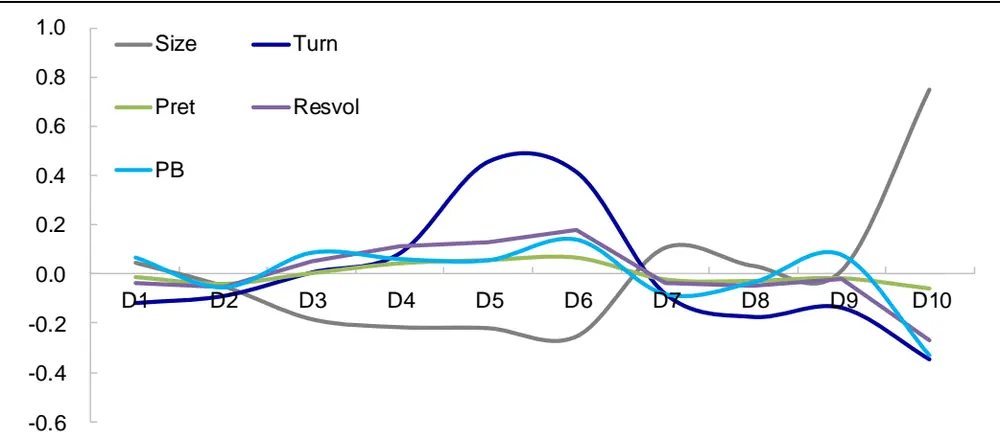
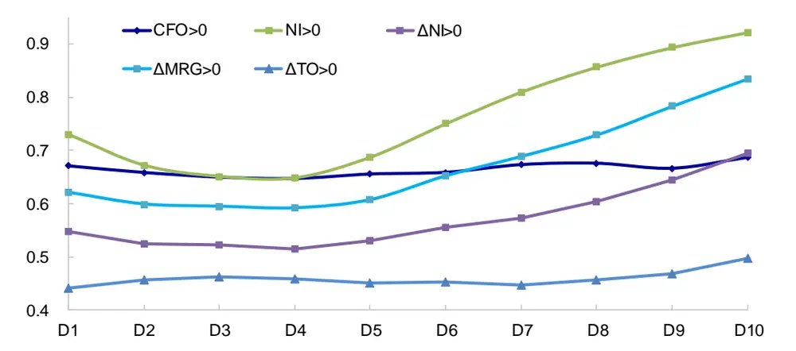
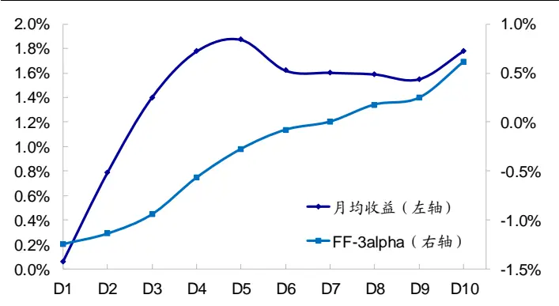
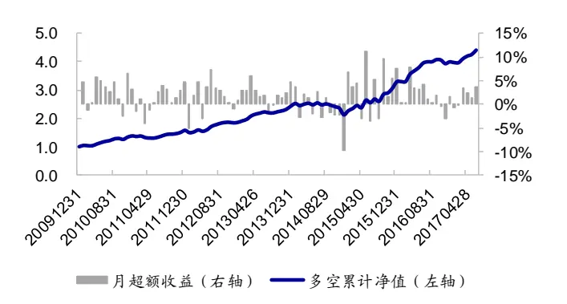
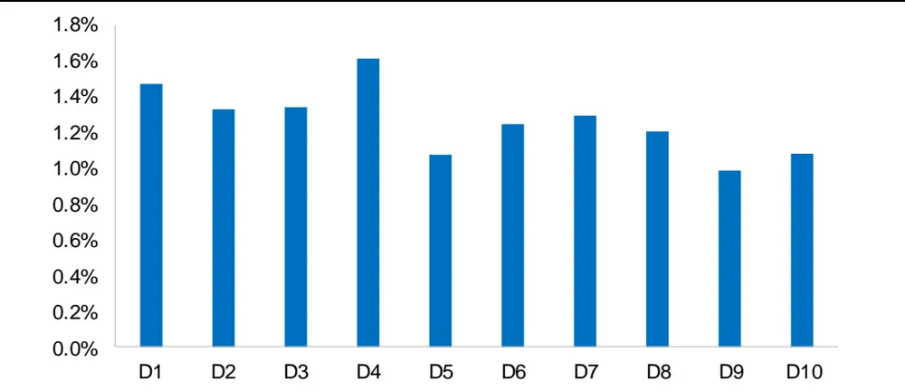
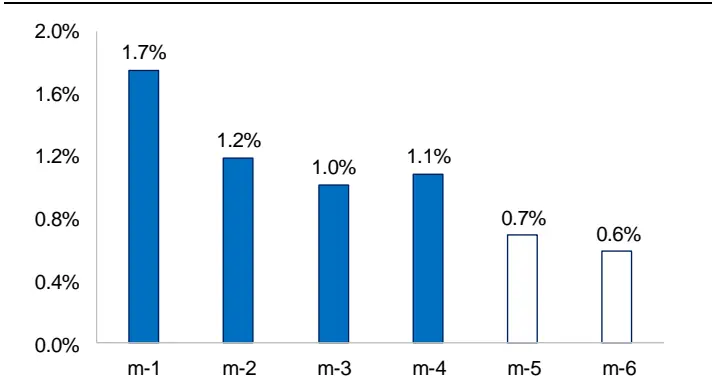
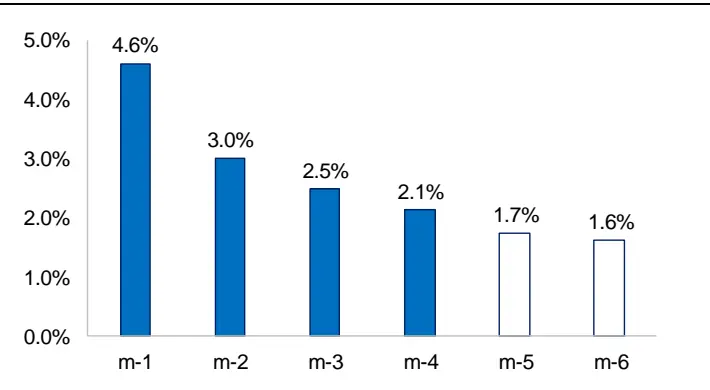
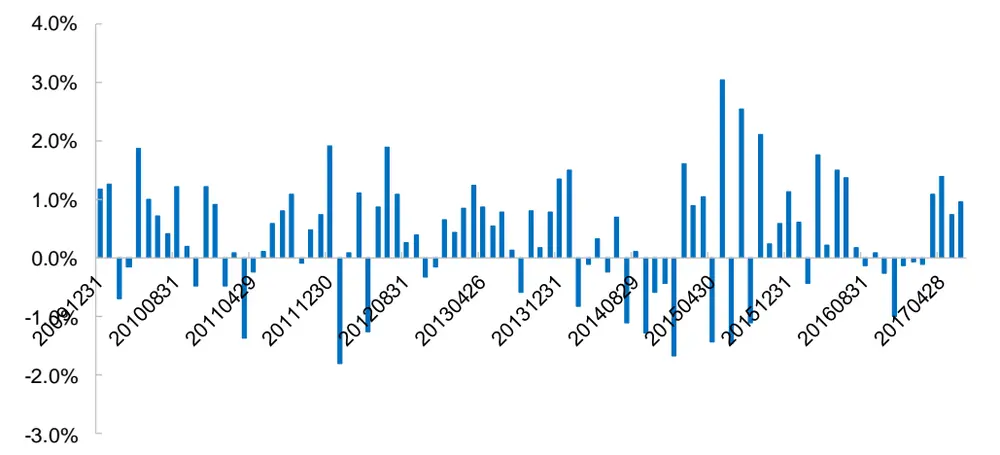
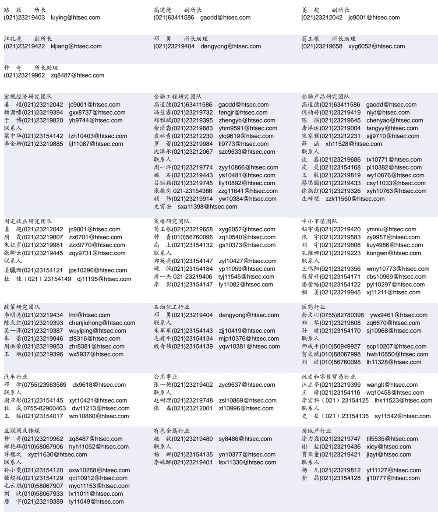

## 相关研究

[Table_ReportInfo]《选股因子系列研究（二十一）——分析

师一致预期相关因子》2017.06.27

《指数分红预测及对期指的影响》

2017.06.18

《FICC系列研究之四——基于协整和

O-U 过程的黄金套利策略》2017.06.18

分析师:冯佳睿

Tel:(021)23219732

Email:fengjr@htsec.com

证书:S0850512080006

分析师:罗蕾

Tel:(021)23219984

Email:ll9773@htsec.com

证书:S0850516080002

# 选股因子系列研究（二十二）——分析师覆盖度与股票预期收益

## 投资要点：

本文尝试在因子的框架体系中考察分析师覆盖度与股票未来收益之间的关系。提出对于传统的离散覆盖度指标，可通过线性回归方式剥离掉公司特征（如市值、流动性、前期股价表现）的影响，分解出独属于公司的特质覆盖度 ATOT。覆盖度因子反映了分析师群体对其时间、精力和注意力的分配。

特质覆盖度越高，公司未来基本面向好的可能性越大。特质覆盖度对公司未来基本面具有较强的预测能力。特质覆盖度越高的公司，其未来盈利能力和营运有效性向好的可能性越大。从盈利能力来看，分析师倾向于将其研究精力分配给经营净现金流为正、净利润为正、同时相比于上一年同期净利润增加的公司。从营运有效性来看，分析师倾向于分配更多的精力给毛利增加、资产周转率增大的公司。

特质覆盖度越高，股票收益越高。特质覆盖度具有一定的股票收益预测能力。该因子月均多空收益差为 ，月胜率逾 ，平均 为 ，统计显著。此外，该因子的预测能力具有较强的持续性，即使在滞后 4个月的时间窗口下，其多空收益差和 rankIC 仍显著异于 0。

- 在不同的观察期和持有期下，特质覆盖度因子都具有显著的选股效果。在 1 至个月的观察期，以及 个月的持有期下，特质覆盖度因子都维持显著的选股效果。但观察期和持有期越长，新息占比越小，因子有效性越低。

- 特质覆盖度因子在行业间的选股效果。特质覆盖度在大部分行业都具有显著的多空收益差和 rankIC值；整体而言，在公司数量较少的行业，该因子有效性受限。

- 风险提示。市场环境变动、模型误设、分析师行业规则变动等可能对因子有效性产生较大影响。

在以往研究中，分析师覆盖度通常用作事件分析中的分类指标，鲜少用于多因子框架。这主要是由于该指标通常用前期报告总篇数或分析师数来衡量，是个离散指标，难以加入连续的收益率预测模型中。但实际上，分析师覆盖度反映了分析师群体对其时间、精力和注意力的分配，包含不同于传统技术指标的信息，因此本文尝试以因子视角来考察分析师覆盖度对股票未来收益的预测能力。

## 1. 分析师覆盖度

直观来看，卖方分析师的时间和精力是有限的，他们更愿意将注意力分配给未来表现向好的公司，因此覆盖度高的公司，未来收益表现理应优于覆盖度低的公司。但实际上覆盖度的高低不仅仅取决于分析师对公司未来表现的预期，还与公司基本特征有关。例如，市值大的公司对行业和指数的影响更大，分析师会分配更多的时间来分析这部分股票；交易活跃度高的公司更能吸引投资者注意力，分析师也会花费一定的精力对这部分公司进行评论分析。因此我们需将分析师覆盖度中，与公司基本特征有关以及与分析师未来预期有关的部分分离开来。

在下文分析中，我们以 TOT 代表前 3个月所有分析师对某公司撰写的报告总篇数，即分析师覆盖度。例如 $\mathsf{TOT}_{\mathsf{i,m}}$ 即为，站在第 m 个月末，股票 i前 3 个月的报告总篇数。

## 1.1 特质覆盖度

我们通过月度回归的方式，将分析师覆盖度中与公司基本特征有关的部分分离开来。为避免异常值的影响，我们将因变量设为 log（1+TOT）。具体而言，m 月末公司 i的特质覆盖度由如下回归方程获取：

$$
log\big(1+TOT_{i,m}\big)=\beta_{0}+\beta_{1}Size_{i,m}+\beta_{2}Turn_{i,m}+\beta_{3}Pret_{i,m}+\varepsilon_{i,m}
$$

其中， $\mathsf{Size}_{\mathrm{i,m}}$ 为股票 i在 m 月末的对数总市值， ${\mathsf{Turn}}_{\mathsf{i,m}}$ 为前 3个月的日均换手率， $\mathsf{Pret_{i,m}}$ 为前 3 个月的累计收益率。按照上述方程处理后，回归残差项 ${\pmb\varepsilon}_{\mathrm{i},\mathrm{m}}$ 即为特质覆盖度，我们在后文中以 ATOT 表示。ATOT 越大，表明相比于同等市值、流动性、前期收益的股票，该公司获得的分析师关注度更高。

下表列示了在分析师覆盖度回归过程中，各系数的时间序列均值及 t 统计量。统计结果显示，分析师覆盖度与公司规模（Size）、换手率（Turn）以及前期收益率（Pret）呈现显著的正相关关系。公司市值越大、前期交易越活跃、收益表现越好的股票，所受到的分析师关注度越高，覆盖度 TOT 也越大。上述 3 个特征共解释了 32%左右的分析师覆盖度差异。

表 1 分析师覆盖度回归系数

| Size | Turn | Pret | R方 |
| --- | --- | --- | --- |
| 均值 0.5807 | 0.0460 | 0.0402 | 32.30% |
| T统计量 40.38 | 4.51 | 4.37 |  |

资料来源： ，朝阳永续，海通证券研究所

## 1.2 特质覆盖度组合的统计特征

基于特质覆盖度 ATOT 由小到大排序，等分为 10 组，以 2010 年初至 2017 年 6 月底为样本区间，图1统计了各个ATOT组合的平均换手率（Turn）、前期累计收益率（Pret）、特质波动率（Resvol）、市净率（PB）和市值（Size）特征。

从中可看出，ATOT 与前期累计收益率、特质波动率、换手率以及市净率均无明显的线性关系，对于这 4 个指标，ATOT 组合呈现出中间高两端低的态势，即相对而言，中间组别的前期涨幅偏大，波动率、换手率和估值偏高。ATOT 与市值的线性关系也并不明显，ATOT 最大的一组股票市值相对偏大。

图1 特质覆盖度因子分组特征

资料来源：Wind，朝阳永续，海通证券研究所

## 2. 公司基本面表现

分析师通过基本面分析对公司未来盈利情况进行预测，通常而言，对于预测基本面向好的公司，他们会给予更多的关注度，认为其股票未来会有较好的价格表现。换言之，分析师认为某股票未来收益可观，是由于他们看好公司未来的基本面表现。为考察这种关系是否成立，我们以 5 个衡量公司盈利和营运有效性的示性变量来反映公司的基本面情况。

具体来看，我们主要考察以下 5 个分项指标：CFO>0，表明公司的经营净现金流为正；NI>0，表明公司的净利润为正；ΔNI>0，表明公司净利润同比增长率为正；ΔMRG>0，表明公司毛利增加；ΔTO>0，表明公司资产周转率增加。在每月末，我们统计每个股票在下个财报期的上述 5个示性变量值，并将其加总，记之为 FSCORE，反映公司未来整体的基本面得分情况。

下面的图表统计了特质覆盖度因子分组组合的平均分项基本面指标，以及极端组合的差异。从盈利能力来看，分析师倾向于将其研究精力分配给经营净现金流为正（CFO>0）、净利润为正（NI>0）、同时相比于上一年同期净利润增加（ΔNI>0）的公司。对于 ΔNI>0 指标而言，特质覆盖度高的组合与覆盖度低的组合差异为 0.1475（t 统计量为 21.31），表明高覆盖度组合净利润增加的可能性比低覆盖度组合高 14.75%。

从营运有效性来看，分析师倾向于分配更多的精力给毛利增加（ΔMRG>0）、资产周转率增大（ ）的公司。从单调性来看，特质覆盖度越高，毛利增加的比例越大、资产周转率增加的比例也越高；从极端组合的差异来看，高覆盖度组合与低覆盖度组合的营运有效性差异显著。

图2 特质覆盖度分组组合平均基本面得分

资料来源：Wind，朝阳永续，海通证券研究所

表 2 特质覆盖度极端组合基本面表现差异

| CFO>0 | N\|>0 | ΔNI>0 | ΔMRG>0 | ΔTO>0 |
| --- | --- | --- | --- | --- |
| 高-低 0.0159 | 0.1922 | 0.1475 | 0.2145 | 0.0547 |
| t统计量 2.16 | 24.23 | 21.31 | 30.84 | 10.43 |

资料来源： ，朝阳永续，海通证券研究所

为考察整体基本面表现情况，我们将上述 5个指标加总，得到 FSCORE 指标，下表统计了各个特质覆盖度组合的得分情况。从中可看出，整体而言，分析师覆盖度越高，公司未来基本面向好的可能性越大。覆盖度高低组合的 FSCORE 差为 0.802（t 统计量31.94），按照 FSCORE 平均值 2.935 计算，相当于 27.34%；也就是高覆盖度组合基本面向好的可能性比低覆盖度组合高 27.34%。

表 3 特质覆盖度分组组合未来整体基本面得分

| D1（低） | D2 | D3 | D4 | D5 | D6 | D7 |  | D8 | D9 | D10（高） | 高-低 | t统计量 |
| --- | --- | --- | --- | --- | --- | --- | --- | --- | --- | --- | --- | --- |
| FSCORE | 2.768 | 2.658 | 2.618 | 2.597 | 2.689 | 2.862 | 3.026 | 3.196 | 3.364 | 3.570 | 0.802 | 31.94 |

资料来源：Wind，朝阳永续，海通证券研究所

## 3. 公司覆盖度与未来股价表现

## 3.1特质覆盖度与原始覆盖度

在每月末，按照特质覆盖度由低到高排序，等分为 10 组，考察每一组股票在下个月的平均收益与 FF3-alpha（Fama-French 三因子超额收益），结果如图 3所示。从中可看出，整体而言，股票收益率与特质覆盖度之间呈现明显的正相关性，覆盖度越高，股票后期收益表现越优。

从统计特征来看，多空组合月均收益差为 1.72%，月胜率逾 70%，统计显著。其中，多头相对于全市场等权组合月均超额 0.38%，空头超额-1.35%，该因子的空头效应更为明显。从与下月股票的收益率相关性来看，该因子 rankIC 为 4.461%，统计显著。

表 4 特质覆盖度多空组合及 rankIC统计结果

| 均值 | 月胜率 | t统计量 |
| --- | --- | --- |
| 多空超额 | 1.72% | 73.33% 4.83 |
| 多头超额 | 0.38% | 57.78% 1.62 |
| 空头超额 | -1.35% | 18.89% -7.05 |

| rankIC | 4.61% | 66.67% | 4.58 |
| --- | --- | --- | --- |

资料来源：Wind，朝阳永续，海通证券研究所

图3 特质覆盖度分组组合收益

资料来源：Wind，朝阳永续，海通证券研究所

图4 特质覆盖度因子月多空收益差

资料来源：Wind，朝阳永续，海通证券研究所

需要注意的是，原始覆盖度并不是个有效的选股因子。下图展示了基于原始覆盖度由低到高排序分为 10组后的月均收益情况，从中可看出，原始覆盖度指标与下期收益率并无明显线性关系，该因子 C 为 （ 统计量为 ），几近于 。从极端组合收益差来看，因子值偏低组合相对于因子值偏高组合月均超额 （ 值为 ），统计不显著。

图5 原始覆盖度分组月均收益

资料来源： ，朝阳永续，海通证券研究所

## 3.2特质覆盖度因子预测能力的持续性

上述的统计结果表明特质覆盖度对下月收益率具有一定的预测能力，本节我们将分析这种预测能力的持续性。具体而言，我们基于 m-1至 m-6 月末的 ATOT 从低到高排序将股票分为 10组，统计 ATOT 最高的一组股票相对于 ATOT 最低的一组股票在第 m 月的超额收益率率，结果如图 6 所示。此外，我们还考察了第 m 月收益率与 m-1 至 m-6月末 ATOT 之间的 rankIC值，结果如图 7所示。

统计结果表明，滞后的 ATOT 指标对股票收益率也具有预测能力，在滞后 1 至 4个月的时间窗口下，该因子的多空收益差以及 rankIC 均显著异于 0；但滞后阶数更长时，预测能力减弱，不再显著。由此表明，ATOT 对股价的预测能力并非源于短暂的价格压力，不会立即出现反转。

图6 滞后 ATOT因子的多空收益差

资料来源：Wind，朝阳永续，海通证券研究所
注：1.上图考察m月收益率与 m-1至 m-6月末 ATOT因子之间的关系；2.图中柱体标记为蓝色，表明在 5%的臵信度下显著。

图7 滞后 ATOT 因子的 rankIC

资料来源：Wind，朝阳永续，海通证券研究所注： 上图考察 月收益率与 至 月末 因子之间的关系；图中柱体标记为蓝色，表明在 的臵信度下显著。

## 3.3横截面回归检验

为考察特质覆盖度因子对收益率预测模型的边际贡献，本节使用横截面回归的方法，测算控制其他风险因子后 ATOT 因子的风险溢价。回归中使用的变量包括市值、换手、波动率、市值平方和反转。

表 5 罗列了加入特质覆盖度前后，横截面风险溢价的参数估计与 t 统计量。其中，方程 1为基准模型，包含常用的 5个因子，模型拟合优度平均为 7.89%。方程 2 在基准模型的 5个因子外，加入了特质覆盖度因子。回归结果显示，特质覆盖度因子的月均溢价为 0.39%，t 统计量为 3.35，显著大于 0；平均拟合优度增加至 8.80%。这表明，在控制其他因子的前提下，特质覆盖度与股票收益率仍呈现显著的正相关关系，且能提高原始收益率模型的预测能力。

表 5 ATOT 因子的横截面回归结果

| 回归方程 |  | 市值 | 换手率 | 波动率 | 市值平方 | 反转 | 特质覆盖度 | 拟合优度 |
| --- | --- | --- | --- | --- | --- | --- | --- | --- |
| 方程1 | 参数估计 | -0.0102 | -0.0028 | -0.0049 | 0.0038 | -0.0014 |  | 0.0789 |
|  | t统计量 | -4.90 | -2.74 | -7.02 | 4.37 | -1.33 |  |  |
| 方程2 | 参数估计 | -0.0106 | -0.0027 | -0.0047 | 0.0045 | -0.0015 | 0.0039 | 0.0880 |
|  | t统计量 | -4.98 | -2.71 | -6.88 | 5.02 | -1.38 | 3.35 |  |

资料来源：Wind，朝阳永续，海通证券研究所

图 8 展示了在方程 2 下，特质覆盖度的月风险溢价。结果显示，特质覆盖度为正的比例为 66.67%，从时间序列上看，该因子的月溢价具有稳定性。

图8 特质覆盖度月风险溢价

资料来源：Wind，朝阳永续，海通证券研究所

## 4. 稳健性检验

本节对特质覆盖度因子的稳健性进行检验，主要包括观察期和持有期选取的影响，以及在不同行业的选股效果。

## 4.1不同观察期下的因子表现

前文分析中的特质覆盖度是基于前 3个月报告总篇数构建而成，这主要是为与一致预期数据构建窗口相匹配。本小节我们考察在不同构建期窗口下（持有期固定为 1个月）因子的选股效果，结果列于下表。

从中可看出，在 1至 12 个月的构建期下，ATOT 因子的月均多空收益差都大于 1%，月胜率超过 60%；而 rankIC 也都大于 2%，统计显著。由此表明，在不同构建期窗口下的 ATOT 因子都具有显著的选股效果。但需要注意的是，构建期窗口越长，因子的 rankIC值越小，月胜率越低。

表 6 特质覆盖度因子在不同观察期下的表现

|  | 多空收益差 |  |  | rankIC |  |  |
| --- | --- | --- | --- | --- | --- | --- |
| 观察期 | 均值 | 月胜率 | t统计量 | 均值 | 月胜率 | t统计量 |
| 1个月 | 1.47% | 71.11% | 4.13 | 5.29% | 76.67% | 6.54 |
| 3个月 | 1.72% | 73.33% | 4.83 | 4.61% | 66.67% | 4.58 |
| 6个月 | 1.61% | 66.67% | 4.32 | 3.61% | 62.22% | 3.21 |
| 9个月 | 1.35% | 64.44% | 3.71 | 3.08% | 62.22% | 2.73 |
| 12个月 | 1.09% | 61.11% | 2.85 | 2.72% | 62.22% | 2.33 |

资料来源： ，朝阳永续，海通证券研究所
注：上述观察期下的持有期均为 1个月。

## 4.2不同持有期下的因子表现

下表展示了观察期为 3 个月，持有期为 1 个月至半年时，ATOT 因子的月均多空收益差及 rankIC统计结果。从中可看出，不同持有期下特质覆盖度因子的月均多空收益差都大于 1%，月胜率超过 60%；rankIC 也都超过 4%，统计显著。由此表明，该因子的延续性较强，在 1至 6 个月的持有期窗口下，均具有显著的选股效果；但随着持有期增加，其多空收益差有所减小。

表 7 特质覆盖度因子在不同持有期下的表现

|  | 多空收益差 |  |  | ranklC |  |  |
| --- | --- | --- | --- | --- | --- | --- |
| 持有期 | 均值 | 月胜率 | t统计量 | 均值 | 月胜率 | t统计量 |
| 1个月 | 1.72% | 73.33% | 4.81 | 4.61% | 66.67% | 4.58 |
| 2个月 | 1.48% | 68.89% | 4.24 | 5.23% | 68.89% | 5.41 |
| 3个月 | 1.34% | 66.67% | 3.86 | 5.77% | 72.22% | 5.93 |
| 4个月 | 1.28% | 66.67% | 3.64 | 6.13% | 78.89% | 6.10 |
| 5个月 | 1.18% | 64.44% | 3.37 | 6.03% | 75.56% | 5.96 |
| 6个月 | 1.10% | 64.44% | 3.19 | 6.09% | 77.78% | 6.33 |

资料来源： ，朝阳永续，海通证券研究所
注：上述持有期下的观察期均为 个月。

## 4.3因子在行业间的选股效果

在每月末，按照特质覆盖度由低到高排序，等分为 5组，考察每个行业 ATOT 最高的一组股票与 ATOT 最低的一组股票月均收益差，结果如下图所示。从中可看出，该因子在半数以上（58.6%）的行业中具有显著为正的多空收益差；平均月收益差 1.15%，平均月胜率 59.0%。

此外，下图还统计了各个行业的 rankIC 情况。结果显示，ATOT 因子在 19 个（占比 ）行业的 显著为正，平均 值为 。特质覆盖度与未来股票收益率线性关系最为稳定的是有色金融、基础化工和机械等行业。整体而言，ATOT 因子在股票数量较多的行业中选股效果更为明显。

图9 特质覆盖度在行业间的选股效果

|  |  | 多空月收益差 |  | rankIC |  |  |  |  | 股票个数 |
| --- | --- | --- | --- | --- | --- | --- | --- | --- | --- |
| 行业 | 均值(%) | 月胜率(%) | t统计量 | 均值(%) |  | 月胜率(%) | t统计量 |  | 均值 |
| 有色金属 | 1.64 | 66.7 | 3.04 |  | 7.23 | 67.8 |  | 4.27 | 85 |
| 基础化工 | 1.35 | 61.1 | 3.00 |  | 5.93 | 66.7 |  | 4.23 | 191 |
| 机械 | 1.56 | 70.0 | 3.71 |  | 5.66 | 66.7 |  | 4.04 | 228 |
| 综合 | 2.16 | 60.0 | 3.27 |  | 7.49 | 67.8 |  | 3.72 | 30 |
| 轻工制造 | 1.46 | 61.1 | 2.79 |  | 5.92 | 68.9 |  | 3.30 | 60 |
| 电力及公用事业 | 1.24 | 64.4 | 2.20 |  | 6.16 | 70.0 |  | 3.19 | 133 |
| 汽车 | 0.87 | 56.7 | 1.86 |  | 4.86 | 63.3 |  | 3.01 | 118 |
| 石油石化 | 1.46 | 58.9 | 2.14 |  | 6.55 | 67.8 |  | 2.97 | 41 |
| 电子元器件 | 1.76 | 66.7 | 3.57 |  | 5.16 | 58.9 |  | 2.92 | 146 |
| 建材 | 1.47 | 62.2 | 2.57 |  | 5.30 | 58.9 |  | 2.86 | 72 |
| 通信 | 1.13 | 60.0 | 2.26 |  | 5.32 | 60.0 |  | 2.83 | 65 |
| 电力设备 | 1.45 | 64.4 | 3.02 |  | 4.90 | 57.8 |  | 2.71 | 111 |
| 房地产 | 1.39 | 61.1 | 3.08 |  | 3.86 | 60.0 |  | 2.50 | 128 |
| 传媒 | 2.13 | 56.7 | 2.49 |  | 5.99 | 60.0 |  | 2.32 | 83 |
| 建筑 | 2.13 | 55.6 | 2.48 |  | 5.61 | 56.7 |  | 2.24 | 77 |
| 国防军工 | 1.39 | 56.7 | 1.84 |  | 5.93 | 63.3 |  | 2.15 | 42 |
| 食品饮料 | 1.21 | 52.2 | 2.09 |  | 4.79 | 55.6 |  | 2.09 | 74 |
| 计算机 | 0.92 | 61.1 | 1.54 |  | 4.25 | 56.7 |  | 2.06 | 118 |
| 医药 | 0.94 | 63.3 | 2.06 |  | 4.25 | 57.8 |  | 2.05 | 198 |
| 交通运输钢铁 | 0.71 | 60.0 | 1.71 |  | 2.95 | 60.0 |  | 1.94 | 90 |
|  | 0.94 | 62.2 | 2.11 |  | 3.46 | 62.2 |  | 1.74 | 48 |
| 农林牧渔 | 0.86 | 58.9 | 1.37 |  | 3.85 | 57.8 |  | 1.60 | 74 |
| 非银行金融 | 0.51 | 55.6 | 0.84 |  | 3.72 | 61.1 |  | 1.34 | 39 |
| 纺织服装 | 0.57 | 51.1 | 0.83 |  | 2.37 | 47.8 |  | 1.26 | 63 |
| 家电 | 0.63 | 57.8 | 0.95 |  | 2.72 | 57.8 |  | 1.13 | 49 |
| 商贸零售 | 0.73 | 56.7 | 1.37 |  | 1.81 | 52.2 |  | 0.84 | 89 |
| 餐饮旅游 | 0.38 | 48.9 | 0.58 |  | 1.14 | 51.1 |  | 0.41 | 31 |
| 银行 | 0.31 | 56.7 | 0.59 |  | 0.45 | 52.2 |  | 0.11 | 16 |
| 煤炭 | 0.11 | 44.4 | 0.22 |  | -1.82 | 48.9 |  | -0.70 | 34 |

资料来源：Wind，朝阳永续，海通证券研究所

## 5. 总结

本文尝试在因子的框架体系中考察分析师覆盖度与股票未来收益之间的关系。提出对于传统的离散覆盖度指标，可通过线性回归方式剥离掉公司特征（如市值、流动性、前期股价表现）的影响，分解出独属于公司的特质覆盖度 ATOT。该因子反映了分析师群体对其时间、精力和注意力的分配。

分析师通过基本面分析对公司未来盈利情况进行预测，通常而言，对于预测基本面向好的公司，他们会给予更多关注度，认为其股票未来会有较好的价格表现。换言之，分析师认为某股票未来收益可观，是由于他们看好公司未来的基本面表现。为验证这种关系是否成立，我们在报告第 2、3部分分别考察了特质覆盖度与公司未来基本面表现、未来股价收益之间的关系。

通过回测我们发现，特质覆盖度对公司未来基本面和股价收益都具有较强的预测能力。特质覆盖度越高的公司，其未来盈利能力和营运有效性向好的可能性越大；同时，公司未来股价上升的可能性和幅度也越高。

此外我们还发现，在不同的观察期和持有期下，特质覆盖度因子都具有显著的选股效果，该因子延续性较强；但观察期和持有期越长，新息占比越小，因子有效性越低。从行业间的选股效果来看，特质覆盖度在大部分行业都具有显著的多空收益差和 rankIC值；整体而言，在公司数量较少的行业，该因子有效性受限。

## 6. 风险提示

市场环境变动、模型误设、分析师行业规则变动等可能对因子有效性产生较大影响。

# 信息披露

分析师声明

[Table冯佳睿yst 金融工程研究团队s]

罗蕾金融工程研究团队

本人具有中国证券业协会授予的证券投资咨询执业资格，以勤勉的职业态度，独立、客观地出具本报告。本报告所采用的数据和信息均来自市场公开信息，本人不保证该等信息的准确性或完整性。分析逻辑基于作者的职业理解，清晰准确地反映了作者的研究观点，结论不受任何第三方的授意或影响，特此声明。

## 法律声明

本报告仅供海通证券股份有限公司（以下简称 本公司 ）的客户使用。本公司不会因接收人收到本报告而视其为客户。在任何情况下，本报告中的信息或所表述的意见并不构成对任何人的投资建议。在任何情况下，本公司不对任何人因使用本报告中的任何内容所引致的任何损失负任何责任。

本报告所载的资料、意见及推测仅反映本公司于发布本报告当日的判断，本报告所指的证券或投资标的的价格、价值及投资收入可能会波动。在不同时期，本公司可发出与本报告所载资料、意见及推测不一致的报告。

市场有风险，投资需谨慎。本报告所载的信息、材料及结论只提供特定客户作参考，不构成投资建议，也没有考虑到个别客户特殊的投资目标、财务状况或需要。客户应考虑本报告中的任何意见或建议是否符合其特定状况。在法律许可的情况下，海通证券及其所属关联机构可能会持有报告中提到的公司所发行的证券并进行交易，还可能为这些公司提供投资银行服务或其他服务。

本报告仅向特定客户传送，未经海通证券研究所书面授权，本研究报告的任何部分均不得以任何方式制作任何形式的拷贝、复印件或复制品，或再次分发给任何其他人，或以任何侵犯本公司版权的其他方式使用。所有本报告中使用的商标、服务标记及标记均为本公司的商标、服务标记及标记。如欲引用或转载本文内容，务必联络海通证券研究所并获得许可，并需注明出处为海通证券研究所，且不得对本文进行有悖原意的引用和删改。

根据中国证监会核发的经营证券业务许可，海通证券股份有限公司的经营范围包括证券投资咨询业务。

## 海通证券股份有限公司研究所[Table_PeopleInfo]

| 电子行业 | 煤炭行业 |  | 电力设备及新能源行业 |  |
| --- | --- | --- | --- | --- |
| 陈 平(021)23219646 cp9808@htsec.com 联系人 | 吴 杰(021)23154113 李 淼(010)58067998 | wj10521@htsec.com Im10779@htsec.com | 杨 帅(010)58067929 房 青(021)23219692 | ys8979@htsec.com fangq@htsec.com |
| 谢 磊(021)23212214 xl10881@htsec.com 张天闻 ztw11086@htsec.com | 联系人 戴元灿(021)23154146 | dyc10422@htsec.com | 徐柏乔(021)32319171 联系人 | xbq6583@htsec.com |
| 尹 苓(021)23154119 yl11569@htsec.com |  |  | 曾 彪(021)23154148 | zb10242@htsec.com |
|  |  |  | 张向伟(021)23154141 | zxw10402@htsec.com |
| 基础化工行业 Iw10053@htsec.com | 计算机行业 zhd10834@htsec.com |  | 通信行业 |  |
| 刘 威(0755)82764281 | 郑宏达(021)23219392 |  | 朱劲松(010)50949926 |  |
| 刘 强(021)23219733 | 谢春生(021)23154123 |  | zjs10213@htsec.com 联系人 |  |
| lq10643@htsec.com 联系人 | xcs10317@htsec.com 鲁 立I11383@htsec.com |  | 庄 宇(010)50949926 |  |
| 刘海荣(021)23154130 Ihr10342@htsec.com | 联系人 |  | zy11202@htsec.com 余伟民(010)50949926 ywm11574@htsec.com |  |
|  | 黄竞晶(021)23154131 hjj10361@htsec.com 杨 林(021)23154174 |  |  |  |
|  | yl11036@htsec.com 洪 琳 hl11570@htsec.com |  |  |  |
| 非银行金融行业 st9998@htsec.com | 交通运输行业 |  | 纺织服装行业 |  |
| 孙 婷(010)50949926 | 虞 楠(021)23219382 yun@htsec.com |  | 唐 苓(021)23212208 |  |
| 何 婷(021)23219634 |  |  | tl9709@htsec.com |  |
| ht10515@htsec.com | 张 杨(021)23219442 zy9937@htsec.com |  | 梁 希(021)23219407 lx11040@htsec.com |  |
| 联系人 | 联系人 |  | 于旭辉(021)23219411 yxh10802@htsec.com |  |
| 夏昌盛(010)56760090 xcs10800@htsec.com 李芳洲(021)23154127 | 童 宇(021)23154181 ty10949@htsec.com |  | 联系人 马 榕(021)23219431 |  |
| Ifz11585@htsec.com | 机械行业 |  | mr11128@htsec.com |  |
| 建筑建材行业 邱友锋(021)23219415 qyf9878@htsec.com | 沈伟杰(021)23219963 swj11496@htsec.com |  | 钢铁行业 |  |
| 冯晨阳(021)23212081 fcy10886@htsec.com | 余炜超(021)23219816 swc11480@htsec.com |  | 刘彦奇(021)23219391 liuyq@htsec.com 联系人 |  |
| 钱佳佳(021)23212081 qjj10044@htsec.com | 耿 耘(021)23219814 gy10234@htsec.com |  | 刘 璇(021)23219197 lx11212@htsec.com |  |
| 联系人 | 联系人 杨 震(021)23154124 yz10334@htsec.com |  |  |  |
| 周 俊 0755-23963686 zj11521@htsec.com |  |  |  |  |
| 建筑工程行业 | 农林牧渔行业 |  | 食品饮料行业 |  |
| 杜市伟 dsw11227@htsec.com 联系人 | 丁 频(021)23219405 dingpin@htsec.com 陈雪丽(021)23219164 cxl9730@htsec.com |  | 闻宏伟(010)58067941 whw9587@htsec.com |  |
| 毕春晖(021)23154114 bch10483@htsec.com | 陈 阳(010)50949923 cy10867@htsec.com |  | 孔梦遥(010)58067998 kmy10519@htsec.com |  |
|  | 联系人 |  | 成珊(021)23212207 cs9703@htsec.com |  |
|  | 关 慧(021)23219448 gh10375@htsec.com |  |  |  |
|  | 夏越(021)23212041 xy11043@htsec.com |  |  |  |
| 军工行业 徐志国(010)50949921 xzg9608@htsec.com | 银行行业 林媛媛(0755)23962186 lyy9184@htsec.com |  | 社会服务行业 李铁生(010)58067934 Its10224@htsec.com |  |
| 刘 磊(010)50949922 II11322@htsec.com 蒋 俊(021)23154170 jj11200@htsec.com | 联系人 ljl11126@htsec.com |  | 联系人 陈扬扬(021)23219671 cyy10636@htsec.com |  |
| 联系人 | 林瑾璐 谭敏沂 tmy10908@htsec.com |  | 顾熹闽 021-23154388 gxm11214@htsec.com |  |
| 张恒晅(010)68067998 zhx10170@hstec.com |  |  |  |  |
| 张宇轩 zyx11631@htsec.com |  |  |  |  |
| 家电行业 造纸轻工行业 |  |  |  |  |
| 陈子仪(021)23219244 chenzy@htsec.com 曾知(021)23219810 zz9612@htsec.com |  |  |  |  |
| 联系人 联系人 朱 悦(021)23154173 |  |  |  |  |
| 李阳 |  |  |  |  |
| ly11194@htsec.com |  |  |  |  |
| 朱默辰 zmc11316@htsec.com |  |  |  |  |

## 研究所销售团队

深广地区销售团队

蔡铁清(0755)82775962 ctq5979@htsec.com

伏财勇(0755)23607963 fcy7498@htsec.com

辜丽娟(0755)83253022 gulj@htsec.com

刘晶晶(0755)83255933 liujj4900@htsec.com

王雅清(0755)83254133 wyq10541@htsec.com

饶 伟(0755)82775282 rw10588@htsec.com

欧阳梦楚(0755)23617160

oymc11039@htsec.com

巩柏含 gbh11537@htsec.com

海通证券股份有限公司研究所

地址：上海市黄浦区广东路 689号海通证券大厦 9楼

电话：（021）23219000

传真：（021）23219392

网址：www.htsec.com

上海地区销售团队
胡雪梅(021)23219385 huxm@htsec.com
朱 健(021)23219592 zhuj@htsec.com
黄 毓(021)23219410 huangyu@htsec.com
漆冠男(021)23219281 qgn10768@htsec.com
胡宇欣(021)23154192 hyx10493@htsec.com
黄 诚(021)23219397 hc10482@htsec.com
蒋 炯 jj10873@htsec.com
毛文英(021)23219373 mwy10474@htsec.com
马晓男 mxn11376@htsec.com
方烨晨(021)23154220 fyc10312@htsec.com
季唯佳(021)23219384 jiwj@htsec.com
杨祎昕(021)23212268 yyx10310@htsec.com
慈晓聪 021-23219989 cxc11643@htsec.com
北京地区销售团队
殷怡琦(010)58067988 yyq9989@htsec.com
吴 尹 wy11291@htsec.com
陈铮茹 czr11538@htsec.com
陆铂锡 lbx11184@htsec.com
杨羽莎(010)58067977 yys10962@htsec.com
张丽萱(010)58067931 zlx11191@htsec.com
张 明 zm11248@htsec.com