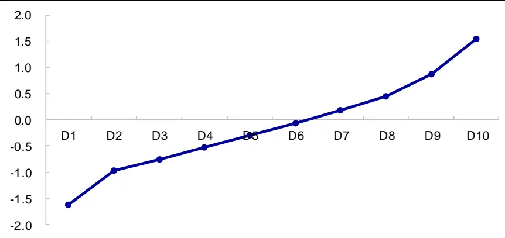
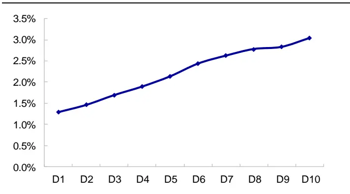
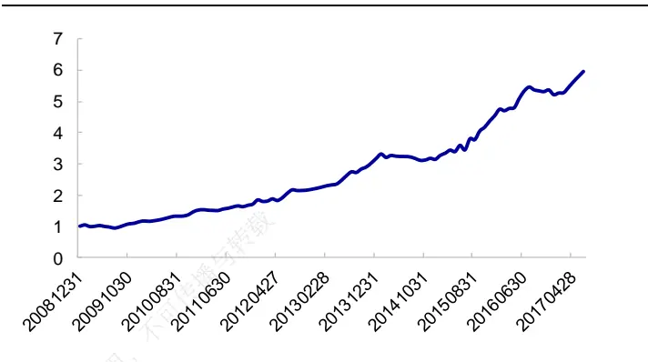
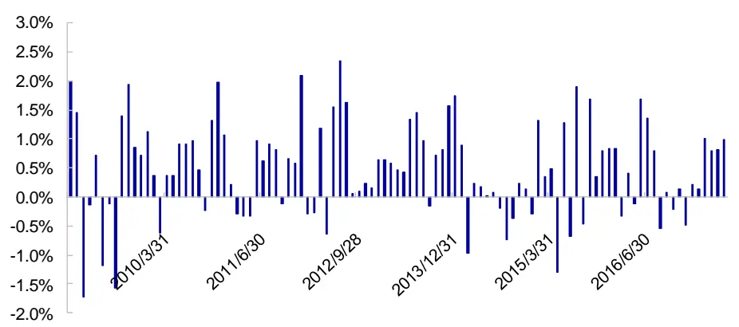
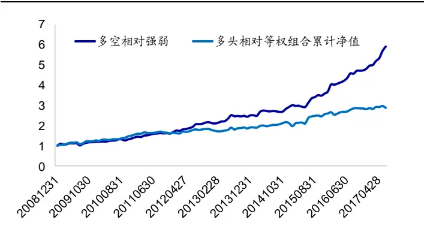
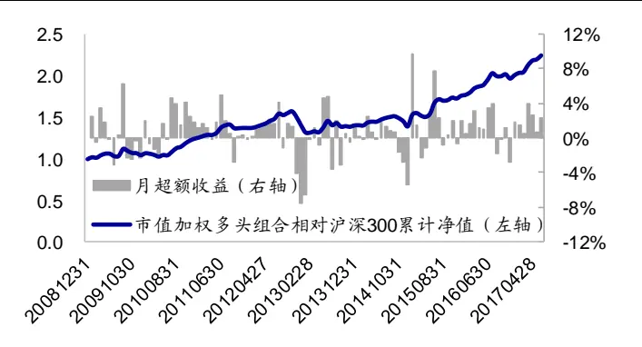
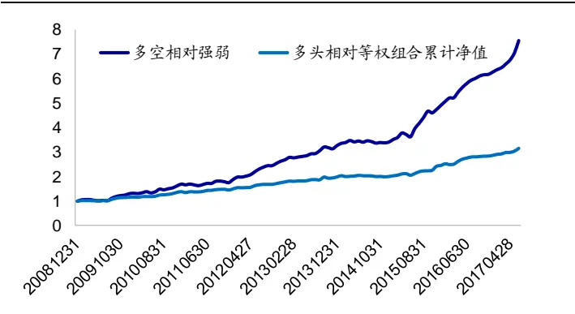
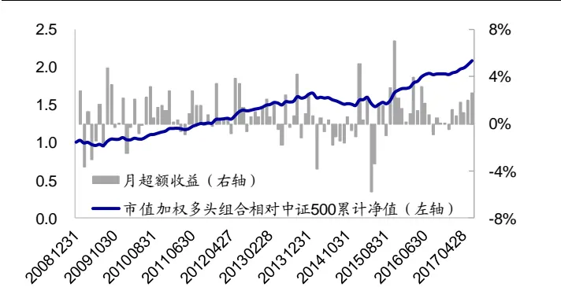
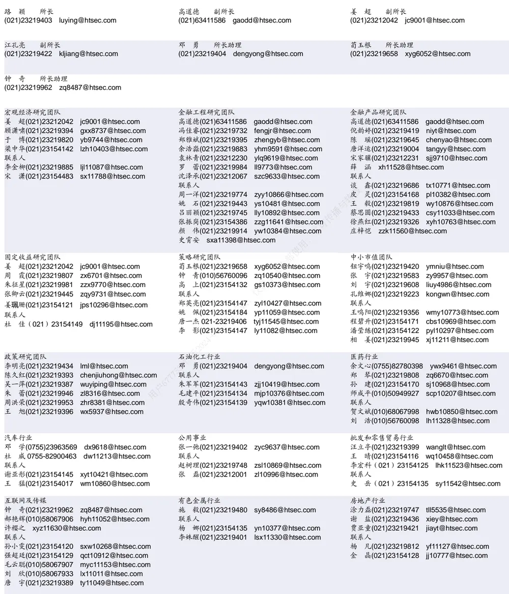

## 相关研究

[Table_ReportInfo]《大类资产配臵及模型研究（四）

2017，全球对冲基金的新纪元？》

2017.07.25

《量化研究新思维（三）——与Beta为敌》2017.07.24

《价值投资系列之二——历史盈利对股票收益预测的影响》2017.07.17

分析师:冯佳睿

Tel:(021)23219732

Email:fengjr@htsec.com

证书:S0850512080006

分析师:罗蕾

Tel:(021)23219984

Email:ll9773@htsec.com

证书:S0850516080002

# 选股因子系列研究（二十三）——历史财务信息对股票收益的预测能力

## 投资要点：

本文主要考察基于 Piotroski（2000）体系构建的基本面综合因子在 A股市场的选股效果。整体而言，历史基本面表现越好的公司，未来基本面向好的可能性越大；从二级市场表现来看，后期股票价格上涨的可能性和幅度也越大。

- 基本面综合因子的单因子选股效果显著。基本面综合因子值最高的 1/10 股票相对因子值最低的 1/10 股票月均超额 1.74%，月胜率逾 70%，统计显著。从相关性分析来看，当月因子值与次月股票收益率的平均相关系数为 0.0511，秩相关系数为 0.0664，统计显著。

- 横截面回归结果与筛选法结果一致。通过横截面回归模型发现，上市公司综合基本面因子每提高一个标准差，月均收益提高 0.47%；且这种现象在 A股市场长期存在。由此表明，历史财务信息对未来二级市场收益具有一定预测能力。

- 基本面综合因子可增加收益率模型的预测能力。从多因子模型角度来看，在收益率预测模型中增加基本面综合因子，可明显改善预测模型的精度。而且相比于仅增加盈利因子 ROE、dROE 的模型，其预测能力改善幅度更大。

- 敏感性分析。从因子构建方式来看，采用位序加总所得的基本面综合因子与采用zscore 加总所得的因子具有同样的选股效果，在全市场范围内两者差异并不明显。从选股范围来看，该因子在沪深 300 指数成分股、中证 500 指数成分股以及全市场范围内，都存在显著的选股效果。

- 风险提示。因子历史规律失效风险、模型失效风险。

本文主要分析历史财务信息对股票未来收益是否具有预测作用。实证结果表明，当前基本面向好的公司，未来基本面向好的可能性更大；因此，投资者更加青睐历史财务表现较好的股票。

## 1. 历史财务因子

单个财务指标或财务比率并不能捕捉公司整体的基本面情况，存在许多干扰信息，因此 2000 年以后，国外学者们将基本面重心转移至“综合因子”的研究，即将多个财务指标组合成单一因子，用以检验历史基本面与股票未来收益之间的关系。其中，应用最广泛的是 Piotroski（2000）提出的 FSCORE 以及 Mohanram（2005）提出的 GSCORE因子。本文主要在 FSCORE 体系下对中国市场的基本面因子进行探讨研究。

FSCORE 体系从 3个方面衡量了公司的基本面情况：盈利能力、杠杆/流动性以及营运有效性。

在盈利能力方面上，Piotroski使用了 4个指标，它们分别是 ROA（ROE）、dROA（dROE）、CFO 以及 ACC。其中，ROA（ROE）为总（净）资产收益率，dROA（dROE）为净资产收益率同比增长率。CFO是经营净现金流量与总资产之比，ACC 为 ROA与CFO 之差。

美国市场存在“应计异象”，即平均而言应计项目低的公司收益率会高于应计项目高的公司，在 FSCORE 体系下表现为，ACC<0 的股票后期收益率理应更优。但实际上 A股并不存在这种现象：2009年1月至2017年6月间，ACC>0的股票月均收益为2.22%，CC 的股票月均收益为 ，两者收益差仅为 （相应 值为 ）， 股并不存在显著的应计异象。

源于上述原因，我们对盈利能力指标进行更改。具体而言，本文研究的基本指标有8 个，分别列于下表。

表 1 基本因子列表

| 类别 | 因子简称 因子含义 |  |
| --- | --- | --- |
| 盈利能力 用户6777539 | ROE dROE dCFO | 净资产收益率 |
|  |  | 净资产收益率同比增长率 每股经营活动现金流同比增长率 |
|  | EPS | 每股收益 |
| 杠杆 | dLEVER LIQUID | 权益乘数同比增长率 |
| 流动性 营运有效性 | dMARGIN | 流动比率 |
|  | dTURN | 销售净利率（单季度）同比增长率 固定资产合计周转率同比增长率 |

资料来源：Wind，海通证券研究所

我们将上述 8个指标横截面标准化，然后以回归的方式剔除风险因子（市值和 PB）影响，取残差等权加总后构建基本面综合因子，记之为 Factor_F。

## 2. 因子分组收益统计

## 2.1 历史财务信息的延续性

投资者之所以会参考历史基本面信息作出投资决策，主要源于财务信息的延续性。历史综合基本面较好的公司，未来基本面向好的可能性更大。实际上，我们以定期报告披露结束日（每年的 4、8、10 月底）为分界点，考察当期 Factor_F 与下期 Factor_F的相关性，结果显示两者相关系数达 51.57%，秩相关系数达 58.52%。

图 1 展示了基于当期 Factor_F 因子将全市场股票等分为 10 组，每一组股票下期的Factor_F 因子均值。从中可看出，下期 Factor_F 值与当期 Factor_F 值呈现明显的正相关关系，由此表明，历史财务信息具有较好的延续性：历史综合基本面较好的公司，未来平均基本面表现越优。

图1 Factor_F 分组组合下期 Factor_F 均值

资料来源： ，海通证券研究所

## 2.2 单因子 IC

我们以 、 、 月份为调仓日，统计调仓日的因子值与下期收益率的（秩）相关系数；其中，下期收益率是指当前调仓日至下期调仓日间的收益率。结果列于下表。从中可看出，复合因子 与收益率之间存在显著的正相关关系，历史基本面综合表现越好，股票后期收益率越高。该因子 IC均值达 0.0989，相应的 t统计量为 6.05。

从单个因子来看，表现最好的是 EPS、ROE 和 dROE，它们的 IC 序列和 rank_IC序列均显著大于 0，IC 均值分别为 0.0882、0.0669 和 0.0537。对比来看，综合因子的IC 均值、稳定性均优于任一单个因子。

表 2 因子截面 IC（季度）

|  |  | dCFO | EPS | dLEVER | LIQUID | dMARGIN | dTURN | ROE | dROE | Factor_F |
| --- | --- | --- | --- | --- | --- | --- | --- | --- | --- | --- |
| IC | 均值 | 0.0215 | 0.0882 | 0.0401 | 0.0207 | 0.0269 | 0.0454 | 0.0669 | 0.0537 | 0.0989 |
|  | 标准差 | 0.0570 | 0.0849 | 0.0614 | 0.0953 | 0.0704 | 0.0807 | 0.1006 | 0.0729 | 0.0833 |
|  | t值 | 1.93 | 5.29 | 3.33 | 1.11 | 1.95 | 2.87 | 3.39 | 3.75 | 6.05 |
| rankIC | 均值 | 0.0235 | 0.1251 | 0.0520 | 0.0183 | 0.0491 | 0.1022 | 0.0895 | 0.1075 | 0.1270 |
|  | 标准差 | 0.1113 | 0.0976 | 0.0795 | 0.1007 | 0.1041 | 0.1605 | 0.1198 | 0.1403 | 0.0946 |
|  | t值 | 1.08 | 6.54 | 3.33 | 0.93 | 2.41 | 3.25 | 3.81 | 3.91 | 6.85 |

资料来源： ，海通证券研究所

由于常见的多因子模型均为月度换仓，为便于与其它因子比较，下表统计了基本面因子的月度 IC情况。月度相关性分析与季度结果一致，综合因子的表现优于任一单个因子，月度 IC 均值为 0.0511，相应的 t 值为 6.61，具有显著的选股能力。

表 3 因子截面 IC（月度）

|  |  | dCFO | EPS | dLEVER | LIQUID | dMARGIN | dTURN | ROE | dROE | Factor_F |
| --- | --- | --- | --- | --- | --- | --- | --- | --- | --- | --- |
| IC | 均值 | 0.0079 | 0.0446 | 0.0247 | 0.0092 | 0.0223 | 0.0260 | 0.0331 | 0.0282 | 0.0511 |
|  | 标准差 | 0.0454 | 0.0835 | 0.0688 | 0.0932 | 0.0875 | 0.0779 | 0.0910 | 0.0589 | 0.0782 |
|  | t值 | 1.75 | 5.40 | 3.62 | 1.00 | 2.57 | 3.36 | 3.68 | 4.85 | 6.61 |
| rankIC | 均值 | 0.0051 | 0.0666 | 0.0318 | 0.0085 | 0.0407 | 0.0552 | 0.0442 | 0.0615 | 0.0664 |
|  | 标准差 | 0.0880 | 0.0982 | 0.0845 | 0.0940 | 0.1191 | 0.1350 | 0.1082 | 0.1046 | 0.0881 |
| t值 | 0.59 | 6.85 | 3.79 | 0.91 | 3.45 |  | 4.13 | 5.94 |  | 7.61 |
|  |  |  |  |  |  |  |  | 4.12 |  |  |

资料来源：Wind，海通证券研究所

## 2.3 Factor_F 因子分组收益

Factor_F 越大，反应公司历史基本面表现越好。下图展示了基于 Factor_F 将所有股票分为 10 组，每组股票的月均收益，以及 D10（因子值最高的 1/10 股票）组合与D1（因子值最低的 1/10 股票）组合的相对强弱走势。与相关系数统计结果一致，Factor_F与股票收益率正相关，分组组合收益率呈现明显的单调上升态势。

图2 Factor_F 组合月均收益

资料来源：Wind，海通证券研究所

图3 高低 Factor_F 组合相对强弱

资料来源：Wind，海通证券研究所

样本期间（2009 年初至 2017 年 6 月），高 Factor_F 组合月均收益为 3.04%，低Factor_F 组合月均收益为 1.30%，多空组合月均收益差为 1.74%，显著大于 0。月胜率达 71.6%，高 Factor_F 组合持续跑赢低 Factor_F 组合。

表 4 高低 Factor_F 组合月均收益

| D1月均收益 D10月均收益 |  | D10-D1 | 月胜率 | T统计量 |
| --- | --- | --- | --- | --- |
| 1.30% | 3.04% | 1.74% | 71.57% | 6.26 |

资料来源：Wind，海通证券研究所

## 3. 横截面回归的风险溢价

为考察控制其他风险因子值后，Factor_F因子的边际效应，本部分我们将构建Fama-MacBeth 横截面回归模型，考察该因子的风险溢价；并从多因子模型的角度出发，探讨增加该因子后，收益率预测模型的改进效果。

## 3.1 横截面回归结果

回归模型中使用的控制变量包括：市值、波动率、换手率、非线性市值、反转和流动性，下表列示了 Fama-MacBeth 回归结果。结果显示，Factor_F 月均溢价显著为正，越高，股票次月收益越大，与分组筛选法呈现一致的效果； 每上升个截面标准差，股票收益平均上升 0.47%。

表 5 Fama-MacBeth 截面回归结果

|  | 市值 | 波动率 | 换手率 | 非线性市值 | 反转 | 流动性 | Factor_F |
| --- | --- | --- | --- | --- | --- | --- | --- |
| 月均溢价 | -0.0081 | -0.0029 | -0.0043 | 0.0070 | -0.0047 | -0.0054 | 0.0047 |
| T统计量 | -5.05 | -2.98 | -2.80 | 5.98 | -3.00 | -3.43 | 5.80 |

资料来源：Wind，海通证券研究所

图 4 为 Factor_F 的月度溢价时间序列。在大部分月份（占比 72.8%），Factor_F 能

够提供正向的溢价，较为稳定。

图4 Factor_F 月溢价序列

资料来源：Wind，海通证券研究所

## 3.2 收益预测模型的改进

常见的多因子框架由收益率预测和风险管理两部分组成，引入新 alpha 因子的目的在于提高收益率模型的预测能力。由于常见的收益率模型为线性模型，因此最常用的考察多因子模型预测能力的指标是 IC 和 rankIC，即复合因子值与下期股票收益率的相关系数和秩相关系数。

为了评估 FSCORE 体系下，基本面综合因子对收益率预测模型的改进效果，我们对比了引入该因子前后预测模型 IC 和 rankIC 的相关统计指标，并对比了仅引入包含ROE 和 dROE盈利因子后的效果。结果列于下表，其中，“初始模型”是指包含市值、波动率、换手率、非线性市值、反转和流动性 6 个因子的预测模型，“引入 ROE、dROE”是指在初始模型基础上增加 ROE 和 dROE 两个因子后的预测模型，“引入 Factor_F”则是指在初始模型基础上引入 Factor_F 因子的预测模型。

表 6 收益率预测模型的 IC、rankIC对比

| 7539 |  | 均值 | 月胜率 | 标准差 | T统计量 |
| --- | --- | --- | --- | --- | --- |
| 用户 | 初始模型 | 0.1016 | 79.41% | 0.1400 | 7.32 |
|  | 引入ROE、dROE | 0.1048 | 80.39% | 0.1340 | 7.90 |
|  | 引入Factor_F | 0.1156 | 87.25% | 0.1229 | 9.49 |
| rankIC | 初始模型 | 0.1320 | 83.33% | 0.1489 | 8.96 |
|  | 引入 ROE、dROE 引入Factor_F | 0.1348 | 85.29% | 0.1423 | 9.57 |
|  |  | 0.1450 | 90.20% | 0.1310 | 11.18 |

资料来源：Wind，海通证券研究所

统计结果显示，引入 因子后收益率预测模型的 （ ）均值增加、月胜率上升、波动性下降，各项评估指标均得到明显提升。此外，对比仅引入盈利因子ROE、dROE模型的相关指标可发现，反映了公司盈利能力、杠杆、流动性和营运有效性的综合财务因子，对收益率预测模型增加的边际效应更强。

## 4. 敏感性分析

本部分主要对选股范围、Factor_F 因子的构建方式等可能影响因子效果的因素进行敏感性分析。

## 4.1 位序加总法

前文中 Factor_F 因子是通过加总 8 个单因子的 zscore 获取，实际上我们还可以加总单因子的位序值来构建基本面综合因子。表 7统计了引入不同构建方法下的 Factor_F因子后，收益率预测模型的 IC 和 rankIC 相关指标。从中可看出，无论是位序加总，还是 zscore 加总，引入 Factor_F 因子都能明显增加收益率模型的预测效果。

表 7 引入不同构建方法下的 Factor_F因子对收益率预测模型的影响

|  |  | 均值 | 月胜率 | 标准差 | T统计量 |
| --- | --- | --- | --- | --- | --- |
| IC | 初始模型 | 0.1016 | 79.41% | 0.1400 | 7.32 |
|  | 位序加总 | 0.1156 | 87.25% | 0.1229 | 9.49 |
|  | zscore 加总 | 0.1162 | 85.29% | 0.1235 | 9.50 |
| rankIC | 初始模型 | 0.1016 | 79.41% | 0.1400 | 7.32 |
|  | 位序加总 | 0.1450 | 90.20% | 0.1310 | 11.18 |
|  | zscore 加总 | 0.1465 | 91.18% | 0.1314 | 11.26 |

资料来源：Wind，海通证券研究所

## 4.2 沪深 300成分股内的选股效果

下表统计了在沪深 300 指数成分股内，基于 Factor_F 因子分组后的多头（因子值最高的 1/5 股票）、空头（因子值最低的 1/5 股票）组合收益以及 IC 表现情况。从中可看出，无论采用 zscore 加总还是位序加总，基本面复合因子 Factor_F在沪深 300 成分股内均存在显著的选股效果。多空组合月均超额收益逾 1.6%，月胜率超过 73%，IC 均值超过 6.5%，统计显著。

表 8 沪深 300成分股内，Factor_F因子的选股效果

|  | 空头超额 | 多头超额 | IC 均值 | 多空超额 |  |  | rankIC |  |  |
| --- | --- | --- | --- | --- | --- | --- | --- | --- | --- |
|  |  |  |  | 均值 | 月胜率 | T统计量 | 均值 | 月胜率 | T统计量 |
| zscore 加总 | -0.87% | 0.80% | 6.87% | 1.67% | 73.53% | 5.77 | 8.40% | 74.51% | 7.99 |
| 位序加总 | -0.83% | 1.00% | 7.80% | 1.83% | 75.49% | 4.99 | 9.13% | 76.47% | 7.92 |

资料来源：Wind，海通证券研究所

图 5 和图 6 展示了沪深 300 指数成分股内 Factor_F 多头组合的历史累计净值。结果显示，多头组合相对空头组合的累计净值呈现稳定增长态势。分年度来看，多头等权组合相对样本股等权组合每年均可获得正向超额收益，多头市值加权组合除 2013、2014年略微跑输沪深 300 指数外，其余各年份均显著跑赢基准。

图5 Factor_F多头等权组合相对净值（沪深 300成分股）

资料来源： ，海通证券研究所

图6 Factor_F多头市值加权组合历史表现（沪深300成分股）

资料来源：Wind，海通证券研究所

表 9 沪深 300指数成分股内多头组合分年度表现

|  | 市值加权组合 |  |  | 等权组合 |  |  |
| --- | --- | --- | --- | --- | --- | --- |
|  | 多头组合 | 沪深 300 | 超额收益 | 多头组合 | 等权组合 | 超额收益 |
| 2009 | 106.19% | 96.71% | 9.48% | 144.37% | 93.76% | 50.62% |
| 2010 | 3.90% | -12.51% | 16.42% | 9.41% | -11.20% | 20.61% |
| 2011 | -17.22% | -25.01% | 7.80% | -23.24% | -27.87% | 4.63% |
| 2012 | 10.16% | 7.55% | 2.60% | 19.15% | 10.63% | 8.52% |
| 2013 | -7.78% | -7.65% | -0.14% | -0.13% | -7.43% | 7.30% |
| 2014 | 50.38% | 51.66% | -1.28% | 53.49% | 38.61% | 14.89% |
| 2015 | 33.45% | 5.58% | 27.87% | 42.97% | 16.25% | 26.72% |
| 2016 | 1.13% | -11.28% | 12.41% | -2.80% | -10.40% | 7.59% |
| 2017.1-2017.6 | 23.92% | 10.78% | 13.15% | 13.41% | 10.93% | 2.48% |

资料来源：Wind，海通证券研究所

## 4.3 中证 500成分股内的选股效果

下表统计了在中证 500 指数成分股内，基于 Factor_F 因子分组后的多头（因子值最高的 1/5 股票）、空头（因子值最低的 1/5 股票）组合收益以及 IC 表现情况。从中可看出，无论采用 zscore 加总还是位序加总，基本面复合因子 Factor_F在中证 500 成分股内均存在显著的选股效果。相对而言，在 500 成分股内，位序加总形式的 Factor_F因子效果更优，月均多空收益差达 1.91%，月胜率 77.45%。

表 10 中证 500成分股内，Factor_F因子的选股效果

|  | 空头超额 | 多头超额 | IC 均值 | 多空超额 |  |  | rankIC |  |  |
| --- | --- | --- | --- | --- | --- | --- | --- | --- | --- |
|  |  |  |  | 均值 | 月胜率 | T统计量 | 均值 | 月胜率 | T统计量 |
| zscore 加总 | -0.78% | 0.69% | 5.84% | 1.47% | 76.47% | 6.52 | 7.06% | 77.45% | 7.94 |
| 位序加总 | -0.91% | 1.00% | 7.21% | 1.91% | 77.45% | 8.70 | 8.44% | 79.41% | 9.46 |

资料来源：Wind，海通证券研究所

图 7 和图 8 展示了中证 500 指数成分股内 Factor_F 多头组合的历史累计净值。结果显示，多头组合相对空头组合的累计净值呈现稳定增长态势。分年度来看，多头组合除 2014 年跑输基准外，其余各年份均可产生可观的超额收益。需要注意的是，为与前文方法保持一致，此部分的 Factor_F 因子采用 zscore 加总方法构建；实际上，对于中证 500 成分股，若是采用位序加总形式，则多头组合每年均可产生稳定的超额收益。

图7 Factor_F多头等权组合相对净值（中证 500成分股）

资料来源：Wind，海通证券研究所

图8 Factor_F多头市值加权组合历史表现（中证500成分股）

资料来源：Wind，海通证券研究所

表 11 中证 500指数成分股内多头组合分年度表现

|  | 市值加权组合 |  |  | 等权组合 |  |  |
| --- | --- | --- | --- | --- | --- | --- |
|  | 多头组合 | 中证500 | 超额收益 | 多头组合 | 等权组合 | 超额收益 |
| 2009 | 145.36% | 131.27% | 14.09% | 170.80% | 132.84% | 37.96% |
| 2010 | 22.50% | 10.07% | 12.43% | 22.17% | 9.06% | 13.11% |
| 2011 | -26.97% | -33.83% | 6.86% | -25.16% | -33.86% | 8.70% |
| 2012 | 12.83% | 0.28% | 12.55% | 14.92% | 0.72% | 14.21% |
| 2013 | 30.89% | 16.89% | 14.01% | 27.73% | 16.69% | 11.04% |
| 2014 | 26.18% | 39.01% | -12.83% | 32.97% | 38.52% | -5.55% |
| 2015 | 64.71% | 43.12% | 21.60% | 77.44% | 45.48% | 31.96% |
| 2016 | -8.81% | -17.78% | 8.97% | -5.30% | -18.86% | 13.56% |
| 2017.1-2017.6 | 7.51% | -2.00% | 9.52% | 5.53% | -2.05% | 7.57% |

资料来源：Wind，海通证券研究所

## 5. 总结

本文主要考察基于 Piotroski（2000）体系构建的基本面综合因子在 A股市场的选股效果。整体而言，历史基本面表现越好的公司，未来基本面向好的可能性越大；从二级市场表现来看，后期股票价格上涨的可能性和幅度也越大。

基本面综合因子Factor_F值最高的1/10股票相对因子值最低的1/10股票月均超额1.74%，月胜率逾 70%，统计显著。从相关性分析来看，当月因子值与次月股票收益率的平均相关系数为 0.0511，秩相关系数为 0.0664，统计显著。

通过横截面回归模型发现，上市公司综合基本面因子每提高一个标准差，月均收益提高 0.47%；且这种现象在 A股市场长期存在。由此表明，历史财务信息对未来二级市场收益具有一定预测能力。

从多因子模型角度来看，在收益率预测模型中增加 Factor_F 因子，可明显改善预测模型的精度。而且相比于仅增加盈利因子 ROE、dROE的模型，其改善幅度更大。

从因子构建方式来看，采用位序加总所得的 Factor_F 因子与采用 zscore 加总所得的 Factor_F 因子具有同样的选股效果，从全市场范围来看，两者差异不明显。从选股范围来看，该因子在沪深 300 指数成分股、中证 500 指数成分股以及全市场范围内，都存在显著的选股效果。

## 6. 风险提示

因子历史规律失效风险、模型失效风险。

# 信息披露

分析师声明

[Table冯佳睿yst金融工程研究团队s]

罗蕾金融工程研究团队

本人具有中国证券业协会授予的证券投资咨询执业资格，以勤勉的职业态度，独立、客观地出具本报告。本报告所采用的数据和信息均来自市场公开信息，本人不保证该等信息的准确性或完整性。分析逻辑基于作者的职业理解，清晰准确地反映了作者的研究观点，结论不受任何第三方的授意或影响，特此声明。

## 法律声明

本报告仅供海通证券股份有限公司（以下简称 本公司 ）的客户使用。本公司不会因接收人收到本报告而视其为客户。在任何情况下，本报告中的信息或所表述的意见并不构成对任何人的投资建议。在任何情况下，本公司不对任何人因使用本报告中的任何内容所引致载的任何损失负任何责任。

本报告所载的资料、意见及推测仅反映本公司于发布本报告当日的判断，本报告所指的证券或投资标的的价格、价值及投资收入可能传会波动。在不同时期，本公司可发出与本报告所载资料、意见及推测不一致的报告。不

市场有风险，投资需谨慎。本报告所载的信息、材料及结论只提供特定客户作参考，不构成投资建议，也没有考虑到个别客户特殊的投资目标、财务状况或需要。客户应考虑本报告中的任何意见或建议是否符合其特定状况。在法律许可的情况下，海通证券及其所属关联机构可能会持有报告中提到的公司所发行的证券并进行交易，还可能为这些公司提供投资银行服务或其他服务。

本报告仅向特定客户传送，未经海通证券研究所书面授权，本研究报告的任何部分均不得以任何方式制作任何形式的拷贝、复印件或仅复制品，或再次分发给任何其他人，或以任何侵犯本公司版权的其他方式使用。所有本报告中使用的商标、服务标记及标记均为本公载，司的商标、服务标记及标记。如欲引用或转载本文内容，务必联络海通证券研究所并获得许可，并需注明出处为海通证券研究所，且日不得对本文进行有悖原意的引用和删改。-2

根据中国证监会核发的经营证券业务许可，海通证券股份有限公司的经营范围包括证券投资咨询业务。02

## 海通证券股份有限公司研究所[Table_PeopleInfo]

| 电子行业 |  | 煤炭行业 |  | 电力设备及新能源行业 |  |
| --- | --- | --- | --- | --- | --- |
| 陈 平(021)23219646 联系人 | cp9808@htsec.com | 吴 杰(021)23154113 李 淼(010)58067998 | wj10521@htsec.com Im10779@htsec.com | 杨 帅(010)58067929 房 青(021)23219692 | ys8979@htsec.com fangq@htsec.com |
| 谢 磊(021)23212214 xl10881@htsec.com 张天闻 ztw11086@htsec.com |  | 联系人 戴元灿(021)23154146 | dyc10422@htsec.com | 徐柏乔(021)32319171 联系人 | xbq6583@htsec.com |
| 尹 苓(021)23154119 yl11569@htsec.com |  |  |  | 曾 彪(021)23154148 张向伟(021)23154141 | zb10242@htsec.com zxw10402@htsec.com |
| 基础化工行业 |  | 计算机行业 |  | 通信行业 |  |
| 刘 威(0755)82764281 | Iw10053@htsec.com | 郑宏达(021)23219392 | zhd10834@htsec.com | 朱劲松(010)50949926 | zjs10213@htsec.com |
| 刘 强(021)23219733 联系人 | lq10643@htsec.com | 谢春生(021)23154123 | xcs10317@htsec.com | 联系人 |  |
| 刘海荣(021)23154130 Ihr10342@htsec.com |  | 鲁 立 II11383@htsec.com 联系人 |  | 庄 宇(010)50949926 | zy11202@htsec.com |
| 张翠翠 zcc11726@htsec.com |  | 黄竞晶(021)23154131 | hjj10361@htsec.com | 余伟民(010)50949926 | ywm11574@htsec.com |
|  |  | 杨 林(021)23154174 洪 琳hl11570@htsec.com | yl11036@htsec.com |  |  |
| 非银行金融行业 |  | 交通运输行业 |  |  |  |
| 孙 婷(010)50949926 | st9998@htsec.com | 虞 楠(021)23219382 | yun@htsec.com | 纺织服装行业 唐 苓(021)23212208 | tl9709@htsec.com |
| 何 婷(021)23219634 | ht10515@htsec.com | 张 杨(021)23219442 | zy9937@htsec.com | 梁 希(021)23219407 | lx11040@htsec.com |
| 联系人 |  | 联系人 |  | 于旭辉(021)23219411 | yxh10802@htsec.com |
| 夏昌盛(010)56760090 | xcs10800@htsec.com | 童宇(021)23154181 | ty10949@htsec.com | 联系人 |  |
| 李芳洲(021)23154127 | Ifz11585@htsec.com |  |  | 马 榕(021)23219431 | mr11128@htsec.com |
| 建筑建材行业 |  | 机械行业 |  | 钢铁行业 |  |
| 邱友锋(021)23219415 | qyf9878@htsec.com | 沈伟杰(021)23219963 | swj11496@htsec.com | 刘彦奇(021)23219391 | liuyq@htsec.com |
| 冯晨阳(021)23212081 | fcy10886@htsec.com | 佘炜超(021)23219816 | swc11480@htsec.com | 联系人 |  |
| 钱佳佳(021)23212081 | qjj10044@htsec.com | 耿 耘(021)23219814 | gy10234@htsec.com | 刘 璇(021)23219197 | lx11212@htsec.com |
| 联系人 周 俊 0755-23963686 |  | 联系人 |  | 周慧琳(021)23154399 | zhl11756@htsec.com |
|  | zj11521@htsec.com | 杨 震(021)23154124 | yz10334@htsec.com |  |  |
| 建筑工程行业 |  | 农林牧渔行业 |  |  |  |
| 杜市伟 dsw11227@htsec.com |  | 丁 频(021)23219405 |  | 食品饮料行业 |  |
| 联系人 |  | 陈雪丽(021)23219164 | dingpin@htsec.com | 闻宏伟(010)58067941 | whw9587@htsec.com |
| 毕春晖(021)23154114 bch10483@htsec.com |  | 陈 阳(010)50949923 | cxl9730@htsec.com cy10867@htsec.com | 孔梦遥(010)58067998 成珊(021)23212207 | kmy10519@htsec.com |
|  |  | 联系人 |  |  | cs9703@htsec.com |
|  |  | 关慧(021)23219448 |  |  |  |
|  |  | 夏越(021)23212041 | gh10375@htsec.com |  |  |
|  |  |  | xy11043@htsec.com |  |  |
| 军工行业 |  | 银行行业 |  | 社会服务行业 |  |
| 徐志国(010)50949921 | xzg9608@htsec.com |  | 林媛媛(0755)23962186 lyy9184@htsec.com | 李铁生(010)58067934 | Its10224@htsec.com |
| 刘 磊(010)50949922 | II1322@htsec.com | 联系人 |  | 联系人 |  |
| 蒋 俊(021)23154170 |  | 林瑾璐 ljl11126@htsec.com |  | 陈扬扬(021)23219671 |  |
| 联系人 | jj11200@htsec.com | 谭敏沂 tmy10908@htsec.com |  | 顾熹闽 021-23154388 | cyy10636@htsec.com |
| 张恒晅(010)68067998 |  |  |  |  | gxm11214@htsec.com |
|  | zhx10170@hstec.com |  |  |  |  |
| 张宇轩 zyx11631@htsec.com |  |  |  |  |  |
| 家电行业 |  | 造纸轻工行业 |  |  |  |
| 陈子仪(021)23219244 chenzy@htsec.com |  | 曾 知(021)23219810 | zz9612@htsec.com |  |  |
| 联系人 |  | 联系人 |  |  |  |
| 李阳 ly11194@htsec.com |  | 朱 悦(021)23154173 | zy11048@htsec.com |  |  |
| 朱默辰 zmc11316@htsec.com |  | 赵 洋(021)23154126 | zy10340@htsec.com |  |  |

## 研究所销售团队

海通证券股份有限公司研究所

电话：（021）23219000

| 深广地区销售团队 蔡铁清(0755)82775962 ctq5979@htsec.com |  | 上海地区销售团队 胡雪梅(021)23219385 huxm@htsec.com | 北京地区销售团队 殷怡琦(010)58067988 yyq9989@htsec.com |
| --- | --- | --- | --- |
| 伏财勇(0755)23607963 fcy7498@htsec.com 辜丽娟(0755)83253022 gulj@htsec.com 刘晶晶(0755)83255933 liujj4900@htsec.com 王雅清(0755)83254133 wyq10541@htsec.com 饶 伟(0755)82775282 | rw10588@htsec.com 胡宇欣(021)23154192 黄 诚(021)23219397 蒋 炯jj10873@htsec.com 巩柏含 gbh11537@htsec.com 毛文英(021)23219373 mwy10474@htsec.com 宗 亮 zl11886@htsec.com 马晓男mxn11376@htsec.com | 朱 健(021)23219592 zhuj@htsec.com 季唯佳(021)23219384 jiwj@htsec.com 黄 毓(021)23219410 huangyu@htsec.com 漆冠男(021)23219281 qgn10768@htsec.com | 吴尹 wy11291@htsec.com 陈铮茹 czr11538@htsec.com |

地址：上海市黄浦区广东路 689号海通证券大厦 9楼

传真：（021）23219392

网址：www.htsec.com