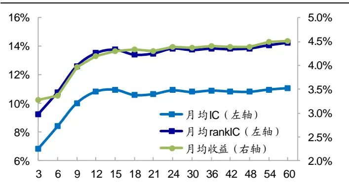
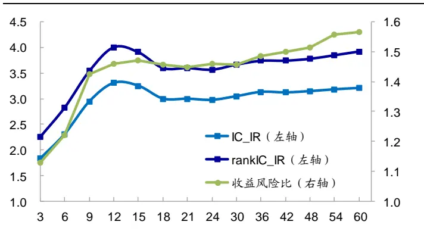
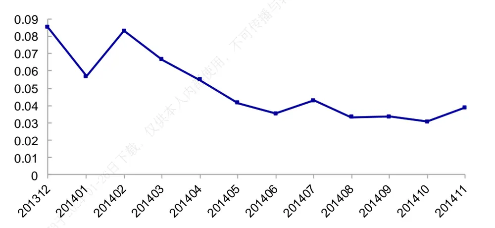
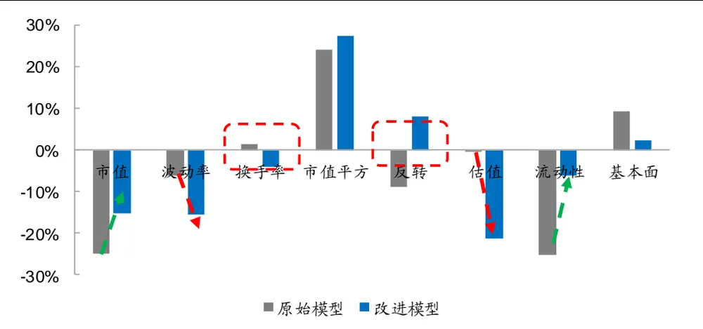
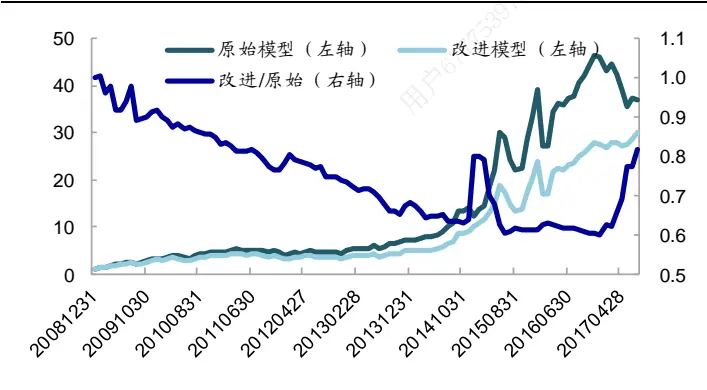
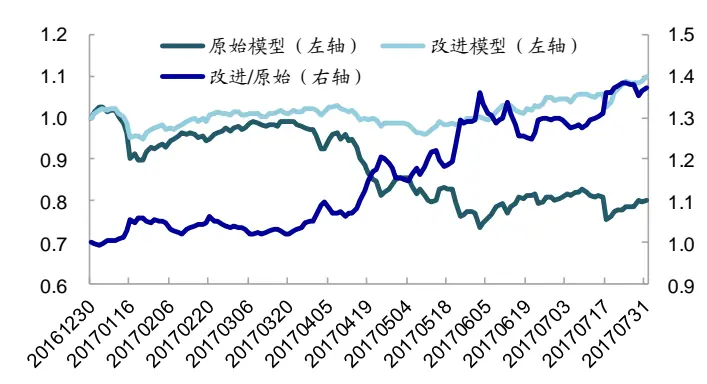
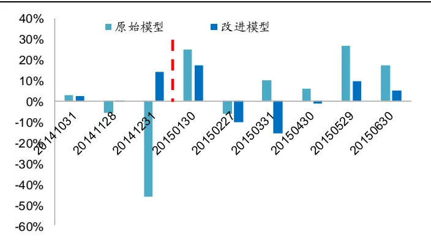
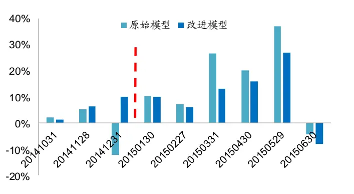
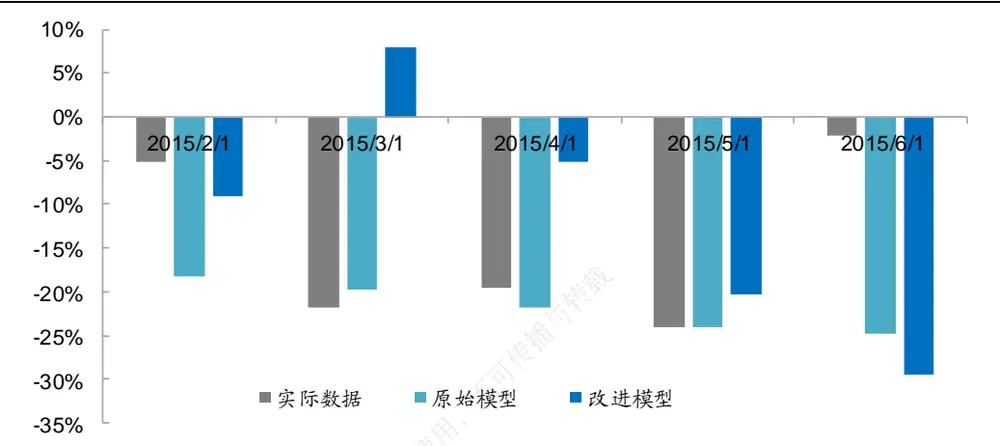

## 相关研究

Table_ReportInfo]《“量辨”第一期：中国经济下行风险犹存——利差曲线与中国经济增速的相关性分析》2017.08.17

《 系列研究之五——商品期货因子挖掘与组合构建再探究》2017.08.18《引入风险管理后的多因子选股框架与指数增强策略》2017.08.14

分析师:冯佳睿

Tel:(021)23219732

Email:fengjr@htsec.com

证书:S0850512080006

分析师:罗蕾

Tel:(021)23219984

Email:ll9773@htsec.com

证书:S0850516080002

# 选股因子系列研究（二十四）——基于拟合优度和波动率调整的因子溢价估计

## 投资要点：

本文主要探讨了采用固定时间窗口、等权预测因子溢价方法的局限性和适用性，并详细分析了基于数据时效性和参数波动性改进因子溢价预测的方法。

- 估计时间窗口的选取会影响收益率预测模型的表现。为提高收益率预测模型的预测精度，需有效选取时间窗口长度。时间窗口过长，因子溢价难以适应变动的市场环境；但时间窗口过短，干扰信息过多，也难以达到有效的估计目的。

- 指数加权移动平均法灵活性高。指数加权移动平均法可通过调整衰减速度，将距离当前时间点较远的数据点权重配臵为 0；因此在因子溢价估计过程中，时间窗口的选择问题，在一定程度上可转换为确定衰减速度的问题。此外，该方法将较大的权重放在较近的数据上，更能适应变动的市场环境。

基于拟合优度确定衰减速度的方法，可提高预测模型稳定性。拟合优度越低，反映当前时点异质程度越高，投资者对当前时点数据投入的关注度理应更多。因此拟合优度越低，指数加权移动平均法的参数衰减速度应设臵得越快。基于拟合优度确定衰减系数的方法，在没有明显降低模型平均预测能力的基础上，大幅降低了模型的波动性，从而可提高收益率预测模型的收益风险表现。

基于波动率调整的因子溢价值，可降低预测模型波动性。因子溢价估计的标准差越大，表明因子风险越高。即使其存在较高的风险溢价，但也有可能是由少数几个极端值引起的，因此可靠性并不高。在这种情况下，更为合理的因子溢价预测方法应该是经波动率调整后的因子溢价值。基于波动率调整的因子溢价能进一步降低模型的波动性，提升收益率预测模型的收益风险表现。

- 等权加权法与改进模型的对比。等权移动平均法的收益高，但风险也大，在较短时间内能将前期累计的收益全部损失掉，该方法更适合因子溢价在短期内得以修复的市场。而基于拟合优度确定衰减系数并根据波动率调整溢价的改进模型，更能适应反向变动的市场环境，在均值回复的时间段会损失小幅收益，但在风格切换的时间段则具备较强的风险抵御能力。需要注意的是，在因子失效后出现报复性反弹时，改进模型可能会大幅跑输等权加权法。整体而言，改进模型是以损失高收益阶段的部分收益，换取在因子失效即模型回撤阶段的正向收益，呈现风险平滑的作用。

风险提示。模型失效风险，因子历史规律失效风险。

传统的多因子模型由收益率预测和风险控制两个模块组成，对于收益率预测模块，关键在于确定 alpha 因子和估计因子溢价。在以往的模型中，我们通常用过去 24 个月的因子溢价平均值作为下期因子溢价的估计量，以此预测股票下期收益率。

但实际上，不同月份的数据对当前时点的影响各不相同，离当前时点越远，数据时效性越差，在溢价估计中的权重占比理应越小，而简单的等权平均的方式无法体现这种特征。本文主要考察了随时间衰减的指数移动平均法对收益率预测模型的影响，以及确定衰减速度参数的方法。

在下文分析过程中，我们的基准收益率预测模型共包含 8 个因子，它们分别是：市值、非线性市值、换手率、反转、波动率、估值、流动性以及基本面综合因子。其中，基本面综合因子的构建方式可参见《选股因子系列研究（二十三）——历史财务信息对股票收益的预测能力》（但需要注意的是，为保证覆盖度，本文在基本面综合因子的构建过程中，并未纳入流动比率）。回测区间为 2009 年初至 2017 年 7 月底。

## 1. 因子溢价估计窗口与模型表现

对于常规的多因子模型，假设有 m 个因子，通过横截面回归我们可获得每一期的因子溢价 $\mathbf{f}_{1,\mathfrak{t}},\dots,\mathbf{f}_{\mathsf{m},\mathfrak{t}}.$ 站在 T 月末；为预测个股在 T+1期的收益率，需利用以往各期的因子溢价值对 T+1 期各个因子的溢价进行估计。假设估计窗口为 NN_est，即采用过去NN_est 期的数据来预测因子溢价；则对于因子 i，其在 T+1 期的溢价估计量为：

$$
\hat{f}_{i,T+1}=w_{1}\cdot f_{i,T}+w_{2}\cdot f_{i,T-1}+\cdots+w_{NN\_est}\cdot f_{i,T-NN\_est+1}.
$$

其中，w为各期因子溢价的加权权重， $\mathsf{W_{1}+\ldots+W_{NN\_est}=1}$ 。在以往的回测过程中，我们通常采用等权方式来估算，即：

$$
\mathrm{W}=\left(w_{1},\cdots,w_{NN\_est}\right)=\left(\frac{1}{NN\_est},\cdots,\frac{1}{NN\_est}\right)
$$

在等权方法下，估计因子溢价关键在于选择时间窗口。若估计窗口过短，干扰信息过多，将难以达到有效的估计目的。下图展示了估计窗口为 3至 60 个月时，等权方法下多因子模型的 IC、rankIC、月均收益、IC_IR、rankIC_IR 以及收益风险比（月均收益/月度收益标准差）情况。从中可发现，当选取时间窗口过短，如一年以内时，多因子模型的表现远逊于其他情况；而时间窗口在 1年以上时，多因子模型之间的表现并无明显差异。

图1 不同估计窗口下的多因子模型收益表现

资料来源：Wind，海通证券研究所

图2 不同估计窗口下的多因子模型收益风险表现

资料来源：Wind，海通证券研究所

但时间窗口过长，将很难适应突变的市场环境。例如在 2014 年 11 月末，若是以 3个月作为因子溢价的估计窗口，则多因子模型在当年 12 月份的 IC 值（股票预测收益率与实际收益率的相关系数）为-0.0925；但若是以 24个月作为估计窗口，则 IC值为-0.4640。较短的估计窗口更能适应变动的市场环境，因此在 14 年底，采用 24 个月估计窗口的收益率预测模型产生的回撤会高于采用 3个月估计窗口的预测模型。

整体而言，数据来源离当前时点越远，估计量与当前值的相关性越小。因此时间窗口过长，因子溢价难以适应变动的市场环境；但时间窗口过短，干扰信息过多，也难以达到有效的估计目的。在构造收益率预测模型中，需选择有效估计窗口，以提高模型预测精度并适应变动的市场环境。

## 2. 指数加权移动平均估计

在前面的回测过程中，我们采用的是先确定估计时间窗口，然后将估计窗口内的因子溢价等权取平均的方式来估计下期因子溢价。实际上，我们可先确定一个相对较长的时间窗口，然后在各期之间采用指数加权移动平均的方法来估计溢价，通过调整该方法中的衰减速度，也能达到较短时间窗口下的预测效果。在比较两种方法的效果之前，我们先对指数移动加权平均法进行简单说明。

指数移动平均法是时间序列估计中经常使用的一种方法，它将较大的权重放在较近的数据上。具体而言，该方法的表达形式如下所示：

$$
EWMA(t+1)=\lambda\cdot Y(t)+(1-\lambda)\cdot EWMA(t-1)
$$

其中，EWMA(t)表示 t时刻的估计值，Y(t)表示 t时刻的测量值；λ为衰减速度，λ越大，当前值占的比重越大，过去值占的比重越小。实际上，上式可改写为：

$$
EWMA(t+1)=\lambda\cdot\Upsilon(t)+\lambda\cdot(1-\lambda)\cdot\Upsilon(t-1)+\lambda\cdot(1-\lambda)^2\cdot\Upsilon(t-2)+\cdots
$$

从上式可看出，在 t+1 期预测值的构建过程中，t-1时刻的测量值 Y(t-1)所占的权重是 t时刻测量值 Y(t)的 1-λ倍。换言之，λ越大，t-1时刻（离现在越远的时刻），其测量值所占的权重越小，因此λ可理解为衰减速度。

回到第 1部分的因子溢价估计公式中，采用指数加权移动平均法进行估计，相当于按照如下方式确定各期因子溢价的权重：

$$
\mathrm{W}=(w_{i})_{i=1,\cdots NN,est}=\left(\frac{\lambda}{1-(1-\lambda)^{NN,est}},\cdots,\frac{\lambda\cdot(1-\lambda)^{i-1}}{1-(1-\lambda)^{NN_{est}}},\cdots,\frac{\lambda\cdot(1-\lambda)^{NN,est-1}}{1-(1-\lambda)^{NN_{est}}}\right)_{i}
$$

下表统计了不同参数下，分别采用等权和指数加权移动平均法估计因子溢价的多因子表现情况。

表 1 等权加权与指数加权移动平均法对比

|  |  |  |  |  |  | 指数加权移动平均（估计窗口为 24 个月） |  |  |  |  |  |
| --- | --- | --- | --- | --- | --- | --- | --- | --- | --- | --- | --- |
| 估计窗口 | 指标值 | 均值 | 月胜率 | 标准差 | 收益风险 比1 | λ | 指标值 | 均值 | 月胜率 | 标准差 | 收益风险 比 |
|  | IC | 6.85% | 71.84% | 13.00% | 1.82 |  | IC | 7.33% | 71.84% | 12.77% | 1.99 |
| 3个月 | rank_IC | 9.25% | 77.67% | 14.21% | 2.26 | 0.5 | rank_IC | 9.71% | 76.70% | 14.20% | 2.37 |
|  | 月均收益 | 3.27% | 66.02% | 10.02% | 1.13 |  | 月均收益 | 3.51% | 67.96% | 10.27% | 1.18 |
|  | IC | 10.93% | 81.55% | 12.73% | 2.97 |  | IC | 10.91% | 82.52% | 12.60% | 3.00 |
| 24个月 | rank_IC | 13.87% | 88.35% | 13.45% | 3.57 | 0.01 | rank_IC | 13.83% | 88.35% | 13.32% | 3.60 |
|  | 月均收益 | 4.39% | 68.93% | 10.40% | 1.46 |  | 月均收益 | 4.36% | 68.93% | 10.34% | 1.46 |

资料来源： ，海通证券研究所
注：1.收益风险比为 sqrt(12)*指标均值/指标标准差。

从中可看出，在 24 个月的窗口估计下，若衰减速度设臵得很小，接近于 0，如 0.01，则经等权和指数加权移动平均法处理的多因子模型预测精度无明显差异。其中，等权加权的 IC 均值为 10.93%，IC_IR 为 2.97；而指数加权移动平均法下 IC 均值为 10.91%，IC_IR 为 3.00，两者差异很小。这是因为当衰减速度很小时，各期因子溢价的加权权重接近于等权。

同样地，若将衰减速度设臵得很大，如 0.5，则在 24 个月时间窗口下采用指数加权移动平均法估计因子溢价的多因子模型预测精度，与估计窗口很小（如 个月）时采用等权法预测因子溢价的多因子模型差异很小。其中，3 个月等权加权的 IC均值为 6.85%，为 ；而指数加权移动平均法下 均值为 ， 为 。这主要是由于，当衰减速度设臵很大时，离现在相对较远时点的权重接近于 0，此时若较近时点的各期溢价无明显差异，则指数移动加权平均法类似于较短时间窗口内的等权加权法。

综上所述，由于指数加权移动平均法可通过调整衰减速度，将距离当前时间点较远的数据点权重配臵为 ；因此在因子溢价估计过程中，时间窗口的选择问题，在一定程度上可转换为确定衰减速度的问题。此外，该方法将较大的权重放在较近的数据上，更能适应变动的市场环境。因此本文余下部分主要探讨指数加权移动平均法下的收益预测模型。

## 3. 基于模型拟合优度和波动率调整的因子溢价估计方法

对于指数加权移动平均法，关键在于确定衰减速度参数λ。但任何时候采用同样的衰减速度显然过于主观；而采用全样本最优的参数来测算，则存在过拟合的可能，从而导致样本外表现不尽如人意。

本文主要探讨基于拟合优度确定衰减速度的方法。直观而言，拟合优度越低，反映当前时点异质程度越高，投资者对当前时点数据投入的关注度理应更多。因此在配臵过程中，拟合优度越低，应将衰减速度设臵得越快，即λ越大。

## 3.1 基于拟合优度确定衰减系数

在本小节的回测过程中，我们统一采用 24 个月的时间窗口（下文会讨论估计窗口对模型的影响）数据来估计因子溢价，加权方式为指数加权移动平均法。以 NN_est 代表估计时间窗口长度；衰减速度最小取值为 0.01（接近于等权），记之为 $\lambda_{\mathrm{{\sf{min}}}};$ 最大取值为 0.5（即后一期的权重是前一期的二分之一），记之为 $\lambda_{\mathrm{max}}.$ 。则按照前文所述的逻辑，我们基于如下方法确定 T 期的衰减系数 $\lambda_{\mathrm{~T~}}$

（1） 利用 t月每一交易日收益率数据，对 t-1月末的因子值进行横截面回归，获得当月日度拟合优度的平均值 $|\bar{R}_{t}^{2}$ ；

（2） 在 T 月末，将过去 NN_est 期的拟合优度即 $\bar{R}_{T}^{2},\quad\bar{R}_{T-1}^{2},\quad\cdots,\quad\bar{R}_{T-NN\_est+1}^{2}$ ，按照从大到小的顺序排序，并找出当月拟合优度所处的位臵，记之为 Rank ；

（3） 如前所述，当前拟合优度越小，λ取值应越大；λ由如下计算公式获取：

$$
\lambda_{T}=\lambda_{min}+\left(Rank_{T}-1\right)\cdot\frac{\lambda_{max}-\lambda_{min}}{NN_{est}-1},
$$

从上式可看出，若当前拟合优度在过去 NN_est 期中属于最小的一期（即 Rank 取值为 NN_est），则当期衰减速度取最大值 $\lambda_{\mathrm{max}};$ 若拟合优度在过去 NN_est 期中属于最大的一期（即 $\mathsf{Rank}_{\mathsf{T}}$ 取值为 1），则当期衰减速度取最小值 $\lambda_{\mathrm{min}}.$ 。即当期拟合优度越大，各期权重越倾向于等权；拟合优度越小，衰减速度越快，近期数据所占比重越大。下文中我们将上述方法简称为自适应指数加权移动平均法。

下表中，我们对比了 24 个月估计窗口下，基于等权和自适应指数加权移动平均法确定因子溢价的多因子模型表现情况。从中可看出，改进模型的 IC 均值相对于原始模型略微降低，但同时波动性也大幅降低；整体而言，对于收益风险指标即多因子模型的

IC_IR，改进模型相对于原始模型有所提升。
表 2 自适应指数加权移动平均法下的收益率预测模型效果

|  | IC（Pearson 相关系数） |  |  |  | RankIC（秩相关系数） |  |  |  |
| --- | --- | --- | --- | --- | --- | --- | --- | --- |
|  | 均值 | 月胜率 | 标准差 | IC_IR | 均值 | 月胜率 | 标准差 | IC_IR |
| 原始模型 | 10.93% | 81.55% | 12.73% | 2.97 | 13.87% | 88.35% | 13.45% | 3.57 |
| 改进模型 | 10.38% | 84.47% | 11.08% | 3.24 | 13.14% | 87.38% | 12.00% | 3.79 |

资料来源：Wind，海通证券研究所

如前所述，指数加权移动平均法的优势在于给予较近日期的数据较大权重，因此更能适应变动的市场环境，我们以 2014 年 12 月份为例进行说明。

实际上，自 2014 年年初以来，前述包含 8 个因子的收益率预期模型其拟合优度呈现逐渐下降的态势（下图），表明市场中模型外的异质程度逐渐增加，投资者应对较近时点给予更多的关注。在自适应指数加权移动平均法下，最近一个月（ 年 月）的拟合优度在过去 个月中排名第 （从大到小排序），因此衰减速度取值较大。

图3 收益率预测模型拟合优度走势（2013年 12月-2014年 11月）

资料来源：Wind，海通证券研究所

下表展示了基于指数加权移动平均法确定的改进模型与基于等权加权的原始模型对2014 年 12 月份因子溢价的估计，及其所对应的收益率预期模型表现情况。从中可看出，改进模型相对于原始模型主要有以下几个方面的变动：

- 反转因子溢价符号由负转正，改进模型在 12 月份配臵动量因子；

换手率因子溢价符号由正转负，改进模型在 12 月份会配臵前期换手偏低的股票，而原始模型会配臵前期换手高的股票；

从权重来看，改进模型会大幅增加波动率和估值因子的权重，而降低在市值和流动性因子上的权重；

- 从结果来看，改进模型获得了正向 IC，而原始模型产生极大回撤。

表 3 自适应指数加权移动平均法 2014年 12月份的因子溢价估计及其表现

|  | 市值 | 波动率 | 换手率 | 市值平方 | 反转 | 估值 | 流动性 | 基本面 | IC | rankIC | 月度收益 |
| --- | --- | --- | --- | --- | --- | --- | --- | --- | --- | --- | --- |
| 原始模型 | -0.0091 | -0.0023 | 0.0005 | 0.0088 | -0.0032 | -0.0001 | -0.0092 | 0.0034 | -0.4640 | -0.3834 | -12.30% |
| 改进模型 | -0.0088 | -0.0090 | -0.0023 | 0.0159 | 0.0047 | -0.0124 | -0.0036 | 0.0013 | 0.0258 | 0.0161 | -1.88% |

资料来源：Wind，海通证券研究所

图4 2014年 12月原始模型与改进模型因子权重对比

资料来源： ，海通证券研究所
注：该图中权重为负表明因子溢价符号为负，各因子权重的绝对值之和为1。

综上所述，基于拟合优度确定衰减系数的方法，在没有明显降低模型平均预测能力的基础上，大幅降低了模型的波动性，从而提高了模型的收益风险表现。

## 3.2 基于波动率调整的因子溢价预测

在因子溢价预测过程中，可考虑的改进方式除时间加权方式外，还包括因子溢价的横截面调整。若从相对高频的角度来看，因子溢价估计的标准差很大，表明该因子近期风险很高。即使其存在较高的风险溢价，但也有可能是由少数几个极端值引起的，因此可靠性并不高。在这种情况下，更为合理的因子溢价预测方法应该是经波动率调整后的因子溢价值。

在具体实践过程中，我们采用日度收益率数据进行横截面回归，获取各因子的日度溢价序列，从而求得各因子溢价序列当月的波动率。将前期确定的因子溢价值除以波动率，即可求得经参数估计标准差调整后的预测值。

我们以前文所述的自适应指数加权移动平均估计法为基准，对比了波动率调整前后收益率预测模型的效果，结果如下表所示。从中可看出，经波动率调整后的预测模型，其风险大幅降低：月胜率有所提高，IC 波动率也大幅降低；但 IC 均值与调整前的模型无明显区别。因此经波动率调整后的因子溢价预测值提高了收益率预测模型的 ICIR 表现。

表 4 经波动率调整的收益率预测模型效果

|  | IC（Pearson 相关系数） |  |  |  | RankIC（秩相关系数） |  |  |  |
| --- | --- | --- | --- | --- | --- | --- | --- | --- |
|  | 均值 | 月胜率 | 标准差 | ICIR | 均值 | 月胜率 | 标准差 | ICIR |
| 自适应移动平均 | 10.38% | 84.47% | 11.08% | 3.24 | 13.14% | 87.38% | 12.00% | 3.79 |
| 自适应移动平均 +波动率调整 | 10.17% | 86.41% | 10.17% | 3.46 | 13.07% | 90.29% | 10.75% | 4.21 |

资料来源：Wind，海通证券研究所

综上所述，基于波动率调整的因子溢价能进一步降低模型的波动性，提升收益率预测模型的收益风险表现。

## 3.3 因子溢价估计方法改进

综前所述，本文所提及的因子溢价预测改进方法主要包括两个步骤：

（1） 根据拟合优度确定衰减系数，近期拟合优度越小，衰减速度越快；并在衰减系数基础上以指数加权移动平均法确定初步因子溢价预测值；

（2） 将第（1）步得到的因子溢价值采用波动率进行调整，得到最终因子溢价预测。

我们将采用上述两个步骤确定的收益率预测模型称之为改进模型。需要注意的是，上述两个步骤中起决定性作用的是第（1）个步骤，因为它有可能改变因子溢价的符号；而第 2个步骤仅根据波动率对因子溢价的幅度进行微调。

下表中我们统计了不同时间窗口下，因子溢价预测改进模型的预测精度情况。从中可看出，在 1-5 年的估计窗口下，模型差异很小：IC 均值在 10%左右波动，月胜率基本稳定在 85%，标准差在 10%左右，相应的 ICIR 值基本在 3.4-3.6 之间波动。

表 5 不同时间窗口下的收益率预测模型效果

|  | IC（Pearson 相关系数） |  |  |  | RankIC（秩相关系数） |  |  |  |
| --- | --- | --- | --- | --- | --- | --- | --- | --- |
|  | 均值 | 月胜率 | 标准差 | ICIR | 均值 | 月胜率 | 标准差 | ICIR |
| 1年 | 9.63% | 84.47% | 10.40% | 3.21 | 12.54% | 91.26% | 10.90% | 3.98 |
| 2年 | 10.17% | 86.41% | 10.17% | 3.46 | 13.07% | 90.29% | 10.75% | 4.21 |
| 3年 | 10.36% | 86.41% | 10.10% | 3.56 | 13.26% | 91.26% | 10.56% | 4.35 |
| 4年 | 10.42% | 84.47% | 10.02% | 3.60 | 13.37% | 92.23% | 10.52% | 4.40 |
| 5年 | 10.45% | 85.44% | 10.11% | 3.58 | 13.42% | 92.23% | 10.58% | 4.39 |

资料来源：Wind，海通证券研究所

## 3.4 改进模型与原始模型收益表现对比

为进一步理解改进模型与原始模型的差异，我们可基于收益率预测模型选择预期收益率最高的 100 只股票构建等权组合（TOP100 组合），比较它们的净值走势。下图分别展示了该组合在整个回测区间及 2017 年以来的净值情况。

图5 TOP100 组合净值走势（2010.01-2017.07）

资料来源：Wind，海通证券研究所

图6 TOP100 组合净值走势（2017.01-2017.07）

资料来源：Wind，海通证券研究所

从净值走势对比图可看出，在大部分时间内，改进模型 TOP100 组合会跑输原始模型；但在风格急剧切换并有延续趋势时，改进模型相对于原始模型存在明显优势，例如2014 年底和 2017 年。

这主要是由于在过去几年，整体而言各因子的 alpha 呈现均值回复特征。换言之，当某个因子出现负向收益时，其在后一个月存在更大的可能性出现收益补偿，回归正常水平。例如 2014 年底，虽然市值因子出现大幅回撤，但其失效时间也仅持续三个月；到 年，小市值依旧大幅跑赢大市值，且其收益甚至超过 年底的回撤。在这种情况下，基于因子收益动量的指数移动平均法难以跑赢等权平均法。但当风格出现切换，并得以延续时，指数移动平均法的优势便得以体现。

为进一步对比两者的差异，我们在下表中统计了收益率预测原始模型与改进模型分年度的 IC（模型预期收益率与实际收益率的相关系数）及 TOP100 等权股票组合的收益表现情况。

表 6 原始模型与改进模型分年度表现对比（2009.01-2017.07）

|  | 原始模型 |  |  |  | 自适应移动平均 |  |  |  | 自适应移动平均+波动率调整 |  |  |  |
| --- | --- | --- | --- | --- | --- | --- | --- | --- | --- | --- | --- | --- |
|  | IC 均值 | IC 月胜 率 | ICIR | TOP100 收益率 | IC月胜 IC 均值 率 | ICIR | TOP100 收益率 | IC 均值 | IC月胜 率 | ICIR |  | TOP100 收益率 |
| 2009 | 13.89% | 91.67% | 4.57 | 229.35% | 11.11% | 91.67% 3.90 |  | 201.46% | 10.92% | 91.67% | 4.01 | 202.44% |
| 2010 | 9.79% | 75.00% | 2.27 | 39.71% | 9.78% | 75.00% 2.25 |  | 30.02% | 9.18% | 75.00% | 2.34 | 26.48% |
| 2011 | 10.82% | 91.67% | 4.58 | -13.32% | 8.24% | 75.00% 3.71 |  | -15.63% | 8.77% | 91.67% | 5.07 | -18.31% |
| 2012 | 10.83% | 91.67% | 5.44 | 21.72% | 8.44% | 91.67% 3.23 |  | 13.20% | 6.76% | 75.00% | 2.65 | 13.98% |
| 2013 | 8.00% | 66.67% | 2.67 | 45.47% | 8.98% | 83.33% | 3.68 | 49.89% | 8.60% | 91.67% | 4.27 | 34.94% |
| 2014 | 7.89% | 83.33% | 1.36 | 75.06% | 10.64% | 91.67% 3.69 |  | 87.38% | 11.17% | 91.67% | 4.31 | 106.05% |
| 2015 | 17.51% | 91.67% | 4.90 | 215.46% | 11.61% | 66.67% | 2.36 | 146.20% | 11.83% | 75.00% | 2.61 | 140.98% |
| 2016 | 16.06% | 91.67% | 5.20 | 17.83% | 13.06% | 91.67% | 3.97 | 16.57% | 12.48% | 91.67% | 3.94 | 14.85% |
| 2017 | -1.67% | 28.57% | -0.52 | -19.82% | 12.38% | 100.00% | 4.19 | 3.09% 49.06% | 12.98% 10.17% | 100.00% | 5.27 | 9.92% |
| 全样本 | 10.93% | 81.55% | 2.97 | 52.01% | 10.38% | 84.47% | 3.24 |  |  | 86.41% | 3.46 | 48.50% |

资料来源：Wind，海通证券研究所

表格结果显示，分年度来看，改进模型仅在 2014 年和 2017 年大幅跑赢原始模型；而在其余时间后者相对于前者均存在小幅超额收益。从全样本来看， 组合年化收益 52.0%，而改进模型年化收益也有 48.5%；从收益率预测模型的 IC来看，均为 10%左右，但改进模型的稳定性明显高于原始模型：其胜率、 均高于原始模型。也就是说，虽然改进模型跑输基准模型的时间范围广，但整体而言两者收益表现并无明显差异。

需要注意的是，如前所述，改进模型也存在一定的风险。在因子溢价修复阶段，即因子由持续失效转为持续有效阶段，改进模型的效果将不如原始模型；失效及修复时间时间越长，改进模型相对原始模型的回撤越大。我们以 2014 年底至 2015 年的风格切换案例对上述特点进行具体说明。

2014 年底，市值因子出现 3 个月的持续失效，大市值股票大幅跑赢小市值。如前所述，在这个时间段，由于改进模型更能适应变动的市场环境，因此改进模型相对原始模型存在明显超额收益。

图7 原始模型与改进模型 IC 对比（2014.10-2015.06）

资料来源：Wind，海通证券研究所

图8 原始模型与改进模型 TOP100组合月收益对比

资料来源：Wind，海通证券研究所

但进入 2015 年，在 1-6 月份，市值因子出现报复性反弹，收益率预期模型的 IC 明显高于历史平均水平，TOP100 股票组合也获得显著正向收益，但此时改进模型却持续地跑输原始模型。

从市值因子角度来看，该因子在 2014 年底失效后出现报复性反弹：在 2015 年 2至6月份，小市值平均溢价2.26%，而此前历史（2009.01-2015.06）平均溢价仅为0.81%。此时，若采用过去 24 个月的等权平均法估计市值溢价，市值因子在多因子模型中的权重将会更接近实际情况。而若采用指数加权移动平均法进行估计，则该因子的溢价预测将会受 2014 年底反向溢价的影响，预测值会远低于实际水平。从下图市值因子权重对比图中也可看出，原始预测模型得到的市值权重更接近实际水平，而改进模型与实际数据得到的权重偏离更大。因此无论是从 IC 还是 TOP100 组合月度收益角度来看，原始模型均明显优于改进模型。

图9 2015年 2-6月原始模型与改进模型中市值因子的权重对比

资料来源：Wind，海通证券研究所

综合而言，等权移动平均法的收益高，但风险也大，在较短时间内能将前期积累的收益全部损失掉，该方法更适合因子溢价在短期内得以修复的市场。而基于拟合优度确定衰减系数并根据波动率调整溢价的改进模型，更能适应反向变动的市场环境，在均值回复的时间段会损失小幅收益，但在风格切换的时间段则具有较强的风险抵御能力。整体而言，改进模型是以损失高收益阶段的部分收益，换取在因子失效即模型回撤阶段的正向收益，具有风险平滑的作用。

## 4. 结论

本文主要探讨了采用固定时间窗口、等权预测因子溢价方法的局限性和适用性，并详细分析了基于数据时效性和参数波动性改进因子溢价预测的方法。

为提高收益率预测模型的预测精度，需有效选取时间窗口长度。时间窗口过长，因子溢价难以适应变动的市场环境；但时间窗口过短，干扰信息过多，也难以达到有效的估计目的。

指数加权移动平均法可通过调整衰减速度，将距离当前时间点较远的数据点权重配臵为 0；因此在因子溢价估计过程中，时间窗口的选择问题，在一定程度上可转换为确定衰减速度的问题。此外，该方法将较大的权重放在较近的数据上，更能适应变动的市场环境。

拟合优度越低，反映当前时点异质程度越高，投资者对当前时点数据投入的关注度理应更多。因此拟合优度越低，指数加权移动平均法的参数衰减速度应设臵得越快。基于拟合优度确定衰减系数的方法，在没有明显降低模型平均预测能力的基础上，大幅降低了模型的波动性，从而可提高收益率预测模型的收益风险表现。

此外，因子溢价估计的标准差越大，表明因子风险越高。即使其存在较高的风险溢价，但也有可能是由少数几个极端值引起的，因此可靠性并不高。在这种情况下，更为合理的因子溢价预测方法应该是经波动率调整后的因子溢价值。基于波动率调整的因子溢价能进一步降低模型的波动性，提升收益率预测模型的收益风险表现。

从等权加权法和本文的改进模型对比来看，等权移动平均法的收益高，但风险也大，在较短时间内能将前期积累的收益全部损失掉，该方法更适合因子溢价在短期内得以修复的市场。而基于拟合优度确定衰减系数并根据波动率调整溢价的改进模型，更能适应变动的市场环境，在均值回复的时间段会损失小幅收益，但在风格切换的时间段则具有较强的风险抵御能力。整体而言，改进模型是以损失高收益阶段的部分收益，换取在因子失效即模型回撤阶段的正向收益，具有风险平滑的作用。

## 5. 风险提示

模型失效风险，因子历史规律失效风险。

# 信息披露

分析师声明

[Table冯佳睿yst金融工程研究团队s]

罗蕾金融工程研究团队

本人具有中国证券业协会授予的证券投资咨询执业资格，以勤勉的职业态度，独立、客观地出具本报告。本报告所采用的数据和信息均来自市场公开信息，本人不保证该等信息的准确性或完整性。分析逻辑基于作者的职业理解，清晰准确地反映了作者的研究观点，结论不受任何第三方的授意或影响，特此声明。

## 法律声明

本报告仅供海通证券股份有限公司（以下简称 本公司 ）的客户使用。本公司不会因接收人收到本报告而视其为客户。在任何情况下，本报告中的信息或所表述的意见并不构成对任何人的投资建议。在任何情况下，本公司不对任何人因使用本报告中的任何内容所引致载的任何损失负任何责任。

本报告所载的资料、意见及推测仅反映本公司于发布本报告当日的判断，本报告所指的证券或投资标的的价格、价值及投资收入可能传会波动。在不同时期，本公司可发出与本报告所载资料、意见及推测不一致的报告。不

市场有风险，投资需谨慎。本报告所载的信息、材料及结论只提供特定客户作参考，不构成投资建议，也没有考虑到个别客户特殊的投资目标、财务状况或需要。客户应考虑本报告中的任何意见或建议是否符合其特定状况。在法律许可的情况下，海通证券及其所属关联机构可能会持有报告中提到的公司所发行的证券并进行交易，还可能为这些公司提供投资银行服务或其他服务。

本报告仅向特定客户传送，未经海通证券研究所书面授权，本研究报告的任何部分均不得以任何方式制作任何形式的拷贝、复印件或仅复制品，或再次分发给任何其他人，或以任何侵犯本公司版权的其他方式使用。所有本报告中使用的商标、服务标记及标记均为本公载，司的商标、服务标记及标记。如欲引用或转载本文内容，务必联络海通证券研究所并获得许可，并需注明出处为海通证券研究所，且日不得对本文进行有悖原意的引用和删改。-2

根据中国证监会核发的经营证券业务许可，海通证券股份有限公司的经营范围包括证券投资咨询业务。02

## 海通证券股份有限公司研究所[Table_PeopleInfo]

| 路颖 所长 (021)23219403 luying@htsec.com | 高道德 副所长 (021)63411586 | gaodd@htsec.com | 姜超 副所长 (021)23212042 jc9001@htsec.com |
| --- | --- | --- | --- |
| 江孔亮 副所长 (021)23219422 kljiang@htsec.com | 邓勇 所长助理 (021)23219404 dengyong@htsec.com | 荀玉根 | 所长助理 (021)23219658 xyg6052@htsec.com |
| 钟奇 所长助理 (021)23219962 zq8487@htsec.com |  |  |  |
| 姜 超(021)23212042 jc9001@htsec.com 顾潇啸(021)23219394 gxx8737@htsec.com | 高道德(021)63411586 冯佳睿(021)23219732 | gaodd@htsec.com fengjr@htsec.com | 高道德(021)63411586 gaodd@htsec.com 倪韵婷(021)23219419 niyt@htsec.com |
| 于 博(021)23219820 yb9744@htsec.com | 郑雅斌(021)23219395 | zhengyb@htsec.com | 陈 瑶(021)23219645 chenyao@htsec.com |
| 梁中华(021)23154142 Izh10403@htsec.com | 罗 蕾(021)23219984 | I19773@htsec.com | 唐洋运(021)23219004 tangyy@htsec.com |
| 联系人 | 沈泽承(021)23212067 余浩淼(021)23219883 | szc9633@htsec.com | 宋家骥(021)23212231 sjj9710@htsec.com |
| 李金柳(021)23219885 ljl11087@htsec.com 宋 潇(021)23154483 sx11788@htsec.com | 袁林青(021)23212230 | yhm9591@htsec.com ylq9619@htsec.com 联系人 | 薛 涵 xh11528@htsec.com |
|  | 联系人 周一洋(021)23219774 姚 石(021)23219443 | zyy10866@htsec.com 皮 ys10481@htsec.com 王 吕丽颖(021)23219745 lly10892@htsec.com 蔡思圆(021)23219433 | 谈鑫(021)23219686 tx10771@htsec.com 灵(021)23154168 pl10382@htsec.com 毅(021)23219819 wy10876@htsec.com |
|  | 张振岗(021)23154386 颜 伟(021)23219914 yw10384@htsec.com 史霄安 sxa11398@htsec.com | zzg11641@htsec.com | 徐燕红(021)23219326 xyh10763@htsec.com 庄梓恺 zzk11560@htsec.com |
| 固定收益研究团队 姜 超(021)23212042 jc9001@htsec.com | 策略研究团队 荀玉根(021)23219658 | xyg6052@htsec.com | 中小市值团队 |
| 周 霞(021)23219807 zx6701@htsec.com 朱征星(021)23219981 zzx9770@htsec.com | 钟 青(010)56760096 高 上(021)23154132 | zq10540@htsec.com gs10373@htsec.com | 张 宇(021)23219583 zy9957@htsec.com 钮宇鸣(021)23219420 ymniu@htsec.com |
| 姜珮珊(021)23154121 jps10296@htsec.com | 郑英亮(021)23154147 | zyl10427@htsec.com | 刘 宇(021)23219608 liuy4986@htsec.com 孔维娜(021)23219223 kongwn@htsec.com |
| 联系人 杜佳（021）23154149 dj11195@htsec.com | 联系人 姚 佩(021)23154184 | yp11059@htsec.com | 潘莹练(021)23154122 pyl10297@htsec.com 联系人 |
| 李 波 lb11789@htsec.com | 唐一杰021-23219406 李 影(021)23154147 | tyj11545@htsec.com ly11082@htsec.com | 王鸣阳(021)23219356 wmy10773@htsec.com 程碧升(021)23154171 cbs10969@htsec.com |
| 政策研究团队 |  |  | 相 姜(021)23219945 xj11211@htsec.com |
| 李明亮(021)23219434 Iml@htsec.com | 石油化工行业 邓 勇(021)23219404 |  | 医药行业 |
| 陈久红(021)23219393 chenjiuhong@htsec.com | 朱军军(021)23154143 | dengyong@htsec.com zjj10419@htsec.com | 余文心(0755)82780398 ywx9461@htsec.com |
| 吴一萍(021)23219387 wuyiping@htsec.com zl8316@htsec.com | 毛建平(021)23154134 | mjp10376@htsec.com | 郑 琴(021)23219808 zq6670@htsec.com 孙 建(021)23154170 sj10968@htsec.com |
| 朱 蕾(021)23219946 周洪荣(021)23219953 zhr8381@htsec.com | 殷奇伟(021)23154139 | yqw10381@htsec.com | 师成平(010)50949927 scp10207@htsec.com |
| 王 旭(021)23219396 wx5937@htsec.com | 联系人 |  | 联系人 |
|  | 胡 歆 021-23154505 | hx11853 | 贺文斌(010)68067998 hwb10850@htsec.com |
|  |  |  | 刘 浩(010)56760098 Ih11328@htsec.com |
|  |  |  | 吴佳栓 01056760092 wjs11852@htsec.com |
| 汽车行业 | 公用事业 |  | 批发和零售贸易行业 |
| 邓 学(0755)23963569 dx9618@htsec.com | 张一弛(021)23219402 | zyc9637@htsec.com |  |
| 杜 威0755-82900463 dw11213@htsec.com | 张 磊(021)23212001 | zl10996@htsec.com | 汪立亭(021)23219399 wanglt@htsec.com |
| 谢亚彤(021)23154145 xyt10421@htsec.com | 赵树理(021)23219748 | zsl10869@htsec.com | 王 晴(021)23154116 wq10458@htsec.com |
| 联系人 | 联系人 |  | 李宏科（021）23154125Ihk11523@htsec.com 联系人 |
| 王 猛(021)23154017 wm10860@htsec.com | 陈佳彬(021)23154509 | cjb11782@htsec.com | 史岳（021）23154135 sy11542@htsec.com |
| 互联网及传媒 | 傅逸帆(021)23154398 | fyf11758@htsec.com |  |
| 钟 奇(021)23219962 zq8487@htsec.com | 有色金属行业 |  |  |
| 郝艳辉(010)58067906 hyh11052@htsec.com |  |  | 房地产行业 |
| 许樱之 xyz11630@htsec.com | 联系人 | 施 毅(021)23219480 sy8486@htsec.com | 涂力磊(021)23219747 tll5535@htsec.com |
| 孙小雯(021)23154120 sxw10268@htsec.com | 杨 娜(021)23154135 |  | 谢 盐(021)23219436 xiey@htsec.com |
| 联系人 |  | yn10377@htsec.com |  |
|  |  |  | 联系人 |
|  |  | 李姝醒(021)23219401 Isx11330@htsec.com | 杨 凡(021)23219812 yf11127@htsec.com |
|  |  | 陈晓航 cxh11840@htsec.com | jj10777@htsec.com |
|  |  |  | 金 晶(021)23154128 |
| 强超廷(021)23154129 qct10912@htsec.com |  |  |  |
|  | 李 骥 lj11875@htsec.com |  |  |
| 毛云聪(010)58067907 myc11153@htsec.com |  |  |  |
| 刘 欣(010)58067933 3lx11011@htsec.com |  |  |  |
| 唐 宇(021)23219389 ty11049@htsec.com |  |  |  |
| 陈星光 cxg11774@htsec.com |  |  |  |

| 电子行业 |  | 煤炭行业 |  | 电力设备及新能源行业 |  |
| --- | --- | --- | --- | --- | --- |
| 陈 平(021)23219646 联系人 | cp9808@htsec.com | 吴杰(021)23154113 李 淼(010)58067998 | wj10521 @htsec.com Im10779@htsec.com | 杨 帅(010)58067929 房 青(021)23219692 徐柏乔(021)32319171 | ys8979@htsec.com fangq@htsec.com xbq6583@htsec.com |
| 谢 磊(021)23212214 xl10881@htsec.com 张天闻 ztw11086@htsec.com 尹 苓(021)23154119 yl11569@htsec.com 石 |  |  |  |  |  |
| 坚 sj11855@htsec.com |  |  |  | 曾 彪(021)23154148 | zb10242@htsec.com |
| 基础化工行业 | 计算机行业 | 郑宏达(021)23219392 |  | 通信行业 朱劲松(010)50949926 |  |
| 刘 威(0755)82764281 |  |  |  |  |  |
| 刘 强(021)23219733 | Iw10053@htsec.com lq10643@htsec.com | 谢春生(021)23154123 | zhd10834@htsec.com xcs10317@htsec.com | 联系人 | zjs10213@htsec.com |
| 刘海荣(021)23154130 |  | 鲁 立 II11383@htsec.com |  | 庄 宇(010)50949926 | zy11202@htsec.com |
| 联系人 | Ihr10342@htsec.com | 黄竞晶(021)23154131 | hjj10361@htsec.com | 余伟民(010)50949926 | ywm11574@htsec.com |
| 张翠翠 zcc11726@htsec.com |  | 杨 林(021)23154174 联系人 | yl11036@htsec.com | 张峥青 zzq11650@htsec.com |  |
|  |  | 洪 琳(021)23154137 | hl11570@htsec.com |  |  |
| 非银行金融行业 孙 婷(010)50949926 | st9998@htsec.com | 交通运输行业 虞 楠(021)23219382 |  | 纺织服装行业 唐 苓(021)23212208 |  |
| 何 婷(021)23219634 | ht10515@htsec.com | 张 杨(021)23219442 | yun@htsec.com zy9937@htsec.com | 梁 希(021)23219407 | tl9709@htsec.com lx11040@htsec.com |
| 联系人 |  | 联系人 |  | 于旭辉(021)23219411 | yxh10802@htsec.com |
| 夏昌盛(010)56760090 | xcs10800@htsec.com | 童 宇(021)23154181 | ty10949@htsec.com | 联系人 |  |
| 李芳洲(021)23154127 | Ifz11585@htsec.com | 李 丹 021-23154401 | Id11766@htsec.com | 马 榕(021)23219431 | mr11128@htsec.com |
| 建筑建材行业 |  |  |  |  |  |
| 邱友锋(021)23219415 | qyf9878@htsec.com | 沈伟杰(021)23219963 | swj11496@htsec.com | 钢铁行业 刘彦奇(021)23219391 | liuyq@htsec.com |
| 冯晨阳(021)23212081 | fcy10886@htsec.com | 佘炜超(021)23219816 | swc11480@htsec.com | 联系人 |  |
| 钱佳佳(021)23212081 | qjj10044@htsec.com | 耿 耘(021)23219814 | gy10234@htsec.com | 刘 璇(021)23219197 | lx11212@htsec.com |
| 联系人 |  | 杨 震(021)23154124 | yz10334@htsec.com | 周慧琳(021)23154399 | zhl11756@htsec.com |
| 周 俊 0755-23963686 zj11521@htsec.com |  |  |  |  |  |
| 建筑工程行业 |  |  |  |  |  |
| 杜市伟 dsw11227@htsec.com |  | 丁 频(021)23219405 | dingpin@htsec.com | 食品饮料行业 闻宏伟(010)58067941 | whw9587@htsec.com |
| 联系人 |  | 陈雪丽(021)23219164 | cxl9730@htsec.com | 成珊(021)23212207 | cs9703@htsec.com |
| 毕春晖(021)23154114 bch10483@htsec.com |  | 陈 阳(010)50949923 联系人 | cy10867@htsec.com |  |  |
|  |  | 关 慧(021)23219448 | gh10375@htsec.com |  |  |
|  |  | 夏越(021)23212041 | xy11043@htsec.com |  |  |
| 军工行业 | 银行行业 |  |  | 社会服务行业 |  |
| 徐志国(010)50949921 xzg9608@htsec.com 刘 磊(010)50949922 |  |  |  |  |  |
| 蒋 俊(021)23154170 | II11322@htsec.com | 林媛媛(0755)23962186 林瑾璐Uljl11126@htsec.com | lyy9184@htsec.com | 李铁生(010)58067934 联系人 | Its10224@htsec.com |
| 联系人 | jj11200@htsec.com | 联系人 谭敏沂 tmy10908@htsec.com |  | 陈扬扬(021)23219671 顾熹闽 021-23154388 | cyy10636@htsec.com gxm11214@htsec.com |
| 张恒晅(010)68067998 zhx10170@hstec.com |  |  |  |  |  |
| 张宇轩 zyx11631@htsec.com |  |  |  |  |  |
| 家电行业 |  | 造纸轻工行业 |  |  |  |
| 陈子仪(021)23219244 chenzy@htsec.com |  |  |  |  |  |
|  |  | 曾 知(021)23219810 zz9612@htsec.com |  |  |  |
| 联系人 |  | 联系人 |  |  |  |
| 李阳 |  |  |  |  |  |
| ly11194@htsec.com |  | 赵 洋(021)23154126 | zy10340@htsec.com |  |  |
| 朱默辰 zmc11316@htsec.com |  |  |  |  |  |

## 研究所销售团队

海通证券股份有限公司研究所

电话：（021）23219000

地址：上海市黄浦区广东路 689号海通证券大厦 9楼

传真：（021）23219392

网址：www.htsec.com

| 深广地区销售团队 蔡铁清(0755)82775962 ctq5979@htsec.com 伏财勇(0755)23607963 fcy7498@htsec.com 辜丽娟(0755)83253022 gulj@htsec.com 刘晶晶(0755)83255933 liujj4900@htsec.com 王雅清(0755)83254133 wyq10541@htsec.com 漆冠男(021)23219281 饶 伟(0755)82775282 rw10588@htsec.com 胡宇欣(021)23154192 欧阳梦楚(0755)23617160 黄 诚(021)23219397 oymc11039@htsec.com 蒋 炯jj10873@htsec.com 巩柏含 gbh11537@htsec.com 毛文英(021)23219373 mwy10474@htsec.com | 上海地区销售团队 胡雪梅(021)23219385 朱 健(021)23219592 季唯佳(021)23219384 黄 毓(021)23219410 huangyu@htsec.com | huxm@htsec.com zhuj@htsec.com jiwj@htsec.com | 北京地区销售团队 殷怡琦(010)58067988 yyq9989@htsec.com 吴尹 wy11291@htsec.com 陆铂锡 Ibx11184@htsec.com 张丽萱(010)58067931 zlx11191@htsec.com |
| --- | --- | --- | --- |