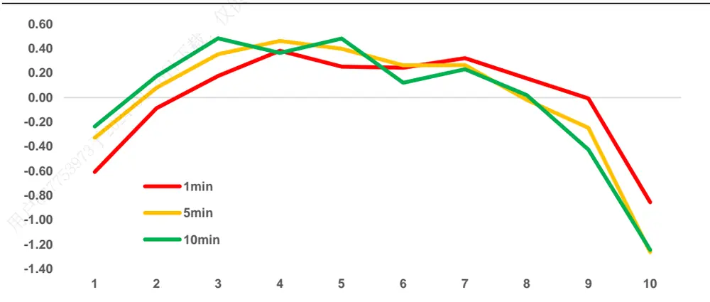
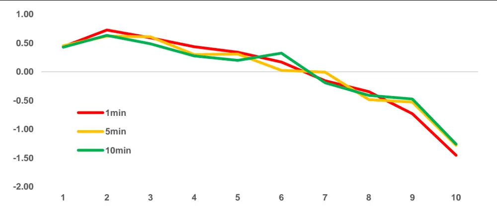
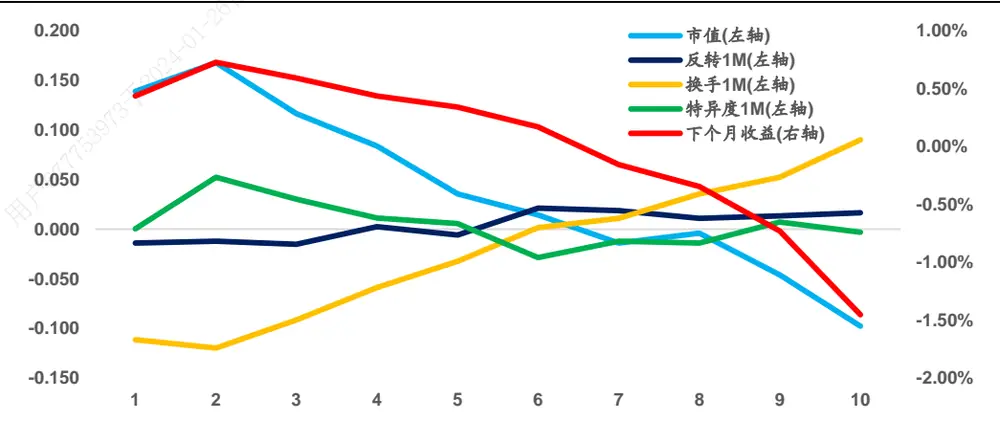
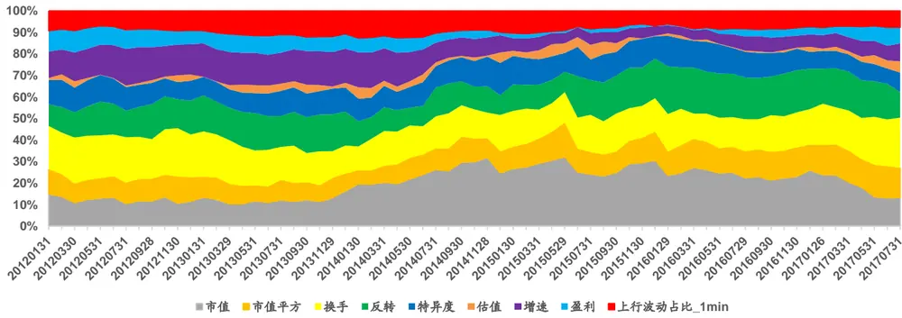
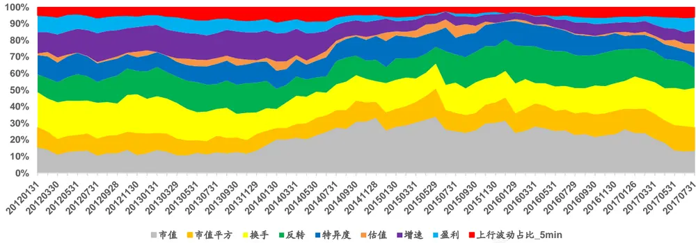
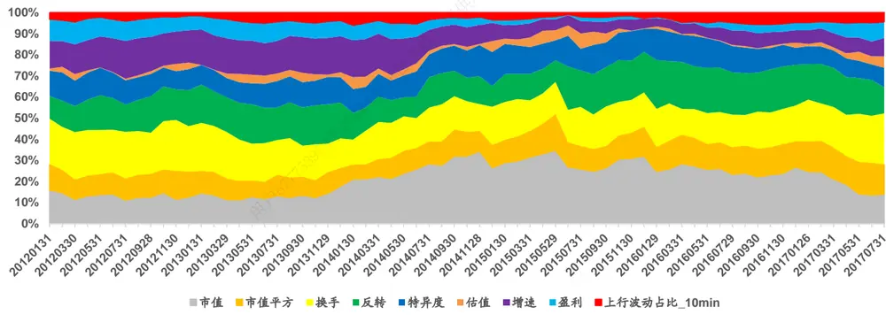
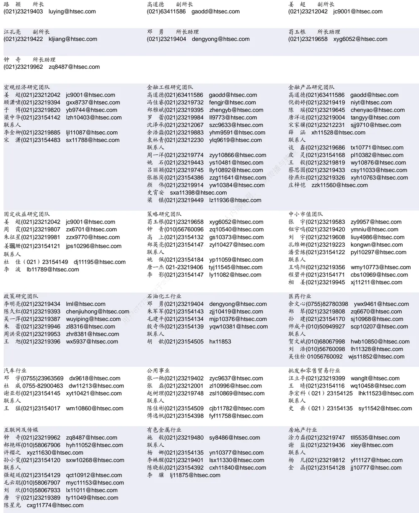

## 相关研究

Table_ReportInfo]《选股因子系列研究(十九)——高频因子之股票收益分布特征》2017.05.05

《“双面”波动率——波动率因子的分解与截面收益》2017.02.27

《选股因子系列研究(十七)——选股因子的正交》2017.01.19

分析师:冯佳睿

Tel:(021)23219732

Email:fengjr@htsec.com

证书:S0850512080006

分析师:袁林青

Tel:(021)23212230

Email:ylq9619@htsec.com

证书:S0850516050003

## 选股因子系列研究（二十五）——高频因子之已实现波动分解

在系列前期报告中（《选股因子系列研究（十九）——高频因子之股票收益分布特征》），我们基于股票高频收益分布特征对于相关因子的选股效果进行了回测。研究发现，股票高频偏度具有较好的选股效果，但是高频方差以及高频峰度并无显著的选股能力。

考虑到股票日收益的波动率同样选股效果不佳，但将其拆分为系统波动以及特质波动后，两个因子皆具有较好的选股效果。本报告尝试对于股票高频波动率进行拆分，并期望从高频波动中提取出有效的选股因子。

“系统波动 特质波动”的拆分方式在高频维度上无法得到具有优秀选股效果的因子。在 分钟的数据频率下，高频特质波动率因子表现较差，并无明显的选股能力。随着数据间隔的增大，该因子的 Rank IC、ICIR以及多空收益都出现了改善。

“上行波动 下行波动”的拆分方式在高频维度上选股效果较好。上行波动率因子在不同的数据频率下皆展现出了一定的选股效果，即前期股票高频上行波动越大，未来 1个月收益表现越差。将上行波动率对于股票波动率进行调整后可计算得到上行波动占比，该因子在不同的数据频率下皆具有较好的选股能力。 分钟数据频率下，因子月均 C达 ， C 为 ，月度多空收益为 。

“系统波动 特质波动”的拆分得到的高频因子在正交后基本无选股效果残留。

- 上行波动占比因子在正交后依旧具有显著选股能力，且数据频率越高因子选股效果越好。在 1 分钟频率下，正交后的上行波动占比因子的 IC 为-0.038，ICIR 为-3.6，月度多空收益达 0.92%。

上行波动占比因子在加入到多因子模型后能够对模型产生进一步的提升。加入分钟上行波动占比的改进模型，相比于原始模型在复合因子的 IC、ICIR、月度胜率以及月度的多空收益上，都有进一步的提升。

- 2017 年以来因子截面选股效果较好，仅在 6 月失效。除了 6 月外，该因子在其他月份上的 以及月度多空收益皆为正。虽然该因子在 年对于股票收益有着较好的区分效果，但是无法通过该因子构建单因子组合获取正向收益。

- 风险提示。市场系统性风险、资产流动性风险以及政策变动风险会对策略表现产生较大影响。

在系列前期报告中（《选股因子系列研究（十九）——高频因子之股票收益分布特征》），我们基于股票高频收益分布特征对于相关因子的选股效果进行了回测。研究发现，股票高频偏度具有较好的选股效果，但是高频方差以及高频峰度并无显著的选股能力。

考虑到股票日收益的波动率同样选股效果不佳，但将其拆分为系统波动以及特质波动后，两个因子皆具有较好的选股效果。本报告尝试对于股票高频波动率进行拆分，并期望从高频波动中提取出有效的选股因子。

报告第一部分讨论了因子的构建以及因子的选股能力。第二部分从正交因子的角度对于因子的选股能力进行了分析。第三部分对比分析了加入高频因子的改进模型以及未加入高频因子的原始模型。第四部分展示了相关因子 2017 年以来的表现。

## 1. 高频波动率的分解

系列前期研究（《“双面”波动率——波动率因子的分解与截面收益》）发现，通过对于波动率进行分解，可从中提取出具有较好选股效果的因子。因此本报告将先尝试从“系统波动+特质波动”的角度对于股票高频收益波动进行分解，并对于分解得到的因子的选股效果进行回测。

## 1.1 高频收益波动分解——“系统波动+特质波动”

对于“系统波动 特质波动”这种拆分方式，投资者需要通过 回归将股票收益分解为系统收益与特质收益，然后再计算系统收益与特质收益的波动。具体回归方程如下所示：

$$
r_{i}=\alpha+\beta_{MKT}MKT+\beta_{SMB}SMB+\beta_{HML}HML+\varepsilon_{i}
$$

其中， $\mathsf{r}_{\mathrm{i}}$ 为股票收益， 为市场收益， 为市值溢价， 为估值溢价，回归残差为股票特质收益。对于高频收益序列也可做类似回归处理，回归因变量为股票高频收益序列，自变量为 MKT、SMB以及 HML 的高频收益序列。其中，回归残差为股票高频特质收益。也即，对于特定时间段的股票 i的高频收益序列{r}，股票高频系统波动、高频特质波动以及高频特异度可定义为：

$$
\frac{3}{\vert\overrightarrow{\mathbf{e}}\vert}\frac{1}{\vert\overrightarrow{\mathbf{\nabla}}\vert}\dot{\lambda}\dot{z}\dot{\lambda}\dot{z}\dot{\lambda}=\left(\sum_{t}(r_{i}^{t})^{2}\right)^{\frac{1}{2}}
$$

$$
\frac{3}{|\mathbf{e}\rangle}+\frac{1}{|\mathbf{\mathcal{D}}\rangle}\sqrt{\frac{1}{2}+\int\limits_{\mathbf{\mathcal{D}}}^{+}\langle\mathbf{\dot{\mathcal{D}}}\rangle|\mathbf{\dot{\mathcal{X}}}-\boldsymbol{\bar{z}}\rangle}=\left(\sum_{t}(\varepsilon_{i}^{t})^{2}\right)^{\frac{1}{2}}
$$

$$
\frac{\partial}{\partial\mathbf{j}}\operatorname{k}\limits_{\mathbf{A}}\ln\frac{1}{\mathbf{j}}\ln\frac{1}{\mathbf{k}}\sin\frac{1}{\mathbf{k}}\mathbf{\cdot}\mathbf{\nabla}\hat{\mathbf{z}}\mathbf{j}\mathbf{k}=\left(\sum_{t}(r_{i}^{t}-\varepsilon_{i}^{t})^{2}\right)^{\frac{1}{2}}
$$

$$
\frac{\dot{\overline{{\sigma}}}}{\vert\nabla\vert}\frac{1}{\mathcal{H}}\frac{1}{\mathcal{F}}\frac{1}{\mathcal{H}}\frac{\varrho}{\mathcal{H}}\frac{\dot{\Xi}}{\mathcal{L}}=\frac{\sum_{t}(\varepsilon_{i}^{t})^{2}}{\sum_{t}(r_{i}^{t})^{2}}
$$

由于本报告旨在考察因子在月度上的选股效果。故对于任意股票，使用其过去一个月的高频收益序列进行回归并计算对应因子值。

为了体现数据频率对于因子效果的影响，本报告分别使用 1 分钟、5 分钟以及 10分钟频率下的股票收益序列进行了因子计算。下表展示了 2010 年以来，高频系统波动、高频特质波动以及高频特异度的月度选股效果。

表 1 “系统波动+特质波动”拆分下因子月度选股效果

| 数据频率 | 指标 | 高频特质波动 | 高频系统波动 | 高频特异度 |
| --- | --- | --- | --- | --- |
| 1分钟 | Rank IC | -0.034 | -0.070 | 0.044 |
|  | ICIR | -0.886 | -1.434 | 0.986 |
|  | IC 为正比率 | 37.8% | 32.2% | 64.4% |
|  | 多空收益率 | 0.25% | 1.48% | 1.28% |
| 5分钟 | Rank IC | -0.062 | -0.063 | 0.007 |
|  | ICIR | -1.427 | -1.207 | 0.161 |
|  | IC 为正比率 | 31.1% | 34.4% | 53.3% |
|  | 多空收益率 | 0.93% | 1.06% | 0.35% |
| 10分钟 | Rank IC | -0.068 | -0.048 | -0.019 |
|  | ICIR | -1.604 | -0.934 | -0.505 |
|  | IC 为正比率 | 32.2% | 37.8% |  |
|  | 多空收益率 | 1.01% | 0.55% | 42.2% 0.41% |

资料来源： ，海通证券研究所

上表从 、 、月度胜率以及月度多空收益率的角度对于因子表现进行了评价。不难发现，“系统波动 特质波动”这种拆分方式并不适用于股票高频收益序列。在 1 分钟的数据频率下，高频特质波动率因子表现较差，并无明显的选股能力。随着数据间隔的增大，该因子的 Rank IC、ICIR以及多空收益都出现了改善。因此我们有理由推断，随着数据间隔的进一步扩大，因子的选股效果会逐步回复至日级别的水平。下图展示了 1分钟、5 分钟以及 10 分钟数据频率下高频特质波动率因子的分组收益特征。

图1 高频特质波动率因子分组收益特征（单位：%）

资料来源： ，海通证券研究所

此外，日级别上选股效果极为稳定的特异度因子，在高频维度上的选股效果也不佳。

## 1.2 高频收益波动分解——“上行波动+下行波动”

由于“系统波动+特质波动”的分解方式在高频数据上并未取得较好的结果，本部分尝试从“上行波动+下行波动”的角度对于股票高频波动进行分解。对于某股票 i在某段时间上的高频收益序列，其上行波动及下行波动的计算方式如下所示：

$$
\begin{array}{rlr}{{\frac{\sum_{i=1}^{3}\sum_{j=1}^{k}\sum_{i=1}^{k}\sum_{k}^{i}\bar{z}_{i}^{j}}=(\sum_{t}(r_{i}^{t}I_{\{r_{i}^{t}>0\}})^{2})^{\frac{1}{2}}}}\\&{}&\\&{}&{\frac{\sum_{i=1}^{3}\sum_{j=1}^{k}\mathbb{F}_{i}(\bar{z}_{i}^{-};\beta_{k}^{*},\bar{z}_{i}^{j})=(\sum_{t}(r_{i}^{t}I_{\{r_{i}^{t}<0\}})^{2})^{\frac{1}{2}}}}\end{array}
$$

类似地，可定义股票 i上行波动占比与下行波动占比，计算方式如下所示：

$$
\begin{array}{r}{\frac{1}{\vert\overrightarrow{\nabla}\vert}\frac{1}{2}\vert\overrightarrow{\nabla}\vert\cdot\overrightarrow{\mathcal{H}}\cdot\overrightarrow{\mathcal{H}}\cdot\overrightarrow{\mathcal{H}}\cdot\overrightarrow{\mathcal{H}}\cdot\vert\vert\cdot\underbrace{\sum_{t}\left(r_{i}^{t}I_{\{r_{i}^{t}>0\}}\right)^{2}}_{\sum_{t}\left(r_{i}^{t}\right)^{2}}}\\{\frac{1}{\vert\overrightarrow{\nabla}\vert}\frac{1}{2\vert\overrightarrow{\mathcal{H}}\vert}+\frac{1}{4\vert\overrightarrow{\mathcal{T}}\vert\cdot\vert\vert\overrightarrow{\mathcal{X}}\vert}\frac{1}{2}\vert\vert\cdot\vert\vert\cdot\vert\vert\frac{\sum_{t}\left(r_{i}^{t}I_{\{r_{i}^{t}<0\}}\right)^{2}}{\sum_{t}\left(r_{i}^{t}\right)^{2}}}\end{array}
$$

同样使用过去一个月的 分钟、 分钟以及 分钟收益序列计算因子值。下表展示了 2010 年以来，上行波动、下行波动、上行波动占比的因子月度选股效果。由于截面标准化后，上行波动占比因子与下行波动占比因子的线性相关性为-1，故而下表仅展示上行波动占比因子的选股效果。

表 2 “上行波动+下行波动”拆分下因子选股效果

| 数据频率 | 指标 | 高频上行波动 | 高频下行波动 | 高频上行波动占比 |
| --- | --- | --- | --- | --- |
| 1分钟 | Rank IC 仅供 | -0.047 | -0.028 | -0.083 |
|  | ICIR | -1.201 | -0.716 | -3.902 |
|  | IC 为正比率 | 32.2% | 45.6% | 13.3% |
|  | 多空收益率 | 0.59% | 0.12% | 1.89% |
| 5分钟 户677753973于 用 | Rank IC | -0.077 | -0.054 | -0.080 |
|  | ICIR | -1.731 | -1.115 | -3.304 |
|  | IC 为正比率 | 30.0% | 35.6% | 20.0% |
|  | 多空收益率 | 1.22% | 0.70% | 1.73% |
| 10分钟 | Rank IC |  |  | -0.076 |
|  | ICIR | -0.078 | -0.052 -1.039 |  |
|  | IC 为正比率 | -1.778 | 35.6% | -2.966 |
|  | 多空收益率 | 30.0% 1.22% | 0.53% | 20.0% 1.69% |

资料来源：Wind，海通证券研究所

上行波动率因子在不同的数据频率下皆展现出了一定的选股效果，即前期股票高频上行波动越大，未来 个月收益表现越差。根据相关文献的解释，股票高频收益的上行波动衡量了股票价格拉升的特征。假设有两只股票在过去一段时间有着相同的涨幅，其中一只股票的涨幅由持续稳定的小幅上涨累计带来，而另一只股票的上涨源自于股票短期的大幅拉升。那么后者更有可能在收益上出现反转，而后者在因子值上也会体现出较高的上行波动率。

将上行波动率对于股票波动率进行调整后，可计算得到上行波动占比。该因子在不同的数据频率下，皆具有较好的选股能力。1 分钟数据频率下，因子月均 IC达-0.083，C 为 ，月度多空收益为 。下图展示了该因子在不同数据频率下的分组收益情况。

图2 上行波动占比因子分组收益特征

资料来源：Wind，海通证券研究所

由上图可见，该因子在不同数据频率下，对于股票下一个月的收益都有着较好的区分效果。

## 1.3 上行波动占比分组特征分析

由于上行波动占比呈现出较好的选股效果，我们不得不怀疑因子的选股效果是否来源于现有的选股因子。因此可以使用该因子对于股票进行分组，并统计不同分组股票因子的特征。

下图展示了使用 1 分钟上行波动占比因子从小到大排序，得到的分组股票（横轴的1-10 组）的相关特征。（收益、市值、换手、反转、日级别特异度）

图3 上行波动占比因子分组特征

资料来源：Wind，海通证券研究所

观察上图可知，上行波动占比因子和市值以及换手因子具有较强的相关性，因子多头组合（第 组）呈现出低换手、大市值的特征。因此可以推断，该因子的选股效果并不是来源于市值因子而是来源于换手率因子。此外，上行波动占比和日级别特异度因子以及反转因子相关性较低，组间特征单调性较弱。

## 2. 因子正交分析

考虑到高频因子与常见因子的相关性，本节对于“系统波动+特质波动”以及“上行波动+下行波动”分解得到的因子进行正交化处理，并对于正交后的因子的选股效果进行回测。

在正交处理中，本章剔除了行业、市值、非线性市值、换手、反转、日级别特异度、估值、成长以及盈利的影响。（详细处理细节可参考专题报告《选股因子系列研究（十七）——选股因子的正交》）

## 2.1 正交处理——“系统波动+特质波动”

下表展示了正交后的高频系统波动、高频特质波动以及高频特异度的选股效果。

表 3 “系统波动+特质波动”拆分下正交因子月度选股效果

| 数据频率 | 指标 | 高频特异波动 | 高频系统波动 | 高频特异度 |
| --- | --- | --- | --- | --- |
| 1分钟 | Rank IC | -0.004 | -0.024 | 0.023 |
|  | ICIR | -0.221 | -0.933 | 0.895 |
|  | IC 为正比率 | 48.9% | 36.7% | 63.3% |
|  | 多空收益率 | 0.35% | 0.59% | 0.70% |
| 5分钟 | Rank IC | -0.011 | -0.021 | 0.012 |
|  | ICIR | -0.624 | -0.792 | 0.477 |
|  | IC 为正比率 | 46.7% | 35.6% | 57.8% |
|  | 多空收益率 | 0.15% | 0.28% | -0.34% |
| 10分钟 | Rank IC | 不可传播与 |  |  |
|  | ICIR | -0.010 | -0.011 | 0.002 |
|  | IC 为正比率 | -0.622 | -0.483 | 0.098 |
|  | 多空收益率 | 46.7% 0.20% | 40.0% 0.03% | 54.4% 0.02% |

资料来源：Wind，海通证券研究所

在剔除了常见选股因子的效果后，该类因子在各数据频率下已无选股能力，因子在Rank IC、ICIR 以及月度多空收益上的表现较差。

## 2.2 正交处理——“上行波动+下行波动”

下表展示了正交后的高频上行波动、高频下行波动以及高频上行波动占比的选股效果。

表 4 “上行波动+下行波动”拆分下正交因子选股效果

| 数据频率 | 指标 | 高频上行波动 | 高频下行波动 | 高频上行波动占比 |
| --- | --- | --- | --- | --- |
| 1分钟 | Rank IC | 0.000 | -0.011 | -0.038 |
|  | ICIR | 0.016 | -0.640 | -3.665 |
|  | IC 为正比率 | 52.2% | 42.2% | 14.4% |
|  | 多空收益率 | 0.48% | 0.15% | 0.92% |
| 5分钟 | Rank IC | -0.006 | -0.019 | -0.029 |
|  | ICIR | -0.312 | -1.125 | -2.476 |
|  | IC 为正比率 | 50.0% | 37.8% | 23.3% |
|  | 多空收益率 | 0.25% | 0.09% | 0.50% |
| 10分钟 | Rank IC | -0.002 | -0.015 | -0.023 |
|  | ICIR | -0.110 | -0.900 |  |
|  | IC 为正比率 | 47.8% | 42.2% | -1.934 |
|  | 多空收益率 | 0.40% | 0.07% | 24.4% 0.47% |

资料来源：Wind，海通证券研究所

在剔除了常见选股因子的效果后，上行波动占比因子依旧呈现出了显著的选股效果，而且因子选股效果随着数据间隔的缩短而逐渐变强。

在 1 分钟频率下，正交因子的 IC 为-0.038，ICIR 为-3.6，多空收益达 0.92%。因子的选股效果之所以随着数据间隔的缩短而逐渐增强，是因为上行波动占比衡量了股票大幅拉升的特征，而这种特征在数据间隔较短的情况下更容易被识别。

结合上行波动占比因子的原始选股效果以及正交选股效果，我们认为该因子可以被放入多因子模型进行进一步的分析。

## 3. 多因子模型对比分析

由于新因子的研究最终还是要服务于多因子模型，所以本章主要讨论上行波动占比因子在加入多因子模型后对于模型的影响。

首先，我们会从回归法的角度讨论因子在加入模型后是否具有显著的选股效果。其次，我们会从复合因子的角度观察因子在加入多因子模型后对于模型表现的影响。最后，我们会对于该因子在多因子模型中所占的权重进行分析。

在进行模型对比时，原始模型为使用市值、非线性市值、换手、反转、特异度、估值、成长以及盈利因子，构建的最大化预期收益月度选股组合。其中，因子集合进行正交化处理。改进模型在原始模型的基础上，考虑加入各数据频率下的上行波动占比因子。

本章在进行最大化预期收益多因子组合构建时按照以下规则进行：

1） 使用 2010 年 1月至 2017 年 7 月间的数据进行回测；

2） 每月月末计算因子值，并对因子统一进行截面标准化的处理；

3） 分配因子权重时使用历史滚动 24 月的因子表现；

4） 在调仓时，组合按照涨停不买、跌停不卖的规则进行；

5） 调仓考虑双边千五的交易费用；

6） 选股范围剔除 ST 股、上市不满 6个月的股票。

## 3.1 Fama-MacBeth 回归检验

使用 2012 年 1月至 2017 年 7 月底之间的数据可分别对于原始模型以及改进模型进行 Fama-MacBeth回归检验。由于模型由正交因子组成，所以任意新因子的引入并不会明显影响原有因子回归系数及其显著性。故而，我们可将注意力集中在新加入因子的回归系数及其 T 统计量上。

表 5 Fama-MachBeth 回归检验

|  |  | 市值 | 市值平方 | 换手 | 反转 | 特异度 | 估值 | 增速 | 盈利 | 新增因子 |
| --- | --- | --- | --- | --- | --- | --- | --- | --- | --- | --- |
| 原始模型 | 月均溢价 | -0.0076 | 0.0040 | -0.0063 | -0.0041 | -0.0030 | -0.0006 | 0.0035 | 0.0017 |  |
|  | T统计量 | -3.21 | 4.33 | -4.30 | -2.94 | -4.14 | -0.46 | 5.44 | 2.19 |  |
|  | 月均溢价 | -0.0072 | 0.0039 | -0.0059 | -0.0051 | -0.0037 | -0.0004 | 0.0034 | 0.0016 | -0.0033 |
| 原始模型 +1min 原始模型 | T统计量 | -3.03 | 4.42 | -3.98 | -3.42 | -4.77 | -0.34 | 5.42 | 2.08 | -6.99 |
|  | 月均溢价 | -0.0072 | 0.0039 | -0.0059 | -0.0051 | -0.0037 | -0.0004 | 0.0034 | 0.0016 | -0.0021 |
| +5min 原始模型 | T统计量 | -3.03 | 4.42 | -3.98 | -3.42 | -4.77 | -0.35 | 5.42 | 2.08 | -3.85 |
|  | 月均溢价 | -0.0072 | 0.0039 | -0.0059 | -0.0051 | -0.0037 | -0.0004 | 0.0034 | 0.0016 | -0.0015 |
| +10min | T统计量 | -3.03 | 4.42 | -3.98 | -3.42 | -4.77 | -0.35 | 5.42 | 2.08 | -2.69 |

资料来源： ，海通证券研究所

观察上表结果可以发现，1分钟频率下的上行波动占比因子选股效果最强，月均溢价达 33bp，同期市值因子月均溢价为 72bp，反转因子月均溢价 51bp，日级别特异度因子月均溢价 37bp。从显著性上看，上行波动占比因子在 12 年至 17 年 7月间具有十分稳健的选股效果，因子月度溢价 T 统计量的绝对值接近 7。随着数据间隔的增大，因子的月均溢价以及显著性都出现了减弱。此处结果与前文中正交分析的结果一致。

## 3.2 复合因子分析

基于前文提到的模型构成，可分别使用原始模型以及改进模型在 2012 年 1 月至2017 年 7 月底间构建全市场月度选股模型。下表从复合因子、模型月度 Top-Bottom10%多空收益以及 TOP100 选股组合的角度，对比了原始模型与改进模型的不同。在进行选股时，剔除上市不满 6个月的股票、ST 股以及无法交易的股票。

表 6 模型复合因子对比

| 模型 | 复合因子 |  |  | 月度 TopBottom10% |  |  | TOP100 组合 |  |
| --- | --- | --- | --- | --- | --- | --- | --- | --- |
|  | 复合IC | 复合ICIR | 月度胜率 | 多空收益 | 多头收益 | 空头收益 | 年化收益 | 信息比率 |
| 原始模型 | 0.104 | 3.543 | 84.8% | 4.06% | 2.06% | 2.00% | 49.0% | 2.774 |
| 原始模型+1min | 0.109 | 3.753 | 87.9% | 4.20% | 2.08% | 2.12% | 50.5% | 2.861 |
| 原始模型+5min | 0.106 | 3.633 | 86.4% | 4.09% | 2.04% | 2.05% | 49.2% | 2.789 |
| 原始模型+10min | 0.105 | 3.577 | 86.4% | 4.06% | 2.07% | 1.99% | 50.0% | 2.832 |

资料来源： ，海通证券研究所

观察上表不难发现，加入 分钟上行波动占比的改进模型相比于原始模型产生全方位的改进，无论是复合因子的 IC、ICIR、月度胜率还是月度的多空收益。对于全市场TOP100 组合，改进模型也在年化收益以及信息比率上产生了一定的提升。

值得注意的是，虽然改进模型相比于原始模型有一定的提升，但是提升幅度较为有限。考虑到因子加权方式对于改进模型的提升效果有一定的影响，我们会在后一节中对于因子权重占比进行分析。

## 3.3 多因子模型因子权重分配情况

下图展示了加入 1 分钟频率的上行波动占比的多因子模型的权重分配情况。

图4 加入 1分钟上行波动占比的改进模型因子权重分配情况

资料来源：Wind，海通证券研究所

1 分钟上行波动占比因子在模型里长期占有约 10%的权重，同期，市值权重在之间。由于 分钟上行波动占比以及 分钟上行波动占比选股效果较弱，故而这两个因子在对应多因子模型里面所占权重较低（见以下两图）。

下图展示了加入 5 分钟频率的上行波动占比的多因子模型的权重分配情况，新加入因子在模型里所占的权重约为 5%。

图5 加入 5分钟上行波动占比的改进模型因子权重分配情况

资料来源： ，海通证券研究所

下图展示了加入 10 分钟频率的上行波动占比的多因子模型的权重分配情况，新加入因子在模型里所占的权重在 3%与 5%之间。

图6 加入 10分钟上行波动占比的改进模型因子权重分配情况

资料来源： ，海通证券研究所

## 4. 因子 2017年以来的表现

2017 年以来市场风格出现了十分明显的切换，许多前几年有效的因子在 2017 年都出现了失效。下表展示了上行波动占比因子在 2017 年 1 月至 7月间每月的多空收益以及 IC 情况。

表 7 上行波动占比因子 2017年以来表现

| 年月 | 多头超额收益 | 空头超额收益 | 多空收益 | 因子IC |
| --- | --- | --- | --- | --- |
| 201701 | -3.58% | -5.17% | 1.59% | 0.059 |
| 201702 | 3.96% | 2.64% | 1.32% | 0.032 |
| 201703 | -2.60% | -3.95% | 1.34% | 0.077 |
| 201704 | -6.79% | -8.29% | 1.50% | 0.059 |
| 201705 | -8.71% | -7.91% | -0.81% | -0.038 |
| 201706 | 5.17% | 1.42% | 3.75% | 0.182 |
| 201707 | -0.70% | -1.93% | 1.23% | 0.054 |

资料来源：Wind，海通证券研究所

除了 月外，该因子在其他月份上对于股票收益都有着较好的区分效果。但遗憾的是，无法通过该因子构建单因子组合获取正向收益。使用上行波动占比因子构建得到的TOP10%多头组合，在 17 年以来的累计收益为-13.25%。

## 5. 总结

在系列前期报告中（《选股因子系列研究（十九）——高频因子之股票收益分布特转征》），我们基于股票高频收益分布特征对于相关因子的选股效果进行了回测。研究发现，播高频波动因子并无显著的选股能力，故而本报告尝试对于高频波动因子进行提升。可

研究发现，“系统波动+特质波动”这种在日级别上较为有效的拆分方式，在高频维用度上并不能获得稳健的选股效果，而“上行波动+下行波动”这种拆分方式能够从股票部高频收益波动中提取出有效的选股因子——上行波动占比。该因子在剔除了日级别常见人选股因子的影响后，依旧具有较好的选股效果。供

## 6. 风险提示

市场系统性风险、资产流动性风险以及政策变动风险会对策略表现产生较大影响。01

# 信息披露

分析师声明

[Table冯佳睿yst 金融工程研究团队s]

袁林青金融工程研究团队

本人具有中国证券业协会授予的证券投资咨询执业资格，以勤勉的职业态度，独立、客观地出具本报告。本报告所采用的数据和信息均来自市场公开信息，本人不保证该等信息的准确性或完整性。分析逻辑基于作者的职业理解，清晰准确地反映了作者的研究观点，结论不受任何第三方的授意或影响，特此声明。

## 法律声明

本报告仅供海通证券股份有限公司（以下简称“本公司”）的客户使用。本公司不会因接收人收到本报告而视其为客户。在任何情况下，本报告中的信息或所表述的意见并不构成对任何人的投资建议。在任何情况下，本公司不对任何人因使用本报告中的任何内容所引致的任何损失负任何责任。

本报告所载的资料、意见及推测仅反映本公司于发布本报告当日的判断，本报告所指的证券或投资标的的价格、价值及投资收入可能播会波动。在不同时期，本公司可发出与本报告所载资料、意见及推测不一致的报告。可

市场有风险，投资需谨慎。本报告所载的信息、材料及结论只提供特定客户作参考，不构成投资建议，也没有考虑到个别客户特殊的用，投资目标、财务状况或需要。客户应考虑本报告中的任何意见或建议是否符合其特定状况。在法律许可的情况下，海通证券及其所属部关联机构可能会持有报告中提到的公司所发行的证券并进行交易，还可能为这些公司提供投资银行服务或其他服务。

本报告仅向特定客户传送，未经海通证券研究所书面授权，本研究报告的任何部分均不得以任何方式制作任何形式的拷贝、复印件或供复制品，或再次分发给任何其他人，或以任何侵犯本公司版权的其他方式使用。所有本报告中使用的商标、服务标记及标记均为本公司的商标、服务标记及标记。如欲引用或转载本文内容，务必联络海通证券研究所并获得许可，并需注明出处为海通证券研究所，且下不得对本文进行有悖原意的引用和删改。

根据中国证监会核发的经营证券业务许可，海通证券股份有限公司的经营范围包括证券投资咨询业务。24

## 海通证券股份有限公司研究所[Table_PeopleInfo]

## 研究所销售团队

海通证券股份有限公司研究所

电话：（021）23219000

地址：上海市黄浦区广东路 689号海通证券大厦 9楼

传真：（021）23219392

网址：www.htsec.com

| 深广地区销售团队 蔡铁清(0755)82775962 ctq5979@htsec.com 伏财勇(0755)23607963 fcy7498@htsec.com 辜丽娟(0755)83253022 gulj@htsec.com 刘晶晶(0755)83255933 liujj4900@htsec.com 王雅清(0755)83254133 wyq10541@htsec.com 漆冠男(021)23219281 饶 伟(0755)82775282 rw10588@htsec.com 胡宇欣(021)23154192 欧阳梦楚(0755)23617160 黄 诚(021)23219397 oymc11039@htsec.com 蒋 炯jj10873@htsec.com 巩柏含 gbh11537@htsec.com 毛文英(021)23219373 mwy10474@htsec.com | 上海地区销售团队 胡雪梅(021)23219385 朱 健(021)23219592 季唯佳(021)23219384 黄 毓(021)23219410 huangyu@htsec.com | huxm@htsec.com zhuj@htsec.com jiwj@htsec.com | 北京地区销售团队 殷怡琦(010)58067988 yyq9989@htsec.com 吴尹 wy11291@htsec.com 陆铂锡 Ibx11184@htsec.com 张丽萱(010)58067931 zlx11191@htsec.com |
| --- | --- | --- | --- |