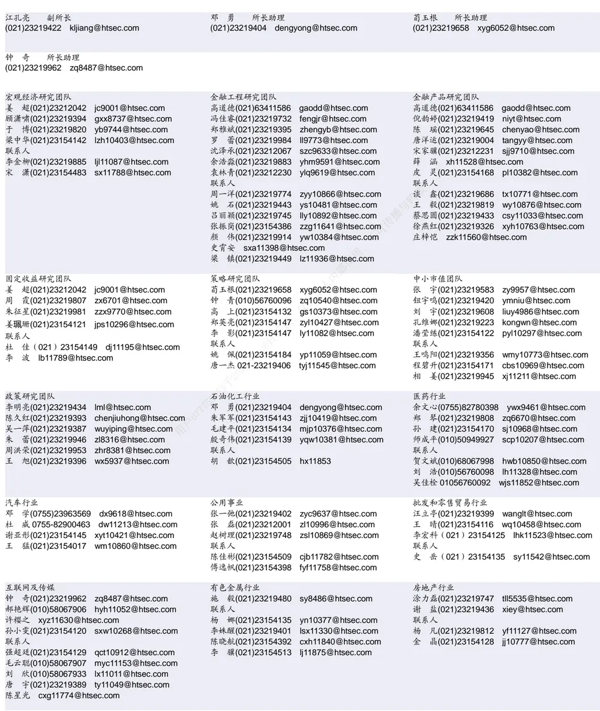

## 相关研究

Table_ReportInfo]《选股因子系列研究（二十五）——高频

因子之已实现波动分解》2017.09.09

《学术研究中的财务异象与本土实证

（一）——盈利能力》2017.09.04

分析师:冯佳睿

Tel:(021)23219732

Email:fengjr@htsec.com

证书:S0850512080006

# 选股因子系列研究（二十六）——因子加权、正交和择时的若干性质

## 投资要点：

近年来，对量化多因子模型的研究主要集中在因子加权、正交和择时这三个方面。流行的方法大体有以下两种，一是以因子 为核心建模，二是基于收益率和因子之间的 Fama-MacBeth回归。本文首先证明了，在一定的条件下，两者之间的等价性。随后，在这个基础上，得到了有关因子正交和择时的重要性质。

- 性质 1：若收益率和因子都为原始值的 z-score，则最大化复合因子 IC加权法等价于 Fama-MacBeth 回归。在 z-score 的假设下，最大化复合因子 IC 加权法完全可以用更加简洁，且更便于程序编写和运算的回归模型代替。

- 性质 2：在原始的 Fama-MacBeth 回归模型中加入和已有因子正交的新因子，不会改变原始模型得到的因子溢价。这条性质为新因子的有效性检验提供了极大载的便利，正交化后，新因子的溢价及稳定性可直接与原始因子进行对比。与

性质 ：在 回归中，不论新加入的因子是否与原有因子正交，不其因子溢价的估计不会改变。这条性质表明，倘若想在已有模型中加入一个新因，子，不妨将它对原模型中的所有因子进行回归，得到正交因子后再行加入。这样做既避免了可能存在的多重共线性的影响，也没有损失与新因子选股能力有关的内信息，因为正交不改变其因子溢价的估计。本

性质 ： 等人（ ）的因子择时模型，本质上就是拿因子溢价对条件变载，量集合建立回归模型后，计算被解释变量的最小二乘估计。这一结论不仅使得模型更加直观且易于理解，而且也能极大地简化程序的编写步骤、提高运算效率。-2另外，在使用这个模型的过程中，一定要注意控制条件变量的个数，防止出现过4-拟合的问题。于2

- 风险提示。多因子模型中的因子失效风险、因子与收益之间线性假设不成立的风775险。

近年来，对量化多因子模型的研究主要集中在因子加权、正交和择时这三个方面。流行的方法大体有以下两种，一是以因子 为核心建模，二是基于收益率和因子之间的Fama-MacBeth回归。本文首先证明了，在一定的条件下，两者之间的等价性。随后，在这个基础上，得到了有关因子正交和择时的重要性质。

## 1. 最大化复合因子 加权等价于 Fama-MacBeth回归法

在多因子选股模型中，有一个非常重要的概念——因子 ，它被定义为因子值和股票收益率之间的线性相关系数。假设 $F_{t}$ 为 期的因子， $r_{t+1}$ 为 期的收益，则

$$
IC=corr(F_{t},r_{t+1}).
$$

因子 度量了选股因子对股票收益预测能力的强弱，是因子有效性高低的判别标准。其绝对值越大，表明预测收益的能力越强，也即越有效。

多因子选股模型的另一个重要问题是如何分配因子的权重。一个朴素的想法是因子越有效，权重应当越高。但是，因子 并非常数，其波动的大小同样影响着加权效果。考虑到这两方面的因素，Qian 等人1（2007）提出了最大化复合因子 的加权算法。

具体地，记 $\scriptstyle{\vec{F}}$ 为当期的因子向量， 是其对应的权重向量。那么，使得复合因子 $\cdot\vec{F}$ 的 最大化的解为，

$$
\begin{array}{r}{\overrightarrow{w}_{ovt}=\Sigma^{-1}\overrightarrow{IC}.}\end{array}
$$

其中， $\scriptstyle{\overline{{IC}}}$ 为所有因子的 值组成的向量， 为因子的协方差矩阵。

构建多因子组合的另一种方式是建立股票收益的预测模型，即建 $\dot{\overline{{\mathscr{L}}}}t+1$ 期的收益$r_{t+1}$ 与 期的因子 $F_{t}$ 之间的 Fama-MacBeth 回归。具体形式为，

$$
r_{t+1}=c+F_{t}f+\varepsilon_{t}.
$$

其中， $c$ 为常数项， $f.$ 为回归系数，也被称为因子溢价， $\varepsilon_{t}$ 为残差项。

引入收益预测模型回避了对因子加权方式的争论，因子的权重，或曰因子溢价，可直接由 的最小二乘估计（OLS）给出。那么，基于上述两种方法得到的选股结果是否存在差异？以下这条性质给出了答案。

性质 1：若收益率和因子都为原始值的 z-score，则最大化复合因子 加权法等价于Fama-MacBeth 回归。

证明：分别记 $\tilde{F}_{t}$ 和 $\tilde{r}_{t+1}$ 为收益率和因子的 z-score，容易推得，常数项 和因子溢价向量 的最小二乘估计分别为

$$
\hat{c}=0,\hat{f}=(\tilde{F}_{t}^{\prime}\tilde{F}_{t})^{-1}\tilde{F}_{t}^{\prime}\tilde{r}_{t+1}.
$$

又因为 $\tilde{F}_{t}$ 和 $\tilde{r}_{\tau+1}$ 恰为 z-score，则由样本协方差矩阵和相关系数的定义可知，

$$
\tilde{F}_{t}^{\prime}\tilde{F}_{t}=\Sigma,\tilde{F}_{t}^{\prime}\tilde{r}_{t+1}=\overrightarrow{IC}.
$$

故，Fama-MacBeth回归对收益率的预测值等于最大化复合因子 加权法的股票得分。

性质 1表明，在 z-score 的假设下，最大化复合因子 加权法完全可以用更加简洁，且更便于程序编写和运算的回归模型代替。因此，下文有关因子正交和择时之性质的讨论与证明，也都将基于 Fama-MacBeth 回归。

## 2. 使用正交因子不改变其溢价的估计

多重共线性是回归中最为常见的问题，它的存在会使得系数估计的方差变大，导致估计的精度下降。而在多因子选股模型中，由因子之间的相关性带来的多重共线性问题会造成更加严重的后果。除了因子溢价估计的准确度降低以外，若模型包含较多的高相关因子，很有可能使最终的股票组合极度偏向于该类因子所代表的风格。这不仅大大增加了风险，也和多因子模型试图从多方面描述股票收益的初衷相悖。

因此，有人提出用正交化后的因子代替原始因子，以避免上述问题的发生。海通证券金融工程团队也曾就“因子正交”这一主题撰写了相关研究报告——《选股因子系列研究(十七)——选股因子的正交》，其中详细阐述了因子正交的步骤，本文不再赘述。那么，使用正交因子究竟能为模型带来哪些便利和改变，以下两条重要性质值得关注。

性质 $\pmb{2}\colon$ ：在原始的 Fama-MacBeth 回归模型中加入和已有因子正交的新因子，不会改变原始模型得到的因子溢价估计值。

证明：设原始模型中包含 个因子 $F_{1},\dots,F_{m}$ ，将它们构成的因子矩阵记为 。新加入模型的因子为 ，将其对原因子 进行正交，建立如下的回归方程，

$$
x=X\beta+\varepsilon.
$$

回归系数 的最小二乘估计为，

$$
{\hat{\beta}}=(X^{\prime}X)^{-1}X^{\prime}x.
$$

正交因子 $\cdot_{x^{(0)}}$ 即为上述回归方程的残差，具体形式为，

$$
x^{(\mathcal{O})}=x-\bar{X}\hat{\beta}=x-\bar{X}(\bar{X}^{\prime}\bar{X})^{-1}\bar{X}^{\prime}x\triangleq x-Px=(I-\bar{P})x.
$$

其中， $P=X(X^{\prime}X)^{-1}X^{\prime}$ 称为投影矩阵，且满足以下五条性质。

$$
(1)P^{2}=X(X^{\prime}X)^{-1}X^{\prime}X(X^{\prime}X)^{-1}X^{\prime}=X(X^{\prime}X)^{-1}X^{\prime}=P.
$$

(2) $(I-P)^{2}=(I-P)(I-P)=I-2P+P^{2}=I-P.$

(3) $\begin{array}{r}{(I-P)X=X-X(X^{\prime}X)^{-1}X^{\prime}X=0.}\end{array}$

(4) $X^{\prime}\left(I-P\right)=X^{\prime}-X^{\prime}X(X^{\prime}X)^{-1}X^{\prime}=0.$

(5) $\begin{array}{r}{(I-P)^{\prime}=I-P.}\end{array}$

将正交因子 $\cdot_{x^{(0)}}$ 加入原模型，可得新的 Fama-MacBeth 回归方程：

$$
r=(\chi\quad_{x^{(0)}})f^{(1)}+\varepsilon=[\chi\quad(I-P)x]f^{(1)}+\varepsilon.
$$

则 $m+1$ 个因子溢价的最小二乘估计为，

$$
\begin{array}{rl}{\hat{f}^{(1)}=\left[\left(\begin{array}{c}{X^{\prime}}\\{x^{(o)}^{\prime}}\end{array}\right)\quad(\chi}&{x^{(o)})\right]^{-1}\left(\begin{array}{c}{X^{\prime}}\\{x^{(o)}^{\prime}}\end{array}\right)r}\\{=\left[\left(\begin{array}{cc}{X^{\prime}}\\{x^{\prime}(I-P)}\end{array}\right)\quad(X}&{(I-P)x)\right]^{-1}\left[\begin{array}{c}{X^{\prime}}\\{x^{\prime}(I-P)}\end{array}\right]r}\\{=\left[\left(\begin{array}{cc}{X^{\prime}}\\{x^{\prime}(I-P)}\end{array}\right)\quad(X}&{(I-P)x)\right]^{-1}\left[\begin{array}{c}{X^{\prime}}\\{x^{\prime}(I-P)}\end{array}\right]r}\\=\left[\begin{array}{cc}{X^{\prime}X}&{0}\\{0}&{x^{\prime}(I-P)x\right]^{-1}\left[\begin{array}{c}{X^{\prime}}\\{x^{\prime}(I-P)}\end{array}\right]r.}\end{array}\end{array}
$$

$\begin{array}{r}{{\dot{\ i}}\vec{\tau}c=x^{\prime}(I-P)x}\end{array}$ ，因子溢价的估计可简写为，

$$
{\hat{f}}^{\mathrm{(1)}}={\Bigl[}_{c^{-1}x^{\prime}\mathrm{(}I-P\mathrm{)}r}^{\mathrm{(}X^{\prime}X\mathrm{)}^{-1}X^{\prime}r}{\Bigr]}.
$$

由上式可见，前 个原始因子的溢价估计为 $(X^{\prime}X)^{-1}X^{\prime}r$ ，恰好等于原始模型因子溢价的最小二乘估计。

这条性质为新因子的有效性检验提供了极大的便利，正交化后，新因子的溢价及稳定性可直接与原始因子进行对比。

性质 3：在 Fama-MacBeth 回归中，不论新加入的因子是否与原有因子正交，其因子溢价的估计不会改变。

证明：由性质 2 的证明过程可知，如果新加入的为正交因子 $x^{(0)}$ ，那么它的因子溢价的估计值为，

$$
c^{-1}x^{\prime}(I-P)r.
$$

其中， $P=X(X^{\prime}X)^{-1}X^{\prime},\ c=x^{\prime}(I-P)\ j$ 。

如果使用未正交的因子 ，Fama-MacBeth回归可写成如下的形式，

$$
r=(\chi\quad x)f^{(2)}+\varepsilon.
$$

则因子溢价的估计值为，

$$
{\hat{f}}^{(2)}=[{\binom{X^{\prime}}{x^{\prime}}}\quad(X\quad x)]^{-1}({\binom{X^{\prime}}{x^{\prime}}}r={\binom{X^{\prime}X}{x^{\prime}X}}^{-1}({\binom{X^{\prime}}{x^{\prime}}}r.)r.
$$

根据分块矩阵求逆公式，

$$
{\binom{X^{\prime}X}{x^{\prime}X}}\quad X^{\prime}x)^{-1}={\binom{(X^{\prime}X)^{-1}+c^{-1}(X^{\prime}X)^{-1}X^{\prime}xx^{\prime}X(X^{\prime}X)^{-1}}{x^{-1}x^{\prime}X}}\quad-c^{-1}(X^{\prime}X)^{-1}X^{\prime}x\Big).\mathrm{~f~o~r~}(X^{\prime}X)^{-1}X^{\prime}x\Big).\mathrm{~f~o~r~}(X)^{-1}X^{\prime}x\Big).
$$

于是，

$$
\begin{array}{c}{{\hat{f}^{(2)}=\left(\begin{array}{cc}{{(X^{\prime}X)^{-1}+c^{-1}(X^{\prime}X)^{-1}X^{\prime}xx^{\prime}X(X^{\prime}X)^{-1}}}&{{-c^{-1}(X^{\prime}X)^{-1}X^{\prime}x}}\\{{-c^{-1}x^{\prime}X(X^{\prime}X)^{-1}}}&{{c^{-1}}}\end{array}\right)\binom{X^{\prime}}{x^{\prime}}r}}\\{{=\Big[\big(X^{\prime}X\big)^{-1}X^{\prime}r-c^{-1}(X^{\prime}X)^{-1}X^{\prime}xx^{\prime}(I-P)r\Big].}}\\{{c^{-1}x^{\prime}(I-P)r}}\end{array}
$$

上式第二项即为因子 的溢价估计，与 $\underline{{\mathcal{\bar{\mathbf{\Phi}}}}}$ 交因子 $\cdot_{x^{(0)}}$ 的溢价估计完全一致。

这条性质表明，倘若想在已有模型中加入一个新因子，不妨将它对原模型中的所有因子进行回归，得到正交因子后再行加入。这样做既避免了可能存在的多重共线性的影响，也没有损失与新因子选股能力有关的信息，因为正交不改变其因子溢价的估计。

## 3. Qian（2012）的因子择时模型等价于因子溢价的估计 值对条件变量进行回归

因子溢价并非一成不变，有时甚至连符号都会发生逆转。为了让多因子模型发挥更大作用，因子择时成为了众多研究者感兴趣的课题。其中，较有影响力的是 Qian 等人2（2012）提出的基于条件期望的模型。他们使用外生变量 来对原始的因子溢价 进行调整，并且在正态分布的假设下，得到了基于变量 的因子溢价 的条件期望。

假设原始的因子溢价 是由历史上 期的溢价均值估计得到，记为 $\bar{f}_{\circ}$ 。那么，经过条件变量 修正后的因子溢价为，

$$
f_{|v}=\bar{f}+\Sigma_{fv}\Sigma_{vv}^{-1}(v-\bar{v}).
$$

其中， $\Sigma_{fv}$ 是因子溢价和条件变量的协方差矩阵， $\Sigma_{vv}$ 是条件变量自身的协方差矩阵， 是条件变量 历史上 期的均值。

性质 4：条件期望向量 $f_{|v}$ 中的每一个元素，等于 对 回归后的预测值 $\hat{\pmb f}\ll\hat{\pmb f}$

证明：分别对因子 的溢价序列 $f^{(i)}$ 和条件变量序列 进行中心化，并记

$$
\begin{array}{r}{f_{(c)}^{(i)}=f^{(i)}-\bar{f}^{(i)},v_{(c)}=v-\bar{v}.}\end{array}
$$

假设共有 个条件变量，则可建立如下的回归方程，

$$
f_{(c)}^{(i)}=\alpha+V_{(c)}\gamma+\varepsilon.
$$

其中， $\pmb{f}_{(c)}^{(\mathrm{i})}$ 是 维向量， $V_{(c)}\overbrace{\mathcal{K}}^{\sharp}n\times p$ 维矩阵，每一列代表了中心化后的条件变量。

通过简单的矩阵运算，可知 和 的最小二乘估计为

$$
\hat{\alpha}=0,\ \hat{\gamma}=(V_{(c)}^{\prime}V_{(c)})^{-1}V_{(c)}^{\prime}f_{(c)}^{(i)}.
$$

则 $v_{(c)}=v-$ 时，因子溢价的估计值为，

$$
\begin{array}{c}{{{\hat{f}}^{(i)}={\bar{f}}^{(i)}+{\hat{f}}_{(c)}^{(i)}}}\\{{={\bar{f}}^{(i)}+v_{(c)}^{\prime}{\hat{\gamma}}}}\\{{={\bar{f}}^{(i)}+{\left(v-{\bar{v}}\right)}^{\prime}{\left(V_{(c)}^{\prime}V_{(c)}\right)}^{-1}V_{(c)}^{\prime}f_{(c)}^{(i)}}}\\{{={\bar{f}}^{(i)}+{f_{(c)}}^{\prime}V_{(c)}{\left(V_{(c)}^{\prime}V_{(c)}\right)}^{-1}(v-{\bar{v}}).}}\end{array}
$$

由于 $\pmb{f}_{(c)}^{(\mathrm{i})}$ 和 $'_{(c)}$ 均为中心化变量，因 $\Psi\mathsf{E}\mathsf{E}\mathsf{E}_{vv}=V_{(c)}^{\prime}V_{(c)},\ \boldsymbol{f}_{(c)}^{(i)^{\prime}}V_{(c)}$ 为因子 的溢价与每一个条件变量的协方差组成的向量， $\mathbb{E}\mathbb{P}\mathbb{Z}_{fv}$ 的第 行。

对每个因子都进行相似的运算，可得修正后的因子溢价向量为，

$$
\hat{f}=\bar{f}+\Sigma_{fv}\Sigma_{vv}^{-1}(v-\bar{v}).
$$

由以上证明可见，看似复杂的因子择时模型，本质上就是拿因子溢价对条件变量集合建立回归模型后，计算被解释变量的最小二乘估计。这一结论不仅使得模型更加直观且易于理解，而且也能极大地简化程序的编写步骤、提高运算效率。

此外，将 Qian（2012）的因子择时模型转化成回归的形式，也对条件变量的选取数量提出了更高的要求，而这一点并未在其文献中提及。根据回归分析的理论，对于维矩阵 $\cdot{\cal V}_{(c)},$ ，应当有 $p\leq n.$ 。否则， $p\times p$ 维矩阵 $\cdot V_{(c)}^{\prime}V_{(c)}$ 不满秩，即它的逆矩阵不唯一，由此得到的修正后的因子溢价也将是不可靠的。所以，在使用这个模型的过程中，一定要注意控制条件变量的个数，防止出现过拟合的问题。

## 4. 总结与讨论

本文通过一系列线性代数的推导，对量化多因子选股模型中的三个重要问题——因子加权、因子正交和因子择时进行了归纳和总结，得到了三条重要的性质。

1. 若收益率和因子都为原始值的 z-score，则最大化复合因子 加权法等价于Fama-MacBeth 回归。

2. 在 Fama-MacBeth回归中，不论新加入的因子是否与原有因子正交，其因子溢载价的估计不会改变。

3. 因子择时模型，本质上就是拿因子溢价对条件变量集合建立回归模型后，计算不被解释变量的最小二乘估计。 ，

这些结论不仅降低了搭建多因子模型的难度、提升了程序的运行效率和准确性，而内且从理论的高度为多因子模型建立了一个统一的回归框架，可以帮助投资者更好地理解本和拓展现有的多因子模型。仅供

## 5. 风险提示

多因子模型中的因子失效风险、因子与收益之间线性假设不成立的风险。4-

特别声明：本篇报告的结果均由数量化模型自动计算得到，研究员未进行主观判断973调整；数据源均来自于市场公开信息。77

# 信息披露

分析师声明

[Table冯佳睿yst金融工程研究团队s]

本人具有中国证券业协会授予的证券投资咨询执业资格，以勤勉的职业态度，独立、客观地出具本报告。本报告所采用的数据和信息均来自市场公开信息，本人不保证该等信息的准确性或完整性。分析逻辑基于作者的职业理解，清晰准确地反映了作者的研究观点，结论不受任何第三方的授意或影响，特此声明。

## 法律声明

本报告仅供海通证券股份有限公司（以下简称 本公司 ）的客户使用。本公司不会因接收人收到本报告而视其为客户。在任何情况下，本报告中的信息或所表述的意见并不构成对任何人的投资建议。在任何情况下，本公司不对任何人因使用本报告中的任何内容所引致的任何损失负任何责任。

本报告所载的资料、意见及推测仅反映本公司于发布本报告当日的判断，本报告所指的证券或投资标的的价格、价值及投资收入可能播会波动。在不同时期，本公司可发出与本报告所载资料、意见及推测不一致的报告。可

市场有风险，投资需谨慎。本报告所载的信息、材料及结论只提供特定客户作参考，不构成投资建议，也没有考虑到个别客户特殊的，投资目标、财务状况或需要。客户应考虑本报告中的任何意见或建议是否符合其特定状况。在法律许可的情况下，海通证券及其所属关联机构可能会持有报告中提到的公司所发行的证券并进行交易，还可能为这些公司提供投资银行服务或其他服务。内

本报告仅向特定客户传送，未经海通证券研究所书面授权，本研究报告的任何部分均不得以任何方式制作任何形式的拷贝、复印件或供复制品，或再次分发给任何其他人，或以任何侵犯本公司版权的其他方式使用。所有本报告中使用的商标、服务标记及标记均为本公司的商标、服务标记及标记。如欲引用或转载本文内容，务必联络海通证券研究所并获得许可，并需注明出处为海通证券研究所，且下不得对本文进行有悖原意的引用和删改。

根据中国证监会核发的经营证券业务许可，海通证券股份有限公司的经营范围包括证券投资咨询业务。4-

## 海通证券股份有限公司研究所[Table_PeopleInfo]

路 颖所长

(021)23219403 luying@htsec.com

高道德 副所长(021)63411586 gaodd@htsec.com

姜 超 副所长(021)23212042 jc9001@htsec.com

| 电子行业 | 煤炭行业 |  | 电力设备及新能源行业 |  |  |
| --- | --- | --- | --- | --- | --- |
| 陈 平(021)23219646 cp9808@htsec.com 联系人 谢 磊(021)23212214 xl10881@htsec.com | 吴 杰(021)23154113 李 淼(010)58067998 戴元灿(021)23154146 | wj10521@htsec.com Im10779@htsec.com dyc10422@htsec.com | 房 青(021)23219692 徐柏乔(021)32319171 张向伟(021)23154141 曾彪(021)23154148 | fangq@htsec.com xbq6583@htsec.com zxw10402@htsec.com |  |
| 尹 苓(021)23154119 yl11569@htsec.com 石 坚 sj11855@htsec.com |  |  |  |  |  |
| 基础化工行业 刘 威(0755)82764281 Iw10053@htsec.com | 计算机行业 郑宏达(021)23219392 | zhd10834@htsec.com | 通信行业 朱劲松(010)50949926 | zjs10213@htsec.com |  |
| 刘 强(021)23219733 lq10643@htsec.com | 谢春生(021)23154123 |  | 联系人 |  |  |
| 刘海荣(021)23154130 Ihr10342@htsec.com | 鲁 立II11383@htsec.com | xcs10317@htsec.com | 庄 宇(010)50949926 | zy11202@htsec.com |  |
| 联系人 | 黄竞晶(021)23154131 | hjj10361@htsec.com | 余伟民(010)50949926 | ywm11574@htsec.com |  |
| 张翠翠 zcc11726@htsec.com | 杨 林(021)23154174 联系人 | yl11036@htsec.com | 张峥青 zzq11650@htsec.com |  |  |
|  | 洪 琳(021)23154137 | hl11570@htsec.com |  |  |  |
| 非银行金融行业 孙 婷(010)50949926 | 交通运输行业 |  |  |  |  |
| st9998@htsec.com 何 婷(021)23219634 ht10515@htsec.com | 虞 楠(021)23219382 张 杨(021)23219442 |  | yun@htsec.com | 梁 希(021)23219407 | lx11040@htsec.com |
| 联系人 | 联系人 |  | zy9937@htsec.com | 于旭辉(021)23219411 | yxh10802@htsec.com |
| 夏昌盛(010)56760090 xcs10800@htsec.com |  | 童宇(021)23154181 | ty10949@htsec.com | 联系人 马 榕(021)23219431 | mr11128@htsec.com |
| 李芳洲(021)23154127 Ifz11585@htsec.com |  | 李 丹021-23154401 | Id11766@htsec.com |  |  |
| 建筑建材行业 | 机械行业 |  |  |  |  |
| 邱友锋(021)23219415 qyf9878@htsec.com 冯晨阳(021)23212081 fcy10886@htsec.com | 余炜超(021)23219816 耿 耘(021)23219814 |  | swc11480@htsec.com | 刘彦奇(021)23219391 liuyq@htsec.com 联系人 |  |
| 钱佳佳(021)23212081 qjj10044@htsec.com | 杨 震(021)23154124 |  | gy10234@htsec.com |  |  |
| 联系人 |  |  | yz10334@htsec.com | 刘 璇(021)23219197 周慧琳(021)23154399 | lx11212@htsec.com zhl11756@htsec.com |
| 周 俊 0755-23963686 zj11521@htsec.com |  | 沈伟杰(021)23219963 | swj11496@htsec.com |  |  |
| 建筑工程行业 | 农林牧渔行业 |  |  | 食品饮料行业 |  |
| 杜市伟 dsw11227@htsec.com 毕春晖(021)23154114 bch10483@htsec.com | 丁 频(021)23219405 陈雪丽(021)23219164 |  | dingpin@htsec.com | 闻宏伟(010)58067941 whw9587@htsec.com |  |
|  | 陈 阳(010)50949923 |  | cxl9730@htsec.com cy10867@htsec.com | 成珊(021)23212207 cs9703@htsec.com |  |
|  | 联系人 关慧(021)23219448 |  |  |  |  |
|  | 夏 越(021)23212041 |  | gh10375@htsec.com xy11043@htsec.com |  |  |
| 军工行业 | 银行行业 |  |  | 社会服务行业 |  |
| 徐志国(010)50949921 xzg9608@htsec.com 刘 磊(010)50949922 II11322@htsec.com | 林媛媛(0755)23962186 lyy9184@htsec.com |  |  | 李铁生(010)58067934 Its10224@htsec.com |  |
| 蒋 俊(021)23154170 jj11200@htsec.com | 联系人 谭敏沂 tmy10908@htsec.com |  |  | 联系人 陈扬扬(021)23219671 cyy10636@htsec.com |  |
| 联系人 张宇轩 zyx11631@htsec.com |  |  |  | 顾熹闽 021-23154388 gxm11214@htsec.com |  |
| 张恒晅 zhx10170@hstec.com |  |  |  |  |  |
| 家电行业 造纸轻工行业 |  |  |  |  |  |
| 陈子仪(021)23219244 chenzy@htsec.com 联系人 | 曾 知(021)23219810 zz9612@htsec.com 联系人 |  |  |  |  |

## 研究所销售团队

海通证券股份有限公司研究所

地址：上海市黄浦区广东路 689号海通证券大厦 9楼

电话：（021）23219000

传真：（021）23219392

网址：www.htsec.com

| 深广地区销售团队 蔡铁清(0755)82775962 ctq5979@htsec.com 伏财勇(0755)23607963 fcy7498@htsec.com 辜丽娟(0755)83253022 gulj@htsec.com 刘晶晶(0755)83255933 liujj4900@htsec.com 黄 毓(021)23219410 王雅清(0755)83254133 wyq10541@htsec.com 漆冠男(021)23219281 | 上海地区销售团队 胡雪梅(021)23219385 huxm@htsec.com 朱 健(021)23219592 zhuj@htsec.com 季唯佳(021)23219384 jiwj@htsec.com | 北京地区销售团队 殷怡琦(010)58067988 yyq9989@htsec.com 吴尹 wy11291@htsec.com 陆铂锡 Ibx11184@htsec.com huangyu@htsec.com 张丽萱(010)58067931 zlx11191@htsec.com |
| --- | --- | --- |