## 相关研究

[Table_ReportInfo]《量化研究新思维（四）——动量崩溃》2017.10.16

《大类资产配臵模型及研究（六）——积极的风险均衡（Active Risk Parity）策略》2017.10.09

《选股因子系列研究（二十六）——因子加权、正交和择时的若干性质》

2017.10.09

分析师:冯佳睿

Tel:(021)23219732

Email:fengjr@htsec.com

证书:S0850512080006

联系人:张振岗

Tel:(021)23154386

Email:zzg11641@htsec.com

# 选股因子系列研究（二十七）——分位数回归在多因子选股中的应用

## 投资要点：

分位数回归可以看作是均值回归的一种替代方法。它最早被用来研究不同的收入水平和职业、教育程度等一系列指标的关系。与均值回归相比较，分位数回归并不需要均值回归对正态和同方差的前提假设，当数据出现尖峰或者厚尾的形态以及显著的异方差时，分位数回归更加稳健。它最大的优势就是可以对分布的任何一个位臵（分位点）建立回归模型，研究变量之间的关系。跟均值回归只能得到单个预测值不同，分位数回归可以通过给予数据不同的权重得到一组预测值。

在中证 指数的成分股中，总市值、前一个月收益率和日均换手率三个因子对收益率分布的不同位臵有着完全不一样的效应。以前一个月收益率为例，中位数回归的斜率估计与均值回归较为接近，表明股票前一个月收益率对当月收益分布的中间位臵（均值或中位数）有负向影响，即存在反转效应。但是，在较为极端的分位点处，分位数回归的结果与均值回归却有着较大的差异。 的分位数回归直线更为陡峭，表明收益分布的左侧受到前一个月收益率的影响更大。而分位数回归的斜率更是变为正值，进一步说明了同一个因子可能对收益分布不同位臵有着截然相反的效应。

- 每一个分位点都对应着股票收益率的一组预测，究竟应该使用哪一个值取决于对预测结果的用途。如果投资者想基于收益率的预测值来对股票排序，并买入那些排名较高的股票且卖出排名较低的股票，那么应当选择斜率绝对值最大，即回归直线最为陡峭，且统计意义上显著的分位点对应的模型。因为它代表了最能体现股票未来表现差异的一个方向。

- 基于总市值、前一个月收益率和日均换手率三个因子构建中证 500 增强组合，采用 10%分位数回归和均值回归两种方法，分别简记为 QR(0.1)和 OLS。从相对基准的超额收益的角度，QR(0.1)无疑更优。不论是等权重还是市值加权，都大幅超越 OLS的结果。但两者的波动和回撤却十分接近，因而 QR(0.1)的夏普比率具有明显的优势。此外，使用分位数回归并没有提高组合的换手率，这意味着上述结果在任何交易费用的假设下都是稳健的。

- 风险提示。模型失效风险、因子失效风险。

均值回归一直以来都是量化多因子选股中的一类主要模型，它刻画了各个因子与股票收益率均值之间的线性关系。然而，由于证券市场数据的不规则，以及一些标准的统计假设不再成立，这一方法很容易遗漏部分重要的信息，并不能完全把握因子对整个收益率分布的效应。分位数回归是一类更稳健的估计方法，可以用来研究收益率的整个分布与因子之间的关系。

## 1. 分位数回归（Quintile Regression，QR）

分位数回归由 和 于 年提出，最早被用来研究不同的收入水平和职业、教育程度等一系列指标的关系。分位数回归与均值回归相比较，有许多优点。分位数回归并不需要均值回归对正态和同方差的前提假设，当数据出现尖峰或者厚尾的形态以及显著的异方差时，均值回归的稳健性往往较差，而分位数回归则更加稳健。均值回归假定解释变量只能影响被解释变量条件分布的均值，而分位数回归能精确地描述解释变量对于被解释变量的变化范围以及条件分布形状的影响。

具体来说，分位数回归最大的优势就是可以对分布的任何一个位臵（分位点）建立回归模型，研究变量之间的关系。跟均值回归只能得到单个预测值不同，分位数回归可以通过给予数据不同的权重得到一组预测值。这些预测由变量 标识和区分，它代表了被赋予高权重的观测数的百分比，也即收益率分布的分位点，可在 0 到 1之间任意取值。例如，若投资者想要了解市值因子对高收益股票的效应，可设 $\tau{=}0.9,$ 。反之，若对低收益股票和市值因子之间的关系感兴趣，则可设 $\tau{=}0.1$ 。特别地，当 $\tau{=}0.5$ 时，分位数回归也被称为中位数回归。

具体地，假定 $x_{i}表$ 示第 个股票的总市值， 为对应的收益率。那么，收益率分布的分位点和 $x_{i}的$ 关系可由如下的回归模型描述。

$$
y_{\mathrm{i}}(\tau)=\alpha_{\tau}+\beta_{\tau}x_{\mathrm{i}}+u_{\mathrm{i}}.
$$

其中， $u_{i}$ 为回归模型的残差。通常只要求两两之间不相关，并无同方差或同分布的假设。$\alpha_{\tau}$ 和 $\imath\beta_{\tau}$ 分别为回归模型的截距和斜率，与事先给定的 有关。可以想象，随着 在 0 到 1之间变化，这两个参数的估计值有可能存在巨大的差异。倘若这种情况发生，表明因子对收益率分布不同位臵的影响截然不同。此时，仅用均值回归来预测收益，甚至是筛选股票显然就不合理。举个简单的例子，若两个股票通过均值回归得到的预期收益十分接近，那么在选股时要对它们加以区分就显得比较困难。但如果通过分位数回归发现，第一个股票收益分布的 分位数远大于第二个股票，那可以毫不犹豫地认为，前者是更好的选股对象。这是因为，根据 VaR（Value at Risk，在险价值）的定义，该分位数的相反数即为 10%的 VaR，选择第一个股票意味着在预期收益相同的条件下，面临的风险更低。

分位数回归模型的参数估计可通过如下的优化过程得到，

$$
\operatorname*{min}_{\alpha_{\tau},\beta_{\tau}}\left\{\tau\left[\sum_{\mathrm{i=1},u_{i}>0}^{n}|u_{\mathrm{i}}|\right]+(1-\tau)\left[\sum_{\mathrm{i=1},u_{i}<0}^{n}|u_{\mathrm{i}}|\right]\right\}.
$$

其中， $u_{i}=y_{i}(\tau)-(\alpha_{\tau}+\beta_{\tau}x_{i}).$

对比均值回归的估计方法（下式），

$$
\operatorname*{min}_{\alpha_{\tau},\beta_{\tau}}\sum_{\bar{i}=1}^{n}u_{\bar{i}}^{2}.
$$

可以发现，两者存在着两大明显的不同之处。第一，在估计均值回归的目标函数中，每一个残差 $.u_{i}$ 的权重是相同的，即所有数据都是被同等看待的。而在估计分位数回归的参数时，处在不同位臵的数据所获得的权重通常是不同的。分位数回归直线上方 $(u_{i}>0)$ 的点，权重为 ；而下方的点，权重则为 。第二，均值回归的估计是一个二次优化，而用于估计分位数回归的目标函数则是一次形式。

如前文所述，分位数回归的一种重要形式为中位数回归，即 =0.5。此时，所有数据也是被同等看待的，目标函数则变化为

$$
\operatorname*{min}_{\alpha_{\tau},\beta_{\tau}}\sum_{\mathfrak{i}=1}^{\mathfrak{n}}|u_{\mathfrak{i}}|.
$$

求解均值回归的方法被称为最小二乘法（OLS），对应地，中位数回归模型的估计方法被称为最小一乘法。

## 2. 分位数回归与单因子选股

为了进一步说明分位数回归在因子选股中的应用方法，本文以一个简单的例子作为起点，研究中证 500 指数成分股的月度收益率和三个常用因子：前一个月收益、前一个月日均换手率以及总市值之间的关系。

首先，选取前一个月的收益率作为因子，即解释变量 ，当月的收益率为被解释变量 。以下两图分别给出了均值回归和分位数回归的斜率估计值。其中，左图为当月收益率与因子的散点图，虚线为均值回归的斜率估计，三条实线从上到下分别对应 =0.1，0.5，0.9 时的分位数回归的斜率估计。

图1 均值回归和分位数回归的直线（前一个月收益率）
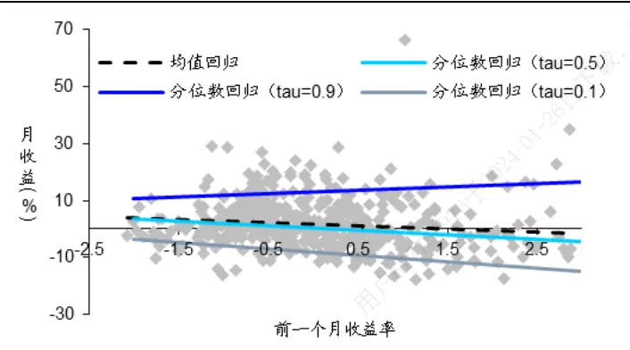
资料来源：Wind，海通证券研究所

图2 不同分位点对应的斜率估计（前一个月收益率）
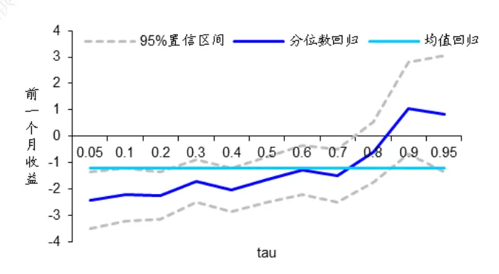
资料来源：Wind，海通证券研究所

由左图可见，中位数回归（ =0.5）的斜率估计与均值回归较为接近，呈现轻微的从左上向右下倾斜的形态，表明股票前一个月收益率对当月收益分布的中间位臵（均值或中位数）有负向影响，即存在反转效应。但是，当 =0.1 或 0.9 时，分位数回归的结果与均值回归却有着较大的差异。 =0.1对应的分位数回归直线更为陡峭，表明收益分布的左侧受到前一个月收益率的影响更大。而 =0.9对应的分位数回归的斜率更是变为正值，进一步说明了同一个因子可能对收益分布不同位臵有着截然相反的效应。

右图给出了分位数回归在更多分位点上的斜率估计，并与均值回归的结果进行对比。其中，水平直线为 的斜率估计值，折线为不同的 值对应的分位数回归的斜率估计，虚线为对应估计值的 95%臵信区间。在 50%-70%的分位点处，两种回归方法并无太大区别。但越向两个极端，两者的差异就越大，10%分位点对应的斜率绝对值几乎是均值回归的 2倍。

再考察前一个月日均换手率对当月收益分布的效应，具体结果见下图。

图3 均值回归和分位数回归的直线（前一个月日均换手率）
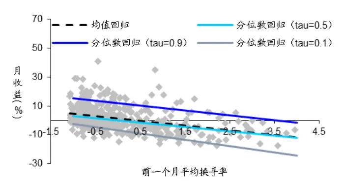
资料来源： ，海通证券研究所

图4 不同分位点对应的斜率估计（前一个月日均换手率）
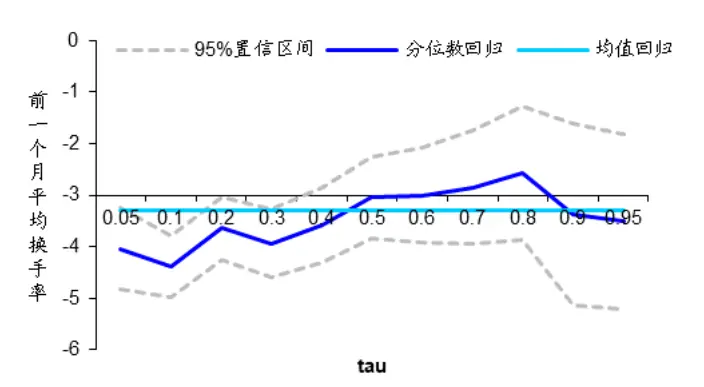
资料来源：Wind，海通证券研究所

由左上图可见，三条分位数回归直线的斜率都与均值回归的结果较为接近，这表明前一个月日均换手率因子对收益分布不同位臵的效应并无太大差异。右图进一步证实了这一判断，不同分位点对应的斜率估计值围绕均值回归的水平线上下窄幅波动。相对而言， =0.1时的分位数回归直线最为陡峭，其斜率的绝对值最大。

最后，将市值因子作为解释变量应用于分位数回归，分析它对收益分布的影响。

图5 均值回归和分位数回归的直线（总市值）
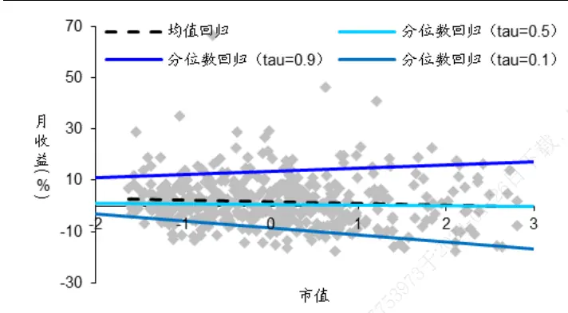
资料来源：Wind，海通证券研究所

图6 不同分位点对应的斜率估计（总市值）
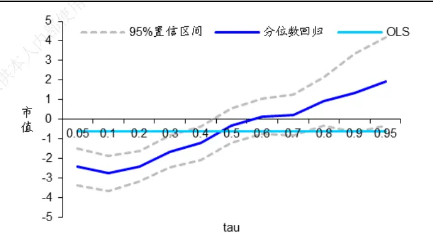
资料来源：Wind，海通证券研究所

如右上图所示，分位数回归的结果与均值回归存在着巨大的差异，越是极端的分位点，其斜率的绝对值越大。此外，从左图中还可发现，大市值股票的收益率更为分散，其 10%和 90%分位点的预测值均比小市值股票更为极端。

整体来看，这三个因子对收益率分布的不同位臵有着完全不一样的效应，单一的均值回归不足以反映这种特征。但是，如何将分位数回归的结果应用于具体的组合构建，却并不如均值回归那般简单，涉及到对分位数回归的理解与分位点 的选取。

## 3. τ取什么值

由上文可知，每一个 的取值都对应着股票收益率的一组预测，究竟应该使用哪一个值取决于对预测结果的用途。如果投资者想基于收益率的预测值来对股票排序，并买入那些排名较高的股票且卖出排名较低的股票，那么应当选择回归直线最陡峭且统计意义上显著的斜率所对应的 值。因为它代表了最能体现股票未来表现差异的一个方向。

例如，在前一个月收益因子的散点图中， =0.1 对应的斜率最为陡峭。这表明，如果只用前一个月收益因子来对股票排序，使用 =0.1 的分位数回归得到的收益率预测值能使 top 组合与 bottom 组合有最大的差异。对于前一个月日均换手率和市值因子，同样是 取 0.1 时对应的斜率绝对值最大。因此，根据“最能体现股票未来表现差异”的原则，如果用这两个因子单独选股，也应该使用 $\tau{=}0.1$ 时的收益率预测值来对股票排序。

诚然，从股票排序的角度可以为分位数回归在多因子选股中的应用给予一定的佐证，但和均值回归相比，依然显得不够直观。因为后者给出的是预期收益的估计，以此为依据选股既符合经典的投资理论，又易于理解。所以，为了更好地说明分位数回归的意义，并提供将其应用于实践的理论依据，本文从风险管理的角度给出另一种解释。

依然以 $\cdot y_{i}$ 表示股票 i的收益率， $x_{i}$ 为对应的因子值。所谓的均值回归预测，实际上就是去估计 $y_{i}$ 基于 $x_{i}的$ 条件期望 $[x_{i}]_{\circ}$ 。也即，在 $已知x_{i}的$ 基础上，代表收益率的随机变量 $.y_{i}$ 的条件分布的平均水平。因此，使用均值回归的结果对股票排序，比较的是收益率分布的平均水平。类似地，分位数回归预测的是 $\cdot y_{i}$ 基于 $x_{i}$ 的某个条件分位数 $\mathbb{Q}[y_{i}|x_{i}]$ 。根据前文的讨论，当 取较小的值时（例如，0.1），这个预测值的相反数即可被视作投资的VaR。从这个意义上来说，那些 0.1 分位点处的预测值越大的股票，其预期的 VaR 将越小，也即风险更低。因此，如果说均值回归是在挑选预期收益最 $高$ 的股票，那么 10%分位数回归则是在挑选风险更小的品种。

综合以上两个方面的讨论，下文在使用总市值、前一个月日均换手率和前一个月收益率构建三因子的分位数回归选股模型时，着重展示 =0.1 的结果。

## 4. 三因子分位数回归选股模型

## 4.1 数据与模型

用于实证的样本为 2007 年 1 月-2017 年 9 月期间，中证 500 指数所有成分股的月度数据。以 t月的因子值作为解释变量，t+1 月的个股收益率为被解释变量，分别建立均值和分位数回归模型。

为了降低极端值的影响，本文采用 MAD（Median Absolute Deviation，中位数绝对偏差法）来剔除异常值。MAD 的计算公式为:

$$
MAD=median(|X_{i}-median(X)|).
$$

其中，median(X)为因子的中位数，定义上、下限——median(X) 3*1.4826*MAD 以外的数据点为异常值。随后，分别对前一个月收益、前一个月日均换手率以及总市值三个因子进行行业中性化。具体来说，以 Wind 一级行业哑变量为解释变量，因子值为被解释变量，通过横截面回归求得残差作为中性化后的因子，从而获得纯粹的股票层面的因子效应。最后，对因子进行 Z-Score 标准化处理。

本文使用回归系数 个月的移动平均建立最新的收益预测模型，在每个月末预测下个月每个股票的收益率。以此为依据将所有股票排序，并均分成 10 组，分别采用等权和市值加权两种方式计算每组的收益。换仓时的交易费用设定为双边千分之三，模拟组合的起始点为 2007 年 8 月。

## 4.2 实证结果

为了更好地进行对比，本文依次计算了均值回归、 =0.1、0.5 和 0.9 的分位数回归对应的选股结果。在展示组合的风险收益特征之前，先来考察一下这三个因子在不同模型中的权重变化，尝试从另一个角度去分析均值回归与分位数回归应用于多因子选股的异同。具体情况参见以下四图。

中位数回归（ =0.5）和均值回归的系数估计较为接近，这并不令人意外。因为从前文单因子回归的结果（图 1、3、5）就可发现，这两个回归对应的直线差异很小。不过，相对而言，中位数回归的系数估计更为稳健。尤其是市值因子，在某些特殊的时点上，例如 年 月，其占比就不会那么极端。这也是由两种回归方法的性质所决定的，估计均值回归所采用的最小二乘估计，容易受到异常值的影响，但优势是更为敏感。

图7 分位数回归（ =0.1）的系数估计
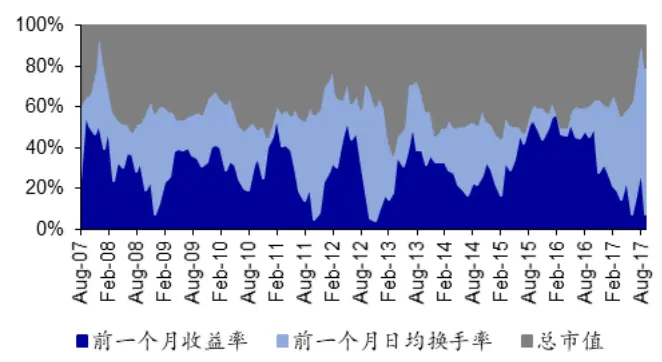
资料来源：Wind，海通证券研究所

图8 分位数回归（ =0.5）的系数估计
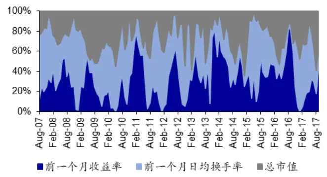
资料来源：Wind，海通证券研究所

图9 分位数回归（ =0.9）的系数估计
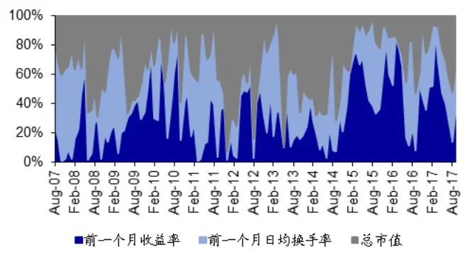
资料来源：Wind，海通证券研究所

图10 均值回归的系数估计
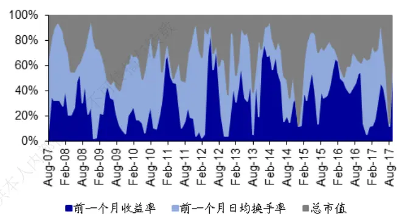
资料来源：Wind，海通证券研究所

=0.1 时的分位数回归对应的系数估计最为稳定，表明对于收益分布的较低位臵，三个因子的效应不容易随时间出现快速的变化。这一发现对股票收益的预测十分有价值，因为使用多因子选股模型的基本假设就是历史规律能在未来重演。 =0.9 时的分位数回归的系数估计随时间变化最为剧烈，可以猜测，其选股的有效性不会太高。

在分析了回归系数的特征后，本文继续比较每种方法下的分组收益（下表）。所有结果均以年化的形式呈现。

表 1 均值回归（OLS）和分位数回归（QR）的分组收益

|  | 等权重 |  |  | 市值加权 |  |  |  |  |
| --- | --- | --- | --- | --- | --- | --- | --- | --- |
|  | OLS | QR(0.1) | QR(0.5) | QR(0.9) | OLS QR(0.1) | QR(0.5) |  | QR(0.9) |
| D1 | 12.34% | 19.71% | 15.98% | 2.49% | 9.61% | 17.95% | 12.59% | 0.62% |
| D2 | 13.22% | 14.78% | 10.88% | 2.62% | 11.82% | 14.24% | 10.15% | 1.06% |
| D3 | 10.28% | 10.54% | 8.47% | 4.62% | 9.00% | 10.71% | 7.14% | 3.10% |
| D4 | 5.24% | 7.78% | 7.72% | 4.49% | 4.14% | 7.96% | 6.10% | 2.68% |
| D5 | 4.84% | 3.13% | 3.34% | 4.28% | 4.04% | 3.49% | 2.57% | 2.39% |
| D6 | 2.64% | 2.05% | 2.89% | 5.27% | 1.26% | 2.22% | 0.92% | 3.88% |
| D7 | 2.82% | -2.41% | 3.59% | 5.27% | 2.44% | -2.69% | 2.89% | 2.56% |
| D8 | -3.42% | 0.70% | -2.17% | 5.09% | -4.10% | 1.09% | -2.37% | 2.95% |
| D9 | -1.25% | -5.17% | -4.09% | 5.05% | -2.09% | -5.24% | -4.82% | 3.87% |
| D10 | -6.56% | -9.11% | -6.66% | 0.79% | -7.80% | -9.39% | -7.91% | -0.64% |
| D1-D10 | 18.89% | 28.83% | 22.64% | 1.69% | 17.42% | 27.34% | 20.51% | 1.26% |

资料来源： ，海通证券研究所

两种加权方式呈现的结论差异不大。以等权重加权为例，QR(0.1)对应的多空组合（D1-D10）的年化收益差在四种回归方法中表现最好。而且，这种优势是以更高的多头（D1）收益和更低的空头（D10）收益获得的。回顾前文可知，在这三个因子各自的分位数回归（图 2、4、6）中，均是 =0.1 对应的斜率绝对值最大，即此时的回归预测值最能够体现股票的差异，实证的结果恰好与这一假设吻合。

中位数回归——QR(0.5)的选股效果与均值回归差异不大，源于两者有相近的回归系数。而 QR(0.9)的结果最为糟糕，从分组收益来看，高分位点处的回归给出的预测值对股票几乎没有区分效果。一个原因是，QR(0.9)的系数估计极不稳定（图 9），使得用样本内的结果进行外推的可靠性大大降低。

更重要的是，在本文考察的样本区间内，A 股市场呈现小盘、反转的特征，即总市值小、前期收益率低的股票，在未来有更好的表现。因此，这两个因子和收益应当为负相关，即回归斜率小于零。但从图 1 和图 3 的结果来看， =0.9 对应的回归直线均有正的斜率。这表明市值越大的股票排序越高，所以最终的选股效果不尽人意。由此可见，尽管在分析因子对收益分布的效应时，可任意选取想要的分位点，但由于在实际构建组合时，只能使用一个回归的预测结果对股票排序，因此，确定最合适的那个分位点还是一项极具挑战性的工作。

以下四图分别从累计净值（左侧）以及相对中证 500 的强弱指数（右侧）两个角度，考察了不同回归方法下多头组合（D1）的业绩。

图11 等权重：QR和 OLS选股组合的累计净值
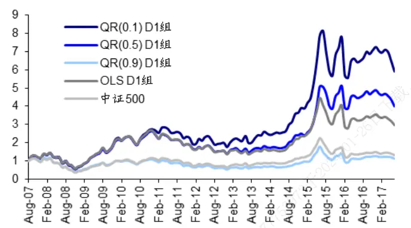
资料来源：Wind，海通证券研究所

图12 等权重：QR和 OLS选股组合的相对强弱
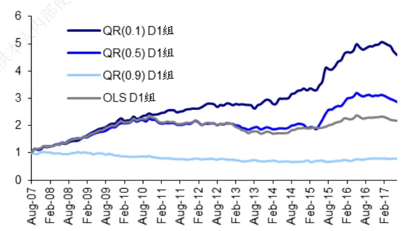
资料来源：Wind，海通证券研究所

图13 市值加权：QR和 OLS选股组合的累计净值
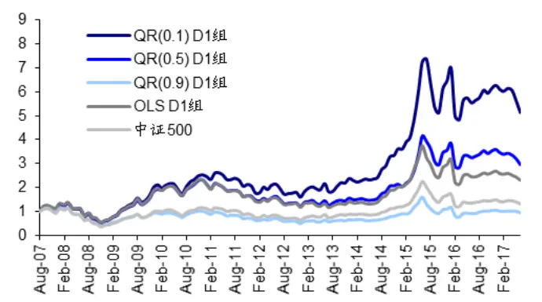
资料来源：Wind，海通证券研究所

图14 市值加权：QR和 OLS选股组合的相对强弱
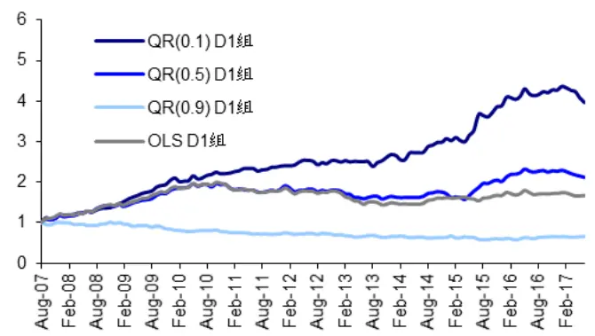
资料来源：Wind，海通证券研究所

整体来看，不论是等权重加权还是市值加权，若以中证 500 指数为基准，基于QR(0.1)、QR(0.5)和 OLS 的三因子多头组合均能产生明显的收益增强。不过，从 2011年起，QR(0.1)对应的多头组合开始展现出绝对优势，大幅超越同期 OLS的表现。

但是，从相对强弱指数的走势也应看到，2017 年以来，各回归方法下得到的多头组合都未能战胜基准。这是因为本文用来选股的三个因子中，总市值和前一个月的涨跌幅在 2017 年均出现了较长时期的失效。这也提醒投资者，在使用多因子模型构建指数增强组合的过程中，不论采用什么样的模型，都需要时刻关注因子风险的管理。

当然，本文的目的是对比分位数回归和均值回归的效果。为此，进一步计算 QR(0.1)和 OLS的多头组合自 2007 年以来的年度收益，列于以下两图。

图15 等权重：QR(0.1)和 OLS 的 D1 组的分年度收益
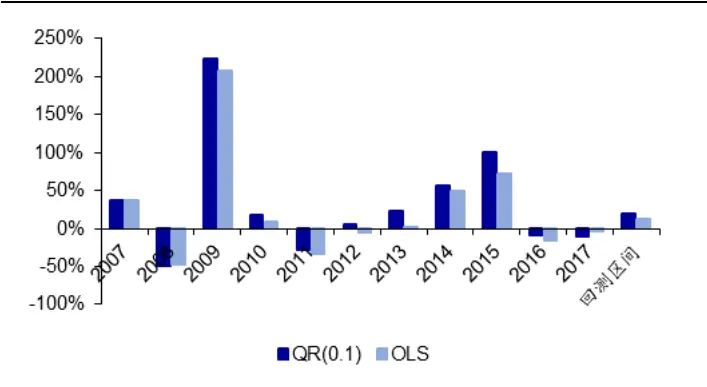
资料来源：Wind，海通证券研究所

图16 市值加权：QR(0.1)和 OLS 的 D1 组的分年度收益
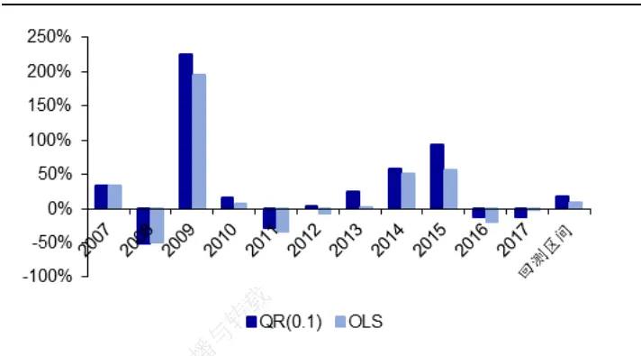
资料来源：Wind，海通证券研究所

在过去的 11 年间，除了 2008 和 2017，基于 QR(0.1)的组合相对 OLS均能产生显著的超额收益，优势十分稳定。下方两个表格展示了组合的风险收益特征，可以更为全

表 2 等权重：QR(0.1)和 OLS的 D1组的风险收益特征

|  | QR(0.1) |  |  |  |  |  | OLS |  |  |  |  |
| --- | --- | --- | --- | --- | --- | --- | --- | --- | --- | --- | --- |
|  | 收益 | 超额收 益 | 年化波 动率 | 夏普 比率 | 最大回 撤 | 换手率 | 收益 | 超额收 益 | 年化波 夏普 动率 比率 | 最大回 撤 | 换手率 |
| 2007.8-2007.12 | 37.25% | 24.90% | 50.38% | 0.68 | 9.49% 159.22% | 36.33% | 23.98% | 45.37% | 0.74 | 10.13% | 135.68% |
| 2008 | -49.18% | 11.62% | 55.33% | -0.94 | 64.04% 151.48% | -47.50% | 13.30% | 52.63% | -0.96 | 61.54% | 163.22% |
| 2009 | 224.26% | 92.99% | 32.65% | 6.83 | 12.46% | 157.55% 207.00% | 75.74% | 33.31% | 6.18 | 14.29% | 139.47% |
| 2010 | 17.34% | 7.28% | 28.93% | 0.53 | 20.13% | 142.04% | 9.73% | -0.34% 27.66% | 0.28 | 19.16% | 119.17% |
| 2011 | -27.91% | 5.92% | 23.72% | -1.31 | 32.59% | 134.41% | -33.03% | 0.79% 22.78% | -1.59 | 34.03% | 137.72% |
| 2012 | 4.98% | 4.70% | 31.09% | 0.07 | 25.35% | 142.36% | -4.96% | -5.24% 28.29% | -0.27 | 25.42% | 140.26% |
| 2013 | 23.81% | 6.93% | 28.77% | 0.71 | 16.00% | 145.45% | 1.89% | -15.00% 23.92% | -0.06 | 15.92% | 178.63% |
| 2014 | 56.23% | 17.22% | 18.35% | 2.87 | 1.70% | 127.59% | 49.60% | 10.59% 19.13% | 2.41 | 5.04% | 163.41% |
| 2015 | 100.48% | 57.37% | 45.13% | 2.17 | 30.31% | 152.07% | 72.08% | 28.96% | 41.35% 1.68 | 32.27% | 145.45% |
| 2016 | -9.59% | 8.18% | 34.30% | -0.35 | 3.04% | 170.59% | -15.76% | 2.02% | 36.02% -0.50 | 3.99% | 167.51% |
| 2017.1-2017.9 | -11.26% | -16.68% | 14.25% | -0.96 | 16.73% | 112.96% | -3.77% | -9.19% | 12.72% -0.49 | 13.30% | 118.43% |
| 回测区间 | 19.75% | 15.63% | 36.17% | 0.47 | 64.04% | 145.07% | 12.34% | 8.22% 34.41% | 0.28 | 61.54% | 146.27% |

资料来源： ，海通证券研究所

表 3 市值加权：QR(0.1)和 OLS的 D1组的风险收益特征

|  | QR(0.1) |  |  |  |  |  | OLS |  |  |  |  |
| --- | --- | --- | --- | --- | --- | --- | --- | --- | --- | --- | --- |
|  | 收益 | 超额收 益 | 年化波 动率 | 夏普 比率 | 最大回 撤 | 换手率 | 超额收 收益 益 | 年化波 动率 | 夏普 比率 | 最大回 撤 | 换手率 |
| 2007.8-2007.12 | 32.68% | 20.32% | 46.93% | 0.64 | 9.42% | 160.83% | 32.73% 20.38% | 41.02% | 0.73 | 9.39% | 139.45% |
| 2008 | -50.99% | 9.81% | 54.59% | -0.99 | 64.24% 157.20% | -50.00% | 10.80% | 51.76% | -1.03 | 61.84% | 166.63% |
| 2009 | 225.47% | 94.20% | 31.47% | 7.12 | 11.15% 163.08% | 194.53% | 63.27% | 32.70% | 5.91 | 13.97% | 144.53% |
| 2010 | 16.20% | 6.13% | 28.97% | 0.49 | 20.05% 146.23% |  | 7.86% -2.21% | 27.22% | 0.22 | 19.29% | 125.38% |
| 2011 | -27.89% | 5.93% | 23.64% | -1.31 32.32% |  | 139.38% | -32.92% | 0.90% | 22.53% -1.60 | 33.74% | 143.30% |
| 2012 | 3.90% | 3.63% | 30.42% | 0.04 | 25.30% | 147.57% | -6.09% | -6.37% | 27.51% -0.32 | 25.41% | 143.01% |
| 2013 | 24.38% | 7.49% | 28.25% | 0.75 | 15.43% | 151.28% | 1.00% | -15.89% | 23.32% -0.10 | 15.16% | 179.99% |
| 2014 | 57.72% | 18.72% | 18.31% | 2.96 | 1.80% | 134.30% | 50.76% | 11.76% | 19.02% 2.49 | 6.06% | 165.33% |
| 2015 | 93.20% | 50.09% | 45.00% | 2.01 | 30.33% | 156.83% | 56.50% | 13.38% | 42.44% 1.27 | 35.52% | 153.15% |
| 2016 | -12.66% | 5.12% | 35.98% | -0.42 | 3.63% | 176.18% | -18.75% | -0.98% 37.24% | -0.56 | 4.23% | 172.23% |
| 2017.1-2017.9 | -11.91% | -17.33% | 14.00% | -1.02 | 16.46% | 121.14% | -1.21% | -6.63% | 11.28% -0.32 | 11.10% | 122.02% |
| 回测区间 | 17.98% | 13.87% | 35.85% | 0.43 | 64.24% | 150.37% | 9.60% | 5.49% 33.95% | 0.20 | 61.84% | 150.46% |

资料来源：Wind，海通证券研究所

从相对基准的超额收益的角度，QR(0.1)无疑更优。两种加权方式下，都大幅超越OLS 的结果。但两者的波动和回撤却十分接近，因而 QR(0.1)的夏普比率具有明显的优势。此外，使用分位数回归并没有提高组合的换手率，这意味着上述结果在任何交易费用的假设下都是稳健的。

## 5. 总结与讨论

传统的均值回归（OLS）并不能完全把握因子对整个收益率分布的效应，容易遗漏一些重要的信息。而分位数回归的最大优势就是可以对分布的任何一个分位点建立回归模型，研究收益和因子之间的关系。这一特质使得分位数回归在多因子选股模型中有着很大的应用价值。除了能够发掘被 O S掩盖的因子效应之外，投资者更可以根据不同分位点的收益率预测值来对所有股票排序，构建组合。

在实际操作中，通常选择斜率绝对值最大，即回归直线最为陡峭，且统计意义上显著的分位点对应的模型，来得到股票的排序。因为直线越陡峭，表明收益对因子的敏感性越高，对股票未来表现的区分能力也越强。

通过对中证 指数成分股的实证分析发现，利用 分位点处的回归模型对股票排序后得到的组合，在过去的 年里，不论是年化收益还是夏普比率都比 方法有了大幅提高。不过，需要注意的是，由于构建组合时选择了斜率最陡峭的方向，相当于放大了因子的 。因此，一旦因子失效，分位数回归也可能会进一步放大风险。年以来模型表现的不尽人意，也正是这个原因。

本文只是展示了分位数回归方法在多因子选股中的一个简单应用，投资者完全可以根据自己的研究和经验，加入更多的因子或者拓展到其他指数的增强策略中。事实上，作为 的一种替代方法，分位数回归在基金业绩的分析与评价、风险的度量与管理等诸多方面，有着广泛的应用空间，值得进一步尝试和研究。

## 6. 风险提示

模型误设风险、因子失效风险。

特别声明：本篇报告的结果均由数量化模型自动计算得到，研究员未进行主观判断调整；数据源均来自于市场公开信息。

# 信息披露

分析师声明

[Table冯佳睿yst金融工程研究团队s]

本人具有中国证券业协会授予的证券投资咨询执业资格，以勤勉的职业态度，独立、客观地出具本报告。本报告所采用的数据和信息均来自市场公开信息，本人不保证该等信息的准确性或完整性。分析逻辑基于作者的职业理解，清晰准确地反映了作者的研究观点，结论不受任何第三方的授意或影响，特此声明。

## 法律声明

本报告仅供海通证券股份有限公司（以下简称 本公司 ）的客户使用。本公司不会因接收人收到本报告而视其为客户。在任何情况下，载本报告中的信息或所表述的意见并不构成对任何人的投资建议。在任何情况下，本公司不对任何人因使用本报告中的任何内容所引致的任何损失负任何责任。

本报告所载的资料、意见及推测仅反映本公司于发布本报告当日的判断，本报告所指的证券或投资标的的价格、价值及投资收入可能不会波动。在不同时期，本公司可发出与本报告所载资料、意见及推测不一致的报告。用，

市场有风险，投资需谨慎。本报告所载的信息、材料及结论只提供特定客户作参考，不构成投资建议，也没有考虑到个别客户特殊的投资目标、财务状况或需要。客户应考虑本报告中的任何意见或建议是否符合其特定状况。在法律许可的情况下，海通证券及其所属人关联机构可能会持有报告中提到的公司所发行的证券并进行交易，还可能为这些公司提供投资银行服务或其他服务。供

本报告仅向特定客户传送，未经海通证券研究所书面授权，本研究报告的任何部分均不得以任何方式制作任何形式的拷贝、复印件或复制品，或再次分发给任何其他人，或以任何侵犯本公司版权的其他方式使用。所有本报告中使用的商标、服务标记及标记均为本公日司的商标、服务标记及标记。如欲引用或转载本文内容，务必联络海通证券研究所并获得许可，并需注明出处为海通证券研究所，且-不得对本文进行有悖原意的引用和删改。24

根据中国证监会核发的经营证券业务许可，海通证券股份有限公司的经营范围包括证券投资咨询业务。3于

## 海通证券股份有限公司研究所[Table_PeopleInfo]

路 颖所长

(021)23219403 luying@htsec.com

高道德 副所长(021)63411586 gaodd@htsec.com

姜 超 副所长(021)23212042 jc9001@htsec.com

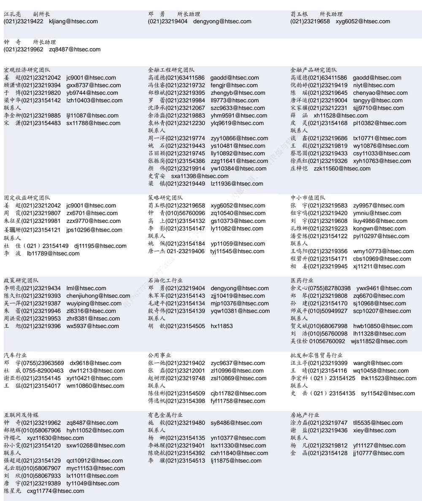

| 电子行业 |  | 煤炭行业 |  |  | 电力设备及新能源行业 |  |  |  |  |  |
| --- | --- | --- | --- | --- | --- | --- | --- | --- | --- | --- |
| 陈 平(021)23219646 联系人 | cp9808@htsec.com |  | 吴 杰(021)23154113 李 淼(010)58067998 | wj10521@htsec.com Im10779@htsec.com | 房 青(021)23219692 徐柏乔(021)32319171 张向伟(021)23154141 | fangq@htsec.com xbq6583@htsec.com zxw10402@htsec.com |  |  |  |  |
| 谢 磊(021)23212214 xl10881@htsec.com 张天闻 ztw11086@htsec.com |  |  |  |  |  |  |  |  |  |  |
| 尹 石 | 苓(021)23154119 | yl11569@htsec.com |  |  | 曾 彪(021)23154148 | zb10242@htsec.com |  |  |  |  |
| 坚 010-58067942 |  | sj11855@htsec.com | 计算机行业 |  | 通信行业 |  |  |  |  |  |
| 基础化工行业 威(0755)82764281 |  |  |  |  |  |  |  |  |  |  |
| 刘 |  | Iw10053@htsec.com | 郑宏达(021)23219392 | zhd10834@htsec.com | 朱劲松(010)50949926 | zjs10213@htsec.com |  |  |  |  |
| 刘 强(021)23219733 |  | lq10643@htsec.com | 谢春生(021)23154123 鲁 立 I11383@htsec.com | xcs10317@htsec.com | 余伟民(010)50949926 联系人 | ywm11574@htsec.com |  |  |  |  |
| 刘海荣(021)23154130 联系人 |  |  |  |  |  |  |  |  |  |  |
| 张翠翠 |  | Ihr10342@htsec.com | 黄竞晶(021)23154131 杨 林(021)23154174 | hjj10361@htsec.com yl11036@htsec.com | 庄宇(010)50949926 张峥青 zzq11650@htsec.com | zy11202@htsec.com |  |  |  |  |
| zcc11726@htsec.com |  |  |  |  |  |  |  |  |  |  |
| 非银行金融行业 |  |  | 交通运输行业 | hl11570@htsec.com | 纺织服装行业 |  |  |  |  |  |
| 孙 婷(010)50949926 |  |  |  |  |  |  |  |  |  |  |
| 何 婷(021)23219634 | st9998@htsec.com ht10515@htsec.com | 张 杨(021)23219442 联系人 | 虞 楠(021)23219382 | yun@htsec.com zy9937@htsec.com | 梁 希(021)23219407 于旭辉(021)23219411 | lx11040@htsec.com yxh10802@htsec.com |  |  |  |  |
| 联系人 |  |  |  |  |  |  |  |  |  |  |
| 夏昌盛(010)56760090 xcs10800@htsec.com |  |  |  |  |  |  |  |  |  |  |
| 李芳洲(021)23154127 Ifz11585@htsec.com |  |  |  |  |  |  |  |  |  |  |
| 建筑建材行业 邱友锋(021)23219415 |  |  |  |  |  |  |  |  |  |  |
| 冯晨阳(021)23212081 | qyf9878@htsec.com fcy10886@htsec.com | 耿 耘(021)23219814 杨 震(021)23154124 | 余炜超(021)23219816 swc11480@htsec.com gy10234@htsec.com yz10334@htsec.com | 联系人 刘 璇(021)23219197 | 刘彦奇(021)23219391 | liuyq@htsec.com lx11212@htsec.com |  |  |  |  |
| 钱佳佳(021)23212081 qjj10044@htsec.com 联系人 |  |  |  |  |  |  |  |  |  |  |
| 周 俊 0755-23963686 zj11521@htsec.com |  |  |  |  |  |  |  |  |  |  |
| 建筑工程行业 杜市伟 dsw11227@htsec.com |  |  |  |  |  |  |  |  |  |  |
| 毕春晖(021)23154114 bch10483@htsec.com |  |  |  |  |  |  |  |  |  |  |
|  |  |  |  |  |  |  | 成珊(021)23212207 cs9703@htsec.com |  |  |  |
|  |  |  |  |  |  |  | 陈 阳(010)50949923 联系人 | cxl9730@htsec.com cy10867@htsec.com |  |  |
|  |  |  |  |  |  |  |  | 关慧(021)23219448 夏越(021)23212041 | gh10375@htsec.com xy11043@htsec.com |  |
|  |  |  |  |  |  |  |  | 银行行业 林媛媛(0755)23962186 lyy9184@htsec.com |  | 社会服务行业 |
|  |  |  |  |  |  |  | 军工行业 徐志国(010)50949921 xzg9608@htsec.com 刘 磊(010)50949922 II11322@htsec.com |  |  |  |
|  |  |  |  |  |  |  | 蒋 俊(021)23154170 jj11200@htsec.com |  |  |  |
| 联系人 |  |  |  |  |  |  |  |  |  |  |
| 张宇轩 zyx11631@htsec.com |  | 谭敏沂 | tmy10908@htsec.com |  | 陈扬扬(021)23219671 顾熹闽 021-23154388 | cyy10636@htsec.com gxm11214@htsec.com |  |  |  |  |
| 张恒晅 zhx10170@hstec.com |  |  |  |  |  |  |  |  |  |  |
| 家电行业 |  | 造纸轻工行业 |  |  |  |  |  |  |  |  |
| 陈子仪(021)23219244 chenzy@htsec.com |  | 曾 | 知(021)23219810 | zz9612@htsec.com |  |  |  |  |  |  |
| 联系人 |  |  | 赵 洋(021)23154126 | zy10340@htsec.com |  |  |  |  |  |  |
| 李阳 ly11194@htsec.com |  |  |  |  |  |  |  |  |  |  |
| 朱默辰 zmc11316@htsec.com 刘璐 II11838@htsec.com |  |  |  |  |  |  |  |  |  |  |

## 研究所销售团队

海通证券股份有限公司研究所

地址：上海市黄浦区广东路 689号海通证券大厦 9楼

电话：（021）23219000

传真：（021）23219392

网址：www.htsec.com

| 深广地区销售团队 蔡铁清(0755)82775962 ctq5979@htsec.com 伏财勇(0755)23607963 fcy7498@htsec.com 辜丽娟(0755)83253022 gulj@htsec.com 季唯佳(021)23219384 刘晶晶(0755)83255933 liujj4900@htsec.com 黄 毓(021)23219410 王雅清(0755)83254133 wyq10541@htsec.com 漆冠男(021)23219281 饶 伟(0755)82775282 rw10588@htsec.com 胡宇欣(021)23154192 | 上海地区销售团队 胡雪梅(021)23219385 huxm@htsec.com 朱 健(021)23219592 zhuj@htsec.com | 北京地区销售团队 殷怡琦(010)58067988 yyq9989@htsec.com 吴尹 wy11291@htsec.com jiwj@htsec.com 陆铂锡 Ibx11184@htsec.com huangyu@htsec.com 张丽萱(010)58067931 zlx11191@htsec.com |
| --- | --- | --- |