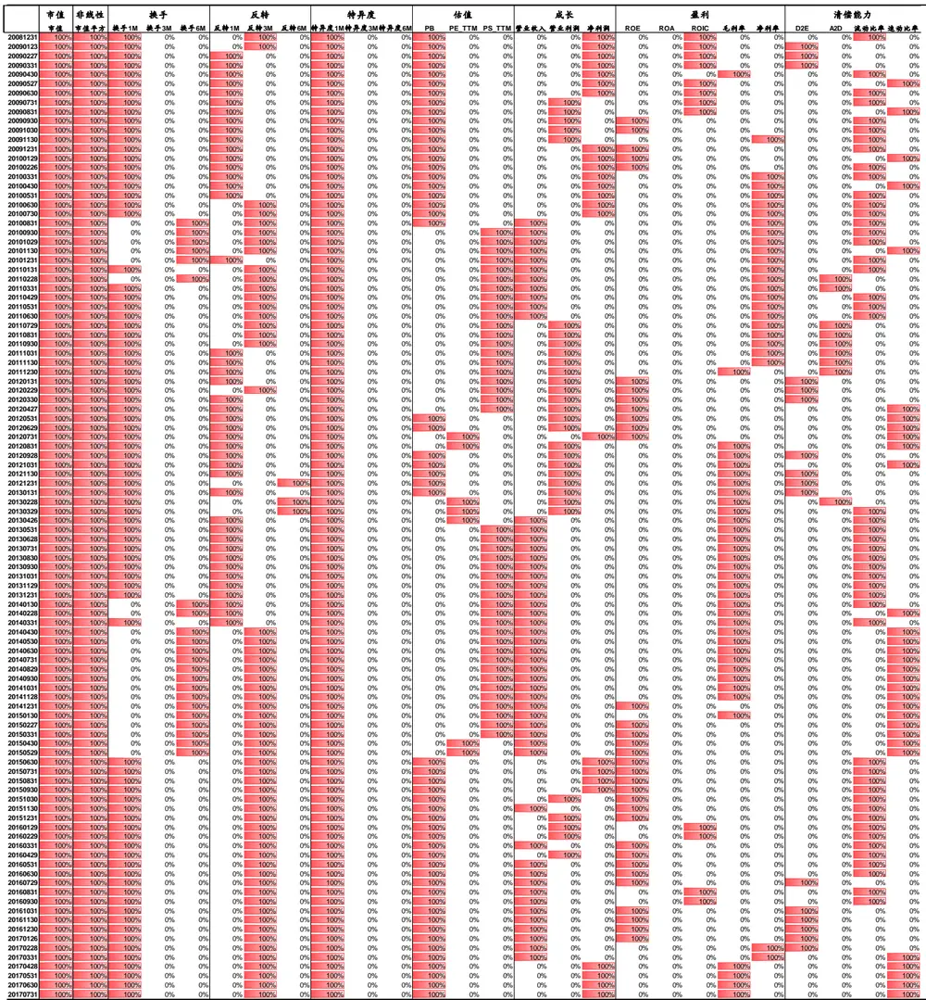
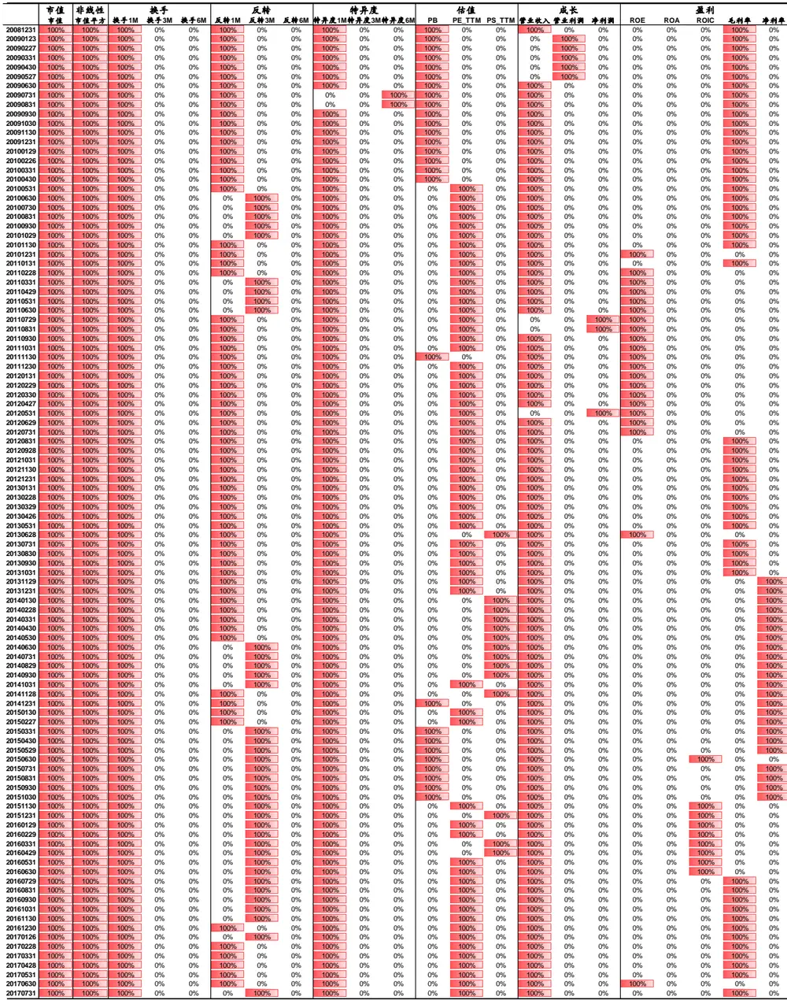
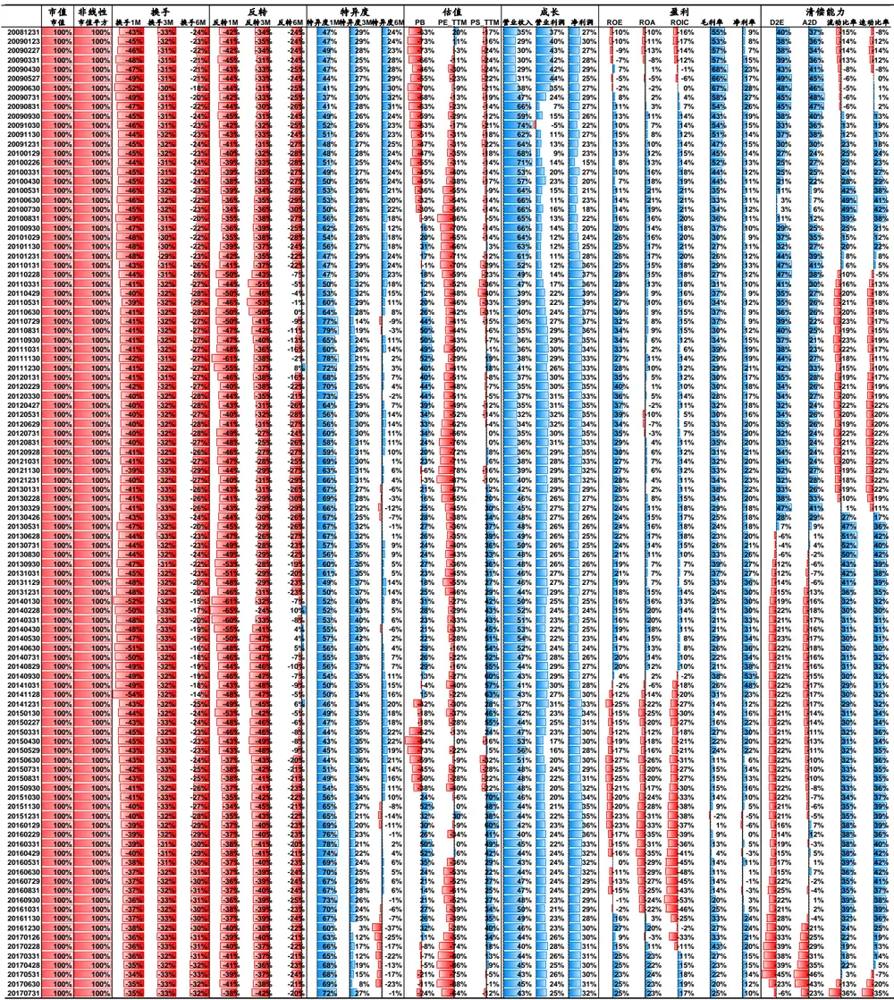
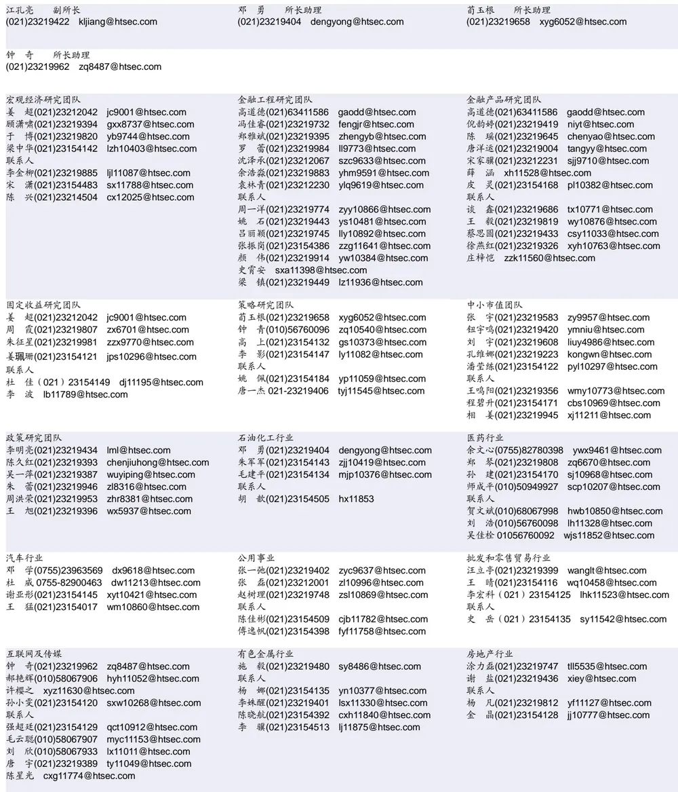

## 相关研究

Table_ReportInfo]《选股因子系列研究（二十八）——一致预期质量分析》

《分析师荐股报告是否具有超额收益》2017.10.19

分析师:冯佳睿

Tel:(021)23219732

Email:fengjr@htsec.com

证书:S0850512080006

分析师:袁林青

Tel:(021)23212230

Email:ylq9619@htsec.com

证书:S0850516050003

# 选股因子系列研究（二十九）——因子降维1：底层因子降维方法对比

随着投资者对于选股因子挖掘的深入，构建选股模型时可供选择的因子越来越多，随之而来的问题也逐渐增多。其中有两个问题值得关注：1）因子在数量较多的情况下，无法高效地进行正交化处理； ）对于某一类高相关因子，正交的手段无法较好地提炼它们的信息。

对于上述问题，投资者可通过因子降维进行处理。也即，对于高相关因子分配因子降维权重，并加权求和计算降维后的因子值。由于因子降维方法多种多样，故而本报告为投资者提供了几种基本降维方法的效果回测对比。

- 因子降维的思路多种多样。本报告从“选取类别内选股效果最强的因子”、“基于类别内因子选股效果加权”以及“最大化类别内因子选股效果波动”三条思路出发构建了相应的降维方法。

“选取类别内选股效果最强的因子”降维效果较好。模型复合因子选股能力以及模型月度多空收益在降维后都出现了改善。使用正交因子 作为因子选股效果的衡量指标，降维后的模型选股能力出现了进一步的提升。

“基于类别内因子选股效果加权”降维效果同样较好。模型复合因子选股能力以及模型月度多空收益在降维后都出现了改善。使用正交因子 作为因子选股效果的衡量指标，降维后的模型选股能力出现了进一步的提升。

- “最大化解释类别内因子选股效果波动”降维效果较差。模型复合因子选股能力在降维后改善较少，使用正交因子后模型表现并无改善。

相比而言，“选取类别内选股效果最强的因子”降维后，模型具有最强的选股效果。对比来看，“取类别内最强”能够对于模型产生最大幅度的提升，同时各类因子在降维后也能保持较强的选股能力。若投资者想尽可能多地使用到类别内各指标的信息，则可使用“类别内因子选股效果加权”。从结果上看，并不推荐使用“最大化解释类别内因子波动”进行降维。

- 风险提示。市场系统性风险、资产流动性风险以及政策变动风险会对策略表现产生较大影响。

随着投资者对于选股因子挖掘的深入，构建选股模型时可供选择的因子越来越多，随之而来的问题也逐渐增多。其中有两个值得关注：1）因子在数量较多的情况下，无法高效地进行正交化处理；2）对于某一类高相关因子，正交的手段无法较好地提炼它们的信息。

对于上述问题，投资者可通过因子降维进行应对。也即，可对于高相关因子分配因子降维权重，并加权求和计算降维后的因子值，然后使用降维后的因子进行收益模型的构建。由于因子降维方法多种多样，故而本报告为投资者提供了几种基本降维方法的效果回测对比以及相关改进方向。

报告第一章简要介绍了因子降维的整体思路，第二章对比了降维前后多因子模型的表现，第三章对比了不同降维思路下多因子模型的表现。

## 1. 选股因子的降维

随着因子库中因子数量的增多，因子之间的相关性不可避免，而逻辑类似的因子更有可能具有较高的相关性。下表给出了一个较为简单的因子库中，各因子在 2009 年 1月至 2017 年 7月底间截面线性相关性的均值。

表 1 因子截面相关性均值（2009年 1月至 2017年 7月）

|  | 市值市值 | 非线性市值平方 | 换手1M 3M 6M |  |  | 反转1M 3M 6M |  |  | 1M | 特异度3M | 6M | PE | 估值PB PS |  | 成长营收营业利润净利润 |  | 盈利ROEROAROIC |  |  | 毛利率净利率 |  | 偿付能力D2E A2D流动 |  |  | 速动 |
| --- | --- | --- | --- | --- | --- | --- | --- | --- | --- | --- | --- | --- | --- | --- | --- | --- | --- | --- | --- | --- | --- | --- | --- | --- | --- |
| 市值 市值 | 1.00 | 0.50 | -0.34 -0.36-0.38 |  |  | 0.04 | 0.08 0.10 |  | -0.03 | -0.03 | -0.02 | 0.02 | -0.33 | -0.04 | 0.15 0.13 0.14 |  | 0.41 | 0.30 0.35 |  | 0.11 | 0.33 | 0.16 0.15 |  | -0.11 | -0.09 |
| 非线性市值平方 | 0.50 | 1.00 | -0.23 -0.24 -0.25 |  |  | -0.01 | -0.01 -0.01 |  | 0.05 | 0.07 | 0.08 | -0.03 | -0.19 | -0.02 | 0.04 0.01 0.02 |  | 0.20 | 0.080.12 |  | 0.04 | 0.16 | 0.14 0.14 |  | -0.07 | -0.06 |
| 1M换手 3M6M | -0.34 | -0.23 | 1.00 | 0.92 0.84 |  | 0.17 | 0.22 0.21 |  | -0.20 | -0.21 | -0.19 | 0.20 | 0.25 | 0.20 | 0.01 0.00 0.00 |  | -0.13 | -0.05 | -0.09 | -0.01 | -0.08 | -0.16-0.14 |  | 0.15 | 0.14 |
|  | -0.36 | -0.24 | 0.92 | 1.00 0.94 |  | 0.04 | 0.16 | 0.20 | -0.08 | -0.19 | -0.20 | 0.20 | 0.26 | 0.21 | 0.01 0.00 -0.01 |  | -0.14 | -0.05 | -0.09 | -0.01 | -0.09 | -0.17 | -0.15 | 0.17 | 0.16 |
|  | -0.38 | -0.25 | 0.84 | 0.94 1.00 |  | 0.01 | 0.06 | 0.15 | -0.04 | -0.09 | -0.17 | 0.21 | 0.26 | 0.22 | 0.01 0.00 -0.01 |  | -0.13 | -0.04 | -0.08 | 0.00 | -0.08 | -0.19 | -0.16 | 0.19 | 0.18 |
| 1M反转 3M6M | 0.04 | -0.01 | 0.17 | 0.04 0.01 |  | 1.00 | 0.51 | 0.35 | -0.31 | -0.12 | -0.07 | 0.11 | 0.07 | 0.06 | 0.01 0.01 0.01 |  | 0.00 | 0.00 | 0.00 | 0.00 | 0.00 | 0.00 | 0.00 | 0.01 | 0.00 |
|  | 0.08 | -0.01 | 0.22 | 0.16 0.06 |  | 0.51 | 1.00 | 0.65 | -0.30 | -0.34 | -0.19 | 0.20 | 0.11 | 0.10 | 0.03 0.04 0.04 |  | 0.02 | 0.02 | 0.02 | 0.01 | 0.00 | 0.00 | 0.00 | 0.01 | 0.00 |
|  | 0.10 | -0.01 | 0.21 | 0.20 0.15 |  | 0.35 | 0.65 | 1.00 | -0.28 | -0.35 | -0.36 | 0.29 | 0.14 | 0.15 | 0.07 0.09 0.09 |  | 0.05 | 0.05 | 0.05 | 0.03 | 0.02 | -0.010.00 |  | 0.02 | 0.01 |
| 1M特异度 3M | -0.03 | 0.05 | -0.20 | -0.08-0.04 |  | -0.31 | -0.30 | -0.28 | 1.00 | 0.62 | 0.48 | -0.26 | -0.14 | -0.12 | -0.02 0.00 0.00 |  | 0.02 | 0.01 | 0.01 | -0.02 | 0.05 | -0.01-0.01 |  | 0.00 | 0.01 |
|  | -0.03 | 0.07 | -0.21 | -0.19-0.09 |  | -0.12 | -0.34 | -0.35 | 0.62 | 1.00 | 0.78 | -0.35 | -0.19 | -0.17 | -0.03 -0.01 0.00 |  | 0.03 | 0.01 | 0.01 | -0.02 | 0.07 | -0.01-0.02 |  | 0.01 | 0.02 |
| 6M | -0.02 | 0.08 | -0.19 | -0.20-0.17 |  | -0.07 | -0.19 | -0.36 | 0.48 | 0.78 | 1.00 | -0.40 | -0.21 | -0.20 | -0.04 -0.02 -0.02 |  | 0.03 | 0.00 | 0.00 | -0.04 | 0.08 | -0.01-0.01 |  | 0.00 | 0.02 |
| PE估值 PBPS |  |  |  |  |  |  |  |  |  |  |  |  |  |  |  |  |  |  |  |  |  |  |  |  |  |
|  | -0.33 | -0.19 | 0.25 | 0.26 0.26 |  | 0.07 | 0.11 | 0.14 | -0.14 | -0.19 | -0.21 | 0.34 | 1.00 | 0.31 | -0.13 -0.16 -0.17 |  | -0.56 | -0.46-0.50 |  | -0.10 | -0.38 | -0.12 | -0.13 | 0.06 | 0.06 |
|  | -0.04 | -0.02 | 0.20 | 0.21 0.22 |  | 0.06 | 0.10 | 0.15 | -0.12 | -0.17 | -0.20 | 0.50 | 0.31 | 1.00 | -0.03 0.02 0.01 |  | 0.00 | 0.16 | 0.12 | 0.58 | 0.33 | -0.50-0.46 |  | 0.41 | 0.39 |
| 营收成长营业利润净利润 | 0.150.130.14 |  |  |  |  |  |  |  |  |  |  |  |  |  |  |  |  |  |  |  |  |  |  |  |  |
|  |  | 0.01 | 0.00 | 0.00 0.00 |  | 0.01 | 0.04 | 0.09 | 0.00 | -0.01 | -0.02 | 0.09 | -0.16 | 0.02 | 0.41 | 1.00 0.78 | 0.39 | 0.38 | 0.39 | 0.15 | 0.32 | -0.01 -0.02 |  | 0.03 | 0.02 |
|  |  | 0.02 | 0.00 | -0.01 -0.01 |  | 0.01 | 0.04 | 0.09 | 0.00 | 0.00 | -0.02 | 0.09 | -0.17 | 0.01 | 0.39 | 0.78 1.00 | 0.46 | 0.360.37 |  | 0.15 | 0.37 | -0.01 -0.01 |  | 0.02 | 0.02 |
| ROEROA盈利 ROIC毛利率净利率 |  | 0.20 | -0.13 | -0.14 | -0.13 | 0.00 | 0.02 | 0.05 | 0.02 | 0.03 | 0.03 | 0.15 | -0.56 | 0.00 | 0.34 | 0.39 0.46 | 1.00 |  |  |  |  |  |  |  |  |
|  | 0.30 | 0.08 | -0.05 | -0.05 | -0.04 | 0.00 | 0.02 | 0.05 | 0.01 | 0.01 | 0.00 | 0.21 | -0.46 | 0.16 | 0.29 | 0.38 0.36 | 0.83 | 1.00 | 0.96 | 0.44 | 0.70 | -0.38 | -0.37 | 0.32 | 0.36 |
|  | 0.35 | 0.12 | -0.09 | -0.09 | -0.08 | 0.00 | 0.02 | 0.05 | 0.01 | 0.01 | 0.00 | 0.22 | -0.50 | 0.12 | 0.29 | 0.39 0.37 | 0.86 | 0.96 | 1.00 | 0.40 | 0.69 | -0.31 | -0.31 | 0.28 | 0.31 |
|  | 0.11 | 0.04 | -0.01 | -0.01 | 0.00 | 0.00 | 0.01 | 0.03 | -0.02 | -0.02 | -0.04 | 0.22 | -0.10 | 0.58 | 0.08 | 0.15 0.15 | 0.35 | 0.44 | 0.40 | 1.00 | 0.63 | -0.38 | -0.32 | 0.33 | 0.30 |
|  | 0.33 | 0.16 | -0.08 | -0.09 | -0.08 | 0.00 | 0.00 | 0.02 | 0.05 | 0.07 | 0.08 | 0.05 | -0.38 | 0.33 | 0.23 | 0.32 0.37 | 0.70 | 0.70 | 0.69 | 0.63 | 1.00 | -0.31 | -0.27 | 0.32 | 0.34 |
| D2EA2D偿付能力流动速动 | 0.160.15 | 0.140.14 |  |  |  |  |  |  |  |  |  |  |  |  |  |  |  |  |  |  |  |  |  |  |  |
|  |  |  | -0.14 | -0.15 | -0.16 | 0.00 | 0.00 | 0.00 | -0.01 | -0.02 | -0.01 | -0.03 | -0.13 | -0.46 | 0.03 | -0.02 -0.01 | -0.09 | -0.37 | -0.31 | -0.32 | -0.27 | 0.92 | 1.00 | -0.58 | -0.63 |
|  | -0.11-0.09 | -0.07-0.06 | 0.150.14 | 0.170.16 | 0.19 | 0.01 | 0.01 | 0.02 | 0.00 | 0.01 | 0.00 | 0.10 | 0.06 | 0.41 | 0.03 | 0.03 0.02 | 0.14 | 0.32 | 0.28 | 0.33 | 0.32 | -0.74 | -0.58 | 1.00 | 0.89 |

资料来源：Wind，海通证券研究所

从上表不难发现，对于同一类因子，各因子之间的截面相关性极高。例如，对于盈利类的因子，各指标之间的截面相关性普遍高于 0.50，甚至有的指标之间截面线性相关性均值高于 0.80。若想在构建多因子模型时将这一类因子的信息全部纳入到模型中，投资者需要通过因子降维来进行信息的精炼。简单来说，因子降维是将高相关因子加权计算为复合因子的过程。

对于某一类因子 i，因子降维的实现方法可具体表述为下式：

$$
\mathbb{E}{\mathcal{F}}_{i}=\sum_{k=1}^{K}w_{k}^{i}*{\mathcal{F}}\mathbb{E}{\mathcal{F}}_{k}^{i}
$$

其中，因子 $\mathbf{\dot{\rho}}_{\mathrm{i}}$ 为降维后的因子，子因子 $\mathbf{\Pi}_{\mathbf{k}}^{\mathsf{i}}$ 为降维前类别内的各因子， $\ w_{\sf k}^{\mathrm{i}}$ 为降维权重。降维权重是因子降维的关键，不同的降维方法会给出不同的降维权重，从而影响降维后因子的表现以及模型最终的表现。本报告主要从以下三种思路出发，构建了相关降维方法：

1） 选取类别内选股效果最强的因子。由于 IC 是一个较好的衡量因子选股能力的指

标，因此可在同一类选股因子中选取 IC 均值绝对值最高的因子。

2） 按照类别内各因子选股能力加权。由于 IC 是一个较好的衡量因子选股能力的指标，对于同一类因子，可基于各因子的 IC进行加权处理。

3） 最大化解释类别内各因子选股能力波动。可基于各因子的 IC 序列进行主成分分析，并选取第一主成分的权重作为该类因子的降维权重。

本报告将在后文中对于上述三种降维方法下的模型表现进行回测分析，并给出相关改进方法。

## 2. 降维前后模型表现对比

本章主要对于不同降维方法下，降维前后的多因子模型的表现进行对比。在进行回测前，首先需要构建因子库。下表给出了本报告所使用的因子库中，各因子的计算方法。（在实际操作中，投资者可进一步扩充因子库。）

表 2 因子计算方法说明

| 因子 | 子因子 | 因子说明 |
| --- | --- | --- |
| 市值 | 市值 | 股票总市值 |
| 非线性 | 市值平方 | 对数总市值截面标准化后的平方 |
| 换手 | 1M | 股票前1个月日均换手率 |
|  | 3M | 股票前3个月日均换手率 |
|  | 6M | 股票前6个月日均换手率 |
| 反转 | 1M | 股票前1个月涨跌幅 |
|  | 3M | 股票前3个月涨跌幅 |
|  | 6M | 股票前6个月涨跌幅 |
| 特异度 | 1M | 股票前 1 个月 日收益 Fama-French 三因素回归 R 方 |
|  | 3M | 股票前 3 个月日收益 Fama-French 三因素回归 R方 |
|  | 6M | 股票前6 个月日收益 Fama-French三因素回归 R方 |
| 估值 | PE | 股票总市值/(归属母公司股东的净利润TTM) |
|  | PB | 股票总市值/最新公告股东权益(不含少数股东权益) |
|  | PS | 股票总市值/营业总收入(TTM) |
| 成长 | 营收 | 公司营业收入同比增速 |
|  | 营业利润 | 公司营业利润同比增速 |
|  | 净利润 | 公司净利润同比增速 |
| 盈利 | ROE | 归属母公司股东净利润*2/(期初归属母公司股东权益+期末归属母公司股东权益) |
|  | ROA | 净利润(含少数股东损益)*2/(期初总资产+期末总资产) |
|  | ROIC | 归属于母公司股东的净利润*2/(期初全部投入资本+期末全部投入资本) |
|  | 毛利率 | (营业收入-营业成本)/营业收入 |
|  | 净利率 | 净利润/营业收入 |
|  | D2E |  |
| 偿付 | A2D | 负债合计/股东权益总额 资产合计/负债合计 |
|  | 流动 | 流动资产/流动负债 |
|  | 速动 | (流动资产 － 存货净额)/流动负债 |

资料来源：海通证券研究所

本报告使用 2008 年 12 月 31 日至 2017 年 7月 31 日之间的数据进行回测。在设定选股范围时剔除 ST、停牌以及上市不满 6个月的股票。

在构建多因子模型时，使用最大化复合因子单期 IC的方法。该方法的具体实现细节可参考系列前期专题报告《从最大化复合因子单期 IC角度看因子权重》。

在进行模型对比时，未降维模型使用因子库中的所有因子进行最大化单期复合因子加权构建复合因子。而降维模型则先进行降维，并在降维后进行因子正交以及最大化单期复合因子加权。因子正交方法的相关细节可参考系列前期专题报告《选股因子系列研究(十七)——选股因子的正交》。

需要注意的是，降维前的模型未进行因子间的正交处理，而降维后的模型进行了因子正交处理。之所以对于未降维模型不进行因子正交，是因为在因子数量过多且因子间存在较高相关性的情况下，逐步正交的方法实现起来存在诸多困难。面对数量较多的选股因子时，投资者面临的选择往往是：“不降维+不正交 VS 降维+正交”。因子降维不可避免地会带来信息的损耗，但也会使得因子间的正交成为可能。

## 2.1 选取类别内选股效果最强

基于“选取类别内最强”这一思路，可使用 IC衡量因子选股效果的强弱。故而可使用以下方法确定因子降维权重：

2） 取均值绝对值最大的因子的降维权重为 1，类别内其他因子的降维权重为 0；

本报告在回测时，N取值为 24，也即比较因子 IC时使用的是过去 24个月 IC的均值。下表给出了降维前后，复合因子的表现以及月度 Top Bottom 10%组合的多空收益。

表 3 “取类别内选股效果最强”降维前后因子模型表现

|  | 类型 | IC | ICIR | 胜率 | 显著比例 | 多空 | 多头 | 空头 |
| --- | --- | --- | --- | --- | --- | --- | --- | --- |
| 降维前 | Pearson | 0.087 | 3.195 | 86.4% | 68.9% | 3.05% | 1.55% | -1.50% |
|  | Spearman | 0.107 | 3.492 | 86.4% | 76.7% |  |  |  |
| 降维后 | Pearson | 0.098 | 3.346 | 83.5% | 72.8% | 3.62% | 2.03% | -1.59% |
|  | Spearman | 0.119 | 3.619 | 87.4% | 78.6% |  |  |  |

资料来源：Wind，海通证券研究所

观察上表可知，降维后的复合因子相比于未降维的复合因子有更好的选股能力。复合因子 IC、Rank IC、ICIR 以及 Rank ICIR 都出现了上升，且因子 TOP BOTTOM 10%多空收益、多头收益以及空头收益的绝对值也在降维后显著上升。

1） 流动性类因子中，1 个月日均换手率以及 6个月日均换手率被选出的频率最高。其中，6 个月日均换手率在 2010 年下半年以及 2014 年至 2015 年上半年中被选出；

2） 反转类因子中，1 个月反转以及 3个月反转出现频率较高。其中，3个月反转在2015 年下半年以来持续被选出；

3） 波动率类因子中，1个月回归 R 方在整个回测区间持续被选出；

4） 估值类因子中，PB以及 PS_TTM 被选出的频率较高。其中，PS_TTM 在 2010年初至 2012 年上半年以及 2013 年下半年至 2015 年上半年持续被选出；

5） 成长能力类因子中，营业收入同比增速、营业利润同比增速以及净利润同比增速出现频率较为接近；

6） 盈利能力类因子中，ROE与毛利率被选出的频率较高；

7） 清偿能力类因子中，流动比率与速动比率被选出的频率较高。

表 4 “取类别内选股效果最强”降维权重分配情况

资料来源：Wind，海通证券研究所

## 2.2 选取类别内选股效果最强-改进

虽然 IC能够有效衡量因子的选股效果，但是由于不同类别的因子之间也可能存在相

关性，直接计算出的 IC可比性会受到影响。考虑到这一问题，可将类别内因子对于前序降维后的大类因子进行正交处理，从而使得因子 IC更加具有可比性。

在实际操作中可按照以下流程进行降维权重的确定：

1） 对于第 i类因子，将类别中的每个因子与前序大类降维后的因子进行正交处理，计算得到正交后的因子值；

3） 取均值绝对值最大的因子的降维权重为 1，其他类别内因子降维权重为 0；

4） 基于正交后的因子值与降维权重计算降维后的因子 i。

本报告在回测时，N取值为 24，也即比较因子 IC时使用的是过去 24个月 IC的均值。下表给出了降维前后，复合因子的表现以及月度 Top Bottom 10%组合的多空收益。

表 5 “取类别内选股效果最强”（改进）降维前后因子模型表现

|  | 类型 | IC | ICIR | 胜率 | 显著比例 | 多空 | 多头 | 空头 |
| --- | --- | --- | --- | --- | --- | --- | --- | --- |
| 降维前 | Pearson | 0.087 | 3.195 | 86.4% | 68.9% | 3.05% | 1.55% | -1.50% |
|  | Spearman | 0.107 | 3.492 | 86.4% | 76.7% |  |  |  |
| 降维后 | Pearson | 0.098 | 3.346 | 83.5% | 72.8% | 3.62% | 2.03% | -1.59% |
|  | Spearman | 0.119 | 3.619 | 87.4% | 78.6% |  |  |  |
| 降维后 (改进) | Pearson | 0.102 | 3.519 | 87.4% | 73.8% | 3.78% | 2.05% | -1.73% |
|  | Spearman | 0.123 | 3.827 | 88.3% | 77.7% |  |  |  |

资料来源：Wind，海通证券研究所

观察上表可知，在使用了正交因子 IC后，降维后复合因子的选股能力得到了进一步的增强。复合因子 IC、Rank IC、ICIR以及 Rank ICIR 都得到了进一步增强，且因子TOP BOTTOM 10%多空收益、多头收益以及空头收益的绝对值也在降维后有所提高。

） 流动性类指标中， 个月日均换手率持续被选出；

2） 反转类指标中，1 个月反转与 3 个月反转被选出的频率较高。其中，3个月反转因子在 2010 年下半年、2011 年上半年以及 2015 年初至 2016 年年底间持续被选出；

3） 波动率类指标中，1个月回归 R 方持续被选出；

4） 估值类指标中，PE_TTM与PB被选出的频率较高。其中，PB在 2009年至 2010年初以及 2015 年初至 2015 年末间持续被选出；

5） 成长能力类指标中，营业收入同比增速持续被选出；

6） 盈利能力类指标中，ROE、毛利率与净利率被选出的频率都较高；

7） 清偿能力类指标中，D2E与速动比率被选出的频率较高。

表 6 “取类别内选股效果最强”（改进）降维权重分配情况

资料来源：Wind，海通证券研究所

## 2.3 类别内选股效果加权

基于“类别内因子选股效果加权”这一思路，同样可使用 IC 衡量因子选股效果的强弱。故而可使用以下方法确定类别内各因子的降维权重：

2） 按照均值的大小进行权重分配，降维权重 w的具体计算方法如下式：

$$
w_{k}=\frac{IC_{i}}{\sum_{k=1}^{K}|IC_{i}|}
$$

本报告在回测时，N取值为 24，也即比较因子 IC时使用的是过去 24个月 IC的均值。下表给出了降维前后，复合因子的表现以及月度 Top Bottom 10%组合的多空收益。

表 7 “类别内选股效果加权”降维前后因子模型表现

|  | 类型 | IC | ICIR | 胜率 | 显著比例 | 多空 | 多头 | 空头 |
| --- | --- | --- | --- | --- | --- | --- | --- | --- |
| 降维前 | Pearson | 0.087 | 3.195 | 86.4% | 68.9% | 3.05% | 1.55% | -1.50% |
|  | Spearman | 0.107 | 3.492 | 86.4% | 76.7% |  |  |  |
| 降维后 | Pearson | 0.095 | 3.174 | 81.6% | 70.9% | 3.43% |  |  |
|  | Spearman | 0.117 | 3.515 | 88.3% | 74.8% |  | 1.99% | -1.44% |

资料来源：Wind，海通证券研究所

观察上表可知，模型在进行了因子降维后，选股能力得到了提升。复合因子 IC、RankIC、Rank ICIR 都出现了上升，且因子 TOP BOTTOM 10%多空收益、多头收益在降维后有所上升。值得注意的是，模型月度多空收益的改善更多来源于多头收益的提升，而非空头收益的改善。

1） 流动性类因子中，1 个月日均换手率在大部分时间具有较高的降维权重，3 个月日均换手率次之。6 个月日均换手率因子在 2014 年年初至 2015 年年中具有较高的降维权重。

2） 反转类因子中，1 个月反转以及 3个月反转的降维权重相对较高。2014 年年初前，1个月反转的降维权重较高，而 2014 年年初以来，3 个月反转的降维权重普遍高于 40%。

3） 波动率类因子中，1个月回归 R 方具有较高的降维权重，降维权重接近 50%；

4） 估值类因子中，PB以及 PS_TTM具有较高的降维权重。其中，PS_TTM在 2013年下半年至 2015 年上半年中持续被选出；

5） 成长能力类因子中，营业收入同比增速、营业利润同比增速以及净利润同比增速在大部分时间段上的降维权重较为接近；

6） 盈利能力类因子中，ROE与毛利率在部分时间段上具有较高的降维权重。其中，ROE在 2014 年年中至 2016 年年末的降维权重较高，毛利率在 2012 年年中至2014 年年末的降维权重较高；

7） 清偿能力类因子中，各个因子降维权重分配较为均衡。

表 8 “类别内选股效果加权”降维权重分配情况

|  | 市值 | 非线性 | 换手1M 换 |  |  | 3 | 6M | 反1M 反转3 反转6M |  |  |  | 丹度1M |  |  | PB TTM PS TTM |  |  | 营业收入营成业长 净利润 |  |  | ROE ROA 盈利C 毛利率 净利率 |  | D2EA | 清偿能力比率速动比率 |  |
| --- | --- | --- | --- | --- | --- | --- | --- | --- | --- | --- | --- | --- | --- | --- | --- | --- | --- | --- | --- | --- | --- | --- | --- | --- | --- |
|  | 100% | 100% |  |  |  |  |  |  |  | -56%-44%-45%-46%-45%-43%-43%m-43%-40%-41-41%-41%-41-41%-39%-38-40%-41% | -29%7031%34G-3733%33% | 40%02%0%522%44%451554%%550%5249%42% | 37%37%35%33%33%34%33%32%32%30%30%30%32%32%33%34%32%39%30%30%28%30%32% | 21%15%19%23%20%18%19%8%615%210%18%19%22%22%27% | IOOC | 25%24%64%74%73%77%69%70%60%67%59%78%73%56%53%51%48%45%48%49%50%47%44%42%41%39%40% | % 32%46%25% 11%1% 25%8% 19%2% 21%B0% -2%29% 0%条1%-5% 28%12% 28%0% 22%1% 26%21% 23%23% 24%28% 21%30% 23%32% 24%31% 22%27% 24%14% 26%20% 30%22% 30%26% 30%28% 30%29% 30%32% 29%28% 32% |  | 42%37%-7%-4%-5%25%26%-7%19% □口32%78%52%53%54%52%76%-48%-75%-64%-3%21%-33% | -2% 13%-24% -34%-27% -36%-36% -39%-38% -37%-22% -12%-45% -33%-58% -35%5% -30%-9%-41% -27%0% 22%19% 29%24% 23%19% 27%21% 27%10% 24%3%-17% 15%-29% 23%-21% 3%-30% 6%-15%-14% 65%19% 5918% | 4% 22%34% 19% 25%33% 9% 26%33% 24% 29%31% 24% 29%31% 24% 28%31% 24% 29%32% 23% 27%30% 23% 27%CO29% 25% 28%25%25%26%25% 25% 26%29% 25% 28%27% 23% 26%28% 22% 口26%29% 22% 26%32% 18% 26%29% 22% 29%25% 21% 27%28% 20% 25%9% 17%29% 16% 20%123% 19% 22%21% 19% 21%7% 16% 9%-9% 12% 16%0% D15%22% 7% 6%-8% 7% 18% | 4%-8%0% 4%-2% 4%-2% 14%-2% 14%4% 15%3% 7%-1% 18%-6% 18%-7%-3%-6% 18%-6% 17%-5% 18%6% 18%-1% 18%-6%-5%-6%-6% 28%13% UU22%16%34% 28%45% 24%46% 19%35% | 25%25%26%25%26%26% 026% H28%15%28%28%27%26% 029%29%30%30%31%32%39%41%24% 13% L07%4%19% | %18% 29%-18% 28%-16% 29%14% 3%-16% 30010-17% 29%-17% 29%16% %-15% 32%4% 44%40% 41-15% 31%15% 32%16% 33%-15% 33%20% 28%17% 33%-17% 34%-22% 28%25% 255%-29% 2%-35% 19%-37% 3%-27% 15%18% 2%5%8% 34%7% 30% | 229%%%28%8%-5%5%25%25%23%19%20%18%7%19%34%46%39%-44%-34% |
|  |  |  |  |  |  | 验 |  |  |  |  |  |  |  |  |  |  |  |  |  |  |  |  |  |  |  |
|  |  |  |  | 19%% |  | 3 |  |  |  |  |  |  |  |  |  |  |  |  |  |  |  |  |  |  |  |
|  |  |  |  | 66% |  | 27% | 240% |  |  |  |  |  |  |  |  |  |  |  |  |  |  |  |  |  |  |
|  |  |  |  | 77% |  | 验 |  |  |  |  |  |  |  |  |  |  |  |  |  |  |  |  |  |  |  |
| 201310 |  |  |  |  |  |  |  |  |  |  |  |  |  |  |  |  |  |  |  |  |  |  |  |  |  |
|  |  |  |  | 739% |  |  |  |  |  |  |  |  |  |  |  |  |  |  |  |  |  |  |  |  |  |
|  |  |  |  | 47% |  |  |  |  |  |  |  |  |  |  |  |  |  |  |  |  |  |  |  |  |  |
|  |  |  |  | 50% |  | 33% | 179 |  |  |  |  |  |  |  |  |  |  |  |  |  |  |  |  |  |  |
|  |  |  |  | 51% |  |  |  |  |  |  |  |  |  |  |  |  |  |  |  |  |  |  |  |  |  |
|  |  |  |  |  |  | %17%15% | 6 |  | 7%5JE-24%2%3%26% |  |  |  |  |  |  |  |  |  |  |  |  |  |  |  |  |
| 20140731 |  |  |  |  |  |  |  |  |  |  |  |  |  |  |  |  |  |  |  |  |  |  |  |  |  |
|  |  |  |  | -3%22% |  |  |  |  |  |  |  |  |  |  |  |  |  |  |  |  |  |  |  |  |  |
|  |  |  |  | 58%68%59%52%54% |  | 33%31%33%-4%-9%-2%32%32%-6%-5% | -8%-1%-8%20%30 |  |  |  |  |  |  |  |  |  |  |  |  |  |  |  |  |  |  |
|  |  |  |  | 54%48%46%63% |  |  |  |  |  |  |  |  |  |  |  |  |  |  |  |  |  |  |  |  |  |
| 2016033120160429 |  |  |  |  |  |  |  |  |  |  |  |  |  |  |  |  |  |  |  |  |  |  |  |  |  |
|  |  |  |  | 55%48%45% | COL | 32%32%35%36%35%35%35%32%34%32%32%32%33%%% | 13%20%20%24%22%21%11%27%28%11%32% |  |  |  |  |  |  |  |  |  |  |  |  |  |  |  |  |  |  |
| 2016083120160930 |  | 100%100% |  | 41%38% |  |  |  |  |  |  |  |  |  |  |  |  |  |  |  |  |  |  |  |  |  |
|  |  |  |  | 42%43%58% |  |  |  |  |  |  |  |  |  |  |  |  |  |  |  |  |  |  |  |  |  |
| 201701262017022820170331 |  | 100%100% | 口 | 39%41%40%37%%36%35% |  |  |  |  |  |  |  |  |  |  |  |  |  |  |  |  |  |  |  |  |  |
| 2017042820170531 |  | 100%100% |  |  |  |  |  |  |  |  |  |  |  |  |  |  |  |  |  |  |  |  |  |  |  |
| 20170731 | 100% |  |  |  |  |  |  |  |  |  |  |  |  |  |  |  |  |  |  |  |  |  |  |  |  |
|  |  | 100%100% |  |  |  |  |  |  |  |  |  |  |  |  |  |  |  |  |  |  |  |  |  |  |  |

资料来源：Wind，海通证券研究所

## 2.4 类别内选股效果加权-改进

前一节中使用了 IC 衡量因子选股效果的强弱，然而由于因子之间相关性的存在，因子的 不仅体现了因子的选股能力，还受到其他选股因子的影响。故而可考虑先对于因子进行正交处理，剔除其他大类因子的影响，再进行因子 IC 的计算与比较。可使用以下方法确定因子降维权重：

1） 对于第 i类因子，将类别中的每个因子与前序大类因子进行正交处理，计算得到

正交后的因子值；

3） 按照均值的大小进行权重分配，降维权重 w具体计算方法如下式：

$$
w_{k}=\frac{IC_{i}}{\sum_{k=1}^{K}|IC_{i}|}
$$

4） 基于正交后的因子值与降维权重计算降维后的因子 i。

本报告在回测时，N取值为 24，也即比较因子 IC时使用的是过去 24个月 IC的均值。下表给出了降维前后，复合因子的表现以及月度 Top Bottom 10%组合的多空收益。

表 9 “类别内选股效果加权”（改进）降维前后因子模型表现

|  | 类型 | IC | ICIR | 胜率 | 显著比例 | 多空 | 多头 | 空头 |
| --- | --- | --- | --- | --- | --- | --- | --- | --- |
| 降维前 | Pearson | 0.087 | 3.195 | 86.4% | 68.9% | 3.05% | 1.55% | -1.50% |
|  | Spearman | 0.107 | 3.492 | 86.4% | 76.7% |  |  |  |
| 降维后 | Pearson | 0.095 | 3.174 | 81.6% | 70.9% | 3.43% | 1.99% | -1.44% |
|  | Spearman | 0.117 | 3.515 | 88.3% | 74.8% |  |  |  |
| 降维后 (改进) | Pearson | 0.100 | 3.369 | 84.5% | 70.9% | 3.59% | 2.05% | -1.54% |
|  | Spearman | 0.122 | 3.707 | 88.3% | 78.6% |  |  |  |

资料来源：Wind，海通证券研究所

通过使用正交因子，在类别内分配因子权重时能够剔除其他类别因子的影响，从而得到更好的分配结果。从复合因子的角度看，降维后复合因子的 C、C 、胜率以及显著比例都优于改进前的降维方法以及未降维的模型。

1） 流动性类因子中，1 个月日均换手率的降维权重相对更高，3个月日均换手率次之；

2） 反转类因子中，1 个月反转以及 3个月反转的降维权重相对较高；

3） 波动率类因子中，1个月回归 R 方在整个回测区间都具有较高的降维权重，权重在 50%~70%之间波动；

4） 估值类因子中，PB在 2009 年年初至 2010 年年中以及 2015 年具有较高的降维权重，PE_TTM在2010年年中至2012年年末具有较高的降维权重，PS_TTM在 2014 年具有较高的降维权重；

5） 成长能力类因子中，营业收入同比增速的降维权重相对较高，营业利润同比增速与净利润同比增速次之；

6） 盈利能力类因子中，ROE与毛利率具有较高的降维权重，ROA与 ROIC在 2015年年中至 2016 年年中具有较高的降维权重；

7） 清偿能力类因子中，各因子降维权重较为接近。

“类别内选股效果加权”（改进）降维权重分配情况

资料来源：Wind，海通证券研究所

## 2.5 类别内 PCA 降维

基于“最大化解释类别内因子选股效果波动”这一思路，可使用主成分分析进行因子降维。在实际操作中，可对于因子的历史 IC 序列进行 PCA 分析，并取第一主成分权重作为降维权重。具体步骤如下所示：

2） 对于类别内因子 IC 序列进行主成分分析，并取第一主成分权重 w’，该类别各因子降维权重计算方法如下：

$$
w_{k}=\frac{w_{\ k}^{\prime}}{\sum_{k=1}^{K}|w_{\ k}^{\prime}|}
$$

本报告在回测时，N取值为 24，也即比较因子 IC时使用的是过去 24个月 IC的均值。下表给出了降维前后，复合因子的表现以及月度 Top Bottom 10%组合的多空收益。

表 11“类别内 PCA第一主成分”降维前后因子模型表现

|  | 类型 | IC | ICIR | 胜率 | 显著胜率 | 多空 | 多头 | 空头 |
| --- | --- | --- | --- | --- | --- | --- | --- | --- |
| 降维前 | Pearson | 0.087 | 3.195 | 86.4% | 68.9% | 3.05% | 1.55% | -1.50% |
|  | Spearman | 0.107 | 3.492 | 86.4% | 76.7% |  |  |  |
| 降维后 | Pearson | 0.094 | 3.148 | 80.6% | 68.9% | 3.43% | 1.99% |  |
|  | Spearman | 0.115 | 3.467 | 87.4% | 75.7% |  |  | -1.44% |

资料来源：Wind，海通证券研究所

在 PCA方法下，降维后的复合因子提升幅度有限，仅在因子的 IC 均值、多空收益率上有所提升，而因子 ICIR 相比于降维前出现了回落。

下表给出了各类因子内部降维权重的分配情况。在 PCA 降维法下，各类因子的降维权重分配较为均衡，并无明显区别。

表 12
“类别内 PCA第一主成分”降维权重分配情况

|  | 市值 | 非线性 |  |  | 换手 |  |  | 反转 |  |  |  |  |
| --- | --- | --- | --- | --- | --- | --- | --- | --- | --- | --- | --- | --- |
| 2009052720090630 | 100%100% | 100%100% |  | 33% | 35% | 32% | 27% | 38% | 34% | 27% | 35% | 38% |
| 20090731 | 100% | 100% |  | 33% | 35% | 33% | 26% | 38% | 36% | 27% | 34% | 39% |
| 20100531 | 100% | 100% |  | 32% | 35% | 32% |  |  |  |  |  |  |
| 2011063020110729 | 100100% |  | 00%100 | 20 | 35% | 36% | 6% | 37% | 37% | 27% | 365% | 37% |
| 2011083120110930 | 100%100% | 100%100% |  | 390% | 35% | 36% | 27% | 36% | 37% | 0% | 35 | 36% |
| 20120427 | 100%100% |  | 100% | 31% | 34% | 35% | 22% | 38% | 40% | 25% | 36% | 40% |
| 20120629 | 100 |  | 00 | 30% | 34% | 36% | 19% | 39% | 42% | 24% | 35 | 40% |
| 2012092820121031 | 100%100% |  | 100%00% | 30% | 34% | 36% | 21% | 41% | 38% | 25%25% | 35 | 40% |
| 20121130 | 100% |  | 100% | 31% | 34% | 35% | 2% | 40% | 38% | 6% | 35% | 40% |
| 2015033120150430 | 100% |  | 00% | 32% | 33% | 35% | 31% | 34% | 35% | 32% | 35% | 33% |
| 20150529 | 100% | 100% |  | 32% | 33% | 35% | 32% | 32% | 35% | 32% | 34% | 34% |
| 20160630 | 100 | 100% |  | 34% | 33% | 33% | 40% | 33% | 27% | 21% | 34% | 45% |
| 20160831 | 100% | 100% |  | 35 | 33% | 32% | 40% | 33% | 27% | 21% | 33% | 46% |
| 20161230 | 100% | 100% |  | 36% | 33% | 31% | 36% | 35% | 29% | 28% | 33% | 39% |
| 20170228 | 100%100 | 100% |  | 35% | 33% | 31% | 31% | 38% | 31% | 30% | 34% | 38% |
| 20170428 | 100 | 100% |  | 35% | 33% | 32% | 30% | 39% | 31% | 28% | 35% | 37% |

资料来源：Wind，海通证券研究所

| PB P | 古值 |  |  | 盛长 |  | 盈利 |  |  |  |  | D2E |  |  |  |  |  |  |  |
| --- | --- | --- | --- | --- | --- | --- | --- | --- | --- | --- | --- | --- | --- | --- | --- | --- | --- | --- |
|  |  |  |  |  |  |  |  |  |  |  |  |  |  |  |  |  | 24% | 21% |
|  |  |  |  |  |  |  |  |  |  |  |  |  |  |  |  | 29% |  |  |
| 51% | -15% | 34% | 29% | 35% | 36% | 25%23% |  | 22% | 10% | 20 | _26% |  | 123% |  | 21% | 0% |  |  |
| 53% | 10% | 37% | 28% | 34% | 38% | 24%23% |  | 23% | 10% | 19 | 125% |  | 123% |  |  |  |  |  |
|  |  |  |  |  |  |  |  |  |  |  |  |  |  |  | 21% |  |  |  |
| 42% | 24% | 34% | 28% | 34% | 38% | 25% | 23% | 23% | 10% | 19 | 126% |  | 24% |  | 20% | 30% |  |  |
| 46% | 22% | 32% | 28% | 36% | 36% | 22% | 23% | 24% | 12% | 19% | 126% |  | 124% |  | 20% | 31% |  |  |
|  |  |  |  |  |  |  |  |  |  |  |  |  |  |  |  | 30% |  |  |
|  |  |  |  |  |  |  |  |  |  |  |  |  |  |  |  | 30%0% |  |  |
| 42% | 29% | 29% | 37% | 31% | 33% | 20% | 24% | 24% | L5% | 17 | 126% |  | 23% |  | 23% |  |  |  |
| 41% | 28% | 31% | 38% | 30% | 32% | 19% | 24% | 23% | 16% | 17% | 126% |  | 123% |  | 23% | 27% |  |  |
| 40% | 231% | 30% | 37% | 30% | 33% | 18% | 23% | 22 | 209% |  | 126% |  | —23% |  | 24% | 27% |  |  |
| 38% | 30% | 32 | 36% | 31% | 3% | 17% | 23% | 229 | 20% | 19% | 26% |  | 23% |  | 25% | 27%7% |  |  |
| 38% | 30% | 32% | 34% | 32% | 34% | 17% | 22% | 22% | 20% | 19 | _26% |  | 23% |  | 25% | 27% |  |  |
| 36% | 31% | 33% | 34% | 33% | 33 | 17% | 22% | 229 | 19% | 20 | 二25% |  | 122% |  | 25% | 27% |  |  |
| 36% | 30% | 34 | 35% | 32% | 33% | 16% | 220 | 21% | 21 | 20 | 125% |  | 22% |  | 25% | 27% |  |  |
|  |  |  |  |  |  |  |  |  |  |  |  |  | —22% |  | 25% | 27%7 |  |  |
| 34% | 30% | 37% | 29% | 35% | 36% | 16% | 22% | 21% | 21% | 20% | 125% |  | 22% |  | 25% | 27% |  |  |
| 3% | 30% | 39 | 27% | 37% | 36% | 17% | 220 | 219 | 200 | 20 | 二25% |  | 22% |  | 25%5% | 277 |  |  |
| 32% | 31% | 37% | 29% | 35% |  | 16% | 2% | 219 | 219 | 20% | 125% |  | -23% |  | 25% | 27%7% |  |  |
| 33% | 31% | 37% | 29% | 35% | 35% | 17% | 21% | 21% | 219 | 20 | 126% |  | -23% |  | 25% | 27%7% |  |  |
| 3% | 31% | 37% | 31% | 34% | 35% | 17% | 219 | 20% | 219 | 21 | 125% |  | 23% |  | 25% | 27%7% |  |  |
| 32% | 29% | 39% | 29% | 35% | 35% | 15% | 22% | 21% | 22% | 20% | 125% |  | 22% |  | 25% | 27% |  |  |
| 34% | 30% | 36% | 35% | 33% | 32% | 17% | 22% | 21% | 21 | 19 |  | 25% | 123% |  | 25% | 27% |  |  |
| 35% | 31% | 34% | 33% | 34% | 33% | 17% | 22% | 21% | 21% | 20% |  | 25% | -23% |  | 25% | 27% |  |  |
| 35% | 30% | 35% | 33% | 35% | 33% | 16% | 22% | 21% | 21% | 19 |  | 26% | 124% |  | 24% | 26% |  |  |
| 35% | 39% | 35% | 34% | 34% | 3% | 18% | 2% | 22% | 19% | 19% | F | 26%% | —24 |  |  | 26% |  |  |
| 37% | 30% | 33%% | 36% | 3% | 31% | 17% |  | 329 | 20% | 19° |  | 26% | 25 |  | 23% | —26% |  |  |
| 37% | 30% | 33% | 39% | 31% | 30% | 17% | 23% | 22% | 20% | 19 |  | 26% | 25 |  | 23% | 26% |  |  |
| 37% | 30% | 33% | 40% | 31% | 29% | 17% | 23% | 22% | 20% | 18 |  | 26% | 259 |  | 23% | 26% |  |  |
| 37% | 31% | 32% | 41% | 31% | 28% | 18% | 23% | 23% | 18% | 18 |  | 26% | 25 |  | 23% | 26% |  |  |
| 37% | 31% | 320 | 420 | 29% | 29% | 18% | 24% | 23% | 17% | 18° |  | 26% | 259 |  | 23% | 26% |  |  |
| 38% | 30% | 32% | 43% | 28% | 29% | 19% | 23% | 23% | 17% | 18% |  | 26% | 25 |  | 23% | 25% |  |  |
| 38% | 30% | 33% | 43% | 28% | 29% | 20% | 22% | 22% | 17% | 18 |  | 26% |  | 上 | 23% | 125% |  |  |
|  | 29% | 32 | 46% | 26% | 28% | 20% | 232% | 23% | 16% | 19% | H | 25% | -24% |  | 24% | 26%% |  |  |
| 38% | 29% | 3% | 47% | 26% | 27% | 20% | 22% | 22% | 17% | 19% |  | 25% | 24% |  | 25% | 26% |  |  |
| 398% |  |  |  |  |  |  |  |  |  |  |  |  | 121% |  | 26% | 28%8% |  |  |
| 37% | 27% | 36% | 46% | 26% | 28% | 19% | 22% | 22% | 17% | 20 |  | 24% | 122% |  | 26% |  |  |  |
| 37% | 27% | 36% | 47% | 24% | 28% | 21 | 22% | 22% | 16% | 20 |  | 24% | 122% |  | 26% |  |  |  |
|  |  |  |  |  |  |  |  |  |  |  |  |  |  |  |  | 27% |  |  |

## 2.6 类别内 PCA 降维-改进

考虑到因子 IC的可比性受到因子相关性的影响，可使用正交因子 IC序列替代原始因子的 IC序列作为因子选股效果的衡量指标。改进后的因子降维步骤如下所示：

1） 对于第 i类因子，将类别中的每个因子与前序大类因子进行正交处理，计算得到正交后的因子值；

3） 对于类别内因子 IC 序列进行主成分分析并取第一主成分权重 $\boldsymbol{\mathsf{w}}^{\prime}$ ，该类别各因子降维权重计算方法如下：

$$
w_{k}=\frac{w_{\ k}^{\prime}}{\sum_{k=1}^{K}|w_{\ k}^{\prime}|}
$$

4） 基于各因子的因子值与降维权重计算降维后的因子 i。

本报告在回测时，N取值为 24，也即比较因子 IC时使用的是过去 24个月 IC的均值。下表给出了降维前后，复合因子的表现以及月度 Top Bottom 10%组合的多空收益。

表 13“类别内 PCA第一主成分”（改进）降维前后因子模型表现

|  | 类型 | IC | ICIR | 胜率 | 显著胜率 | 多空 | 多头 | 空头 |
| --- | --- | --- | --- | --- | --- | --- | --- | --- |
| 降维前 | Pearson | 0.087 | 3.195 | 86.4% | 68.9% | 3.05% | 1.55% | -1.50% |
|  | Spearman | 0.107 | 3.492 | 86.4% | 76.7% |  |  |  |
| 降维后 | Pearson | 0.094 | 3.148 | 80.6% | 68.9% | 3.43% | 1.99% | -1.44% |
|  | Spearman | 0.115 | 3.467 | 87.4% | 75.7% |  |  |  |
| 降维后 (改进) | Pearson | 0.094 | 3.129 | 80.6% | 69.9% | 3.37% | 1.98% | -1.39% |
|  | Spearman | 0.114 | 3.442 | 87.4% | 74.8% |  |  |  |

资料来源：Wind，海通证券研究所

使用正交因子后，降维后的复合因子选股效果反而出现降低，复合因子在 IC、ICIR、月度胜率以及多空收益上都弱于类别内 PCA降维下的复合因子。

下表给出了各类因子内部降维权重的分配情况。在 PCA 降维法下，各类因子的降维权重分配较为均衡，并无明显区别。

表 14“类别内 PCA第一主成分”（改进）降维权重分配情况

| 市值 非线性 20100226 20100331 | 特异度 | 估值 PE TTM | 成 |  | 盈利 ROIC | 能 | 20081231 20090123 100% 20090227 20090331 20090430 20090527 |
| --- | --- | --- | --- | --- | --- | --- | --- |
| 100% |  |  |  | 20090630 20090731 20090831 20090930 20091030 20091130 20091231 20100129 |  |  |  |
|  | 20100430 |  |  |  |  |  |  |
|  | 20100531 20100630 |  |  |  |  |  |  |
|  | 20100730 |  |  |  |  |  |  |
|  | 20100831 20100930 |  |  |  |  |  |  |
|  | 20101029 20101130 |  |  |  |  |  |  |
|  | 20101231 20110131 |  |  |  |  |  |  |
|  | 20110228 20110331 20110429 |  |  |  |  |  |  |
|  | 20110531 20110630 20110729 |  |  |  |  |  |  |
|  | 20110831 20110930 20111031 |  |  |  |  |  |  |
|  | 20111130 20111230 20120131 |  |  |  |  |  |  |
|  | 20120229 20120330 20120427 20120531 20120629 20120731 20120831 |  |  |  |  |  |  |
|  | 20120928 20121031 20121130 20121231 20130131 20130228 20130329 20130426 |  |  |  |  |  |  |
|  | 20130531 20130628 20130731 20130830 |  |  |  |  |  |  |
|  | 20130930 20131031 20131129 20131231 |  |  |  |  |  |  |
|  | 20140130 20140228 |  |  |  |  |  |  |
|  | 20140331 |  |  |  |  |  |  |
|  | 20140430 20140530 |  |  |  |  |  |  |
|  | 20140630 20140731 |  |  |  |  |  |  |
|  | 20140829 20140930 |  |  |  |  |  |  |
|  | 20141031 20141128 |  |  |  |  |  |  |
|  | 20141231 20150130 20150227 |  |  |  |  |  |  |
|  | 20150331 20150430 |  |  |  |  |  |  |
|  | 20150529 |  |  |  |  |  |  |
|  | 20150630 20150731 |  |  |  |  |  |  |
|  | 20150831 20150930 |  |  |  |  |  |  |
|  | 20151030 20151130 |  |  |  |  |  |  |
|  | 20151231 20160129 |  |  |  |  |  |  |
|  | 20160229 |  |  |  |  |  |  |
|  | 20160331 20160429 20160531 |  |  |  |  |  |  |

资料来源：Wind，海通证券研究所

## 3. 降维方法对比

在前一部分中，报告重点对比了模型在降维前后以及在改进前后表现上的不同。本章将重点对比不同降维方法下模型表现的优劣。下表对比展示了不同降维方法下的模型表现。

显而易见，使用正交因子 IC选取类别内效果最强的因子进行降维，能够得到具有更强选股能力的复合因子。考虑到“类别内正交因子 最高”仅仅是“类别内正交因子加权”的一种特殊形式，投资者在实际构建模型时也可使用正交因子 IC加权法进行因子降维。从最终模型复合因子表现上看，“类别内正交因子 IC 加权法”下的复合因子同样具有较强的选股效果，其表现仅次于“类别内正交因子 IC 最高法”。

表 15不同降维方法下因子模型表现

|  | 类型 | IC | ICIR | 胜率 | 显著胜率 | 多空 | 多头 | 空头 |
| --- | --- | --- | --- | --- | --- | --- | --- | --- |
| 降维前 | Pearson | 0.087 | 3.195 | 86.4% | 68.9% | 3.05% | 1.55% | -1.50% |
|  | Spearman | 0.107 | 3.492 | 86.4% | 76.7% |  |  |  |
| IC最高 | Pearson | 0.098 | 3.346 | 83.5% | 72.8% | 3.62% | 2.03% | -1.59% |
|  | Spearman | 0.119 | 3.619 | 87.4% | 78.6% |  |  |  |
| 正交IC最高 | Pearson | 0.102 | 3.519 | 87.4% | 73.8% | 3.78% | 2.05% | -1.73% |
|  | Spearman | 0.123 | 3.827 | 88.3% | 77.7% |  |  |  |
| IC 加权 | Pearson | 0.095 | 3.174 | 81.6% | 70.9% | 3.43% | 1.99% | -1.44% |
|  | Spearman | 0.117 | 3.515 | 88.3% | 74.8% |  |  |  |
| 正交IC加权 | Pearson | 0.100 | 3.369 | 84.5% | 70.9% | 3.59% | 2.05% | -1.54% |
|  | Spearman | 0.122 | 3.707 | 88.3% | 78.6% |  |  |  |
| IC序列 PCA 降维 | Pearson | 0.094 | 3.148 | 80.6% | 68.9% | 3.43% | 1.99% | -1.44% |
|  | Spearman | 0.115 | 3.467 | 87.4% | 75.7% |  |  |  |
| 正交IC 序列 | Pearson | 0.094 | 3.129 | 80.6% |  | 3.37% |  |  |
|  |  |  |  |  | 69.9% |  |  |  |
| PCA 降维 | Spearman | 0.114 | 3.442 | 87.4% | 74.8% |  | 1.98% | -1.39% |

资料来源：Wind，海通证券研究所

为了能够进一步对比各降维方法的不同，可对比不同类别因子降维前后选股效果的不同。下表对比了“类别内正交因子 IC 最高”、“类别内正交因子 IC加权”以及“类别内正交因子 IC 序列 PCA降维”下，各类因子降维前后的 IC 与 ICIR。

使用“类别内正交因子 IC 最高”降维后，换手率类因子、特异度类因子、盈利能力类因子以及偿付能力类因子的 IC 与 ICIR皆相对于降维前各子类因子出现了提升。降维后的反转类因子选股效果弱于 1 个月反转，降维后的估值类因子选股效果弱于 PB，降维后的成长能力类因子选股效果弱于营业收入同比增速。

使用“类别内正交因子 IC加权”降维后，仅有成长能力类因子以及偿付能力类因子的 IC 与 ICIR相对于各子类因子出现全面提升。其余各类因子在降维后通常会弱于类别内最强的因子。

使用“类别内正交因子 IC序列 PCA降维法”降维后，各类因子虽相对于部分子类因子有所提升，但表现通常会弱于子类因子中最强的因子。

对比来看，“类别内正交因子 IC 最高降维法”能够对于多因子选股模型产生最大幅度的提升，同时各类因子在降维后也能保持较强的选股能力。若投资者想尽可能多地使用到类别内各指标的信息，则可使用“类别内正交因子 IC 加权降维法”。从结果上看，并不推荐使用“类别内正交因子 IC序列 PCA降维法”

表 16 不同降维方法下的各类因子降维前后的 IC与 ICIR

|  |  | 类别内取正交IC 最高 |  |  |  | 类别内正交IC 加权 |  |  |  | 类别内正交 IC 序列 PCA 降维 |  |  |
| --- | --- | --- | --- | --- | --- | --- | --- | --- | --- | --- | --- | --- |
|  |  | 降维前 |  | 降维后 |  | 降维前 |  | 降维后 |  | 降维前 |  |  |
|  | IC | ICIR | IC | ICIR | IC ICIR | IC | ICIR | IC | ICIR | 降维后 IC ICIR |  |  |
| 市值 | 市值 | -0.066 | -1.893 | -0.066 | -1.893 | -0.066 -1.893 | -0.066 | -1.893 | -0.066 | -1.893 | -0.066 | -1.893 |
| 非线性 | 市值平方 | 0.037 | 2.049 | 0.037 | 2.049 | 0.037 2.049 | 0.037 | 2.049 | 0.037 | 2.049 | 0.037 | 2.049 |
| 换手 | 1M | -0.062 | -2.037 |  |  | -0.062 | -2.037 |  | -0.062 | -2.037 |  |  |
|  | 3M | -0.049 | -1.625 | -0.062 | -2.037 | -0.049 | -1.625 | 0.054 | 1.700 | -0.049 -1.625 | -0.052 | -1.632 |
|  | 6M | -0.043 | -1.400 |  |  | -0.043 | -1.400 |  |  | -0.043 -1.400 |  |  |
| 反转 | 1M | -0.039 | -1.435 |  |  | -0.045 | -1.686 |  | -0.045 | -1.716 |  |  |
|  | 3M | -0.034 | -1.203 | -0.036 | -1.317 | -0.039 | -1.398 | 0.044 | 1.476 | -0.040 -1.429 | -0.043 | -1.424 |
|  | 6M | -0.021 | -0.771 |  |  | -0.022 | -0.833 |  | -0.023 | -0.848 |  |  |
| 特异度 | 1M | 0.031 | 1.990 |  |  | 0.032 | 2.231 |  | 0.033 | 2.352 |  |  |
|  | 3M | 0.020 | 1.187 | 0.032 | 2.087 | 0.017 | 1.110 | 0.029 | 1.842 | 0.017 1.126 | 0.020 | 1.207 |
|  | 6M | 0.012 | 0.655 |  |  | 0.007 | 0.404 |  | 0.006 | 0.345 |  |  |
| 估值 | PE | -0.009 | -0.381 |  | -0.907 | -0.001 | -0.048 |  | -0.002 | -0.110 |  |  |
|  | PB | -0.023 | -1.338 | -0.018 |  | -0.019 | -1.157 | 0.006 | 0.308 | -0.020 -1.238 | 0.004 | 0.170 |
|  | PS | -0.005 | -0.215 |  |  | -0.001 | -0.036 |  | -0.001 | -0.062 |  |  |
| 盈利 增长 | 营收 | 0.023 | 1.985 |  |  | 0.024 | 2.212 |  | 0.026 | 2.387 |  |  |
|  | 营业利润 | 0.012 | 1.090 | 0.021 | 1.898 | 0.014 | 1.200 | 0.024 | 2.239 | 0.017 1.571 | 0.024 | 2.170 |
|  | 净利润 | 0.015 | 1.500 |  |  | 0.017 | 1.621 |  | 0.020 | 2.013 |  |  |
| 盈利 | ROE | 0.008 | 0.451 |  |  | 0.009 | 0.595 |  | 0.016 | 0.914 |  |  |
|  | ROA | 0.001 | 0.048 |  |  | 0.004 | 0.214 |  |  | 0.012 | 0.684 |  |
|  | ROIC | 0.001 | 0.063 | 0.014 | 0.893 | 0.004 | 0.235 | 0.012 | 0.616 | 0.012 0.695 | 0.016 | 0.830 |
|  | 毛利率 | 0.009 | 0.610 |  |  | 0.011 | 0.865 |  |  | 0.018 1.403 |  |  |
|  | 凈利率 | 0.005 | 0.319 |  |  | 0.006 | 0.448 |  | 0.014 | 0.936 |  |  |
| 清偿 能力 | D2E | 0.004 | 0.265 |  | 0.888 | 0.003 | 0.188 |  | 0.002 | 0.154 |  |  |
|  | A2D | 0.004 | 0.334 |  |  | 0.003 | 0.247 | 0.011 | 0.765 | 0.003 | 0.282 | 0.368 |
|  | 流动 | 0.002 | 0.125 | 0.015 |  | 0.004 | 0.283 |  |  | 0.005 0.373 | 0.005 |  |
|  | 速动 | 0.002 | 0.122 |  |  | 0.004 | 0.291 |  |  | 0.005 | 0.374 |  |

资料来源：Wind，海通证券研究所

## 4. 总结与展望

本文对于因子降维中的底层因子降维方法进行了讨论与回测。在回测中，报告从“类别内取最强”、“类别内选股效果加权”、“最大化解释类别内因子选股效果波动”三种思路出发，分别构建了具体降维方法以及对应的改进方向。

通过对比可知，基于“类别内取最强”、“类别内选股效果加权”构建的降维方法能够对于未降维模型产生提升，但是基于“最大化解释类别内因子选股效果波动”构建的降维方法并未能够产生提升效果。

随着模型中因子数量的增多，投资者不仅仅需要注意底层因子的降维方法，还需要考虑因子的分类方法。本报告基于因子逻辑对于因子进行了分类，但是投资者可使用其他方法进行因子分类。相关回测结果请关注海通量化团队后续发布的专题报告。

## 5. 风险提示

市场系统性风险、资产流动性风险以及政策变动风险会对策略表现产生较大影响。

# 信息披露

分析师声明

[Table冯佳睿yst 金融工程研究团队s]

袁林青金融工程研究团队

本人具有中国证券业协会授予的证券投资咨询执业资格，以勤勉的职业态度，独立、客观地出具本报告。本报告所采用的数据和信息均来自市场公开信息，本人不保证该等信息的准确性或完整性。分析逻辑基于作者的职业理解，清晰准确地反映了作者的研究观点，结论不受任何第三方的授意或影响，特此声明。

## 法律声明

本报告仅供海通证券股份有限公司（以下简称“本公司”）的客户使用。本公司不会因接收人收到本报告而视其为客户。在任何情况下，本报告中的信息或所表述的意见并不构成对任何人的投资建议。在任何情况下，本公司不对任何人因使用本报告中的任何内容所引致的任何损失负任何责任。

本报告所载的资料、意见及推测仅反映本公司于发布本报告当日的判断，本报告所指的证券或投资标的的价格、价值及投资收入可能会波动。在不同时期，本公司可发出与本报告所载资料、意见及推测不一致的报告。

市场有风险，投资需谨慎。本报告所载的信息、材料及结论只提供特定客户作参考，不构成投资建议，也没有考虑到个别客户特殊的投资目标、财务状况或需要。客户应考虑本报告中的任何意见或建议是否符合其特定状况。在法律许可的情况下，海通证券及其所属关联机构可能会持有报告中提到的公司所发行的证券并进行交易，还可能为这些公司提供投资银行服务或其他服务。

本报告仅向特定客户传送，未经海通证券研究所书面授权，本研究报告的任何部分均不得以任何方式制作任何形式的拷贝、复印件或复制品，或再次分发给任何其他人，或以任何侵犯本公司版权的其他方式使用。所有本报告中使用的商标、服务标记及标记均为本公司的商标、服务标记及标记。如欲引用或转载本文内容，务必联络海通证券研究所并获得许可，并需注明出处为海通证券研究所，且不得对本文进行有悖原意的引用和删改。

根据中国证监会核发的经营证券业务许可，海通证券股份有限公司的经营范围包括证券投资咨询业务。

## 海通证券股份有限公司研究所[Table_PeopleInfo]

路 颖所长

(021)23219403 luying@htsec.com

高道德 副所长(021)63411586 gaodd@htsec.com

姜 超 副所长(021)23212042 jc9001@htsec.com

| 电子行业 | 煤炭行业 |  |  | 电力设备及新能源行业 房 青(021)23219692 |  |
| --- | --- | --- | --- | --- | --- |
| 陈 平(021)23219646 cp9808@htsec.com 联系人 谢 磊(021)23212214 xl10881@htsec.com |  | 吴 杰(021)23154113 李 淼(010)58067998 | wj10521@htsec.com Im10779@htsec.com | 徐柏乔(021)32319171 | fangq@htsec.com xbq6583@htsec.com |
| 张天闻 ztw11086@htsec.com |  | 戴元灿(021)23154146 | dyc10422@htsec.com | 张向伟(021)23154141 曾 彪(021)23154148 | zxw10402@htsec.com zb10242@htsec.com |
| 尹 苓(021)23154119 yl11569@htsec.com 石 坚010-58067942 |  |  |  |  |  |
| sj11855@htsec.com |  | 计算机行业 |  | 通信行业 |  |
| 基础化工行业 刘 威(0755)82764281 Iw10053@htsec.com | 郑宏达(021)23219392 zhd10834@htsec.com xcs10317@htsec.com |  |  | 朱劲松(010)50949926 zjs10213@htsec.com ywm11574@htsec.com |  |
| 刘 强(021)23219733 | lq10643@htsec.com | 谢春生(021)23154123 |  | 余伟民(010)50949926 联系人 |  |
| 刘海荣(021)23154130 联系人 | Ihr10342@htsec.com | 鲁 立 II11383@htsec.com 黄竞晶(021)23154131 hjj10361@htsec.com |  | 庄 宇(010)50949926 |  |
| 张翠翠 zcc11726@htsec.com | 杨 林(021)23154174 yl11036@htsec.com |  |  | zy11202@htsec.com 张峥青 zzq11650@htsec.com |  |
| 联系人 | 洪 琳(021)23154137 hl11570@htsec.com |  |  |  |  |
| 非银行金融行业 | 交通运输行业 纺织服装行业 |  |  |  |  |
| 孙 婷(010)50949926 st9998@htsec.com 何 婷(021)23219634 ht10515@htsec.com | 张 杨(021)23219442 | 虞 楠(021)23219382 yun@htsec.com zy9937@htsec.com |  | 梁 希(021)23219407 于旭辉(021)23219411 | lx11040@htsec.com yxh10802@htsec.com |
| 联系人 | 联系人 |  |  | 联系人 |  |
| 夏昌盛(010)56760090 xcs10800@htsec.com |  | 童宇(021)23154181 | ty10949@htsec.com | 马 榕(021)23219431 | mr11128@htsec.com |
| 李芳洲(021)23154127 Ifz11585@htsec.com | 李 丹 021-23154401 ld11766@htsec.com |  |  | 钢铁行业 |  |
| 建筑建材行业 机械行业 邱友锋(021)23219415 qyf9878@htsec.com 佘炜超(021)23219816 swc11480@htsec.com |  |  |  |  |  |
| 冯晨阳(021)23212081 fcy10886@htsec.com | 耿 耘(021)23219814 gy10234@htsec.com |  |  | 刘彦奇(021)23219391 liuyq@htsec.com 联系人 |  |
| 钱佳佳(021)23212081 qjj10044@htsec.com | 杨 震(021)23154124 |  | yz10334@htsec.com | 刘 璇(021)23219197 lx11212@htsec.com |  |
|  | 沈伟杰(021)23219963 |  | swj11496@htsec.com | 周慧琳(021)23154399 zhl11756@htsec.com |  |
| 建筑工程行业 |  |  | 食品饮料行业 |  |  |
| 杜市伟 dsw11227@htsec.com | 农林牧渔行业 丁 频(021)23219405 dingpin@htsec.com |  | 闻宏伟(010)58067941 成珊(021)23212207 |  |  |
| 毕春晖(021)23154114 bch10483@htsec.com | 陈雪丽(021)23219164 |  |  | whw9587@htsec.com |  |
|  | 陈 阳(010)50949923 | cxl9730@htsec.com cy10867@htsec.com |  | cs9703@htsec.com |  |
|  | 联系人 |  |  |  |  |
|  | 关慧(021)23219448 夏 越(021)23212041 | gh10375@htsec.com xy11043@htsec.com |  |  |  |
| 军工行业 徐志国(010)50949921 xzg9608@htsec.com | 银行行业 社会服务行业 林媛媛(0755)23962186 lyy9184@htsec.com |  |  |  |  |
| 刘 磊(010)50949922 II11322@htsec.com | 李铁生(010)58067934 联系人 联系人 |  |  |  |  |
| 蒋 俊(021)23154170 jj11200@htsec.com | 谭敏沂 tmy10908@htsec.com |  |  |  |  |
| 联系人 张宇轩 zyx11631@htsec.com |  |  | 顾熹闽 021-23154388 |  | 陈扬扬(021)23219671 cyy10636@htsec.com gxm11214@htsec.com |
| 张恒晅 zhx10170@hstec.com |  |  |  |  |  |
| 家电行业 zz9612@htsec.com | 造纸轻工行业 |  |  |  |  |
| 陈子仪(021)23219244 chenzy@htsec.com 曾 知(021)23219810 联系人 赵 洋(021)23154126 zy10340@htsec.com |  |  |  |  |  |
| 李阳 ly11194@htsec.com |  |  |  |  |  |
| 朱默辰 zmc11316@htsec.com |  |  |  |  |  |
| 刘璐 II11838@htsec.com |  |  |  |  |  |

## 研究所销售团队

海通证券股份有限公司研究所

电话：（021）23219000

传真：（021）23219392

地址：上海市黄浦区广东路 689号海通证券大厦 9楼

网址：www.htsec.com

| 深广地区销售团队 蔡铁清(0755)82775962 ctq5979@htsec.com 伏财勇(0755)23607963 fcy7498@htsec.com 辜丽娟(0755)83253022 gulj@htsec.com 季唯佳(021)23219384 刘晶晶(0755)83255933 liujj4900@htsec.com 黄 毓(021)23219410 王雅清(0755)83254133 wyq10541@htsec.com 漆冠男(021)23219281 饶 伟(0755)82775282 rw10588@htsec.com 胡宇欣(021)23154192 欧阳梦楚(0755)23617160 黄 诚(021)23219397 | 上海地区销售团队 胡雪梅(021)23219385 huxm@htsec.com 朱 健(021)23219592 zhuj@htsec.com | 北京地区销售团队 吴尹 | 殷怡琦(010)58067988 yyq9989@htsec.com wy11291@htsec.com |
| --- | --- | --- | --- |