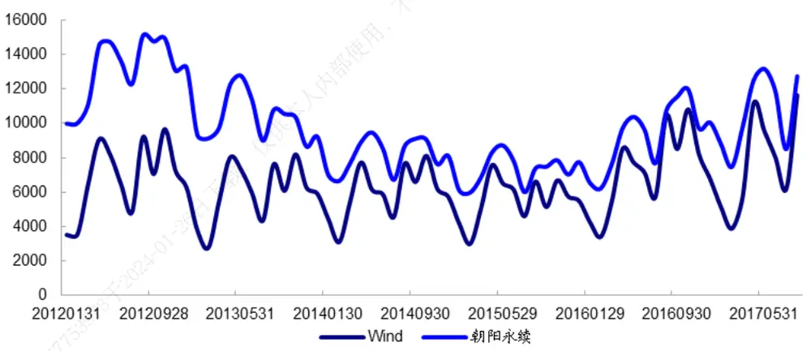
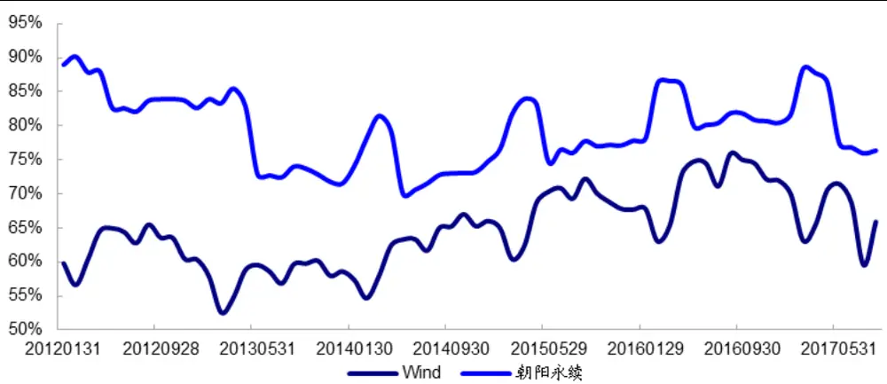
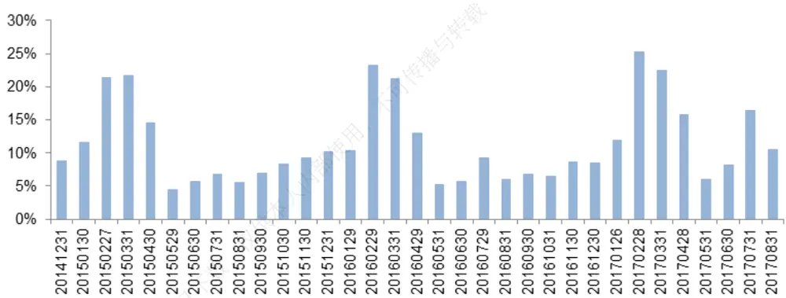
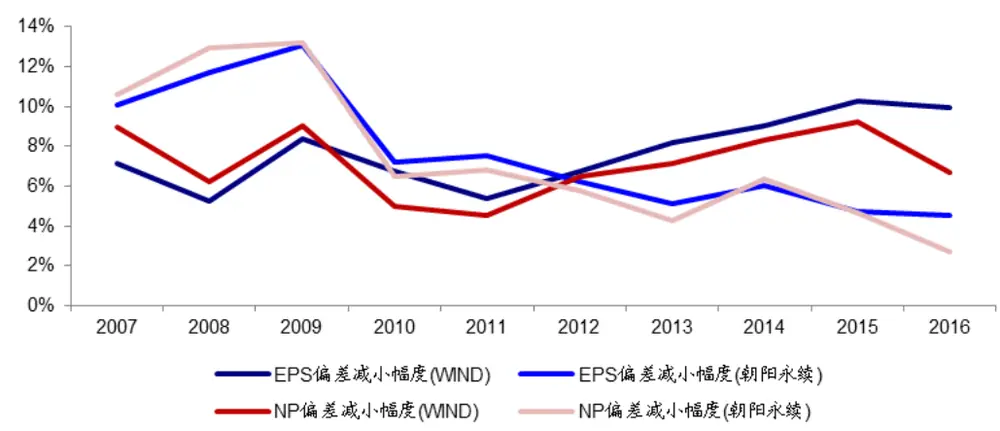
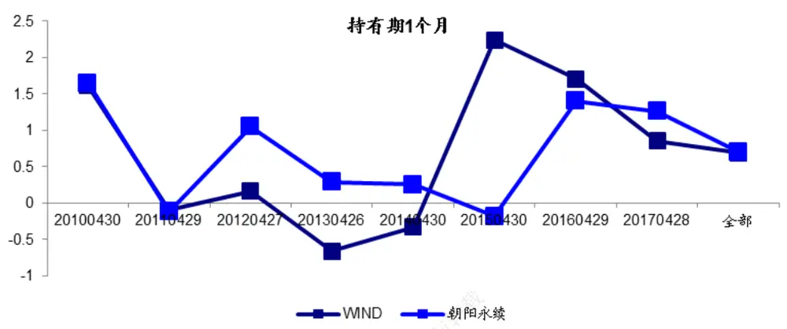
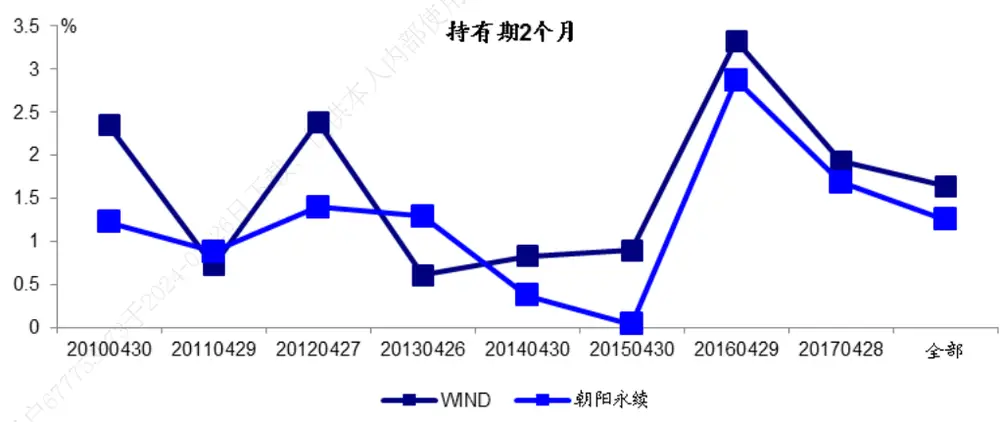
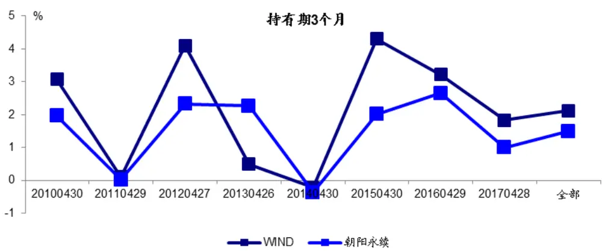
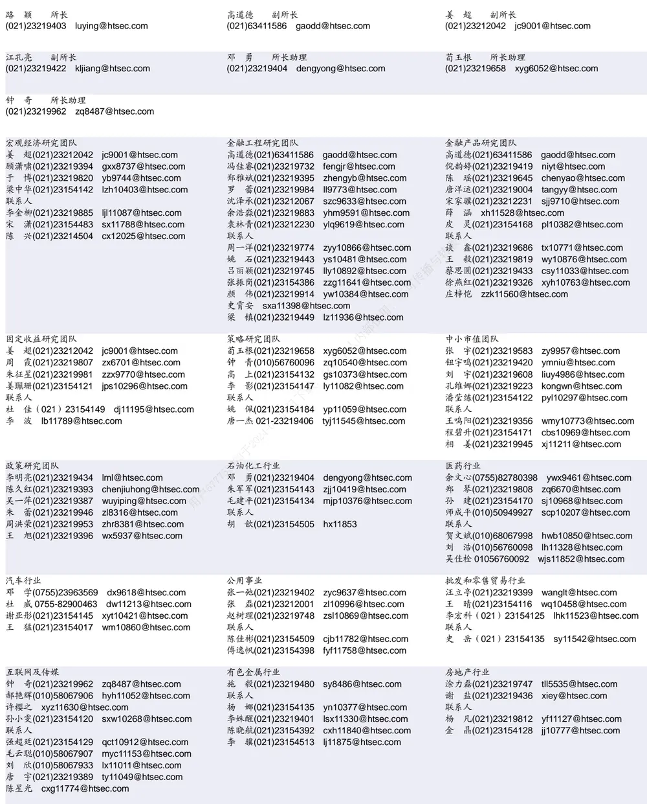

## [Tab相关研究

Table_ReportInfo]《选股因子系列研究（二十七）——分位

数回归在多因子选股中的应用》

2017.10.18

《分析师荐股报告是否具有超额收益》2017.10.19

《量化研究新思维（四）——动量崩溃》2017.10.16

分析师:郑雅斌

Tel:(021)23219395

Email:zhengyb@htsec.com

证书:S0850511040004

分析师:罗蕾

Tel:(021)23219984

Email:ll9773@htsec.com

证书:S0850516080002

# 选股因子系列研究（二十八）——一致预期质量分析

## 投资要点：

- 本文主要针对朝阳永续、WIND 两家数据供应商的分析师预测数据进行分析，比对数据源、加工一致预期数据的质量以及选股的有效性。

- 从数据源上来看，朝阳永续收纳的分析师报告篇数多于 WIND，但两者之间的差距在逐步缩小，目前这个差异已经很小；从两个数据商覆盖的股票比例来看，朝阳永续覆盖比例始终高于WIND，且该比例目前依然存在一定差距。

- 考察一致预期数据的准确度，发现其一：朝阳永续出现极值数据的情况较多，会有相对真实财报极大偏差的预测出现，如果不对极值数据进行处理， 的数据准确度明显优于朝阳永续；其二，如果投资者具备一定的数据筛选能力，可以剔除一些显著不靠谱的预测，朝阳永续进行过清洗的一致预期数据准确度高于WIND。

考察不同市值股票的业绩预测准确度，发现近几年 数据库在大市值股票上的准确度改善幅度明显，而朝阳永续数据库相对已经较为稳定，在大市值股票上的准确度虽然也比小市值股票准确度高，但近几年变化趋势不明显。

分析与业绩预测相关的基本面因子选股有效性，从因子 角度来看，两个数据库差异不大；从对全市场股票进行收益率预测、以及全市场构建多因子股票策略来看，朝阳永续的因子表现更优。这与其股票覆盖度较高，且在非极值预测上的准确度较高有关系。

单独检测超预期因子，观察剔除了市值、估值风格的超预期组合 发现 ）组合的历年 相对朝阳永续波动更大，这和 近几年数据库在不断完善，数据源和股票池的变动较大有一定关系； ）从中长期收益来看（持有期 2个月、3个月），WIND 表现更好。这主要是朝阳永续数据库存在一些极端大或者极端小的预测值，直接影响构建单因子极值策略的效果。

- 将超预期因子放在全市场股票中检测因子选股有效性，朝阳永续的因子 IC、RankIC、多因子回归的因子溢价均能够通过显著性检验，而 WIND数据表现不佳。

- 综合来看，朝阳永续的数据库成立时间较长，数据结构稳定，覆盖面较大，而WIND 近几年以来数据质量不断提升，虽然覆盖面尚不如朝阳永续，但数据中出现极端误差的概率也较小。两个数据库各自具有一定优势，投资者需要根据自己的策略具体需求：如构建因子型策略还是事件型策略，进行数据源的选择。

- 风险提示：市场系统性风险、流动性风险、模型失效风险。

在之前的报告中，我们已经针对一致预期因子进行了全方位且较为深度的分析，从中发现了不少有用的预期因子。早期市场上的一致预期主要数据供应商为朝阳永续，我们前期研究的数据来源也以朝阳永续为准。但近几年WIND 对分析师预测数据逐渐有了较为全面的覆盖。不少投资者对于两个数据供应商的一致预期数据质量存在较大疑惑，在选择供应商的过程中也有不少纠结。本篇报告主要针对两大数据供应商的一致预期数据质量进行全面分析，供投资者参考。

## 1. 基础报告数据的完整性以及覆盖度

## 1.1报告数量

首先考察两家数据供应商的基础数据质量，即分析师研究报告的收纳情况。为了使得两家数据在时间轴上具有可比性，我们主要分析两家数据近几年的收纳报告数量。以月度时间窗口为准，每月月末统计收纳的当月分析师报告总数量。

从下图中看到，2012 年年初开始，朝阳永续报告数量原本差不多是 Wind 数量的一倍，但 2014 年下半年之后，Wind和朝阳永续之间的报告数量差距在逐渐缩小，尤其是2017 年以来。

图1 朝阳永续和 WIND收纳报告数量对比

资料来源：Wind，朝阳永续，海通证券研究所

## 1.2覆盖公司数量

衡量基础数据质量，一方面从总的报告数量出发，另一方面可以从覆盖的公司数量或者比例出发。我们希望看到的数据供应质量，应该是不仅具有较多的报告覆盖篇数，同时这些报告最好分散在尽可能多的股票上，而不至于造成一些股票的数据空白。

同样以月度时间窗口为准，分析每个月两家数据商当月收纳的报告数量，对于全市场股票的覆盖度。下图中可以看到，从覆盖比例上来看，Wind 和朝阳永续目前还是存在一定的差距。朝阳永续的数据覆盖度基本稳定在 80%，Wind的覆盖度基本稳定在 70%。两家数据覆盖比例的差值基本稳定在 10%左右。

虽然在上一节中我们看到两家数据的报告数量差异在逐渐减小，但最近覆盖股票比例的差异减小的幅度较小，这主要是因为朝阳永续在股票池的覆盖度上优于Wind。朝阳永续多收纳的报告数量，多数集中在 Wind没有覆盖的股票上，从而造成了覆盖比例差异目前较为稳定。长期来看，这个差异也有一定的收窄幅度。

图2 朝阳永续和 WIND股票覆盖比例的对比

资料来源：Wind，朝阳永续，海通证券研究所

图3 两家数据股票覆盖比例的差值

股票覆盖度差值
资料来源： ，朝阳永续，海通证券研究所

## 2. 盈利预测数据准确性的分析

前文围绕两个数据供应商的底层数据——分析师报告的收录情况进行分析，本节主要针对两家数据商的加工后数据——一致预期数据准确性进行分析。对于分析师的数据，一般而言有两种使用方法，第一种是投资者可以直接使用分析师原始预测数据，这个数据更为直接和基础，但在应用过程中最大的麻烦是如何整合不同分析师之间的海量数据，从而得到关于一只股票的一个综合数据。目前有投资者在使用中采用这种方法，根据自己的权重对不同分析师进行加总。第二种使用方法，则是直接使用数据供应商加工后的一致预期数据，不同的供应商在加工汇总数据时有不同的处理方法，从而会使得最终每只股票的盈利预测数据存在一定差异。本节针对供应商加工后的盈利预测数据进行准确性分析。

分析师在对上市公司进行盈利预测的时候，都是以年度为单位进行预测，一般会对未来一年以及两到三年的数据进行预测。考虑到盈利预测最准确的肯定是对最近一年的预测，故而我们在分析的时候只考虑最近一年的数据。对比准确性的方法为：

每年年报披露后，取年报披露之前一个月的月末，能够获得的分析师一致预期最新数据作为目标值，比较目标值和真实年报数据之间的偏差。其中目标值我们选择了通常投资者最为关注，且可以取到预测数据的：EPS、营业收入、净利润、净资产。计算偏差的公式为：（预测目标值-真实值）绝对值/真实值。

## 2.1不考虑极值情况下的预测偏差

不同分析师进行盈利预测时，结果之间必然存在差异，如果进行预测的分析师数量较多，通常最终的一致预期结果会比较平滑，相对真实值之间的差异可能也较小，但是如果股票的覆盖分析师数量较少，且不同分析师之间的观点差异较大，最终的一致预期结果可能就会与真实值之间有较大差异。所以平台收纳的分析师数量以及股票的覆盖情况直接影响到一致预期值的准确性。首先我们将所有一致预期数据放在一起考察原始数据的预测准确性。在随后的一节中，我们会剔除一些显著异常值，再进一步分析预测准确性。

表 1 不考虑预测极值的盈利预测偏差分析

|  | EPS |  | 营业收入 |  | 净资产 |  | 净利润 |  |
| --- | --- | --- | --- | --- | --- | --- | --- | --- |
|  | 财报年 WIND | 朝阳永 续 | WIND | 朝阳永 续 | WIND | 朝阳永 续 | WIND | 朝阳永 续 |
| 度 2007 | 0.199 | 1.172 | 0.074 | 0.175 | 0.147 | 3.310 | 0.259 | 1.206 |
| 2008 | 0.824 | 1.124 | 0.282 | 0.329 | 0.146 | 0.186 | 0.937 | 1.007 |
| 2009 | 0.478 | 1.462 | 5.514 | 4.236 | 0.131 | 0.871 | 0.758 | 1.489 |
| 2010 | 0.498 | 0.949 | 0.276 | 0.272 | 0.160 | 0.165 | 1.083 | 1.045 |
| 2011 | 1.409 | 1.205 | 0.086 | 0.098 | 0.124 | 0.494 | 0.436 | 0.586 |
| 2012 | 0.366 | 0.366 | 0.099 | 0.111 | 0.096 | 0.109 | 0.388 | 0.435 |
| 2013 | 0.255 | 0.296 | 0.114 | 0.109 | 0.074 | 0.132 | 1.162 | 0.445 |
| 2014 | 0.721 | 0.684 | 0.494 | 0.600 | 0.108 | 0.125 | 0.862 | 0.694 |
| 2015 | 0.474 | 0.325 | 0.247 | 0.188 | 0.163 | 0.121 | 0.998 | 0.497 |
| 2016 | 0.355 | 0.310 | 0.234 | 0.377 | 0.136 | 0.112 | 0.515 | 0.541 |

资料来源：Wind，朝阳永续，海通证券研究所

从表 1中能够看到，在不剔除预测极值的情况下，无论是考察哪一个盈利预测目标值，最终都是朝阳永续出现极大偏差的概率大。这与朝阳永续覆盖股票数量多有一定关联，我们不难推测：朝阳永续数据库中，由于覆盖报告数量和股票数量都相对较多，其中必然不乏一些股票覆盖分析师极少，如果这类股票上的分析师出现预测偏差，其最终的一致预期数据肯定也会出现很大偏差。

这是否说明了朝阳永续数据库相对Wind 数据库而言，预测准确性更差呢？并不能这样下结论。投资者在运用一致预期数据时，通常总会有一定的预处理，在这个预处理的过程，剔除掉一些极端不靠谱的预测值，相对而言是经常会采用的做法且逻辑上也行得通。所以我们在下一节分析剔除了异常预测值之后的两个数据库预测偏差对比。

## 2.2考虑极值情况下的预测偏差

我们这里剔除掉预测偏差超过 3 倍的数据，投资者在运用过程中，可以根据自己的目标进行参数调整。从表 2中看到，在剔除了异常值之后，计算正常数据的预测偏差，两个数据库的差异明显缩小。如果我们集中在投资者最关注的利润数据的预测（如 EPS或者净利润），会发现相对而言，朝阳永续的数据质量更好，近几年以来的预测偏差基本始终小于Wind数据。而对于营业收入和净资产的预测，两个数据库没有本质差异。

由此，我们不难得出结论， ）朝阳永续数据库的基础数据来源更多，伴随这个特征，就会不可避免的出现，2）朝阳永续出现异常预测的概率有所放大，3）当不考虑异常值时，朝阳永续的预测准确度在净利润数据上具有优势，但前提是投资者必须进行一定的数据清洗工作。

表 2 考虑预测极值的盈利预测偏差分析

|  | EPS |  | 营业收入 |  | 净资产 |  | 净利润 |  |
| --- | --- | --- | --- | --- | --- | --- | --- | --- |
|  | 财报年 WIND | 朝阳永 续 | WIND | 朝阳永 续 | WIND | 朝阳永 续 | WIND | 朝阳永 续 |
| 度 2007 | 0.163 | 0.196 | 0.074 | 0.105 | 0.147 | 0.160 | 0.175 | 0.205 |
| 2008 | 0.259 | 0.325 | 0.087 | 0.112 | 0.141 | 0.124 | 0.255 | 0.320 |
| 2009 2010 2011 2012 2013 2014 | 0.207 0.188 0.179 0.182 0.199 0.231 | 0.264 0.207 0.208 0.182 0.148 0.172 0.189 | 0.092 0.088 0.079 0.093 0.074 0.098 0.119 | 0.104 0.095 0.087 0.095 0.084 0.099 | 0.120 0.144 0.115 0.082 0.074 | 0.146 0.113 0.096 0.090 0.087 | 0.217 0.190 0.177 0.205 0.208 | 0.277 0.205 0.219 0.211 |

资料来源：Wind，朝阳永续，海通证券研究所

## 2.3不同市值股票的预测准确性分析

前面我们主要分析在考虑和不考虑极值情况下的预测准确性分析，还有一个投资者可能关注的要素就是，一致预期数据的偏差主要存在于小盘股上还是大盘股上。这里我们剔除预测极值之后，根据上市公司市值进行偏差加权，计算不同数据库的预测偏差。

表 3 市值加权下的盈利预测偏差分析

|  | EPS |  | 营业收入 |  | 净资产 |  | 净利润 |  |
| --- | --- | --- | --- | --- | --- | --- | --- | --- |
|  | 财报年 WIND | 朝阳永 续 | WIND | 朝阳永 续 | WIND | 朝阳永 续 | WIND | 朝阳永 续 |
| 度 2007 | 0.091 | 0.095 | 0.070 | 0.093 | 0.113 | 0.104 | 0.085 | 0.099 |
| 2008 | 0.206 | 0.207 | 0.059 | 0.065 | 0.082 | 0.101 | 0.192 | 0.191 |
| 2009 | 0.124 | 0.134 | 0.084 | 0.064 | 0.067 | 0.116 | 0.127 | 0.145 |
| 2010 | 0.120 | 0.135 | 0.065 | 0.069 | 0.073 | 0.100 | 0.140 | 0.141 |
| 2011 | 0.125 | 0.133 | 用 0.063 | 0.067 | 0.080 | 0.101 | 0.132 | 0.151 |
| 2012 | 0.114 | 0.120 | 0.065 | 0.065 | 0.059 | 0.093 | 0.140 | 0.153 |
| 2013 | 0.117 | 0.097 | 0.051 | 0.054 | 0.068 | 0.090 | 0.136 | 0.138 |
| 2014 | 0.141 | 0.111 | 0.069 | 0.061 | 0.067 | 0.100 | 0.167 | 0.150 |
| 2015 | 0.150 | 0.141 | 0.082 | 0.078 | 0.089 | 0.126 | 0.180 | 0.163 |
| 2016 | 0.141 | 0.126 | 0.072 | 0.073 | 0.085 | 0.110 | 0.183 | 0.174 |

资料来源：Wind，朝阳永续，海通证券研究所

市值加权后，两个数据库的预测偏差均有大幅下降，这说明分析师在大市值股票上的预测准确性明显高于小市值股票。

主要针对利润数据比较是否采用市值加权，预测偏差的下降幅度。如针对 EPS预测，计算(等权重加权的WIND数据库偏差-市值加权的WIND 数据库偏差)，在下图中展示两个数据库调整加权方式之后偏差的变动幅度。 年之前，朝阳永续数据库利用市值加权，偏差下降幅度显著高于 Wind数据库，说明前期朝阳永续数据库相对而言，更多的偏差集中在中小盘股票上。但 2012 年之后，发现Wind 的数据偏差下降幅度显著提高：说明近年来，Wind更多的数据偏差集中在小盘股上。另一方面，朝阳永续的数据偏差下降幅度近年来没有太大变化，说明其数据结构基本已经稳定。而 Wind数据变化较大，说明近年来Wind 在大盘股的数据质量上不断有所提升。

图4 调整加权方式后利润预测偏差的下降幅度

资料来源：Wind，朝阳永续，海通证券研究所

## 3. 预期因子的选股效果对比

前文分别针对基础数据、加工数据的准确性进行了具体分析，进一步将数据落实到实战层面上，我们需要关注两个数据库的因子选股效果。根据能够提取到的分析师预测数据，可以加工出几个投资者比较关注的选股因子，分别为：预期 ROE、预期 PE、预期净利润率、预期净利润率同比、预期 ROE同比。通过多因子模型分析上述几个因子的选股效果。

## 3.1 因子 IC 对比

所有因子都采用剔除市值、估值风格后的正交因子。

1） 首先，从因子的整体有效性而言，净利润率表现最差，预期 ROE、PE以及预期 ROE、净利率同比都具有较好的 IC 表现。

2）其次，考虑到因子的 IC均值以及 IC波动的综合情况，即从 ICIR 角度出发，同比数据表现较差，预期 ROE、预期 PE表现最好。

3） 对比WIND和朝阳永续的 IC 数据，两个数据库没有本质差异。

表 4 因子 IC分析

| 预期 ROE |  |  |  |
| --- | --- | --- | --- |
|  | Wind |  | 朝阳永续 |
|  | IC | Rank IC | IC Rank IC |
| 均值 | 0.031 | 0.043 | 0.036 |
| ICIR | 1.371 | 1.457 | 1.198 1.215 |
| 胜率 | 0.644 | 0.624 | 0.604 0.634 |
| T | 3.977 | 4.226 | 3.475 3.525 |
| 预期 PE |  |  |  |
|  | Wind |  | 朝阳永续 |
|  | IC | Rank IC | Rank IC |
| 均值 | -0.022 | -0.021 | -0.051 |
| ICIR | -1.309 | -1.836 -1.372 | -2.014 |
| 胜率 | 0.317 | 0.287 | 0.337 0.277 |
| T | -3.798 | -5.325 | -3.980 -5.842 |
| 预期净利润率 |  |  |  |
|  | Wind |  | 朝阳永续 |
|  | IC | Rank IC | IC |
| 均值 | 0.008 | 0.020 | 0.008 |
| ICIR | 0.342 | 0.743 | 0.332 0.631 |
| 胜率 | 0.554 | 0.594 | 0.545 |
| T | 0.991 | 2.157 | 0.964 |
| 预期净利润率同比 |  |  |  |
|  | Wind |  | 朝阳永续 |
|  | IC | Rank IC IC | Rank IC |
| 均值 | 0.016 | 0.031 | 0.012 0.025 |
| ICIR | 1.026 | 0.825 | 0.719 0.650 0.584 |
| 胜率 | 0.574 | 0.644 | 0.594 |
| T | 2.978 | 2.393 | 2.087 1.886 |
| 预期 ROE 同比 |  |  |  |
|  | Wind |  | 朝阳永续 |
|  | IC | Rank IC IC | Rank IC |
| 均值 | 0.027 | 0.046 | 0.020 0.036 |
| ICIR | 0.857 | 0.852 与转载 | 0.813 0.735 |
| 胜率 | 0.594 | 0.564 | 0.574 0.525 |
| T | 2.487 | 2.472 | 2.358 2.133 |

资料来源：Wind，朝阳永续，海通证券研究所

## 3.2因子预测效果对比

本节根据因子的历史 IC进行股票的收益率预测，分析股票预测收益率和真实收益率之间的相关性（IC、RANK IC）。这是对因子选股或者预测效果的实战检测。从最终的收益率预测结果看，朝阳永续的预测结果会比WIND数据的表现更好，虽然在前文中我们发现因子 IC之间没有太本质的差异，但是在收益率预测上差异有一定体现，这主要是朝阳永续相对较高的覆盖率所贡献。

表 5 因子预测效果分析

| 预期 ROE |  |  |  |
| --- | --- | --- | --- |
|  | Wind |  | 朝阳永续 |
|  | IC | Rank IC IC | Rank IC |
| 均值 | 0.104 | 0.120 0.105 | 0.122 |
| ICIR | 3.518 | 3.647 3.737 | 3.978 |
| 胜率 | 0.897 | 0.885 0.936 | 0.897 |
| T | 8.969 | 9.298 9.528 | 10.143 |
| 预期 PE |  |  |  |
|  | Wind |  | 朝阳永续 |
|  | IC | IC | Rank IC |
| 均值 | 0.102 | 0.104 | 0.121 |
| ICIR | 3.393 | 3.522 | 3.570 3.787 |
| 胜率 | 0.885 | 0.885 | 0.910 0.910 |
| T | 8.650 | 8.981 | 9.101 9.655 |
| 预期净利润率 |  |  |  |
|  | Wind |  | 朝阳永续 |
|  | IC | Rank IC | IC Rank IC |
| 均值 | 0.102 | 0.118 | 0.104 0.120 |

| ICIR | 3.445 | 3.572 | 3.494 | 3.662 |
| --- | --- | --- | --- | --- |
| 胜率 | 0.897 | 0.885 | 0.910 | 0.885 |
| T | 8.783 | 9.107 | 8.907 | 9.337 |

预期净利润率同比

|  | Wind |  | 朝阳永续 |  |
| --- | --- | --- | --- | --- |
|  | IC | Rank IC | IC | Rank IC |
| 均值 | 0.101 | 0.116 | 0.104 | 0.120 |
| ICIR | 3.346 | 3.428 | 3.494 | 3.662 |
| 胜率 | 0.885 | 0.846 | 0.910 | 0.885 |
| T | 8.532 | 8.740 | 8.907 | 9.337 |

预期 ROE同比

|  | Wind |  | 朝阳永续 |
| --- | --- | --- | --- |
|  | IC | Rank IC | IC Rank IC |
| 均值 | 0.103 | 0.118 | 0.100 0.117 |
| ICIR | 3.296 | 3.414 | 3.282 3.507 |
| 胜率 | 0.872 | 0.833 | 0.897 0.885 |
| T | 8.402 | 8.705 袋 | 8.368 8.941 |

资料来源：Wind，朝阳永续，海通证券研究所

下表中我们简单构建了全市场选股的多因子策略，在预期因子方面，都引入预期估值和预期 ROE两个因子，每个月选择 50只股票作为多头组合。对比基准为全市场等权重指数基准。和表 5中的预测收益率 IC 分析结果一致，从全市场选股构建策略角度来

表 6 预期因子策略效果对比

|  | Wind | 朝阳永续 |
| --- | --- | --- |
| 信息比 | 1.96 | 2.27 |
| 年化收益 1-01-26日 | 60.52% | 65.96% |
| 基准年化收益 | 23.18% | 23.18% |
| 年化超额收益 | 37.34% | 42.78% |
| 收益风险比 | 1.59 | 1.75 |

资料来源：Wind，朝阳永续，海通证券研究所

## 4. 超预期因子

在一致预期方面，除了传统大家关注的常规基本面因子，还有一类无论是海外还是A 股投资者都强烈关注的因子，就是超预期因子。超预期因子的有效性在比较多的文献和报告中都已经经过验证，本节主要考虑这个因子的对比。

由于分析师披露的业绩预测为年度数据，故而在不进行数据处理的前提下，能够操作的超预期策略基本都在年报披露期完成。我们这里就以这种方式为例子进行分析，在每年年报披露的时候，考察年报数据相对最新一期预测数据是否超预期，根据超预期的情况进行打分排序。分别比较买入所有超预期多头、只买入超预期得分最高的 50 只股票多头的策略效果。

## 4.1超预期因子组合的 ALPHA

在年报披露之后构建超预期组合，分别考察持有 1个月、2 个月、3个月的策略组合 ALPHA。这里的 ALPHA为相对股票对应的市值、估值基准的 ALPHA。

我们发现：1）WIND组合的历年 ALPHA相对朝阳永续波动更大，这和WIND近几年数据库在不断完善有一定关系，数据源和股票池的变动较大；2）从中长期收益来看（持有期 2 个月、3个月），WIND表现更好，这主要是因为我们之前提到过朝阳永续数据库存在一些极端大或者极端小的预测值，这些可能不十分可靠的极端数据直接影响极值股票构建的多头组合表现。这也给了投资者一个提示：超预期幅度很大的股票，确实可能存在较大的获利空间，但是预测数据是否准确、是否可靠，需要投资者进行一定的筛选和判断。

图5 持有 1个月的多头组合 ALPHA

资料来源：Wind，朝阳永续，海通证券研究所

图6 持有 2个月的多头组合 ALPHA

资料来源：Wind，朝阳永续，海通证券研究所

图7 持有 3个月的多头组合 ALPHA

资料来源：Wind，朝阳永续，海通证券研究所

## 4.2超预期因子的 IC分析

我们将超预期因子作为多因子模型的一个引入因子，分析其因子 IC 表现以及加入多因子模型之后，因子溢价是否显著。由于超预期因子仅在每年披露年报时更新，所以每年我们仅对一个月的因子 IC 进行分析，即年报披露后更新超预期因子，计算和随后一个月的收益相关性。

针对全部股票的超预期因子进行验证，发现朝阳永续的因子表现显著优于WIND，不仅因子 IC 和 RANK IC 都具有更高相关性、更低的波动率；同时在因子溢价方面，溢价均值也能够通过显著性检验。

表 7 超预期因子的因子 IC和风险溢价对比

|  | Wind |  | 朝阳永续 |  |
| --- | --- | --- | --- | --- |
|  | IC | RANK IC | IC | RANK IC |
| 均值 | 0.004 | -0.006 | 0.022 | 0.025 |
| ICIR | 0.489 | -0.549 | 2.330 | 2.153 |
| 胜率 | 0.625 | 0.500 | 0.875 | 0.875 |
| T | 0.399 | -0.448 | 1.902 | 1.758 |
| 因子溢价 |  |  |  |  |
|  | WIND |  | 朝阳永续 |  |
| 因子溢价均值 | 0.005 |  | 0.022 |  |
| T | 0.524 可传播与转载 |  | 2.045 |  |

资料来源：Wind，朝阳永续，海通证券研究所

## 5. 结论

本文主要针对朝阳永续、WIND 两家数据供应商的分析师预测数据进行分析，比对数据源、加工的一致预期数据的质量以及对于选股的有效性。

从数据源上来看，朝阳永续收纳的分析师报告篇数多于 WIND，但两者之间的差距在逐步缩小，目前这个差异已经很小；从两个数据商覆盖的股票比例来看，朝阳永续覆盖比例始终高于 WIND，且该比例目前依然存在一定差距。

考察一致预期数据的准确度，发现其一：朝阳永续出现极值数据的概率较大，会有相对真实财报极大偏差的预测出现，如果不对极值数据进行处理，WIND的数据准确度明显优于朝阳永续；其二，如果投资者具备一定的数据筛选能力，可以剔除一些显著不靠谱的预测，朝阳永续进行过清洗的一致预期数据准确度高于 WIND。

考察不同市值股票的业绩预测准确度，发现近几年 WIND 数据库在大市值股票上的准确度改善幅度明显，而朝阳永续数据库相对已经较为稳定，在大市值股票上的准确度同样比小市值股票准确度高，但近几年变化趋势不明显。

分析与业绩预测相关的基本面因子选股有效性，从因子 IC 角度来看，两个数据库差异不大；从对全市场股票进行收益率预测、以及全市场构建多因子股票策略来看，朝阳永续的因子表现更优。这与其股票覆盖度较高，且在非极值预测上的准确度较高有关系。

单独检测超预期因子，观察剔除了市值、估值风格的超预期组合 ALPHA,发现1）WIND组合的历年 ALPHA相对朝阳永续波动更大，这和WIND近几年数据库在不断完善，数据源和股票池的变动较大有一定关系；2）从中长期收益来看（持有期 2 个月、3 个月），WIND 表现更好。这主要是朝阳永续数据库存在一些极端大或者极端小的预测值，直接影响构建单因子极值策略的效果。

将超预期因子放在全市场股票中检测因子选股有效性，朝阳永续的因子 IC、Rank IC、多因子回归的因子溢价均能够通过显著性检验，而 WIND数据表现不佳。

综合来看，朝阳永续的数据库成立时间较长，数据结构稳定，覆盖面较大，而WIND近几年以来数据质量不断提升，虽然覆盖面尚不如朝阳永续，但数据中出现极端误差的概率也较小。两个数据库各自具有一定优势，投资者需要根据自己的策略具体需求：如构建因子型策略还是事件型策略，进行数据源的选择。

## 6. 风险提示

市场系统性风险、流动性风险、模型失效风险。

# 信息披露

分析师声明

[Table郑雅斌yst金融工程研究团队s]

罗蕾金融工程研究团队

本人具有中国证券业协会授予的证券投资咨询执业资格，以勤勉的职业态度，独立、客观地出具本报告。本报告所采用的数据和信息均来自市场公开信息，本人不保证该等信息的准确性或完整性。分析逻辑基于作者的职业理解，清晰准确地反映了作者的研究观点，结论不受任何第三方的授意或影响，特此声明。

## 法律声明

本报告仅供海通证券股份有限公司（以下简称 本公司 ）的客户使用。本公司不会因接收人收到本报告而视其为客户。在任何情况下，本报告中的信息或所表述的意见并不构成对任何人的投资建议。在任何情况下，本公司不对任何人因使用本报告中的任何内容所引致的任何损失负任何责任。

本报告所载的资料、意见及推测仅反映本公司于发布本报告当日的判断，本报告所指的证券或投资标的的价格、价值及投资收入可能会波动。在不同时期，本公司可发出与本报告所载资料、意见及推测不一致的报告。传

市场有风险，投资需谨慎。本报告所载的信息、材料及结论只提供特定客户作参考，不构成投资建议，也没有考虑到个别客户特殊的投资目标、财务状况或需要。客户应考虑本报告中的任何意见或建议是否符合其特定状况。在法律许可的情况下，海通证券及其所属使关联机构可能会持有报告中提到的公司所发行的证券并进行交易，还可能为这些公司提供投资银行服务或其他服务。内

本报告仅向特定客户传送，未经海通证券研究所书面授权，本研究报告的任何部分均不得以任何方式制作任何形式的拷贝、复印件或复制品，或再次分发给任何其他人，或以任何侵犯本公司版权的其他方式使用。所有本报告中使用的商标、服务标记及标记均为本公仅司的商标、服务标记及标记。如欲引用或转载本文内容，务必联络海通证券研究所并获得许可，并需注明出处为海通证券研究所，且载不得对本文进行有悖原意的引用和删改。

根据中国证监会核发的经营证券业务许可，海通证券股份有限公司的经营范围包括证券投资咨询业务。01

## 海通证券股份有限公司研究所[Table_PeopleInfo]

| 电子行业 陈 平(021)23219646 cp9808@htsec.com | 煤炭行业 | 电力设备及新能源行业 |  |
| --- | --- | --- | --- |
|  | 吴 杰(021)23154113 wj10521@htsec.com | 房 青(021)23219692 fangq@htsec.com |  |
| 联系人 | 李 淼(010)58067998 Im10779@htsec.com | 徐柏乔(021)32319171 | xbq6583@htsec.com |
| 谢 磊(021)23212214 xl10881@htsec.com | 戴元灿(021)23154146 dyc10422@htsec.com | 张向伟(021)23154141 | zxw10402@htsec.com |
| 张天闻 ztw11086@htsec.com |  | 曾 彪(021)23154148 | zb10242@htsec.com |

尹 苓(021)23154119 yl11569@htsec.com

| 基础化工行业 计算机行业 |  |  |  | 通信行业 |  |  |
| --- | --- | --- | --- | --- | --- | --- |
| 刘 | 威(0755)82764281 | Iw10053@htsec.com | 郑宏达(021)23219392 | zhd10834@htsec.com | 朱劲松(010)50949926 | zjs10213@htsec.com |
| 刘 强(021)23219733 刘海荣(021)23154130 | lq10643@htsec.com Ihr10342@htsec.com | 谢春生(021)23154123 鲁 立 I11383@htsec.com | xcs10317@htsec.com | 联系人 | 余伟民(010)50949926 | ywm11574@htsec.com |
| 联系人 张翠翠 |  | 黄竞晶(021)23154131 | hjj10361@htsec.com |  | 庄 宇(010)50949926 zy11202@htsec.com |  |
| zcc11726@htsec.com |  |  | 杨 林(021)23154174 联系人 | yl11036@htsec.com | 张峥青 zzq11650@htsec.com |  |
|  |  |  | 洪 琳(021)23154137 | hl11570@htsec.com |  |  |
| 非银行金融行业 交通运输行业 |  |  |  |  |  |  |
| 孙 婷(010)50949926 何 婷(021)23219634 |  | st9998@htsec.com ht10515@htsec.com | 虞 楠(021)23219382 张 杨(021)23219442 | yun@htsec.com | 梁 希(021)23219407 lx11040@htsec.com |  |
| 联系人 |  |  | 联系人 | zy9937@htsec.com | 于旭辉(021)23219411 联系人 | yxh10802@htsec.com |
| 夏昌盛(010)56760090 |  | xcs10800@htsec.com | 童 宇(021)23154181 | ty10949@htsec.com | 马 榕(021)23219431 | mr11128@htsec.com |
| 李芳洲(021)23154127 Ifz11585@htsec.com |  | 李 丹 021-23154401 Id11766@htsec.com |  |  |  |  |
| 建筑建材行业 机械行业 钢铁行业 刘彦奇(021)23219391 |  |  |  |  |  |  |
| 邱友锋(021)23219415 qyf9878@htsec.com 佘炜超(021)23219816 swc11480@htsec.com |  |  |  |  |  |  |
| 冯晨阳(021)23212081 fcy10886@htsec.com 钱佳佳(021)23212081 |  | 耿 耘(021)23219814 | gy10234@htsec.com | 联系人 | liuyq@htsec.com |  |
| qjj10044@htsec.com |  | 杨 震(021)23154124 | yz10334@htsec.com | 刘 璇(021)23219197 |  | lx11212@htsec.com |
|  |  | 沈伟杰(021)23219963 | swj11496@htsec.com |  | 周慧琳(021)23154399 | zhl11756@htsec.com |
| 建筑工程行业 农林牧渔行业 |  |  |  |  |  |  |
| 杜市伟 dsw11227@htsec.com |  | 丁 频(021)23219405 | dingpin@htsec.com | 闻宏伟(010)58067941 | 食品饮料行业 | whw9587@htsec.com |
| 毕春晖(021)23154114 bch10483@htsec.com |  |  | 陈雪丽(021)23219164 陈 阳(010)50949923 | cxl9730@htsec.com | 成 珊(021)23212207 | cs9703@htsec.com |
|  |  | 联系人 |  | cy10867@htsec.com |  |  |
|  |  |  | 关 慧(021)23219448 | gh10375@htsec.com |  |  |
|  |  |  | 夏 越(021)23212041 | xy11043@htsec.com |  |  |
| 徐志国(010)50949921 xzg9608@htsec.com |  | 银行行业 林媛媛(0755)23962186 |  | 社会服务行业 |  | Its10224@htsec.com |
| 磊(010)50949922 II11322@htsec.com |  | 联系人 | lyy9184@htsec.com |  | 李铁生(010)58067934 联系人 |  |
| 蒋 俊(021)23154170 |  | jj11200@htsec.com | 谭敏沂2 tmy10908@htsec.com |  | 陈扬扬(021)23219671 cyy10636@htsec.com |  |
| 联系人 |  |  |  |  | 顾熹闽 021-23154388 |  |
| 张宇轩 zyx11631@htsec.com |  | 7753973于 |  |  |  | gxm11214@htsec.com |
| 张恒晅 zhx10170@hstec.com |  |  |  |  |  |  |

陈子仪(021)23219244 chenzy@htsec.com

曾 知(021)23219810 zz9612@htsec.com

联系人赵 洋(021)23154126 zy10340@htsec.com

李 阳 ly11194@htsec.com

朱默辰 zmc11316@htsec.com

刘 璐 ll11838@htsec.com

## 研究所销售团队

海通证券股份有限公司研究所

地址：上海市黄浦区广东路 689号海通证券大厦 9楼

电话：（021）23219000

| 深广地区销售团队 蔡铁清(0755)82775962 ctq5979@htsec.com 伏财勇(0755)23607963 fcy7498@htsec.com 朱 健(021)23219592 辜丽娟(0755)83253022 gulj@htsec.com 季唯佳(021)23219384 刘晶晶(0755)83255933 liujj4900@htsec.com 黄毓(021)23219410 王雅清(0755)83254133 wyq10541@htsec.com 漆冠男(021)23219281 饶 伟(0755)82775282 rw10588@htsec.com 胡宇欣(021)23154192 | 上海地区销售团队 胡雪梅(021)23219385 huxm@htsec.com | 北京地区销售团队 殷怡琦(010)58067988 yyq9989@htsec.com 吴尹 wy11291@htsec.com |
| --- | --- | --- |

传真：（021）23219392

网址：www.htsec.com