## 相关研究

Table_ReportInfo]《选股因子系列研究 二十 ——基于条件期望的因子择时框架》

《选股因子系列研究（二十六）——因子加权、正交和择时的若干性质》

分析师:冯佳睿

Tel:(021)23219732

Email:fengjr@htsec.com

证书:S0850512080006

分析师:袁林青

Tel:(021)23212230

Email:ylq9619@htsec.com

证书:S0850516050003

# 选股因子系列研究（三十）——因子择时模型改进与择时指标库构建

自 2017 年以来，多因子模型中常用的选股因子皆出现了不同程度的波动。因此，因子收益的预测就变得至关重要。系列前期专题报告《选股因子系列研究(二十)——基于条件期望的因子择时模型》就对于常见选股因子收益的预测进行了初步讨论。模型样本外跟踪至 2017 年 11 月底依旧具有较好的表现。

结合模型实际跟踪经验与投资者交流反馈，本报告旨在对于因子择时模型进行改进与简化，希望得到一个易于理解、易于操作同时具有较强扩展性的因子择时模型。由于需要讨论的内容较多，故而相关内容会在本文与《选股因子系列研究(三十一)——因子择时指标的选择》两篇报告中进行详细讨论。

- 条件期望因子择时模型 2017 年表现较好。截止至 2017 年 11 月 30 日，因子择时组合在 2017 年以来的收益约为 11%，不择时组合同期收益约为-20%，因子择时组合相对于不择时组合的超额收益约为 31%。

条件期望择时模型存在提升空间。虽然基于条件期望的因子择时模型能够在风格多变的市场环境中提升因子收益预测的灵活性，但是该模型在实际使用的过程中依旧存在众多有待提升的地方： ）择时指标备选范围过窄； ）使用相同的择时指标预测不同因子的未来收益； ）择时指标的筛选流程较为复杂； ）无法和衰减加权的收益预测方法有效结合； ）难以扩展为风格择时模型。

回归法下的因子择时模型更易于理解与应用。因子择时旨在解决因子收益的预测，所以可构建因子收益的预测模型。在回归法的框架下，模型更加易于理解与应用。

可从宏观经济、金融市场与因子表现三个层次构建择时变量备选库。在宏观经济层面，我们会构建指标从通胀、工业、消费、外贸、金融、财政等方面刻画宏观经济状态。在金融市场层面，我们会分别从债券市场与股票市场构建指标。在债券市场中，我们重点关注利率水平、期限利差、信用利差等方面。在股票市场中，我们重点关注市场涨跌、波动、换手、流动性、估值等方面。在因子收益层面，我们重点关注各常见因子的历史收益表现。

- 风险提示。市场系统性风险、资产流动性风险以及政策变动风险会对策略表现产生较大影响。

自 2017 年以来，多因子模型中常用的选股因子皆出现了不同程度的波动。因此，因子收益的预测就变得至关重要。系列前期专题报告《选股因子系列研究(二十)——基于条件期望的因子择时模型》就对于常见选股因子收益的预测进行了初步讨论。模型样本外跟踪至 2017 年 11 月底依旧具有较好的表现。

结合模型实际跟踪经验与投资者交流反馈，本报告旨在对于因子择时模型进行改进与简化，希望得到一个易于理解、易于操作同时具有较强扩展性的因子择时模型。由于需要讨论的内容较多，故而相关内容会在本文与《选股因子系列研究(三十一)——因子择时指标的选择》两篇报告中进行详细讨论。

## 1. 条件期望因子择时模型回顾

基于系列前期报告列《选股因子系列研究(二十)——基于条件期望的因子择时模型》，可分别构建因子择时 TOP100 组合与基准 TOP100 组合。两组合使用同样的因子，同样的因子加权方法，唯一不同的地方在于因子收益预测方法。因子择时组合使用条件期望的方式对于因子收益预测值进行调整，而基准组合仅使用因子历史 24 个月的收益均值作为因子收益的预测值。下图展示了两组合在 2017 年以来的表现情况。

图1 因子择时组合与基准组合净值表现（2016.12.30-2017.11.30）
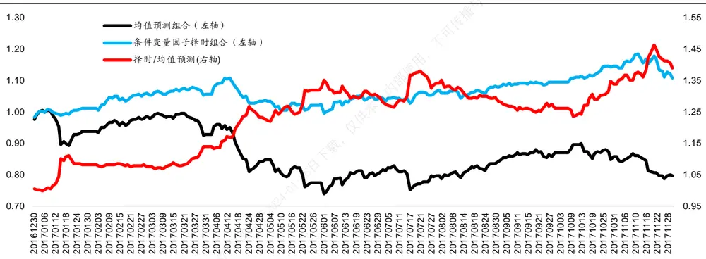
资料来源：Wind，海通证券研究所

截止 2017 年 11月 30 日，因子择时组合在 2017 年以来的收益约为 11%，不择时组合同期收益约为-20%，因子择时组合相对于不择时组合的超额收益约为 31%。在2017年，因子择时组合在规模因子、反转因子、估值因子以及盈利因子的配臵上都具有较强的灵活性。因此，因子择时模型的复合因子 IC 以及 TOP100 组合的月度收益在大部分月份中都战胜了基准组合。

## 2. 模型问题分析与改进

虽然基于条件期望的因子择时模型能够在风格多变的市场环境中提升因子收益预测的灵活性，但是该模型在实际使用的过程中依旧存在众多有待提升的地方：

1） 择时指标备选范围过窄。在系列前期报告中，我们仅使用了股票市场上的部分指标构建因子择时指标备选库，然而宏观经济变量、债市等方面的指标并未考虑。

2） 使用相同的择时指标预测不同因子的未来收益。基于条件期望的因子择时模型使用相同的择时指标对于不同的因子收益进行条件期望的调整。虽然择时指标对于各因子的调整幅度会受到择时指标和选股因子收益之间相关性的影响而有所不同，但是考虑到各类因子往往具有不同的逻辑，使用同样的择时指标对于不同的选股因子进行择时并不够精细。

3） 择时指标的筛选流程较为复杂，实现较为繁琐。虽然系列前期报告借助 AIC 对于条件变量进行筛选并获得了一定的择时效果，但是 AIC 筛选法在具体实现时依旧较为繁琐。

） 无法和衰减加权的收益预测方法有效结合。部分投资者在进行因子收益预测时偏好使用衰减加权的方式对于因子历史收益进行加权平均从而使得因子收益预测具有更好的灵活性。由于条件期望的因子择时模型是基于因子收益的概率分布推导得到的，所以该模型无法和衰减加权的收益预测方式进行有效结合。

5） 难以扩展为风格择时模型。由于因子在某种程度上也可以被看作是风格，所以投资者可基于因子收益的预测对于风格进行择时判断。然而择时模型得到的因子 IC 或者因子回归系数 Beta 的预测都较为抽象并且难以直接应用至风格择时或者风格轮动中。

为了能够得到一个更加易于理解、易于实现同时具有良好扩展性的因子择时模型，我们不妨重新思考因子择时这一问题。在多因子选股模型中，投资者通过将股票收益分解为各个因子的收益，并借助因子收益的稳定性去预测因子未来的收益，最终达到预测股票未来收益的目的。传统多因子模型可表述为下式：

$$
\begin{aligned}&r_{t}=\alpha+\beta_{1,t}f_{1,t}+\beta_{2,t}f_{2,t}+\cdots+\beta_{k,t}f_{k,t}+\varepsilon_{\mathrm{t}}\\&\beta_{j,t}=\frac{1}{T}\sum_{m=1}^{T}\beta_{j,t-m}\\\end{aligned}
$$

在风格剧烈变动的市场环境下，因子收益的稳定性受到影响，故而投资者仅使用因子历史收益难以准确预测因子未来收益。因此，因子择时所需要处理的问题就是如何预测因子未来收益。那么我们完全可基于回归模型构建因子收益的预测模型。在该模型中，投资者实际上是把因子收益进行了分解。虽然因子收益不再稳定，但是模型假设因子收益和某些外生变量之间存在稳定的相关性。基于这种稳定的相关性以及最新观测得到的外生变量的指标值，投资者可对于因子未来收益进行预测。因此，因子择时模型可表述为下式：

$$
\beta_{j,t}=\alpha+C_{1,t}X_{1,t}+C_{2,t}X_{2,t}+\cdots+C_{N,t}X_{N,t}+\varepsilon_{\mathrm{t}}
$$

通过数学推导不难发现，回归法下的因子择时模型是基于条件期望的因子择时模型的进一步外推，在某种情况下两模型相同。详细的数学推导与证明可参考专题报告《选股因子系列研究（二十六）——因子加权、正交和择时的若干性质》。

上文提出的因子择时模型实际使用效果取决于以下两点：

1） 择时指标备选范围。由于不同的选股因子可能会受到不同类型因素的驱动，因此投资者需要构建出一个尽量全面的因子择时指标备选库，从而能够在不同的经济环境、市场环境下选出有效的因子择时指标。

2） 择时指标的动态选择。由于很难有因子择时指标能够长期预测因子收益，所以投资者需要在不同的经济环境或者市场环境下动态调整模型所使用的因子择时指标。

对于上述两个关键点，我们会分两篇专题报告进行讨论。本篇报告主要讨论因子择时指标备选库的构建并展示对于各因子具有良好收益预测效果的择时指标。《选股因子系列研究(三十一)——因子择时指标的选择》主要讨论因子择时指标的筛选并会提供不同筛选方法在 2017 年以来的收益表现。因子择时模型在风格轮动上的应用我们会在随后的专题报告中进行详细讨论。

## 3. 选股因子择时指标备选库构建

本报告在构建因子择时指标备选库时主要从宏观经济、金融市场与因子收益三个层次着手。

在宏观经济层面，我们会构建指标从通胀、工业、消费、外贸、金融、财政等方面刻画宏观经济状态。

在金融市场层面，我们会分别从债券市场与股票市场构建指标。在债券市场中，我们重点关注利率水平、期限利差、信用利差等方面。在股票市场中，我们重点关注市场涨跌、波动、换手、流动性、估值等方面。

在因子收益层面，我们重点关注各常见因子的历史收益表现。传统的因子收益预测模型实际上使用的就是这一类指标。

基于前文思路，可构建得到一个具有超过 个因子择时指标的备选库。在构建择时指标备选库时也需要注意对于不同择时指标的原始值进行调整。由于因子择时指标极多，本文暂不详细展示择时指标的计算与处理方法。对于细节感兴趣的投资者可联系报告作者。

## 4. 选股因子有效择时指标一览

由于因子择时模型在最终应用中无法直接观察到择时指标对于因子收益的预测效果，本部分将对于常用的选股因子分别展示对其具有一定择时效果的择时指标。对于部分指标，本文也会探讨指标背后的内在逻辑。为了能够更加清晰地观测到因子收益与择时指标之间的关联，本部分主要从以下三个方面考察两者之间的联系：

1） 全区间跨期相关性。跨期相关性可使用 T 时刻观测得到的因子择时指标值与 T时刻至 T+1 时刻间因子收益的相关性。

2） 择时指标滚动均值与因子收益的滚动均值。由于择时指标和因子收益存在较多毛刺，直接观测择时指标值与因子收益很难发现两者之间的联系，本部分分别对于两者进行了平滑处理，从而能够更加直观地展现两者之间的关联。需要注意的是，该指标并不会作为指标筛选标准出现在指标筛选模型中。

3） 跨期相关性滚动值。由于在最终筛选择时指标时，投资者仅能依靠该时点可获得的择时指标与因子收益之间的历史相关性。所以本部分将展示不同时点上向前一段时间中择时指标和因子收益之间的相关性。

本部分在具体回测时模型设定如下：

1） 使用全市场剔除 ST 与次新股的数据构建规模因子、中盘因子、流动性因子、反转因子、波动因子、估值因子、盈利因子与盈利成长因子；

2） 所有因子进行逐步正交处理，正交顺序为：行业、规模因子、中盘因子、流动性因子、反转因子、波动因子、估值因子、盈利因子、盈利成长因子；

2）使用 2007 年 1 月至 2017 年 10 月的数据进行回测；

3）使用因子 IC作为因子收益的衡量指标。

## 4.1 规模因子

本部分使用股票对数总市值计算规模因子。因子 IC越高，市场越偏好大盘股；因子IC 越低，市场越偏好小盘股。下表展示了择时指标备选库中与规模因子跨期相关性较高的指标。

表 1 规模因子有效择时指标一览

| 一级分类 | 二级分类 | 指标说明 | 参数 | 跨期相关性 |
| --- | --- | --- | --- | --- |
| 宏观 | 通胀 | PPI 同比增速 | 无 | 0.19 |
| 宏观 | 通胀 | PPI环比增速 | 无 | 0.16 |
| 宏观 | 消费 | 社消总额实际增速 | 无 | -0.17 |
| 宏观 | 金融 | M2 同比增速 | 无 | -0.16 |
| 金融-债券市场 | 利率水平 | 国开债到期收益率月度变动 | 1M | 0.23 |
| 金融-债券市场 | 期限利差 | 国开债期限利差月度变动 | 3M-1M | -0.21 |
| 金融-债券市场 | 期限利差 | 国开债期限利差月度变动 | 6M-1M | -0.23 |
| 金融-债券市场 | 期限利差 | 国开债期限利差月度变动 | 1Y-1M | -0.24 |
| 金融-债券市场 | 期限利差 | 国开债期限利差月度变动 | 10Y-1M | -0.23 |
| 金融-股票市场 | 指数波动 | 沪深 300 指数波动 | 1M | -0.28 |
| 金融-股票市场 | 指数波动 | 沪深 300 指数波动 | 3M | -0.29 |
| 金融-股票市场 | 指数波动 | 沪深 300 指数波动 | 6M | -0.28 |
| 金融-股票市场 | 指数波动 | 中证 500 指数波动 | 1M | -0.29 |
| 金融-股票市场 | 指数波动 | 中证 500 指数波动 | 3M | -0.27 |
| 金融-股票市场 | 指数波动 | 中证 500 指数波动 | 6M | -0.26 |
| 金融-股票市场 | 指数波动 | 全 A 指数波动 | 1M | -0.30 |
| 金融-股票市场 | 指数波动 | 全 A 指数波动 | 3M | -0.29 |
| 金融-股票市场 | 指数波动 | 全 A 指数波动 | 6M | -0.28 |
| 金融-股票市场 | 截面波动 | 收益分化度 | 1M | -0.17 |

资料来源：Wind，海通证券研究所

观察上表可知，在各个层面都能够找到指标对于规模因子具有一定的收益预测效果。在宏观经济层面，通胀类指标中的 PPI 同比增速和 PPI 环比增速、消费类指标中的社消总额实际增速、金融类指标中的 M2同比增速与规模因子 IC 跨期相关性较强。在债市指标中，短期利率水平的变动、利率期限结构的变动与规模 IC 跨期相关性较强。在股市指标中，宽基指数波动率与市场收益分化度与规模因子 IC 跨期相关性较强。

## 4.1.1 规模因子与 PPI同比增速

下图分别展示了平滑后的 PPI 同比增速与平滑后的规模因子 IC的走势以及两者跨期相关性的滚动值。

图2 规模因子 IC与 PPI同比增速
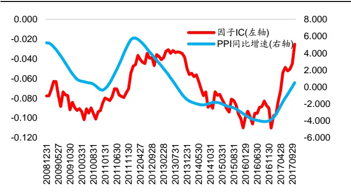
资料来源：Wind，海通证券研究所

图3 规模因子 IC与 PPI同比增速移动窗口跨期相关性
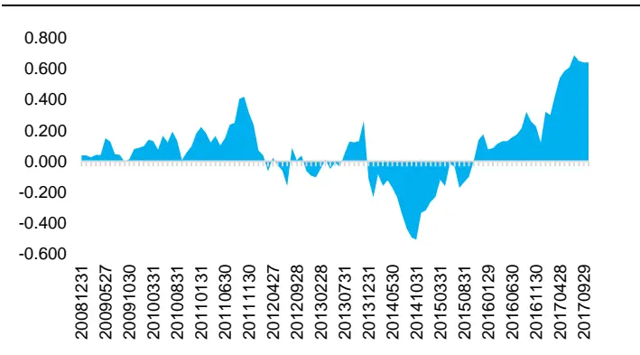
资料来源：Wind，海通证券研究所

历史数据表明，前期 PPI 同比增速与未来规模因子 IC正相关，也即前期 PPI 同比增速较高，则未来规模因子 IC 较高；前期 PPI 同比增速较低，则未来规模因子 IC较低。

## 4.1.2 规模因子与短期利率变动

下图展示了平滑后的 1月期限的国开债到期收益率的月度变动值与平滑后的规模因子 IC 的走势以及两者跨期相关性的滚动值。

图4 规模因子 IC与短期利率变动
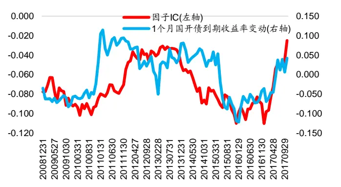
资料来源：Wind，海通证券研究所

图5 规模因子 IC与短期利率变动移动窗口跨期相关性
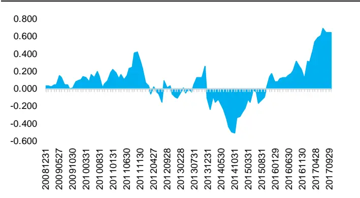
资料来源：Wind，海通证券研究所

历史数据表明，在前期国开债到期收益率上升时，未来规模因子 IC 较高（偏大盘）；在前期国开债到期收益率下行时，未来规模因子 IC较低（偏小盘）。

由于本部分的规模因子已经剔除了行业因素的影响，所以在分析上述现象的内在逻辑时是无法从利率对于不同行业具有不同影响这一角度出发的。我们认为在控制了行业后，行业内的大盘股与小盘股最大的不同在于公司在现有资产和未来新增投资上的分配。行业内的小盘股往往具有更高的未来新增投资占比，然而未来新增投资又对于利率较为敏感。利率上行不利于未来新增投资，因此未来新增投资占比较高的小盘股表现会不佳，反之，利率下行有利于未来新增投资，因此未来新增投资占比较高的小盘股表现会更好。

## 4.1.3 规模因子与宽基指数波动率

下图展示了平滑后的1月沪深300指数日收益率对数标准差与平滑后的规模因子IC的走势以及两者跨期相关性的滚动值。

图6 规模因子 IC与宽基指数波动率
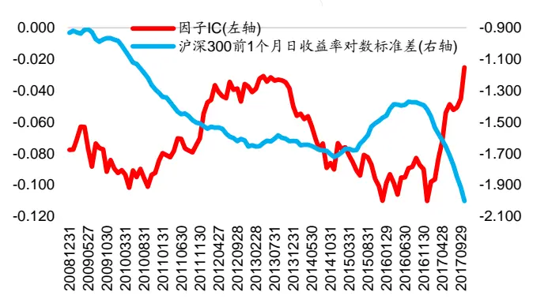
资料来源：Wind，海通证券研究所

图7 规模因子 IC与宽基指数波动率移动窗口跨期相关性
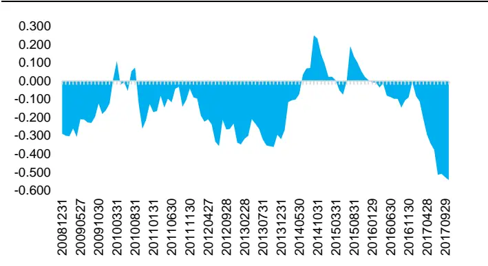
资料来源：Wind，海通证券研究所

历史数据表明，在前期指数波动较低时，未来规模因子 IC 较高（偏大盘）；在前期指数波动较高时，未来规模因子 IC 较低（偏小盘）。在切换不同宽基指数以及不同时间窗口后依旧可以观测到上述现象。

## 4.1.4 规模因子与股票收益区分度

下图展示了平滑后的 1月股票收益区分度的对数与平滑后的规模因子 IC的走势以

及两者跨期相关性的滚动值。

图8 规模因子 IC与股票收益区分度
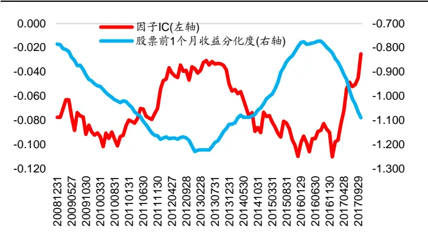
资料来源：Wind，海通证券研究所

图9 规模因子 IC与股票收益区分度移动窗口跨期相关性
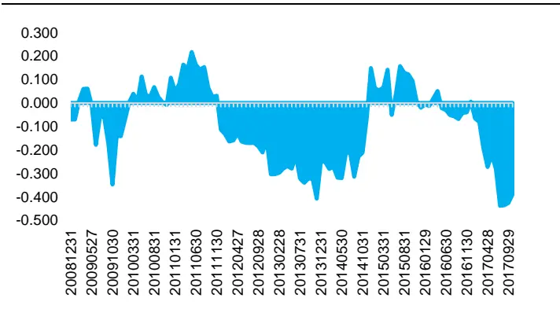
资料来源：Wind，海通证券研究所

历史数据表明，在前期收益区分度较低时，未来规模因子 IC 较高（偏大盘）；在前期收益区分度较高时，未来规模因子 IC 较低（偏小盘）。

## 4.2 中盘因子

本部分使用截面标准化后的对数总市值的平方计算中盘因子。因子值越小，股票越偏向中盘；因子值越大，股票越偏向小盘或者大盘。因此，因子 IC 越高，则市场风格越偏向大盘或者小盘，而因子 IC 越低，则市场风格越偏向中盘。下表展示了择时指标备选库中与中盘因子跨期相关性较高的指标。

表 2 中盘因子有效择时指标一览

| 一级分类 | 二级分类 | 指标说明 | 参数 | 跨期相关性 |
| --- | --- | --- | --- | --- |
| 宏观 | 消费 | 社消总额名义增速 | 无 | -0.14 |
| 宏观 | 消费 | 社消总额实际增速 | 无 | -0.15 |
| 宏观 | 消费 | 限额以上零售增速 | 无 | -0.13 |
| 宏观 | 金融 | 社融总量环比变化的月度变化 | 无 | -0.18 |
| 金融-债券市场 | 信用利差 | TED利差（国债） | 6M | -0.15 |
| 金融-债券市场 | 信用利差 | TED 利差（国开债） | 6M | -0.14 |
| 金融-债券市场 | 信用利差 | TED利差（国债）月度变化 | 1M | 0.16 |
| 金融-债券市场 | 信用利差 | TED利差（国开债）月度变化 | 1M | 0.15 |
| 金融-股票市场 | 指数涨幅 | 沪深 300指数涨幅-中证 500 指数涨幅 | 6M | -0.24 |
| 金融-股票市场 | 指数涨幅 | 沪深 300 指数涨幅-全 A 指数涨幅 | 6M | -0.27 |
| 金融-股票市场 | 指数涨幅 | 全 A 指数涨幅-中证 500 指数涨幅 | 6M | -0.18 |
| 金融-股票市场 | 指数波动 | 沪深 300 指数波动-中证 500 指数波动 | 3M | -0.14 |
| 金融-股票市场 | 指数波动 | 沪深 300 指数波动-中证 500 指数波动 | 6M | -0.19 |
| 金融-股票市场 | 指数波动 | 沪深 300 指数波动-全 A 指数波动 | 1M | -0.15 |
| 金融-股票市场 | 指数波动 | 沪深 300 指数波动-全 A 指数波动 | 3M | -0.19 |
| 金融-股票市场 | 指数波动 | 沪深 300 指数波动-全 A 指数波动 | 6M | -0.23 |
| 金融-股票市场 | 指数估值 | 沪深 300 指数 PB-中证 500 指数 PB | 无 | -0.18 |
| 金融-股票市场 | 指数估值 | 沪深 300 指数 PB-全 A 指数 PB | 无 | -0.24 |
| 金融-股票市场 金融-股票市场 | 指数估值 | 中证 500 指数 PB-全 A 指数 PB | 无 | 0.15 |
| 金融-股票市场 | 指数估值 | 沪深 300 指数 PE-中证 500 指数 PE | 无 | -0.15 |
|  | 指数估值 | 沪深 300 指数 PE-全 A 指数 PE | 无 | -0.20 |

资料来源：Wind，海通证券研究所

## 4.2.1 中盘因子与宽基指数涨幅截面差值

下图展示了平滑后的沪深300指数与全A指数6个月涨幅差值与平滑后的中盘因子IC 的走势以及两者跨期相关性的滚动值。

图10 中盘因子 IC与宽基指数涨幅差值
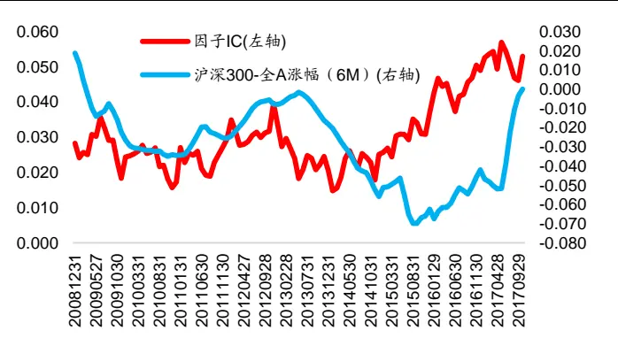
资料来源：Wind，海通证券研究所

图11 中盘因子 IC与宽基指数涨幅差值移动窗口跨期相关性
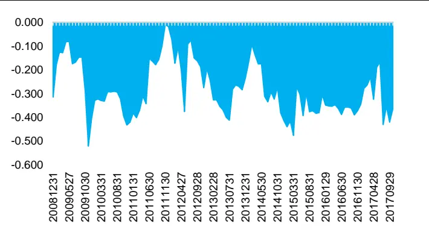
资料来源：Wind，海通证券研究所

历史数据表明，在前 6 个月沪深 300 指数与全 A指数涨幅差值较低时，未来中盘因子 IC 较高（偏大盘或小盘），而在前 6 个月涨幅差值较高时，未来中盘因子 IC 较低（偏中盘）。

## 4.2.2 中盘因子与宽基指数估值截面差值

下图展示了平滑后的沪深300指数与全A指数的PB对数差值与平滑后的中盘因子IC 的走势以及两者跨期相关性的滚动值。

图12 中盘因子 IC与宽基指数估值差值
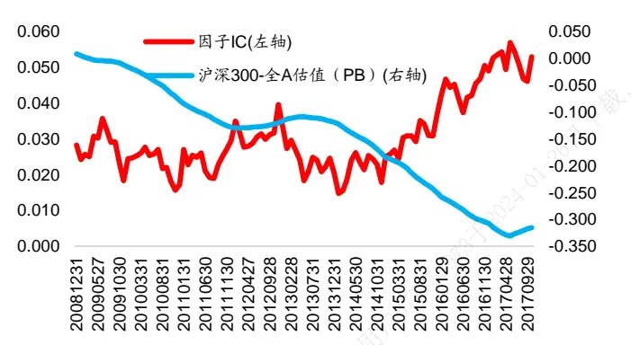
资料来源：Wind，海通证券研究所

图13 中盘因子 IC与宽基指数估值差值移动窗口跨期相关性
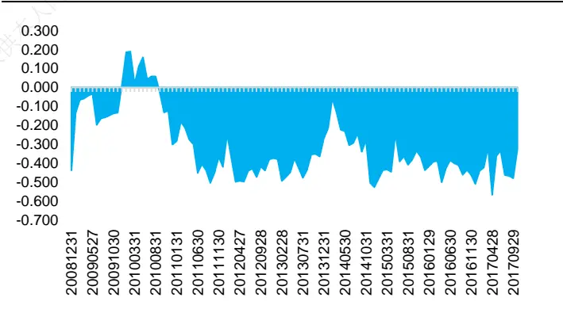
资料来源：Wind，海通证券研究所

历史数据表明，在沪深 300 指数与全 A指数 PB差值较低时，未来中盘因子 IC较高（偏大盘或小盘），而在指数 PB差值较高时，未来中盘因子 IC 较低（偏中盘）。

## 4.3 流动性因子

本部分使用股票过去 1个月日均换手率计算流动性因子。因子 IC越高，则市场越偏向前期高换手的股票；因子 IC 越低，则市场越偏好前期低换手的股票。下表展示了择时指标备选库中与流动性因子跨期相关性较高的指标。

表 3 流动性因子有效择时指标一览

| 一级分类 | 二级分类 | 指标说明 | 参数 | 跨期相关性 |
| --- | --- | --- | --- | --- |
| 宏观 | 通胀 | PPI环比增速 | 无 | -0.20 |
| 宏观 | 通胀 | PPI环比增速月度变化 | 无 | -0.18 |
| 金融-股票市场 | 指数涨幅 | 沪深 300 指数涨幅 | 1M | -0.23 |
| 金融-股票市场 | 指数涨幅 | 中证 500 指数涨幅 | 1M | -0.23 |
| 金融-股票市场 | 指数涨幅 | 全能 A 指数涨幅 | 1M | -0.25 |
| 金融-股票市场 | 指数涨幅 | 沪深 300 指数涨幅月度变化 | 1M | -0.22 |
| 金融-股票市场 | 指数涨幅 | 沪深300指数涨幅月度变化 | 3M | -0.19 |
| 金融-股票市场 | 指数涨幅 | 中证500指数涨幅月度变化 | 1M | -0.21 |
| 金融-股票市场 | 指数涨幅 | 全 A 指数涨幅月度变化 | 1M | -0.22 |
| 金融-股票市场 | 指数涨幅 | 全 A指数涨幅月度变化 | 3M | -0.17 |
| 金融-股票市场 | 指数波动 | (沪深300指数波动-中证500指数波动）月度变化 | 1M | -0.32 |
| 金融-股票市场 | 指数波动 | (沪深300指数波动-中证500指数波动）月度变化 | 3M | -0.20 |
| 金融-股票市场 | 指数波动 | (沪深 300指数波动-全 A指数波动）月度变化 | 1M | -0.23 |
| 金融-股票市场 | 指数波动 | (沪深300指数波动-全A指数波动）月度变化 | 3M | -0.18 |
| 金融-股票市场 | 指数波动 | (全 A指数波动-中证500指数波动）月度变化 | 1M | -0.34 |
| 金融-股票市场 | 指数波动 | (全 A指数波动-中证500指数波动）月度变化 | 3M | -0.16 |
| 金融-股票市场 | 指数估值 | 沪深 300 指数 PB 月度变化 | 无 | -0.19 |
| 金融-股票市场 | 指数估值 | 中证 500 指数 PB 月度变化 | 无 | -0.26 |
| 金融-股票市场 | 指数估值 | 全 A 指数 PB 月度变化 | 无 | -0.22 |
| 金融-股票市场 | 指数估值 | 沪深 300 指数 PE 月度变化 | 无 | -0.19 |
| 金融-股票市场 | 指数估值 | 中证 500 指数 PE月度变化 | 无 | -0.22 |
| 金融-股票市场 | 指数估值 | 全 A 指数 PE月度变化 | 无 | -0.20 |

资料来源： ，海通证券研究所

## 4.3.1 流动性因子与宽基指数涨幅

下图展示了平滑后的全 A指数 1 个月涨幅与平滑后的流动性因子 IC 的走势以及两者跨期相关性的滚动值。

图14 流动性因子 IC与宽基指数涨幅
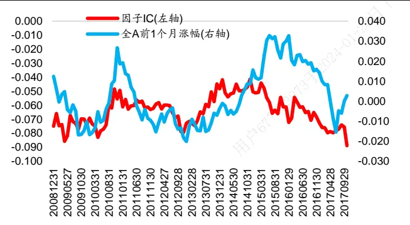
资料来源：Wind，海通证券研究所

图15 流动性因子 IC与宽基指数涨幅移动窗口跨期相关性
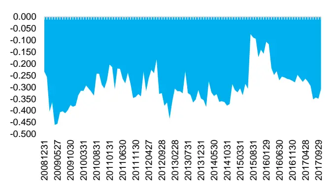
资料来源：Wind，海通证券研究所

历史数据表明，在前 1 个月全 A 指数涨幅较低时，未来流动性因子 IC 较高（偏高换手），而在前 1个月全 A指数涨幅较高时，未来流动性因子 IC较低（偏低换手）。

## 4.3.2 流动性因子与宽基指数波动差值变化

下图展示了平滑后的全 指数与中证 指数 个月日收益率对数标准差的截面差值的月度变动与平滑后的流动性因子 IC 的走势以及两者跨期相关性的滚动值。历史数据表明，在前 个月波动差值下降时，未来流动性因子 较高（偏高换手），而在前 个月波动差值升高时，未来流动性因子 IC 较低（偏低换手）。

图16 流动性因子 IC与宽基指数波动差值变化
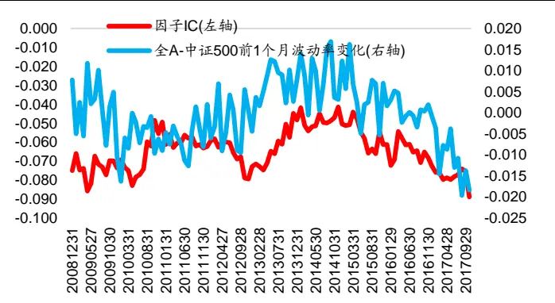
资料来源： ，海通证券研究所

图17 流动性因子IC与宽基指数波动差值移动窗口跨期相关性
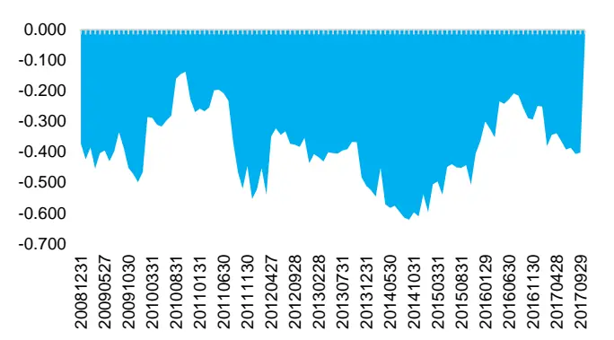
资料来源：Wind，海通证券研究所

## 4.4 反转因子

本部分使用股票过去 1个月收益率计算反转因子。因子 IC 越高，市场动量效应越强；因子 IC 越低，市场反转效应越强。下表展示了择时指标备选库中与反转因子跨期相关性较高的指标。

表 4 反转因子有效择时指标一览

| 一级分类 | 二级分类 | 指标说明 | 参数 | 跨期相关性 |
| --- | --- | --- | --- | --- |
| 宏观 | 通胀 | PPI环比增速 | 无 | 0.22 |
| 宏观 | 通胀 | PPI同比增速月度变化 | 无 | 0.23 |
| 金融-债券市场 | 信用利差 | AAA-AA 利差月度变化 | 1M | -0.17 |
| 金融-债券市场 | 信用利差 | AAA-AA 利差月度变化 | 3M | -0.20 |
| 金融-债券市场 | 信用利差 | AAA-AA 利差月度变化 | 6M | -0.20 |
| 金融-债券市场 | 信用利差 | AAA-AA 利差月度变化 | 1Y | -0.18 |
| 金融-股票市场 | 指数涨幅 | 中证 500 指数涨幅 | 1M | 0.27 |
| 金融-股票市场 | 指数涨幅 | 全 A 指数涨幅 | 1M | 0.19 |
| 金融-股票市场 | 指数波动 | 沪深 300 指数波动 | 1M | -0.21 |
| 金融-股票市场 | 指数波动 | 沪深 300 指数波动 | 3M | -0.16 |
| 金融-股票市场 | 指数波动 | 沪深 300 指数波动 | 6M | -0.16 |
| 金融-股票市场 | 指数波动 | 中证 500 指数波动 | 1M | -0.33 |
| 金融-股票市场 | 指数波动 | 中证 500 指数波动 | 3M | -0.21 |
| 金融-股票市场 | 指数波动 | 中证 500 指数波动 | 6M | -0.18 |
| 金融-股票市场 | 指数波动 | 全 A 指数波动 | 1M | -0.27 |
| 金融-股票市场 | 指数波动 | 全 A 指数波动 | 3M | -0.19 |
| 金融-股票市场 金融-股票市场 | 指数波动 | 全 A 指数波动 | 6M | -0.17 |
| 金融-股票市场 | 指数波动 | 沪深 300 指数波动月度变化 | 1M | -0.22 |
| 金融-股票市场 | 指数波动 | 沪深300指数波动月度变化 | 3M | -0.20 |
| 金融-股票市场 | 指数波动 | 沪深 300 指数波动月度变化 | 6M | -0.21 |
| 金融-股票市场 | 指数波动 | 中证500指数波动月度变化 | 1M | -0.31 |
| 金融-股票市场 | 指数波动 | 中证500指数波动月度变化 | 3M | -0.28 |
| 金融-股票市场 | 指数波动 | 中证500指数波动月度变化 | 6M | -0.28 |
| 金融-股票市场 | 指数波动 | 全 A指数波动月度变化 | 1M | -0.26 |
| 金融-股票市场 | 指数波动 | 全 A 指数波动月度变化 | 3M | -0.23 |
| 金融-股票市场 | 指数波动 | 全A指数波动月度变化 | 6M | -0.24 |
| 金融-股票市场 | 指数涨幅 | 沪深 300 指数涨幅-中证 500 指数涨幅 | 1M | -0.27 |
| 金融-股票市场 | 指数涨幅 | 全 A 指数涨幅-中证 500 指数涨幅 | 1M | -0.32 |
| 金融-股票市场 | 指数涨幅 | 全 A 指数涨幅-中证 500 指数涨幅 | 3M | -0.17 |
| 金融-股票市场 | 指数涨幅 | （沪深300指数涨幅-中证500指数涨幅）月度变化 | 1M | -0.21 |
| 金融-股票市场 | 指数涨幅 | （沪深300指数涨幅-中证500指数涨幅）月度变化 | 3M | -0.27 |
| 金融-股票市场 | 指数涨幅 指数涨幅 | (沪深300指数涨幅-全A指数涨幅）月度变化 | 1M | -0.16 |
| 金融-股票市场 | 指数涨幅 | (沪深300指数涨幅-全 A指数涨幅)月度变化 (全A指数涨幅-中证500指数涨幅）月度变化 | 3M | -0.22 |
| 金融-股票市场 | 指数涨幅 | (全 A 指数涨幅-中证500指数涨幅)月度变化 | 1M | -0.21 |
| 金融-股票市场 | 截面波动 | 收益分化度 | 3M | -0.26 |
| 金融-股票市场 | 指数估值 | (沪深 300 指数 PB-中证 500 指数 PB)月度变化 | 1M | -0.21 |
| 金融-股票市场 | 指数估值 |  | 无 | -0.29 |
| 金融-股票市场 | 指数估值 | (沪深 300 指数 PB-全 A 指数 PB)月度变化 (中证 500 指数 PB-全 A 指数 PB)月度变化 | 无 无 | -0.22 0.30 |

资料来源：Wind，海通证券研究所

## 4.4.1 反转因子与信用利差变化

下图展示了平滑后 3 个月信用利差月度变化值与平滑后的反转因子 IC 的走势以及两者跨期相关性的滚动值。

图18 反转因子 IC与信用利差变化
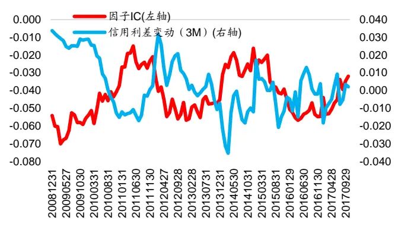
资料来源：Wind，海通证券研究所

图19 反转因子 IC与信用利差变化移动窗口跨期相关性
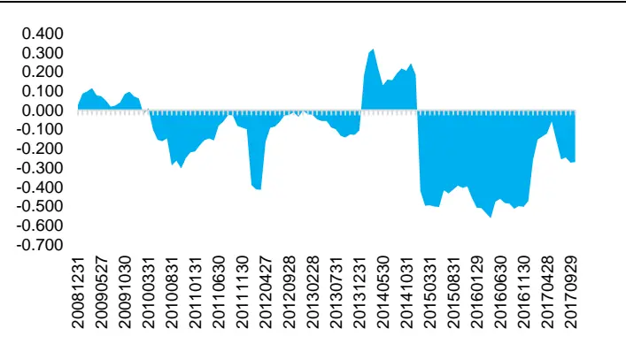
资料来源：Wind，海通证券研究所

历史数据表明，在信用利差缩小时，未来反转因子 较高（偏动量），而在信用利差扩大时，未来反转因子 IC 较低（偏反转）。对于上述现象，一个可能的解释是：信用利差的上行代表着投资者风险偏好以及风险承受能力的减弱，在这种市场环境下，投资者更容易卖出前期涨幅较大的股票，并买入前期跌幅较大的股票，因此形成反转效应。

## 4.4.2 反转因子与宽基指数波动

下图展示了平滑后的中证500指数1个月日收益率对数标准差与平滑后的反转因子IC 的走势以及两者跨期相关性的滚动值。

图20 反转因子 IC与指数波动
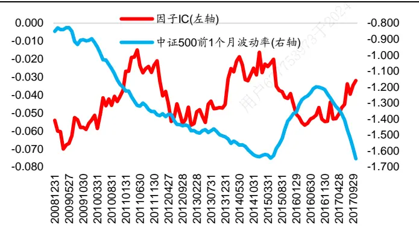
资料来源：Wind，海通证券研究所

图21 反转因子 IC与指数波动移动窗口跨期相关性
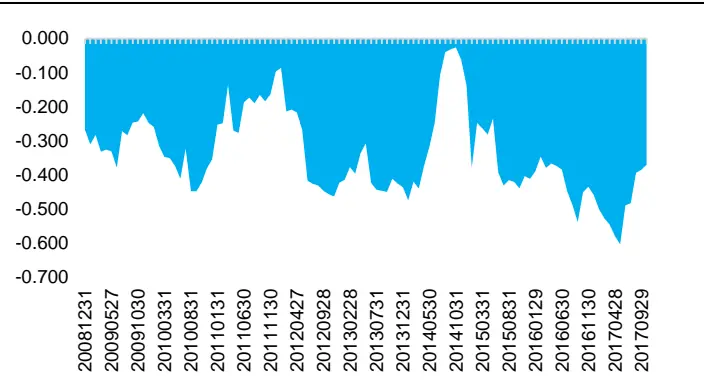
资料来源：Wind，海通证券研究所

历史数据表明，在前 1 个月中证 500 指数波动较低时，未来反转因子 IC 较高（偏动量），而在前 1个月波动较高时，未来反转因子 IC较低（偏反转）。

## 4.5 波动率因子

本部分使用股票过去 1个月收益率的 FF3 因素回归 R方计算波动率因子。简单来说，股票 FF3 因素回归 R方越高，特质波动率占比越低，系统波动波动率占比越高。因子 IC 越高，市场越偏好高系统波动占比、低特质波动占比的股票；因子 IC越低，市场越偏好低系统波动占比、高特质波动占比的股票。下表展示了择时指标备选库中与波动率因子跨期相关性较高的指标。

表 5 波动率因子有效择时指标一览

| 一级分类 | 二级分类 | 指标说明 | 参数 | 跨期相关性 |
| --- | --- | --- | --- | --- |
| 宏观 | 通胀 | PPI环比增速 | 无 | -0.18 |
| 宏观 | 通胀 | PPI同比增速月度变化 | 无 | -0.16 |
| 宏观 | 消费 | 社消总额实际增速月度变化 | 无 | 0.16 |
| 金融-债券市场 | 利率水平 | 国债收益率月度变化 | 5Y | -0.15 |
| 金融-债券市场 | 利率水平 | 国债收益率月度变化 | 10Y | -0.15 |
| 金融-债券市场 | 利率水平 | 国债收益率月度变化 | 20Y | -0.13 |
| 金融-债券市场 | 利率水平 | 国债收益率月度变化 | 30Y | -0.18 |
| 金融-股票市场 | 指数波动 | 沪深 300 指数波动 | 3M | 0.14 |
| 金融-股票市场 | 指数波动 | 中证 500 指数波动 | 3M | 0.15 |
| 金融-股票市场 | 指数波动 | 全 A 指数波动 | 3M | 0.16 |
| 金融-股票市场 | 指数波动 | 沪深300指数波动月度变化 | 1M | -0.17 |
| 金融-股票市场 | 指数波动 | 中证500指数波动月度变化 | 6M | 0.16 |
| 金融-股票市场 | 指数波动 | 全 A 指数波动月度变化 | 1M | -0.14 |
| 金融-股票市场 | 指数波动 | 全A指数波动月度变化 | 6M | 0.14 |
| 金融-股票市场 | 指数波动 | （沪深300指数波动-中证500指数波动）月度变化 | 1M | -0.15 |
| 金融-股票市场 | 指数波动 | (沪深300指数波动-中证500指数波动）月度变化 | 3M | -0.13 |
| 金融-股票市场 | 指数波动 | （沪深300指数波动-中证500指数波动）月度变化 | 6M | -0.14 |
| 金融-股票市场 金融-股票市场 | 指数波动 | (沪深 300 指数波动-全 A指数波动）月度变化 | 3M | -0.19 |
|  | 指数波动 | (沪深300指数波动-全A指数波动）月度变化 | 6M | -0.16 |
| 金融-股票市场 | 指数波动 | (全 A指数波动-中增500 指数波动）月度变化 | 1M | -0.21 |
| 金融-股票市场 | 指数换手率 | 沪深 300 指数换手率变化 | 1M | -0.21 |
| 金融-股票市场 | 指数换手率 | 中证500 指数换手率变化 | 1M | -0.18 |
| 金融-股票市场 | 指数换手率 | 全 A 指数换手率变化 | 1M | -0.19 |

资料来源：Wind，海通证券研究所

## 4.5.1 波动率因子与宽基指数波动率

下图展示了平滑后的全A指数3个月日收益率对数标准差与平滑后的波动率因子IC的走势以及两者跨期相关性的滚动值。

图22 波动率因子 IC与指数波动
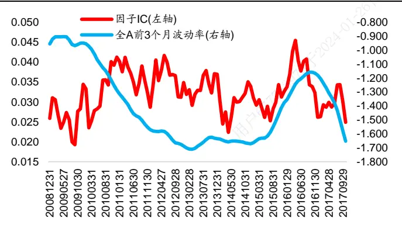
资料来源：Wind，海通证券研究所

图23 波动率因子 IC与指数波动移动窗口跨期相关性
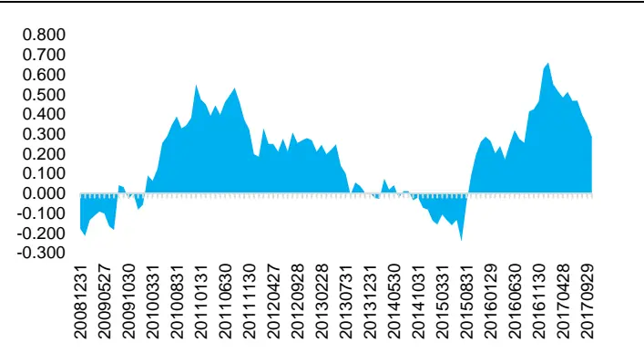
资料来源：Wind，海通证券研究所

历史数据表明，在前 3 个月指数波动较高时，未来波动率因子 IC较高（偏高 R方，高系统波动占比，低特质波动占比），而在前 3 个月指数波动较低时，未来波动率因子IC 较低（偏低 R方，低系统波动占比，高特质波动占比）。

## 4.6 估值因子

本部分使用股票对数 PB计算估值因子。下表展示了择时指标备选库中与估值因子跨期相关性较高的指标。因子 IC 越高，市场越偏好高估值股票；因子 IC 越低，市场越偏好低估值股票。

表 6 估值因子有效择时指标一览

| 一级分类 | 二级分类 | 指标说明 | 参数 | 跨期相关性 |
| --- | --- | --- | --- | --- |
| 宏观 | 金融 | 新增社融 | 无 | 0.14 |
| 宏观 | 贸易 | 进出口金额同比增速月度变化 | 无 | -0.22 |
| 宏观 | 贸易 | 进口金额同比增速月度变化 | 无 | -0.20 |
| 金融-债券市场 | 信用利差 | TED 利差（国开债） | 3M | 0.24 |
| 金融-债券市场 | 信用利差 | TED利差（国债） | 3M | 0.22 |
| 金融-股票市场 | 指数涨幅 | 沪深 300 指数涨幅 | 3M | -0.18 |
| 金融-股票市场 | 指数涨幅 | 中证 500 指数涨幅 | 3M | -0.21 |
| 金融-股票市场 | 指数涨幅 | 全 A 指数涨幅 | 3M | -0.22 |
| 金融-股票市场 | 指数换手率 | 沪深 300 指数换手-中证 500 指数换手 | 1M | -0.15 |
| 金融-股票市场 | 指数换手率 | 全 A 指数换手-中证 500 指数换手 | 1M | -0.19 |
| 金融-股票市场 | 指数换手率 | 全 A 指数换手-中证 500 指数换手 | 3M | -0.16 |
| 金融-股票市场 | 指数换手率 | 全 A 指数换手-中证 500 指数换手 | 6M | -0.16 |
| 金融-股票市场 | 截面波动 | 收益区分度 | 3M | -0.18 |

资料来源：Wind，海通证券研究所

需要注意的是，虽然能够从择时指标备选库中找到对于 PB因子未来收益具有预测效果的指标，但是部分现象与直观理解相冲突。这可能是由于本报告中的 PB因子的收益经过了正交处理，也可能是择时指标受到其他因素的影响。

## 4.6.1 估值因子与进出口金额同比增速变化

下图展示了平滑后的进出口金额同比增速月度变化值与平滑后的估值因子 IC 的走势以及两者跨期相关性的滚动值。

图24 估值因子 IC与进出口金额同比增速变化
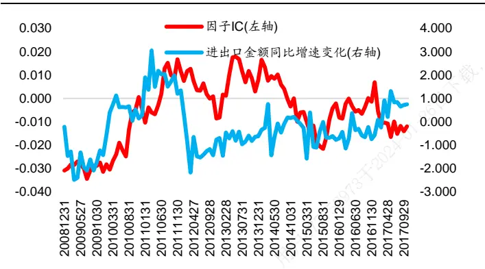
资料来源：Wind，海通证券研究所

图25 估值因子 IC与贸易变化移动窗口跨期相关性
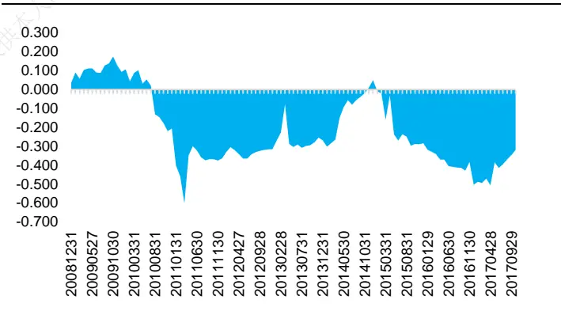
资料来源：Wind，海通证券研究所

历史数据表明，在进出口金额同比增速下行时，未来估值因子 IC 较高（偏成长），而在进出口金额同比增速下行时，未来估值因子 IC较低（偏价值）。

## 4.6.2 估值因子与 TED 利差

下图展示了平滑后的 3 个月利率指标计算得到的 TED 利差与平滑后的估值因子 IC的走势以及两者跨期相关性的滚动值。

图26 估值因子 IC 与 TED 利差
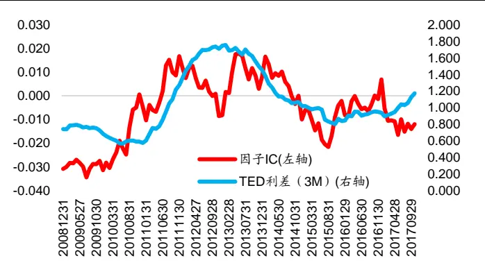
资料来源：Wind，海通证券研究所

图27 估值因子 IC与 TED利差移动窗口跨期相关性
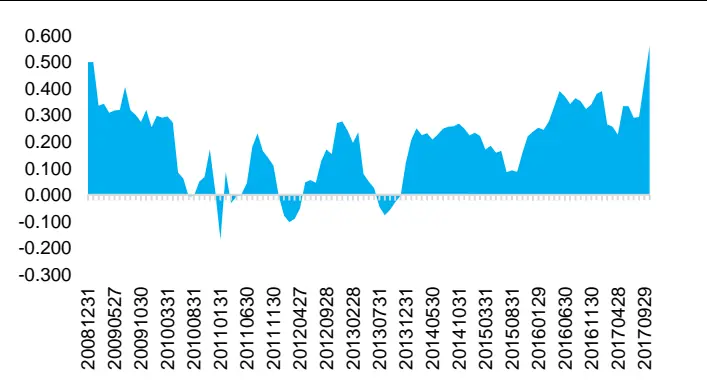
资料来源：Wind，海通证券研究所

历史数据表明，在 TED 利差较高时，未来估值因子 IC 较高（偏成长），而在 TED利差较低时，未来估值因子 IC 较低（偏价值）。

## 4.6.3 估值因子与宽基指数涨幅

下图展示了平滑后的中证 500 指数 3 个月涨幅与平滑后的估值因子 IC 的走势以及两者跨期相关性的滚动值。

图28 估值因子 IC与指数涨幅
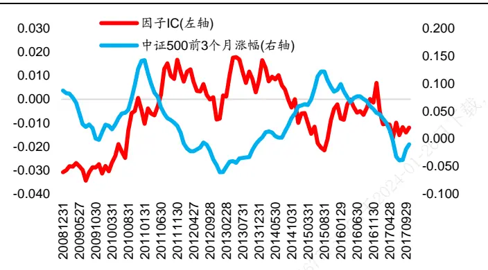
资料来源：Wind，海通证券研究所

图29 估值因子 IC与指数涨幅移动窗口跨期相关性
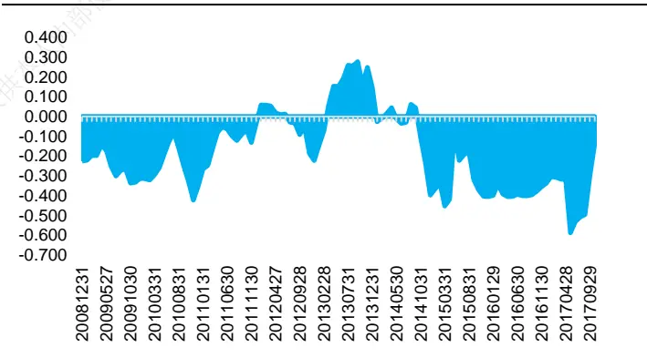
资料来源：Wind，海通证券研究所

历史数据表明，在前 3 个月中证 500 指数涨幅较低时，未来估值因子 IC 较高（偏成长），而在前 3个月指数涨幅较高时，未来估值因子 IC 较低（偏价值）。

## 4.7 盈利因子

本部分使用股票单季度 ROE 计算盈利因子。因子 IC越高，市场越偏好高盈利股票；因子 越低，市场越偏好低盈利股票。下表展示了择时指标备选库中与盈利因子跨期相关性较高的指标。部分文献认为盈利因子衡量了股票的防御性或者安全性，因此该类因子往往会在经济环境欠佳、市场风险较高时表现较好。该理论可用来解释部分观测到的结果。

表 7 盈利因子有效择时指标一览

| 一级分类 | 二级分类 | 指标说明 | 参数 | 跨期相关性 |
| --- | --- | --- | --- | --- |
| 宏观 | 消费 | 社消总额名义增速月度变化 | 无 | -0.19 |
| 宏观 | 消费 | 社消总额实际增速月度变化 | 无 | -0.23 |
| 宏观 | 金融 | 社融总量环比变化月度变化 | 无 | -0.20 |
| 宏观 | 金融 | MO同比增速月度变化 | 无 | -0.19 |
| 金融-债券市场 | 信用利差 | TED 利差（国开债） | 3M | 0.21 |
| 金融-债券市场 | 信用利差 | TED利差（国债） | 3M | 0.17 |
| 金融-债券市场 | 利率水平 | 国开债收益率月度变化 | 1M | 0.19 |
| 金融-股票市场 | 指数涨幅 | 沪深 300 指数涨幅 | 1M | -0.17 |
| 金融-股票市场 | 指数涨幅 | 中证 500 指数涨幅 | 1M | -0.16 |
| 金融-股票市场 | 指数涨幅 | 全 A 指数涨幅 | 1M | -0.17 |
| 金融-股票市场 | 指数涨幅 | 沪深300指数涨幅月度变化 | 1M | -0.21 |
| 金融-股票市场 | 指数涨幅 | 沪深 300指数涨幅月度变化 | 6M | -0.17 |
| 金融-股票市场 | 指数涨幅 | 中证500指数涨幅月度变化 | 1M | -0.19 |
| 金融-股票市场 | 指数涨幅 | 全 A指数涨幅月度变化 | 1M | -0.20 |
| 金融-股票市场 | 截面波动 | 收益区分度月度变化 | 1M | -0.26 |
| 金融-股票市场 | 截面波动 | 股票收益率截面波动月度变化 | 1M | -0.21 |

资料来源：Wind，海通证券研究所

## 4.7.1 盈利因子与 TED利差

下图展示了平滑后的 TED 利差与平滑后的盈利因子 IC 的走势以及两者跨期相关性的滚动值。

图30 盈利因子 IC 与 TED 利差
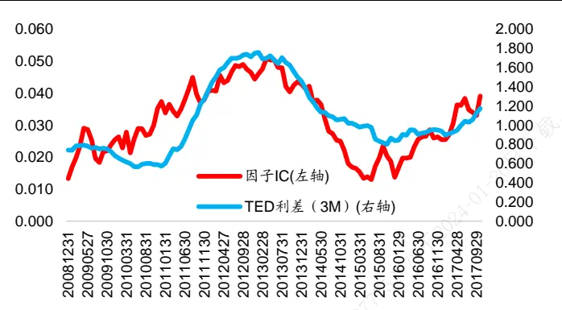
资料来源：Wind，海通证券研究所

图31 盈利因子 IC与 TED利差移动窗口跨期相关性
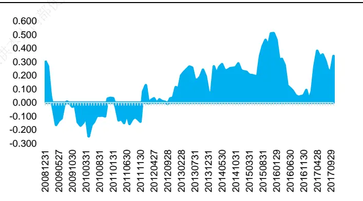
资料来源：Wind，海通证券研究所

历史数据表明，在 利差较高时，未来盈利因子 C 较高（偏高盈利），而在利差较低时，未来盈利因子 IC 较低（偏低盈利）。也即，在风险较高，投资者风险偏好较低时，高盈利股票更受到投资者的青睐。

## 4.7.2 盈利因子与利率变动

下图展示了平滑后的国开债收益率变动与平滑后的盈利因子 IC 的走势以及两者跨期相关性的滚动值。

图32 盈利因子 IC与利率变动
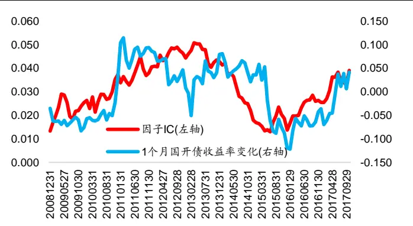
资料来源：Wind，海通证券研究所

图33 盈利因子 IC与利率变动移动窗口跨期相关性
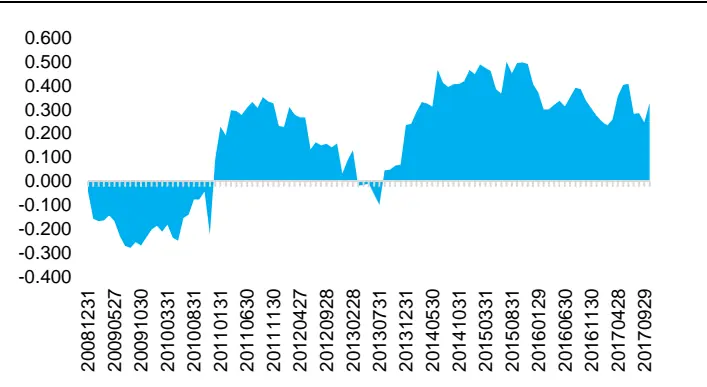
资料来源：Wind，海通证券研究所

历史数据表明，在国开债到期收益率上行时，未来盈利因子 IC 较高（偏高盈利），而在国开债到期收益率下行时，未来盈利因子 IC较低（偏低盈利）。

## 4.7.3 盈利因子与股票收益区分度变化

下图展示了平滑后的股票收益区分度对数的月度差值与平滑后的盈利因子 IC 的走势以及两者跨期相关性的滚动值。

图34 盈利因子 IC与股票收益区分度
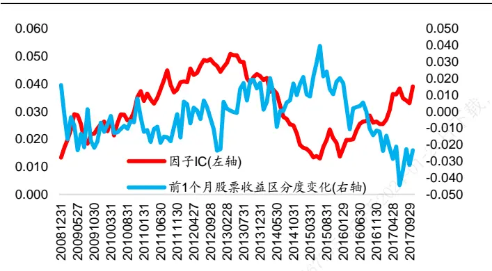
资料来源：Wind，海通证券研究所

图35 盈利因子 IC与股票收益区分度移动窗口跨期相关性
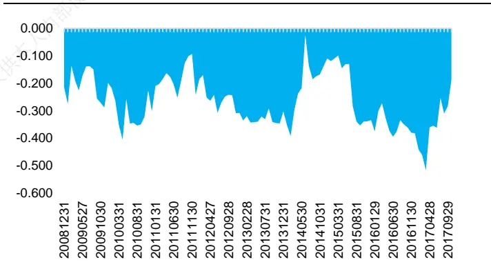
资料来源：Wind，海通证券研究所

历史数据表明，在股票收益区分度变小时，未来盈利因子 IC 较高（偏高盈利），而在股票收益区分度变大时，未来盈利因子 IC较低（偏低盈利）。

## 4.8 盈利成长因子

本部分使用股票单季度 ROE 同比变化计算盈利成长因子。因子 IC越高，市场越偏好高盈利成长股票；因子 IC 越低，市场越偏好低盈利成长股票。下表展示了择时指标备选库中与盈利成长因子跨期相关性较高的指标。

表 8 盈利成长因子有效择时指标一览

| 一级分类 | 二级分类 | 指标说明 | 参数 | 跨期相关性 |
| --- | --- | --- | --- | --- |
| 宏观 | 通胀 | CPI 环比增速 | 无 | 0.27 |
| 宏观 | 通胀 | PPI环比增速 | 无 | 0.18 |
| 宏观 | 消费 | 限额以上零售增速月度变化 | 无 | -0.25 |
| 宏观 | 金融 | 新增社融 | 无 | -0.16 |
| 金融-债券市场 | 利率水平 | 银行间同业拆借利率 | 7D | 0.19 |
| 金融-债券市场 | 利率水平 | 银行间同业拆借利率 | 14D | 0.18 |
| 金融-债券市场 | 利率水平 | 银行间同业拆借利率 | 21D | 0.17 |
| 金融-债券市场 | 利率水平 | 银行间同业拆借利率 | 1M | 0.15 |
| 金融-债券市场 | 期限利差 | 银行间同业拆借利率 | 7D-1D | 0.24 |
| 金融-债券市场 | 期限利差 | 银行间同业拆借利率 | 14D-1D | 0.20 |
| 金融-债券市场 | 期限利差 | 银行间同业拆借利率 | 21D-1D | 0.17 |
| 金融-债券市场 | 期限利差 | 银行间同业拆借利率 | 3M-7D | -0.15 |
| 金融-债券市场 | 信用利差 | AAA-AA 利差月度变动 | 10Y | -0.18 |
| 金融-债券市场 | 信用利差 | AAA-AA 利差月度变动 | 20Y | -0.20 |
| 金融-债券市场 | 信用利差 | AAA-AA 利差月度变动 | 30Y | -0.19 |
| 金融-股票市场 | 指数涨幅 | (沪深 300指数涨幅-中证 500指数涨幅）月度变动 | 3M | -0.20 |
| 金融-股票市场 | 指数涨幅 | (沪深 300指数涨幅-全 A 指数涨幅)月度变动 | 3M | -0.18 |
| 金融-股票市场 | 指数涨幅 | (全 A指数涨幅-中证500 指数涨幅）月度变动 | 3M | -0.19 |
| 金融-股票市场 | 指数估值 | 中证 500 指数 PB | 无 | 0.17 |

资料来源：Wind，海通证券研究所

## 4.8.1 盈利成长因子与 CPI同比增速

下图展示了平滑后的 CPI 同比增速与平滑后的盈利成长因子 IC 的走势以及两者跨期相关性的滚动值。

图36 盈利成长因子 IC与 CPI同比增速
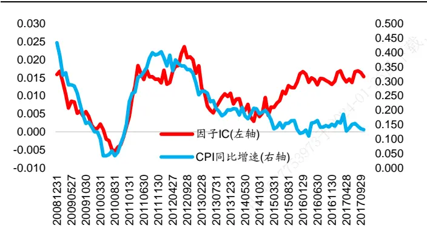
资料来源：Wind，海通证券研究所

图37 盈利成长因子 IC与 CPI同比增速移动窗口跨期相关性
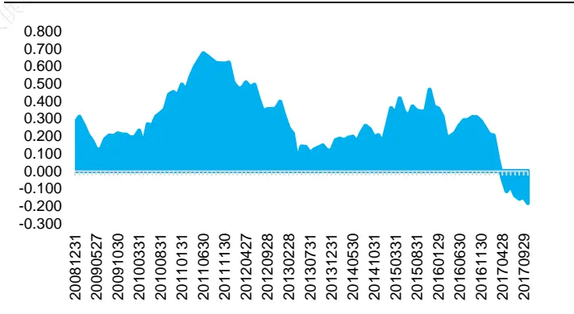
资料来源：Wind，海通证券研究所

历史数据表明，在 CPI 同比增速较高时，未来盈利成长因子 IC 较高（偏高盈利成长），而在 CPI 同比增速较低时，未来盈利成长因子 IC 较低（偏低盈利成长）。

## 4.8.2 盈利成长因子与宽基指数估值

下图展示了平滑后的中证500指数PB对数与平滑后的盈利成长因子IC的走势以及两者跨期相关性的滚动值。历史数据表明，在中证 指数估值较高时，未来盈利成长因子 IC 较高（偏高盈利成长），而在中证 500 指数估值较低时，未来盈利成长因子 IC较低（偏低盈利成长）。

图38 盈利成长因子 IC与指数估值
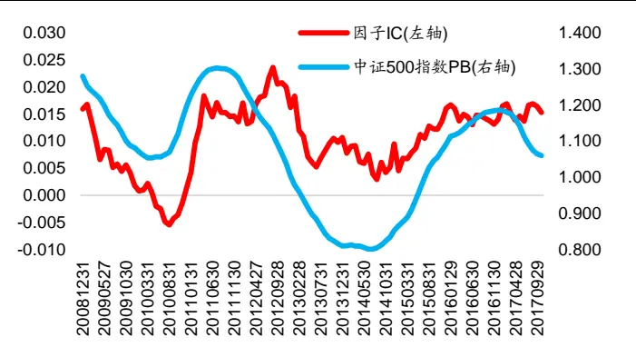
资料来源：Wind，海通证券研究所

图39 盈利成长因子 IC与指数估值移动窗口跨期相关性
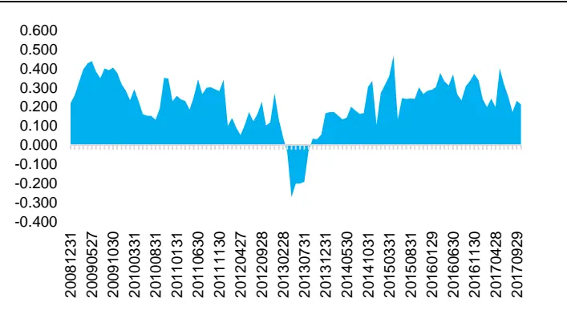
资料来源：Wind，海通证券研究所

## 5. 总结

基于系列前期报告，本文对于因子择时模型进行了进一步的改进。在回归法的框架下，因子择时模型变得更加容易理解、更容易实现且具有更强的扩展性。在新的因子择时框架下，因子择时这一问题被分解为了构建择时指标备选库与动态筛选择时指标。转

本报告从宏观经济、金融市场以及因子收益三个层次构建了一个较为全面的因子择可时指标备选库并简要展示了对于常见因子具有一定预测效果的因子择时指标。

在拥有了一个较为全面的择时指标备选库的基础上，投资者面临的另外一个问题是部如何筛选因子择时指标。这一问题我们会在专题报告《选股因子系列研究(三十一)——人因子择时指标的选择》中详细讨论。供

## 6. 风险提示

市场系统性风险、资产流动性风险以及政策变动风险会对策略表现产生较大影响。01

# 信息披露

分析师声明

[Table冯佳睿yst 金融工程研究团队s]

袁林青金融工程研究团队

本人具有中国证券业协会授予的证券投资咨询执业资格，以勤勉的职业态度，独立、客观地出具本报告。本报告所采用的数据和信息均来自市场公开信息，本人不保证该等信息的准确性或完整性。分析逻辑基于作者的职业理解，清晰准确地反映了作者的研究观点，结论不受任何第三方的授意或影响，特此声明。

## 法律声明

本报告仅供海通证券股份有限公司（以下简称“本公司”）的客户使用。本公司不会因接收人收到本报告而视其为客户。在任何情况下，本报告中的信息或所表述的意见并不构成对任何人的投资建议。在任何情况下，本公司不对任何人因使用本报告中的任何内容所引致的任何损失负任何责任。

本报告所载的资料、意见及推测仅反映本公司于发布本报告当日的判断，本报告所指的证券或投资标的的价格、价值及投资收入可能播会波动。在不同时期，本公司可发出与本报告所载资料、意见及推测不一致的报告。可

市场有风险，投资需谨慎。本报告所载的信息、材料及结论只提供特定客户作参考，不构成投资建议，也没有考虑到个别客户特殊的用，投资目标、财务状况或需要。客户应考虑本报告中的任何意见或建议是否符合其特定状况。在法律许可的情况下，海通证券及其所属部关联机构可能会持有报告中提到的公司所发行的证券并进行交易，还可能为这些公司提供投资银行服务或其他服务。

本报告仅向特定客户传送，未经海通证券研究所书面授权，本研究报告的任何部分均不得以任何方式制作任何形式的拷贝、复印件或供复制品，或再次分发给任何其他人，或以任何侵犯本公司版权的其他方式使用。所有本报告中使用的商标、服务标记及标记均为本公司的商标、服务标记及标记。如欲引用或转载本文内容，务必联络海通证券研究所并获得许可，并需注明出处为海通证券研究所，且下不得对本文进行有悖原意的引用和删改。

根据中国证监会核发的经营证券业务许可，海通证券股份有限公司的经营范围包括证券投资咨询业务。24

## 海通证券股份有限公司研究所[Table_PeopleInfo]

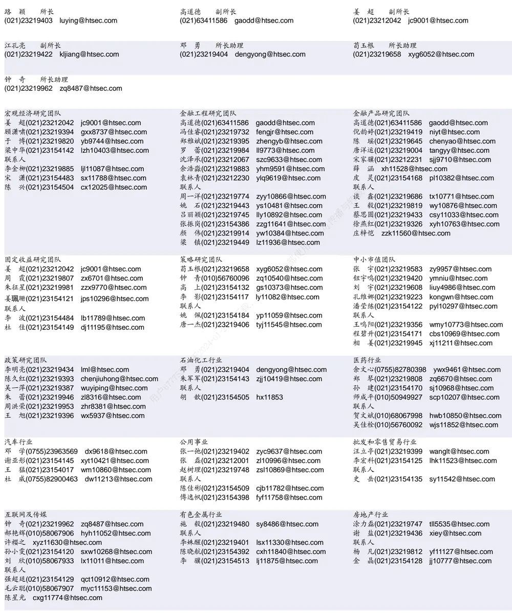

| 电子行业 |  | 煤炭行业 |  | 电力设备及新能源行业 |  | zyc9637@htsec.com |
| --- | --- | --- | --- | --- | --- | --- |
| 陈 平(021)23219646 联系人 谢 磊(021)23212214 xl10881@htsec.com | cp9808@htsec.com |  | 吴 杰(021)23154113 戴元灿(021)23154146 李 淼(010)58067998 | wj10521@htsec.com dyc10422@htsec.com Im10779@htsec.com | 张一弛(021)23219402 房 青(021)23219692 曾 彪(021)23154148 | fangq@htsec.com zb10242@htsec.com |
| 张天闻 ztw11086@htsec.com 尹 苓(021)23154119 | yl11569@htsec.com |  |  |  | 徐柏乔(021)32319171 张向伟(021)23154141 | xbq6583@htsec.com zxw10402@htsec.com |
| 石 坚(010)58067942 基础化工行业 | sj11855@htsec.com |  |  |  |  |  |
| 刘 威(0755)82764281 | 1 Iw10053@htsec.com |  | 计算机行业 郑宏达(021)23219392 zhd10834@htsec.com |  | 通信行业 朱劲松(010)50949926 | zjs10213@htsec.com |
| 刘海荣(021)23154130 Ihr10342@htsec.com |  |  |  |  |  |  |
|  |  |  |  | 鲁 立（021）23154138 II11383@htsec.com | 余伟民(010)50949926 | ywm11574@htsec.com |
| 张翠翠 zcc11726@htsec.com |  |  | 黄竞晶(021)23154131 hjj10361@htsec.com |  | 联系人 |  |
| 联系人 |  |  | 杨 林(021)23154174 | yl11036@htsec.com | 庄 宇(010)50949926 | zy11202@htsec.com |
| 李 智(021)23219392 | lz11785@htsec.com | 联系人 |  |  | 张峥青 zzq11650@htsec.com |  |
|  |  |  | 洪 琳(021)23154137 | hl11570@htsec.com |  |  |
| 非银行金融行业 |  |  | 交通运输行业 |  | 纺织服装行业 |  |
| 孙 婷(010)50949926 | st9998@htsec.com |  | 虞 楠(021)23219382 | yun@htsec.com | 梁 希(021)23219407 | lx11040@htsec.com |
| 何 婷(021)23219634 | ht10515@htsec.com | 联系人 | 张 杨(021)23219442 | zy9937@htsec.com | 联系人 |  |
| 联系人 夏昌盛(010)56760090 |  |  | 李 丹(021)23154401 | ld11766@htsec.com | 马 榕(021)23219431 mr11128@htsec.com |  |
| 李芳洲(021)23154127 | xcs10800@htsec.com Ifz11585@htsec.com |  |  |  |  |  |
| 建筑建材行业 |  | 机械行业 |  |  | 钢铁行业 |  |
| 邱友锋(021)23219415 | qyf9878@htsec.com |  | 余炜超(021)23219816 | swc11480@htsec.com | 刘彦奇(021)23219391 | liuyq@htsec.com |
| 冯晨阳(021)23212081 钱佳佳(021)23212081 | fcy10886@htsec.com |  | 耿 耘(021)23219814 | gy10234@htsec.com | 联系人 |  |
|  | qjj10044@htsec.com |  | 杨 震(021)23154124 | yz10334@htsec.com | 刘 璇(021)23219197 | lx11212@htsec.com |
|  |  |  | 沈伟杰(021)23219963 | swj11496@htsec.com | 周慧琳(021)23154399 | zhl11756@htsec.com |
| 建筑工程行业 |  | 农林牧渔行业 |  |  | 食品饮料行业 |  |
| 杜市伟 dsw11227@htsec.com |  |  | 丁 频(021)23219405 | dingpin@htsec.com | 闻宏伟(010)58067941 | whw9587@htsec.com |
|  | 毕春晖(021)23154114 bch10483@htsec.com |  | 陈雪丽(021)23219164 | cxl9730@htsec.com | 成珊(021)23212207 | cs9703@htsec.com |
|  |  |  | 陈 阳(010)50949923 | cy10867@htsec.com | 唐 宇(021)23219389 | ty11049@htsec.com |
|  |  | 联系人 |  |  |  |  |
|  |  |  | 关 慧(021)23219448 | gh10375@htsec.com |  |  |
|  |  |  | 夏 越(021)23212041 | xy11043@htsec.com |  |  |
| 军工行业 |  | 银行行业 |  |  | 社会服务行业 |  |
| 张恒晅 zhx10170@hstec.com |  |  | 林媛媛(0755)23962186 lyy9184@htsec.com |  | 汪立亭(021)23219399 | wanglt@htsec.com |
| 徐志国(010)50949921 |  | 联系人 |  |  |  |  |
| 蒋 俊(021)23154170 | xzg9608@htsec.com | 谭敏沂 |  |  | 李铁生(010)58067934 | Its10224@htsec.com |
|  | jj11200@htsec.com |  | tmy10908@htsec.com |  | 联系人 |  |
| 刘 磊(010)50949922 |  |  |  |  | 陈扬扬(021)23219671 |  |
|  | II11322@htsec.com |  |  |  |  | cyy10636@htsec.com |
| 联系人 |  |  |  |  | 顾熹闽(021)23154388 | gxm11214@htsec.com |
| 张宇轩 |  |  |  |  |  |  |
|  | zyx11631@htsec.com |  |  |  |  |  |
| 家电行业 |  |  |  |  |  |  |
|  |  |  | 造纸轻工行业 |  |  |  |
|  | 陈子仪(021)23219244 chenzy@htsec.com | 用户 | 衣桢永 yzy12003@htsec.com |  |  |  |
| 联系人 |  |  | 曾 知(021)23219810 | zz9612@htsec.com |  |  |
| 李阳 |  |  | 赵 洋(021)23154126 | zy10340@htsec.com |  |  |
|  | ly11194@htsec.com |  |  |  |  |  |
| 朱默辰 |  |  |  |  |  |  |
|  | zmc11316@htsec.com |  |  |  |  |  |
| 刘璐 |  |  |  |  |  |  |
|  | II11838@htsec.com |  |  |  |  |  |

## 研究所销售团队

海通证券股份有限公司研究所

电话：（021）23219000

网址：www.htsec.com

| 深广地区销售团队 蔡铁清(0755)82775962 ctq5979@htsec.com 伏财勇(0755)23607963 | fcy7498@htsec.com 朱 健(021)23219592 | 上海地区销售团队 胡雪梅(021)23219385 huxm@htsec.com | 北京地区销售团队 殷怡琦(010)58067988 yyq9989@htsec.com 吴尹 wy11291@htsec.com |
| --- | --- | --- | --- |
| 辜丽娟(0755)83253022 gulj@htsec.com 刘晶晶(0755)83255933 liujj4900@htsec.com 王雅清(0755)83254133 wyq10541@htsec.com 饶 伟(0755)82775282 rw10588@htsec.com 欧阳梦楚(0755)23617160 oymc11039@htsec.com 宗 亮 zl11886@htsec.com |  | zhuj@htsec.com 季唯佳(021)23219384 jiwj@htsec.com 黄 毓(021)23219410 huangyu@htsec.com 漆冠男(021)23219281 qgn10768@htsec.com 胡宇欣(021)23154192 hyx10493@htsec.com 黄 诚(021)23219397 hc10482@htsec.com 毛文英(021)23219373 mwy10474@htsec.com 马晓男 mxn11376@htsec.com | 陆铂锡 Ibx11184@htsec.com 张丽萱(010)58067931 zlx11191@htsec.com 陈铮茹 czr11538@htsec.com 杨羽莎(010)58067977 yys10962@htsec.com 杜 飞 df12021@htsec.com |
| 巩柏含 gbh11537@htsec.com 杨祎昕(021)23212268 王朝领 wcl11854@htsec.com 张思宇 zsy11797@htsec.com |  | yyx10310@htsec.com 方烨晨(021)23154220 fyc10312@htsec.com 慈晓聪(021)23219989 cxc11643@htsec.com |  |

传真：（021）23219392

地址：上海市黄浦区广东路 689号海通证券大厦 9楼