## 相关研究

Table_ReportInfo]《选股因子系列研究(二十)——基于条件期望的因子择时框架》

《选股因子系列研究（三十）——因子择时模型改进与择时指标库构建》2017.12.24

分析师:冯佳睿

Tel:(021)23219732

Email:fengjr@htsec.com

证书:S0850512080006

分析师:袁林青

Tel:(021)23212230

Email:ylq9619@htsec.com

证书:S0850516050003

## 选股因子系列研究（三十一）——因子择时指标的筛选

自 年以来，多因子模型中常用的选股因子皆出现了不同程度的波动。因此，因子收益的预测就变得至关重要。系列前期专题报告《选股因子系列研究(二十)——基于条件期望的因子择时模型》就对于常见选股因子收益的预测进行了初步讨论。专题报告《选股因子系列研究 三十 ——因子择时模型改进与择时指标库构建》对于因子择时模型进行了改进并对于择时变量库的构建进行了讨论。本文将重点讨论择时变量的筛选以及择时模型的相关扩展应用。

- 可使用套索回归进行择时变量筛选以及因子收益预测。在 2016 年 12 月 30 日至2017 年 12 月 29 日间，因子择时模型收益为 12.3%，基准组合收益为-20.9%。在 2008 年 12 月 31 日至 2017 年 12 月 29 日间，因子择时模型年化收益约为44.2%，基准模型年化收益约为 51.7%。

- 可使用弹性网回归进行择时变量筛选以及因子收益预测。在 2016 年 12 月 30 日至 2017 年 12 月 29 日间，因子择时模型收益为 11.4%，基准组合收益为-20.9%。在 年 月 日至 年 月 日间，因子择时模型年化收益约为，基准模型年化收益约为 。

- 因子择时模型可扩展为衰减加权的因子择时模型。在2016年 12月 30日至 2017年 12 月 29 日间，因子择时模型收益为 15.4%，基准组合收益为-17.5%。在 2010年 12 月 31 日至 2017 年 12 月 29 日间，因子择时模型年化收益约为 33.9%，基准模型年化收益约为 37.5%。

- 因子择时模型可与风险控制模型结合构成指数增强组合。在 年 月 日至 年 月 日间，因子择时沪深 增强收益为 ，基准沪深增强组合收益为 。在 年 月 日至 年 月 日间，因子择时增强组合年化收益约为 16.9%，基准增强组合年化收益约为 17.5%。

因子择时模型可退化为风格概率模型并应用至风格轮动上。由于每个因子都可被看作为一种风格，因子择时模型得到的因子收益预测实际上可以协助进行风格轮动。然而传统的因子收益预测值，如 IC或者回归 BETA，都较为抽象，对于因子选股较为陌生的投资者无法直接使用。对于这一问题，回归法下的因子择时模型经过小幅调整可以进一步扩展为风格概率模型，从而更加直观地协助投资者进行风格轮动。

- 风险提示。市场系统性风险、资产流动性风险以及政策变动风险会对策略表现产生较大影响。

自 2017 年以来，多因子模型中常用的选股因子皆出现了不同程度的波动。因此，因子收益的预测就变得至关重要。系列前期专题报告《选股因子系列研究(二十)——基于条件期望的因子择时模型》就对于常见选股因子收益的预测进行了初步讨论。专题报告《选股因子系列研究(三十)——因子择时模型改进与择时指标库构建》对于因子择时模型进行了改进并对于择时变量库的构建进行了讨论。本文将重点讨论择时变量的筛选以及择时模型的相关扩展应用。

## 1. 回归法下的因子择时模型

基于系列前期报告《选股因子系列研究(三十)——因子择时模型改进与择时指标库构建》，可将因子择时模型看作是因子收益的预测模型。因此，可将因子择时模型表述为下式：

$$
\beta_{j,t}=\alpha+C_{1,t}X_{1,t}+C_{2,t}X_{2,t}+\cdots+C_{N,t}X_{N,t}+\varepsilon_{\mathrm{t}}
$$

在该模型中，投资者实际上是把因子收益进行了分解。虽然因子收益不再稳定，但是模型假设因子收益和某些外生变量之间存在稳定的相关性。基于这种稳定的相关性以及最新观测得到的外生变量的指标值，投资者可对于因子未来收益进行预测。

不难发现，上述模型的择时效果取决于择时变量的选择。系列前期报告已经从宏观经济、金融市场以及因子历史表现三个层次构建了一个较为全面的因子择时变量库。因此投资者需要考虑的问题是，如何从如此多的择时指标中筛选得到适合当前市场环境的指标。

在回归法的视角下，择时变量的筛选实际上可以被看作是回归自变量的选择。因此投资者可以借助统计中的方法对于因子择时变量进行动态筛选。本文将在后文中分别对于套索回归法、弹性网回归法下的因子择时模型表现情况进行回测。当然，择时变量的筛选方法并不局限于以上两种。

模型在进行回测时整体设臵如下：

1） 使用 2009 年至 2017 年的数据进行回测，剔除次新股与 ST 股；

使用规模因子、中盘因子、流动性因子、反转因子、波动率因子、估值因子、盈利因子以及盈利成长因子构建收益预测模型，因子间进行正交处理；

3） 基准模型与因子择时模型使用最大化单期复合因子 IC法进行因子加权；

4） 使用过去 24 个月的数据预测因子未来收益，基准模型（不进行因子择时）使用过去 24个月的均值预测未来收益，因子择时模型使用筛选后的择时指标预测未来收益；

## 2. 因子择时变量的筛选

## 2.1 套索回归法下的因子择时模型

套索模型（Lasso），有时也被称为线性回归的 L1正则化，和岭回归最主要的区别就是在正则化项的不同。岭回归虽然能够对不良的参数估计加以惩罚，实现连续性的优化路径，相对于子集筛选模型来说减少了信息损失，但是无法实现变量的选择。即使是最无显著影响力的变量的系数也只会趋近于零，而不会被模型所剔除。而套索模型则兼顾了收缩估计以及冗余变量的剔除。该模型的参数估计表达式如下。

$$
\min_{\beta_{0},\beta}(\frac{1}{2N}\sum_{i=1}^{N}(y_{i}-\beta_{0}-x_{i}^{T}\beta)^{2}+\lambda\sum_{j=1}^{p}\left|\beta_{j}\right|)
$$

若投资者对于套索模型的相关细节感兴趣，可参考专题报告《基于因子剥离的 FOF择基逻辑系列七——多元因子剥离体系的模型优化之收缩估计》。

下图展示了套索回归法下的择时模型全市场 TOP100 组合与基准模型全市场TOP100 组合在 2009 年以来以及 2017 年以来的净值表现。

图1 基准与套索因子择时组合净值（2009.1-2017.12）
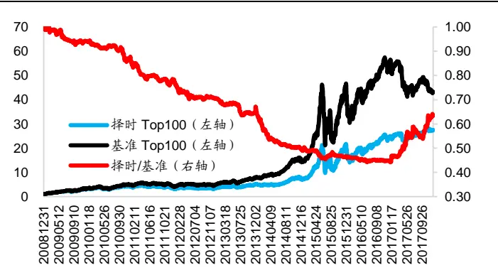
资料来源： ，海通证券研究所

图2 基准与套索因子择时组合净值（2017.1-2017.12）
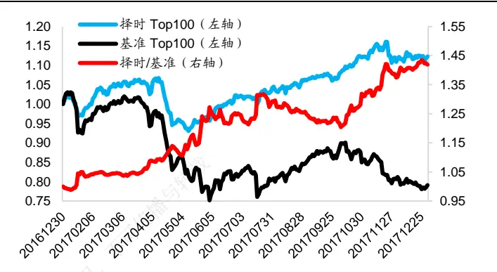
资料来源：Wind，海通证券研究所

在2008年12月31日至2017年12月29日间，因子择时模型年化收益约为44.2%，基准模型年化收益约为 51.7%。在 2016 年 12 月 30 日至 2017 年 12 月 29 日间，因子择时模型收益为 12.3%，基准组合收益为-20.9%。下表对比了两组合在不同年度的收益表现情况。

表 1 套索因子择时 TOP100组合与基准 TOP100组合分年度收益

|  | 择时模型 |  |  |  |  |  | 基准组合 |  |  |  |  |  |
| --- | --- | --- | --- | --- | --- | --- | --- | --- | --- | --- | --- | --- |
| 年度 | 年度 收益 | 最大 回撤 | 收益 回撤比 | 信息 比率 | 持仓 胜率 | 月均 换手 | 年度 收益 | 最大 回撤 | 收益 回撤比 | 信息 比率 | 持仓 胜率 | 月均 换手 |
| 2009 | 217.2% | 20.5% | 10.37 | 5.19 | 91.7% | 76.4% | 237.1% | 20.3% | 11.43 | 5.60 | 91.7% | 62.1% |
| 2010 | 34.6% | 26.4% | 1.31 | 3.46 | 66.7% | 72.4% | 44.4% | 26.7% | 1.66 | 4.41 | 58.3% | 60.4% |
| 2011 | -22.5% | 29.8% | -0.75 | 3.30 | 33.3% | 75.7% | -12.7% | 27.8% | -0.45 | 5.18 | 41.7% | 55.7% |
| 2012 | 10.3% | 19.3% | 0.53 | 2.13 | 58.3% | 72.7% | 21.9% | 17.6% | 1.23 | 3.69 | 66.7% | 64.2% |
| 2013 | 35.1% | 16.6% | 2.15 | 2.18 | 66.7% | 75.1% | 53.5% | 16.1% | 3.37 | 4.54 | 75.0% | 68.6% |
| 2014 | 43.0% | 14.2% | 2.97 | 0.39 | 66.7% | 73.0% | 81.0% | 12.2% | 6.51 | 3.42 | 91.7% | 56.6% |
| 2015 | 201.7% | 54.3% | 3.64 | 4.83 | 66.7% | 69.3% | 218.1% | 54.2% | 3.94 | 4.81 | 75.0% | 58.8% |
| 2016 | 15.0% | 34.0% | 0.44 | 3.98 | 75.0% | 78.3% | 19.6% | 33.5% | 0.58 | 4.48 | 75.0% | 60.0% |
| 2017 | 12.3% | 12.8% | 0.94 | 1.39 | 75.0% | 63.9% | -20.9% | 27.0% | -0.76 | -2.13 | 33.3% | 52.3% |

资料来源：Wind，海通证券研究所

套索回归下的因子择时模型虽然无法在全区间战胜基准组合，但是考虑到因子择时在 2017 年带来的收益增强，因子择时的年化收益牺牲幅度依旧维持在一个可以接受的范围内。虽然择时模型的收益性弱于基准模型，但是其年度收益更加稳定，择时模型年度收益标准差约为 ，而基准模型年度收益标准差约为 。

从收益风险特征上可以将因子择时策略看作是买保险策略，在因子表现稳健时，因子择时会带来额外的成本，从而跑输基准组合，但是在因子波动较大时，因子择时会带来明显的收益补偿。

下表重点对比了两模型在 2017 年的因子权重分配、收益预测模型月度 IC 以及TOP100 组合月度收益情况。（每个月份各个因子权重绝对值之和为 100%，因子权重前面的负号代表了模型对于因子的偏好。例如，择时模型 2017 年 1 月市值因子权重约为4%，则说明模型偏好大市值股票，且给予市值因子约 4%的权重。择时模型 2017 年 2月市值因子权重约为-46%，则说明模型偏好小市值股票，且给予市值因子约 46%的权重。）

表 2 套索因子择时模型与基准模型权重分配以及月度表现

| 模型 | 年月 | 市值 | 中盘 | 流动性 | 反转 | 波动 | 估值 | 盈利 | 盈利成长 | 复合因子 月度IC | TOP100 组合月度 收益 |  |
| --- | --- | --- | --- | --- | --- | --- | --- | --- | --- | --- | --- | --- |
| 因子择时模型 | 201701 | 4.33% | 19.66% | -12.56% | -17.67% | -1.49% | 5.60% | 34.38% | 4.31% | 0.105 | 0.02% |  |
|  | 201702 | -46.29% | 14.84% | -0.88% | -21.48% | -5.17% | -0.74% | 6.65% | 3.95% | 0.076 | 4.95% |  |
|  | 201703 | -0.45% | 8.33% | -32.42% | -19.82% | 6.42% | -10.48% | 16.97% | 5.12% | 0.067 | -1.83% |  |
|  | 201704 | -4.11% | 16.26% | -31.89% | -16.28% | -7.26% | -5.59% | 13.98% | 4.63% | 0.059 | -6.79% |  |
|  | 201705 | 42.70% | 5.41% | -17.43% | 12.08% | 5.65% | -6.12% | 8.53% | 2.08% | 0.225 | 0.81% |  |
|  | 201706 | 10.47% | 11.48% | -15.09% | -7.15% | 38.18% | 1.11% | 13.62% | 2.89% | 0.143 | 5.51% |  |
|  | 201707 | 51.49% | 3.88% | -28.86% | -3.82% | -2.18% | -2.63% | 5.22% | 1.92% | 0.103 | 1.92% |  |
|  | 201708 | 45.39% | 3.37% | -15.01% | -5.68% | 7.89% | -1.29% | 13.11% | 8.26% | -0.030 | 1.92% |  |
|  | 201709 | 12.96% | 12.33% | -31.27% | -0.23% | 14.74% | -15.01% | 8.44% | 5.01% | 0.050 | 0.52% |  |
|  | 201710 | 26.64% | 5.33% | -24.41% | -19.00% | 3.44% | 6.58% | 7.39% | 7.21% | 0.307 | 5.20% |  |
|  | 201711 | 44.65% | 7.81% | -15.58% | -9.47% | 4.10% | 3.73% | 11.59% | 3.07% | 0.254 | -1.24% |  |
|  |  | 201712 | 38.81% | -3.80% | -24.76% | -5.86% | 2.21% | 1.82% | 13.35% | 9.39% | 0.179 | 1.27% |
| 201701 |  | -30.46% | 13.92% | -19.97% | -15.65% | 7.17% | 1.92% | 7.04% | 3.86% | -0.016 | -3.43% |  |
| 201702 |  | -28.24% | 15.39% | -21.50% | -13.41% | 7.75% | -1.46% | 7.49% | 4.76% | 0.083 | 4.32% |  |
| 201703 |  | -25.43% | 14.70% | -22.02% | -15.05% | 7.63% | -3.61% | 7.07% | 4.50% | -0.074 | -3.97% |  |
| 201704 |  | -21.97% | 15.20% | -26.12% | -14.48% | 6.18% | -4.16% | 7.71% | 4.18% | -0.058 | -8.54% |  |
| 201705 |  | -20.38% | 14.76% | -23.78% | -15.17% | 7.98% | -3.84% | 10.08% | 4.02% | -0.025 | -7.99% |  |
| 201706 |  | -15.20% | 17.20% | -25.23% | -14.59% | 7.76% | -5.99% | 9.76% | 4.27% | 0.112 | 4.43% |  |
| 201707 |  | -15.07% | 17.52% | -24.12% | -14.61% | 9.23% | -3.49% | 11.80% | 4.17% | -0.015 | -1.33% |  |
| 201708 |  | -16.72% | 17.39% | -22.50% | -11.28% | 10.63% | -5.53% | 10.80% | 5.15% | 0.159 | 5.39% |  |
| 基准模型 |  | 201709 | -16.21% | 16.20% | -23.49% | -12.33% |  | -4.07% | 5.44% | 0.050 |  | 2.05% |
|  |  | 201710 | -14.15% | 15.97% | -25.99% | -12.36% | 11.77% 10.64% | -5.14% | 10.49% 10.34% | 5.39% | 0.099 | -1.74% |
|  |  | 201711 | -7.27% | 17.26% | -33.60% | -12.49% | 7.08% | -4.63% | 12.53% | 5.15% | 0.099 | -6.23% |
|  |  |  |  |  |  | -11.60% | 5.54% | -7.12% | 14.07% | 5.85% | 0.084 | -2.00% |
|  |  | 201712 | 0.82% | 16.54% | -38.46% |  |  |  |  |  |  |  |

资料来源： ，海通证券研究所

观察上表不难发现，套索回归下的因子择时模型在因子权重配臵上具有极强的灵活性。例如，择时模型能够在 2017 年 1 月将市值因子权重调整为 4%，而在 2017 年 2 月又可将市值因子权重调整为 。从模型复合因子 以及 组合月度收益不难发现，因子择时模型在 2017 年表现优于基准模型。2017 年以来，因子择时模型月度 IC仅在 月为负，在其余月份中都获得了正向 。

## 2.2 弹性网回归法下的因子择时模型

简单来说，弹性网模型（Elastic Net）是对于岭回归和套索回归的综合。岭回归与套索回归事实上是极为相似的收缩估计方法，两者唯一的不同在于岭回归使用了 L2 范数而套索回归使用了 L1 范数。模型的参数估计表达式如下：

$$
\min_{\beta_{0},\beta}(\frac{1}{2N}\sum_{i=1}^{N}(y_{i}-\beta_{0}-x_{i}^{T}\beta)^{2}+\lambda(\alpha\sum_{j=1}^{p}\left|\beta_{j}\right|+(\frac{1-\alpha}{2})\sum_{j=1}^{p}\beta_{j}^{2}))
$$

若投资者对于弹性网模型的相关细节感兴趣，可参考专题报告《基于因子剥离的FOF 择基逻辑系列七——多元因子剥离体系的模型优化之收缩估计》。

下图展示了在 Alpha 为 0.7 的情况下，弹性网择时模型全市场 TOP100 组合与基准模型全市场 TOP100 组合在 2009 年以来以及 2017 年以来的净值表现。本文随后会讨论不同 Alpha 的取值下因子择时模型的表现。

图3 基准与弹性网因子择时组合净值（2009.1-2017.12）
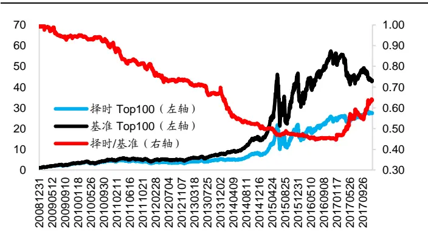
资料来源：Wind，海通证券研究所

图4 基准与弹性网因子择时组合净值（2017.1-2017.12）
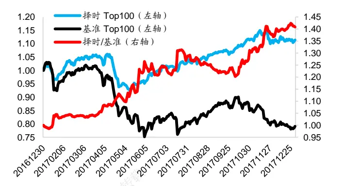
资料来源：Wind，海通证券研究所

在2008年12月31日至2017年12月29日间，因子择时模型年化收益约为44.3%，基准模型年化收益约为 51.7%。在 2016 年 12 月 30 日至 2017 年 12 月 29 日间，因子择时模型收益为 11.4%，基准组合收益为-20.9%。择时模型年度收益标准差约为 86%，基准模型年度收益标准差约为 94%。下表对比了两组合在不同年度的收益表现情况。

表 3 弹性网因子择时 TOP100组合与基准 TOP100组合分年度收益

| 年度 | 择时模型 |  |  |  |  | 基准组合 |  |  |  |  |  |
| --- | --- | --- | --- | --- | --- | --- | --- | --- | --- | --- | --- |
|  | 年度 收益 | 最大 回撤 | 收益 回撤比 | 信息 比率 | 持仓 月均 胜率 换手 |  | 年度 收益 | 最大 回撤 | 收益 回撤比 | 信息 比率 | 持仓 月均 胜率 换手 |
| 2009 | 218.5% | 20.5% | 10.42 | 5.22 | 91.7% | 76.4% | 237.1% 20.3% | 11.43 | 5.60 | 91.7% | 62.1% |
| 2010 | 40.0% | 26.3% | 1.51 | 4.11 | 75.0% | 71.5% | 44.4% 26.7% | 1.66 | 4.41 | 58.3% | 60.4% |
| 2011 | -23.2% | 30.0% | -0.76 | 3.10 | 33.3% | 75.7% | -12.7% 27.8% | -0.45 | 5.18 | 41.7% | 55.7% |
| 2012 | 10.7% | 19.0% | 0.56 | 2.25 | 58.3% | 73.9% | 21.9% 17.6% | 1.23 | 3.69 | 66.7% | 64.2% |
| 2013 | 34.9% | 16.5% | 2.14 | 2.18 | 66.7% | 75.0% | 53.5% | 16.1% 3.37 | 4.54 | 75.0% | 68.6% |
| 2014 | 41.2% | 15.0% | 2.70 | 0.24 | 66.7% | 73.1% | 81.0% | 12.2% 6.51 | 3.42 | 91.7% | 56.6% |
| 2015 | 198.0% | 54.3% | 3.57 | 4.71 | 66.7% | 68.6% | 218.1% | 54.2% 3.94 | 4.81 | 75.0% | 58.8% |
| 2016 | 14.8% | 34.1% | 0.43 | 3.83 | 75.0% | 80.2% | 19.6% | 33.5% 0.58 | 4.48 | 75.0% | 60.0% |
| 2017 | 11.4% | 13.0% | 0.87 | 1.30 | 66.7% | 62.1% | -20.9% | 27.0% -0.76 | -2.13 | 33.3% | 52.3% |

资料来源：Wind，海通证券研究所

从收益特征上看，该模型的表现与套索模型的表现并无十分明显的区别。下表重点对比了两模型在 2016 年以及 2017 年的因子权重分配、收益预测模型月度 IC以及TOP100 组合月度收益情况。

观察下表不难发现，弹性网回归下的因子择时模型同样在因子权重配臵上同样具有极强的灵活性。2017 年以来，因子择时模型月度 IC仅在 8月为负，在其余月份中都获得了正向 IC。

表 4 弹性网因子择时模型与基准模型权重分配以及月度表现

| 模型 | 年月 | 市值 | 中盘 | 流动性 | 反转 | 波动 | 估值 | 盈利 | 盈利成长 | 月度IC | TOP100 组合月度 收益 |
| --- | --- | --- | --- | --- | --- | --- | --- | --- | --- | --- | --- |
| 因子择时模型 | 201701 | 4.11% | 19.43% | -12.85% | -17.84% | -1.44% | 5.58% | 34.40% | 4.35% | 0.105 | -0.43% |
|  | 201702 | -47.32% | 14.69% | -1.18% | -20.48% | -5.14% | -0.75% | 6.52% | 3.92% | 0.075 | 4.90% |
|  | 201703 | -0.46% | 8.65% | -33.30% | -20.58% | 6.72% | -7.19% | 17.78% | 5.33% | 0.069 | -1.90% |
|  | 201704 | -4.65% | 16.05% | -31.75% | -16.22% | -7.23% | -5.56% | 13.93% | 4.62% | 0.056 | -7.04% |
|  | 201705 | 44.12% | 5.15% | -17.12% | 11.90% | 5.39% | -6.02% | 8.28% | 2.02% | 0.224 | 1.03% |
|  | 201706 | 11.19% | 11.32% | -14.98% | -6.57% | 37.81% | 1.72% | 13.55% | 2.86% | 0.142 | 5.69% |
|  | 201707 | 51.55% | 3.88% | -28.75% | -3.82% | -2.15% | -2.69% | 5.23% | 1.92% | 0.104 | 2.05% |
|  | 201708 | 45.01% | 3.48% | -14.92% | -5.66% | 7.90% | -1.26% | 13.44% | 8.32% | -0.029 | 1.92% |
|  | 201709 | 15.77% | 11.67% | -30.84% | -0.23% | 13.89% | -14.62% | 8.10% | 4.88% | 0.050 | 1.06% |
|  | 201710 | 28.20% | 5.74% | -26.14% | -20.04% | 3.47% | 0.62% | 8.13% | 7.65% | 0.290 | 4.48% |
|  | 201711 | 43.68% | 8.01% | -15.86% | -9.63% | 4.29% | 3.75% | 11.64% | 3.13% | 0.254 | -1.28% |
| 基准模型 | 201712 | 36.93% | -3.78% | -25.22% | -6.04% | 2.34% | 1.75% | 14.36% | 9.58% | 0.178 | 1.06% |
|  | 201701 | -30.46% | 13.92% | -19.97% | -15.65% | 7.17% | 1.92% | 7.04% | 3.86% | -0.016 | -3.43% |
|  | 201702 | -28.24% | 15.39% | -21.50% | -13.41% | 7.75% | -1.46% | 7.49% | 4.76% | 0.083 | 4.32% |
|  | 201703 | -25.43% | 14.70% | -22.02% | -15.05% | 7.63% | -3.61% | 7.07% | 4.50% | -0.074 | -3.97% |
|  | 201704 | -21.97% | 15.20% | -26.12% | -14.48% | 6.18% | -4.16% | 7.71% | 4.18% | -0.058 | -8.54% |
|  | 201705 | -20.38% | 14.76% | -23.78% | -15.17% | 7.98% | -3.84% | 10.08% | 4.02% | -0.025 | -7.99% |
|  | 201706 | -15.20% | 17.20% | -25.23% | -14.59% | 7.76% | -5.99% | 9.76% | 4.27% | 0.112 | 4.43% |
|  | 201707 | -15.07% | 17.52% | -24.12% | -14.61% | 9.23% | -3.49% | 11.80% | 4.17% | -0.015 | -1.33% |
|  | 201708 | -16.72% | 17.39% | -22.50% | -11.28% | 10.63% | -5.53% | 10.80% | 5.15% | 0.159 | 5.39% |
|  | 201709 | -16.21% | 16.20% | -23.49% | -12.33% | 11.77% | -4.07% | 10.49% | 5.44% | 0.050 | 2.05% |
|  | 201710 | -14.15% | 15.97% | -25.99% | -12.36% | 10.64% | -5.14% | 10.34% | 5.39% | 0.099 | -1.74% |
| 201711 | -7.27% | 17.26% | -33.60% | -12.49% | 7.08% | -4.63% | 12.53% | 5.15% | 0.099 | -6.23% |  |
| 201712 | 0.82% | 16.54% | -38.46% | -11.60% | 5.54% | -7.12% | 14.07% | 5.85% | 0.084 | -2.00% |  |

资料来源：Wind，海通证券研究所

作为参考，下图展示了不同 Alpha 取值下的弹性网因子择时模型在 2017 年以来的表现。

图5 不同 Alpha取值下弹性网因子择时模型的表现
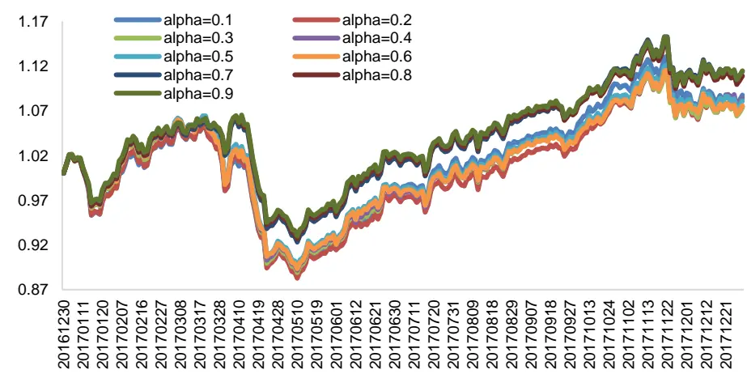
资料来源：Wind，海通证券研究所

不难发现 Alpha 的取值对于因子择时表现同样具有一定程度的影响，所以我们并不建议投资者在没有深入了解该模型的情况下直接使用弹性网进行因子择时。

## 3. 因子择时模型扩展

回归法下的因子择时模型不仅具有易于理解同时易于实现的优点，该模型同样具有极强的扩展性。本部分将重点讨论因子择时模型在不同方面的扩展应用。

## 3.1 衰减加权与因子择时模型的结合

部分投资者在预测因子未来收益时认为近期因子收益表现对于未来因子收益更有指向性，因此在预测因子收益时是基于因子历史收益表现进行衰减加权。对于此种思路，回归法下的因子择时模型同样可以实现。不妨取因子收益历史窗口为过去 48个月，但是对于历史数据进行衰减加权，设定半衰期为 12 月。（此处参数设定并未经过优化处理，仅为演示目的。）

下图展示了衰减加权的套索回归法下的择时模型全市场TOP100组合与衰减加权的基准模型全市场 TOP100 组合在 2011 年以来以及 2017 年以来的净值表现。

图6 基准与衰减套索因子择时组合净值（2011.1-2017.12）
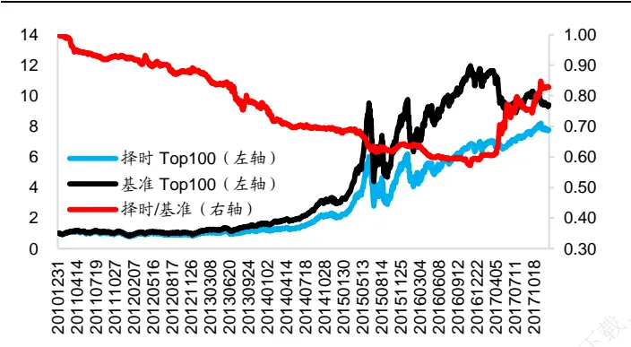
资料来源：Wind，海通证券研究所

图7 基准与衰减套索因子择时组合净值（2017.1-2017.12）
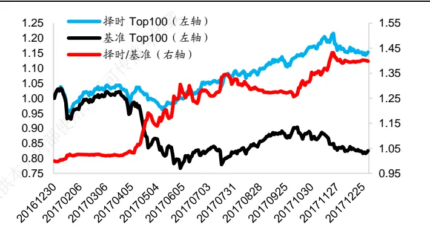
资料来源：Wind，海通证券研究所

在2010年12月31日至2017年12月29日间，因子择时模型年化收益约为33.9%，基准模型年化收益约为 37.5%。在 2016 年 12 月 30 日至 2017 年 12 月 29 日间，因子择时模型收益为 15.4%，基准组合收益为-17.5%。择时模型年度收益标准差约为 71%，基准模型年度收益标准差约为 81%。下表对比了两组合在不同年度的收益表现情况。

表 5 衰减套索因子择时 TOP100组合与基准 TOP100组合分年度收益

| 年度 | 择时模型 |  |  |  |  | 基准组合 |  |  |  |  |  | 月均 |
| --- | --- | --- | --- | --- | --- | --- | --- | --- | --- | --- | --- | --- |
|  | 年度 收益 | 最大 回撤 | 收益 回撤比 | 信息 比率 | 持仓 胜率 |  | 月均 换手 | 年度 最大 收益 回撤 | 收益 回撤比 | 信息 比率 | 持仓 胜率 |  |
| 2011 | -17.7% | 28.3% | -0.62 | 4.34 | 41.7% | 62.0% | -10.9% | 26.8% | -0.40 | 5.45 | 41.7% | 换手 58.1% |
| 2012 | 17.0% | 19.2% | 0.88 | 3.17 | 66.7% | 69.1% | 22.4% | 18.7% | 1.19 | 3.83 | 66.7% | 64.4% |
| 2013 | 29.7% | 17.9% | 1.68 | 1.24 | 66.7% | 69.0% | 50.8% | 16.7% | 3.10 | 4.35 | 66.7% | 65.3% |
| 2014 | 63.8% | 13.3% | 4.70 | 2.08 | 75.0% | 64.4% | 81.6% | 12.2% | 6.54 | 3.44 | 91.7% | 57.1% |
| 2015 | 196.4% | 53.8% | 3.58 | 4.49 | 66.7% | 65.4% | 219.3% | 54.0% | 3.98 | 4.85 | 75.0% | 63.7% |
| 2016 | 11.3% | 33.2% | 0.34 | 3.90 | 66.7% | 73.4% | 19.5% | 33.6% | 0.57 | 4.40 | 75.0% | 58.1% |
| 2017 | 15.4% | 8.3% | 1.82 | 1.55 | 66.7% | 55.1% | -17.5% | 25.8% | -0.67 | -2.01 | 33.3% | 51.8% |

资料来源：Wind，海通证券研究所

下表重点对比了两模型在 2016 年以及 2017 年的因子权重分配、收益预测模型月度IC 以及 TOP100 组合月度收益情况。通过观察不难发现，在因子收益波动较大的时间段中，衰减加权的因子择时模型依旧具有较为灵活的因子权重分配能力，因此同样能够对于衰减加权的基准模型产生进一步的增强。

表 6 衰减套索因子择时模型与基准模型权重分配以及月度表现

| 模型 | 年月 | 市值 | 中盘 | 流动性 | 反转 | 波动 | 估值 | 盈利 | 盈利成长 | 月度IC | TOP100 组合月度 收益 |
| --- | --- | --- | --- | --- | --- | --- | --- | --- | --- | --- | --- |
| 因子择时模型 | 201701 | -22.21% | 3.87% | -25.71% | -7.76% | 4.37% | -13.49% | 19.44% | 3.15% | 0.098 | -0.98% |
|  | 201702 | -25.61% | 17.32% | -26.79% | -7.08% | 6.13% | -5.04% | 7.37% | -4.67% | 0.062 | 4.11% |
|  | 201703 | -13.83% | 14.56% | -49.45% | -5.73% | 1.46% | -10.05% | 2.62% | 2.31% | 0.004 | -4.24% |
|  | 201704 | 29.83% | 8.05% | -20.81% | -2.36% | 1.56% | -25.71% | 9.05% | 2.63% | 0.235 | 0.86% |
|  | 201705 | 32.66% | 9.73% | -24.75% | -5.67% | 2.69% | -14.88% | 6.15% | 3.47% | 0.204 | 0.38% |
|  | 201706 | 13.17% | 14.75% | -27.05% | 11.56% | 5.41% | -13.39% | 5.61% | 9.06% | 0.010 | 5.32% |
|  | 201707 | 33.67% | 8.28% | -27.29% | -6.03% | -3.24% | -10.15% | 6.89% | 4.45% | 0.113 | 3.45% |
|  | 201708 | 50.51% | 7.14% | -20.09% | -1.12% | 3.37% | -11.65% | 1.21% | 4.91% | -0.061 | 0.85% |
|  | 201709 | -10.62% | 9.12% | -26.16% | -11.29% | 8.39% | -14.43% | 16.07% | 3.92% | 0.046 | 2.12% |
|  | 201710 | 18.55% | 16.44% | -24.83% | -9.04% | 5.67% | -13.53% | 6.65% | 5.30% | 0.230 | 4.53% |
|  | 201711 | 47.76% | 4.40% | -17.22% | -7.89% | 2.83% | -4.58% | 11.14% | 4.18% | 0.271 | -0.81% |
|  | 201712 | 12.40% | 9.91% | -32.53% | -8.52% | 5.39% | -11.95% | 10.50% | 8.81% | 0.119 | -0.77% |
| 基准模型 | 201701 | -29.22% | 16.38% | -22.89% | -12.18% | 7.06% | -2.84% | 5.67% | 3.76% | 0.017 | -3.27% |
|  | 201702 | -25.07% | 16.19% | -24.41% | -12.10% | 6.12% | -5.48% | 6.29% | 4.34% | 0.080 | 4.40% |
|  | 201703 | -23.06% | 15.21% | -24.53% | -12.78% | 6.23% | -7.35% | 6.22% | 4.61% | -0.064 | -4.33% |
|  | 201704 | -19.63% | 14.89% | -28.68% | -11.44% | 5.58% | -7.83% | 7.63% | 4.32% | -0.032 | -8.09% |
|  | 201705 | -15.91% | 15.38% | -28.50% | -10.16% | 6.84% | -8.36% | 10.13% | 4.70% | 0.021 | -7.05% |
|  | 201706 | -11.72% | 17.85% | -31.34% | -8.64% | 6.75% | -9.19% | 9.99% | 4.51% | 0.084 | 4.13% |
|  | 201707 | -9.89% | 17.52% | -28.54% | -12.86% | 7.91% | -7.18% | 11.52% | 4.58% | 0.020 | -0.72% |
|  | 201708 | -7.62% | 15.68% | -29.91% | -8.78% | 9.52% | -10.54% | 11.66% | 6.29% | 0.117 | 4.38% |
|  | 201709 | -8.37% | 14.75% | -27.88% | -13.34% | 10.34% | -8.42% | 10.31% | 6.59% | 0.052 | 1.83% |
|  | 201710 | -7.48% | 14.01% | -30.52% | -13.67% | 10.39% | -6.91% | 10.81% | 6.21% | 0.138 | -1.05% |
| 201711 |  | -2.54% | 15.98% | -34.96% | -14.77% | 8.37% | -3.26% 13.76% | 6.36% | 0.125 | -5.29% |  |
| 201712 |  | 3.47% | 14.12% | -37.83% | -12.00% | 6.10% | -4.40% 14.99% | 7.09% | 0.097 | -1.73% |  |

资料来源：Wind，海通证券研究所

## 3.2 风险控制与因子择时模型的结合

虽然因子择时模型能够增强收益预测模型的灵活性，但是多因子模型在落实到组合上时需要与风控模型进行结合。本节分别基于套索因子择时模型以及基准模型构建收益预测模型，并结合相同的风控措施构建沪深 300 增强组合。

下图展示了基于因子择时模型的沪深300增强组合以及基于基准模型的沪深300增强组合的历史表现。

图8 基准与套索因子择时增强组合净值（2009.1-2017.12）
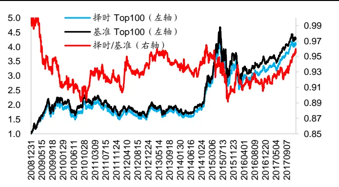
资料来源：Wind，海通证券研究所

图9 基准与套索因子择时增强组合净值（2017.1-2017.12）
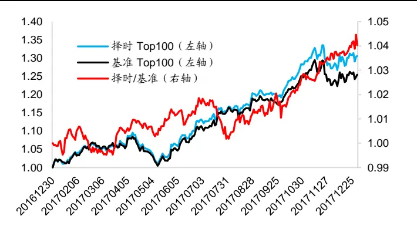
资料来源：Wind，海通证券研究所

在 2008 年 12 月 31 日至 2017 年 12 月 29 日间，因子择时增强组合年化收益约为16.9%，基准增强组合年化收益约为 17.5%。在 2016 年 12 月 30 日至 2017 年 12 月 29日间，因子择时增强收益为 30.6%，基准增强组合收益为 25.5%。择时组合年度收益标准差为 39%，基准组合年度收益标准差为 44%。下表对比了两组合在不同年度的收益表现情况。需要注意的是，指数增强组合的收益风险特征会随着风控措施的不同而产生变化。

表 7 套索因子择时增强组合与基准增强组合分年度表现

|  | 择时模型 |  |  |  |  |  | 基准组合 |  |  |  |  |  |
| --- | --- | --- | --- | --- | --- | --- | --- | --- | --- | --- | --- | --- |
| 年度 | 年度 收益 | 超额 收益 | 最大 回撤 | 信息 比率 | 持仓 胜率 | 月均 换手 | 年度 收益 | 超额 收益 | 最大 回撤 | 信息 比率 | 持仓 胜率 | 月均 换手 |
| 2009 | 105.6% | 4.2% | 23.5% | 0.97 | 91.7% | 79.4% | 125.1% | 14.3% | 23.3% | 2.76 | 91.7% | 69.8% |
| 2010 | -5.4% | 8.2% | 27.7% | 2.02 | 50.0% | 74.7% | -6.0% | 7.5% | 27.7% | 2.03 | 58.3% | 68.0% |
| 2011 | -21.3% | 5.0% | 30.3% | 1.41 | 33.3% | 70.5% | -21.3% | 5.1% | 29.9% | 1.46 | 25.0% | 62.2% |
| 2012 | 16.9% | 8.7% | 19.5% | 2.53 | 50.0% | 69.9% | 14.9% | 6.8% | 19.8% | 1.88 | 50.0% | 66.0% |
| 2013 | -1.7% | 6.2% | 20.8% | 1.57 | 50.0% | 64.1% | -2.2% | 5.6% | 21.1% | 1.48 | 50.0% | 68.2% |
| 2014 | 57.1% | 3.7% | 11.4% | 0.84 | 58.3% | 66.4% | 54.3% | 1.7% | 11.1% | 0.43 | 58.3% | 67.7% |
| 2015 | 23.8% | 18.8% | 42.2% | 2.34 | 58.3% | 79.4% | 27.1% | 21.7% | 40.1% | 2.74 | 58.3% | 76.9% |
| 2016 | -7.9% | 4.3% | 26.1% | 0.99 | 50.0% | 67.1% | -6.6% | 5.7% | 24.9% | 1.62 | 50.0% | 65.7% |
| 2017 | 30.6% | 7.2% | 8.0% | 1.92 | 83.3% | 69.3% | 25.5% | 3.1% | 7.4% | 0.88 | 83.3% | 67.5% |

资料来源：Wind，海通证券研究所

## 3.3 因子择时模型与风格概率模型

由于每个因子都可被看作为一种风格，因子择时模型得到的因子收益预测实际上可以协助进行风格轮动。然而传统的因子收益预测值，如 或者回归 ，都较为抽象，对于因子选股较为陌生的投资者无法直接使用。对于这一问题，回归法下的因子择时模型经过小幅调整可以进一步扩展为风格概率模型，从而更加直观地协助投资者进行风格轮动。

通过使用 Logistic 回归，投资者能够使用因子择时模型得到下一个月因子 IC为正、因子回归 BETA为正或者因子多空收益为正的概率。相比于 IC预测值，概率预测更加直观，更容易应用到风格轮动策略上。模型回归形式如下：

$$
log\cfrac{P_{t}}{1-P_{t}}=\alpha+C_{1,t}X_{1,t}+C_{2,t}X_{2,t}+\cdots+C_{N,t}X_{N,t}+\varepsilon_{\mathrm{t}}
$$

以大小盘风格为例，投资者可使用市值因子 TOP BOTTOM 10%多空收益构建Logisitc 回归模型，若当月大市值股票跑赢小市值股票，则因变量记为 1，否则记为 0。下图展示了小市值组合相对于大市值组合的相对强弱以及每个月的大盘概率预测值。

基于风格概率预测，投资者可构建相关风格轮动策略。例如，在大盘概率高于 K1时做多大盘风格，在大盘概率低于 K2 时，做多小盘风格，而在大盘概率预测介于 K1与 K2 之间时均衡配臵。

由于上述策略中参数较多，我们会在后续专题报告对于风格概率在风格轮动上的应用进行更加详细的讨论。

图10 大小盘风格概率预测
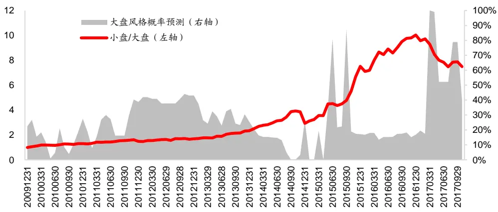
资料来源：Wind，海通证券研究所

## 4. 总结

本文在前期报告《选股因子系列研究(三十)——因子择时模型改进与择时指标库构载建》的基础之上，对于因子择时模型中的变量筛选这一问题进行了讨论。由于可在回归与的视角下构建因子择时模型，投资者可以借助回归中自变量筛选方法进行因子择时变量的筛选以及因子收益的预测。此外，模型还可以进一步扩展为风格概率模型，从而协助可进行风格轮动。

总而言之，回归法下的因子择时模型易于理解同时具有极强的扩展性，并且实现起内来较为方便。投资者可以此模型为起点，构建出适合于自身需求的因子择时模型。我们也会在后续研究中基于该模型对于因子择时这一问题，进行更加深入的研究。供

## 5. 风险提示

市场系统性风险、资产流动性风险以及政策变动风险会对策略表现产生较大影响。-0

# 信息披露

分析师声明

[Table冯佳睿yst 金融工程研究团队s]

袁林青金融工程研究团队

本人具有中国证券业协会授予的证券投资咨询执业资格，以勤勉的职业态度，独立、客观地出具本报告。本报告所采用的数据和信息均来自市场公开信息，本人不保证该等信息的准确性或完整性。分析逻辑基于作者的职业理解，清晰准确地反映了作者的研究观点，结论不受任何第三方的授意或影响，特此声明。

## 法律声明

本报告仅供海通证券股份有限公司（以下简称“本公司”）的客户使用。本公司不会因接收人收到本报告而视其为客户。在任何情况下，本报告中的信息或所表述的意见并不构成对任何人的投资建议。在任何情况下，本公司不对任何人因使用本报告中的任何内容所引致的任何损失负任何责任。

本报告所载的资料、意见及推测仅反映本公司于发布本报告当日的判断，本报告所指的证券或投资标的的价格、价值及投资收入可能播会波动。在不同时期，本公司可发出与本报告所载资料、意见及推测不一致的报告。可

市场有风险，投资需谨慎。本报告所载的信息、材料及结论只提供特定客户作参考，不构成投资建议，也没有考虑到个别客户特殊的用，投资目标、财务状况或需要。客户应考虑本报告中的任何意见或建议是否符合其特定状况。在法律许可的情况下，海通证券及其所属部关联机构可能会持有报告中提到的公司所发行的证券并进行交易，还可能为这些公司提供投资银行服务或其他服务。

本报告仅向特定客户传送，未经海通证券研究所书面授权，本研究报告的任何部分均不得以任何方式制作任何形式的拷贝、复印件或供复制品，或再次分发给任何其他人，或以任何侵犯本公司版权的其他方式使用。所有本报告中使用的商标、服务标记及标记均为本公司的商标、服务标记及标记。如欲引用或转载本文内容，务必联络海通证券研究所并获得许可，并需注明出处为海通证券研究所，且下不得对本文进行有悖原意的引用和删改。

根据中国证监会核发的经营证券业务许可，海通证券股份有限公司的经营范围包括证券投资咨询业务。24

## 海通证券股份有限公司研究所[Table_PeopleInfo]

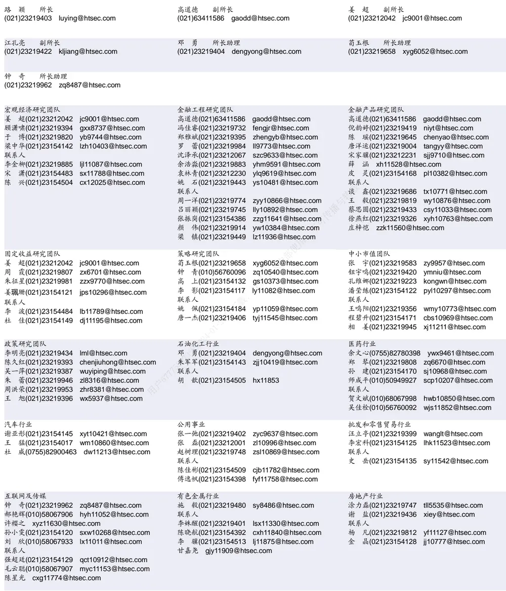

| 电子行业 |  | 煤炭行业 |  | 电力设备及新能源行业 |  |
| --- | --- | --- | --- | --- | --- |
| 陈 平(021)23219646 联系人 谢 磊(021)23212214 xl10881@htsec.com 张天闻 ztw11086@htsec.com | cp9808@htsec.com | 吴杰(021)23154113 戴元灿(021)23154146 李 淼(010)58067998 | wj10521@htsec.com dyc10422@htsec.com Im10779@htsec.com | 张一弛(021)23219402 房 青(021)23219692 曾 彪(021)23154148 | zyc9637@htsec.com fangq@htsec.com zb10242@htsec.com |
| 尹 苓(021)23154119 yl11569@htsec.com 石 坚(010)58067942 sj11855@htsec.com |  |  |  |  |  |
| 基础化工行业 刘 威(0755)82764281 Iw10053@htsec.com 刘海荣(021)23154130 Ihr10342@htsec.com |  | 计算机行业 郑宏达(021)23219392 zhd10834@htsec.com | 鲁 立（021）23154138 II11383@htsec.com | 通信行业 朱劲松(010)50949926 余伟民(010)50949926 | zjs10213@htsec.com ywm11574@htsec.com |
| 张翠翠 zcc11726@htsec.com 联系人 |  | 黄竞晶(021)23154131 杨 林(021)23154174 联系人 | hjj10361@htsec.com yl11036@htsec.com | 联系人 庄 宇(010)50949926 zy11202@htsec.com 张峥青 zzq11650@htsec.com |  |
| 李 智(021)23219392 | lz11785@htsec.com | 洪 琳(021)23154137 | hl11570@htsec.com |  |  |
| 非银行金融行业 孙 婷(010)50949926 | st9998@htsec.com | 交通运输行业 虞 楠(021)23219382 | yun@htsec.com | 纺织服装行业 梁 希(021)23219407 lx11040@htsec.com |  |
| 何 婷(021)23219634 联系人 | ht10515@htsec.com | 张 杨(021)23219442 | zy9937@htsec.com | 联系人 |  |
| 夏昌盛(010)56760090 | xcs10800@htsec.com | 联系人 李 丹(021)23154401 | Id11766@htsec.com | 马 榕(021)23219431 mr11128@htsec.com |  |
| 李芳洲(021)23154127 | Ifz11585@htsec.com |  |  |  |  |
| 建筑建材行业 |  | 机械行业 |  | 钢铁行业 |  |
| 邱友锋(021)23219415 |  |  |  |  |  |
| 冯晨阳(021)23212081 | qyf9878@htsec.com | 余炜超(021)23219816 耿 耘(021)23219814 | swc11480@htsec.com gy10234@htsec.com | 刘彦奇(021)23219391 liuyq@htsec.com 联系人 |  |
| 钱佳佳(021)23212081 | fcy10886@htsec.com qjj10044@htsec.com | 杨 震(021)23154124 | yz10334@htsec.com | 周慧琳(021)23154399 zhl11756@htsec.com |  |
|  |  | 沈伟杰(021)23219963 | swj11496@htsec.com | 刘 璇 lx11212@htsec.com |  |
| 建筑工程行业 |  | 农林牧渔行业 |  | 食品饮料行业 whw9587@htsec.com |  |
| 杜市伟 dsw11227@htsec.com |  |  |  |  |  |
| 毕春晖(021)23154114 bch10483@htsec.com |  | 丁 频(021)23219405 陈雪丽(021)23219164 | dingpin@htsec.com cxl9730@htsec.com | 闻宏伟(010)58067941 成珊(021)23212207 |  |
|  |  | 陈 阳(010)50949923 联系人 | cy10867@htsec.com | 唐 宇(021)23219389 | cs9703@htsec.com ty11049@htsec.com |
|  |  | 关慧(021)23219448 | gh10375@htsec.com |  |  |
| 军工行业 |  | 夏 越(021)23212041 | xy11043@htsec.com |  |  |
| 张恒晅 zhx10170@hstec.com |  | 银行行业 林媛媛(0755)23962186 lyy9184@htsec.com |  | 社会服务行业 汪立亭(021)23219399 | wanglt@htsec.com |
| 徐志国(010)50949921 xzg9608@htsec.com 蒋 俊(021)23154170 jj11200@htsec.com |  | 联系人 谭敏沂 |  | 李铁生(010)58067934 联系人 | Its10224@htsec.com |
| 刘 磊(010)50949922 II11322@htsec.com |  |  | tmy10908@htsec.com | 陈扬扬(021)23219671 |  |
| 联系人 |  |  |  | 顾熹闽(021)23154388 | cyy10636@htsec.com |
| 张宇轩 zyx11631@htsec.com |  |  |  |  | gxm11214@htsec.com |
| 家电行业 |  | 造纸轻工行业 |  |  |  |
| 陈子仪(021)23219244 chenzy@htsec.com |  | 用户 |  |  |  |
|  |  |  | 衣桢永 yzy12003@htsec.com |  |  |
| 联系人 |  |  |  |  |  |
|  |  |  | 曾 知(021)23219810 zz9612@htsec.com |  |  |
| 李阳 ly11194@htsec.com |  |  |  |  |  |
|  |  |  | 赵 洋(021)23154126 zy10340@htsec.com |  |  |
| 朱默辰 zmc11316@htsec.com |  |  |  |  |  |
| 刘璐 II11838@htsec.com |  |  |  |  |  |

## 研究所销售团队

| 深广地区销售团队 蔡铁清(0755)82775962 ctq5979@htsec.com 伏财勇(0755)23607963 | fcy7498@htsec.com 朱 健(021)23219592 | 上海地区销售团队 胡雪梅(021)23219385 huxm@htsec.com | 北京地区销售团队 殷怡琦(010)58067988 yyq9989@htsec.com 吴尹 wy11291@htsec.com |
| --- | --- | --- | --- |
| 辜丽娟(0755)83253022 gulj@htsec.com 刘晶晶(0755)83255933 liujj4900@htsec.com 王雅清(0755)83254133 wyq10541@htsec.com 饶 伟(0755)82775282 rw10588@htsec.com 欧阳梦楚(0755)23617160 oymc11039@htsec.com |  | zhuj@htsec.com 季唯佳(021)23219384 jiwj@htsec.com 黄 毓(021)23219410 huangyu@htsec.com 漆冠男(021)23219281 qgn10768@htsec.com 胡宇欣(021)23154192 hyx10493@htsec.com 黄 诚(021)23219397 hc10482@htsec.com 毛文英(021)23219373 mwy10474@htsec.com | 陆铂锡 Ibx11184@htsec.com 张丽萱(010)58067931 zlx11191@htsec.com 陈铮茹 czr11538@htsec.com 杨羽莎(010)58067977 yys10962@htsec.com 杜 飞df12021@htsec.com |
| 宗 亮 zl11886@htsec.com 巩柏含 gbh11537@htsec.com |  | 马晓男 mxn11376@htsec.com 杨祎昕(021)23212268 yyx10310@htsec.com 方烨晨(021)23154220 fyc10312@htsec.com 张思宇 zsy11797@htsec.com 慈晓聪(021)23219989 cxc11643@htsec.com 王朝领 wcl11854@htsec.com |  |

海通证券股份有限公司研究所

电话：（021）23219000

传真：（021）23219392

网址：www.htsec.com

地址：上海市黄浦区广东路 689号海通证券大厦 9楼