## 相关研究

[Table_ReportInfo]《选股因子系列研究(十七)——选股因子的正交》2017.01.19

《选股因子系列研究（三十）——因子择时模型改进与择时指标库构建》

## 2017.12.24

《选股因子系列研究（三十一）——因子择时指标的筛选》2018.01.04

分析师:冯佳睿

Tel:(021)23219732

Email:fengjr@htsec.com

证书:S0850512080006

分析师:袁林青

Tel:(021)23212230

Email:ylq9619@htsec.com

证书:S0850516050003

# 选股因子系列研究（三十二）——因子择时在风险控制模型中的应用

自 年以来，我们撰写了一系列报告对于因子择时模型的构建进行了讨论。现有的因子择时模型多通过修正因子的收益预期来影响多因子加权权重，最终通过影响股票综合打分或者收益预期来实现因子择时。简单来说，该类模型通过收益预测模型实现因子择时。然而，收益预测模型是因子择时的唯一实现途径吗？答案是否定的。

本文构建了一整套动态风险控制框架，旨在通过风险控制模型来实现因子择时。本文第一章阐述了模型整体构建思路。本文第二章详细介绍了动态风险控制框架的构建。本文第三章分别基于沪深 300 指数以及中证 500 指数构建了风险控制组合并对于组合的具体表现情况进行了展示。

- 因子择时既可通过收益预测模型实现，也可通过风险控制模型实现。对于一个风险控制组合，因子择时在风险模型中的应用可通过调整因子敞口的上限、下限来实现。

因子敞口上限以及下限由因子风险、因子收益预期以及投资者风险厌恶度共同决定。

- 可通过限定因子最大损失反向设定因子敞口。在因子收益固定的情况下，因子敞口的多少决定了该因子对于组合的超额收益贡献的大小，但也决定了因子对于组合风险的贡献。我们可通过限定因子可能对于组合产生的负向收益贡献来反向设定因子敞口的上限以及下限。

- 相比于直接设定因子敞口上限与下限，因子最大损失更为直观并且该指标同样具有较好的特性。随着投资者在各因子上所能承受的最大损失的提升，组合的收益空间以及风险空间也会出现单调性的改变。

因子收益预期以及投资者风险厌恶度共同决定了因子最大损失。因子收益预期越高，投资者所能承受的损失就越高，因子收益预期越低，投资者所能承受的损失就越小。除了因子收益预期外，投资者的风险厌恶程度也决定了因子最大损失。

- 沪深 300 风控组合以及中证 500 风控组合回测效果较为稳健。在不同的投资者风险厌恶度下，可分别基于沪深 指数以及中证 指数构建保守组合、稳健组合以及激进组合。在投资者风险厌恶度高于一定阈值后，模型表现较为稳健。

- 风险提示。市场系统性风险、资产流动性风险以及政策变动风险会对策略表现产生较大影响。

自 2017 年以来，我们撰写了一系列报告对于因子择时模型的构建进行了讨论。现有的因子择时模型多通过修正因子的收益预期来影响多因子加权权重，最终通过影响股票综合打分或者收益预期来实现因子择时。简单来说，该类模型通过收益预测模型实现因子择时。然而，收益预测模型是因子择时的唯一实现途径吗？答案是否定的。

本文构建了一整套动态风险控制框架，旨在通过风险控制模型来实现因子择时。本文第一章阐述了模型整体构建思路。本文第二章详细介绍了动态风险控制框架的构建。本文第三章分别基于沪深300指数以及中证500指数构建了风险控制组合并对于组合的具体表现情况进行了展示。

## 1. 因子择时的实现

现有的因子择时模型多通过收益预测模型来实现因子择时。在系列前期报告《选股因子系列研究(二十)——基于条件期望的因子择时框架》、《选股因子系列研究（三十）——因子择时模型改进与择时指标库构建》以及《选股因子系列研究（三十一）——因子择时指标的筛选》中，我们皆通过修正因子的收益预测（回归法）或者 IC预测（IC法）来影响因子加权时的权重，从而影响最终的股票收益预期（回归法）或者股票综合打分（IC 法）。

然而部分投资者认为通过收益预测模型来实现因子择时过于激进，对于模型带来的风险过高。那么因子择时是否只能通过收益预测模型来实现呢？答案是否定的。我们认为，因子择时不仅能通过收益预测模型来实现，同样能够通过风险控制模型来实现。

简单的说，对于一个风险控制组合，因子择时可通过调整组合在各因子上的敞口的上限以及下限来实现。让我们通过一个较为简单的例子来说明这一结论。投资者往往通过组合优化的方法基于某一基准指数来构建风险控制组合。以下展示了一个简单的组合优化问题：

$$
\begin{aligned}&s.t\quad\underset{w}{max}w*r\\s.t\quad&w*f-f_{b}\geq f_{lb}\\&w*f-f_{b}\leq f_{ub}\\&w*1=1\\&w\geq w_{lb}\\&w\leq w_{ub}\\\end{aligned}
$$

其中，w为股票在组合中的权重向量，r为股票收益预期向量，f 为股票在各因子上的敞口矩阵， $f_{b}$ 为基准组合在各因子上的敞口向量， $\mathsf{f}_{\mathsf{ub}}$ 为因子相对于基准的敞口的上限向量，$f_{\mathrm{lb}}$ 为因子相对于基准的敞口的下限向量， $\mathsf{w}_{\mathsf{ub}}$ 为股票权重上限向量， $\mathsf{w}_{\mathsf{lb}}$ 为股票权重下限向量。（需要说明的是，在实际的组合构建中，组合优化的目标函数可能更为复杂，优化限制条件可能更多。此处为了方便说明，将优化目标设定为最大化组合收益预期，风控控制手段仅有敞口限制。）

在多因子模型中，股票收益预期又可进一步表达为下式，

$$
r=\beta*f
$$

其中， $\beta$ 为因子收益预期向量，f 为股票在各因子上的敞口矩阵。

由于投资者在构建组合时已知因子值 f，因此因子收益预期 $\beta$ 最终决定了股票收益预期 $\mathsf{r}_{\circ}$ 。基于这一结论，我们在系列前期的报告中通过修正因子收益预期 $\beta$ 来影响股票收益预期 并最终影响组合优化的结果。（详细内容请参考专题报告《选股因子系列研究（三十）——因子择时模型改进与择时指标库构建》以及专题报告《选股因子系列研究

## （三十一）——因子择时指标的筛选》）

类比上述思路，我们同样可通过动态调整因子敞口的上限以及下限来实现因子择时。一个较为简单的思路是：若投资者对于某因子有较高的收益预期，则提升该因子的敞口上限或者下限，从而在最终组合中加大对于该因子的敞口；反之，则降低该因子的敞口上或者下限，从而在最终组合中减小对于该因子的敞口。

我们认为投资者在动态调整因子敞口上、下限时需要综合考虑以下三方面的因素：

1） 因子风险。不同的因子，由于其稳定性不同，会对于组合产生不同的影响。例如，1单位的市值因子的敞口与 1单位的盈利因子的敞口对于组合产生的风险会有很大的不同。因此，投资者在对于不同的因子设定敞口上、下限的时候需要考虑该因子本身的风险特征。

2） 因子收益预期。在动态设定敞口时，模型需要体现投资者对于因子的收益预期。在因子风险同等的前提下，高收益预期的因子敞口上、下限绝对值理应更高。

） 投资者风险厌恶。除了因子本身的风险以及因子的收益预期外，因子敞口的设定还与投资者的风险厌恶程度相关。即使对于同样的因子收益预期有着同样的收益预判，风险厌恶度较高的投资者所设定的因子敞口上限、下限会更低。

总的来看，因子择时在风险控制模型中的应用可通过动态调整因子敞口上限、下限来实现。在动态调整因子敞口上限、下限时，需要综合考虑因子风险、因子收益预期以

## 2. 因子择时在风险控制模型中的应用

本章将在前一章的基础上逐步构建一套动态因子敞口的风险控制模型。

## 2.1 因子敞口与风险

在回归法的视角下，因子当期的收益以及组合相对于基准在因子上的敞口共同决定了组合的超额收益。详细推导可见下式，

$$
\begin{aligned}r_{p,t}-r_{b,t}&=\sum_{i=1}^{N}w_{i,t}\big(r_{i,t}-r_{b,t}\big)=\sum_{i=1}^{N}w_{i,t}\sum_{k=1}^{K}\beta_{k,t}\big(f_{t,k}^i-f_{t,k}^b\big)\\&=\sum_{k=1}^{K}\beta_{k,t}\sum_{i=1}^{N}w_{i,t}\big(f_{t,k}^i-f_{t,k}^b\big)\\&=\sum_{k=1}^{K}\beta_{k,t}\big(f_{t,k}^p-f_{t,k}^b\big)\\\end{aligned}
$$

其中， $\mathsf{r_{p,t}}$ 为组合在 t至 t+1 之间的收益， $\mathsf{r}_{\mathsf{b},\mathsf{t}}$ 为基准组合在 t至 t+1 之间的收益， $\mathsf{w_{i,t}}$ 为股票 i在组合中的权重， $\beta_{\mathrm{k,t}}$ 为因子 k 在 t至 t+1 之间的收益， $\dot{\mathsf{f}}_{\mathsf{t},\mathsf{k}}^{\mathsf{i}}$ 为股票 i在 t时刻对于因子 k 的敞口， $\mathbf{f}_{t,k}^{b}$ 为基准组合在 t时刻对于因子 k 的敞口。

上式中的 $\beta_{\mathrm{k,t}}$ 为回归法下因子的收益，回归模型见下式，

$$
r_{i,t}=\alpha+\beta_{1,t}f_{t,1}^{i}+\beta_{2,t}f_{t,2}^{i}+\cdots+\beta_{K,t}f_{t,K}^{i}+\varepsilon
$$

根据上述推导，我们不难发现，在因子收益固定的情况下，因子敞口的多少决定了该因子对于组合的超额收益贡献的大小，但也决定了因子对于组合风险的贡献。例如，某期因子 K的收益为 100bps，而当期组合相对于基准在该因子上的敞口为 0.5，则该因子在当期为组合贡献了 50bps 的超额收益。若组合相对于基准在该因子上的敞口为-0.5，那么该因子在当期为组合贡献了-50bps 的超额收益。基于这一观察，我们可通过限定因子可能对于组合产生的负向收益贡献来反向设定因子敞口的上限以及下限。

## 2.2 因子最大损失与因子敞口

在设定敞口上限时，投资者需要考虑因子收益为负时所带来的风险，而在设定敞口下限时，投资者则需要考虑因子收益为正时所带来的风险。一种较为简单的衡量因子收益为正/负时带来的风险的方法是计算因子的平均正收益以及平均负收益（当然，投资者可在实际应用时使用其他方法度量风险，如，VaR 等）。因子敞口上、下限的计算公式如下：

$$
因子敞口上限=-\frac{因子最大损失}{平均负收益}
$$

$$
因子敞口下限=-\frac{因子最大损失}{平均正收益}
$$

例如，假定投资者在某一期在因子 K上可承受的最大损失为 100bps（本报告会在后文中讨论如何确定因子的最大损失），因子平均正收益为 200bps，平均负收益为-100bps。那么因子的敞口上限为 1，敞口下限为-0.5。

相比于直接设定因子敞口上限与下限，因子最大损失更为直观并且该指标同样具有较好的特性。随着各因子上的最大损失值的提升，组合最终的收益空间与风险空间也会逐渐提升。下图分别展示了不同因子单月最大损失值下的沪深 300 以及中证 500 多因子风控组合的超额收益以及超额回撤情况。

图1 不同最大损失值下的沪深 300指数风控组合表现
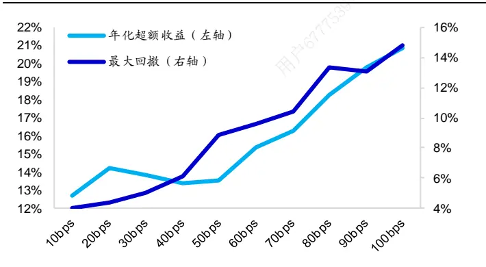
资料来源： ，海通证券研究所

图2 不同最大损失值下的中证 500指数风控组合表现
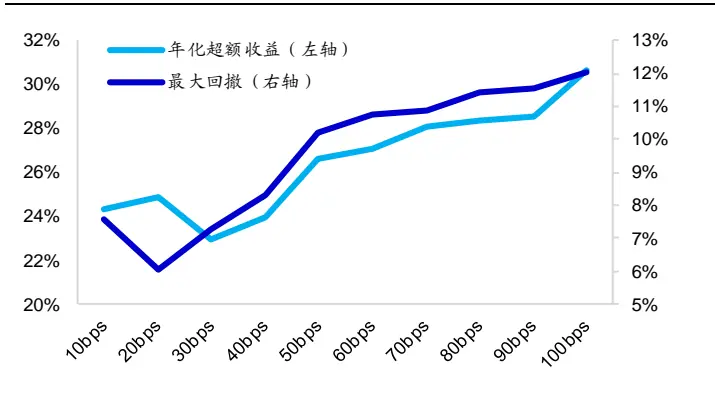
资料来源： ，海通证券研究所

观察上图不难发现，随着投资者可承受的因子单月最大损失的提升，组合的收益以及回撤也会出现相应的提升。那么什么决定了因子最大损失呢？

## 2.3 因子最大损失的确定

投资者对于因子的收益预测以及风险厌恶程度共同决定了投资者在各因子上能够接受的最大损失。因子收益预期越高，投资者所能承受的损失就越高，因子收益预期越低，所能承受的损失也就越小。除了因子收益预测外，投资者的风险厌恶程度也决定了因子最大损失。即使两投资者对于因子的收益预测完全相同，风险厌恶程度更高的投资者能承受的因子最大损失也会更小。

简单来说，因子最大损失可表述为下式：

$$
因子最大损失=\frac{abs(因子收益预期)}{投资者风险厌恶度}
$$

当然，投资者可根据自身的需求对于上述公式进行个性化的修正。那么如何理解投资者风险厌恶度呢？投资者可从盈亏比的角度来理解，该指标可简单理解为投资者每承担 1%的风险所要求获得的回报。例如，投资者风险厌恶度为 8，则代表投资者每承担1%的风险所要求获得的回报为 8%。

## 2.4 模型整体架构

基于上述讨论，因子敞口的上限以及下限的计算方法如下式所示：

$$
因子敞口上限=-\frac{abs(因子收益预期)}{平均负收益*投资者风险厌恶度}
$$

$$
因子敞口下限=-\frac{abs(因子收益预期)}{平均正收益*投资者风险厌恶度}
$$

上述计算方法基本能够体现模型建立前所设定的因子风险、因子收益预期以及投资者风险偏好，这三个重要因素。在上述表达式的基础之上，我们可进行小幅修正使其更加符合实际应用。在因子收益预期为正时，可将因子敞口下限设定为 0，反之，在因子收益预期为负时，可将因子敞口上限设定为 0。

在因子收益预期为正时，

$$
因子敞口上限=-\frac{因子收益预期}{平均负收益*投资者风险厌恶度}
$$

因子敞口下限= 0

在因子收益预期为负时，

因子敞口上限= 0

$$
因子敞口下限=\frac{因子收益预期}{平均正收益*投资者风险厌恶度}
$$

从整体架构上看，模型需要投资者分别在收益预测模型中以及风险控制模型中对于因子未来收益进行预测。虽然两处都需要因子收益预测，但是因子收益的预测方法不一定需要一致。投资者可以根据自身需求进行个性化的选择。（本文会在下一章的回测中对于不同组合下的模型表现进行回测。）

下表举例说明了因子敞口上、下限的设定。在 2017 年年末，可使用因子择时模型对于未来一个月的因子收益进行预测。不妨假定模型中只有市值、估值、盈利以及盈利成长 个因子，投资者风险厌恶度为 。投资者可基于前文给出的计算公式分别计算各因子敞口的上限以及下限。

表 1 因子敞口上限、下限的设定

| 因子名称 | 收益预期 (bp) | 因子最大损 失(bp) | 平均负收益 (bp) | 平均正收益 (bp) | 因子敞口 上限 | 因子敞口 下限 |
| --- | --- | --- | --- | --- | --- | --- |
| 市值 | 101 | 17 | -179 | 161 | 0.09 | 0 |
| 估值 | -99 | 17 | -69 | 71 | 0 | -0.23 |
| 盈利 | 56 | 9 | -17 | 45 | 0.53 | 0 |
| 盈利增长 | 20 | 3 | -16 | 31 | 0.21 | 0 |

资料来源：Wind，海通证券研究所

观察上表不难发现，模型不会仅仅因为因子收益预期较高就给出较高的敞口上限或者下限，模型会综合因子的收益预期以及因子的风险来确定敞口限制。例如，对于收益预期较高的市值因子，由于其平均负收益过高，模型仅给其设定了 的敞口上限。对于稳定性较强的盈利因子，由于其平均负收益较低，模型最终给其设定了 的敞口上限。

## 3. 模型回测

本章将分别基于沪深300指数以及中证500指数构建风险控制组合并测试组合在不同的风险厌恶度以及不同因子收益预测方法下的表现情况。模型整体设定如下：

1）回测时间：2013 年 1 月至 2018 年 1 月；

2）组合换仓频率：月度换仓；

3）因子构成：市值、中盘、换手、非流动性、反转、均价偏离、波动、估值、盈利以及盈利成长；

4）因子处理：逐步正交化处理（详细处理方法请参考专题报告《选股因子系列研究(十七)——选股因子的正交》）；

5）风险控制手段：行业中性、成分股权重偏离以及因子敞口限制；

6）组合优化目标：最大化组合收益预期。

除了上述常规参数外，在进行组合构建时，模型还需要投资者在收益模型以及风险模型中对于因子未来收益进行预测。简单来说，现有的因子收益预测方法可以被分为以下两种：

1） 内生法。该方法通过使用因子本身的历史收益表现情况对于未来一期的收益进行预测，常用的方法有：长期均值法、衰减加权法。内生法的最大优势在于其稳定性，因子收益预测在短期之间不会出现过多的变化。

） 外生法。该方法通过使用外生变量预测因子未来收益。（相关模型构建思路以及具体回测结果可参考《选股因子系列研究（三十）——因子择时模型改进与择时指标库构建》以及《选股因子系列研究（三十一）——因子择时指标的筛选》）该方法的最大优势在于其灵活性，在因子收益剧烈波动时，模型能够较为灵活地调整因子的收益预测。

由于存在上述两种因子收益预测方法，投资者在收益模型以及风控模型中进行因子收益预测时会面临着多种选择。本章将回测以下三种不同的组合方式。

） 保守模型：收益预测模型使用内生法，风险控制模型同样使用内生法。该模型较为保守，在收益预测模型以及风险控制模型中皆使用较为稳定的内生法预测因子未来收益。

2） 稳健模型：收益预测模型使用内生法，风险控制模型使用外生法。该模型相对于保守模型具有更好的灵活性，通过在风险控制模型中使用外生法预测因子收益来为模型提供一定的灵活性。

3） 激进模型：收益预测模型使用外生法，风险控制模型同样使用外生法。该模型较为激进，在收益预测模型以及风险控制模型中皆使用外生法预测因子收益，模型最终表现极度取决于外生法的预测效果。

## 3.1 沪深 300指数风险控制组合

下表展示了不同模型在不同风险厌恶度下的年化超额收益表现。

表 2 不同风险厌恶度下的沪深 300指数风险控制组合年化超额收益

| 投资者风险厌恶度 | 模型类型 |  |  |
| --- | --- | --- | --- |
|  | 保守模型 | 稳健模型 | 激进模型 |
| 1.0 | 16.1% | 14.3% | 9.1% |
| 2.0 | 14.2% | 14.6% | 9.3% |
| 3.0 | 13.1% | 15.1% | 10.6% |
| 4.0 | 13.5% | 13.2% | 11.0% |
| 5.0 | 11.3% | 13.2% | 11.9% |
| 6.0 | 11.2% | 13.7% | 13.0% |
| 7.0 | 12.0% | 13.6% | 13.0% |
| 8.0 | 11.3% | 12.8% | 11.3% |

资料来源：Wind，海通证券研究所

对于保守模型以及稳健模型，随着投资者风险厌恶度的上升，组合超额收益逐渐回落。在投资者极度厌恶风险的情况下（风险厌恶度为 8），组合的超额年化回落至 11%左右。对于激进模型，在风险厌恶度较低的情况下，组合年化超额收益远低于保守模型以及稳健模型。

下表展示了不同模型在不同风险厌恶度下相对于基准的最大回撤情况。

表 3 不同风险厌恶度下的沪深 300指数风险控制组合相对最大回撤

| 投资者风险厌恶度 |  | 模型类型 稳健模型 激进模型 |
| --- | --- | --- |
| 日 1.0 | 保守模型 19.2% | 17.7% 18.0% |
| 2.0 | 7.0% | 5.1% 7.2% |
| 3.0 | 4.9% | 4.4% 5.2% |
| 4.0 | 4.1% | 5.0% 5.0% |
| 5.0 | 4.1% | 4.4% 4.0% |
| 6.0 | 3.3% | 3.1% 3.2% |
| 7.0 | 4.0% | 2.9% 3.3% |
| 8.0 | 3.6% | 3.5% 3.9% |

资料来源：Wind，海通证券研究所

可以看到，在风险厌恶度较低时，各组合的最大回撤都未得到有效控制。随着风险厌恶度的提升，组合的相对回撤逐渐减小。在风险厌恶度高于 6后，组合的相对最大回撤很难进一步产生边际改善。

下表展示了不同模型在不同风险厌恶度下的收益回撤比以及信息比率情况。

表 4 不同风险厌恶度下的沪深 300指数风险控制组合收益回撤比

| 投资者风险厌恶度 |  | 模型类型 稳健模型 | 激进模型 |
| --- | --- | --- | --- |
| 1.0 | 保守模型 0.84 | 0.81 | 0.51 |
| 2.0 | 2.04 | 2.87 | 1.29 |
| 3.0 | 2.70 | 3.41 | 2.03 |
| 4.0 | 3.26 | 2.67 | 2.21 |
| 5.0 | 2.77 | 3.04 | 2.98 |
| 6.0 | 3.38 | 4.42 | 4.08 |
| 7.0 | 3.03 | 4.64 | 4.00 |
| 8.0 | 3.09 | 3.66 | 2.88 |

资料来源：Wind，海通证券研究所

表 5 不同风险厌恶度下的沪深 300指数风险控制组合信息比率

| 投资者风险厌恶度 | 模型类型 |  |  |
| --- | --- | --- | --- |
|  | 保守模型 | 稳健模型 | 激进模型 |
| 1.0 | 1.99 | 1.74 | 1.14 |
| 2.0 | 2.44 | 2.42 | 1.53 |
| 3.0 | 2.46 | 2.75 | 1.97 |
| 4.0 | 2.68 | 2.57 | 2.17 |
| 5.0 | 2.39 | 2.72 | 2.45 |
| 6.0 | 2.50 | 2.88 | 2.79 |
| 7.0 | 2.65 | 2.92 | 2.88 |
| 8.0 | 2.47 | 2.77 | 2.47 |

资料来源：Wind，海通证券研究所

从收益回撤比以及信息比率来看，稳健模型相对于保守模型以及激进模型有着更好的表现。此外，在风险厌恶度超过 6后，模型整体表现较为稳定。

## 3.2 中证 500指数风险控制组合

下表展示了不同模型在不同风险厌恶度下的年化超额收益表现。

表 6 不同风险厌恶度下的中证 500指数风险控制组合年化超额收益

| 投资者风险厌恶度 | 模型类型 | 激进模型 |
| --- | --- | --- |
| 1.0 | 保守模型 稳健模型 27.5% 25.6% | 18.1% |
| 2.0 | 25.6% 23.3% | 19.5% |
| 3.0 | 24.2% 24.5% | 22.1% |
| 4.0 | 24.0% 23.4% | 25.8% |
| 5.0 | 23.5% 24.7% | 22.8% |
| 6.0 | 24.1% 25.0% | 23.7% |
| 7.0 | 24.4% 24.2% | 22.7% |
| 8.0 | 23.8% 22.8% | 23.2% |

资料来源：Wind，海通证券研究所

对于保守模型以及稳健模型，随着投资者风险厌恶度的上升，组合超额收益逐渐回落。在投资者极度厌恶风险的情况下（风险厌恶度为 8），组合的超额年化回落至 23%左右。对于激进模型，在风险厌恶度较低的情况下，组合年化超额收益远低于保守模型以及稳健模型。

下表展示了不同模型在不同风险厌恶度下的相对于基准的最大回撤情况。

表 7 不同风险厌恶度下的中证 500指数风险控制组合相对最大回撤

| 投资者风险厌恶度 | 模型类型 |  |  |
| --- | --- | --- | --- |
|  | 保守模型 | 稳健模型 | 激进模型 |
| 1.0 | 14.9% | 13.2% | 21.6% |
| 2.0 | 7.1% | 7.9% | 9.3% |
| 3.0 | 7.1% | 6.4% | 6.7% |
| 4.0 | 6.8% | 7.6% | 4.7% |
| 5.0 | 6.3% | 7.1% | 6.7% |
| 6.0 | 6.8% | 7.4% | 6.0% |
| 7.0 | 6.9% | 7.7% | 7.8% |
| 8.0 | 6.8% | 8.0% | 7.4% |

资料来源：Wind，海通证券研究所

可以看到，在风险厌恶度较低的情况下，各组合的最大回撤都未得到有效控制。随着风险厌恶度的提升，组合的相对回撤逐渐减小。在风险厌恶度高于 4后，组合的最大回撤很难进一步产生边际改善。

下表展示了不同模型在不同风险厌恶度下的的收益回撤比以及信息比率情况。

表 8 不同风险厌恶度下的中证 500指数风险控制组合收益回撤比

| 投资者风险厌恶度 | 模型类型 保守模型 稳健模型 | 激进模型 |
| --- | --- | --- |
| 1.0 | 1.84 | 1.94 0.84 |
| 2.0 | 3.61 | 2.96 2.09 |
| 3.0 | 3.38 | 3.81 3.27 |
| 4.0 | 3.52 | 3.08 5.47 |
| 5.0 | 3.71 | 3.50 3.40 |
| 6.0 | 3.55 | 3.36 3.95 |
| 7.0 | 3.53 | 3.14 2.90 |
| 8.0 | 3.53 | 2.85 3.13 |

资料来源：Wind，海通证券研究所

表 9 不同风险厌恶度下的中证 500指数风险控制组合信息比率

| 投资者风险厌恶度 | 保守模型 | 模型类型 稳健模型 | 激进模型 |
| --- | --- | --- | --- |
| 1.0 | 2.86 | 2.65 | 1.85 |
| 2.0 | 2.95 | 2.81 | 2.28 |
| 3.0 | 2.82 | 2.86 | 2.60 |
| 4.0 | 2.80 | 2.73 | 2.99 |
| 5.0 | 2.69 | 2.87 | 2.68 |
| 6.0 | 2.73 | 2.87 | 2.75 |
| 7.0 | 2.74 | 2.76 | 2.62 |
| 8.0 | 2.71 | 2.61 | 2.66 |

资料来源：Wind，海通证券研究所

## 3.3 案例展示：稳健模型——中证 500 风险控制组合

不妨选取投资者风险厌恶度为 3 时，稳健模型下的中证 500 风控组合，从时间序列的角度进一步分析稳健模型的特征。下表展示了组合的分年度表现情况。

表 10 稳健模型-中证 500风险控制组合分年度表现

| 区间 | 绝对收益 | 超额收益 | 相对最大回撤 | 收益回撤比 | 信息比率 |
| --- | --- | --- | --- | --- | --- |
| 2013 | 35.6% | 15.3% | 3.0% | 5.19 | 2.22 |
| 2014 | 70.5% | 22.5% | 4.9% | 4.53 | 3.17 |
| 2015 | 103.4% | 44.2% | 6.4% | 6.76 | 3.06 |
| 2016 | 7.6% | 31.4% | 3.2% | 9.77 | 4.47 |
| 2017 | 10.1% | 10.0% | 5.3% | 1.87 | 1.62 |
| 2018.01 | 3.4% | 4.4% | 0.9% | 66.29 | 7.78 |
| 全区间 | 40.8% | 24.5% | 6.4% | 3.81 | 2.86 |

资料来源：Wind，海通证券研究所

组合在回测区间的年化超额收益约为 25%，考虑双边千三的交易成本后，年化超额收益约为 21%，组合最大相对回撤 6.4%，收益回撤比为 3.81，信息比率 2.86。下图展示了风控组合相对于基准指数的相对强弱走势以及回撤情况。

图3 中证 500风控组合相对强弱指数走势以及相对回撤情况
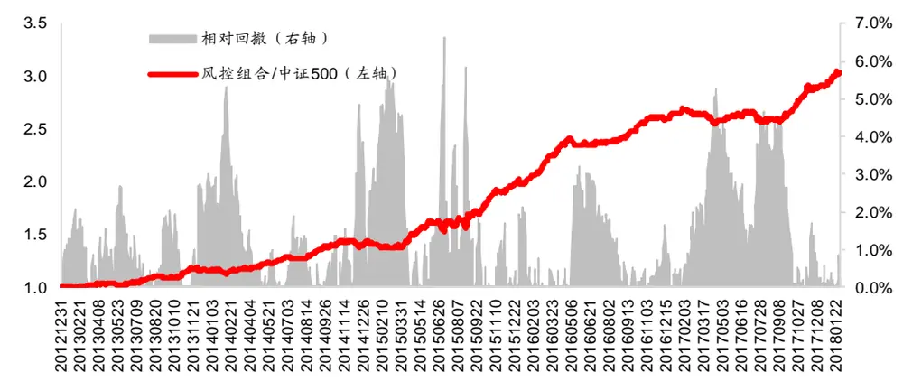
资料来源：Wind，海通证券研究所

为了能够进一步观察因子择时在风险控制中的应用，可观察模型对于不同类型因子的敞口限定以及组合最终在该因子上的实际敞口。下图分别展示了模型对于波动较高的市值以及估值因子的敞口限制以及较为稳定的盈利以及盈利成长因子的敞口限制。

图4 中证 500风控组合市值因子敞口限制与实际敞口
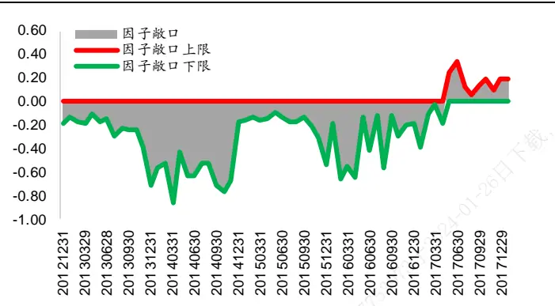
资料来源：Wind，海通证券研究所

图5 中证 500风控组合估值因子敞口限制与实际敞口
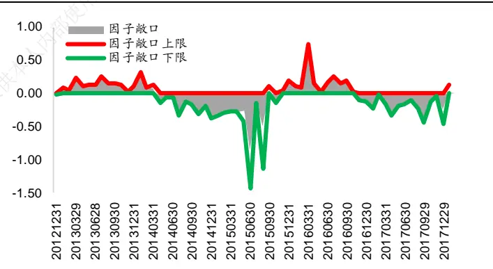
资料来源：Wind，海通证券研究所

图6 中证 500风控组合盈利因子敞口限制与实际敞口
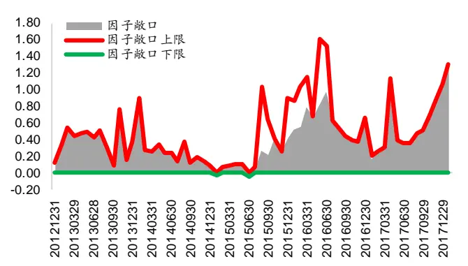
资料来源：Wind，海通证券研究所

图7 中证 500风控组合盈利增长因子敞口限制与实际敞口
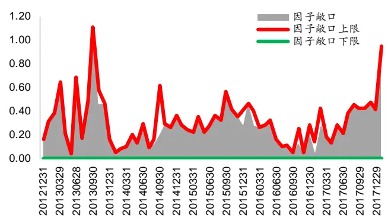
资料来源：Wind，海通证券研究所

观察上图不难发现，对于风险较高的市值因子以及估值因子，模型给予的敞口较低。在 2017 年以来，市值因子的敞口基本上被限制在了-0.2 至 0.2 之间。而对于表现相对较为稳定的盈利以及盈利增长因子，即使该类因子收益性没有市值以及估值因子强，但是其稳定性使得模型对于此类因子敞口较高。 年以来因子敞口上下限持续提升并远高于市值因子以及估值因子的敞口上下限。

## 3.4 案例展示：激进模型——沪深 300 风险控制组合

不妨选取投资者风险厌恶度为 6 时，激进模型下的沪深 300 风控组合，从时间序列的角度进一步分析激进模型的特征。下表展示了组合的分年度表现情况。

表 11 激进模型-沪深 300风险控制组合分年度表现

| 区间 | 绝对收益 | 超额收益 | 相对最大回撤 | 收益回撤比 | 信息比率 |
| --- | --- | --- | --- | --- | --- |
| 2013 | 3.1% | 11.4% | 2.0% | 5.79 | 2.89 |
| 2014 | 77.6% | 17.1% | 1.3% | 13.15 | 4.30 |
| 2015 | 22.5% | 17.6% | 3.1% | 5.62 | 2.34 |
| 2016 | -0.2% | 12.9% | 1.9% | 6.59 | 3.24 |
| 2017 | 33.8% | 9.9% | 2.2% | 4.43 | 2.91 |
| 2018.01 | 7.2% | 1.1% | 0.9% | 12.79 | 3.31 |
| 全区间 | 25.6% | 13.7% | 3.1% | 4.42 | 2.88 |

资料来源： ，海通证券研究所

组合在回测区间的年化超额收益约为 14%，考虑双边千三的交易成本后，年化超额收益为 11%，组合最大相对回撤 3.1%，收益回撤比 4.42，信息比率 2.88。下图展示了风控组合相对于基准指数的相对强弱走势以及回撤情况。

图8 沪深 300风控组合相对强弱指数走势以及相对回撤情况
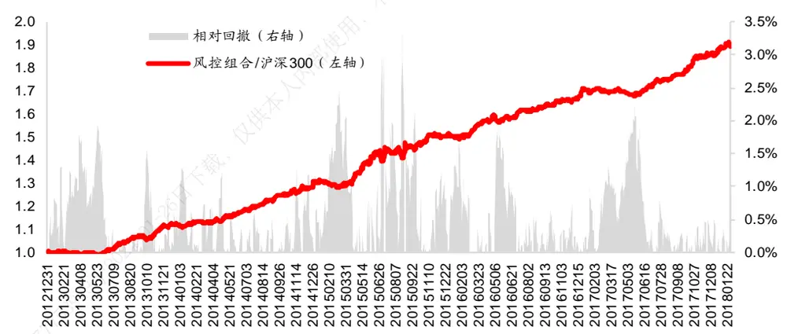
资料来源：Wind，海通证券研究所

为了能够进一步观察因子择时在风险控制中的应用，可观察模型对于不同类型因子的敞口限定以及组合最终在该因子上的实际敞口。下图分别展示了模型对于波动较高的市值以及估值因子的敞口限制以及对于较为稳定的盈利以及盈利成长因子的敞口限制。

图9 沪深 300风控组合市值因子敞口限制与实际敞口
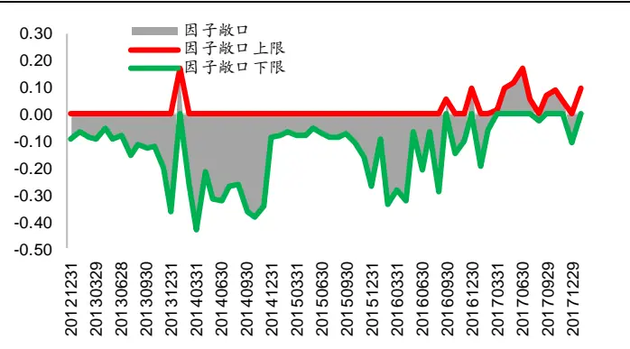
资料来源：Wind，海通证券研究所

图10 沪深 300风控组合估值因子敞口限制与实际敞口
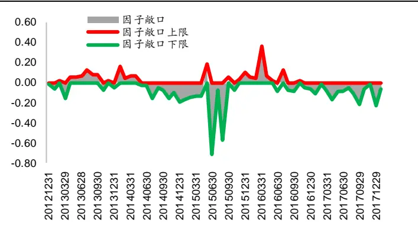
资料来源：Wind，海通证券研究所

图11 沪深 300风控组合盈利因子敞口限制与实际敞口
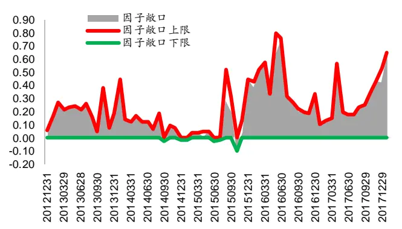
资料来源：Wind，海通证券研究所

图12 沪深 300风控组合盈利增长因子敞口限制与实际敞口
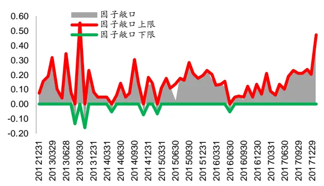
资料来源：Wind，海通证券研究所

观察上图不难发现，对于风险较高的市值因子以及估值因子，模型同样给予了较低的敞口。在 年以来，市值因子的敞口基本上被限制在了 至 之间。而对于表现相对较为稳定的盈利以及盈利增长因子，即使该类因子收益性没有市值以及估值因子强，但是其稳定性使得模型对于此类因子敞口较高。2017 年以来因子敞口上限以及下限持续提升并远高于市值因子以及估值因子的敞口上限以及下限。

## 4. 结论

现有的因子择时研究多通过收益预测模型实现因子择时，而该种方法给模型带来的风险较高，同时也会带来较高的换手。因此本报告尝试从风险控制模型的角度探讨因子择时的可能。总的来说，因子择时在收益预测模型中的应用可通过调整因子收益预测来实现，而在风险控制模型中，因子择时可通过动态调整因子敞口限制来实现。

基于上述思路，本报告综合考虑了因子风险、因子收益预期以及投资者风险厌恶三种因素，构建了一整套动态调整因子敞口的方法。该模型在沪深 300 指数风控组合以及中证 500 指数风控组合上都有较好的表现。

本报告虽然初步构建了动态风控模型，但是该模型依旧存在需要进一步改进的地方，如因子收益的预测方法、因子风险的度量方法等。海通量化团队会在后续的报告中对于上述问题进行讨论。

## 5. 风险提示

市场系统性风险、资产流动性风险以及政策变动风险会对策略表现产生较大影响。

# 信息披露

分析师声明

[Table冯佳睿yst 金融工程研究团队s]

袁林青金融工程研究团队

本人具有中国证券业协会授予的证券投资咨询执业资格，以勤勉的职业态度，独立、客观地出具本报告。本报告所采用的数据和信息均来自市场公开信息，本人不保证该等信息的准确性或完整性。分析逻辑基于作者的职业理解，清晰准确地反映了作者的研究观点，结论不受任何第三方的授意或影响，特此声明。

## 法律声明

本报告仅供海通证券股份有限公司（以下简称“本公司”）的客户使用。本公司不会因接收人收到本报告而视其为客户。在任何情况下，本报告中的信息或所表述的意见并不构成对任何人的投资建议。在任何情况下，本公司不对任何人因使用本报告中的任何内容所引致的任何损失负任何责任。

本报告所载的资料、意见及推测仅反映本公司于发布本报告当日的判断，本报告所指的证券或投资标的的价格、价值及投资收入可能播会波动。在不同时期，本公司可发出与本报告所载资料、意见及推测不一致的报告。可

市场有风险，投资需谨慎。本报告所载的信息、材料及结论只提供特定客户作参考，不构成投资建议，也没有考虑到个别客户特殊的用，投资目标、财务状况或需要。客户应考虑本报告中的任何意见或建议是否符合其特定状况。在法律许可的情况下，海通证券及其所属部关联机构可能会持有报告中提到的公司所发行的证券并进行交易，还可能为这些公司提供投资银行服务或其他服务。

本报告仅向特定客户传送，未经海通证券研究所书面授权，本研究报告的任何部分均不得以任何方式制作任何形式的拷贝、复印件或供复制品，或再次分发给任何其他人，或以任何侵犯本公司版权的其他方式使用。所有本报告中使用的商标、服务标记及标记均为本公司的商标、服务标记及标记。如欲引用或转载本文内容，务必联络海通证券研究所并获得许可，并需注明出处为海通证券研究所，且下不得对本文进行有悖原意的引用和删改。

根据中国证监会核发的经营证券业务许可，海通证券股份有限公司的经营范围包括证券投资咨询业务。24

## 海通证券股份有限公司研究所[Table_PeopleInfo]

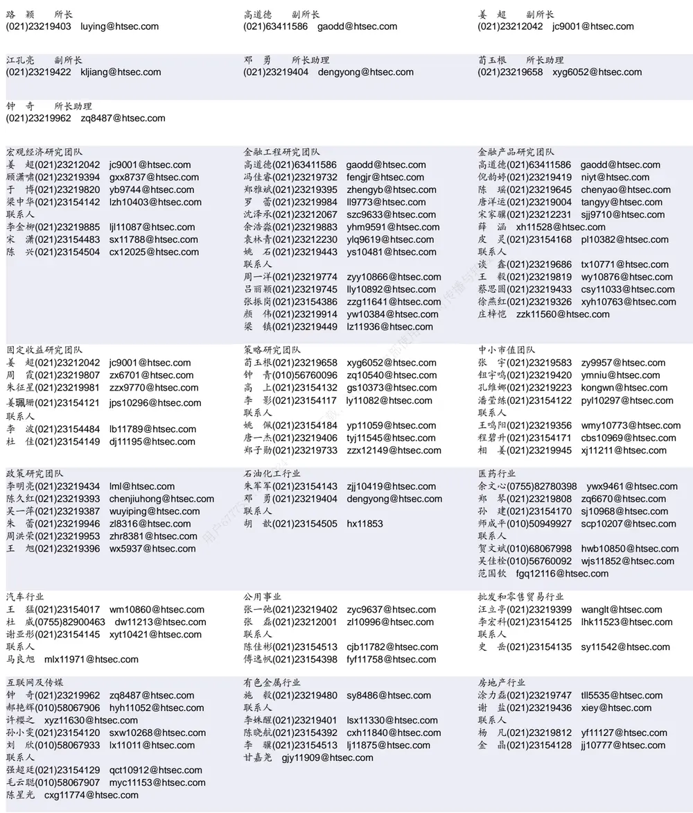

| 电子行业 |  | 煤炭行业 |  | 电力设备及新能源行业 |  |
| --- | --- | --- | --- | --- | --- |
|  | 陈 平(021)23219646 cp9808@htsec.com |  | 吴 杰(021)23154113 wj10521@htsec.com |  | 张一弛(021)23219402 zyc9637@htsec.com |
| 联系人 |  |  | 戴元灿(021)23154146 dyc10422@htsec.com |  | 房 青(021)23219692 fangq@htsec.com |
|  | 谢 磊(021)23212214 xl10881@htsec.com |  | 李 淼(010)58067998 Im10779@htsec.com |  | 曾 彪(021)23154148 zb10242@htsec.com |
| 尹 | 苓(021)23154119 yl11569@htsec.com |  |  |  | 徐柏乔(021)32319171 xbq6583@htsec.com |
| 石 | 坚(010)58067942 sj11855@htsec.com |  |  |  | 张向伟(021)23154141 zxw10402@htsec.com |

| 基础化工行业 | 计算机行业 | 通信行业 |  |
| --- | --- | --- | --- |
| 刘 威(0755)82764281 Iw10053@htsec.com 刘海荣(021)23154130 Ihr10342@htsec.com | 郑宏达(021)23219392 zhd10834@htsec.com |  | 朱劲松(010)50949926 zjs10213@htsec.com 余伟民(010)50949926 ywm11574@htsec.com |
| 张翠翠 zcc11726@htsec.com | 鲁 立（021）23154138 I11383@htsec.com 黄竞晶(021)23154131 hjj10361@htsec.com | 联系人 |  |
| 孙维容 swr12178@htsec.com | 杨 林(021)23154174 yl11036@htsec.com |  | 庄 宇(010)50949926 zy11202@htsec.com |
| 联系人 |  | 张峥青 zzq11650@htsec.com |  |
| 李 智(021)23219392 lz11785@htsec.com | 联系人 洪 琳(021)23154137 hl11570@htsec.com |  |  |

| 非银行金融行业 |  | 交通运输行业 | 纺织服装行业 |
| --- | --- | --- | --- |
|  | 何 婷(021)23219634 ht10515@htsec.com | 虞 楠(021)23219382 yun@htsec.com | 梁 希(021)23219407 lx11040@htsec.com |
|  | 孙 婷(010)50949926 st9998@htsec.com | 联系人 | 联系人 |
| 联系人 |  | 李 丹(021)23154401 Id11766@htsec.com | 盛 开 sk11787@htsec.com |

| 建筑建材行业 | 机械行业 |  | 钢铁行业 |  |
| --- | --- | --- | --- | --- |
| 钱佳佳(021)23212081 qjj10044@htsec.com | 余炜超(021)23219816 swc11480@htsec.com |  | 刘彦奇(021)23219391 liuyq@htsec.com |  |
| 冯晨阳(021)23212081 fcy10886@htsec.com |  | 耿 耘(021)23219814 gy10234@htsec.com | 联系人 |  |
|  | 杨 震(021)23154124 yz10334@htsec.com |  |  | 周慧琳(021)23154399 zhl11756@htsec.com |
|  | 沈伟杰(021)23219963 swj11496@htsec.com |  | 刘 璇 lx11212@htsec.com |  |

| 建筑工程行业 |  | 农林牧渔行业 可 | 食品饮料行业 |
| --- | --- | --- | --- |
| 杜市伟 dsw11227@htsec.com |  | 丁 频(021)23219405 dingpin@htsec.com | 闻宏伟(010)58067941 whw9587@htsec.com |
| 张欣劼 zxj12156@htsec.com |  | 陈雪丽(021)23219164 cxl9730@htsec.com | 成 珊(021)23212207 cs9703@htsec.com |
|  | 联系人 | 陈阳(010)50949923 cy10867@htsec.com | 唐 宇(021)23219389 ty11049@htsec.com |
|  |  | 夏 越(021)23212041 xy11043@htsec.com |  |

| 军工行业 | 银行行业 |  | 社会服务行业 |
| --- | --- | --- | --- |
| 张恒晅 zhx10170@hstec.com | 孙 婷(010)50949926 st9998@htsec.com |  | 汪立亭(021)23219399 wanglt@htsec.com |
| 蒋 俊(021)23154170 jj11200@htsec.com |  | 林媛媛(0755)23962186 lyy9184@htsec.com | 李铁生(010)58067934 Its10224@htsec.com 联系人 |
| 刘 磊(010)50949922 II11322@htsec.com 联系人 | 联系人 谭敏沂 | tmy10908@htsec.com | 陈扬扬(021)23219671 cyy10636@htsec.com |
| 张宇轩 zyx11631@htsec.com | 0 |  | 顾熹闽(021)23154388 gxm11214@htsec.com |

| 家电行业 陈子仪(021)23219244 chenzy@htsec.com | 造纸轻工行业 |
| --- | --- |
|  | 衣桢永 yzy12003@htsec.com |
| 联系人 | 曾 知(021)23219810 zz9612@htsec.com |
| 李 阳 ly11194@htsec.com | 赵 洋(021)23154126 zy10340@htsec.com |
| 朱默辰(021)23154383 zmc11316@htsec.com | 用户67775 |

## 研究所销售团队

蔡铁清(0755)82775962 ctq5979@htsec.com

伏财勇(0755)23607963 fcy7498@htsec.com

辜丽娟(0755)83253022 gulj@htsec.com

刘晶晶(0755)83255933 liujj4900@htsec.com

王雅清(0755)83254133 wyq10541@htsec.com

饶 伟(0755)82775282 rw10588@htsec.com

欧阳梦楚(0755)23617160

oymc11039@htsec.com

宗 亮 zl11886@htsec.com

巩柏含 gbh11537@htsec.com

上海地区销售团队
胡雪梅(021)23219385 huxm@htsec.com
朱 健(021)23219592 zhuj@htsec.com
季唯佳(021)23219384 jiwj@htsec.com
黄 毓(021)23219410 huangyu@htsec.com
漆冠男(021)23219281 qgn10768@htsec.com
胡宇欣(021)23154192 hyx10493@htsec.com
黄 诚(021)23219397 hc10482@htsec.com
毛文英(021)23219373 mwy10474@htsec.com
马晓男 mxn11376@htsec.com
杨祎昕(021)23212268 yyx10310@htsec.com
方烨晨(021)23154220 fyc10312@htsec.com
张思宇 zsy11797@htsec.com
慈晓聪(021)23219989 cxc11643@htsec.com
王朝领 wcl11854@htsec.com
北京地区销售团队
殷怡琦(010)58067988 yyq9989@htsec.com
吴 尹 wy11291@htsec.com
陆铂锡 lbx11184@htsec.com
张丽萱(010)58067931 zlx11191@htsec.com
陈铮茹 czr11538@htsec.com
杨羽莎(010)58067977 yys10962@htsec.com
杜 飞 df12021@htsec.com
张 杨(021)23219442 zy9937@htsec.com

海通证券股份有限公司研究所

地址：上海市黄浦区广东路 689号海通证券大厦 9楼

电话：（021）23219000

传真：（021）23219392

网址：www.htsec.com