## 相关研究

[Table_ReportInfo]《基于因子剥离的 择基逻辑系列十——基金市场择时与风格择时能力探究（上）》2018.05.13

《机构调研事件的超额收益》2018.05.09《行业轮动系列研究 ——高频数据在行业轮动中的应用》2018.04.25

分析师:冯佳睿

Tel:(021)23219732

Email:fengjr@htsec.com

证书:S0850512080006

分析师:罗蕾

Tel:(021)23219984

Email:ll9773@htsec.com

证书:S0850516080002

# 选股因子系列研究（三十三）——预期调整类因子的收益特征

## 投资要点：

- 本文主要对预期调整类因子（即预期指标变动因子）进行研究，考察预期稳定性对调整类因子的影响，并基于此构建时间序列标准化后的预期调整因子。

预期调整因子与股票次月收益呈现显著正相关性，其选股效果与观察期密切相关。随着观察期增加，因子 呈现先增加后减小的态势。观察期短，盈利不变股票占比很大，因子 RankIC 相对较低；观察期增加，预期不变股票占比迅速下降，覆盖率增加，使得因子 增加；观察期继续增加时，覆盖率增大的优势逐渐减弱，而信息的及时性大打折扣，拖累因子表现。

- 采用预期稳定性分组，可增强预期调整类因子的选股效果。预期稳定性，即预期指标过去一段时间的波动率，对预期调整因子的选股效果存在明显影响。

- 时间序列标准化后的预期调整因子，选股效果更稳定。因子 IC 均值和月胜率均高于时间序列标准化前的因子，整体 IR 高于 2；剔除行业和风格以后，因子 IR接近于 3。

- 预测数据不可靠的子样本集中，预期调整因子选股效果不显著。朝阳永续一致预期数据一共包括 种预测类型，其中预测类型 和 较为可靠；而类型 和 的数据为数据模拟与沿用，可靠性低。从预期调整类因子截面回归结果来看，在预测类型为 2 以内的子样本中，因子截面溢价显著为正；但在类型 3 及以上的子样本中，预期调整因子选股效果不显著。

- 可采用 0值填充预测数据不可靠的股票。预测类型 3 和 4 的因子值类似于朝阳永续构造的一种填充方法；实际上也可用 值填充那些近期没有预测数据的股票。以 0 填充所得到的调整类因子 IC 表现相对较优，单因子月胜率在 80%以上，IR高于 3。

- 风险提示：历史规律变化风险，因子失效风险。

在《龙头股效应在一致预期数据上的应用》一文中，我们探讨了预期盈利环比变化因子的选股效果，并采用行业龙头股效应对缺失值进行填充。但由于环比变化因子缺失值过多，因此单因子 IC 并不高。此外，若在指数增强组合中需保持行业中性，则该因子可增强的边际效用也不强。

本文尝试拉长观察期窗口，对预期调整类因子（即预期指标变动因子）进行进一步研究，考察预期稳定性对调整类因子的影响，并基于此构建时间序列标准化后的预期调整因子。

## 1. 一致预期调整因子

本文考察的因子包括两类：预期盈利能力，及预期成长能力。其中，盈利能力指标包括预期净资产收益率（ROE）；成长能力指标包括净利润同比增长率（NPG）及两年复合增长率（G）。

## 1.1 一致预期调整

以往研究发现，盈利调整方向对股票后期收益具有显著区分能力，本文不再赘述。我们主要考察盈利调整幅度对股票收益是否具有预测能力。因子具体计算方式是本月末一致预期指标与前一个月预期指标之差。

我们分别在预期下调和上调的股票中，基于调整幅度由小到大排序将股票等分为 5组，D1-D5 代表预期下调的股票组合，其中，D1为下调幅度最大的股票组合；D7-D11代表预期上调的股票组合，其中 D11 为上调幅度最大的股票组合；D6 则为预期不变的股票组合。图 1统计了各个预期调整因子组合相对于市场等权组合的月均超额收益。

结果显示，调整幅度与股票次月收益呈现明显的单调递增关系，无论是对于预期盈利能力还是成长能力因子，上调幅度越大的股票后期收益表现越优。

图1 盈利调整因子分组月均超额收益
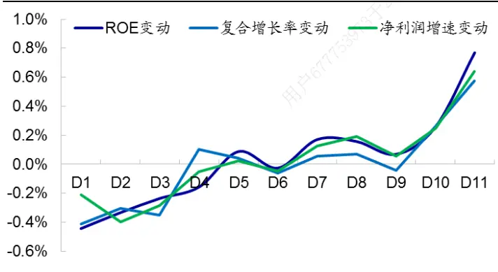
资料来源：Wind，朝阳永续，海通证券研究所

图2 预期 ROE不变股票月度占比
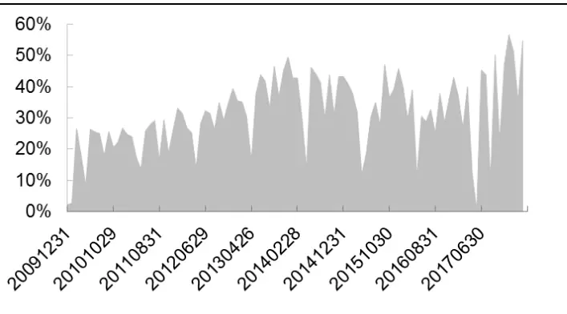
资料来源：Wind，朝阳永续，海通证券研究所

但由于观察期较短，因此很多股票预期指标保持不变。以 ROE 为例，图 2 展示了每个月预期 ROE变动为 0的股票占比。自 2010 年以来，预期 ROE不变股票月均占比31.09%，且呈现较为明显的周期性。报表披露期，如 3、4 月份等，预期不变股票占比达到局部低点，每年年底占比达到局部高点，12月份预期ROE不变占比平均为42.20%。

由于预期不变股票较多，因此在全市场范围内，盈利调整类因子的 RankIC 并不高。表 1 计算了各个调整因子月均 RankIC 的统计结果。结果显示，与分组筛选法一致，调整类因子与股票收益呈现显著为正的相关性，但 RankIC 均值并不高。其中，预期 ROE环比变化效果最好，月均 RankIC 为 2.07%，月胜率 73%。

表 1 预期调整因子月 RankIC

|  | 预期 ROE 环比变化 | 预期复合增长率环比变化 | 预期净利润增速环比变化 |
| --- | --- | --- | --- |
| 均值 | 2.07% | 1.51% | 1.69% |
| 月胜率 | 73.27% | 68.32% | 71.29% |
| IR | 1.79 | 1.51 | 1.62 |
| t值 | 5.19 | 4.37 | 4.70 |

资料来源： ，朝阳永续，海通证券研究所

## 1.2 不同观察期下的预期调整因子

如前文所述，若以月度为观察频率，则预期调整因子缺失值较多，因此 RankIC 并不高。本节我们拉长观察期，考察当月预期值相对于前期平均值变动的选股效果。

图 3 展示了不同观察期下，各个预期调整因子月均盈利不变的股票占比走势。观察期从 1个月增加至 1 年时，预期不变股票占比迅速下降；当观察期为 1 年时，该占比已接近于 0。图 4 展示了不同观察期下，各个盈利调整因子的月均 RankIC 情况。随着观察期增加，RankIC 呈现先增加后缓慢降低的趋势。这主要是由于在 1 年以内，预期盈利不变股票占比迅速下降，覆盖率增加，使得因子 RankIC 增加；观察期继续增加，覆盖率增大的优势逐渐减小，而信息的及时性大打折扣，拖累因子表现。

图3 不同观察期下月均盈利不变股票占比
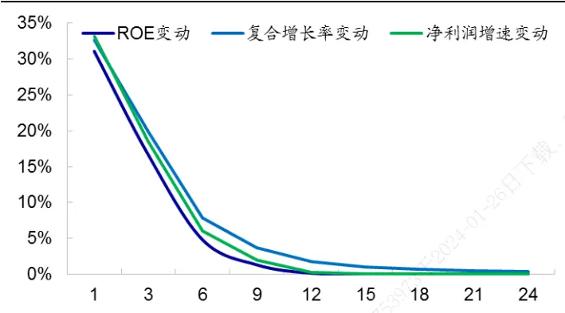
资料来源：Wind，朝阳永续，海通证券研究所

图4 不同观察期下预期调整因子的月均 RankIC
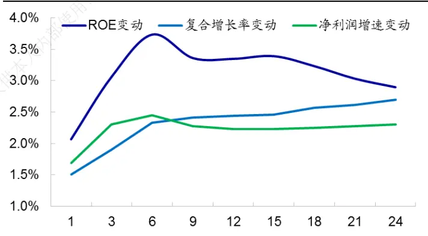
资料来源：Wind，朝阳永续，海通证券研究所

## 1.3 小结

预期调整因子与股票次月收益呈现显著正相关性，其选股效果与观察期密切相关：随着观察期增加，因子 RankIC 呈现先增加后减小的态势。观察期短，盈利不变股票占比大，因子 RankIC 较低；观察期增加，预期不变股票占比迅速下降，覆盖率增加，使得因子 RankIC 增加；观察期继续增加时，覆盖率增大的优势逐渐减弱，而信息的及时性大打折扣，拖累因子表现。

## 2. 预期稳定性对调整类因子的影响

本节我们考察预期稳定性对盈利调整因子的影响。其中，预期稳定性是指预期指标时间序列的波动率。为防止过多股票因子值都为 0，下文中我们选用 12 个月的观察期构建预期调整因子。以 dROE、dG、dNPG 分别代表当前预期净资产收益率、两年复合增长率、以及净利润同比增长率，与过去 12个月平均预期水平的差异。

## 2.1 预期稳定性对 dROE因子的影响

为考察预期稳定性对预期 ROE 调整的影响，我们对这两个因子进行双重分组。由于下调和上调存在本质区别，为避免调整方向对结果形成干扰，我们先将全市场股票分为下调组和上调组，然后再进行双重分组。具体分组步骤如下所示：

1) 每月末，根据预期调整因子小于 0或大于 0，将股票分为下调组和上调组；

2) 因子 1 分组：分别在下调组和上调组中，基于因子 1（如预期稳定性）将股票等分为 3组；

3) 因子 2 分组：考察每组股票中，因子 2（预期调整因子）分为 3 组后的多空收益差。

表 2 展示了双重分组后，预期 ROE调整因子的月均多空收益差及其统计 t值；作为对比，我们还考察了仅根据预期 ROE调整因子分组后的效果。其中，后缀“_down”代表预期 ROE下调股票中的分组，“_up”代表上调股票中的分组。

表 2 预期稳定性对预期 ROE调整因子多空收益差的影响

|  | 预期稳定性 & 预期 ROE 调整 | 预期 ROE 调整 & 预期 ROE 调整 |
| --- | --- | --- |
|  | 多空收益差 t值 | 多空收益差 t值 |
| D1_down | 0.33% 2.90 | -0.19% -1.85 |
| D2_down | 0.36% 2.64 番与转载 | 0.11% 1.51 |
| D3_down | 0.03% 0.18 | 0.09% 1.02 |
| D1_up | 0.19% 1.43 | 0.16% 1.61 |
| D2_up | 0.61% 4.00 部使用 | 0.04% 0.46 |
| D3_up | 0.31% 2.17 | -0.09% -0.76 |

资料来源：Wind，朝阳永续，海通证券研究所
注：表中 多空收益差 是指，因子值最大的 股票与因子值最小的 股票的月均收益差。

以“D1_down”为例，在下调股票中，若先根据预期稳定性分组，则 D1_down 组合代表下调股票中，预期稳定性最低的三分之一股票。在这部分子样本中，预期盈利调整因子的月均多空收益差为 0.33%，统计显著。

若先根据 dROE（预期 ROE 调整）分组，则 D1_down 组合代表下调股票中，dROE最小（即预期 ROE 下调幅度最大）的三分之一股票。在这部分股票中，dROE 因子的多空收益差为-0.19%，相应的 t 值为-1.85。需要注意的是，该多空收益差符号为负，也就是在这部分子样本集中， 因子的选股效果与全市场范围内的选股效果正好相反，因子失效。换言之，虽然在全市场范围内，股票次月收益与盈利 ROE 调整呈现正相关性；但若分组较细（表 2 中相当于根据预期 ROE 调整因子分为 18 组），则极端组合的单调性将会出现反向。

总结来看，在相同预期稳定性的股票组别中，dROE 因子多空收益差显著大于 0；但在相同 dROE组别中，dROE 因子的分组效果较弱。也就是采用预期稳定性分组，可增强 dROE因子的选股效果。

## 2.2 预期稳定性对预期成长能力调整因子的影响

同样地，在不同预期稳定性组别中，预期成长能力调整因子也存在显著的选股效果；且其多空收益差优于单独的预期调整因子。此外，还有一点值得注意的是，预期稳定性对盈利能力调整的影响强于其对成长能力调整因子的影响；在成长能力因子中，对 dG的影响强于对 dNPG 的影响。

表 3 预期稳定性对预期成长能力调整因子的影响

|  | dG 因子的多空收益差 |  |  |  | dNPG因子的多空收益差 |  |  |  |
| --- | --- | --- | --- | --- | --- | --- | --- | --- |
|  | 预期稳定性& dG |  | dG &dG |  | 预期稳定性 & dNPG |  |  | dNPG & dNPG |
|  | 多空收益差 | t值 | 多空收益差 | t值 |  | 多空收益差 | t值 | 多空收益差 t值 |
| D1_down | 0.32% | 2.86 | -0.08% | -0.80 | D1_down | 0.33% 2.91 | -0.12% | -1.29 |
| D2_down | 0.38% | 3.37 | 0.02% | 0.25 | D2_down | 0.20% 1.59 | 0.04% | 0.49 |
| D3_down | 0.17% | 1.42 | 0.09% | 1.06 | D3_down | 0.19% 1.74 | 0.21% | 2.27 |
| D1_up | 0.18% | 1.35 | 0.01% | 0.15 | D1_up | 0.16% 1.28 | 0.14% | 1.40 |
| D2_up | 0.31% | 2.67 | -0.00% | -0.04 | D2_up | 0.22% 1.80 | 0.06% | 0.65 |
| D3_up | 0.24% | 1.80 | -0.02% | -0.19 | D3_up | 0.05% 0.37 | 0.08% | 0.85 |

资料来源： ，朝阳永续，海通证券研究所
注：表中 多空收益差 是指，因子值最大的 股票与因子值最小的 股票的多空收益差。

## 2.3 小结

预期稳定性，即预期指标过去一段时间的波动率，对预期调整因子的选股效果存在明显影响。采用预期稳定性分组，可增强预期调整类因子的选股效果。

## 3. 时间序列标准化后的预期调整因子

如前所述，采用预期稳定性分组，可增强预期调整类因子的选股效果。因此我们可基于预期调整指标的波动率，构建时间序列标准化后的调整因子。下文中我们将时间序列标准化的 dROE、dG、dNPG 因子分别记之为 dROE_std、dG_std、dNPG_std，并考察这几个因子的选股效果。

## 3.1 标准化后的预期 ROE调整因子

图 5 展示了 dROE_std 因子分为 10 组后，每组股票相对于全市场等权组合的月均超额收益。结果显示，组间收益整体呈现单调递增态势。因子值最大的 1/10 股票（多头组合）月均超额 0.81%，因子值最小的 1/10 股票（空头组合）月均超额-0.53%，多空月均收益差 1.35%，月胜率 76.24%。从多空收益差角度来看，dROE_std 因子在大部分月份均跑赢 dROE因子，月胜率 65%。

图5 dROE_std 因子分组收益
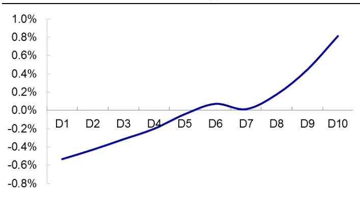
资料来源：Wind，朝阳永续，海通证券研究所

图6 预期 ROE调整因子多空收益差累计净值
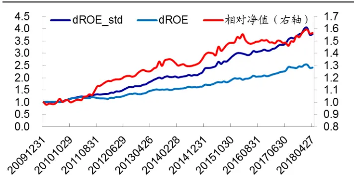
资料来源：Wind，朝阳永续，海通证券研究所

从相关性分析来看，dROE_std 因子的 IC 与 RankIC 均在 3.5%以上，相应的 IR 大于 2。而未进行时间序列标准化的 dROE 因子 IC 仅为 0.82%，虽然也统计显著，但 IR远小于 dROE_std 因子。此外，dROE_std 因子剔除行业和已存因子之后，IC 和 RankIC序列稳定性有所提升，月胜率达 80%以上，因此 IR 有所增加；但 dROE_std 因子剔除行业和已存因子后，稳定性有所降低，因此 IR 也略有减小。

表 4 预期 ROE调整因子月均 IC

| IC |  |  |  |  |  |
| --- | --- | --- | --- | --- | --- |
|  |  | 均值 | 月胜率 | t值 | IR |
| dROE_std | 原始因子 | 3.85% | 77.23% | 7.27 | 2.50 |
|  | 剔除已存因子 | 3.05% | 80.20% | 7.94 | 2.74 |
|  | 剔除已存因子和行业 | 2.96% | 83.17% | 8.28 | 2.85 |
| dROE | 原始因子 | 0.82% | 62.38% | 3.19 | 1.10 |
|  | 剔除已存因子 | 1.00% | 61.39% | 3.19 | 1.10 |
|  | 剔除已存因子和行业 | 0.99% | 60.40% | 3.26 | 1.12 |
| RankIC |  |  |  |  |  |
| dROE_std |  | 均值 | 月胜率 | t值 | IR |
|  | 原始因子 | 3.62% | 77.23% | 6.54 | 2.26 |
|  | 剔除已存因子 | 3.25% | 78.22% | 8.20 | 2.83 |
|  | 剔除已存因子和行业 | 3.18% | 82.18% | 8.62 | 2.97 |
| dROE | 原始因子 | 3.28% | 69.31% | 5.64 | 1.95 |
|  | 剔除已存因子 | 2.56% | 64.36% | 4.17 | 1.44 |
|  | 剔除已存因子和行业 | 2.35% | 67.33% 转载 | 4.34 | 1.50 |

资料来源：Wind，朝阳永续，海通证券研究所

正交行业和已存因子后，dROE_std因子月均多空收益差为 0.84%，月胜率 77.23%；其中，多头组合月均超额 0.44%，空头组合月均超额-0.40%。

图7 正交后的 dROE_std因子多空收益差累计净值
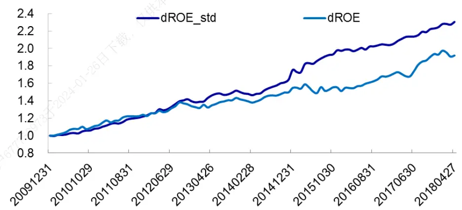
资料来源：Wind，海通证券研究所

## 3.2标准化后的预期成长能力调整因子

同样地，对于预期成长能力调整因子，时间序列标准化后的因子 IC 均值均大于 2%，稳定性高，相应的 IR也大于 2；选股能力优于未经时间序列标准化的因子。

表 5 预期成长能力调整因子月均 IC

| 预期复合增长率调整 |  |  |  |  |  |
| --- | --- | --- | --- | --- | --- |
|  |  | 均值 | 月胜率 | t值 | IR |
| dG_std | 原始因子 | 2.72% | 74.26% | 5.85 | 2.02 |
| dG | 剔除已存因子 | 2.48% | 78.22% | 8.02 | 2.77 |
|  | 剔除已存因子和行业 | 2.47% | 79.21% | 8.49 | 2.92 |
|  | 原始因子 | 1.59% | 65.35% | 4.53 | 1.56 |
|  | 剔除已存因子 | 1.76% | 72.28% | 5.84 | 2.01 |
|  | 剔除已存因子和行业 | 1.75% | 72.28% | 5.82 | 2.01 |
| 预期净利润同比增长率调整 |  |  |  |  |  |
|  |  | 均值 | 月胜率 | t值 | IR |
| dNPG_std | 原始因子 | 2.77% | 72.28% | 6.05 | 2.08 |
| dNPG | 剔除已存因子 | 2.48% | 76.24% | 8.27 | 2.85 |
|  | 剔除已存因子和行业 | 2.44% | 78.22% | 9.05 | 3.12 |
|  | 原始因子 | 0.67% | 58.42% | 2.42 | 0.84 |
|  | 剔除已存因子 | 0.85% | 57.43% | 2.69 | 0.93 |
|  | 剔除已存因子和行业 | 0.86% | 60.40% | 2.71 | 0.94 |

资料来源：Wind，朝阳永续，海通证券研究所

## 3.3预期调整因子之间的相关性

下表展示了上文中的 3个预期调整因子之间的平均相关系数。整体而言，调整类因子均基于预期净利润指标处理所得，因此相关性较高。其中，dROE_std 与 dG_std 相关性相对较低，为 43.39%。这主要是由于前者属于盈利能力因子，后者为成长能力因子；且复合增长率是基于当年和后一年预期净利润所得，因此在 3个因子中，这两个因子相关性相对较低。

表 6 预期调整因子之间的相关性

|  | dROE_std | dG_std | dNPG_std |
| --- | --- | --- | --- |
| dROE_std | 1 部使用 | 43.39% | 60.77% |
| dG_std | 43.39% | 1 | 79.06% |
| dNPG_std | 60.77% | 79.06% | 1 |

资料来源： ，朝阳永续，海通证券研究所

## 3.4预期调整因子的截面溢价

从横截面回归结果来看，单个预期调整因子在剔除已存因子后，仍存在显著为正的截面溢价。且新因子加入前后，已存因子的有效性并未出现明显变化，表明预期调整类因子与已存因子相关性低。

3 个预期调整类因子同时加入模型中时，dNPG_std 因子的截面溢价不再显著；而dROE_std 和 dG_std 因子虽然仍然显著，但截面溢价稳定性相较于单个因子加入时有所降低。

在 3 个预期调整类因子中，dNPG_std 与其余两个因子都存在明显的相关性，因此在 3 个因子有效性差异不明显的情况下，dNPG_std 因子的截面溢价不再显著。而dROE_std 和 dG_std 虽然存在一定相关性，但前者为盈利能力因子，后者为成长能力因子，相互包含另一个因子没有体现的额外信息，因此两者月均溢价仍显著大于 0。

表 7 预期调整类因子截面回归结果

|  | 市值 | 波动率 | 换手率 | 市值平方 | 反转 | 估值 | 流动性 | ROE | ROE 同比 | dROE_std | dG_std | dNPG_std |
| --- | --- | --- | --- | --- | --- | --- | --- | --- | --- | --- | --- | --- |
| 月均溢价 | -0.39% | -0.34% | -0.25% | 0.48% | -0.38% | -0.08% | -0.57% | 0.20% | 0.39% |  |  |  |
| t值 | -2.39 | -3.45 | -1.65 | 6.05 | -2.75 | -1.37 | -4.14 | 2.69 | 8.59 |  |  |  |
| 月均溢价 | -0.38% | -0.32% | -0.30% | 0.47% | -0.39% | -0.08% | -0.53% | 0.17% | 0.34% | 0.26% |  |  |
| t值 | -2.28 | -3.28 | -2.16 | 6.02 | -2.85 | -1.45 | -4.16 | 2.33 | 8.78 | 6.44 |  |  |
| 月均溢价 | -0.40% | -0.32% | -0.30% | 0.47% | -0.40% | -0.09% | -0.51% | 0.18% | 0.40% |  | 0.23% |  |
| t值 | -2.38 | -3.18 | -2.22 | 6.04 | -2.88 | -1.33 | -3.92 | 2.46 | 9.20 |  | 7.38 |  |
| 月均溢价 | -0.39% | -0.31% | -0.29% | 0.47% | -0.39% | -0.10% | -0.53% | 0.18% | 0.37% |  |  | 0.21% |
| t值 | -2.36 | -3.23 | -2.14 | 6.03 | -2.82 | -1.75 | -4.11 | 2.45 | 9.16 |  |  | 6.73 |
| 月均溢价 | -0.39% | -0.32% | -0.31% | 0.47% | -0.40% | -0.08% | -0.51% | 0.18% | 0.35% | 0.21% | 0.18% | -0.02% |
| t值 | -2.33 | -3.23 | -2.26 | 6.08 | -2.92 | -1.26 | -3.95 | 2.40 | 8.65 | 4.01 | 4.06 | -0.33 |

资料来源：Wind，朝阳永续，海通证券研究所

## 3.5 小结

时间序列标准化后的预期调整因子，选股效果更优。其 IC 均值和月胜率均高于时间序列标准化前的因子，整体 IR 高于 2；剔除行业和风格以后，因子 IR接近于 3。其中，以 dROE_std 因子稳定性最高，RankIC 月胜率达 80%以上；而 dG_std 和 dNPG_std的 RankIC 月胜率也超过 70%。

3 个预期调整因子之间存在一定相关性。其中，dNPG_std 与其余两个因子的截面相关系数均很高，因此在 3个因子同时加入到多因子模型中时，该因子截面溢价不显著。而 dROE_std 和 dG_std 因子体现公司预期基本面的不同方面，因此两因子仍存在显著为正的截面溢价。

## 4. 不同预测类型对预期调整因子的影响

朝阳永续数据库中，一致预期指标预测类型一共有 4 种。类型 1，表示预测数据满足要求，按照时间和机构影响力双重加权构造一致预期指标。类型 ，表示近期有报告，但报告数量不满足要求，因此拉长时间区间进行手工估算。类型 3，表示该公司一直没有分析师覆盖，因此采用历史财务数据进行模拟，得到一致预测值。类型 4，表示该公司以前有覆盖，但近期没有预测数据，因此沿用 6 个月前的一致预期数据。从预测可靠性来看，类型 1和类型 2符合基本要求；类型 3 和类型 4 类似于缺失数据的填充，可靠性较低。本节我们将考察不同预测类型对预期调整因子的影响。

## 4.1不同预测类型下的股票占比

表 8 展示了在剔除 ST 股、上市不足 3 个月以及停牌股之后，不同预测类型下 3 个预期调整类因子的覆盖度（即该预测类型下的股票数量/总样本量）。由于朝阳永续会对数据进行填充，因此 3 因子在全市场的覆盖率较高，每个股票均可获得 dROE_std 和dNPG_std 数据；但由于 dG_std 涉及两年的预测数据，而大部分情况朝阳永续仅对最近 1 年的预测数据进行填充，因此该因子覆盖率相对较低，为 93.02%。

表 8 不同预测类型股票占比

|  | 全市场覆盖率 | 类型为1 | 类型2 | 类型3 | 类型4 |
| --- | --- | --- | --- | --- | --- |
| dROE_std | 100.00% | 32.89% | 47.97% | 6.58% | 12.56% |
| dG_std | 93.02% | 32.29% | 44.80% | 4.86% | 11.07% |
| dNPG_std | 100.00% | 32.89% | 47.97% | 6.58% | 12.56% |

资料来源： ，朝阳永续，海通证券研究所

从预测类型来看，预测较为可靠的类型 1和类型 2股票占比约 80%，这也是我们平时统计的预期数据覆盖率。而单纯依靠模拟计算的类型 3，股票占比 6.6%；“沿用数据”的类型 4 占比 12.6%。

## 4.2不同预测类型中的截面溢价

下表展示了不同预测类型的股票中，dROE_std 和 dG_std 因子的截面回归结果。结果显示，预测类型为 2以内时，预期调整类因子的截面溢价显著为正；但预测类型为3 及以上时，截面溢价不再显著。

表 9 不同预测类型下预期调整因子的截面溢价

|  |  | 市值 | 波动率 | 换手率 | 市值平方 | 反转 | 估值 | 流动性 | ROE | ROE 同比 | dROE_std | dG_std |
| --- | --- | --- | --- | --- | --- | --- | --- | --- | --- | --- | --- | --- |
| 类型 | 月均溢价 | -0.41% | -0.27% | -0.32% | 0.48% | -0.37% | -0.06% | -0.48% | 0.16% | 0.38% | 0.23% | 0.20% |
| <=2 | t值 | -2.30 | -2.70 | -2.35 | 6.07 | -2.70 | -0.71 | -3.75 | 2.12 | 8.60 | 4.57 | 5.47 |
| 类 | 月均溢价 | -0.52% | -0.46% | -0.26% | 0.41% | -0.68% | 0.06% | -0.64% | 0.24% | 0.20% | 0.05% | 0.00% |
| 型>=3 | t值 | -3.70 | -3.71 | -1.57 | 4.42 | -4.47 | 0.78 | -3.64 | 2.40 | 2.40 | 0.69 | -0.02 |

资料来源： ，朝阳永续，海通证券研究所

实际上，预测类型为 3 及以上的股票，其预期调整因子值类似于朝阳永续构造的一种填充方式。对于这部分股票，由于近期没有分析师覆盖的股票类似于预期指标未发生变化，因此 0也是一种有效的填充方法。

下表展示了在全市场范围内，直接用朝阳永续数据计算的因子，与用 0 填充预测类型为 及以上股票所得的因子，在截面回归中的溢价对比。结果显示，两种方法构造的因子，其截面溢价均显著为正。但用 0填充的溢价及 t值均略高于朝阳永续原始因子值。

表 10 以 0填充预测类型为 3及以上股票的截面回归结果

| 填充方法 |  | 市值 | 波动率 | 换手率 | 市值平方 | 反转 | 估值 | 流动性 | ROE | ROE同 比 | dROE_std | dG_std |
| --- | --- | --- | --- | --- | --- | --- | --- | --- | --- | --- | --- | --- |
| 朝阳永续 | 月均溢价 | -0.39% | -0.32% | -0.31% | 0.47% | -0.40% | -0.08% | -0.51% | 0.18% | 0.35% | 0.19% | 0.18% |
| 填充 | t值 | -2.31 | -3.23 | -2.25 | 6.06 | -2.92 | -1.25 | -3.96 | 2.40 | 8.68 | 4.37 | 5.39 |
| 0填充 | 月均溢价 | -0.39% | -0.35% | -0.29% | 0.49% | -0.41% | -0.09% | -0.53% | 0.17% | 0.33% | 0.22% | 0.19% |
|  | t值 | -2.31 | -3.53 | -2.07 | 6.12 | -2.96 | -1.56 | -4.12 | 2.34 | 8.55 | 4.50 | 5.40 |

资料来源：Wind，朝阳永续，海通证券研究所

图8 dROE_std_0 因子月溢价
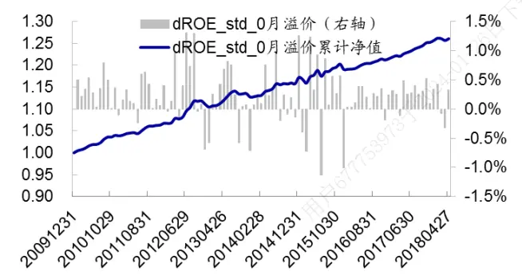
资料来源： ，朝阳永续，海通证券研究所

图9 dG_std_0 因子月溢价
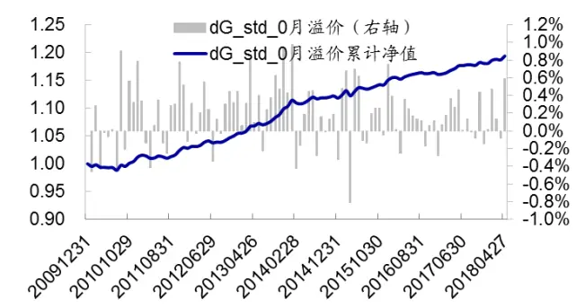
资料来源：Wind，朝阳永续，海通证券研究所

以后缀“_0”表示用 0 填充预测类型为 3 及以上股票的因子值所构造的因子，下表展示了不同填充方法下，预期调整单因子的 IC 表现。结果显示，用 0 填充的单因子稳定性相对较高，月胜率均在 80%以上，相应的单因子 IR 大于 3。

表 11 不同填充方法下预期调整因子的 IC表现

| IC |  |  |  |  |
| --- | --- | --- | --- | --- |
|  | 均值 | 月胜率 | t值 | IR |
| dROE_std | 2.96% | 83.17% | 8.28 | 2.85 |
| dROE_std_0 | 3.41% | 83.17% | 8.95 | 3.09 |
| dG_std | 2.47% | 79.21% | 8.49 | 2.92 |
| dG_std_0 | 2.65% | 82.18% | 8.55 | 2.95 |
| dNPG_std | 2.44% | 78.22% | 9.05 | 3.12 |
| dNPG_std_0 | 2.67% | 83.17% | 9.63 | 3.32 |

| RankIC |  |  |  |
| --- | --- | --- | --- |
|  | 均值 | 月胜率 t值 | IR |
| dROE_std | 3.18% | 82.18% 8.62 | 2.97 |
| dROE_std_0 | 3.63% | 83.17% 8.73 | 3.01 |
| dG_std | 2.85% | 83.17% 9.18 | 3.16 |
| dG_std_0 | 3.01% | 78.22% 8.96 | 3.09 |
| dNPG_std | 2.70% | 81.19% 9.50 | 3.27 |
| dNPG_std_0 | 2.96% | 83.17% 9.64 | 3.32 |

资料来源：Wind，朝阳永续，海通证券研究所
注：该表中的因子是正交已存因子后的因子值。

## 4.3 小结

朝阳永续一致预期数据一共包括 4种预测类型，其中预测类型 1和 2 较为可靠；而类型 3和 4的数据为数据模拟与沿用，可靠性较低。从预期调整类因子截面回归结果来看，在预测类型 2 以内的子样本中，因子截面溢价显著为正；但在类型 3 及以上的子样本中，选股效果不显著。

类型 3和 4的因子值类似于朝阳永续构造的一种填充方法；实际上用 0填充所得到的单因子 IC 表现并不比朝阳永续填充方法差，其单因子月胜率均在 80%以上，IR 也高于 3。

## 5. 不同构建方式的预期调整因子收益表现对比

图 10、图 11 分别展示了在不同观察期下，3 种预期 ROE 调整因子正交已存因子后的月均 IC、IR 表现。其中，dROE 表示当月一致预期 ROE 与过去一段时间平均预期ROE 之差；dROE_std 表示时间序列标准化后的预期 ROE 变动；dROE_std_0 表示对于预测类型为 3及以上的股票，以 0作为其因子值，其余股票因子值则为时间序列标准化后的预期 ROE变动。

图10 不同观察期下预期 ROE调整因子的月均 IC
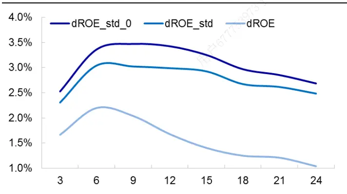
资料来源：Wind，朝阳永续，海通证券研究所

图11 不同观察期下预期 ROE调整因子的 IR
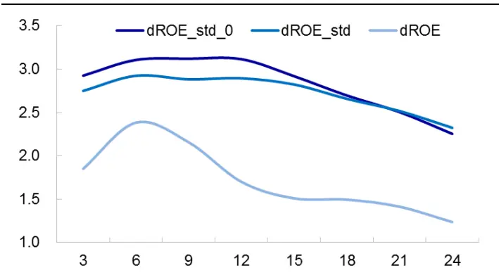
资料来源：Wind，朝阳永续，海通证券研究所

整体来看，在不同观察期下，dROE_std_0 因子的表现均优于 dROE_std 因子，而dROE_std 因子的表现优于 dROE 因子。在预期调整类因子中，我们建议关注时间序列标准化后、以 0填充预测数据不可靠的股票所构造的因子。

## 6. 总结

本文主要对预期调整类因子（即预期指标变动因子）进行研究，考察预期稳定性对调整类因子的影响，并基于此构建时间序列标准化后的预期调整因子。

预期调整因子与股票次月收益呈现显著正相关性，其选股效果与观察期密切相关：

随着观察期增加，因子 RankIC 呈现先增加后减小的态势。观察期短，盈利不变股票占比大，因子 RankIC相对较低；观察期增加，预期不变股票占比迅速下降，覆盖率增加，使得因子 RankIC 增加；观察期继续增加时，覆盖率增大的优势逐渐减弱，而信息的及时性大打折扣，拖累因子表现。

预期稳定性，即预期指标过去一段时间的波动率，对预期调整因子的选股效果存在明显影响。采用预期稳定性分组，可增强预期调整类因子的选股效果。

时间序列标准化后的预期调整因子，选股效果更优。其 IC 均值和月胜率均高于时间序列标准化前的因子，整体 IR 高于 2；剔除行业和风格以后，因子 IR接近于 3。

朝阳永续一致预期数据一共包括 4种预测类型，其中预测类型 1和 2 较为可靠；而类型 3和 4的数据为数据模拟与沿用，可靠性较低。从预期调整类因子截面回归结果来看，在预测类型 2 以内的子样本中，因子截面溢价显著为正；但在类型 3 及以上的子样本中，预期调整因子选股效果不显著。

预测类型 3 和 4的因子值类似于朝阳永续构造的一种填充方法；实际上我们还可用0 填充那些近期没有预测数据的股票。以 0填充所得到的调整类因子 IC表现并不比朝阳永续填充方法差，其单因子月胜率在 80%以上，IR 高于 3。

## 7. 风险提示

历史规律变化风险，因子失效风险。

# 信息披露

分析师声明

[Table冯佳睿yst 金融工程研究团队s]

罗蕾金融工程研究团队

本人具有中国证券业协会授予的证券投资咨询执业资格，以勤勉的职业态度，独立、客观地出具本报告，本报告所采用的数据和信息均来自市场公开信息，本人不保证该等信息的准确性或完整性。分析逻辑基于作者的职业理解，清晰准确地反映了作者的研究观点，结论不受任何第三方的授意或影响，特此声明。

## 法律声明

本报告仅供海通证券股份有限公司（以下简称 本公司 ）的客户使用。本公司不会因接收人收到本报告而视其为客户。在任何情况下，本报告中的信息或所表述的意见并不构成对任何人的投资建议。在任何情况下，本公司不对任何人因使用本报告中的任何内容所引致的任何损失负任何责任。

本报告所载的资料、意见及推测仅反映本公司于发布本报告当日的判断，本报告所指的证券或投资标的的价格、价值及投资收入可能会波动。在不同时期，本公司可发出与本报告所载资料、意见及推测不一致的报告。可

市场有风险，投资需谨慎。本报告所载的信息、材料及结论只提供特定客户作参考，不构成投资建议，也没有考虑到个别客户特殊的用投资目标、财务状况或需要。客户应考虑本报告中的任何意见或建议是否符合其特定状况。在法律许可的情况下，海通证券及其所属部关联机构可能会持有报告中提到的公司所发行的证券并进行交易，还可能为这些公司提供投资银行服务或其他服务。人

本报告仅向特定客户传送，未经海通证券研究所书面授权，本研究报告的任何部分均不得以任何方式制作任何形式的拷贝、复印件或复制品，或再次分发给任何其他人，或以任何侵犯本公司版权的其他方式使用。所有本报告中使用的商标、服务标记及标记均为本公司的商标、服务标记及标记。如欲引用或转载本文内容，务必联络海通证券研究所并获得许可，并需注明出处为海通证券研究所，且下不得对本文进行有悖原意的引用和删改。26

根据中国证监会核发的经营证券业务许可，海通证券股份有限公司的经营范围包括证券投资咨询业务。24

## 海通证券股份有限公司研究所[Table_PeopleInfo]

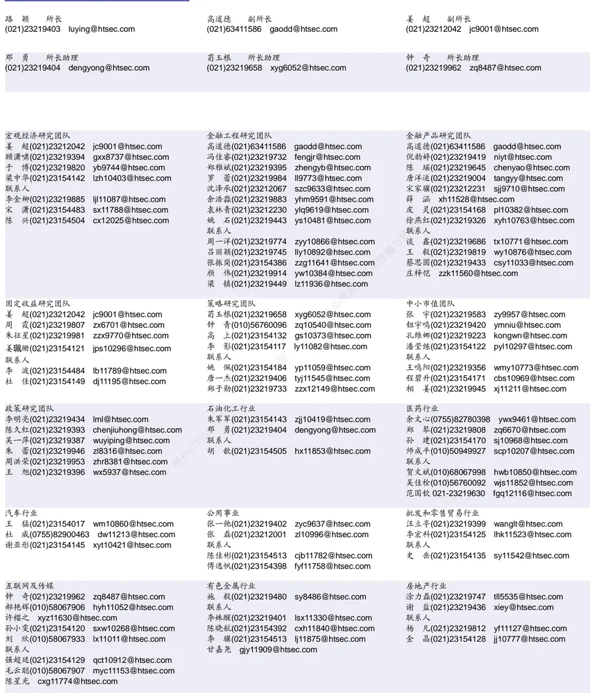

| 电子行业 | 陈 平(021)23219646 cp9808@htsec.com | 煤炭行业 |  |  | 电力设备及新能源行业 |  |
| --- | --- | --- | --- | --- | --- | --- |
|  |  |  | 吴 杰(021)23154113 | wj10521@htsec.com | 张一弛(021)23219402 | zyc9637@htsec.com |
| 联系人 |  |  | 戴元灿(021)23154146 | dyc10422@htsec.com | 房 青(021)23219692 | fangq@htsec.com |
| 谢 |  | 磊(021)23212214 xl10881@htsec.com | 李 淼(010)58067998 | Im10779@htsec.com | 曾 彪(021)23154148 | zb10242@htsec.com |
| 尹 | 苓(021)23154119 | yl11569@htsec.com |  |  | 徐柏乔(021)32319171 | xbq6583@htsec.com |
| 石 | 坚(010)58067942 | sj11855@htsec.com |  |  | 张向伟(021)23154141 | zxw10402@htsec.com |

| 基础化工行业 | 计算机行业 | 通信行业 |  |
| --- | --- | --- | --- |
| 刘 威(0755)82764281 Iw10053@htsec.com | 郑宏达(021)23219392 zhd10834@htsec.com |  | 朱劲松(010)50949926 zjs10213@htsec.com |
| 刘海荣(021)23154130 Ihr10342@htsec.com | 鲁 立（021）23154138 II11383@htsec.com |  | 余伟民(010)50949926 ywm11574@htsec.com |
| 张翠翠 zcc11726@htsec.com 孙维容(021)23219431 swr12178@htsec.com | 黄竞晶(021)23154131 hjj10361@htsec.com | 联系人 |  |
| 联系人 | 杨 林(021)23154174 yl11036@htsec.com 联系人 | 张峥青 zzq11650@htsec.com |  |
| 李 智(021)23219392 Iz11785@htsec.com | 洪 琳(021)23154137 hl11570@htsec.com |  |  |

| 非银行金融行业 |  | 交通运输行业 |  | 纺织服装行业 |  |
| --- | --- | --- | --- | --- | --- |
|  | 何 婷(021)23219634 ht10515@htsec.com |  | 虞 楠(021)23219382 yun@htsec.com |  | 梁 希(021)23219407 lx11040@htsec.com |
|  | 孙 婷(010)50949926 st9998@htsec.com |  | 联系人 |  | 联系人 |
| 联系人 |  |  | 李 丹(021)23154401 Id11766@htsec.com |  | 盛 开 sk11787@htsec.com |
| 李芳洲(021)23154127 Ifz11585@htsec.com | 夏昌盛(010)56760090 xcs10800@htsec.com |  | 党新龙(0755)82900489 dxl12222@htsec.com |  |  |

| 建筑建材行业 | 机械行业 |  | 钢铁行业 |  |
| --- | --- | --- | --- | --- |
| 钱佳佳(021)23212081 qjj10044@htsec.com | 余炜超(021)23219816 swc11480@htsec.com |  | 刘彦奇(021)23219391 liuyq@htsec.com |  |
| 冯晨阳(021)23212081 fcy10886@htsec.com | 耿 耘(021)23219814 | gy10234@htsec.com | 联系人 | 周慧琳(021)23154399 zhl11756@htsec.com |
| 联系人 申 浩(021)23154114 sh12219@htsec.com | 杨 震(021)23154124 沈伟杰(021)23219963 | yz10334@htsec.com 3 swj11496@htsec.com | 刘 璇 lx11212@htsec.com |  |

| 建筑工程行业 |  | 农林牧渔行业 |  | 食品饮料行业 |  |  |
| --- | --- | --- | --- | --- | --- | --- |
| 杜市伟 | dsw11227@htsec.com | 丁 频(021)23219405 | dingpin@htsec.com |  | 闻宏伟(010)58067941 | whw9587@htsec.com |
| 张欣劫 | zxj12156@htsec.com | 陈雪丽(021)23219164 | cxl9730@htsec.com |  | 成珊(021)23212207 | cs9703@htsec.com |
| 李富华 | Ifh12225@htsec.com | 陈 阳(021)23212041 | cy10867@htsec.com |  | 唐 宇(021)23219389 | ty11049@htsec.com |

| 军工行业 |  | 银行行业 | 社会服务行业 |
| --- | --- | --- | --- |
| 张恒晅 zhx10170@hstec.com | 孙 婷(010)50949926 st9998@htsec.com |  | 汪立亭(021)23219399 wanglt@htsec.com |
|  | 蒋 俊(021)23154170 jj11200@htsec.com | 联系人 | 李铁生(010)58067934 Its10224@htsec.com |
| 刘 磊(010)50949922 II11322@htsec.com |  | 谭敏沂 tmy10908@htsec.com | 联系人 |
| 联系人 |  | 林加力021-23219392 ljl12245@htsec.com | 陈扬扬(021)23219671 cyy10636@htsec.com |

| 家电行业 | 造纸轻工行业 |
| --- | --- |
| 陈子仪(021)23219244 chenzy@htsec.com | 衣桢永yzy12003@htsec.com |
| 联系人 | 曾知(021)23219810 zz9612@htsec.com |
| 李 阳 ly11194@htsec.com |  |
| 朱默辰(021)23154383 zmc11316@htsec.com |  |
| 刘 璐(021)23214390 II11838@htsec.com |  |

## 研究所销售团队

深广地区销售团队

蔡铁清(0755)82775962 ctq5979@htsec.com

伏财勇(0755)23607963 fcy7498@htsec.com

辜丽娟(0755)83253022 gulj@htsec.com

刘晶晶(0755)83255933 liujj4900@htsec.com

王雅清(0755)83254133 wyq10541@htsec.com

饶 伟(0755)82775282 rw10588@htsec.com

欧阳梦楚(0755)23617160

oymc11039@htsec.com

宗 亮 zl11886@htsec.com

巩柏含 gbh11537@htsec.com

海地区销售团队胡雪梅(021)23219385 huxm@htsec.com朱 健(021)23219592 zhuj@htsec.com季唯佳(021)23219384 jiwj@htsec.com黄 毓(021)23219410 huangyu@htsec.com漆冠男(021)23219281 qgn10768@htsec.com胡宇欣(021)23154192 hyx10493@htsec.com黄 诚(021)23219397 hc10482@htsec.com毛文英(021)23219373 mwy10474@htsec.com马晓男 mxn11376@htsec.com杨祎昕(021)23212268 yyx10310@htsec.com方烨晨(021)23154220 fyc10312@htsec.com张思宇 zsy11797@htsec.com慈晓聪(021)23219989 cxc11643@htsec.com王朝领 wcl11854@htsec.com

北京地区销售团队
殷怡琦(010)58067988 yyq9989@htsec.com
吴 尹 wy11291@htsec.com
张丽萱(010)58067931 zlx11191@htsec.com
杨羽莎(010)58067977 yys10962@htsec.com
杜 飞 df12021@htsec.com
张 杨(021)23219442 zy9937@htsec.com

海通证券股份有限公司研究所

地址：上海市黄浦区广东路 689号海通证券大厦 9楼

电话：（021）23219000

传真：（021）23219392

网址：www.htsec.com