## [Tab相关研究

Table_ReportInfo]《沪深 300 VS 中证 500——指数轮动研

究》2018.06.21

《战略配售基金投资标的基本面及收益

率分析》2018.06.20

分析师:冯佳睿

Tel:(021)23219732

Email:fengjr@htsec.com

证书:S0850512080006

分析师:吕丽颖

Tel:(021)23219745

Email:lly10892@htsec.com

证书:S0850518060002

# 选股因子系列研究（三十四）——宏观经济数据可以用来选股吗？

## 投资要点：

- 宏观数据多被应用于资产配臵与行业轮动，本篇报告尝试在微观的选股层面进行探索，以期为投资者提供参考。

- 如何刻画股票与宏观经济指标之间的联系。本文首先探讨宏观经济如何影响股票的收益，并尝试使用宏观敏感性（MacroBeta）刻画股票与宏观经济指标之间的联系。

- 宏观数据的潜在问题与数据清洗。宏观经济数据相较其他常见数据，面临的问题更多，包括公布时间滞后、数据发布频率不稳定、缺失值多、序列不平稳等。实际使用时，我们推荐通过差分法、Surprise 替代法、资产组合模拟法等方式进行预加工处理。

- 宏观敏感性因子是否可以用来选股？我们将宏观敏感性——MacroBeta 当作选股因子，测试其本身是否存在选股效果。结果发现，大多数宏观敏感性因子在不控制风格时，可以呈现出一定的分组收益单调性，但控制风格后单调性均明显下降。主要原因在于宏观敏感性高（大于零）的股票以大市值为主，而在回测窗口内， 股的大市值股票收益往往较低，导致按宏观敏感性因子分组后的收益呈现单调性。一旦剥离常见风格，仅有极少数宏观敏感性因子依然存在选股效果。

- 宏观敏感性因子选股的陷阱。事实上，剥离风格后的宏观敏感性因子的选股效果，也并非来源于因子本身，而是由于在回测区间内恰好暴露于正确的宏观经济指标的变化方向上。于是，我们得到结论，宏观敏感性因子只是刻画了股票与宏观经济指标之间的关系，包括方向与程度。使用宏观敏感性因子选股的正确逻辑应该是，当预测宏观经济指标上升时，选择正敏感或高敏感的股票。反之，选择负敏感或低敏感的股票。

- 基于宏观得分的选股逻辑。定义宏观得分 = 宏观敏感性 × 预期宏观经济走势，选择宏观得分最高的若干个股票形成组合。但是，详细的实证研究也表明，该选股策略想要获得成功严重依赖于两个方面。一是对宏观经济走势的正确判断，二是宏观敏感性因子在时间序列上的稳定性。我们发现，与企业经营直接相关的经济指标，其敏感性的稳定性较好，可以尝试用来选股。

- 风险提示：市场系统性风险、模型误设风险、有效因子变动风险。

宏观数据多被应用于资产配臵与行业轮动，本报告尝试在微观的选股层面上进行探索。即，宏观经济数据是否可以用来选股？围绕这一问题，全文将先后探讨宏观经济如何影响股票收益、如何建立宏观经济指标与股票收益之间的联系、宏观敏感性因子是否存在选股能力以及如何将宏观数据应用于选股等几个问题，以期为投资者提供参考。

## 1. 宏观经济对股票收益的影响

## 1.1宏观经济如何影响股票收益

从直观的逻辑上，宏观经济与股票收益之间存在关联。良好的经济环境会提升企业盈利，促进股市上涨。进一步分析，宏观经济对股票收益的影响可以包括以下三方面：

## 1）上市公司的直接经济效益

当宏观经济状况良好时，社会投资、消费、出口需求旺盛，企业销售增加，效益上升，公司价值提高，股价随之上涨。

## 2）经济景气度引起的投资需求

宏观经济向好时，经济景气度上升，就业面扩大，员工收入提高，对金融资产需求也会相应增加。另外，随着投资者人数增多，股市人气兴旺，股价也会随之上涨。

## 3）货币供给与交投

当宏观经济环境中的货币供应适度宽松，股市资金相对宽裕，对股票的需求就会增加，交投随之活跃，股价也会上涨。

那么，宏观经济环境的变化到底与股市有多大关联？为了回答这一问题，我们计算了常见宏观经济指标的变化与沪深 300 指数未来收益之间的相关性，结果列于下表。

表 1 常见宏观经济指标的变化与沪深 300指数未来收益的相关性（2005-2017）

| 经济指标变化 | 2005-2017 | 2005-2012 | 2013-2017 |
| --- | --- | --- | --- |
| Delta_PMI | 0.1618* | 0.1955* | -0.1201 |
| Delta_工业增加值增速 | 0.1552* | 0.2628** | -0.2389 |
| Delta_固定资产投资增速 | 0.1566* | 0.2054* | -0.0911 |
| Delta_M2 增速 | 0.1540* | 0.2355** | -0.1241 |

资料来源：Wind，Bloomberg，海通证券研究所
注：*在 10%水平下显著，**在 5%水平下显著

在 2005-2017 年的 13 年间，Delta_PMI、Delta_工业增加值增速、Delta_固定资产投资增速、Delta_M2增速与沪深300未来收益之间的正相关性均在10%水平下显著。然而，进一步分析发现，宏观经济指标的变化与沪深 300指数未来收益之间的关系在2013 年前后大不相同。2013 年以前，两者正相关。而 2013 年以后，却呈现负相关。

由此可见，宏观经济环境与股票收益之间的关系虽然存在但并非持续稳定，而是在时间序列上会发生变化。因此，我们进一步猜测，宏观经济环境对个股收益的影响是否也存在横截面上的差异？

## 1.2如何刻画股票与宏观经济指标之间的联系？

为刻画股票与宏观经济指标之间的联系，本文引入两个常见的被海外学者所使用的模型。

模型一：将股票的历史超额收益对宏观经济变量 F进行回归，获得的回归系数称为MacroBeta，或称该股票的宏观敏感性。公式如下：

$$
\ ExcessReturn_{i,t}=\alpha_{i,t}+MacroBeta_{i,t}\cdot F_{t}+\varepsilon_{i,t}
$$

其中，F表示宏观经济指标第 t 期的取值，需要提前清洗与调整，具体方法将在下文中介绍。ExcessReturn 表示第 t 期的股票超额收益。

模型二：在模型一的基础上加入 Fama-French 三因子，以控制常见风格对股票收益的影响。

$$
Return_{i,t}\ =\ \alpha_{i,t}+MacroBeta_{i,t}\cdot F_{t}
$$

$$
\begin{array}{r}{+\beta_{i,t}^{MKT}\cdot MKT_{t}+\beta_{i,t}^{SMB}\cdot SMB_{t}+\beta_{i,t}^{HML}\cdot HML_{t}\ +\varepsilon_{i,t}}\end{array}
$$

其中，F 依然表示宏观经济指标第 t期的取值，Return 表示第 t期的股票绝对收益。MKT表示市场因子，SMB表示市值因子，HML 表示估值因子。

由于 FF3 模型中的因子计算可以有多种方式，本文仅先采用更为简洁的模型一计算个股的宏观敏感性。需要注意的是，计算过程中需要将极端值、异常值以及显著性过低的样本予以剔除。

本文纳入了共计 21 个常见宏观经济指标，包括如下六大类。

国民经济指标：包括 GDP同比增速（国内生产总值）、工业增加值同比增速（刻画工业生产）、中采制造业 PMI（采购经理人指数）、固定资产投资增速累计同比（刻画投资）、社会消费品零售总额同比增速（刻画消费）。其中，GDP同比增速的披露频率为季度，其余指标均为月度。

对外经济贸易指标：包括出口增速、进口增速以及贸易差额，均为月度频率。

通胀类指标：包括两个价格指数——cpi同比（居民消费价格）与 ppi同比（工业生产者价格），均为月度频率。

货币供应类指标：包括 M0增速、M1 增速、M2 增速、社会融资规模（社会融资总量）、新增人民币贷款（金融机构贷款）以及外汇储备，均为月度频率。

利率类指标：包括利率水平（国债一个月到期收益率）、期限利差（十年期国债与一年期国债到期收益率之差）、信用利差（一年期 AAA 企业债到期收益率与一年期国债到期收益率之差）以及 TED 利差（3 个月 Shibor 与 3 个月国债到期收益率之差），均为日度频率。

商品类指标：包括贵金属（以黄金为代表）和能源（以布伦特原油为代表），均为日度频率。

表 2 宏观经济指标说明

| 指标类别 | 指标子类别 | 指标名称 | 数据发布频率 |
| --- | --- | --- | --- |
| 【国民经济指标】 | 国内生产总值 | GDP 同比增速 | 季度 |
|  | 工业生产 | 工业增加值同比增速 | 月度 |
|  | 经济景气指数 | 采购经理人指数（PMI） | 月度 |
|  | 投资 | 固定资产投资增速 | 月度 |
|  | 消费 | 社会消费品零售总额同比增速 | 月度 |
| 【对外经济贸易】 |  | 出口增速 | 月度 |
|  | 进出口 | 进口增速 | 月度 |
|  |  | 贸易差额 | 月度 |
| 【价格】 | 通胀指标 | 居民消费价格（cpi） | 月度 |
|  |  | 工业生产者价格（ppi） | 月度 |
| 【货币供给】 |  | MO 增速 | 月度 |
|  | 货币供应量 | M1 增速 | 月度 |
|  |  | M2 增速 | 月度 |
|  |  | 金融机构贷款 | 月度 |
|  |  | 外汇占款 | 月度 |
| 【利率】 |  | 利率水平 | 日度 |
|  |  | 期限利差 | 日度 |
|  | 不可传播与转载 | 信用利差 | 日度 |
|  |  | TED 利差 | 日度 |
| 【大宗商品】 | 贵金属 | 黄金 | 日度 |
|  | 部 能源 | 原油 | 日度 |

资料来源：Wind，Bloomberg，海通证券研究所

## 2. 宏观数据的潜在问题与数据清洗

## 2.1宏观数据的潜在问题

在计算股票对宏观经济指标的敏感性之前，首先需要对宏观数据进行清洗与调整。与常见数据相比，宏观经济数据的潜在问题较多，主要包括如下几方面。

首先，宏观经济数据公布时间滞后。例如，2018 年 3 月的 cpi当月同比数据的实际公布时间为 2018 年 4 月 11 日。因而在回测时，2018 年 3 月底仅可获得 2018 年 2月的 cpi当月同比数据。

其次，宏观经济数据存在频率不稳定以及缺失值问题。以工业增加值当月同比为例，每年的 1月与 2月均无数据，仅在 3月至 12月发布新数据。

另外，宏观经济数据存在数据修正问题。即，数据在首次披露后，可能会再次修正。以 GDP 为例，国家统计局网站资料显示，季度 GDP 初步核实数一般于季后 15 天左右完成；季度 G 最终核实数在年度 G 最终核实数发布后 天内完成。因此在策略回测中，尤其需要注意这个问题。应采用宏观经济指标的初始值，以避免引入未来信息。

最后，宏观经济数据往往不平稳。若直接使用非平稳数据回归，会造成“伪回归”现象，导致分析、检验、预测的结果均缺乏有效性。

## 2.2宏观数据的预处理方法

综合海外文献，本文主要介绍以下三种宏观数据的预处理方法：差分法、Surprise替代法以及资产组合模拟法。

差分法是处理非平稳时间序列的常见方法。具体操作方式是取当期数据与上一期数据的差值，即宏观数据的增量。大多数宏观经济数据在一阶差分以后可以获得平稳序列。差分的计算公式如下：

$$
\pmb{f}_{i,t}=\pmb{F}_{t}-\pmb{F}_{t-1}
$$

Surprise 替代法，顾名思义，即使用宏观经济数据的 Surprise（宏观预期差）替代原始的宏观经济数据。与原始宏观经济数据相比，Surprise（宏观预期差）往往是平稳的。Surprise 的计算公式如下：

$$
S_{i,t}=F_{t}-P_{t}
$$

## 2.3资产组合模拟法

资产组合模拟法曾被 Breeden(1989)与 Lamont(2001)等人采用，以缓解宏观数据高误差、披露频率低、数据滞后等问题。具体操作方式是：针对每一个需要清洗处理的目标宏观因子，寻找一组与之相适应的基础资产组合。将因子对组合的收益进行回归，获得回归系数 w。具体形式如下：

$$
y_{t}=a+w\cdot X_{t}+u_{t}
$$

其中， $y_{t}$ 表示目标宏观因子， $X_{t}$ 表示一系列基础资产组合。

最终， $\nu\lambda w\cdot X_{t}$ 替代 $y_{t},$ ，作为模拟的宏观因子 F’。该方法旨在以资产收益的波动，体现宏观经济指标的变化所带来的影响。

在构建基础资产组合的过程中，海外常用的资产包括行业组合（标普行业分类）、市场组合、Fama-French 三因子、分类债券组合（国债、投资级信用债以及高收益信用债等）。

类似地，本文选用国内的相似资产构建本土化的基础资产组合，具体包括：

- FF3 因子模型中的 MKT、SMB、HML 以及 Carhart 动量因子 UMD。

中观行业聚类：由于标普行业分类标准共计 10 个行业，而当前国内的各行业分类体系均至少有 28个一级行业。为尽量接近海外的做法，我们采用行业聚类，以申万一级行业为基础，划分成周期、金融、制造、消费、TMT、其他 6个中观行业。具体构造如下表所示。

表 3 中观行业因子构造

| 中观行业 | 申万一级行业名称 |
| --- | --- |
| 周期 | 有色金属、化工、钢铁、采掘、农林牧渔、建筑材料、建筑装饰 |
| 金融 | 银行、非银金融、房地产 |
| 制造 | 交通运输、国防军工、机械设备、汽车 |
| 消费 | 家用电器、食品饮料、轻工制造、医药生物 |
| TMT | 电子、计算机、传媒、通信、电气设备 |
| 其他 | 纺织服装、商业贸易、休闲服务、综合、公用事业 |

资料来源：Wind，海通证券研究所

- 分类债券组合：国债指数以及信用债指数。

- 商品：南华商品指数。

基于上述方案，我们对原始的 15 个季频与月频数据进行了模拟。在每一个时点上，均基于所有当期可获得的数据，得到模拟资产组合的收益序列。为测试该模拟结果是否保留了原始宏观数据的特征，我们绘制如下两个相关性色阶图进行对比。

图 是原始宏观经济数据之间的两两相关性，图 则是模拟数据的结果。可以发现，模拟数据大体上保持了原始数据的特征。

图1 宏观数据相关性-原始数据（2005/8-2018/4）

|  | gdp | 工业 增加值 | 制造业 PMI | 固定资产 投资增速 | 社会消费 零售总额 | 出口 | 进口 | 贸易差额 | cpi | ppi | m0 | m1 | m2 | 新增 人民币贷款 | 外汇储备 |
| --- | --- | --- | --- | --- | --- | --- | --- | --- | --- | --- | --- | --- | --- | --- | --- |
| gdp | 1.000 | 0.963 | 0.726 | 0.723 | 0.629 | 0.695 |  | 0.734 | -0.542 | 0.494 | 0.537 | 0.722 | 0.400 | 0.490 | -0.667 -0.686 |
| 工业增加值 | 0.963 | 1.000 | 0.680 | 0.793 | 0.559 | 0.647 | 0.684 | -0.673 | 0.386 | 0.476 | 0.724 | 0.341 | 0.556 | -0.564 | -0.787 |
| 制造业PMI | 0.726 | 0.680 | 1.000 | 0.396 | 0.137 | 0.376 | 0.499 | -0.406 | 0.154 | 0.285 | 0.250 | 0.481 | 0.434 | -0.224 | -0.612 |
| 固定资产投资增速 | 0.723 | 0.793 | 0.396 | 1.000 | 0.665 | 0.300 | 0.346 | -0.625 | 0.137 | 0.164 | 0.663 | 0.211 | 0.806 | -0.638 | -0.707 |
| 社会消费零售总额 | 0.629 | 0.559 | 0.137 | 0.665 | 1.000 | 0.438 | 0.506 | -0.386 | 0.610 | 0.456 | 0.711 | 0.259 | 0.482 | -0.535 | -0.310 |
| 出口 | 0.695 | 0.647 | 0.376 | 0.300 | 0.438 | 1.000 | 0.694 | -0.248 | 0.468 | 0.676 | 0.432 | 0.089 | 0.026 | -0.099 | -0.583 |
| 进口 | 0.734 | 0.684 | 0.499 | 0.346 | 0.506 | 0.694 | 1.000 | -0.492 | 0.468 | 0.755 | 0.309 | 0.379 | 0.196 | -0.032 | -0.409 |
| 贸易差额 | -0.542 | -0.673 | -0.406 | -0.625 | -0.386 | -0.248 | -0.492 | 1.000 | -0.125 | -0.298 | -0.317 | -0.102 | -0.442 | 0.230 | 0.514 |
| cpi | 0.494 | 0.386 | 0.154 | 0.137 | 0.610 | 0.468 | 0.468 | -0.125 | 1.000 | 0.595 | 0.302 | 0.002 | -0.142 | -0.187 | 0.013 |
| ppi | 0.537 | 0.476 | 0.285 | 0.164 | 0.456 | 0.676 | 0.755 | -0.298 | 0.595 | 1.000 | 0.290 | 0.186 | -0.110 | 0.036 | -0.400 |
| m0 | 0.722 | 0.724 | 0.250 | 0.663 | 0.711 | 0.432 | 0.309 | -0.317 | 0.302 | 0.290 | 1.000 | 0.213 | 0.413 | -0.293 | -0.452 |
| m1 | 0.400 | 0.341 | 0.481 | 0.211 | 0.259 | 0.089 | 0.379 | -0.102 | 0.002 | 0.186 | 0.213 | 1.000 | 0.572 | -0.055 | -0.103 |
| m2 | 0.490 | 0.556 | 0.434 | 0.806 | 0.482 | 0.026 | 0.196 | -0.442 | -0.142 | -0.110 | 0.413 | 0.572 | 1.000 | -0.389 | -0.526 |
| 新增人民币贷款 | -0.667 | -0.564 | -0.224 | -0.638 | -0.535 | -0.099 | -0.032 | 0.230 | -0.187 | 0.036 | -0.293 | -0.055 | -0.389 | 1.000 | 0.106 |
| 外汇储备 | -0.686 | -0.787 | -0.612 | -0.707 | -0.310 | -0.583 | -0.409 | 0.514 | 0.013 | -0.400 | -0.452 | -0.103 | -0.526 | 0.106 | 1.000 |

资料来源：Wind，Bloomberg，海通证券研究所

图2 宏观数据相关性-模拟组合（2005/8-2018/4）

|  | gdp | 工业 增加值 | 制造业 PMI | 固定资产 投资增速 | 社会消费 零售总额 | 出口 | 进口 | 贸易差额 | cpi | ppi | m0 | m1 | 新增 m2 |  |  |
| --- | --- | --- | --- | --- | --- | --- | --- | --- | --- | --- | --- | --- | --- | --- | --- |
|  |  |  |  |  |  |  |  |  |  |  |  |  |  | 人民币贷款 | 外汇储备 |
| gdp | 1.000 | 0.732 | 0.633 | 0.699 | 0.366 | 0.785 | 0.695 | -0.831 | 0.273 | 0.622 | 0.510 | 0.302 | 0.306 | -0.074 | -0.713 |
| 工业增加值 | 0.732 | 1.000 | 0.801 | 0.830 | 0.196 | 0.763 | 0.507 | -0.697 | 0.232 | 0.564 | 0.389 | 0.251 | 0.360 | -0.138 | -0.639 |
| 制造业PMI | 0.633 | 0.801 | 1.000 | 0.510 | -0.194 | 0.506 | 0.456 | -0.744 | -0.009 | 0.413 | 0.450 | 0.552 | 0.395 | -0.167 | -0.414 |
| 固定资产投资增速 | 0.699 | 0.830 | 0.510 | 1.000 | 0.151 | 0.678 | 0.250 | -0.637 | -0.052 | 0.292 | 0.380 | 0.034 | 0.545 | -0.176 | -0.863 |
| 社会消费零售总额 | 0.366 | 0.196 | -0.194 | 0.151 | 1.000 | 0.436 | 0.549 | -0.009 | 0.784 | 0.648 | 0.001 | -0.278 | -0.474 | 0.583 | -0.054 |
| 出口 | 0.785 | 0.763 | 0.506 | 0.678 | 0.436 | 1.000 | 0.713 | -0.716 | 0.331 | 0.762 | 0.347 | -0.093 | -0.036 | -0.060 | -0.560 |
| 进口 | 0.695 | 0.507 | 0.456 | 0.250 | 0.549 | 0.713 | 1.000 | -0.660 | 0.618 | 0.918 | 0.290 | 0.217 | -0.310 | 0.287 | -0.145 |
| 贸易差额 | -0.831 | -0.697 | -0.744 | -0.637 | -0.009 | -0.716 | -0.660 | 1.000 | -0.067 | -0.539 | -0.493 | -0.304 | -0.318 | 0.285 | 0.527 |
| cpi | 0.273 | 0.232 | -0.009 | -0.052 | 0.784 | 0.331 | 0.618 | -0.067 | 1.000 | 0.720 | 0.107 | 0.003 | -0.453 | 0.261 | 0.235 |
| ppi | 0.622 | 0.564 | 0.413 | 0.292 | 0.648 | 0.762 | 0.918 | -0.539 | 0.720 | 1.000 | 0.331 | 0.144 | -0.342 | 0.254 | -0.083 |
| m0 | 0.510 | 0.389 | 0.450 | 0.380 | 0.001 | 0.347 | 0.290 | -0.493 | 0.107 | 0.331 | 1.000 | 0.341 | 0.492 | -0.200 | -0.434 |
| m1 | 0.302 | 0.251 | 0.552 | 0.034 | -0.278 | -0.093 | 0.217 | -0.304 | 0.003 | 0.144 | 0.341 | 1.000 | 0.510 | -0.150 | -0.098 |
| m2 | 0.306 | 0.360 | 0.395 | 0.545 | -0.474 | -0.036 | -0.310 | -0.318 | -0.453 | -0.342 | 0.492 | 0.510 | 1.000 | -0.488 | -0.635 |
| 新增人民币贷款 | -0.074 | -0.138 | -0.167 | -0.176 | 0.583 | -0.060 | 0.287 | 0.285 | 0.261 | 0.254 | -0.200 | -0.150 | -0.488 | 1.000 | 0.189 |
| 外汇储备 | -0.713 | -0.639 | -0.414 | -0.863 | -0.054 | -0.560 | -0.145 | 0.527 | 0.235 | -0.083 | -0.434 | -0.098 | -0.635 | 0.189 | 1.000 |

资料来源：Wind，Bloomberg，海通证券研究所

下面，我们以中采制造业 PMI 为例，对比各种处理方法下，宏观经济数据序列的变化。

图 3 为中采制造业 PMI 的原始数据，图 4为差分值。图 4 中可见，差分后的数据波动较大。

图 5 为 PMI 的 Surprise 数据（宏观预期差）。早期由于尚无宏观一致预期数据，故无法计算。然而，即使在后期可获得的宏观预期数据中，也不乏一些分析师数量较少的预测点。因此，数据的可靠性并不好。

图 6 即为基于基础资产组合模拟法构建的替代值。对比真实数据与模拟数据可以发现，模拟数据在 2006-2008 年原始数据大幅震荡期间，表现出与原始数据一致的波动特征。而在 2010 年以来原始数据较为平坦期间，呈现出了更多的波动。这是资产组合模拟法的一个潜在问题，资产自身的波动特性有可能会引起模拟的失真。

图3 中采制造业 PMI 历史数据（2005/8-2018/4）
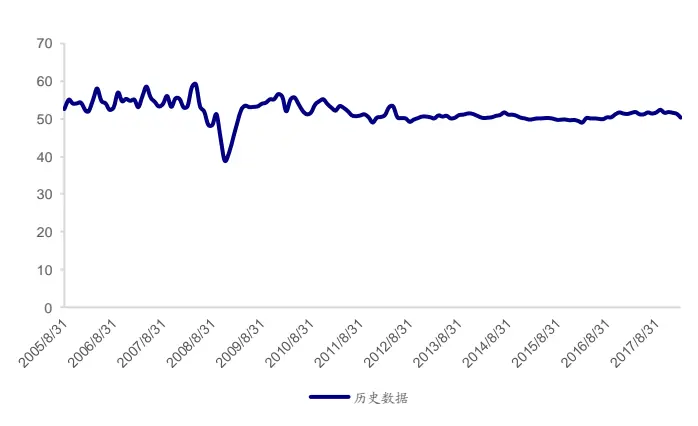
资料来源：Wind，Bloomberg，海通证券研究所

图4 中采制造业 PMI 历史数据差分（2005/8-2018/4）
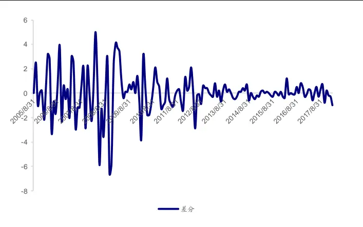
资料来源：Wind，Bloomberg，海通证券研究所

图5 中采制造业 PMI-Surprise（2005/8-2018/4）
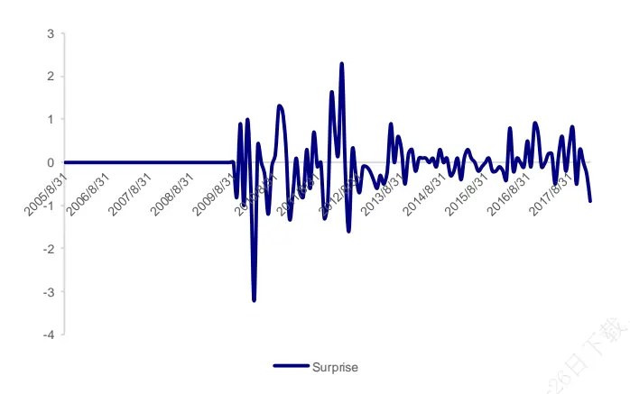
资料来源：Wind，Bloomberg，海通证券研究所

图6 中采制造业 PMI 模拟组合（2005/8-2018/4）
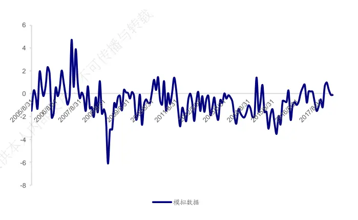
资料来源：Wind，Bloomberg，海通证券研究所

资产组合模拟法的优势不仅在于可以对原始数据进行修正，还体现在可以填补缺失数据。另外，在当期宏观数据尚未发布前，资产组合模拟法可以基于每日更新的资产组合报价与历史回归系数，提前获得最新的宏观数据模拟组合。这在一定程度上弥补了宏观数据发布时间滞后的问题。

下文中，我们均基于资产组合模拟法对季频与月频的原始宏观经济数据进行清洗和调整。随后，将个股过去 60 个月的超额收益对同期的模拟组合收益进行回归，获得系数作为 MacroBeta，即宏观敏感性。

图 7 展示了全市场股票对贸易差额的 MacroBeta 的分布情况（时序平均）。图中可见，不同股票对宏观经济指标的敏感性存在差异，MacroBeta 的整体分布呈一定的负偏形态。

图 8 展示了全市场股票对贸易差额的敏感性在时间序列上的变化。虽然大部分时间下两者之间呈负相关关系，但偶尔也会在一些短期窗口中出现正相关。

图7 全市场股票对贸易差额的 MacroBeta分布（时序平均）
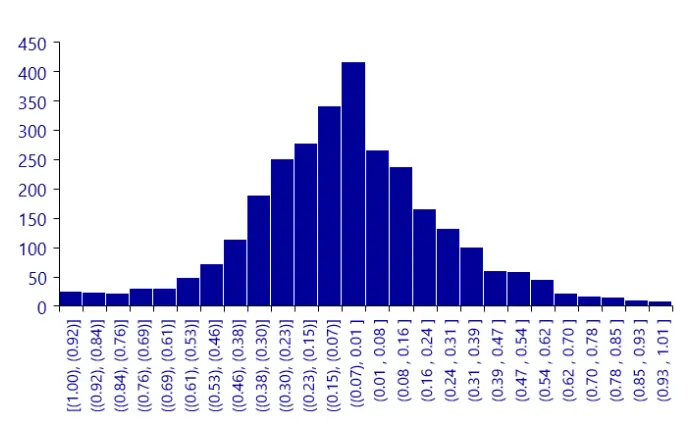
资料来源：Wind，Bloomberg，海通证券研究所

图8 全市场股票对贸易差额的 MacroBeta变化（截面平均）
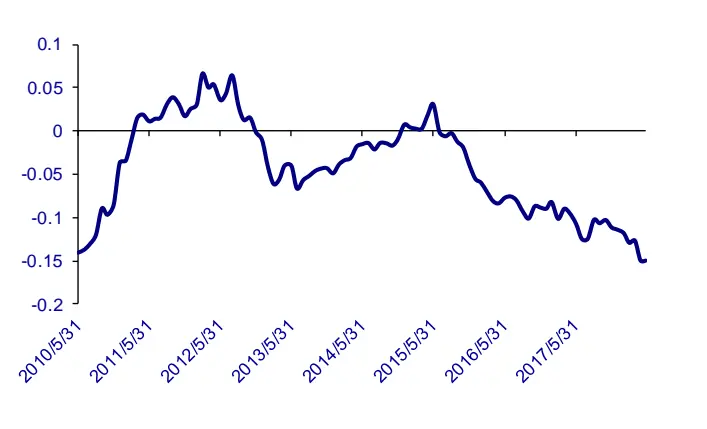
资料来源：Wind，Bloomberg，海通证券研究所

## 3. 宏观敏感性因子存在选股效果吗？

## 3.1宏观敏感性因子的分组收益

我们首先将宏观敏感性（MacroBeta）当作因子，根据其数值大小将股票分成 10组，计算各组股票下一期的平均收益。随后，为剔除风格因子的干扰，我们进一步测算了控制主要风格（市值、估值）后的分组收益。

第一组宏观敏感性因子基于国民经济指标，包括 gdp 同比、工业增加值当月同比、中采制造业 PMI、固定资产投资增速累计同比、社会消费零售总额同比。从图 9 可见，工业增加值当月同比以及中采制造业 PMI 的敏感性因子的分组收益存在单调性。

在控制风格以后，两者的单调性均有所下降，但多空收益差依然存在。

图9 国民经济指标敏感性因子分组收益
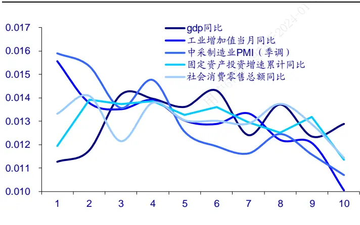
资料来源：Wind，Bloomberg，海通证券研究所

图10 国民经济指标敏感性因子控制主要风格后的分组收益
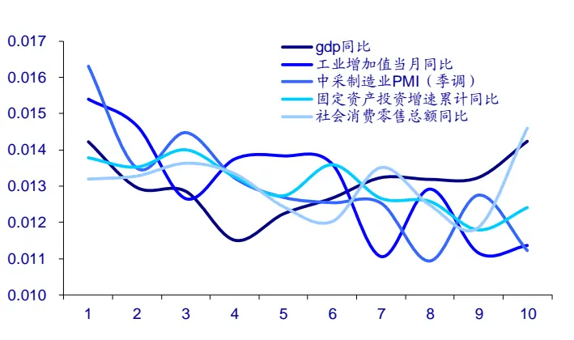
资料来源：Wind，Bloomberg，海通证券研究所

第二组宏观敏感性因子基于对外经济贸易类指标，包括出口同比、进口同比以及贸易差额。由以下两图可见，仅出口同比的敏感性因子的分组收益存在单调性。然而控制风格以后，单调性完全消失，并呈现出 U型的分组收益特征。

图11 外贸类指标敏感性因子分组收益
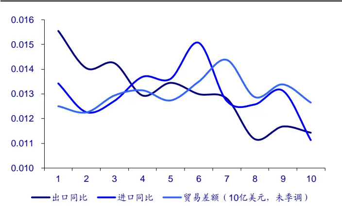
资料来源：Wind，Bloomberg，海通证券研究所

图12 外贸类指标敏感性因子控制主要风格后的分组收益
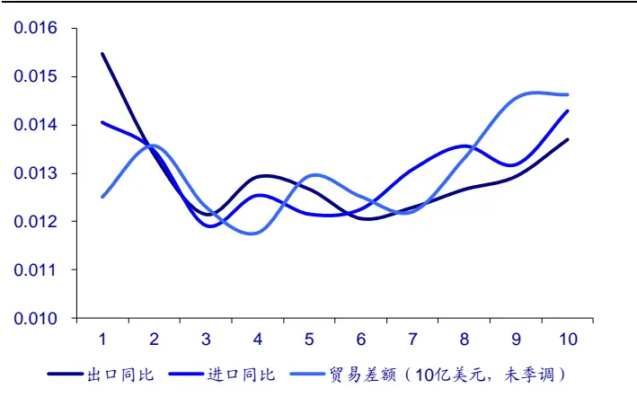
资料来源：Wind，Bloomberg，海通证券研究所

第三组宏观敏感性因子基于价格类指标，包括 cpi同比、ppi同比。由以下两图可见，该组指标的宏观敏感性因子存在明显的分组收益单调性，其中 ppi同比更为显著。控制常见风格以后，单调性虽有所下降，但依然存在。

图13 物价类指标敏感性因子分组收益
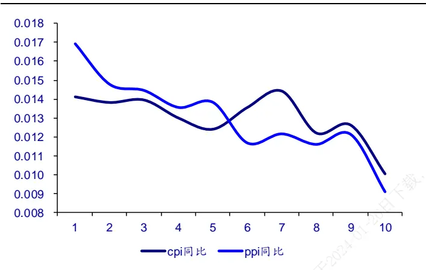
资料来源：Wind，Bloomberg，海通证券研究所

图14 物价类指标敏感性因子控制主要风格后的分组收益
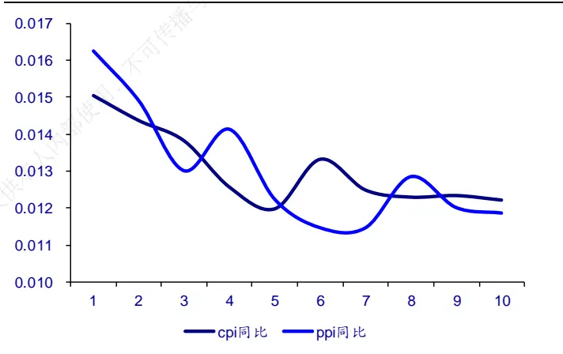
资料来源：Wind，Bloomberg，海通证券研究所

第四组宏观敏感性因子基于货币供给类指标，包括 m0、m1和 m2 的同比、外汇储备。由以下两图可见，外汇储备敏感性因子第十组的收益显著低于前九组，而其余指标并未发现明显的分组收益特征。控制主要的风格以后，外汇储备呈现一定的选股有效性。

图15 货币供给类指标敏感性因子分组收益
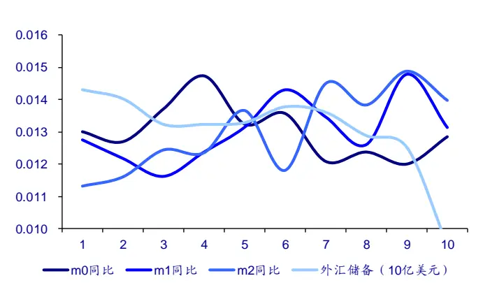
资料来源：Wind，Bloomberg，海通证券研究所

图16 货币供给类指标敏感性因子控制主要风格后的分组收益
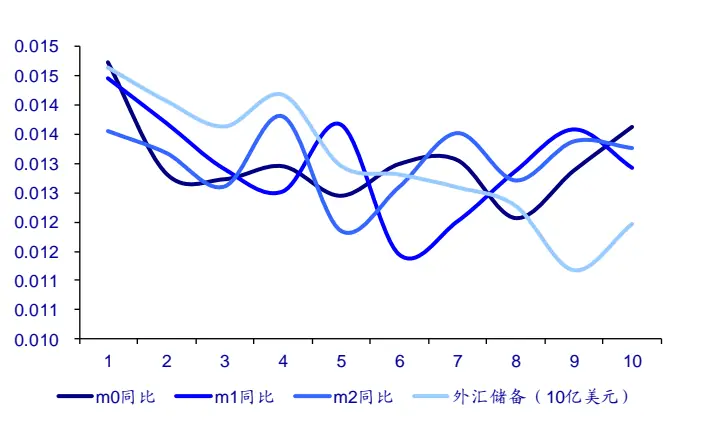
资料来源：Wind，Bloomberg，海通证券研究所

第五组宏观敏感性因子基于利率类指标，包括国债利率、期限利差、信用利差、TED

利差。由以下两图可见，各利率类指标的敏感性因子的分组收益均存在一定单调性。然而控制主要风格以后，单调性大幅下降。

图17 利率类指标敏感性因子分组收益
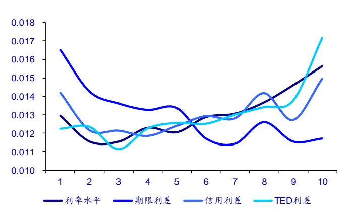
资料来源：Wind，Bloomberg，海通证券研究所

图 利率类指标敏感性因子控制主要风格后的分组收益
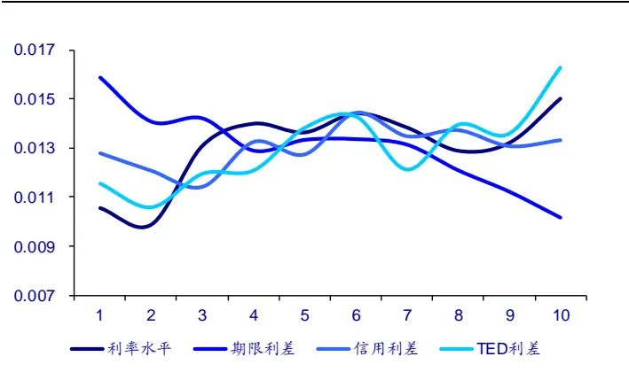
资料来源：Wind，Bloomberg，海通证券研究所

第六组宏观敏感性因子基于商品指标，包括代表贵金属的黄金与代表能源的布伦特原油。由下图可见，油价敏感性因子在不控制风格时，存在一定的多空收益特征。但控制风格以后，该特征完全消失。

图19 商品类指标敏感性因子分组收益
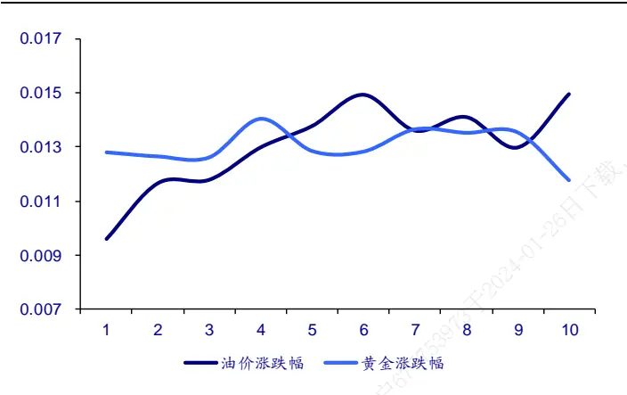
资料来源：Wind，Bloomberg，海通证券研究所

图20 商品类指标敏感性因子控制主要风格后的分组收益
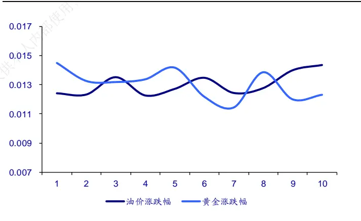
资料来源：Wind，Bloomberg，海通证券研究所

## 3.2宏观敏感性因子与常见因子相关性

从上文可见，大多数宏观敏感性因子在不控制风格时可以体现出一定的分组收益单调性。一旦控制风格，单调性均会明显下降。主要原因在于宏观敏感性高（正值）的股票常常以大市值为主，在回测窗口内 A股大市值股票收益往往较低，导致按宏观敏感性因子分组后的收益呈现单调性。

为说明这一现象，我们以物价类经济指标 ppi的敏感性因子为例，分析该因子与常见选股因子（市值、估值、换手、反转、波动、基本面）之间的相关性。

由下图可见，宏观敏感性因子越高的股票，对应右轴的收益越低。而从左轴对应的各组股票的常见因子值在全市场股票中的 Z-Score分位点可知，该因子主要与市值因子之间呈现明显的正相关关系。宏观敏感性越高的股票，市值越大。

图21 ppi敏感性因子的分布特征
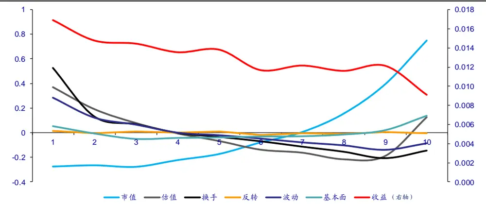
资料来源：Wind，Bloomberg，海通证券研究所

## 3.3宏观敏感性因子的选股有效性统计

下表展示了所有宏观敏感性因子在剥离风格以后的选股有效性统计，包括多空收益差及其 T 值和胜率、IC 及其 T 值和胜率。

表 宏观敏感性因子的选股有效性统计

|  | 多空收益差 -均值 | 多空收益差 -T | 多空收益差 -胜率 | IC -均值 | IC -T | IC -胜率 |
| --- | --- | --- | --- | --- | --- | --- |
| gdp 同比 | 0.000 | 0.407 | 0.458 | 0.001 | 0.126 | 0.500 |
| 工业增加值当月同比 | -0.004 | -1.615 | 0.448 | -0.010 | -1.398 | 0.438 |
| 中采制造业 PMI | -0.005 | -1.399 | 0.469 | -0.006 | -0.750 | 0.406 |
| 固定资产投资增速累计同比 | -0.001 | -0.209 | 0.531 | -0.002 | -0.269 | 0.469 |
| 社会消费零售总额同比 | -0.001 | -0.508 | 0.521 | -0.007 | -1.005 | 0.521 |
| 出口同比 | -0.002 | -1.577 | 0.427 | -0.006 | -0.933 | 0.490 |
| 进口同比 26 | -0.000 | -0.661 | 0.500 | -0.006 | -0.724 | 0.479 |
| 贸易差额 | 0.002 | 0.054 | 0.521 | 0.007 | 1.132 | 0.542 |
| cpi 同比 | -0.003 | -1.343 | 0.438 | -0.014 | -1.090 | 0.458 |
| ppi同比 | -0.004 | -1.826 | 0.448 | -0.014 | -1.652 | 0.458 |
| m0 同比 | 0.001 | -0.064 | 0.490 | 0.000 | -0.027 | 0.448 |
| m1 同比 | 0.002 | 0.115 | 0.479 | 0.000 | -0.043 | 0.448 |
| m2 同比 | 0.000 | 0.760 | 0.500 | 0.005 | 0.612 | 0.510 |
| 新增人民币贷款 | 0.006 | 0.333 | 0.563 | 0.008 | 0.879 | 0.604 |
| 外汇储备 | -0.003 | -0.996 | 0.521 | -0.006 | -0.707 | 0.521 |
| 利率水平 | 0.003 | 1.034 | 0.542 | 0.001 | 0.118 | 0.500 |
| 期限利差 | -0.005 | -1.287 | 0.458 | -0.011 | -1.235 | 0.438 |
| 信用利差 | 0.001 | 0.194 | 0.500 | -0.003 | -0.466 | 0.417 |
| TED 利差 | 0.005 | 1.219 | 0.442 | 0.011 | 1.203 | 0.473 |
| 油价涨跌幅 | 0.002 | 1.377 | 0.542 | 0.008 | 1.046 | 0.521 |
| 黄金涨跌幅 | -0.002 | -0.407 | 0.521 | 0.001 | 0.104 | 0.479 |

资料来源：Wind，Bloomberg，海通证券研究所

由上表可见，剥离风格以后的宏观敏感性因子并无明显选股特征。多空收益差以及IC 的 T 值并不高，胜率也较低。我们有理由怀疑，上一节呈现出的微弱单调性并不可靠，更有可能是个别几期的极端收益所引起的。

不过，在测试的 21 个宏观敏感性指标中，也有工业增加值当月同比与 ppi同比两个宏观敏感性因子的多空收益差 T 值较高，分别为-1.615 与-1.826。那么，是否可以认为这两个指标存在微弱的选股效果，可以被纳入选股模型呢？事实上，答案并非如此。直接使用宏观敏感性因子选股，存在着不易察觉的陷阱。

## 4. 选股策略中该如何使用宏观敏感性因子？

## 4.1宏观敏感性因子选股的陷阱

尽管部分宏观因子在控制风格以后，也能呈现出一定的单调性。但如果据此认为它们有选股能力，那就会落入一个陷阱。我们继续以 ppi同比的敏感性因子为例。

图 22 展示了月度多空收益序列。2015 年 12 月以前胜率非常高，但之后却出现了明显的反转。图 23 的多空收益净值曲线也呈现了相似的特征，2015 年 12 月后发生明显的回撤。

对比图 24 中的 ppi走势可以发现，该指标同样在 2015 年 12 月前后发生了趋势性的变化。从持续下行，转为趋势性向上。如果我们忽视这一变化，继续按照表 4中 ppi的敏感性因子 IC为负的结论，选择低敏感性的股票，就会导致在 ppi上升时期，得到和预期完全相反的选股效果。

图22 ppi敏感性因子月度多空收益
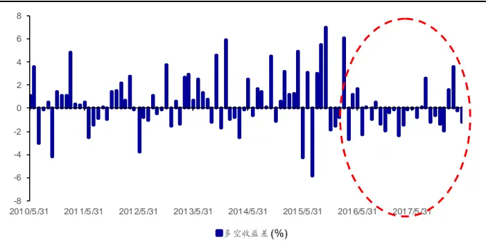
资料来源：Wind，Bloomberg，海通证券研究所

图23 ppi敏感性因子多空净值曲线
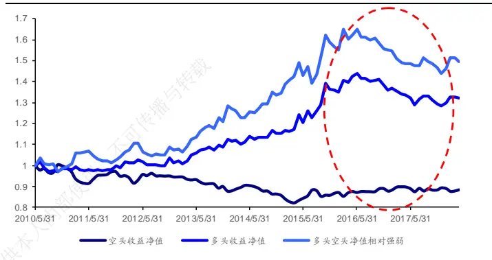
资料来源：Wind，Bloomberg，海通证券研究所

图24 ppi 当月同比
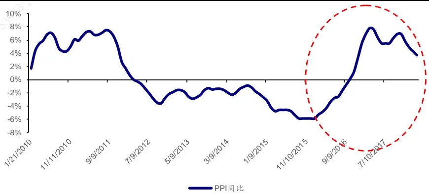
资料来源：Wind，Bloomberg，海通证券研究所

由此可见，ppi敏感性因子看似存在选股能力，实际上只是因为我们选择的低敏感性股票恰好契合了 2010 年-2015 年间 ppi的下行。

这就是宏观敏感性因子选股的陷阱。这类因子只是刻画了股票与宏观经济指标之间的关系，包括方向与程度。而从上面这个例子可知，选股的有效性不仅和因子的大小有关，还和未来宏观经济指标本身的变化相关。因此，使用宏观敏感性因子选股的正确逻辑应该是，当预测宏观经济指标上升时，选择正敏感或高敏感的股票。反之，选择负敏感或低敏感的股票。

与 ppi指标相似，利用工业增加值的敏感性因子选股也会遭遇这样的问题。从以下三图可见，由于我们一直选择低敏感的股票，当工业增加值从 2015 年年中起不再下降，该因子也就丧失了选股能力。

图25 工业增加值敏感性因子月度多空收益
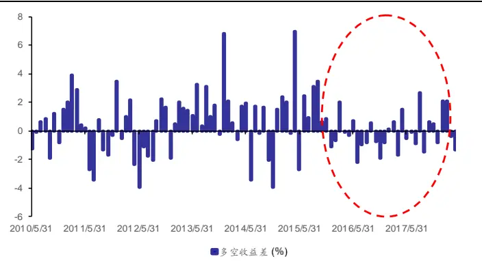
资料来源：Wind，Bloomberg，海通证券研究所

图26 工业增加值敏感性因子多空净值曲线
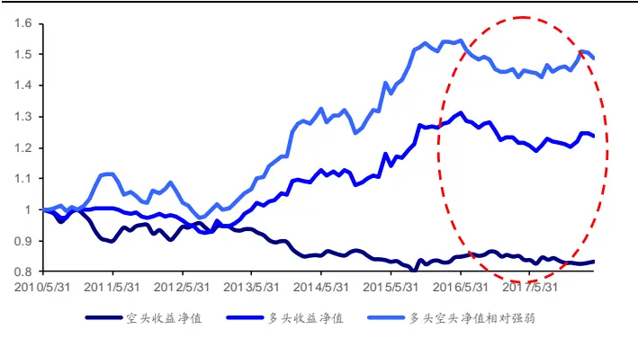
资料来源：Wind，Bloomberg，海通证券研究所

图27 工业增加值当月同比
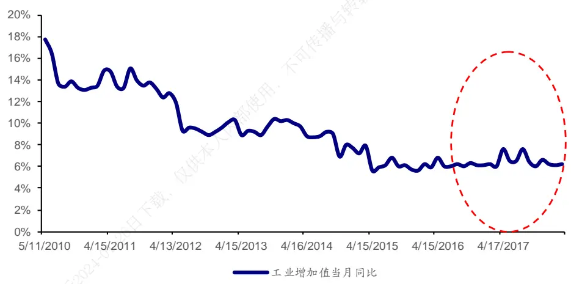
资料来源：Wind，Bloomberg，海通证券研究所

## 4.2基于宏观得分的选股逻辑

以上两个案例表明，想要利用宏观经济指标帮助选股，有两个必不可少的前提。一是每个股票对宏观经济指标的敏感性，二是未来的宏观环境或是宏观经济指标的变化方向。将两者结合，我们可定义：

宏观得分 = 宏观敏感性 × 预期宏观经济走势。即

$$
\begin{array}{rl}{Score}&{{}=MacroBeta\mathrm{~~\times~}\boldsymbol{F}}\end{array}
$$

在选股时，根据 t 期个股的宏观敏感性以及投资者对 t+1 期宏观经济的预判，计算得到每个股票的得分，如下式所示。排序后，选择得分最高的若干个股票形成组合。

$$
Score_{t+1}=MacroBeta_{t}\times P_{t+1}
$$

还是以 ppi同比为例。假设每一期选股时，我们都明确知道下一期 ppi的实际值，用它与上一期的差分值乘以每个股票的敏感性得到宏观得分进行选股。虽然这种回测并不是真实的（ppi实际值无法提前知晓），但我们至少可以检验上述基于宏观得分的选股逻辑是否合理。

图28与图29分别对应仅根据ppi敏感性因子选股的月度多空收益序列及多空净值曲线，图 30 与图 31 是知晓下一期 ppi实际值后的结果。显然，后者的净值曲线在 2015年后依然稳定向上。这表明，基于宏观得分的选股逻辑存在可行性。

图28 ppi敏感性因子月度多空收益
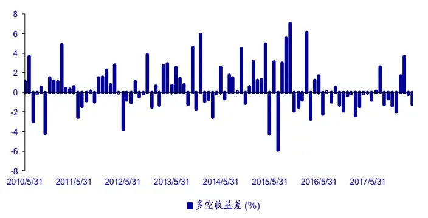
资料来源：Wind，Bloomberg，海通证券研究所

图29 ppi敏感性因子多空净值曲线
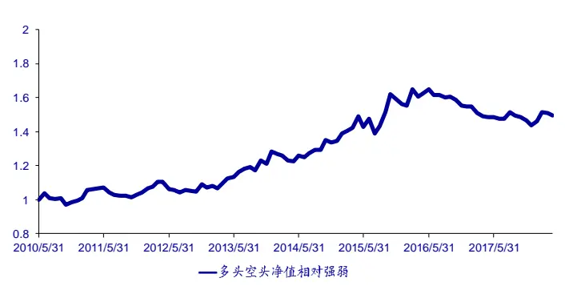
资料来源：Wind，Bloomberg，海通证券研究所

图30 ppi敏感性因子宏观得分月度多空收益
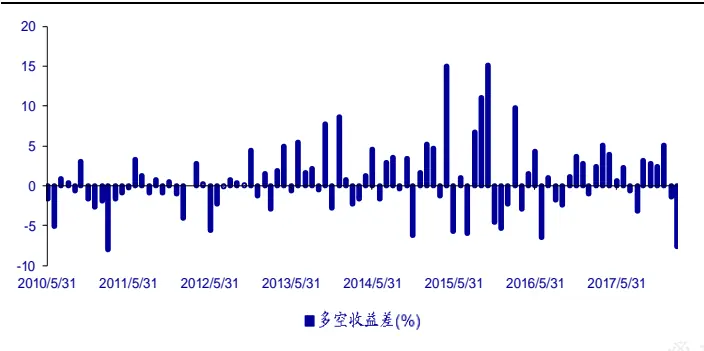
资料来源：Wind，Bloomberg，海通证券研究所

图31 ppi敏感性因子宏观得分多空净值曲线
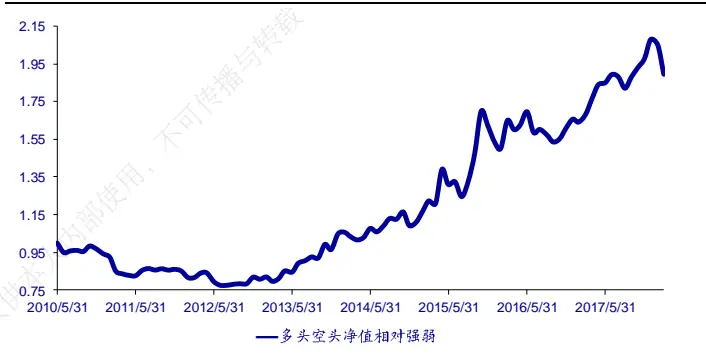
资料来源：Wind，Bloomberg，海通证券研究所

类似地，我们采用油价敏感性因子作为补充案例。油价在我们的回测窗口内，经历了趋势性的上涨和下跌（因篇幅原因，此处未展示）。根据宏观因子的选股逻辑，倘若始终选择对油价敏感性高或低的股票，势必造成因子只能在一种价格变化趋势中有效。

图32和33展示的是对油价高敏感性的股票相对低敏感性股票的多空收益差及多空净值曲线。拐点恰好对应了油价在 2015 年到达顶点，并进入下行通道之际。

图 34 和 35 是假设已知下一期的油价涨跌后，利用宏观得分进行选股的结果。显然，不论油价上涨还是下跌，因子都展现出了不错的选股效果。

图32 油价敏感性因子月度多空收益
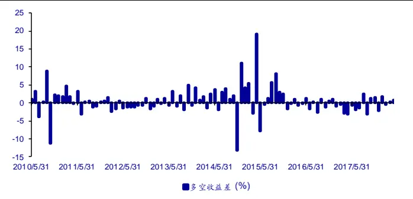
资料来源：Wind，Bloomberg，海通证券研究所

图33 油价敏感性因子多空净值曲线
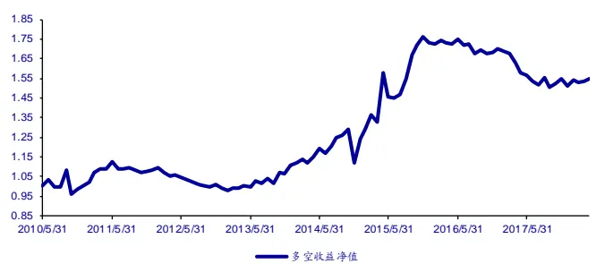
资料来源：Wind，Bloomberg，海通证券研究所

图34 油价敏感性因子宏观得分月度多空收益
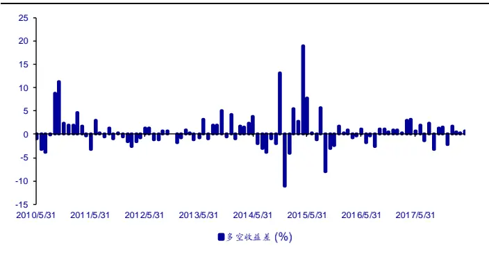
资料来源：Wind，Bloomberg，海通证券研究所

图35 油价敏感性因子宏观得分多空净值曲线
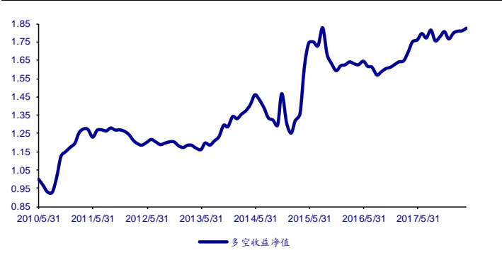
资料来源：Wind，Bloomberg，海通证券研究所

## 4.3宏观敏感性指标的跨期稳定性

上述两个案例似乎说明了，已知未来宏观经济指标的走势后，通过宏观敏感性计算宏观得分便可以用来选股。但遗憾的是，这一方法并不是对每个宏观经济指标都有效。外汇储备的敏感性因子就是一个典型的例子。

图36 外汇储备敏感性因子月度多空收益
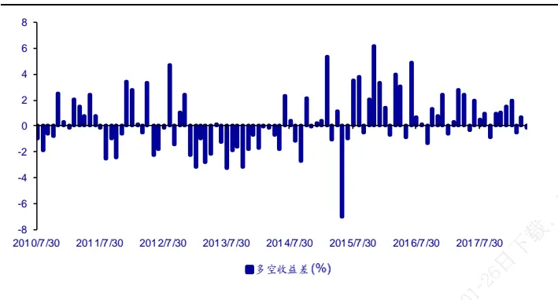
资料来源：Wind，Bloomberg，海通证券研究所

图37 外汇储备敏感性因子多空净值曲线
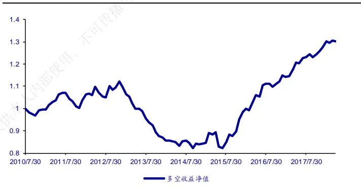
资料来源：Wind，Bloomberg，海通证券研究所

对比图 36、37 和图 38、39 可见，在只使用敏感性因子选股时，多空净值曲线在2012 年末至 2014 年中出现了长时间的回撤。而使用宏观得分后，这段时间的表现虽然得到了改善，但多空净值曲线却从 2015 年 12 月回撤至今。到底是哪里出了问题，我们从宏观敏感性因子的选股逻辑中找寻答案。

图38 外汇储备敏感性因子宏观得分月度多空收益
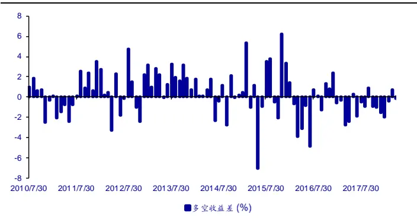
资料来源：Wind，Bloomberg，海通证券研究所

图39 外汇储备敏感性因子宏观得分多空收益净值曲线
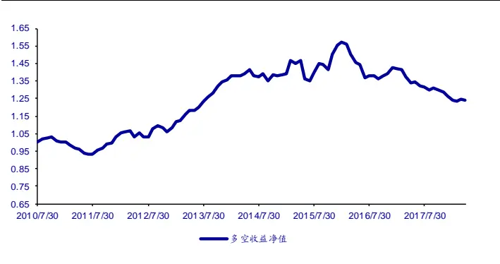
资料来源：Wind，Bloomberg，海通证券研究所

我们认为，当未来宏观经济指标上升（下降）时，应当选择高（低）敏感性的股票。然而，所有股票对宏观经济指标的敏感性都是基于历史数据计算得到的。一旦这种关系无法延续到未来，基于宏观得分的选股逻辑仍然难以奏效。那么，外汇储备敏感性因子是否恰好属于这种情况呢？对此，我们进行了如下的跨期稳定性测试。

将 T 期所有股票的敏感性因子对 T-N期的因子进行回归（下式），获得系数 $\mathbf{{\mathcal{L}}}\mathbf{\partial}_{\mathbf{{\Phi}}}\mathbf{{\mathcal{L}}}\mathbf{\partial}_{\mathbf{{\Phi}}}$

$$
\begin{array}{r}{F_{p,t}=a_{t}+b_{t}F_{p,t-n}+\varepsilon_{p,t}}\end{array}
$$

通过检验 $\mathbf{\nabla}\cdot\mathbf{b}_{t},$ 在时间序列上的显著性，度量敏感性因子的跨期稳定性。

下图展示了前文提到的所有宏观敏感性因子的 T 值。可以发现，外汇储备的跨期稳定性显著低于 ppi同比和油价涨跌幅。因此，我们认为，敏感性因子自身稳定性的不足，可能是它的宏观得分选股效果不佳的重要原因。

图40 宏观敏感性因子的跨期稳定性比较
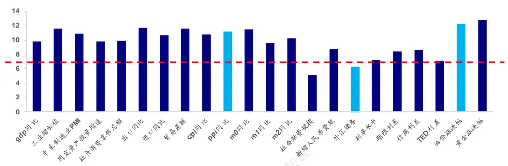
资料来源：Wind，Bloomberg，海通证券研究所

此外，由上图可见，国民经济指标、进出口贸易类指标以及物价水平类指标的稳定性高于其余指标。据此我们猜测，股票相对这些与企业经营直接相关的宏观经济指标的敏感性，在跨期稳定性上的表现更佳，更适合构建宏观得分，并应用于选股。

当然，我们还是要强调一点，上述检验均假设了已知未来的宏观经济环境。在实际投资中，则需要投资者提前预判，而准确性也将决定最终的选股效果。

## 5. 思考与总结

宏观数据多被应用于资产配臵与行业轮动，本报告尝试在微观的选股层面上进行探索，以期为投资者提供参考。

本文首先探讨宏观经济如何影响股票的收益，并尝试使用宏观敏感性刻画股票与宏观经济指标之间的联系。

需要注意的是，宏观经济数据相较其他常见数据，面临的问题更多，包括公布时间滞后、数据发布频率不稳定、缺失值多、序列不平稳等。实际使用时，我们推荐通过差分法、Surprise 替代法、资产组合模拟法等方式进行预加工处理。

我们首先将宏观敏感性——MacroBeta 当作选股因子，测试它是否存在选股效果。结果发现，大多数宏观敏感性因子在不进行风格控制时，可以体现出一定的分组收益单调性。但控制风格后，单调性均会明显下降。主要原因在于宏观敏感性高（大于零）的股票以大市值为主，在回测窗口内 A股大市值股票收益往往较低，导致按宏观敏感性因子分组后的收益呈现单调性。一旦剥离常见风格，仅有极少数宏观敏感性因子依然存在选股效果。

然而，进一步分析发现，剥离风格后的宏观敏感性因子的选股效果，也并非来源于因子本身，而是由于在回测区间内恰好暴露于正确的宏观经济指标的变化方向上。于是，我们得到结论，宏观敏感性因子只是刻画了股票与宏观经济指标之间的关系，包括方向与程度。使用宏观敏感性因子选股的正确逻辑应该是，当预测宏观经济指标上升时，选择正敏感或高敏感的股票。反之，选择负敏感或低敏感的股票。

根据上述思路，我们提出了基于宏观得分的选股方法。定义宏观得分 = 宏观敏感性 × 预期宏观经济走势。但是，详细的实证研究也表明，该选股策略想要获得成功严重依赖于两个方面。一是对宏观经济走势的正确判断，二是宏观敏感性因子在时间序列上的稳定性。我们发现，与企业经营直接相关的经济指标，其敏感性的稳定性较好，可以尝试用来选股。

## 6. 风险提示

市场系统性风险、模型误设风险、有效因子变动风险。

## 信息披露

分析师声明

[Table冯佳睿yst金融工程研究团s] 队

吕丽颖金融工程研究团队

本人具有中国证券业协会授予的证券投资咨询执业资格，以勤勉的职业态度，独立、客观地出具本报告。本报告所采用的数据和信息均来自市场公开信息，本人不保证该等信息的准确性或完整性。分析逻辑基于作者的职业理解，清晰准确地反映了作者的研究观点，结论不受任何第三方的授意或影响，特此声明。

## 法律声明

本报告仅供海通证券股份有限公司（以下简称 本公司 ）的客户使用。本公司不会因接收人收到本报告而视其为客户。在任何情况下，本报告中的信息或所表述的意见并不构成对任何人的投资建议。在任何情况下，本公司不对任何人因使用本报告中的任何内容所引致的任何损失负任何责任。

本报告所载的资料、意见及推测仅反映本公司于发布本报告当日的判断，本报告所指的证券或投资标的的价格、价值及投资收入可能会波动。在不同时期，本公司可发出与本报告所载资料、意见及推测不一致的报告。可

市场有风险，投资需谨慎。本报告所载的信息、材料及结论只提供特定客户作参考，不构成投资建议，也没有考虑到个别客户特殊的用投资目标、财务状况或需要。客户应考虑本报告中的任何意见或建议是否符合其特定状况。在法律许可的情况下，海通证券及其所属部关联机构可能会持有报告中提到的公司所发行的证券并进行交易，还可能为这些公司提供投资银行服务或其他服务。人

本报告仅向特定客户传送，未经海通证券研究所书面授权，本研究报告的任何部分均不得以任何方式制作任何形式的拷贝、复印件或复制品，或再次分发给任何其他人，或以任何侵犯本公司版权的其他方式使用。所有本报告中使用的商标、服务标记及标记均为本公司的商标、服务标记及标记。如欲引用或转载本文内容，务必联络海通证券研究所并获得许可，并需注明出处为海通证券研究所，且下不得对本文进行有悖原意的引用和删改。26

根据中国证监会核发的经营证券业务许可，海通证券股份有限公司的经营范围包括证券投资咨询业务。24

## 海通证券股份有限公司研究所[Table_PeopleInfo]

路 颖所长

(021)23219403 luying@htsec.com

高道德 副所长(021)63411586 gaodd@htsec.com

姜 超副所长

(021)23212042 jc9001@htsec.com

| 邓勇 副所长 (021)23219404 dengyong@htsec.com | 荀玉根 | 副所长 (021)23219658 xyg6052@htsec.com | 钟奇 (021)23219962 zq8487@htsec.com | 所长助理 |  |
| --- | --- | --- | --- | --- | --- |
| 涂力磊 所长助理 (021)23219747 tll5535@htsec.com |  |  |  |  |  |
| 宏观经济研究团队 姜 超(021)23212042 于 博(021)23219820 顾潇啸(021)23219394 梁中华(021)23154142 联系人 李金柳(021)23219885 宋 潇(021)23154483 陈 兴(021)23154504 固定收益研究团队 | 金融工程研究团队 jc9001@htsec.com 高道德(021)63411586 yb9744@htsec.com 冯佳睿(021)23219732 gxx8737@htsec.com 郑雅斌(021)23219395 lzh10403@htsec.com 罗 蕾(021)23219984 沈泽承(021)23212067 ljl11087@htsec.com 余浩淼(021)23219883 sx11788@htsec.com 袁林青(021)23212230 cx12025@htsec.com 姚 石(021)23219443 吕丽颖(021)23219745 联系人 周一洋(021)23219774 张振岗(021)23154386 | gaodd@htsec.com fengjr@htsec.com zhengyb@htsec.com I19773@htsec.com szc9633@htsec.com yhm9591@htsec.com ylq9619@htsec.com ys10481@htsec.com lly10892@htsec.com zyy10866@htsec.com zzg11641@htsec.com 颜 伟(021)23219914 yw10384@htsec.com 梁 镇(021)23219449 lz11936@htsec.com | 金融产品研究团队 高道德(021)63411586 倪韵婷(021)23219419 陈 瑶(021)23219645 唐洋运(021)23219004 宋家骥(021)23212231 皮 灵(021)23154168 徐燕红(021)23219326 薛 涵(021)23154167 联系人 谈 鑫(021)23219686 王毅(021)23219819 wy10876@htsec.com 蔡思圆(021)23219433 csy11033@htsec.com 庄梓恺(021)23219370 zzk11560@htsec.com | gaodd@htsec.com niyt@htsec.com chenyao@htsec.com tangyy@htsec.com sjj9710@htsec.com pl10382@htsec.com xyh10763@htsec.com xh11528@htsec.com tx10771@htsec.com |  |
| 朱征星(021)23219981 周 霞(021)23219807 zx6701@htsec.com 高 上(021)23154132 姜珮珊(021)23154121 jps10296@htsec.com 李 影(021)23154117 联系人 | 策略研究团队 jc9001@htsec.com 荀玉根(021)23219658 zzx9770@htsec.com 钟 青(010)56760096 联系人 | xyg6052@htsec.com zq10540@htsec.com gs10373@htsec.com ly11082@htsec.com 联系人 | 中小市值团队 张 宇(021)23219583 钮宇鸣(021)23219420 孔维娜(021)23219223 潘莹练(021)23154122 | zy9957@htsec.com ymniu@htsec.com kongwn@htsec.com pyl10297@htsec.com |  |
| 杜 佳(021)23154149 李 波(021)23154484 政策研究团队 李明亮(021)23219434 陈久红(021)23219393 吴一萍(021)23219387 | dj11195@htsec.com Ib11789@htsec.com 石油化工行业 | 姚 佩(021)23154184 yp11059@htsec.com 唐一杰(021)23219406 tyj11545@htsec.com 郑子勋(021)23219733 zzx12149@htsec.com dengyong@htsec.com | 王鸣阳(021)23219356 程碧升(021)23154171 相 姜(021)23219945 医药行业 | wmy10773@htsec.com cbs10969@htsec.com xj11211@htsec.com |  |
| 朱 蕾(021)23219946 周洪荣(021)23219953 | Iml@htsec.com chenjiuhong@htsec.com wuyiping@htsec.com 联系人 zl8316@htsec.com zhr8381@htsec.com | 邓 勇(021)23219404 朱军军(021)23154143 zjj10419@htsec.com 胡歆(021)23154505 hx11853@htsec.com |  | 余文心(0755)82780398 ywx9461@htsec.com 郑 琴(021)23219808 zq6670@htsec.com 孙 建(021)23154170 sj10968@htsec.com |  |
| 王 旭(021)23219396 | wx5937@htsec.com |  | 联系人 | 师成平(010)50949927 scp10207@htsec.com |  |
| 王 猛(021)23154017 wm10860@htsec.com |  |  |  |  |  |
|  | 公用事业 |  |  |  |  |
|  |  |  |  | 吴佳栓(010)56760092 |  |
|  |  |  |  | hwb10850@htsec.com |  |
|  |  |  |  | 贺文斌(010)68067998 |  |
|  |  |  |  | wjs11852@htsec.com |  |
|  |  |  |  | 范国钦 02123154384 fgq12116@htsec.com |  |
| 汽车行业 |  |  |  |  |  |
|  |  | 吴 杰(021)23154113 | 批发和零售贸易行业 |  |  |
|  |  | wj10521@htsec.com | 汪立亭(021)23219399 |  |  |
| 杜 威(0755)82900463 | dw11213@htsec.com | 张 磊(021)23212001 zi10996@htsec.com |  | wanglt@htsec.com |  |
| 谢亚彤(021)23154145 xyt10421@htsec.com | 联系人 |  | 李宏科(021)23154125 | Ihk11523@htsec.com |  |
|  |  | 戴元灿(021)23154146 dyc10422@htsec.com | 联系人 |  |  |
|  |  | 傅逸帆(021)23154398 |  | 史岳 sy11542@htsec.com |  |
| 互联网及传媒 |  |  | fyf11758@htsec.com |  |  |
|  |  | 有色金属行业 |  |  |  |
|  |  | 施 毅(021)23219480 | 房地产行业 |  |  |
| 钟 奇(021)23219962 zq8487@htsec.com |  | 联系人 | sy8486@htsec.com |  |  |
|  |  |  |  | 涂力磊(021)23219747 tll5535@htsec.com |  |
| 郝艳辉(010)58067906 hyh11052@htsec.com |  | 李姝醒(021)23219401 | 谢 盐(021)23219436 | xiey@htsec.com |  |
| 许樱之 xyz11630@htsec.com |  | Isx11330@htsec.com | 联系人 |  |  |
|  |  | cxh11840@htsec.com | 杨 凡(021)23219812 |  |  |
| 孙小雯(021)23154120 | sxw10268@htsec.com | 陈晓航(021)23154392 lj11875@htsec.com |  | yf11127@htsec.com |  |
| 刘 欣(010)58067933 |  |  | 金 晶(021)23154128 |  |  |
|  | lx11011@htsec.com | 李 骥(021)23154513 gjy11909@htsec.com |  | jj10777@htsec.com |  |
| 强超廷(021)23154129 | qct10912@htsec.com | 甘嘉尧(021)23154394 |  |  |  |
| 联系人 |  |  |  |  |  |
|  | cxg11774@htsec.com |  |  |  |  |
| 毛云聪(010)58067907 |  |  |  |  |  |
|  | myc11153@htsec.com |  |  |  |  |
| 陈星光(021)23219104 |  |  |  |  |  |
| 电子行业 | 陈 平(021)23219646 cp9808@htsec.com |  | 煤炭行业 | 电力设备及新能源行业 |  |
|  |  |  | 李 淼(010)58067998 Im10779@htsec.com | 张一弛(021)23219402 | zyc9637@htsec.com |
| 联系人 |  |  | 戴元灿(021)23154146 dyc10422@htsec.com | 房 青(021)23219692 fangq@htsec.com |  |
|  |  | 谢 磊(021)23212214 xl10881@htsec.com | 吴 杰(021)23154113 wj10521@htsec.com | 曾 彪(021)23154148 zb10242@htsec.com |  |
| 尹 |  | 苓(021)23154119 yl11569@htsec.com |  | 徐柏乔(021)23219171 xbq6583@htsec.com |  |
| 石 |  | 坚(010)58067942 sj11855@htsec.com |  | 张向伟(021)23154141 | zxw10402@htsec.com |

| 基础化工行业 | 计算机行业 |  | 通信行业 |  |
| --- | --- | --- | --- | --- |
| 刘 威(0755)82764281 Iw10053@htsec.com | 郑宏达(021)23219392 zhd10834@htsec.com |  | 朱劲松(010)50949926 zjs10213@htsec.com |  |
| 刘海荣(021)23154130 Ihr10342@htsec.com | 黄竞晶(021)23154131 hjj10361@htsec.com |  |  | 余伟民(010)50949926 ywm11574@htsec.com |
| 张翠翠(021)23214397 zcc11726@htsec.com | 杨 林(021)23154174 yl11036@htsec.com |  | 联系人 |  |
| 孙维容(021)23219431 swr12178@htsec.com 联系人 | 鲁 立(021)23154138 联系人 | II11383@htsec.com | 张峥青(021)23219383 zzq11650@htsec.com |  |
| 李 智(021)23219392 lz11785@htsec.com | 洪 琳(021)23154137 hl11570@htsec.com |  |  |  |
|  | 于成龙 ycl12224@htsec.com |  |  |  |

| 非银行金融行业 |  | 交通运输行业 | 虞 楠(021)23219382 yun@htsec.com | 纺织服装行业 梁 希(021)23219407 lx11040@htsec.com |
| --- | --- | --- | --- | --- |
|  | 孙 婷(010)50949926 st9998@htsec.com |  |  |  |
|  | 何 婷(021)23219634 ht10515@htsec.com |  | 联系人 | 联系人 |
| 联系人 |  |  | 李 丹(021)23154401 Id11766@htsec.com | 盛 开(021)23154510 sk11787@htsec.com |
| 李芳洲(021)23154127 Ifz11585@htsec.com | 夏昌盛(010)56760090 xcs10800@htsec.com |  | 党新龙(0755)82900489 dxl12222@htsec.com |  |

| 建筑建材行业 | 机械行业 |  | 钢铁行业 |  |
| --- | --- | --- | --- | --- |
| 钱佳佳(021)23212081 qjj10044@htsec.com | 余炜超(021)23219816 swc11480@htsec.com |  | 刘彦奇(021)23219391 liuyq@htsec.com |  |
| 冯晨阳(021)23212081 fcy10886@htsec.com | 耿 耘(021)23219814 | gy10234@htsec.com | 联系人 | 周慧琳(021)23154399 zhl11756@htsec.com |
| 联系人 申 浩(021)23154114 sh12219@htsec.com | 杨 震(021)23154124 沈伟杰(021)23219963 | yz10334@htsec.com swj11496@htsec.com |  | 刘 璇 lx11212@htsec.com |

| 建筑工程行业 |  | 农林牧渔行业 |  | 食品饮料行业 |  |
| --- | --- | --- | --- | --- | --- |
| 杜市伟(0755)82945368 dsw11227@htsec.com | 丁 频(021)23219405 | dingpin@htsec.com |  | 闻宏伟(010)58067941 | whw9587@htsec.com |
| 张欣劫 zxj12156@htsec.com | 陈雪丽(021)23219164 |  | cxl9730@htsec.com | 成珊(021)23212207 | cs9703@htsec.com |
| 李富华(021)23154134 Ifh12225@htsec.com | 陈 阳(021)23212041 |  | cy10867@htsec.com | 唐 宇(021)23219389 | ty11049@htsec.com |

| 军工行业 | 银行行业 |  | 社会服务行业 |  |
| --- | --- | --- | --- | --- |
| 张恒晅 zhx10170@hstec.com | 孙 婷(010)50949926 st9998@htsec.com |  | 汪立亭(021)23219399 wanglt@htsec.com |  |
| 蒋 俊(021)23154170 jj11200@htsec.com | 联系人 林加力(021)23154923 ljl12245@htsec.com |  | 联系人 | 陈扬扬(021)23219671 cyy10636@htsec.com |
| 刘 磊(010)50949922 II11322@htsec.com |  | 谭敏沂(0755)82900489 tmy10908@htsec.com |  |  |
| 联系人 张宇轩(021)23154172 zyx11631@htsec.com |  |  |  |  |

| 家电行业 | 造纸轻工行业 |  |
| --- | --- | --- |
| 陈子仪(021)23219244 chenzy@htsec.com |  | 衣桢永(021)23212208 yzy12003@htsec.com |
| 联系人 | 曾知(021)23219810 zz9612@htsec.com |  |
| 李 阳 ly11194@htsec.com |  | 洋(021)23154126 zy10340@htsec.com |
| 朱默辰(021)23154383 zmc11316@htsec.com |  |  |
| 刘 璐(021)23214390 II11838@htsec.com |  |  |

## 研究所销售团队

深广地区销售团队

蔡铁清(0755)82775962 ctq5979@htsec.com

伏财勇(0755)23607963 fcy7498@htsec.com

辜丽娟(0755)83253022 gulj@htsec.com

刘晶晶(0755)83255933 liujj4900@htsec.com

王雅清(0755)83254133 wyq10541@htsec.com

饶 伟(0755)82775282 rw10588@htsec.com

欧阳梦楚(0755)23617160

oymc11039@htsec.com

宗 亮 zl11886@htsec.com

巩柏含 gbh11537@htsec.com

上海地区销售团队上海地区销售团队

胡雪梅(021)23219385 huxm@htsec.com
朱 健(021)23219592 zhuj@htsec.com
季唯佳(021)23219384 jiwj@htsec.com
黄 毓(021)23219410 huangyu@htsec.com漆冠男(021)23219281 qgn10768@htsec.com胡宇欣(021)23154192 hyx10493@htsec.com黄 诚(021)23219397 hc10482@htsec.com毛文英(021)23219373 mwy10474@htsec.com马晓男 mxn11376@htsec.com
杨祎昕(021)23212268 yyx10310@htsec.com方烨晨(021)23154220 fyc10312@htsec.com张思宇 zsy11797@htsec.com
慈晓聪(021)23219989 cxc11643@htsec.com王朝领 wcl11854@htsec.com
北京地区销售团队
殷怡琦(010)58067988 yyq9989@htsec.com
吴 尹 wy11291@htsec.com
张丽萱(010)58067931 zlx11191@htsec.com
杨羽莎(010)58067977 yys10962@htsec.com
杜 飞 df12021@htsec.com
张 杨(021)23219442 zy9937@htsec.com
李铁生(010)58067934 lts10224@htsec.com
何 嘉 hj12311@htsec.com

海通证券股份有限公司研究所

地址：上海市黄浦区广东路 689号海通证券大厦 9楼

电话：（021）23219000

传真：（021）23219392

网址：www.htsec.com