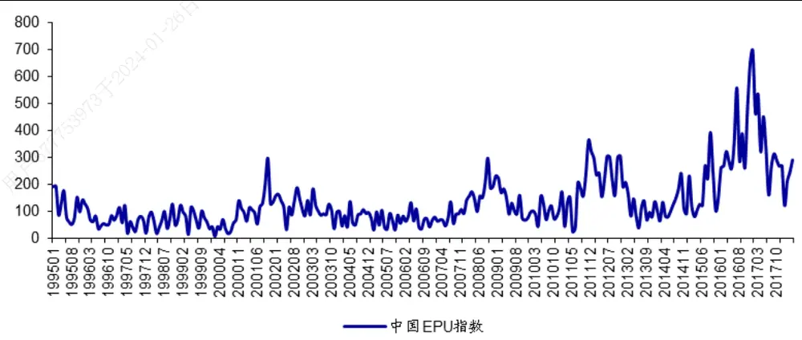
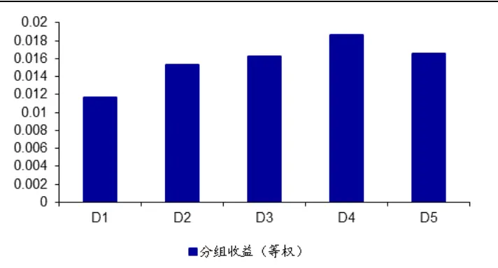
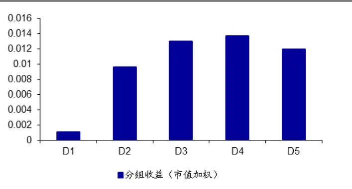
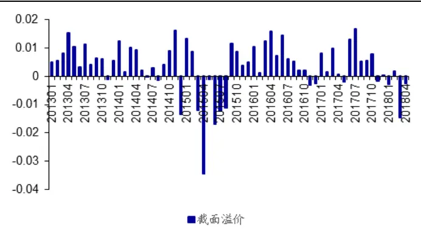
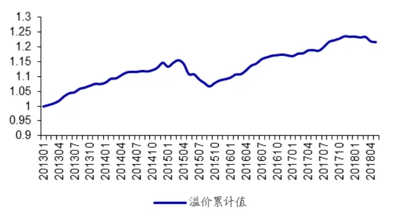
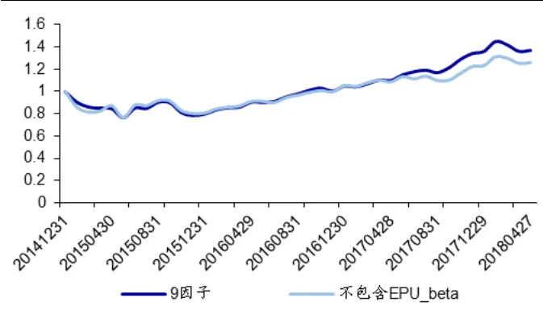
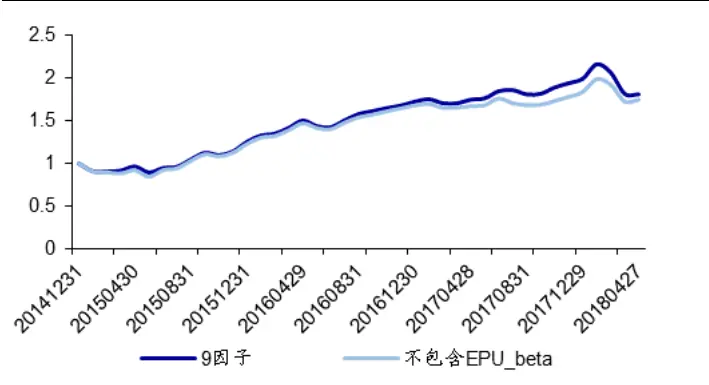
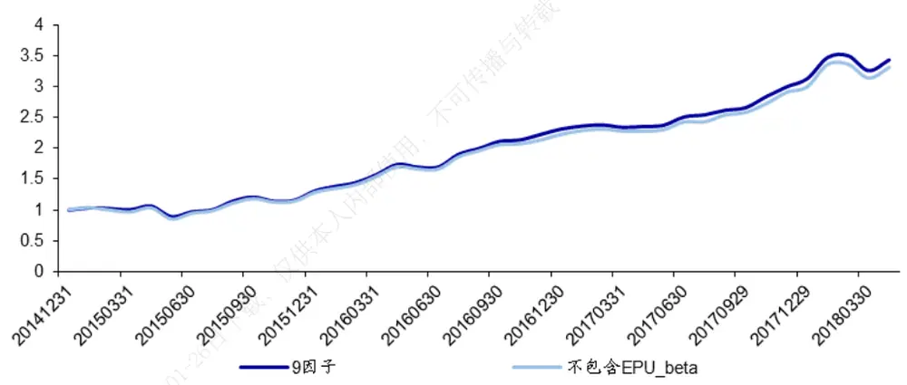

## [Tab相关研究

Table_ReportInfo]《股市极值及收益率预测模型的周度择时研究》2018.07.06

《解禁、两融、陆股通、股票质押的截面溢价》2018.07.02

《沪深 300 VS 中证 500——指数轮动研究》2018.06.21

分析师:冯佳睿

Tel:(021)23219732

Email:fengjr@htsec.com

证书:S0850512080006

联系人:周一洋

Tel:(021)23219774

Email:zyy10866@htsec.com

# 选股因子系列研究（三十五）——宏观经济的不确定性在 A股市场被定价了吗？

## 投资要点：

- 中国宏观经济不确定性指数（EPU 指数）是反应宏观经济不确定性程度的量化指标。由来自西北大学、斯坦福大学与芝加哥大学的三位学者 Scott R. Baker、Nicholas. Bloom 和 Steven J. Davis 发布。具体编制方法为，在中国香港发行量最大的英文报刊——南华早报上，通过搜索关键词“uncertain/uncertainty”，“economic/economy”，“policy”、“tax”等筛选出与经济不确定相关的文章，经过统计和标准化处理后得到。

- 美国市场上，宏观经济的不确定性并没有被完全定价。具体表现为，对不确定性敏感度越高的股票，未来的收益越低。一种可能的解释是，敏感度较低的股票在经济不确定性上升时收益较低。因此，风险厌恶的投资者若持有这部分股票，就会要求以更高的预期收益的形式得到额外的补偿。

- A股市场上，对宏观经济不确定性较高的股票，预期收益也更高。通过时间序列回归计算每个股票在 EPU 指数上的回归系数，记为 EPU_beta。把 A 股市场上所有可交易的股票，按照这个因子从小到大分成 组。在等权和市值加权两种方式下，每组的平均收益呈单调上升的态势，且首尾组合的收益差显著异于零。

- A股市场上常用的选股因子并不能解释 EPU_beta 分组的超额收益。在控制了市值、反转、 等常见因子后， 的分组收益与因子值依然呈现正相关性。首尾组合的收益差在 的水平下，显著大于零。而且，在控制了换手率和特质波动率这两个因子后，分组收益的单调性更为突出。

股市场上，宏观经济的不确定性似乎只有在大市值股票中未被合理定价。先将所有可交易的 股按市值由小到大等分成 组，随后在每个市值组别中，按EPU_beta 再等分成 5 组。只有在市值最大的一组中，EPU_beta 和预期收益才表现出明显的正相关。而在其余的市值组别中，分组收益的单调性较弱，首尾组合的收益差在统计意义上也不显著异于零。

在沪深 成分股中， 因子的选股效果突出。 均值为 ，接近 2，胜率也达到了 3/4。在原先的 8 因子模型中加入 EPU_beta 后，多空组合的年化收益从 7.28%提升至 9.87%，波动率从 18.23%下降至 15.25%。因而，夏普比率也获得了明显的提高（0.647 v.s 0.399）。

- 风险提示。市场系统性风险、资产流动性风险以及模型失效风险会对最终结果产生较大影响。

近年来，对宏观经济不确定性的研究成为了业界和学术界的热门话题。有一种观点认为，这种不确定性会改变人们的消费与投资行为，进而对资产的定价产生影响。受此启发，本文考察了“宏观经济的不确定性是否在 A股市场被定价”这一问题。

## 1. 宏观经济不确定性指数（EPU Index）

经济政策不确定性指数（Economic Policy Uncertainty Index，EPU），是反应宏观经济不确定性程度的量化指标。最早由来自西北大学、斯坦福大学与芝加哥大学的三位学者 Scott R. Baker、Nicholas. Bloom 和 Steven J. Davis 共同编制，主要用来度量美国宏观经济不确定性的高低。该指数由三个基本组成部分，依次为报刊上含有“经济不确定性”相关词组的文章数量、未来 10 年按例将要失效的税法章程、分析师对宏观经济指标预期的分歧度。第三部分所涉及的经济指标包括，CPI 以及联邦政府、各州政府和地方政府的采购规模。在形成 EPU 指数时，这三个部分各自的权重分别为 1/2、1/6和 1/3。其中，CPI 和政府采购预期分歧度的权重相同，都为 1/6。

指数甫一推出，便受到了市场极大的关注。于是，三位学者又进一步编制并发布了多个国家和地区，乃至全球的经济不确定性指数，这其中也包括中国。和美国的 EPU指数有三个组成部分不同，中国的 EPU 指数仅包含新闻关键词这一个方面。具体的编制方法为，在中国香港发行量最大的英文报刊——南华早报上，通过搜索关键词“uncertain/uncertainty”，“economic/economy”，“policy”、“tax”等筛选出与经济不确定相关的文章，经过统计和标准化处理后得到中国的 EPU 指数。

下图是中国的 EPU 指数自 1995 以来的走势。图中 EPU 指数每次升高都与当时严峻的经济形势一一对应。如，08 到 09 年，美国次贷危机对我国的影响逐渐凸显；12 年，欧债危机的不确定性传导至国内；17 年，美国新总统对华政策的不确定性与外界对中国经济增速下行的担忧。随着中美贸易战的进一步升级，EPU 指数从今年 1月以来不断上升。截止 2018 年 4 月底，中国 EPU 指数已经达到了去年 11月以来的新高——291.3。

图1 中国 EPU 指数（1995.1-2018.4）

资料来源：http://www.policyuncertainty.com，海通证券研究所

## 2. 宏观经济的不确定性在美国市场被定价了吗？

Bali1等人研究了 1972年 6月到 2014年 12月间，美国的宏观经济不确定性指数（记为 UNC 指数）对 NYSE，Amex，Nasdaq 中股票收益的影响。作者首先用 60 个月的月度数据滚动估计个股收益对 Fama-French 三因子及 UNC 指数的回归方程，并将 UNC前的回归系数记为 。随后，根据 的大小把股票分成 10 组，并按照等权和市值加权两种方式计算未来一个月的平均收益。

下表展示了分组收益和首尾组合的收益差。在 最低（Low）的一组中，等权和市值加权的月平均收益分别为 1.13%和 0.93%；经 FF3因素及动量和流动性因子调整后的 alpha 分别为 0.28%和 0.31%，均为十组中最高。反观 最高（High）的一组，不论是在何种方式计算下，原始收益和 均为最低。

表 1 美国市场上 的分组收益（1972.6-2014.12）

|  | $\beta^{\psi\nu\varepsilon}$ | 等权 |  |  |  | 市值加权 |  |  |  |
| --- | --- | --- | --- | --- | --- | --- | --- | --- | --- |
|  |  | 原始收益 | t值 | a | t值 | 原始收益 | t值 | a | t值 |
| Low | -0.62 | 1.13% | 3.60 | 0.28% | 2.85 | 0.93% | 2.87 | 0.31% | 1.69 |
| 2 | -0.29 | 1.03% | 4.06 | 0.24% | 3.38 | 0.73% | 2.74 | 0.09% | 0.62 |
| 3 | -0.18 | 1.01% | 4.29 | 0.24% | 3.71 | 0.72% | 3.08 | 0.16% | 1.83 |
| 4 | -0.09 | 0.92% | 4.08 | 0.17% | 2.84 | 0.75% | 3.47 | 0.17% | 1.73 |
| 5 | -0.03 | 0.88% | 4.05 | 0.15% | 2.72 | 0.55% | 2.62 | -0.03% | -0.33 |
| 6 | 0.04 | 0.88% | 4.07 | 0.15% | 3.34 | 0.68% | 3.28 | 0.07% | 1.12 |
| 7 | 0.11 | 0.88% | 3.95 | 0.11% | 1.75 | 0.68% | 3.32 | 0.03% | 0.50 |
| 8 | 0.19 | 0.81% | 3.56 | 0.02% | 0.35 | 0.58% | 2.69 | -0.10% | -1.23 |
| 9 | 0.32 | 0.78% | 3.11 | -0.04% | -0.63 | 0.62% | 2.57 | -0.08% | -1.03 |
| High | 0.72 | 0.62% | 2.06 | -0.28% | -3.38 | 0.53% | 1.72 | -0.25% | -2.22 |
| High-Low |  | -0.51% | -3.81% | -0.56% | -4.55 | -0.40% | -1.93 | -0.56% | -2.45 |

资料来源：Is Economic Uncertainty Priced in the Cross-section of Stock Returns，海通证券研究所整理

等权和市值加权计算的最高组减最低组（High-Low）的原始收益差分别为-0.51%和，并且显著异于零。这表明，在美国市场上，对宏观经济不确定性敏感度较低的股票，未来能获得显著的超额收益。对此，作者的解释是，风险和不确定性是不同的。第一组中的股票，其 小于零，意味着它在经济不确定性上升时的收益较低（由得到$\beta^{UNC}\sharp\sharp$ 回归方程可知）。因此，风险厌恶的投资者若持有这部分股票，就会要求以更高的预期收益的形式得到额外的补偿。而第十组中的股票，可以被看作是在经济不确定性上升时更加安全的资产，故投资者愿意为其支付更高的价格，并接受其较低的预期收益。

为了确认 和预期收益之间的负相关性，作者进一步考察了 Fama-Macbeth 回归和双变量分组的结果。和预期一致，在控制了常见的因子后， 依然具备不能被解释的选股能力。因此，作者认为，在美国市场上，宏观经济的不确定性并没有被完全定价。具体表现为，对不确定性敏感度越高的股票，未来的收益越低。

## 3. 中国市场的经济不确定性因子及其选股有效性

## 3.1 $\beta^{EPU}$ 因子及其性质

本文仿照美国市场的做法，以中国的 指数作为对宏观经济不确定性的度量，并和中国市场的 Fama-French 三因子共同形成四因子模型，通过最近 60 个月的数据滚动估计个股在 $EPU_{\tau}$ 上的回归系数 $\mathcal{B}_{i,t}^{\mathcal{EPU}}$ 。具体的回归方程如下：

$$
\begin{array}{r}{\mathtt{Re}_{i,t}=\alpha_{i,t}+\beta_{i,t}^{EPU}*EPU_{t}+\beta_{i,t}^{MKT}*MKT_{t}+\beta_{i,t}^{SMB}*SMB_{t}+\beta_{i,t}^{HMZ}*HML_{t}+\epsilon_{i,t}}\end{array}
$$

其中， $\mathtt{Re}_{\mathrm{i},\tau}$ 为股票 第 月的收益。

$\beta_{i,t}^{\bar{z}\bar{p}U}$ 高的股票表明其与 EPU 有较强的相关性，即经济较不确定性越高，股票收益越好，可以认为有比较强的抗风险能力。而当经济不确定性减弱的时候，这部分股票的收益往往会下降。

不过，上述回归看似合理，实则存在一定的问题。由于是时间序列回归，因而在没有协整关系存在的情况下，应当要求所有变量都是平稳的。否则，长期均衡关系的前提假设就会被打破。在所有的变量中，个股和市场的收益、SMB 和 HML 都是价格的差分值，一般可视作是平稳序列。唯一存疑的是 EPU 指数的平稳性。为此，本文对其进行检验。该检验的原假设是序列存在单位根，即不平稳。具体结果如下表所示。

表 2 EPU 指数的平稳性检验（1995.1-2018.4）

| lag | 0 | 1 | 2 | 3 | 4 |
| --- | --- | --- | --- | --- | --- |
| p值 | 0.0010 | 0.0010 | 0.0030 | 0.0141 | 0.0208 |

资料来源：http://www.policyuncertainty.com，Wind，海通证券研究所

由上表可见，在滞后阶数为 0-4 时，检验的 p 值都小于 0.05。这说明序列存在单位根的原假设被拒绝，EPU 指数是平稳的。由此计算得到 $\big|\beta_{i,t}^{\ EPU}$ 因子，可以用做进一步的研究和分析。

除了平稳性，另一个问题也值得关注。每个股票的 $\beta_{i,t}^{\bar{E}\bar{P}\bar{U}}$ 因子均是基于历史数据计算得到，但却被用作预测未来的股票收益。这一做法实际上暗含着一个基本假定，即， $\beta_{i,t}^{\bar{z}\bar{p}U}$ 因子在时间序列上并不会发生很大的变动。为了验证这一性质，本文采用了横截面自回归的方式予以研究。

首先，构建单因子的自回归，分别提取未来 6 个月、12 个月、24 个月、36 个月的$\beta_{i,t+\tau}^{\bar{E}\bar{P}U}$ 因子与当前的 $\beta_{i,t}^{\bar{z}\bar{p}v}$ 因子构建如下的回归模型。其中，T=6，12，24 和 36。

$$
\beta_{i,t+T}^{EPU}=\alpha_{t}+\rho_{t}^{1}\beta_{i,t}^{EPU}+\epsilon_{i,t}
$$

其次，加入 A 股市场常用的 8 个选股因子——市值、PB、反转、ROE、换手率、非流动性、特质波动率和 beta 的滞后项，构建如下的多元回归模型。

$$
\beta_{i,t+T}^{EPU}=\alpha_{t}+\rho_{t}^{1}*\beta_{i,t}^{EPU}+\rho_{t}^{2}*\mathrm{Size}_{i,t}+\rho_{t}^{2}*\mathrm{PB}_{i,t}+\cdots+\rho_{t}^{9}*\mathrm{IVOL}_{i,t}+\epsilon_{i,t}
$$

下表列示了这两个模型中， $\beta_{i,t}^{\ EPU}$ 因子前的回归系数估计值及其 t 值。

表 3 $\beta_{i\alpha}^{EPt}$ 的自回归系数（2013.1-2018.4）

| $\rho_{t}^{1}$ | t值 仅 | $\rho_{t}^{1}$ (控制 8 个因子) | t值 |
| --- | --- | --- | --- |
| 6个月 | 0.85 | 78.75 0.85 | 80.73 |
| 12个月 | 0.70 | 44.35 0.70 | 44.65 |
| 24个月 | 0.40 | 18.67 0.40 | 19.62 |
| 36个月 | 0.15 | 7.75 0.15 | 9.16 |

资料来源：http://www.policyuncertainty.com，Wind，海通证券研究所

由上表可见，不论是否控制其他 8个因子，代表 $\mathcal{B}_{i,t}^{\bar{z}\bar{p}v}$ 因子在时间序列上稳定性的系数 始终显著大于零。而且，12 个月以内的回归系数保持在 0.7 以上。这表明， $\beta_{i,t}^{\bar{z}\bar{p}U}$ 因子是股票比较稳定的属性，可以作为一个新的因子考察其选股效果。

## 3.2 $\beta^{EPU}$ 因子的选股有效性检验

## 3.2.1 单变量分组

在每个月末，按照 ${\boldsymbol{\beta}}^{{\varepsilon}pv}$ 因子把 A 股市场上所有可交易的股票（剔除 ST、停牌、涨停及上市不满 6 个月的股票），从小到大分成 5 组，依次记为 D1，D2，…，D5。分别计算等权和市值加权两种方式下，每组的平均收益（见下图）。

图2 因子分组收益（等权，2013.1-2018.4）

资料来源：http://www.policyuncertainty.com，Wind，海通证券研究所

图3 因子分组收益（市值加权，2013.1-2018.4）

资料来源：http://www.policyuncertainty.com，Wind，海通证券研究所

和美国的结果不同，A 股市场上个股的 和预期收益呈现正相关。下表进一步给出了按 将所有股票分成 5 组后，每组的 均值、次月的平均/市值加权收益、及Fama-French 三因子模型的 alpha。

表 4 因子及分组收益（2013.1-2018.4）

|  | βEPU | 等权 城 |  | 市值加权 |  |
| --- | --- | --- | --- | --- | --- |
|  |  | 原始收益 (t 值) | FF3-alpha (t值) | 原始收益 (t值) | FF3-alpha (t 值) |
| Low | -1.40 | 1.17% (1.06) | -0.77% (-4.64) | 0.11% (0.12) | -1.16% (-4.88) |
| 2 | -0.50 | 1.53% | -0.45% (-2.82) | 0.96% (1.16) | -0.14% (-0.77) |
| 3 | 0.02 | 1.63% (1.50) | -0.29% (-1.99) | 1.31% (1.45) | 0.11% (0.56) |
| 4 | 0.53 26日下载 | 1.86% (1.66) | 0.01% (0.08) | 1.37% (1.49) | 0.20% |
| High 2024 | 1.39 | 1.65% (1.43) | -0.19% | 1.20% | (1.08) -0.02% |
| High-Low |  | 0.48% | (-0.87) | (1.28) | (-0.10) |
|  |  |  | 0.58% | 1.09% | 1.15% |
|  |  | (2.01) | (2.56) | (3.01) | (3.54) |

资料来源：http://www.policyuncertainty.com，Wind，海通证券研究所

由上表可见，尽管分组收益并未呈现严格的单调特征，但首尾组合（High-Low）的收益差及 之差，均显著大于零。这表明，在 A 股市场上，那些在宏观经济不确定性较高时期表现较好的股票，未来依然能延续这种表现。

如果说，美国市场的投资者在预见到未来宏观经济的不确定性有可能上升后，会买入高 的股票以抵御或对冲风险，从而造成这部分股票的预期收益下降。那么，A 股市场并不存在这一现象。这有可能是两个市场的投资者结构与成熟程度不同所导致的。

## 3.2.2 双变量分组

尽管从单因子的分组中找到了 能够区分股票未来收益的证据，但众所周知，A 股市场上存在着众多异象，如，小市值、反转、流动性等等。一个合理的怀疑是， 的选股有效性会不会是这些异象的另一种呈现。

为此，本文首先考察了 与常见因子之间的关系，具体包括市值、PB、反转、ROE、换手率、Amihud非流动性、特质波动率、CAPM的beta。下表给出的是每一个 分组内，上述8 个因子的平均值。

表 5 分组中常见因子的分布特征（2013.1-2018.4）

|  | βε | 市值 | PB | 反转 | ROE | 换手率 | 非流动性 | 特质波动率 | βMKT |
| --- | --- | --- | --- | --- | --- | --- | --- | --- | --- |
| Low | -1.402 | 0.278 | -0.080 | -0.106 | -0.130 | -0.181 | -0.063 | -0.052 | 0.121 |
| 2 | -0.497 | 0.170 | -0.233 | -0.075 | -0.101 | -0.230 | -0.084 | -0.146 | -0.018 |
| 3 | 0.018 | 0.112 | -0.245 | -0.053 | -0.065 | -0.227 | -0.049 | -0.147 | -0.056 |
| 4 | 0.527 | 0.078 | -0.199 | -0.021 | -0.018 | -0.180 | -0.034 | -0.075 | -0.031 |
| High | 1.384 | 0.125 | -0.050 | 0.038 | -0.014 | -0.022 | -0.087 | 0.136 | -0.009 |

资料来源：http://www.policyuncertainty.com，Wind，海通证券研究所

由上表可见，高 分组中的股票大体呈现小市值、高 ROE、高换手率、高特质波动率以及前期高涨幅的特征。为了控制这些因子的影响，本文采用双变量分组法，具体步骤如下：

1） 按照每一个控制变量将所有可交易的 A股由小到大等分成 5 组；

2） 在每一个控制变量组中，再按 由小到大等分成 5小组。计算 5×5 个组别中，每组的平均收益；

3） 在每个 组别中，计算 5个控制变量组收益的平均值。

下表是按上述步骤分别对 和市值、PB 等 8 个因子进行双变量分组后，得到的平均收益。

表 6 双变量分组的平均收益（2013.1-2018.4）

| BEPU | 市值 | PB | 反转 | ROE | 换手率 | 非流动性 | 特质波动率 | βKT |
| --- | --- | --- | --- | --- | --- | --- | --- | --- |
| Low | 1.28% | 1.16% | 1.23% | 1.21% | 1.18% | 1.22% | 1.14% | 1.16% |
|  | (1.14) | (1.06) | (1.12) | (1.10) | (1.08) | (1.10) | (1.04) | (1.05) |
| 2 | 1.50% | 1.52% | 1.58% | 1.51% | 1.46% | 1.54% | 1.47% | 1.59% |
|  | (1.38) | (1.39) | (1.44) | (1.38) | (1.31) | (1.41) | (1.34) | (1.45) |
| 3 | 1.62% (1.48) | 1.63% (1.48) | 1.60% (1.48) | 1.66% (1.53) | 1.63% (1.49) | 1.64% (1.51) | 1.59% (1.45) | 1.59% (1.46) |
| 4 | 1.83% | 1.82% | 1.84% 753973- | 1.86% | 1.78% | 1.82% | 1.79% | 1.84% |
|  | (1.66) | (1.62) | (1.64) | (1.66) | (1.60) | (1.63) | (1.61) | (1.66) |
| High | 1.66% | 1.72% | 1.64% | 1.60% | 1.84% | 1.67% | 1.88% | 1.70% |
|  | (1.46) | (1.51) | (1.43) | (1.38) | (1.62) | (1.46) | (1.64) | (1.46) |
| High-Low | 0.38% | 0.56% | 0.41% | 0.38% | 0.66% | 0.45% | 0.74% | 0.54% |
|  | (1.71) | (2.48) | (1.74) | (1.66) | (2.84) | (2.25) | (3.21) | (2.27) |

资料来源：http://www.policyuncertainty.com，Wind，海通证券研究所

在控制了常见因子后， 的分组收益依然保持了与单变量分组时一致的分布特征。首尾组合的收益差在 10%的水平下，显著大于零。而且，在控制了换手率和特质波动率这两个因子后，分组收益的单调性更为突出。由此可见，A 股市场上常用的选股因子并不能解释 分组的超额收益。

## 3.3 因子在大、中市值股票中的选股有效性分析

由上一节可知，尽管在控制市值因子后， 因子依然和预期收益正相关。但首尾组合的收益差及其 t 值，相比单因子分组的结果，均出现了一定幅度的下降。因此，本文单独考察了市值和 双变量分组后，各组的平均收益（见下表）。

表 7 市值和 双变量分组的平均收益（2013.1-2018.4）

|  | Low | 2 | 3 | 4 | High |
| --- | --- | --- | --- | --- | --- |
| Small | 2.58% | 2.59% | 2.55% | 2.78% | 2.79% |
| 2 | 1.48% | 1.76% | 1.89% | 2.02% | 1.80% |
| 3 | 1.18% | 1.22% | 1.30% | 1.66% | 1.29% |
| 4 | 1.00% | 1.15% | 1.25% | 1.71% | 1.24% |
| Big | 0.18% | 0.80% | 1.11% | 0.97% | 1.20% |

资料来源：http://www.policyuncertainty.com，Wind，海通证券研究所

从上表中可以发现一个有趣的现象，只有在市值最大的一组（Big）中， $\beta^{\bar{z}PU}$ 和预期收益才表现出明显的正相关，首尾组合的收益差高达 1.02%。而在其余的市值组别中，分组收益的单调性较弱，首尾组合的收益差在统计意义上也不显著异于零。这似乎意味着，A股市场上，宏观经济的不确定性只有在大市值股票中未被合理定价。

为了证实这一猜测，本文进一步在沪深 300 和中证 500 的成分股中，检验了 $\beta^{\bar{z}\bar{p}v}$ 的分组收益。下表展示的是沪深 300 成分股中的结果。

表 8 在沪深 300 成分股中的分组收益（2013.1-2018.4）

|  | βEPU | 等权 |  | 市值加权 |  |
| --- | --- | --- | --- | --- | --- |
|  |  | 原始收益 (t 值) | FF3-alpha (t值) | 原始收益 (t 值) | FF3-alpha (t值) |
| Low | -1.46 | 0.33% (0.33) | -1.25% (-5.88) | 0.20% (0.20) | -1.09% (-3.13) |
| 2 | -0.50 | 0.74% | -0.79% (-4.39) | 0.54% (0.73) | -0.38% (-1.76) |
| 3 | 0.02 | 1.04% (1.10) | -0.31% (-1.68) | 1.08% (1.22) | 0.19% (0.83) |
| 4 | 0.52 日下载 | 1.22% (1.33) | 0.05% (0.20) | 1.20% | 0.17% |
| High | 1.32 | 1.52% | 0.56% | (1.29) 1.58% | (0.58) 0.85% |
|  | 2024 | (1.65) 1.19% | (2.72) 1.80% | (1.70) | (2.80) |
| High-Low |  | (3.13) | (5.52) | 1.38% (2.74) | 1.94% (4.14) |

资料来源：http://www.policyuncertainty.com，Wind，海通证券研究所

由上表可见，沪深 300 的成分股在按 等分成 5 组后，不论是等权还是市值加权，分组收益都呈现出严格的单调特征。首尾组合的原始收益差分别为 1.19%和 1.38%，对应的 t 值为 3.13 和 2.74，均显著高于全市场的分组结果。同时，Fama-French 三因素模型的 alpha 之差及其 t值也都出现了明显的上升。

反观中证 500 成分股的对应结果，除了分组收益间单调性的显著下降以外，首尾组合的原始收益和 alpha 之差，在 5%的水平下均不显著。

表 9 在中证 500 成分股中的分组收益（2013.1-2018.4）

|  | βEPU | Equal-weighted |  | Value-weighted |  |
| --- | --- | --- | --- | --- | --- |
|  |  | 原始收益 (t值) | FF3-alpha (t值) | 原始收益 (t 值) | FF3-alpha (t值) |
| Low | -1.43 | 1.02% | -0.48% | 0.82% | -0.50% |
|  |  | (0.97) | (-1.95) | (0.79) | (-1.91) |
| 2 | -0.52 | 1.34% | -0.45% | 1.21% | -0.43% |
|  |  | (1.28) | (-2.05) | (1.17) | (-1.83) |
| 3 | 0.02 | 1.51% | -0.07% | 1.46% | 0.10% |
|  |  | (1.45) | (-0.38) | (1.40) | (0.47) |

| 4 | 1.71% 0.52 (1.61) | 0.31% (1.20) | 1.57% 0.36% (1.47) (1.32) |
| --- | --- | --- | --- |
| High | 1.52% 1.36 (1.37) | 0.02% 1.34% (0.06) (1.20) | 0.10% (0.32) |
| High-Low | 0.50% (1.69) | 0.50% (1.72) | 0.52% 0.60% (1.52) (1.83) |

资料来源：http://www.policyuncertainty.com，Wind，海通证券研究所

以上对比证实了双变量分组的结果，即， $\beta^{\bar{z}\bar{p}\bar{\upsilon}}$ 因子在市值较大的股票中具有较强的选股能力。

下表列示的是 ${\boldsymbol{\beta}}^{{\boldsymbol{\varepsilon}}PU}$ 因子在不同指数成分股中的 IC、IC-IR和胜率。和分组得到的结论一致， $\beta^{\bar{\varepsilon}PU}$ 因子在沪深 300 成分股中的 IC 为 5.87%，IC-IR 接近 2，胜率也达到了3/4。而在中证 500 成分股和所有 A股中，该因子的 IC 均未超过 2%。

表 10 $\beta^{EPU}.$ 在不同指数成分股中的 IC、IR 值（2013.1-2018.4）

| 沪深 300 成分股 | 中证 500 成分股 | 所有 A 股 |  |
| --- | --- | --- | --- |
| IC | 5.87% | 1.96% | 1.98% |
| IR | 1.99 | 0.77 | 1.16 |
| 胜率 | 75% | 59.38% | 64.06% |

资料来源：http://www.policyuncertainty.com，Wind，海通证券研究所

## 3.4 $\beta^{EPU}$ 因子的截面溢价

双变量分组只能控制一个因子对 的影响，若要控制多个因子，必须使用横截面回归。将上文的 8 个控制因子和 作为自变量，建立如下的回归方程。

$$
\mathrm{Re}_{i,t+1}=\alpha_{t}+\beta_{t}^{1}*\beta_{i,t}^{EPU}+\beta_{t}^{2}*\mathrm{Size}_{i,t}+\beta_{t}^{2}*\mathrm{PB}_{i,t}+\cdots+\beta_{t}^{9}*\mathrm{IVOL}_{i,t}+\epsilon_{t}
$$

下表给出了每个因子的截面溢价（回归系数）的时间序列均值和 t 统计量。在不同的指数成分股中，常用因子，如，市值、反转、ROE、换手率、特质波动率的截面溢价均表现出和预期一致的方向。 $\beta^{EPU}\sharp\sharp$ 截面溢价均为正，但数值大小和 t 值却存在明显的差异。在沪深 300 成分股的回归中， $\beta^{\bar{z}\bar{p}\bar{\upsilon}}$ 的截面溢价均值为 ，是其余两种情形下的 1 倍。t 值接近 3，表明估计的稳定性也较高。这与上一节中，因子较高的 IR 和胜率相吻合。

表 11 $\beta^{EPU}.$ 在不同指数成分股中的截面溢价（2013.1-2018.4）

|  | 截距 | $\beta^{\bar{z}\bar{p}\bar{\upsilon}}$ | 市值 | PB | 反转 | ROE | 换手率 | 非流动性 | 特质波动率 | $\beta^{w\kappa r}$ |
| --- | --- | --- | --- | --- | --- | --- | --- | --- | --- | --- |
| 沪深300 | 0.93% | 0.34% | -0.08% | -0.30% | -0.03% | 0.13% | -0.39% | 0.19% | -0.28% | -0.44% |
|  | (1.009) | (2.980) | (-0.398) | (-1.275) | (-0.121) | (0.858) | (-2.427) | (1.661) | (-2.033) | (-2.391) |
| 中证500 | 1.41% | 0.16% | -0.12% | 0.01% | -0.04% | 0.41% | -0.51% | 0.04% | -0.26% | -0.01% |
|  | (1.331) | (1.879) | (-0.851) | (0.056) | (-0.224) | (4.036) | (-3.417) | (0.467) | (-2.304) | (-0.087) |
| 所有A 股 | 1.50% | 0.17% | -0.60% | -0.01% | -0.26% | 0.29% | -1.07% | 0.14% | -0.36% | -0.14% |
|  | (1.307) | (2.414) | (-2.417) | (-0.102) | (-1.233) | (3.651) | (-6.312) | (1.839) | (-2.449) | (-1.657) |

资料来源：http://www.policyuncertainty.com，Wind，海通证券研究所

以下两图进一步展示了 $\vec{\beta}^{EPU}$ 因子在沪深 成分股中的月度溢价序列及累计净值。除了 2015 年 3 月-8 月之间的回撤以外， $\beta^{\bar{z}\bar{p}\bar{\upsilon}}$ 因子在其余时间内均表现出稳定的正向溢价，胜率高达 73.4%。因此，可以认为， $\beta^{\ EPU}$ 因子和沪深 300 成分股预期收益的正相关性，即使在控制了常见选股因子的影响之后，依然是稳健的。

图4 在沪深 300 成分股中的月度溢价（2013.1-2018.4）

资料来源：http://www.policyuncertainty.com，Wind，海通证券研究所

图5 在沪深 300 成分股中的溢价累计（2013.1-2018.4）

资料来源：http://www.policyuncertainty.com，Wind，海通证券研究所

## 3.5 小结

仅就单变量和双变量分组的结果而言， 因子具备一定的区分股票未来收益的作用。具体表现为，它与次月收益呈现较强的正相关性。但仔细分析后却发现，这种正相关性在沪深 300 成分股中表现得更为明显，而在其余股票中并不显著。换句话说，在大市值股票中，那些历史上能够抵御宏观经济不确定性风险的股票，在未来仍有超额收益。

上述发现与美国股市中 因子和次月收益成负相关的结论恰好相反，这有可能是两国市场环境的不同所导致的：美国市场的投资者多为风险厌恶型，如果预期到未来宏观经济的不确定性较高，会倾向于买入抗不确定性能力强的股票，从而使得该类股票在未来有负向的超额收益，而中国市场上似乎不存在类似的现象。

## 4. 因子加入多因子模型后的效果分析

在前文的基础上，本部分尝试将 作为一个新因子加入多因子选股模型，考察股票组合的收益表现。具体步骤如下：

1）将次月收益对当月的 、市值、PB、反转、ROE、换手率、非流动性、特质波动率和 ，这 9个因子做线性回归，得到每一期的因子溢价（回归系数）；

2）以前 24 期回归系数的均值作为新一期因子溢价的预测，乘以对应的因子值并相加得到每个股票未来一个月的预期收益；

3）选择预期收益最高（最低）的 50 个股票构建多头（空头）组合，并以内部等权的方式计算组合收益。（注：全市场选股时，多、空头组合各包含 100 个股票。）

以下两图分别是在沪深300成分股和中证500成分股中选股，得到的多空累计净值。其中，深色曲线为包含 在内的 9 因子的结果；浅色曲线则是剔除了 后，用原来8 个因子得到的结果。

对比来看，加入 因子后，多空累计净值都得到了不同幅度的提升。相对而言，在沪深 300 成分股中， 因子对原始 8因子模型的提升幅度更大。这一结果再一次验证了上文发现的， 因子在大市值股票中更有效的结论。

图6 多空累计净值（2014.12-2018.4，沪深 300 成分股）

资料来源：http://www.policyuncertainty.com，Wind，海通证券研究所

图7 多空累计净值（2014.12-2018.4，中证 500 成分股）

资料来源：http://www.policyuncertainty.com，Wind，海通证券研究所

下图给出的是在所有可交易的 A 股中，按照多因子模型得到的预期收益，各选取100 个股票构建多空组合的累计净值。加入 因子后，最终的净值依然有所提升，但幅度远不及沪深 300 成分股中的结果。

图8 多空累计净值（2014.12-2018.4，所有 A 股）

资料来源：http://www.policyuncertainty.com，Wind，海通证券研究所

下表进一步给出了是否加入 因子得到的多空组合的收益-风险特征。在沪深 300成分股中，加入 因子后，年化收益从 7.28%提升至 9.87%，波动率从 18.23%下降至 15.25%。因而，夏普比率也获得了明显的提高（0.647 v.s 0.399）。但是，在中证500 成分股或所有可交易的 A股中，加入 因子对年化收益的改善效果较弱，提升幅度在 1-2个百分点之间。

表 12 多空组合的收益风险特征（2014.12-2018.4）

|  | 沪深 300 成分股 |  | 中证 500 成分股 |  | 所有A股 |  |
| --- | --- | --- | --- | --- | --- | --- |
|  | 9因子 | 不包含βEPU | 9因子 | 不包含βEPU | 9因子 | 不包含βEPU |
| 年化收益 | 9.87% | 7.28% | 19.49% | 18.21% | 44.88% | 43.25% |
| 波动率 | 15.25% | 18.23% | 16.28% | 16.17% | 19.47% | 20.52% |
| 最大回撤 | 26.44% | 27.49% | 17.69% | 16.99% | 17.43% | 19.81% |
| 夏普比率 | 0.647 | 0.399 | 1.197 | 1.127 | 2.306 | 2.107 |

资料来源：http://www.policyuncertainty.com，Wind，海通证券研究所
注：计算夏普比率时，假设无风险利率为

总体而言，从本文的分析结果来看， 因子至少不会降低原始多因子模型的性能。而且，如果仔细观察加入 因子前后的多空累计净值，不难发现，不论是在何种指数成分股中，该因子对业绩的提升均始于 2016 年年中，恰好对应着 EPU 指数的大幅上升。这一现象表明，在整个宏观经济处于较高的不确定期，选择高 的个股或行业，能增强投资组合抵御这种不确定性的能力。

## 5. 总结与讨论

本文研究了宏观经济的不确定性在个股和投资组合的定价中扮演的角色。

以 EPU 指数作为经济不确定性的代理变量，通过时间序列回归计算得到每个股票对该指数的暴露，并定义为不确定性 。单变量分组的结果表明，该因子和次月收益呈正相关。即，对经济不确定性暴露越大的股票，预期收益也越高。

尽管高不确定性 beta 的股票具有小市值、高 ROE和高换手率等特征，但双变量分组的检验证明，A股市场常用的选股因子无法完全解释经济不确定性 beta 的选股效应。

然而，进一步的分析却发现，这种正相关性主要出现在大市值的股票中。若以沪深成分股为样本空间，不确定性 因子的 C 为 ， 为 ，月度胜率高达 75%。将其纳入包含市值、ROE、换手率等常用因子的选股模型后，可以显著提升多空组合的风险调整后收益。

## 6. 风险提示

市场系统性风险、资产流动性风险以及模型失效风险会对最终结果产生较大影响。

（实习生王曦对本文有重大贡献）

## 信息披露

分析师声明

[Table冯佳睿yst金融工程研究团队s]

本人具有中国证券业协会授予的证券投资咨询执业资格，以勤勉的职业态度，独立、客观地出具本报告。本报告所采用的数据和信息均来自市场公开信息，本人不保证该等信息的准确性或完整性。分析逻辑基于作者的职业理解，清晰准确地反映了作者的研究观点，结论不受任何第三方的授意或影响，特此声明。

## 法律声明

本报告仅供海通证券股份有限公司（以下简称 本公司 ）的客户使用。本公司不会因接收人收到本报告而视其为客户。在任何情况下，本报告中的信息或所表述的意见并不构成对任何人的投资建议。在任何情况下，本公司不对任何人因使用本报告中的任何内容所引致的任何损失负任何责任。

本报告所载的资料、意见及推测仅反映本公司于发布本报告当日的判断，本报告所指的证券或投资标的的价格、价值及投资收入可能会波动。在不同时期，本公司可发出与本报告所载资料、意见及推测不一致的报告。可

市场有风险，投资需谨慎。本报告所载的信息、材料及结论只提供特定客户作参考，不构成投资建议，也没有考虑到个别客户特殊的用，投资目标、财务状况或需要。客户应考虑本报告中的任何意见或建议是否符合其特定状况。在法律许可的情况下，海通证券及其所属部关联机构可能会持有报告中提到的公司所发行的证券并进行交易，还可能为这些公司提供投资银行服务或其他服务。人

本报告仅向特定客户传送，未经海通证券研究所书面授权，本研究报告的任何部分均不得以任何方式制作任何形式的拷贝、复印件或供复制品，或再次分发给任何其他人，或以任何侵犯本公司版权的其他方式使用，所有本报告中使用的商标、服务标记及标记均为本公司的商标、服务标记及标记。如欲引用或转载本文内容，务必联络海通证券研究所并获得许可，并需注明出处为海通证券研究所，且下不得对本文进行有悖原意的引用和删改。26

根据中国证监会核发的经营证券业务许可，海通证券股份有限公司的经营范围包括证券投资咨询业务。24

## 海通证券股份有限公司研究所[Table_PeopleInfo]

路 颖所长

(021)23219403 luying@htsec.com

高道德 副所长(021)63411586 gaodd@htsec.com

姜 超副所长

(021)23212042 jc9001@htsec.com

| 邓勇 副所长 |  | 荀玉根 副所长 |  | 钟奇 所长助理 (021)23219962 zq8487@htsec.com |  |  |
| --- | --- | --- | --- | --- | --- | --- |
| (021)23219404 dengyong@htsec.com (021)23219658 xyg6052@htsec.com |  |  |  |  |  |  |
| 涂力磊 所长助理 (021)23219747 tll5535@htsec.com 宏观经济研究团队 |  |  |  |  |  |  |
| 姜 超(021)23212042 jc9001@htsec.com 于 博(021)23219820 yb9744@htsec.com 顾潇啸(021)23219394 梁中华(021)23154142 联系人 李金柳(021)23219885 宋 潇(021)23154483 陈 兴(021)23154504 |  | 金融工程研究团队 |  | 金融产品研究团队 |  |  |
|  |  |  | 高道德(021)63411586 | gaodd@htsec.com | 高道德(021)63411586 | gaodd@htsec.com |
|  |  |  | 冯佳睿(021)23219732 | fengjr@htsec.com | 倪韵婷(021)23219419 | niyt@htsec.com |
|  |  |  | 郑雅斌(021)23219395 | zhengyb@htsec.com | 陈 瑶(021)23219645 |  |
|  |  |  | gxx8737@htsec.com 罗 蕾(021)23219984 | I19773@htsec.com | 唐洋运(021)23219004 | chenyao@htsec.com |
|  |  |  | Izh10403@htsec.com |  |  | tangyy@htsec.com |
|  |  |  | 沈泽承(021)23212067 | szc9633@htsec.com | 宋家骥(021)23212231 | sjj9710@htsec.com |
|  |  |  | ljl11087@htsec.com 余浩淼(021)23219883 | yhm9591@htsec.com | 皮 灵(021)23154168 | pl10382@htsec.com |
|  |  |  | sx11788@htsec.com 袁林青(021)23212230 | ylq9619@htsec.com | 徐燕红(021)23219326 | xyh10763@htsec.com |
|  |  |  | cx12025@htsec.com 姚 石(021)23219443 | ys10481@htsec.com | 薛 涵(021)23154167 | xh11528@htsec.com |
| 吕丽颖(021)23219745 | lly10892@htsec.com |  | 联系人 |  |  |  |
| 联系人 周一洋(021)23219774 | zyy10866@htsec.com |  | 谈 鑫(021)23219686 王毅(021)23219819 | tx10771@htsec.com wy10876@htsec.com |  |  |
|  | 张振岗(021)23154386 zzg11641@htsec.com |  | 蔡思圆(021)23219433 | csy11033@htsec.com |  |  |
|  | 颜 伟(021)23219914 yw10384@htsec.com |  | 庄梓恺(021)23219370 | zzk11560@htsec.com |  |  |
| 梁 | lz11936@htsec.com |  |  |  |  |  |
| 镇(021)23219449 |  |  |  |  |  |  |
| 姜 超(021)23212042 jc9001@htsec.com 朱征星(021)23219981 zzx9770@htsec.com |  |  | 策略研究团队 荀玉根(021)23219658 xyg6052@htsec.com |  | 中小市值团队 张 宇(021)23219583 | zy9957@htsec.com |
| 周 霞(021)23219807 | zx6701@htsec.com | 钟 青(010)56760096 高 上(021)23154132 | zq10540@htsec.com gs10373@htsec.com | 钮宇鸣(021)23219420 孔维娜(021)23219223 | ymniu@htsec.com |  |
| 姜珮珊(021)23154121 | jps10296@htsec.com | 李 影(021)23154117 | ly11082@htsec.com | 潘莹练(021)23154122 | kongwn@htsec.com |  |
| 联系人 |  | 联系人 |  | 联系人 | pyl10297@htsec.com |  |
| 杜 佳(021)23154149 |  | 姚 佩(021)23154184 | yp11059@htsec.com | 王鸣阳(021)23219356 |  |  |
| 李 波(021)23154484 | dj11195@htsec.com | 唐一杰(021)23219406 | tyj11545@htsec.com | 程碧升(021)23154171 | wmy10773@htsec.com |  |
|  | lb11789@htsec.com | 郑子勋(021)23219733 | zzx12149@htsec.com | 相 姜(021)23219945 | cbs10969@htsec.com |  |
| 政策研究团队 |  |  |  |  | xj11211@htsec.com |  |
| 李明亮(021)23219434 Iml@htsec.com 陈久红(021)23219393 |  | 石油化工行业 |  | 医药行业 |  |  |
| 邓 勇(021)23219404 dengyong@htsec.com |  |  |  |  |  |  |
| 吴一萍(021)23219387 | chenjiuhong@htsec.com wuyiping@htsec.com | 朱军军(021)23154143 联系人 | zjj10419@htsec.com | 余文心(0755)82780398 ywx9461@htsec.com 郑 琴(021)23219808 孙 建(021)23154170 | zq6670@htsec.com sj10968@htsec.com |  |
| 朱 蕾(021)23219946 周洪荣(021)23219953 | zl8316@htsec.com zhr8381@htsec.com | 胡歆(021)23154505 | hx11853@htsec.com | 师成平(010)50949927 联系人 | scp10207@htsec.com |  |
| 王 旭(021)23219396 | wx5937@htsec.com |  |  | 贺文斌(010)68067998 | hwb10850@htsec.com |  |
|  |  |  |  | 吴佳栓(010)56760092 | wjs11852@htsec.com |  |
|  |  |  |  | 范国钦 02123154384 | fgq12116@htsec.com |  |
| 汽车行业 王 猛(021)23154017 | wm10860@htsec.com | 公用事业 |  | 批发和零售贸易行业 |  |  |
| 杜 威(0755)82900463 | dw11213@htsec.com | 吴 杰(021)23154113 张 磊(021)23212001 | wj10521@htsec.com zl10996@htsec.com | 汪立亭(021)23219399 李宏科(021)23154125 | wanglt@htsec.com |  |
|  |  | 戴元灿(021)23154146 联系人 | dyc10422@htsec.com | 联系人 | Ihk11523@htsec.com |  |
| 互联网及传媒 |  | 傅逸帆(021)23154398 | fyf11758@htsec.com | 史岳 sy11542@htsec.com |  |  |
| 钟 奇(021)23219962 |  |  |  |  |  |  |
|  | zq8487@htsec.com hyh11052@htsec.com | 有色金属行业 |  | 房地产行业 |  |  |
|  |  | 施 毅(021)23219480 | sy8486@htsec.com | 涂力磊(021)23219747 | tll5535@htsec.com |  |
| 郝艳辉(010)58067906 |  | 联系人 |  | 谢 盐(021)23219436 |  |  |
| 许樱之 xyz11630@htsec.com |  | 李姝醒(021)23219401 | Isx11330@htsec.com |  | xiey@htsec.com |  |
|  |  |  |  | 联系人 |  |  |
| 孙小雯(021)23154120 sxw10268@htsec.com |  | 陈晓航(021)23154392 | cxh11840@htsec.com | 杨 凡(021)23219812 |  |  |
| 刘 欣(010)58067933 |  | 李 骥(021)23154513 |  |  | yf11127@htsec.com |  |
| lx11011@htsec.com 强超廷(021)23154129 qct10912@htsec.com |  |  | lj11875@htsec.com | 金 晶(021)23154128 | jj10777@htsec.com |  |
|  |  | 甘嘉尧(021)23154394 | gjy11909@htsec.com |  |  |  |
| 联系人 |  |  |  |  |  |  |
| cxg11774@htsec.com |  |  |  |  |  |  |
| 毛云聪(010)58067907 |  |  |  |  |  |  |
| 陈星光(021)23219104 |  |  |  |  |  |  |
|  |  | myc11153@htsec.com |  |  |  |  |

| 电子行业 陈 平(021)23219646 cp9808@htsec.com | 煤炭行业 |  | 电力设备及新能源行业 |  |
| --- | --- | --- | --- | --- |
|  |  | 李 淼(010)58067998 Im10779@htsec.com | 张一弛(021)23219402 | zyc9637@htsec.com |
| 联系人 |  | 戴元灿(021)23154146 dyc10422@htsec.com |  | 房 青(021)23219692 fangq@htsec.com |
|  | 谢 磊(021)23212214 xl10881@htsec.com | 吴 杰(021)23154113 wj10521@htsec.com |  | 曾 彪(021)23154148 zb10242@htsec.com |
|  | 尹 苓(021)23154119 yl11569@htsec.com |  |  | 徐柏乔(021)23219171 xbq6583@htsec.com |
| 石 | 坚(010)58067942 sj11855@htsec.com |  | 张向伟(021)23154141 | zxw10402@htsec.com |

| 基础化工行业 | 计算机行业 | 通信行业 |
| --- | --- | --- |
| 刘 威(0755)82764281 Iw10053@htsec.com | 郑宏达(021)23219392 zhd10834@htsec.com | 朱劲松(010)50949926 zjs10213@htsec.com |
| 刘海荣(021)23154130 Ihr10342@htsec.com | 黄竞晶(021)23154131 hjj10361@htsec.com | 余伟民(010)50949926 ywm11574@htsec.com |
| 张翠翠(021)23214397 zcc11726@htsec.com | 杨 林(021)23154174 yl11036@htsec.com | 联系人 |
| 孙维容(021)23219431 swr12178@htsec.com 联系人 | 鲁 立(021)23154138 II11383@htsec.com 联系人 | 张峥青(021)23219383 zzq11650@htsec.com |
| 李 智(021)23219392 lz11785@htsec.com | 洪 琳(021)23154137 hl11570@htsec.com 于成龙 ycl12224@htsec.com |  |

| 非银行金融行业 |  | 交通运输行业 | 虞 楠(021)23219382 yun@htsec.com | 纺织服装行业 梁 希(021)23219407 lx11040@htsec.com |
| --- | --- | --- | --- | --- |
|  | 孙 婷(010)50949926 st9998@htsec.com |  |  |  |
|  | 何 婷(021)23219634 ht10515@htsec.com |  | 联系人 | 联系人 |
| 联系人 |  |  | 李 丹(021)23154401 Id11766@htsec.com | 盛 开(021)23154510 sk11787@htsec.com |
| 李芳洲(021)23154127 Ifz11585@htsec.com | 夏昌盛(010)56760090 xcs10800@htsec.com |  | 党新龙(0755)82900489 dxl12222@htsec.com |  |

| 建筑建材行业 |  | 机械行业 |  | 钢铁行业 |  |
| --- | --- | --- | --- | --- | --- |
| 钱佳佳(021)23212081 | qjj10044@htsec.com | 余炜超(021)23219816 swc11480@htsec.com |  | 刘彦奇(021)23219391 liuyq@htsec.com |  |
| 冯晨阳(021)23212081 fcy10886@htsec.com 联系人 |  | 耿 耘(021)23219814 杨 震(021)23154124 | gy10234@htsec.com yz10334@htsec.com | 联系人 | 周慧琳(021)23154399 zhl11756@htsec.com |
| 申 浩(021)23154114 sh12219@htsec.com |  | 沈伟杰(021)23219963 联系人 | swj11496@htsec.com 传播 | 刘 璇 lx11212@htsec.com |  |

| 建筑工程行业 | 农林牧渔行业 |  | 食品饮料行业 |  |  |
| --- | --- | --- | --- | --- | --- |
| 杜市伟(0755)82945368 dsw11227@htsec.com | 丁 频(021)23219405 | dingpin@htsec.com | 闻宏伟(010)58067941 |  | whw9587@htsec.com |
| 张欣劼 zxj12156@htsec.com | 陈雪丽(021)23219164 | cxl9730@htsec.com | 成珊(021)23212207 |  | cs9703@htsec.com |
| 李富华(021)23154134 Ifh12225@htsec.com | 陈 阳(021)23212041 | cy10867@htsec.com | 唐 | 宇(021)23219389 | ty11049@htsec.com |

| 军工行业 | 银行行业 |  | 社会服务行业 汪立亭(021)23219399 wanglt@htsec.com |
| --- | --- | --- | --- |
| 张恒晅 zhx10170@hstec.com | 孙 婷(010)50949926 st9998@htsec.com |  |  |
| 蒋 俊(021)23154170 jj11200@htsec.com | 解巍巍 xww12276@htsec.com |  | 联系人 |
| 刘 磊(010)50949922 II11322@htsec.com | 联系人 |  | 陈扬扬(021)23219671 cyy10636@htsec.com |
| 联系人 |  | 林加力(021)23214395 ljl12245@htsec.com |  |
| 张宇轩(021)23154172 zyx11631@htsec.com |  | 谭敏沂(0755)82900489 tmy10908@htsec.com |  |

## 研究所销售团队

深广地区销售团队

蔡铁清(0755)82775962 ctq5979@htsec.com

伏财勇(0755)23607963 fcy7498@htsec.com

辜丽娟(0755)83253022 gulj@htsec.com

刘晶晶(0755)83255933 liujj4900@htsec.com

王雅清(0755)83254133 wyq10541@htsec.com

饶 伟(0755)82775282 rw10588@htsec.com

欧阳梦楚(0755)23617160

oymc11039@htsec.com

宗 亮 zl11886@htsec.com

巩柏含 gbh11537@htsec.com

上海地区销售团队

胡雪梅(021)23219385 huxm@htsec.com
朱 健(021)23219592 zhuj@htsec.com
季唯佳(021)23219384 jiwj@htsec.com
黄 毓(021)23219410 huangyu@htsec.com漆冠男(021)23219281 qgn10768@htsec.com胡宇欣(021)23154192 hyx10493@htsec.com黄 诚(021)23219397 hc10482@htsec.com毛文英(021)23219373 mwy10474@htsec.com马晓男 mxn11376@htsec.com
杨祎昕(021)23212268 yyx10310@htsec.com方烨晨(021)23154220 fyc10312@htsec.com张思宇 zsy11797@htsec.com
慈晓聪(021)23219989 cxc11643@htsec.com王朝领 wcl11854@htsec.com
北京地区销售团队
殷怡琦(010)58067988 yyq9989@htsec.com
吴 尹 wy11291@htsec.com
张丽萱(010)58067931 zlx11191@htsec.com
杨羽莎(010)58067977 yys10962@htsec.com
杜 飞 df12021@htsec.com
张 杨(021)23219442 zy9937@htsec.com
李铁生(010)58067934 lts10224@htsec.com
何 嘉(010)58067929 hj12311@htsec.com
欧阳亚群 oyyq12331@htsec.com
李 婕 lj12330@htsec.com

海通证券股份有限公司研究所

地址：上海市黄浦区广东路 689号海通证券大厦 9楼

电话：（021）23219000

传真：（021）23219392

网址：www.htsec.com