## [Tab相关研究

Table_ReportInfo]《基于因子剥离的 FOF 择基逻辑系列十

二——主动权益型基金的因子剥离》

2018.08.04

《行业轮动系列研究 12——行业量价因

子的使用方法探讨》2018.07.18

分析师:冯佳睿

Tel:(021)23219732

Email:fengjr@htsec.com

证书:S0850512080006

分析师:吕丽颖

Tel:(021)23219745

Email:lly10892@htsec.com

证书:S0850518060002

# 选股因子系列研究（三十六）——哪些宏观经济指标存在选股效应？

## 投资要点：

本文是在报告《选股因子系列研究（三十四）——宏观经济数据可以用来选股吗？》的基础上所展开的进一步分析。

- 宏观敏感性因子的选股逻辑。上一篇报告中已提及：宏观敏感性因子只是刻画了股票与宏观经济指标之间的关系，包括方向与程度。使用宏观敏感性因子选股的正确逻辑是，当预测宏观经济指标上升时，选择正敏感或高敏感的股票。反之，选择负敏感或低敏感的股票。

- 如何定义对宏观经济指标高敏感与低敏感的股票？由于大多数股票对宏观因子的暴露并不显著，如果分别选取全市场股票中对目标宏观因子暴露系数最高与最低的 的股票作为多头与空头，多数被选中的股票其实对目标宏观因子的变化并不敏感。因此，我们改用基于宏观敏感度系数 值的选股逻辑，针对每一个宏观经济指标，均选择宏观敏感度系数 T 值大于或小于预设阈值的股票。

- 不同宏观经济指标选股效果测试。与价格相关的指标，包括物价类指标中的 cp同比、ppi同比以及大宗商品中的黄金价格涨跌幅以及原油价格涨跌幅，均对股票市场存在一定的选股作用，且同时存在正向效应与负向效应。间接影响价格指数的指标——利率类，经过实证发现也存在正向与负向的选股效应。同时我们还发现，股市对更新频率较高的指标（日频）相较更新频率较低的指标（月频），反应更为灵敏，因而更容易存在正向或者负向的选股效果。这些指标包括：利率水平、期限利差、信用利差、股市波动率、大宗商品等。国民经济指标以及货币供给指标不仅披露频率低，且与股票之间关联并不紧密。从数据检验来看，选股效果微乎其微。

- 宏观敏感性因子的应用价值。结合海外经验，宏观敏感性因子在选股的收益预测模型中应用价值并不高，而是往往被应用于选股的风控模型中，基于宏观暴露敏感度对股票的权重予以约束，以避免宏观经济变化对部分关联性较强的个股所产生的负面影响。

- 风险提示：市场系统性风险、模型误设风险、有效因子变动风险。

## 1. 宏观敏感性因子的选股逻辑

在报告《选股因子系列研究（三十四）——宏观经济数据可以用来选股吗？》中，我们探索了宏观经济数据在选股层面的应用，使用宏观敏感性（MacroBeta）刻画股票与宏观经济指标之间的联系。经过测试，我们得到如下两个结论：

大多数宏观敏感性因子在不控制风格时，可以呈现出一定的分组收益单调性，但控制风格后单调性均明显下降。主要原因在于宏观敏感性高（大于零）的股票以大市值为主，而在回测窗口内，A股的大市值股票收益往往较低，导致按宏观敏感性因子分组后的收益呈现单调性。一旦剥离常见风格，仅有极少数宏观敏感性因子依然存在选股效果。

2. 事实上，剥离风格后的宏观敏感性因子的选股效果，也并非来源于因子本身，而是由于在回测区间内恰好暴露于正确的宏观经济指标的变化方向上。宏观敏感性因子只是刻画了股票与宏观经济指标之间的关系，包括方向与程度。使用宏观敏感性因子选股的正确逻辑应该是，当预测宏观经济指标上升时，选择正敏感或高敏感的股票。反之，选择负敏感或低敏感的股票。

那么，怎样的股票分别可以被定义为高敏感和低敏感的？在上一篇报告中，我们直接以多头和空头各占 10%的方法来确定选股数量并进行测试。即，分别选取全市场股票中对目标宏观因子暴露系数最高与最低的 10%的股票。

事实上，大多数股票对宏观因子的暴露并不显著。以制造业 PMI 为例，图 1展示了全市场股票对制造业 PMI 的 MacroBeta 的暴露系数分布情况，图 2展示了全市场股票对制造业 PMI 的 MacroBeta 的暴露系数的 T 值。

图1 全市场股票对制造业 PMI的 MacroBeta 系数分布
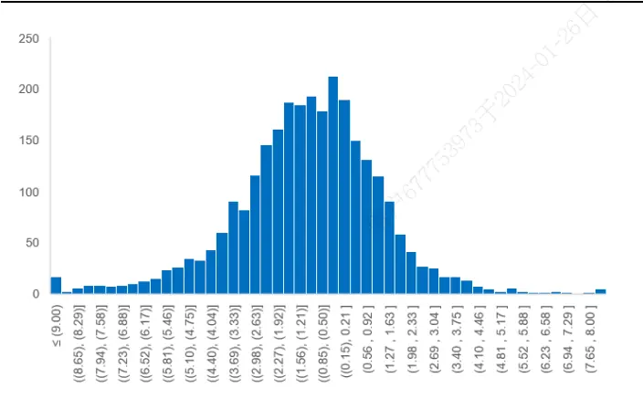
资料来源：Wind，Bloomberg，海通证券研究所

图2 全市场股票对制造业 PMI的MacroBeta系数 T值分布
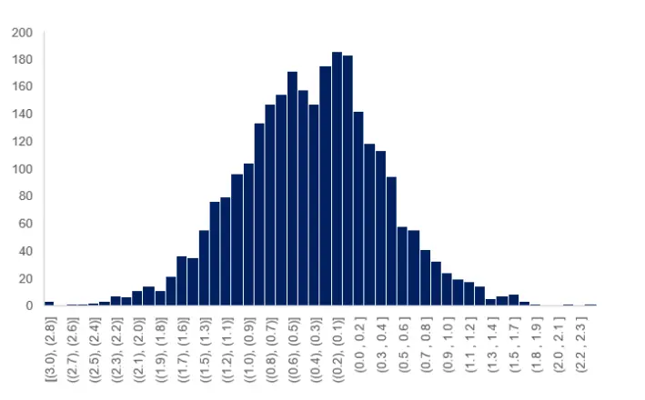
资料来源：Wind，Bloomberg，海通证券研究所

T 值大于 1.96（95%显著性水平）的股票仅有 77 只，大于 1.65（90%显著性水平）的股票为 只。而 值小于 的股票仅有 只， 值小于 的股票仅有只。因此，如果按 排序的前后 选取股票，其中大部分必定与制造业指标之间并不存在达到 或 显著性水平的相关关系。

为了解决这个问题，我们对原来的分析框架进行了调整，主要包括以下三方面：

1. 由于 MacroBeta 易受到市值等风格因子的影响，因此我们在原始 MacroBeta 计算模型的基础上直接加入 Fama-French三因子，以控制常见风格对股票收益的影响。

公式如下：

$$
Return_{i,t}\ =\ \alpha_{i,t}+MacroBeta_{i,t}\cdot F_{t}
$$

$$
+\beta_{i,t}^{MKT}\cdot MKT_{t}+\beta_{i,t}^{SMB}\cdot SMB_{t}+\beta_{i,t}^{HML}\cdot HML_{t}\ +\varepsilon_{i,t}
$$

其中，F 表示宏观经济指标第 t 期的取值，Return 表示第 t 期的股票绝对收益。MKT 表示市场因子，SMB表示市值因子，HML 表示估值因子。

2. 为了简化处理且获得平稳的数据序列，以月度差分的方式计算宏观经济指标 F。

选股时，我们摒弃了原来的基于 系数最高最低各 作为多头和空头的选股方式，而是改用 值进行筛选。针对每一个宏观经济指标，均选择 值大于或小于预设阈值的股票。阈值的设定根据不同的宏观经济指标调整，具体的标准包括两方面，其一是确保有一定数量的股票被选入，其二是选入的股票与宏观经济指标之间存在统计意义上的显著性。因此，本文设定两种筛选方法：T 绝对值≥1.96（95%显著性水平）或 T 绝对值≥1.65（90%显著性水平）。

## 2. 基于 T值的宏观经济指标选股测试

基于如上选股逻辑，我们在本节中分别对若干个常见的宏观经济指标进行测试。首先，针对每一个指标，均选择 显著为正的股票形成等权组合，简称“正敏感组合”。选择 显著为负的股票形成等权组合，简称“负敏感组合”。随后，分别测试正敏感组合与负敏感组合的收益表现与所对应的宏观经济指标之间是否存在相同或相反的趋势特征。

## 2.1 ppi 同比

我们首先对 ppi同比指标展开测试，针对该指标，我们以 95%显著性水平作为筛选标准，即选择 MacroBeta 系数 T 值大于 1.96 的股票为正敏感组合，MacroBeta 系数 T值小于-1.96 的股票为负敏感组合。

图 3 和图 4分别展示了正敏感组合和负敏感组合的净值走势，并将之与 ppi同比指标的走势进行对比。

图3 正敏感组合净值与 ppi同比指标走势
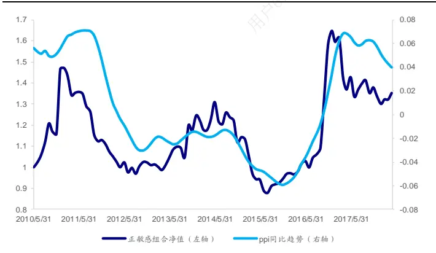
资料来源：Wind，Bloomberg，海通证券研究所

图4 负敏感组合净值与 ppi同比指标走势
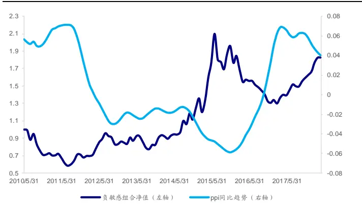
资料来源：Wind，Bloomberg，海通证券研究所

从图 3可见，正敏感组合相对全市场等权组合的超额收益净值走势（下同）与 ppi同比指标之间呈现出高度的一致性。在 2011 年、2012 年、2014 年、2015 年以及 2017年等重要拐点处，正敏感组合的净值与指标走势均呈现出同步性。

由图 4可见，负敏感组合整体表现出与 ppi同比指标相反的走势。在 2010 年、2016年的指标大幅上行区间，负敏感组合的走势均表现为大幅下行。相反，在 2011 年、2015年以及 2017 年指标大幅下行区间，负敏感组合的走势均表现为大幅上行。

由此可见，ppi同比指标的正敏感组合以及负敏感组合均存在明显的选股效应。因而我们尝试构建综合考虑宏观敏感性与宏观经济走势的选股策略——当预测宏观经济指标上升时，选择正敏感的股票，反之，选择负敏感的股票。

策略净值表现如以下两图所示。图 5中，我们选用当期宏观经济指标的变化方向预测下一期的方向。而图 6 中，我们选用下一期的实际变化方向作为预测方向，即测试当每期均正确判断方向时，策略的有效性。

图 5 中可见，若每期基于当期方向变化进行预测，策略表现尚可。从 2010 年 5 月至 2018 年 5 月，策略年化收益率 11.9%，年化波动率 23.2%，夏普比率 0.44。如果能准确预测下一期的方向（图 6），策略效果可以得到明显提升。年化收益率 18.9%，年化波动率 20.8%，夏普比率 0.83。

图5 ppi同比-多空选股策略净值（基于当期指标方向）
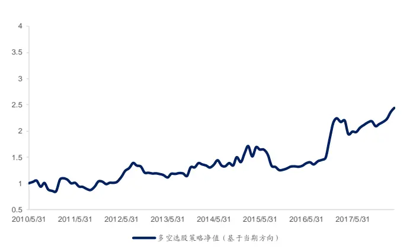
资料来源：Wind，Bloomberg，海通证券研究所

图6 ppi同比-多空选股策略净值（基于下期指标方向）
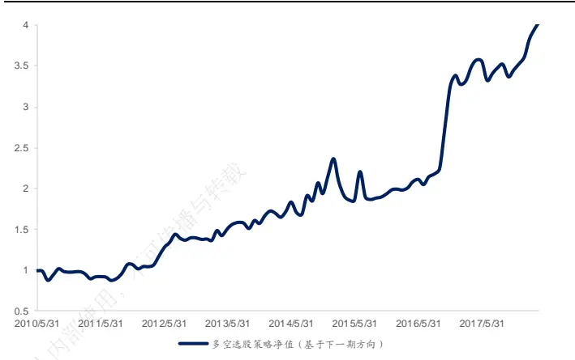
资料来源：Wind，Bloomberg，海通证券研究所

## 2.2 cpi 同比

本节对另一个通胀类指标——cpi同比展开测试。以 90%显著性水平作为正敏感组合筛选标准，即选择 系数 值大于 的股票为正敏感组合。以 的显著性水平作为负敏感组合筛选标准，即选择 MacroBeta 系数 T 值小于-1.96 的股票为负敏感组合。

图 7 和图 8分别展示了正敏感组合和负敏感组合的净值走势，并将之与 cpi同比指标的走势进行对比。

图7 正敏感组合净值与 cpi同比指标走势
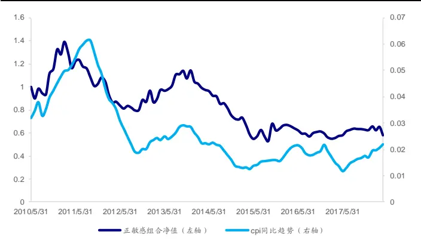
资料来源：Wind，Bloomberg，海通证券研究所

图8 负敏感组合净值与 cpi同比指标走势
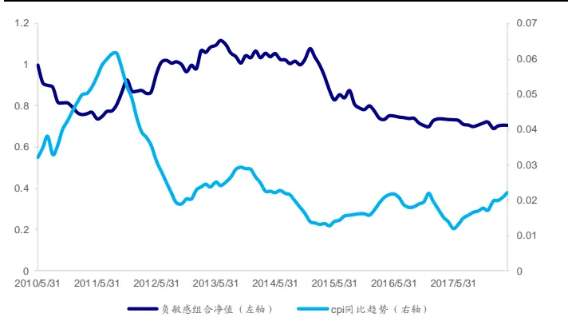
资料来源：Wind，Bloomberg，海通证券研究所

从图 7可见，正敏感组合的净值走势在 2015 年以前与 cpi同比指标之间呈现出明显的一致性。然而在 2015 年以后，该选股效应逐渐消失。类似地，在图 8中，负敏感组合在早期也与 cpi指标走势之间呈现反向的趋势特征。但从 2014 年开始，该选股效果完全消失。我们猜测，这可能是由 cpi指标早期波动较大，2014 年以后逐渐趋于平稳所引起的。

若构建综合考虑宏观敏感性与宏观经济走势的选股策略（当预测宏观经济指标上升时，选择正敏感的股票；反之，选择低敏感的股票），分析结果与上文一致。使用 cpi当期变化作为下一期预测值的策略在 2015 年以前，净值震荡上行。如果能准确预测下一期的方向，策略表现更优。然而，在 2014 年以后，无论能否准确预测下一期方向，策略均明显失效。

图9 cpi同比-多空选股策略净值（基于当期指标方向）
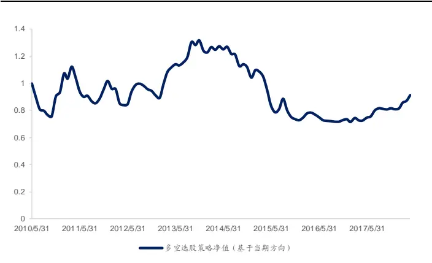
资料来源：Wind，Bloomberg，海通证券研究所

图10 cpi同比-多空选股策略净值（基于下期指标方向）
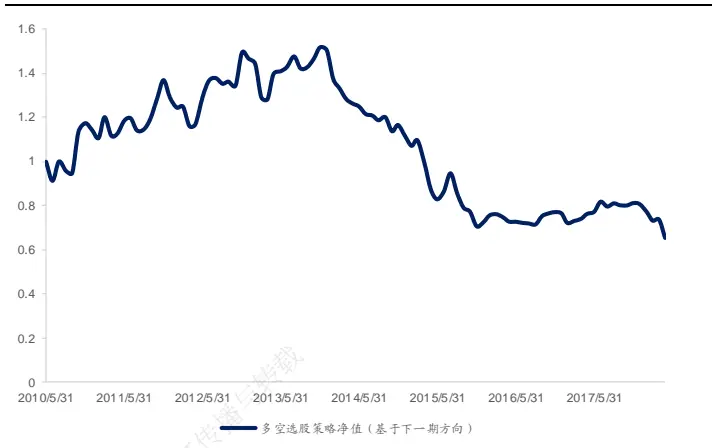
资料来源：Wind，Bloomberg，海通证券研究所

## 2.3 中采制造业 PMI

我们接着选用反映工业景气度的中采制造业 指标进行测试，分别以 和90%的显著性水平作为正敏感组合与负敏感组合的筛选标准。

图 11 和图 12 分别展示了正敏感组合和负敏感组合的净值走势，并将之与中采制造业 PMI 指标的走势进行对比。

图11 正敏感组合净值与中采制造业 PMI指标走势
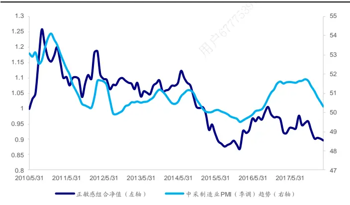
资料来源：Wind，Bloomberg，海通证券研究所

图12 负敏感组合净值与中采制造业 PMI指标走势
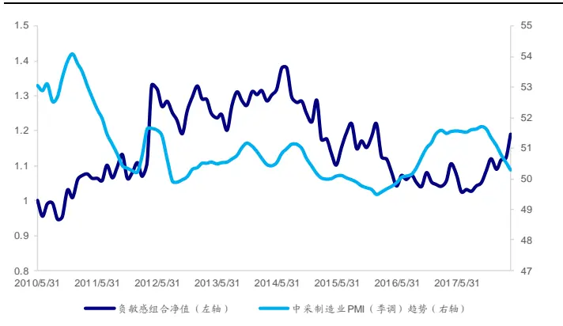
资料来源：Wind，Bloomberg，海通证券研究所

从图 11的对比可见，制造业 PMI 正敏感组合的净值走势和 PMI 指标呈现出一定的一致性。在 2010 年、2014 年以及 2016 年等重要拐点上，两条曲线走势一致。在 2010年、2015 年、以及 2017 年的指标下行区间，正敏感组合净值同样呈下行趋势。在 2016指标上行区间，正敏感组合同样转为上行。

对比图 12 中负敏感组合净值走势与中采制造业 PMI 指标可见，负敏感组合仅在2010-2011 年以及 2016-2017 年间呈现出与 PMI 指标反向的趋势。整体来看，两者在全区间内并未呈现明显的反向关系。因此，数据分析结果表明，对于制造业 PMI 指标，仅正敏感组合存在一定的选股效应。

## 2.4贸易差额

在贸易类指标中，我们选用贸易差额指标展开测试。以 90%显著性水平作为正敏感组合筛选标准，即选择 MacroBeta 系数 T 值大于 1.65 的股票为正敏感组合。以 95%的显著性水平作为负敏感组合筛选标准，即选择 MacroBeta 系数 T 值小于-1.96 的股票为负敏感组合。

图 13 和图 14 分别展示了正敏感组合和负敏感组合的净值走势，并将之与贸易差额指标的走势进行对比。

图13 正敏感组合净值与贸易差额指标走势
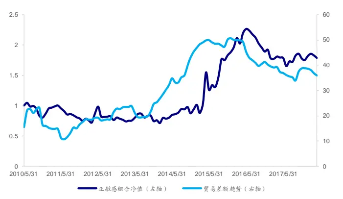
资料来源：Wind，Bloomberg，海通证券研究所

图14 负敏感组合净值与贸易差额指标走势
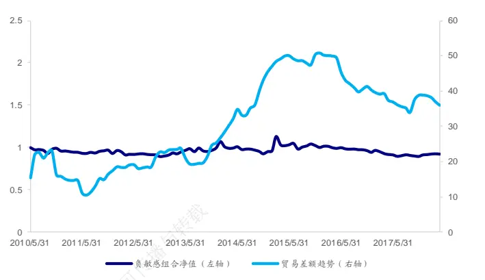
资料来源：Wind，Bloomberg，海通证券研究所

图 中正敏感组合净值的整体走势与贸易差额指标表现一致，在 年年中从上行转为下行。反观图 14 中的负敏感组合，它的超额收益净值并未呈现明显的趋势特征。因而，对于贸易差额指标，仅正敏感组合存在一定的选股效应。

## 2.5利率水平

本节开始，我们对利率类指标——利率水平、期限利差以及信用利差分别进行测试。针对利率水平指标（国债一个月到期收益率），分别以 90%和 95%显著性水平作为正敏感组合与负敏感组合的筛选标准。

图 15 和图 16 分别展示了正敏感组合和负敏感组合的净值走势，并将之与利率水平的走势进行对比。

图15 正敏感组合净值与利率水平指标走势
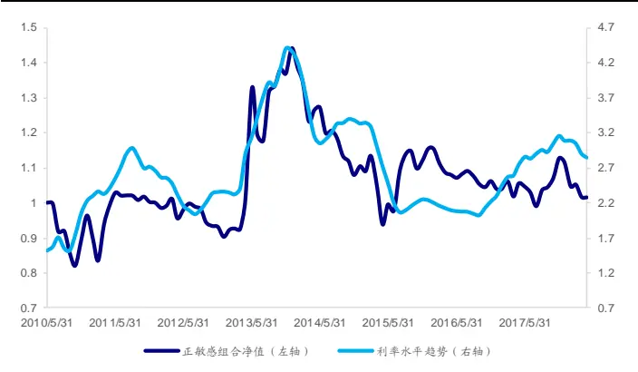
资料来源：Wind，Bloomberg，海通证券研究所

图16 负敏感组合净值与利率水平指标走势
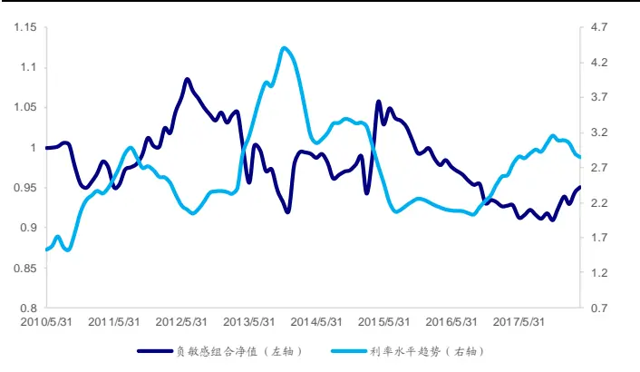
资料来源：Wind，Bloomberg，海通证券研究所

由图 15可见，正敏感组合的净值走势与利率水平之间呈现出高度的一致性。在几处利率水平走势的重要拐点，正敏感组合的净值均呈现出同步特征。

而从图 16 中可见，负敏感组合整体也表现出与利率水平相反的走势。在 2010 年、

2012-2014 年、2015-2017 年的指标大幅上行区间，负敏感组合的走势均表现为下行。相反，在 2011-2012 年、2015-2015 年及 2017 年的指标大幅下行区间，负敏感组合的走势均表现为大幅上行。

由此可见，利率水平的正敏感组合以及负敏感组合均存在明显的选股效应。我们尝试构建综合考虑宏观敏感性与宏观经济走势的选股策略（当预测宏观经济指标上升时，选择正敏感的股票；反之，选择低敏感的股票）。

图 17 中，我们使用当期利率水平指标的变化方向预测下一期的方向。而图 18 中，我们选用下一期的实际变化方向作为预测方向。

图17 利率水平-多空选股策略净值（基于当期指标方向）
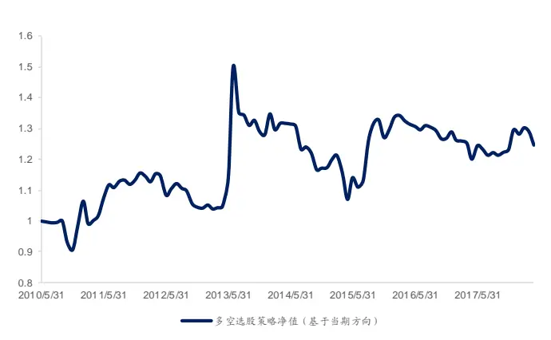
资料来源：Wind，Bloomberg，海通证券研究所

图18 利率水平-多空选股策略净值（基于下期指标方向）
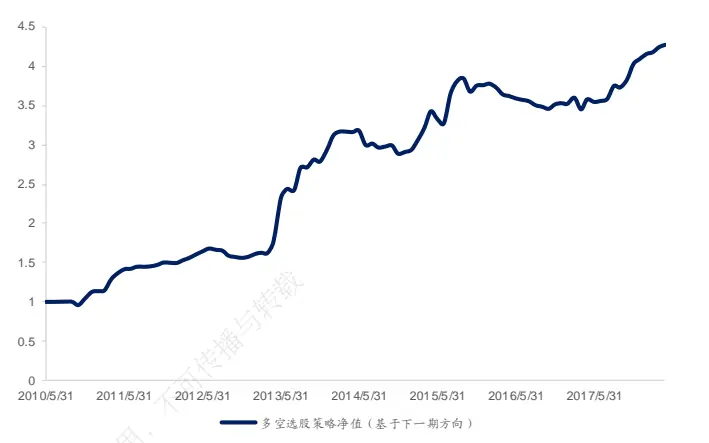
资料来源：Wind，Bloomberg，海通证券研究所

由图 17可见，若每期基于当期方向变化进行预测，策略净值大幅震荡且存在明显回撤。从 2010 年 5 月至 2018 年 5 月，策略年化收益率 2.8%，年化波动率 16%，夏普比率 0.08。如果能准确预测下一期的方向（图 18），策略效果会得到明显的提升。年化收益率 20.0%，年化波动率 15.7%，夏普比率 1.18。

图 与图 中，两个策略净值之间出现的显著差异，主要由于利率水平指标的变化方向并不具备较为稳定的长期趋势，使用当期指标变化预测下一期的胜率很低。从而使得基于宏观经济指标动量的策略，表现不佳。

## 2.6期限利差

本节对期限利差进行测试。此处，我们以十年期国债与一年期国债到期收益率之差作为期限利差。以95%显著性水平作为筛选标准，即选择MacroBeta系数T值大于1.96的股票为正敏感组合，MacroBeta 系数 T 值小于-1.96 的股票为负敏感组合。

图 19 和图 20 分别展示了正敏感组合和负敏感组合的净值走势，并将之与期限利差指标的走势进行对比。

图19 正敏感组合净值与期限利差指标走势
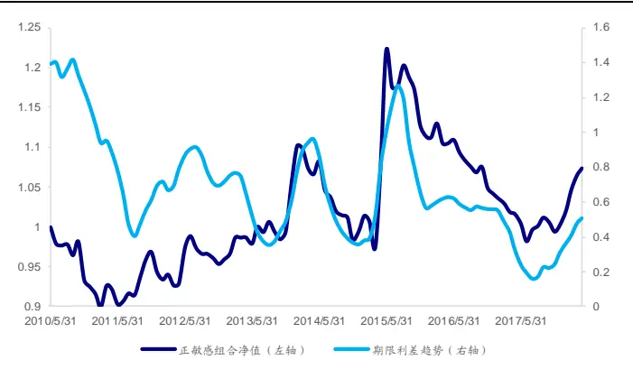
资料来源：Wind，Bloomberg，海通证券研究所

图20 负敏感组合净值与期限利差指标走势
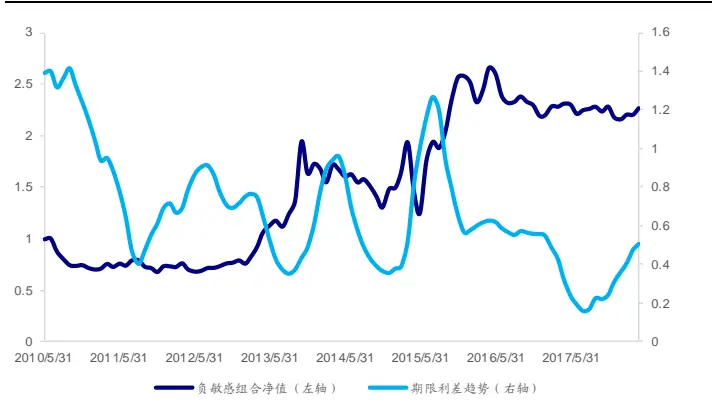
资料来源：Wind，Bloomberg，海通证券研究所

从图 可见，正敏感组合的净值走势与期限利差之间呈现出明显的一致性。在年、2013 年、2015 年以及 2017 年等多处重要拐点，正敏感组合的净值均呈现出同步性。再观察图 20，期限利差的负敏感组合并未呈现出与期限利差走势反向的特征。

因此，数据分析表明，对于期限利差指标，仅正敏感组合存在一定的选股效应。

## 2.7信用利差

继续对信用利差进行测试。需要说明的是，此处以一年期 企业债到期收益率与一年期国债到期收益率之差作为信用利差。以 显著性水平作为筛选标准，即选择系数 值大于 的股票为正敏感组合， 系数 值小于的股票为负敏感组合。

图 21 和图 22 分别展示了正敏感组合和负敏感组合的净值走势，并将之与信用利差的走势进行对比。

图21 正敏感组合净值与信用利差指标走势
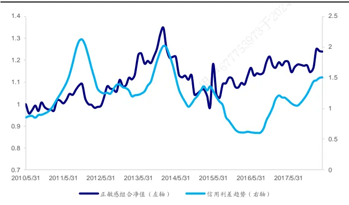
资料来源：Wind，Bloomberg，海通证券研究所

图22 负敏感组合净值与信用利差指标走势
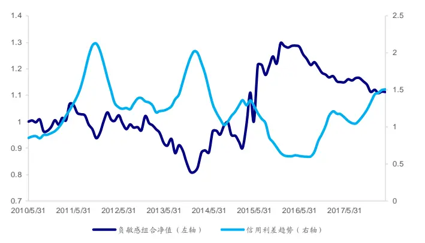
资料来源：Wind，Bloomberg，海通证券研究所

从图 21可见，正敏感组合的净值走势与信用利差之间呈现出明显的一致性。在几处信用利差走势的重要拐点，正敏感组合的净值均呈现出同步性。从图 22 可见，负敏感组合也表现出与信用利差相反的走势。例如，在 2014-2016 年指标大幅下行区间，负敏感组合的净值曲线持续上行。2016 年年中，负敏感组合净值与信用利差曲线同时发生反向，负敏感组合的净值走势从上行转为下行。

由此可见，信用利差的正敏感组合以及负敏感组合均存在明显的选股效应。我们同样尝试构建综合考虑宏观敏感性与宏观经济走势的选股策略。图 23 中，我们使用当期宏观经济指标的变化方向作为下一期的预测。而图 24 中，我们选用下一期的实际变化方向作为预测方向。

图23 信用利差-多空选股策略净值（基于当期指标方向）
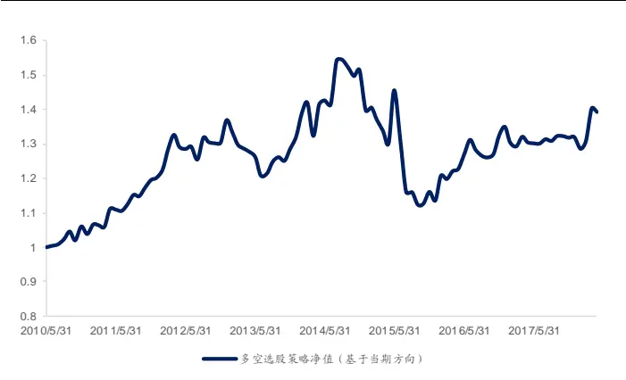
资料来源：Wind，Bloomberg，海通证券研究所

图24 信用利差-多空选股策略净值（基于下期指标方向）
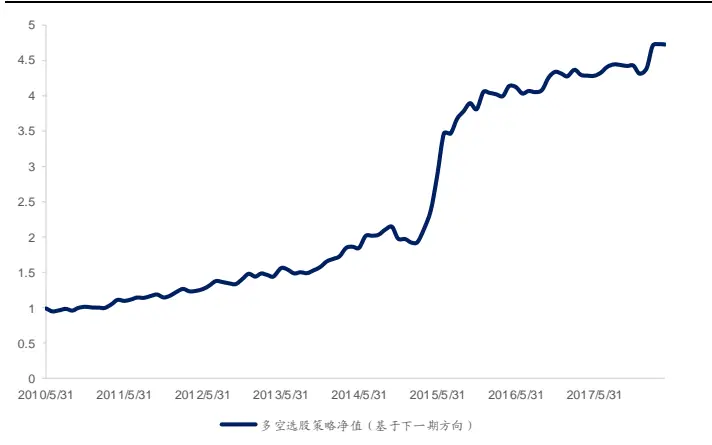
资料来源：Wind，Bloomberg，海通证券研究所

由图 23可见，若每期基于当期方向变化进行预测，策略净值大幅震荡且存在明显回撤。从 2010 年 5 月至 2018 年 5 月，策略年化收益率 4.2%，年化波动率 11.8%，夏普比率 0.23。如果能准确预测下一期的方向（图 24），策略效果得到明显的改善。年化收益率 21.7%，年化波动率 14.6%，夏普比率 1.38。

图 23 与图 24 中，两个策略净值之间出现的显著差异，主要由于信用利差指标与利率水平指标类似，各期之间的变化方向极不稳定，使用当期指标变化预测下一期胜率很低。因此，无法基于宏观经济指标的动量实施策略。

## 2.8股市波动率

本节选取反映股市情绪的股市波动率指标进行测试，并以 95%显著性水平作为正敏感组合和负敏感组合的筛选标准。

图25和图26分别展示了正敏感组合和负敏感组合的净值走势以及股市波动率指标本身的走势。

图25 正敏感组合净值与股市波动率指标走势
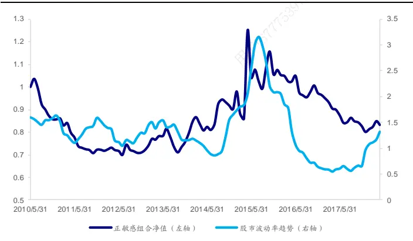
资料来源：Wind，Bloomberg，海通证券研究所

图26 负敏感组合净值与股市波动率指标走势
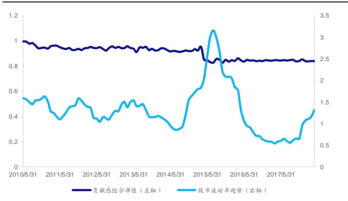
资料来源：Wind，Bloomberg，海通证券研究所

不同时间段内的股市波动率存在明显差异。在 2015 年 7、8 月期间，波动率达到回测窗口中的顶点，之后便一路下行，直至 2018 年才重拾升势。从图 25 可见，正敏感组合的净值与股市波动率呈现出一致的趋势。在 2010 年至 2015 年间，该组合的净值持续上行并于 2015 年达到顶点。随后，在 2015 年至 2017 年间，正敏感组合的净值持续下行。从图 26 可见，负敏感组合的净值并未呈现明显的趋势特征。

因而，对于股市波动率指标，仅正敏感组合存在一定的选股效应。

## 2.9 金价

有关油价指标的选股效应，我们已在《原油价格对行业和股票影响的量化分析》一文中详细探讨。因此，本文对另一个重要的大宗商品类指标——金价进行测试。以 95%显著性水平作为筛选标准，即选择MacroBeta系数T值大于1.96的股票为正敏感组合，MacroBeta 系数 T 值小于-1.96 的股票为负敏感组合。

图 27 和图 28 分别展示了正敏感组合和负敏感组合的净值走势以及金价走势。

图27 正敏感组合净值与金价走势
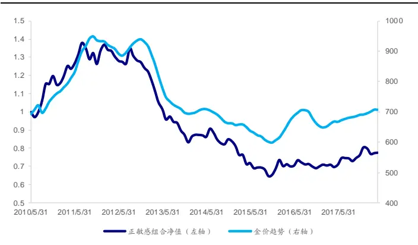
资料来源：Wind，Bloomberg，海通证券研究所

图28 负敏感组合净值与金价走势
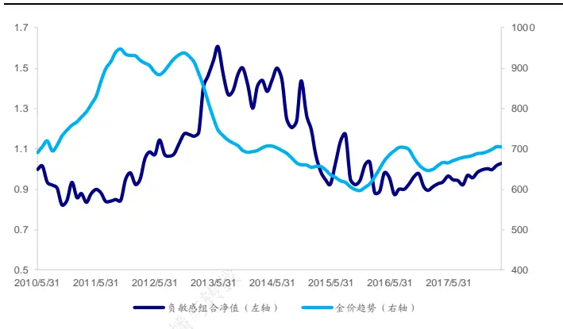
资料来源：Wind，Bloomberg，海通证券研究所

金价从 开始先是大幅上行，于 年达到顶点后下行， 年年中后重新进入上行态势。从图 可见，正敏感组合的净值走势与金价之间呈现出明显的一致性，在 2012 年和 2015 年两处重要拐点，正敏感组合的净值均呈现出同步性。从图 28 可见，负敏感组合的顶点发生在 2013-2014 年，并未呈现出与金价走势反向的特征。

因而，对于金价指标，仅正敏感组合存在一定的选股效应。

## 3. 总结

本文是在报告《选股因子系列研究（三十四）——宏观经济数据可以用来选股吗？》的基础上所展开的进一步分析。上一篇报告中已提及：宏观敏感性因子只是刻画了股票与宏观经济指标之间的关系，包括方向与程度。使用宏观敏感性因子选股的正确逻辑应该是，当预测宏观经济指标上升时，选择正敏感或高敏感的股票。反之，选择负敏感或低敏感的股票。

那么，如何定义对宏观经济指标高敏感与低敏感的股票？由于大多数股票对宏观因子的暴露并不显著，如果分别选取全市场股票中对目标宏观因子暴露系数最高与最低的的股票作为多头与空头，多数被选中的股票其实对目标宏观因子的变化并不敏感。

因此，我们改用基于宏观敏感度系数 T 值的选股逻辑，针对每一个宏观经济指标，均选择 T 值大于或小于预设阈值的股票。阈值的设定根据不同的宏观经济指标调整，具体的标准包括两方面，其一是确保有一定数量的股票被选入，其二是选入的股票与宏观经济指标之间存在统计意义上的显著性。因此，本文设定两种筛选方法：T 绝对值≥1.96（95%显著性水平）或 T 绝对值≥1.65（90%显著性水平）。

表 汇总了常见宏观经济指标的正敏感组合和负敏感组合的选股效果。其中，工业增加值同比增速、固定资产投资增速累计同比、货币供给类指标（M0 增速、M1 增速、增速以及外汇占款），经过测试，无论是正敏感组合还是负敏感组合均不具备选股效应，故本文不再详细展示。大宗商品中的原油价格指标已在海通证券金融工程团队的最新报告——《原油价格对行业和股票影响的量化分析》中进行了详细探讨，故本文也不再赘述。

表 1 宏观经济指标选股效果汇总

| 指标类别 | 指标名称 | 正敏感组合 | 负敏感组合 |
| --- | --- | --- | --- |
| 【国民经济指标】 | 工业增加值同比增速 | 无 | 无 |
|  | 采购经理人指数（PMI） | 弱 | 无 |
|  | 固定资产投资增速 | 无 | 无 |
|  | 社会消费品零售总额同比增速 | 无 | 无 |
| 【对外经济贸易】 | 贸易差额 | 有 | 无 |
| 【价格】 | 居民消费价格（cpi） | 有 | 弱 |
|  | 工业生产者价格（ppi） | 有 | 有 |
| 【货币供给】 | MO 增速 | 无 | 无 |
|  | M1 增速 | 无 | 无 |
|  | M2 增速 | 无 | 无 |
|  | 外汇占款 | 无 | 无 |
| 【利率】 | 利率水平 | 有 | 有 |
|  | 期限利差 | 有 | 无 |
|  | 信用利差 | 有 | 有 |
| 【大宗商品】 | 贵金属-黄金 | 有 | 有 |
|  | 能源-原油 | 有 | 有 |
| 【股市特征】 | 股市波动率 专载 | 有 | 无 |

资料来源：Wind，Bloomberg，海通证券研究所

数据实证显示，与价格相关的指标，包括物价类指标中的 cpi同比、ppi同比以及大宗商品中的黄金价格涨跌幅以及原油价格涨跌幅，均对股票市场存在一定的选股作用，且同时存在正向效应与负向效应。间接影响价格指数的指标——利率类，经过实证发现也存在正向与负向的选股效应。

同时，我们还发现，股市对更新频率较高的指标（日频）相较更新频率较低的指标（月频），反应更为灵敏。因而，更容易存在正向或者负向的选股效果。这些指标包括：利率水平、期限利差、信用利差、股市波动率、大宗商品等。

国民经济指标以及货币供给指标不仅披露频率低，且与股票之间关联并不紧密。从数据检验来看，选股效果微乎其微。

结合海外经验，宏观敏感性因子在选股的收益预测模型中应用价值并不高，而是往往被应用于选股的风控模型中，基于宏观暴露敏感度对股票的权重予以约束，以避免宏观经济变化对部分关联性较强的个股所产生的负面影响。

## 4. 风险提示

市场系统性风险、模型误设风险、有效因子变动风险。

## 信息披露

分析师声明

[Table冯佳睿ysts]金融工程研究团队

吕丽颖金融工程研究团队

本人具有中国证券业协会授予的证券投资咨询执业资格，以勤勉的职业态度，独立、客观地出具本报告。本报告所采用的数据和信息均来自市场公开信息，本人不保证该等信息的准确性或完整性。分析逻辑基于作者的职业理解，清晰准确地反映了作者的研究观点，结论不受任何第三方的授意或影响，特此声明。

## 法律声明

本报告仅供海通证券股份有限公司（以下简称 本公司 ）的客户使用。本公司不会因接收人收到本报告而视其为客户。在任何情况下，本报告中的信息或所表述的意见并不构成对任何人的投资建议。在任何情况下，本公司不对任何人因使用本报告中的任何内容所引致的任何损失负任何责任。

本报告所载的资料、意见及推测仅反映本公司于发布本报告当日的判断，本报告所指的证券或投资标的的价格、价值及投资收入可能会波动。在不同时期，本公司可发出与本报告所载资料、意见及推测不一致的报告。可

市场有风险，投资需谨慎。本报告所载的信息、材料及结论只提供特定客户作参考，不构成投资建议，也没有考虑到个别客户特殊的用投资目标、财务状况或需要。客户应考虑本报告中的任何意见或建议是否符合其特定状况。在法律许可的情况下，海通证券及其所属部关联机构可能会持有报告中提到的公司所发行的证券并进行交易，还可能为这些公司提供投资银行服务或其他服务。人

本报告仅向特定客户传送，未经海通证券研究所书面授权，本研究报告的任何部分均不得以任何方式制作任何形式的拷贝、复印件或复制品，或再次分发给任何其他人，或以任何侵犯本公司版权的其他方式使用。所有本报告中使用的商标、服务标记及标记均为本公司的商标、服务标记及标记。如欲引用或转载本文内容，务必联络海通证券研究所并获得许可，并需注明出处为海通证券研究所，且下不得对本文进行有悖原意的引用和删改。26

根据中国证监会核发的经营证券业务许可，海通证券股份有限公司的经营范围包括证券投资咨询业务。24

| 邓勇 副所长 | 荀玉根副所长 |  | 钟奇所长助理 |
| --- | --- | --- | --- |
| (021)23219404 dengyong@htsec.com | (021)23219658 xyg6052@htsec.com | (021)23219962 zq8487@htsec.com |  |

## 海通证券股份有限公司研究所[Table_PeopleInfo]

路 颖所长

(021)23219403 luying@htsec.com

高道德 副所长(021)63411586 gaodd@htsec.com

姜 超 副所长

(021)23212042 jc9001@htsec.com

涂力磊所长助理

(021)23219747 tll5535@htsec.com

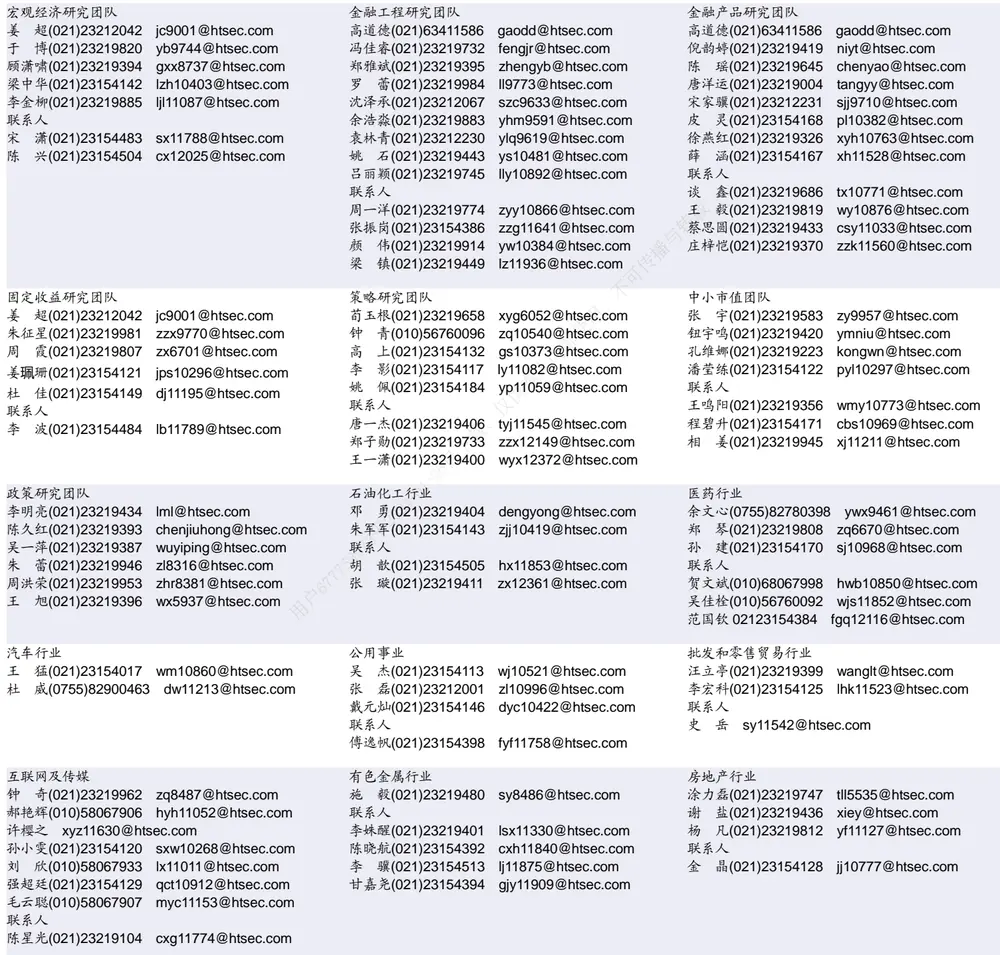

| 基础化工行业 | 计算机行业 |  | 通信行业 |  |
| --- | --- | --- | --- | --- |
| 刘 威(0755)82764281 Iw10053@htsec.com | 郑宏达(021)23219392 | zhd10834@htsec.com | 朱劲松(010)50949926 zjs10213@htsec.com |  |
| 刘海荣(021)23154130 Ihr10342@htsec.com | 黄竞晶(021)23154131 | hjj10361@htsec.com |  | 余伟民(010)50949926 ywm11574@htsec.com |
| 张翠翠(021)23214397 zcc11726@htsec.com | 杨 林(021)23154174 | yl11036@htsec.com | 张 弋 01050949962 zy12258@htsec.com |  |
| 孙维容(021)23219431 swr12178@htsec.com 联系人 | 鲁 立(021)23154138 联系人 | II11383@htsec.com | 联系人 |  |
| 李 智(021)23219392 lz11785@htsec.com | 洪 琳(021)23154137 hl11570@htsec.com 于成龙 ycl12224@htsec.com |  | 张峥青(021)23219383 zzq11650@htsec.com |  |

| 非银行金融行业 |  | 交通运输行业 |  | 纺织服装行业 |  | 梁 希(021)23219407 lx11040@htsec.com |
| --- | --- | --- | --- | --- | --- | --- |
|  | 孙 婷(010)50949926 st9998@htsec.com |  | 虞 楠(021)23219382 yun@htsec.com |  |  |  |
|  | 何 婷(021)23219634 ht10515@htsec.com |  | 联系人 |  | 联系人 |  |
| 联系人 |  |  | 李 丹(021)23154401 Id11766@htsec.com |  |  | 盛 开(021)23154510 sk11787@htsec.com |
|  | 夏昌盛(010)56760090 xcs10800@htsec.com 李芳洲(021)23154127 Ifz11585@htsec.com |  | 党新龙(0755)82900489 dxl12222@htsec.com |  |  | 刘 溢 021-23219748 ly12337@htsec.com |

| 建筑建材行业 | 机械行业 |  | 钢铁行业 |  |
| --- | --- | --- | --- | --- |
| 钱佳佳(021)23212081 qjj10044@htsec.com | 余炜超(021)23219816 swc11480@htsec.com |  | 刘彦奇(021)23219391 liuyq@htsec.com |  |
| 冯晨阳(021)23212081 fcy10886@htsec.com 联系人 | 耿 耘(021)23219814 杨 震(021)23154124 | gy10234@htsec.com | 联系人 | 周慧琳(021)23154399 zhl11756@htsec.com |
| 申 浩(021)23154114 sh12219@htsec.com | 沈伟杰(021)23219963 | yz10334@htsec.com swj11496@htsec.com 专播 |  | 刘 璇(0755)82900465 lx11212@htsec.com |

| 建筑工程行业 | 农林牧渔行业 |  | 食品饮料行业 |  |
| --- | --- | --- | --- | --- |
| 杜市伟(0755)82945368 dsw11227@htsec.com | 丁 频(021)23219405 | dingpin@htsec.com | 闻宏伟(010)58067941 | whw9587@htsec.com |
| 张欣劫 zxj12156@htsec.com | 陈雪丽(021)23219164 | cxl9730@htsec.com | 成珊(021)23212207 | cs9703@htsec.com |
| 李富华(021)23154134 Ifh12225@htsec.com | 陈阳(021)23212041 | cy10867@htsec.com | 唐 宇(021)23219389 | ty11049@htsec.com |

| 军工行业 | 银行行业 | 社会服务行业 |
| --- | --- | --- |
| 蒋 俊(021)23154170 jj11200@htsec.com | 孙 婷(010)50949926 st9998@htsec.com | 汪立亭(021)23219399 wanglt@htsec.com |
| 刘 磊(010)50949922 II11322@htsec.com | 解巍巍 xww12276@htsec.com | 陈扬扬(021)23219671 cyy10636@htsec.com |
| 张恒晅 zhx10170@htsec.com | 联系人 |  |
| 联系人 | 林加力(021)23214395 ljl12245@htsec.com |  |
| 张宇轩(021)23154172 zyx11631@htsec.com | 谭敏沂(0755)82900489 tmy10908@htsec.com |  |

| 家电行业 |  | 造纸轻工行业 |  |
| --- | --- | --- | --- |
| 陈子仪(021)23219244 chenzy@htsec.com |  |  | 衣桢永(021)23212208 yzy12003@htsec.com |
| 联系人 |  | 7 | 知(021)23219810 zz9612@htsec.com |
|  | 朱默辰(021)23154383 zmc11316@htsec.com | 赵 洋(021)23154126 zy10340@htsec.com |  |
| 刘 璐(021)23214390 | II11838@htsec.com |  |  |
| 李 阳(021)23154382 ly11194@htsec.com |  |  |  |

## 研究所销售团队

深广地区销售团队

蔡铁清(0755)82775962 ctq5979@htsec.com

伏财勇(0755)23607963 fcy7498@htsec.com

辜丽娟(0755)83253022 gulj@htsec.com

刘晶晶(0755)83255933 liujj4900@htsec.com

王雅清(0755)83254133 wyq10541@htsec.com

饶 伟(0755)82775282 rw10588@htsec.com

欧阳梦楚(0755)23617160

oymc11039@htsec.com

宗 亮 zl11886@htsec.com

巩柏含 gbh11537@htsec.com

上海地区销售团队

胡雪梅(021)23219385 huxm@htsec.com朱 健(021)23219592 zhuj@htsec.com
季唯佳(021)23219384 jiwj@htsec.com
黄 毓(021)23219410 huangyu@htsec.com漆冠男(021)23219281 qgn10768@htsec.com胡宇欣(021)23154192 hyx10493@htsec.com黄 诚(021)23219397 hc10482@htsec.com毛文英(021)23219373 mwy10474@htsec.com马晓男 mxn11376@htsec.com
杨祎昕(021)23212268 yyx10310@htsec.com张思宇 zsy11797@htsec.com
慈晓聪(021)23219989 cxc11643@htsec.com王朝领 wcl11854@htsec.com
北京地区销售团队
殷怡琦(010)58067988 yyq9989@htsec.com
郭 楠 010-5806 7936 gn12384@htsec.com
吴 尹 wy11291@htsec.com
张丽萱(010)58067931 zlx11191@htsec.com
杨羽莎(010)58067977 yys10962@htsec.com
杜 飞 df12021@htsec.com
张 杨(021)23219442 zy9937@htsec.com
李铁生(010)58067934 lts10224@htsec.com
欧阳亚群 oyyq12331@htsec.com
李 婕 lj12330@htsec.com
何 嘉(010)58067929 hj12311@htsec.com

海通证券股份有限公司研究所

地址：上海市黄浦区广东路 689号海通证券大厦 9楼

电话：（021）23219000

传真：（021）23219392

网址：www.htsec.com