## [Tab相关研究

Table_ReportInfo]《量化宏观策略分析（一）——中国企业的税收负担及其对上市公司投资价值的影响》2018.09.16

《量化研究新思维（十二）——基于横截面和时间序列指标的因子择时》

2018.09.16

《FICC系列研究之十一——揭开“逆周期因子”的神秘面纱》

分析师:冯佳睿

Tel:(021)23219732

Email:fengjr@htsec.com

证书:S0850512080006

分析师:罗蕾

Tel:(021)23219984

Email:ll9773@htsec.com

证书:S0850516080002

# 选股因子系列研究（三十八）——因子敞口上限对优化组合的影响

## 投资要点：

多因子模型通常由收益预测和风险控制两部分组成，风险模型中的限制条件可选种类多，常见的有跟踪误差、风险因子敞口、个股权重、行业、风格等，投资者通常根据自身的收益风险需求选择特定的限制条件。本文主要考察因子敞口上限的设定对优化组合的影响。

在风险控制模型中，因子敞口上限的设臵会同时影响优化组合的收益和风险。上限越大，组合超额收益越高；同时回撤和跟踪误差也越大。组合收益风险比的大小，则取决于收益和风险指标的相对增幅。敞口上限对不同标的指数优化组合超额收益的影响存在差异，敞口上限增加，沪深 优化组合超额收益增幅相对较小，而中证 优化组合超额收益增幅则相对较大。

- 沪深 300 指数和中证 500 指数特征的不同，使得增加因子敞口上限对优化组合超额收益的影响不同。在风险控制组合的构建过程中，最终得到的组合在各个因子上的暴露并不一定会达到预先设定的敞口上限。而决定超额收益的是组合的实际暴露，而非预先设定的敞口上限。从这个角度来看，由于沪深 指数行业市值分布较为集中，为满足行业中性的限制，即使增加因子敞口上限，优化组合在很多因子上的暴露也并不一定增加，因此超额收益增幅有限。而对于中证 500 指数，行业市值分布和个股数分布无明显差异，行业中性对优化组合约束性相对较小。敞口上限增加，优化组合在很多因子上的实际暴露均相应增加，因此超额收益增幅相对较大。

有效因子种类越多，每个因子对组合收益的相对贡献越小，最终得到的优化组合实际达到的敞口也相对更低。因此当有效因子数相对较少时，降低敞口上限会大比例减少优化组合的收益；而当有效因子逐渐增加时，降低敞口上限对优化组合超额收益的影响则相对较小。

- 滚动确定因子敞口上限。预先设定一个相对较大的因子敞口上限，考察过去一段时间在该上限下的优化组合实际达到的敞口，将此实际敞口的平均水平作为最新一期敞口上限的设定值。这一滚动设定敞口上限的方法灵活性较高，且更为合理，在不同收益率预测模型下都能获得一个相对较优的收益表现。

- 风险提示：有效因子变动风险，风险因子遗漏风险，优化模型失效风险。

多因子模型通常由收益预测和风险控制两部分组成，风险模型中的限制条件可选种类多，常见的有跟踪误差、风险敞口、个股权重、行业、风格等，投资者通常根据自身的收益风险需求选择特定的限制条件。本文主要考察因子敞口的设定对风险控制组合的影响。需要注意的是，本文提及的风险控制模型中的因子敞口，是与收益率预测模型相对应的因子敞口；其他一些风险因子，如宏观敏感性等，不在本文考虑范围内。

## 1. 不同因子敞口下，沪深 300和中证 500优化组合的表现

本文考察的标的是通过如下优化问题求解得出的组合：

$$
\begin{aligned}\max_{w}&w^{\prime}*r\\s.t.&\left|(w-w_b)^{\prime}*f\right|\leq f_{ub}\\&w^{\prime}*\mathbf{1}=1\\&(w-w_b)^{\prime}*\mathrm{I}_{i\epsilon D}=0\\&w\leq w_{ub}\\&w\geq w_{lb}\end{aligned}
$$

其中， $\mathsf{W}$ 为股票在组合中的权重向量， $w_{b}$ 为股票在基准指数上的权重，r为股票预期收益率，f 为股票在各个因子上的暴露矩阵， $\mathsf{f}_{\mathsf{ub}}$ 为设定的因子敞口上限， $\mathsf{w}_{\mathsf{ub}}$ 为个股权重上限， $\mathsf{w}_{\mathsf{lb}}$ 为个股权重下限。 $\mathrm{I}_{i\epsilon D_{2}}$ 是示性变量，当股票 i属于行业 D时，该变量为 1，否则为 0。本文探讨的主要是 $\mathsf{f}_{\mathsf{ub}},$ ，即因子敞口上限对增强组合的影响。下文中，我们将以沪深 300 指数为基准，按照上述优化问题得出的组合称为沪深 300 优化组合；将以中证500 指数为基准得到的组合称为中证 500 优化组合。

长期来看，若收益预测模型是有效的，则上限越大，组合所能达到的超额收益越高；但同时模型也会出现短期失效，几乎不存在一直有效的因子和模型，因此上限越大，在模型失效时产生的回撤和风险也越大。在下文中，我们将优化问题中预先设定的 $\mathbf{f}_{\mathsf{ub}},$ ，称为敞口上限；而将最终得到的优化组合在各个因子上的暴露称之为实际敞口。

将因子敞口上限从 0.1 逐渐增加至 1，图 1和图 2 分别展示了不同敞口上限下， $沪$ 深 300 优化组合、中证 500 优化组合的收益风险表现。整体来看，随着风险敞口上限增大，组合所能达到的超额收益越高，但同时跟踪误差（波动率）和最大回撤也越大。对于沪深 300 优化组合而言，当敞口上限为 0.1 时，组合年化超额收益为 8.29%，相应的最大回撤为 2.70%；而当敞口上限为 1 时，组合年化超额 19.80%，相应的最大回撤也增加至 6.72%。

图1 因子敞口上限对沪深 300优化组合影响
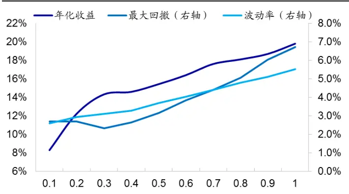
资料来源：Wind，海通证券研究所
注：该图的收益表现指标均为组合相对于沪深 300指数的表现。

图2 因子敞口上限对中证 500优化组合影响
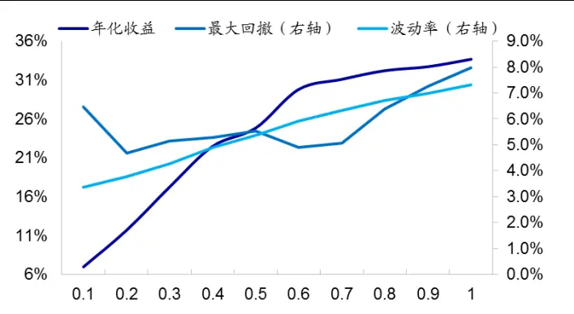
资料来源：Wind，海通证券研究所
注：该图的收益表现指标均为组合相对于中证 500指数的表现。

图 3 和图 4分别展示了不同敞口上限下，优化组合的收益回撤比和信息比情况。结果显示，随着敞口上限逐渐增加，组合收益回撤比和信息比呈现先上升后下降趋势。表明当敞口上限较小时，增加上限会大幅增加组合收益，而对组合风险影响相对较小。

图3 不同敞口上限下，增强组合的收益回撤比
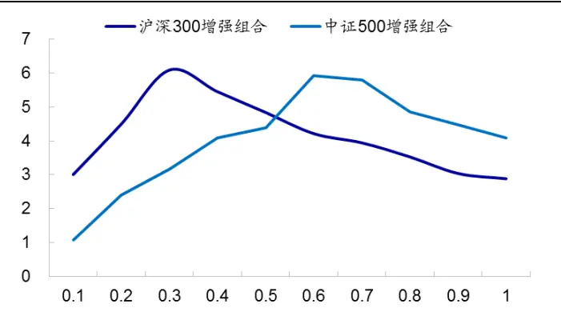
资料来源：Wind，海通证券研究所

图4 不同敞口上限下，增强组合的信息比
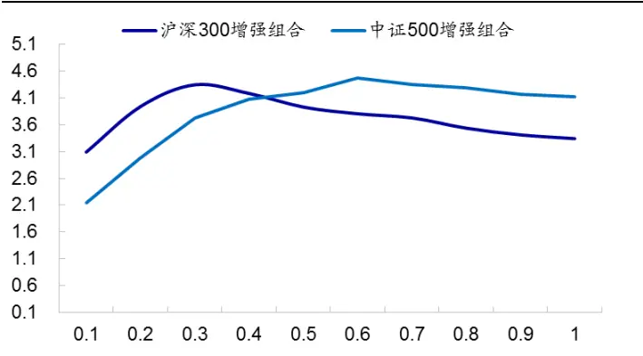
资料来源：Wind，海通证券研究所

从影响程度来看，敞口上限对中证 500 指数优化组合超额收益的影响更为明显。上限由 0.1 增加至 1 时，超额收益由 6.94%增加至 33.81%，增加了 3.87 倍。而对于沪深300 指数增强组合，当上限由 0.1 增加至 1时，超额收益由 8.29%增加至 19.80%，增加了 1.39 倍。

从最优参数来看，当敞口上限为 0.3 时，沪深 300 增强组合收益风险表现最优。年化超额 14.32%，最大回撤 2.33%，波动率 3.10%，相应的收益回撤比和信息比例分别为 6.15 和 4.31。对于中证 500 指数增强组合，当敞口上限设为 0.6 时，组合收益表现最优，年化超额 ，最大回撤 ，相应的收益回撤比和信息比分别为 和4.43。

总结来看，随着设定的敞口上限逐渐增加，优化组合可获得的超额收益逐渐增加，但同时最大回撤和波动率也相应增加。从收益风险比来看，适合不同标的指数增强组合的敞口上限存在差异。

## 2. 在有效因子体系下，组合实际暴露越大，收益增幅越大

## 2.1 优化组合不一定达到预先设定的敞口上限

在同样的敞口限制下，沪深 300 优化组合在很多因子上的暴露都未达到上限，而中证 500 优化组合在绝大部分因子上都达到上限。下图展示了在 0.5 的敞口上限下，2017.08-2018.07 期间优化组合在各个因子上的平均实际敞口。

图5 在 0.5的敞口限制下，沪深 300和中证 500增强组合的平均实际暴露
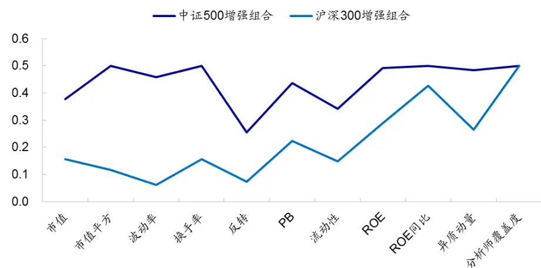
资料来源：Wind，海通证券研究所

结果显示，对于中证 500 优化组合，除反转因子的实际敞口在 0.3 左右外，其余因子的实际敞口都接近于 0.5，所有因子的平均实际敞口为 0.44，接近于预先设定的上限0.5。而沪深 300 优化组合，除 ROE 同比和分析师覆盖度因子的实际敞口超过 0.3 以外，其余因子的实际暴露都在 0.3 以下，所有因子的平均实际暴露仅为 0.26，远低于预先设定的上限 0.5。优化组合不一定会达到预先设定的敞口上限。

## 2.2 组合的收益取决于实际达到的敞口，而非预先设定的敞口上限

增加敞口上限，是否能大幅增加优化组合的超额收益，在一定程度上取决于最终得到的优化组合的实际敞口。若增加上限时，实际达到上限的因子数少，平均实际敞口低，则收益增加空间有限。

由前一节的分析可知，随着敞口上限逐渐增加，中证 优化组合超额收益大幅增加，而沪深 300 增强组合收益增加的速度则相对较为缓慢。这一区别从优化组合实际达到的敞口对比中即可看出。图 6 和图 7分别展示了沪深 300 和中证 500 优化组合的实际敞口，以及达到敞口上限的因子数占比。

图6 不同敞口上限下，优化组合的平均实际暴露
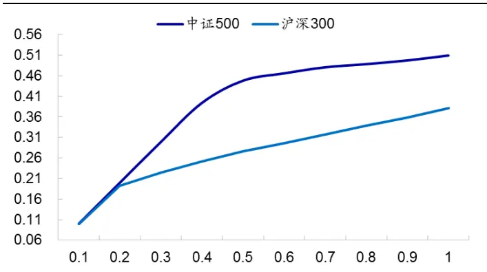
资料来源：Wind，海通证券研究所

图7 不同敞口上限下，达到敞口上限的因子数占比
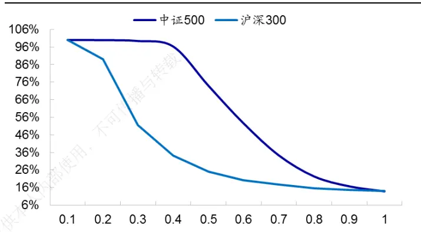
资料来源：Wind，海通证券研究所

结果显示，随着敞口上限逐渐增加，中证 500 优化组合的实际敞口远高于沪深 300优化组合。特别地，在 0.1-0.5 的范围内，中证 500 优化组合实际暴露增加的速度最快；对比前文组合超额收益与敞口上限的关系图可发现，这一区间也是中证 500 优化组合超额收益增加幅度最大的区间。

对于沪深 300 指数优化组合，当敞口上限大于 0.2 时，实际达到敞口上限的因子数已少于 50%。随着敞口上限增加，优化组合的实际暴露仅缓慢增加，因此优化组合的收益增幅远小于中证 500 指数优化组合。

总结来看，在风险控制组合的构建过程中，最终得到的组合在各个因子上的暴露并不一定会达到预先设定的敞口上限；而决定超额收益的是组合的实际敞口，而非预先设定的敞口上限。

在敞口上限较低时，沪深 指数优化组合的实际敞口已远低于敞口上限，因此增加上限对沪深 300 指数优化组合收益的影响相对较小。而在一个相对较大的敞口上限区间内，增加上限时，中证 500 指数优化组合的实际敞口增幅大，因此增加上限对中证 500指数优化组合收益的影响相对较大。

## 3. 影响优化组合是否会达到因子敞口上限的因素

## 3.1 标的指数特征

如前所述，随着敞口上限逐渐增大，不同标的指数的优化组合实际达到的暴露存在较大差异。在 0.5 的敞口上限下，中证 500 增强组合在大部分因子上的实际暴露均达到上限，而沪深 300 指数增强组合仅在少部分因子上的暴露达到上限。造成两者差异的原因主要在于，我们的优化限制条件中，除有因子敞口上限外，还设臵了行业中性。

对比沪深 指数和中证 指数的行业分布可发现，前者相对较为集中，银行和非银金融行业市值占比 33%（以 2018 年 7 月底的数据为例），但这两个行业的个股数仅有 86 个，占比 2.43%。换言之，对于沪深 300 增强组合，需在 2.4%的股票中选出市值占比 33%的股票，行业中性对组合的约束性大。为满足行业中性的限制，沪深 300增强组合在很多因子上的敞口都未达到上限。

而对于中证 500 指数，行业市值占比和股票个数占比无明显差异，行业中性对组合的约束性相对较小。因此，在一定范围内，优化组合在很多因子上的暴露都可达到上限，以最大化组合收益。

图8 沪深 300指数行业分布（%）
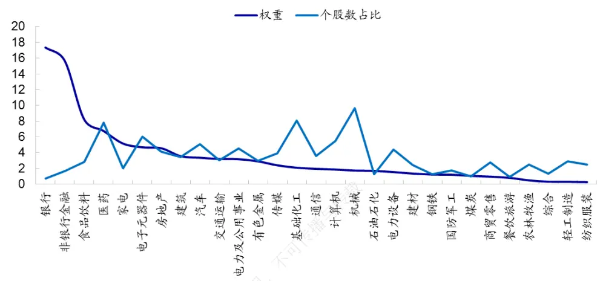
资料来源： ，海通证券研究所

图9 中证 500指数行业分布（%）
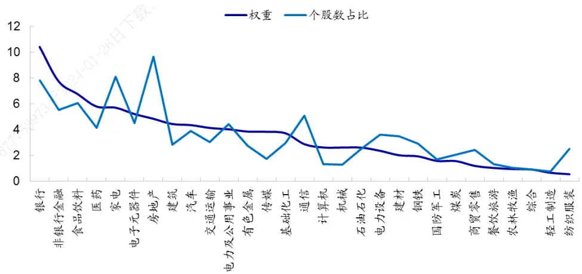
资料来源： ，海通证券研究所

## 3.2 有效因子数

有效因子类型越多，每个因子对组合收益的相对贡献越小，最终得到的优化组合实际达到的敞口也相对更低。

以中证 优化组合为例，下图展示了包含不同因子数目的收益率预测模型下，在相同的限制条件下，优化组合最终达到的平均实际暴露序列。其中，“5 因子”是指收益率预测模型包含了市值、非线性市值、反转、换手率、波动率 5个因子；“7因子”是指除上述 因子外，还包含估值、流动性；“ 因子”是指除上述 因子外，还包含盈利、盈利增长；“10 因子”是指除上述 9因子外，还包含分析师覆盖度；“11因子”是指除上述 10因子外，还包含异质动量因子。

图10 在 1的敞口上限下，不同收益率预测模型的中证 500增强组合实际达到的敞口
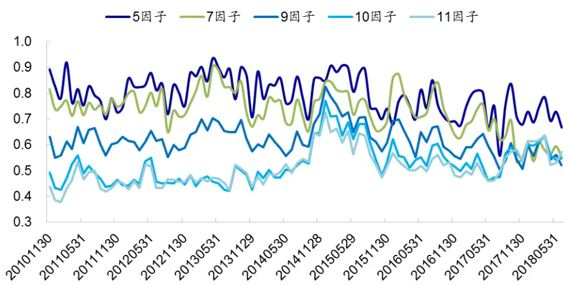
资料来源：Wind，海通证券研究所

图形结果显示，“5 因子”模型实际敞口最高，平均达到的实际敞口为 0.79，优化组合在大部分因子上的暴露均达到设定的敞口上限 1。“11 因子”模型实际敞口最低，平均为 0.51。有效因子数量越多，优化组合实际达到的敞口越低，与前文分析结果一致。

总结来看，标的指数特征、有效因子数等，都会影响优化组合的实际暴露。从标的指数特征来看，沪深 指数行业市值分布较为集中，为满足行业中性的限制，在一个相对较低的敞口上限下，沪深300增强组合在很多因子上的暴露已未达上限。而中证500指数行业分布较为分散，行业中性对组合的约束性较小，因此组合在很多因子上的暴露都可达到上限，以最大化组合预期收益。此外，有效因子种类越多，每个因子对组合收益的相对贡献较小，最终得到的优化组合实际达到的敞口也相对更低。

## 4. 滚动确定敞口上限

如前所述，标的指数特征不同，其对应的优化组合所适合的敞口上限会有所差异；有效因子的数量也会影响敞口上限的选择。因此对于不同的模型、不同标的指数的增强组合，都选用相同的敞口上限并不合适。但采用历史最优敞口，则存在过拟合的可能，未来表现并不一定好。本节考察一种不涉及未来数据的、滚动确定敞口上限的方法。

## 4.1 以前期平均实际暴露作为最新一期敞口上限

由前文可知，预先设定的敞口上限并不一定是最终优化组合达到的敞口；也就是随着敞口上限设定增加，实际敞口并不一定大幅增大。因此，我们可考察过去一段时间，在一个相对较大的敞口上限下，优化组合的实际敞口，将此实际敞口的平均水平（或中位数）作为最新一期敞口上限的设定值。

以设定 2018 年 7 月底的敞口上限为例，我们先预先设定一个相对较大的敞口上限如 1，然后考察在此上限下，前 1 年（即 2017.07-2018.06）优化组合在各个因子上的实际暴露均值（下图）。结果显示，组合实际达到的敞口随时间变动小，且中证 500 指数实际达到的敞口均高于沪深 300 指数，与前文的最优参数特征一致。将这 1 年间的实际敞口等权平均，即为 2018 年 7 月应设定的敞口上限。

图11 不同标的指数下，优化组合实际达到的敞口均值
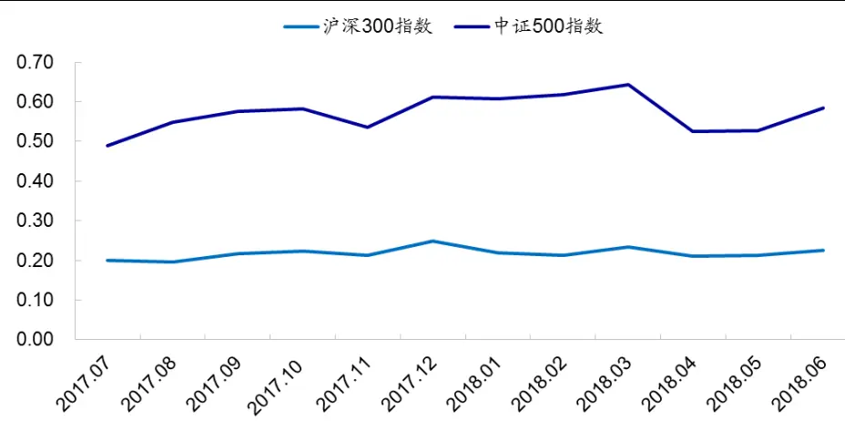
资料来源：Wind，海通证券研究所

下表展示了按照如上滚动确定敞口上限方法获得的增强组合，相对于基准指数的超额收益表现。其中，“前期敞口均值”是指，最新一期的敞口上限是前 年实际敞口的均值；“前期敞口中位数”是指，最新一期的敞口上限是前 年实际敞口中位数。整体来看，无论是按照前期敞口均值还是中位数来确定敞口上限，最终得到的优化组合表现均不会太差，虽然收益风险比略低于前文中的最优参数，但在 之间 档敞口上限中，排名靠前，在前 左右。

表 1 滚动设定敞口下，指数增强组合的超额收益表现（2011.01-2018.07）

| 中证 500 增强组合 |  |  |  |  |  |  |
| --- | --- | --- | --- | --- | --- | --- |
|  | 年化超额 | 最大回撤 | 波动率 | 信息比 | 收益回撤比 | 月胜率 |
| 实际敞口均值 | 26.28% 仅供本 | 4.96% | 5.70% | 4.18 | 5.30 | 86.96% |
| 实际敞口中位数 | 24.34% 下载 | 5.73% | 5.38% | 4.13 | 4.25 | 86.96% |
| 沪深 300 增强组合 |  |  |  |  |  |  |
|  | 年化超额 | 最大回撤 | 波动率 | 信息比 | 收益回撤比 | 月胜率 |
| 实际敞口均值 | 14.84% | 2.88% | 3.38% | 4.09 | 5.16 | 81.52% |
| 实际敞口中位数 | 14.18% | 2.44% | 3.08% | 4.30 | 5.81 | 81.52% |

资料来源： ，海通证券研究所

表 滚动设定敞口下，指数增强组合的分年度超额收益表现

|  | 沪深 300 增强组合 |  |  |  | 中证 500 增强组合 |  |  |  |
| --- | --- | --- | --- | --- | --- | --- | --- | --- |
|  | 收益率 | 最大回 撤 | 信息比 例 | 月胜率 | 收益率 | 最大回 撤 | 信息比 例 | 月胜率 |
| 2011 | 7.50% | 1.98% | 4.04 | 83.33% | 13.94% | 2.55% | 4.92 | 83.33% |
| 2012 | 13.41% | 0.95% | 5.06 | 75.00% | 19.03% | 1.38% | 4.80 | 83.33% |
| 2013 | 14.10% | 2.16% | 4.09 | 83.33% | 31.67% | 3.77% | 4.52 | 100.00% |
| 2014 | 21.91% | 1.99% | 4.30 | 91.67% | 20.65% | 3.57% | 2.89 | 83.33% |
| 2015 | 32.95% | 2.88% | 5.12 | 83.33% | 88.65% | 4.96% | 4.93 | 75.00% |
| 2016 | 10.14% | 2.22% | 3.13 | 83.33% | 25.34% | 2.39% | 5.26 | 100.00% |
| 2017 | 13.71% | 1.42% | 4.15 | 75.00% | 16.17% | 2.48% | 4.30 | 83.33% |
| 2018.07 | 6.17% | 1.78% | 4.22 | 71.43% | 11.61% | 2.71% | 4.05 | 85.71% |

资料来源：Wind，海通证券研究所

按照前期实际敞口均值来确定敞口上限的沪深 优化组合年化超额 ，相应的年化波动率为 3.38%，信息比和收益回撤比分别为 4.09 和 5.16。从时间序列角度来看，增强组合在 81.5%的月份均跑赢基准指数；分年度来看，组合在大部分年份的超额收益均在 10%以上。从持仓个股数来看，每期大概选择 80-90 只股票，其中 60 只左右属于沪深 300 指数成分股，个数占比 71.2%。由于沪深 300 指数成分股以外的股票大部分市值均小于成分股内股票，因此成分股内的个股市值占比高于个股数占比，为81.6%。

图12 沪深 300增强组合相对净值走势
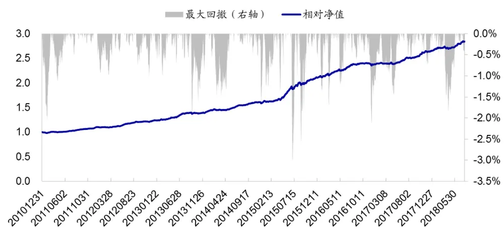
资料来源： ，海通证券研究所

图13 沪深 300优化组合持仓个股数
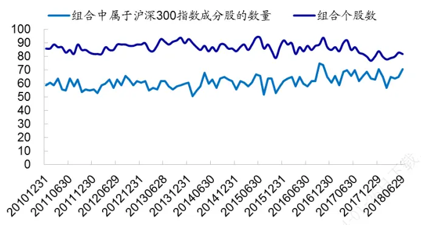
资料来源：Wind，海通证券研究所

图14 沪深 300优化组合中属于指数成分股的个数和市值占比
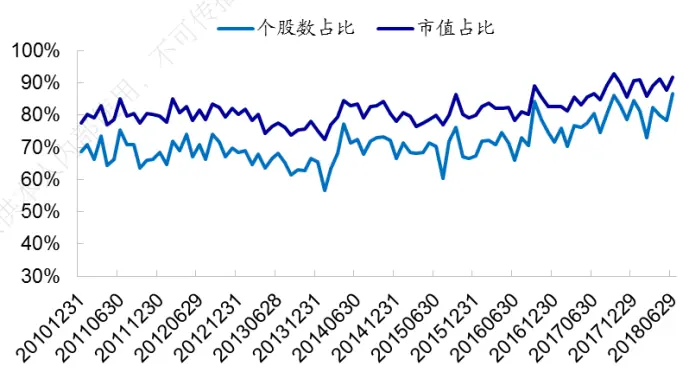
资料来源：Wind，海通证券研究所

按照前期实际敞口均值来确定敞口上限的中证 500 优化组合年化超额 26.28%，相应的年化跟踪误差为 5.70%，信息比和收益回撤比分别为 4.18 和 5.30。从时间序列角度来看，增强组合在 的月份均跑赢基准指数；分年度来看，组合在大部分年份的超额收益均在 15%以上。从持仓个股数来看，每期大概选择 110 只股票，其中 30 只左右属于中证 500 指数成分股，个数占比 6.5%，市值占比 30.8%。

图15 中证 500增强组合相对净值走势
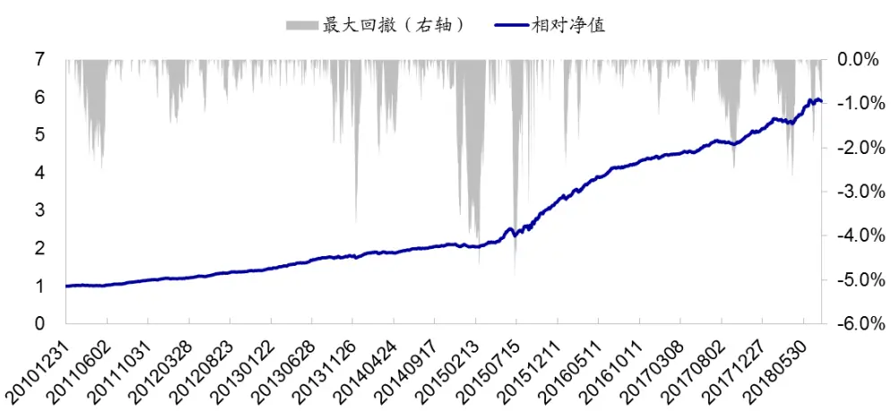
资料来源：Wind，海通证券研究所

图16 中证 500增强组合持仓个股数
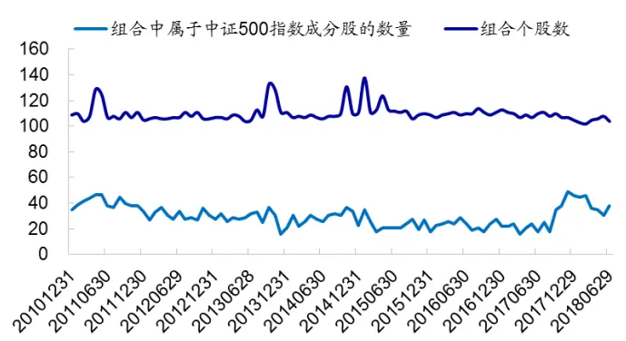
资料来源：Wind，海通证券研究所

图17 中证 500增强组合中属于指数成分股的个数和市值占比
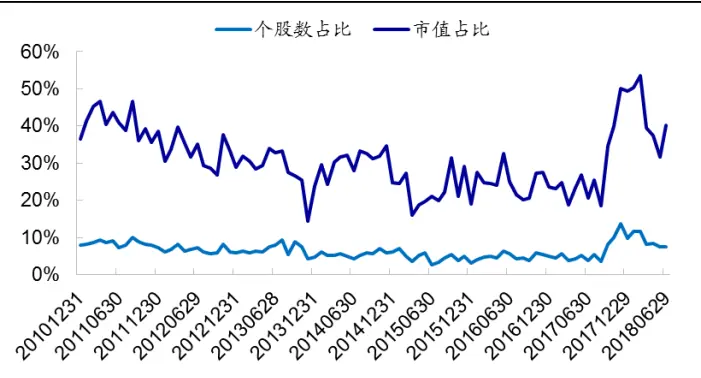
资料来源：Wind，海通证券研究所

## 4.2不同收益率预测模型下的效果

因子体系在不断完善，因此有效的敞口确定方法须适应变动的收益率预测模型。常用的收益率预测模型通常包含 9 个因子：市值、非线性市值、换手率、反转、波动率、估值、流动性、ROE及 ROE增长。本节考察在这种常用的因子体系下，按照上述方法动态确定敞口上限是否仍然合适。

对于中证 优化组合，在固定敞口上限下，上限为 的组合年化收益远高于上限为 0.5 的组合，但同时风险也相对较大，最大回撤达 9.68%，年化波动率 7.41%。从整体收益风险比来看，上限为 时的组合优于上限为 的组合。而滚动确定敞口上限的组合，相比于固定上限 的组合，在没有明显增加风险的情况下，增加了年化超额收益，因此整体收益风险比较高，同时风险也在一个相对可控的范围内。而对于沪深 300优化组合，滚动敞口上限的组合大幅降低了回撤，因此收益风险比也高于固定敞口上限的组合。

表 3 在 9因子模型下，滚动敞口上限的优化组合超额收益表现

| 中证 500 指数增强组合 |  |  |  |  |  |  |
| --- | --- | --- | --- | --- | --- | --- |
|  | 年化超额 | 最大回撤 | 年化波动率 | 信息比 | 收益回撤比 | 月胜率 |
| 0.5 67775397 | 21.13% | 7.31% | 5.77% | 3.40 | 2.89 | 78.26% |
|  | 31.93% | 9.68% | 7.41% | 3.85 | 3.30 | 83.70% |
| 前期均值 | 25.87% | 7.47% | 6.16% | 3.82 | 3.47 | 83.70% |

| 沪深300指数增强组合 |  |  |  |  |  |  |
| --- | --- | --- | --- | --- | --- | --- |
|  | 年化超额 | 最大回撤 | 年化波动率 | 信息比 | 收益回撤比 | 月胜率 |
| 0.5 | 13.45% | 3.34% | 3.62% | 3.49 | 4.02 | 80.43% |
| 1 | 16.55% | 8.09% | 5.39% | 2.86 | 2.05 | 80.43% |
| 前期均值 | 12.92% | 2.49% | 3.47% | 3.50 | 5.20 | 82.61% |

资料来源：Wind，海通证券研究所

需要提及的一点是，本文提出滚动确定上限方法的目的并非在于得到最优的模型收益表现，而是提出一个适用面相对较广的敞口上限确定方法。从一个最直观的例子来看，对于中证 500 增强组合，在 9 因子模型下，敞口上限设为 1的组合收益风险比更高；而沪深 指数增强组合则是在敞口上限为 时，收益表现更优。按照固定的敞口上限设臵并不能满足不同标的增强组合的构建。而滚动确定敞口上限的方法灵活性相对更高，因此在不同模型体系下都能获得相对较优的收益表现。

## 5. 总结

在风险控制模型中，因子敞口上限的设臵会同时影响优化组合的收益和风险。上限越大，组合超额收益越高；同时回撤和跟踪误差也越大。组合收益风险比的大小，则取决于收益和风险指标的相对增幅。敞口上限对不同标的指数优化组合超额收益的影响存在差异，敞口上限增加，沪深 300 增强组合超额收益增幅相对较小，而中证 500 增强组合超额收益增幅则相对较大。

在风险控制组合的构建过程中，最终得到的组合在各个因子上的暴露并不一定会达到预先设定的敞口上限。而决定超额收益的是组合的实际暴露，非预先设定的敞口上限。从这个角度来看，由于沪深 300 指数行业市值分布较为集中，为满足行业中性的限制，在相同的敞口上限下，沪深 增强组合在很多因子上的暴露都未达上限。而中证指数行业分布较为分散，行业中性对组合的约束性较小，因此组合在很多因子上的暴露都可达到上限，以最大化组合预期收益。这一区别使得对于沪深 300 指数而言，即使增加敞口上限，由于行业中性的限制使得优化组合在很多因子的暴露并不一定增加，因此超额收益增幅有限；而对于中证 500 指数，敞口上限增加，优化组合在很多因子上的实际暴露均相应增加，因此超额收益增幅相对较大。

此外，有效因子种类越多，每个因子对组合收益的相对贡献越小，最终得到的优化组合实际达到的敞口也相对更低。因此当有效因子数相对较少时，降低敞口上限会大比例减少优化组合的收益；而当有效因子逐渐增加时，降低敞口上限对优化组合超额收益的影响则相对较小。

预先设定一个相对较大的敞口上限，然后考察过去一段时间优化组合实际达到的敞口，并求得组合在各个因子上敞口的平均水平，将其作为最新一期敞口上限的设定值。载这一滚动设定敞口上限的方法灵活性较高，且更为合理，在不同收益率预测模型体系下与都能获得一个相对较优的收益表现。

## 6. 风险提示

有效因子变动风险，风险因子遗漏风险，优化模型失效风险。人

# 信息披露分析师声明

[Table冯佳睿yst金融工程研究团队s]

罗蕾金融工程研究团队

本人具有中国证券业协会授予的证券投资咨询执业资格，以勤勉的职业态度，独立、客观地出具本报告。本报告所采用的数据和信息均来自市场公开信息，本人不保证该等信息的准确性或完整性。分析逻辑基于作者的职业理解，清晰准确地反映了作者的研究观点，结论不受任何第三方的授意或影响，特此声明。

## 法律声明

本报告仅供海通证券股份有限公司（以下简称 本公司 ）的客户使用。本公司不会因接收人收到本报告而视其为客户。在任何情况下，本报告中的信息或所表述的意见并不构成对任何人的投资建议。在任何情况下，本公司不对任何人因使用本报告中的任何内容所引致的任何损失负任何责任。

本报告所载的资料、意见及推测仅反映本公司于发布本报告当日的判断，本报告所指的证券或投资标的的价格、价值及投资收入可能会波动。在不同时期，本公司可发出与本报告所载资料、意见及推测不一致的报告。

市场有风险，投资需谨慎。本报告所载的信息、材料及结论只提供特定客户作参考，不构成投资建议，也没有考虑到个别客户特殊的播投资目标、财务状况或需要。客户应考虑本报告中的任何意见或建议是否符合其特定状况。在法律许可的情况下，海通证券及其所属可关联机构可能会持有报告中提到的公司所发行的证券并进行交易，还可能为这些公司提供投资银行服务或其他服务。

本报告仅向特定客户传送，未经海通证券研究所书面授权，本研究报告的任何部分均不得以任何方式制作任何形式的拷贝、复印件或复制品，或再次分发给任何其他人，或以任何侵犯本公司版权的其他方式使用。所有本报告中使用的商标、服务标记及标记均为本公司的商标、服务标记及标记，如欲引用或转载本文内容，务必联络海通证券研究所并获得许可，并需注明出处为海通证券研究所，目不得对本文进行有悖原意的引用和删改。仅

根据中国证监会核发的经营证券业务许可，海通证券股份有限公司的经营范围包括证券投资咨询业务。下载

| 邓勇副所长 | 荀玉根副所长 | 钟奇所长助理 |
| --- | --- | --- |
| (021)23219404 dengyong@htsec.com | (021)23219658 xyg6052@htsec.com | (021)23219962 zq8487@htsec.com |

## 海通证券股份有限公司研究所[Table_PeopleInfo]

路 颖所长

(021)23219403 luying@htsec.com

高道德 副所长(021)63411586 gaodd@htsec.com

姜 超 副所长

(021)23212042 jc9001@htsec.com

涂力磊所长助理

(021)23219747 tll5535@htsec.com

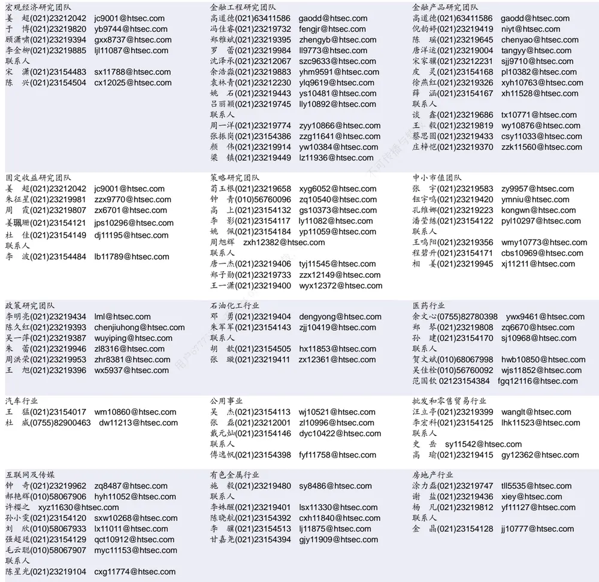

| 家电行业 | 造纸轻工行业 |  |
| --- | --- | --- |
| 陈子仪(021)23219244 chenzy@htsec.com |  | 衣桢永(021)23212208 yzy12003@htsec.com |
| 李 阳(021)23154382 ly11194@htsec.com |  |  |
| 联系人 |  | 赵 洋(021)23154126 zy10340@htsec.com |
| 朱默辰(021)23154383 zmc11316@htsec.con |  |  |
| 刘 璐(021)23214390 II11838@htsec.com |  |  |

| 电子行业 | 陈 平(021)23219646 cp9808@htsec.com |  | 煤炭行业 | 电力设备及新能源行业 |  |
| --- | --- | --- | --- | --- | --- |
|  |  |  | 李 淼(010)58067998 Im10779@htsec.com | 张一弛(021)23219402 | zyc9637@htsec.com |
| 联系人 |  |  | 戴元灿(021)23154146 dyc10422@htsec.com | 房 青(021)23219692 fangq@htsec.com |  |
|  |  | 谢 磊(021)23212214 xl10881@htsec.com | 吴 杰(021)23154113 wj10521@htsec.com |  | 曾 彪(021)23154148 zb10242@htsec.com |
|  |  | 尹 苓(021)23154119 yl11569@htsec.com |  | 徐柏乔(021)23219171 xbq6583@htsec.com |  |
| 石！ |  | 坚(010)58067942 sj11855@htsec.com |  | 张向伟(021)23154141 | zxw10402@htsec.com |

| 基础化工行业 |  | 计算机行业 |  | 通信行业 |  |
| --- | --- | --- | --- | --- | --- |
| 刘 威(0755)82764281 | Iw10053@htsec.com | 郑宏达(021)23219392 | zhd10834@htsec.com | 朱劲松(010)50949926 | zjs10213@htsec.com |
| 刘海荣(021)23154130 | Ihr10342@htsec.com | 黄竞晶(021)23154131 | hjj10361@htsec.com | 余伟民(010)50949926 | ywm11574@htsec.com |
| 张翠翠(021)23214397 | zcc11726@htsec.com | 杨 林(021)23154174 | yl11036@htsec.com | 张 弋 01050949962 zy12258@htsec.com |  |
| 孙维容(021)23219431 | swr12178@htsec.com | 鲁 立(021)23154138 | II11383@htsec.com | 张峥青(021)23219383 | zzq11650@htsec.com |
| 联系人 李 智(021)23219392 | Iz11785@htsec.com | 于成龙 ycl12224@htsec.com |  |  |  |
|  | 联系人 | 洪 琳(021)23154137 hl11570@htsec.com |  |  |  |

| 非银行金融行业 |  | 交通运输行业 |  | 纺织服装行业 |  |  |
| --- | --- | --- | --- | --- | --- | --- |
|  | 孙 婷(010)50949926 st9998@htsec.com |  | 虞 楠(021)23219382 yun@htsec.com |  | 梁 希(021)23219407 lx11040@htsec.com |  |
|  | 何 婷(021)23219634 ht10515@htsec.com |  | 联系人 |  | 联系人 |  |
|  | 夏昌盛(010)56760090 xcs10800@htsec.com |  | 李 丹(021)23154401 Id11766@htsec.com |  |  | 盛 开(021)23154510 sk11787@htsec.com |
| 联系人 |  |  | 党新龙(0755)82900489 dxl12222@htsec.com |  |  | 刘 溢(021)23219748 ly12337@htsec.com |

| 建筑建材行业 | 机械行业 |  | 钢铁行业 |  |
| --- | --- | --- | --- | --- |
| 钱佳佳(021)23212081 qjj10044@htsec.com | 余炜超(021)23219816 swc11480@htsec.com |  | 刘彦奇(021)23219391 liuyq@htsec.com 联系人 |  |
| 冯晨阳(021)23212081 fcy10886@htsec.com 联系人 | 耿 耘(021)23219814 杨 震(021)23154124 | gy10234@htsec.com yz10334@htsec.com |  | 周慧琳(021)23154399 zhl11756@htsec.com |
| 申 浩(021)23154114 sh12219@htsec.com | 周 丹 zd12213@htsec.com | 沈伟杰(021)23219963 swj11496@htsec.com | 专播 | 刘 璇(0755)82900465 lx11212@htsec.com |

| 建筑工程行业 |  | 农林牧渔行业 |  | 食品饮料行业 |  |
| --- | --- | --- | --- | --- | --- |
| 杜市伟(0755)82945368 dsw11227@htsec.com | 丁 频(021)23219405 | dingpin@htsec.com |  | 闻宏伟(010)58067941 | whw9587@htsec.com |
| 张欣劼 zxj12156@htsec.com | 陈雪丽(021)23219164 |  | cxl9730@htsec.com | 成珊(021)23212207 | cs9703@htsec.com |
| 李富华(021)23154134 Ifh12225@htsec.com |  | 陈 阳(021)23212041 | cy10867@htsec.com | 唐 宇(021)23219389 | ty11049@htsec.com |

| 军工行业 | 银行行业 | 社会服务行业 |
| --- | --- | --- |
| 蒋 俊(021)23154170 jj11200@htsec.com | 孙 婷(010)50949926 st9998@htsec.com | 汪立亭(021)23219399 wanglt@htsec.com |
| 刘 磊(010)50949922 II11322@htsec.com | 解巍巍 xww12276@htsec.com | 陈扬扬(021)23219671 cyy10636@htsec.com |
| 张恒晅 zhx10170@htsec.com | 联系人 |  |
| 联系人 | 林加力(021)23214395 ljl12245@htsec.com |  |
| 张宇轩(021)23154172 zyx11631@htsec.com | 谭敏沂(0755)82900489 tmy10908@htsec.com |  |

## 研究所销售团队

深广地区销售团队

蔡铁清(0755)82775962 ctq5979@htsec.com

伏财勇(0755)23607963 fcy7498@htsec.com

辜丽娟(0755)83253022 gulj@htsec.com

刘晶晶(0755)83255933 liujj4900@htsec.com

王雅清(0755)83254133 wyq10541@htsec.com

饶 伟(0755)82775282 rw10588@htsec.com

欧阳梦楚(0755)23617160

oymc11039@htsec.com

宗 亮 zl11886@htsec.com

巩柏含 gbh11537@htsec.com

上海地区销售团队

胡雪梅(021)23219385 huxm@htsec.com
朱 健(021)23219592 zhuj@htsec.com
季唯佳(021)23219384 jiwj@htsec.com
黄 毓(021)23219410 huangyu@htsec.com漆冠男(021)23219281 qgn10768@htsec.com胡宇欣(021)23154192 hyx10493@htsec.com黄 诚(021)23219397 hc10482@htsec.com毛文英(021)23219373 mwy10474@htsec.com马晓男 mxn11376@htsec.com
杨祎昕(021)23212268 yyx10310@htsec.com张思宇 zsy11797@htsec.com
慈晓聪(021)23219989 cxc11643@htsec.com王朝领 wcl11854@htsec.com
北京地区销售团队
殷怡琦(010)58067988 yyq9989@htsec.com
郭 楠 010-5806 7936 gn12384@htsec.com
吴 尹 wy11291@htsec.com
张丽萱(010)58067931 zlx11191@htsec.com
杨羽莎(010)58067977 yys10962@htsec.com
杜 飞 df12021@htsec.com
张 杨(021)23219442 zy9937@htsec.com
何 嘉(010)58067929 hj12311@htsec.com
李 婕 lj12330@htsec.com
欧阳亚群 oyyq12331@htsec.com

海通证券股份有限公司研究所

地址：上海市黄浦区广东路 689号海通证券大厦 9楼

电话：（021）23219000

传真：（021）23219392

网址：www.htsec.com