## [Tab相关研究

Table_ReportInfo]《养老金市场及产品研究（三）——负势竞上：美国养老金市场与公募基金的互相成就》2018.09.27

《选股因子系列研究（三十八）——因子敞口上限对优化组合的影响》2018.09.25《板块轮动系列研究（一）——宏观数据在板块轮动中的应用》2018.09.28

分析师:冯佳睿

Tel:(021)23219732

Email:fengjr@htsec.com

证书:S0850512080006

联系人:张振岗

Tel:(021)23154386

Email:zzg11641@htsec.com

# 选股因子系列研究（三十九）——如何计算盈利指标的趋势？

## 投资要点：

- 盈利质量因子。Robert Novy-Marx(2014)曾对历史上著名的几个质量因子进行研究和总结，例如，ROIC(Return on invested capital)、Gross Profitability、Piotroski的 F-score 等。最终发现，Gross Profitability 在所有质量因子中对于股票收益的预测能力最突出，并且和传统的价值因子的相关性较低。

- 计算盈利趋势因子。我们使用单季度 Gross Profitability 的数据来计算 GrossProfitability的趋势因子。趋势因子为线性回归中时间变量的敏感性，其中根据季度数据选取的不同，我们可以分别得到环比趋势因子和同比趋势因子。

- 趋势因子的检验。我们对两种趋势因子进行了单因子排序、双因子排序和横截面回归的检验。 同比趋势因子相比 环比趋势因子的表现更出色，其 和载的均值分别达到 和 ，胜率分别为 和 ，多空月均收益达到 。在控制常见因子进行双因子排序时，两种趋势因子的分组收益播依然保持着显著的单调性，并且在横截面回归中依然保持较高的月均溢价和显著可性。因此， 股市场上常用的选股因子并不能解释 G 趋势因子的超额收益。

- 行业分布。从行业分布来看，GP 同比趋势因子选股多头比率最高的 5 个行业依次为房地产、医药、基础化工、电力及公用事业和商贸零售，而空头比率最高的人5 个行业依次为机械、房地产、基础化工、医药和汽车。供

- 与成长类因子的关系。GP 同比趋势因子从逻辑上与成长类因子相似，因此我们下检验了 GP 同比趋势因子和 GP 同比增长率的关系。经过检验，我们发现 GP 同6比趋势因子并不是 GP同比增长率的一个变形，两者的 IC 相关性仅在 0.30 左右。01反而，GP 同比趋势因子与原 Gross Profitability 因子的 IC 相关系数超过 0.70。0

- 风险提示: 模型误设风险，因子有效性变动风险。53

## 1. 对盈利趋势的测算

Robert Novy-Marx(2014)曾对历史上著名的几个质量因子进行了总结，例如，ROIC(Return on invested capital)、Gross Profitability、Piotroski 的 F-score 以及根据Benjamin Graham 的 7 个质量选股标准归纳成的 G-score。其中，Gross Profitability 在所有质量因子中对股票收益的预测能力最突出，并且和传统的价值因子的相关性较低。

Gross Profitability 的计算也非常简单，即毛利润除以总资产。

$$
\mathrm{Gross\;Profitability}={\frac{Gross\;Profit}{Asset}}
$$

Gross Profitability在一定程度上体现了公司的盈利质量水平，是一个静态的指标。但是，市场环境和公司本身的经营并不是静态的。举个简单的例子，假设公司 和 的盈利质量目前处于同一水平线上。A 公司曾经长期保持着较高的盈利水平，但是由于市场环境的变化，A公司的产品线竞争力开始逐渐下降，盈利能力处于下降的趋势中。相反， 公司由于科技创新等原因，其产品竞争力显著提升，盈利能力处于上升的趋势中。如果只看盈利水平，A和 B似乎并没有太大的区别，而盈利的趋势可以更好地帮助我们挑选出更具有增长潜力的公司。

Gross Profitability趋势指标可以借助简单的线性回归方程进行计算，如下：

$$
\boldsymbol{G}\boldsymbol{P}_{t}=\boldsymbol{\alpha}_{t}+\boldsymbol{\beta}_{t}\boldsymbol{t}+\boldsymbol{\varepsilon}_{t}
$$

$\boldsymbol{G}\boldsymbol{P}_{t对}$ 应的是根据单季度毛利计算，且经标准化处理后的 Gross Profitability，其中t 取 1,2,3,……,N，通过 OLS回归得到的系数 $\beta_{t}$ 即为最终的趋势因子。考虑到很多公司的毛利润通常会具有一定的周期性，我们构建两种不同的盈利趋势因子：环比趋势因子和同比趋势因子，两种因子的区别在于回归方程中 $GP$ 的选择不同。

1. 环比趋势因子： $\boldsymbol{GP}_{N^{\prime}}$ 为最近一个季度的 Gross Profitabililty， $\boldsymbol{GP}_{N-1}$ 为上一个季度的 Gross Profitabililty。

2. 同比趋势因子： $\pmb{G}\pmb{P}_{\phantom{\dagger}N}$ 为最近一个季度的 Gross Profitabililty，假设 $\pmb{G}\pmb{P}_{\phantom{\dagger}N}$ 为二季度数据，那么 $\widehat{GP_{\mathbf{\Lambda}_{N-1}}}$ 为上一年二季度的 Gross Profitabililty。

3. OLS 回归得到的 $\beta_{t}$ 系数为最终的趋势因子。

## 2. 因子检验

从构建因子的回归方程可知，趋势因子唯一的参数就是单季度毛利润数据的期数 N。我们经过实证检验发现，N取 3 到 6之间时，构建的因子具有显著性。其中，N 取 4 时，显著性最强。因此，本文选取 N=4 作为构建趋势因子的参数。在选股时，剔除 ST、停牌、涨停及上市不满 6个月的股票。

本节对趋势因子进行检验，总共分成 个部分：单因子测试、双因子测试、横截面溢价、指数内选股以及行业分布。

## 2.1 单因子测试

如图 1-4 所示，我们可以直观地看到，GP 趋势因子和 Gross Profitability 均与股票的预期收益呈现正相关性，但是趋势因子分组收益的单调性更加显著。从因子多空收益的累计净值曲线，也可以明显看到两种趋势因子的多空收益更高，也更加稳定。其中，GP同比趋势因子的表现相对更加优异。

图1 Gross Profitability 和环比趋势因子分组收益
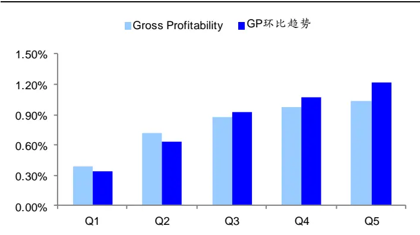
资料来源： ，海通证券研究所

图2 Gross Profitability 和环比趋势因子多空累计净值
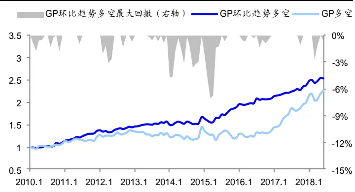
资料来源： ，海通证券研究所

图3 Gross Profitability 和同比趋势因子分组收益
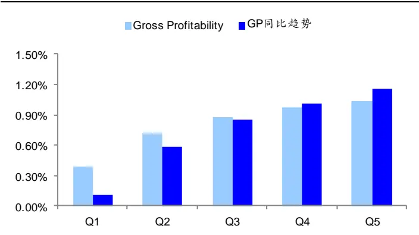
资料来源： Wind，海通证券研究所

图4 Gross Profitability 和同比趋势因子多空累计净值
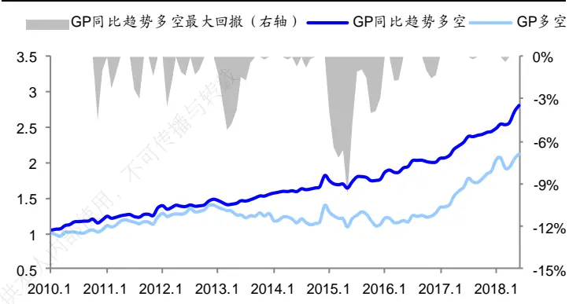
资料来源： Wind，海通证券研究所

表 1 给出了因子分组收益的具体表现和对应 Fama-French 三因子模型的 alpha。Gross Profitability 的多空月均收益仅为 0.64%，T 值也小于 2，而环比趋势因子和同比趋势因子的多空月均收益分别为 0.88%和 1.05%，T 值分别达到了 4.21 和 4.87。另外，同比趋势因子的 Fama-French 三因子的 alpha 的多空收益差高达 1.16%，T 值也达到了6.23，显著性较强。

表 1 单因子排序（2010.1-2018.7）

|  | Gross Profitability |  | GP 环比趋势 |  | GP 同比趋势 |  |
| --- | --- | --- | --- | --- | --- | --- |
|  | 分组收益 (t值) | FF3 alpha (t值) | 分组收益 (t值) | FF3 alpha (t值) | 分组收益 (t值) | FF3 alpha (t值) |
| Low | 0.39% (0.41) | -0.50% (-4.92) | 0.34% (0.39) | -0.45% (-2.79) | 0.11% (0.13) | -0.68% (-4.73) |
| 2 | 0.72% (0.75) | -0.07% (-0.80) | 0.64% (0.70) | -0.14% (-1.40) | 0.59% (0.65) | -0.20% (-1.65) |
| 3 | 0.87% (0.96) | 0,09% (1.03) | 0.93% (1.00) | 0.11% (1.05) | 0.86% (0.93) | 0.05% (0.42) |
| 4 | 0.98% (1.14) | 0.22% (1.86) | 1.08% (1.20) | 0.32% (2.67) | 1.01% (1.17) | 0.23% (1.82) |
| High | 1.03% (1.37) | 0.40% (2.60) | 1.22% (1.50) | 0.52% (3.65) | 1.16% (1.48) | 0.47% (2.97) |
| High-Low | 0.64% (1.62) | 0.89% (3.83) | 0.88% (4.21) | 0.96% (3.61) | 1.05% (4.87) | 1.16% (6.23) |

资料来源：Wind，海通证券研究所

下表是因子的 IC。Gross Profitability 的因子 IC 和 RankIC 分别为 2.30%和 3.81%，胜率分别为 58%和 61%，ICIR 分别为 0.62 和 0.94。两种趋势因子在显著性上有明显地提升，其中同比趋势因子的 IC 表现最为突出。其 IC和 RankIC 的均值分别达到 3.36%和 4.10%，胜率分别为 73%和 75%，ICIR 提升了一倍以上，分别为 1.68 和 1.87。

表 2 因子 IC 表现（2010.1-2018.7）

|  | IC |  | RanklC |  |
| --- | --- | --- | --- | --- |
|  | Gross GP 环比趋势 Profitability | GP同比趋势 | Gross GP 环比趋势 Profitability | GP 同比趋势 |
| IC 均值 | 2.30% 2.58% | 3.36% | 3.81% 3.58% | 4.10% |
| T | 1.82 4.11 | 4.91 | 2.75 4.99 | 5.46 |
| 胜率 | 58% 67% | 73% | 61% 71% | 75% |
| ICIR | 0.62 1.40 | 1.68 | 0.94 1.70 | 1.87 |

资料来源：Wind，海通证券研究所

## 2.2 双因子测试

从单因子检验中，我们可以看出 GP趋势因子对股票收益的预测能力较为显著，相比于 Gross Profitability有明显的提升。本节进一步检验 GP趋势因子和 A股市场上的异象是否具有一定的相关性。

我们用来检验的常用选股因子有：市值、市值平方（非线性市值）、估值（PB）、反转，ROE、换手率、非流动性、特质波动率和 CAPM 模型中的市场 beta。如下表，我们采用双因子排序的方法，当控制这些常用因子后，检验 GP趋势因子对股票收益的预测是否还具有显著的正相关单调性

表 3 双因子排序：GP 环比趋势（2010.1-2018.7）

|  | 市值 | 市值平方 | 估值 | 反转 仅供 | ROE | 换手率 | 非流动性 | 特质波动率 | βM |
| --- | --- | --- | --- | --- | --- | --- | --- | --- | --- |
| Low | 0.45% (0.53) | 0.26% (0.29) | 0.33% (0.38) | 0.29% (0.34) | 0.37% (0.44) | 0.23% (0.27) | 0.40% (0.47) | 0.34% (0.40) | 0.33% (0.39) |
| 2 | 0.63% (0.69) | 0.56% (0.62) | 0.68% (0.76) | 0.57% (0.62) | 0.72% (0.80) | 0.58% (0.64) | 0.60% (0.66) | 0.62% (0.68) | 0.53% (0.59) |
| 3 | 0.89% (0.96) | 0.93% (1.00) | 0.85% (0.93) | 0.82% (0.89) | 0.98% (1.09) | 0.81% (0.88) | 0.81% (0.88) | 0.84% (0.92) | 0.79% (0.86) |
| 4 | 1.05% (1.18) | 1.04% (1.20) | 1.02% (1.16) | 0.97% (1.10) | 1.06% (1.17) | 0.90% (1.02) | 1.00% (1.12) | 0.92% (1.03) | 0.97% (1.10) |
| High | 1.36% (1.63) | 1.36% (1.66) | 1.05% (1.28) | 1.21% (1.49) | 1.17% (1.40) | 1.07% (1.29) | 1.21% (1.50) | 1.05% (1.30) | 1.23% (1.52) |
| High-Low | 0.90% (5.47) | 1.10% (6.35) | 0.72% (4.33) | 0.92% (4.69) | 0.80% (3.94) | 0.83% (4.37) | 0.81% (4.31) | 0.71% (3.60) | 0.91% (4.63) |

资料来源：Wind，海通证券研究所

表 4 双因子排序：GP 同比趋势（2010.1-2018.7）

|  | 市值 | 市值平方 | 估值 | 反转 | ROE | 换手率 | 非流动性 | 特质波动率 | βM |
| --- | --- | --- | --- | --- | --- | --- | --- | --- | --- |
| Low | 0.27% (0.31) | 0.49% (0.56) | 0.10% (0.12) | 0.11% (0.13) | 0.25% (0.30) | 0.06% (0.07) | 0.25% (0.29) | 0.17% (0.20) | 0.13% (0.16) |
| 2 | 0.58% (0.64) | 0.64% (0.70) | 0.62% (0.68) | 0.56% (0.62) | 0.62% (0.69) | 0.49% (0.53) | 0.60% (0.66) | 0.57% (0.62) | 0.52% (0.58) |
| 3 | 0.86% (0.94) | 0.96% (0.96) | 0.75% (0.84) | 0.74% (0.82) | 0.91% (1.01) | 0.61% (0.67) | 0.81% (0.89) | 0.76% (0.84) | 0.71% (0.79) |
| 4 | 1.05% (1.21) | 1.05% (1.17) | 0.92% (1.08) | 0.92% (1.07) | 0.94% (1.08) | 0.84% (0.97) | 0.97% (1.14) | 0.77% (0.90) | 0.97% (1.14) |
| High | 1.34% (1.65) | 1.37% (1.63) | 1.00% (1.26) | 1.11% (1.41) | 1.10% (1.38) | 0.86% (1.06) | 1.17% (1.50) | 0.98% (1.24) | 1.12% (1.43) |
| High-Low | 1.07% (5.90) | 0.88% (5.22) | 0.90% (5.16) | 1.00% (4.97) | 0.85% (4.10) | 0.80% (4.03) | 0.92% (4.41) | 0.81% (4.09) | 0.99% (4.75) |

资料来源： ，海通证券研究所

从表 3-4可以看出，在控制常见因子后，GP环比趋势因子和 GP同比趋势因子的分组收益依然保持着显著的单调性。两种趋势因子的首尾组合收益差的显著性较强，T值大多在4以上，因此A股市场上常用的选股因子并不能解释GP趋势因子的超额收益。

## 2.3 横截面溢价

双因子检验只能剔除一个因子对 趋势因子的影响，如果同时考虑多个因子的影响，则需要采用横截面回归的方法。将双因子测算使用的 9 个控制因子和两个 GP趋势因子作为自变量，下一期的股票收益作为因变量，构建横截面回归方程。

如表 5所示，我们分别构建了三个横截面回归方程。在剔除了常用选股因子的影响后，分别检验 GP环比趋势因子、GP 同比趋势因子和两者共同作用下的横截面溢价。

表 5 因子的横截面溢价（2010.1-2018.7）

|  | 市值 | 市值平方 | 估值 | 反转 | ROE | 换手率 | 非流动性 | 特质波动 率 | βM | GP环比 趋势 | GP同比 趋势 |
| --- | --- | --- | --- | --- | --- | --- | --- | --- | --- | --- | --- |
| 方程1 | -0.57% | 0.23% | 0.02% | -0.41% | -0.69% | 0.34% | -0.23% | 0.41% | 0.44% |  | 0.25% |
|  | -3.49 | 4.60 | 0.19 | -3.04 | -5.73 | 3.98 | -2.70 | 5.05 | 3.67 |  | 5.25 |
| 方程2 | -0.54% | 0.24% | -0.01% | -0.44% | -0.55% | 0.42% | -0.24% | 0.46% | 0.43% | 0.15% |  |
|  | -3.34 | 4.65 | -0.07 | -3.34 | -5.28 | 4.79 | -2.70 | 5.60 | 3.67 | 3.64 |  |
| 方程3 | -0.56% | 0.23% | 0.04% | -0.42% | -0.69% | 0.35% | -0.23% | 0.40% | 0.45% | 0.10% | 0.24% |
|  | -3.46 | 4.49 | 0.34 | -3.13 | -5.80 | 4.16 | -2.71 | 4.92 | 3.74 | 2.37 | 4.51 |

资料来源：Wind，海通证券研究所

GP同比趋势因子的月度溢价均值为 0.25%，T 值超过 5，而 GP环比趋势因子的月度溢价均值仅为 0.15%。如方程 3所示，当 GP环比趋势和 GP同比趋势因子出现在同一个横截面回归方程时，GP同比趋势因子的月度溢价均值为 0.24%，并没有下降太多，而GP环比趋势因子的月度溢价均值从0.15%下降到0.10%，T值也仅为2.37。如图5-6，GP同比趋势因子的累计溢价显著高于 GP环比趋势因子，并且 GP 同比趋势因子的月度溢价胜率高达 76%，也远高于 GP 环比趋势因子的 67%。

图5 GP环比趋势因子的横截面溢价
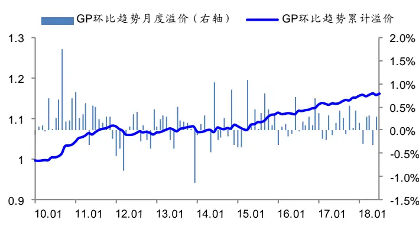
资料来源： ，海通证券研究所

图6 GP同比趋势因子的横截面溢价
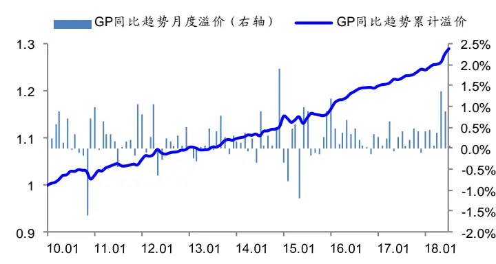
资料来源： ，海通证券研究所

## 2.4 指数内选股

无论是从单因子、双因子还是横截面溢价的角度，GP同比趋势因子的选股能力和显著性都要远远高于 GP环比趋势因子。为了进一步检验 GP同比趋势因子的选股能力，我们将因子检验的股票池分别替换为沪深 300 指数成分股、中证 500 指数成分股以及中证 800 指数以外的股票，结果如下表。

表 6 GP 同比趋势因子的指数内选股检验（2010.1-2018.7）

| 沪深 300 指数成分股 |  |  |  |  |  |
| --- | --- | --- | --- | --- | --- |
|  | IC | RankIC | 多头月均超额 | 空头月均超额 | 多空收益差 |
| IC 均值 | 5.49% | 5.43% | 0.92% | -0.64% | 1.56% |
| T | 4.50 | 4.32 | 3.92 | -3.77 | 4.76 |
| 胜率 | 70% | 71% | 64% | 34% | 70% |
| 信息比 | 1.54 | 1.47 | 1.34 | -1.29 | 1.62 |

中证 500指数成分股

|  | IC | RankIC | 多头月均超额 | 空头月均超额 | 多空收益差 |
| --- | --- | --- | --- | --- | --- |
| IC 均值 | 3.39% | 4.34% | 0.47% | -0.55% | 1.01% |
| T | 4.36 | 5.00 | 2.49 | -4.40 | 4.29 |
| 胜率 | 62% | 67% | 58% 专载 | 32% | 68% |
| 信息比 | 1.49 | 1.71 | 0.85 | -1.50 | 1.47 |

中证 800指数以外股票

|  | IC | RankIC | 多头月均超额 | 空头月均超额 | 多空收益差 |
| --- | --- | --- | --- | --- | --- |
| IC 均值 | 3.00% | 3.70% 使用 | 0.25% | -0.64% | 0.89% |
| T | 5.14 | 5.81 | 1.14 | -4.64 | 5.28 |
| 胜率 | 73% | 77% | 61% | 39% | 72% |
| 信息比 | 1.75 | 1.98 仅供 | 0.39 | -1.58 | 1.80 |

资料来源：Wind，海通证券研究所

从指数内选股的结果来看，GP 同比趋势因子在沪深 300 指数内的 IC 均值最高，其IC 和 Rank IC 的均值分别 5.49%和 5.43%，胜率均在 70%左右。多空月均收益差达到1.56%，也是三个选股池中最高的。IC的均值随着沪深 300、中证 500 以及中证 800 指数以外股票按市值由大到小依次下降，但是需要注意的是，因子在小市值股票中的 IC 表现更加稳定，因子IC和Rank IC的胜率分别为73%和77%，信息比分别为1.75和1.98，显著高于因子在沪深 300 指数成分股中的表现。

图 7 中 GP同比趋势因子的月均分组收益均有明显的单调性，其中以沪深 300 最显著。从横截面溢价的均值来看，因子在沪深 300 指数内的月均溢价达到了 0.44%，在中证 500 和中证 800 以外分别为 0.22%和 0.20%。从横截面溢价的月胜率来看，因子在中证 800 以外的胜率最高，达到了 74%，而在沪深 300 和中证 500 的胜率稍稍逊色，分别为 65%和 67%。

总的来说，GP同比趋势因子在大市值的沪深 300 指数内选股的多空收益，IC均值以及横截面月均溢价更高，但是从 胜率和信息比以及横截面溢价胜率的角度来看，GP同比趋势因子在中证 800 指数以外选股的稳定性更强，主要是因为因子在小市值股票中的空头效应更加明显。

图7 GP同比趋势因子的指数内选股的分组收益
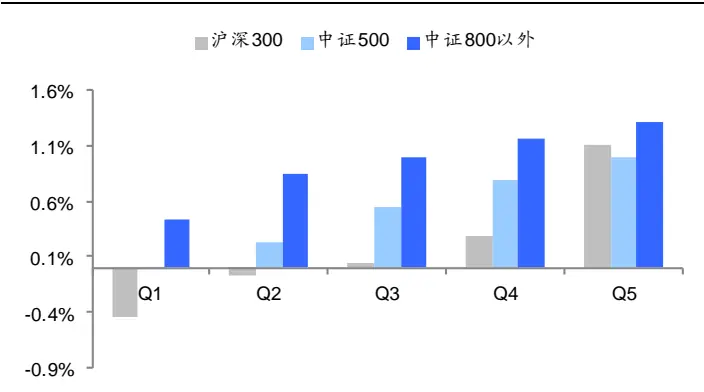
资料来源： ，海通证券研究所

图8 GP同比趋势因子的横截面溢价（沪深 300）
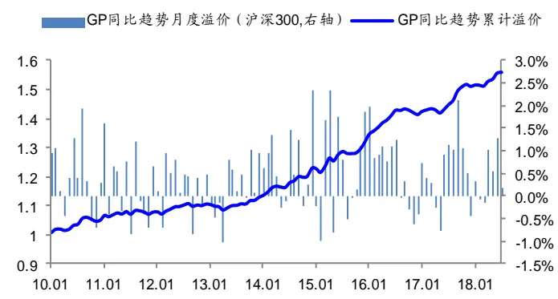
资料来源： Wind，海通证券研究所

图9 GP同比趋势因子的横截面溢价（中证 500）
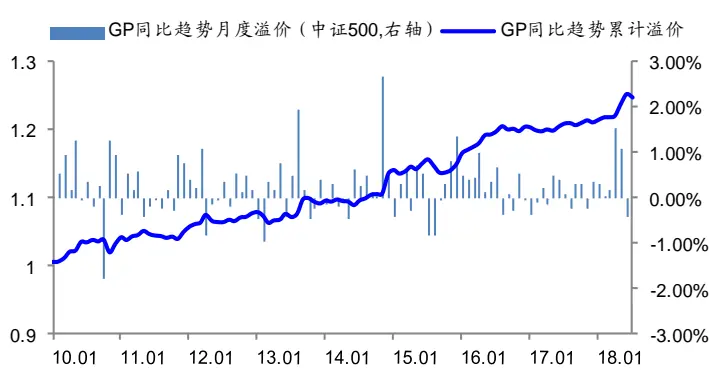
资料来源： Wind，海通证券研究所

图10 GP同比趋势因子的横截面溢价（中证 800以外）
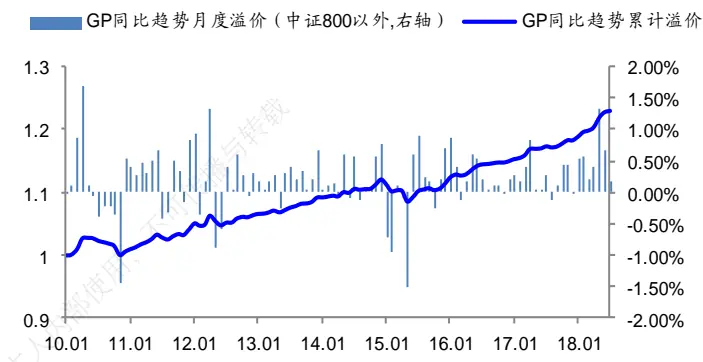
资料来源： ，海通证券研究所

## 2.5 行业分布

如图 11，我们可以看到 GP同比趋势因子在全市场选股时，多头和空头的中信一级行业分布情况。其中，多头和空头分别为按因子值大小均分 5组的首尾组合。从行业分布来看，GP同比趋势因子选股多头比率最高的 5个行业依次为房地产、医药、基础化工、电力及公用事业和商贸零售，而空头比率最高的 5个行业依次为机械、房地产、基础化工、医药和汽车。

[Table_Pic 图 Pe]11 GP 同比趋势因子选股的行业分布
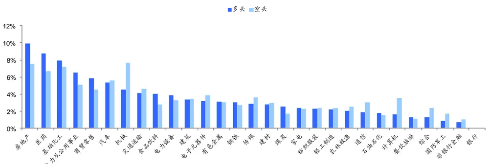
资料来源：Wind，海通证券研究所

同比趋势因子多空频率最高的 个行业中均包括房地产、医药和基础化工这三个行业。如图 所示，因子选股的行业频率和选股池股票的行业占比有一定的关系，因此，我们还需要看GP同比趋势因子选股相对于全市场的偏离程度，具体为因子的多(空)头与全市场股票的行业比例差值。GP 同比趋势因子的多头和空头在房地产、机械、商贸零售和计算机四个行业均有较大的偏离，其中房地产行业的偏离最大。

[Table_Pic 图 Pe]12 GP 同比趋势因子选股的行业分布偏离
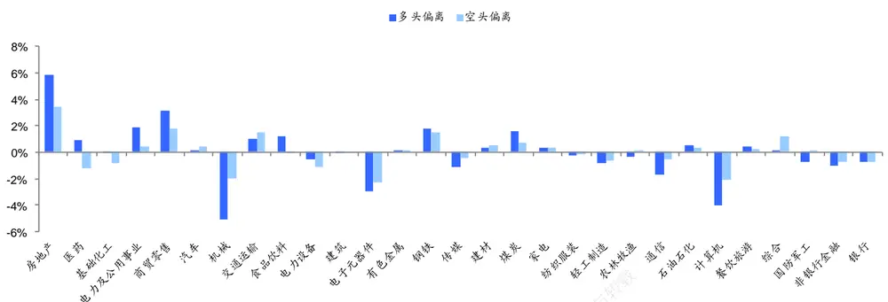
资料来源：Wind，海通证券研究所

## 3. 与成长因子的关系

GP同比趋势因子的计算采用最近 N个季度的单季度毛利数据，从逻辑上来看似乎与成长类因子（同比增长率）相似，因此我们对 GP同比增长率进行因子检验，并且与GP同比趋势因子进行比较。

如表 7，我们可以看到 GP同比增长率的因子表现。GP同比增长率的 IC 和 Rank IC分别为 2.82%和 4.30%，胜率也均超过 70%，多空月均收益也达到了 1.16%，因子的表现相较 Gross Profitability 也更为出色。

表 7 GP 同比增长率的因子检验（2010.1-2018.7）

|  | IC | RanklC | 多头月均超额 | 空头月均超额 | 多空收益差 |
| --- | --- | --- | --- | --- | --- |
| IC 均值 | 2.82% | 4.30% | 0.49% | -0.66% | 1.16% |
| T | 5.49 | 5.39 | 4.09 | -4.72 | 5.25 |
| 胜率 | 71% | 70% | 68% | 34% | 70% |
| 信息比 | 1.87 | 1.84 | 1.39 | -1.61 | 1.79 |

资料来源：Wind，海通证券研究所

在这里我们提出一个疑问：是否 GP同比趋势因子只是 GP同比增长率的变形？或者 GP 同比趋势因子是否与 GP同比增长率有较高的相关性？为此，我们首先对 GP同比趋势因子和 同比增长率进行双因子排序，检验在控制其中一个因子的时候，另外一个因子是否还具有显著的单调性，然后再检查因子的横截面溢价和 的相关性。

表 8 双因子排序：GP 同比趋势和 GP 同比增长率（2010.1-2018.7）

| GP 同比增长率 GP 同比趋势 | Low | 2 | 3 | 4 | High |
| --- | --- | --- | --- | --- | --- |
| Low |  |  |  |  |  |
|  | -0.43% 0.11% | -0.12% 0.57% | 0.19% | 0.41% | 0.52% 0.87% |
| 2 |  |  |  |  |  |
|  | 0.31% | 0.72% | 0.60% 0.97% | 0.66% 1.01% | 1.22% |
| 3 |  |  |  |  |  |
| 4 | 0.45% | 0.79% | 1.12% | 1.36% | 1.28% |
| High | 0.65% | 1.07% | 1.26% | 1.31% | 1.53% |

资料来源： ，海通证券研究所

如表 8，无论是在控制 GP同比趋势因子时，还是在控制 GP 同比增长率时，另外一个因子始终具有显著的单调性，这意味着 GP同比趋势因子并不是 GP同比增长率的一个变形。

表 9 因子 IC 的相关系数（2010.1-2018.7）

|  | IC 相关性 |  |  |
| --- | --- | --- | --- |
|  | Gross Profitability | GP 同比趋势 | GP 同比增长率 |
| Gross Profitability | 1 |  |  |
| GP 同比趋势 | 0.77 1 |  |  |
| GP 同比增长率 | 0.28 | 0.30 | 1 |
|  | Rank IC 相关性 |  |  |
|  | Gross Profitability | GP 同比趋势 不可 | GP 同比增长率 |
| Gross Profitability | 1 |  |  |
| GP 同比趋势 | 0.73 1 |  |  |
| GP 同比增长率 | 0.33 内部使用 | 0.35 | 1 |

资料来源： ，海通证券研究所

如表 9，我们可以看到 Gross Profitability、GP 同比趋势因子和 GP 同比增长率三个因子之间 IC 的两两相关系数。不难发现，GP同比趋势因子和 GP 同比增长率的 IC 相关性并不高，相关系数仅仅在 0.30 左右，而 GP 同比趋势因子跟 Gross Profitability 的IC 相关系数却超过 0.70。

表 10 因子的横截面溢价（2010.1-2018.7）

|  | 市值 | 市值平方 | 估值 | 反转 | ROE | 换手率 | 非流动性 | 特质波动 率 | βM | GP同比 趋势 | GP同比 增长率 |
| --- | --- | --- | --- | --- | --- | --- | --- | --- | --- | --- | --- |
| 方程1 | -0.57% | 0.23% | 0.02% | -0.41% | -0.69% | 0.34% | -0.23% | 0.41% | 0.44% | 0.25% |  |
|  | -3.49 | 4.60 | 0.19 | -3.04 | -5.73 | 3.98 | -2.70 | 5.05 | 3.67 | 5.25 |  |
| 方程2 | -0.52% | 0.24% | -0.01% | -0.45% | -0.54% | 0.45% | -0.24% | 0.45% | 0.41% |  | 0.26% |
|  | -3.17 | 4.62 | -0.10 | -3.43 | -5.06 | 5.20 | -2.66 | 5.59 | 3.55 |  | 6.70 |
| 方程3 | -0.56% | 0.23% | 0.03% | -0.43% | -0.72% | 0.36% | -0.22% | 0.40% | 0.44% | 0.20% | 0.22% |
|  | -3.38 | 4.59 | 0.30 | -3.16 | -6.01 | 4.17 | -2.59 | 4.93 | 3.67 | 4.76 | 4.42 |

资料来源：Wind，海通证券研究所

从表 10中因子的横截面溢价来看，当 GP同比趋势因子和 GP 同比增长率两个因子与其他 9个常用因子在同一个横截面回归方程中时，两个因子的月度溢价均值分别为0.20%和 0.22%，T 值分别为 4.76 和 4.42。当两个因子同在一个横截面方程时，月度溢价均值和显著性相比只有一个时略有下降，但是依然保持较高的水平。图 13-14 给出了GP同比趋势因子和 GP同比增长率的月度溢价和累计溢价。GP同比趋势因子月溢价的胜率为 69%，而 GP同比增长率为 71%，相差不大。

图13 GP同比趋势因子的横截面溢价
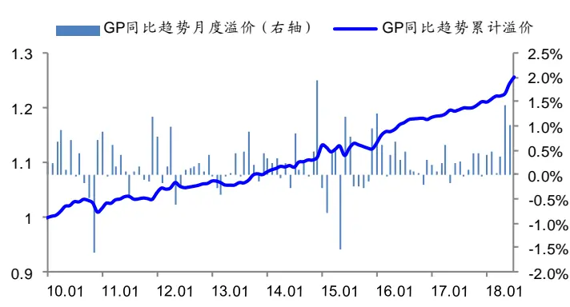
资料来源： ，海通证券研究所

图14 GP同比增长率的横截面溢价
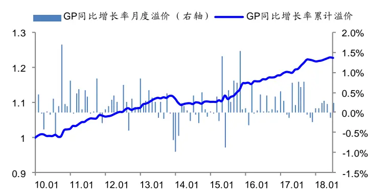
资料来源： ，海通证券研究所

总的来说，虽然 GP同比趋势因子从逻辑上与成长类因子相似，但是经过检验，我们发现 GP同比趋势因子并不是 GP 同比增长率的一个变形，两者的 IC相关性也不强。反而，GP 同比趋势因子与原 Gross Profitability 因子的 IC 相关性系数超过 0.70。因此，GP同比趋势因子的表现出色，更适合作为 Gross Profitability的一个替代因子。

## 4. 总结

Robert Novy-Marx(2014)曾对历史上著名的质量类选股因子进行总结，经研究发现传Gross Profitability（GP）这个指标对于股票收益的预测能力最突出，并且和传统的价值不因子的相关性较低。我们使用单季度 Gross Profitability 的数据来计算 Gross Profitability用，的趋势因子，趋势因子即为线性回归中时间变量的敏感性。其中，根据季度数据选取的部不同，我们可以分别得到环比趋势因子和同比趋势因子。人

单季度毛利数据往往会具有一定的季节效应，因此GP同比趋势因子的表现相比GP仅环比趋势因子更为出色。GP同比趋势因子在沪深 300 指数内选股的因子 IC均值和多空载，收益较高，但是因子在中证 800 以外的小市值股票中的表现更稳定一些，主要表现为因日子 IC 和横截面溢价的胜率较高，均在 70%以上。GP同比趋势因子从逻辑上看，似乎与1-成长类因子相似，但是经过检验发现 GP同比趋势因子与 GP同比增长率相关性并不强。24

## 5. 风险提示5397

模型误设风险，因子有效性变动风险。

# 信息披露

分析师声明

[Table冯佳睿yst金融工程研究团队s]

本人具有中国证券业协会授予的证券投资咨询执业资格，以勤勉的职业态度，独立、客观地出具本报告。本报告所采用的数据和信息均来自市场公开信息，本人不保证该等信息的准确性或完整性。分析逻辑基于作者的职业理解，清晰准确地反映了作者的研究观点，结论不受任何第三方的授意或影响，特此声明。

## 法律声明

本报告仅供海通证券股份有限公司（以下简称 本公司 ）的客户使用。本公司不会因接收人收到本报告而视其为客户。在任何情况下，本报告中的信息或所表述的意见并不构成对任何人的投资建议。在任何情况下，本公司不对任何人因使用本报告中的任何内容所引致的任何损失负任何责任。

本报告所载的资料、意见及推测仅反映本公司于发布本报告当日的判断，本报告所指的证券或投资标的的价格、价值及投资收入可能载会波动。在不同时期，本公司可发出与本报告所载资料、意见及推测不一致的报告。

市场有风险，投资需谨慎。本报告所载的信息、材料及结论只提供特定客户作参考，不构成投资建议，也没有考虑到个别客户特殊的传投资目标、财务状况或需要。客户应考虑本报告中的任何意见或建议是否符合其特定状况。在法律许可的情况下，海通证券及其所属不关联机构可能会持有报告中提到的公司所发行的证券并进行交易，还可能为这些公司提供投资银行服务或其他服务。用

本报告仅向特定客户传送，未经海通证券研究所书面授权，本研究报告的任何部分均不得以任何方式制作任何形式的拷贝、复印件或复制品，或再次分发给任何其他人，或以任何侵犯本公司版权的其他方式使用。所有本报告中使用的商标、服务标记及标记均为本公司的商标、服务标记及标记。如欲引用或转载本文内容，务必联络海通证券研究所并获得许可，并需注明出处为海通证券研究所，且不得对本文进行有悖原意的引用和删改。载，

根据中国证监会核发的经营证券业务许可，海通证券股份有限公司的经营范围包括证券投资咨询业务。日

| 邓勇副所长 | 荀玉根副所长 | 钟奇所长助理 |
| --- | --- | --- |
| (021)23219404 dengyong@htsec.com | (021)23219658 xyg6052@htsec.com | (021)23219962 zq8487@htsec.com |

## 海通证券股份有限公司研究所[Table_PeopleInfo]

路 颖所长

(021)23219403 luying@htsec.com

高道德 副所长(021)63411586 gaodd@htsec.com

姜 超 副所长

(021)23212042 jc9001@htsec.com

涂力磊所长助理

(021)23219747 tll5535@htsec.com

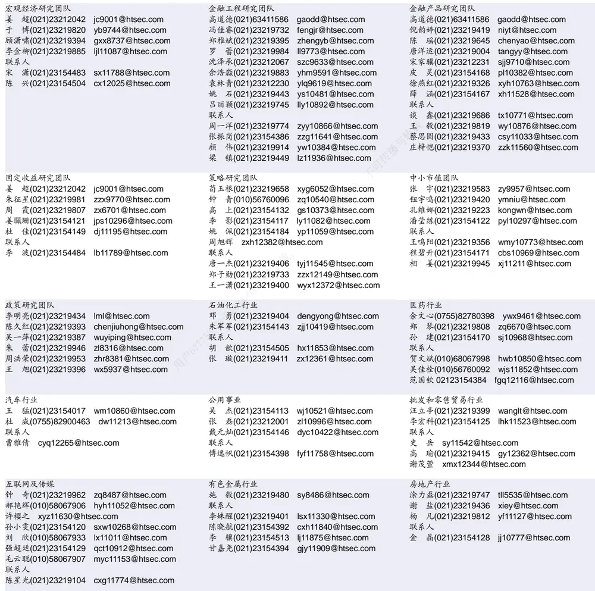

| 电子行业 |  |  | 煤炭行业 | 电力设备及新能源行业 |  |
| --- | --- | --- | --- | --- | --- |
|  | 陈 平(021)23219646 cp9808@htsec.com |  | 李 淼(010)58067998 Im10779@htsec.com | 张一弛(021)23219402 | zyc9637@htsec.com |
| 联系人 |  |  | 戴元灿(021)23154146 dyc10422@htsec.com | 房 青(021)23219692 | fangq@htsec.com |
|  | 谢 磊(021)23212214 xl10881@htsec.com |  | 吴 杰(021)23154113 wj10521@htsec.com | 曾 彪(021)23154148 | zb10242@htsec.com |
| 尹 | 苓(021)23154119 yl11569@htsec.com |  | 联系人 |  | 徐柏乔(021)23219171 xbq6583@htsec.com |
| 石 |  | 坚(010)58067942 sj11855@htsec.com | 王 涛 02123219760 wt12363@htsec.com | 张向伟(021)23154141 | zxw10402@htsec.com |

| 基础化工行业 |  | 计算机行业 |  | 通信行业 |  |
| --- | --- | --- | --- | --- | --- |
| 刘 威(0755)82764281 Iw10053@htsec.com |  | 郑宏达(021)23219392 | zhd10834@htsec.com | 朱劲松(010)50949926 | zjs10213@htsec.com |
| 刘海荣(021)23154130 Ihr10342@htsec.com |  | 黄竞晶(021)23154131 | hjj10361@htsec.com | 余伟民(010)50949926 | ywm11574@htsec.com |
| 张翠翠(021)23214397 | zcc11726@htsec.com | 杨 林(021)23154174 yl11036@htsec.com |  | 张 弋 01050949962 zy12258@htsec.com |  |
| 孙维容(021)23219431 联系人 | swr12178@htsec.com | 鲁 立(021)23154138 II11383@htsec.com |  | 张峥青(021)23219383 zzq11650@htsec.com |  |
| 李 智(021)23219392 lz11785@htsec.com |  | 于成龙 ycl12224@htsec.com |  |  |  |
|  |  | 联系人 |  |  |  |
|  |  | 洪 琳(021)23154137 hl11570@htsec.com |  |  |  |

| 非银行金融行业 |  | 交通运输行业 | 虞 楠(021)23219382 yun@htsec.com | 纺织服装行业 |  |  |
| --- | --- | --- | --- | --- | --- | --- |
|  | 孙 婷(010)50949926 st9998@htsec.com |  |  |  |  | 梁 希(021)23219407 lx11040@htsec.com |
|  | 何 婷(021)23219634 ht10515@htsec.com |  | 联系人 |  | 联系人 |  |
| 联系人 |  |  | 李 丹(021)23154401 Id11766@htsec.com |  | 盛 开(021)23154510 | sk11787@htsec.com |
|  | 李芳洲(021)23154127 Ifz11585@htsec.com |  | 党新龙(0755)82900489 dxl12222@htsec.com |  | 刘 溢(021)23219748 | ly12337@htsec.com |

| 建筑建材行业 | 机械行业 |  | 钢铁行业 |
| --- | --- | --- | --- |
| 冯晨阳(021)23212081 fcy10886@htsec.com 联系人 | 余炜超(021)23219816 swc11480@htsec.com 耿 耘(021)23219814 gy10234@htsec.com |  | 刘彦奇(021)23219391 liuyq@htsec.com 联系人 |
| 申 浩(021)23154114 sh12219@htsec.com | 杨 震(021)23154124 yz10334@htsec.com 沈伟杰(021)23219963 swj11496@htsec.com | 专播与 | 周慧琳(021)23154399 zhl11756@htsec.com 刘 璇(0755)82900465 lx11212@htsec.com |

| 建筑工程行业 | 农林牧渔行业 |  | 食品饮料行业 |  |  |
| --- | --- | --- | --- | --- | --- |
| 杜市伟(0755)82945368 dsw11227@htsec.com | 丁 频(021)23219405 | dingpin@htsec.com | 闻宏伟(010)58067941 |  | whw9587@htsec.com |
| 张欣劫 zxj12156@htsec.com | 陈雪丽(021)23219164 | cxl9730@htsec.com |  | 成珊(021)23212207 | cs9703@htsec.com |
| 李富华(021)23154134 Ifh12225@htsec.com | 陈 阳(021)23212041 | cy10867@htsec.com | 唐 | 宇(021)23219389 | ty11049@htsec.com |

| 军工行业 |  | 银行行业 | 社会服务行业 |  |  |
| --- | --- | --- | --- | --- | --- |
|  | 蒋 俊(021)23154170 jj11200@htsec.com |  | 孙 婷(010)50949926 st9998@htsec.com | 汪立亭(021)23219399 wanglt@htsec.com |  |
|  | 刘 磊(010)50949922 II11322@htsec.com |  | 解巍巍 xww12276@htsec.com |  | 陈扬扬(021)23219671 cyy10636@htsec.com |
| 张恒晅 zhx10170@htsec.com |  |  | 联系人 |  |  |
| 联系人 |  |  | 林加力(021)23214395 ljl12245@htsec.com |  |  |
| 张宇轩(021)23154172 zyx11631@htsec.com |  |  | 谭敏沂(0755)82900489 tmy10908@htsec.com |  |  |

| 家电行业 |  | 造纸轻工行业 |  |
| --- | --- | --- | --- |
| 陈子仪(021)23219244 chenzy@htsec.com |  | 衣桢永(021)23212208 yzy12003@htsec.com |  |
| 李 阳(021)23154382 ly11194@htsec.com |  | 曾知(021)23219810 zz9612@htsec.com |  |
| 联系人 |  |  | 洋(021)23154126 zy10340@htsec.com |
| 朱默辰(021)23154383 zmc11316@htsec.com | 户67775 |  |  |
| 刘 璐(021)23214390 II11838@htsec.com |  |  |  |

## 研究所销售团队

深广地区销售团队

蔡铁清(0755)82775962 ctq5979@htsec.com

伏财勇(0755)23607963 fcy7498@htsec.com

辜丽娟(0755)83253022 gulj@htsec.com

刘晶晶(0755)83255933 liujj4900@htsec.com

王雅清(0755)83254133 wyq10541@htsec.com

饶 伟(0755)82775282 rw10588@htsec.com

欧阳梦楚(0755)23617160

oymc11039@htsec.com

宗 亮 zl11886@htsec.com

巩柏含 gbh11537@htsec.com

上海地区销售团队

胡雪梅(021)23219385 huxm@htsec.com
朱 健(021)23219592 zhuj@htsec.com
季唯佳(021)23219384 jiwj@htsec.com
黄 毓(021)23219410 huangyu@htsec.com漆冠男(021)23219281 qgn10768@htsec.com胡宇欣(021)23154192 hyx10493@htsec.com黄 诚(021)23219397 hc10482@htsec.com毛文英(021)23219373 mwy10474@htsec.com马晓男 mxn11376@htsec.com
杨祎昕(021)23212268 yyx10310@htsec.com张思宇 zsy11797@htsec.com
慈晓聪(021)23219989 cxc11643@htsec.com王朝领 wcl11854@htsec.com
北京地区销售团队
殷怡琦(010)58067988 yyq9989@htsec.com
郭 楠 010-5806 7936 gn12384@htsec.com
吴 尹 wy11291@htsec.com
张丽萱(010)58067931 zlx11191@htsec.com
杨羽莎(010)58067977 yys10962@htsec.com
杜 飞 df12021@htsec.com
张 杨(021)23219442 zy9937@htsec.com
何 嘉(010)58067929 hj12311@htsec.com
李 婕 lj12330@htsec.com
欧阳亚群 oyyq12331@htsec.com

海通证券股份有限公司研究所

地址：上海市黄浦区广东路 689号海通证券大厦 9楼

电话：（021）23219000

传真：（021）23219392

网址：www.htsec.com