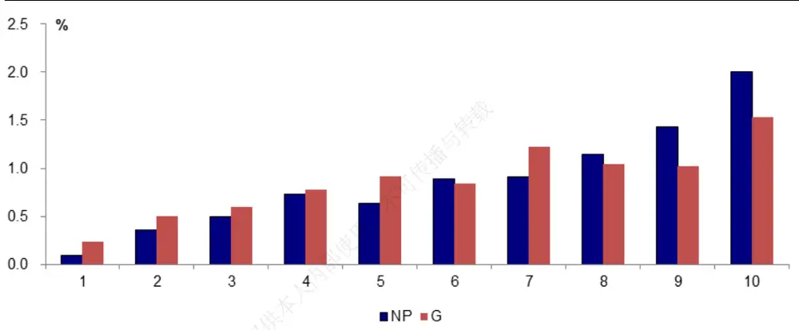
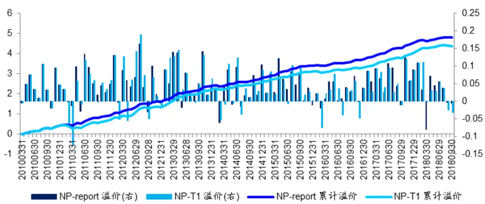
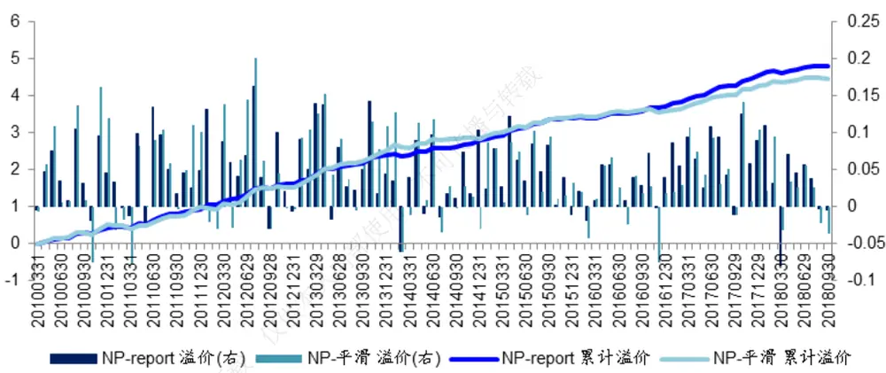
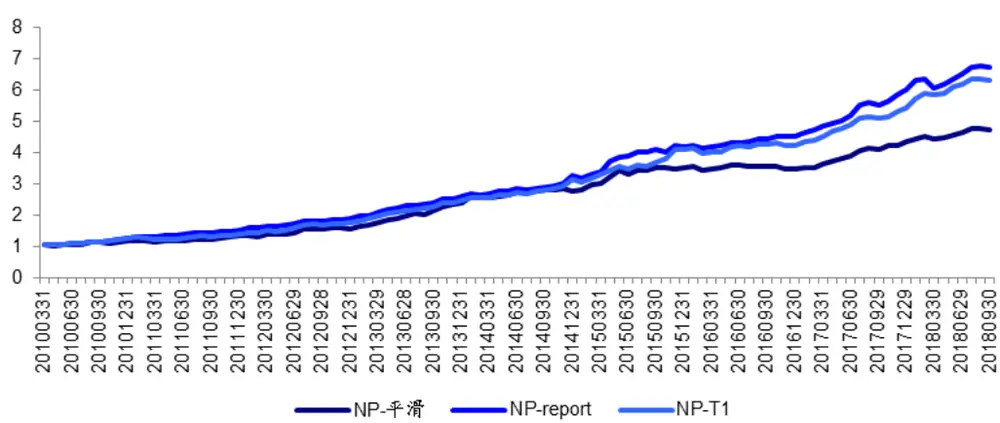
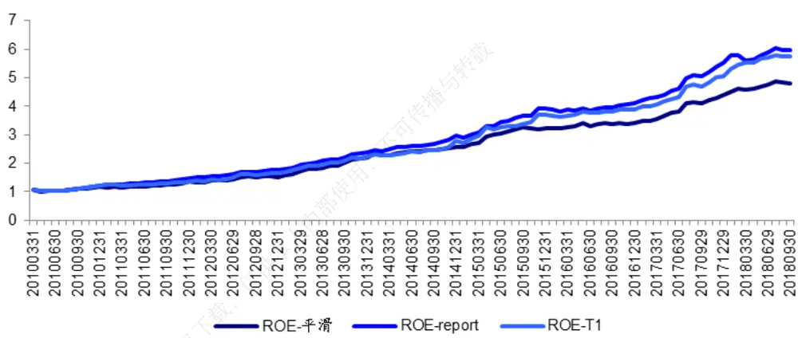
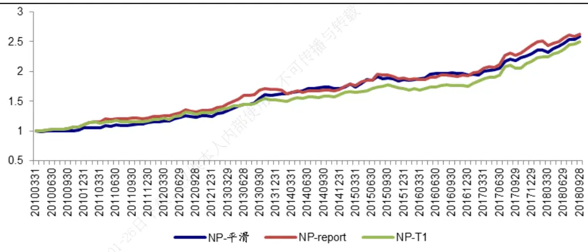
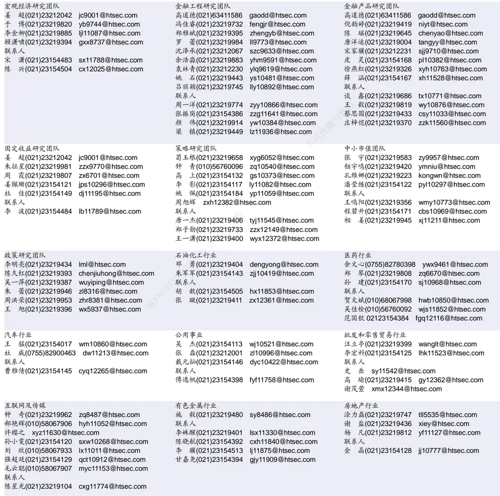

## [Tab相关研究

Table_ReportInfo]《选股因子系列研究（三十九）——如何

计算盈利指标的趋势？》2018.10.12

分析师:冯佳睿

Tel:(021)23219732

Email:fengjr@htsec.com

证书:S0850512080006

分析师:郑雅斌

Tel:(021)23219395

Email:zhengyb@htsec.com

证书:S0850511040004

# 选股因子系列研究（四十）——预期因子的底层数据处理

## [Table_Sum投资要点：

- 我们在之前的研究中已经验证过一致预期数据在选股和行业轮动中的作用，本篇报告深入到一致预期因子的底层处理方式上，比较了几种不同的因子加工处理方式，对于策略和因子有效性的最终影响。因子对象为预期 、净利润 、净利润同比增速 NPG 以及两年复合增速 G。

- 加工一致预期因子的时候，推荐时间序列标准化的处理方式，构建预期调整因子。在准备基础数据的时候，底层因子有几种构成方法：平滑算法（采用不同财务年度预测值进行平滑，保证在不同时刻获取到的预期数据，均代表未来一年的预期值）；锁定最近年度算法（在所有时点，都选择最近一个财务年度的预测值构建底层数据，可能会造成数据有跳跃波动情况）；锁定财务年度（在所有时点，需要保证每一个底层预测数据针对的财务年份一样）。

- 从因子 IC 表现来看，锁定财务年度算法，正交因子的 IR 基本最高。仅对于因子G，锁定财务年度的因子 IR不是最高，这主要是该算法下因子 G需要用到未来三年的预测数据，因子的预测准确度较低。从因子溢价来看，ROE、NP、NPG 三个因子的因子溢价以及显著性水平都是锁定财务年度算法最优。因子多空收益具有类似特征。

- 从时间序列表现来看，几个预期因子的因子溢价以及多空收益时间序列走势非常平稳，超额收益稳定。相对而言，锁定财务年度算法最优，优势在多空收益上更为明显（即极值组合特征）。

- 从单因子的多头组合表现来看，几个因子的多头组合年化超额收益差异不大，超额收益均能够超过 10%，且胜率在 65%以上，单因子表现非常突出。相对而言，平滑算法的因子多头信息比最高，因子多头效应最稳定。以 NP 因子为例，虽然市场在 2015-2018 年期间经历了风格切换，但因子基本在所有年份，单因子超额收益均为正，推荐投资者关注。

- 综合来看，从因子的全面表现分析，锁定财务年度的算法综合表现最优；如果投资者更为关心单因子的多头效应，平滑算法则是更好的选择。

- 风险提示：流动性风险、模型失效风险、因子失效风险。

近期我们发布了多篇采用一致预期数据构建的策略报告，如《行业预期数据的应用分析》、《行业轮动系列研究 8——预期情绪数据的应用分析》等，报告中发现一致预期数据在选股以及行业轮动中都有较好的有效性。本篇报告深入到一致预期因子的底层处理方式上，比较了几种不同的因子加工处理方式，对于策略和因子有效性的最终影响，方便投资者在运用一致预期数据的时候少走弯路。

## 1. 一致预期因子的处理方法

关于分析师的一致预期数据，可以加工的因子种类较多，我们这里不讨论衍生因子的情况，着眼于最基础的一致预期基本面因子进行分析。在这些因子中，盈利指标中的净利润（NP）、ROE，成长指标中的净利润同比增速（NPG）、2 年复合净利润增速（G）基本涵盖了分析师进行预测的最重要的几类信息，这几个因子也是投资者最为关注的几个因子，所以后文中主要对这四个因子进行分析。

在我们之前的专题报告《选股因子系列研究（三十三）——预期调整因子的收益特征》中，我们讨论了预期数据比较好的因子处理方式是对预期数据进行历史时间序列标准化，重建后的预期调整因子在各个维度的表现上都明显优于原始因子。故而本文所分析的所有因子对象，都已经采用了这种处理方式，后文中我们不再过多赘述，文中提到的净利润（NP）、ROE等因子，都已经进行了标准化处理。处理过后的因子，不再存在上市公司本身体量不同带来的不可比情况，所有数据都为可比数据。

确定了因子对象以及因子处理方式，本文主要进行分析对比的，是在进行因子标准化处理的时候，选用的底层因子的构成结构。即，以 因子为例，假设我们要对过去一年的历史数据进行时间序列标准化，那么 ROE（t-11）、ROE（t-10）……ROE（t）这 个时间序列因子，具体选用什么样的数据构成底层因子？对于大多数因子而言，都不存在这个问题，因为在每个时点上因子都是唯一的。但是一致预期数据的特殊性在于，每个时点上分析师会对未来 1-3年的上市公司财务数据进行预测，也就是在 t时刻，我们最多可能获取到 3 个 ROE 数据：ROE（year+1）、ROE（year+2）、ROE（year+3）。这就是本文将要进行分析的主要问题，究竟选择什么样的或者哪个年份的预测 ROE，构建标准化因子的底层数据？

我们主要对比三种底层数据构建方式：

## 平滑数据

以 2018 年为例，在 2018 年年初的时候， ROE(2018)预期值全部为未来信息，而在 2018 年的 10 月份，中报已经发布完毕，ROE(2018)中的一半信息已经在中报中反映，只有下半年的数据为未来信息，理论上因子的领先性会有一定降低。投资者可以通过平滑的方式重建 ROE因子，使得重建后的 ROE因子始终反映较多的未来信息。平滑方式根据财报期的更新，在每次季报更新后，以新的权重加权 ROE(2018)和 ROE(2019)，保证平滑后的 ROE因子不包含已经披露的财务数据，总是代表向后滚动一年的预期值。这种处理方式的优点在于，基础 ROE数据变化缓慢，不会出现由于财务年度变化，ROE突变的情况；劣势在于平滑后的因子含有信息较为复杂，相对不直观。

## 锁定最近年度

这种处理方式在目前的应用中较为常见。投资者在使用一致预期数据的时候，多数情况下更关心当前年度的年报数据，以 年为例，在这个自然年度绝大多数时候我们更关心分析师对于上市公司 2018 年财务状况的预测，且对于 2018 年的预测一定比年的预测更为准确，数据获取度也更高。那么底层数据，可以选用针对当前自然年度的预测值。即每一个时刻，都选用分析师预测的（ ）值。这种处理方法的好处是：每个时刻，运用的都是相对而言最准确的预测值，也是投资者关注度最高的预测值；劣势是：底层数据所针对的财报年度可能不同，由此有些数据会存在较大波动。

## 锁定财务年度

所有的底层数据必须是针对同样财务年度进行预测的值，例如以 2018 年 9 月底的数据为例，回溯过去 12个月能够得到的对于 2018 年的预测值。这种做法的优势是：数据财务年度一致，逻辑支撑强大，可以对比随着时间推移，对于同一个财务年度预期值的变动；劣势是，在某些时点，取到的数据为分析师对于未来第二年的预测值，因子的可靠性/准确度会有一定程度的降低，个别股票可能因子值缺失。

三种构建方式从逻辑上分析各有优劣，后文中我们将详细对比因子表现，供投资者参考。

## 2. 预期因子的综合表现对比

本节将三种构建方法下 ROE、NP、NPG、G 四个因子的 RankIC、进行收益率预测时的因子溢价，以及因子十分组收益的单调性进行对比。

## 2.1 因子 IC 表现

表格中的平滑、T1、report 分别代表三种处理方法：平滑算法、锁定最近年度、锁定财务年度。分别比对原始因子以及正交后的因子 RankIC表现。正交因子剔除传统多因子模型中使用的风格、行为、基本面等维度因子。

表 1 因子 RankIC 对比（2010.03-2018.09）

|  | 原始因子 RankIC |  |  | 正交因子 RankIC |  |  |
| --- | --- | --- | --- | --- | --- | --- |
| 因子 |  | G |  |  | G |  |
| 算法 | 平滑 | T1 | Report | 平滑 用 | T1 | Report |
| 均值 | 0.030 | 0.030 | 0.030 本人内部使 | 0.031 | 0.030 | 0.030 |
| 方差 | 0.056 | 0.056 | 0.056 | 0.051 | 0.050 | 0.050 |
| IR | 1.871 | 1.846 | 1.848 | 2.114 | 2.085 | 2.088 |
| 胜率 | 0.716 | 0.716 | 0.716 | 0.725 | 0.745 | 0.745 |
| T | 5.455 | 5.382 | 5.389 下载 | 6.164 | 6.079 | 6.087 |
| 因子 | ROE |  |  | ROE |  |  |
| 算法 | 平滑 | T1 | Report | 平滑 | T1 | Report |
| 均值 | 0.044 | 0.045 202 | 0.039 | 0.044 | 0.046 | 0.044 |
| 方差 | 0.072 | 0.070 | 0.059 | 0.067 | 0.065 | 0.056 |
| IR | 2.100 |  | 2.322 | 2.286 | 2.453 | 2.707 |
| 胜率 | 0.706 | 0.735 | 0.755 | 0.716 | 0.765 | 0.755 |
| T | 6.123 | 6.395 | 6.768 | 6.664 | 7.151 | 7.894 |
| 因子 | NP |  |  | NP |  |  |
| 算法 | 平滑 | T1 | Report | 平滑 | T1 | Report |
| 均值 | 0.046 | 0.044 | 0.041 | 0.050 | 0.048 | 0.046 |
| 方差 | 0.088 | 0.085 | 0.066 | 0.082 | 0.077 | 0.061 |
| IR | 1.826 | 1.768 | 2.124 | 2.097 | 2.167 | 2.617 |
| 胜率 | 0.676 | 0.647 | 0.696 | 0.706 | 0.725 | 0.755 |
| T | 5.323 | 5.153 | 6.191 | 6.114 | 6.319 | 7.629 |
| 因子 |  |  |  | NPG |  |  |
| 算法 | 平滑 | NPG T1 |  | 平滑 | T1 |  |
| 均值 | 0.023 | 0.028 | Report 0.031 | 0.019 | 0.027 | Report |
| 方差 | 0.056 | 0.056 | 0.061 | 0.049 | 0.049 | 0.032 0.056 |
| IR | 1.390 | 1.715 | 1.772 | 1.343 | 1.869 | 2.017 |
| 胜率 | 0.657 | 0.696 | 0.657 | 0.676 | 0.706 | 0.686 |
| T | 4.054 | 5.001 | 5.167 | 3.915 | 5.450 | 5.879 |

资料来源：朝阳永续，Wind，海通证券研究所

对比而言，绝大多数情况下，都是锁定财务年度的算法最优。且始终优于锁定最新年度这种算法（常用算法）的因子 IR表现。而平滑算法虽然在数据上合理利用了当前年度以及下个年度的预测数据，表现却总是弱于锁定财务年度的方法。仅对于因子 G，锁定财务年度的因子 IR不是最高，这主要是由于因子 G需要用到未来两年的预测数据，而锁定财务年度的算法，在某些时刻实际上利用了未来 3 年的分析师预测数据，从这点而言，因子的预测准确度较低，会直接导致因子表现有所打折。但是因子 IR依然强于锁定最新年度的因子 IR。

## 2.2因子溢价

将新的因子分别加入原始多因子模型进行回归，考察单个因子的因子溢价表现。

表 2 因子溢价（2010.03-2018.09）

| 因子 |  |  |
| --- | --- | --- |
| 算法 | G 平滑 T1 | Report |
| 均值 | 0.0324 0.0322 | 0.0321 |
| T | 8.3502 8.4894 | 8.4680 |
| 因子 | ROE |  |
| 算法 | 平滑 T1 | Report |
| 均值 | 0.0441 0.0438 不可传播与转 | 0.0443 |
| T | 9.2755 9.2931 | 10.5318 |
| 因子 | NP |  |
| 算法 | 平滑 T1 | Report |
| 均值 | 0.0440 0.0432 使 | 0.0472 |
| T | 7.6010 7.9340 | 10.2572 |
| 因子 | NPG |  |
| 算法 | 平滑 T1 仅供本 | Report |
| 均值 日下载， | 0.0259 0.0306 | 0.0357 |
| T | 7.0480 7.9768 | 8.9681 |

资料来源：朝阳永续， ，海通证券研究所

类似的，从因子溢价均值以及 T 统计量来看，ROE、NP、NPG 三个因子均是锁定财务年度算法最优。仅对于因子 G，几种算法的溢价均值和 T 值都较为接近。

## 2.3因子分组收益

本节分析不同因子进行股票分组，十分组收益的具体情况。收益统计为月均收益，胜率统计为月度胜率。对于任何因子，和前文结论类似，都是锁定财务年度算法（”report”）的因子多空收益、多空胜率表现最优。

表 3 因子分组收益以及多空收益(%)（2010.03-2018.09）

| 分组1 |  | 分组2 | 分组3 | 分组4 | 分组5 | 分组 6 | G 分组7 | 分组8 | 分组9 | 分组 10 | 多空 | 胜率 | T |
| --- | --- | --- | --- | --- | --- | --- | --- | --- | --- | --- | --- | --- | --- |
| 平滑 | 0.245 | 0.494 | 0.547 | 0.804 | 0.890 | 0.824 | 1.229 | 1.062 | 1.002 | 1.567 | 0.013 | 0.794 | 7.320 |
| T1 | 0.248 | 0.502 | 0.560 | 0.813 | 0.895 | 0.830 | 1.237 | 1.055 | 1.026 | 1.532 | 0.013 | 0.824 | 7.080 |
| Report | 0.235 | 0.503 | 0.592 | 0.779 | 0.912 | 0.840 | 1.228 | 1.041 | 1.016 | 1.536 | 0.013 | 0.824 | 7.243 |
|  |  |  |  |  |  |  | ROE |  |  |  |  |  |  |
|  | 分组1 | 分组2 | 分组3 | 分组4 | 分组 5 | 分组 6 | 分组7 | 分组8 | 分组9 | 分组 10 | 多空 | 胜率 | T |
| 平滑 | 0.172 | 0.370 | 0.578 | 0.580 | 0.607 | 0.993 | 0.981 | 1.284 | 1.372 | 1.753 | 0.016 | 0.804 | 7.652 |
| T1 | 0.134 | 0.425 | 0.468 | 0.660 | 0.692 | 0.824 | 0.955 | 1.329 | 1.345 | 1.891 | 0.018 | 0.775 | 7.382 |
| Report | 0.155 | 0.483 | 0.457 | 0.701 | 0.676 | 0.752 | 0.950 | 1.194 | 1.375 | 1.947 | 0.018 | 0.804 | 8.645 |
|  |  |  | 分组3 | 分组4 | 分组5 |  | NP |  |  |  |  |  |  |
|  | 分组1 | 分组2 |  |  |  | 分组 6 | 分组7 | 分组8 | 分组9 | 分组 10 | 多空 | 胜率 | T |
| 平滑 | 0.052 | 0.231 | 0.604 | 0.566 | 0.742 | 1.009 | 1.011 | 1.276 | 1.533 | 1.629 | 0.016 | 0.735 | 6.548 |
| T1 | 0.135 | 0.397 | 0.504 | 0.719 | 0.678 | 0.718 | 0.997 | 1.219 | 1.385 | 1.996 | 0.019 | 0.814 | 7.953 |
| Report | 0.091 | 0.352 | 0.493 | 0.731 | 0.638 | 0.890 | 0.907 | 1.146 | 1.428 | 2.007 | 0.019 | 0.853 | 8.694 |
|  |  |  |  |  |  |  | NPG |  |  |  |  |  |  |
|  | 分组1 | 分组2 | 分组3 | 分组4 | 分组 5 | 分组 6 | 分组7 | 分组8 | 分组9 | 分组 10 | 多空 | 胜率 | T |
| 平滑 | 0.465 | 0.634 | 0.668 | 0.754 | 0.774 | 0.842 | 1.160 | 1.137 | 1.281 | 1.049 | 0.006 | 0.657 | 3.256 |
| T1 | 0.418 | 0.359 | 0.675 | 0.689 | 0.931 | 0.971 | 1.048 | 1.051 | 1.180 | 1.408 | 0.010 | 0.706 | 5.539 |
| Report | 0.213 | 0.419 | 0.552 | 0.728 | 0.777 | 1.036 | 1.055 | 1.123 | 1.260 | 1.592 | 0.014 | 0.735 | 6.741 |

资料来源：朝阳永续， ，海通证券研究所

下图中以多空收益最优的 NP因子和最低的 G因子为例，展示了“report”（锁定财务年度）算法下，两因子十个股票分组收益情况。尽管因子表现有所差异，但预期因子都具有较好的单调性。

图1 NP 因子和 G 因子十分组收益（2010.03-2018.09）

资料来源：朝阳永续，Wind，海通证券研究所

## 3. 因子时间序列表现

本节展示时间序列上，因子各个维度指标的表现，如因子溢价、多空收益稳定性，以及多头组合的时间序列效果。

## 3.1因子溢价的时间序列表现

下图中我们以 NP因子为例，展示了三种算法下的因子溢价时间序列表现。锁定财务年度相对于传统经常使用的锁定最新年度的算法，因子溢价优势明显，累计溢价走势基本持续走强。锁定财务年度和平滑算法的因子溢价差距不大，长期来看小幅跑赢。

图2 锁定财务年度 VS锁定最新年度因子溢价

资料来源：朝阳永续，Wind，海通证券研究所

图3 锁定财务年度 VS平滑因子溢价

资料来源：朝阳永续，Wind，海通证券研究所

## 3.2因子多空收益时间序列

从 因子的因子溢价上，能看到锁定财务年度算法的优势，而从因子多空收益的时间序列表现来看，优势更为明显。NP因子锁定财务年度的多空走势大幅超越平滑算法，虽然两者在因子溢价上的差异并不明显，而锁定最近年度算法因子溢价上的表现稳定性较差，但是极值组合（多空净值）的表现接近锁定财务年度算法。ROE因子多空净值走势类似于 NP因子。

图4 NP因子多空净值走势

资料来源：朝阳永续，Wind，海通证券研究所

图5 ROE 因子多空净值走势

资料来源：朝阳永续，Wind，海通证券研究所

## 3.3因子多头时间序列走势

本节将因子的多头走势单独呈现，方便大家看到不同算法下多头组合表现。依然以表现较好的 ROE和 NP因子为例。多头效应采用正交后的因子，选择排名靠前的 10%股票等权构建组合。

比较而言：单纯从多头效应来看，平滑算法的多头组合信息比最高，平滑算法在多头组合上更稳定。综合因子表现以及多空累计效应都表现最佳的锁定财务年度算法，从多头信息比而言表现相对较为逊色，但是几种算法的超额收益相差不大。

表 4 因子多头效应（2010.03-2018.09）

| 因子 | ROE |  |  |
| --- | --- | --- | --- |
| 算法 | 多头年化超额收益 | 胜率 | 信息比 |
| 平滑 | 0.105 | 0.680 | 1.874 |
| T1 | 0.112 | 0.660 | 1.783 |
| Report | 0.108 | 0.699 | 1.664 |
| 因子 |  | NP |  |
| 算法 | 多头年化超额收益 | 胜率 | 信息比 |
| 平滑 | 0.121 | 0.709 | 1.987 |
| T1 | 0.116 | 0.689 | 1.938 |
| Report | 0.123 | 0.699 | 1.875 |

资料来源：朝阳永续，Wind，海通证券研究所

在前文的各种统计中不难发现 NP因子的表现总是最优，我们用其构建单因子策略，下图中简单展示了单因子的多头组合走势 VS基准指数走势的相对强弱。（基准指数为全市场等权加权指数）。单因子的多头组合时间序列走势稳定，累计超额收益趋势平稳。

图6 NP因子多头 VS基准走势

资料来源：朝阳永续，Wind，海通证券研究所

统计各个年度 NP因子多头组合相对等权基准的超额收益，如下表。除 report 算法下，2014 年多头略微跑输基准，其他年份因子均贡献正超额收益，单因子表现极为突出。

表 5 NP因子多头分年度超额收益

| 算法 | 平滑 | T1 | report |
| --- | --- | --- | --- |
| 2010 | 0.053 | 0.113 | 0.113 |
| 2011 | 0.061 | 0.036 | 0.069 |
| 2012 | 0.092 | 0.129 | 0.119 |
| 2013 | 0.350 | 0.198 | 0.304 |
| 2014 | 0.085 | 0.079 | -0.001 |
| 2015 | 0.140 | 0.096 | 0.165 |
| 2016 | 0.037 | 0.022 | 0.019 |
| 2017 | 0.180 | 0.232 | 0.258 |
| 2018.09 | 0.099 | 0.120 | 0.064 |
| 年化 | 0.121 | 0.116 | 0.123 |

资料来源：朝阳永续，Wind，海通证券研究所

## 4. 结论

我们在之前的研究中已经验证过一致预期数据在选股和行业轮动中的作用，本篇报告深入到一致预期因子的底层处理方式上，比较了几种不同的因子加工处理方式，对于策略和因子有效性的最终影响。因子对象为预期 ROE、净利润 NP、净利润同比增速 NPG以及两年复合增速 G。

加工一致预期因子的时候，推荐时间序列标准化的处理方式，构建预期调整因子。在准备基础数据的时候，底层因子有几种构成方法：平滑算法（采用不同财务年度预测值进行平滑，保证在不同时刻获取到的预期数据，均代表未来一年的预期值）；锁定最近年度算法（在所有时点，都选择最近一个财务年度的预测值构建底层数据，可能会造成数据有跳跃波动情况）；锁定财务年度（在所有时点，需要保证每一个底层预测数据针对的财务年份一样）。

从因子 IC表现来看，锁定财务年度算法，正交因子的 IR 基本最高。仅对于因子 G，锁定财务年度的因子 不是最高，这主要是该算法下因子 需要用到未来三年的预测数据，因子的预测准确度较低。从因子溢价来看， 、 、 三个因子的因子溢价以及显著性水平都是锁定财务年度算法最优。因子多空收益具有类似特征。

从时间序列表现来看，几个预期因子的因子溢价以及多空收益时间序列走势非常平稳，超额收益稳定。相对而言，锁定财务年度算法最优，优势在多空收益上更为明显（即极值组合特征）。

从单因子的多头组合表现来看，几个因子的多头组合年化超额收益差异不大，超额收益均能够超过 10%，且胜率在 65%以上，单因子表现非常突出。相对而言，平滑算法的因子多头信息比最高，因子多头效应最稳定。以 NP因子为例，虽然市场在 2015-2018年期间经历了风格切换，但因子基本在所有年份，单因子超额收益均为正，推荐投资者关注。

综合来看，从因子的全面表现分析，锁定财务年度的算法综合表现最优；如果投资者更为关心单因子的多头效应，平滑算法则是更好的选择。

## 5. 风险提示

流动性风险、模型失效风险、因子失效风险。

# 信息披露

分析师声明

[Table冯佳睿yst金融工程研究团队s]

郑雅斌金融工程研究团队

本人具有中国证券业协会授予的证券投资咨询执业资格，以勤勉的职业态度，独立、客观地出具本报告。本报告所采用的数据和信息均来自市场公开信息，本人不保证该等信息的准确性或完整性。分析逻辑基于作者的职业理解，清晰准确地反映了作者的研究观点，结论不受任何第三方的授意或影响，特此声明。

## 法律声明

本报告仅供海通证券股份有限公司（以下简称“本公司”）的客户使用。本公司不会因接收人收到本报告而视其为客户。在任何情况下，本报告中的信息或所表述的意见并不构成对任何人的投资建议。在任何情况下，本公司不对任何人因使用本报告中的任何内容所引致的任何损失负任何责任。

本报告所载的资料、意见及推测仅反映本公司于发布本报告当日的判断，本报告所指的证券或投资标的的价格、价值及投资收入可能载会波动。在不同时期，本公司可发出与本报告所载资料、意见及推测不一致的报告。

市场有风险，投资需谨慎。本报告所载的信息、材料及结论只提供特定客户作参考，不构成投资建议，也没有考虑到个别客户特殊的可投资目标、财务状况或需要。客户应考虑本报告中的任何意见或建议是否符合其特定状况。在法律许可的情况下，海通证券及其所属不关联机构可能会持有报告中提到的公司所发行的证券并进行交易，还可能为这些公司提供投资银行服务或其他服务。用

本报告仅向特定客户传送，未经海通证券研究所书面授权，本研究报告的任何部分均不得以任何方式制作任何形式的拷贝、复印件或内复制品，或再次分发给任何其他人，或以任何侵犯本公司版权的其他方式使用。所有本报告中使用的商标、服务标记及标记均为本公本司的商标、服务标记及标记。如欲引用或转载本文内容，务必联络海通证券研究所并获得许可，并需注明出处为海通证券研究所，且仅不得对本文进行有悖原意的引用和删改。载，

根据中国证监会核发的经营证券业务许可，海通证券股份有限公司的经营范围包括证券投资咨询业务。日

| 邓勇副所长 | 荀玉根副所长 | 钟奇所长助理 |
| --- | --- | --- |
| (021)23219404 dengyong@htsec.com | (021)23219658 xyg6052@htsec.com | (021)23219962 zq8487@htsec.com |

## 海通证券股份有限公司研究所[Table_PeopleInfo]

路 颖所长

(021)23219403 luying@htsec.com

高道德 副所长(021)63411586 gaodd@htsec.com

姜 超 副所长

(021)23212042 jc9001@htsec.com

涂力磊所长助理

(021)23219747 tll5535@htsec.com

| 电子行业 |  |  | 煤炭行业 | 电力设备及新能源行业 |  |
| --- | --- | --- | --- | --- | --- |
|  | 陈 平(021)23219646 cp9808@htsec.com |  | 李 淼(010)58067998 Im10779@htsec.com | 张一弛(021)23219402 | zyc9637@htsec.com |
| 联系人 |  |  | 戴元灿(021)23154146 dyc10422@htsec.com | 房 青(021)23219692 | fangq@htsec.com |
|  | 谢 磊(021)23212214 xl10881@htsec.com |  | 吴 杰(021)23154113 wj10521@htsec.com | 曾 彪(021)23154148 | zb10242@htsec.com |
| 尹 | 苓(021)23154119 yl11569@htsec.com |  | 联系人 |  | 徐柏乔(021)23219171 xbq6583@htsec.com |
| 石 |  | 坚(010)58067942 sj11855@htsec.com | 王 涛 02123219760 wt12363@htsec.com | 张向伟(021)23154141 | zxw10402@htsec.com |

| 基础化工行业 |  | 计算机行业 |  | 通信行业 |  |
| --- | --- | --- | --- | --- | --- |
| 刘 威(0755)82764281 Iw10053@htsec.com |  | 郑宏达(021)23219392 | zhd10834@htsec.com | 朱劲松(010)50949926 | zjs10213@htsec.com |
| 刘海荣(021)23154130 Ihr10342@htsec.com |  | 黄竞晶(021)23154131 | hjj10361@htsec.com | 余伟民(010)50949926 | ywm11574@htsec.com |
| 张翠翠(021)23214397 | zcc11726@htsec.com | 杨 林(021)23154174 yl11036@htsec.com |  | 张 弋 01050949962 zy12258@htsec.com |  |
| 孙维容(021)23219431 联系人 | swr12178@htsec.com | 鲁 立(021)23154138 II11383@htsec.com |  | 张峥青(021)23219383 zzq11650@htsec.com |  |
| 李 智(021)23219392 lz11785@htsec.com |  | 于成龙 ycl12224@htsec.com |  |  |  |
|  |  | 联系人 |  |  |  |
|  |  | 洪 琳(021)23154137 hl11570@htsec.com |  |  |  |

| 非银行金融行业 |  | 交通运输行业 | 虞 楠(021)23219382 yun@htsec.com | 纺织服装行业 |  |  |
| --- | --- | --- | --- | --- | --- | --- |
|  | 孙 婷(010)50949926 st9998@htsec.com |  |  |  |  | 梁 希(021)23219407 lx11040@htsec.com |
|  | 何 婷(021)23219634 ht10515@htsec.com |  | 联系人 |  | 联系人 |  |
| 联系人 |  |  | 李 丹(021)23154401 Id11766@htsec.com |  | 盛 开(021)23154510 | sk11787@htsec.com |
|  | 李芳洲(021)23154127 Ifz11585@htsec.com |  | 党新龙(0755)82900489 dxl12222@htsec.com |  | 刘 溢(021)23219748 | ly12337@htsec.com |

| 建筑建材行业 | 机械行业 |  | 钢铁行业 |
| --- | --- | --- | --- |
| 冯晨阳(021)23212081 fcy10886@htsec.com 联系人 | 余炜超(021)23219816 swc11480@htsec.com 耿 耘(021)23219814 gy10234@htsec.com |  | 刘彦奇(021)23219391 liuyq@htsec.com 联系人 |
| 申 浩(021)23154114 sh12219@htsec.com | 杨 震(021)23154124 yz10334@htsec.com 沈伟杰(021)23219963 swj11496@htsec.com | 专播与 | 周慧琳(021)23154399 zhl11756@htsec.com 刘 璇(0755)82900465 lx11212@htsec.com |

| 建筑工程行业 | 农林牧渔行业 |  | 食品饮料行业 |  |  |
| --- | --- | --- | --- | --- | --- |
| 杜市伟(0755)82945368 dsw11227@htsec.com | 丁 频(021)23219405 | dingpin@htsec.com | 闻宏伟(010)58067941 |  | whw9587@htsec.com |
| 张欣劼 zxj12156@htsec.com | 陈雪丽(021)23219164 | cxl9730@htsec.com |  | 成珊(021)23212207 | cs9703@htsec.com |
| 李富华(021)23154134 Ifh12225@htsec.com | 陈 阳(021)23212041 | cy10867@htsec.com | 唐 | 宇(021)23219389 | ty11049@htsec.com |

| 军工行业 |  | 银行行业 | 社会服务行业 |  |  |
| --- | --- | --- | --- | --- | --- |
|  | 蒋 俊(021)23154170 jj11200@htsec.com |  | 孙 婷(010)50949926 st9998@htsec.com | 汪立亭(021)23219399 wanglt@htsec.com |  |
|  | 刘 磊(010)50949922 II11322@htsec.com |  | 解巍巍 xww12276@htsec.com |  | 陈扬扬(021)23219671 cyy10636@htsec.com |
| 张恒晅 zhx10170@htsec.com |  |  | 联系人 |  |  |
| 联系人 |  |  | 林加力(021)23214395 ljl12245@htsec.com |  |  |
| 张宇轩(021)23154172 zyx11631@htsec.com |  |  | 谭敏沂(0755)82900489 tmy10908@htsec.com |  |  |

| 家电行业 |  | 造纸轻工行业 |  |
| --- | --- | --- | --- |
| 陈子仪(021)23219244 chenzy@htsec.com |  | 衣桢永(021)23212208 yzy12003@htsec.com |  |
| 李 阳(021)23154382 ly11194@htsec.com |  | 曾知(021)23219810 zz9612@htsec.com |  |
| 联系人 |  |  | 洋(021)23154126 zy10340@htsec.com |
| 朱默辰(021)23154383 zmc11316@htsec.com | 户67775 |  |  |
| 刘 璐(021)23214390 II11838@htsec.com |  |  |  |

## 研究所销售团队

深广地区销售团队

蔡铁清(0755)82775962 ctq5979@htsec.com

伏财勇(0755)23607963 fcy7498@htsec.com

辜丽娟(0755)83253022 gulj@htsec.com

刘晶晶(0755)83255933 liujj4900@htsec.com

王雅清(0755)83254133 wyq10541@htsec.com

饶 伟(0755)82775282 rw10588@htsec.com

欧阳梦楚(0755)23617160

oymc11039@htsec.com

宗 亮 zl11886@htsec.com

巩柏含 gbh11537@htsec.com

上海地区销售团队

胡雪梅(021)23219385 huxm@htsec.com
朱 健(021)23219592 zhuj@htsec.com
季唯佳(021)23219384 jiwj@htsec.com
黄 毓(021)23219410 huangyu@htsec.com漆冠男(021)23219281 qgn10768@htsec.com胡宇欣(021)23154192 hyx10493@htsec.com黄 诚(021)23219397 hc10482@htsec.com毛文英(021)23219373 mwy10474@htsec.com马晓男 mxn11376@htsec.com
杨祎昕(021)23212268 yyx10310@htsec.com张思宇 zsy11797@htsec.com
慈晓聪(021)23219989 cxc11643@htsec.com王朝领 wcl11854@htsec.com
北京地区销售团队
殷怡琦(010)58067988 yyq9989@htsec.com
郭 楠 010-5806 7936 gn12384@htsec.com
吴 尹 wy11291@htsec.com
张丽萱(010)58067931 zlx11191@htsec.com
杨羽莎(010)58067977 yys10962@htsec.com
杜 飞 df12021@htsec.com
张 杨(021)23219442 zy9937@htsec.com
何 嘉(010)58067929 hj12311@htsec.com
李 婕 lj12330@htsec.com
欧阳亚群 oyyq12331@htsec.com

海通证券股份有限公司研究所

地址：上海市黄浦区广东路 689号海通证券大厦 9楼

电话：（021）23219000

传真：（021）23219392

网址：www.htsec.com