## [Tab相关研究

Table_ReportInfo]《选股因子系列研究（四十）——预期因

子的底层数据处理》2018.10.19

《选股因子系列研究（三十九）——如何

计算盈利指标的趋势？》2018.10.12

分析师:冯佳睿

Tel:(021)23219732

Email:fengjr@htsec.com

证书:S0850512080006

分析师:罗蕾

Tel:(021)23219984

Email:ll9773@htsec.com

证书:S0850516080002

# 选股因子系列研究（四十一）——医药行业因子选股研究

## 投资要点：

常见选股因子在医药行业内存在显著选股效果。其中，风格类因子平均收益水平高，但稳定性差，在近两年出现了持续性的大幅回撤。技术类因子与股票收益呈现显著负相关性，前期涨跌幅越大，换手率越高，波动率越大，流动性越强，次月股票收益表现越差。在这几个因子中，综合表现最好的是波动率，综合表现相对较差的是换手率。盈利能力在医药行业内也存在显著的选股效果，高盈利公司具有更高的收益。

医药行业其他有效的选股因子。除常见的 及其同比增长因子外，其余基本面因子在医药行业内也存在显著的选股效果。企业盈利能力越高，资产增长越快，利润增长越快，盈利质量越好，偿债能力越强，股票收益表现越优。从一致预期数据来看，预期盈利调整、分析师覆盖度等因子也存在显著选股效果。

- 按照逐步筛选法，在医药行业有效的、可提供显著边际信息的因子一共有 9个，分别是市值、非线性市值、反转、换手率、ROE、预期净利润调整、营业收入同比增长、预期外盈利以及流动比率。

- 医药行业最大化预期收益组合。基于上述 个因子构造医药行业收益率预测多因子模型，所得复合因子 为 ，月胜率为 ，相应的 为 。选择预期收益最高的部分股票构建组合，年化收益 ，相对于等权基准年化超额 22.05%。

医药行业指数增强组合。采用全市场医药行业内上市超过 3 个月的股票构建市值加权组合，称之为医药行业指数。该指数年化收益 5.71%，以该指数为优化基准，构建的增强组合年化收益 18.03%，相应的超额收益为 12.32%，最大回撤和波动率控制在 5%左右。将沪深 300 增强组合与医药行业多因子模型结合，构建医药行业单独选股的沪深 300 增强组合，其年化超额收益可由原来的 11.66%增加至12.81%，收益回撤比由 2.85 增加至 3.77。

- 风险提示：有效因子适用环境变动风险，优化模型失效风险。

对于传统多因子组合，我们通常是构建全市场收益率预测模型；但实际上不同横截面股票的特征不一，因子离散度、有效性等均存在差异。在本文和之后的文章中，我们将考察不同行业内的有效因子，构建行业内的多因子模型，并将其应用于指数增强组合。本文则主要考察医药行业内的因子选股。

## 1. 常见选股因子在医药行业内的选股效果

在 A股 29 个中信一级行业中，医药行业个股数多，排名第三，仅次于机械和基础化工。截止 2018 年 8 月底，剔除上市三个月以内的股票后，医药行业个股数 270 余只，个股数占 A股总股票数的比例为 7.8%。个股数较多，我们可在该行业构建多因子模型。

图 1 展示了每个月末统计的医药股个股数占 A股总个股数的比例以及市值占比。从中可看出，医药股的个股数占比相对较为平稳，在 上下小幅波动；市值占比则呈现逐渐增加趋势，截止 2018 年 8 月底，该占比为 6.61%。表明医药行业相较于其他行业最近几年存在超额收益。

图1 医药股在 A股中的个数及市值占比
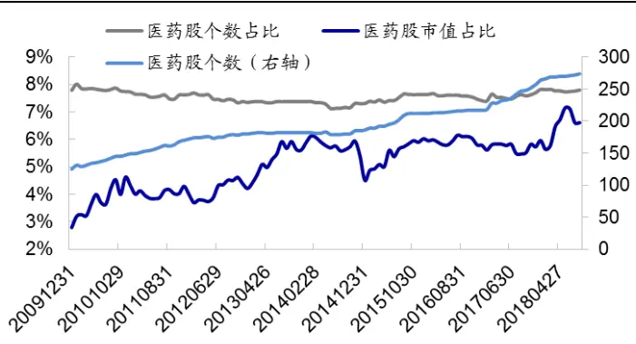
资料来源： ，海通证券研究所

图2 医药股市值分位点分布
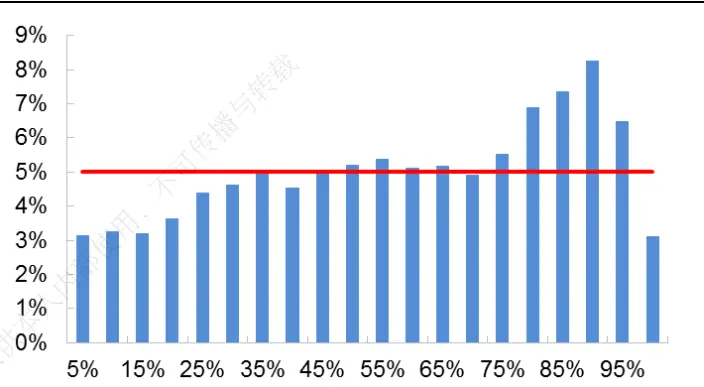
资料来源：Wind，海通证券研究所

图 2 展示了医药股在全市场的市值分位点统计情况，横轴表示市值分位点区间，纵轴表示医药行业中市值分位点在此区间的个股数占比；红色直线表示对比基准。以市值分位点 5%为例，医药行业中股票市值在全市场的分位点处于 0%至 5%之间的个股数占比 3%，而全市场市值分位点在此区间的股票占比为 5%。表明相比于全市场股票，医药股中极小市值的股票较少。同样地，医药股中极大市值的股票也占比较少；市值处于中上水平的股票较多。

本节考察常见选股因子在医药行业中的选股效果，主要包括风格（市值、估值）、技术（反转、换手率、波动率、流动性）、盈利能力（ROE及其变动）三类指标。

## 1.1 风格类因子

从分组收益表现来看，在风格类因子中市值因子表现最优，随着市值增大，股票收益逐渐减小，单调性明显；月均多空收益差为 2.67%。因子月均 RankIC为-3.07%，统计不显著，这主要是由于自 2016 年底开始至今，市值因子产生持续性的大幅回撤。

从相关性角度来看，仅 PE因子可通过显著性检验。剔除市值后，该因子月均 RankIC为-3.56%，有效月份占比 58.65%。但该因子的极端组合收益差不明显，月均多空收益差仅为 0.38%。从时间序列角度来看，2015 年以前该因子几乎不存在选股效果，此后多空净值才呈现缓慢增加趋势。

表 1 风格类单因子在医药行业的表现（2010.01-2018.08）

|  | RankIC |  |  |  | 多空收益差 |  |  |  |
| --- | --- | --- | --- | --- | --- | --- | --- | --- |
|  | 均值 | 月胜率 | t值 | IR | 均值 | 月胜率 | t值 | IR |
| 市值 | -3.07% | 41.35% | -1.48 | -0.50 | 2.67% | 64.42% | 3.75 | 1.27 |
| PE | -2.10% | 49.04% | -1.39 | -0.47 | 0.22% | 51.92% | 0.47 | 0.16 |
| PE，剔除市值 | -3.56% | 41.35% | -2.74 | -0.93 | 0.38% | 57.69% | 0.88 | 0.30 |
| PB | -1.68% | 50.96% | -1.18 | -0.40 | 0.48% | 56.73% | 1.02 | 0.35 |
| PB，剔除市值 | -2.41% | 42.31% | -1.72 | -0.59 | 0.90% | 55.77% | 1.94 | 0.66 |

资料来源：Wind，海通证券研究所

图3 风格类因子分组收益（2010.01-2018.08）
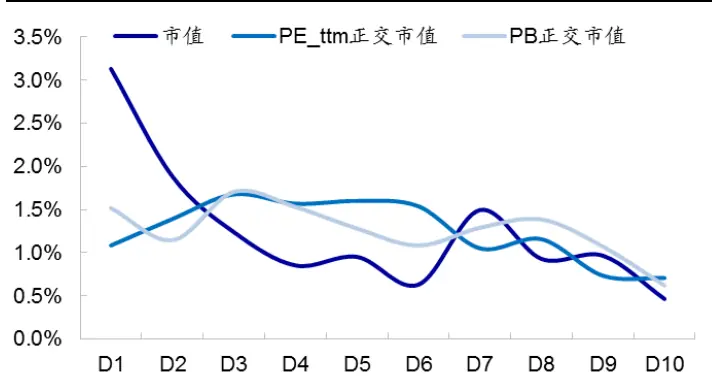
资料来源： ，海通证券研究所

图4 风格类因子多空净值
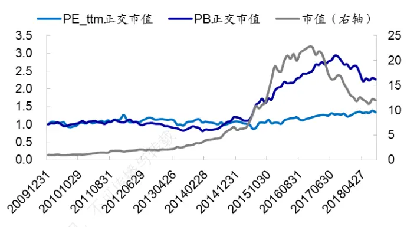
资料来源：Wind，海通证券研究所

## 1.2技术类因子

常见的技术类因子包括前一个月收益（反转因子）、换手率、波动率以及流动性。与全市场统计结果一致，在医药行业内，这几个技术类因子与股票次月收益均呈现显著负相关性。前一个月涨幅越大、换手率越高、波动率越大、流动性越强，次月股票收益表现越差。

表 2 技术类单因子在医药行业的表现（2010.01-2018.08）

| RankIC |  |  |  |  | 多空收益差 |  |  |  |
| --- | --- | --- | --- | --- | --- | --- | --- | --- |
|  | 均值 | 月胜率 | t值 | IR | 均值 | 月胜率 | t值 | IR |
| 反转 | -5.54% | 40.38% | -3.34 | -1.14 | 2.14% | 60.58% | 3.65 | 1.24 |
| 换手率 | -4.79% | 42.31% | -2.52 | -0.86 | 0.84% | 57.69% | 1.17 | 0.40 |
| 波动率 | -6.30% | 33.65% | -4.63 | -1.57 | 1.55% | 63.46% | 2.90 | 0.98 |
| 流动性 | -5.45% | 37.50% | -3.21 | -1.09 | 1.69% | 59.62% | 2.94 | 1.00 |
| 反转（正交市值） | -6.05% | 38.46% | -4.01 | -1.37 | 2.28% | 63.46% | 3.91 | 1.33 |
| 换手率(正交市值) | -5.44% | 37.50% | -3.72 | -1.26 | 1.15% | 60.58% | 1.99 | 0.67 |
| 波动率(正交市值) | -6.37% | 32.69% | -4.91 | -1.67 | 1.82% | 63.46% | 3.29 | 1.12 |
| 流动性(正交市值） | -4.39% | 34.62% | -3.64 | -1.24 | 1.14% | 58.65% | 2.68 | 0.91 |

资料来源：Wind，海通证券研究所

从时间序列角度来看，稳定性最高的技术类单因子是波动率。从 RankIC来看，该因子有效月份占比 67.31%，相应的 IR为 1.67。综合表现相对较差的是换手率因子，该因子原始指标的 、多空收益差、正交因子的多空收益差 都不如其他 个因子，正交因子 RankIC的 IR 也仅优于流动性因子。从图 6可看出，换手率因子失效主要发生在 2015 年以及 2017 年下半年这两个时段。

图5 技术类因子分组收益（2010.01-2018.08）
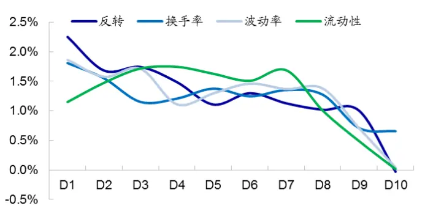
资料来源： ，海通证券研究所

图6 技术类因子多空净值
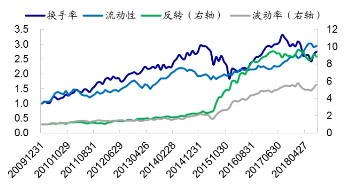
资料来源： ，海通证券研究所

## 1.3盈利能力因子

常见的基本面因子主要是 ROE 及其增长，本小节主要对这两个因子进行分析；下文中我们也会详细考察其他基本面因子在医药行业内的选股效果。与直观一致， 越高、同比增加越大，股票收益越高。盈利能力因子分组收益单调性强，从时间序列角度来看，也不存在持续性地大幅回撤出现，稳定性高。

表 3 盈利能力单因子在医药行业的表现（2010.01-2018.08）

|  | RankIC |  |  |  | 多空收益差 |  |  |  |
| --- | --- | --- | --- | --- | --- | --- | --- | --- |
|  | 均值 | 月胜率 | t值 | IR | 均值 | 月胜率 | t值 | IR |
| ROE | 2.73% | 56.73% | 1.53 | 0.52 部 | 0.11% | 49.04% | 0.21 | 0.07 |
| ROE同比 | 3.57% | 65.38% | 3.50 | 1.19 | 0.66% | 60.58% | 1.64 | 0.56 |
| ROE（正交市值） | 3.96% | 60.58% | 2.91 | 0.99 仅供 | 1.60% | 64.42% | 3.22 | 1.09 |
| ROE同比（正交市 值） | 3.91% | 66.35% | 3.78 x | 1.28 | 0.94% | 60.58% | 2.26 | 0.77 |

资料来源：Wind，海通证券研究所

图7 盈利能力因子分组收益（2010.01-2018.08）
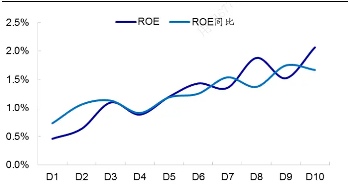
资料来源：Wind，海通证券研究所

图8 盈利能力因子多空净值
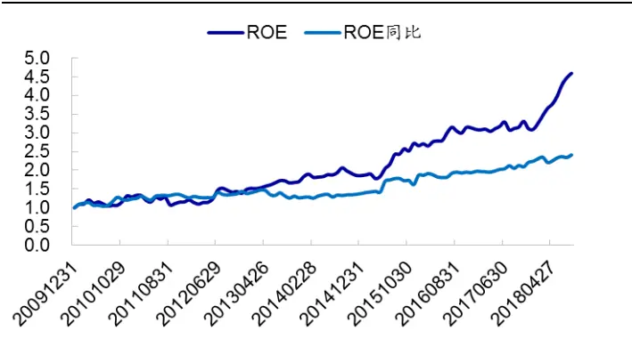
资料来源：Wind，海通证券研究所

总结来看，常见选股因子在医药行业内存在显著选股效果。其中，风格类因子平均收益水平高，但稳定性差，在近两年出现了持续性的大幅回撤。技术类因子与股票收益呈现显著负相关性，前期涨跌幅越大，换手率越高，波动率越大，流动性越强，次月股票收益表现越差。在这几个因子中，稳定性最强的是波动率，稳定性最差的是换手率。盈利能力在医药行业内也存在显著的选股效果，高盈利公司具有更高的收益，且这类因子时间序列稳定性高。

## 2. 基本面因子

本节主要考察除前文常用的 ROE 及其同比增长因子外，其他财务因子在医药行业的选股能力。包括盈利能力、盈利质量、资产增长、利润增长以及偿债能力 5个方面。

## 2.1 盈利能力

除 ROE外，其他刻画企业盈利能力的指标还包括销售毛利率、销售净利率等，这些指标的构建方式均为企业利润除以资产或收入。如毛利除以营业收入（销售毛利率），营业利润除以营业收入、净利润/营业收入（销售净利率）、净利润/净资产（净资产收益率）等。

下表展示了盈利能力因子剔除市值因素后的选股效果。结果显示，无论从哪一个指标来看，医药行业内公司盈利能力水平越高，股票收益表现越优。在 3 个展示的因子中，营业利润/营业收入因子表现最优，月均 RankIC为 4.79%，相应的 IR 为 1.37；多空收益差为 1.39%。3 个盈利能力因子的多空收益差均大于 1%，且多头超额和空头超额对等。

表 4 其他盈利能力因子的选股效果（2010.01-2018.08）

|  | RankIC |  |  |  | 多头超额 |  |  |  | 多空收益差 |  |  |  |
| --- | --- | --- | --- | --- | --- | --- | --- | --- | --- | --- | --- | --- |
|  | 均值 | 月胜率 | t值 | IR | 均值 | 月胜率 | t值 | IR | 均值 | 月胜率 | t值 | IR |
| 销售毛利率 | 3.10% | 63.46% | 2.69 | 0.91 | 0.64% | 60.58% | 2.69 | 0.91 | 1.16% | 60.58% | 2.74 | 0.93 |
| 营业利润/营 业收入 | 4.79% | 74.04% | 4.04 | 1.37 | 0.60% | 60.58% | 2.32 | 0.79 | 1.39% | 64.42% | 3.68 | 1.25 |
| 销售净利率 | 4.61% | 77.88% | 3.98 | 1.35 | 0.60% | 61.54% | 2.26 使用 | 0.77 | 1.23% | 63.46% | 3.12 | 1.06 |

资料来源：Wind，海通证券研究所

## 2.2 盈利质量

企业盈利由应计量和现金流组成，其中，现金流是当期以现金形式获得的盈利，具有更高的盈利质量。本节考察经营收入中净现金流量的占比，对股票收益的影响。主要包括两个指标：经营活动产生的现金流量净额/经营活动净收益（下简称经营净现金流/净收益）、经营活动产生的现金流量净额 营业收入（下简称经营净现金流 营业收入）。下表展示了这两个因子的选股效果。整体来看，净现金流占比越高，盈利质量越高，股票收益表现越优；盈利质量因子与股票收益显著正相关。

表 5 盈利质量因子的选股效果（2010.01-2018.08）

|  | RankIC |  |  |  | 多头超额 |  |  |  | 多空收益差 |  |  |  |
| --- | --- | --- | --- | --- | --- | --- | --- | --- | --- | --- | --- | --- |
|  | 均值 | 月胜率 | t值 | IR | 均值 | 月胜率 | t值 | IR | 均值 | 月胜率 | t值 | IR |
| 经营净现金流/净 收益 | 3.01% | 60.58% | 2.22 | 0.75 | 0.89% | 54.81% | 2.91 | 0.99 | 1.15% | 57.69% | 2.47 | 0.84 |
| 经营净现金流/ 营业收入 | 2.83% | 61.54% | 3.05 | 1.04 | 0.30% | 54.81% | 1.44 | 0.49 | 0.53% | 55.77% | 1.63 | 0.55 |

资料来源： ，海通证券研究所

## 2.3利润/收入增长

利润/收入增长衡量企业的成长性，主要包含两种类型的指标，一种以增长率形式呈现，如净利润同比增长率等；另一种为预期外盈利，即将盈利变化值除以盈利变化值的标准差（具体计算方式参见《学术研究中的财务异象与本土实证（一）——盈利能力》）。下表展示了常见的利润 收入增长指标在医药行业中的实证。

结果显示，利润或收入增长越快的公司，股票收益表现越优，从相关性统计和分组收益来看，因子均可通过显著性检验。表中列示的 个因子，分成 组后的月均多空收益差都在 1%以上。整体来看，预期外盈利因子的选股效果普遍优于同比增长率，其RankIC 的 IR 在 1.9 左右，月胜率在 70%左右。

表 6 利润/收入增长因子的选股效果（2010.01-2018.08）

|  | RankIC |  |  |  | 多头超额 |  |  |  | 多空收益差 |  |  |  |
| --- | --- | --- | --- | --- | --- | --- | --- | --- | --- | --- | --- | --- |
|  | 均值 | 月胜率 | t值 | IR | 均值 | 月胜率 | t值 | IR | 均值 | 月胜率 | t值 | IR |
| 净利润同比 增长率 | 3.50% | 59.62% | 2.74 | 0.93 | 0.65% | 62.50% | 2.89 | 0.98 | 1.20% | 60.58% | 2.96 | 1.01 |
| 营业收入同 比增长率 | 3.80% | 63.46% | 3.08 | 1.05 | 0.34% | 60.58% | 1.25 | 0.43 | 1.07% | 58.65% | 2.15 | 0.73 |
| 预期外营业 收入 | 5.39% | 66.35% | 5.38 | 1.83 | 0.42% | 53.85% | 1.99 | 0.68 | 1.39% | 58.65% | 3.29 | 1.12 |
| 预期外营业 利润 | 5.53% | 71.15% | 5.58 | 1.89 | 0.71% | 64.42% | 3.56 | 1.21 | 1.65% | 66.35% | 4.77 | 1.62 |
| 预期外净利 润 | 5.91% | 68.27% | 5.77 | 1.96 | 0.87% | 67.31% | 3.62 | 1.23 | 1.61% | 67.31% | 4.35 | 1.48 |

资料来源：Wind，海通证券研究所

## 2.4 资产增长

资产增长反映企业规模的扩大，下表展示了总资产增长率和净资产增长率在医药行业内的选股实证。整体来看，规模扩大的企业，股票收益表现越优；资产增长率与股票收益呈现显著正相关性。

表 7 资产增长因子的选股效果（2010.01-2018.08）

|  | RankIC |  |  |  | 多头超额 |  |  |  | 多空收益差 |  |  |  |
| --- | --- | --- | --- | --- | --- | --- | --- | --- | --- | --- | --- | --- |
|  | 均值 | 月胜率 | t值 | IR | 均值 | 月胜率 | t值 | IR | 均值 | 月胜率 | t值 | IR |
| 总资产增长 | 4.67% | 69.23% | 4.08 | 1.39 | 0.59% | 53.85% | 1.72 | 0.59 | 0.99% | 60.58% | 1.93 | 0.66 |
| 净资产增长 | 5.19% | 66.35% | 3.72 | 1.26 | 0.49% | 52.88% | 1.25 | 0.42 | 1.20% | 58.65% | 2.19 | 0.75 |

资料来源：Wind，海通证券研究所

## 2.5偿债能力

偿债能力衡量企业偿还到期债务的能力，主要包括流动比率、现金流动负债率（经营净现金流/流动负债）、现金负债率（经营净现金流/负债）、长期负债与营运资金比率。下表展示了这 4个因子的选股效果。结果显示，流动比率越高、现金流动负债率越高、现金负债率越高、长期负债占营运资金比率越低，股票后期收益表现越优。整体来看，企业偿债能力越强，公司风险越低，股票二级市场表现越好。

表 8 利润/收入增长因子的选股效果（2010.01-2018.08）

|  | RankIC |  |  |  | 多头超额 |  |  |  | 多空收益差 |  |  |  |
| --- | --- | --- | --- | --- | --- | --- | --- | --- | --- | --- | --- | --- |
|  | 均值 | 月胜率 | t值 | IR | 均值 | 月胜率 | t值 | IR | 均值 | 月胜率 | t值 | IR |
| 流动比率 | 3.22% | 62.50% | 2.47 | 0.84 | 0.33% | 49.04% | 1.06 | 0.36 | -1.31% | 43.27% | -2.58 | -0.88 |
| 经营净现金 流/流动负债 | 3.41% | 64.42% | 3.87 | 1.32 | 0.34% | 51.92% | 1.34 | 0.45 | -0.52% | 43.27% | -1.39 | -0.47 |
| 经营净现金 流/负债 | 2.98% | 64.42% | 3.40 | 1.16 | 0.34% | 59.62% | 1.42 | 0.48 | -0.49% | 43.27% | -1.31 | -0.44 |
| 长期债务/营 运资金 | -2.67% | 40.38% | -2.08 | -0.71 | 1.04% | 61.54% | 3.16 | 1.07 | 1.39% | 61.54% | 2.98 | 1.01 |

资料来源：Wind，海通证券研究所

总结来看，除常见的 ROE及其同比增长因子外，其余基本面因子在医药行业内也存在显著的选股效果。整体来看，企业盈利能力越高，资产增长越快、利润增长越快、盈利质量越好、偿债能力越强，股票二级市场收益表现越优。

## 3. 一致预期因子

本节考察朝阳永续一致预期因子在医药行业的选股效果，主要包括分析师覆盖度（前3 个月分析师报告总篇数）、预期 ROE 和预期调整因子（预期净利润及预期 ROE 调整因子，具体计算方式参见《选股因子系列研究（三十三）——预期调整类因子的收益特征》）。结果显示，预期 ROE 及其调整因子、预期净利润调整因子，与股票次月收益均呈现显著正相关性。其中，以预期净利润调整因子表现最优，月均 RankIC 为 3.66%，相应的 IR 为 1.34；月均多空收益差为 2%，相应的信息比率为 1.64。此外，分析师覆盖度与股票收益也呈现显著正相关关系，分析师对股票出具的报告总篇数越多，股票二级市场表现越好。

表 9 一致预期因子的选股效果（2010.01-2018.08）

|  | RankIC |  |  |  | 多头超额 |  |  |  | 多空收益差 |  |  |  |
| --- | --- | --- | --- | --- | --- | --- | --- | --- | --- | --- | --- | --- |
|  | 均值 | 月胜率 | t值 | IR | 均值 | 月胜率 | t值 | IR | 均值 | 月胜率 | t值 | IR |
| 预期 ROE | 3.58% | 62.50% | 3.11 | 1.06 | 0.61% | 57.69% | 2.22 | 0.76 | 0.86% | 59.62% | 1.93 | 0.65 |
| 预期净利润 调整 | 3.66% | 66.35% | 3.95 | 1.34 | 1.11% | 60.58% | 3.42 | 1.16 | 2.00% | 72.12% | 4.82 | 1.64 |
| 预期 ROE 调整 | 2.98% | 65.38% | 3.33 | 1.13 | 0.50% | 59.62% | 2.10 | 0.71 | 1.48% | 66.35% | 4.41 | 1.50 |
| 覆盖度 | 5.72% | 69.23% | 4.01 | 1.37 | 0.49% | 53.85% | 1.51 | 0.51 | 1.61% | 67.31% | 3.74 | 1.27 |

资料来源： ，海通证券研究所

## 4. 构建医药行业多因子模型

## 4.1 逐步筛选法

由于医药行业个股数较多，因此我们可按照传统的多因子体系构造模型。需要注意的一点是，并不是任意一个有效的单因子加入都能提高模型的预测精度，它还取决于新因子与已存因子的相关性。若新因子所包含的信息完全可以被已存因子所解释，则新因

虽然前文展示了很多在医药行业内选股效果显著的因子，但这些因子包含的信息有所重合，有的甚至呈现高相关性。如盈利能力中，营业利润/营业收入与销售净利率，这两个因子的截面相关系数高达 84.20%。为避免冗余信息的存在，我们按照逐步筛选法来选择医药行业的有效因子。在每一次选择中，都选入收益率预测模型拟合优度增加幅度最大的因子作为新入选的因子。

具体来看，假设我们已筛选出 m 个有效因子（初始时 $\scriptstyle{\mathsf{m}}=0\ )$ ），称为“已选因子”，记为 $\mathsf{F}\mathsf{s}_{1},\mathsf{F}\mathsf{s}_{2},\ldots,\mathsf{F}\mathsf{s}_{\mathsf{m}};$ 备选因子库中还剩余 K个因子 $\mathsf{F}_{\mathsf{k}}\left(\mathsf{k}{=}1,\quad\ldots\ldots,\mathsf{K}\right)$ ）。则第m+1 步筛选过程为：

（1） 将次月股票收益率作为因变量，任意一个备选因子 ${\sf F}_{\sf k}(\sf k{=}1,\sf...,\sf\ K)$ 和已选因子作为自变量，进行横截面回归，并统计因子溢价时间序列的显著性，以及模型调整 R方均值：

$$
R_{i,t+1}=c_{t}+\sum_{j=1}^{m}f_{t}\cdot F_{s_{j},t}+\theta_{k,t}\cdot F_{k}+\varepsilon_{i,t}
$$

其中，R为股票月收益率，F 为因子暴露，f和θ为因子溢价。

（2） 筛选条件 1：已选因子溢价 f 以及新因子溢价θ显著；

（3） 筛选条件 2：在满足“筛选条件 1”的备选因子中，选择模型调整 R方增加最大的因子作为新入选因子；

（4） 若任意一个备选因子加入，都导致预测模型有因子溢价变得不显著，则停止筛选。

对于前文提到的因子，我们按照逐步筛选法对医药行业成分股建模，筛选出的有效因子有 9个，包括 5 个常见因子、1 个预期因子、2 个利润增长因子、以及 1个偿债能力因子。这 9 个因子分别是：市值、非线性市值、反转、换手率、ROE、预期净利润调整、营业收入同比增长、预期外盈利以及流动比率。

下表展示了基于这 9个因子构造的多因子模型截面回归结果。从中可看出，市值与股票次月收益呈现显著负相关关系。从技术因子来看，前期涨幅较小、换手率较低的医药股，后期收益表现更优。从基本面角度来看，盈利高、短期偿债能力强、成长性好的公司，后期收益更可期。

表 10 医药行业多因子模型的截面回归结果（2010.01-2018.08）

| 溢价均值 | t统计量 |
| --- | --- |
| 市值 -0.83% | -4.48 |
| 换手率 | -0.44% -3.17 |
| 反转 | -0.36% -2.53 |
| ROE | 0.26% 2.13 |
| 流动比例 | 0.25% 2.01 |
| 营业收入同比增长 | 0.44% 4.41 |
| 非线性市值 | 0.32% 3.65 |
| 预期净利润调整 | 0.24% 2.69 |
| 预期外盈利 | 0.26% 2.93 |

资料来源：Wind，海通证券研究所

## 4.2 医药行业多因子模型

按照前一小节筛选出来的 个因子，构建医药行业收益率预测模型，模型表现如下表所示。复合多因子 RankIC 为 11%，月胜率为 75%，相应的 IR 为 2.42，优于任一单因子。从极端组合来看，多头组合年化收益 28.65%，相对于行业等权基准月均超额1.54%，空头月均超额-1.36%，均统计显著。

表 11 医药行业收益率预测模型整体表现（2011.01-2018.08）

|  | A IC | RankIC | 多头月均超额 | 空头超额 | 多空收益差 |
| --- | --- | --- | --- | --- | --- |
| 均值 | 10.13% | 11.00% | 1.54% | -1.36% | 2.90% |
| 月胜率 | 77.17% | 75.00% | 69.57% | 29.35% | 71.74% |
| T值 | 6.76 2024-01 | 6.69 | 4.75 | -3.92 | 4.91 |
| IR | 2.44 | 2.42 | 1.71 | -1.42 | 1.77 |

资料来源：Wind，海通证券研究所

图9 复合多因子分组收益（2011.01-2018.08）
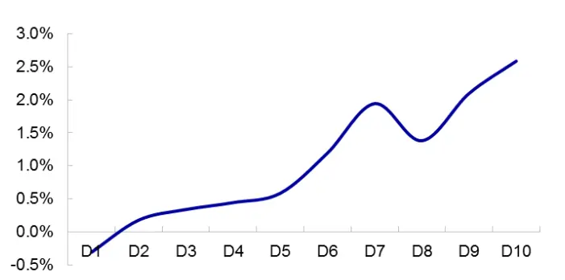
资料来源：Wind，海通证券研究所

图10 复合多因子累计净值
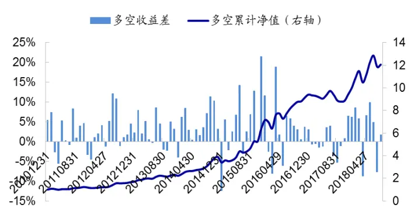
资料来源：Wind，海通证券研究所

选择医药行业预期收益率最高的 20只股票构建等权组合（最大化预期收益组合），其净值表现如下图所示。医药行业等权基准年化收益 8.22%。包含 20 个股票的最大化预期收益组合年化收益 30.27%，相应的超额收益为 22.05%，月胜率 73.91%。分年度来看，最大化预期收益组合相对于等权基准每年均可获正向超额收益。

图11 医药行业最大化预期收益组合净值走势
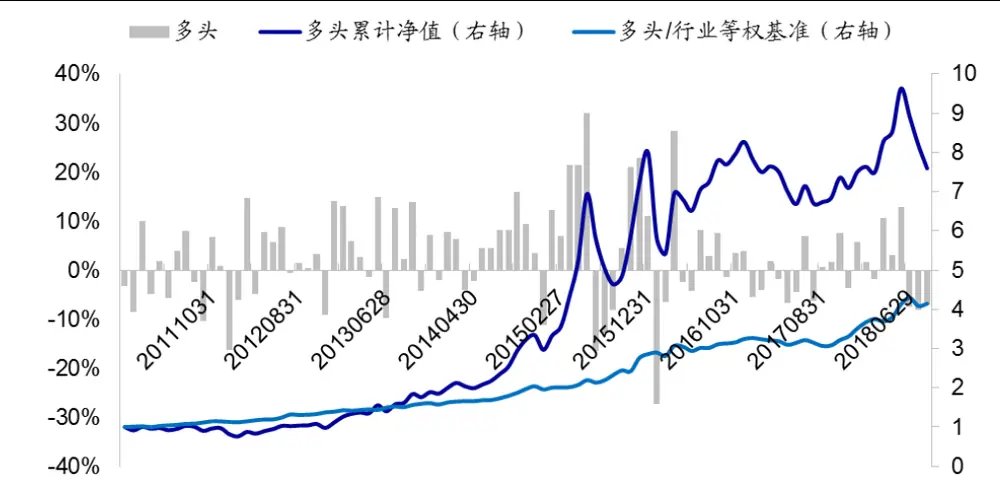
资料来源：Wind，海通证券研究所

表 12医药行业最大化预期收益组合收益表现

|  | 最大化预期收益组合收益 | 医药指数收益 | 超额收益 | 超额月胜率 |
| --- | --- | --- | --- | --- |
| 2011 | -18.60% |  | 9.41% | 75.00% |
| 2012 | 37.18% | 11.43% | 25.75% | 83.33% |
| 2013 | 65.99% | 46.61% | 19.38% | 66.67% |
| 2014 | 60.19% | 28.95% | 31.24% | 83.33% |
| 2015 |  | 84.27% | 85.05% | 83.33% |
| 2016 |  | -14.42% | 12.29% | 75.00% |
| 2017 | -4.10% | -10.72% | 6.62% | 50.00% |
| 2018.01-2018.08 | 1.19% 26日下载， | -14.21% | 15.40% | 75.00% |
| 全样本 | 30.27% | 8.22% | 22.05% | 73.91% |

资料来源：Wind，海通证券研究所

## 4.3 风险控制组合

根据前文提到的因子，我们也可构建医药行业指数增强组合，即在优化模型中加入系列风险控制条件。选择医药行业上市 3个月以上的股票作为股票池，按照市值进行加权构造医药行业指数；并以此为基准进行组合优化。

下表展示了医药行业指数增强组合的整体收益表现。医药行业指数自 2011 年至2018 年 8 月底，年化收益 5.71%。若风险限制条件中个股偏离设为 0.01，则增强组合年化收益 16.02%，超额 10.31%；相应的最大回撤和年化波动率分别为 5.08%和 5.02%。若个股偏离设为 0.02，则增强组合超额收益有所提高，为 12.32%，相应的信息比和收益回撤比分别为 2.02 和 2.39。

表 13 医药行业增强组合整体收益表现（2011.01-2018.08）

| 医药行业指数 |  |  |  |  |  |  |
| --- | --- | --- | --- | --- | --- | --- |
|  | 年化收益 | 最大回撤 | 波动率 | 信息比 | 收益回撤比 | 月胜率 |
| 指数 | 5.71% | 45.68% | 25.21% | 0.35 | 0.12 | 58.70% |
| 医药行业增强组合（个股偏离0.01） |  |  |  |  |  |  |
|  | 年化收益 | 最大回撤 | 波动率 | 信息比 | 收益回撤比 | 月胜率 |
| 增强组合 | 16.02% | 46.42% | 27.79% | 0.67 | 0.35 | 58.70% |
| 超额收益 | 10.31% | 5.08% | 5.02% | 1.99 | 2.03 | 76.09% |
| 医药行业增强组合（个股偏离 0.02） |  |  |  |  |  |  |
|  | 年化收益 | 最大回撤 | 波动率 | 信息比 | 收益回撤比 | 月胜率 |
| 增强组合 | 18.03% | 44.49% | 27.51% | 0.74 | 0.41 | 59.78% |
| 超额收益 | 12.32% | 5.16% | 5.77% | 2.02 | 2.39 | 71.74% |

资料来源：Wind，海通证券研究所

分年度来看，自 2011 年开始，增强组合相对于医药行业指数每年都可获得正向超额收益，且最大回撤控制在 5%左右，月胜率逾 70%。

图12 医药行业增强组合累计净值（个股偏离限制 0.01）
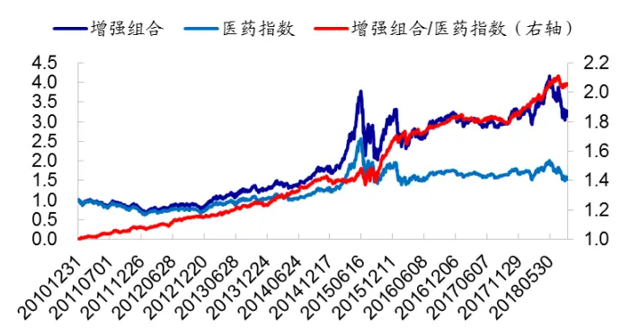
资料来源： ，海通证券研究所

图13 医药行业增强组合累计净值（个股偏离限制 0.02）
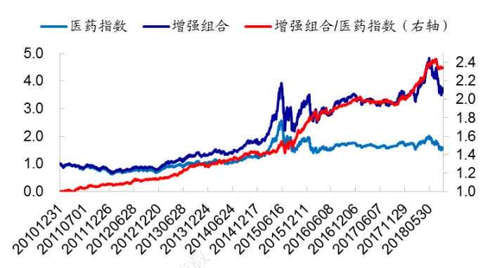
资料来源：Wind，海通证券研究所

表 14 医药行业指数增强组合分年度收益表现（个股偏离限制 0.02，2011.01-2018.08）

|  | 指数收益 | 增强组合收益 | 超额收益 | 最大回撤 | 月胜率 |
| --- | --- | --- | --- | --- | --- |
| 2011 | -31.49% 仅供本 | -26.09% | 5.40% | 1.96% | 50.00% |
| 2012 | 11.12% | 18.54% | 7.42% | 2.65% | 66.67% |
| 2013 | 38.99% | 53.70% | 14.70% | 3.07% | 83.33% |
| 2014 |  | 28.26% | 12.46% | 2.64% | 83.33% |
| 2015 | 56.86% | 99.75% | 42.90% | 5.16% | 83.33% |
| 2016 | -13.75% | -3.23% | 10.52% | 4.66% | 83.33% |
|  | 3.26% | 5.15% | 1.90% | 4.57% | 41.67% |
| 2018.01-2018.08 | -10.37% | 2.27% | 12.64% | 4.02% | 87.50% |

资料来源：Wind，海通证券研究所

## 4.4 构建沪深300增强组合

在构建沪深 300 增强组合时，由于行业分布较为集中，我们通常会设臵行业中性限制。理论上，我们也可对每个行业分别构建多因子模型，然后将每个行业的优化组合按照行业市值进行加权，整合为指数增强组合。但有些行业股票数目较少，模型受限，因此并不是每一个行业都能照此操作。医药行业个股数较多，有 270 余只，在全市场 29个行业中个股数排名第 3，因此具备单独构建优化组合的条件。

我们将沪深 300 指数医药行业成分股按照市值进行加权，构造基准指数，称之为沪深 300医药指数。以沪深 300 医药指数为优化基准，构建增强组合，将该组合称之为沪深 300医药指数增强组合。

以沪深 300 指数为基准，得到的组合称之为沪深 300增强组合。由于行业中性限制，该组合中属于医药行业的股票相当于对沪深 医药指数的增强组合，称为沪深 增强组合医药指数。我们可将沪深300医药指数增强组合取代沪深300增强组合医药指数，将其与沪深 300 增强组合中的其他股票进行结合，构建医药行业单独选股的沪深 300增强组合。

医药行业单独选股的沪深 300 增强组合年化收益 13.64%，相对于沪深 300 指数年化超额 12.81%；最大回撤和波动率分别为 3.39%和 3.71%；月胜率 83.70%。相比于原始沪深 300 增强组合，各项指标均略有改善。收益回撤比由 2.85 增加至 3.77，信息比由 3.13 增加至 3.26。

图14 沪深 300增强组合累计净值（医药行业单独选股）
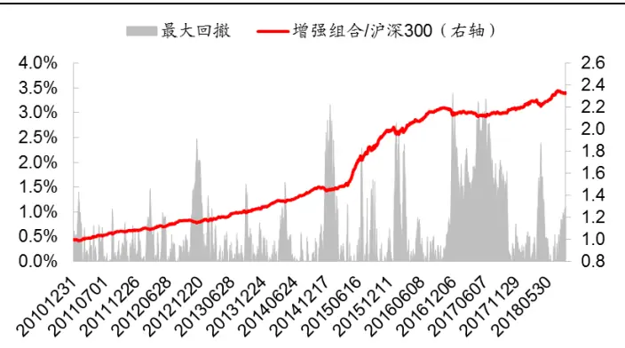
资料来源：Wind，海通证券研究所

图15 医药单独选股的 300增强组合相对原始增强组合净值
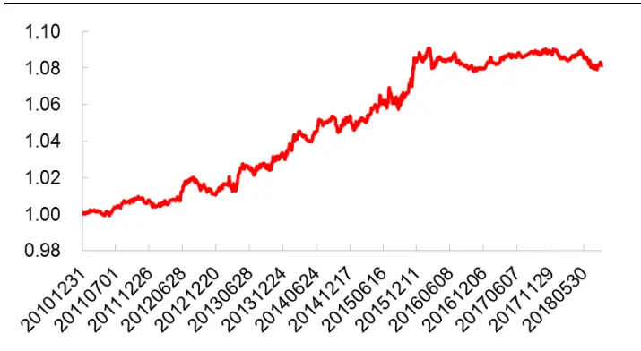
资料来源：Wind，海通证券研究所

表 15 医药行业单独选股的沪深 300增强组合整体收益表现（2011.01-2018.08）

| 医药行业单独选股的沪深300增强组合 |  |  |  |  |  |  |
| --- | --- | --- | --- | --- | --- | --- |
|  | 年化收益 | 最大回撤 | 波动率 | 信息比 | 收益回撤比 | 月胜率 |
| 策略 | 13.64% | 40.16% | 23.28% | 0.67 | 0.34 | 57.61% |
| 指数 | 0.83% | 46.70% | 22.71% | 0.15 | 0.02 | 51.09% |
| 超额收益 | 12.81% |  | 3.71% | 3.26 | 3.77 | 83.70% |

原始沪深 300增强组合

|  | 年化收益 | 最大回撤 | 波动率 | 信息比 | 收益回撤比 | 月胜率 |
| --- | --- | --- | --- | --- | --- | --- |
| 策略 | 12.49% | 40.12% | 23.24% | 0.62 | 0.31 | 57.61% |
| 指数 |  | 46.70% | 22.71% | 0.15 | 0.02 | 51.09% |
| 超额收益 | 11.66% | 4.09% | 3.54% | 3.13 | 2.85 | 81.52% |

资料来源：Wind，海通证券研究所

医药行业单独选股的增强组合相比于原始增强组合，回撤主要发生在 2016 年 2 月至 年 月份。在这个阶段，小市值因子表现强劲，其他因子表现较为逊色。当横截面样本总量较少时，部分因子稳定性会受到影响，方向变动大。例如，在医药行业内，2011 年至 2015 年，预期净利润调整和预期外盈利因子截面溢价均为正，分别为 0.24%和 0.28%。而在 2016 年 2-10 月份，这两个因子的有效性变差，甚至方向发生变动，平均溢价分别变为 0.04%和-0.18%。但在原始沪深 300 增强组合中，由于溢价是基于全市场股票所得，因此稳定性相对较高，在这个阶段虽然市值因子表现明显优于前期，但其他因子的截面溢价水平并没有发生明显变化，特别地，不存在平均方向与前期相反的状况。因子稳定性不同，导致在这个阶段医药行业内单独选股的沪深 300 增强组合表现不如原始增强组合。

## 5. 总结

本文主要对医药行业内的因子选股进行研究。

常见选股因子在医药行业内存在显著选股效果。其中，风格类因子平均收益水平高，但稳定性差，在近两年出现了持续性的大幅回撤。技术类因子与股票收益呈现显著负相关性，前期涨跌幅越大，换手率越高，波动率越大，流动性越强，次月股票收益表现越差。在这几个因子中，综合表现最好的是波动率，综合表现相对较差的是换手率。盈利能力在医药行业内也存在显著的选股效果，高盈利公司具有更高的收益。

除常见的 及其同比增长因子外，其余基本面因子在医药行业内也存在显著的选股效果。企业盈利能力越高，资产增长越快，利润增长越快，盈利质量越好，偿债能力越强，股票收益表现越优。从一致预期数据来看，预期盈利调整、分析师覆盖度等因子都存在显著选股效果。

虽然医药行业有效因子众多，但这些因子所包含的信息不免存在重合。按照逐步筛选法，在医药行业有效、且边际信息显著的因子一共有 9 个，分别是市值、非线性市值、反转、换手率、ROE、预期净利润调整、营业收入同比增长、预期外盈利以及流动比率。

基于这 9个因子构建收益率预测模型，所得复合因子 RankIC为 11%，月胜率 75%，相应的 为 ，优于任一单因子。最大化预期收益组合年化收益 ，相对于等权基准年化超额 22.05%。从风险控制组合来看，医药行业指数年化收益 5.71%，以此为优化基准的增强组合年化收益 18.03%，相应的超额收益为 12.32%，最大回撤和波动率控制在 5%左右。将医药行业多因子模型与沪深 300 增强组合结合，所得增强组合年化超额收益可由原来的 11.66%增加至 12.81%，收益回撤比由 2.85 增加至 3.77。

## 6. 风险提示

有效因子适用环境变动风险，优化模型失效风险。

# 信息披露分析师声明

[Table冯佳睿yst金融工程研究团队s]

罗蕾金融工程研究团队

本人具有中国证券业协会授予的证券投资咨询执业资格，以勤勉的职业态度，独立、客观地出具本报告。本报告所采用的数据和信息均来自市场公开信息，本人不保证该等信息的准确性或完整性。分析逻辑基于作者的职业理解，清晰准确地反映了作者的研究观点，结论不受任何第三方的授意或影响，特此声明。

## 法律声明

本报告仅供海通证券股份有限公司（以下简称 本公司 ）的客户使用。本公司不会因接收人收到本报告而视其为客户。在任何情况下，本报告中的信息或所表述的意见并不构成对任何人的投资建议。在任何情况下，本公司不对任何人因使用本报告中的任何内容所引致的任何损失负任何责任。

本报告所载的资料、意见及推测仅反映本公司于发布本报告当日的判断，本报告所指的证券或投资标的的价格、价值及投资收入可能会波动。在不同时期，本公司可发出与本报告所载资料、意见及推测不一致的报告。

市场有风险，投资需谨慎。本报告所载的信息、材料及结论只提供特定客户作参考，不构成投资建议，也没有考虑到个别客户特殊的播投资目标、财务状况或需要。客户应考虑本报告中的任何意见或建议是否符合其特定状况。在法律许可的情况下，海通证券及其所属可关联机构可能会持有报告中提到的公司所发行的证券并进行交易，还可能为这些公司提供投资银行服务或其他服务。

本报告仅向特定客户传送，未经海通证券研究所书面授权，本研究报告的任何部分均不得以任何方式制作任何形式的拷贝、复印件或复制品，或再次分发给任何其他人，或以任何侵犯本公司版权的其他方式使用。所有本报告中使用的商标、服务标记及标记均为本公司的商标、服务标记及标记，如欲引用或转载本文内容，务必联络海通证券研究所并获得许可，并需注明出处为海通证券研究所，目不得对本文进行有悖原意的引用和删改。仅

根据中国证监会核发的经营证券业务许可，海通证券股份有限公司的经营范围包括证券投资咨询业务。下载

## 海通证券股份有限公司研究所[Table_PeopleInfo]

路 颖所长

(021)23219403 luying@htsec.com

高道德 副所长(021)63411586 gaodd@htsec.com

姜 超 副所长

(021)23212042 jc9001@htsec.com

| 邓勇 副所长 | 荀玉根 副所长 | 涂力磊 所长助理 |
| --- | --- | --- |
| (021)23219404 dengyong@htsec.com | (021)23219658 xyg6052@htsec.com | (021)23219747 tll5535@htsec.com |

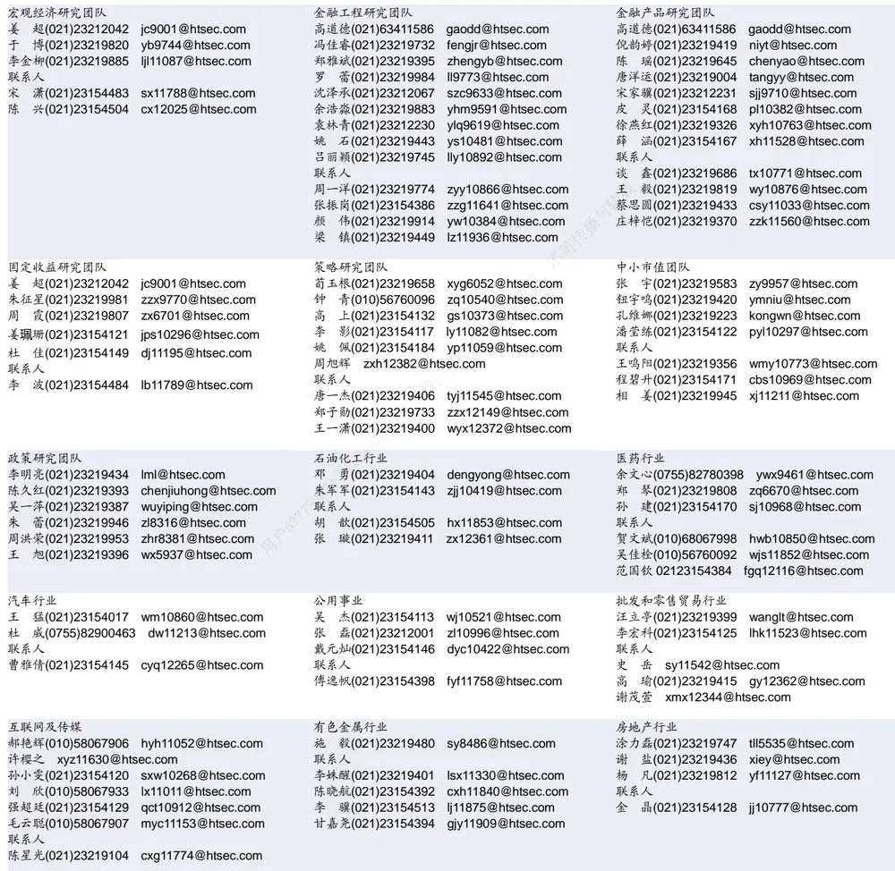

| 家电行业 |  | 造纸轻工行业 |
| --- | --- | --- |
| 陈子仪(021)23219244 chenzy@htsec.com |  | 衣桢永(021)23212208 yzy12003@htsec.com |
| 李阳(021)23154382 | ly11194@htsec.com | 曾知(021)23219810 zz9612@htsec.com |
| 联系人 |  |  |
| 朱默辰(021)23154383 | zmc11316@htsec.com |  |
| 刘 璐(021)23214390 | II11838@htsec.com |  |

| 电子行业 | 陈 平(021)23219646 cp9808@htsec.com |  | 煤炭行业 | 电力设备及新能源行业 |  |
| --- | --- | --- | --- | --- | --- |
|  |  |  | 李 淼(010)58067998 Im10779@htsec.com | 张一弛(021)23219402 | zyc9637@htsec.com |
| 联系人 |  |  | 戴元灿(021)23154146 dyc10422@htsec.com | 房 青(021)23219692 | fangq@htsec.com |
|  |  | 谢 磊(021)23212214 xl10881@htsec.com | 吴 杰(021)23154113 wj10521@htsec.com |  | 曾 彪(021)23154148 zb10242@htsec.com |
|  |  | 尹 苓(021)23154119 yl11569@htsec.com | 联系人 |  | 徐柏乔(021)23219171 xbq6583@htsec.com |
|  | 石 坚(010)58067942 sj11855@htsec.com |  | 王 涛 02123219760 wt12363@htsec.com | 张向伟(021)23154141 | zxw10402@htsec.com |

| 基础化工行业 |  | 计算机行业 |  | 通信行业 |  |
| --- | --- | --- | --- | --- | --- |
| 刘 威(0755)82764281 Iw10053@htsec.com |  | 郑宏达(021)23219392 | zhd10834@htsec.com | 朱劲松(010)50949926 | zjs10213@htsec.com |
| 刘海荣(021)23154130 Ihr10342@htsec.com |  | 黄竞晶(021)23154131 | hjj10361@htsec.com | 余伟民(010)50949926 | ywm11574@htsec.com |
| 张翠翠(021)23214397 | zcc11726@htsec.com | 杨 林(021)23154174 yl11036@htsec.com |  | 张 弋 01050949962 | zy12258@htsec.com |
| 孙维容(021)23219431 | swr12178@htsec.com | 鲁 立(021)23154138 | 3 Il11383@htsec.com | 张峥青(021)23219383 | zzq11650@htsec.com |
| 联系人 |  | 于成龙 ycl12224@htsec.com |  |  |  |
| 李 智(021)23219392 | Iz11785@htsec.com | 联系人 |  |  |  |
|  |  | 洪 琳(021)23154137 hl11570@htsec.com |  |  |  |

| 非银行金融行业 |  | 交通运输行业 | 虞 楠(021)23219382 yun@htsec.com | 纺织服装行业 |  |  |
| --- | --- | --- | --- | --- | --- | --- |
|  | 孙 婷(010)50949926 st9998@htsec.com |  |  |  |  | 梁 希(021)23219407 lx11040@htsec.com |
|  | 何 婷(021)23219634 ht10515@htsec.com |  | 联系人 |  | 联系人 |  |
| 联系人 |  |  | 李 丹(021)23154401 Id11766@htsec.com |  | 盛 开(021)23154510 | sk11787@htsec.com |
|  | 李芳洲(021)23154127 Ifz11585@htsec.com |  | 党新龙(0755)82900489 dxl12222@htsec.com |  | 刘 溢(021)23219748 | ly12337@htsec.com |

| 建筑建材行业 | 机械行业 | 钢铁行业 |
| --- | --- | --- |
| 冯晨阳(021)23212081 fcy10886@htsec.com 联系人 | 余炜超(021)23219816 swc11480@htsec.com 耿 耘(021)23219814 gy10234@htsec.com | 刘彦奇(021)23219391 liuyq@htsec.com 联系人 |
| 申 浩(021)23154114 sh12219@htsec.com | 杨 震(021)23154124 yz10334@htsec.com | 周慧琳(021)23154399 zhl11756@htsec.com |
|  | 沈伟杰(021)23219963 swj11496@htsec.com 周 丹 zd12213@htsec.com | 刘 璇(0755)82900465 lx11212@htsec.com 专播与 |

| 建筑工程行业 |  | 农林牧渔行业 |  | 食品饮料行业 |  |
| --- | --- | --- | --- | --- | --- |
| 杜市伟(0755)82945368 dsw11227@htsec.com | 丁 频(021)23219405 | dingpin@htsec.com |  | 闻宏伟(010)58067941 | whw9587@htsec.com |
| 张欣劼 zxj12156@htsec.com | 陈雪丽(021)23219164 |  | cxl9730@htsec.com | 成珊(021)23212207 | cs9703@htsec.com |
| 李富华(021)23154134 Ifh12225@htsec.com | 陈 阳(021)23212041 |  | cy10867@htsec.com | 唐 宇(021)23219389 | ty11049@htsec.com |

| 军工行业 |  | 银行行业 | 社会服务行业 |
| --- | --- | --- | --- |
|  | 蒋 俊(021)23154170 jj11200@htsec.com | 孙 婷(010)50949926 st9998@htsec.com | 汪立亭(021)23219399 wanglt@htsec.com |
|  | 刘 磊(010)50949922 II11322@htsec.com | 解巍巍 xww12276@htsec.com | 陈扬扬(021)23219671 cyy10636@htsec.com |
| 张恒晅 zhx10170@htsec.com |  | 联系人 林加力(021)23214395 Ijl12245@htsec.com |  |
| 联系人 | 张宇轩(021)23154172 zyx11631@htsec.com | 谭敏沂(0755)82900489 tmy10908@htsec.com |  |

## 研究所销售团队

深广地区销售团队

蔡铁清(0755)82775962 ctq5979@htsec.com

伏财勇(0755)23607963 fcy7498@htsec.com

辜丽娟(0755)83253022 gulj@htsec.com

刘晶晶(0755)83255933 liujj4900@htsec.com

王雅清(0755)83254133 wyq10541@htsec.com

饶 伟(0755)82775282 rw10588@htsec.com

欧阳梦楚(0755)23617160

oymc11039@htsec.com

宗 亮 zl11886@htsec.com

巩柏含 gbh11537@htsec.com

上海地区销售团队上海地区销售团队

胡雪梅(021)23219385 huxm@htsec.com
朱健(021)23219592 zhuj@htsec.com
季唯佳(021)23219384 jiwj@htsec.com
黄 毓(021)23219410 huangyu@htsec.com
漆冠男(021)23219281 qgn10768@htsec.com
胡宇欣(021)23154192 hyx10493@htsec.com
黄 诚(021)23219397 hc10482@htsec.com
毛文英(021)23219373 mwy10474@htsec.com
马晓男 mxn11376@htsec.com
杨祎昕(021)23212268 yyx10310@htsec.com
张思宇 zsy11797@htsec.com
慈晓聪(021)23219989 cxc11643@htsec.com
王朝领 wcl11854@htsec.com
李 寅 ly12488@htsec.com
邵亚杰 syj12493@htsec.com
北京地区销售团队
殷怡琦(010)58067988 yyq9989@htsec.com
郭 楠 010-5806 7936 gn12384@htsec.com
吴 尹 wy11291@htsec.com
张丽萱(010)58067931 zlx11191@htsec.com
杨羽莎(010)58067977 yys10962@htsec.com
杜 飞 df12021@htsec.com
张 杨(021)23219442 zy9937@htsec.com
何 嘉(010)58067929 hj12311@htsec.com
李 婕 lj12330@htsec.com
欧阳亚群 oyyq12331@htsec.com

海通证券股份有限公司研究所

地址：上海市黄浦区广东路 689号海通证券大厦 9楼

电话：（021）23219000

传真：（021）23219392

网址：www.htsec.com