## [Tab相关研究

[Table_ReportInfo]《高频量价因子在股票与期货中的表现》 2018.11.01

《放松组合构建中的行业中性约束》

2018.10.30

《选股因子系列研究（四十一）——医药

行业因子选股研究》2018.10.23

分析师:冯佳睿

Tel:(021)23219732

Email:fengjr@htsec.com

证书:S0850512080006

分析师:袁林青

Tel:(021)23212230

Email:ylq9619@htsec.com

证书:S0850516050003

# 选股因子系列（四十二）——因子失效预警：因子拥挤

## 投资要点：

近年来，随着因子投资的兴起，因子拥挤（Factor Crowdind）也逐渐受到投资者的关注。因子拥挤是指由于跟踪或者投资某一因子的资金过多而使得该因子的收益性或者收益稳定性下降的现象。由于这一现象的存在，度量因子拥挤度就显得至关重要。本篇报告借鉴了海外文献中的相关思路，对于部分因子拥挤度指标在 A股市场的效果进行了全面回测。

可使用交易数据构建指标度量因子拥挤度。海外相关研究在度量因子拥挤度时主要有基于持仓和基于交易数据两种方式。两种方式各有利弊，基于持仓的拥挤度指标具有更强的逻辑，更能够直接反应有多少资金在追捧相关因子，但是持仓数据公布较为滞后且并不全面；基于交易数据构建的拥挤度指标具有更强的时效性，数据质量较好，但是相关指标仅能间接反映相关因子的拥挤程度。考虑到数据质量问题，本文重点分析了基于交易数据构建的拥挤度指标的择时效果。

- 因子拥挤度在中长期上与因子未来收益负相关。可对于常见因子构建拥挤度并检验因子拥挤度与因子未来 个月、 个月、 个月以及 个月的收益之间的相关性。检验结果显示，大部分因子的拥挤度与未来因子收益负相关。

- 因子拥挤度与因子未来收益波动之间的正相关性并不明显。虽然海外文献发现因子拥挤度与未来因子收益波动正相关，但是 A股回测结果显示，仅有部分因子的拥挤度与未来因子收益波动正相关。

复合拥挤度效果更加稳健。经过简单复合的因子拥挤度更加稳健，与大部分常用因子未来收益负相关。但是仅与部分因子的未来收益波动正相关。若使用 1 以及作为因子拥挤与否的划分阈值，在因子进入高拥挤状态后，因子往往会出现收益的减弱甚至回撤，而在因子进入低拥挤状态后，因子往往具有较高的收益空间。

- 风险提示。市场系统性风险、资产流动性风险以及政策变动风险会对策略表现产生较大影响。

近年来，随着因子投资的兴起，因子拥挤（Factor Crowdind）也逐渐受到投资者的关注。所谓因子拥挤，是指由于跟踪或者投资某一因子的资金过多而使得该因子的收益性或者收益稳定性下降的现象。由于这一现象的存在，度量因子拥挤度就显得至关重要。因子拥挤度指标可作为因子失效的预警指标。本篇报告借鉴了海外文献中的相关思路，对于部分因子拥挤度指标在 A股市场的效果进行了全面回测。

本文分为五部分，第一部分归纳总结了海外相关研究在因子拥挤度方面的整体研究成果，第二部分基于交易数据构建了 4 类拥挤度指标，并对于相关指标在 A股的整体效果进行了回测分析，第三部分回测分析了复合后的拥挤度指标对于各类因子未来收益以及风险的预测效果，第四部分对于全文进行了总结，第五部分提示了风险。

## 1. 因子拥挤度

随着近年来因子投资的兴起，因子失效也逐渐成为因子投资者重点研究的方向。在相关研究文献中，因子拥挤现象（Factor Crowding）常和因子的失效联系在一起。相关研究认为，有效的因子会受到资金的追捧，虽然资金的追捧会增强因子的收益，但是过多资金的追捧会导致因子的波动加大，并出现收益的减弱以及大幅回撤。因此，度量因子拥挤度就显得至关重要。通过因子拥挤度的监控，投资者可有效规避或者控制过度拥挤的因子给组合带来大幅回撤。

总的来看，海外相关研究在度量因子拥挤度的时候主要有基于持仓和基于交易数据两种方式。两种方式各有利弊，基于持仓的拥挤度指标具有更强的逻辑，更能够直接反应有多少资金在追捧相关因子，但是持仓数据公布较为滞后且并不全面；相比而言，基于交易数据构建的拥挤度指标具有更强的时效性，数据质量较好，但是相关指标仅能间接反映相关因子的拥挤程度。考虑到数据质量问题，本文重点分析了基于交易数据构建的拥挤度指标的择时效果。

海外研究在使用交易数据构建拥挤度指标时，其出发角度多种多样。本文重点回测了以下 4 类拥挤度指标：1）估值价差（Valuation Spread），2）配对相关性（PairwiseCorrelation），3）长期收益反转（Long-term Return Reversal），4）因子波动率（FactorVolatility）。

海外研究对于上述拥挤度指标的研究结论可归纳为以下两点：

1） 因子拥挤度在中长期具有一定的择时效果，因子拥挤度与未来因子收益负相关，与未来因子收益波动正相关；

2） 高度拥挤的因子在未来更容易出现大幅回撤。

本文将在后文中重点验证上述两个结论在 A股市场是否成立。（若投资者对于相关海外相关结论细节感兴趣，可联系报告作者。）

## 2. 因子拥挤度指标构建与回测

本节对于因子拥挤度指标进行了构建，并检验了各个指标在常见选股因子上与未来因子收益以及未来因子收益波动之间的相关性。考虑到大多数因子投资者是在月度调仓的框架下进行因子投资的，本文在月度调仓的框架下对于因子以及因子拥挤度指标进行了计算与构建。由于本文使用的指标构建数据都是日度可得，投资者也可根据自身需求调整指标观测频率。（需要说明是，本文所有的因子拥挤度指标在计算时都已经进行过时间序列标准化处理。）

考虑到因子拥挤度指标的择时效果偏中长期，本节会分别从未来 6 个月、未来 12个月、未来 个月以及未来 个月来评价指标的择时效果。（后文在计算相关因子拥挤度时，市值因子多头为大市值股票，换手因子多头为低换手股票，反转因子多头为前期低涨幅股票，波动率因子多头为低波动股票，估值因子多头为低估值股票，盈利因子多头为高盈利股票，盈利增长因子多头为高盈利增长股票。）

## 2.1 估值价差

相关研究认为，资金对于因子的追捧会进一步推升因子多头端的估值或者压低因子空头端的估值水平，由此加大因子多空组合的估值价差。因此，可通过计算估值价差衡量因子的拥挤程度。估值价差计算方法如下所示：

$$
ValuationSpread=log(\frac{\mathbb{E}|\vec{\textbf{ }}\vec{\textbf{ }}\vec{\textbf{ }}\lambda\mathbf{\cdot}|\pmb{\Sigma}|\pmb{\Sigma}}{\mathbb{E}|\vec{\textbf{ }}\vec{\textbf{ }}\lambda\mathbf{\cdot}|\pmb{\Sigma}|\pmb{\Sigma}|\pmb{\Sigma}})
$$

其中，估值可使用 PB也可使用 PE（TTM），此处以及后文的多头以及空头股票为全市场因子值排序前后 10%的股票。本文在计算估值价差时分别使用了 PB以及 PE（TTM），本节在进行相关指标效果讨论时，将以基于 PB计算得到的估值价差为例。下图展示了大市值、低估值以及高盈利三个指标的估值价差的历史走势。（此处以及后文中，在计算大市值、低估值以及高盈利因子时，因子多头分别为大市值、低估值以及高盈利的股票。）

图1 估值价差历史走势
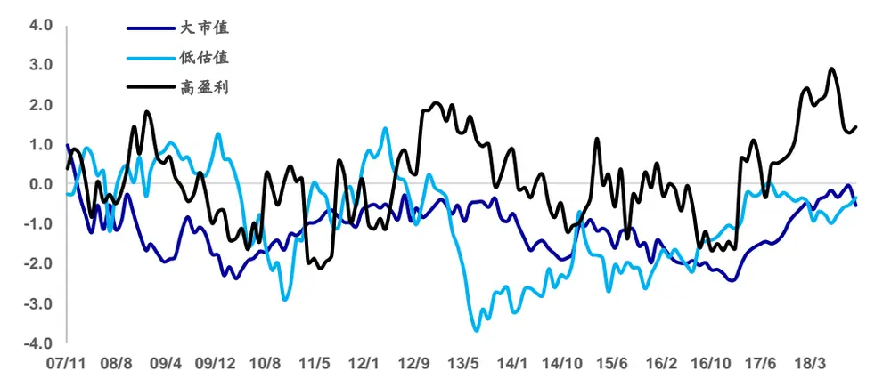
资料来源：Wind，海通证券研究所

## 2.1.1 估值价差与未来因子收益

下图展示了因子拥挤度与未来 6 个月、12 个月、18 个月以及 24 个月收益之间的相关性情况。为了能够更加清晰地观察拥挤度指标的有效区间，本文以 6 个月为间隔，将未来 24 个月划分为 0~6 个月、7~12 个月、13~18 个月以及 19~24 个月，并计算了因子拥挤度与因子在上述区间的收益之间的相关性。

图2 估值价差与未来因子收益相关性
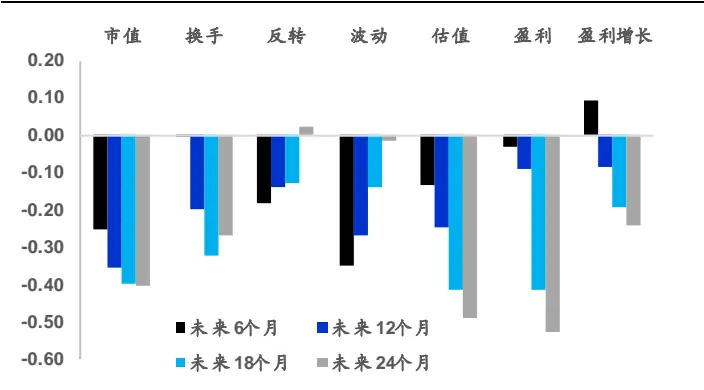
资料来源：Wind，海通证券研究所

图3 估值价差与未来因子收益相关性（分段）
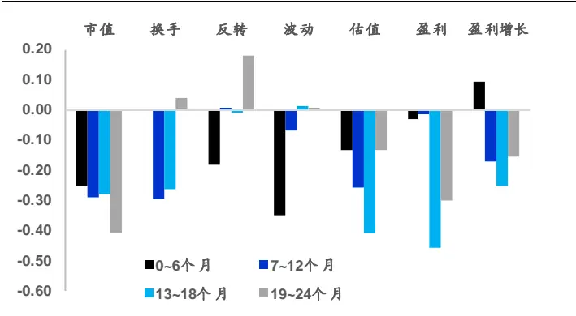
资料来源：Wind，海通证券研究所

整体来看，因子拥挤度与未来因子收益负相关。对于部分因子，如市值、估值、盈利、盈利增长，未来观测的窗口越长，拥挤度与未来因子收益之间的负相关性越明显。这一现象表明，估值价差较高的因子在短期内并不一定会呈现出收益反转的现象，但是在中长期上更容易出现收益反转。值得注意的是，上述现象在部分因子上并不成立。下表详细展示了估值价差与未来因子收益的相关性以及相关性检验 P值。

表 1 估值价差与因子未来收益相关性

|  | 相关性 |  |  |  | 相关性检验P值 |  |  |  |
| --- | --- | --- | --- | --- | --- | --- | --- | --- |
|  | 因子名称 未来6个月 | 未来12个月 | 未来18个月 | 未来24 个月 | 未来6个月 | 未来12个月 | 未来18个月 | 未来24 个月 |
| 累计收益 | 市值 -0.25 | -0.36 | -0.40 | -0.41 | 0% | 0% | 0% | 0% |
|  | 换手 0.00 | -0.20 | -0.33 | -0.27 | 96% | 3% | 0% | 0% |
|  | 反转 -0.18 | -0.14 | -0.13 | 0.02 | 4% | 13% | 17% | 82% |
|  | 低波动 -0.35 | -0.27 | -0.14 | -0.02 | 0% | 0% | 14% | 86% |
|  | 估值 -0.14 | -0.25 | -0.42 | -0.49 | 13% | 1% | 0% | 0% |
|  | 盈利 -0.03 | -0.09 | -0.42 | -0.53 | 72% | 33% | 0% | 0% |
| 分段收益 | 盈利增长 0.09 | -0.08 | -0.20 | -0.24 | 29% | 37% | 4% | 1% |
|  | 因子名称 0~6个月 | 7~12个月 | 13~18个月 | 19~24个月 | 0~6个月 | 7~12个月 | 13~18个月 | 19~24个月 |
|  | 市值 -0.25 | -0.29 | -0.28 | -0.41 | 0% | 0% | 0% | 0% |
|  | 换手 0.00 | -0.30 | -0.26 | 0.04 | 96% | 0% | 0% | 68% |
|  | 反转 -0.18 | 0.01 | -0.01 | 0.18 | 4% | 95% | 92% | 6% |
|  | 低波动 -0.35 | -0.07 | 0.01 | 0.00 | 0% | 46% | 89% | 97% |
|  | 估值 -0.14 | -0.26 | -0.41 | -0.14 | 13% | 0% | 0% | 16% |
|  | 盈利 -0.03 | -0.01 | -0.46 | -0.30 | 72% | 88% | 0% | 0% |
| 盈利增长 | 0.09 | -0.17 | -0.26 | -0.16 | 29% | 6% | 1% | 11% |

资料来源： ，海通证券研究所

## 2.1.2 估值价差与未来因子收益波动

下图展示了因子拥挤度与因子未来收益波动之间的相关性情况。

图4 估值价差与未来因子收益波动相关性
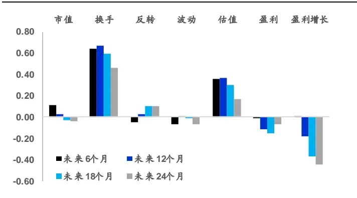
资料来源： ，海通证券研究所

图5 估值价差与未来因子收益波动相关性（分段）
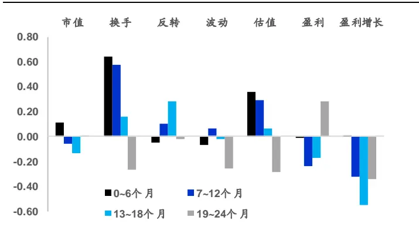
资料来源：Wind，海通证券研究所

观察上图可知，估值价差与未来因子收益波动之间的正相关性并不明显。在常用因子中，仅有换手率因子以及估值因子的估值价差与未来因子收益波动正相关性，其余因子的估值价差与未来收益波动的相关性较弱，甚至会出现负相关的情况。下表详细展示了估值价差与未来因子收益波动的相关性以及相关性检验 P值。

表 2 估值价差与因子未来收益波动相关性

|  | 相关性 |  |  |  | 相关性检验P值 |  |  |  |
| --- | --- | --- | --- | --- | --- | --- | --- | --- |
|  | 因子名称 未来6个月 | 未来12个月 | 未来18个月 | 未来24 个月 | 未来6个月 | 未来12个月 | 未来18个月 | 未来24 个月 |
| 累计收益 | 市值 0.11 | 0.03 | -0.03 | -0.04 | 23% | 74% | 78% | 70% |
|  | 换手 0.64 | 0.67 | 0.60 | 0.46 | 0% | 0% | 0% | 0% |
|  | 反转 | -0.04 0.02 | 0.10 | 0.10 | 63% | 80% | 27% | 31% |
|  | 波动 -0.07 | 0.00 | -0.01 | -0.07 | 44% | 97% | 91% | 47% |
|  | 估值 0.36 | 0.37 | 0.31 | 0.17 | 0% | 0% | 0% | 8% |
|  | 盈利 -0.01 | -0.12 | -0.15 | -0.07 | 93% | 21% | 11% | 46% |
|  | 盈利增长 0.01 | -0.18 | -0.37 | -0.45 | 92% | 5% | 0% | 0% |
| 分段收益 | 因子名称 0~6个月 | 7~12个月 | 13~18个月 | 19~24个月 | 0~6个月 | 7~12个月 | 13~18个月 | 19~24个月 |
|  | 市值 0.11 | -0.06 | -0.14 | 0.01 | 23% | 54% | 15% | 95% |
|  | 换手 0.64 | 0.57 | 0.16 | -0.27 | 0% | 0% | 9% | 1% |
|  | 反转 -0.04 | 0.10 | 0.28 | -0.02 | 63% | 26% | 0% | 87% |
|  | 波动 -0.07 | 0.06 | -0.02 | -0.26 | 44% | 50% | 84% | 1% |
|  | 估值 0.36 | 0.30 | 0.06 | -0.28 | 0% | 0% | 50% | 0% |
|  | 盈利 -0.01 | -0.24 | -0.17 | 0.29 | 93% | 1% | 7% | 0% |
|  | 盈利增长 0.01 | -0.33 | -0.55 | -0.34 | 92% | 0% | 0% | 0% |

资料来源： ，海通证券研究所

## 2.2 配对相关性

配对相关性从股票同涨同跌的特征来度量因子的拥挤程度。相关研究认为，资金对于因子或者某一类股票的追捧会加剧这一类股票同涨同跌的特性，因此可以通过刻画因子多空组合同涨同跌特性的差别来衡量因子拥挤度。配对相关性计算方法如下：

$$
PairwiseCorrelation=mean(\sum_{i=1}^{N}corr(r_{\xi\neq i},r_{\xi\neq i,i}))-mean(\sum_{i=1}^{N}corr(r_{\xi\neq i},r_{\xi\neq j_{\xi,i}}))
$$

下图展示了大市值、低估值以及高盈利三个因子的配对相关性的历史走势。

图6 配对相关性历史走势
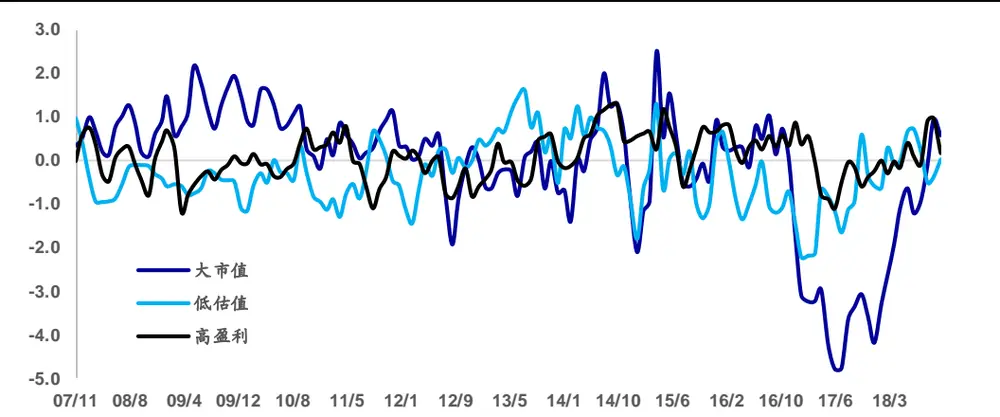
资料来源：Wind，海通证券研究所

## 2.2.1 配对相关性与未来因子收益

下图展示了配对相关性与因子未来收益之间的相关性情况。

图7 配对相关性与未来因子收益相关性
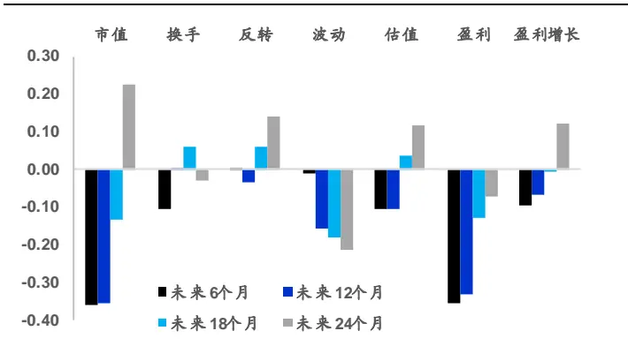
资料来源： ，海通证券研究所

图8 配对相关性与未来因子收益相关性（分段）
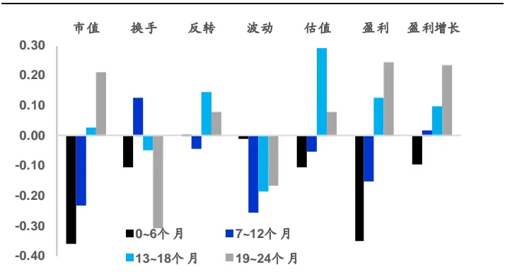
资料来源：Wind，海通证券研究所

在中期上，配对相关性与部分因子（如市值、波动以及盈利因子）的未来收益负相关。指标有效区间基本在 0~6 个月以及 7~12个月。随着时间窗口的进一步拉长，配对相关性与因子收益之间的负相关性会进一步减弱甚至转变为正相关。这一现象与计算指标时所使用的历史数据长度有一定的关联。下表详细展示了配对相关性与未来因子收益波动的相关性以及相关性检验 P 值。

表 3 配对相关性与因子未来收益相关性

|  | 相关性 |  |  |  | 相关性检验P值 |  |  |  |
| --- | --- | --- | --- | --- | --- | --- | --- | --- |
|  | 因子名称 未来6个月 | 未来12个月 | 未来18个月 | 未来24 个月 | 未来6个月 | 未来12个月 | 未来18个月 | 未来24 个月 |
| 累计收益 | 市值 -0.36 | -0.36 | -0.13 | 0.23 | 0% | 0% | 16% | 2% |
|  | 换手 -0.11 | 0.00 | 0.06 | -0.03 | 23% | 99% | 53% | 74% |
|  | 反转 0.00 | -0.03 | 0.06 | 0.14 | 98% | 71% | 54% | 16% |
|  | 波动 -0.01 | -0.16 | -0.18 | -0.22 | 89% | 8% | 6% | 3% |
|  | 估值 -0.11 | -0.11 | 0.04 | 0.12 | 24% | 25% | 70% | 23% |
|  | 盈利 -0.35 | -0.33 | -0.13 | -0.07 | 0% | 0% | 17% | 47% |
|  | 盈利增长 -0.10 | -0.07 | -0.01 | 0.12 | 29% | 46% | 93% | 21% |
| 分段收益 | 因子名称 0~6个月 | 7~12个月 | 13~18个月 | 19~24个月 | 0~6个月 | 7~12个月 | 13~18个月 | 19~24个月 |
|  | 市值 -0.36 | -0.24 | 0.02 | 0.21 | 0% | 1% | 80% | 3% |
|  | 换手 -0.11 | 0.13 | -0.05 | -0.31 | 23% | 17% | 59% | 0% |
|  | 反转 0.00 | -0.04 | 0.15 | 0.08 | 98% | 64% | 12% | 44% |
|  | 波动 -0.01 | -0.26 | -0.19 | -0.17 | 89% | 0% | 5% | 9% |
|  | 估值 -0.11 | -0.05 | 0.29 | 0.08 | 24% | 56% | 0% | 42% |
|  | 盈利 -0.35 | -0.15 | 0.12 | 0.25 | 0% | 10% | 19% | 1% |
|  | 盈利增长 -0.10 | 0.02 | 0.10 | 0.23 | 29% | 85% | 31% | 2% |

资料来源： ，海通证券研究所

## 2.2.2 配对相关性与未来因子收益波动

下图展示了配对相关性与因子未来收益波动之间的相关性情况。配对相关性仅在部分因子上呈现出了与未来因子收益波动正相关的现象。例如，对于市值、盈利以及盈利增长因子，因子的配对相关性与未来因子收益波动正相关，且随着时间窗口的拉长，相关性会逐渐上升。

图9 配对相关性与未来因子收益波动相关性
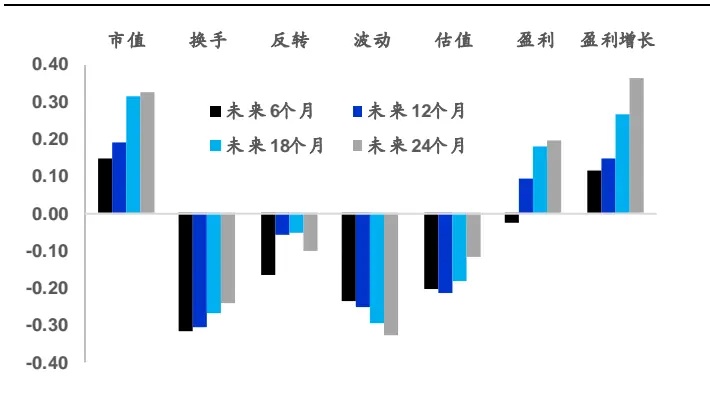
资料来源： ，海通证券研究所

图10 配对相关性与未来因子收益波动相关性（分段）
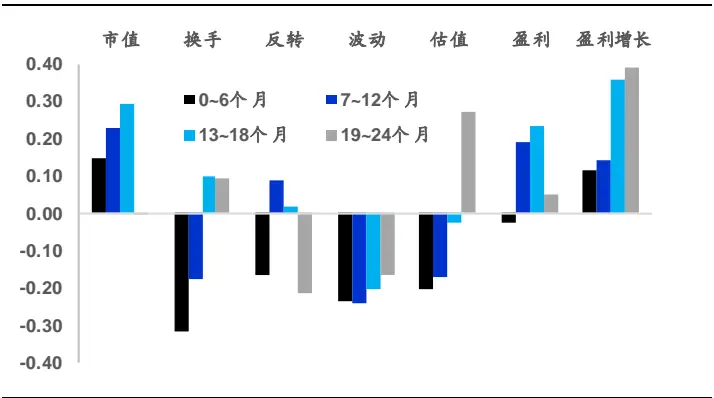
资料来源：Wind，海通证券研究所

下表详细展示了配对相关性与未来因子收益波动相关性以及相关性检验 P值。

表 4 配对相关性与因子未来收益波动相关性

|  | 相关性 |  |  |  | 相关性检验P值 |  |  |  |
| --- | --- | --- | --- | --- | --- | --- | --- | --- |
|  | 因子名称 | 未来6个月 | 未来12个月 | 未来18个月 | 未来 24 个月 未来6个月 | 未来12个月 | 未来18个月 | 未来24 个月 |
| 累计收益 | 市值 | 0.15 0.19 | 0.32 | 0.32 | 10% | 4% | 0% | 0% |
|  | 换手 | -0.32 -0.30 | -0.27 | -0.24 | 0% | 0% | 0% | 1% |
|  | 反转 | -0.16 -0.06 | -0.05 | -0.10 | 7% | 52% | 57% | 30% |
|  | 低波动 | -0.24 -0.25 | -0.29 | -0.33 | 1% | 1% | 0% | 0% |
|  | 估值 | -0.20 -0.22 | -0.18 | -0.12 | 2% | 2% | 5% | 24% |
|  | 盈利 | -0.03 0.09 | 0.18 | 0.20 | 78% | 32% | 6% | 4% |
|  | 盈利增长 0.12 | 0.15 | 0.27 | 0.36 | 20% | 11% | 0% | 0% |
| 分段收益 | 因子名称 0~6个月 | 7~12个月 | 13~18个月 | 19~24个月 | 0~6个月 | 7~12个月 | 13~18个月 | 19~24个月 |
|  | 市值 0.15 | 0.23 | 0.29 | 0.00 | 10% | 1% | 0% | 96% |
|  | 换手 | -0.32 -0.17 | 0.10 | 0.09 | 0% | 6% | 30% | 34% |
|  | 反转 | -0.16 0.09 | 0.02 | -0.21 | 7% | 35% | 83% | 3% |
|  | 低波动 -0.24 | -0.24 | -0.20 | -0.16 | 1% | 1% | 3% | 9% |
|  | 估值 -0.20 | -0.17 | -0.02 | 0.27 | 2% | 6% | 80% | 0% |
|  | 盈利 -0.03 | 0.19 | 0.24 | 0.05 | 78% | 4% | 1% | 61% |
|  | 盈利增长 | 0.12 0.14 | 0.36 | 0.39 | 20% | 13% | 0% | 0% |

资料来源： ，海通证券研究所

## 2.3 长期累计收益

因子长期累计收益是投资者在选择因子时的重要考量因素，因此长期累计收益更高的因子更容易受到资金的追捧。下图展示了大市值、低估值以及高盈利三个因子的长期累计收益的历史走势。

图11 长期累计收益历史走势
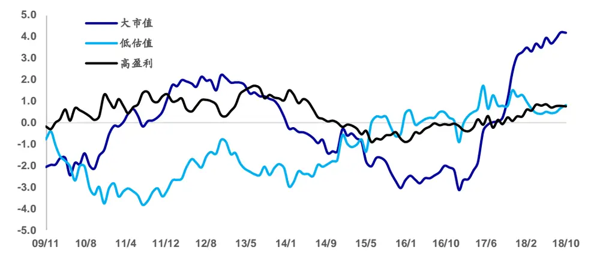
资料来源：Wind，海通证券研究所

## 2.3.1 长期累计收益与未来因子收益

下图展示了因子长期累计收益与因子未来收益之间的相关性情况。

图12 长期累计收益与未来因子收益相关性
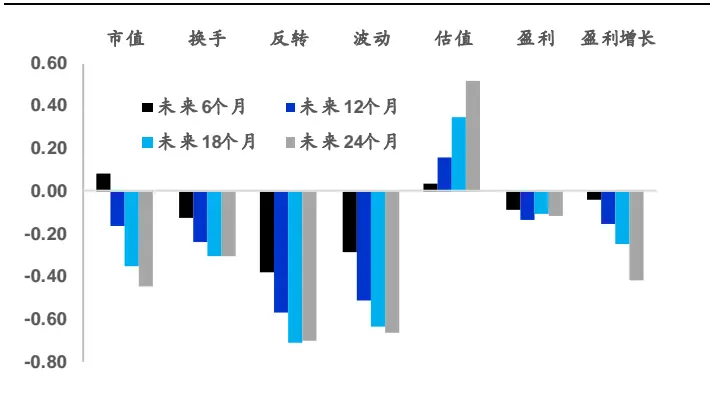
资料来源：Wind，海通证券研究所

图13 长期累计收益与未来因子收益相关性（分段）
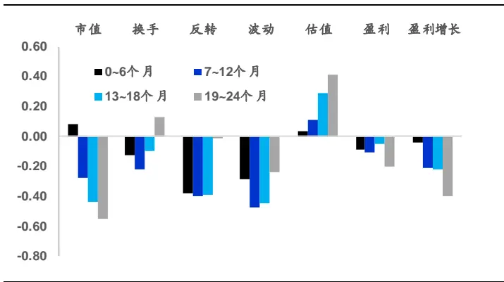
资料来源：Wind，海通证券研究所

下表详细展示了长期累计收益与未来因子收益相关性以及相关性检验 P值。

表 5 长期累计收益与因子未来收益相关性

|  | 相关性 |  |  |  | 相关性检验P值 |  |  |  |
| --- | --- | --- | --- | --- | --- | --- | --- | --- |
|  | 因子名称 | 未来6个月 未来12个月 | 未来18个月 | 未来 24 个月 | 未来6个月 | 未来12个月 | 未来18个月 | 未来24 个月 |
| 累计收益 | 市值 | 0.08 -0.17 | -0.36 | -0.45 | 43% | 11% | 0% | 0% |
|  | 换手 -0.13 | -0.24 | -0.31 | -0.31 | 21% | 2% | 0% | 0% |
|  | 反转 -0.38 | -0.57 | -0.71 | -0.70 | 0% | 0% | 0% | 0% |
|  | 波动 -0.28 | -0.51 | -0.64 | -0.66 | 0% | 0% | 0% | 0% |
|  | 估值 0.03 | 0.15 | 0.35 | 0.52 | 73% | 14% | 0% | 0% |
|  | 盈利 -0.09 | -0.14 | -0.10 | -0.12 | 36% | 19% | 33% | 29% |
|  | 盈利增长 -0.04 | -0.16 | -0.25 | -0.42 | 70% | 12% | 2% | 0% |
| 分段收益 | 因子名称 0~6个月 | 7~12个月 | 13~18个月 | 19~24个月 | 0~6个月 | 7~12个月 | 13~18个月 | 19~24个月 |
|  | 市值 0.08 | -0.28 | -0.44 | -0.55 | 43% | 1% | 0% | 0% |
|  | 换手 -0.13 | -0.22 | -0.10 | 0.12 | 21% | 3% | 35% | 26% |
|  | 反转 -0.38 | -0.40 | -0.39 | -0.02 | 0% | 0% | 0% | 88% |
|  | 波动 -0.28 | -0.48 | -0.45 | -0.24 | 0% | 0% | 0% | 3% |
|  | 估值 0.03 | 0.11 | 0.28 | 0.42 | 73% | 29% | 1% | 0% |
|  | 盈利 -0.09 | -0.11 | -0.05 | -0.21 | 36% | 27% | 63% | 6% |
|  | 盈利增长 -0.04 | -0.21 | -0.22 | -0.40 | 70% | 4% | 4% | 0% |

资料来源：Wind，海通证券研究所

在中长期上，大部分因子的长期计积收益与未来收益负相关。如，市值、反转、波动、盈利增长的长期累计收益与未来收益负相关，并且未来观测的窗口越长，负相关性越高。此外，部分因子的长期累计收益与未来 个月收益的负相关性不明显，甚至为正相关。这说明前期累计收益较高的因子在短期内具有一定的收益动量性，收益反转并不一定会在短期内发生。

## 2.3.2 长期累计收益与未来因子收益波动

下图展示了因子长期累计收益与因子未来收益波动之间的相关性情况。

图14 长期累计收益与未来因子收益波动相关性
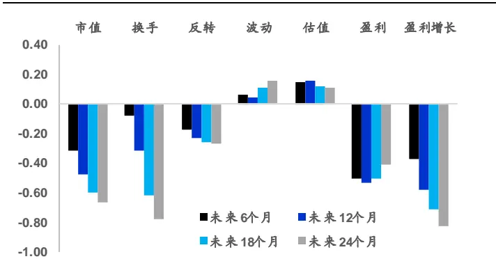
资料来源：Wind，海通证券研究所

图15 长期累计收益与未来因子收益波动相关性（分段）
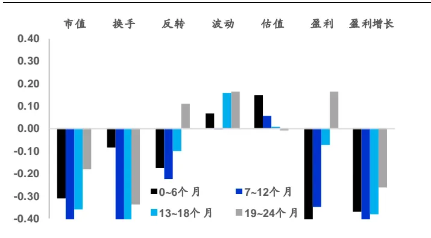
资料来源：Wind，海通证券研究所

观察上图，我们并未观测到因子未来收益波动与因子前期累计收益之间的正相关性，在部分因子上反而可以观测到显著的负相关性。下表详细展示了长期累计收益与未来因子收益波动的相关性以及相关性检验 P值。

表 6 长期累计收益与因子未来收益波动相关性

|  | 相关性 |  |  |  | 相关性检验P值 |  |  |  |
| --- | --- | --- | --- | --- | --- | --- | --- | --- |
|  | 因子名称 未来6个月 | 未来12 个月 | 未来18个月 | 未来24个月 | 未来6个月 | 未来12个月 | 未来18个月 | 未来24个月 |
| 累计收益 | 市值 -0.31 | -0.47 | -0.60 | -0.67 | 0% | 0% | 0% | 0% |
|  | 换手 -0.08 | -0.32 | -0.62 | -0.78 | 41% | 0% | 0% | 0% |
|  | 反转 -0.18 | -0.23 | -0.26 | -0.27 | 8% | 3% | 1% | 1% |
|  | 波动 0.07 | 0.04 | 0.11 | 0.16 | 50% | 68% | 31% | 16% |
|  | 估值 0.15 | 0.16 | 0.12 | 0.11 | 14% | 13% | 25% | 33% |
|  | 盈利 -0.50 | -0.53 | -0.50 | -0.41 | 0% | 0% | 0% | 0% |
| 分段收益 | 盈利增长 -0.37 | -0.58 | -0.72 | -0.82 | 0% | 0% | 0% | 0% |
|  | 因子名称 0~6个月 | 7~12个月 | 13~18个月 | 19~24个月 | 0~6个月 | 7~12个月 | 13~18个月 | 19~24个月 |
|  | 市值 -0.31 | -0.43 | -0.36 | -0.18 | 0% | 0% | 0% | 10% |
|  | 换手 -0.08 | -0.45 | -0.60 | -0.34 | 41% | 0% | 0% | 0% |
|  | 反转 -0.18 | -0.23 | -0.10 | 0.11 | 8% | 3% | 36% | 31% |
|  | 波动 0.07 | 0.00 | 0.16 | 0.16 | 50% | 98% | 13% | 14% |
|  | 估值 0.15 | 0.06 | 0.01 | -0.01 | 14% | 59% | 96% | 94% |
|  | 盈利 -0.50 | -0.35 | -0.08 | 0.16 | 0% | 0% | 48% | 14% |
| 盈利增长 | -0.37 | -0.57 | -0.38 | -0.26 | 0% | 0% | 0% | 2% |

资料来源： ，海通证券研究所

## 2.4 多空波动率比率

海外相关研究认为，资金对于因子的追捧会加剧因子波动，因此可使用因子波动率来衡量因子当前的拥挤程度。考虑到指标的具体指示意义，本报告在回测相关指标时使用了因子多空端波动率比率。指标计算方法如下所示：

$$
FactorVolatility=\frac{vol(r_{\textrm{ \textmu }})}{vol(r_{\textrm{ \textmu }})}
$$

下图展示了大市值、低估值以及高盈利三个因子的多空波动率比率的历史走势。

图16 多空波动率比率历史走势
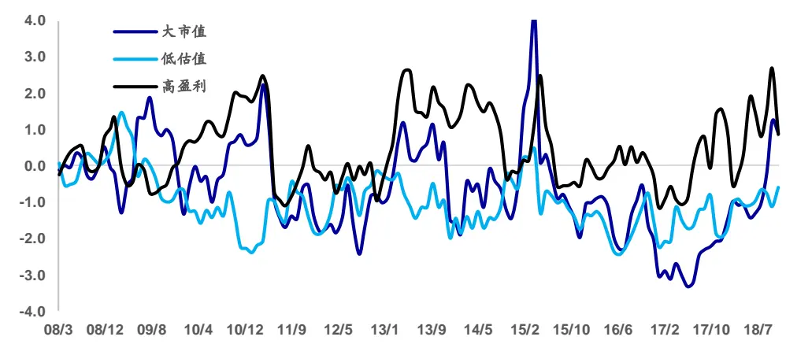
资料来源： ，海通证券研究所

## 2.4.1 多空波动率比率与未来因子收益

下图展示了多空波动率比率与因子未来收益之间的相关性情况。

图17 多空波动率比率与未来因子收益相关性
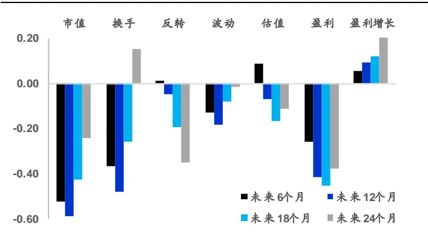
资料来源： ，海通证券研究所

图18 多空波动率比率与未来因子收益相关性（分段）
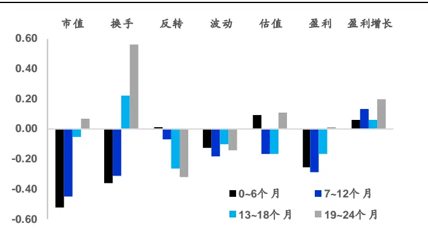
资料来源： ，海通证券研究所

除盈利增长因子外，大部分因子的未来收益都与因子多空波动率比率负相关，其中，市值、换手以及盈利因子的负相关性较强。下表详细展示了多空波动率比率与未来因子收益的相关性以及相关性检验 P 值。

表 7 多空波动率比率与因子未来收益相关性

|  | 相关性 |  |  |  | 相关性检验P值 |  |  |  |
| --- | --- | --- | --- | --- | --- | --- | --- | --- |
|  | 因子名称 未来6个月 | 未来12个月 | 未来18个月 | 未来24个月 | 未来6个月 | 未来12个月 | 未来18个月 | 未来24 个月 |
| 累计收益 | 市值 -0.53 | -0.59 | -0.43 | -0.24 | 0% | 0% | 0% | 1% |
|  | 换手 -0.37 | -0.48 | -0.26 | 0.15 | 0% | 0% | 1% | 12% |
|  | 反转 0.01 | -0.05 | -0.19 | -0.35 | 90% | 61% | 5% | 0% |
|  | 波动 -0.13 | -0.18 | -0.08 | -0.02 | 17% | 5% | 42% | 87% |
|  | 估值 0.09 | -0.07 | -0.17 | -0.11 | 34% | 47% | 8% | 25% |
|  | 盈利 -0.26 | -0.42 | -0.45 | -0.38 | 0% | 0% | 0% | 0% |
| 分段收益 | 盈利增长 0.06 | 0.09 | 0.12 | 0.21 | 53% | 32% | 22% | 4% |
|  | 因子名称 0~6个月 | 7~12个月 | 13~18个月 | 19~24个月 | 0~6个月 | 7~12个月 | 13~18个月 | 19~24个月 |
|  | 市值 -0.53 | -0.46 | -0.06 | 0.06 | 0% | 0% | 54% | 52% |
|  | 换手 -0.37 | -0.32 | 0.22 | 0.56 | 0% | 0% | 2% | 0% |
|  | 反转 0.01 | -0.07 | -0.27 | -0.33 | 90% | 43% | 1% | 0% |
|  | 波动 -0.13 | -0.19 | -0.11 | -0.15 | 17% | 4% | 27% | 14% |
|  | 估值 0.09 | -0.17 | -0.17 | 0.10 | 34% | 7% | 8% | 30% |
|  | 盈利 -0.26 | -0.29 | -0.17 | 0.00 | 0% | 0% | 7% | 98% |
| 盈利增长 | 0.06 | 0.13 | 0.06 | 0.19 | 53% | 18% | 56% | 5% |

资料来源：Wind，海通证券研究所

## 2.4.2 多空波动率比率与未来因子收益波动

下图展示了多空波动率比率与因子未来收益波动之间的相关性情况。

图 多空波动率比率与未来因子收益波动相关性
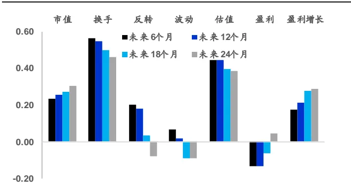
资料来源： ，海通证券研究所

图20 多空波动率比率与未来因子收益波动相关性（分段）
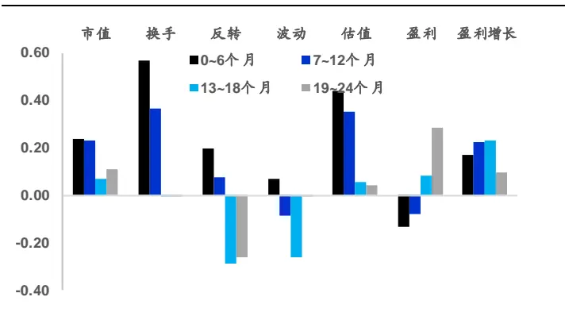
资料来源： ，海通证券研究所

相比于其他指标，因子多空波动率比率与未来因子波动之间存在较为明显的正相关性。该指标与因子未来收益波动之间的正相关性主要源自于波动率的聚集性，短期高波的因子在未来更有可能延续高波的状态。下表详细展示了多空波动率比率与未来因子收益波动的相关性以及相关性检验 P值。

表 8 多空波动率比率与因子未来收益波动相关性

|  | 相关性 |  |  |  | 相关性检验P值 |  |  |  |
| --- | --- | --- | --- | --- | --- | --- | --- | --- |
|  | 因子名称 | 未来6个月 未来12个月 | 未来18个月 | 未来24 个月 | 未来6个月 | 未来12个月 | 未来18个月 | 未来24 个月 |
| 累计收益 | 市值 | 0.23 0.26 | 0.27 | 0.31 | 1% | 1% | 0% | 0% |
|  | 换手 | 0.57 0.55 | 0.50 | 0.46 | 0% | 0% | 0% | 0% |
|  | 反转 0.20 | 0.18 | 0.03 | -0.08 | 3% | 6% | 74% | 43% |
|  | 波动 0.07 | 0.02 | -0.09 | -0.09 | 47% | 83% | 36% | 36% |
|  | 估值 0.44 | 0.45 | 0.40 | 0.38 | 0% | 0% | 0% | 0% |
|  | 盈利 -0.13 | -0.13 | -0.06 | 0.05 | 15% | 16% | 51% | 64% |
| 分段收益 | 盈利增长 0.17 | 0.21 | 0.28 | 0.29 | 6% | 2% | 0% | 0% |
|  | 因子名称 0~6个月 | 7~12个月 | 13~18个月 | 19~24个月 | 0~6个月 | 7~12个月 | 13~18个月 | 19~24个月 |
|  | 市值 0.23 | 0.23 | 0.07 | 0.11 | 1% | 1% | 47% | 28% |
|  | 换手 0.57 | 0.37 | 0.00 | -0.01 | 0% | 0% | 97% | 95% |
|  | 反转 0.20 | 0.07 | -0.29 | -0.27 | 3% | 43% | 0% | 1% |
|  | 波动 0.07 | -0.09 | -0.26 | 0.00 | 47% | 36% | 1% | 100% |
|  | 估值 0.44 | 0.35 | 0.05 | 0.04 | 0% | 0% | 59% | 66% |
|  | 盈利 -0.13 | -0.08 | 0.08 | 0.29 | 15% | 38% | 41% | 0% |
|  | 盈利增长 0.17 | 0.23 | 0.23 | 0.09 | 6% | 1% | 2% | 35% |

资料来源： ，海通证券研究所

## 3. 复合拥挤度

第二部分对于各拥挤度指标在常见因子上的择时效果进行了回测，本节将在此基础之上对于上述指标进行简单复合，并讨论分析复合拥挤度的择时效果。为了能够控制指标加权对于最终结果带来的影响，本报告暂时使用等权的方式对于拥挤度指标进行复合。

## 3.1 复合拥挤度择时效果

下图展示了复合拥挤度与因子未来收益之间的相关性情况。

图21 复合拥挤度与未来因子收益相关性
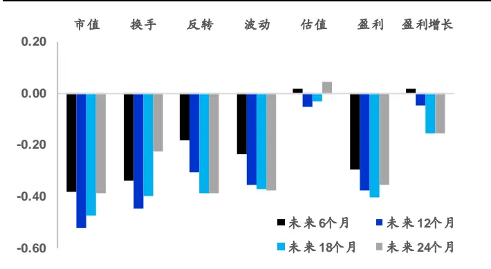
资料来源：Wind，海通证券研究所

图22 复合拥挤度与未来因子收益相关性（分段）
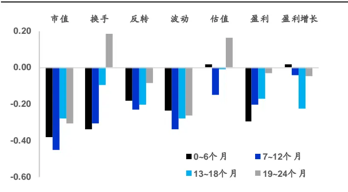
资料来源：Wind，海通证券研究所

除了估值因子外，经过复合后的拥挤度与大部分因子的未来收益都具有一定的负相关性。复合拥挤度与因子未来收益之间的负相关性在中期以及中长期上都较为明显。下表详细展示了复合拥挤度与未来因子收益的相关性以及相关性检验 P值。

表 9 复合拥挤度与因子未来收益相关性

|  | 相关性 |  |  |  | 相关性检验P值 |  |  |  |
| --- | --- | --- | --- | --- | --- | --- | --- | --- |
|  | 因子名称 | 未来6个月 未来12个月 |  | 未来18个月 未来24 个月 | 未来6个月 | 未来12个月 | 未来18个月 | 未来24 个月 |
| 累计收益 | 市值 | -0.38 -0.52 | -0.48 | -0.39 | 0% | 0% | 0% | 0% |
|  | 换手 | -0.34 -0.45 | -0.40 | -0.23 | 0% | 0% | 0% | 2% |
|  | 反转 -0.18 | -0.31 | -0.39 | -0.39 | 4% | 0% | 0% | 0% |
|  | 波动 -0.24 | -0.36 | -0.37 | -0.38 | 1% | 0% | 0% | 0% |
|  | 估值 0.02 | -0.05 | -0.03 | 0.04 | 83% | 56% | 72% | 67% |
|  | 盈利 -0.30 | -0.38 | -0.41 | -0.35 | 0% | 0% | 0% | 0% |
| 分段收益 | 盈利增长 0.02 | -0.05 | -0.16 | -0.16 | 84% | 59% | 10% | 11% |
|  | 因子名称 0~6个月 | 7~12个月 | 13~18个月 | 19~24个月 | 0~6个月 | 7~12个月 | 13~18个月 | 19~24个月 |
|  | 市值 -0.38 | -0.45 | -0.28 | -0.31 | 0% | 0% | 0% | 0% |
|  | 换手 -0.34 | -0.31 | -0.10 | 0.18 | 0% | 0% | 30% | 6% |
|  | 反转 -0.18 | -0.23 | -0.20 | -0.09 | 4% | 1% | 3% | 38% |
|  | 波动 -0.24 | -0.34 | -0.28 | -0.26 | 1% | 0% | 0% | 1% |
|  | 估值 0.02 | -0.15 | -0.01 | 0.16 | 83% | 10% | 91% | 10% |
|  | 盈利 -0.30 | -0.21 | -0.17 | -0.03 | 0% | 2% | 7% | 73% |
|  | 盈利增长 0.02 | -0.04 | -0.22 | -0.05 | 84% | 66% | 2% | 63% |

资料来源： ，海通证券研究所

虽然在大部分因子上都能够观测到复合拥挤度与因子未来收益之间的负相关性，但是复合拥挤度与因子未来收益波动之间的正相关性仅能够在部分因子上被观测到。下图展示了复合拥挤度与因子未来收益波动之间的相关性情况。

图23 复合拥挤度与未来因子收益波动相关性
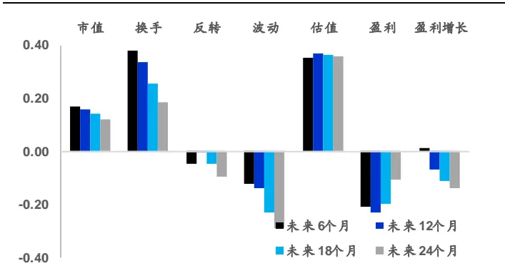
资料来源：Wind，海通证券研究所

图24 复合拥挤度与未来因子收益波动相关性（分段）
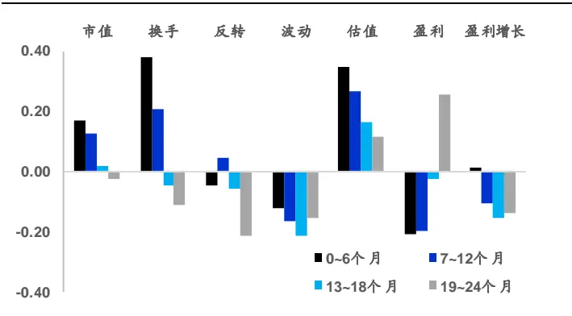
资料来源：Wind，海通证券研究所

观察上图可知，市值、换手以及估值因子的复合拥挤度与未来因子收益波动具有一定的正相关性。此外，拥挤度对于相关性的预测效果偏短期，随着未来观测的窗口的延长，指标效果逐渐减弱。在其他因子上，复合拥挤度与未来因子收益波动负相关。之所以会出现这种现象，可能是由于因子的失效特征所决定的。下表详细展示了复合拥挤度与未来因子收益波动的相关性以及相关性检验 P值。

表 10 复合拥挤度与因子未来收益波动相关性

|  | 相关性 |  |  |  | 相关性检验P值 |  |  |  |
| --- | --- | --- | --- | --- | --- | --- | --- | --- |
|  | 因子名称 | 未来6个月 | 未来12个月 | 未来18个月 | 未来24 个月 未来6个月 | 未来12个月 | 未来18个月 | 未来24 个月 |
| 累计收益 | 市值 | 0.17 0.16 | 0.14 | 0.12 | 6% | 9% | 14% | 22% |
|  | 换手 | 0.38 0.34 | 0.26 | 0.19 | 0% | 0% | 1% | 6% |
|  | 反转 | -0.05 0.00 | -0.05 | -0.10 | 60% | 97% | 63% | 32% |
|  | 波动 -0.12 | -0.14 | -0.23 | -0.29 | 17% | 13% | 2% | 0% |
|  | 估值 0.35 | 0.37 | 0.36 | 0.36 | 0% | 0% | 0% | 0% |
|  | 盈利 -0.21 | -0.23 | -0.20 | -0.10 | 2% | 1% | 4% | 28% |
| 分段收益 | 盈利增长 0.01 | -0.07 | -0.11 | -0.14 | 89% | 47% | 25% | 15% |
|  | 因子名称 0~6个月 | 7~12个月 | 13~18个月 | 19~24个月 | 0~6个月 | 7~12个月 | 13~18个月 | 19~24个月 |
|  | 市值 0.17 | 0.13 | 0.02 | -0.02 | 6% | 17% | 87% | 82% |
|  | 换手 0.38 | 0.21 | -0.05 | -0.11 | 0% | 2% | 61% | 25% |
|  | 反转 -0.05 | 0.04 | -0.06 | -0.21 | 60% | 63% | 54% | 3% |
|  | 波动 -0.12 | -0.16 | -0.21 | -0.16 | 17% | 8% | 2% | 11% |
|  | 估值 0.35 | 0.27 | 0.17 | 0.11 | 0% | 0% | 8% | 25% |
|  | 盈利 -0.21 | -0.20 | -0.02 | 0.26 | 2% | 3% | 79% | 1% |
|  | 盈利增长 0.01 | -0.11 | -0.16 | -0.14 | 89% | 24% | 10% | 16% |

资料来源： ，海通证券研究所

## 3.2 拥挤度与因子净值

海外研究通常将 以及 作为衡量因子拥挤与否的重要阈值。拥挤度超过 的因子通常被认为是高拥挤因子（ ），而拥挤度低于 的因子则被认为是低拥挤因子（Uncrowded Factor）。这种阈值划分在 A股同样具有较强的指导意义。在因子达到高拥挤状态后，因子净值走势往往处于局部高点，在未来有较大的可能出现收益的反转。而在因子达到低拥挤状态后，因子往往处于局部低点，因子在中长期上看具有较高的配臵价值。本节将展示常见因子的净值与因子复合拥挤度的共同走势。

## 3.2.1 小市值因子

下图展示了小市值因子的复合拥挤度与净值的共同走势。总的来看，小市值因子的复合拥挤度在大部分的时间都处于-1至 1 的范围之中，仅在部分时间段会出现高于 1 以及低于-1的情况。当因子呈现高度拥挤的状态后，因子净值走势在中长期来看都会出现十分明显的回撤，例如，2010 年 1 月底、2014 年 11 月底以及 2017 年年初。当因子呈现低拥挤状态后，因子净值走势往往处于局部底部，具有较高的中长期配臵价值。（此处计算小市值因子拥挤度时，多头组合股票为小市值股票）

图25 小市值因子净值与复合拥挤度
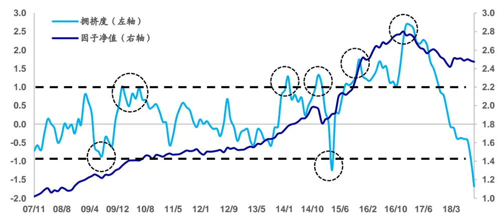
资料来源： ，海通证券研究所

## 3.2.2高盈利因子

下图展示了高盈利因子的复合拥挤度与净值的共同走势。总的来看，高盈利因子的复合拥挤度在大部分的时间都处于-1至 1 的范围之中，仅在部分时间段会出现高于 1 的情况。因子复合拥挤度的高点以及低点同样对应着因子净值走势的局部高点以及低点。（此处计算高盈利因子拥挤度时，多头组合股票为高盈利股票）

图26 高盈利因子净值与复合拥挤度
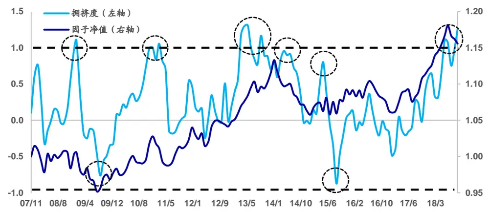
资料来源：Wind，海通证券研究所

## 3.2.3低估值因子

下图展示了低估值因子的复合拥挤度与净值的共同走势。总的来看，低估值因子的复合拥挤度在大部分的时间都处于 0之下，仅在部分时间段会出现高于 0 的情况。虽然从相关性的角度看，复合拥挤度对于因子未来收益的预测效果偏弱，但是在因子处于低拥挤状态后，低估值因子同样在未来具有较好的收益表现。（此处计算低估值因子拥挤度时，多头组合股票为低估值股票）

图27 低估值因子净值与复合拥挤度
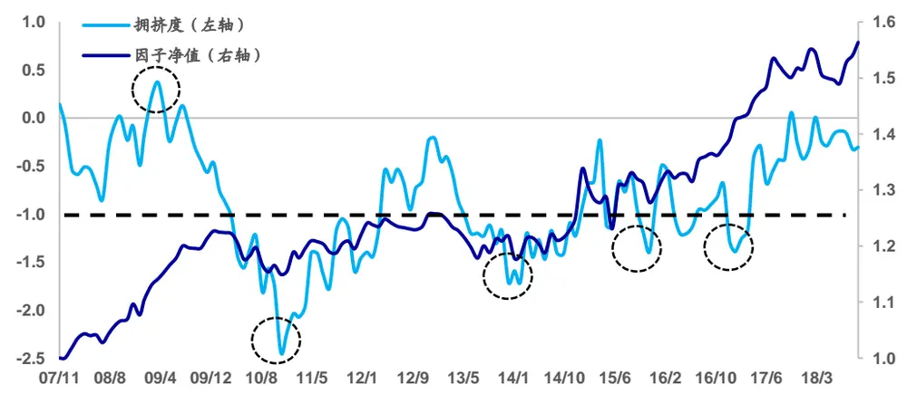
资料来源：Wind，海通证券研究所

## 3.2.4 高盈利增长

下图展示了高盈利增长因子的复合拥挤度与净值的共同走势。总的来看，高盈利增长因子的复合拥挤度在大部分的时间都处于 0 之下，仅在部分时间段会出现高于 0的情况。虽然从相关性的角度看，复合拥挤度对于因子未来收益的预测效果偏弱，但是在因子处于低拥挤状态后，高盈利增长因子同样在未来具有较好的收益表现。（此处计算高盈利增长因子拥挤度时，多头组合股票为高盈利增长股票）

图28 高盈利增长因子净值与复合拥挤度
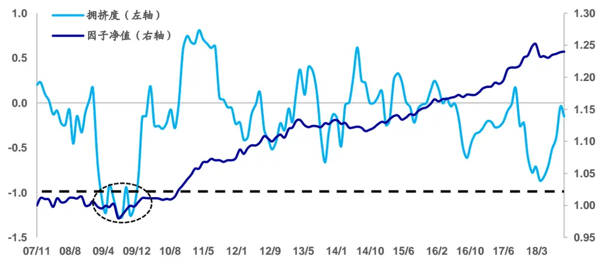
资料来源：Wind，海通证券研究所

## 3.2.5 反转因子

下图展示了反转因子的复合拥挤度与净值的共同走势。总的来看，反转因子的复合拥挤度在大部分的时间都处于-1至 1 之间。并且由于反转因子的多头以及空头股票逐月之间变化较大，因子拥挤度稳定性较弱，存在较为明显的毛刺。因子复合拥挤度的高点以及低点同样对应着因子净值走势的局部高点以及低点。

图29 反转因子净值与复合拥挤度
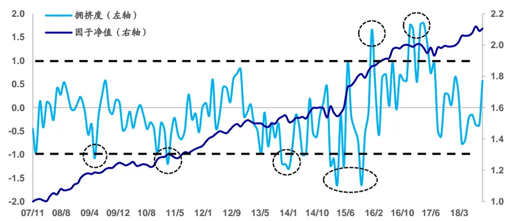
资料来源：Wind，海通证券研究所

## 3.2.6 低波动因子

下图展示了低波动因子的复合拥挤度与净值的共同走势。

图30 低波动因子净值与复合拥挤度
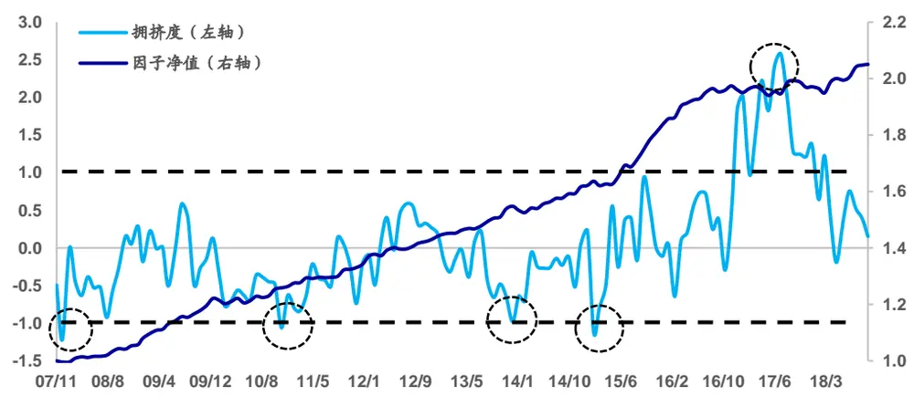
资料来源：Wind，海通证券研究所

总的来看，低波动因子的复合拥挤度在大部分的时间都处于-1 至 1之间，仅在极少数的情况下会超出-1 至 1的区间。相比于反转因子，低波动因子的复合拥挤度更加平滑。因子复合拥挤度的高点同样对应着因子净值走势的局部高点。（此处计算低波动因子拥挤度时，多头组合股票为低波动股票）

## 3.2.7 低换手因子

下图展示了低换手因子的复合拥挤度与净值的共同走势。总的来看，低换手因子的复合拥挤度在大部分的时间都处于 0之下，仅在极少数的情况下会出现超过 0的情况。因子复合拥挤度的高点同样对应着因子净值走势的局部高点。历史上几次拥挤度低于-1后，因子净值都出现了十分明显的上升。（此处计算低换手因子拥挤度时，多头组合股票为低换手股票）

图31 低换手因子净值与复合拥挤度
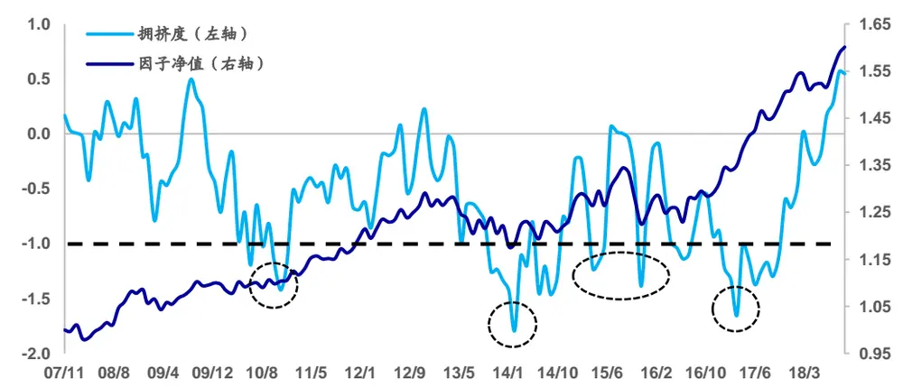
资料来源：Wind，海通证券研究所

## 3.3 常见因子拥挤度历史走势

为了能够更加直观地对比分析各因子的拥挤度情况，下图对比展示了常用因子的历史拥挤度走势情况。左图对比展示了大市值、高盈利、低估值以及高盈利增长因子的复合拥挤度，右图对比展示了反转、低波动、低换手因子的复合拥挤度。

图32 常用因子复合拥挤度历史走势
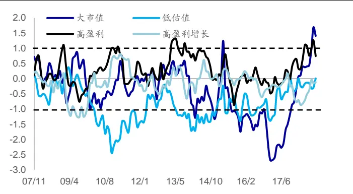
资料来源：Wind，海通证券研究所

图33 常用技术类因子复合拥挤度历史走势
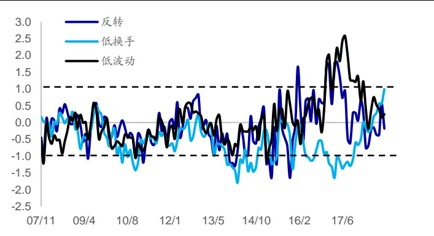
资料来源：Wind，海通证券研究所

观察上图可知，在最近 1年至 2 年间，大市值、高盈利、低估值以及低换手因子的复合拥挤度都出现了十分明显的上升，并且大市值以及高盈利因子的复合拥挤度在 2018年以来都已出现超过 1的情况。若按照 1 作为阈值，大市值已处于高拥挤状态。下表详细展示了各因子在 2018 年 10 月 31 日的拥挤度情况。

表 11 复合因子拥挤度与分项情况（截至 2018年 10月 31日）

|  | 大市值 | 低换手 | 反转 | 低波动 | 低估值 | 高盈利 | 高盈利增长 |
| --- | --- | --- | --- | --- | --- | --- | --- |
| 估值价差 | -0.06 | -0.22 | -0.18 | -0.17 | -0.22 | 1.18 | -0.36 |
| 配对相关性 | 0.57 | 1.75 | -0.63 | 2.19 | 0.03 | 0.16 | -0.06 |
| 长期累计收益 | 4.19 | 2.46 | -1.63 | -1.65 | 0.79 | 0.74 | 0.26 |
| 多空波动率 | 0.92 | -0.03 | 1.70 | 0.61 | -0.58 | 0.88 | -0.31 |
| 综合打分 | 1.40 | 0.99 | -0.18 | 0.25 | 0.00 | 0.74 | -0.12 |

资料来源：Wind，海通证券研究所

## 3.4 因子拥挤度与大幅回撤

前文在讨论因子拥挤度有效性时主要使用相关性来衡量，本节将从回撤的角度进一步展示拥挤度在因子失效预警上的效果。下图分别展示了不同拥挤度水平下大市值以及高盈利在未来 6个月以及 12 个月发生大幅回撤的概率。需要注意的是，由于因子波动性各不相同，对于不同因子界定大幅回撤的标准也应该有所不同。对于大市值因子，本节使用 10%作为阈值，即最大回撤幅度超过 10%则被识别为发生大幅回撤。对于波动更小的高盈利因子，本节使用 2%作为阈值。

图34 不同拥挤度下大市值因子发生大幅回撤的概率
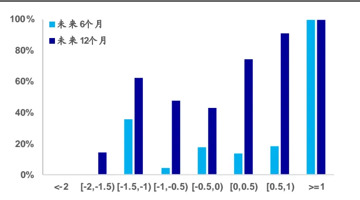
资料来源： ，海通证券研究所

图35 不同拥挤度下高盈利因子发生大幅回撤的概率
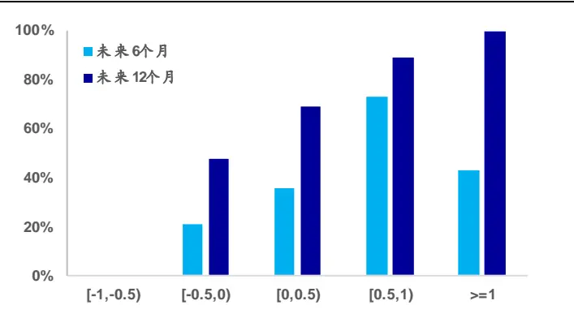
资料来源：Wind，海通证券研究所

观察上图不难发现，拥挤度越高，因子未来发生大幅回撤的概率越大。由于各因子历史上超过 1的情况并不多，上述统计在一定程度上缺乏显著性。

## 4. 总结

随着因子投资的兴起，投资者对于因子择时的需求越来越大。不同于系列前期因子择时研究从外生变量的角度出发的研究方法，本文基于海外研究提出的因子拥挤度这一概念，构建了一系列内生变量，并对于该类变量在中长期因子择时上的效果进行了回测。相比于外生择时变量，内生变量虽然无法在逐月之间为模型提供较强的灵活性，但是内生变量的逻辑性更强，并且在中长期对于因子未来收益表现具有更加稳健的预测效果。

回测结果表明，因子拥挤度在中长期上与因子未来收益负相关，且因子的高拥挤状态或者低拥挤状态往往对应着因子净值走势的局部高点或者低点。值得注意的是，海外研究中发现的因子拥挤度与因子未来收益波动之间的正相关性在 A股市场并不普遍存在。这可能和具体因子的失效特征以及市场特征有一定的关联。

本文初步引入了因子拥挤度，并对于该指标的择时效果进行了全方面的展示。我们将在后续报告中对于指标的具体应用方式进行讨论。

## 5. 风险提示

市场系统性风险、资产流动性风险以及政策变动风险会对策略表现产生较大影响。

# 信息披露

分析师声明

[Table冯佳睿yst金融工程研究团队s]

袁林青金融工程研究团队

本人具有中国证券业协会授予的证券投资咨询执业资格，以勤勉的职业态度，独立、客观地出具本报告。本报告所采用的数据和信息均来自市场公开信息，本人不保证该等信息的准确性或完整性。分析逻辑基于作者的职业理解，清晰准确地反映了作者的研究观点，结论不受任何第三方的授意或影响，特此声明。

## 法律声明

本报告仅供海通证券股份有限公司（以下简称“本公司”）的客户使用。本公司不会因接收人收到本报告而视其为客户。在任何情况下，本报告中的信息或所表述的意见并不构成对任何人的投资建议。在任何情况下，本公司不对任何人因使用本报告中的任何内容所引致的任何损失负任何责任。

本报告所载的资料、意见及推测仅反映本公司于发布本报告当日的判断，本报告所指的证券或投资标的的价格、价值及投资收入可能会波动。在不同时期，本公司可发出与本报告所载资料、意见及推测不一致的报告。

市场有风险，投资需谨慎。本报告所载的信息、材料及结论只提供特定客户作参考，不构成投资建议，也没有考虑到个别客户特殊的投资目标、财务状况或需要。客户应考虑本报告中的任何意见或建议是否符合其特定状况。在法律许可的情况下，海通证券及其所属关联机构可能会持有报告中提到的公司所发行的证券并进行交易，还可能为这些公司提供投资银行服务或其他服务。

本报告仅向特定客户传送，未经海通证券研究所书面授权，本研究报告的任何部分均不得以任何方式制作任何形式的拷贝、复印件或复制品，或再次分发给任何其他人，或以任何侵犯本公司版权的其他方式使用。所有本报告中使用的商标、服务标记及标记均为本公司的商标、服务标记及标记。如欲引用或转载本文内容，务必联络海通证券研究所并获得许可，并需注明出处为海通证券研究所，且不得对本文进行有悖原意的引用和删改。

根据中国证监会核发的经营证券业务许可，海通证券股份有限公司的经营范围包括证券投资咨询业务。

## 海通证券股份有限公司研究所[Table_PeopleInfo]

路 颖所长

(021)23219403 luying@htsec.com

高道德 副所长(021)63411586 gaodd@htsec.com

姜 超副所长

(021)23212042 jc9001@htsec.com

| 副所长 | 荀玉根 副所长 |  | 涂力磊 所长助理 |
| --- | --- | --- | --- |
| (021)23219404 dengyong@htsec.com |  | (021)23219658 xyg6052@htsec.com | (021)23219747 tll5535@htsec.com |

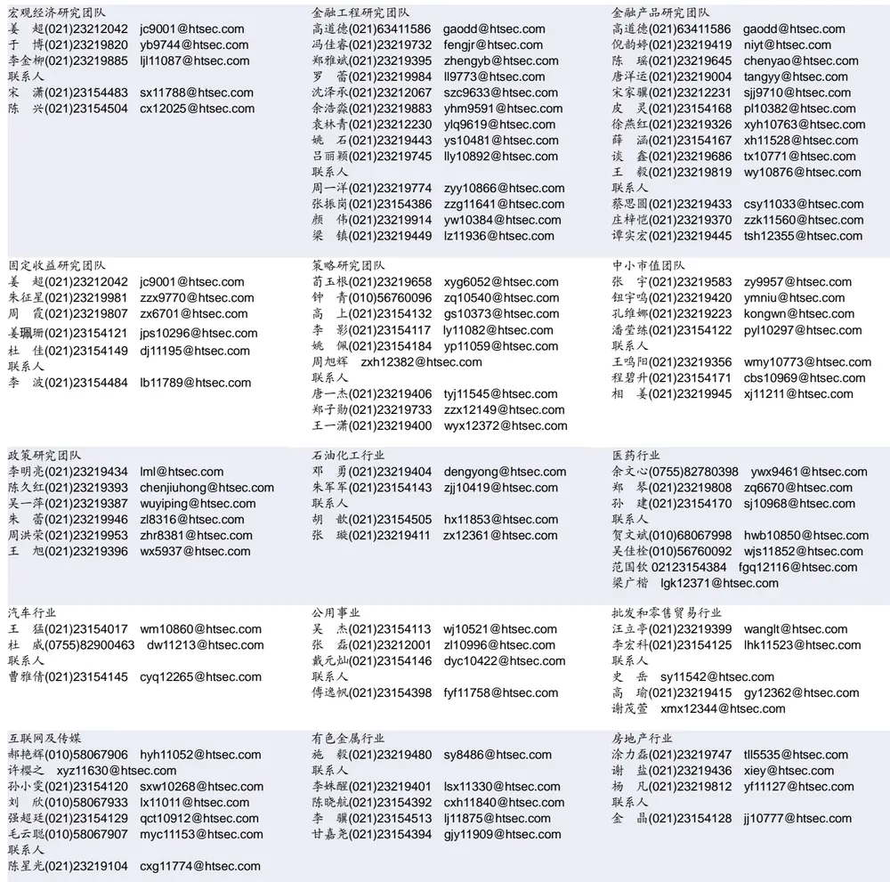

| 家电行业 | 造纸轻工行业 |
| --- | --- |
| 陈子仪(021)23219244 chenzy@htsec.com | 衣桢永(021)23212208 yzy12003@htsec.com |
| 李 阳(021)23154382 ly11194@htsec.com | 曾 知(021)23219810 zz9612@htsec.com |
| 联系人 | 赵 洋(021)23154126 zy10340@htsec.com |
| 朱默辰(021)23154383 zmc11316@htsec.com |  |
| 刘 璐(021)23214390 II11838@htsec.com |  |

| 电子行业 |  |  | 煤炭行业 |  | 电力设备及新能源行业 |  |  |
| --- | --- | --- | --- | --- | --- | --- | --- |
|  | 陈 平(021)23219646 cp9808@htsec.com |  |  | 李 淼(010)58067998 Im10779@htsec.com |  | 张一弛(021)23219402 | zyc9637@htsec.com |
|  | 尹 苓(021)23154119 yl11569@htsec.com |  |  | 戴元灿(021)23154146 dyc10422@htsec.com | 房 青(021)23219692 |  | fangq@htsec.com |
|  |  | 谢 磊(021)23212214 xl10881@htsec.com |  | 吴 杰(021)23154113 wj10521@htsec.com |  | 曾 彪(021)23154148 zb10242@htsec.com |  |
| 联系人 |  |  | 联系人 |  |  | 徐柏乔(021)23219171 xbq6583@htsec.com |  |
|  |  | 石 坚(010)58067942 sj11855@htsec.com |  | 王 涛 02123219760 wt12363@htsec.com |  | 张向伟(021)23154141 联系 | zxw10402@htsec.com |

| 基础化工行业 |  | 计算机行业 |  | 通信行业 |  |
| --- | --- | --- | --- | --- | --- |
| 刘 威(0755)82764281 Iw10053@htsec.com |  | 郑宏达(021)23219392 | zhd10834@htsec.com | 朱劲松(010)50949926 | zjs10213@htsec.com |
| 刘海荣(021)23154130 | Ihr10342@htsec.com | 黄竞晶(021)23154131 | hjj10361@htsec.com | 余伟民(010)50949926 | ywm11574@htsec.com |
| 张翠翠(021)23214397 | zcc11726@htsec.com | 杨 林(021)23154174 yl11036@htsec.com |  | 张 弋 01050949962 zy12258@htsec.com |  |
| 孙维容(021)23219431 | swr12178@htsec.com | 鲁 立(021)23154138 | II11383@htsec.com | 张峥青(021)23219383 | zzq11650@htsec.com |
| 联系人 李 智(021)23219392 |  | 于成龙 ycl12224@htsec.com |  |  |  |
|  | lz11785@htsec.com | 联系人 |  |  |  |
|  |  | 洪 琳(021)23154137 hl11570@htsec.com |  |  |  |

| 非银行金融行业 |  | 交通运输行业 |  | 纺织服装行业 |
| --- | --- | --- | --- | --- |
|  | 孙 婷(010)50949926 st9998@htsec.com |  | 虞 楠(021)23219382 yun@htsec.com | 梁 希(021)23219407 lx11040@htsec.com |
|  | 何 婷(021)23219634 ht10515@htsec.com |  | 罗月江（010）56760091 lyj12399@htsec.com | 联系人 |
| 联系人 | 李芳洲(021)23154127 Ifz11585@htsec.com |  | 联系人 李 丹(021)23154401 Id11766@htsec.com 党新龙(0755)82900489 dxl12222@htsec.com | 盛 开(021)23154510 sk11787@htsec.com 刘 溢(021)23219748 ly12337@htsec.com |

| 建筑建材行业 |  | 机械行业 | 钢铁行业 |  |
| --- | --- | --- | --- | --- |
| 冯晨阳(021)23212081 fcy10886@htsec.com 联系人 |  | 余炜超(021)23219816 swc11480@htsec.com | 刘彦奇(021)23219391 liuyq@htsec.com |  |
| 申 浩(021)23154114 sh12219@htsec.com |  | 耿 耘(021)23219814 gy10234@htsec.com 杨 震(021)23154124 yz10334@htsec.com | 联系人 | 周慧琳(021)23154399 zhl11756@htsec.com |
|  |  | 沈伟杰(021)23219963 swj11496@htsec.com | 刘 璇(0755)82900465 Ix11212@htsec.com |  |
|  | 周 丹 zd12213@htsec.com |  |  |  |

| 建筑工程行业 | 农林牧渔行业 |  | 食品饮料行业 |  |
| --- | --- | --- | --- | --- |
| 杜市伟(0755)82945368 dsw11227@htsec.com | 丁 频(021)23219405 dingpin@htsec.com |  |  | 闻宏伟(010)58067941 whw9587@htsec.com |
| 张欣劼 zxj12156@htsec.com | 陈雪丽(021)23219164 cxl9730@htsec.com |  |  | 成 珊(021)23212207 cs9703@htsec.com |
| 李富华(021)23154134 Ifh12225@htsec.com | 联系人 | 陈 阳(021)23212041 cy10867@htsec.com |  | 唐 宇(021)23219389 ty11049@htsec.com |

| 军工行业 |  | 银行行业 |  | 社会服务行业 |
| --- | --- | --- | --- | --- |
|  | 蒋 俊(021)23154170 jj11200@htsec.com |  | 孙 婷(010)50949926 st9998@htsec.com | 汪立亭(021)23219399 wanglt@htsec.com |
|  | 刘 磊(010)50949922 II11322@htsec.com |  | 解巍巍 xww12276@htsec.com | 陈扬扬(021)23219671 cyy10636@htsec.com |
| 张恒晅 zhx10170@htsec.com |  | 联系人 林加力(021)23214395 ljl12245@htsec.com |  |  |
| 联系人 张宇轩(021)23154172 zyx11631@htsec.com |  |  | 谭敏沂(0755)82900489 tmy10908@htsec.com |  |

## 研究所销售团队

深广地区销售团队

蔡铁清(0755)82775962 ctq5979@htsec.com

伏财勇(0755)23607963 fcy7498@htsec.com

辜丽娟(0755)83253022 gulj@htsec.com

刘晶晶(0755)83255933 liujj4900@htsec.com

王雅清(0755)83254133 wyq10541@htsec.com

饶 伟(0755)82775282 rw10588@htsec.com

欧阳梦楚(0755)23617160

oymc11039@htsec.com

宗 亮 zl11886@htsec.com

巩柏含 gbh11537@htsec.com

上海地区销售团队
胡雪梅(021)23219385 huxm@htsec.com
朱 健(021)23219592 zhuj@htsec.com
季唯佳(021)23219384 jiwj@htsec.com
黄 毓(021)23219410 huangyu@htsec.com
漆冠男(021)23219281 qgn10768@htsec.com
胡宇欣(021)23154192 hyx10493@htsec.com
黄 诚(021)23219397 hc10482@htsec.com
毛文英(021)23219373 mwy10474@htsec.com
马晓男 mxn11376@htsec.com
杨祎昕(021)23212268 yyx10310@htsec.com
张思宇 zsy11797@htsec.com
慈晓聪(021)23219989 cxc11643@htsec.com
王朝领 wcl11854@htsec.com
李 寅 021-23219691 ly12488@htsec.com
邵亚杰 23214650 syj12493@htsec.com
北京地区销售团队
殷怡琦(010)58067988 yyq9989@htsec.com
郭 楠 010-5806 7936 gn12384@htsec.com
吴 尹 wy11291@htsec.com
张丽萱(010)58067931 zlx11191@htsec.com
杨羽莎(010)58067977 yys10962@htsec.com
杜 飞 df12021@htsec.com
张 杨(021)23219442 zy9937@htsec.com
何 嘉(010)58067929 hj12311@htsec.com
李 婕 lj12330@htsec.com
欧阳亚群 oyyq12331@htsec.com

海通证券股份有限公司研究所

地址：上海市黄浦区广东路 689号海通证券大厦 9楼

电话：（021）23219000

传真：（021）23219392

网址：www.htsec.com