## [Tab相关研究

[Table_ReportInfo]《中美股票市场指数的季节效应》 2019.01.22

《基于因子剥离的 FOF择基逻辑系列十六——利用因子暴露监控公募基金仓位和投资风格的变化》2019.01.14

《宏观对冲研究之六——全球股市轮动策略兼论从全球视角看 A股投资价值》2019.01.09

分析师:冯佳睿

Tel:(021)23219732

Email:fengjr@htsec.com

证书:S0850512080006

分析师:袁林青

Tel:(021)23212230

Email:ylq9619@htsec.com

证书:S0850516050003

# 选股因子系列研究（四十三）——因子拥挤度的改进

## 投资要点：

近年来，随着因子投资的兴起，因子拥挤（Factor Crowding）也逐渐受到投资者的关注。所谓因子拥挤，是指由于跟踪或者投资某一因子的资金过多而使得该因子的收益性或者收益稳定性下降的现象。由于这一现象的存在，度量因子拥挤度就显得至关重要。

海通量化团队在前期发布的专题报告《选股因子系列（四十二）——因子失效预警：因子拥挤》中对于部分因子拥挤度指标在国内市场的表现进行了初步的测试。本文将基于客户反馈交流的结果，对于原有指标的计算方法进行尝试性的改进，为投资者在构建自己的拥挤度监控框架时提供更多的参考。

在前期报告中，我们介绍并回测了四类因子拥挤度指标在 A股市场的表现情况。这四类指标分别是：估值价差、配对相关性、长期收益反转以及因子波动率。在路演交流的过程中，配对相关性以及因子波动率两个指标常会引起讨论，并且指标的效果也存在进一步提升的空间。因此，本文将会重点对比展示不同计算方法下指标的表现情况。

- 算法改变后的配对相关性在部分因子上与未来因子收益正相关。在使用特质收益计算配对相关性时，这种正相关性会更加明显以及普遍。

- 算法改变后的配对相关性对于因子未来收益波动的预测能力较强。在引入了特质收益后，指标对于波动的预测能力会进一步提升。

- 算法改变后的配对相关性在原始因子集合以及正交因子集合上的效果差别较小。指标的收益预测能力以及收益波动的预测能力在正交的因子集合上依旧较为稳定，仅在部分因子上会有小幅变化。

- “多头/市场”的因子波动率具有一定的预测能力，但是弱于“多头/空头”的指标效果。“多头/市场”的因子波动率对于因子未来收益具有一定的预测能力，但是指标在原始因子集合上的效果并未明显强于系列前期报告中构建的“多头/空头”的指标效果。

- “多头/市场”的因子波动率在正交的因子集合上依旧具有收益预测能力，但是收益波动预测能力有所减弱。“多头/市场”的因子波动率在正交的因子集合上对于因子未来收益的预测能力有一定的提升，但是指标与因子未来收益波动之间的相关性会有所减弱。

- “多空/市场”的因子波动率在原始因子集合以及完全正交的因子集合上的预测能力偏弱。

- 风险提示。市场系统性风险、资产流动性风险以及政策变动风险会对策略表现产生较大影响。

近年来，随着因子投资的兴起，因子拥挤（Factor Crowding）也逐渐受到投资者的关注。所谓因子拥挤，是指由于跟踪或者投资某一因子的资金过多而使得该因子的收益性或者收益稳定性下降的现象。由于这一现象的存在，度量因子拥挤度就显得至关重要。

在前期发布的专题报告《选股因子系列（四十二）——因子失效预警：因子拥挤》中，我们对于部分因子拥挤度指标在国内市场的表现进行了初步的测试。本文将基于客户反馈交流的结果，对于原有指标的计算方法进行尝试性的改进，为投资者在构建自己的拥挤度监控框架时提供更多的参考。

在前期报告中，我们介绍并回测了四类因子拥挤度指标在 A股市场的表现情况。这四类指标分别是：估值价差、配对相关性、长期收益反转以及因子波动率。在路演交流的过程中，配对相关性以及因子波动率两个指标常会引起讨论，指标的效果也存在进一步提升的空间。因此，本文将会重点对比展示不同计算方法下指标的表现情况。

本文主要分为四部分，第一部分讨论了不同算法下配对相关性的表现，第二部分讨论了不同算法下因子波动率的表现，第三部分对于全文进行了总结，第四部分提示了模型风险。

## 1. 配对相关性

系列前期报告在构建配对相关性这一指标时，考虑到 A股市场做空的限制，使用了多头组合中各股票收益与多头组合收益之间的相关性的均值，并用它来度量因子极值组合股票同涨同跌的属性。考虑到需要减去一个比较基准，因此减去了空头组合计算得到的相关性均值。计算公式如下所示：

$$
PairwiseCorrelation=mean\Big(corr\Big(r_{\xi\neq\cdot},r_{\xi\neq\cdot,i}\Big)\Big)-mean\Big(corr\Big(r_{\tilde{\Xi}\tilde{\mathcal{Z}}\tilde{\mathcal{Z}}\tilde{\mathcal{Z}},i}\Big)\Big)
$$

在进一步的讨论分析后，我们发现上述公式在特定市场环境下会低估因子的拥挤程度。不妨以市值因子在 年年初的表现为例。在 年年初，市场呈现出了“大盘齐涨，小盘齐跌”的现象，因此根据上述计算公式计算得到的配对相关性会较低，然而当时的市场环境明显体现出了较高的因子拥挤程度。

为了能够更加真实地体现出因子的拥挤程度，现考虑对于指标的计算方式进行调整。可使用“多头+空头”的方式计算配对相关性，计算公式如下所示：

$$
PairwiseCorrelation=mean\left(corr\left(r_{\mathcal{F}\mathcal{F}},r_{\mathcal{F}\mathcal{F},i}\right)\right)+mean\left(corr\left(r_{\mathcal{F}\mathcal{F}},r_{\mathcal{F}\mathcal{F},i}\right)\right)
$$

也可单纯使用“多头”计算配对相关性，计算公式如下所示：

$$
PairwiseCorrelation=mean\left(corr\left(r_{\beta\ast},r_{\beta\ast,i}\right)\right)
$$

此外，计算收益相关性时所使用的收益类型也值得斟酌。在系列前期报告中，我们使用了股票原始收益，本文也尝试使用了剔除 Fama-French 三因素后的特质收益。

本文在进行指标效果回测时，除了对于指标计算方法进行调整外，统一沿用《选股因子系列（四十二）——因子失效预警：因子拥挤》中的处理以及设定，主要展示指标与未来因子收益以及收益波动之间的相关性情况。

本文在测试拥挤度指标效果时，主要在市值、换手、反转、波动、估值、盈利以及盈利增长 7 个因子上构建指标并进行回测。在计算因子拥挤度指标时，各因子的多头组合分别为：市值最小的 10%的股票、前期日均换手最低的 10%的股票、前期涨幅最低的

10%的股票、前期波动最低的 10%的股票、估值最低的 10%的股票、盈利最高的 10%的股票以及盈利增长最强的 的股票。

## 1.1 原始因子集合回测效果对比

本节对比讨论了各计算方法下的配对相关性在未经正交的原始因子集合上的表现情况。1.1.1 将讨论使用原始收益并且使用“多头+空头”的计算方法得到的配对相关性的效果； 将讨论使用特质收益并且使用“多头 空头”的计算方法得到的配对相关性的效果；1.1.3 将讨论使用原始收益并且使用“多头”的计算方法得到的配对相关性的效果；1.1.4 将讨论使用特质收益并且使用“多头”的计算方法得到的配对相关性的效果。

## 1.1.1 使用原始收益计算得到的“多头+空头”配对相关性

下图展示了使用股票原始收益计算得到的“多头+空头”的配对相关性与因子未来 6个月、12 个月、18个月以及 24 个月收益以及收益波动之间的相关性情况。

图1 配对相关性与收益的相关性（原始收益+“多+空”）
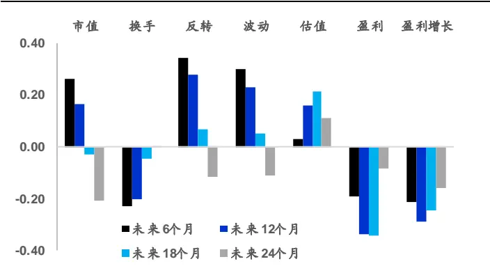
资料来源：Wind，海通证券研究所

图2 配对相关性与分段收益的相关性（原始收益+“多+空”）
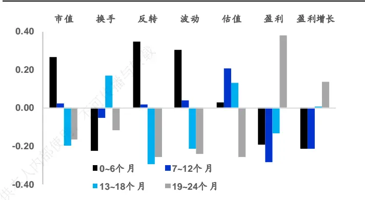
资料来源：Wind，海通证券研究所

图3 配对相关性与波动的相关性（原始收益+“多+空”）
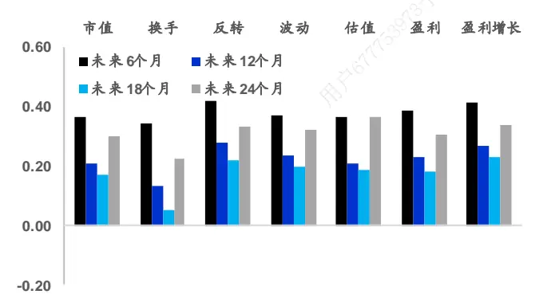
资料来源：Wind，海通证券研究所

图4 配对相关性与分段波动的相关性（原始收益+“多+空”）
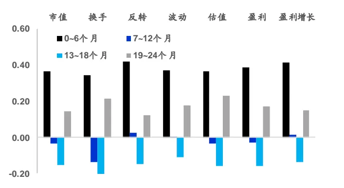
资料来源：Wind，海通证券研究所

观察上图不难发现，该种算法下的配对相关性仅与部分因子的未来收益具有一定负相关性。相比于原始的“多头-空头”的算法，该种算法在收益预测能力上的改进并不明显。该种算法虽然在收益预测能力上偏弱，但是对于因子未来收益波动具有一定的预测能力。在所有的因子上，指标都与未来因子收益波动正相关。下表展示了配对相关性与未来因子收益以及收益波动的相关性情况。

表 1 配对相关性与因子未来收益的相关性（原始收益 + “多头+空头”）

|  | 相关性 |  |  |  | 相关性检验P值 |  |  |  |
| --- | --- | --- | --- | --- | --- | --- | --- | --- |
|  | 因子名称 未来6个月 | 未来12个月 | 未来18个月 | 未来24 个月 | 未来6个月 | 未来12个月 | 未来18个月 | 未来24 个月 |
| 累计收益 | 市值 0.26 | 0.16 | -0.03 | -0.21 | 0% | 7% | 77% | 3% |
|  | 换手 -0.23 | -0.20 | -0.05 | 0.00 | 1% | 2% | 61% | 97% |
|  | 反转 0.35 | 0.28 | 0.07 | -0.12 | 0% | 0% | 46% | 22% |
|  | 波动 0.30 | 0.23 | 0.05 | -0.11 | 0% | 1% | 57% | 24% |
|  | 估值 0.03 | 0.16 | 0.21 | 0.11 | 74% | 8% | 2% | 26% |
|  | 盈利 -0.19 | -0.34 | -0.34 | -0.08 | 3% | 0% | 0% | 39% |
|  | 盈利增长 -0.21 | -0.29 | -0.25 | -0.16 | 2% | 0% | 1% | 9% |
| 分段收益 | 因子名称 0~6个月 | 7~12个月 | 13~18个月 | 19~24个月 | 0~6个月 | 7~12个月 | 13~18个月 | 19~24个月 |
|  | 市值 0.26 | 0.02 | -0.20 | -0.16 | 0% | 79% | 3% |  |
|  | 换手 -0.23 | -0.06 | 0.17 | -0.12 | 1% | 55% | 7% | 9% 23% |
|  | 反转 0.35 | 0.02 | -0.29 | -0.26 | 0% | 84% | 0% | 1% |
|  | 波动 0.30 | 0.04 | -0.22 | -0.24 | 0% | 65% | 2% | 1% |
|  | 估值 0.03 | 0.21 | 0.13 | -0.26 | 74% | 2% | 15% | 1% |
|  | 盈利 -0.19 | -0.29 | -0.13 | 0.38 | 3% | 0% | 15% | 0% |
|  | 盈利增长 -0.21 | -0.21 | 0.01 | 0.14 | 2% | 2% | 95% | 15% |

资料来源：Wind，海通证券研究所

表 2 配对相关性与因子未来收益波动的相关性（原始收益 + “多头+空头”）

|  | 相关性 |  |  |  | 相关性检验P值 |  |  |  |
| --- | --- | --- | --- | --- | --- | --- | --- | --- |
|  | 因子名称 | 未来6个月 | 未来12个月 | 未来18个月 | 未来24个月 | 未来6个月 未来12个月 | 未来18个月 | 未来24个月 |
| 累计收益波动 | 市值 | 0.37 | 0.21 | 0.17 | 0.30 | 0% 2% | 6% | 0% |
|  | 换手 | 0.35 | 0.14 | 0.05 | 0.22 | 0% 14% | 58% | 2% |
|  | 反转 | 0.42 | 0.28 | 0.22 | 0.33 | 0% 0% | 2% | 0% |
|  | 波动 | 0.37 | 0.24 | 0.20 | 0.32 | 0% 1% | 3% | 0% |
|  | 估值 | 0.37 | 0.21 | 0.19 | 0.36 | 0% 2% | 4% | 0% |
|  | 盈利 | 0.39 | 0.23 | 0.18 | 0.31 | 0% 1% | 5% | 0% |
|  | 盈利增长 | 0.42 | 0.27 | 0.23 | 0.34 0% | 0% | 1% | 0% |
| 分段收益波动 | 因子名称 | 0~6个月 | 7~12个月 | 13~18个月 | 19~24个月 | 0~6个月 7~12个月 | 13~18个月 | 19~24个月 |
|  | 市值 | 0.37 | -0.03 | -0.15 | 0.15 | 0% 73% | 11% |  |
|  | 换手 | 0.35 | -0.14 | -0.23 | 0.22 | 0% 14% | 1% | 13% 2% |
|  | 反转 | 0.42 | 0.02 | -0.15 | 0.12 | 0% 79% | 11% | 21% |
|  | 波动 | 0.37 | 0.01 | -0.11 | 0.18 | 0% 94% | 23% | 7% |
|  | 估值 | 0.37 | -0.03 | -0.16 | 0.23 | 0% 72% | 9% | 2% |
|  | 盈利 | 0.39 -0.03 | -0.16 | 0.17 | 0% | 75% | 9% | 7% |
|  | 盈利增长 | 0.42 | 0.02 | -0.14 | 0.15 | 0% 87% | 15% | 12% |

资料来源：Wind，海通证券研究所

## 1.1.2 使用特质收益计算得到的“多头+空头”配对相关性

下图展示了使用股票特质收益计算得到的“多头+空头”的配对相关性与因子未来 6个月、12 个月、18个月以及 24 个月收益以及收益波动之间的相关性情况。

图5 配对相关性与收益的相关性（特质收益+“多+空”）
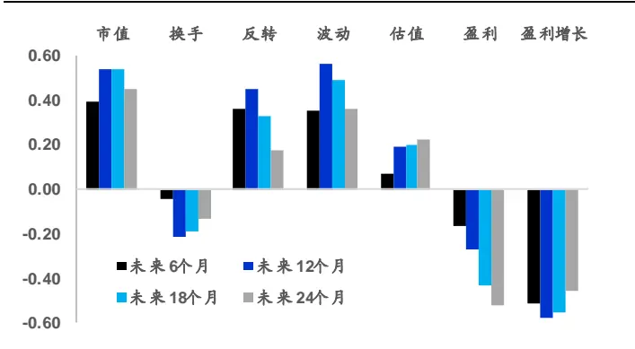
资料来源：Wind，海通证券研究所

图6 配对相关性与分段收益的相关性（特质收益+“多+空”）
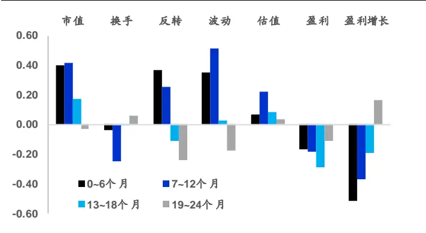
资料来源：Wind，海通证券研究所

图7 配对相关性与波动的相关性（特质收益+“多+空”）
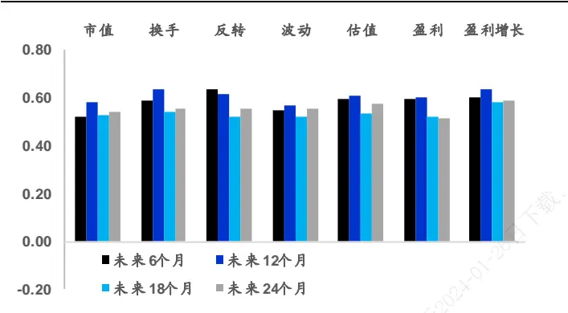
资料来源：Wind，海通证券研究所

图8 配对相关性与分段波动的相关性（特质收益+“多+空”）
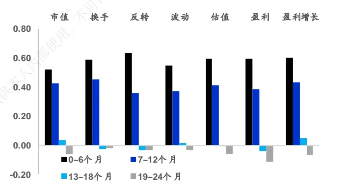
资料来源：Wind，海通证券研究所

观察上图不难发现，在使用了特质收益后，该种算法下的配对相关性与因子收益的负相关性会进一步减弱，甚至在很多因子上都呈现出了正相关。这种正相关性的出现和因子拥挤度内生反转的择时理念存在明显冲突。从因子拥挤的角度看，因子拥挤度越高，因子的中长期收益表现应该越弱。

观察出现正相关的因子，我们发现这些因子大多与特质收益有一定的关联。例如，市值因子、估值因子都是计算特质收益时所剔除的部分，波动因子本身就是特质收益的波动。因此可推测特质收益的使用在一定程度上导致了这种正相关性的出现。对比使用原始收益时的指标结果，可发现特质收益的使用会进一步提升部分因子上指标与因子收益之间的正相关性。

虽然在引入特质收益后指标的收益预测能力会有所减弱，但是指标对于因子未来收益波动的预测能力会进一步提升。在未来 个月的范围内，该指标在各因子上与未来因子收益波动之间的相关性普遍高于 0.50。在 7~12个月的范围内，该指标同样和因子收益波动具有一定的正相关性。下表展示了配对相关性与未来因子收益以及收益波动的相关性情况。

表 3 配对相关性与因子未来收益的相关性（特质收益 + “多头+空头”）

|  | 相关性 |  |  |  | 相关性检验P值 |  |  |  |
| --- | --- | --- | --- | --- | --- | --- | --- | --- |
|  | 因子名称 | 未来6个月 | 未来12个月 | 未来18个月 | 未来24 个月 | 未来6个月 未来12个月 | 未来18个月 | 未来24 个月 |
| 累计收益 | 市值 | 0.40 0.54 | 0.54 | 0.45 | 0% | 0% | 0% | 0% |
|  | 换手 | -0.04 | -0.22 -0.19 | -0.13 | 63% | 2% | 4% | 17% |
|  | 反转 | 0.36 0.45 | 0.33 | 0.17 | 0% | 0% | 0% | 7% |
|  | 波动 | 0.35 0.56 | 0.49 | 0.37 | 0% | 0% | 0% | 0% |
|  | 估值 | 0.07 0.19 | 0.20 | 0.23 | 44% | 4% | 3% | 2% |
|  | 盈利 | -0.17 -0.27 | -0.44 | -0.52 | 6% | 0% | 0% | 0% |
| 分段收益 | 盈利增长 -0.52 | -0.58 | -0.56 | -0.45 | 0% | 0% | 0% | 0% |
|  | 因子名称 0~6个月 | 7~12个月 | 13~18个月 | 19~24个月 | 0~6个月 | 7~12个月 | 13~18个月 | 19~24个月 |
|  | 市值 0.40 | 0.42 | 0.17 | -0.03 | 0% | 0% | 6% | 74% |
|  | 换手 | -0.04 -0.25 | 0.00 | 0.06 | 63% | 1% | 100% | 53% |
|  | 反转 0.36 | 0.25 | -0.12 | -0.24 | 0% | 1% | 22% | 1% |
|  | 波动 0.35 | 0.51 | 0.03 | -0.18 | 0% | 0% | 75% | 7% |
|  | 估值 0.07 | 0.22 | 0.08 | 0.04 | 44% | 1% | 39% | 72% |
|  | 盈利 -0.17 | -0.18 | -0.29 | -0.11 | 6% | 4% | 0% | 26% |
|  | 盈利增长 -0.52 | -0.38 | -0.19 | 0.16 | 0% | 0% | 4% | 9% |

资料来源：Wind，海通证券研究所

表 4 配对相关性与因子未来收益波动的相关性（特质收益 + “多头+空头”）

|  | 相关性 |  |  |  | 相关性检验P值 |  |  |  |
| --- | --- | --- | --- | --- | --- | --- | --- | --- |
|  | 因子名称 | 未来6个月 | 未来12个月 | 未来18个月 | 未来24个月 | 未来6个月 未来12个月 | 未来18个月 | 未来24 个月 |
| 累计收益波动 | 市值 | 0.52 | 0.58 | 0.53 | 0.54 | 0% 0% | 0% | 0% |
|  | 换手 | 0.59 | 0.63 | 0.54 | 0.55 | 0% 0% | 0% | 0% |
|  | 反转 | 0.64 | 0.61 | 0.52 | 0.55 | 0% 0% | 0% | 0% |
|  | 波动 | 0.55 | 0.57 | 0.52 | 0.55 | 0% 0% | 0% | 0% |
|  | 估值 | 0.59 | 0.61 | 0.54 | 0.57 | 0% 0% | 0% | 0% |
|  | 盈利 | 0.60 | 0.61 | 0.52 | 0.52 | 0% 0% | 0% | 0% |
|  | 盈利增长 | 0.60 | 0.64 | 0.58 | 0.59 0% | 0% | 0% | 0% |
| 分段收益波动 | 因子名称 | 0~6个月 | 7~12个月 | 13~18个月 | 19~24个月 | 0~6个月 7~12个月 | 13~18个月 | 19~24个月 |
|  | 市值 | 0.52 | 0.42 | 0.03 | -0.06 | 0% | 73% |  |
|  | 换手 | 0.59 | 0.45 | -0.03 | -0.02 | 0% 0% | 76% | 54% 82% |
|  | 反转 | 0.64 | 0.36 | -0.03 | -0.03 | 0% 0% 0% | 74% | 76% |
|  | 波动 | 0.55 | 0.37 | 0.02 | -0.03 | 0% 0% | 85% | 74% |
|  | 估值 | 0.59 | 0.41 | 0.00 | -0.06 | 0% 0% | 98% | 56% |
|  | 盈利 | 0.60 | 0.39 | -0.04 -0.12 | 0% | 0% | 68% | 23% |
|  | 盈利增长 | 0.60 | 0.44 | 0.05 | -0.07 | 0% 0% | 60% | 47% |

资料来源： ，海通证券研究所

## 1.1.3 使用原始收益计算得到的“多头”配对相关性

下图展示了使用股票特质收益计算得到的“多头”的配对相关性与因子未来 个月、12 个月、18 个月以及 24 个月收益以及收益波动之间的相关性情况。单纯使用多头数据计算得到的配对相关性呈现出了较弱的收益预测能力，仅在换手、盈利以及盈利增长上与未来的因子收益负相关。虽然该指标与收益之间的相关性偏弱，但是该指标呈现出了一定的收益波动预测能力。在大部分因子上，指标与因子未来收益波动正相关。

图9 配对相关性与收益的相关性（原始收益+“多头”）
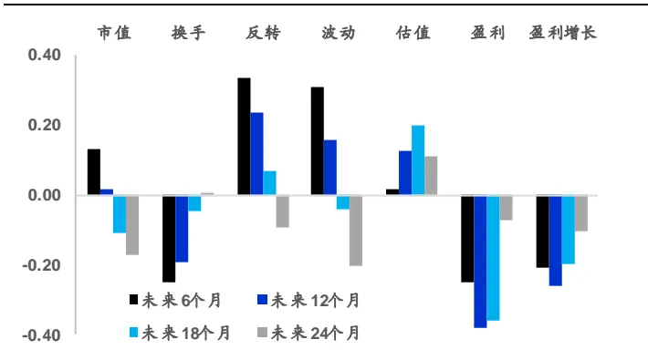
资料来源：Wind，海通证券研究所

图10 配对相关性与分段收益的相关性（原始收益+“多头”）
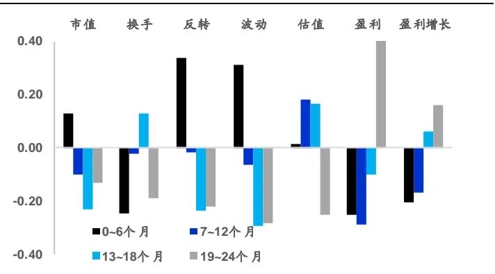
资料来源：Wind，海通证券研究所

图11 配对相关性与波动的相关性（原始收益+“多头”）
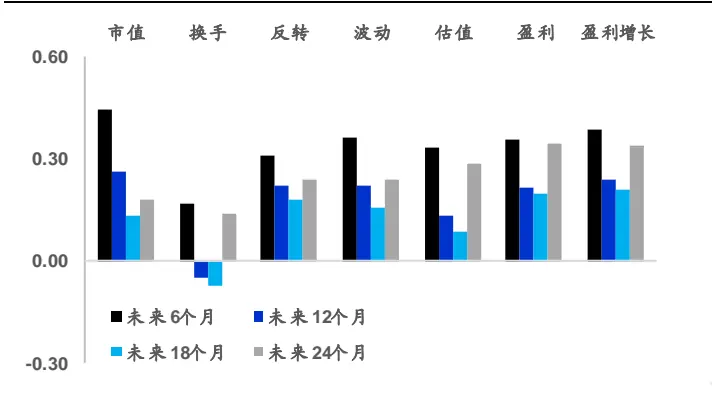
资料来源：Wind，海通证券研究所

图12 配对相关性与分段波动的相关性（原始收益+“多头”）
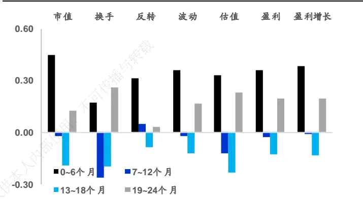
资料来源：Wind，海通证券研究所

下表展示了配对相关性与未来因子收益以及收益波动的相关性情况。

表 5 配对相关性与因子未来收益的相关性（原始收益+“多头”）

|  | 相关性 |  |  |  |  | 相关性检验P值 |  |  |
| --- | --- | --- | --- | --- | --- | --- | --- | --- |
|  | 因子名称 未来6个月 | 未来12个月 | 未来18个月 | 未来24 个月 | 未来6个月 | 未来12个月 | 未来18个月 | 未来24 个月 |
| 累计收益 | 市值 0.13 | 0.02 | -0.11 | -0.17 | 15% | 85% | 23% | 7% |
|  | 换手 -0.25 | -0.20 | -0.05 | 0.00 | 0% | 3% | 60% | 98% |
|  | 反转 0.34 | 0.24 | 0.07 | -0.10 | 0% | 1% | 48% | 32% |
|  | 波动 0.31 | 0.16 | -0.04 | -0.20 | 0% | 8% | 66% | 3% |
|  | 估值 0.02 | 0.13 | 0.20 | 0.11 | 86% | 17% | 3% | 25% |
|  | 盈利 -0.25 | -0.38 | -0.36 | -0.07 | 0% | 0% | 0% | 44% |
|  | 盈利增长 -0.21 | -0.26 | -0.20 | -0.10 | 2% | 0% | 3% | 29% |
| 分段收益 | 因子名称 0~6个月 | 7~12个月 | 13~18个月 | 19~24个月 | 0~6个月 | 7~12个月 | 13~18个月 | 19~24个月 |
|  | 市值 0.13 | -0.10 | -0.23 | -0.13 | 15% | 26% | 1% | 17% |
|  | 换手 -0.25 | -0.02 | 0.13 | -0.19 | 0% | 79% | 17% | 5% |
|  | 反转 0.34 | -0.02 | -0.24 | -0.22 | 0% | 83% | 1% | 2% |
|  | 波动 0.31 | -0.07 | -0.30 | -0.28 | 0% | 48% | 0% | 0% |
|  | 估值 0.02 | 0.18 | 0.17 | -0.25 | 86% | 5% | 7% | 1% |
|  | 盈利 -0.25 | -0.29 | -0.10 | 0.42 | 0% | 0% | 28% | 0% |
|  | 盈利增长 -0.21 | -0.17 | 0.06 | 0.16 | 2% | 6% | 51% | 10% |

资料来源： ，海通证券研究所

表 6 配对相关性与因子未来收益波动的相关性（原始收益+“多头”）

|  | 相关性 |  |  |  |  | 相关性检验P值 |  |  |
| --- | --- | --- | --- | --- | --- | --- | --- | --- |
|  | 因子名称 | 未来6个月 未来12个月 | 未来18个月 | 未来24个月 | 未来6个月 | 未来12个月 | 未来18个月 | 未来24个月 |
| 累计收益波动 | 市值 0.45 | 0.26 | 0.13 | 0.18 | 0% | 0% | 16% | 6% |
|  | 换手 0.17 | -0.05 | -0.07 | 0.14 | 5% | 60% | 44% | 14% |
|  | 反转 0.31 | 0.22 | 0.18 | 0.24 | 0% | 1% | 5% | 1% |
|  | 波动 0.36 | 0.22 | 0.16 | 0.24 | 0% | 2% | 9% | 1% |
|  | 估值 0.33 | 0.14 | 0.09 | 0.29 | 0% | 14% | 36% | 0% |
|  | 盈利 0.36 | 0.22 | 0.20 | 0.35 | 0% | 2% | 3% | 0% |
|  | 盈利增长 0.39 | 0.24 | 0.21 | 0.34 | 0% | 1% | 2% | 0% |
| 分段收益波动 | 因子名称 0~6个月 | 7~12个月 | 13~18个月 | 19~24个月 | 0~6个月 | 7~12个月 | 13~18个月 | 19~24个月 |
|  | 市值 0.45 | -0.02 | -0.19 | 0.13 | 0% | 82% | 4% |  |
|  | 换手 0.17 | -0.26 | -0.20 | 0.26 | 5% | 0% | 3% | 19% 1% |
|  | 反转 0.31 | 0.05 | -0.09 | 0.03 | 0% | 58% | 35% | 73% |
|  | 波动 0.36 | -0.02 | -0.12 | 0.17 | 0% | 81% | 20% | 8% |
|  | 估值 0.33 | -0.12 | -0.23 | 0.23 | 0% | 18% | 1% | 1% |
|  | 盈利 0.36 | -0.02 | -0.13 | 0.20 | 0% | 79% | 17% | 4% |
|  | 盈利增长 0.39 | -0.01 | -0.13 | 0.20 | 0% | 90% | 15% | 4% |

资料来源： ，海通证券研究所

## 1.1.4 使用特质收益计算得到的“多头”配对相关性

下图展示了使用股票特质收益计算得到的“多头”的配对相关性与因子未来 6个月、12 个月、18个月以及 24 个月收益以及收益波动之间的相关性情况。

图13 配对相关性与收益的相关性（特质收益+“多头”）
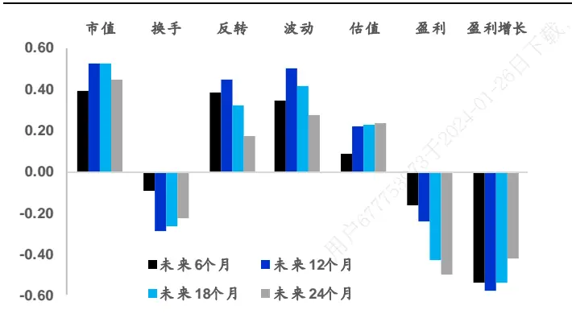
资料来源： ，海通证券研究所

图14 配对相关性与分段收益的相关性（特质收益+“多头”）
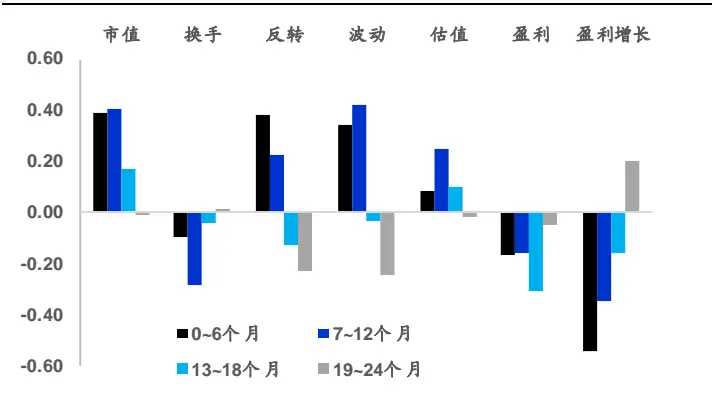
资料来源： ，海通证券研究所

图15 配对相关性与波动的相关性（特质收益+“多头”）
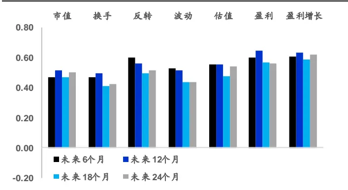
资料来源：Wind，海通证券研究所

图16 配对相关性与分段波动的相关性（特质收益+“多头”）
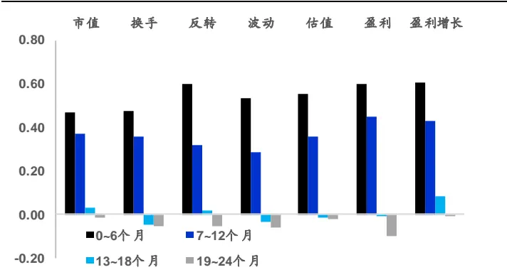
资料来源：Wind，海通证券研究所

在使用了特质收益后，单纯使用多头数据计算得到的配对相关性同样在部分因子上呈现出了和因子未来收益正相关的现象。对比使用原始收益时的结果，可以推测正相关性的出现应该源自于特质收益的引入。

虽然该指标与收益之间的相关性偏弱，但是该指标呈现出了较好的收益波动预测能力。在不同的因子上，指标与因子未来收益波动普遍正相关。在未来 个月的范围内，该指标在各因子上与未来因子收益波动之间的相关性普遍高于 0.40。下表展示了配对相关性与未来因子收益以及收益波动的相关性情况。

表 7 配对相关性与因子未来收益的相关性（特质收益+“多头”）

|  | 相关性 |  |  |  | 相关性检验P值 |  |  |  |
| --- | --- | --- | --- | --- | --- | --- | --- | --- |
|  | 因子名称 未来6个月 | 未来12个月 | 未来18个月 | 未来 24 个月 | 未来6个月 | 未来12个月 | 未来18个月 | 未来24 个月 |
| 累计收益 | 市值 0.39 | 0.53 | 0.53 | 0.45 | 0% | 0% | 0% | 0% |
|  | 换手 -0.10 | -0.29 | -0.27 | -0.23 | 28% | 0% | 0% | 2% |
|  | 反转 0.38 | 0.44 | 0.32 | 0.17 | 0% | 0% | 0% | 8% |
|  | 波动 0.35 | 0.50 | 0.42 | 0.27 | 0% | 0% | 0% | 0% |
|  | 估值 0.09 | 0.22 | 0.23 | 0.23 | 33% | 2% | 1% | 2% |
|  | 盈利 -0.17 | -0.24 | -0.43 | -0.50 | 6% | 1% | 0% | 0% |
| 分段收益 | 盈利增长 -0.54 | -0.58 | -0.54 | -0.43 | 0% | 0% | 0% | 0% |
|  | 因子名称 0~6个月 | 7~12个月 | 13~18个月 | 19~24个月 | 0~6个月 | 7~12个月 | 13~18个月 | 19~24个月 |
|  | 市值 0.39 | 0.41 | 0.17 | -0.01 | 0% | 0% | 7% | 89% |
|  | 换手 -0.10 | -0.28 | -0.04 | 0.01 | 28% | 0% | 67% | 92% |
|  | 反转 0.38 | 0.22 | -0.13 | -0.23 | 0% | 1% | 17% | 2% |
|  | 波动 0.35 | 0.42 | -0.04 | -0.24 | 0% | 0% | 70% | 1% |
|  | 估值 0.09 | 0.25 | 0.10 | -0.02 | 33% | 1% | 31% | 87% |
|  | 盈利 -0.17 | -0.16 | -0.31 | -0.05 | 6% | 9% | 0% | 59% |
| 盈利增长 | -0.54 | -0.35 | -0.16 | 0.20 | 0% | 0% | 9% | 4% |

资料来源： ，海通证券研究所

表 8 配对相关性与因子未来收益波动的相关性（特质收益+“多头”）

|  | 相关性 |  |  |  | 相关性检验P值 |  |  |  |
| --- | --- | --- | --- | --- | --- | --- | --- | --- |
|  | 因子名称 | 未来6个月 | 未来12个月 | 未来18个月 | 未来24个月 | 未来6个月 未来12个月 | 未来18个月 | 未来24个月 |
| 累计收益波动 | 市值 | 0.47 | 0.52 | 0.47 | 0.51 | 0% 0% | 0% | 0% |
|  | 换手 | 0.47 | 0.50 | 0.41 | 0.43 | 0% 0% | 0% | 0% |
|  | 反转 | 0.60 | 0.56 | 0.50 | 0.52 | 0% 0% | 0% | 0% |
|  | 波动 | 0.53 | 0.52 | 0.44 | 0.44 | 0% 0% | 0% | 0% |
|  | 估值 | 0.56 | 0.56 | 0.48 | 0.54 | 0% 0% | 0% | 0% |
|  | 盈利 | 0.60 | 0.65 | 0.57 | 0.56 | 0% 0% | 0% | 0% |
|  | 盈利增长 | 0.61 | 0.64 | 0.59 | 0.63 | 0% 0% | 0% | 0% |
| 分段收益波动 | 因子名称 | 0~6个月 | 7~12个月 | 13~18个月 | 19~24个月 | 0~6个月 7~12个月 | 13~18个月 | 19~24个月 |
|  | 市值 | 0.47 | 0.37 | 0.03 | -0.01 | 0% 0% | 74% | 89% |
|  | 换手 | 0.47 | 0.36 | -0.05 | -0.06 | 0% 0% | 63% | 57% |
|  | 反转 | 0.60 | 0.32 | 0.02 | -0.05 | 0% 0% | 83% | 58% |
|  | 波动 | 0.53 | 0.29 | -0.03 | -0.06 | 0% 0% | 74% | 53% |
|  | 估值 | 0.56 | 0.36 | -0.01 | -0.02 | 0% 0% | 90% | 85% |
|  | 盈利 | 0.60 | 0.45 | 0.00 | -0.10 | 0% 0% | 98% | 32% |
|  | 盈利增长 | 0.61 | 0.43 | 0.09 | 0.00 | 0% 0% | 36% | 98% |

资料来源：Wind，海通证券研究所

## 1.2 因子的正交处理对于指标效果的影响

由于很多投资者在使用因子时或多或少都会对于因子进行正交化的处理。因此本节将在一个两两正交的因子集合上，回测各算法下因子拥挤度指标与未来因子收益以及收益波动相关性的情况。关于因子正交的处理细节可参考专题报告《选股因子系列研究(十七)——选股因子的正交》。

下图展示了使用股票原始收益计算得到的“多头+空头”的配对相关性与因子未来 6个月、12 个月、18 个月以及 24 个月收益以及收益波动之间的相关性情况。通过对比可以发现，该指标在原始因子集合上以及在正交的因子集合上对于因子未来收益以及收益波动的预测能力并未出现明显变化。

图17 配对相关性与正交因子收益（原始收益+“多+空”）
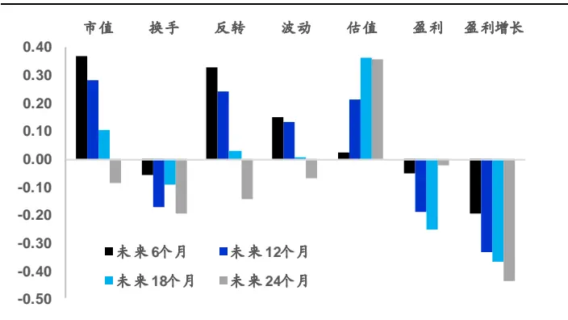
资料来源：Wind，海通证券研究所

图18 配对相关性与正交因子分段收益（原始收益+“多+空”）
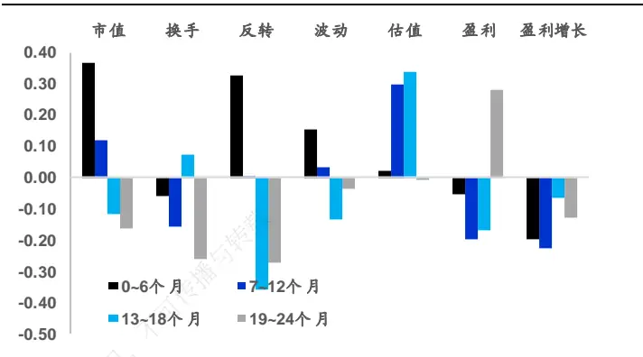
资料来源：Wind，海通证券研究所

图19 配对相关性与正交因子波动（原始收益+“多+空”）
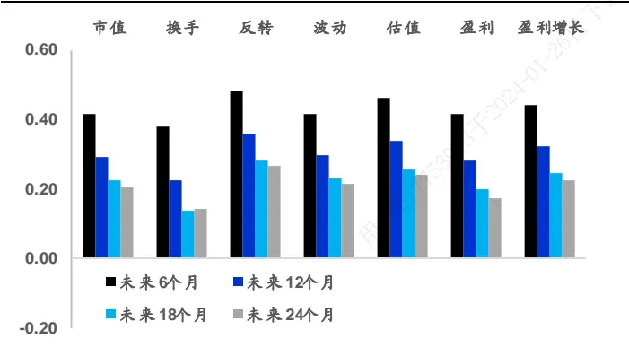
资料来源：Wind，海通证券研究所

图20 配对相关性与正交因子分段波动（原始收益+“多+空”）
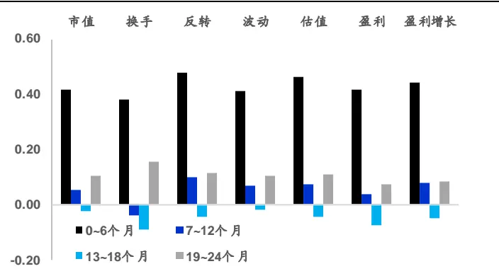
资料来源：Wind，海通证券研究所

下图展示了使用股票特质收益计算得到的“多头+空头”的配对相关性与因子未来 6个月、12 个月、18 个月以及 24 个月收益以及收益波动之间的相关性情况。通过对比可以发现，在正交的因子集合上，该指标与未来因子收益之间的正相关性更加明显，除了在盈利以及盈利增长因子上呈现出了一定的负相关外，在其余因子上都呈现出了正相关。值得注意的是，因子的正交处理并未对于指标的收益波动预测能力产生明显影响。

图21 配对相关性与正交因子收益（特质收益+“多+空”）
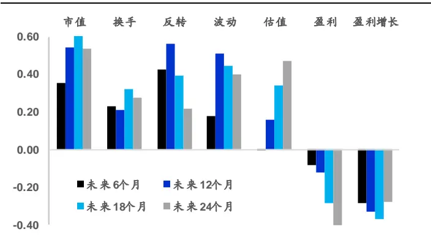
资料来源：Wind，海通证券研究所

图22 配对相关性与正交因子分段收益（特质收益+“多+空”）
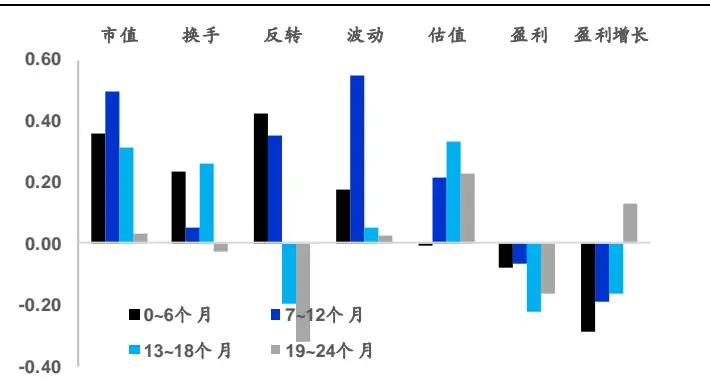
资料来源：Wind，海通证券研究所

图23 配对相关性与正交因子波动（特质收益+“多+空”）
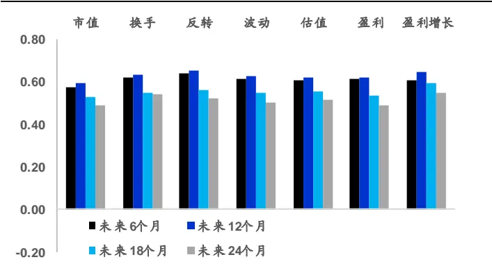
资料来源：Wind，海通证券研究所

图24 配对相关性与正交因子分段波动（特质收益+“多+空”）
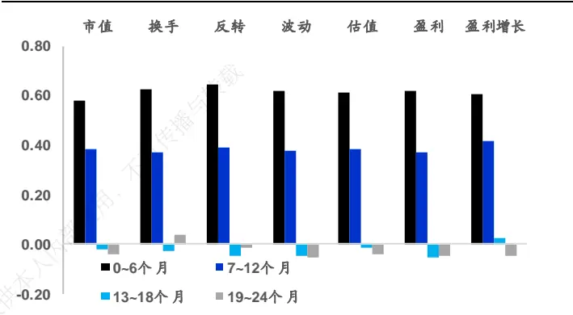
资料来源：Wind，海通证券研究所

下图展示了使用股票原始收益计算得到的“多头”的配对相关性与因子未来 6个月、12 个月、18 个月以及 24 个月收益以及收益波动之间的相关性情况。通过对比可以发现，在正交的因子集合，该指标和因子未来收益以及收益波动之间的相关性特征并未出现明显变化。

图25 配对相关性与正交因子收益（原始收益+“多头”）
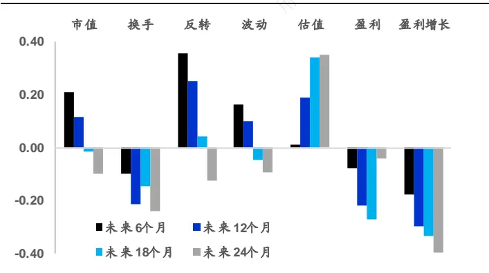
资料来源： ，海通证券研究所

图26 配对相关性与正交因子分段收益（原始收益+“多头”）
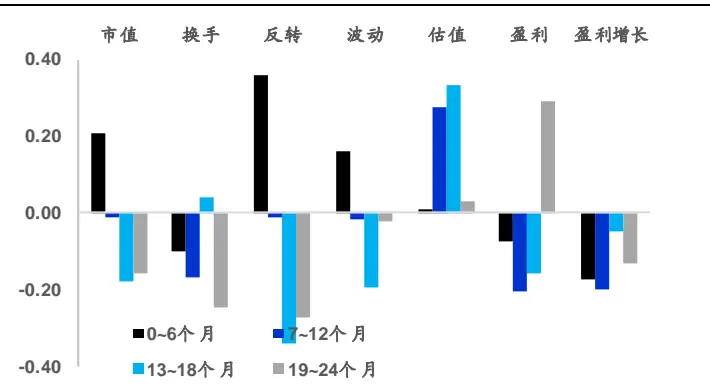
资料来源：Wind，海通证券研究所

图27 配对相关性与正交因子波动（原始收益+“多头”）
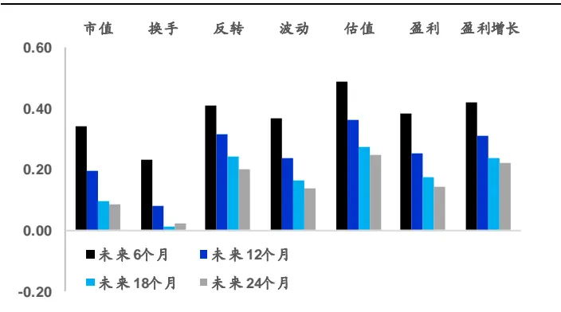
资料来源： ，海通证券研究所

图28 配对相关性与正交因子分段波动（原始收益+“多头”）
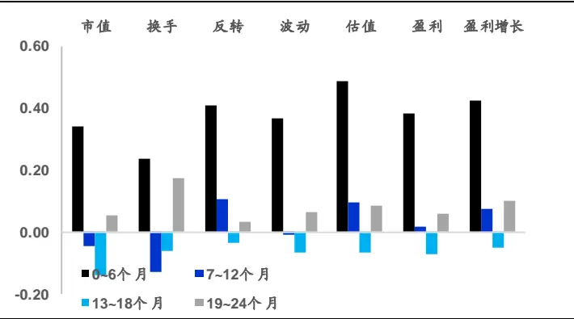
资料来源：Wind，海通证券研究所

下图展示了使用股票特质收益计算得到的“多头”的配对相关性与因子未来 个月、12 个月、18 个月以及 24 个月收益以及收益波动之间的相关性情况。通过对比可以发现，指标在正交的因子集合上呈现出了与因子未来收益更强的正相关性。与此同时，指标同样呈现出了更强的波动预测能力。

图29 配对相关性与正交因子收益（特质收益+“多头”）
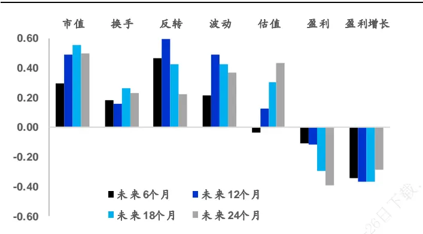
资料来源：Wind，海通证券研究所

图30 配对相关性与正交因子分段收益（特质收益+“多头”）
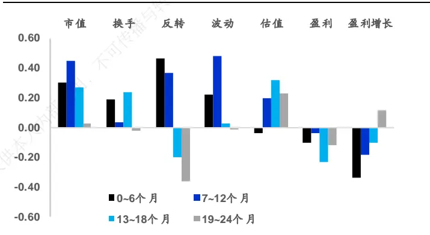
资料来源：Wind，海通证券研究所

图31 配对相关性与正交因子波动（特质收益+“多头”）
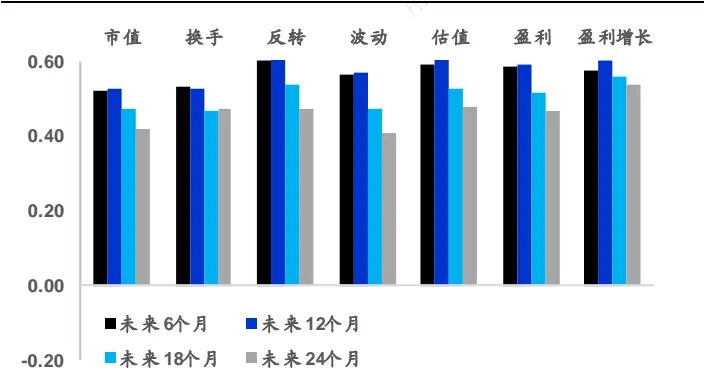
资料来源： ，海通证券研究所

图32 配对相关性与正交因子分段波动（特质收益+“多头”）
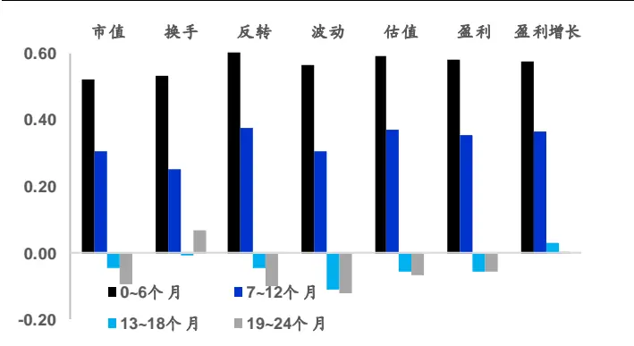
资料来源：Wind，海通证券研究所

## 1.3 本章小结

本章主要对于不同算法下的配对相关性的收益预测能力以及收益波动预测能力进行了回测分析，回测结果表明：

1）使用“多头+空头”以及“多头”的方式计算得到的配对相关性在部分因子上与未来因子收益正相关，并且这种正相关性在使用特质收益计算配对相关性时更加明显。

2）使用“多头+空头”以及“多头”的方式计算得到的配对相关性对于因子未来收益波动的预测能力较强。在引入了特质收益后，指标对于波动的预测能力会进一步提升。

3）指标对于收益以及收益波动的预测能力在正交的因子集合上依旧较为稳定，仅在部分因子上会有小幅变化。

## 2. 因子波动率

系列前期报告在构建波动率这一指标时，考虑到 A股市场做空的限制，因此使用多头组合波动与空头组合波动的比值衡量因子波动率。类似于配对相关性的计算，在部分市场环境下，空头组合并不是一个合适的比较基准。因此可考虑使用因子多头组合波动与市场波动的比值衡量因子波动水平。计算公式如下所示：

$$
FactorVolatility=\frac{vol(r_{\mathit{z}\mathit{z}})}{vol(r_{\mathit{\Pi}\mathit{\hat{p}}\mathit{z}})}
$$

当然，也可将因子多、空两端的波动都纳入考虑，直接使用因子多空波动与市场波动的比值衡量因子波动水平。计算公式如下所示：

$$
FactorVolatility=\frac{vol(r_{\textrm{ \scriptsize 3 5 }})}{vol(r_{\textrm{ \scriptsize \textmu 5 }})}
$$

本章与前一章类似，对于因子拥挤度指标进行了构建，并检验了各个指标在常见选股因子上与未来因子收益以及未来因子收益波动之间的相关性。

## 2.1 原始因子集合回测效果对比

本节对比讨论了各计算方法下的因子波动率在未经正交的原始因子集合上的表现情况。2.1.1 将讨论使用“多头/市场”的方法计算得到的指标的效果；2.1.2 将讨论使用“多空/市场”的方法计算得到的指标的效果。

## 2.1.1使用“多头/市场”计算得到的因子波动率

下图展示了使用“多头/市场”的因子波动率与因子未来 6 个月、12 个月、18 个月以及 24个月收益以及收益波动之间的相关性情况。

图33 因子波动率与收益的相关性（“多头/市场”）
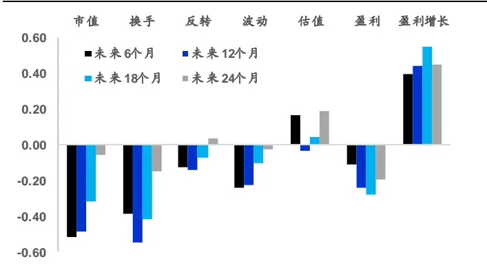
资料来源：Wind，海通证券研究所

图34 因子波动率与分段收益的相关性（“多头/市场”）
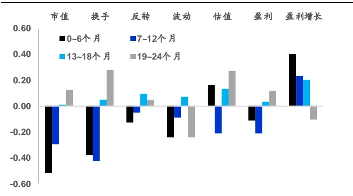
资料来源：Wind，海通证券研究所

图35 因子波动率与波动的相关性（“多头/市场”）
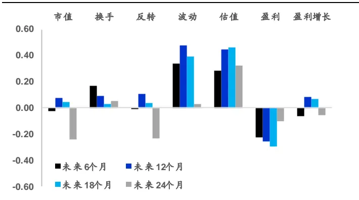
资料来源： ，海通证券研究所

图36 因子波动率与分段波动的相关性（“多头/市场”）
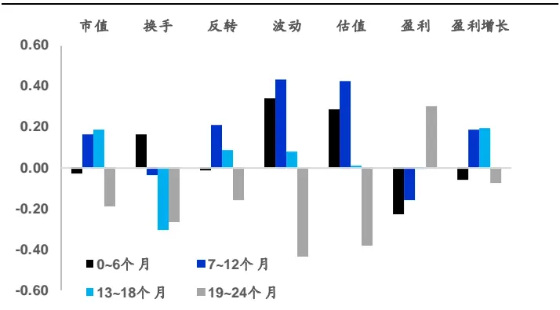
资料来源：Wind，海通证券研究所

观察上图不难发现，相较于系列前期报告中给出的“多头 空头”计算得到的因子波动率，指标并未产生明显提升。从收益预测能力上看，指标在市值以及换手两个因子上呈现出了极强的负相关性，但是在其他因子上的负相关性偏弱，并且在盈利增长因子上与因子未来收益正相关。此外，指标虽然与因子未来收益波动具有一定的正相关性，但是也主要局限于波动以及估值两个因子。下表展示了指标与未来因子收益以及收益波动的相关性情况。

表 9 因子波动率与因子未来收益的相关性（“多头/市场”）

|  | 相关性 |  |  |  | 相关性检验P值 |  |  |  |
| --- | --- | --- | --- | --- | --- | --- | --- | --- |
|  | 因子名称 未来6个月 | 未来12个月 | 未来18个月 | 未来24 个月 |  | 未来6个月 | 未来12个月 | 未来18个月 未来24 个月 |
| 累计收益 | 市值 -0.52 | -0.48 | -0.32 | -0.06 | 0% | 0% | 0% | 56% |
|  | 换手 -0.38 | -0.55 | -0.42 | -0.15 | 0% | 0% | 0% | 14% |
|  | 反转 -0.13 | -0.14 | -0.07 | 0.03 | 16% | 14% | 44% | 73% |
|  | 波动 -0.24 | -0.23 | -0.10 | -0.02 | 1% | 1% | 27% | 81% |
|  | 估值 0.17 | -0.03 | 0.04 | 0.19 | 7% | 74% | 67% | 5% |
|  | 盈利 -0.11 | -0.24 | -0.28 | -0.19 | 23% | 1% | 0% | 5% |
|  | 盈利增长 0.40 | 0.45 | 0.55 | 0.45 | 0% | 0% | 0% | 0% |
| 分段收益 | 因子名称 0~6个月 | 7~12个月 | 13~18个月 | 19~24个月 | 0~6个月 | 7~12个月 | 13~18个月 | 19~24个月 |
|  | 市值 -0.52 | -0.30 | 0.00 | 0.12 | 0% | 0% | 98% | 21% |
|  | 换手 -0.38 | -0.43 | 0.05 | 0.28 | 0% | 0% | 60% | 0% |
|  | 反转 -0.13 | -0.05 | 0.10 | 0.05 | 16% | 59% | 32% | 60% |
|  | 波动 -0.24 | -0.09 | 0.07 | -0.24 | 1% | 32% | 45% | 1% |
|  | 估值 0.17 | -0.21 | 0.14 | 0.27 | 7% | 2% | 15% | 0% |
|  | 盈利 -0.11 | -0.21 | 0.04 | 0.12 | 23% | 2% | 71% | 23% |
|  | 盈利增长 0.40 | 0.24 | 0.20 | -0.10 | 0% | 1% | 3% | 29% |

资料来源： ，海通证券研究所

表 10 因子波动率与因子未来收益波动的相关性（“多头/市场”）

|  | 相关性 |  |  |  | 相关性检验P值 |  |  |  |
| --- | --- | --- | --- | --- | --- | --- | --- | --- |
|  | 因子名称 | 未来6个月 未来12个月 |  | 未来18个月 | 未来24 个月 未来6个月 | 未来12个月 | 未来18个月 | 未来24 个月 |
| 累计收益波动 | 市值 -0.03 | 0.07 | 0.05 | -0.24 | 76% | 43% | 64% | 1% |
|  | 换手 0.17 | 0.09 | 0.03 | 0.05 | 7% | 34% | 75% | 61% |
|  | 反转 -0.01 | 0.10 | 0.04 | -0.24 | 90% | 27% | 68% | 1% |
|  | 波动 0.34 | 0.48 | 0.39 | 0.03 | 0% | 0% | 0% | 78% |
|  | 估值 0.29 | 0.45 | 0.46 | 0.32 | 0% | 0% | 0% | 0% |
|  | 盈利 -0.23 | -0.26 | -0.29 | -0.10 | 1% | 0% | 0% | 30% |
|  | 盈利增长 -0.06 | 0.08 | 0.07 | -0.06 | 50% | 36% | 47% | 54% |
| 分段收益波动 | 因子名称 0~6个月 | 7~12个月 | 13~18个月 |  | 19~24个月 | 0~6个月 7~12个月 | 13~18个月 | 19~24个月 |
|  | 市值 -0.03 | 0.16 | 0.19 | -0.19 | 76% | 8% | 5% | 6% |
|  | 换手 0.17 | -0.04 | -0.30 | -0.27 | 7% | 70% | 0% | 1% |
|  | 反转 -0.01 | 0.21 | 0.09 | -0.16 | 90% | 2% | 37% | 10% |
|  | 波动 0.34 | 0.43 | 0.07 | -0.44 | 0% | 0% | 43% | 0% |
|  | 估值 0.29 | 0.43 | 0.01 | -0.38 | 0% | 0% | 93% | 0% |
|  | 盈利 -0.23 | -0.16 | 0.00 | 0.30 | 1% | 8% | 99% | 0% |
|  | 盈利增长 -0.06 | 0.19 | 0.20 | -0.07 | 50% | 4% | 4% | 45% |

资料来源：Wind，海通证券研究所

## 2.1.2 使用“多空/市场”计算得到的因子波动率

下图展示了使用“多空/市场”的因子波动率与因子未来 6 个月、12 个月、18 个月以及 24个月收益以及收益波动之间的相关性情况。

图37 因子波动率与收益的相关性（“多空/市场”）
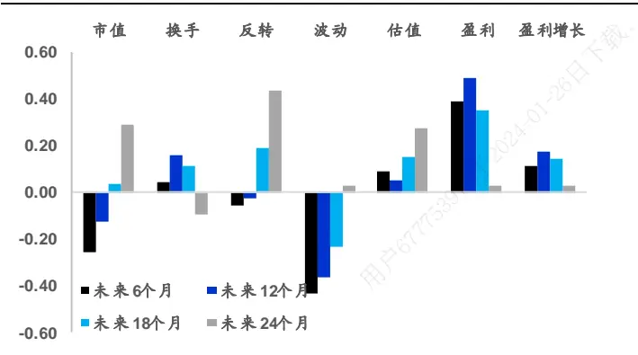
资料来源： ，海通证券研究所

图38 因子波动率与分段收益的相关性（“多空/市场”）
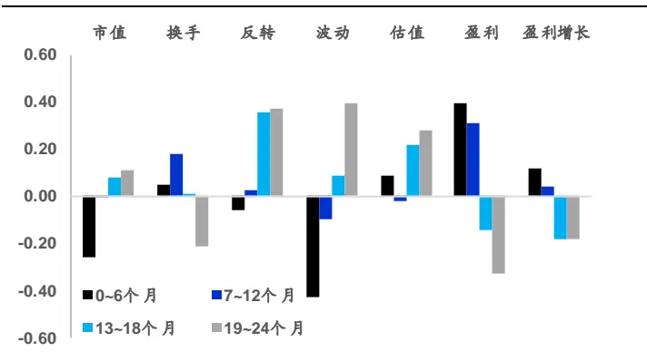
资料来源： ，海通证券研究所

图39 因子波动率与波动的相关性（“多空/市场”）
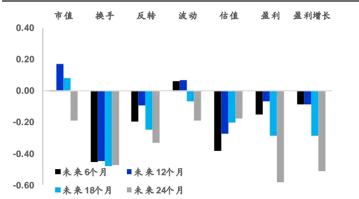
资料来源：Wind，海通证券研究所

图40 因子波动率与分段波动的相关性（“多空/市场”）
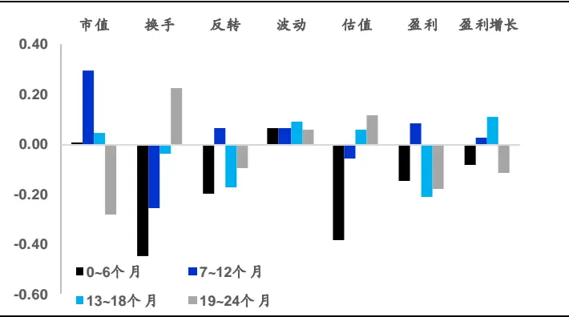
资料来源：Wind，海通证券研究所

观察上图可知，“多空/市场”计算得到的因子波动率对于未来因子收益以及因子收益波动的预测能力较弱。从收益相关性的角度看，指标并未呈现出与未来因子收益负相关。从波动相关性的角度看，指标同样未呈现出于未来因子收益波动正相关。下表展示了指标与未来因子收益以及收益波动的相关性情况。

表 11因子波动率与因子未来收益的相关性（“多头/市场”）

|  | 相关性 |  |  |  | 相关性检验P值 |  |  |  |
| --- | --- | --- | --- | --- | --- | --- | --- | --- |
|  | 因子名称 | 未来6个月 未来12个月 | 未来18个月 | 未来24个月 | 未来6个月 | 未来12个月 | 未来18个月 | 未来24 个月 |
| 累计收益 | 市值 | -0.26 -0.13 | 0.04 | 0.29 | 0% | 16% | 68% | 0% |
|  | 换手 | 0.05 0.16 | 0.11 | -0.09 | 60% | 9% | 24% | 35% |
|  | 反转 | -0.06 -0.03 | 0.19 | 0.44 | 53% | 75% | 4% | 0% |
|  | 波动 -0.43 | -0.36 | -0.24 | 0.03 | 0% | 0% | 1% | 75% |
|  | 估值 0.09 | 0.05 | 0.15 | 0.28 | 32% | 61% | 11% | 0% |
|  | 盈利 0.39 | 0.49 | 0.35 | 0.03 | 0% | 0% | 0% | 78% |
| 分段收益 | 盈利增长 0.12 | 0.17 | 0.14 |  | 0.03 | 20% 6% | 13% | 78% |
|  | 因子名称 0~6个月 | 7~12个月 | 13~18个月 | 19~24个月 | 0~6个月 | 7~12个月 | 13~18个月 | 19~24个月 |
|  | 市值 -0.26 | 0.00 | 0.08 | 0.11 | 0% | 98% | 40% | 26% |
|  | 换手 | 0.05 0.18 | 0.01 | -0.21 | 60% | 5% | 93% | 3% |
|  | 反转 -0.06 | 0.02 | 0.36 | 0.37 | 53% | 80% | 0% | 0% |
|  | 波动 -0.43 | -0.10 | 0.09 | 0.40 | 0% | 27% | 36% | 0% |
|  | 估值 0.09 | -0.02 | 0.22 | 0.28 | 32% | 84% | 2% | 0% |
|  | 盈利 0.39 | 0.31 | -0.14 | -0.33 | 0% | 0% | 13% | 0% |
|  | 盈利增长 | 0.12 0.04 | -0.18 | -0.18 | 20% | 65% | 5% | 6% |

资料来源：Wind，海通证券研究所

表 12因子波动率与因子未来收益波动的相关性（“多头/市场”）

|  | 相关性 |  |  |  | 相关性检验P值 |  |  |
| --- | --- | --- | --- | --- | --- | --- | --- |
|  | 因子名称 未来6个月 | 未来12个月 | 未来18个月 | 未来24 个月 | 未来6个月 未来12个月 | 未来18个月 | 未来24 个月 |
| 累计收益波动 | 市值 0.00 | 0.17 | 0.08 | -0.19 | 98% 6% | 39% | 5% |
|  | 换手 -0.45 | -0.45 | -0.48 | -0.47 | 0% 0% | 0% | 0% |
|  | 反转 -0.20 | -0.10 | -0.25 | -0.33 | 3% 30% | 1% | 0% |
|  | 波动 0.06 | 0.07 | -0.07 | -0.19 | 50% 46% | 49% | 5% |
|  | 估值 -0.39 | -0.27 | -0.20 | -0.18 | 0% 0% | 3% | 7% |
|  | 盈利 -0.15 | -0.07 | -0.29 | -0.59 | 10% 45% | 0% | 0% |
|  | 盈利增长 -0.09 | -0.08 | -0.28 | -0.51 | 34% 36% | 0% | 0% |
| 分段收益波动 | 因子名称 0~6个月 | 7~12个月 | 13~18个月 | 19~24个月 | 0~6个月 7~12个月 | 13~18个月 | 19~24个月 |
|  | 市值 0.00 | 0.30 | 0.04 | -0.28 | 98% 0% | 64% |  |
|  | 换手 -0.45 | -0.26 | -0.04 | 0.22 | 0% 1% | 69% | 0% 2% |
|  | 反转 -0.20 | 0.07 | -0.17 | -0.09 | 3% 48% | 7% | 33% |
|  | 波动 0.06 | 0.07 | 0.09 | 0.06 | 50% 47% | 36% | 55% |
|  | 估值 -0.39 | -0.06 | 0.06 | 0.12 | 0% 52% | 54% | 24% |
|  | 盈利 -0.15 | 0.08 | -0.21 | -0.18 | 10% 36% | 3% | 6% |
|  | 盈利增长 -0.09 | 0.02 | 0.11 | -0.11 | 34% 80% | 25% | 25% |

资料来源： ，海通证券研究所

## 2.2 因子的正交处理对于指标效果的影响

本节回测了因子的正交处理对于指标效果的影响。下图展示了使用“多头/市场”计算得到的因子波动率与因子未来 个月、 个月、 个月以及 个月收益以及收益波动之间的相关性情况。

观察下图可知，指标与因子未来收益之间的负相关性在正交的因子集合上依旧存在，除了在盈利增长因子上依旧观测到了正相关性外，其余因子上都呈现出负相关性。值得注意的是，指标在正交因子集合上与因子未来收益波动之间的正相关性依旧较弱。

图41 因子波动率与正交因子收益（“多头/市场”）
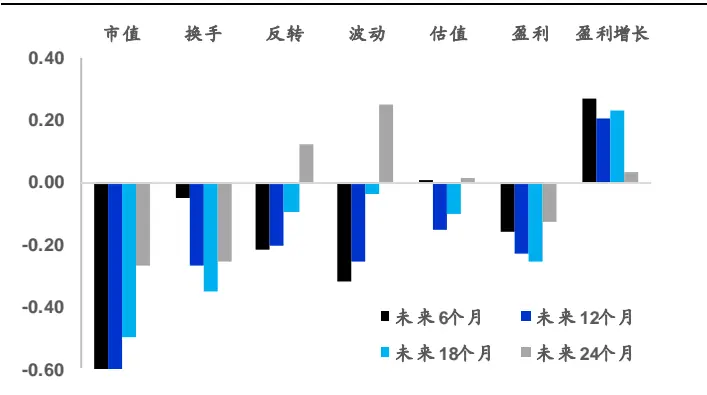
资料来源：Wind，海通证券研究所

图42 因子波动率与正交因子分段收益（“多头/市场”）
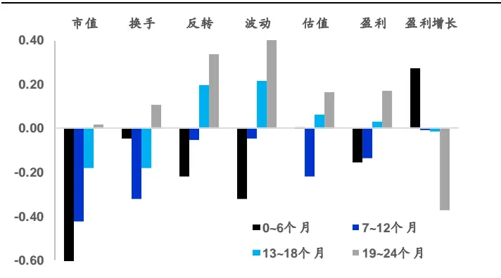
资料来源：Wind，海通证券研究所

图43 因子波动率与正交因子波动（“多头/市场”）
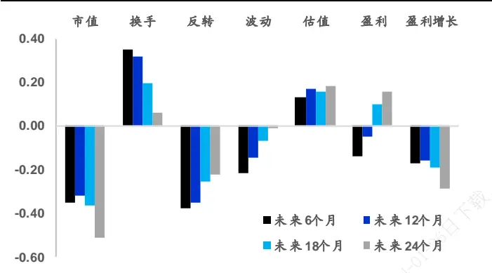
资料来源：Wind，海通证券研究所

图44 因子波动率与正交因子分段波动（“多头/市场”）
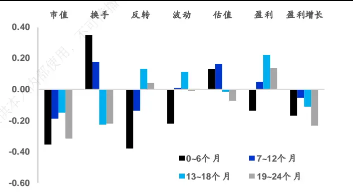
资料来源：Wind，海通证券研究所

下图展示了使用“多空/市场”计算得到的因子波动率与因子未来 6 个月、12 个月、18 个月以及 24 个月收益以及收益波动之间的相关性情况。总体来看，该指标在正交因子上的效果依旧不佳。

图45 因子波动率与正交因子收益（“多空/市场”）
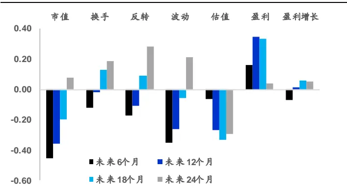
资料来源：Wind，海通证券研究所

图46 因子波动率与正交因子分段收益（“多空/市场”）
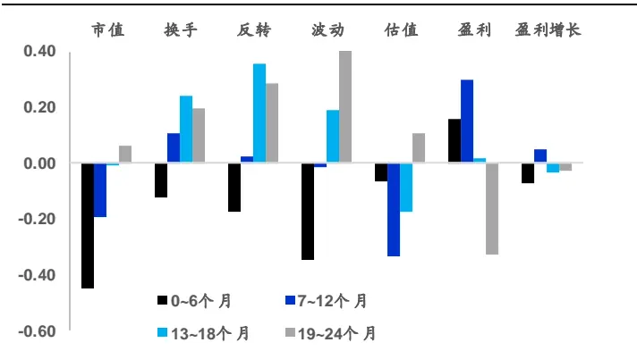
资料来源：Wind，海通证券研究所

图47 因子波动率与正交因子波动（“多空/市场”）
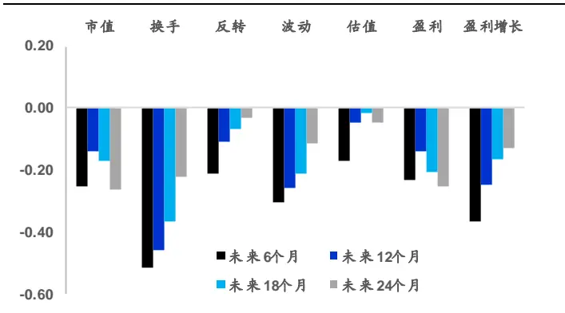
资料来源： ，海通证券研究所

图48 因子波动率与正交因子分段波动（“多空/市场”）
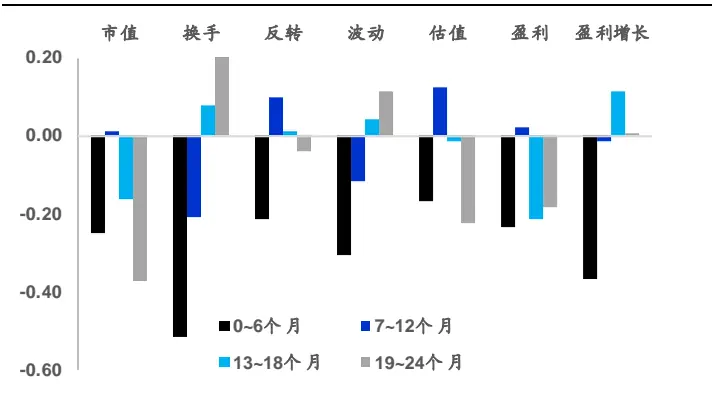
资料来源：Wind，海通证券研究所

## 2.3 本章小结

本章主要对于不同算法下的因子波动率的收益预测能力以及收益波动预测能力进行了回测分析。回测结果表明：

1）使用“多头/市场”的方式计算得到的因子波动率对于未来因子收益具有一定的预测效果，但是指标在原始因子集合上的效果并未明显强于系列前期报告中构建的“多头/空头”的指标。

2）使用“多头/市场”的方式计算得到的因子波动率在正交的因子集合上依旧保留了明显的收益预测能力，但是指标与因子未来收益波动之间的相关性会有所减弱。

3）使用“多空/市场”的方式计算得到的因子波动率在原始因子集合以及正交的因子集合上的预测能力偏弱。

## 3. 总结

本文在系列前期报告的基础上，对于部分因子拥挤度指标的计算方法进行了探讨，旨在对比展示各算法下指标的收益预测能力以及收益波动预测能力，为投资者在构建自己的因子拥挤度框架时提供参考。

对于配对相关性来说，“多头+空头”以及单纯使用“多头”的计算方法能够在一定程度上提升指标对于因子未来收益波动的预测能力，但是指标会在部分因子上呈现出与因子未来收益正相关的现象。在使用特质收益计算配对相关性时，这种正相关性会更加明显，但是指标与因子未来收益波动之间的正相关性也会更加明显。

对于因子波动率来说，“多头/市场”具有相对更好的效果，指标在原始以及正交的因子集合上都与未来因子收益呈现出了一定的负相关性。然而，“多空/市场”的整体效果偏弱，指标无论是在原始因子集合上还是在正交因子集合上都未展现出较好的预测能力。

本文主要对于系列前期报告中涉及的配对相关性以及因子波动率两个指标进行了讨论。然而投资者可使用的拥挤度指标并不仅局限于前文讨论的这几个指标中，投资者同样可尝试使用其他方法和数据构建指标衡量因子拥挤程度。海通量化团队将在接下来发布的专题报告《选股因子系列研究（四十四）——因子拥挤度的扩展》中对于相关内容进行探讨。

## 4. 风险提示

市场系统性风险、资产流动性风险以及政策变动风险会对策略表现产生较大影响。

# 信息披露

分析师声明

[Table冯佳睿yst金融工程研究团队s]

袁林青金融工程研究团队

本人具有中国证券业协会授予的证券投资咨询执业资格，以勤勉的职业态度，独立、客观地出具本报告。本报告所采用的数据和信息均来自市场公开信息，本人不保证该等信息的准确性或完整性。分析逻辑基于作者的职业理解，清晰准确地反映了作者的研究观点，结论不受任何第三方的授意或影响，特此声明。

## 法律声明

本报告仅供海通证券股份有限公司（以下简称“本公司”）的客户使用。本公司不会因接收人收到本报告而视其为客户。在任何情况下，本报告中的信息或所表述的意见并不构成对任何人的投资建议。在任何情况下，本公司不对任何人因使用本报告中的任何内容所引致的任何损失负任何责任。

本报告所载的资料、意见及推测仅反映本公司于发布本报告当日的判断，本报告所指的证券或投资标的的价格、价值及投资收入可能载会波动。在不同时期，本公司可发出与本报告所载资料、意见及推测不一致的报告。

市场有风险，投资需谨慎。本报告所载的信息、材料及结论只提供特定客户作参考，不构成投资建议，也没有考虑到个别客户特殊的可投资目标、财务状况或需要。客户应考虑本报告中的任何意见或建议是否符合其特定状况。在法律许可的情况下，海通证券及其所属不关联机构可能会持有报告中提到的公司所发行的证券并进行交易，还可能为这些公司提供投资银行服务或其他服务。用

本报告仅向特定客户传送，未经海通证券研究所书面授权，本研究报告的任何部分均不得以任何方式制作任何形式的拷贝、复印件或内复制品，或再次分发给任何其他人，或以任何侵犯本公司版权的其他方式使用。所有本报告中使用的商标、服务标记及标记均为本公本司的商标、服务标记及标记。如欲引用或转载本文内容，务必联络海通证券研究所并获得许可，并需注明出处为海通证券研究所，且仅不得对本文进行有悖原意的引用和删改。载，

根据中国证监会核发的经营证券业务许可，海通证券股份有限公司的经营范围包括证券投资咨询业务。日

| 邓勇 | 副所长 | 涂力磊 所长助理 |
| --- | --- | --- |
| (021)23219404 dengyong@htsec.com | (021)23219658 xyg6052@htsec.com | (021)23219747 tll5535@htsec.com |

海通证券股份有限公司研究所[Table_PeopleInfo]

路 颖所长

(021)23219403 luying@htsec.com高道德 副所长(021)63411586 gaodd@htsec.com姜 超副所长

(021)23212042 jc9001@htsec.com

| 宏观经济研究团队 |  |  | 金融工程研究团队 |  | 金融产品研究团队 |  |
| --- | --- | --- | --- | --- | --- | --- |
| 姜超(021)23212042 于 博(021)23219820 |  | jc9001@htsec.com yb9744@htsec.com | 高道德(021)63411586 冯佳睿(021)23219732 | gaodd@htsec.com fengjr@htsec.com | 高道德(021)63411586 | gaodd@htsec.com |
| 李金柳(021)23219885 联系人 |  | ljl11087@htsec.com | 郑雅斌(021)23219395 罗 蕾(021)23219984 | zhengyb@htsec.com | 倪韵婷(021)23219419 陈 瑶(021)23219645 | niyt@htsec.com chenyao@htsec.com |
| 宋 潇(021)23154483 |  | sx11788@htsec.com |  | I19773@htsec.com | 唐洋运(021)23219004 | tangyy@htsec.com |
| 陈 兴(021)23154504 |  |  | 沈泽承(021)23212067 | szc9633@htsec.com | 宋家骥(021)23212231 | sjj9710@htsec.com |
|  |  | cx12025@htsec.com | 余浩淼(021)23219883 | yhm9591@htsec.com | 皮 灵(021)23154168 | pl10382@htsec.com |
|  |  |  | 袁林青(021)23212230 | ylq9619@htsec.com | 徐燕红(021)23219326 | xyh10763@htsec.com |
|  |  |  | 姚 石(021)23219443 吕丽颖(021)23219745 | ys10481@htsec.com | 谈 鑫(021)23219686 | tx10771@htsec.com |
|  |  |  | 周一洋(021)23219774 | lly10892@htsec.com | 王 毅(021)23219819 | wy10876@htsec.com |
|  |  | 联系人 |  | zyy10866@htsec.com | 蔡思圆(021)23219433 | csy11033@htsec.com |
|  |  |  |  |  | 联系人 |  |
|  |  | 张振岗(021)23154386 颜 伟(021)23219914 |  | zzg11641@htsec.com | 庄梓恺(021)23219370 | zzk11560@htsec.com |
|  |  | 梁 镇(021)23219449 | yw10384@htsec.com |  | 谭实宏(021)23219445 | tsh12355@htsec.com |
| 固定收益研究团队 |  |  |  | lz11936@htsec.com |  |  |
|  |  | 策略研究团队 |  |  |  |  |
| 姜 超(021)23212042 |  | jc9001@htsec.com | 荀玉根(021)23219658 | xyg6052@htsec.com | 中小市值团队 |  |
| 朱征星(021)23219981 | zzx9770@htsec.com |  | 钟 青(010)56760096 | zq10540@htsec.com | 张 宇(021)23219583 | zy9957@htsec.com |
| 周 霞(021)23219807 |  | zx6701@htsec.com | 高 上(021)23154132 | gs10373@htsec.com | 钮宇鸣(021)23219420 孔维娜(021)23219223 | ymniu@htsec.com |
| 姜珮珊(021)23154121 |  | 李 | 影(021)23154117 | ly11082@htsec.com | 潘莹练(021)23154122 | kongwn@htsec.com |
| 杜 佳(021)23154149 | jps10296@htsec.com | 姚 佩(021)23154184 | yp11059@htsec.com |  | 联系人 | pyl10297@htsec.com |
| 联系人 | dj11195@htsec.com |  | 周旭辉 zxh12382@htsec.com |  | 王鸣阳(021)23219356 | wmy10773@htsec.com |
| 李 波(021)23154484 Ib11789@htsec.com |  | 联系人 |  |  | 程碧升(021)23154171 | cbs10969@htsec.com |
|  |  |  | 唐一杰(021)23219406 | tyj11545@htsec.com | 相 姜(021)23219945 | xj11211@htsec.com |
|  |  |  | 郑子勋(021)23219733 | zzx12149@htsec.com |  |  |
|  |  |  | 王一潇(021)23219400 | wyx12372@htsec.com |  |  |
| 政策研究团队 |  |  |  |  |  |  |
| 李明亮(021)23219434 |  |  | 石油化工行业 |  | 医药行业 |  |
| 陈久红(021)23219393 | Iml@htsec.com |  | 邓勇(021)23219404 | dengyong@htsec.com | 余文心(0755)82780398 | ywx9461@htsec.com |
|  | chenjiuhong@htsec.com |  | 朱军军(021)23154143 | zjj10419@htsec.com | 郑 琴(021)23219808 | zq6670@htsec.com |
| 吴一萍(021)23219387 | wuyiping@htsec.com | 联系人 |  |  | 联系人 |  |
| 朱 蕾(021)23219946 | zl8316@htsec.com |  | 胡 歆(021)23154505 | hx11853@htsec.com | 贺文斌(010)68067998 | hwb10850@htsec.com |
| 周洪荣(021)23219953 |  | zhr8381@htsec.com | 张 璇(021)23219411 | zx12361@htsec.com | 吴佳栓(010)56760092 | wjs11852@htsec.com |
| 王 旭(021)23219396 |  | wx5937@htsec.com |  |  | 范国钦 02123154384 | fgq12116@htsec.com |
| 汽车行业 |  |  |  |  | 梁广楷(010)56760096 | Igk12371@htsec.com |
| 王 猛(021)23154017 wm10860@htsec.com |  |  | 公用事业 吴 杰(021)23154113 |  | 批发和零售贸易行业 |  |
| 杜 威(0755)82900463 dw11213@htsec.com 联系人 |  |  | 张 磊(021)23212001 | wj10521@htsec.com zl10996@htsec.com | 汪立亭(021)23219399 李宏科(021)23154125 | wanglt@htsec.com |
|  |  |  | 戴元灿(021)23154146 | dyc10422@htsec.com | 联系人 | Ihk11523@htsec.com |
| 曹雅倩(021)23154145 |  | cyq12265@htsec.com | 联系人 |  | 史岳 sy11542@htsec.com |  |
|  |  |  | 傅逸帆(021)23154398 | fyf11758@htsec.com | 高 瑜(021)23219415 gy12362@htsec.com |  |
|  |  |  |  |  | 谢茂萱 xmx12344@htsec.com |  |
| 互联网及传媒 郝艳辉(010)58067906 |  |  | 有色金属行业 |  | 房地产行业 |  |
| 孙小雯(021)23154120 |  | hyh11052@htsec.com sxw10268@htsec.com | 施 毅(021)23219480 联系人 | sy8486@htsec.com | 涂力磊(021)23219747 | tll5535@htsec.com |
| 毛云聪(010)58067907 |  | myc11153@htsec.com | 李姝醒(021)23219401 | lsx11330@htsec.com | 谢 盐(021)23219436 | xiey@htsec.com |
| 联系人 |  |  | 陈晓航(021)23154392 | cxh11840@htsec.com | 杨 凡(021)23219812 金 晶(021)23154128 | yf11127@htsec.com |
| 陈星光(021)23219104 |  | cxg11774@htsec.com | 甘嘉尧(021)23154394 | gjy11909@htsec.com |  | jj10777@htsec.com |
| 电子行业 |  |  | 煤炭行业 |  | 电力设备及新能源行业 |  |
| 陈 平(021)23219646 |  | cp9808@htsec.com | 李 淼(010)58067998 | Im10779@htsec.com | 张一弛(021)23219402 | zyc9637@htsec.com |
| 尹 苓(021)23154119 | yl11569@htsec.com |  | 戴元灿(021)23154146 | dyc10422@htsec.com | 房 青(021)23219692 | fangq@htsec.com |
| 谢 磊(021)23212214 | xl10881@htsec.com |  | 吴 杰(021)23154113 | wj10521@htsec.com | 曾 彪(021)23154148 | zb10242@htsec.com |
| 联系人 |  | 联系人 |  |  | 徐柏乔(021)23219171 | xbq6583@htsec.com |
|  | 石 坚(010)58067942 sj11855@htsec.com |  |  |  |  |  |
|  |  |  | 王 涛(021)23219760 | wt12363@htsec.com | 张向伟(021)23154141 | zxw10402@htsec.com |
|  |  |  |  |  | 联系人 |  |

| 非银行金融行业 |  | 交通运输行业 |  | 纺织服装行业 |
| --- | --- | --- | --- | --- |
|  | 孙 婷(010)50949926 st9998@htsec.com | 虞 楠(021)23219382 yun@htsec.com |  | 梁 希(021)23219407 lx11040@htsec.com |
|  | 何 婷(021)23219634 ht10515@htsec.com |  | 罗月江（010）56760091 lyj12399@htsec.com | 联系人 |
| 联系人 | 李芳洲(021)23154127 Ifz11585@htsec.com | 联系人 |  | 盛 开(021)23154510 sk11787@htsec.com |
|  |  |  | 李 丹(021)23154401 Id11766@htsec.com 党新龙(0755)82900489 dxl12222@htsec.com | 刘 溢(021)23219748 ly12337@htsec.com |

| 基础化工行业 | 计算机行业 | 通信行业 |
| --- | --- | --- |
| 刘 威(0755)82764281 Iw10053@htsec.com | 郑宏达(021)23219392 zhd10834@htsec.com | 朱劲松(010)50949926 zjs10213@htsec.com |
| 刘海荣(021)23154130 Ihr10342@htsec.com | 杨 林(021)23154174 yl11036@htsec.com | 余伟民(010)50949926 ywm11574@htsec.com |
| 张翠翠(021)23214397 zcc11726@htsec.com | 鲁 立(021)23154138 II1383@htsec.com | 张 弋 01050949962 zy12258@htsec.com |
| 孙维容(021)23219431 swr12178@htsec.com 联系人 | 于成龙 ycl12224@htsec.com 黄竞晶(021)23154131 hjj10361@htsec.com | 张峥青(021)23219383 zzq11650@htsec.com |
| 李 智(021)23219392 lz11785@htsec.com | 联系人 |  |
|  | 洪 琳(021)23154137 hl11570@htsec.com |  |

| 家电行业 | 造纸轻工行业 |  |
| --- | --- | --- |
| 陈子仪(021)23219244 chenzy@htsec.com | 衣桢永(021)23212208 yzy12003@htsec.com |  |
| 李 阳(021)23154382 ly11194@htsec.com | 曾 知(021)23219810 zz9612@htsec.com |  |
| 联系人 |  | 赵 洋(021)23154126 zy10340@htsec.com |
| 朱默辰(021)23154383 zmc11316@htsec.com | -01-26 |  |
| 刘 璐(021)23214390 II11838@htsec.com |  |  |

## 研究所销售团队

深广地区销售团队

蔡铁清(0755)82775962 ctq5979@htsec.com

伏财勇(0755)23607963 fcy7498@htsec.com

辜丽娟(0755)83253022 gulj@htsec.com

刘晶晶(0755)83255933 liujj4900@htsec.com

王雅清(0755)83254133 wyq10541@htsec.com

饶 伟(0755)82775282 rw10588@htsec.com

欧阳梦楚(0755)23617160

oymc11039@htsec.com

宗 亮 zl11886@htsec.com

巩柏含 gbh11537@htsec.com

上海地区销售团队
胡雪梅(021)23219385 huxm@htsec.com
朱 健(021)23219592 zhuj@htsec.com
季唯佳(021)23219384 jiwj@htsec.com
黄 毓(021)23219410 huangyu@htsec.com
漆冠男(021)23219281 qgn10768@htsec.com
胡宇欣(021)23154192 hyx10493@htsec.com
黄 诚(021)23219397 hc10482@htsec.com
毛文英(021)23219373 mwy10474@htsec.com
马晓男 mxn11376@htsec.com
杨祎昕(021)23212268 yyx10310@htsec.com
张思宇 zsy11797@htsec.com
慈晓聪(021)23219989 cxc11643@htsec.com
王朝领 wcl11854@htsec.com
邵亚杰 23214650 syj12493@htsec.com
李 寅 021-23219691 ly12488@htsec.com
北京地区销售团队
殷怡琦(010)58067988 yyq9989@htsec.com
郭 楠 010-5806 7936 gn12384@htsec.com
吴 尹 wy11291@htsec.com
张丽萱(010)58067931 zlx11191@htsec.com
杨羽莎(010)58067977 yys10962@htsec.com
杜 飞 df12021@htsec.com
张 杨(021)23219442 zy9937@htsec.com
何 嘉(010)58067929 hj12311@htsec.com
李 婕 lj12330@htsec.com
欧阳亚群 oyyq12331@htsec.com

海通证券股份有限公司研究所

地址：上海市黄浦区广东路 689号海通证券大厦 9楼

电话：（021）23219000

传真：（021）23219392

网址：www.htsec.com