## [Tab相关研究

Table_ReportInfo]《选股因子系列研究（四十三）——因子

拥挤度的改进》2019.01.28

《债基量化研究系列 1——如何评估债基

的股债配臵能力？》2019.01.28

《中美股票市场指数的季节效应》

2019.01.22

分析师:冯佳睿

Tel:(021)23219732

Email:fengjr@htsec.com

证书:S0850512080006

分析师:袁林青

Tel:(021)23212230

Email:ylq9619@htsec.com

证书:S0850516050003

# 选股因子系列研究（四十四）——因子拥挤度的扩展

## 投资要点：

近年来，随着因子投资的兴起，因子拥挤（Factor Crowding）也逐渐受到投资者的关注。所谓因子拥挤，是指由于跟踪或者投资某一因子的资金过多而使得该因子的收益性或者收益稳定性下降的现象。由于这一现象的存在，度量因子拥挤度就显得至关重要。

在系列专题报告《选股因子系列（四十二）——因子失效预警：因子拥挤》以及《选股因子系列研究（四十三）——因子拥挤度的改进》中，我们已经对因子拥挤度指标的构建进行了深入讨论。考虑到因子拥挤度的度量指标并不仅仅局限于系列前期报告所涉及的 类指标中，本文尝试引入了更多的拥挤度指标，希望能够为搭建因子拥挤度监控框架的投资者提供更多的参考。

- 资产集中度对于因子未来收益具有一定的预测能力，但是在部分因子上会与因子未来收益正相关。指标对于因子未来收益的预测能力在正交的因子集合上依然存在。在原始因子集合上，资产集中度对因子未来收益波动同样具有预测能力，但是在正交的因子集合上，指标的波动预测能力会大幅减弱。

- 机构持仓类指标在原始因子集合上预测效果偏弱。使用公募基金季度披露的前大持仓数据构建得到的机构持仓集中度指标在原始因子集合上的预测能力较弱，无论是机构持仓金额比还是机构持仓市值比都未呈现出较好的预测能力。在正交的因子集合上，机构持仓市值比具有一定的预测能力。指标在波动、估值、盈利以及盈利增长等因子上与因子未来收益负相关。同时，指标在部分因子上具有波动预测能力。

- 各拥挤度指标之间存在一定的相关性。估值价差与长期收益反转正相关，因子波动率与资产集中度正相关。

- 大部分拥挤度指标对于选股空间的变化并不是特别敏感。大部分的拥挤度指标在全市场以及在中证 800 内的预测能力较为接近，但是配对相关性对于选股空间的变化极为敏感。

- 风险提示。市场系统性风险、资产流动性风险以及政策变动风险会对策略表现产生较大影响。

近年来，随着因子投资的兴起，因子拥挤（Factor Crowding）也逐渐受到投资者的关注。所谓因子拥挤，是指由于跟踪或者投资某一因子的资金过多而使得该因子的收益性或者收益稳定性下降的现象。由于这一现象的存在，度量因子拥挤度就显得至关重要。

在系列专题报告《选股因子系列（四十二）——因子失效预警：因子拥挤》以及《选股因子系列研究（四十三）——因子拥挤度的改进》中，我们已经对因子拥挤度指标的构建进行了深入讨论。考虑到因子拥挤度的度量指标并不仅仅局限于系列前期报告所涉及的 类指标中，本文尝试引入了更多的拥挤度指标，希望能够为搭建因子拥挤度监控框架的投资者提供更多的参考。

参考海外研究成果，可引入资产集中度（Asset Centrality）作为因子拥挤度的度量指标。更多信息可参考专题报告《量化研究新思维（十三）——拥挤交易对于板块轮动以及因子择时的指示意义》。本文将在第一章中对于该指标的效果进行展示。

此外，考虑到现有的拥挤度指标多基于交易数据计算得到，我们同样可使用季度披露的机构持仓数据进行指标构建。在第二章中，本文将尝试构建持仓类指标，并对于相关指标的效果进行回测。

除了尝试引入更多的指标外，本文也展示了前期报告涉及的因子拥挤度指标之间的相关性情况以及选股空间对于指标效果的影响。

本文分为六个部分，第一部分讨论了资产集中度的回测效果，第二部分讨论了基于基金持仓类数据构建得到的机构持仓集中度类指标的回测效果，第三部分简要展示了各类拥挤度指标之间的相关性情况，第四部分讨论了选股空间对于拥挤度指标效果的影响，第五部分对于全文进行了总结，第六部分提示了模型风险。

## 1. 资产集中度

海外相关研究使用相对估值以及资产集中度两个指标进行了板块轮动以及因子择时。考虑到前期报告中已经对于估值价差进行了讨论，因此本节将着重讨论资产集中度的指标效果。

在因子层面，资产集中度度量了因子的多头组合对于市场波动的解释能力。因子多头组合的波动解释能力越强，越代表该因子是当前市场波动的主要来源，该因子拥挤度越高。该指标主要基于对因子分组股票的收益序列进行主成分分析的结果。该指标的计算公式如下所示：

$$
C_{i}=\frac{{\displaystyle\sum}_{j=1}^{n}AR^{j}\ast\frac{\left|EV_{i}^{j}\right|}{\sum_{k=1}^{N}\left|EV_{k}^{j}\right|}}{\sum_{j=1}^{n}AR^{j}}
$$

$$
AR^{j}=\frac{\sigma_{Ej}^{2}}{\sum_{k=1}^{N}\sigma_{Ak}^{2}},
$$

其中， $\complement_{\mathrm{i}}$ 为第 i个因子股票组合的资产集中度， $\mathsf{AR^{j}}$ 为吸收比率，其代表第 j个主成分对于总波动的解释比率， $\mathsf{EV_{i}^{j}}$ 为特征向量 中的第 个特征值， $\sigma_{Ej}^{2}$ 为第 个主成分的方差，$\sigma_{Ak}^{2}$ 为第 k 个因子组合的收益序列的方差。在该指标的计算公式中，共有两个参数，一个参数为 n，即为使用前 n 个主成分计算集中度，另外一个参数为使用历史多长的数据进行主成分分析。本文在回测相关指标时，n 取值为 1 且使用了历史 3个月的数据进行主成分分析。每个因子取多头组合的资产集中度作为当期的该因子的资产集中度。

本文在进行指标效果回测时，除了对于指标计算方法进行调整外，统一沿用《选股因子系列（四十二）——因子失效预警：因子拥挤》中的处理以及设定，主要使用了 2008年至 2018 年的相关数据进行回测，展示指标与未来因子收益以及收益波动之间的相关性情况。本文所有图表所使用的数据区间为 2008 年 1 月至 2018 年 12 月。

本文在测试拥挤度指标效果时，主要在市值、换手、反转、波动、估值、盈利以及盈利增长 7 个因子上构建指标并进行回测。在计算因子拥挤度指标时，各因子的多头组合分别为：市值最小的 10%的股票、前期日均换手最低的 10%的股票、前期涨幅最低的10%的股票、前期波动最低的 10%的股票、估值最低的 10%的股票、盈利最高的 10%的股票以及盈利增长最强的 10%的股票。

## 1.1 指标收益预测能力以及收益波动预测能力

下图展示了资产集中度与因子未来 6个月、12 个月、18 个月以及 24 个月收益以及收益波动之间的相关性情况。

图1 资产集中度与收益的相关性
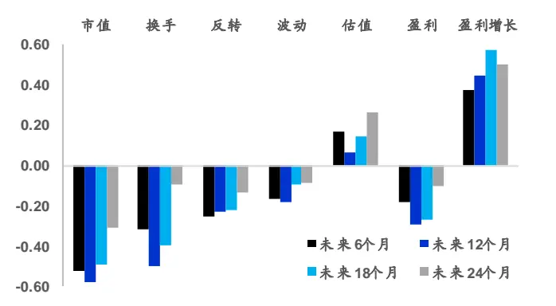
资料来源：Wind，海通证券研究所

图2 资产集中度与分段收益的相关性
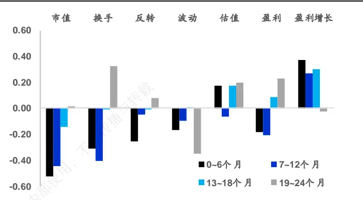
资料来源：Wind，海通证券研究所

图3 资产集中度与波动的相关性
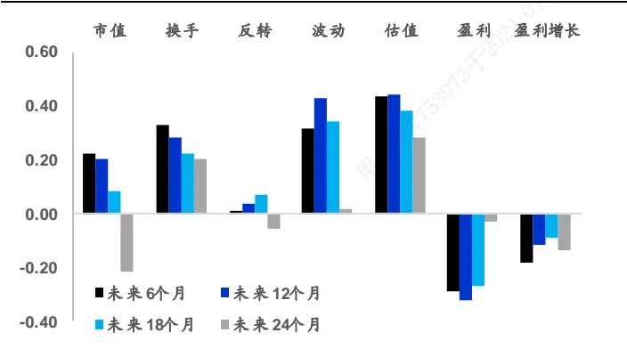
资料来源：Wind，海通证券研究所

图4 资产集中度与分段波动的相关性
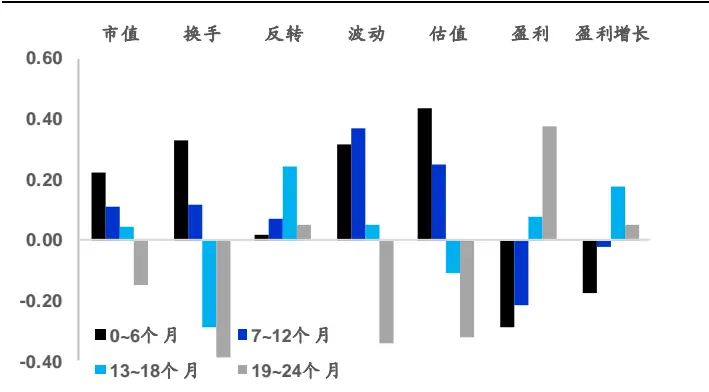
资料来源：Wind，海通证券研究所

整体来说，资产集中度具有一定的预测能力。从收益预测能力上看，除了在估值以及盈利增长因子上呈现出了正相关性以外，资产集中度与未来因子收益负相关。并且该指标与市值因子以及换手因子未来收益的负相关性较强。从收益波动预测能力上看，除了在反转、盈利以及盈利增长两个因子上与未来因子收益波动负相关或者弱相关外，资产集中度在大部分因子上与因子未来收益波动正相关。

下表展示了资产集中度与未来因子收益、未来因子收益波动的相关性情况。

表 1 资产集中度与因子未来收益的相关性

|  | 相关性 |  |  |  | 相关性检验P值 |  |  |  |
| --- | --- | --- | --- | --- | --- | --- | --- | --- |
|  | 因子名称 | 未来6个月 | 未来12个月 | 未来18个月 | 未来24 个月 未来6个月 | 未来12个月 | 未来18个月 | 未来24 个月 |
| 累计收益 | 市值 -0.52 | -0.58 | -0.49 | -0.31 | 0% | 0% | 0% | 0% |
|  | 换手 | -0.32 -0.50 | -0.40 | -0.10 | 0% | 0% | 0% | 32% |
|  | 反转 -0.25 | -0.23 | -0.22 | -0.13 | 0% | 1% | 2% | 18% |
|  | 波动 -0.17 | -0.18 | -0.09 | -0.08 | 7% | 5% | 34% | 39% |
|  | 估值 0.17 | 0.07 | 0.15 | 0.26 | 6% | 48% | 13% | 1% |
|  | 盈利 -0.18 | -0.29 | -0.27 | -0.10 | 4% | 0% | 0% | 30% |
| 分段收益 | 盈利增长 0.37 | 0.45 | 0.57 | 0.50 | 0% | 0% | 0% | 0% |
|  | 因子名称 0~6个月 | 7~12个月 | 13~18个月 | 19~24个月 | 0~6个月 | 7~12个月 | 13~18个月 | 19~24个月 |
|  | 市值 -0.52 | -0.44 | -0.14 | 0.02 | 0% | 0% | 13% | 85% |
|  | 换手 -0.32 | -0.41 | -0.01 | 0.33 | 0% | 0% | 94% | 0% |
|  | 反转 -0.25 | -0.05 | 0.00 | 0.08 | 0% | 57% | 98% | 40% |
|  | 波动 -0.17 | -0.10 | 0.01 | -0.35 | 7% | 30% | 94% | 0% |
|  | 估值 0.17 | -0.06 | 0.18 | 0.20 | 6% | 49% | 6% | 4% |
|  | 盈利 -0.18 | -0.21 | 0.09 | 0.23 | 4% | 3% | 35% | 2% |
|  | 盈利增长 0.37 | 0.27 | 0.31 | -0.03 | 0% | 0% | 0% | 80% |

资料来源：Wind，海通证券研究所

表 2 资产集中度与因子未来收益波动的相关性

|  | 相关性 |  |  |  | 相关性检验P值 |  |  |  |
| --- | --- | --- | --- | --- | --- | --- | --- | --- |
|  | 因子名称 | 未来6个月 | 未来12个月 | 未来18个月 | 未来24个月 | 未来6个月 未来12个月 | 未来18个月 | 未来24 个月 |
| 累计收益波动 | 市值 | 0.22 | 0.21 | 0.08 | -0.22 | 1% 3% | 38% | 3% |
|  | 换手 | 0.33 | 0.28 | 0.22 | 0.20 | 0% 0% | 2% | 4% |
|  | 反转 | 0.01 | 0.04 | 0.07 | -0.06 | 87% 66% | 44% | 57% |
|  | 波动 | 0.32 | 0.43 | 0.34 | 0.02 | 0% 0% | 0% | 87% |
|  | 估值 | 0.44 | 0.44 | 0.38 | 0.28 | 0% 0% | 0% | 0% |
|  | 盈利 | -0.29 | -0.32 | -0.27 | -0.03 | 0% 0% | 0% | 76% |
|  | 盈利增长 | -0.18 | -0.11 | -0.09 | -0.13 5% | 23% | 34% | 17% |
| 分段收益波动 | 因子名称 | 0~6个月 | 7~12个月 | 13~18个月 | 19~24个月 | 0~6个月 7~12个月 | 13~18个月 | 19~24个月 |
|  | 市值 | 0.22 | 0.11 | 0.04 | 1% | 23% | 65% |  |
|  | 换手 | 0.33 | 0.12 | -0.29 | -0.15 -0.39 | 0% | 0% | 12% |
|  | 反转 | 0.01 | 0.07 | 0.25 | 0.05 | 21% 87% 45% | 1% | 0% 62% |
|  | 波动 | 0.32 | 0.37 | 0.05 | -0.34 | 0% 0% | 58% | 0% |
|  | 估值 | 0.44 | 0.25 | -0.11 | -0.32 | 0% 1% | 24% | 0% |
|  | 盈利 | -0.29 | -0.21 0.08 | 0.37 | 0% | 2% | 40% | 0% |
|  | 盈利增长 | -0.18 | -0.02 | 0.18 | 0.05 | 5% 84% | 6% | 61% |

资料来源： ，海通证券研究所

## 1.2 因子正交处理对于指标预测能力的影响

由于很多投资者在使用因子时或多或少都会对于因子进行正交化的处理。因此本节将在一个两两正交的因子集合上，回测各算法下因子拥挤度指标与未来因子收益以及收益波动的相关性情况。关于因子正交的处理细节可参考专题报告《选股因子系列研究(十七)——选股因子的正交》。

下图展示了资产集中度与因子未来 6个月、12 个月、18 个月以及 24 个月收益以及收益波动之间的相关性情况。

从收益预测能力上看，指标在部分因子上的效果略有改进，如，估值以及盈利增长因子。在原始因子集合上，指标与上述两因子未来收益正相关，但是在正交的因子集合上，指标与两因子未来收益间的正相关性出现了明显减弱。

从收益波动预测能力上看，指标对于因子收益波动的预测能力出现了明显减弱。在正交的因子集合上，指标仅与换手以及估值两因子未来的收益波动正相关。

图5 资产集中度与正交因子收益的相关性
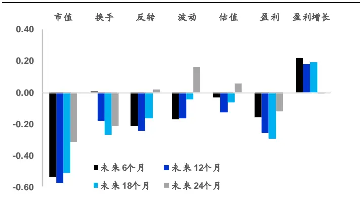
资料来源：Wind，海通证券研究所

图6 资产集中度与正交因子分段收益的相关性
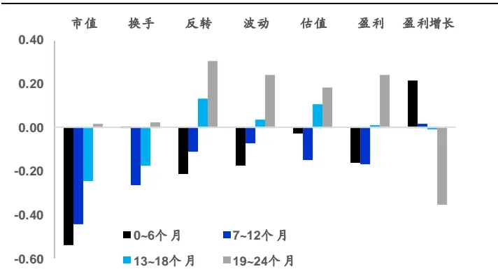
资料来源：Wind，海通证券研究所

图7 资产集中度与正交因子波动的相关性
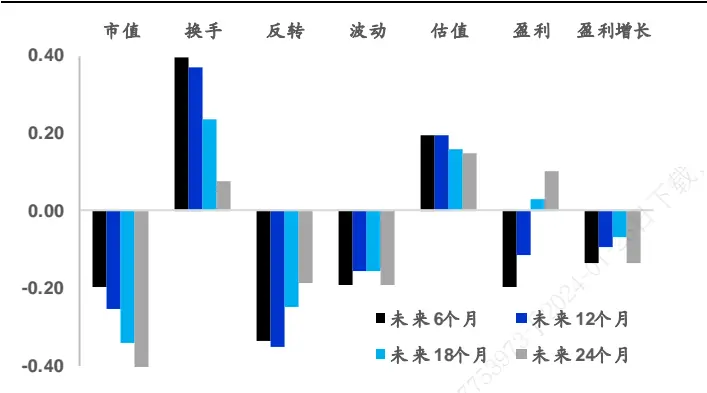
资料来源：Wind，海通证券研究所

图8 资产集中度与正交因子分段波动的相关性
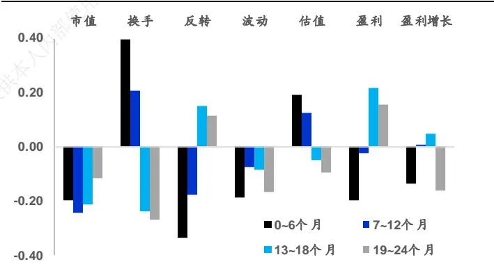
资料来源：Wind，海通证券研究所

## 1.3 本章小结

基于本章的回测结果，可得到以下结论：

1） 资产集中度对于因子未来收益具有一定的预测能力，但是在部分因子上会与因子未来收益正相关。指标对于因子未来收益的预测能力在正交的因子集合上依然存在。

2） 资产集中度在原始因子集合上对因子未来收益波动具有一定的预测能力，但是在正交的因子集合上，指标的波动预测能力会大幅减弱。

## 2. 机构持仓集中度

系列前期报告回测分析的拥挤度指标大多从量价的角度对于投资者行为结果进行刻画，从而间接地刻画因子的拥挤程度。本章将尝试使用机构持仓数据构建机构持仓集中度指标，使用更加直接的逻辑刻画因子的拥挤程度。需要注意的是，由于信息披露的滞后，机构持仓类指标天然具有较强的滞后性。

由于公募基金的季度持仓数据为投资者能够拿到的最及时的机构持仓数据，本章在构建相关指标时，主要基于公募基金季度持仓进行指标加工。由于我们是在月末对于因子拥挤度进行计算，因此本章在回测时统一在每年 1 月末、4月末、7 月末以及 10月末更新基金前 10大持仓数据。

本章在统计持仓数据时，主要选取了主动股票开放型、主动混合封闭型、偏股混合型、平衡混合型、灵活混合型、灵活策略混合型、对冲策略混合型、复制股票指数型、增强股票指数型以及股票 ETF所披露的持仓数据。（相关产品分类可参考海通证券研究所金融产品研究中心提供的基金分类）

本章分别构建了机构持仓金额比以及机构持仓市值比两个指标，指标计算方法如下所示：

$$
机构持仓金额比=\frac{因子多头组合股票公募基金前10大持仓总金额}{公募基金前10大持仓总金额}
$$

$$
机构持仓市值比=\frac{因子多头组合股票公募基金前10大持仓总金额}{多头组合股票总市值}
$$

## 2.1 指标收益预测能力以及收益波动预测能力

本部分对于机构持仓金额比以及机构持仓市值比两个指标的效果进行了回测。2.1.1展示了机构持仓金额比的效果，2.1.2 展示了机构持仓市值比的效果。

## 2.1.1 机构持仓金额比

下图展示了机构持仓金额比与因子未来 6个月、12 个月、18 个月以及 24 个月收益以及收益波动之间的相关性情况。

整体来看，指标的预测能力偏弱。从收益预测能力来看，指标除了与盈利增长因子未来收益之间的负相关性较为明显外，该指标在其余因子上与未来因子收益相关性偏弱或者存在微弱的正相关性。从收益波动预测能力来看，指标在换手以及估值两个因子上与未来因子收益波动正相关，但是在其余因子上指标与未来因子收益波动之间的相关性较弱，甚至负相关。

图 机构持仓金额比与收益的相关性
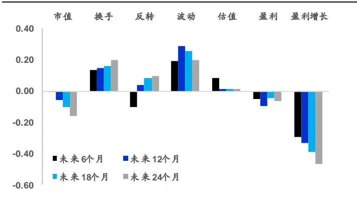
资料来源：Wind，海通证券研究所

图10 机构持仓金额比与分段收益的相关性
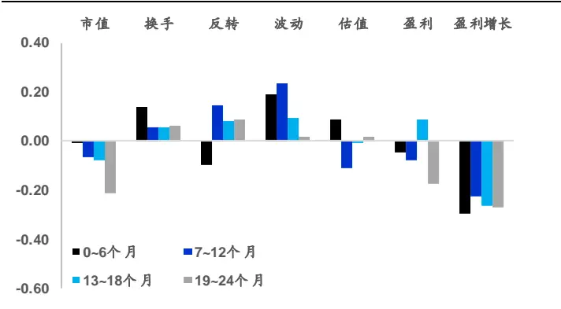
资料来源：Wind，海通证券研究所

图11 机构持仓金额比与波动的相关性
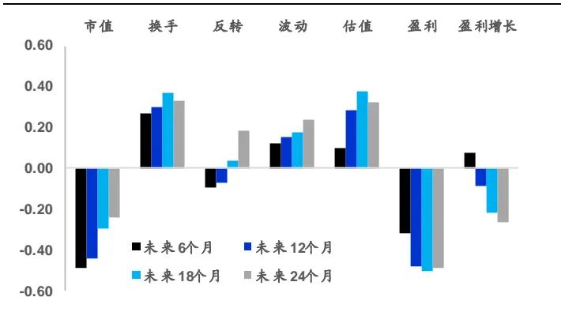
资料来源：Wind，海通证券研究所

图12 机构持仓金额比与分段波动的相关性
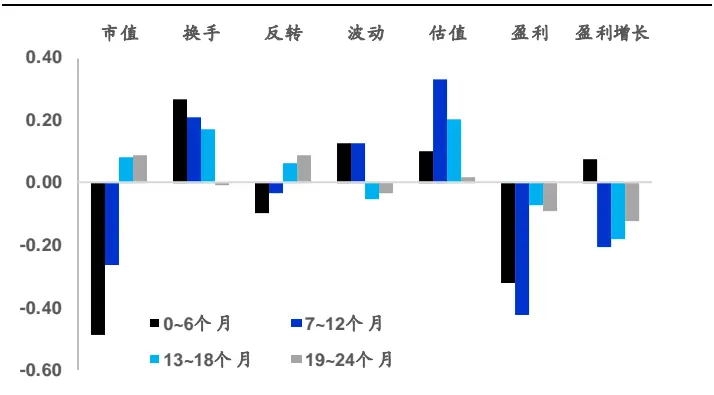
资料来源：Wind，海通证券研究所

下表展示了机构持仓金额比与未来因子收益、未来因子收益波动的相关性情况。

表 3 机构持仓金额比与因子未来收益的相关性

|  | 相关性 |  |  |  |  | 相关性检验P值 |  |  |  |
| --- | --- | --- | --- | --- | --- | --- | --- | --- | --- |
|  |  | 未来6个月 | 未来12个月 | 未来18个月 | 未来 24 个月 | 未来6个月 | 未来12 个月 | 未来18个月 | 未来 24 个月 |
| 累计收益 | 因子名称 市值 | 0.00 | -0.05 | -0.10 | -0.16 | 98% | 56% | 28% | 9% |
|  | 换手 | 0.14 | 0.15 | 0.16 | 0.20 | 12% | 11% | 8% | 3% |
|  | 反转 | -0.10 | 0.04 | 0.08 | 0.10 | 27% | 68% | 38% | 30% |
|  | 波动 | 0.19 | 0.29 | 0.26 | 0.20 | 3% | 0% | 1% | 4% |
|  | 估值 | 0.09 | 0.02 | 0.02 | 0.01 | 33% | 86% | 87% | 88% |
|  | 盈利 | -0.05 | -0.09 | -0.04 | -0.06 | 59% | 30% | 64% | 51% |
|  | 盈利增长 | -0.30 | -0.33 | -0.39 | -0.47 | 0% | 0% | 0% | 0% |
| 分段收益 | 因子名称 | 0~6个月 | 7~12个月 | 13~18个月 | 19~24 个月 | 0~6个月 | 7~12个月 | 13~18个月 | 19~24个月 |
|  | 市值 | 0.00 | -0.06 | -0.08 | -0.21 | 98% | 48% | 40% |  |
|  | 换手 | 0.14 | 0.06 | 0.05 | 0.06 | 12% | 54% | 56% | 3% 51% |
|  | 反转 | -0.10 | 0.15 | 0.08 | 0.09 | 27% | 10% | 38% | 35% |
|  | 波动 | 0.19 | 0.23 | 0.10 | 0.02 | 3% | 1% | 30% | 83% |
|  | 估值 | 0.09 | -0.11 | 0.00 | 0.02 | 33% | 22% | 97% | 86% |
|  | 盈利 | -0.05 | -0.08 | 0.09 | -0.17 | 59% | 40% | 36% | 7% |
|  | 盈利增长 | -0.30 | -0.23 | -0.27 | -0.27 | 0% | 1% | 0% | 0% |

资料来源： ，海通证券研究所

表 4 机构持仓金额比与因子未来收益波动的相关性

|  | 相关性 |  |  |  | 相关性检验P值 |  |  |  |
| --- | --- | --- | --- | --- | --- | --- | --- | --- |
|  | 因子名称 未来6个月 | 未来12个月 | 未来18个月 | 未来24个月 | 未来6个月 | 未来12个月 | 未来18个月 | 未来24 个月 |
| 累计收益波动 | 市值 -0.49 | -0.44 | -0.30 | -0.24 | 0% | 0% | 0% | 1% |
|  | 换手 0.27 | 0.30 | 0.37 | 0.33 | 0% | 0% | 0% | 0% |
|  | 反转 -0.10 | -0.08 | 0.04 | 0.19 | 27% | 41% | 70% | 5% |
|  | 波动 0.12 | 0.15 | 0.17 | 0.24 | 16% | 9% | 6% | 1% |
|  | 估值 0.10 | 0.28 | 0.37 | 0.32 | 26% | 0% | 0% | 0% |
|  | 盈利 -0.32 | -0.48 | -0.50 | -0.49 | 0% | 0% | 0% | 0% |
|  | 盈利增长 0.08 | -0.09 | -0.22 | -0.26 | 40% | 32% | 2% | 1% |
| 分段收益波动 | 因子名称 0~6个月 | 7~12个月 | 13~18个月 | 19~24个月 | 0~6个月 | 7~12个月 | 13~18个月 | 19~24个月 |
|  | 市值 -0.49 | -0.26 | 0.08 | 0.09 | 0% | 0% | 39% |  |
|  | 换手 0.27 | 0.21 | 0.17 | -0.01 | 0% | 2% | 6% | 36% 93% |
|  | 反转 -0.10 | -0.03 | 0.06 | 0.09 | 27% | 72% | 50% | 35% |
|  | 波动 0.12 | 0.13 | -0.06 | -0.03 | 16% | 17% | 55% | 73% |
|  | 估值 0.10 | 0.33 | 0.20 | 0.02 | 26% | 0% | 3% | 84% |
|  | 盈利 -0.32 | -0.42 | -0.08 | -0.09 | 0% | 0% | 42% | 34% |
|  | 盈利增长 0.08 | -0.21 | -0.18 | -0.12 | 40% | 2% | 5% | 19% |

资料来源：Wind，海通证券研究所

## 2.1.2 机构持仓市值比

下图展示了机构持仓市值比与因子未来 6个月、12 个月、18 个月以及 24 个月收益以及收益波动之间的相关性情况。

图 机构持仓市值比与收益的相关性
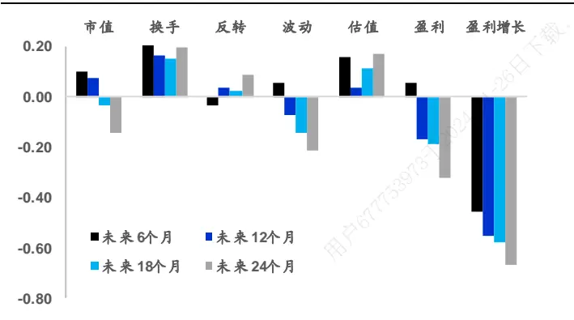
资料来源： ，海通证券研究所

图 机构持仓市值比与分段收益的相关性
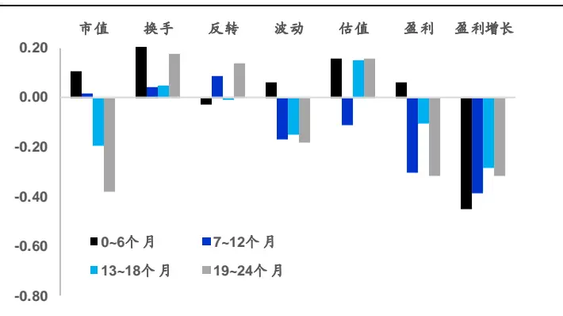
资料来源： ，海通证券研究所

图15 机构持仓市值比与波动的相关性
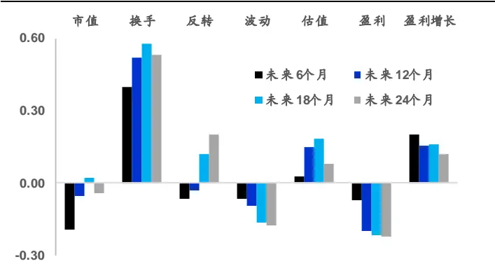
资料来源：Wind，海通证券研究所

图16 机构持仓市值比与分段波动的相关性
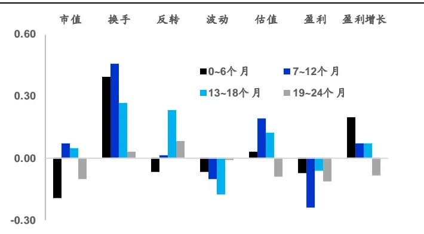
资料来源：Wind，海通证券研究所

整体来看，机构持仓市值比的预测能力同样偏弱。从收益预测能力来看，指标除了与盈利增长因子未来收益之间的负相关性较为明显外，该指标在其余因子上与因子未来收益之间的相关性偏弱。从收益波动预测能力来看，指标在换手率因子上与未来因子收益波动正相关，但是在其余因子上指标与未来因子收益波动之间的相关性较弱，甚至负相关。

下表展示了机构持仓市值比与未来因子收益、未来因子收益波动的相关性情况。

表 5 机构持仓市值比与因子未来收益的相关性

|  | 相关性 |  |  |  | 相关性检验P值 |  |  |  |
| --- | --- | --- | --- | --- | --- | --- | --- | --- |
|  | 因子名称 | 未来6个月 未来12个月 | 未来18个月 | 未来24 个月 | 未来6个月 | 未来12个月 | 未来18个月 | 未来24个月 |
| 累计收益 | 市值 0.10 | 0.08 | -0.03 | -0.14 | 25% | 41% | 72% | 14% |
|  | 换手 | 0.23 0.17 | 0.15 | 0.20 | 1% | 7% | 10% | 4% |
|  | 反转 -0.03 | 0.03 | 0.03 | 0.09 | 72% | 70% | 77% | 36% |
|  | 波动 0.06 | -0.07 | -0.14 | -0.21 | 51% | 44% | 14% | 3% |
|  | 估值 0.16 | 0.04 | 0.12 | 0.17 | 8% | 70% | 22% | 7% |
|  | 盈利 0.06 | -0.16 | -0.18 | -0.32 | 50% | 7% | 5% | 0% |
| 分段收益 | 盈利增长 -0.45 | -0.55 | -0.58 | -0.67 | 0% | 0% | 0% | 0% |
|  | 因子名称 0~6个月 | 7~12个月 | 13~18个月 | 19~24个月 | 0~6个月 | 7~12个月 | 13~18个月 | 19~24个月 |
|  | 市值 0.10 | 0.01 | -0.19 | -0.38 | 25% | 87% | 4% | 0% |
|  | 换手 | 0.23 0.04 | 0.05 | 0.18 | 1% | 63% | 62% | 7% |
|  | 反转 -0.03 | 0.09 | 0.00 | 0.14 | 72% | 34% | 98% | 15% |
|  | 波动 0.06 | -0.17 | -0.15 | -0.18 | 51% | 6% | 11% | 6% |
|  | 估值 0.16 | -0.11 | 0.15 | 0.16 | 8% | 23% | 11% | 10% |
|  | 盈利 0.06 | -0.30 | -0.10 | -0.31 | 50% | 0% | 26% | 0% |
|  | 盈利增长 -0.45 | -0.39 | -0.28 | -0.32 | 0% | 0% | 0% | 0% |

资料来源：Wind，海通证券研究所

表 6 机构持仓市值比与因子未来收益波动的相关性

|  | 相关性 |  |  |  | 相关性检验P值 |  |  |  |
| --- | --- | --- | --- | --- | --- | --- | --- | --- |
|  | 因子名称 未来6个月 | 未来12个月 | 未来18个月 | 未来24 个月 | 未来6个月 | 未来12个月 | 未来18个月 | 未来24 个月 |
| 累计收益波动 | 市值 -0.19 | -0.06 | 0.02 | -0.04 | 3% | 55% | 81% | 66% |
|  | 换手 0.40 | 0.52 | 0.58 | 0.53 | 0% | 0% | 0% | 0% |
|  | 反转 -0.07 | -0.03 | 0.12 | 0.20 | 46% | 72% | 21% | 4% |
|  | 波动 -0.07 | -0.10 | -0.17 | -0.18 | 44% | 29% | 7% | 6% |
|  | 估值 0.03 | 0.15 | 0.18 | 0.08 | 76% | 11% | 5% | 43% |
|  | 盈利 -0.07 | -0.20 | -0.22 | -0.22 | 40% | 3% | 2% | 2% |
|  | 盈利增长 0.20 | 0.16 | 0.16 | 0.12 | 2% | 9% | 9% | 21% |
| 分段收益波动 | 因子名称 0~6个月 | 7~12个月 | 13~18个月 | 19~24个月 | 0~6个月 | 7~12个月 | 13~18个月 | 19~24个月 |
|  | 市值 -0.19 | 0.07 | 0.05 | -0.10 | 3% | 43% | 60% | 28% |
|  | 换手 0.40 | 0.46 | 0.27 | 0.03 | 0% | 0% | 0% | 78% |
|  | 反转 -0.07 | 0.01 | 0.23 | 0.08 | 46% | 88% | 1% | 39% |
|  | 波动 -0.07 | -0.10 | -0.18 | -0.01 | 44% | 25% | 6% | 91% |
|  | 估值 0.03 | 0.19 | 0.12 | -0.09 | 76% | 3% | 20% | 33% |
|  | 盈利 -0.07 | -0.24 | -0.06 | -0.11 | 40% | 1% | 50% | 24% |
|  | 盈利增长 0.20 | 0.07 | 0.07 | -0.08 | 2% | 42% | 46% | 38% |

资料来源：Wind，海通证券研究所

## 2.2 因子正交处理对于指标预测能力的影响

下图展示了机构持仓金额比与正交因子未来 6 个月、12 个月、18 个月以及 24 个月收益以及收益波动之间的相关性情况。

图17 机构持仓金额比与正交因子收益的相关性
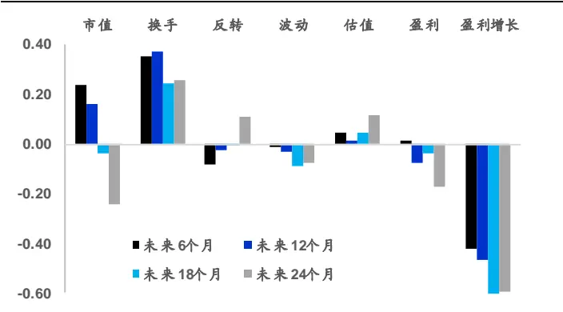
资料来源：Wind，海通证券研究所

图18 机构持仓金额比与正交因子分段收益的相关性
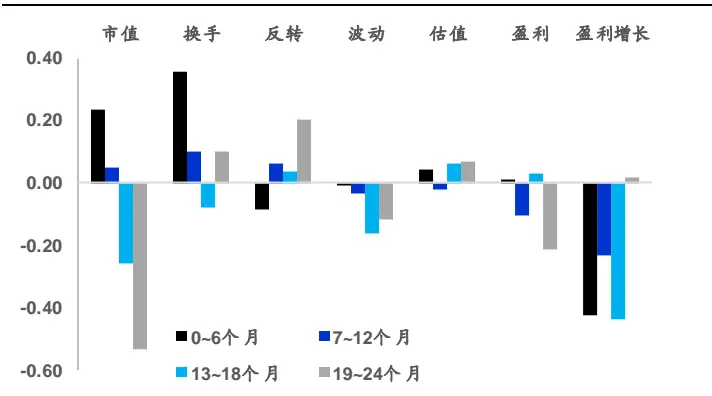
资料来源：Wind，海通证券研究所

图19 机构持仓金额比与正交因子波动的相关性
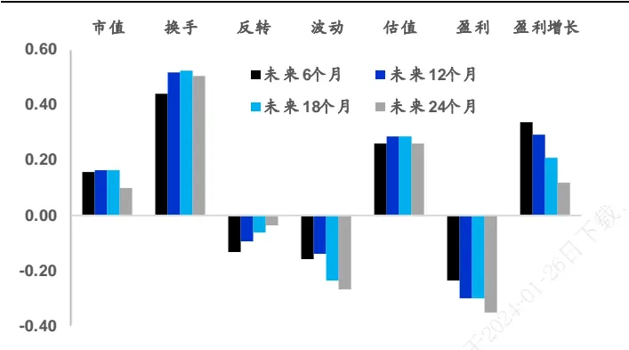
资料来源：Wind，海通证券研究所

图20 机构持仓金额比与正交因子分段波动的相关性
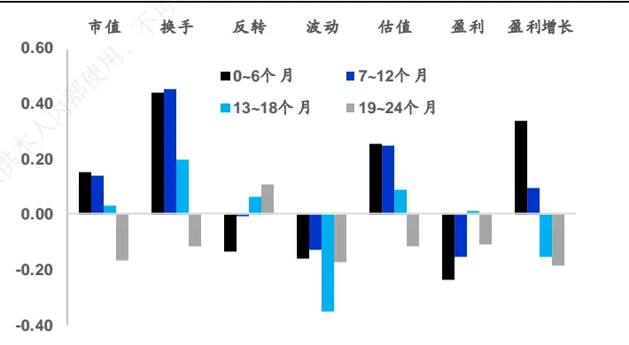
资料来源：Wind，海通证券研究所

在正交的因子集合上，机构持仓金额比预测能力依旧偏弱。从收益预测能力上看，指标仅与盈利增长因子未来收益显著负相关。从收益波动预测能力上看，指标与市值、换手、估值以及盈利增长因子未来收益波动具有一定的正相关性。

下图展示了机构持仓市值比与正交因子未来 6 个月、12 个月、18 个月以及 24 个月收益以及收益波动之间的相关性情况。

图21 机构持仓市值比与正交因子收益的相关性
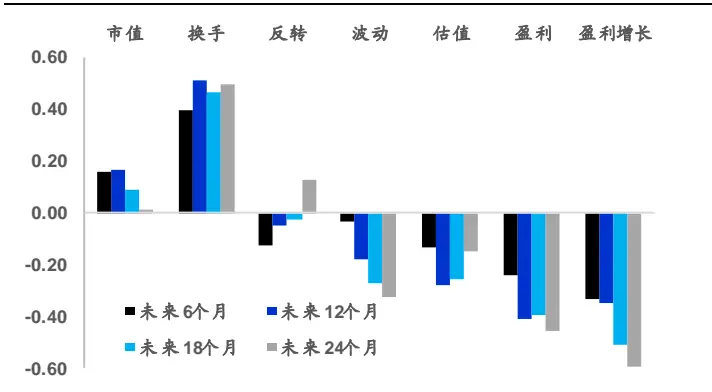
资料来源：Wind，海通证券研究所

图22 机构持仓市值比与正交因子分段收益的相关性
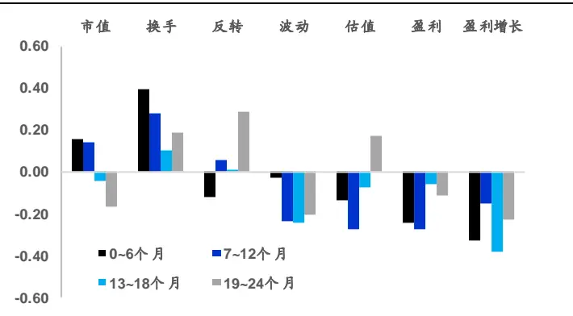
资料来源：Wind，海通证券研究所

图23 机构持仓市值比与正交因子波动的相关性
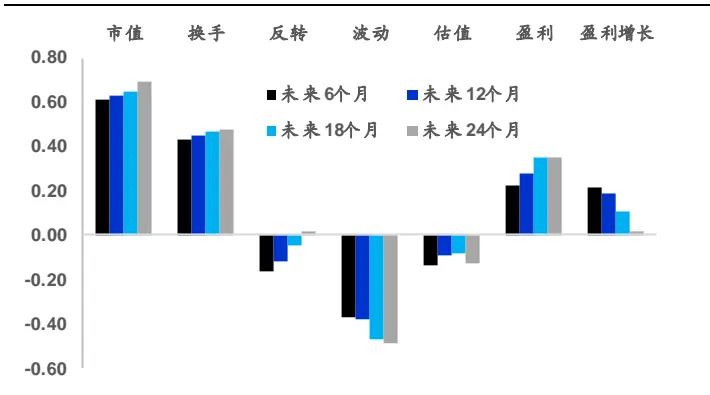
资料来源： ，海通证券研究所

图24 机构持仓市值比与正交因子分段波动的相关性
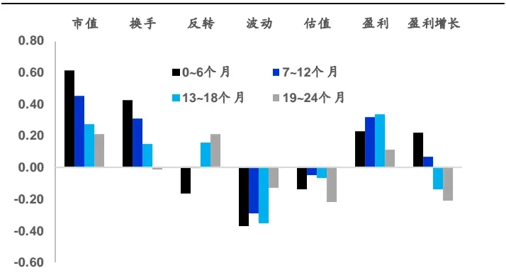
资料来源：Wind，海通证券研究所

对比持仓市值比在原始因子集合上的效果，该指标在正交因子集合上的效果有所提升。从收益预测能力上看，指标在波动、估值、盈利以及盈利增长等因子上与因子未来收益负相关。从收益波动预测能力上看，指标在市值、换手、盈利以及盈利增长上与因子未来收益波动正相关。

## 2.3 本章小结

基于本章的回测结果，可得到以下结论：

） 使用公募基金季度披露的前 大持仓数据构建得到的机构持仓集中度指标在原始因子集合上的预测能力较弱，无论是机构持仓金额比还是机构持仓市值比都未呈现出较好的预测能力。

2） 在正交的因子集合上，机构持仓市值比具有一定的预测能力。指标在波动、估值、盈利以及盈利增长等因子上与因子未来收益负相关。同时，指标在部分因子上具有一定的波动预测能力。

## 3. 拥挤度指标相关性一览

考虑到拥挤度指标之间难免会存在一定的相关性，因此本节将对于《选股因子系列（四十二）——因子失效预警：因子拥挤》、《选股因子系列研究（四十三）——因子拥挤度的改进》以及本文所涉及到的各拥挤度指标之间的相关性进行简要展示。需要说明的是，下表所使用的配对相关性为“多头+空头+特质收益”的方式计算得到的，因子波动率为“多头/空头”的因子波动率。

下表展示了基于市值因子计算得到的各指标之间的相关性情况。需要注意的是，在不同的因子上，拥挤度指标间的相关性会略有不同，本节仅以市值因子为例进行展示。

表 7 因子拥挤度指标相关性情况（以市值因子为例）

|  | 估值价差 | 配对相关性 | 收益反转 | 因子波动率 | 资产集中度 | 机构持仓市值比 |
| --- | --- | --- | --- | --- | --- | --- |
| 估值价差 | 1.00 | -0.10 | 0.50 | -0.16 | -0.19 | 0.10 |
| 配对相关性 | -0.10 | 1.00 | -0.15 | -0.26 | -0.41 | 0.41 |
| 收益反转 | 0.50 | -0.15 | 1.00 | -0.20 | -0.31 | 0.49 |
| 因子波动率 | -0.16 | -0.26 | -0.20 | 1.00 | 0.90 | -0.28 |
| 资产集中度 | -0.19 | -0.41 | -0.31 | 0.90 | 1.00 | -0.41 |
| 机构持仓市值比 | 0.10 | 0.41 | 0.49 | -0.28 | -0.41 | 1.00 |

资料来源：Wind，海通证券研究所

基于上表可得到以下几点结论：

1） 估值价差与长期收益反转间的正相关性较强。

2） 配对相关性与资产集中度负相关，与机构持仓市值比正相关。

3） 长期收益反转与估值价差以及机构持仓市值比正相关。

4） 因子波动率与资产集中度之间的正相关性较强。

## 4. 选股空间对于指标的影响

由于不同的投资者具有不同的选股空间，因此本章将对于因子拥挤度指标在全市场以及中证 800 指数内的预测效果进行对比展示。

下图对比展示了使用 计算得到的估值价差在全市场以及中证 指数内的收益预测能力以及收益波动预测能力。对比指标的收益预测能力可以发现，该指标对于选股空间具有一定的敏感性，随着选股空间的缩窄，指标在市值以及换手率因子上的收益预测能力会出现明显减弱。对比指标的收益波动预测能力可知，选股空间的缩窄对于指标波动预测能力的影响较小。

图25 估值价差与因子未来收益的相关性（全市场）
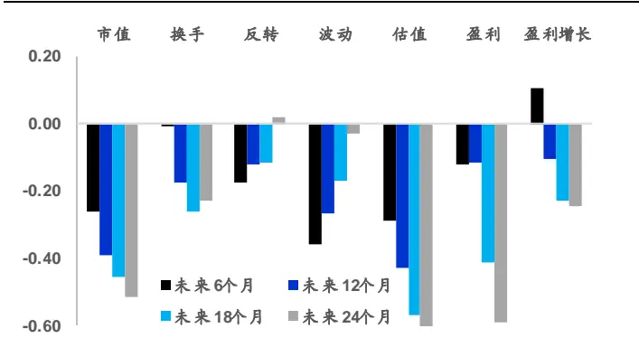
资料来源：Wind，海通证券研究所

图26 估值价差与因子未来收益波动的相关性（全市场）
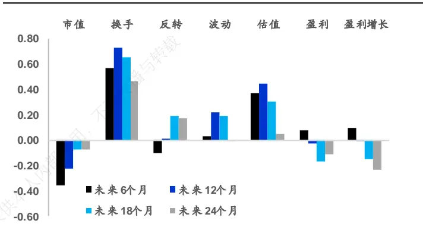
资料来源：Wind，海通证券研究所

图27 估值价差与因子未来收益的相关性（中证 800内）
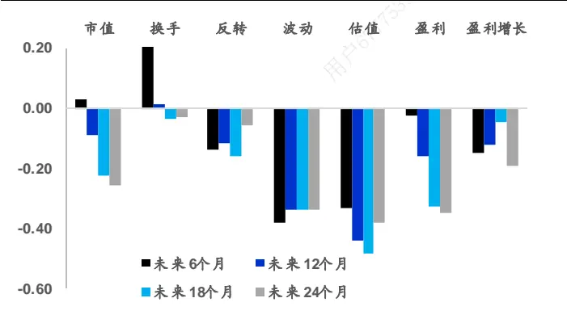
资料来源：Wind，海通证券研究所

图28 估值价差与因子未来收益波动的相关性（中证 800内）
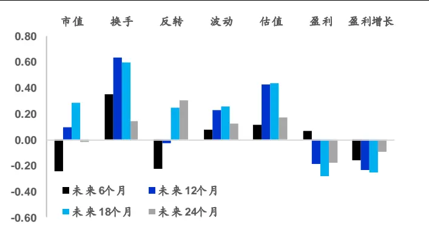
资料来源：Wind，海通证券研究所

下图对比展示了使用股票特质收益以及“多头 空头”的方式计算得到的配对相关性，在全市场以及中证 800 指数内的收益预测能力以及收益波动预测能力。通过对比可以发现，配对相关性对于选股空间极度敏感，指标在中证 800 内对于因子未来的收益预测能力以及收益波动预测能力都较弱。

图29 配对相关性与因子未来收益的相关性（全市场）
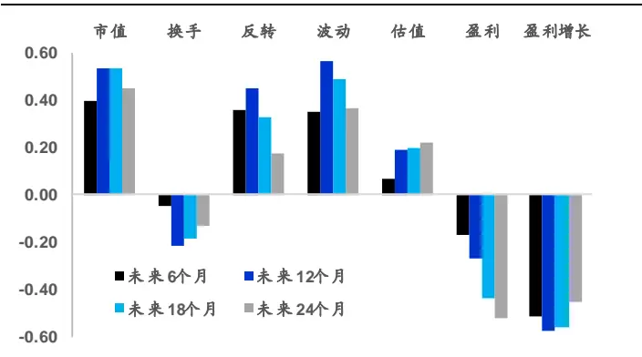
资料来源：Wind，海通证券研究所

图30 配对相关性与因子未来收益波动的相关性（全市场）
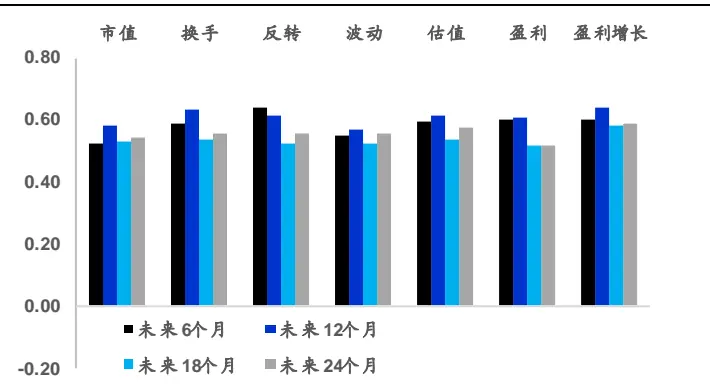
资料来源：Wind，海通证券研究所

图31 配对相关性与因子未来收益的相关性（中证 800内）
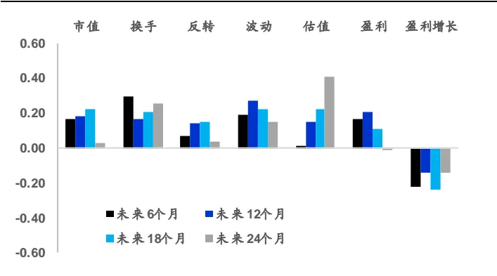
资料来源：Wind，海通证券研究所

图32 配对相关性与因子未来收益波动的相关性（中证 800内）
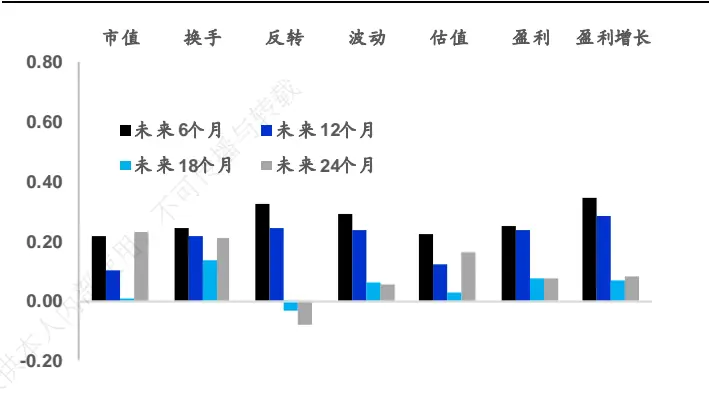
资料来源：Wind，海通证券研究所

下图对比展示了长期收益反转在全市场以及中证800指数内的收益预测能力以及收益波动预测能力。通过对比可以发现，指标在中证 800 内呈现出了更强的收益预测能力。在中证 内，指标与各因子未来收益之间的负相关性更强，并且指标与估值因子之间的正相关性也出现了明显减弱。此外，选股空间的变化并未对于指标的收益波动能力产生明显影响，该指标的收益波动预测能力在中证 800 内依旧较弱。

图33 收益反转与因子未来收益的相关性（全市场）
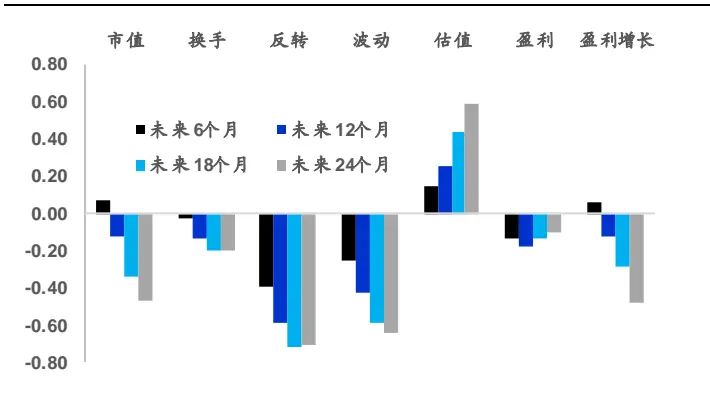
资料来源：Wind，海通证券研究所

图34 收益反转与因子未来收益波动的相关性（全市场）
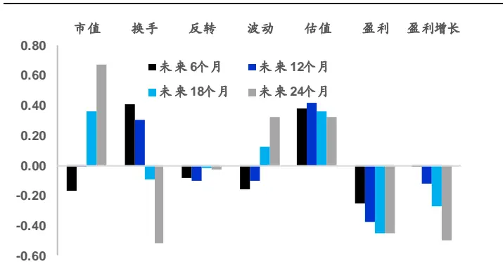
资料来源：Wind，海通证券研究所

图35 收益反转与因子未来收益的相关性（中证 800内）
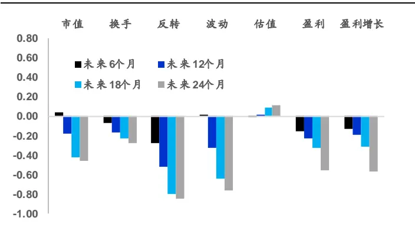
资料来源： ，海通证券研究所

图36 收益反转与因子未来收益波动的相关性（中证 800内）
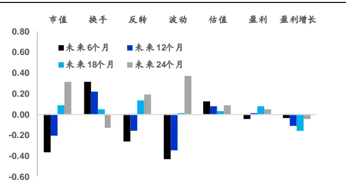
资料来源：Wind，海通证券研究所

下图对比展示了使用“多头/空头”的方式计算得到的因子波动率在全市场以及中证800 指数内的收益预测能力以及收益波动预测能力。中证 800 内，因子波动率呈现出了更强的收益预测能力，但是指标与因子未来收益波动之间的正相关性也出现了十分明显的减弱。

图37 因子波动率与因子未来收益的相关性（全市场）
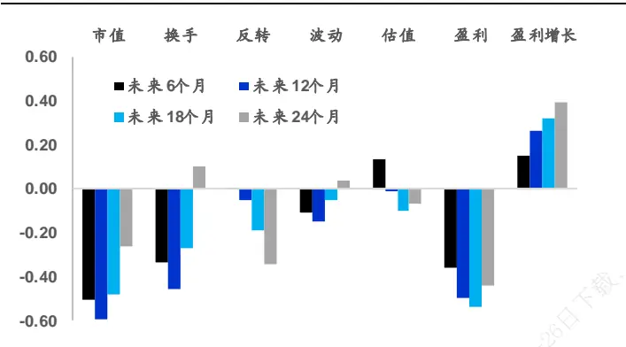
资料来源：Wind，海通证券研究所

图38 因子波动率与因子未来收益波动的相关性（全市场）
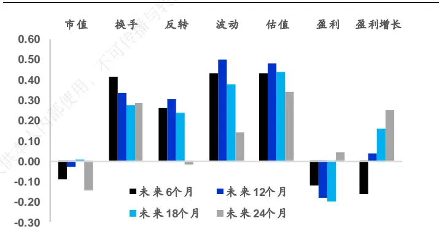
资料来源：Wind，海通证券研究所

图39 因子波动率与因子未来收益的相关性（中证 800内）
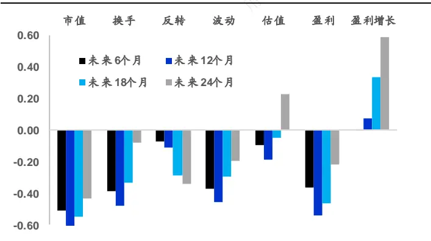
资料来源：Wind，海通证券研究所

图40 因子波动率与因子未来收益波动的相关性（中证 800内）
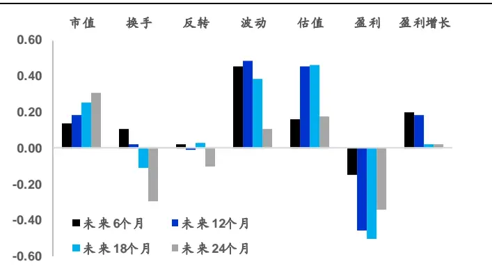
资料来源：Wind，海通证券研究所

下图对比展示了资产集中度在全市场以及中证 指数内的收益预测能力以及收益波动预测能力。通过对比可以发现，资产集中度在中证 800 内呈现出了更强的收益预测能力，指标与反转、波动以及盈利因子的未来收益之间的负相关性更强。值得注意的是，在中证 800 内，指标对于因子未来收益波动的预测效果有所减弱。

图41 资产集中度与因子未来收益的相关性（全市场）
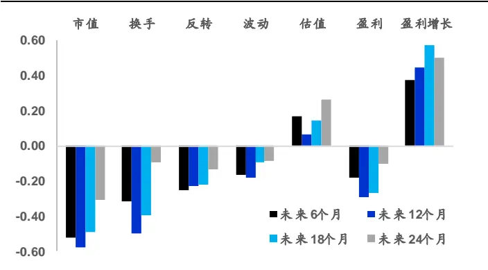
资料来源：Wind，海通证券研究所

图42 资产集中度与因子未来收益波动的相关性（全市场）
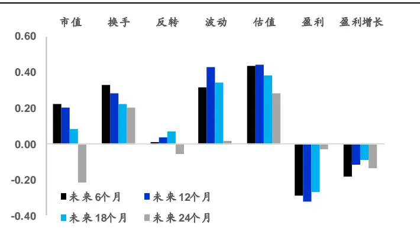
资料来源：Wind，海通证券研究所

图43 资产集中度与因子未来收益的相关性（中证 800内）
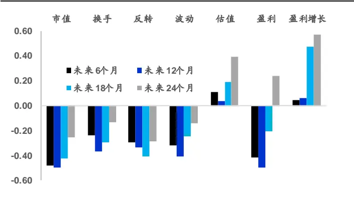
资料来源：Wind，海通证券研究所

图44 资产集中度与因子未来收益波动的相关性（中证 800内）
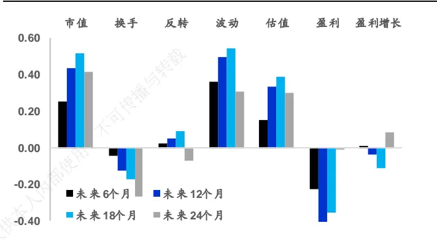
资料来源：Wind，海通证券研究所

下图对比展示了机构持仓市值比在全市场以及中证800指数内的收益预测能力以及收益波动预测能力。通过对比可以发现，机构持仓市值比在中证 800 内的收益预测能力以及收益波动预测能力同样较弱。

图45 持仓市值比与因子未来收益的相关性（全市场）
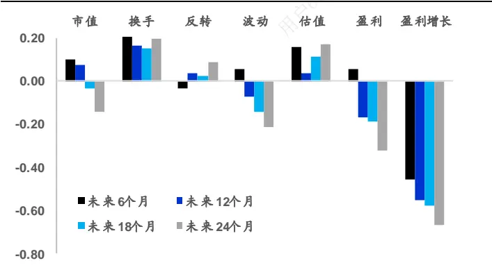
资料来源：Wind，海通证券研究所

图46 持仓市值比与因子未来收益波动的相关性（全市场）
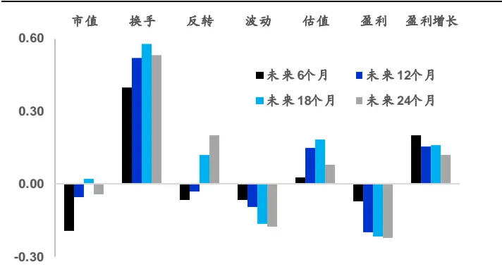
资料来源：Wind，海通证券研究所

图47 持仓市值比与因子未来收益的相关性（中证 800内）
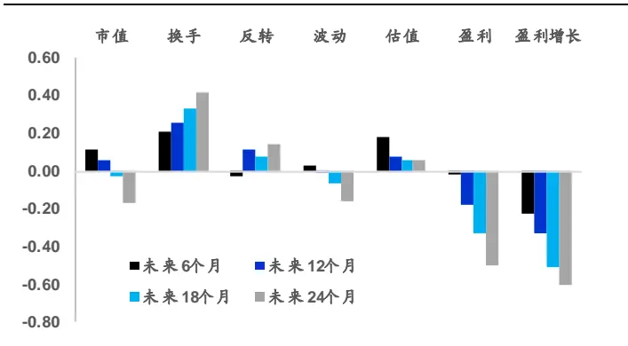
资料来源： ，海通证券研究所

图48 持仓市值比与因子未来收益波动的相关性（中证 800内）
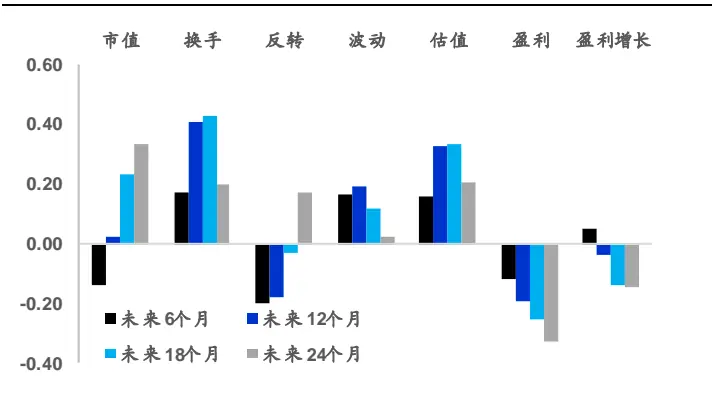
资料来源：Wind，海通证券研究所

## 5. 总结

本文在前期报告的基础上对于因子拥挤度指标的构建以及相关特性进行了深入探讨，旨在为投资者提供更多关于因子拥挤度指标构建的参考信息。

本文首先基于海外文献以及机构持仓数据，构建回测了资产集中度以及机构持仓类指标。回测结果表明，资产集中度对于因子未来收益具有一定的预测能力，但是在部分因子上会与因子未来收益正相关。指标对于因子未来收益的预测能力在正交的因子集合上依然存在。在原始因子集合上，资产集中度对因子未来收益波动同样具有预测能力，但是在正交的因子集合上，指标的波动预测能力会大幅减弱。

机构持仓类指标在原始因子集合上预测效果偏弱。使用公募基金季度披露的前 10大持仓数据构建得到的机构持仓集中度指标在原始因子集合上的预测能力较弱，无论是机构持仓金额比还是机构持仓市值比都未呈现出较好的预测能力。在正交的因子集合上，机构持仓市值比具有一定的预测能力。指标在波动、估值、盈利以及盈利增长等因子上与因子未来收益负相关。同时，指标在部分因子上具有波动预测能力。

此外，本文还展示了各拥挤度指标之间的相关性情况。简单来说，各拥挤度指标之间存在一定的相关性。例如，估值价差与长期收益反转正相关，因子波动率与资产集中度正相关。

最后，本文还讨论了选股空间对于拥挤度指标效果的影响。回测结果表明，大部分拥挤度指标对于选股空间的变化并不是特别敏感。大部分的拥挤度指标在全市场以及在中证 800 内的预测能力较为接近，但是配对相关性对于选股空间的变化极为敏感。

## 6. 风险提示

市场系统性风险、资产流动性风险以及政策变动风险会对策略表现产生较大影响。

## 信息披露

分析师声明

[Table冯佳睿yst金融工程研究团队s]

袁林青金融工程研究团队

本人具有中国证券业协会授予的证券投资咨询执业资格，以勤勉的职业态度，独立、客观地出具本报告。本报告所采用的数据和信息均来自市场公开信息，本人不保证该等信息的准确性或完整性。分析逻辑基于作者的职业理解，清晰准确地反映了作者的研究观点，结论不受任何第三方的授意或影响，特此声明。

## 法律声明

本报告仅供海通证券股份有限公司（以下简称“本公司”）的客户使用。本公司不会因接收人收到本报告而视其为客户。在任何情况下，本报告中的信息或所表述的意见并不构成对任何人的投资建议。在任何情况下，本公司不对任何人因使用本报告中的任何内容所引致的任何损失负任何责任。

本报告所载的资料、意见及推测仅反映本公司于发布本报告当日的判断，本报告所指的证券或投资标的的价格、价值及投资收入可能载会波动。在不同时期，本公司可发出与本报告所载资料、意见及推测不一致的报告。

市场有风险，投资需谨慎。本报告所载的信息、材料及结论只提供特定客户作参考，不构成投资建议，也没有考虑到个别客户特殊的可投资目标、财务状况或需要。客户应考虑本报告中的任何意见或建议是否符合其特定状况。在法律许可的情况下，海通证券及其所属不关联机构可能会持有报告中提到的公司所发行的证券并进行交易，还可能为这些公司提供投资银行服务或其他服务。用

本报告仅向特定客户传送，未经海通证券研究所书面授权，本研究报告的任何部分均不得以任何方式制作任何形式的拷贝、复印件或内复制品，或再次分发给任何其他人，或以任何侵犯本公司版权的其他方式使用。所有本报告中使用的商标、服务标记及标记均为本公本司的商标、服务标记及标记。如欲引用或转载本文内容，务必联络海通证券研究所并获得许可，并需注明出处为海通证券研究所，且仅不得对本文进行有悖原意的引用和删改。载，

根据中国证监会核发的经营证券业务许可，海通证券股份有限公司的经营范围包括证券投资咨询业务。日

| 邓勇 | 副所长 | 涂力磊 所长助理 |
| --- | --- | --- |
| (021)23219404 dengyong@htsec.com | (021)23219658 xyg6052@htsec.com | (021)23219747 tll5535@htsec.com |

海通证券股份有限公司研究所[Table_PeopleInfo]

路 颖所长

(021)23219403 luying@htsec.com高道德 副所长(021)63411586 gaodd@htsec.com姜 超副所长

(021)23212042 jc9001@htsec.com

| 宏观经济研究团队 金融工程研究团队 |  |  |  |  | 金融产品研究团队 |  |
| --- | --- | --- | --- | --- | --- | --- |
| 姜超(021)23212042 于 博(021)23219820 |  | jc9001@htsec.com yb9744@htsec.com | 高道德(021)63411586 冯佳睿(021)23219732 | gaodd@htsec.com fengjr@htsec.com | 高道德(021)63411586 | gaodd@htsec.com |
| 李金柳(021)23219885 联系人 |  | ljl11087@htsec.com | 郑雅斌(021)23219395 罗 蕾(021)23219984 | zhengyb@htsec.com | 倪韵婷(021)23219419 陈 瑶(021)23219645 | niyt@htsec.com chenyao@htsec.com |
| 宋 潇(021)23154483 |  | sx11788@htsec.com |  | I19773@htsec.com | 唐洋运(021)23219004 | tangyy@htsec.com |
| 陈 兴(021)23154504 |  |  | 沈泽承(021)23212067 | szc9633@htsec.com | 宋家骥(021)23212231 | sjj9710@htsec.com |
|  |  | cx12025@htsec.com | 余浩淼(021)23219883 | yhm9591@htsec.com | 皮 灵(021)23154168 | pl10382@htsec.com |
|  |  |  | 袁林青(021)23212230 | ylq9619@htsec.com | 徐燕红(021)23219326 | xyh10763@htsec.com |
|  |  |  | 姚 石(021)23219443 吕丽颖(021)23219745 | ys10481@htsec.com | 谈 鑫(021)23219686 | tx10771@htsec.com |
|  |  |  | 周一洋(021)23219774 | lly10892@htsec.com | 王 毅(021)23219819 | wy10876@htsec.com |
|  |  | 联系人 |  | zyy10866@htsec.com | 蔡思圆(021)23219433 | csy11033@htsec.com |
|  |  |  | 张振岗(021)23154386 |  | 联系人 |  |
|  |  | 颜 伟(021)23219914 |  | zzg11641@htsec.com | 庄梓恺(021)23219370 | zzk11560@htsec.com |
|  |  | 梁 镇(021)23219449 | yw10384@htsec.com lz11936@htsec.com |  | 谭实宏(021)23219445 | tsh12355@htsec.com |
| 固定收益研究团队 |  |  |  |  |  |  |
| 姜 超(021)23212042 |  | 策略研究团队 |  |  |  |  |
|  |  | jc9001@htsec.com | 荀玉根(021)23219658 | xyg6052@htsec.com | 中小市值团队 |  |
| 朱征星(021)23219981 | zzx9770@htsec.com |  | 钟 青(010)56760096 | zq10540@htsec.com | 张 宇(021)23219583 钮宇鸣(021)23219420 | zy9957@htsec.com |
| 周 霞(021)23219807 |  | zx6701@htsec.com | 高 上(021)23154132 | gs10373@htsec.com | 孔维娜(021)23219223 | ymniu@htsec.com |
| 姜珮珊(021)23154121 |  | 李 | 影(021)23154117 | ly11082@htsec.com | 潘莹练(021)23154122 | kongwn@htsec.com |
| 杜 佳(021)23154149 | jps10296@htsec.com | 姚 佩(021)23154184 | yp11059@htsec.com |  | 联系人 | pyl10297@htsec.com |
| 联系人 | dj11195@htsec.com |  | 周旭辉 zxh12382@htsec.com |  | 程碧升(021)23154171 |  |
| 李 波(021)23154484 Ib11789@htsec.com |  | 联系人 |  |  | 相 姜(021)23219945 | cbs10969@htsec.com |
|  |  |  | 唐一杰(021)23219406 | tyj11545@htsec.com |  | xj11211@htsec.com |
|  |  |  | 郑子勋(021)23219733 | zzx12149@htsec.com |  |  |
|  |  |  | 王一潇(021)23219400 | wyx12372@htsec.com |  |  |
| 政策研究团队 |  |  |  |  |  |  |
| 李明亮(021)23219434 |  |  | 石油化工行业 |  | 医药行业 |  |
| 陈久红(021)23219393 | Iml@htsec.com |  | 邓勇(021)23219404 | dengyong@htsec.com | 余文心(0755)82780398 | ywx9461@htsec.com |
|  | chenjiuhong@htsec.com |  | 朱军军(021)23154143 | zjj10419@htsec.com | 郑 琴(021)23219808 | zq6670@htsec.com |
| 吴一萍(021)23219387 | wuyiping@htsec.com | 联系人 |  |  | 联系人 |  |
| 朱 蕾(021)23219946 | zl8316@htsec.com |  | 胡 歆(021)23154505 | hx11853@htsec.com | 贺文斌(010)68067998 | hwb10850@htsec.com |
| 周洪荣(021)23219953 |  | zhr8381@htsec.com | 张 璇(021)23219411 | zx12361@htsec.com | 范国钦 02123154384 | fgq12116@htsec.com |
|  | 王 旭(021)23219396 | wx5937@htsec.com |  |  | 梁广楷(010)56760096 吴佳栓(010)56760092 | Igk12371@htsec.com |
| 汽车行业 |  |  |  |  |  | wjs11852@htsec.com |
| 王 猛(021)23154017 wm10860@htsec.com 杜 威(0755)82900463 dw11213@htsec.com |  |  | 公用事业 吴 杰(021)23154113 | wj10521@htsec.com | 批发和零售贸易行业 汪立亭(021)23219399 |  |
| 联系人 |  |  | 张 磊(021)23212001 | zi10996@htsec.com | 李宏科(021)23154125 | wanglt@htsec.com Ihk11523@htsec.com |
| 曹雅倩(021)23154145 |  |  | 戴元灿(021)23154146 | dyc10422@htsec.com | 联系人 |  |
|  |  | cyq12265@htsec.com | 联系人 |  | 史岳 sy11542@htsec.com |  |
|  |  |  | 傅逸帆(021)23154398 | fyf11758@htsec.com | 高 瑜(021)23219415 gy12362@htsec.com |  |
|  |  |  |  |  | 谢茂萱 xmx12344@htsec.com |  |
| 互联网及传媒 |  |  |  |  |  |  |
| 郝艳辉(010)58067906 |  | hyh11052@htsec.com | 有色金属行业 施 毅(021)23219480 | sy8486@htsec.com | 房地产行业 |  |
| 孙小雯(021)23154120 |  | sxw10268@htsec.com | 联系人 |  | 涂力磊(021)23219747 谢 盐(021)23219436 | tll5535@htsec.com |
| 毛云聪(010)58067907 |  | myc11153@htsec.com | 李姝醒(021)23219401 | lsx11330@htsec.com | 杨 凡(021)23219812 | xiey@htsec.com yf11127@htsec.com |
| 联系人 |  |  | 陈晓航(021)23154392 | cxh11840@htsec.com | 金 晶(021)23154128 | jj10777@htsec.com |
| 陈星光(021)23219104 |  | cxg11774@htsec.com | 甘嘉尧(021)23154394 | gjy11909@htsec.com |  |  |
| 电子行业 |  |  |  |  |  |  |
| 陈 平(021)23219646 |  | cp9808@htsec.com | 煤炭行业 李 淼(010)58067998 | Im10779@htsec.com | 电力设备及新能源行业 |  |
| 尹 苓(021)23154119 |  |  | 戴元灿(021)23154146 |  | 张一弛(021)23219402 | zyc9637@htsec.com |
|  | yl11569@htsec.com |  |  | dyc10422@htsec.com | 房 青(021)23219692 | fangq@htsec.com |
| 谢 磊(021)23212214 | xl10881@htsec.com |  | 吴 杰(021)23154113 | wj10521@htsec.com | 曾 彪(021)23154148 | zb10242@htsec.com |
| 联系人 |  | 联系人 |  |  | 徐柏乔(021)23219171 | xbq6583@htsec.com |
|  | 石 坚(010)58067942 sj11855@htsec.com |  | 王 涛(021)23219760 | wt12363@htsec.com | 张向伟(021)23154141 |  |
|  |  |  |  |  |  | zxw10402@htsec.com |
|  |  |  |  |  | 联系人 |  |

| 基础化工行业 |  | 计算机行业 |  | 通信行业 |  |
| --- | --- | --- | --- | --- | --- |
| 刘 威(0755)82764281 刘海荣(021)23154130 张翠翠(021)23214397 | Iw10053@htsec.com Ihr10342@htsec.com zcc11726@htsec.com | 郑宏达(021)23219392 杨 林(021)23154174 鲁 立(021)23154138 于成龙 ycl12224@htsec.com | zhd10834@htsec.com yl11036@htsec.com il11383@htsec.com | 朱劲松(010)50949926 余伟民(010)50949926 张 弋 01050949962 | zjs10213@htsec.com ywm11574@htsec.com zy12258@htsec.com |
| 孙维容(021)23219431 联系人 李 智(021)23219392 | swr12178@htsec.com lz11785@htsec.com | 黄竞晶(021)23154131 联系人 洪 琳(021)23154137 | hjj10361@htsec.com hl11570@htsec.com | 张峥青(021)23219383 | zzq11650@htsec.com |
| 非银行金融行业 |  | 交通运输行业 |  | 纺织服装行业 |  |
| 孙 婷(010)50949926 何 婷(021)23219634 | st9998@htsec.com ht10515@htsec.com | 虞 楠(021)23219382 yun@htsec.com 罗月江(010)56760091 | lyj12399@htsec.com | 梁 希(021)23219407 联系人 | lx11040@htsec.com |
| 联系人 |  | 联系人 |  | 盛开(021)23154510 | sk11787@htsec.com |
| 李芳洲(021)23154127 | Ifz11585@htsec.com | 李 丹(021)23154401 党新龙(0755)82900489 | Id11766@htsec.com dxl12222@htsec.com | 刘 溢(021)23219748 | ly12337@htsec.com |
| 建筑建材行业 |  | 机械行业 |  | 钢铁行业 |  |
| 联系人 | 冯晨阳(021)23212081 fcy10886@htsec.com | 佘炜超(021)23219816 swc11480@htsec.com 耿 耘(021)23219814 |  | 刘彦奇(021)23219391 liuyq@htsec.com 刘 璇(0755)82900465 |  |
| 申 浩(021)23154114 sh12219@htsec.com |  | 杨 震(021)23154124 沈伟杰(021)23219963 | gy10234@htsec.com yz10334@htsec.com swj11496@htsec.com | 联系人 周慧琳(021)23154399 zhl11756@htsec.com | lx11212@htsec.com |
|  |  | 周 丹 zd12213@htsec.com |  |  |  |
| 建筑工程行业 杜市伟(0755)82945368 dsw11227@htsec.com |  | 农林牧渔行业 |  | 食品饮料行业 |  |
| 张欣劫 zxj12156@htsec.com |  | 丁 频(021)23219405 陈雪丽(021)23219164 | dingpin@htsec.com cxl9730@htsec.com | 闻宏伟(010)58067941 成珊(021)23212207 | whw9587@htsec.com cs9703@htsec.com |
| 李富华(021)23154134 Ifh12225@htsec.com |  | 陈 阳(021)23212041 cy10867@htsec.com |  | 唐 宇(021)23219389 |  |
|  |  | 联系人 |  |  | ty11049@htsec.com |
|  |  | 孟亚琦 myq12354@htsec.com |  |  |  |
| 军工行业 蒋 俊(021)23154170 |  | 银行行业 孙 婷(010)50949926 st9998@htsec.com |  | 社会服务行业 | wanglt@htsec.com |
| 刘 磊(010)50949922 | jj11200@htsec.com II11322@htsec.com | 解巍巍 xww12276@htsec.com |  | 汪立亭(021)23219399 陈扬扬(021)23219671 cyy10636@htsec.com |  |
| 张恒晅 zhx10170@htsec.com |  | 林加力(021)23214395 | ljl12245@htsec.com | 许樱之 xyz11630@htsec.com |  |
| 联系人 张宇轩(021)23154172 |  | 联系人 谭敏沂(0755)82900489 |  |  |  |
|  | zyx11631@htsec.com |  | tmy10908@htsec.com |  |  |
| 家电行业 陈子仪(021)23219244 | chenzy@htsec.com | 造纸轻工行业 衣桢永(021)23212208 yzy12003@htsec.com |  |  |  |

## 研究所销售团队

深广地区销售团队

蔡铁清(0755)82775962 ctq5979@htsec.com

伏财勇(0755)23607963 fcy7498@htsec.com

辜丽娟(0755)83253022 gulj@htsec.com

刘晶晶(0755)83255933 liujj4900@htsec.com

王雅清(0755)83254133 wyq10541@htsec.com

饶 伟(0755)82775282 rw10588@htsec.com

欧阳梦楚(0755)23617160

oymc11039@htsec.com

宗 亮 zl11886@htsec.com

巩柏含 gbh11537@htsec.com

上海地区销售团队
胡雪梅(021)23219385 huxm@htsec.com
朱 健(021)23219592 zhuj@htsec.com
季唯佳(021)23219384 jiwj@htsec.com
黄 毓(021)23219410 huangyu@htsec.com
漆冠男(021)23219281 qgn10768@htsec.com
胡宇欣(021)23154192 hyx10493@htsec.com
黄 诚(021)23219397 hc10482@htsec.com
毛文英(021)23219373 mwy10474@htsec.com
马晓男 mxn11376@htsec.com
杨祎昕(021)23212268 yyx10310@htsec.com
张思宇 zsy11797@htsec.com
慈晓聪(021)23219989 cxc11643@htsec.com
王朝领 wcl11854@htsec.com
邵亚杰 23214650 syj12493@htsec.com
李 寅 021-23219691 ly12488@htsec.com
北京地区销售团队
殷怡琦(010)58067988 yyq9989@htsec.com
郭 楠 010-5806 7936 gn12384@htsec.com
吴 尹 wy11291@htsec.com
张丽萱(010)58067931 zlx11191@htsec.com
杨羽莎(010)58067977 yys10962@htsec.com
杜 飞 df12021@htsec.com
张 杨(021)23219442 zy9937@htsec.com
何 嘉(010)58067929 hj12311@htsec.com
李 婕 lj12330@htsec.com
欧阳亚群 oyyq12331@htsec.com

海通证券股份有限公司研究所

地址：上海市黄浦区广东路 689号海通证券大厦 9楼

电话：（021）23219000

传真：（021）23219392

网址：www.htsec.com