## [Tab相关研究

Table_ReportInfo]《量化研究新思维（十六）——他山之石：防御性因子择时》2019.04.14

《大类资产配臵及模型研究（十）——负债驱动投资（LDI）简介》2019.04.09《因子投资与 Smart Beta研究（四）——“单因子多组合”还是“多因子单组合”》2019.04.01

分析师:冯佳睿

Tel:(021)23219732

Email:fengjr@htsec.com

证书:S0850512080006

分析师:姚石

Tel:(021)23219443

Email:ys10481@htsec.com

证书:S0850517120002

## 选股因子系列研究（四十六）——日内分时成交中的玄机

## [Table_Sum投资要点：

在前期报告《高频量价因子在股票与期货中的表现》中，我们使用股票的 1分钟量价数据构建了收益率分布、成交量分布、量价复合等多个因子，取得了不错的效果。在本篇报告中，我们将引入“成交笔数”这一新的基础数据，构建日内分时成交系列因子。

- 平均单笔成交金额。每日使用股票的 分钟成交金额、成交笔数和收益率序列计算平均单笔成交金额类因子。其中，平均单笔流出金额占比因子具有明显的选股效果，因子的 IC 和 rank IC 均值分别为 5.8%和 7.4%，IC-IR 和 rank IC-IR分别为 和 ，多空组合月均收益差为 。因子正交后选股效果仍然显著，多空组合月均收益差为 1.09%，rank IC 均值为 3.2%，rank IC-IR 为 3.82。双重分组结果显示，在控制了常见的因子后，该因子分组收益仍然单调，首尾组合月均收益差均超过 1%。Fama-Macbeth 截面回归结果显示，因子月均溢价转为 0.31%，相应的 t统计量为 11.97，统计显著。播

- 大单资金流向。每日选取平均单笔成交金额最大的一定比例（N）的分钟 K线，不计算大单资金净流入率和大单驱动涨幅因子。大单资金净流入率（N=20%）因用子具有明显的选股效果，原始因子和正交因子的 rank IC 均值分别为-5.6%和部-2.2%，rank IC-IR 分别为-2.77 和-2.39，多空组合月均收益差分别为-1.56%和人-0.97%。大单驱动涨幅（N=30%）因子同样具有明显的选股效果，原始因子和供正交因子的 rank IC 均值分别为-8.2%和-3.1%，rank IC-IR 分别为-4.12 和-3.56，多空组合月均收益差分别为-2.23%和-1.08%。

- 因子对现有模型存在提升效果。加入日内分时成交因子后，多因子模型的 IC、1-IR、胜率以及多头组合的表现均有所提升，rank IC 从 13.21%提高至 13.64%，24rank IC-IR从 4.08 提高至 4.26，预期收益率最高的 100 只股票的等权组合年化于

- 风险提示。因子失效风险、流动性风险。

在前期报告《高频量价因子在股票与期货中的表现》中，我们使用股票的 1分钟量价数据构建了收益率分布、成交量分布、量价复合等多个因子，取得了不错的效果。在本篇报告中，我们将引入“成交笔数”这一新的基础数据，构建日内分时成交系列因子。

## 1. 回测参数设臵

回测区间：2010.01-2019.03；

样本空间：剔除 ST、停牌、涨跌停、上市不满 6 个月、距退市不足 1个月的股票；

成交价：次日开盘后半小时 VWAP；

交易成本：双边千分之三；

备注：剔除集合竞价期间的成交信息；若股票在某个交易日有 25%以上的时间价格不波动，则剔除该交易日。

我们在下文中将依次考察原始因子和正交因子的表现，其中正交因子是通过横截面回归剔除行业、市值、非线性市值、反转、换手、特异度、流动性、估值、盈利、成长等因子后得到。

## 2. 平均单笔成交金额类因子

## 2.1 因子定义

每一交易日提取股票i的 1 分钟频率的收益率序列 $r_{ij}$ ，成交金额序列 $Amt_{ij}$ 和成交笔数序列 $TrdNum_{ij}$ ，计算以下指标：

$$
平均单笔成交金额:$AmtPerTrd_{i}=\sum_{j=1}^{N}Amt_{ij}$$I\sum_{j=1}^{N}TrdNum_{ij}$
$$

$$
平均单笔流入金额:AmtPerTrd\_inFollowing=\frac{\sum_{j=1}^{N}Am_{ij}.I_{rij}>0}{\sum_{j=1}^{N}TrdNum_{ij}.I_{rij}>0}
$$

$$
平均单笔流出全额:AmtPerTrd\_outFollowing=\frac{\sum_{j=1}^{N}Amt_{ij}\cdot I_{r_j<0}}{\sum_{j=1}^{N}TrdNum_{ij}\cdot I_{r_{ij}<0}}
$$

单笔成交金额与股票市值之间具有较强的正相关性，为了使不同市值的股票可以横向比较，我们将单笔成交金额标准化，转换为以下指标：

$$
平均单笔流入金额占比:$ApT\_inFlow\_ratio_{i}=\frac{AmtPerTrd\_inFlow_{i}}{AmtPerTrd_{i}}$
$$

$$
平均单笔流出金额占比:\ \frac{AP_{-}outFlow\_ratio_{i}=\frac{AHPerTrd\_outFlow_{i}}{AHPerTrd_{i}}}{\frac{AHPerTrd_{i}}{AHPerTrd_{i}}}
$$

$$
平均单笔流入流出金额之比:\ \frac{APT_{-}netInFollowing_{-}ratio_{i}}{APT_{-}outInow_{-}ratio_{i}}=\frac{APT_{-}InInflow_{-}ratio_{i}}{APT_{-}outflow_{-}ratio_{i}}
$$

因子值为过去 20 日的指标均值。

下面我们以两只股票为例，对平均单笔成交金额类因子有直观上的认识。其中，股票 的分时走势如图 所示，成交量在 年 月 日上午 时 分出现一根长红柱，说明该分钟可能存在大单买入行为。我们通过逐笔成交数据进行验证（见表 1），发现在 9时 43 分 32秒 510 毫秒出现连续 14 笔买入，共计 30万股，且委托序号完全一致，占当日成交量比例为 26.9%，这一大单买入行为使得股票 A在当日的平均单笔流入金额占比在全市场中处于相对较高水平。与之相反，股票 B在 2019 年 1 月 31日 14 时14 分 52 秒 390 毫秒出现连续 23 笔卖出，共计 64.4 万股，且委托序号完全一致，占当日成交量比例为 ，这一大单卖出行为使得股票 在当日的平均单笔流出金额占比在全市场中处于相对较高水平。

图1 股票 A 日内分时走势（20190131）
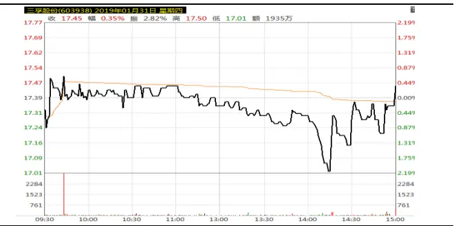
资料来源：Wind，海通证券研究所

图2 股票 B 日内分时走势（20190131）
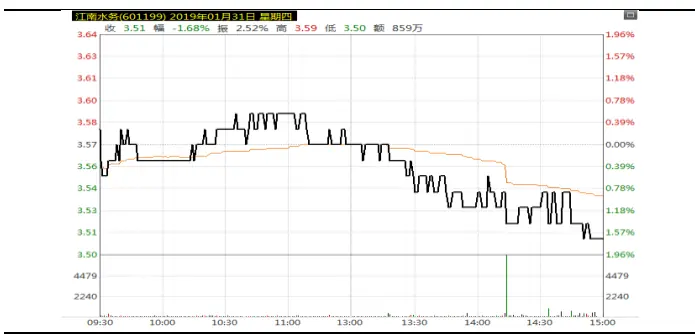
资料来源：Wind，海通证券研究所

表 1 股票 A 逐笔成交明细（20190131 09:43:32:510）

| 成交时间(精确到毫秒 HHMMSSmmm) | BS 标志 | 成交价格 成交数量 |
| --- | --- | --- |
| 94332510 | B | 17.40 100 |
| 94332510 | B | 17.41 200 |
| 94332510 | B | 17.42 3100 |
| 94332510 | B 不可传播 | 17.44 6900 |
| 94332510 | B | 17.46 200 |
| 94332510 | B | 17.47 2700 |
| 94332510 | B | 17.47 200 |
| 94332510 | B | 17.48 1000 |
| 94332510 | B | 17.48 100 |
| 94332510 | B | 17.49 18800 |
| 94332510 | B | 17.49 114500 |
| 94332510 | B | 17.50 400 |
| 94332510 | B | 17.50 71500 |
| 94332510 | B | 17.50 80300 |

资料来源： ，海通证券研究所

## 2.2 平均单笔成交金额

平均单笔成交金额因子选股能力较差， 均值为 ，多空组合月均收益差为0.29%，主要原因在于该因子与市值因子之间具有较高的正相关性。图 4 展示了基于平均单笔成交金额因子将横截面股票等分为 10 组，每组股票在市值、反转等其他因子上的暴露情况。其中第十组是平均单笔成交金额最大的十分之一股票，同时也在市值因子上具有最大的正向暴露。

该因子正交后有较弱的选股能力，IC和 rank IC 均值分别为 2.7%和 3.8%，正向占比分别为 66%和 71%，IC-IR 和 rank IC-IR 分别为 1.25 和 1.75，多空组合月均收益差为 1.08%，说明在控制了其他风格因子影响之后，平均单笔成交金额越小的股票未来收益表现越差。

图3 平均单笔成交金额因子分组收益
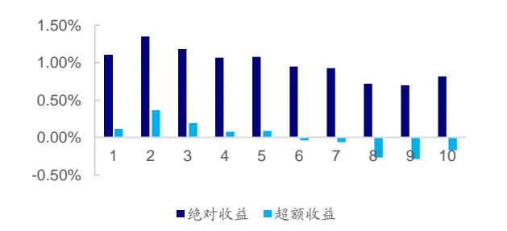
资料来源：Wind，海通证券研究所

图4 平均单笔成交金额因子相关性分析
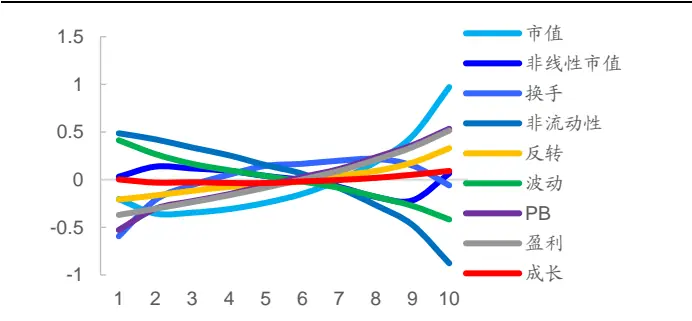
资料来源：Wind，海通证券研究所

图5 平均单笔成交金额因子（正交）分组收益
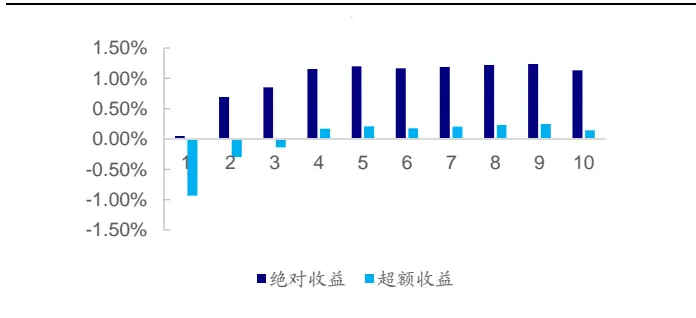
资料来源：Wind，海通证券研究所

图6 平均单笔成交金额因子 IC（正交）时间序列
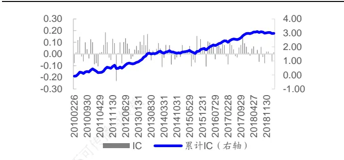
资料来源：Wind，海通证券研究所

## 2.3 平均单笔流出金额占比

平均单笔流出金额占比因子具有明显的选股效果，因子的 IC 和 rank IC 均值分别为5.8%和 7.4%，正向占比分别为 79%和 80%，IC-IR 和 rank IC-IR 分别为 2.76 和 3.08，多空组合月均收益差为 1.65%。

从分组特征上看，该因子与非流动性正相关、与换手率、市值、PB负相关，与其他因子相关性较低。

图7 平均单笔流出金额占比因子分组收益
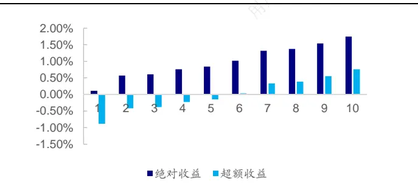
资料来源：Wind，海通证券研究所

图8 平均单笔流出金额占比因子多空净值
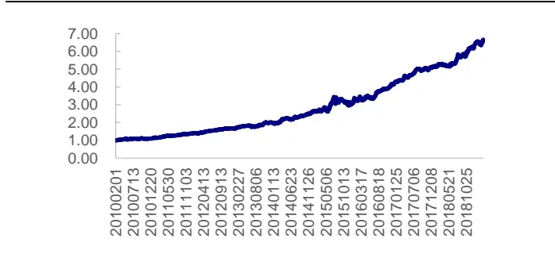
资料来源：Wind，海通证券研究所

图9 平均单笔流出金额占比因子 IC时间序列
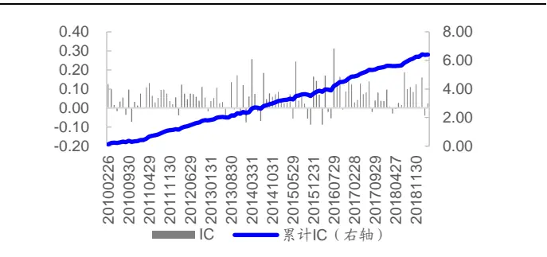
资料来源：Wind，海通证券研究所

图10 平均单笔流出金额占比因子相关性分析
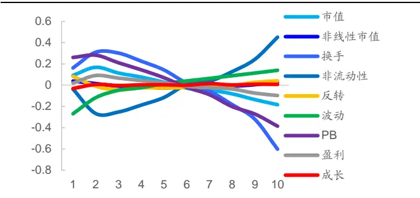
资料来源：Wind，海通证券研究所

平均单笔流出金额占比因子正交后选股效果仍然显著，多空组合月均收益差为1.09%，因子的 IC 和 rank IC 均值均为 3.2%，正向占比分别为 90%和 87%，IC-IR 和rank IC-IR 分别为 4.13 和 3.82。

图11 平均单笔流出金额占比因子（正交）分组收益
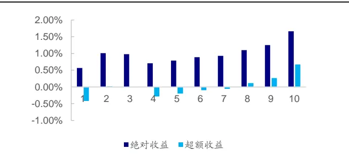
资料来源：Wind，海通证券研究所

图12 平均单笔流出金额占比因子（正交）IC时间序列
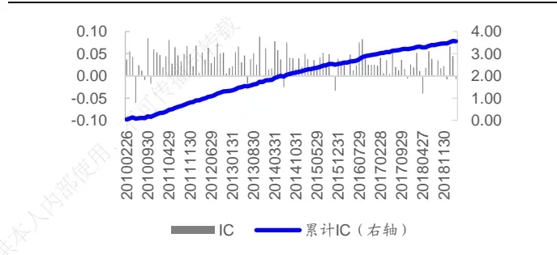
资料来源：Wind，海通证券研究所

我们下面使用双重分组法做进一步分析，首先按照每一个控制变量将所有股票等分6日为五组，在每组中再按新因子由小到大等分成五组，计算 5×5个组别中所有股票的平均01收益。在每个按新因子分成的组别中，计算 5 个控制变量组的平均收益。02

双重分组平均收益如下表所示，可以发现，控制了常见的因子后，该因子分组收益53仍然单调，首尾组合月均收益差均超过 1%，统计显著。67

表 2 平均单笔流出金额占比因子双重分组平均收益

|  | 市值 | 非线性 市值 | 换手 | 非流动性 | 反转 | 波动 | PB | 盈利 | 成长 |
| --- | --- | --- | --- | --- | --- | --- | --- | --- | --- |
| low | 0.39% | 0.37% | 0.46% | 0.43% | 0.40% | 0.47% | 0.46% | 0.29% | 0.33% |
| 第二组 | 0.78% | 0.71% | 0.75% | 0.81% | 0.66% | 0.65% | 0.72% | 0.68% | 0.70% |
| 第三组 | 0.95% | 0.93% | 0.95% | 1.03% | 0.93% | 0.93% | 0.86% | 0.96% | 0.91% |
| 第四组 | 1.26% | 1.31% | 1.18% | 1.22% | 1.32% | 1.31% | 1.22% | 1.34% | 1.33% |
| high | 1.56% | 1.61% | 1.61% | 1.45% | 1.63% | 1.57% | 1.68% | 1.66% | 1.66% |
| high-low | 1.17% | 1.24% | 1.15% | 1.02% | 1.22% | 1.10% | 1.22% | 1.37% | 1.33% |
| t值 | 4.70 | 5.18 | 6.56 | 4.18 | 6.46 | 4.92 | 8.21 | 5.93 | 5.65 |

资料来源：Wind，海通证券研究所

Fama-Macbeth 截面回归结果显示，平均单笔流出金额占比因子月均溢价为 0.31%，相应的 t统计量为 11.97，统计显著。平均单笔流出金额占比因子每上升 1个标准差，股票次月收益率平均上升 0.31%。

表 3 平均单笔流出金额占比因子 Fama-Macbeth回归结果

|  |  | 市值 | 非线性 市值 | 换手 | 非流动 性 | 反转 | 波动 | PB | 盈利 | 成长 | 新因子 |
| --- | --- | --- | --- | --- | --- | --- | --- | --- | --- | --- | --- |
| 方程1 | 回归系数 | -0.48% | 0.19% | -0.62% | 0.19% | -0.51% | 0.34% | 0.01% | 0.31% | 0.24% |  |
|  | t值 | -2.89 | 4.07 | -5.96 | 2.28 | -5.18 | 6.35 | 0.07 | 4.77 | 6.70 |  |
|  | 回归系数 | -0.48% | 0.19% | -0.62% | 0.19% | -0.51% | 0.34% | 0.01% | 0.31% | 0.24% | 0.31% |
| 方程2 | t值 | -2.88 | 4.07 | -5.95 | 2.28 | -5.18 | 6.35 | 0.07 | 4.77 | 6.70 | 11.97 |

资料来源：Wind，海通证券研究所

## 2.4 平均单笔流入金额占比

平均单笔流入金额占比因子在正交后有一定的选股效果，因子 IC 和 rank IC 均值分别为-2.1%和-1.5%，负向占比分别为 78%和 65%，IC-IR 和 rank IC-IR 分别为-2.43 和-1.70，多空组合月均收益差为 0.86%。

图 平均单笔流入金额占比因子分组收益
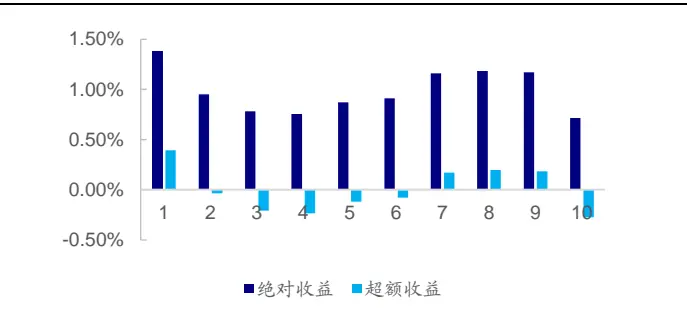
资料来源：Wind，海通证券研究所

图14 平均单笔流入金额占比因子 IC时间序列
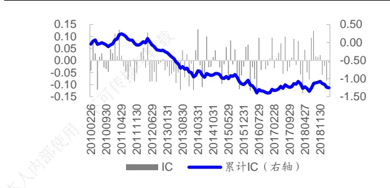
资料来源： ，海通证券研究所

图15 平均单笔流入金额占比因子（正交）分组收益
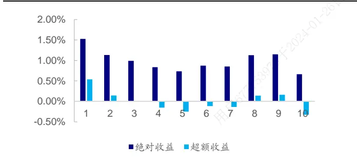
资料来源：Wind，海通证券研究所

图16 平均单笔流入金额占比因子（正交）IC时间序列
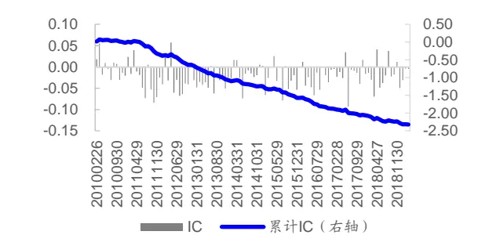
资料来源：Wind，海通证券研究所

## 2.5 平均单笔流入流出金额之比

平均单笔流入流出金额之比因子同样具有明显的选股效果，原始因子和正交因子的rank IC 均值分别为-3.1%和-2.4%，负向占比分别为 78%和 81%，rank IC-IR 分别为-2.51和-2.98，多空组合月均收益差分别为-1.17%和-1.05%。

图17 平均单笔流入流出金额之比因子分组收益
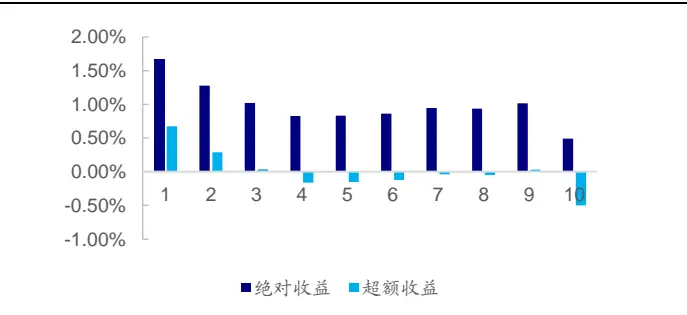
资料来源：Wind，海通证券研究所

图18 平均单笔流入流出金额之比因子相关性分析
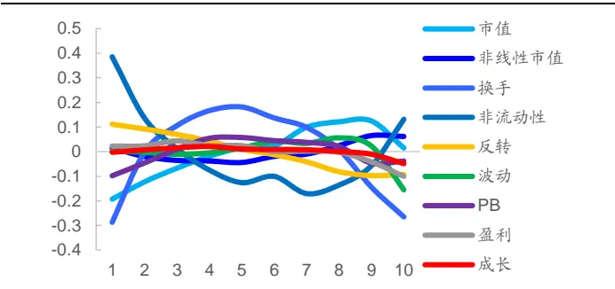
资料来源：Wind，海通证券研究所

图19 平均单笔流入流出金额之比因子（正交）分组收益
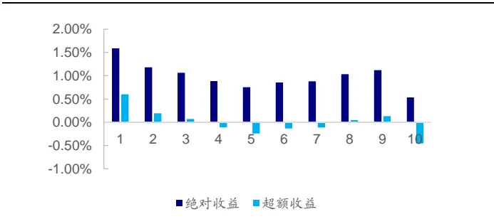
资料来源：Wind，海通证券研究所

图20 平均单笔流入流出金额之比因子（正交）IC时间序列
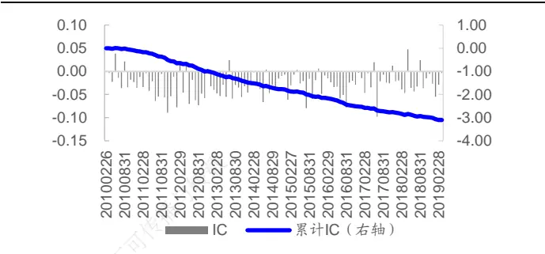
资料来源：Wind，海通证券研究所

## 2.6 本章小结

在本章中，我们使用股票的 分钟成交金额、成交笔数和收益率序列构建了平均单笔成交金额类因子。其中平均单笔流出金额占比因子具有较强的选股能力，与股票未来收益正相关，平均单笔流入金额占比与股票未来收益负相关，但选股能力较弱。我们从以下几个角度对该类因子的反转特性做出解释。

一方面，大单交易可能导致股票在短时间内大幅波动。我们构建的高频偏度因子同样描述了这一现象，高频偏度较低，即日内短时间大幅下跌的股票未来表现相对较好，背后的逻辑可能来自于市场对日内快速下跌风险的补偿。

另一方面，大单交易可能是主力的操纵行为。我们分析盘口挂单数据发现，在 2019年 1 月 31 日 9 时 43 分股票 A 出现大单买入之前的 9 时 40 分，十档委卖总量从 11 万股大幅跳升至 30 万股之上。在 2019 年 1 月 31 日 14时 14 分股票 B出现大单卖出之前的 13 时 58 分，十档委买总量从 14万股大幅跳升至 80 万股之上。这说明，虽然表面上看存在大单主动买入或卖出，实际上却帮助了事先潜伏的大单顺利成交，我们猜测这可能是主力的“对倒”行为，目的是引诱散户跟风交易。

图21 2019年 1月 31日股票 A十档委卖总量变化（股）
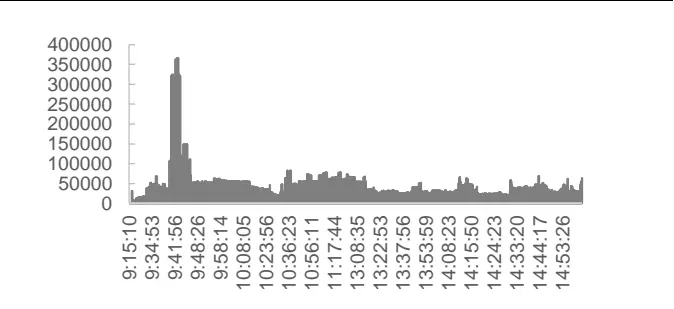
资料来源：Wind，海通证券研究所

图22 2019年 1月 31日股票 B十档委买总量变化（股）
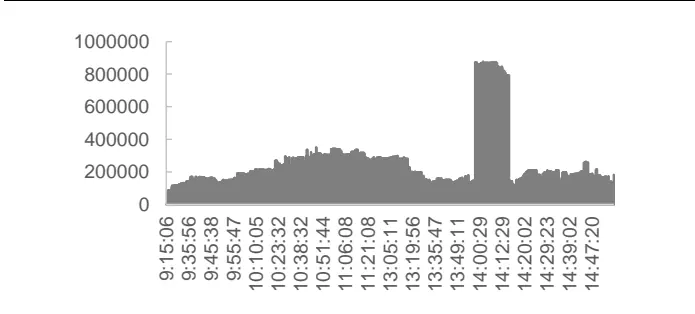
资料来源：Wind，海通证券研究所

## 3. 大单资金流向类因子

## 3.1 因子定义

每一交易日提取股票i的日内 1 分钟频率的收益率序列 $r_{ij},$ ，成交额序列 $Amt_{ij}$ 和成交笔数序列TrdNum ，计算每分钟的平均单笔成交金额AmtPerTrd ，将分钟 K 线按AmtPerTrd 从高到低排序，选择前 N（N=10%、20%、30%）的 K线，作为大单成交样本，记对应的 K线序号为IdxSet。

我们接下来使用筛选出的 K线集合计算以下指标：

- 大单资金净流入金额

$$
Amt\_netInFlow\_bigOrder_{i}=\sum_{j=1}^{N}Amt_{ij}\cdot I_{\left(r_{ij}>0,jeldxSet\right)}-\sum_{j=1}^{N}Amt_{ij}\cdot I_{\left(r_{ij}<0,jeldxSet\right)}
$$

- 大单资金净流入率

$$
\begin{array}{r}{Amt\_netInFlow\_bigOrder\_ratio_{i}=\:Amt\_netInFlow\_bigOrder_{i}/\sum_{j=1}^{N}Amt_{ij}}\end{array}
$$

- 大单驱动涨幅

$$
Mom\_bigOrder_{i}=prod(1+r_{ij}\cdot I_{\{j\epsilon IdxSet\}})
$$

使用股票过去 20 日指标均值作为因子值。

## 3.2 大单资金净流入率

大单资金净流入率（N=20%）因子具有明显的选股效果，原始因子和正交因子的 rankIC 均值分别为-5.6%和-2.2%，负向占比分别为 75%和 72%，rank IC-IR 分别为-2.77 和-2.39，多空组合月均收益差分别为-1.56%和-0.97%。

图23 大单资金净流入率因子（N=20%）分组收益
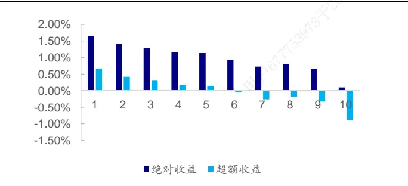
资料来源： ，海通证券研究所

图24 大单资金净流入率因子（N=20%）相关性分析
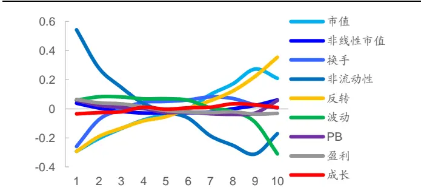
资料来源：Wind，海通证券研究所

图25 大单资金净流入率因子（N=20%，正交）分组收益
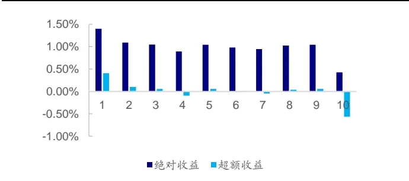
资料来源：Wind，海通证券研究所

图26 大单资金净流入率因子（N=20%，正交）IC时间序列
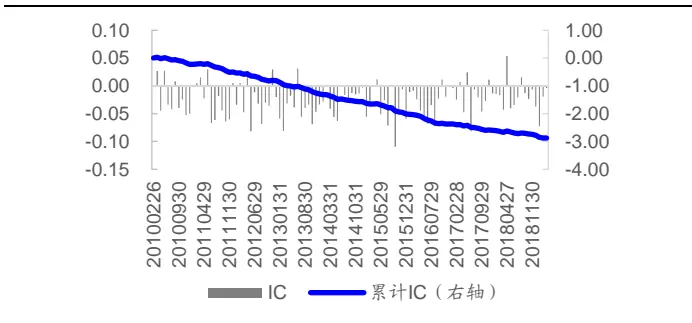
资料来源：Wind，海通证券研究所

双重分组平均收益如下表所示，控制了常见的因子后，该因子分组收益仍然单调，首尾组合月均收益差显著为负。

表 4 大单资金净流入率因子（N=20%）双重分组平均收益

|  | 市值 | 非线性 市值 | 换手 | 非流动性 | 反转 | 波动 | PB | 盈利 | 成长 |
| --- | --- | --- | --- | --- | --- | --- | --- | --- | --- |
| low | 1.44% | 1.47% | 1.47% | 1.25% | 1.42% | 1.49% | 1.50% | 1.53% | 1.51% |
| 第二组 | 1.14% | 1.23% | 1.15% | 1.19% | 1.11% | 1.20% | 1.27% | 1.24% | 1.26% |
| 第三组 | 1.06% | 1.03% | 1.08% | 1.10% | 0.99% | 0.96% | 0.97% | 1.00% | 0.99% |
| 第四组 | 0.87% | 0.84% | 0.83% | 0.95% | 0.82% | 0.82% | 0.76% | 0.77% | 0.78% |
| high | 0.43% | 0.36% | 0.40% | 0.43% | 0.59% | 0.47% | 0.44% | 0.39% | 0.38% |
| high-low | -1.01% | -1.11% | -1.08% | -0.82% | -0.83% | -1.02% | -1.06% | -1.13% | -1.13% |
| t值 | -6.05 | -6.11 | -5.49 | -5.39 | -5.64 | -5.76 | -6.21 | -6.12 | -6.00 |

资料来源： ，海通证券研究所

Fama-Macbeth 截面回归结果显示，大单资金净流入率因子月均溢价为-0.26%，相应的 t 统计量为-8.98，统计显著。大单资金净流入率因子每上升 1 个标准差，股票次月收益率平均下降 0.26%。

表 5 大单资金净流入率因子（N=20%）Fama-Macbeth 回归结果

|  |  | 市值 | 非线性 市值 | 换手 | 非流动 性 | 反转 | 波动 | PB | 盈利 | 成长 | 新因子 |
| --- | --- | --- | --- | --- | --- | --- | --- | --- | --- | --- | --- |
| 方程1 | 回归系数 | -0.48% | 0.19% | -0.62% | 0.19% | -0.51% | 0.34% | 0.01% | 0.31% | 0.24% |  |
|  | t值 | -2.89 | 4.07 | -5.96 | 2.28 | -5.18 | 6.35 | 0.07 | 4.77 | 6.70 |  |
|  | 回归系数 | -0.48% | 0.19% | -0.62% | 0.19% | -0.51% | 0.34% | 0.01% | 0.31% | 0.24% | -0.26% |
| 方程2 | t值 | -2.88 | 4.07 | -5.95 | 2.28 | -5.18 | 6.35 | 0.07 | 4.77 | 6.70 | -8.98 |

资料来源：Wind，海通证券研究所

## 3.3 大单驱动涨幅

大单驱动涨幅（N=30%）因子同样具有明显的选股效果，原始因子和正交因子的 rankIC 均值分别为-8.2%和-3.1%，负向占比分别为 92%和 86%，rank IC-IR 分别为-4.12 和-3.56，多空组合月均收益差分别为-2.23%和-1.08%。

图27 大单驱动涨幅因子（N=30%）分组收益
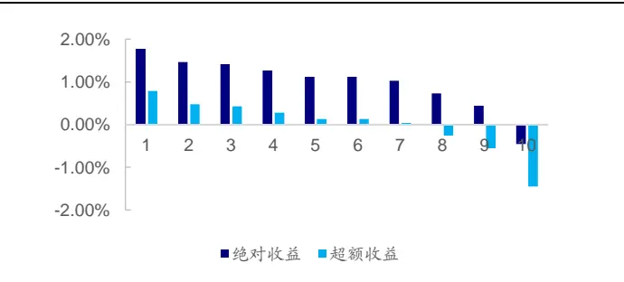
资料来源： ，海通证券研究所

图28 大单驱动涨幅因子（N=30%）相关性分析
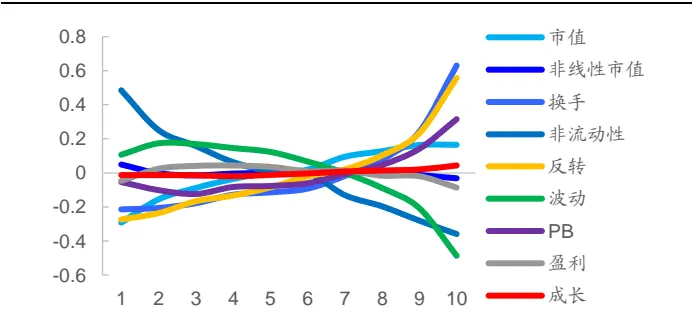
资料来源：Wind，海通证券研究所

图29 大单驱动涨幅因子（N=30%，正交）分组收益
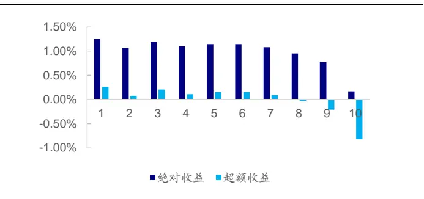
资料来源：Wind，海通证券研究所

图30 大单驱动涨幅因子（N=30%，正交）IC时间序列
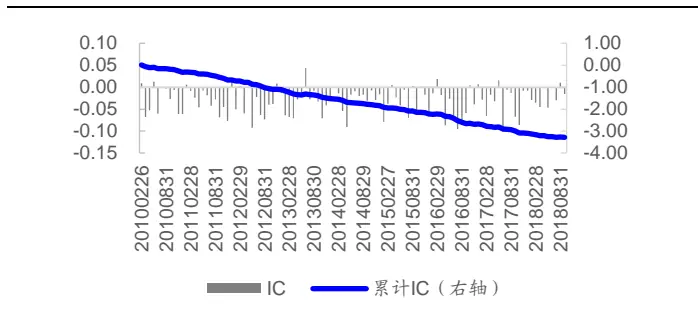
资料来源：Wind，海通证券研究所

双重分组平均收益如下表所示，控制了常见的因子后，该因子分组收益仍然单调，首尾组合月均收益差均超过-1%，统计显著。

表 6 大单驱动涨幅因子（N=30%）双重分组平均收益

|  | 市值 | 非线性 市值 | 换手 | 非流动性 | 反转 | 波动 | PB | 盈利 | 成长 |
| --- | --- | --- | --- | --- | --- | --- | --- | --- | --- |
| low | 1.50% | 1.58% | 1.58% | 1.41% | 1.53% | 1.53% | 1.61% | 1.64% | 1.63% |
| 第二组 | 1.31% | 1.31% | 1.24% | 1.29% | 1.26% | 1.28% | 1.27% | 1.31% | 1.29% |
| 第三组 | 1.10% | 1.09% | 1.04% | 1.10% | 1.07% | 1.07% | 1.09% | 1.15% | 1.15% |
| 第四组 | 0.94% | 0.94% | 0.87% | 0.90% | 0.91% | 0.89% | 0.86% | 0.85% | 0.88% |
| high | 0.08% | 0.02% | 0.20% | 0.25% | 0.17% | 0.15% | 0.10% | -0.02% | -0.03% |
| high-low | -1.43% | -1.56% | -1.38% | -1.16% | -1.36% | -1.38% | -1.51% | -1.66% | -1.66% |
| t值 | -7.36 | -8.06 | -7.54 | -6.39 | -9.68 | -7.61 | -8.34 | -8.53 | -8.26 |

资料来源：Wind，海通证券研究所

Fama-Macbeth 截面回归结果显示，大单驱动涨幅因子月均溢价为-0.3%，相应的 t统计量为-10.93，统计显著。大单驱动涨幅因子每上升 1 个标准差，股票次月收益率平均下降 0.3%

表 7 大单驱动涨幅因子（N=30%）Fama-Macbeth 回归结果

|  |  | 市值 | 非线性 市值 | 换手 | 非流动 性 | 反转 | 波动 | PB | 盈利 | 成长 | 新因子 |
| --- | --- | --- | --- | --- | --- | --- | --- | --- | --- | --- | --- |
| 方程1 | 回归系数 | -0.48% | 0.19% | -0.62% | 0.19% | -0.51% | 0.34% | 0.01% | 0.31% | 0.24% |  |
|  | t值 | -2.89 | 4.07 | -5.96 | 2.28 | -5.18 | 6.35 | 0.07 | 4.77 | 6.70 |  |
|  | 回归系数 | -0.48% | 0.19% | -0.62% | 0.19% | -0.51% | 0.34% | 0.01% | 0.31% | 0.24% | -0.30% |
| 方程2 | t值 | -2.88 | 4.07 | -5.95 | 2.28 | -5.17 | 6.35 | 0.07 | 4.77 | 6.70 | -10.93 |

资料来源：Wind，海通证券研究所

## 3.4 参数敏感性分析

大单资金净流入和大单驱动涨幅因子在不同参数下的表现如下表所示，因子在各参数下均有明显的选股效果，敏感性相对较低。

表 8 原始因子在不同参数下的表现

|  | IC 均值 | ICIR | 胜率 | rIC 均值 | rICIR | rIC 胜率 | 多空月均 收益 | 多空胜率 |
| --- | --- | --- | --- | --- | --- | --- | --- | --- |
| 大单资金净流入率（N=10%） | -4.15% | -3.33 | 17.3% | -4.06% | -2.94 | 20.9% | -1.31% | 20.91% |
| 大单资金净流入率（N=20%） | -5.04% | -2.88 | 22.7% | -5.59% | -2.77 | 24.5% | -1.31% | 20.91% |
| 大单资金净流入率（N=30%） | -4.99% | -2.25 | 28.2% | -5.78% | -2.27 | 28.2% | -1.52% | 29.09% |
| 大单驱动涨幅（N=10%） | -5.46% | -3.40 | 17.3% | -5.88% | -3.67 | 15.5% | -1.85% | 16.36% |
| 大单驱动涨幅（N=20%） | -6.68% | -3.81 | 10.0% | -7.59% | -4.45 | 5.5% | -2.04% | 15.45% |
| 大单驱动涨幅（N=30%） | -6.98% | -3.43 | 11.8% | -8.22% | -4.12 | 8.2% | -2.23% | 16.36% |

资料来源：Wind，海通证券研究所

表 9 正交因子在不同参数下的表现

|  | IC 均值 | ICIR | 胜率 | rIC 均值 | rICIR | rIC 胜率 | 多空月均 收益 | 多空胜率 |
| --- | --- | --- | --- | --- | --- | --- | --- | --- |
| 大单资金净流入率（N=10%） | -2.81% | -3.42 | 16.4% | -2.25% | -2.70 | 22.7% | -0.99% | 16.36% |
| 大单资金净流入率（N=20%） | -2.61% | -3.05 | 20.0% | -2.19% | -2.39 | 28.2% | -0.97% | 18.18% |
| 大单资金净流入率（N=30%） | -1.95% | -2.19 | 26.4% | -1.59% | -1.63 | 34.5% | -0.73% | 24.55% |
| 大单驱动涨幅（N=10%） | -3.35% | -3.73 | 12.7% | -2.96% | -3.47 | 16.4% | -1.22% | 16.36% |
| 大单驱动涨幅（N=20%） | -3.61% | -4.17 | 13.6% | -3.41% | -3.97 | 13.6% | -1.19% | 14.55% |
| 大单驱动涨幅（N=30%） | -3.18% | -3.65 | 13.6% | -3.14% | -3.56 | 13.6% | -1.08% | 16.36% |

资料来源：Wind，海通证券研究所

## 3.5 本章小结

在本章中，我们以每日平均单笔成交金额最大的一定比例的分钟 K线为样本，构建了大单资金净流入率和大单驱动涨幅因子，二者均与股票下月收益率显著负相关。这一结论可能与使用 Wind 提供的 level2 行情指标构建的相关因子表现不一致，主要原因在于 Wind 采用了静态的划分方式，例如挂单金额在 100 万元以上的为超大单。而本文采取的是动态的划分方式，对于每只股票都提取出一部分行情作为大单交易样本。

## 4. 日内分时成交因子对现有模型的改进

## 4.1 因子相关性分析

日内分时成交因子的相关系数矩阵如以下图表所示，可以发现各因子间相关性普遍较高。因此，我们从三类因子中各挑选一个做进一步分析，分别是平均单笔流出金额占比、大单资金净流入（N=20%），以及大单驱动涨幅（N=30%）。

图31 原始因子值相关性
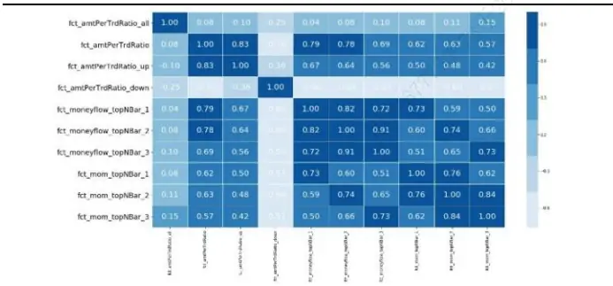
资料来源：Wind，海通证券研究所

图32 原始因子 IC相关性
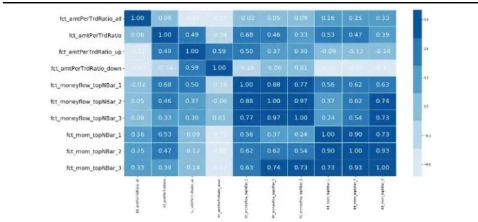
资料来源：Wind，海通证券研究所

图33 正交因子值相关性
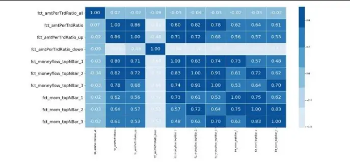
资料来源：Wind，海通证券研究所

图34 正交因子 IC相关性
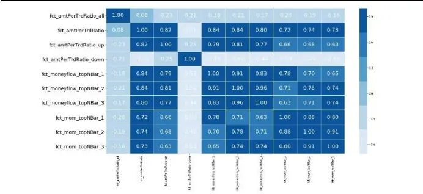
资料来源：Wind，海通证券研究所

当同时使用以上三个因子去解释股票下月截面收益时，大单资金净流入因子不再显著，平均单笔流出金额占比和大单驱动涨幅因子依然显著。

表 10 日内分时成交因子 Fama-Macbeth 回归结果

|  |  | 市值 | 非线性 市值 | 换手 | 非流 动性 | 反转 | 波动 | PB | 盈利 | 成长 | 平均单 笔流出 金额占 | 大单 资金 净流入 | 大单 驱动 涨幅 |
| --- | --- | --- | --- | --- | --- | --- | --- | --- | --- | --- | --- | --- | --- |
| 方程1 |  | 回归系数 -0.48% | 0.19% | -0.62% | 0.19% | -0.51% | 0.34% | 0.01% | 0.31% | 0.24% | 比 0.31% |  |  |
| 方程2 | t值 | -2.88 | 4.07 | -5.95 | 2.28 | -5.18 | 6.35 | 0.07 | 4.77 | 6.70 | 11.97 |  |  |
|  | 回归系数 | -0.48% | 0.19% | -0.62% | 0.19% | -0.51% | 0.34% | 0.01% | 0.31% | 0.24% |  | -0.26% |  |
|  | t值 | -2.88 | 4.07 | -5.95 | 2.28 | -5.18 | 6.35 | 0.07 | 4.77 | 6.70 |  | -8.98 |  |
| 方程3 | 回归系数 | -0.48% | 0.19% | -0.62% | 0.19% | -0.51% | 0.34% | 0.01% | 0.31% | 0.24% |  |  | -0.30% |
|  | t值 | -2.88 | 4.07 | -5.95 | 2.28 | -5.17 | 6.35 | 0.07 | 4.77 | 6.70 |  |  | -10.93 |
|  | 回归系数 | -0.48% | 0.19% | -0.61% | 0.19% | -0.51% | 0.34% | 0.00% | 0.31% | 0.24% | 0.22% | 0.03% | -0.21% |
| 方程4 | t值 | -2.87 | 4.16 | -5.92 | 2.28 | -5.04 | 6.44 | -0.02 | 4.66 | 6.61 | 4.17 | 0.58 | -6.27 |

资料来源：Wind，海通证券研究所

## 4.2 因子对现有模型的改进

接下来我们考察日内分时成交因子对多因子模型的边际影响，分别构建了一个基准模型和三个改进模型，具体如下所示：

基准模型：市值、非线性市值、反转、换手、特异度、流动性、估值、盈利、成长9 因子。因子间两两正交后按过去 24 个月 IC加权。

改进模型 1：9 因子+平均单笔流出金额占比。

改进模型 2：9 因子+大单驱动涨幅（N=30%）。

改进模型 3：9 因子+平均单笔流出金额占比+大单驱动涨幅（N=30%）。

表 11日内分时成交因子对现有模型的提升

|  | 基准模型 |  | 改进模型1 |  | 改进模型2 |  | 改进模型3 |
| --- | --- | --- | --- | --- | --- | --- | --- |
|  | IC | rank IC | IC | rank IC | IC rank IC | IC | rank IC |
| 均值 | 10.51% | 13.21% | 10.91% | 13.57% | 10.92% 13.51% | 11.05% | 13.64% |
| IR | 3.59 | 4.08 | 3.77 | 4.22 | 3.75 4.21 | 3.82 | 4.26 |
| 胜率 | 86.00% | 89.53% | 87.21% | 89.53% | 87.21% 90.70% | 88.37% | 90.70% |
|  | 年化收益 | 信息比率 | 年化收益 | 信息比率 | 年化收益 信息比率 | 年化收益 | 信息比率 |
| 多头 top100 组合 | 33.10% | 1.01 | 34.21% | 1.06 | 34.75% 1.06 | 34.93% | 1.07 |

资料来源：Wind，海通证券研究所

加入分时成交因子后，多因子模型的 IC、IR、胜率以及多头组合的表现均有所提升。以改进模型 3 为例，rank IC 从 13.21%提高至 13.64%，rank IC-IR 从 4.08 提高至 4.26，预期收益率最高的 100 只股票的等权组合年化收益率从 33.10%提高至 34.93%。

## 5. 总结

日内分时成交具有额外信息，我们使用 1 分钟频率的收益率、成交金额以及成交笔数构建了平均单笔成交金额、大单资金流向等多个因子。

平均单笔流出金额占比与股票未来收益正相关，平均单笔流入金额占比与股票未来收益负相关，呈现出明显的反转特征，这可能与风险补偿以及主力操纵行为有关。

我们可以根据平均单笔成交金额大小提炼分钟 K线信息，进而构建大单资金流向因子，包括大单资金净流入率和大单驱动涨幅等，也均为反转类因子。

把日内分时成交因子加入现有多因子模型中，具有一定的提升效果。

## 6. 风险提示

因子失效风险、流动性风险。

## 信息披露

分析师声明

[Table冯佳睿yst金融工程研究团队s]

姚石金融工程研究团队

本人具有中国证券业协会授予的证券投资咨询执业资格，以勤勉的职业态度，独立、客观地出具本报告。本报告所采用的数据和信息均来自市场公开信息，本人不保证该等信息的准确性或完整性。分析逻辑基于作者的职业理解，清晰准确地反映了作者的研究观点，结论不受任何第三方的授意或影响，特此声明。

## 法律声明

本报告仅供海通证券股份有限公司（以下简称“本公司”）的客户使用。本公司不会因接收人收到本报告而视其为客户。在任何情况下，本报告中的信息或所表述的意见并不构成对任何人的投资建议。在任何情况下，本公司不对任何人因使用本报告中的任何内容所引致的任何损失负任何责任。

本报告所载的资料、意见及推测仅反映本公司于发布本报告当日的判断，本报告所指的证券或投资标的的价格、价值及投资收入可能传会波动。在不同时期，本公司可发出与本报告所载资料、意见及推测不一致的报告。可

市场有风险，投资需谨慎。本报告所载的信息、材料及结论只提供特定客户作参考，不构成投资建议，也没有考虑到个别客户特殊的用投资目标、财务状况或需要。客户应考虑本报告中的任何意见或建议是否符合其特定状况。在法律许可的情况下，海通证券及其所属部关联机构可能会持有报告中提到的公司所发行的证券并进行交易，还可能为这些公司提供投资银行服务或其他服务。人

本报告仅向特定客户传送，未经海通证券研究所书面授权，本研究报告的任何部分均不得以任何方式制作任何形式的拷贝、复印件或复制品，或再次分发给任何其他人，或以任何侵犯本公司版权的其他方式使用。所有本报告中使用的商标、服务标记及标记均为本公司的商标、服务标记及标记。如欲引用或转载本文内容，务必联络海通证券研究所并获得许可，并需注明出处为海通证券研究所，且下不得对本文进行有悖原意的引用和删改。26

根据中国证监会核发的经营证券业务许可，海通证券股份有限公司的经营范围包括证券投资咨询业务。24

## 海通证券股份有限公司研究所[Table_PeopleInfo]

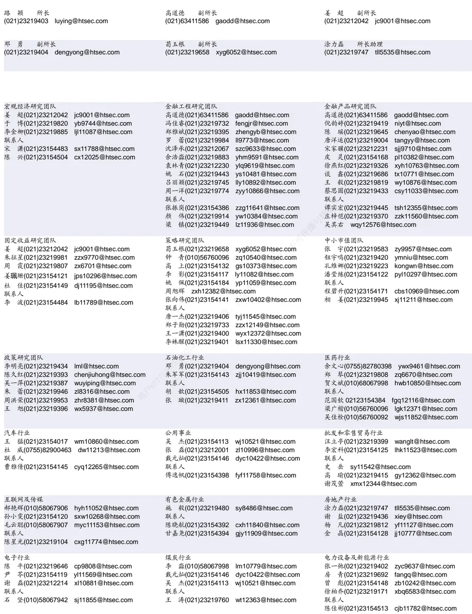

| 非银行金融行业 |  | 交通运输行业 |  | 纺织服装行业 |  |
| --- | --- | --- | --- | --- | --- |
|  | 孙 婷(010)50949926 st9998@htsec.com |  | 虞 楠(021)23219382 yun@htsec.com |  | 梁 希(021)23219407 lx11040@htsec.com |
|  | 何 婷(021)23219634 ht10515@htsec.com |  | 罗月江（010）56760091 lyj12399@htsec.com | 联系人 |  |
| 联系人 |  | 联系人 |  | 盛开(021)23154510 | sk11787@htsec.com |
|  | 李芳洲(021)23154127 Ifz11585@htsec.com |  | 李 丹(021)23154401 Id11766@htsec.com | 刘 溢(021)23219748 | ly12337@htsec.com |

| 建筑建材行业 | 机械行业 | 钢铁行业 |
| --- | --- | --- |
| 冯晨阳(021)23212081 fcy10886@htsec.com 联系人 | 余炜超(021)23219816 swc11480@htsec.com 耿 耘(021)23219814 gy10234@htsec.com | 刘彦奇(021)23219391 liuyq@htsec.com 刘 璇(0755)82900465 lx11212@htsec.com |
| 申 浩(021)23154114 sh12219@htsec.com | 杨 震(021)23154124 yz10334@htsec.com 沈伟杰(021)23219963 swj11496@htsec.com | 联系人 周慧琳(021)23154399 zhl11756@htsec.com |

| 建筑工程行业 |  | 农林牧渔行业 | 食品饮料行业 |  |
| --- | --- | --- | --- | --- |
| 杜市伟(0755)82945368 dsw11227@htsec.com |  | 丁 频(021)23219405 dingpin@htsec.com | 闻宏伟(010)58067941 whw9587@htsec.com |  |
| 张欣劫 zxj12156@htsec.com |  | 陈雪丽(021)23219164 cxl9730@htsec.com | 成 珊(021)23212207 | cs9703@htsec.com |
| 李富华(021)23154134 Ifh12225@htsec.com |  | 陈 阳(021)23212041 cy10867@htsec.com | 唐 | 宇(021)23219389 ty11049@htsec.com |
|  | 联系人 | 孟亚琦 myq12354@htsec.com |  |  |

| 军工行业 |  | 银行行业 |  | 社会服务行业 |  |
| --- | --- | --- | --- | --- | --- |
|  | 蒋 俊(021)23154170 jj11200@htsec.com |  | 孙 婷(010)50949926 st9998@htsec.com |  | 汪立亭(021)23219399 wanglt@htsec.com |
|  | 刘 磊(010)50949922 II11322@htsec.com |  | 解巍巍 xww12276@htsec.com | 不可传播 | 陈扬扬(021)23219671 cyy10636@htsec.com |
| 张恒晅 zhx10170@htsec.com |  |  | 林加力(021)23214395 ljl12245@htsec.com | 许樱之 xyz11630@htsec.com |  |
| 联系人 谭敏沂(0755)82900489 tmy10908@htsec.com |  |  |  |  |  |
| 张宇轩(021)23154172 zyx11631@htsec.com |  |  |  |  |  |

| 家电行业 |  | 造纸轻工行业 |  |
| --- | --- | --- | --- |
| 陈子仪(021)23219244 chenzy@htsec.com |  |  | 衣桢永(021)23212208 yzy12003@htsec.com |
| 李 阳(021)23154382 ly11194@htsec.com |  | 曾 知(021)23219810 zz9612@htsec.com |  |
| 联系人 | 朱默辰(021)23154383 zmc11316@htsec.com | 赵 洋(021)23154126 zy10340@htsec.com EE |  |

## 研究所销售团队

深广地区销售团队

蔡铁清(0755)82775962 ctq5979@htsec.com

伏财勇(0755)23607963 fcy7498@htsec.com

辜丽娟(0755)83253022 gulj@htsec.com

刘晶晶(0755)83255933 liujj4900@htsec.com

王雅清(0755)83254133 wyq10541@htsec.com

饶 伟(0755)82775282 rw10588@htsec.com

欧阳梦楚(0755)23617160

oymc11039@htsec.com

巩柏含 gbh11537@htsec.com

上海地区销售团队
胡雪梅(021)23219385 huxm@htsec.com
朱 健(021)23219592 zhuj@htsec.com
季唯佳(021)23219384 jiwj@htsec.com
黄 毓(021)23219410 huangyu@htsec.com
漆冠男(021)23219281 qgn10768@htsec.com
胡宇欣(021)23154192 hyx10493@htsec.com
黄 诚(021)23219397 hc10482@htsec.com
毛文英(021)23219373 mwy10474@htsec.com
马晓男 mxn11376@htsec.com
杨祎昕(021)23212268 yyx10310@htsec.com
张思宇 zsy11797@htsec.com
慈晓聪(021)23219989 cxc11643@htsec.com
王朝领 wcl11854@htsec.com
邵亚杰 23214650 syj12493@htsec.com
李 寅 021-23219691 ly12488@htsec.com北京地区销售团队
殷怡琦(010)58067988 yyq9989@htsec.com郭 楠 010-5806 7936 gn12384@htsec.com张丽萱(010)58067931 zlx11191@htsec.com杨羽莎(010)58067977 yys10962@htsec.com杜 飞 df12021@htsec.com
张 杨(021)23219442 zy9937@htsec.com何 嘉(010)58067929 hj12311@htsec.com李 婕 lj12330@htsec.com
欧阳亚群 oyyq12331@htsec.com

海通证券股份有限公司研究所

地址：上海市黄浦区广东路 689号海通证券大厦 9楼

电话：（021）23219000

传真：（021）23219392

网址：www.htsec.com