## [Tab相关研究

Table_ReportInfo]《因子投资与 Smart Beta 研究（五）—

—反向剔除的因子组合》2019.04.26

《金融科技（Fintech）和数据挖掘研究

（二）——知识图谱的构建与应用》2019.04.23

《债基量化研究系列 ——哪些因素会影响债基管理人的股债配臵决策？》2019.04.23

分析师:冯佳睿

Tel:(021)23219732

Email:fengjr@htsec.com

证书:S0850512080006

分析师:袁林青

Tel:(021)23212230

Email:ylq9619@htsec.com

证书:S0850516050003

# 选股因子系列研究（四十七）——捕捉投资者的交易意愿

## 投资要点：

近年来，随着投资者对于技术因子挖掘的深入，能够给模型提供额外选股能力的技术因子也越来越少。考虑到现有的技术因子多基于成交数据计算得到，本文考虑使用盘口委托挂单数据构建因子，挖掘成交之外的信息。

开盘后 分钟平均净委买变化率因子具有较强的月度选股能力。回测结果表明，股票开盘后 分钟的平均净委买变化率越高，股票未来的相对收益表现越好。若将开盘后 30 分钟的平均净委买变化率看作是投资者对于前一天收盘后股票信息的集中反馈，那么该因子与股票未来收益之间的正相关性则表明，投资者对于信息的集中反馈越正面，体现出的买入意愿越强，股票未来的超额收益表现越好。

净委买变化率波动率因子具有较强的月度选股能力。除了使用收盘前 分钟数据计算得到净委买变化率波动率因子选股效果不佳外，其余时段数据计算得到的因子皆具有显著的月度选股能力。从时段上看，午开盘后 分钟净委买变化率波动率因子的月度选股能力最强。回测结果表明，净委买变化率波动率越高，股票未来的相对收益表现越好。

- 开盘后 30分钟净委买变化率偏度因子具有一定的月度选股能力。回测结果表明，股票开盘后 30 分钟的净委买变化率偏度越高，股票未来的相对收益表现越好。偏度因子刻画了股票净委买变化率的极值的特征，因子回测结果表明，开盘后 30分钟内股票净委买出现大幅跳升的概率越大，股票未来超额收益表现越好。

- 各类因子内皆存在一定的截面相关性，各时段的净委买变化率波动率因子之间的截面相关性较强。此外，同一时段内的平均净委买变化率与净委买变化率偏度正相关。净委买变化率波动率与其余两类因子之间的截面相关性较低。各因子在单独加入传统的多因子模型后，皆能提供显著的额外选股能力。在包含平均净委买变化率因子以及净委买变化率波动率因子的模型中，净委买变化率偏度因子所能提供的额外收益较为有限。

- 开盘后 30 分钟平均净委买变化率因子在中大盘指数内表现较好。使用前 1 档委托挂单数据计算得到的开盘后 30 分钟平均净委买变化率因子在中大盘指数内依旧具有显著的选股能力。净委买变化率波动率以及偏度因子在中大盘指数内的选股能力偏弱。

- 在不同的换仓频率下，开盘后 30 分钟平均净委买变化率因子以及净委买变化率偏度因子依旧具有选股能力，而净委买变化率波动率因子的选股能力偏弱。

- 风险提示。市场系统性风险、资产流动性风险以及政策变动风险会对策略表现产生较大影响。

近年来，随着投资者对于技术因子挖掘的深入，能够给模型提供额外选股能力的技术因子也越来越少。考虑到现有的技术因子多基于成交数据计算得到，本文考虑使用盘口委托挂单数据构建因子，挖掘成交之外的信息。

本文主要分为八个部分，第一部分介绍了盘口委托挂单因子的构建思路，第二部分展示了盘口委托挂单因子的月度选股效果，第三部分展示了各因子间的相关性情况，第四部分讨论了因子在不同指数内的选股效果，第五部分讨论了因子在不同换仓周期下的选股效果，第六部分总结了本文的研究成果，第七部分提示了风险。

## 1. 成交之外的信息

在系列前期报告中，我们基于成交信息构建了各类技术类选股因子。随着研究的深入，能够在前期因子之上继续提供额外选股能力的技术因子已经越来越少。那么，挖掘技术因子的突破口在哪里呢？我们不妨先回顾一下现有的技术类因子的数据源。

总的来看，我们可简单将交易数据分为日间数据以及日内数据两种。而日内数据又可按照数据频率大致分为：分钟数据、快照数据（成交快照、委托快照）以及逐笔数据（逐笔成交、逐笔委托）。总结现有的高频因子不难发现，技术类因子已基本覆盖了日间交易数据、日内分钟级别交易数据。对于快照以及逐笔数据，现有的因子大多聚焦在主动买入、主动卖出等与成交相关的方面。因此，委托快照以及逐笔委托数据无疑是一个可以重点考虑的方向。委托快照数据提供了盘口委托挂单情况，考虑到盘口委托信息体现了投资者未实现的交易意愿，这无疑是一个较为合适的切入点。本文就将基于盘口委托快照数据构建选股因子。我们也将在后续的研究报告中对于其他类型的数据进行研究讨论。

由于现有的盘口委托快照数据包含买一至买十的委买量、卖一至卖十的委卖量、总委买量以及总委卖量，因此可考虑计算各时点间、各档位委买量以及委卖量的变化，并计算委买变化量与委卖变化量的差值，得到净委买变化量。若假定委买量的增加代表了投资者买入意愿的增强，而委卖量的增加代表了投资者卖出意愿的增强，那么可以认为净委买变化量体现了投资者买入意愿的变化。考虑到委托挂单的变化与股票本身股本有一定的关联，因此本文将净委买变化量除以股票流通股本，得到净委买变化率。指标计

$$
\begin{array}{rl}&{\check{\mathcal{\bar{\Psi}}}\underset{\mathbf{\mathcal{K}}}{\mathbb{\mathcal{Z}}}\underset{\mathbf{\mathcal{K}}}{\mathbb{\mathcal{Z}}}\underset{\mathbf{\mathcal{K}}}{\mathbb{\mathcal{Z}}}\underset{k,t}{\mathcal{\bar{F}}}=\overset{\underset{\mathbf{\mathcal{F}}}{\mathbb{\mathcal{Z}}}}{\overbrace{\frac{\Phi}{\Phi}\underset{\mathbf{\mathcal{K}}}{\mathbb{\mathcal{Z}}}}\underset{\mathbf{\mathcal{K}}}{\mathbb{\mathcal{Z}}}}\underset{\mathbf{\mathcal{K}}}{\mathbb{\mathcal{Z}}}\underset{k,t}{\mathbb{\mathcal{Z}}}}\\&\underset{\mathbf{\mathcal{\bar{H}}}\underset{\mathbf{\mathcal{K}}}{\mathbb{\mathcal{Z}}}}\underset{\mathbf{\mathcal{K}}}{\mathbb{\mathcal{Z}}}\underset{\mathbf{\mathcal{Z}}}{\mathbb{\mathcal{Z}}}\underset{k,t}{\mathbb{\mathcal{Z}}}=\overset{k}{\underset{j=1}{\overset{k}{\mathbb{Z}}}\underset{\mathbf{\mathcal{K}}}{\mathbb{\mathcal{Z}}}}\underset{\mathbf{\mathcal{K}}}{\mathbb{\mathcal{Z}}}\underset{j,t}{\mathbb{\mathcal{Z}}}-\underset{j=1}{\overset{k}{\sum}}\underset{\mathbf{\mathcal{K}}}{\mathbb{\mathcal{Z}}}\underset{\mathbf{\mathcal{Z}}}{\mathbb{\mathcal{Z}}}\underset{\mathbf{\mathcal{Z}}}{\mathbb{\mathcal{Z}}}\underset{j,t}{\mathbb{\mathcal{Z}}}\underset{\mathbf{\mathcal{Z}}}{\mathbb{\mathcal{Z}}}\underset{\mathbf{\mathcal{K}}}{\mathbb{\mathcal{Z}}}\underset{j,t}{\mathbb{\mathcal{Z}}}\underset{\mathbf{\mathcal{Z}}}{\mathbb{\mathcal{Z}}}\underset{j,t}{\mathbb{\mathcal{Z}}}\underset\end{array}
$$

其中，净委买变化率 $\tau_{\mathbf{k},\mathbf{t}}$ 为 T 日 t至 t+1 时刻间，使用前 k 档数据计算得到的净委买变化率，净委买变化量 $\mathsf{T}_{\mathsf{k,t}}$ 为 T 日 t至 t+1 时刻间，使用前 k 档数据计算得到的净委买变化量,流通股本 为 T 日股票的流通股本，委买变化量 $\tau_{\mathrm{j,t}}$ 为 T 日 t至 t+1 时刻间，第j档委买的变化量，委卖变化量 $\tau_{\mathrm{j,t}}$ 为 T 日 t至 t+1 时刻间，第j 档委卖的变化量。

本文在构建因子时主要参考了专题报告《选股因子系列研究（十九）——高频因子之股票收益分布特征》中的方法，对于净委买变化率的均值、标准差以及偏度的选股效果进行了回测。考虑到投资者在开盘后以及收盘前的交易行为更能够体现出投资者对于信息的反馈以及交易意愿，本文不仅使用全天数据计算因子，还围绕早上以及下午的开盘、收盘时点选取30分钟的时间段计算因子。本文将9:00~14:57简称为全天，9:00~9:30简称为开盘后，将 11:00~11:30 简称为早收盘前，将 13:00~13:30 简称为午开盘后，将14:26~14:57简称为收盘前，将9:30~14:26简称为盘中。

基于上述思路，本文共构建了平均净委买变化率、净委买变化率波动率以及净委买变化率偏度三类因子。股票 i在 T 日使用前 k 档委托挂单数据计算得到的各指标如下所示：

$$
\begin{array}{rl}&{\quad\mp\frac{4\sqrt{3}}{9}\dddot{\hat{\mathcal{H}}}\frac{\sqrt{3}}{\sqrt{3}}\Updownarrow\ll\frac{\sqrt{3}}{3}\ll1\ll\frac{T}{6}=mean({\sqrt{\frac{4}{9}}\Updot{\hat{\mathcal{H}}}\frac{\sqrt{3}}{3}\Updownarrow\ll\frac{T}{6}}{\sqrt{6}}{\sqrt{6}}{\sqrt{6}}{\sqrt{6}}{\sqrt{6}}}\\&{\quad\times\frac{2}{9}\Updownarrow\ll\frac{\sqrt{3}}{3}\ll1\ll\frac{\sqrt{3}}{3}\ll1\ll\frac{T}{6})\Leftarrow\frac{T}{6}=std({\sqrt{\frac{4}{9}}\Updownarrow\ll\frac{\sqrt{3}}{3}\ll1\ll\frac{\sqrt{3}}{6}}{\sqrt{6}}{\sqrt{6}}{\sqrt{6}}{\sqrt{6}}{\sqrt{6}}}\\&{\quad\quad\quad\quad\quad\quad\quad\quad\quad\quad\quad\quad\quad\quad\quad\quad\quad\quad\quad\quad\quad\quad\quad}\\&{\quad\quad\quad\quad\quad\quad\quad\quad\quad\quad\quad\quad\quad\quad\quad\quad\quad\quad\quad\quad\quad\quad\quad\quad\quad\quad\quad\quad\quad\quad\quad\quad\quad}\\&{\quad\quad\quad\quad\quad\quad\quad\quad\quad\quad\quad\quad\quad\quad\quad\quad\quad\quad\quad\quad\quad\quad\quad\quad\quad\quad\quad\quad\quad\quad\quad\quad\quad\quad\quad}\\&{\quad\quad\quad\quad\quad\quad\quad\quad\quad\quad\quad\quad\quad\quad\quad\quad\quad\quad\quad\quad\quad\quad\quad\quad\quad\quad\quad\quad\quad\quad\quad\quad\quad\quad\quad\quad\quad}\\&{\quad\quad\quad\quad\quad\quad\quad\quad\quad\quad\quad\quad\quad\quad\quad\quad\quad\quad\quad\quad\quad\quad\quad\quad\quad\quad\quad\quad\quad\quad\quad\quad\quad\quad\quad\quad\quad\quad}\\&\end{array}
$$

在任意时点上，可使用回看窗口中股票的平均净委买变化率、净委买变化率波动率以及净委买变化率偏度的中位数或者均值作为因子值。更多关于因子计算的处理细节可咨询报告作者。

## 2. 因子月度选股效果回测

本部分使用了 年以来的委托快照数据，构建了月度选股因子，并在全市场股票范围内（剔除新股）对于因子的选股效果进行了回测。为了能够检验因子在传统技术因子外所蕴含的选股能力，本文将所有回测分析的因子都相对于行业、市值、中盘、换手、反转以及波动率因子进行了正交处理。因子正交处理的相关细节可参考专题报告《选股因子系列研究(十七)——选股因子的正交》。

## 2.1 平均净委买变化率

下列表格展示了使用不同档位数据、不同时间段数据计算得到的平均净委买变化率因子的月度 IC、ICIR 以及因子的月度多空收益以及多头收益情况。本文在计算月度多空收益时，统一按照因子值将股票分成 10 组，并计算因子在未来 1 个月的多头收益以及多空收益。

表 1 平均净委买变化率因子 IC 情况（2012.01-2019.04）

| 档位数量 | 指标 | 全天 | 开盘后 | 早收盘前 | 盘中 | 午开盘后 | 收盘前 |
| --- | --- | --- | --- | --- | --- | --- | --- |
| 前1档 | IC | 0.01 | 0.03 | 0.00 | 0.01 | 0.00 | 0.00 |
|  | ICIR | 1.15 | 2.93 | 0.11 | 0.95 | 0.35 | 0.01 |
|  | 胜率 | 68% | 79% | 53% | 62% | 55% | 53% |
|  | IC | 0.00 | 0.02 | -0.01 | 0.00 | 0.00 | -0.01 |
|  | ICIR | -0.08 | 2.19 | -0.65 | -0.26 | -0.44 | -0.70 |
|  | 胜率 | 47% | 74% | 58% | 54% | 56% | 61% |
| 前10档 | IC | 0.00 | 0.01 | 0.01 | 0.00 | 0.00 | -0.01 |
|  | ICIR | -0.26 | 0.40 | 0.54 | -0.12 | 0.06 | -0.43 |
|  | 胜率 | 52% | 51% | 56% | 54% | 52% | 54% |
| 全部档位 | IC | 0.01 | 0.01 | 0.00 | 0.00 | 0.01 | -0.01 |
|  | ICIR | 0.54 | 1.05 | 0.36 | 0.29 | 0.85 | -1.34 |
|  | 胜率 | 61% | 59% | 62% | 55% | 64% | 68% |

资料来源：Wind，海通证券研究所

表 2 平均净委买变化率因子多空收益情况（2012.01-2019.04）

| 档位数量 | 指标 | 全天 | 开盘后 | 早收盘前 | 盘中 | 午开盘后 | 收盘前 |
| --- | --- | --- | --- | --- | --- | --- | --- |
| 前1档 | 多空收益 | 0.51% | 1.09% | -0.13% | 0.25% | 0.05% | 0.22% |
|  | 多头收益 | -0.04% | 0.38% | -0.23% | -0.19% | -0.20% | -0.19% |
| 前5档 | 多空收益 | 0.10% | 0.69% | 0.13% | 0.32% | 0.28% | 0.10% |
|  | 多头收益 | -0.11% | 0.13% | 0.04% | -0.16% | 0.00% | -0.25% |
| 前10档 | 多空收益 | 0.20% | 0.49% | 0.42% | 0.14% | -0.03% | 0.29% |
|  | 多头收益 | -0.32% | -0.02% | -0.04% | -0.30% | -0.26% | -0.22% |
| 全部档位 | 多空收益 | 0.25% | 0.52% | 0.28% | 0.01% | 0.37% | 0.42% |
|  | 多头收益 | -0.10% | 0.04% | 0.07% | -0.20% | 0.11% | -0.01% |

资料来源：Wind，海通证券研究所

从 的角度看，开盘后 分钟平均净委买变化率因子具有较强的月度选股能力。回测结果表明，股票开盘后 30 分钟的平均净委买变化率越高，股票未来的相对收益表现越好。若将开盘后 30 分钟的平均净委买变化率看作是投资者对于前一天收盘后股票信息的集中反馈，那么该因子与股票未来收益之间的正相关性则表明，投资者对于信息的集中反馈越正面，体现出的买入意愿越强，股票未来的超额收益表现越好。使用其他时段数据计算得到的平均净委买变化率因子并未展示出显著的选股能力。

观察档位数量对于因子选股效果的影响可以发现，使用的档位数量越多，因子的选股能力越弱。这一现象可解释为，前几档盘口委托挂单由于被成交的可能性较大，因此更能体现投资者的交易意愿。为了能够进一步分析开盘后 分钟平均净委买变化率因子的截面选股能力，下图展示了使用各档位数据计算得到的平均净委买变化率因子的分组超额收益情况。

图1 开盘后 30分钟平均净委买变化率因子分组收益情况
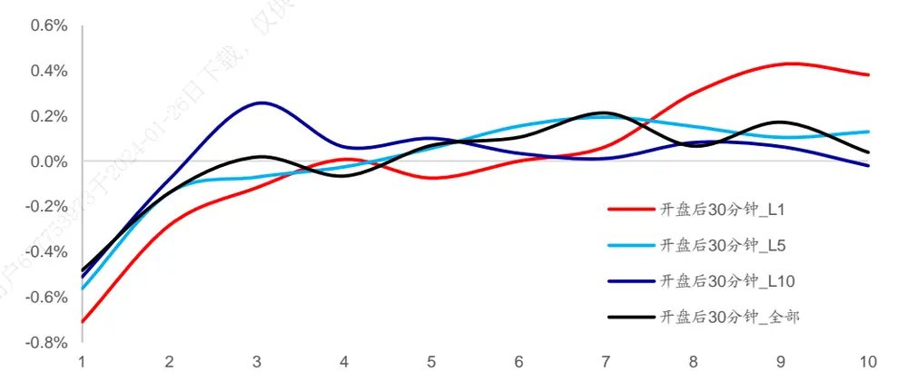
资料来源：Wind，海通证券研究所

观察上图不难发现，开盘后 分钟平均净委买变化率因子的空头效应较强，空头组合间的收益单调性极强。在进入多头组合区域后，除了使用前 档委托挂单数据计算得到的因子外，大部分因子的组间收益单调性都出现了明显减弱。简单来说，平均净委买变化率因子的空头效应更强。从截面收益区分度的角度看，使用前 档委托挂单数据计算得到的因子的选股能力最强。

为了能够进一步分析开盘后 分钟平均净委买变化率因子在时间序列上的表现情况，下图分别展示了 年以来使用前 档委托挂单数据计算得到的因子的回归法累计净值走势以及前后 多空组合相对强弱走势。

图2 开盘后 30分钟平均净委买变化率因子累计净值
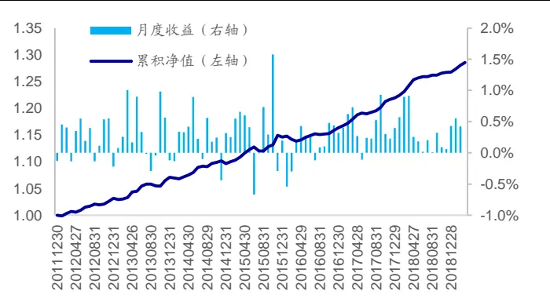
资料来源：Wind，海通证券研究所

图3 开盘后 30分钟平均净委买变化率因子多空相对强弱
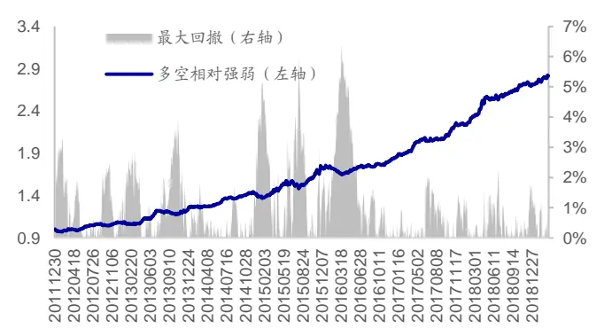
资料来源：Wind，海通证券研究所

从时间序列上看，因子具有较强的稳定性。因子月均溢价为 0.29%，月度胜率为79%，2017 年以来，该因子基本未出现明显反向的情况。2019 年以来，因子同样表现较好，月度溢价分别为 0.43%（1 月）、0.55%（2 月）、0.42%（3 月）以及 0.45%（4月）。

## 2.2 净委买变化率波动率

下列表格展示了使用不同档位数据、不同时间段数据计算得到的净委买变化率波动率因子的月度 IC、ICIR以及因子的月度多空收益以及多头收益情况。

表 3 净委买变化率波动率因子 IC 情况（2012.01-2019.04）

| 档位数量 | 指标 | 全天 | 内 开盘后 | 早收盘前 | 盘中 | 午开盘后 | 收盘前 |
| --- | --- | --- | --- | --- | --- | --- | --- |
| 前1档 | IC | 0.02 | 0.03 | 0.03 | 0.02 | 0.03 | 0.00 |
|  | ICIR | 1.20 | 2.22 | 2.09 | 1.60 | 2.30 | 0.23 |
|  | 胜率 载 | 67% | 74% | 76% | 70% | 74% | 55% |
| 前5档 | IC 26日 | 0.02 | 0.03 | 0.03 | 0.02 | 0.03 | 0.01 |
|  | ICIR | 1.16 | 2.08 | 2.11 | 1.59 | 2.27 | 0.52 |
|  |  | 66% | 74% | 77% | 71% | 74% | 58% |
|  | IC | 0.02 | 0.03 | 0.03 | 0.03 | 0.03 | 0.02 |
|  | ICIR | 1.64 | 2.41 | 2.44 | 2.04 | 2.58 | 0.96 |
|  | 胜率 | 68% | 75% | 79% | 74% | 78% | 64% |
| 全部档位 | IC | 0.02 | 0.02 | 0.03 | 0.02 | 0.03 | 0.01 |
|  | ICIR | 0.99 | 1.54 | 1.86 | 1.43 | 2.01 | 0.61 |
|  | 胜率 | 64% | 68% | 74% | 69% | 74% | 59% |

资料来源：Wind，海通证券研究所

表 4 净委买变化率波动率因子多空收益情况（2012.01-2019.04）

| 档位数量 | 指标 | 全天 | 开盘后 | 早收盘前 | 盘中 | 午开盘后 | 收盘前 |
| --- | --- | --- | --- | --- | --- | --- | --- |
| 前1档 | 多空收益 | 0.86% | 1.23% | 1.26% | 0.95% | 1.29% | 0.15% |
|  | 多头收益 | 0.19% | 0.35% | 0.51% | 0.28% | 0.49% | -0.09% |
| 前5档 | 多空收益 | 0.93% | 1.18% | 1.35% | 0.98% | 1.39% | 0.36% |
|  | 多头收益 | 0.23% | 0.35% | 0.46% | 0.27% | 0.59% | -0.08% |
| 前10档 | 多空收益 | 1.11% | 1.39% | 1.20% | 1.14% | 1.20% | 0.56% |
|  | 多头收益 | 0.28% | 0.52% | 0.44% | 0.39% | 0.51% | 0.07% |
| 全部档位 | 多空收益 | 0.78% | 1.02% | 1.32% | 0.86% | 1.32% | 0.37% |
|  | 多头收益 | 0.19% | 0.28% | 0.52% | 0.26% | 0.55% | 0.03% |

资料来源：Wind，海通证券研究所

从 IC 的角度看，在大部分时间段中，净委买变化率波动率因子具有较强的月度选股能力。除了使用全天数据以及收盘前 30 分钟数据计算得到因子选股效果不佳外，其余时段数据计算得到的因子皆具有显著的月度选股能力。从时段上看，午开盘后 30 分钟净委买变化率波动率因子的月度选股能力最强。回测结果表明，净委买变化率波动率越高，股票未来的相对收益表现越好。

使用各档位数据计算得到的大部分因子皆具有截面选股能力。下图分别展示了使用各档位数据计算得到的净委买变化率波动率因子的分组超额收益情况。

图4 净委买变化率波动率因子分组收益情况（前 1档）
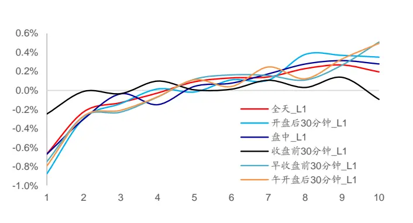
资料来源：Wind，海通证券研究所

图5 净委买变化率波动率因子分组收益情况（前 5档）
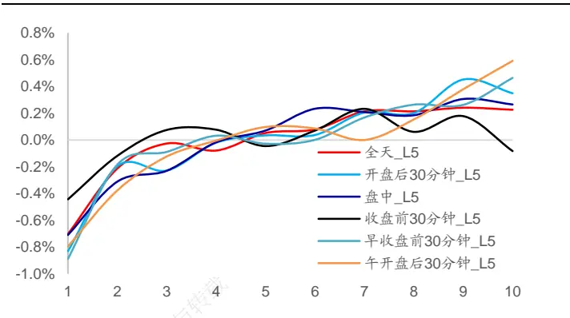
资料来源：Wind，海通证券研究所

图6 净委买变化率波动率因子分组收益情况（前 10档）
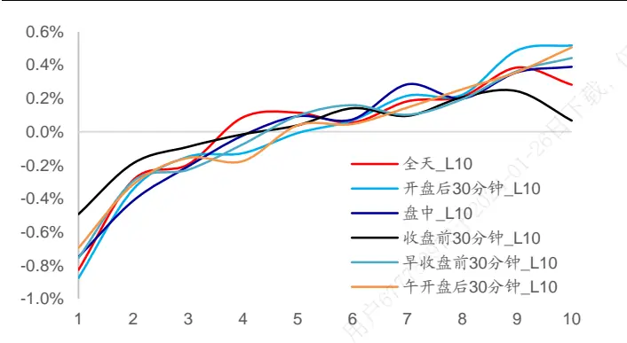
资料来源：Wind，海通证券研究所

图7 净委买变化率波动率因子分组收益情况（全部档位）
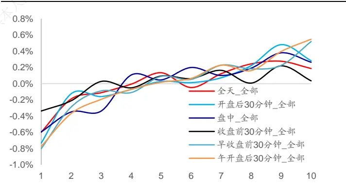
资料来源：Wind，海通证券研究所

下图分别展示了2012年以来使用前1档委托挂单数据计算得到的午开盘后30分钟净委买变化率波动率因子在时间序列上的表现情况。

图8 午开盘后 30分钟净委买变化率波动率因子累计净值
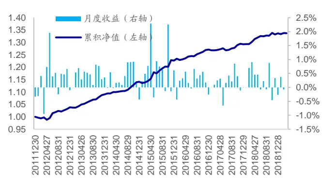
资料来源：Wind，海通证券研究所

图9 午开盘后 30分钟净委买变化率波动率因子多空相对强弱
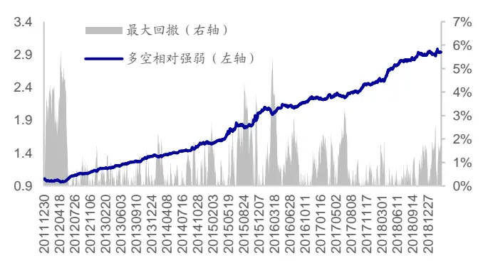
资料来源：Wind，海通证券研究所

从时间序列上看，因子同样具有较强的稳定性。因子月均溢价为 0.34%，月度胜率为 74%，长期稳定性较好。自 2018 年下半年起，因子月度溢价波动性有所提升。2019年以来，因子的月度溢价分别为-0.27%（1 月）、0.37%（2 月）、-0.07%（3 月）以及0.22%（4 月）。

## 2.3 净委买变化率偏度

下列表格展示了使用不同档位数据、不同时间段数据计算得到的净委买变化率偏度因子的月度 IC、ICIR 以及因子的月度多空收益以及多头收益情况。

表 5 净委买变化率偏度因子 IC 情况（2012.01-2019.04）

| 档位数量 | 指标 | 全天 | 开盘后 | 早收盘前 | 盘中 | 午开盘后 | 收盘前 |
| --- | --- | --- | --- | --- | --- | --- | --- |
| 前1档 | IC | 0.01 | 0.02 | 0.01 | 0.01 | 0.01 | 0.00 |
|  | ICIR | 0.77 | 2.39 | 1.14 | 0.84 | 0.85 | 0.07 |
|  | 胜率 | 69% | 79% | 60% | 62% | 60% | 62% |
| 前5档 | IC | 0.01 | 0.02 | 0.01 | 0.01 | 0.00 | 0.00 |
|  | ICIR | 0.75 | 2.32 | 1.42 | 0.96 | -0.02 | -0.27 |
|  | 胜率 | 52% | 74% | 66% | 63% | 44% | 55% |
| 前10档 | IC | 0.00 | 0.01 | 0.01 | 0.01 | 0.00 | 0.01 |
|  | ICIR | -0.06 | 0.65 | 1.15 | 0.55 | 0.51 | 0.48 |
|  | 胜率 | 52% | 61% | 62% | 55% | 52% | 56% |
| 全部档位 | IC | 0.01 | 0.02 | 0.01 不可传播与 | 0.01 | 0.00 | 0.00 |
|  | ICIR | 1.76 | 2.25 | 1.16 | 1.52 | 0.60 | -0.45 |
|  | 胜率 | 66% | 74% | 63% | 66% | 60% | 59% |

资料来源：Wind，海通证券研究所

表 6 净委买变化率偏度因子多空收益情况（2012.01-2019.04）

| 档位数量 | 指标 | 全天 | 开盘后 | 早收盘前 | 盘中 | 午开盘后 | 收盘前 |
| --- | --- | --- | --- | --- | --- | --- | --- |
| 前1档 | 多空收益 | 0.03% | 0.62% | 0.08% | 0.11% | 0.08% | 0.04% |
|  | 多头收益 | -0.20% | 0.47% | 0.09% | -0.08% | 0.16% | 0.08% |
| 前5档 539 26 | 多空收益 | -0.01% | 0.59% | 0.27% | 0.10% | -0.02% | 0.25% |
|  | 多头收益 | -0.27% | 0.35% | 0.26% | -0.19% | 0.14% | 0.24% |
| 前10档 | 多空收益 | 0.08% | 0.15% | 0.46% | 0.14% | 0.14% | 0.12% |
|  | 多头收益 | -0.27% | 0.06% | 0.21% | -0.18% | 0.03% | 0.06% |
| 全部档位 | 多空收益 | 0.23% | 0.64% | 0.21% | 0.27% | 0.16% | 0.07% |
|  | 多头收益 | -0.01% | 0.36% | 0.22% | 0.03% | 0.13% | 0.21% |

资料来源：Wind，海通证券研究所

从 IC 的角度看，净委买变化率偏度与平均净委买变化率类似，开盘后 30 分钟净委买变化率偏度因子具有一定的月度选股能力。回测结果表明，股票开盘后 30分钟的净委买变化率偏度越高，股票未来的相对收益表现越好。由于偏度因子刻画了股票净委买变化率的极值的特征，因子回测结果表明，开盘后 30 分钟内股票净委买出现大幅跳升的概率越大，股票未来超额收益表现越好。下图展示了使用各档位数据计算得到的净委买变化率偏度因子的分组超额收益情况。

图10 开盘后 30分钟净委买变化率偏度因子分组收益情况
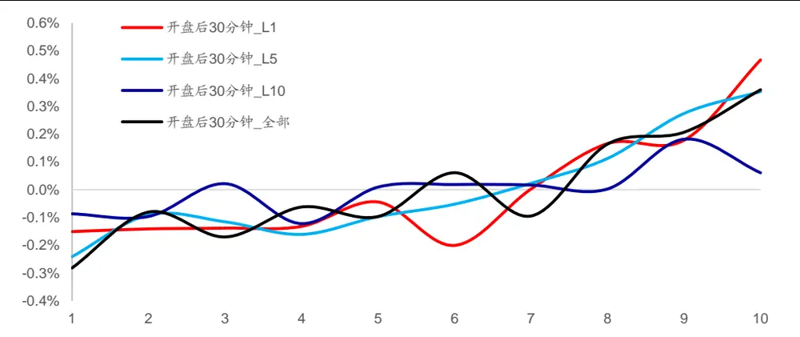
资料来源：Wind，海通证券研究所

观察上图不难发现，开盘后 30 分钟净委买变化率偏度因子的空头效应较弱，空头组合间的收益单调性较差。在进入多头组合区域后，除了使用前 10 档数据计算得到的因子效果不佳外，其余因子的组间收益单调性都相对较好。相比而言，该因子的多头效应强于因子的空头效应。

下图分别展示了 2012 年以来使用前 1 档委托挂单数据计算得到的偏度因子的回归法累计净值走势以及前后 10%多空组合相对强弱走势。

图11 开盘后 30分钟净委买变化率偏度因子累计净值
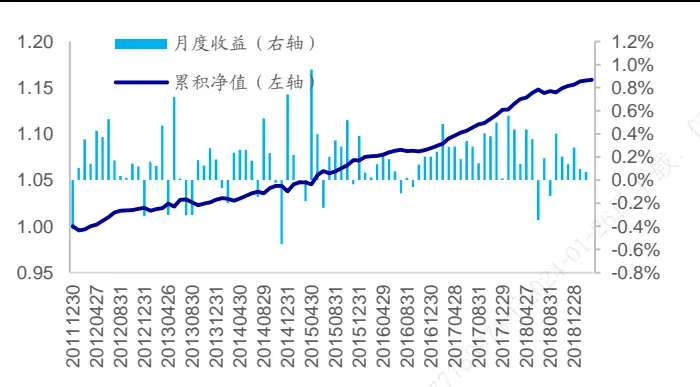
资料来源：Wind，海通证券研究所

图12 开盘后 30分钟净委买变化率偏度因子多空相对强弱
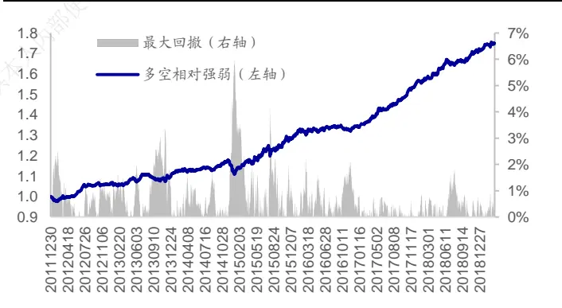
资料来源：Wind，海通证券研究所

从时间序列上看，因子收益性相对较弱，但是依旧具有较强的稳定性。因子月均溢价为 0.17%，月度胜率为 79%，2017 年以来，基本未出现明显反向的情况。2019 年以来，因子的月度溢价分别为 0.28%（1 月）、0.10%（2 月）、0.07%（3 月）以及 0.23%（4 月）。

## 3. 因子相关性分析

考虑到平均净委买变化率、净委买变化率波动率以及净委买变化率偏度皆是基于日内委托挂单数据计算得到，本章展示了各因子间的截面相关性情况，并检验了因子在加入常规模型后是否能为模型提供额外的选股能力。

## 3.1 因子截面相关性

为了能够体现各因子间的截面相关性情况，下图展示了使用前 档委托挂单数据计算得到的各因子间的截面相关性热力图。（感兴趣的投资者可使用类似的方法，对于使用其他档位数据计算得到的各因子之间的截面相关性进行分析。）

图13 净委买变化率因子相关性热力图（前 1档）

| mean | 1.0 | 0.3 | 0.6 | 0.3 | 0.2 | 0.2 | 0.1 | 0.0 | 0.1 | 0.0 | 0.1 | 0.1 | 0.4 | 0.2 | 0.3 | 0.2 | 0.1 | 0.1 |  |
| --- | --- | --- | --- | --- | --- | --- | --- | --- | --- | --- | --- | --- | --- | --- | --- | --- | --- | --- | --- |
|  |  |  |  |  |  |  |  |  |  |  |  |  |  |  |  |  |  |  | -1.0-0.8-0.6-0.4- 0.2- 0.0 |
| mean_beg | 0.3 | 1.0 | 0.1 | 0.1 | 0.0 | 0.0 | 0.0 | 0.0 | 0.0 | -0.0 | 0.1 | 0.1 | 0.2 | 0.4 | 0.0 | 0.0 | 0.0 | 0.0 |  |
| mean_mid | 0.6 | 0.1 | 1.0 | 0.1 | 0.2 | 0.2 | 0.1 | -0.0 | 0.1 | 0.0 | 0.0 | 0.1 | 0.3 | 0.0 | 0.4 | 0.0 | 0.1 | 0.1 |  |
| mean_end | 0.3 | 0.1 | 0.1 | 1.0 | 0.0 | 0.0 | -0.0 | -0.0 | 0.0 | 0.0 | 0.0 | 0.0 | 0.1 | 0.0 | -0.0 | 0.4 | 0.0 | 0.0 |  |
| mean_amEnd | 0.2 | 0.0 | 0.2 | 0.0 | 1.0 | 0.0 | 0.0 | -0.0 | 0.0 | 0.0 | 0.0 | 0.0 | 0.1 | 0.0 | 0.1 | 0.0 | 0.4 | 0.0 |  |
| mean_pmBeg | 0.2 | 0.0 | 0.2 | 0.0 | 0.0 | 1.0 | 0.0 | 0.0 | 0.0 | 0.0 | 0.0 | 0.1 | 0.1 | 0.0 | 0.1 | 0.0 | -0.0 | 0.4 |  |
| std | 0.1 | 0.0 | 0.1 | -0.0 | 0.0 | 0.0 | 1.0 | 0.7 | 0.9 | 0.7 | 0.7 | 0.7 | 0.1 | 0.0 | 0.1 | 0.0 | 0.0 | 0.0 |  |
| std_beg | 0.0 | 0.0 | -0.0 | -0.0 | -0.0 | 0.0 | 0.7 | 1.0 | 0.6 | 0.5 | 0.5 | 0.5 | -0.0 | 0.0 | -0.0 | -0.0 | -0.0 | 0.0 |  |
| std_mid | 0.1 | 0.0 | 0.1 | 0.0 | 0.0 | 0.0 | 0.9 | 0.6 | 1.0 | 0.6 | 0.7 | 0.7 | 0.1 | 0.0 | 0.1 | 0.0 | 0.0 | 0.0 |  |
| std_end | 0.0 | -0.0 | 0.0 | 0.0 | 0.0 | 0.0 | 0.7 | 0.5 | 0.6 | 1.0 | 0.5 | 0.5 | 0.0 | 0.0 | 0.0 | 0.0 | 0.0 | 0.0 |  |
| std_amEnd | 0.1 | 0.1 | 0.0 | 0.0 | 0.0 | 0.0 | 0.7 | 0.5 | 0.7 | 0.5 | 1.0 | 0.6 | 0.0 | 0.0 | 0.0 | 0.0 | 0.0 | 0.0 |  |
| std_pmBeg | 0.1 | 0.1 | 0.1 | 0.0 | 0.0 | 0.1 | 0.7 | 0.5 | 0.7 | 0.5 | 0.6 | 1.0 | 0.0 | 0.0 | 0.0 | 0.0 | 0.0 | 0.0 |  |
| skew | 0.4 | 0.2 | 0.3 | 0.1 | 0.1 | 0.1 | 0.1 | -0.0 | 0.1 | 0.0 | 0.0 | 0.0 | 1.0 | 0.3 | 0.7 | 0.2 | 0.2 | 0.2 |  |
| skew_beg | 0.2 | 0.4 | 0.0 | 0.0 | 0.0 | 0.0 | 0.0 | 0.0 | 0.0 | 0.0 | 0.0 | 0.0 | 0.3 | 1.0 | 0.1 | 0.0 | 0.0 | 0.0 |  |
| skew_mid | 0.3 | 0.0 | 0.4 | -0.0 | 0.1 | 0.1 | 0.1 | -0.0 | 0.1 | 0.0 | 0.0 | 0.0 | 0.7 | 0.1 | 1.0 | 0.1 | 0.2 | 0.2 |  |
| skew_end | 0.2 | 0.0 | 0.0 | 0.4 | 0.0 | 0.0 | 0.0 | -0.0 | 0.0 | 0.0 | 0.0 | 0.0 | 0.2 | 0.0 | 0.1 | 1.0 | 0.0 | 0.0 |  |
| skew_amEnd | 0.1 | 0.0 | 0.1 | 0.0 | 0.4 | -0.0 | 0.0 | -0.0 | 0.0 | 0.0 | 0.0 | 0.0 | 0.2 | 0.0 | 0.2 | 0.0 | 1.0 | 0.0 |  |
| skew_pmBeg | 0.1 | 0.0 | 0.1 | 0.0 | 0.0 | 0.4 | 0.0 | 0.0 | 0.0 | 0.0 | 0.0 | 0.0 | 0.2 | 0.0 | 0.2 | 0.0 | 0.0 | 1.0 |  |

资料来源：Wind，海通证券研究所

观察上图不难发现，各类因子内皆存在一定的截面相关性，各时段的净委买变化率波动率因子之间的截面相关性较强。此外，同一时段内的平均净委买变化率与净委买变化率偏度正相关。净委买变化率波动率与其余两类因子之间的截面相关性较低。

## 3.2 多元回归检验

下表以开盘后 30 分钟平均净委买变化率、午开盘后 30 分钟净委买变化率波动率以及开盘后 30 分钟净委买变化率偏度三个因子为例，展示了各因子在常见选股因子外所能贡献的收益。

表 7 回归结果对比（2012.01-2019.04）

|  | 市值 | 中盘 | 换手 | 反转 | 波动 | 开盘后 30 分钟 平均净委买变化率 | 午开盘后 30 分钟 净委买变化率波动率 | 开盘后 30 分钟 净委买变化率偏度 |
| --- | --- | --- | --- | --- | --- | --- | --- | --- |
| 月均溢价 | -0.0085 | 0.0039 | -0.0048 | -0.0033 | 0.0039 |  |  |  |
| T统计量 | -4.11 | 4.47 | -2.60 | -2.20 | 4.73 |  |  |  |
| 为正比率 | 32% | 68% | 34% | 41% | 68% |  |  |  |
| 月均溢价 | -0.0082 | 0.0037 | -0.0042 | -0.0035 | 0.0039 | 0.0029 |  |  |
| T统计量 | -4.08 | 4.31 | -2.30 | -2.37 | 4.74 | 7.33 |  |  |
| 为正比率 | 32% | 67% | 36% | 38% | 68% | 79% |  |  |
| 月均溢价 | -0.0082 | 0.0037 | -0.0042 | -0.0036 | 0.0040 |  | 0.0034 |  |
| T统计量 | -4.07 | 4.32 | -2.27 | -2.42 | 4.76 |  | 5.93 |  |
| 为正比率 | 32% | 67% | 36% | 37% | 69% |  | 74% |  |
| 月均溢价 | -0.0082 | 0.0037 | -0.0042 | -0.0036 | 0.0040 |  |  | 0.0017 |
| T统计量 | -4.07 | 4.32 | -2.27 | -2.40 | 4.76 |  |  | 5.99 |
| 为正比率 | 32% | 67% | 36% | 37% | 69% |  |  | 79% |
| 月均溢价 | -0.0082 | 0.0037 | -0.0042 | -0.0036 | 0.0040 | 0.0025 | 0.0032 | 0.0007 |
| T统计量 | -4.07 | 4.33 | -2.26 | -2.42 | 4.76 | 6.53 | 5.68 | 2.44 |
| 为正比率 | 32% | 67% | 36% | 37% | 69% | 80% | 71% | 62% |

资料来源：Wind，海通证券研究所

在单独加入各因子时，各因子的月度溢价较为显著，T统计量极高。相比而言，开盘后30分钟平均净委买变化率以及午开盘后30分钟净委买变化率波动率的月均溢价较高，而开盘后 30 分钟净委买变化率偏度月均溢价偏低。

在同时加入上述三个因子时，由于同一时段中的平均净委买变化率以及净委买变化率偏度正相关，因此净委买变化率偏度因子的月均溢价以及显著性都出现了十分明显的降低。因此，在包含平均净委买变化率因子以及净委买变化率波动率因子的模型中，净委买变化率偏度因子所能提供的额外收益较为有限。

## 4. 不同选股范围内因子表现

由于因子的选股效果受到选股范围的影响，因此本节在中证 800 指数内、中证 500指数内以及沪深 300 指数内对于前文构建的因子的月度选股效果进行了回测分析。本部分回测的因子同样进行了正交化处理。

## 4.1 平均净委买变化率

下表展示了各指数内平均净委买变化率因子的月度选股能力。

表 8 不同选股范围内平均净委买变化率因子 IC情况（2012.01-2019.04）

| 范围 | 档位数量 | 指标 | 全天 | 开盘后 | 早收盘前 | 盘中 | 午开盘后 | 收盘前 |
| --- | --- | --- | --- | --- | --- | --- | --- | --- |
| 中证800 | 前1档 | IC | 0.01 | 0.03 | 0.01 | 0.01 | 0.01 | 0.00 |
|  |  | ICIR | 0.67 | 2.24 | 0.71 | 0.84 | 0.52 | 0.20 |
|  |  | 胜率 | 62% | 81% | 53% | 62% | 58% | 58% |
|  |  | IC | -0.01 | 0.01 | -0.01 | -0.01 | -0.01 | -0.01 |
|  | 前5档 | ICIR | -0.93 | 0.77 | -0.59 | -0.77 | -0.48 | -0.88 |
|  |  | 胜率 | 58% | 61% | 56% | 51% 不可传播与转 | 59% | 60% |
|  | 前10档 | IC | 0.00 | 0.01 | 0.01 | 0.00 | 0.01 | 0.00 |
|  |  | ICIR | 0.18 | 0.36 | 0.55 | 0.20 | 0.41 | 0.04 |
|  |  | 胜率 | 55% | 53% | 56% | 52% | 59% | 45% |
|  | 全部档位 | IC | 0.01 | 0.01 | 0.01 | 0.00 | 0.00 | -0.01 |
| ICIR |  | 0.35 | 0.76 | 0.60 仅供本人内 | 0.22 | 0.06 | -0.91 |  |
| 胜率 |  | 60% | 62% | 58% | 58% | 49% | 61% |  |
| 中证500 | 前1档 | IC | 0.00 | 0.02 | 0.00 | 0.01 | 0.01 | 0.00 |
|  |  | ICIR | 0.02 | 1.70 01-26日 | 0.33 | 0.49 | 0.54 | 0.12 |
|  |  | 胜率 | 54% | 71% | 54% | 56% | 58% | 51% |
|  | 前5档 | IC | -0.01 | 0.01 | -0.01 | -0.01 | 0.00 | -0.01 |
|  |  | ICIR |  | 0.78 | -0.72 | -0.65 | -0.31 | -0.89 |
|  |  | 胜率 | 60% 用户67 | 59% | 55% | 56% | 51% | 60% |
|  | 前10档 | IC | 0.00 | 0.01 | 0.00 | 0.00 | 0.00 | -0.01 |
|  |  | ICIR | -0.08 | 0.29 | 0.26 | -0.14 | 0.05 | -0.28 |
|  |  | 胜率 | 51% | 54% | 58% | 49% | 51% | 62% |
|  | 全部档位 | IC | 0.01 | 0.01 | 0.01 | 0.01 | 0.01 | -0.01 |
| ICIR |  | 0.37 | 0.74 | 0.49 | 0.38 | 0.40 | -1.12 |  |
| 胜率 |  | 59% | 61% | 53% | 62% | 55% | 54% |  |
| 沪深300 | 前1档 | IC | 0.02 | 0.03 | 0.01 | 0.02 | 0.01 | 0.01 |
|  |  | ICIR | 1.27 | 1.93 | 0.81 | 1.05 | 0.29 | 0.28 |
|  |  | 胜率 | 62% | 69% | 58% | 56% | 55% | 56% |
|  | 前5档 | IC | -0.01 | 0.01 | 0.01 | 0.00 | -0.01 | -0.01 |
|  |  | ICIR | -0.48 | 0.53 | 0.41 | -0.24 | -0.52 | -0.38 |
|  |  | 胜率 | 55% | 59% | 55% | 47% | 56% | 58% |
|  |  | IC | 0.01 | 0.01 | 0.01 | 0.02 | 0.02 | 0.01 |
|  | 前10档 | ICIR | 0.64 | 0.43 | 0.70 | 0.74 | 0.87 | 0.54 |
|  |  | 胜率 | 55% | 62% | 56% | 59% | 60% | 56% |
|  |  | IC | 0.01 | 0.01 | 0.01 | 0.00 | -0.01 | 0.00 |
| 全部档位 |  | ICIR | 0.35 | 0.56 | 0.40 | 0.05 | -0.60 | -0.07 |
|  |  | 58% | 59% | 51% |  |  |  |  |
|  | 胜率 |  |  |  |  | 47% | 59% | 54% |

资料来源： ，海通证券研究所

观察上表可以发现，使用前 1 档委托挂单数据计算得到的开盘后 30 分钟平均净委买变化率因子在中证 800、中证 500 以及沪深 300 指数内皆具有月度选股能力。在上述指数范围中，因子月均多空收益分别为 0.97%、0.65%以及 1.10%。

## 4.2 净委买变化率波动率

下表展示了各指数内净委买变化率波动率因子的月度选股能力。

表 9 不同选股范围内净委买变化率波动率因子 IC情况（2012.01-2019.04）

| 范围 | 档位数量 | 指标 | 全天 | 开盘后 | 早收盘前 | 盘中 | 午开盘后 | 收盘前 |
| --- | --- | --- | --- | --- | --- | --- | --- | --- |
| 中证800 | 前1档 | IC | 0.00 | 0.01 | 0.01 | 0.01 | 0.01 | -0.01 |
|  |  | ICIR | -0.06 | 0.33 | 0.43 | 0.31 | 0.89 | -0.65 |
|  |  | 胜率 | 54% | 55% | 49% | 51% | 61% | 53% |
|  |  | IC | 0.00 | 0.01 | 0.01 | 0.01 | 0.02 | -0.01 |
|  | 前5档 | ICIR | -0.12 | 0.37 | 0.78 | 0.35 | 1.14 | -0.68 |
|  |  | 胜率 | 45% | 54% | 56% | 56% | 66% | 56% |
|  | 前10档 | IC | 0.01 | 0.01 | 0.02 | 0.02 | 0.02 | 0.00 |
|  |  | ICIR | 0.67 | 0.79 | 1.58 | 1.13 | 1.50 | 0.17 |
|  |  | 胜率 | 60% | 62% | 64% | 63% | 68% | 55% |
|  | 全部档位 | IC | 0.00 | 0.01 | 0.01 | 0.01 | 0.02 | -0.01 |
| ICIR |  | 0.02 | 0.30 | 0.89 | 0.46 不可传播与转 | 1.05 | -0.44 |  |
| 胜率 |  | 56% | 58% | 56% | 58% | 63% | 58% |  |
| 中证500 | 前1档 | IC | 0.00 | 0.01 | 0.01 | 0.00 | 0.01 | -0.01 |
|  |  | ICIR | -0.08 | 0.51 仅供本人内部 | 0.38 | 0.23 | 0.83 | -0.52 |
|  |  | 胜率 | 48% | 54% | 58% | 56% | 58% | 55% |
|  | 前5档 | IC | 0.00 | 0.01 | 0.01 | 0.01 | 0.02 | -0.01 |
|  |  | ICIR 胜率 | -0.10 | 0.59 | 0.83 | 0.28 | 1.18 | -0.50 |
|  |  |  | 45% | 55% | 58% | 60% | 59% | 58% |
|  | 前10档 | IC | 0.01 | 0.01 | 0.02 | 0.01 | 0.02 | 0.00 |
|  |  | ICIR | 0.61 2024-01-26 | 0.78 | 1.43 | 0.87 | 1.20 | 0.24 |
|  |  | 胜率 | 59% | 58% | 67% | 64% | 66% | 52% |
|  | 全部档位 | IC | 0.00 | 0.01 | 0.01 | 0.01 | 0.02 | 0.00 |
| ICIR |  | 0.11 田户677 | 0.44 | 0.84 | 0.39 | 1.03 | -0.24 |  |
| 胜率 |  | 59% | 61% | 55% | 60% | 60% | 58% |  |
| 沪深300 | 前1档 | IC | 0.00 | 0.00 | 0.01 | 0.01 | 0.01 | -0.01 |
|  |  | ICIR | 0.12 | -0.04 | 0.35 | 0.44 | 0.65 | -0.54 |
|  |  | 胜率 | 52% | 52% | 56% | 59% | 58% | 49% |
|  | 前5档 | IC | 0.00 | 0.00 | 0.01 | 0.01 | 0.01 | -0.01 |
|  |  | ICIR | 0.16 | 0.01 | 0.48 | 0.54 | 0.67 | -0.63 |
|  |  | 胜率 | 53% | 48% | 58% | 58% | 60% | 59% |
|  |  | IC | 0.01 | 0.01 | 0.02 | 0.02 | 0.02 | 0.00 |
|  | 前10档 | ICIR | 0.74 | 0.62 | 1.06 | 1.06 | 1.14 | 0.11 |
|  |  | 胜率 | 67% | 58% | 61% | 67% | 70% | 52% |
| IC |  | 0.00 | 0.00 | 0.01 | 0.01 | 0.01 | -0.01 |  |
| 全部档位 |  | ICIR | 0.19 | 0.20 | 0.71 | 0.64 | 0.70 | -0.50 |
|  |  |  | 54% |  |  |  |  |  |
|  | 胜率 | 49% |  | 55% | 55% | 60% | 56% |  |

资料来源：Wind，海通证券研究所

观察上表可以发现，仅有午开盘后 30 分钟的净委买变化率波动率因子在中证 800以及中证 500 指数内具有一定的选股能力。然而该参数下的因子在沪深 300 指数内的选股能力较弱。考虑到该因子在全 A范围内具有较强的选股能力，可认为该因子在中小市值的股票中具有较好的选股能力。

## 4.3 净委买变化率偏度

下表展示了各指数内净委买变化率偏度因子的月度选股能力。

表 10 不同选股范围内净委买变化率偏度因子 IC情况（2012.01-2019.04）

| 范围 | 档位数量 | 指标 | 全天 | 开盘后 | 早收盘前 | 盘中 | 午开盘后 | 收盘前 |
| --- | --- | --- | --- | --- | --- | --- | --- | --- |
| 中证800 | 前1档 | IC | 0.01 | 0.01 | 0.01 | 0.00 | 0.01 | 0.01 |
|  |  | ICIR | 0.41 | 1.09 | 0.84 | 0.42 | 0.56 | 0.66 |
|  |  | 胜率 | 61% | 63% | 59% | 58% | 59% | 60% |
|  |  | IC | 0.00 | 0.01 | 0.00 | 0.00 | 0.00 | 0.00 |
|  | 前5档 | ICIR | 0.25 | 0.77 | 0.34 | 0.31 | -0.07 | -0.02 |
|  |  | 胜率 | 54% | 61% | 54% | 51% | 48% | 49% |
|  | 前10档 | IC | 0.00 | 0.00 | 0.01 | 0.01 | 0.01 | 0.01 |
|  |  | ICIR | 0.07 | 0.29 | 1.10 | 0.54 | 0.74 | 0.75 |
|  |  | 胜率 | 53% | 51% | 64% | 54% | 55% | 53% |
|  | 全部档位 | IC | 0.01 | 0.01 | 0.01 | 0.01 | 0.00 | 0.00 |
| ICIR |  | 0.76 | 1.12 | 0.95 | 1.06 | 0.24 | -0.10 |  |
| 胜率 |  | 56% | 61% | 59% | 59% | 53% | 55% |  |
| 中证500 | 前1档 | IC | 0.00 | 0.01 | 0.01 | 0.01 | 0.01 | 0.01 |
|  |  | ICIR | 0.30 | 0.58 | 0.39 可传播与车 | 0.62 | 0.33 | 0.46 |
|  |  | 胜率 | 63% | 53% | 59% | 58% | 55% | 51% |
|  | 前5档 | IC | 0.00 | 0.01 | 0.00 | 0.01 | 0.00 | 0.00 |
|  |  | ICIR | 0.04 | 0.50 | -0.19 | 0.32 | -0.23 | -0.28 |
|  |  | 胜率 | 49% | 56% | 58% | 49% | 53% | 53% |
|  | 前10档 | IC | -0.01 | 0.00 | 0.01 | 0.00 | 0.01 | 0.01 |
|  |  | ICIR | -0.29 | 0.14 仅供本人内部 | 0.45 | 0.12 | 0.44 | 0.49 |
|  |  | 胜率 | 58% | 46% | 62% | 47% | 54% | 58% |
|  | 全部档位 | IC | 0.00 | 0.01 | 0.00 | 0.01 | 0.00 | -0.01 |
| ICIR |  | 0.25 | 1.15 024-01-26日 | 0.26 | 0.75 | 0.30 | -0.48 |  |
| 胜率 |  | 51% | 63% | 48% | 56% | 55% | 60% |  |
| 沪深300 | 前1档 | IC | 0.01 | 0.02 | 0.01 | 0.00 | 0.01 | 0.00 |
|  |  | ICIR | 0.40 | 1.03 | 0.63 | 0.14 | 0.65 | 0.22 |
|  |  | 胜率 167 | 58% | 60% | 60% | 49% | 62% | 52% |
|  | 前5档 | IC 用 | 0.01 | 0.01 | 0.01 | 0.01 | 0.00 | 0.00 |
|  |  | ICIR | 0.55 | 0.79 | 0.79 | 0.29 | 0.28 | 0.21 |
|  |  | 胜率 | 54% | 63% | 58% | 54% | 60% | 54% |
|  | 前10档 | IC | 0.01 | 0.01 | 0.02 | 0.02 | 0.01 | 0.01 |
|  |  | ICIR | 0.56 | 0.67 | 1.43 | 0.92 | 0.63 | 0.56 |
|  |  | 胜率 | 56% | 55% | 64% | 60% | 53% | 49% |
|  | IC | 0.02 | 0.01 | 0.02 | 0.01 | 0.00 | 0.01 |  |
|  | 全部档位 ICIR | 0.98 | 0.73 | 1.03 | 0.87 | 0.28 | 0.45 |  |
|  | 胜率 | 60% | 61% | 56% | 58% | 55% | 54% |  |

资料来源： ，海通证券研究所

观察上表可以发现，该因子在中证 800、中证 500 以及沪深 300 指数内的选股能力并不显著。考虑到该因子在全 A 范围内具有较强的选股能力，可认为该因子在中小市值的股票中具有较好的选股能力。

## 5. 不同换仓频率下的选股效果

本章讨论了前文构建的因子在不同换仓频率下的选股能力。需要注意的是，本章在调整换仓频率时，也会调整计算因子的回看窗口，使其与换仓频率一致。例如，在半月换仓频率下，计算因子所使用的回看窗口同样为半个月。

## 5.1 平均净委买变化率

下表展示了不同换仓频率下平均净委买变化率因子的选股能力。

表 11 不同换仓频率下平均净委买变化率因子 IC情况（2012.01-2019.04）

|  | 指标 | 周度换仓 |  |  |  |  |  | 半月换仓 |  |  |  |  |  |
| --- | --- | --- | --- | --- | --- | --- | --- | --- | --- | --- | --- | --- | --- |
|  |  | 全天 | 开盘后 | 早收盘前 | 盘中 | 午开盘后 | 收盘前 | 全天 | 开盘后 | 早收盘前 | 盘中 | 午开盘后 | 收盘前 |
| 前 | IC | 0.00 | 0.02 | 0.00 | 0.00 | 0.00 | -0.01 | 0.01 | 0.03 | 0.01 | 0.01 | 0.00 | 0.00 |
| 1 | ICIR | -0.25 | 3.24 | 0.48 | -0.01 | -0.44 | -2.71 | 1.85 | 3.80 | 1.01 | 1.73 | -0.10 | -0.73 |
| 档 | 胜率 | 53% | 66% | 53% | 48% | 53% | 63% | 62% | 78% | 58% | 62% | 54% | 54% |
| 前 5 档 | IC | -0.01 | 0.01 | 0.00 | -0.01 | -0.01 | -0.02 | 0.00 | 0.02 | 0.00 | 0.00 | -0.01 | -0.01 |
|  | ICIR | -1.39 | 2.18 | -0.38 | -1.10 | -1.11 | -3.44 | 0.00 | 2.55 | -0.09 | 0.12 | -1.39 | -1.87 |
|  | 胜率 | 59% | 61% | 52% | 57% | 57% | 70% | 51% | 68% | 53% | 52% | 61% | 68% |
| 前 10 档 | IC | -0.01 | 0.00 | 0.00 | 0.00 | 0.00 | -0.01 | 0.00 | 0.01 | 0.01 | 0.01 | 0.00 | 0.00 |
|  | ICIR | -0.91 | 0.06 | 0.73 | -0.33 | 0.19 | -1.66 | 0.42 | 0.83 | 1.56 | 0.85 | 0.59 | -0.36 |
|  | 胜率 | 55% | 50% | 51% | 52% | 50% | 58% | 60% | 58% | 61% | 61% | 53% | 51% |
| 全 部 | IC | 0.00 | 0.00 | 0.00 | 0.00 | 0.00 | -0.01 | 0.00 | 0.01 | 0.00 | 0.00 | 0.00 | -0.01 |
|  | ICIR | -0.34 | 0.62 | 0.35 | 0.32 | 0.32 | -2.81 | -0.05 | 0.71 | 0.37 | 0.01 | -0.62 | -1.94 |
|  | 胜率 | 52% | 51% | 52% | 53% | 52% | 69% | 46% | 51% | 55% | 47% | 53% | 67% |

资料来源： ，海通证券研究所

观察上表可以发现，使用前 1 档委托挂单数据计算得到的开盘后 30 分钟平均净委买变化率因子在周度以及半月换仓下依旧具有显著的选股能力。

## 5.2 净委买变化率波动率

下表展示了不同换仓频率下净委买变化率波动率因子的选股能力。

表 12 不同换仓频率下净委买变化率波动率因子 IC情况（2012.01-2019.04）

|  | 指标 | 周度换仓 |  |  |  |  |  | 半月换仓 |  |  |  |  |  |
| --- | --- | --- | --- | --- | --- | --- | --- | --- | --- | --- | --- | --- | --- |
|  |  | 全天 | 开盘后 | 早收盘前 | 盘中 | 午开盘后 | 收盘前 | 全天 | 开盘后 | 早收盘前 | 盘中 | 午开盘后 | 收盘前 |
| 前 | IC | -0.01 | 0.00 | 0.00 | 0.00 | 0.01 | -0.01 | 0.00 | 0.01 | 0.01 | 0.01 | 0.02 | -0.01 |
| 1 | ICIR | -1.23 | 0.08 | 0.73 | -0.45 | 0.80 | -2.05 | -0.01 | 0.92 | 1.65 | 0.68 | 1.98 | -0.86 |
| 档 | 胜率 | 56% | 51% | 55% | 52% | 56% | 61% | 50% | 59% | 61% | 57% | 62% | 58% |
| 前 | IC | -0.01 | 0.00 | 0.01 | 0.00 | 0.01 | -0.01 | 0.00 | 0.01 | 0.02 | 0.01 | 0.02 | 0.00 |
| 5 档 | ICIR | -1.30 | -0.01 | 1.05 | -0.39 | 1.03 | -1.68 | -0.16 | 0.78 | 1.76 | 0.61 | 2.02 | -0.34 |
|  | 胜率 | 57% | 52% | 57% | 50% | 57% | 59% | 54% | 58% | 63% | 54% | 66% | 50% |
| 前 10 | IC | 0.00 | 0.00 | 0.01 | 0.00 | 0.01 | 0.00 | 0.00 | 0.01 | 0.02 | 0.01 | 0.02 | 0.00 |
| 档 | ICIR | -0.55 | 0.37 | 1.39 | 0.30 | 1.42 | -0.61 | 0.49 | 1.34 | 2.25 | 1.28 | 2.61 | 0.47 |
|  | 胜率 | 51% | 55% | 59% | 53% | 60% | 55% | 54% | 65% | 71% | 62% | 74% | 55% |
| 全 | IC | -0.01 | 0.00 | 0.01 | 0.00 | 0.01 | -0.01 | 0.00 | 0.01 | 0.01 | 0.01 | 0.02 | 0.00 |
| 部 | ICIR | -1.10 | -0.26 | 0.96 | -0.09 | 1.12 | -1.44 | -0.03 | 0.54 | 1.57 | 0.73 | 1.89 | -0.12 |
|  | 胜率 | 55% | 51% | 56% | 51% | 54% | 59% | 49% | 58% | 61% | 55% | 69% | 50% |

资料来源：Wind，海通证券研究所

观察上表可以发现，午开盘后净委买变化率波动率因子在半月换仓频率下依旧具有一定的选股能力。然而，在更高的换仓频率下，各参数下的净委买变化率波动率因子并未呈现出显著的选股能力。

## 5.3 净委买变化率偏度

下表展示了不同换仓频率下净委买变化率偏度因子的选股能力。

表 13 不同换仓频率下净委买变化率偏度因子 IC情况（2012.01-2019.04）

|  | 指标 | 周度换仓 |  |  |  |  |  | 半月换仓 |  |  |  |  |  |
| --- | --- | --- | --- | --- | --- | --- | --- | --- | --- | --- | --- | --- | --- |
|  |  | 全天 | 开盘后 | 早收盘前 | 盘中 | 午开盘后 | 收盘前 | 全天 | 开盘后 | 早收盘前 | 盘中 | 午开盘后 | 收盘前 |
| 前 | IC | 0.00 | 0.01 | 0.00 | 0.00 | 0.00 | 0.00 | 0.01 | 0.02 | 0.01 | 0.01 | 0.00 | 0.00 |
| 1 | ICIR | -0.55 | 2.66 | 0.81 | -0.49 | 0.36 | -0.70 | 1.19 | 3.20 | 1.77 | 0.91 | 0.96 | 0.33 |
| 档 | 胜率 | 53% | 66% | 55% | 51% | 56% | 51% | 61% | 75% | 63% | 60% | 53% | 56% |
| 前 | IC | -0.01 | 0.01 | 0.00 | 0.00 | 0.00 | 0.00 | 0.00 | 0.01 | 0.01 | 0.01 | 0.00 | 0.00 |
| 5 档 | ICIR | -1.05 | 1.59 | 0.35 | -0.20 | -0.18 | -0.69 | 0.61 | 2.17 | 1.74 | 1.33 | -0.07 | 0.25 |
|  | 胜率 | 57% | 58% | 51% | 51% | 49% | 53% | 55% | 69% | 70% | 66% | 49% | 54% |
| 前 | IC | -0.01 | 0.00 | 0.00 | 0.00 | 0.00 | 0.00 | 0.00 | 0.00 | 0.01 | 0.01 | 0.01 | 0.01 |
| 10 档 | ICIR | -1.23 | -0.91 | 0.98 | 0.07 | 0.69 | -0.34 | 0.22 | -0.01 | 2.41 | 1.02 | 0.91 | 0.86 |
|  | 胜率 | 57% | 57% | 54% | 51% | 57% | 51% | 55% | 54% | 67% | 60% | 57% | 57% |
| 全 | IC | 0.01 | 0.01 | 0.00 | 0.01 | 0.00 | 0.00 | 0.01 | 0.01 | 0.01 | 0.01 | 0.00 | 0.00 |
| 部 | ICIR | 1.53 | 2.14 | 0.98 | 1.45 | 0.87 | -0.02 | 1.84 | 2.00 | 2.03 | 2.29 | 0.25 | 0.80 |
|  | 胜率 | 61% | 62% | 54% | 59% | 54% | 50% | 61% | 69% | 65% | 70% | 49% | 62% |

资料来源：Wind，海通证券研究所

观察上表可以发现，该因子与平均净委买变化率因子类似，使用前 1档委托挂单数据计算得到的开盘后 30 分钟净委买变化率偏度因子在周度以及半月换仓下依旧具有一定的选股能力。

## 6. 总结

考虑到盘口委托体现了投资者未实现的交易意愿，本文基于日内不同时段的盘口委托挂单数据构建了选股因子。根据初步回测，我们发现，开盘后平均净委买变化率、净委买变化率波动率以及开盘后净委买变化率偏度因子在全 中具有较好的月度选股能力。

相关性分析表明，因子间存在一定的截面相关性，各时段的净委买变化率波动率因子之间的截面相关性较强。此外，同一时段内的平均净委买变化率与净委买变化率偏度正相关。净委买变化率波动率与其余两类因子之间的截面相关性较低。

在中大盘指数内，使用前 1档委托挂单数据计算得到的开盘后 30 分钟平均净委买变化率因子依旧具有显著的选股能力，然而净委买变化率波动率以及偏度因子在该范围的选股能力偏弱。

在改变换仓频率以及计算因子所使用的回看窗口后，使用前 1档委托挂单数据计算得到的开盘后30分钟平均净委买变化率以及净委买变化率偏度因子依旧具有选股能力，而净委买变化率波动率因子的选股能力偏弱。

## 7. 风险提示

市场系统性风险、资产流动性风险以及政策变动风险会对策略表现产生较大影响。

# 信息披露

分析师声明

[Table冯佳睿yst金融工程研究团队s]

袁林青金融工程研究团队

本人具有中国证券业协会授予的证券投资咨询执业资格，以勤勉的职业态度，独立、客观地出具本报告。本报告所采用的数据和信息均来自市场公开信息，本人不保证该等信息的准确性或完整性。分析逻辑基于作者的职业理解，清晰准确地反映了作者的研究观点，结论不受任何第三方的授意或影响，特此声明。

## 法律声明

本报告仅供海通证券股份有限公司（以下简称“本公司”）的客户使用。本公司不会因接收人收到本报告而视其为客户。在任何情况下，本报告中的信息或所表述的意见并不构成对任何人的投资建议。在任何情况下，本公司不对任何人因使用本报告中的任何内容所引致的任何损失负任何责任。

本报告所载的资料、意见及推测仅反映本公司于发布本报告当日的判断，本报告所指的证券或投资标的的价格、价值及投资收入可能载会波动。在不同时期，本公司可发出与本报告所载资料、意见及推测不一致的报告。

市场有风险，投资需谨慎。本报告所载的信息、材料及结论只提供特定客户作参考，不构成投资建议，也没有考虑到个别客户特殊的可投资目标、财务状况或需要。客户应考虑本报告中的任何意见或建议是否符合其特定状况。在法律许可的情况下，海通证券及其所属不关联机构可能会持有报告中提到的公司所发行的证券并进行交易，还可能为这些公司提供投资银行服务或其他服务。用

本报告仅向特定客户传送，未经海通证券研究所书面授权，本研究报告的任何部分均不得以任何方式制作任何形式的拷贝、复印件或内复制品，或再次分发给任何其他人，或以任何侵犯本公司版权的其他方式使用。所有本报告中使用的商标、服务标记及标记均为本公本司的商标、服务标记及标记。如欲引用或转载本文内容，务必联络海通证券研究所并获得许可，并需注明出处为海通证券研究所，且仅不得对本文进行有悖原意的引用和删改。载，

根据中国证监会核发的经营证券业务许可，海通证券股份有限公司的经营范围包括证券投资咨询业务。日

| 副所长 | 荀玉根 副所长 | 涂力磊 |
| --- | --- | --- |
| (021)23219404 dengyong@htsec.com | (021)23219658 xyg6052@htsec.com | (021)23219747 tll5535@htsec.com |

海通证券股份有限公司研究所[Table_PeopleInfo]

路 颖所长

(021)23219403 luying@htsec.com高道德 副所长(021)63411586 gaodd@htsec.com姜 超副所长

(021)23212042 jc9001@htsec.com

| 宏观经济研究团队 金融工程研究团队 |  |  |  | 金融产品研究团队 |  |  |
| --- | --- | --- | --- | --- | --- | --- |
| 姜 超(021)23212042 |  | jc9001@htsec.com | 高道德(021)63411586 | gaodd@htsec.com | 高道德(021)63411586 | gaodd@htsec.com |
| 于 博(021)23219820 |  | yb9744@htsec.com | 冯佳睿(021)23219732 | fengjr@htsec.com | 倪韵婷(021)23219419 | niyt@htsec.com |
| 李金柳(021)23219885 |  | ljl11087@htsec.com | 郑雅斌(021)23219395 | zhengyb@htsec.com | 陈 瑶(021)23219645 | chenyao@htsec.com |
| 联系人 |  |  | 罗 蕾(021)23219984 | I19773@htsec.com | 唐洋运(021)23219004 | tangyy@htsec.com |
|  | 宋 潇(021)23154483 | sx11788@htsec.com | 沈泽承(021)23212067 | szc9633@htsec.com | 宋家骥(021)23212231 | sjj9710@htsec.com |
| 陈 | 兴(021)23154504 | cx12025@htsec.com | 余浩淼(021)23219883 | yhm9591@htsec.com | 皮 灵(021)23154168 | pl10382@htsec.com |
|  |  |  | 袁林青(021)23212230 | ylq9619@htsec.com | 徐燕红(021)23219326 | xyh10763@htsec.com |
|  |  |  | 姚 石(021)23219443 | ys10481@htsec.com | 谈 鑫(021)23219686 | tx10771@htsec.com |
|  |  |  | 吕丽颖(021)23219745 | ily10892@htsec.com | 王 毅(021)23219819 |  |
|  |  |  | 周一洋(021)23219774 | zyy10866@htsec.com | 蔡思圆(021)23219433 | wy10876@htsec.com csy11033@htsec.com |
|  |  | 联系人 |  |  | 联系人 |  |
|  |  | 张振岗(021)23154386 |  | zzg11641@htsec.com | 谭实宏(021)23219445 | tsh12355@htsec.com |
|  |  | 颜 伟(021)23219914 |  | yw10384@htsec.com | 庄梓恺(021)23219370 | zzk11560@htsec.com |
| 固定收益研究团队 |  | 梁 镇(021)23219449 |  | Iz11936@htsec.com | 吴其右wqy12576@htsec.com |  |
| 朱征星(021)23219981 周 霞(021)23219807 姜珮珊(021)23154121 |  |  | 策略研究团队 |  | 中小市值团队 |  |
|  | 姜 超(021)23212042 | jc9001@htsec.com | 荀玉根(021)23219658 | xyg6052@htsec.com | 张 宇(021)23219583 | zy9957@htsec.com |
|  |  | zzx9770@htsec.com | 钟 青(010)56760096 | zq10540@htsec.com | 钮宇鸣(021)23219420 | ymniu@htsec.com |
|  |  | zx6701 @htsec.com 高 | 上(021)23154132 影(021)23154117 | gs10373@htsec.com | 孔维娜(021)23219223 | kongwn@htsec.com |
|  | 杜 佳(021)23154149 | jps10296@htsec.com 李 | 姚 佩(021)23154184 | ly11082@htsec.com yp11059@htsec.com | 潘莹练(021)23154122 | pyl10297@htsec.com |
|  | dj11195@htsec.com |  | 周旭辉 zxh12382@htsec.com |  | 联系人 |  |
|  |  |  | 张向伟(021)23154141 | zxw10402@htsec.com | 程碧升(021)23154171 | cbs10969@htsec.com |
|  | 李 波(021)23154484 lb11789@htsec.com |  | 李姝醒(021)23219401 | Isx11330@htsec.com | 相 姜(021)23219945 | xj11211@htsec.com |
|  |  | 联系人 |  |  |  |  |
|  |  |  | 唐一杰(021)23219406 | tyj11545@htsec.com |  |  |
|  |  |  | 郑子勋(021)23219733 王一潇(021)23219400 | zzx12149@htsec.com wyx12372@htsec.com |  |  |
|  | 政策研究团队 李明亮(021)23219434 |  | 石油化工行业 |  | 医药行业 |  |
|  | 陈久红(021)23219393 | Iml@htsec.com | 邓 勇(021)23219404 | dengyong@htsec.com | 余文心(0755)82780398 | ywx9461@htsec.com |
| 吴一萍(021)23219387 | chenjiuhong@htsec.com | 朱军军(021)23154143 | zjj10419@htsec.com | 郑 琴(021)23219808 |  | zq6670@htsec.com |
| 朱 蕾(021)23219946 | wuyiping@htsec.com | 联系人 |  |  | 贺文斌(010)68067998 | hwb10850@htsec.com |
|  | zl8316@htsec.com | 胡 歆(021)23154505 | hx11853@htsec.com |  | 联系人 |  |
| 周洪荣(021)23219953 | zhr8381@htsec.com | 张 璇(021)23219411 |  | zx12361@htsec.com | 范国钦 02123154384 | fgq12116@htsec.com |
| 王 旭(021)23219396 | wx5937@htsec.com |  |  |  | 梁广楷(010)56760096 | Igk12371@htsec.com |
|  |  |  |  |  | 吴佳栓(010)56760092 | wjs11852@htsec.com |
| 汽车行业 王 猛(021)23154017 | wm10860@htsec.com | 公用事业 | 吴 杰(021)23154113 |  | 批发和零售贸易行业 |  |
| 杜 威(0755)82900463 dw11213@htsec.com |  |  | 张 磊(021)23212001 | wj10521@htsec.com | 汪立亭(021)23219399 | wanglt@htsec.com |
| 联系人 |  | 戴元灿(021)23154146 |  | zl10996@htsec.com | 李宏科(021)23154125 联系人 | Ihk11523@htsec.com |
| 曹雅倩(021)23154145 | cyq12265@htsec.com | 联系人 |  | dyc10422@htsec.com | 史岳 sy11542@htsec.com |  |
|  |  |  | 傅逸帆(021)23154398 | fyf11758@htsec.com | 高 瑜(021)23219415 gy12362@htsec.com |  |
|  |  |  |  |  | 谢茂萱 xmx12344@htsec.com |  |
| 互联网及传媒 |  |  |  |  |  |  |
| 郝艳辉(010)58067906 |  |  | 有色金属行业 |  | 房地产行业 |  |
|  |  | hyh11052@htsec.com | 施 毅(021)23219480 | sy8486@htsec.com | 涂力磊(021)23219747 | tll5535@htsec.com |
| 孙小雯(021)23154120 | sxw10268@htsec.com | 联系人 |  |  | 谢 盐(021)23219436 | xiey@htsec.com |
| 毛云聪(010)58067907 | myc11153@htsec.com |  | 陈晓航(021)23154392 | cxh11840@htsec.com | 杨 凡(021)23219812 | yf11127@htsec.com |
| 联系人 |  |  | 甘嘉尧(021)23154394 | gjy11909@htsec.com | 金 晶(021)23154128 | jj10777@htsec.com |
| 陈星光(021)23219104 | cxg11774@htsec.com |  |  |  |  |  |
| 电子行业 |  |  | 煤炭行业 |  | 电力设备及新能源行业 |  |
|  | 陈 平(021)23219646 cp9808@htsec.com |  | 李 淼(010)58067998 Im10779@htsec.com |  | 张一弛(021)23219402 | zyc9637@htsec.com |
|  | 尹 苓(021)23154119 yl11569@htsec.com |  | 戴元灿(021)23154146 dyc10422@htsec.com |  | 房 青(021)23219692 fangq@htsec.com |  |
|  | 谢 磊(021)23212214 xl10881@htsec.com |  | 吴 杰(021)23154113 wj10521@htsec.com |  | 曾 彪(021)23154148 zb10242@htsec.com |  |
| 联系人 | 石 坚(010)58067942 sj11855@htsec.com |  | 联系人 王 涛(021)23219760 wt12363@htsec.com |  | 徐柏乔(021)23219171 xbq6583@htsec.com 联系人 |  |
|  |  |  |  |  | 陈佳彬(021)23154513 cjb11782@htsec.com |  |

| 基础化工行业 |  | 计算机行业 |  | 通信行业 |
| --- | --- | --- | --- | --- |
| 刘 威(0755)82764281 Iw10053@htsec.com |  | 郑宏达(021)23219392 | zhd10834@htsec.com | 朱劲松(010)50949926 zjs10213@htsec.com |
| 刘海荣(021)23154130 | Ihr10342@htsec.com | 杨 林(021)23154174 | yl11036@htsec.com | 余伟民(010)50949926 ywm11574@htsec.com |
| 张翠翠(021)23214397 | zcc11726@htsec.com | 鲁 立(021)23154138 II11383@htsec.com |  | 张 弋 01050949962 zy12258@htsec.com |
| 孙维容(021)23219431 联系人 | swr12178@htsec.com | 于成龙 ycl12224@htsec.com 黄竞晶(021)23154131 hjj10361@htsec.com |  | 张峥青(021)23219383 zzq11650@htsec.com |
| 李 智(021)23219392 | Iz11785@htsec.com | 联系人 洪 琳(021)23154137 | hl11570@htsec.com |  |

| 非银行金融行业 |  | 交通运输行业 |  | 纺织服装行业 |  |
| --- | --- | --- | --- | --- | --- |
|  | 孙 婷(010)50949926 st9998@htsec.com |  | 虞 楠(021)23219382 yun@htsec.com |  | 梁 希(021)23219407 lx11040@htsec.com |
|  | 何 婷(021)23219634 ht10515@htsec.com |  | 罗月江(010）56760091 lyj12399@htsec.com | 联系人 |  |
| 联系人 李芳洲(021)23154127 Ifz11585@htsec.com |  |  | 联系人 李 丹(021)23154401 Id11766@htsec.com | 盛 开(021)23154510 sk11787@htsec.com | 刘 溢(021)23219748 ly12337@htsec.com |

| 建筑建材行业 | 机械行业 | 钢铁行业 |
| --- | --- | --- |
| 冯晨阳(021)23212081 fcy10886@htsec.com 联系人 | 余炜超(021)23219816 swc11480@htsec.com 耿 耘(021)23219814 gy10234@htsec.com | 刘彦奇(021)23219391 liuyq@htsec.com 刘 璇(0755)82900465 lx11212@htsec.com |
| 申 浩(021)23154114 sh12219@htsec.com | 杨 震(021)23154124 yz10334@htsec.com 沈伟杰(021)23219963 swj11496@htsec.com | 联系人 周慧琳(021)23154399 zhl11756@htsec.com |

| 建筑工程行业 杜市伟(0755)82945368 dsw11227@htsec.com | 农林牧渔行业 |  |  | 食品饮料行业 |
| --- | --- | --- | --- | --- |
|  |  | 丁 频(021)23219405 dingpin@htsec.com | 可 | 闻宏伟(010)58067941 whw9587@htsec.com |
| 张欣劫 zxj12156@htsec.com |  | 陈雪丽(021)23219164 cxl9730@htsec.com |  | 成 珊(021)23212207 cs9703@htsec.com |
| 李富华(021)23154134 Ifh12225@htsec.com | 联系人 | 陈 阳(021)23212041 cy10867@htsec.com |  | 唐 宇(021)23219389 ty11049@htsec.com |

| 军工行业 |  | 银行行业 | 社会服务行业 |
| --- | --- | --- | --- |
| 蒋 俊(021)23154170 jj11200@htsec.com |  | 孙 婷(010)50949926 st9998@htsec.com | 汪立亭(021)23219399 wanglt@htsec.com |
|  | 刘 磊(010)50949922 II11322@htsec.com | 解巍巍 xww12276@htsec.com | 陈扬扬(021)23219671 cyy10636@htsec.com |
| 张恒晅 zhx10170@htsec.com |  | 林加力(021)23214395 ljl12245@htsec.com | 许樱之 xyz11630@htsec.com |
| 联系人 谭敏沂(0755)82900489 tmy10908@htsec.com |  |  |  |
| 张宇轩(021)23154172 zyx11631@htsec.com |  |  |  |

| 家电行业 |  | 造纸轻工行业 |  |
| --- | --- | --- | --- |
| 陈子仪(021)23219244 | chenzy@htsec.com |  | 衣桢永(021)23212208 yzy12003@htsec.com |
| 李 阳(021)23154382 | ly11194@htsec.com |  | 知(021)23219810 zz9612@htsec.com |
| 朱默辰(021)23154383 | zmc11316@htsec.com | 赵 | 洋(021)23154126 zy10340@htsec.com |
| 联系人 | 用户67775 |  |  |
| 刘 璐(021)23214390 II1838@htsec.com |  |  |  |

## 研究所销售团队

蔡铁清(0755)82775962 ctq5979@htsec.com

伏财勇(0755)23607963 fcy7498@htsec.com

辜丽娟(0755)83253022 gulj@htsec.com

刘晶晶(0755)83255933 liujj4900@htsec.com

王雅清(0755)83254133 wyq10541@htsec.com

饶 伟(0755)82775282 rw10588@htsec.com

欧阳梦楚(0755)23617160

oymc11039@htsec.com

巩柏含 gbh11537@htsec.com

上海地区销售团队
胡雪梅(021)23219385 huxm@htsec.com
朱 健(021)23219592 zhuj@htsec.com
季唯佳(021)23219384 jiwj@htsec.com
黄 毓(021)23219410 huangyu@htsec.com
漆冠男(021)23219281 qgn10768@htsec.com
胡宇欣(021)23154192 hyx10493@htsec.com
黄 诚(021)23219397 hc10482@htsec.com
毛文英(021)23219373 mwy10474@htsec.com
马晓男 mxn11376@htsec.com
杨祎昕(021)23212268 yyx10310@htsec.com
张思宇 zsy11797@htsec.com
慈晓聪(021)23219989 cxc11643@htsec.com
王朝领 wcl11854@htsec.com
邵亚杰 23214650 syj12493@htsec.com
李 寅 021-23219691 ly12488@htsec.com
北京地区销售团队
殷怡琦(010)58067988 yyq9989@htsec.com
郭 楠 010-5806 7936 gn12384@htsec.com
张丽萱(010)58067931 zlx11191@htsec.com
杨羽莎(010)58067977 yys10962@htsec.com
杜 飞 df12021@htsec.com
张 杨(021)23219442 zy9937@htsec.com
何 嘉(010)58067929 hj12311@htsec.com
李 婕 lj12330@htsec.com
欧阳亚群 oyyq12331@htsec.com

海通证券股份有限公司研究所

地址：上海市黄浦区广东路 689号海通证券大厦 9楼

电话：（021）23219000

传真：（021）23219392

网址：www.htsec.com