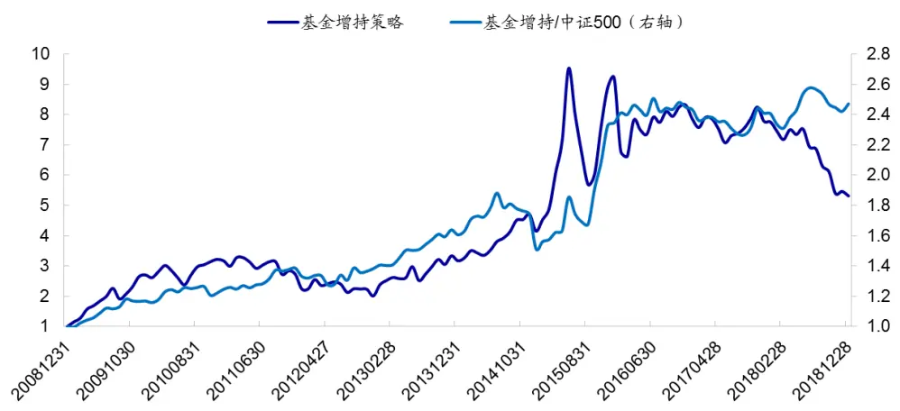
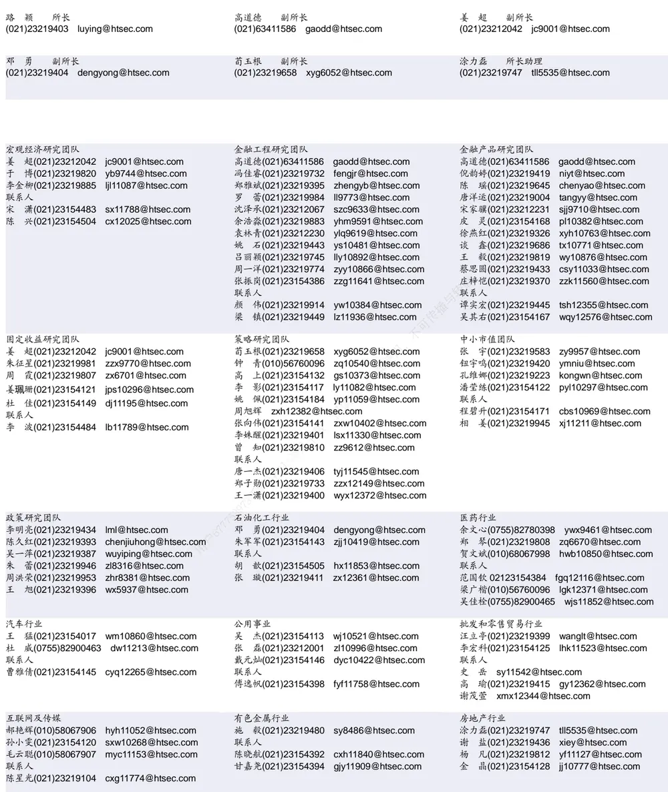

## [Tab相关研究

Table_ReportInfo]《创蓝筹指数及华夏创蓝筹 ETF 产品投

资价值分析》2019.05.22

《行业轮动系列研究 ——基于 模型

的行业配臵策略》2019.05.20

《大类资产配臵及模型研究（十一）——主权财富基金资产配臵的共性与差异》2019.05.09

Tel:(021)23219732

分析师:冯佳睿

Email:fengjr@htsec.com

证书:S0850512080006

分析师:罗蕾

Tel:(021)23219984

Email:ll9773@htsec.com

证书:S0850516080002

# 选股因子系列研究（四十八）——探索 A股的五因子模型

## 投资要点：

因子定价模型是实证金融的基础，它利用少量的共同因子来解释资产收益的变动。
本文介绍了对比多因子模型的主要方法，并基于此探索适合A股市场的五因子模型。

因子定价模型对比方法。对比多因子模型的基础原则是简约性，即模型不应包含冗余因子。相应的模型对比方法主要有传统回归统计和贝叶斯方法两类。传统回归统计法通常用于模型的两两对比，而贝叶斯方法可同时对比多个模型。

- A股的五因子模型。采用常见的因子模型对比方法对 A股的多因子模型进行对比研究发现，后验概率最高的是包含市场、市值、估值、盈利和换手率的五因子模型。从因子形式来看，估值因子适合采用 PE指标构建，盈利因子适合采用 SUE指标构建。

- 因子定价模型的应用。基于因子定价模型可计算事件/异象的超额收益，对基金收播益进行归因，以更好地理解事件/基金收益的主要来源，分析导致事件收益产生变可动的原因。举例来看，我们可从五因子模型的角度对如下现象进行解释：为什么反转异象在 年表现强于其他年份，而在 年弱于其他年份？为什么使年跑赢市场的主动股票型基金数量明显多于其他年份？

- 风险提示：模型误设风险，因子有效性变化风险。供

近年来，越来越多的金融市场异象（anomaly）被发掘，我们亟需一个基准模型来评判这些异象，理解其收益来源及其代表的系统性风险，以便更好地应用这些异象。这个基准模型就是多因子定价模型。

因子定价模型试图通过少量的因子来构建有效前沿，解释资产收益变动，探讨资产的风险溢价由哪些共同因素决定。除了理解异象、计算异象/事件的超额收益外，多因子定价模型还可用来评价基金、投资组合的表现等。

Fama 和 French（1993）1基于实证结果提出的包含市场、市值和估值因子的三因子模型（FF3），在很长一段时间里是最主要的因子模型。但近年来，海外相继推出了多种版本的多因子模型，那么究竟哪种更适合 A股市场呢？本文将对这个问题进行研究。

全文主要包括两个方面，首先介绍对比多因子模型的主要方法，并基于此探索 A股市场的五因子模型；然后对五因子模型的应用进行举例。

## 1. 多因子模型对比方法

直观来看，因子越多，模型解释能力理应越强。但学术界通常会考量模型简约性（Parsimony），即模型不包括冗余（Redundant）因子。在无风险利率存在的假设条件下，对比多因子模型主要有传统回归统计法和贝叶斯方法。

## 1.1 传统回归统计方法

Francisco Barillas 和 Jay Shanken2 2017 年提出，要对比不同多因子模型，应考察模型对所有收益的解释能力，除了常规的检验资产（分散化组合），还应包括因子收益本身。基于这个观点，他们证明了检验资产对于模型对比并不能提供有效信息，在比较两个多因子模型时，只要使用两个模型的因子互为被解释变量，然后考察回归 alpha 是否显著即可。

在检验 alpha 是否显著为 0时，可采用 t检验，也可采用 GRS F 检验。例如，假设模型 M1 的因子为 f1=（Mkt，HML），模型 M2 的因子为 f2=（Mkt，HML，SMB），则对比模型 M1 和 M2，只需将 SMB 对 f1 进行回归，然后用 T 检验考察回归 alpha 是否显著。若 alpha 显著不为 0，表明 SMB 不能由 M1 解释，M2 相对更优。再如，假设模型 M1 的因子为 f1=（Mkt），模型 M2 的因子为 f2=（Mkt，HML，SMB），则对比模型M1 和 M2 时，只需将 HML 和 SMB 分别对 f1 进行回归，然后用 GRS F 检验 alpha 是否联合为 0。

## 1.2 贝叶斯方法

传统回归统计方法适用于多因子模型的两两对比，若要同时对比 m 个模型：$\left\{M_{j}\right\}_{j=1,\cdots,m}$ ，则可采用贝叶斯方法。假设这 m 个模型一共包含 K个因子，记为 F。由于资产定价模型通常包含市场因子，不失一般性，我们假设对比的模型 $\left\{M_{j}\right\}_{j=1,\cdots,m}$ 都包含市场因子 Mkt。此外，市场还有 N 个检验资产 r。

根据贝叶斯定理，在给定数据集 D（所有因子 F和检验资产 r，即 $\mathsf{D}=(\mathsf{F},\mathsf{r})$ 下，模型 $\mathsf{M}_{\mathrm{j}}$ 的后验概率为：

$$
P(M_j|D)=\frac{P(M_j)\cdot P(D|M_j)}{\sum_{i}P(M_i)\cdot P(D|M_i)}\tag{1}
$$

其中，P(M)为先验概率，通常假定为均匀分布，即每个模型的先验概率相同。也可以是其他先验分布，如给理论基础更强的模型更高的概率。若要对比两个模型或特定几个模型，则将其他模型的先验概率设为 0即可。P(D|M)是给定模型 $\mathsf{M}_{\mathrm{j}}$ 下，D的概率。

从上式可看出，要求得模型的后验概率，关键在于计算 P(D|M)，即给定模型 M时，D 的概率。假设模型 M 除 Mkt 外还包含 L 个因子，记为 f；F 中除 f 和 Mkt 以外的因子记之为 f*，则数据 D等价为(Mkt，f，f*，r)。

P(D|M)是模型 M 相关参数的联合密度，下称为似然函数，记为 ML(M)。由于数据 D由(Mkt，f，f*，r)组成，因此似然函数可写成如下边缘密度和条件密度的乘积：（1）f 的边缘密度，乘以（2）给定 Mkt和 f 时 f*的条件密度，乘以（3）给定(Mkt，f，f*)=F 时 r的条件密度。即模型 M下的似然函数 ML为：

$$
\mathbb{ML}=\mathbb{P}(D|M)=ML_{u}(f|Mkt)\times ML_{R}(f^{*}|Mkt,f)\times ML_{R}(r|Mkt,f,f^{*})\tag{2}
$$

其中， $\mathbb{ML}_{\mathsf{u}}$ 代表不受限制的似然函数， $\mathbb{ML}_{\mathsf{R}}$ 代表受限制（alpha=0）的似然函数。ML（f|Mkt）代表被解释变量为 f、解释变量为 Mkt时，模型的似然函数；同样地，ML（f* | Mkt，f）代表被解释变量为 f*、解释变量为（Mkt，f）时，模型的似然函数。似然函数的具体计算参见附录 6.1。

给定 F=（Mkt，f，f*）时，r 的条件概率对于任一模型 $\left\{M_{j}\right\}_{j=1,\cdots,m}$ 都相同，即公式（2）中等式右边第三项 $ML_{R}$ (r|Mkt, $f,f^{*})$ 相同。因此，在模型后验概率公式（1）中，可以同时从分子和分母中移除该项，模型对比结果不受检验资产 r 的影响，这是用贝叶斯方法比较多因子模型的关键。

此外，因子通常有多种构建方法。例如，估值因子可以基于 PE 构建（记为 $\mathsf{F_{PE}}$ 低 PE 与高 PE组合收益差），也可以基于 PB构建（记为 $\mathsf{F}_{\mathsf{PB}},$ ，低 PB与高 PB组合收益差），这些同类因子之间存在较强的相关性。为防止过拟合以及出于模型精简性考虑，它们不应同时出现在模型中。那么，怎么将这种不包含同类因子的先验信息包含在贝叶斯方法中呢？我们可以考虑贝叶斯分类方法。

对于上文假设的 K 个因子，以 w 代表这 K 个因子的一种形式。例如，对于包含市场、市值和估值的三因子模型而言，{ Mkt，SMB， $\mathsf{F_{PE}}$ }是 3因子的一种形式，{ Mkt，SMB， $\mathsf{F_{PB}}\}$ 是另外一种三因子形式（本文中 $\{f_{0}\}$ 代表因子为 $f_{0}$ 的多因子模型）。

同样参考 Barillas 和 Shanken 的结论，求解因子分类模型的后验概率主要包括以下三个步骤：（1）对于每一种因子形式 w，求得在这种形式下各个模型 M 的似然函数ML(M|w)；（2）求得因子形式 w的后验概率；（3）将每一种因子形式 w的后验概率与给定 w 下模型 M 的概率相乘，然后求和即为分类模型的后验概率。具体计算公式参见附录 6.2。

## 2. A股多因子模型对比

本部分主要采用前文总结的几种模型对比方法，考察适用于 A股的因子定价模型。

## 2.1 传统回归统计

传统回归统计方法操作简单，在对比两个多因子模型时，只需将两个模型的因子互为被解释变量进行时间序列回归，然后考察回归 alpha 是否显著即可。但这种方法仅允许模型的两两对比，不能同时对比多个模型。通常而言，若要对比一类因子的两种形式，可采用传统回归统计方法。本节我们采用传统回归统计方法考察适合 A股的估值因子形式和盈利因子形式。

## 估值因子形式

FF3 模型是因子定价理论的经典模型，解释变量由市场、市值和估值三个因子构成。估值因子有多种形式，如 PB、PE等。我们采用传统回归统计的方法对 A股估值因子适合的构建方式进行探讨。

考虑如下两个模型，M1 为{ Mkt，SMB1， $\mathsf{F_{PB}}\}$ ，M2 为{ Mkt，SMB2， $\mathsf{F}_{\mathsf{PE}}\}$ 。两个模型下的市场收益 Mkt均为Wind全 A指数相对于国债 1 个月到期收益率的超额收益。M1 的因子（SMB1， $\mathsf{F_{PB}}$ ）是基于市值和 PB双重分组求得，而 M2 的因子（SMB2， $\mathsf{F}_{\mathsf{PE}})$ 基于市值和 PE双重分组求得。

图1 因子分组方法示意
资料来源：海通证券研究所整理

因子收益的计算则采用与 Fama-French相同的 2*3 分组方法，即对于市值以中位数为分界点，将全市场股票分为 2 组；对于估值，以 30%、70%为分界点，将股票分为 3组；然后取交集得到 $2^{\star}3{=}6$ 个组合（如下图所示）。

市值因子收益SMB即为3个小市值组合收益均值与3个大市值组合收益均值之差，估值因子收益为 2 个低估值组合收益均值与 2 个高估值组合收益均值之差。在下文的因子计算中，我们统一采用这种与估值因子相同的 2*3 分组取交集的方法。

按照前文所述，要对比模型 和 ，只需将两个模型的因子互为被解释变量，然后检验 alpha 是否为 0 即可。从下表的 t检验结果来看，SMB2 和 $\mathsf{F_{PE}}$ 在模型 M1下的月度 alpha 分别为 0.38%和 0.86%，t 值大于 4，统计显著。表明因子模型 M1 不能解释SMB2 和 $\mathsf{F_{PE}}$ 的变动，存在显著定价偏误。反过来， 和 $\mathsf{F_{PB}}$ 在模型 下的月度alpha 分别为-0.10%和-0.29%，统计不显著，无法拒绝 SMB1 和 $\mathsf{F_{PB}}$ 被 M2 合理定价的零假设。从这个比较结果来看，M2比 M1 更适合 A股市场。

表 1 不同估值指标下的三因子模型对比（2009-2018）

| 86日 | 模型 M1（因子：SMB1、 $\mathbf{F}_{\mathsf{PB}})$ | 模型 M2（因子：SMB2、 $\mathbf{F}_{\mathsf{PE}})$ |
| --- | --- | --- |
| alpha及t统计量 01 |  |  |
| SMB2 | 0.38% |  |
| 用户677753973于 | 4.35 |  |
| $\mathsf{F_{PE}}$ | 0.86% |  |
|  | 4.86 |  |
| SMB1 |  | -0.10% |
|  |  | -1.26 |
| $\mathsf{F_{PB}}$ |  | -0.29% |
|  |  | -0.98 |
| GRS F统计量及p值 |  |  |
| SMB2、 $\mathsf{F_{PE}}$ | 15.22 | 1.17 |
| SMB1、 $\mathsf{F_{PB}}$ | 0.0000 | 0.3138 |

资料来源： ，海通证券研究所

另一方面，从 GRS F 统计量来看，在 M1模型下，SMB2 和 $\mathsf{F_{PE}}$ 的 alpha 联合为 0的 GRS F 统计量为 15.22，显著不为 0，表明这两个因子未被 M1 合理定价。而在 M2模型下，SMB1 和 $\mathsf{F_{PB}}$ 的联合 GRS F 统计量为 1.17，相应的 p值为 0.31，不能拒绝模型 M2 对 SMB1 和 $\mathsf{F_{PB}}$ 合理定价的零假设。GRS F 统计也表明，M2比 M1 表现更优。

总结来看，在传统的回归统计方法下，A股 FF3 因子模型中的估值因子更适合采用PE指标构建。

## 盈利因子形式

最常见的盈利因子构建指标有 ROE 和 SUE 两种，对应的因子分别记之为 $\mathsf{F}_{\mathsf{ROE}}$ 和$\mathsf{F_{SUE}}$ 。我们以 FF3 因子模型为基础，采用传统回归统计方法对比这两个因子。

考虑如下两个模型：M1 为{ Mkt，SMB， $\mathsf{F_{PE}}$ ，FROE }，M2 为{ Mkt，SMB， $\mathsf{F_{PE}}$ F }。即 M1 除市场、市值、PE三因子外，还包含 ROE因子；M2 除市场、市值、PE因子外，还包含 SUE 因子。在传统回归方法下，只需将 $\mathsf{F_{SUE}}$ 对 M1 回归、 $\mathsf{F}_{\mathsf{ROE}}$ 对 M2回归，然后考察其截距项是否显著即可。

下表展示了两种盈利因子形式的对比结果。 $\mathsf{F}_{\mathsf{ROE}}$ 在包含 $\mathsf{F_{SUE}}$ 的 M2 模型下，回归截距项为-0.12%，统计不显著；而 $\mathsf{F_{SUE}}$ 在包含 $\mathsf{F}_{\mathsf{ROE}}$ 的 M1 模型下，回归截距项为 0.49%，显著大于 0。从传统回归方法来看，A股的盈利因子更适合采用 SUE 指标构建。

表 2 传统回归统计方法下，不同盈利因子形式的对比（2009-2018）

|  | alpha 及t 统计量 |  |
| --- | --- | --- |
|  | 因子均值及t统计量 模型 M1{ Mkt， SMB， | $\mathsf{F}_{\mathsf{PE}},\;\mathsf{F}_{\mathsf{ROE}}\}$ 模型 M2{ Mkt, SMB, $\mathsf{F}_{\mathsf{PE}},\mathsf{F}_{\mathsf{SUE}}\}$ |
| $\mathsf{F_{svE}}$ | 0.89% | 0.49% |
| 5.36 | 4.04 |  |
| $\mathsf{F_{ROE}}$ 0.70% |  | -0.12% |
| 2.87 | 番与转载 | -0.74 |

资料来源：Wind，海通证券研究所

综上所述，在对比因子形式时，传统回归统计是一种简单易行的方法。从 股实证结果来看，在因子定价模型中，估值因子适合采用 PE指标构建，盈利因子适合采用 SUE指标构建。

## 2.2 贝叶斯方法

如前所述，传统回归方法适合于模型的两两对比。若要同时对比多个模型，并在其中找到既简约，解释能力又强的因子模型，则更适合采用贝叶斯方法。

除市场收益外，考察 5 个备选因子：市值、PE、反转、换手率和 ROE，因子收益计算采用与前文相同的 2*3 分组方法，分别记为：SMB、 $\mathsf{F}_{\mathsf{PE}},$ 、F 、F 、F 。样本区间为 2009 年至 2018 年。如下表所示，在此期间，市值因子月均收益 1.31%，相应信息比 0.98；PE因子收益相对较低，月均 0.62%，信息比 0.51。

表 3 因子收益（2009.01-2018.12）

|  | SMB | $\mathsf{F_{PE}}$ | $\mathsf{F_{Pret}}$ | $\mathbf{F_{Ium}}$ | $\mathsf{F}_{\mathsf{ROE}}$ |
| --- | --- | --- | --- | --- | --- |
| 月均收益 | 1.31% | 0.62% | 1.05% | 1.05% | 0.70% |
| 年化波动率 | 4.65% | 4.22% | 3.74% | 4.34% | 2.68% |
| T值 | 3.09 | 1.61 | 3.07 | 2.65 | 2.87 |
| 信息比 | 0.98 | 0.51 | 0.97 | 0.84 | 0.91 |

资料来源：Wind，海通证券研究所

基于 5 个备选因子一共可形成 $2^{5}-1=31$ 个模型（至少包含一个备选因子），下表展示了这 31 个模型中，后验概率最高的 5个模型。其中，{ Mkt、SMB， $\mathsf{F}_{\mathsf{PE}},$ ，F ， $\mathsf{F_{Turn})}$ 五因子模型后验概率最高，为 47.81%，即包含市场、市值、估值、盈利和换手率的五因子模型表现最优。其次为{ Mkt，SMB， $\mathsf{F_{ROE},~F_{Turn}\}$ 四因子模型，后验概率 24.22%。

表 4 后验概率最高的 5个模型（2009-2018）

| 后验概率 |  |
| --- | --- |
| Mkt、SMB、 $\mathsf{F}_{\mathsf{PE}},$ FROE、 $\mathsf{F_{Tum}}$ 47.81% |  |
| Mkt、SMB、FROE、 $\mathsf{F_{Tum}}$ | 24.22% |
| Mkt、SMB、 $\mathsf{F}_{\mathsf{PE}},$ $\mathsf{F}_{\mathsf{ROE}},$ $\mathsf{F_{Tumv}}$ $\mathsf{F_{Pret}}$ | 17.44% |
| Mkt、SMB、 $\mathsf{F}_{\mathsf{ROE}},$ $\mathsf{F_{Iumv}}$ $\mathsf{F_{Pret}}$ | 8.05% |
| Mkt、SMB、 $\mathsf{F}_{\mathsf{PE}},$ $\mathsf{F}_{\mathsf{ROE}}$ 1.50% |  |

资料来源：Wind，海通证券研究所

## 2.3贝叶斯分类方法

前面两小节中，我们根据传统统计方法比较了同类因子的不同形式，根据贝叶斯方法计算了由一系列备选因子组成的多因子模型后验概率。本节我们采用贝叶斯分类方法将两种对比综合起来，即在包含同类因子不同形式的一系列备选因子中，选择后验概率最高的多因子模型。

除市场因子外，考察如下五类因子：（1）市值因子 SMB；（2）估值因子两种形式，$\mathsf{F_{PE}}$ 和 $\mathsf{F_{PB};}$ ；（3）盈利因子两种形式， $\mathsf{F}_{\mathsf{ROE}}$ 和 $\mathsf{F}_{\mathsf{SUE}};$ ；（4）价格反转因子， $\mathsf{F}_{\mathsf{Pret}};$ 和（5）换手率因子 $\mathsf{F_{Turno}}$ 估值因子和盈利因子各有两种形式，包含市场因子的 6 因子一共有$2^{\star}2{=}4$ 种形式，分别是（ ， ， $\mathsf{F}_{\mathsf{PE}:}$ $\mathsf{F_{ROE}},\mathsf{F_{Pret}},\mathsf{F_{Turn}})$ ）、（Mkt，SMB， $\mathsf{F_{PB1}}$ ，F ，$\mathsf{F}_{\mathsf{Pret}},\mathsf{F}_{\mathsf{Tum}})$ 、（Mkt，SMB， $\mathsf{F_{PE}}$ $\mathsf{F_{SUE}}$ ，FPret， $\mathsf{F_{Tum}}$ 、和（Mkt，SMB， $\mathsf{F}_{\mathsf{PB}},$ ，F ，F ，$\mathsf{F_{Turn})}$ ）。任意一种因子形式下可形成 $2^{5}-1=31$ 个因子模型，一共有 31*4=124 个模型。

下表展示了市场以及上述 类共 个因子的基本统计情况。从中可看出， $\mathsf{F}_{\mathsf{Turn}},\mathsf{F}_{\mathsf{ROE}}$ $\mathsf{F_{SUE}}$ $\mathsf{F_{PE}}$ 与市场存在较高的负相关性。市场收益低时，换手率因子、盈利因子和 因子表现好，即市场低迷时，低换手、高盈利、低 的股票存在更高的溢价。此外，同类因子存在较高的时间序列相关性，例如，估值因子 $\mathsf{F_{PE}}$ 和 $\mathsf{F_{PB}}$ 相关系数为 ，盈利因子 $\mathsf{F}_{\mathsf{ROE}}$ 和 $\mathsf{F_{SUE}}$ 相关系数为 0.8。价格反转因子和换手率因子虽然同为技术因子，但两者相关性较低，仅为 0.08，这也是我们在分类模型中把两者视为不同类型的原因。

表 5 因子分类对比模型中，各个因子的风险收益特征（2009.01-2018.12）

|  |  |  |  |  |  |  | 相关性 |  |  |  |  |  |
| --- | --- | --- | --- | --- | --- | --- | --- | --- | --- | --- | --- | --- |
| 因子 | 均值 | 标准差 | T值 | Mkt | SMB | $\mathbf{F}_{\mathsf{PB}}$ | $\mathsf{F_{PE}}$ | $\mathsf{F_{ROE}}$ | $\mathbf{F_{sue}}$ | $\mathbf{F_{Pret}}$ |  | $\mathbf{F_{Ium}}$ |
| Mkt | 0.79% | 7.80% | 1.11 | 1.00 | 0.31 | -0.17 | -0.36 | -0.42 | -0.32 |  | -0.04 | -0.50 |
| SMB | 1.31% | 4.65% | 3.09 | 0.31 | 1.00 | -0.62 | -0.71 | -0.52 |  | -0.36 | 0.33 | -0.55 |
| $\mathbf{F}_{\mathsf{PB}}$ | 0.64% | 4.96% | 1.41 | -0.17 | -0.62 | 1.00 | 0.89 | 0.26 |  | 0.14 | -0.07 | 0.68 |
| $\mathsf{F_{PE}}$ | 0.62% | 4.22% | 1.61 | -0.36 | -0.71 | 0.89 | 1.00 | 0.56 | 0.36 |  | -0.03 | 0.78 |
| $\mathsf{F_{ROE}}$ | 0.70% | 2.68% | 2.87 | -0.42 | -0.52 | 0.26 | 0.56 | 1.00 | 0.80 |  | -0.17 | 0.38 |
| $\mathsf{F_{sue}}$ | 0.89% | 1.82% | 5.36 | -0.32 | -0.36 | 0.14 | 0.36 | 0.80 | 1.00 |  | -0.25 | 0.21 |
| $\mathsf{F_{Pret}}$ | 1.05% | 3.74% | 3.07 | -0.04 | 0.33 | -0.07 | -0.03 | -0.17 |  | -0.25 | 1.00 | 0.08 |
| $\mathbf{F_{Ium}}$ | 1.05% | 4.34% | 2.65 | -0.50 | -0.55 | 0.68 | 0.78 | 0.38 |  | 0.21 | 0.08 | 1.00 |

资料来源：Wind，海通证券研究所

下表展示了贝叶斯分类方法下，后验概率最高的 10 个模型及其后验概率。结果显示，{ Mkt、SMB、F 、 $\mathsf{F}_{\mathsf{SUE}}$ $\mathsf{F_{Turn}}$ }五因子模型表现最优，后验概率为 28.17%。也就是包含市场、市值、估值、盈利和换手率的五因子模型表现最优，与前一小节贝叶斯方法得到的后验概率最高模型一致。

表 6 因子分类模型后验概率最高的 10 个模型（2009.01-2018.12）

| 模型包含的因子 | 后验概率 |
| --- | --- |
| Mkt、SMB、 $\mathsf{F}_{\mathsf{PE}},$ FTurn $\mathsf{F_{sue}}$ | 28.17% |
| Mkt、SMB、 $\mathsf{F}_{\mathsf{PE}},$ FTurn、Fsue、 $\mathsf{F_{Pret}}$ | 26.91% |
| Mkt、SMB、Fτurn、 $\mathsf{F_{sue}}$ | 19.67% |
| Mkt、SMB、 $\mathsf{F_{Iumv}}$ $\mathsf{F_{suev}}$ $\mathsf{F_{Pret}}$ | 19.47% |
| Mkt、SMB、FpE、Fsue、FPret | 2.78% |
| Mkt、SMB、 $\mathsf{F}_{\mathsf{PE}},$ $\mathsf{F_{sue}}$ | 1.70% |
| Mkt、FsuE、 $\mathsf{F_{Pret}}$ | 0.40% |
| Mkt、SMB、 $\mathsf{F_{sue}},\mathsf{F_{Pret}}$ | 0.35% |
| Mkt、 $\mathsf{F_{PE}},\mathsf{F_{Tum}},\mathsf{F_{sue}}$ | 0.35% |
| Mkt、 $\mathsf{F_{Tum}},\mathsf{F_{sue}},\mathsf{F_{Pret}}$ | 0.14% |

资料来源：Wind，海通证券研究所

关于因子构建方式，贝叶斯分类方法与传统回归统计方法结论一致。对于估值因子，在对比的 个模型中，包含 $\mathsf{F_{PE}}$ 的模型后验概率之和为 ，而包含 $\mathsf{F_{PB}}$ 的模型后验概率之和为 0.00%。表明估值因子形式中， $\mathsf{F_{PE}}$ 的后验概率更高。对于盈利因子，包含 $\mathsf{F_{SUE}}$ 的模型后验概率之和为 100%，而包含 $\mathsf{F}_{\mathsf{ROE}}$ 的模型后验概率之和为 0.00%。表明盈利因子形式中， $\mathsf{F_{SUE}}$ 的后验概率更高。

从上表也可看出，在后验概率最高的 10 个模型中，估值因子的形式都为 $\mathsf{F_{PE}}$ ，而盈利因子的形式都为 $\mathsf{F}_{\mathsf{SUE}},$ ，表明估值因子更适合采用 PE指标构建，盈利因子更适合采用SUE 指标构建。

总结来看，根据贝叶斯模型，A 股后验概率最高的模型是包含市场、市值、估值、盈利和换手率的五因子模型。从因子形式来看，无论是传统回归法还是贝叶斯方法，都表明估值因子中 $\mathsf{F_{PE}}$ 优于 $\mathsf{F_{PB}}$ ，盈利因子中 $\mathsf{F_{SUE}}$ 优于 $\mathsf{F}_{\mathsf{ROE}}$ 。

## 3. 五因子模型的应用

因子定价模型是实证金融的基础，基于因子模型可计算事件 异象的超额收益、理解事件收益来源，此外，还可用来来评价基金、组合的表现。本部分我们利用上一节得到的五因子模型{ Mkt、SMB、 $\mathsf{F_{PE}}$ $\mathsf{F_{SUE}},\mathsf{F_{Turn}}\}$ ，对因子定价模型的应用进行举例说明。

## 3.1计算事件/异象的超额收益

## 基金增持事件

本节以基金增持事件为例，展示五因子模型对事件收益的归因分析。我们根据基金季报计算“基金持股和 A 股流通股本之比”，并选择基金持股比例上升最多的 100 只股票构建等权组合。2009 年至 2018 年，策略年化收益 20.14%，相对于中证 500 指数年化超额 10.23%。从统计显著性来看，组合月均收益 1.84%，相对于中证 500 指数月均超额 0.84%，相应的 t值为 2.70，统计显著。

图2 基金增持策略累计净值

资料来源： ，海通证券研究所

如下表所示，采用五因子模型对策略收益归因可发现，策略风险调整后的月均收益仅为 0.36%，t 值 1.25，统计不显著。也就是在剔除五因子影响后，基金增持事件本身并不存在显著收益。

表 7 基金增持策略的月度收益表现（2009-2018）

|  | 基金增持策略 | 中证 500 指数 | 相对于指数超额 | 五因子模型 alpha |
| --- | --- | --- | --- | --- |
| 月均收益 | 1.84% | 0.98% | 0.86% | 0.36% |
| t值 | 2.13 | 1.30 | 2.70 | 1.25 |

资料来源： ，海通证券研究所

市场、市值、PE、SUE、换手率五因子模型对基金增持策略的收益解释能力高达94.3%。从收益分解来看，策略月度 1.84%的收益有 38.20%来源于市场，42.96%来源于小盘效应，仅 19.47%来源于事件本身。

表 8 基金增持策略在五因子模型下的收益分解（2009-2018）

| 基金增持策略在五因子模型下的alpha 和因子载荷 |  |  |  |  |  |  |  |
| --- | --- | --- | --- | --- | --- | --- | --- |
|  | a | β（Mkt) | β(SMB) | β(FPE) | β(FsSUE) | β(FTurn) | R方 |
| 系数 | 0.36% | 0.89 | 0.57 | -0.43 | 0.32 | -0.02 | 94.31% |
| t值 | 1.25 | 27.21 | 8.79 | -4.08 | 2.42 | -0.27 |  |
| p值 | 0.2141 | 0.0000 | 0.0000 | 0.0001 | 0.0171 | 0.7895 |  |
| 基金增持策略收益分解 |  |  |  |  |  |  |  |
|  | alpha | 市场 | 市值 | PE | SUE | 换手率 | 总收益 |
| 收益分解 | 0.36% | 0.70% | 0.79% | -0.27% | 0.28% | -0.02% | 1.84% |
| 收益贡献占比 | 19.47% | 38.20% | 42.96% | -14.69% | 15.39% | -1.34% | 100% |

资料来源：Wind，海通证券研究所

## 计算异象的超额收益

本节我们采用五因子模型计算常见异象（如盈利能力异象、流动性异象等）的超额收益，并分析其收益来源。

异象计算采用 2*3 分组方法。以异质波动率异象为例，我们先根据市值将全市场股票按照 50%分位点（中位数）分为 2 组；然后分别在小市值组和大市值组中，计算异质波动率最低的 30%股票相对于最高的 30%股票的市值加权组合收益差；最后将小市值组和大市值组中的异质波动率极端组多空收益差取等权平均，即为全市场波动率异象。

下表统计了 5种 A股异象（PB 异象、反转异象、波动率异象、流动性异象、ROE异象）的月均收益以及在五因子模型下的回归结果。从中可看出，除 PB 异象外，其他四个异象都存在显著为正的收益表现：反转、波动率和流动性异象月均收益均超过 1%，ROE 异象月均收益为 0.58%。但它们在五因子模型下的超额收益都不再显著，alpha 基本都低于 0.5%。由此表明，前文所构造的五因子是这五个异象收益的主要来源。

表 9 A股常见异象在五因子模型下的回归结果（2009-2018）

|  |  | a | β(Mkt) | β(SMB) | β(FPE) | β(Fsue) | $\beta(\mathsf{F}_{\mathsf{Tum}}$ D | 异象月均 收益 |
| --- | --- | --- | --- | --- | --- | --- | --- | --- |
| PB 异象 | 系数 | 0.37% | 0.089 | -0.059 | 1.135 | -0.546 | 0.015 | 0.60% |
|  | t值 | 1.69 | 3.38 | -1.11 | 13.43 | -5.67 | 0.23 | 1.34 |
|  | p值 | 0.093 | 0.001 | 0.267 | 0.000 | 0.000 | 0.822 | 0.181 |
| 反转 异象 | 系数 | 0.69% | -0.045 | 0.471 | 0.357 | -0.553 | 0.068 | 1.09% |
|  | t值 | 1.78 | -0.97 | 5.11 | 2.41 | -3.28 | 0.57 | 3.18 |
|  | p值 | 0.077 | 0.333 | 0.000 | 0.018 | 0.001 | 0.571 | 0.002 |
| 波动率 异象 | 系数 | 0.21% | -0.045 | 0.185 | 0.339 | -0.006 | 0.556 | 1.16% |
|  | t值 | 1.24 | -2.17 | 4.51 | 5.13 | -0.07 | 10.47 | 3.45 |
|  | p值 | 0.218 | 0.032 | 0.000 | 0.000 | 0.941 | 0.000 | 0.001 |
| 流动性 异象 | 系数 | 0.28% | -0.011 | 0.567 | -0.450 | 0.257 | 0.300 | 1.27% |
|  | t值 | 1.41 | -0.46 | 11.87 | -5.85 | 2.94 | 4.85 | 3.66 |
|  | p值 | 0.160 | 0.645 | 0.000 | 0.000 | 0.004 | 0.000 | 0.000 |
| ROE 异象 | 系数 | 0.01% | -0.066 | -0.087 | 0.120 | 0.857 | -0.040 | 0.58% |
|  | t值 | 0.04 | -3.36 | -2.22 | 1.91 | 11.99 | -0.80 | 2.31 |
|  | p值 | 0.966 | 0.001 | 0.028 | 0.058 | 0.000 | 0.424 | 0.023 |

资料来源： ，海通证券研究所

举例来看，反转异象在市值因子、估值因子上存在显著为正的暴露，在 SUE 因子上存在显著为负的暴露。表明当市值因子、估值因子表现好时，反转异象更强；而 SUE因子表现好时，反转异象相对较弱。

例如，2015 年，市值因子月均收益高达 5.73%，远高于其他年份平均水平 0.84%；同时 SUE 因子月均收益 0.50%，低于其他年份平均水平 0.93%。相应地，反转异象表现也优于大部分年份，月均收益达 3.40%（其他年份平均水平为 0.84%）。再如 2017 年，盈利因子 SUE 表现强势，而市值因子表现差，这两个因子的综合表现导致反转异象在2017 年也较弱，月均收益为负。

波动率异象可由市值因子、估值因子和换手率因子解释，当市值因子、估值因子和换手率因子表现好时，波动率异象更强。流动性异象在市值因子、估值因子、SUE因子和换手率因子上的暴露都较高，当市值因子、SUE 因子、换手率因子表现好，PE 因子表现差时，流动性异象更强。盈利能力 ROE 异象则主要由 SUE 因子决定，该异象对SUE 因子的暴露达 0.857。

## 3.2作为基金归因的基准

本节对因子模型在基金收益分析上的应用进行举例。

基金样本池为现存的、成立日期在 3年以上的主动股票型基金（对于转型基金，要求转型为主动股票开放型基金的时间在 3 年以上）。样本基金一共有 139 只，这 139 只基金在 2016-2018 年的平均周度收益为-0.15%，相应的市场指数（以Wind全 A指数表征）周收益均值为-0.23%。从累计收益来看，2016-2018 年所有基金平均累计收益为-23.53%，相对于 Wind 全 A 指数超额 10.90%。

若分年度考察基金相对于市场的超额收益情况，可发现一个有意思的现象：不同年份跑赢市场的主动股票型基金数量可能差异非常大。如下表所示，2016 年，在样本池139 只基金中，有 71 只基金跑赢市场，占比 51.1%；其中显著跑赢市场的基金有 9 只，占比 6.47%。而 2017 年，却有 77.7%的基金跑赢市场，32.37%的基金相对于市场存在显著为正的周度超额收益，显著跑赢市场的基金数量明显高于 2016 年。

表 10 主动股票型基金相对于市场的超额收益

|  | 超额收益周均值 | 正向超额基金数 | 负向超额基金数 | 存在显著正向超额收益基金数 |
| --- | --- | --- | --- | --- |
| 2016 | 0.01% | 71 | 68 | 9 |
| 2017 | 0.19% | 108 | 31 | 45 |
| 2018 | 0.06% | 86 | 53 | 3 |

资料来源： ，海通证券研究所

为什么 2017 年跑赢市场的基金数量更多呢？根据五因子模型对主动股票型基金的整体投资风格进行研究，可在一定程度上解释这个现象。

下表展示了样本池基金在五因子模型下回归 的均值，即基金的因子暴露特征。结果显示，除市场 beta 外，基金在 SUE 因子上的暴露最高，平均为 0.403。在 139 只基金中，有 只基金在 S 因子上都存在显著为正的暴露值。由此表明，S 因子会对基金表现产生较大影响。SUE 因子风格强劲，即盈利能力强的股票表现好时，基金收益高；而 因子收益低时，基金表现相对较差。

2017 年，盈利因子 SUE 周度平均收益为 0.42%，明显高于其他年份（2016 年仅为 0.18%），在一定程度上为基金贡献了相对市场的超额收益。若我们将风格因素对基金收益的影响剔除，即计算基金在五因子模型下的 alpha，则各个年份战胜市场的基金数量并无明显差异：2016 年为 7只、2017 年为 5 只、2018 年为 3 只。

表 11样本池基金在五因子模型下的回归 beta

| 2016-2018 年期间基金在五因子模型下的 beta |  |  |  |
| --- | --- | --- | --- |
| 平均 beta | beta 为正的基金数 | beta为负的基金数 | beta 显著为正的基金数 |
| 市场 0.909 | 139 | 0 | 139 |
| 市值 -0.089 | 42 | 97 | 10 |
| PE -0.025 | 69 | 70 | 18 |
| SUE 0.403 | 127 | 12 | 103 |
| 换手率 -0.159 | 24 | 115 | 1 |
| 样本池基金分年度回归 beta |  |  |  |
|  | 2016-2018 2016 | 2017 | 2018 |
| 市场 | 0.909 0.865 | 0.904 | 0.966 |
| 市值 | -0.089 0.148 | -0.135 | -0.089 |
| PE | -0.025 -0.141 | 0.001 | -0.258 |
| SUE | 0.403 0.448 | 0.388 转载 | 0.551 |
| 换手率 | -0.159 0.078 | -0.204 | -0.108 |
| SUE 因子周度平均收益率 |  |  |  |
| 2016-2018 | 2016 | 2017 | 2018 |
| SUE 0.29% | 0.18% | 0.42% | 0.25% |

资料来源：Wind，海通证券研究所

总结来看，因子定价模型可用来计算事件/异象的超额收益，对基金收益进行归因分析，以更好地理解影响事件/基金收益的主要因素。

## 4. 总结

因子定价模型是实证金融的基础，它利用少量的共同因子来解释资产收益变动。本文介绍了对比多因子模型的主要方法，并基于此探索适合 A股市场的五因子模型。

对比多因子模型的基础原则是简约性，即模型不应包含冗余因子。相应的模型对比方法主要有传统回归统计和贝叶斯方法两类。传统回归统计法通常用于模型的两两对比，而贝叶斯方法可同时对比多个模型。

采用常见的因子模型对比方法对 A股的多因子模型进行对比研究发现，后验概率最高的是包含市场、市值、估值、盈利和换手率的五因子模型。从因子形式来看，估值因子适合采用 PE指标构建，盈利因子适合采用 SUE指标构建。

基于因子定价模型可计算事件/异象的超额收益，对基金收益进行归因，以更好地理解事件/基金收益的主要来源，分析导致事件收益产生变动的原因。

## 5. 风险提示

模型误设风险，因子有效性变化风险。

## 6. 附录

## 6.1似然函数计算

按照 Barillas 和 Shanken 的结论3，对于任意因子为 F、被解释变量为 R 的因子定价模型，不受限制的似然函数 $\mathsf{ML}_{\mathsf{u}}(\mathsf{R}\mid\mathsf{F})$ 正比于：

$$
|F^{\prime}F|^{-N/2}\cdot|S|^{-(T-K)/2}\cdot Q\tag{3}
$$

受限制（alpha=0）的似然函数 ${\mathsf{ML}}_{\mathsf{R}}(\mathsf{R}\mid\mathsf{F}).$ 正比于：

$$
|F^{\prime}F|^{-N/2}\cdot|S_{R}|^{-(T-K)/2}\tag{4}
$$

其中， $\mathbb{S}$ 和 $\mathbb{S}_{\mathsf{R}}$ 分别为 α不受限制和 α 限制为 0 时，残差的最小二乘估计交叉乘积矩阵；|S|为 S的行列式，同样地|F’F|为 F’F 的行列式。Q由以下公式计算得出：

$$
\mathbb{Q}=\left(1+\frac{a}{a+k}W\right)^{-(T-K)/2}\left(1+\frac{k}{a}\right)^{-N/2}\tag{5).}
$$

上式中 $a=(1+Sh(F)^{2})/T$ $k=(Sh_{max}^{2}-Sh(F)^{2})/N,$ Sh(F)为因子 F 所能形成的最大化夏普比（切线组合的夏普比）； $\mathsf{Sh}_{\mathsf{max}}$ 为在因子 F 基础上加入资产 R，预期所能形成的最大夏普比。W 由下式求得，其中， 为模型截距项的最小二乘估计， 是残差协方差矩阵估计， $\widehat{\Omega}$ 是 F 的样本协方差矩阵：

$$
W=\frac{\widehat{\alpha}'\widehat{\Sigma}^{-1}\widehat{\alpha}}{1+\bar{F}'\widehat{\Omega}^{-1}\bar{F}},
$$

结合（1）-（5）即可求得模型 $\mathsf{M}_{\mathrm{j}}$ 的后验概率。

## 6.2分类模型的后验概率

根据全概率公式，模型 M 的后验概率是所有因子形式 $\mathsf{W}$ 下的后验概率与 $\mathsf{W}$ 的概率乘积之和：

$$
\mathbb{P}(M|F)=E_{w|F}[P(M|w,F)]=\sum_{w|F}[P(M|w,F)*P(w|F)].
$$

P(M|w,F)是给定因子形式 w下模型 M的后验概率，可由前面的公式（3）和（4）求出。因子形式 $\mathsf{W}$ 的后验概率可由如下贝叶斯公式求得：

$$
P(w|F)=\frac{P(F|w)*P(w)}{P(F)}=\frac{P(F|w)*P(w)}{\sum_{w}P(F|w)*P(w)}
$$

即 $\mathsf{W}$ 的后验概率取决于先验概率 $\mathsf{P}(W)$ ，以及给定 w时 F 的概率。若关于因子形式 w没有先验信息，则 w 的先验概率 $\mathsf{P}(W)$ 可设臵为均匀分布；给定 w 时 F 的概率按照全概率公式，可以转换成求解给定模型 M时 F的概率：

$$
\mathbb{P}(\mathbb{F}|\mathbf{w})={\sum}_{M|w}P(F|M,w)*P(M|w)={\sum}_{M|w}ML(M|w)*P(M|w)\Bigg]
$$

# 信息披露

分析师声明

[Table冯佳睿yst金融工程研究团队s]

罗蕾金融工程研究团队

本人具有中国证券业协会授予的证券投资咨询执业资格，以勤勉的职业态度，独立、客观地出具本报告。本报告所采用的数据和信息均来自市场公开信息，本人不保证该等信息的准确性或完整性。分析逻辑基于作者的职业理解，清晰准确地反映了作者的研究观点，结论不受任何第三方的授意或影响，特此声明。

## 法律声明

本报告仅供海通证券股份有限公司（以下简称“本公司”）的客户使用。本公司不会因接收人收到本报告而视其为客户。在任何情况下，本报告中的信息或所表述的意见并不构成对任何人的投资建议。在任何情况下，本公司不对任何人因使用本报告中的任何内容所引致的任何损失负任何责任。

本报告所载的资料、意见及推测仅反映本公司于发布本报告当日的判断，本报告所指的证券或投资标的的价格、价值及投资收入可能载会波动。在不同时期，本公司可发出与本报告所载资料、意见及推测不一致的报告。

市场有风险，投资需谨慎。本报告所载的信息、材料及结论只提供特定客户作参考，不构成投资建议，也没有考虑到个别客户特殊的可投资目标、财务状况或需要。客户应考虑本报告中的任何意见或建议是否符合其特定状况。在法律许可的情况下，海通证券及其所属不关联机构可能会持有报告中提到的公司所发行的证券并进行交易，还可能为这些公司提供投资银行服务或其他服务。用

本报告仅向特定客户传送，未经海通证券研究所书面授权，本研究报告的任何部分均不得以任何方式制作任何形式的拷贝、复印件或内复制品，或再次分发给任何其他人，或以任何侵犯本公司版权的其他方式使用。所有本报告中使用的商标、服务标记及标记均为本公本司的商标、服务标记及标记。如欲引用或转载本文内容，务必联络海通证券研究所并获得许可，并需注明出处为海通证券研究所，且仅不得对本文进行有悖原意的引用和删改。载，

根据中国证监会核发的经营证券业务许可，海通证券股份有限公司的经营范围包括证券投资咨询业务。日

海通证券股份有限公司研究所[Table_PeopleInfo]

| 电子行业 |  | 煤炭行业 | 电力设备及新能源行业 |  |
| --- | --- | --- | --- | --- |
|  | 陈 平(021)23219646 cp9808@htsec.com | 李 淼(010)58067998 Im10779@htsec.com | 张一弛(021)23219402 zyc9637@htsec.com |  |
|  | 尹 苓(021)23154119 yl11569@htsec.com | 戴元灿(021)23154146 dyc10422@htsec.com | 房 青(021)23219692 fangq@htsec.com |  |
|  | 谢 磊(021)23212214 xl10881@htsec.com | 吴 杰(021)23154113 wj10521@htsec.com | 曾 彪(021)23154148 zb10242@htsec.com |  |
| 联系人 |  | 联系人 | 徐柏乔(021)23219171 xbq6583@htsec.com |  |
|  | 石 坚(010)58067942 sj11855@htsec.com | 王 涛(021)23219760 wt12363@htsec.com | 联系人 | 陈佳彬(021)23154513 cjb11782@htsec.com |

| 基础化工行业 | 计算机行业 |  | 通信行业 |
| --- | --- | --- | --- |
| 刘 威(0755)82764281 Iw10053@htsec.com | 郑宏达(021)23219392 zhd10834@htsec.com |  | 朱劲松(010)50949926 zjs10213@htsec.com |
| 刘海荣(021)23154130 Ihr10342@htsec.com | 杨 林(021)23154174 | yl11036@htsec.com | 余伟民(010)50949926 ywm11574@htsec.com |
| 张翠翠(021)23214397 zcc11726@htsec.com | 鲁 立(021)23154138 II11383@htsec.com |  | 张 弋 01050949962 zy12258@htsec.com |
| 孙维容(021)23219431 swr12178@htsec.com 联系人 | 于成龙 ycl12224@htsec.com 黄竞晶(021)23154131 hjj10361@htsec.com |  | 张峥青(021)23219383 zzq11650@htsec.com |
| 李 智(021)23219392 lz11785@htsec.com | 联系人 洪 琳(021)23154137 hl11570@htsec.com |  |  |

| 非银行金融行业 |  | 交通运输行业 |  | 纺织服装行业 |  |
| --- | --- | --- | --- | --- | --- |
|  | 孙 婷(010)50949926 st9998@htsec.com |  | 虞 楠(021)23219382 yun@htsec.com | 梁 希(021)23219407 lx11040@htsec.com |  |
|  | 何 婷(021)23219634 ht10515@htsec.com |  | 罗月江（010）56760091 lyj12399@htsec.com | 联系人 |  |
| 联系人 |  |  | 联系人 | 盛 开(021)23154510 | sk11787@htsec.com |
| 李芳洲(021)23154127 Ifz11585@htsec.com |  |  | 李 丹(021)23154401 Id11766@htsec.com | 刘 溢(021)23219748 | ly12337@htsec.com |

| 建筑建材行业 | 机械行业 | 钢铁行业 |
| --- | --- | --- |
| 冯晨阳(021)23212081 fcy10886@htsec.com | 余炜超(021)23219816 swc11480@htsec.com | 刘彦奇(021)23219391 liuyq@htsec.com |
| 潘莹练(021)23154122 pyl10297@htsec.com 联系人 | 耿 耘(021)23219814 gy10234@htsec.com 杨 震(021)23154124 yz10334@htsec.com | 刘 璇(0755)82900465 lx11212@htsec.com 联系人 |
| 申 浩(021)23154114 sh12219@htsec.com | 沈伟杰(021)23219963 swj11496@htsec.com 周 丹 zd12213@htsec.com | 周慧琳(021)23154399 zhl11756@htsec.com |

| 建筑工程行业 |  | 农林牧渔行业 |  | 食品饮料行业 |  |
| --- | --- | --- | --- | --- | --- |
| 杜市伟(0755)82945368 dsw11227@htsec.com |  | 丁 频(021)23219405 dingpin@htsec.com | 可 |  | 闻宏伟(010)58067941 whw9587@htsec.com |
| 张欣劼 zxj12156@htsec.com |  |  | 陈雪丽(021)23219164 cxl9730@htsec.com |  | 成 珊(021)23212207 cs9703@htsec.com |
| 李富华(021)23154134 Ifh12225@htsec.com | 联系人 |  | 陈 阳(021)23212041 cy10867@htsec.com |  | 唐 宇(021)23219389 ty11049@htsec.com |

| 军工行业 |  | 银行行业 |  | 社会服务行业 |
| --- | --- | --- | --- | --- |
|  | 蒋 俊(021)23154170 jj11200@htsec.com |  | 孙 婷(010)50949926 st9998@htsec.com | 汪立亭(021)23219399 wanglt@htsec.com |
|  | 刘 磊(010)50949922 II11322@htsec.com |  | 解巍巍 xww12276@htsec.com | 陈扬扬(021)23219671 cyy10636@htsec.com |
| 张恒晅 zhx10170@htsec.com |  |  | 林加力(021)23214395 Iljl12245@htsec.com | 许樱之 xyz11630@htsec.com |

| 家电行业 |  | 造纸轻工行业 |  |
| --- | --- | --- | --- |
| 陈子仪(021)23219244 chenzy@htsec.com |  |  | 衣桢永(021)23212208 yzy12003@htsec.com |
| 李 阳(021)23154382 | ly11194@htsec.com |  |  |
| 朱默辰(021)23154383 | zmc11316@htsec.com |  |  |
| 联系人 |  |  |  |
| 刘 璐(021)23214390 II11838@htsec.com |  |  |  |

## 研究所销售团队

蔡铁清(0755)82775962 ctq5979@htsec.com

伏财勇(0755)23607963 fcy7498@htsec.com

辜丽娟(0755)83253022 gulj@htsec.com

刘晶晶(0755)83255933 liujj4900@htsec.com

王雅清(0755)83254133 wyq10541@htsec.com

饶 伟(0755)82775282 rw10588@htsec.com

欧阳梦楚(0755)23617160

oymc11039@htsec.com

巩柏含 gbh11537@htsec.com

上海地区销售团队
胡雪梅(021)23219385 huxm@htsec.com
朱 健(021)23219592 zhuj@htsec.com
季唯佳(021)23219384 jiwj@htsec.com
黄 毓(021)23219410 huangyu@htsec.com
漆冠男(021)23219281 qgn10768@htsec.com
胡宇欣(021)23154192 hyx10493@htsec.com
黄 诚(021)23219397 hc10482@htsec.com
毛文英(021)23219373 mwy10474@htsec.com
马晓男 mxn11376@htsec.com
杨祎昕(021)23212268 yyx10310@htsec.com
张思宇 zsy11797@htsec.com
慈晓聪(021)23219989 cxc11643@htsec.com
王朝领 wcl11854@htsec.com
邵亚杰 23214650 syj12493@htsec.com
李 寅 021-23219691 ly12488@htsec.com
北京地区销售团队
殷怡琦(010)58067988 yyq9989@htsec.com
郭 楠 010-5806 7936 gn12384@htsec.com
张丽萱(010)58067931 zlx11191@htsec.com
杨羽莎(010)58067977 yys10962@htsec.com
杜 飞 df12021@htsec.com
张 杨(021)23219442 zy9937@htsec.com
何 嘉(010)58067929 hj12311@htsec.com
李 婕 lj12330@htsec.com
欧阳亚群 oyyq12331@htsec.com

海通证券股份有限公司研究所

地址：上海市黄浦区广东路 689号海通证券大厦 9楼

电话：（021）23219000

传真：（021）23219392

网址：www.htsec.com